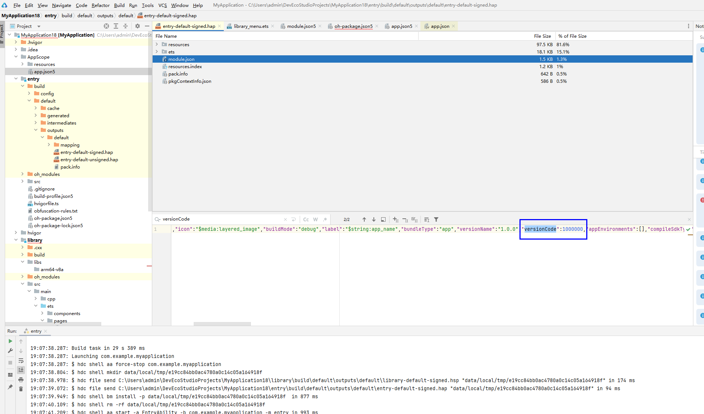

# Bundle Error Codes
<!--Kit: Ability Kit-->
<!--Subsystem: BundleManager-->
<!--Owner: @wanghang904-->
<!--Designer: @hanfeng6-->
<!--Tester: @memghaiyang-->
<!--Adviser: @HelloCrease-->
<!-- md-trans-meta sourceCommit=4ed65a1f272fc46dcb7e8ce0faf8d5df1c93af54 translatedAt=2026-09-03T09:20:59.683Z pushedAt=2026-09-05T10:47:30.204Z -->

> **NOTE**
>
> This topic describes only module-specific error codes. For details about universal error codes, see [Universal Error Codes](../errorcode-universal.md).

## 17700001 Bundle Name Does Not Exist

**Error Message**

The specified bundle name is not found.

**Description**

The specified bundle name is not found.

**Possible Causes**


1. The bundle name is misspelled.
2. The corresponding bundle is not installed.

**Procedure**

1. Check whether the spelling of the bundle name is correct.
2. Run the [dump command](../../tools/bm-tool.md#dump), and check the command output. If the bundle is not installed, an error is reported.
    ```shell
    # Replace **com.xxx.demo** with the actual bundle name.
    hdc shell bm dump -n com.xxx.demo
    ```

## 17700002 Module Name Does Not Exist

**Error Message**

The specified module name is not found.

**Description**

The specified module name is not found.

**Possible Causes**

1. The module name is misspelled.
2. The module is not installed.

**Procedure**

1. Check whether the spelling of the module name is correct.
2. Run the [dump command](../../tools/bm-tool.md#dump), and check whether the module name exists in the list of the **hapModuleNames** field in the output. If not, the module is not installed.
    ```shell
    # Replace **com.xxx.demo** with the actual bundle name.
    hdc shell bm dump -n com.xxx.demo
    ```

## 17700003 Ability Name Does Not Exist

**Error Message**

The specified ability name is not found.

**Description**

The specified ability name is not found.

**Possible Causes**

1. The ability name is misspelled.
2. The application does not have the ability specified by **abilityName**.
3. When [bundleManager.getProfileByAbility](../apis-ability-kit/js-apis-bundleManager.md#bundlemanagergetprofilebyability) or [bundleManager.getProfileByExtensionAbility](../apis-ability-kit/js-apis-bundleManager.md#bundlemanagergetprofilebyextensionability) is used for query based on a combination of ability name and module name, the application does not have the module specified by **moduleName** or the specified ability under that module.

**Procedure**

1. Check whether the spelling of the ability name is correct.
2. Run the [dump command](../../tools/bm-tool.md#dump), and check whether **abilityInfos** under the **hapModuleInfos** field in the output contains an entry where the name equals this ability name. If no such entry is found, the ability name does not exist.
3. Run the [dump command](../../tools/bm-tool.md#dump), and check the **hapModuleNames** field in the output. If the specified module name is not in the list, the application has not installed the module, and the ability under that module also does not exist.
    ```shell
    # Replace **com.xxx.demo** with the actual bundle name.
    hdc shell bm dump -n com.xxx.demo
    ```

## 17700004 User ID Does Not Exist

**Error Message**

The specified user ID is not found.

**Description**

When a user-related interface is called, the user passed in does not exist. <!--Del-->When [BundleInstaller.install](js-apis-installer-sys.md#bundleinstallerinstall) throws this error code, an internal error code is appended to the error message to locate the cause of the error, for example, `[8519687]`. <!--DelEnd-->

**Possible Causes**

1. The entered user ID is incorrect.
2. The user does not exist in the system.

**Procedure**

1. Check whether the spelling of the user ID is correct.
2. Check whether the user exists.
<!--Del-->
## 17700005 appId Is an Empty String

**Error Message**

The specified app ID is an empty string.

**Description**

When the related interface in the [appControl module](../apis-ability-kit/js-apis-appControl-sys.md) is called, the appId passed in is an empty string.

**Possible Causes**

The appId passed in is an empty string.

**Procedure**

Check whether the appId is an empty string.

## 17700006 Permission Does Not Exist

**Error Message**

The specified permission is not found.

**Description**

When the [getPermissionDef interface](../apis-ability-kit/js-apis-bundleManager-sys.md#bundlemanagergetpermissiondef) in the bundleManager module is called, the permission passed in does not exist.

**Possible Causes**

1. The permission name is misspelled.
2. The permission does not exist.

**Procedure**

1. Check whether the spelling of the permission name is correct.
2. Check whether the permission exists.

## 17700007 Incorrect Device ID

**Error Message**

The specified device ID is not found.

**Description**

When a related interface in the [distributedBundleManager module](../apis-ability-kit/js-apis-distributedBundleManager-sys.md) is called, the device ID passed in is incorrect.

**Possible Causes**

1. The device ID is incorrect.
2. The device ID does not exist.

**Procedure**

1. Check whether the device ID is correct.
2. Check whether the device ID exists.
<!--DelEnd-->

## 17700010 Bundle Installation Failure Due to File Parsing Failure

**Error Message**

Failed to install the HAP because the HAP fails to be parsed.

**Description**

<!--Del-->
When the [install interface](../apis-ability-kit/js-apis-installer-sys.md#bundleinstallerinstall) in the installer module is called, <!--DelEnd-->the HAP or APP passed in fails to be parsed. <!--Del-->When [BundleInstaller.install](js-apis-installer-sys.md#bundleinstallerinstall) throws this error code, an internal error code is appended to the error message to locate the cause of the error, for example, `[8519687]`. <!--DelEnd-->

**Possible Causes**

1. The HAP or APP is not in ZIP format.
2. The profile in the HAP is not in JSON format.
3. Necessary fields are missing in the profile.
4. The HAP is configured with an executable binary file (that is, the [executableBinaryPaths tag](../../quick-start/module-configuration-file.md#executablebinarypaths) is configured in module.json5), but the decompression mode is not configured, or the current device does not support installing a HAP configured with this tag.
5. Multiple APPs exist in the passed installation path or directory.
6. The APP does not contain a HAP suitable for installation on the current device type.
7. The application is configured with a skill, but the configured skill name and skill directory name are inconsistent with the name in the frontmatter of SKILL.md.
8. When installing an application on a dual-mode device, different package type categories (the value of ohos.bms.param.deviceModeDistributionPolicy in [installparam](js-apis-installer-sys.md#installparam) is 4, 6, or 8) are supported only for system applications. A non-system application configured with these values cannot be installed. In addition, the newly installed application must keep the same major package type category as the existing application with the same bundle name on the device. "Different package types" and "same package types" (values 0, 1, 2, 3, 5, and 7) cannot be mixed for overwrite installation.

**Procedure**

1. Confirm that the HAP or APP is in ZIP format.
2. Confirm that the configuration file of the HAP complies with the [JSON format of the configuration file](../../quick-start/application-configuration-file-overview-stage.md).
3. Check whether DevEco Studio reports any error when compiling the HAP or APP. A corresponding error is reported when a field is missing.
4. Configure the application to use the decompression mode, that is, set the compressNativeLibs tag to true in the [module.json5 configuration file](../../quick-start/module-configuration-file.md#tags-in-the-configuration-file) of the application; or switch to a PC/2-in-1 device.
5. Check whether the path passed in contains multiple APPs.
6. Check whether the APP contains a HAP that supports the current device type.
7. Check the name of the skill under **skillProfiles** in **module.json**, the name of the subdirectory under the **skills** directory, and the name in the frontmatter of **SKILL.md** to ensure that the three are consistent.
8. Confirm that the application is a system application before configuring different package types. Confirm whether the **ohos.bms.param.deviceModeDistributionPolicy** configuration in the [installparam](js-apis-installer-sys.md#installparam) of the newly installed application and the existing application belongs to the same package type (both different package types or both the same package type), to avoid mutual conversion updates between different package types and the same package type.

## 17700011 Bundle Installation Failure Due to Signature Verification Failure

**Error Message**

Failed to install the HAP because the HAP signature fails to be verified.

**Description**

<!--Del-->
Calling the [install](../apis-ability-kit/js-apis-installer-sys.md#bundleinstallerinstall) API of the installer module fails because <!--DelEnd-->signature verification failure causes application installation failure. <!--Del-->When [BundleInstaller.install](js-apis-installer-sys.md#bundleinstallerinstall) throws this error code, an internal error code is appended to the error message to locate the cause of the error, for example, `[8519687]`. <!--DelEnd-->

**Possible Causes**


1. The HAP or APP is not signed.
2. The source of the HAP or APP signature information is unreliable.
3. The signature information of the HAP to update is different from that of the installed HAP.
4. The signature information of multiple HAPs is inconsistent.

**Procedure**

1. Check whether the HAP or APP is signed successfully.
2. Confirm that the signing certificate of the HAP or APP is applied for from the AppGallery.
3. Confirm that the same certificate is used when signing multiple HAPs.
4. Confirm that the signing certificate of the upgraded HAP is the same as that of the installed HAP.

## 17700012 Bundle Installation Failure Due to Invalid File Path or Too Large File

**Error Message**

Failed to install the HAP because the HAP path is invalid or the HAP is too large.

**Description**

<!--Del-->
When the [install API](../apis-ability-kit/js-apis-installer-sys.md#bundleinstallerinstall) in the installer module is called, <!--DelEnd-->an invalid installation package path or an oversized file causes application installation failure. <!--Del-->When [BundleInstaller.install](js-apis-installer-sys.md#bundleinstallerinstall) throws this error code, an internal error code is appended to the error message to locate the cause of the error, for example, `[8519687]`. <!--DelEnd-->

**Possible Causes**

1. Incorrect input. The file path of the HAP or APP does not exist.
2. The path of the HAP or APP cannot be accessed.
3. The size of the HAP exceeds the maximum limit of 4 GB.

**Procedure**

1. Check whether the HAP or APP exists.
2. Check the executable permission of the HAP or APP to see whether it is readable.
3. Check whether the HAP size exceeds 4 GB.

## 17700015 Bundle Installation Failure Due to Different Configuration Information of Multiple HAPs

**Error Message**

Failed to install the HAPs because they have different configuration information.

**Description**

<!--Del-->
When the [install API](../apis-ability-kit/js-apis-installer-sys.md#bundleinstallerinstall) of the installer module is called, <!--DelEnd-->different configuration information among multiple HAPs causes application installation failure. <!--Del-->When [BundleInstaller.install](js-apis-installer-sys.md#bundleinstallerinstall) throws this error code, an internal error code is appended to the error message to locate the cause of the error, for example, `[8519687]`. <!--DelEnd-->

**Possible Causes**

The field information under the app tag in the configuration files of multiple HAPs or the signing information is inconsistent.

**Procedure**

Confirm whether the fields under the app tag in the configuration files of multiple HAPs are consistent, or check whether the [signingConfigs](https://developer.huawei.com/consumer/en/doc/harmonyos-guides/ide-hvigor-build-profile-app#section153288223224) configuration of the project is the same.

## 17700016 Bundle Installation Failure Due to Insufficient System Disk Space

**Error Message**

Failed to install the HAP because of insufficient system disk space.

**Description**

<!--Del-->
When the [install API](../apis-ability-kit/js-apis-installer-sys.md#bundleinstallerinstall) of the installer module is called, <!--DelEnd-->insufficient system disk space causes application installation failure. <!--Del-->When [BundleInstaller.install](js-apis-installer-sys.md#bundleinstallerinstall) throws this error code, an internal error code is appended to the error message to locate the cause of the error, for example, `[8519687]`. <!--DelEnd-->

**Possible Causes**

Insufficient system space.

**Procedure**

Confirm whether the system has sufficient space.

## 17700017 Bundle Installation Failure Because the Version to Install is Too Earlier

**Error Message**

Failed to install the HAP since the version of the HAP to install is too early.

**Description**

<!--Del-->
When the [install API](../apis-ability-kit/js-apis-installer-sys.md#bundleinstallerinstall) in the installer module is called, <!--DelEnd-->the version of the newly installed application is lower than that of the installed application, which causes application installation failure. <!--Del-->When [BundleInstaller.install](js-apis-installer-sys.md#bundleinstallerinstall) throws this error code, an internal error code is appended to the error message to locate the cause of the error, for example, `[8519687]`. <!--DelEnd-->

**Possible Causes**

The version of the newly installed application is lower than that of the installed application.

**Procedure**

Confirm whether the version of the newly installed application is not lower than that of the installed application with the same name.

1. To query the version of an existing application, run [the dump command](../../dfx/hdc.md#environment-setup). The output contains the version code of the installed application. If multiple version codes are displayed, select the one greater than 0. If no result is displayed, the application is not installed.
    ```shell
    # Replace **com.xxx.demo** with the actual bundle name.
    hdc shell "bm dump -n com.xxx.demo |grep versionCode"
    ```

2. To query the version of a newly installed application, use DevEco Studio to open the HAP or HSP file and check the value of **versionCode** in the **module.json** file.

    <!--Del-->

3. For an installed third-party application whose signing certificate distribution type is **app_gallery** or signing certificate type is **debug**, downgrade installation is supported when the newly installed version is lower than the current version. For details about the parameter configuration, you can refer to the description of **parameters** in [InstallParam](js-apis-installer-sys.md#installparam).

## 17700018 Bundle Installation Failure Because the Dependent Module Does Not Exist

**Error Message**

Failed to install the HAP or HSP because the dependent module does not exist.

**Description**

When installing a HAP or HSP, the dependent module does not exist. When [BundleInstaller.install](js-apis-installer-sys.md#bundleinstallerinstall) throws this error code, an internal error code is appended to the error message to locate the cause of the error, for example, `[8519687]`.

**Possible Causes**

The dependent module is not installed.

**Procedure**

Install the dependent module first.

## 17700020 Failure to Uninstall Preinstalled Applications

**Error Message**

The preinstalled app cannot be uninstalled.

**Description**

When the [uninstall API](../apis-ability-kit/js-apis-installer-sys.md#bundleinstalleruninstall) in the installer module is called to uninstall a preinstalled application, the application cannot be uninstalled.

**Possible Causes**

1. You might want to uninstall a non-preinstalled application but passed the bundle name of a preinstalled app.
2. The preinstalled application cannot be uninstalled.

**Procedure**

1. Check whether the bundle name is correct.
2. Check whether the preinstalled application can be uninstalled.<!--DelEnd-->

## 17700021 Invalid UID

**Error Message**

The specified uid is invalid.

**Description**

When [getBundleNameByUid](../apis-ability-kit/js-apis-bundleManager.md#bundlemanagergetbundlenamebyuid14) in the bundleManager module is called, the specified uid is invalid.

**Possible Causes**

The application corresponding to the passed-in uid does not exist.

**Procedure**

Check whether the corresponding application uid value exists in the system. You can use the [query application information command (dump)](../../tools/bm-tool.md#dump) to view the uid of installed applications. After the command is executed, the uid of the corresponding installed application is output. If multiple uids are output, select one greater than 0. If the command outputs no value, the application is not installed.
```shell
# Replace **com.xxx.demo** with the actual bundle name.
hdc shell "bm dump -n com.xxx.demo |grep uid"
```

<!--Del-->
## 17700022 Invalid Source File

**Error Message**

The input source file is invalid.

**Description**

When the [getBundleArchiveInfo](../apis-ability-kit/js-apis-bundleManager-sys.md#bundlemanagergetbundlearchiveinfo) API of the bundleManager module is called, the passed-in HAP or APP path is invalid.

**Possible Causes**

1. The source file to be parsed does not exist.
2. The source file to be parsed is not in ZIP format.

**Procedure**

1. Check whether the source file to be parsed exists.
2. Check whether the source file to be parsed is in ZIP format.

## 17700023 Default Application Does Not Exist

**Error Message**

The specified default app does not exist.

**Description**

When the [getDefaultApplication](../apis-ability-kit/js-apis-defaultAppManager-sys.md#defaultappmanagergetdefaultapplication) API of the defaultAppManager module is called, the specified default application does not exist.

**Possible Causes**

The device does not have the corresponding default application set.

**Procedure**

Check whether the device has the corresponding default application set. <!--DelEnd-->

## 17700024 Profile Does Not Exist

**Error Message**

Failed to get the profile because the specified profile is not found in the HAP.

**Description**

No corresponding configuration file is found when an API for querying the profile file is called.

**Possible Causes**

1. The metadata name passed in the API does not exist in the profile.
2. The content of the profile is not in JSON format.<!--Del-->
3. The type of the profile to query does not exist.<!--DelEnd-->

**Procedure**

1. Check whether the metadata name in the **ability** or **extensionAbility** to be queried exists.
2. Check whether the content of the profile to be queried is in JSON format.<!--Del-->
3. Check whether the application contains a profile that matches the value of **profileType** passed in.<!--DelEnd-->
<!--Del-->
## 17700025 Invalid Type

**Error Message**

The specified type is invalid.

**Description**

The input type is invalid when an API of the defaultAppManager module is called.

**Possible Causes**

1. The type passed in the API is misspelled.
2. The type passed in the API does not exist.

**Procedure**

1. Check whether the spelling of type is correct.
2. Enter a type that exists.<!--DelEnd-->

## 17700026 Bundle Disabled

**Error Message**

The specified bundle is disabled.

**Description**

The specified application is disabled when an API for querying application information is called.

**Possible Causes**

The corresponding application on the device has been disabled and cannot be queried.

**Procedure**

Check whether the corresponding application on the device is disabled.
<!--Del-->
## 17700027 Distributed Service Is Not Started

**Error Message**

The distributed service is not running.

**Description**

The distributed service is not started when an API of the [distributedBundleManager module](../apis-ability-kit/js-apis-distributedBundleManager-sys.md) is called.

**Possible Causes**

The device is not networked.

**Procedure**

Check whether the device is networked successfully.
## 17700028 Mismatch Between Ability and Type

**Error Message**

The ability does not match the type.

**Description**

When the [setDefaultApplication](../apis-ability-kit/js-apis-defaultAppManager-sys.md#defaultappmanagersetdefaultapplication) API in the defaultAppManager module is called, the input ability does not match the type.

**Possible Causes**

The input ability or type is misspelled.

**Procedure**

Check whether the spelling of the input ability and type is correct.<!--DelEnd-->

## 17700029 Disabled Ability

**Error Message**

The specified ability is disabled.

**Description**

When an API for querying ability-related information is called, the specified ability is disabled.

**Possible Causes**

The specified ability is disabled.

**Procedure**

Check whether the specified ability is disabled. You can use the [bm tool](../../tools/bm-tool.md) to query the corresponding application information.
<!--Del-->
## 17700030 Failure in Clearing Cache Files

**Error Message**

The specified bundle does not support clearing of cache files.

**Description**

When the [cleanBundleCacheFiles interface](../apis-ability-kit/js-apis-bundleManager-sys.md#bundlemanagercleanbundlecachefiles) in the bundleManager module is called, the specified application does not support clearing of cache files.

**Possible Causes**

The specified application is a system application, and the **AllowAppDataNotCleared** field is configured in its signing certificate.

**Procedure**

1. Check whether the application is a system application. You can use [Bundle Manager](../../tools/bm-tool.md) to query the application information and check whether the value of **isSystemApp** is **true**.
2. Check whether the **AllowAppDataNotCleared** field is configured for the application. You can use [Bundle Manager](../../tools/bm-tool.md) to query the application information and check whether the value of **userDataClearable** is **true**.

## 17700031 HAP Installation Fails Due to Overlay Feature Verification Failure

**Error Message**

Failed to install the HAP because the overlay check of the HAP failed.

**Description**

When installing an application with the overlay feature, the specified application and the overlay-feature application to be installed are not preset applications, or the target application/target module is an application/module with the overlay feature. When [BundleInstaller.install](js-apis-installer-sys.md#bundleinstallerinstall) throws this error code, an internal error code is appended to the error message to locate the cause of the error, for example, `[8519687]`.

**Possible Causes**

1. To use the overlay feature between applications, the following conditions must be met:<br>The application with the overlay feature must be a preset application.
2. The target application must be a preset application.
3. The target application cannot be an application with the overlay feature.
4. The target module cannot be a module with the overlay feature.

**Procedure**

1. Ensure that the application with the overlay feature is a preset application.
2. Ensure that the target application is a preset application.
3. Check whether the target application is not an application with the overlay feature.
4. Ensure that the target module is not a module with the overlay feature.<!--DelEnd-->

## 17700032 Application Does Not Contain a Module with the Overlay Feature

**Error Message**

The specified bundle does not contain any overlay module.

**Description**

When querying the overlayModuleInfo of an overlay-feature module in the specified application, the specified application does not contain any overlay-feature module.

**Possible Causes**

The specified application does not contain any overlay-feature module.

**Procedure**

Check whether the specified application does not contain any overlay-feature module.

## 17700033 Module Is Not Configured with the Overlay Feature

**Error Message**

The specified module is not an overlay module.

**Description**

When querying the overlayModuleInfo of the specified overlay-feature module, the specified module is not an overlay-feature module.

**Possible Causes**

The specified module is not an overlay-feature module.

**Procedure**

Check whether the specified module is not an overlay-feature module.

## 17700034 Module Is Configured with the Overlay Feature

**Error Message**

The specified module is an overlay module.

**Description**

When querying the overlayModuleInfo associated with the specified target module, the specified module is an overlay-feature module.

**Possible Causes**

The specified module is an overlay-feature module.

**Procedure**

Check whether the specified module is an overlay-feature module.
<!--Del-->
## 17700035 Application Contains Only Modules with the Overlay Feature

**Error Message**

The specified bundle is an overlay bundle.

**Description**

When querying the overlayModuleInfo associated with the target module of the specified application, the specified application contains only overlay-feature modules.

**Possible Causes**

The specified application contains only modules with the overlay feature.

**Procedure**

Check whether the specified application contains only modules with the overlay feature.

## 17700036 Failure in Installing the Shared Library Because of No AllowAppShareLibrary Privilege

**Error Message**

Failed to install the HSP due to the lack of required permission.

**Description**

The shared library has not applied for the AllowAppShareLibrary privilege, which may pose security and privacy risks, so its installation is not allowed. When [BundleInstaller.install](js-apis-installer-sys.md#bundleinstallerinstall) throws this error code, an internal error code is appended to the error message to help locate the cause of the error, for example, `[8519687]`.

**Possible Causes**

The AllowAppShareLibrary privilege was not applied for before the shared library was released.

**Procedure**

Apply for the AllowAppShareLibrary privilege for the shared library, re-sign it, and release it.

## 17700037 Failure in Uninstalling the Shared Library Due to Dependency

**Error Message**

The version of the shared bundle is dependent on other applications.

**Description**

When a version of a shared library is uninstalled, the specified version of the shared library is depended on by other applications, causing the uninstallation to fail.

**Possible Causes**

1. The version specified during the uninstall is the latest version of the shared library, and the shared library is depended on by other applications.
2. No version is not specified during the uninstall, meaning that all versions of the shared library will be uninstalled, and the shared library is depended on by other applications.

**Procedure**

1. Check whether the shared library to uninstall is depended on by other applications.
2. Check whether the version of the shared library to uninstall is the latest version of the shared library.

## 17700038 Shared Library to Uninstall Does Not Exist

**Error Message**

The specified shared bundle does not exist.

**Description**

When a shared library is uninstalled, the shared library to be uninstalled does not exist.

**Possible Causes**

1. The version specified for uninstallation does not exist in the shared library to be uninstalled.
2. The shared library specified for uninstallation does not exist on the device.

**Procedure**

1. Check whether the shared library exists.
2. Check whether the version of the shared library is the same as that installed.

## 17700039 Failure in Installing an Inter-Application Shared Library
**Error Message**

Failed to install the HSP because installing a shared bundle specified by hapFilePaths is not allowed.

**Description**

During application installation, the installation package passed in is of the shared library type shared between applications. When [BundleInstaller.install](js-apis-installer-sys.md#bundleinstallerinstall) throws this error code, an internal error code is appended to the error message to help locate the cause of the error, for example, `[8519687]`.

**Possible Causes**

1. When [Bundle Manager](../../tools/bm-tool.md) is used to install an application, the **-p** parameter is set to the installation package path of an inter-application shared library.
2. When the [install](../apis-ability-kit/js-apis-installer-sys.md#bundleinstallerinstall) API is called to install an application, the **hapFilePaths** parameter is set to the installation package path of an inter-application shared library.

**Procedure**

1. Use the **-p** parameter to specify the installation package path of an inter-application shared library.
2. Use the **sharedBundleDirPaths** parameter in **installParam** to specify the installation package path of an inter-application shared library.

## 17700040 Failure in Uninstalling an Inter-Application Shared Library
**Error Message**

The specified bundle is a shared bundle which cannot be uninstalled.

**Description**

During application uninstallation, the bundle name passed in is that of a shared library shared between applications.

**Possible Causes**

1. When [Bundle Manager](../../tools/bm-tool.md) is used to uninstall an application, the **-n** parameter is set to the bundle name of an inter-application shared library.
2. hen the [uninstall](../apis-ability-kit/js-apis-installer-sys.md#bundleinstalleruninstall) API is called to uninstall a bundle, the **bundleName** parameter is set to the bundle name of an inter-bundle shared library.

**Procedure**

1. Use the **-n** parameter to specify the application to be uninstalled as a shared library application.
2. Use the **bundleName** and **versionCode** parameters in **UninstallParam** to specify the bundle name and version of the shared library to be uninstalled.

## 17700041 Application Installation Is Not Allowed by Enterprise Device Management
**Error Message**

Failed to install the HAP because the installation is forbidden by enterprise device management.

**Description**

During application installation, the [admin permission management](../../reference/apis-mdm-kit/js-apis-enterprise-adminManager.md) disallows the installation. When [BundleInstaller.install](js-apis-installer-sys.md#bundleinstallerinstall) throws this error code, an internal error code is appended to the error message to help locate the cause of the error, for example, `[8519687]`.

**Possible Causes**

Enterprise device management disallows the installation of this application.

**Procedure**

Check on the device whether the application is prohibited from being installed by enterprise device management.

## 17700042 Incorrect URI in the Data Proxy
**Error Message**

Failed to install the HAP because of incorrect URI in the data proxy.

**Description**

The URI in the data proxy is incorrectly configured during application installation. When [BundleInstaller.install](js-apis-installer-sys.md#bundleinstallerinstall) throws this error code, an internal error code is appended to the error message to help locate the cause of the error, for example, `[8519687]`.

**Possible Causes**

1. The bundle name in the URI is different from that of the current application.
2. The URI is duplicate.

**Procedure**

1. Change the bundle name in the URI to that of the current application.
2. Change duplicate URIs. Ensure that the URI of each data proxy is unique.

## 17700043 Incorrect Permission Configuration in the Data Proxy
**Error Message**

Failed to install the HAP because of low APL in the non-system data proxy (required APL: system_basic or system_core).

**Description**

The APL of the data proxy of a non-system application is too low during application installation. It should be system_basic or system_core. When [BundleInstaller.install](js-apis-installer-sys.md#bundleinstallerinstall) throws this error code, an internal error code is appended to the error message to help locate the cause of the error, for example, `[8519687]`.

**Possible Causes**

1. No permission is configured for the data proxy of a non-system application.
2. The permission level of the data proxy of a non-system application is too low.

**Procedure**

1. Configure the read and write permissions in the data proxy.
2. Change the read and write permissions in the data proxy and ensure that the permission level is **system_basic** or **system_core**.

## 17700044 Field isolationMode in the HAP Conflicts with the Device Isolation Mode
**Error Message**

Failed to install the HAP because the isolationMode configured is not supported.

**Description**

The configured isolationMode conflicts with the system configuration items allowed by the system configuration during application installation. When [BundleInstaller.install](js-apis-installer-sys.md#bundleinstallerinstall) throws this error code, an internal error code is appended to the error message to help locate the cause of the error, for example, `[8519687]`.

**Possible Causes**

1. The device supports the isolation mode (the value of **persist.bms.supportIsolationMode** is **true**), whereas the value of **isolationMode** in the HAP is **nonisolationOnly**.
2. The device does not support the isolation mode (the value of **persist.bms.supportIsolationMode** is **false**), whereas the value of **isolationMode** in the HAP is **isolationOnly**.

**Procedure**

Correctly configure the HAP field isolationMode according to the isolation mode of the device.

## 17700045 Application Uninstall Is Not Allowed by Enterprise Device Management
**Error Message**

Failed to uninstall the HAP because the uninstall is forbidden by enterprise device management.

**Description**

During application uninstall, the [admin permission management](../../reference/apis-mdm-kit/js-apis-enterprise-adminManager.md) does not allow the uninstall.

**Possible Causes**

Enterprise device management disallows uninstalling the application.

**Procedure**

Check on the device whether the application is disallowed from being uninstalled by enterprise device management.

## 17700047 Application Version To Be Updated Is Not Later Than the Current Version
**Error Message**

Failed to install the HAP because the VersionCode to be updated is not greater than the current VersionCode.

**Description**

During application installation, the version of the application to be updated is not greater than the current version. When [BundleInstaller.install](js-apis-installer-sys.md#bundleinstallerinstall) throws this error code, an internal error code is appended to the error message to help locate the cause of the error, for example, `[8519687]`.

**Possible Causes**

1. The version number of the application to be updated is earlier than or equal to that of the current version number.
2. When **installFlag** is set to **NORMAL**, the version number of the application to be updated must be later than the installed version number.

**Procedure**

1. Set the application version number to be greater than the current version. For details about how to view the version number, see the procedure for error code [17700017](#17700017-bundle-installation-failure-because-the-version-to-install-is-too-earlier).
2. If you want to update the application without changing the version number, set **installFlag** to **REPLACE_EXISTING**.
<!--DelEnd-->

## 17700048 Code Signature Verification Failure
**Error Message**

Failed to install the HAP because the code signature verification failed.

**Description**

During application installation, the code signing file of the installation package fails verification. When [BundleInstaller.install](js-apis-installer-sys.md#bundleinstallerinstall) throws this error code, an internal error code is appended to the error message to locate the cause of the error, for example, `[8519687]`.

**Possible Causes**

1. The module corresponding to the code signature file does not exist in the installation package.
2. The path of the code signature file is invalid.
3. The code signature file does not match the installation package.

**Procedure**

1. Ensure that the module corresponding to the code signature file is contained in the installation package.
2. Provide a valid path of the code signature file.
3. Use the code signature file that matches the installation package.

<!--Del-->
## 17700049 Update Failure Because of Incorrect Bundle Name
**Error Message**

Failed to install the HAP because the bundleName is different from the bundleName of the caller application.

**Description**

When an enterprise MDM application self-upgrades, the bundle name of the application to be installed is different from that of the caller.

**Possible Causes**

The HAP or HSP to be installed does not belong to the current application.

**Procedure**

Check whether the HAP or HSP to be installed belongs to the current application.

## 17700050 Installation of Enterprise MDM Applications and Standard Enterprise Applications Not Allowed
**Error Message**

Failed to install the HAP because an enterprise normal/MDM bundle cannot be installed on non-enterprise devices.

**Description**

The current device disallows the installation of enterprise MDM applications or normal enterprise applications.

**Possible Causes**

The current device does not allow the installation of the following two types of applications in the [Profile signing file](../../security/app-provision-structure.md): enterprise_mdm (enterprise MDM application) and enterprise_normal (normal enterprise application). For the values and meanings of the Profile signing file types, see [ApplicationInfo.appDistributionType](../../reference/apis-ability-kit/js-apis-bundleManager-applicationInfo.md#applicationinfo-1).

**Procedure**

Change the type in the Profile signing file.

## 17700051 HAP Installation Failure Due to Incorrect Distribution Type in the Signing Certificate Profile of the Caller
**Error Message**

Failed to install the HAP because the distribution type of the caller application is not enterprise_mdm.

**Description**

During the self-upgrade of an enterprise MDM application, the type in the caller's [signing certificate profile file](https://developer.huawei.com/consumer/en/doc/app/agc-help-add-releaseprofile-0000001914714796) is not enterprise_mdm.

**Possible Causes**

The type in the caller's signing certificate profile file is not enterprise_mdm.

**Procedure**

Check whether the signing file of the application is correctly configured.
<!--DelEnd-->

## 17700052 Installing a Debug Self-Distributed Plugin or Debug Application Is Not Allowed in Non-Developer Mode
**Error Message**

Failed to install the HAP because a debug bundle can be installed only in developer mode.

**Description**

When installing a debug application, the device is in non-developer mode, and installation is not allowed. <!--Del-->When [BundleInstaller.install](js-apis-installer-sys.md#bundleinstallerinstall) throws this error code, an internal error code is appended to the error message to locate the cause of the error, for example, `[8519687]`. <!--DelEnd-->

**Possible Causes**

The application is a debug application, and the device is in non-developer mode.

**Procedure**

Run `hdc shell param get const.security.developermode.state`. If the result is false, the device cannot install debug applications.

<!--Del-->
## 17700053 Not Invoked by AppGallery
**Error Message**

The caller is not AppGallery.

**Description**

The interface is called by an application that is not AppGallery. This interface is intended only for AppGallery.

**Possible Causes**

The caller is not AppGallery.

**Procedure**

Check whether the caller is AppGallery.

## 17700054 Bundle Installation Failure Due to Permission Verification Failure
**Error Message**

Failed to install the HAP because the HAP requests wrong permissions.

**Description**

The application to be installed requests an incorrect permission, which causes installation failure. When [BundleInstaller.install](js-apis-installer-sys.md#bundleinstallerinstall) throws this error code, an internal error code is appended to the error message to determine the cause of the error, for example, `[8519687]`.

**Possible Causes**

1. The application is not an MDM application and has applied for the MDM permission.
2. The ability privilege level (APL) of the application is lower than the level of the permission that the application has applied for.

**Procedure**

1. Check whether the application has applied for the [MDM permission](../../security/AccessToken/permissions-for-mdm-apps.md), which is available only for MDM applications.
2. Check whether the requested permission is open. For details, see [Permission List](../../security/AccessToken/app-permissions.md).<!--DelEnd-->

## 17700055 Invalid Link

**Error Message**

The specified link is invalid.

**Description**

When [canOpenLink](../apis-ability-kit/js-apis-bundleManager.md#bundlemanagercanopenlink12) in the bundleManager module is called, the specified link is invalid.

**Possible Causes**

The format of the input link is incorrect.

**Procedure**

Check whether the link format is correct.

## 17700056 Scheme of the Link Not Configured in querySchemes

**Error Message**

The scheme of the specified link is not in the querySchemes.

**Description**

When [canOpenLink](../apis-ability-kit/js-apis-bundleManager.md#bundlemanagercanopenlink12) in the bundleManager module is called, the scheme of the specified link is not configured in the querySchemes field.

**Possible Causes**

The scheme of the specified link is not configured in the querySchemes field.

**Procedure**

Check whether the corresponding URL scheme is configured in the querySchemes field. For details, see [Using canOpenLink to Determine Whether an Application Is Accessible](../../application-models/canopenlink.md).
<!--Del-->
## 17700057 Specified Application Is Not a Preset Application

**Error Message**

Failed to uninstall updates because the HAP is not pre-installed.

**Description**

When [uninstallUpdates](../apis-ability-kit/js-apis-installer-sys.md#bundleinstalleruninstallupdates12) in the installer module is called, the specified application is not a preset application.

**Possible Causes**

The specified application is not a preset application, so the uninstallUpdates API cannot be called.

**Procedure**

Check whether the specified application is a preset application.

## 17700058 Specified Application Cannot Be Installed on this Device or by this User

**Error Message**

Failed to install the HAP because this application is prohibited from being installed on this device or by specified users.

**Description**

The specified application is prohibited from being installed on this device or by specified users. When [BundleInstaller.install](js-apis-installer-sys.md#bundleinstallerinstall) throws this error code, an internal error code is appended to the error message to help locate the cause of the error, for example, `[8519687]`.

**Possible Causes**

1. The device in use has undergone a whitewashing process.
2. The specified application is prohibited from being installed by the specified user.

**Procedure**

1. Check whether the device has undergone a whitewashing process.
2. Install the application as another user.

## 17700059 Specified Developer ID Does Not Exist

**Error Message**

The specified developerId is invalid.

**Description**

When [getAllBundleInfoByDeveloperId](../apis-ability-kit/js-apis-bundleManager-sys.md#bundlemanagergetallbundleinfobydeveloperid12) in the bundleManager module is called, the specified developerId is invalid.

**Possible Causes**

No application of the specified developer ID is installed on the device.

**Procedure**

Check whether the entered developer ID is valid.

## 17700060 Specified Application Cannot Be Uninstalled

**Error Message**

The specified application cannot be uninstalled.

**Description**

When the [uninstall API](../apis-ability-kit/js-apis-installer-sys.md#bundleinstalleruninstall) in the BundleInstaller module or the [switchUninstallState](../apis-ability-kit/js-apis-bundleManager-sys.md#bundlemanagerswitchuninstallstate12) API in the bundleManager module is called, the specified application is not allowed to be uninstalled.

**Possible Causes**

1. When the **uninstall** API is called, the specified application rejects the uninstallation attempt due to the ongoing operation of its own services.
2. When the **switchUninstallState** API is called, the specified application has a privilege that prevents it from being uninstalled.

**Procedure**

1. Check the reason why the application cannot be uninstalled and perform related operations.
2. Check whether the specified application has the non‑uninstallable privilege. <!--DelEnd-->

## 17700061 appIndex for a Clone Is Invalid

**Error Message**

The appIndex is invalid.

**Description**

When an API related to application clone is called, the specified application clone index is invalid.

**Possible Causes**

1. The index is out of range.
2. The application does not have a clone at this index. <!--Del-->
3. When an application clone is created, this index already exists. <!--DelEnd-->

**Procedure**

1. Check whether the index is within the allowed range.
2. Check whether the application has a clone at this index. <!--Del-->
3. Check whether createAppClone is called and whether the application clone at this index already exists. <!--DelEnd-->

<!--Del-->
## 17700062 Failed to Uninstall an Application Configured with an Uninstallation Disposed Rule

**Error Message**

Failed to uninstall the app because the app has uninstall rule.

**Description**

When an application is uninstalled, the application has an uninstall disposal rule and cannot be uninstalled directly.

**Possible Causes**

The application has an uninstall disposal rule and cannot be uninstalled directly.

**Procedure**

Check whether the application has an uninstall disposal rule, and have the rule processed by the party that set it.

## 17700065 Ability Specified by want in the ShortcutInfo Struct Cannot Be Started

**Error Message**

The ability specified by want in the ShortcutInfo struct cannot be started.

**Description**

When [startShortcut](../apis-ability-kit/js-apis-launcherBundleManager-sys.md#launcherbundlemanagerstartshortcut12) in the launcherBundleManager module is called, the ability specified by want in the ShortcutInfo struct cannot be started.

**Possible Causes**

The ability specified by want in the ShortcutInfo struct does not exist, or the ability specified by want in the ShortcutInfo struct cannot be started.

**Procedure**

Check the validity of want in the ShortcutInfo struct.

## 17700066 Failed to Install the Native Software Package

**Error Message**

Failed to install the HAP because installing the native package failed.

**Description**

Failed to install the HAP because installing the native package failed. When [BundleInstaller.install](js-apis-installer-sys.md#bundleinstallerinstall) throws this error code, an internal error code is appended to the error message to help locate the cause of the error, for example, `[8519687]`.

**Possible Causes**

The configuration information of the native package is incorrect.

**Procedure**

Check the configuration information of the native package.

## 17700067 Failed to Uninstall the Native Software Package

**Error Message**

Failed to uninstall the HAP because uninstalling the native package failed.

**Description**

Failed to uninstall the native package when uninstalling the application.

**Possible Causes**

The native package to be uninstalled is occupied.

**Procedure**

Check whether any process is occupying the corresponding native package.

## 17700069 Application Clone Is Not Supported

**Error Message**

The app does not support the creation of an appClone instance.

**Description**

The application does not support creating a clone.

**Possible Causes**

1. The clone mode is not configured for the application.
2. Enterprise security policies prohibit the creation of application clones.

**Procedure**

1. Check whether the application is configured to support clone mode. For details, see [Creating an Application Clone](../../quick-start/app-clone.md).
2. Check whether the enterprise device has security policies that disable application cloning. You can verify this by navigating to **Settings > System > App Clone** on the device to see whether cloning is supported for the application.<!--DelEnd-->

## 17700070 Invalid Shortcut ID

**Error Message**

The specified shortcut id is illegal.

**Description**

The shortcut ID is invalid.

**Possible Causes**

Shortcut information with the same bundle name, clone index, user ID, and shortcut ID already exists; the shortcut ID corresponding to the passed parameter does not exist, or the shortcut ID is an empty string.

**Procedure**

1. Check whether the bundle name and shortcut ID are correct.

<!--Del-->
## 17700071 Enterprise Applications Cannot Be Installed
**Error Message**

It is not allowed to install the enterprise bundle.

**Description**

[BundleInstaller.installPreexistingApp](../apis-ability-kit/js-apis-installer-sys.md#bundleinstallerinstallpreexistingapp12) does not allow installing enterprise applications through it.

**Possible Causes**

Due to policy control, installing enterprise applications through specific interfaces is not allowed.

**Procedure**

Use the [install API](../apis-ability-kit/js-apis-installer-sys.md#bundleinstallerinstall) instead.<!--DelEnd-->


## 17700072 Launch Want Does Not Exist
**Error Message**

The launch want is not found.

**Description**

When the [bundleManager.getLaunchWant](../apis-ability-kit/js-apis-bundleManager.md#bundlemanagergetlaunchwant13) API is called, the Want information of the application's launch component does not exist.

**Possible Causes**

The application does not have a UIAbility whose entities configuration contains "entity.system.home" and whose actions configuration contains "ohos.want.action.home".

**Procedure**

The application must have a UIAbility whose entities configuration contains "entity.system.home" and whose actions configuration contains "ohos.want.action.home".

## 17700073 Installation Failure Caused by an Application with the Same Bundle Name but Different Signature Information
**Error Message**

Failed to install the HAP because an application with the same bundle name but different signature information exists on the device.

**Description**

The installation fails because an application with the same bundle name but different signature information exists on the device.<!--Del-->When [BundleInstaller.install](js-apis-installer-sys.md#bundleinstallerinstall) throws this error code, an internal error code is appended to the error message to help locate the cause of the error, for example, `[8519687]`.<!--DelEnd-->

**Possible Causes**

1. An application with the same bundle name but different signature information exists on the device.
2. An application with the same bundle name but different signature information has been uninstalled with data retained.

**Procedure**

1. Uninstall the application with the same bundle name.
2. Install the application that has been uninstalled with data retained, and then uninstall the application without data retained.

<!--Del-->
## 17700074 Invalid appIdentifier

**Error Message**

The specified appIdentifier is invalid.

**Description**

The appIdentifier passed in when calling the related interfaces in the [appControl module](../apis-ability-kit/js-apis-appControl-sys.md) is invalid.

**Possible Causes**

The passed-in appIdentifier is an empty string.

**Procedure**

Check whether the appIdentifier is an empty string.

## 17700075 Bundle Name Specified in want Is Inconsistent with That of the Caller

**Error Message**

The specified bundleName of want is not the same with caller.

**Description**

When setting the uninstall disposal rule, the bundleName specified by want is different from the caller.

**Possible Causes**

When setting the uninstall disposal rule, the bundleName specified by want is different from the caller.

**Procedure**

Modify the bundleName specified by want to be the same as the caller.

## 17700076 Application Installation Failure Due to Unsupported Distribution Type in the Signing Certificate Profile
**Error Message**

Failed to install the HAP or HSP because the app distribution type is not allowed.

**Description**

The type in the signing certificate profile file is restricted, and installation to the current device is not allowed. When [BundleInstaller.install](js-apis-installer-sys.md#bundleinstallerinstall) throws this error code, an internal error code is appended to the error message to locate the cause of the error, for example, `[8519687]`.

**Possible Causes**

The type in the [signing certificate profile file](https://developer.huawei.com/consumer/en/doc/app/agc-help-add-releaseprofile-0000001914714796) is restricted, and installation to the current device is prohibited.

**Procedure**

Change the type in the signing certificate profile file.

## 17700077 Application Installation Fails but Preinstallation Is Successful

**Error Message**

Failed to install the HAP and restore to preinstalled bundle.

**Description**

Before installing the specified application, if the corresponding preinstalled application has been uninstalled, the preinstalled application is installed first. After the preinstalled application is installed successfully, the installation of the specified application fails. When [BundleInstaller.install](js-apis-installer-sys.md#bundleinstallerinstall) throws this error code, an internal error code is appended to the error message to locate the cause of the error, for example, `[8519687]`.

**Possible Causes**

1. The version number of the application to be installed is earlier than or the same as the version number of the preinstalled application.

**Procedure**

1. Ensure that the version number of the specified application is later than that of the preinstalled application.
2. Reinstall the specified application.
<!--DelEnd-->

<!--Del-->
## 17700080 Invalid Source Paths

**Error Message**

The source paths are invalid.

**Description**

The source path is invalid.

**Possible Causes**

1. The source path array is empty.
2. A source path includes the special sequence **../**.
3. None of the paths can be resolved to the intended location.

**Procedure**

Pass in a path that actually exists. The path cannot contain the "../" special path.

## 17700081 Invalid Destination Path

**Error Message**

The destination path is invalid.

**Description**

The destination path is invalid.

**Possible Causes**

1. The destination path is empty.
2. The destination path includes the special sequence **../**.
3. The destination path cannot be resolved to the intended location.

**Procedure**

The developer should pass in a path that actually exists and cannot contain the "../" path sequence to ensure that the path is valid and secure.

## 17700082 User Authentication Failed

**Error Message**

User authentication failed.

**Description**

User authentication failed.

**Possible Causes**

1. The current system does not support user authentication.
2. The current user has not enabled user authentication.
3. User authentication information is incorrect or the user cancels authentication.

**Procedure**

1. Check whether the current system supports user authentication. If not, the API cannot be used.
2. Ensure that user authentication is enabled for the current user.
3. Have the user re-enter accurate authentication details to ensure successful authentication.

## 17700083 User Authentication Times Out

**Error Message**

Waiting for user authentication timeout.

**Description**

Waiting for user authentication timeout.

**Possible Causes**

User authentication timed out. The user authentication waiting time is 5 minutes.

**Procedure**

The user completes identity authentication within the waiting time.

## 17700084 No Read Permissions for Source Paths

**Error Message**

There are inaccessible path in the source paths.

**Description**

There are paths without read permission in the source paths.

**Possible Causes**

None of the paths in the source paths has read permission enabled.

**Procedure**

Pass in a path that actually exists and has read permission enabled.

## 17700085 No Write Permissions for the Destination Path

**Error Message**

The destination path cannot be accessed.

**Description**

The destination path cannot be accessed.

**Possible Causes**

The destination path does not have write permission enabled.

**Procedure**

Pass in a path that actually exists and has write permission enabled.

## 17700086 System Error

**Error Message**

System error occurred during copy execution.

**Description**

A system error occurred during copy execution.

**Possible Causes**

During file copy, file operation errors occurred, such as insufficient space in the destination path or removal of files in the source path.

**Procedure**

1. Ensure that the destination path has sufficient space.
2. Ensure the files in the source path are still present.
<!--DelEnd-->

## 17700087 Unsupported Plugin Installation

**Error Message**

Failed to install the plugin because the current device does not support plugins. 

**Description**

The current device does not support the plugin capability.

**Possible Causes**

The device does not have the plugin capability, causing plugin installation failure.

**Procedure**

Use the [param tool](../../tools/param-tool.md) to set the value of const.bms.support_plugin to true, that is, run hdc shell param set const.bms.support_plugin true.

<!--Del-->
## 17700088 Plugin Installation Failure Due to No Permission

**Error Message**

Failed to install the plugin because the host application lacks ohos.permission.kernel.SUPPORT_PLUGIN.

**Description**

The application lacks the ohos.permission.kernel.SUPPORT_PLUGIN permission, causing the plugin installation to fail.

**Possible Causes**

1. The application does not have the ohos.permission.kernel.SUPPORT_PLUGIN permission.
2. The application has requested the permission, but the permission does not take effect.

**Procedure**

1. Request the [ohos.permission.kernel.SUPPORT_PLUGIN permission](../../security/AccessToken/restricted-permissions.md#ohospermissionkernelsupport_plugin) by referring to [Declaring Permissions](../../security/AccessToken/declare-permissions.md).
2. The permission APL is system_basic. If the [application APL](../../security/AccessToken/app-permission-mgmt-overview.md#basic-concepts-in-the-permission-mechanism) is lower than system_basic, request the permission by referring to [Requesting Restricted Permissions](../../security/AccessToken/declare-permissions-in-acl.md).

## 17700089 Plugin Installation Failure Because of Plugin ID Parsing Failure

**Error Message**

Failed to install the plugin because the plugin id fails to be parsed.

**Description**

Failed to parse pluginDistributionIDs in the plugin profile signature file, causing the plugin installation to fail.

**Possible Causes**

The pluginDistributionIDs configuration in the plugin application signature file does not comply with the specification.

**Procedure**

Refer to the following format and reconfigure the "app-services-capabilities" field in the plugin [profile file](../../security/app-provision-structure.md).
```json
"app-services-capabilities":{
    "ohos.permission.kernel.SUPPORT_PLUGIN":{
        "pluginDistributionIDs":"value-1,value-2,···"
    }
}
```


## 17700090 Plugin Installation Failure Because of Plugin ID Verification Failure

**Error Message**

Failed to install the plugin because the plugin id fails to be verified.

**Description**

There is no common value between the pluginDistributionIDs of the plugin and the application, causing verification failure. The plugin cannot be installed on this application.

**Possible Causes**

There is no common value between the pluginDistributionIDs of the plugin and the application.

**Procedure**

Reconfigure pluginDistributionIDs in the [profile file](../../security/app-provision-structure.md) of the application or plugin. The configuration format is as follows:
```json
"app-services-capabilities":{
    "ohos.permission.kernel.SUPPORT_PLUGIN":{
        "pluginDistributionIDs":"value-1,value-2,···"
    }
}
```
<!--DelEnd-->

## 17700091 Plugin Installation Failure Because of the Same Plugin Name and Host Bundle Name

**Error Message**

Failed to install the plugin because the plugin name is the same as the host bundle name.

**Description**

The bundle name of the plugin is the same as that of the application, which does not comply with the specification that the plugin and the application must have different bundle names. The plugin installation fails.

**Possible Causes**

The bundle name of the plugin is the same as that of the application.

**Procedure**

Reconfigure the bundle name of the plugin.

## 17700092 Plugin Uninstall Failure Because of Nonexistent Plugin Bundle Name

**Error Message**

Failed to uninstall the plugin because the specified plugin is not found.

**Description**

The plugin bundle name does not exist, causing the plugin uninstallation to fail.

**Possible Causes**

The plugin is not installed in the application.

**Procedure**

Use the [bm dump -n command](../../tools/bm-tool.md#dump) to query application information and confirm whether the plugin is installed.


## 17700093 The Specified skillName Does Not Exist

**Error Message**

The specified skillName is not found.

**Description**

No Skill information matching the specified skillName is found. The specified skillName does not exist.

**Possible Causes**

1. The skillName passed to the query interface is incorrect.
2. The Skill passed to the query interface is not installed.

**Procedure**

1. Check the skillName and confirm that the spelling is correct.
2. Use the [bm tool](../../tools/bm-tool.md) to install the application where the corresponding Skill resides.

<!--Del-->
## 17700094 The Specified Application Has Not Created a Clone

**Error Message**

The specified bundle did not create a clone.

**Description**

When setting the application clone preference, the specified application has not created a clone.

**Possible Causes**

The specified application has not created any clone.

**Procedure**

1. Use [bundleManager.getAppCloneBundleInfo](js-apis-bundleManager-sys.md#bundlemanagergetappclonebundleinfo12) to confirm whether the application has created a clone.
2. Create an application clone and try again.

## 17700095 The Specified Application Has No Clone Preference

**Error Message**

The specified bundle not found app clone preference.

**Description**

When querying the application clone preference, the specified application has no clone preference set.

**Possible Causes**

1. The application has never set a clone preference.
2. The application clone preference has been cleared.

**Procedure**

1. Confirm whether the application requires a clone preference.
2. Use [bundleManager.setAppClonePreference](js-apis-bundleManager-sys.md#bundlemanagersetappclonepreference) to set the clone preference and try again.

## 17700097 Device Does Not Support Dual Mode

**Error Message**

The device does not support the dual mode.

**Description**

The current device does not support the dual mode (that is, the device does not support switching between the primary mode and the secondary mode).

**Possible Causes**

The current device is a non-dual-mode device, and the system parameter const.sceneboard.mainmode or persist.sceneboard.ispcmode is missing or has an invalid value.

**Procedure**

1. Confirm whether the device is a dual-mode device. In developer mode, check whether the system parameters const.sceneboard.mainmode and persist.sceneboard.ispcmode exist on the device.
2. If the device does not support the dual mode, this API is not applicable and does not need to be called.

## 17700098 Invalid Input Parameter

**Error Message**

The input parameter is invalid. It is either outside the range of valid enum values or does not include the following required enum values: [DeviceModeDistributionPolicy.UNIVERSAL_DIFFERENT_PACKAGE, DeviceModeDistributionPolicy.PARTIAL_COMPATIBLE_DIFFERENT_PACKAGE, DeviceModeDistributionPolicy.FULL_COMPATIBLE_DIFFERENT_PACKAGE].

**Description**

The input parameter is invalid when the filterBundleListByDeviceModeDistributionPolicies API is called.

**Possible Causes**

1. The passed enum value is outside the range of the DeviceModeDistributionPolicy enum values.
2. The passed enum array does not include all policies for different package types (UNIVERSAL_DIFFERENT_PACKAGE, PARTIAL_COMPATIBLE_DIFFERENT_PACKAGE, and FULL_COMPATIBLE_DIFFERENT_PACKAGE).

**Procedure**

1. Check whether the passed enum value exceeds the DeviceModeDistributionPolicy enum values.
2. Check whether the passed enum array includes [DeviceModeDistributionPolicy.UNIVERSAL_DIFFERENT_PACKAGE, DeviceModeDistributionPolicy.PARTIAL_COMPATIBLE_DIFFERENT_PACKAGE, DeviceModeDistributionPolicy.FULL_COMPATIBLE_DIFFERENT_PACKAGE]. These three values must be passed during the switch.

## 17700099 The Device Is Installing or Uninstalling an Application, or a Dual-Mode Switch Is in Progress

**Error Message**

The device is installing or uninstalling an application, or a previous API call is still being processed. Please try again.

**Description**

The device is installing or uninstalling an application, or the previous dual-mode switch call is still being processed. Please try again.

**Possible Causes**

The device is installing or uninstalling an application, or the previous dual-mode switch call is still being processed.

**Procedure**

1. Check whether the device is installing or uninstalling an application.
2. Check whether this API has already been called and the dual-mode switch is still being processed.
3. Wait until the preceding operations are complete, and then call this API again.
<!--DelEnd-->

## 17700101 Bundle Manager Service Abnormal
**Error Message**

Bundle manager service exception.

**Description**

Bundle manager service exception.

**Possible Causes**

Scenario 1:

An unknown system exception occurs.

Scenario 2:

The system throws an uncaught error code, such as IPC failure or file copy failure.

**Procedure**

1. Restart the phone and try again.

2. If the request still fails after the preceding steps are performed for three to five times, check whether a crash file containing **foundation** exists in the **/data/log/faultlog/faultlogger/** directory of the device.

    ```shell
    hdc shell
    cd /data/log/faultlog/faultlogger/
    ls -ls
    ```

3. Export the crash file and log file<!--RP1-->and submit a [new issue](https://atomgit.com/openharmony/docs/issues) for help.<!--RP1End-->

    ```shell
    hdc file recv /data/log/faultlog/faultlogger/
    hdc file recv /data/log/hilog/
    ```

<!--Del-->
## 17700201 .abc File Verification Failure
**Error Message**

Failed to verify the abc file.

**Description**

Failed to verify the path of the .abc file.

**Possible Causes**

The .abc file is untrusted.

**Procedure**

Pass the path of a trusted .abc file.

## 17700202 .abc File Deletion Failure
**Error Message**

Failed to delete the abc file.

**Description**

Failed to delete the .abc file.

**Possible Causes**

The .abc file does not exist.

**Procedure**

Pass a valid path of the .abc file.

## 17700301 Failed to Add Extended Resources
**Error Message**

Failed to add extended resources.

**Description**

Failed to add extended resources.

**Possible Causes**

The HSP file does not exist or is untrusted.

**Procedure**

Pass a correct and trusted HSP file path.

## 17700302 Failed to Delete Extended Resources
**Error Message**

Failed to remove extended resources.

**Description**

Failed to remove extended resources.

**Possible Causes**

The HSP corresponding to moduleName does not exist.

**Procedure**

Pass a valid moduleName.

## 17700303 Failed to Obtain Extended Resources
**Error Message**

Failed to obtain extended resources.

**Description**

Failed to obtain extended resources.

**Possible Causes**

bundleName has no HSP.

**Procedure**

Pass a valid bundleName.

## 17700304 Failed to Enable the Dynamic Icon
**Error Message**

Failed to enable the dynamic icon.

**Description**

Failed to enable the dynamic icon.

**Possible Causes**

The HSP does not have a valid icon resource.

**Procedure**

Before enabling the dynamic icon, ensure that the HSP corresponding to moduleName is valid and contains the icon resource.

## 17700305 Failed to Disable the Dynamic Icon
**Error Message**

Failed to disable the dynamic icon.

**Description**

Failed to disable the dynamic icon.

**Possible Causes**

The bundleName does not have a dynamic icon.

**Procedure**

Before disabling the dynamic icon, ensure that the bundleName has a dynamic icon.

## 17700306 Failed to Obtain the Dynamic Icon
**Error Message**

Failed to obtain the dynamic icon.

**Description**

Failed to query dynamic icons.

**Possible Causes**

The bundleName has no dynamic icons.

**Procedure**

Before querying dynamic icons, ensure that the bundleName has dynamic icons.

## 17700307 Dynamic Icon Does Not Take Effect Because of a Custom Theme
**Error Message**

Dynamic icons cannot take effect due to existing custom themes.

**Description**

Dynamic icons cannot take effect due to existing custom themes.

**Possible Causes**

The user has applied a custom theme (for example, a non-official theme set in the theme application), and the theme package contains the icon resources of the corresponding application. In this case, when the API caller enables the dynamic icons of the corresponding application, the operation fails and error code 17700307 is thrown.

**Procedure**

1. Check whether the current theme is a custom theme.
2. Switch to an official theme and retry the API call.<!--DelEnd-->

## 17700308 Alternate Icon Name Not Configured in the Configuration File
**Error Message**

The alternateIconName must match the name field under alternateIcons in the app.json5 file.

**Description**

The alternate icon name must match the name field configured under [alternateIcons](../../quick-start/app-configuration-file.md#alternateicons) in app.json5.

**Possible Causes**

The passed alternateIconName is not configured under [alternateIcons](../../quick-start/app-configuration-file.md#alternateicons) in app.json5.

**Procedure**

1. Pass the name configured under [alternateIcons](../../quick-start/app-configuration-file.md#alternateicons) in app.json5 as alternateIconName.
2. Configure the alternateIconName passed by the interface under [alternateIcons](../../quick-start/app-configuration-file.md#alternateicons) in app.json5.

## 17700309 No Alternate Icon Is Enabled
**Error Message**

No alternate icon is enabled.

**Description**

No alternate icon is enabled.

**Possible Causes**

The current application has no alternate icon enabled. Error 17700309 is thrown when an empty string is passed to alternateIconName to restore the default icon.

**Procedure**

The current application has no alternate icon enabled, so there is no need to cancel the alternate icon.

## 17700310 Failed to Set the Alternate Icon
**Error Message**

Failed to set the alternate icon.

**Description**

Failed to set the alternate icon.

**Possible Causes**

1. Clone applications do not support setting the alternate icon yet.
2. The user has applied a custom theme (for example, a non-official theme set in the theme application), and the theme package contains the icon resources of this application. In this case, calling the interface to enable the alternate icon fails and throws error code 17700310.

**Procedure**

Check whether the currently used theme is a custom theme. If so, switch to an official theme and call the interface again.

## 17700311 Failed to Obtain the Alternate Icon
**Error Message**

Failed to obtain alternate icon.

**Description**

Failed to obtain the alternate icon.

**Possible Causes**

Clone applications do not support alternate icons. When a clone application queries the alternate icon, the query fails and error code 17700311 is thrown.

**Procedure**

Check whether the current application is a clone application. Clone applications do not support querying the alternate icon. Use the main application to query the alternate icon.

<!--Del-->
## 17700351 Invalid File Type
**Error Message**

Invalid fileTypes.

**Description**

Invalid file type.

**Possible Causes**

The file type array is invalid, for example:
1. The array length exceeds 1024.
2. The array contains empty items.
3. The length of an individual item exceeds 512 characters.
4. The array contains wildcard characters or [general.object](../apis-arkdata/js-apis-data-uniformTypeDescriptor.md#uniformdatatype).

**Procedure**

Check whether the file type array is incorrect, read the parameter specification constraints, and troubleshoot based on the possible causes.

## 18100001 Inconsistent bundleName and appIndex Combinations in the shortcutInfo List
**Error Message**

A combination of bundleName and appIndex in the shortcutInfo list is different from the others.

**Description**

In the shortcutInfo list, the combination of bundleName and appIndex is inconsistent with others.

**Possible Causes**

In the shortcutInfo list, the combination of bundleName and appIndex is inconsistent with others.

For example, the following list is passed to [shortcutManager.addDynamicShortcutInfos](../apis-ability-kit/js-apis-shortcutManager-sys.md#shortcutmanageradddynamicshortcutinfos23):
```ts
import { shortcutManager } from '@kit.AbilityKit';

const bundleName = "com.example.dynamic";
const bundleName1 = "com.example.dynamic1";
let moduleName = 'entry';
const arrShortcutInfo: Array<shortcutManager.ShortcutInfo> = [
  { id: "1", bundleName: bundleName, moduleName: moduleName, appIndex: 0, sourceType: 2 },
  { id: "2", bundleName: bundleName, moduleName: moduleName, appIndex: 0, sourceType: 2 },
    // Verification fails because the bundleName and appIndex combination is different from other shortcutInfo entries.
  { id: "3", bundleName: bundleName1, moduleName: moduleName, appIndex: 0, sourceType: 2 }
];
```
Or:
```ts
import { shortcutManager } from '@kit.AbilityKit';

const bundleName = "com.example.dynamic";
let moduleName = 'entry';
const arrShortcutInfo: Array<shortcutManager.ShortcutInfo> = [
  { id: "1", bundleName: bundleName, moduleName: moduleName, appIndex: 0, sourceType: 2 },
  { id: "2", bundleName: bundleName, moduleName: moduleName, appIndex: 0, sourceType: 2 },
  // Verification fails because the bundleName and appIndex combination is different from other shortcutInfo entries.
  { id: "3", bundleName: bundleName, moduleName: moduleName, appIndex: 1, sourceType: 2 }
];
```

**Procedure**

Check whether there are different combinations of bundleName and appIndex in the shortcutInfo list.

<!--DelEnd-->