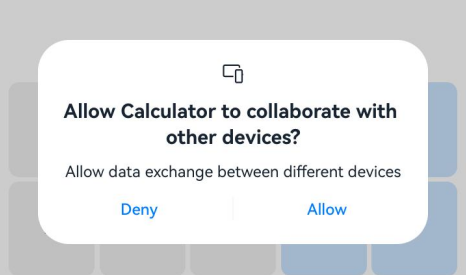
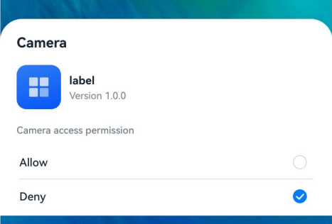
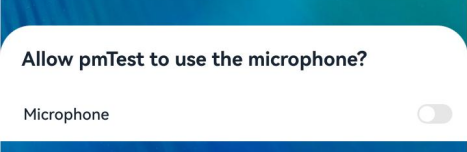

# @ohos.abilityAccessCtrl (Application Access Control)

<!--Kit: Ability Kit-->
<!--Subsystem: Security-->
<!--Owner: @xia-bubai-->
<!--Designer: @linshuqing; @hehehe-li-->
<!--Tester: @leiyuqian-->
<!--Adviser: @zengyawen-->

This module provides permission verification and management capabilities for applications.

> **NOTE**
> The initial APIs of this module are supported since API version 8. Newly added APIs will be marked with a superscript to indicate their earliest API version.

## Modules to Import

```ts
import { abilityAccessCtrl } from '@kit.AbilityKit';
```

## abilityAccessCtrl.createAtManager

createAtManager(): AtManager

Access control: Creates an object for application access control.

**Atomic service API**: This API can be used in atomic services since API version 11.

**System capability**: SystemCapability.Security.AccessToken


**Return value**

| Type| Description|
| -------- | -------- |
| [AtManager](#atmanager) | **AtManager** instance obtained.|

**Example**

```ts
let atManager: abilityAccessCtrl.AtManager = abilityAccessCtrl.createAtManager();
```

## AtManager

Provides APIs for application access control.

### checkAccessToken<sup>9+</sup>

checkAccessToken(tokenID: number, permissionName: Permissions): Promise&lt;GrantStatus&gt;

Checks whether the user has granted the permission. This API uses a promise to return the result.

**Atomic service API**: This API can be used in atomic services since API version 11.

**System capability**: SystemCapability.Security.AccessToken

**Parameters**

| Name  | Type                | Mandatory| Description                                      |
| -------- | -------------------  | ---- | ------------------------------------------ |
| tokenID   |  number   | Yes  | Identifier of the target application, which is the value of **accessTokenId** contained in [ApplicationInfo](js-apis-bundleManager-applicationInfo.md).|
| permissionName | [Permissions](../../security/AccessToken/app-permissions.md) | Yes  | Permission to verify. For details about the permission, see [Application Permissions](../../security/AccessToken/app-permissions.md).|

**Return value**

| Type         | Description                               |
| :------------ | :---------------------------------- |
| Promise&lt;[GrantStatus](#grantstatus)&gt; | Promise used to return the authorization result.|

**Error codes**

For details about the error codes, see [Universal Error Codes](../errorcode-universal.md) and [Access Control Error Codes](errorcode-access-token.md).

| ID| Error Message|
| -------- | -------- |
| 401 | Parameter error. Possible causes: 1.Mandatory parameters are left unspecified; 2.Incorrect parameter types. |
| 12100001 | Invalid parameter. The tokenID is 0, or the permissionName exceeds 256 characters. |

**Example**

```ts
import { abilityAccessCtrl } from '@kit.AbilityKit';
import { BusinessError } from '@kit.BasicServicesKit';

let atManager: abilityAccessCtrl.AtManager = abilityAccessCtrl.createAtManager();
let tokenID: number = 0; // Use bundleManager.getApplicationInfo() to obtain the token ID for a system application, and use bundleManager.getBundleInfoForSelf() to obtain the token ID for a third-party application.
atManager.checkAccessToken(tokenID, 'ohos.permission.GRANT_SENSITIVE_PERMISSIONS').then((data: abilityAccessCtrl.GrantStatus) => {
  console.info(`checkAccessToken success, result: ${data}`);
}).catch((err: BusinessError) => {
  console.error(`checkAccessToken fail, code: ${err.code}, message: ${err.message}`);
});
```

### checkAccessTokenSync<sup>10+</sup>

checkAccessTokenSync(tokenID: number, permissionName: Permissions): GrantStatus

Verifies whether a permission is granted to an application. This API returns the result synchronously.

**Atomic service API**: This API can be used in atomic services since API version 11.

**System capability**: SystemCapability.Security.AccessToken

**Parameters**

| Name  | Type                | Mandatory| Description                                      |
| -------- | -------------------  | ---- | ------------------------------------------ |
| tokenID   |  number   | Yes  | Identifier of the target application, which is the value of **accessTokenId** contained in [ApplicationInfo](js-apis-bundleManager-applicationInfo.md).|
| permissionName | [Permissions](../../security/AccessToken/app-permissions.md) | Yes  | Permission to verify. For details about the permission, see [Application Permissions](../../security/AccessToken/app-permissions.md).|

**Return value**

| Type         | Description                               |
| :------------ | :---------------------------------- |
| [GrantStatus](#grantstatus) | Permission grant state.|

**Error codes**

For details about the error codes, see [Universal Error Codes](../errorcode-universal.md) and [Access Control Error Codes](errorcode-access-token.md).

| ID| Error Message|
| -------- | -------- |
| 401 | Parameter error. Possible causes: 1.Mandatory parameters are left unspecified; 2.Incorrect parameter types. |
| 12100001 | Invalid parameter. The tokenID is 0, or the permissionName exceeds 256 characters. |

**Example**

```ts
import { abilityAccessCtrl, Permissions } from '@kit.AbilityKit';

let atManager: abilityAccessCtrl.AtManager = abilityAccessCtrl.createAtManager();
let tokenID: number = 0; // Use bundleManager.getApplicationInfo() to obtain the token ID for a system application, and use bundleManager.getBundleInfoForSelf() to obtain the token ID for a third-party application.
let permissionName: Permissions = 'ohos.permission.GRANT_SENSITIVE_PERMISSIONS';
let data: abilityAccessCtrl.GrantStatus = atManager.checkAccessTokenSync(tokenID, permissionName);
console.info(`Result: ${data}`);
```

### on<sup>18+</sup>

on(type: 'selfPermissionStateChange', permissionList: Array&lt;Permissions&gt;, callback: Callback&lt;PermissionStateChangeInfo&gt;): void

Subscribes to the permission state change events of the specified permission list of the current application. Such event triggers a corresponding callback.

- When this subscription API is called for multiple times, if the subscribed permission lists are the same but the callbacks are different, the subscription is successful.

- When this subscription API is called for multiple times, if the subscribed permission lists contain the same subset and the callbacks are the same, the subscription fails.

**Atomic service API**: This API can be used in atomic services since API version 18.

**System capability**: SystemCapability.Security.AccessToken

**Parameters**

| Name            | Type                  | Mandatory| Description                                                         |
| ------------------ | --------------------- | ---- | ------------------------------------------------------------ |
| type               | string                | Yes  | Event type. The value is **'selfPermissionStateChange'**, which indicates the changes in the permission states specific to this application alone. |
| permissionList | Array&lt;[Permissions](../../security/AccessToken/app-permissions.md)&gt;   | Yes  | List of target permissions. If this parameter is not specified, this API will subscribe to state changes of all permissions. For details about the permissions, see [Application Permissions](../../security/AccessToken/app-permissions.md).|
| callback | Callback&lt;[PermissionStateChangeInfo](#permissionstatechangeinfo18)&gt; | Yes| Callback used to return the permission state change.|

**Error codes**

For details about the error codes, see [Universal Error Codes](../errorcode-universal.md) and [Access Control Error Codes](errorcode-access-token.md).

| ID| Error Message|
| -------- | -------- |
| 401 | Parameter error. Possible causes: 1.Mandatory parameters are left unspecified; 2.Incorrect parameter types. |
| 12100001 | Invalid parameter. Possible causes: 1. The permissionList exceeds the size limit; 2. The permissionNames in the list are all invalid. |
| 12100004 | The API is used repeatedly with the same input. |
| 12100005 | The registration time has exceeded the limit. |
| 12100007 | The service is abnormal. |

**Example**

```ts
import { abilityAccessCtrl, Permissions } from '@kit.AbilityKit';

let atManager: abilityAccessCtrl.AtManager = abilityAccessCtrl.createAtManager();
let permissionList: Array<Permissions> = ['ohos.permission.APPROXIMATELY_LOCATION'];
try {
    atManager.on('selfPermissionStateChange', permissionList, (data: abilityAccessCtrl.PermissionStateChangeInfo) => {
        console.info(`receive permission state change, result: ${data}`);
    });
} catch(err) {
    console.error(`Code: ${err.code}, message: ${err.message}`);
}
```
### off<sup>18+</sup>

off(type: 'selfPermissionStateChange', permissionList: Array&lt;Permissions&gt;, callback?: Callback&lt;PermissionStateChangeInfo&gt;): void

Unsubscribes from changes in the state of the specified permissions for this application.

If **callback** is not specified, this API will unregister all callbacks for **permissionList**.

**Atomic service API**: This API can be used in atomic services since API version 18.

**System capability**: SystemCapability.Security.AccessToken

**Parameters**

| Name            | Type                  | Mandatory| Description                                                         |
| ------------------ | --------------------- | ---- | ------------------------------------------------------------ |
| type               | string         | Yes  | Event type. The value is **'selfPermissionStateChange'**, which indicates the changes in the permission states specific to this application alone. |
| permissionList | Array&lt;[Permissions](../../security/AccessToken/app-permissions.md)&gt;   | Yes  | List of target permissions. The value must be the same as that in **on()**. If this parameter is not specified, this API will unsubscribe from state changes for all permissions. For details about the permissions, see [Application Permissions](../../security/AccessToken/app-permissions.md).|
| callback | Callback&lt;[PermissionStateChangeInfo](#permissionstatechangeinfo18)&gt; | No| Callback to unregister.|

**Error codes**

For details about the error codes, see [Universal Error Codes](../errorcode-universal.md) and [Access Control Error Codes](errorcode-access-token.md).

| ID| Error Message|
| -------- | -------- |
| 401 | Parameter error. Possible causes: 1.Mandatory parameters are left unspecified; 2.Incorrect parameter types. |
| 12100004 | The API is not used in pair with 'on'. |
| 12100007 | The service is abnormal. |

**Example**

```ts
import { abilityAccessCtrl, Permissions } from '@kit.AbilityKit';

let atManager: abilityAccessCtrl.AtManager = abilityAccessCtrl.createAtManager();
let permissionList: Array<Permissions> = ['ohos.permission.APPROXIMATELY_LOCATION'];
try {
    atManager.off('selfPermissionStateChange', permissionList);
} catch(err) {
    console.error(`Code: ${err.code}, message: ${err.message}`);
}
```

### requestPermissionsFromUser<sup>9+</sup>

requestPermissionsFromUser(context: Context, permissionList: Array&lt;Permissions&gt;, requestCallback: AsyncCallback&lt;PermissionRequestResult&gt;): void

Starts a dialog box for [Requesting User Authorization](../../security/AccessToken/request-user-authorization.md) for <!--RP1-->[UIAbility](js-apis-app-ability-uiAbility.md#uiability)<!--RP1End-->. This API uses an asynchronous callback to return the result.

If the user rejects to grant permissions, the dialog box cannot be displayed again. If permission granting is required, the user can manually grant permissions on the **Settings** page or call [requestPermissionOnSetting](#requestpermissiononsetting12) to display the permission settings dialog box for the user to grant permissions.

<!--RP3-->

<!--RP3End-->

**Atomic service API**: This API can be used in atomic services since API version 12.

**Model restriction**: This API can be used only in the stage model.

**System capability**: SystemCapability.Security.AccessToken

**Parameters**

| Name| Type| Mandatory| Description|
| -------- | -------- | -------- | -------- |
| context | [Context](js-apis-inner-application-context.md) | Yes| Context of the <!--RP1-->UIAbility<!--RP1End--> that requests the permission.|
| permissionList | Array&lt;[Permissions](../../security/AccessToken/app-permissions.md)&gt; | Yes| Permissions to request. For details about the permissions, see [Application Permissions](../../security/AccessToken/app-permissions.md).|
| requestCallback | AsyncCallback&lt;[PermissionRequestResult](js-apis-permissionrequestresult.md)&gt; | Yes| Callback used to return the result.|

**Error codes**

For details about the error codes, see [Universal Error Codes](../errorcode-universal.md) and [Access Control Error Codes](errorcode-access-token.md).

| ID| Error Message|
| -------- | -------- |
| 401 | Parameter error. Possible causes: 1.Mandatory parameters are left unspecified; 2.Incorrect parameter types. |
| 12100001 | (Deprecated in 12) Invalid parameter. The context is invalid when it does not belong to the application itself. |
| 12100009 | Common inner error. An error occurs when creating the pop-up window or obtaining user operation results. |

**Example**

For details about how to obtain the context in the example, see [Obtaining the Context of UIAbility](../../application-models/uiability-usage.md#obtaining-the-context-of-uiability).
For details about the process and example of applying for user authorization, see [Requesting User Authorization](../../security/AccessToken/request-user-authorization.md).
<!--code_no_check-->
```ts
import { abilityAccessCtrl, Context, PermissionRequestResult, common } from '@kit.AbilityKit';
import { BusinessError } from '@kit.BasicServicesKit';

let atManager: abilityAccessCtrl.AtManager = abilityAccessCtrl.createAtManager();
let context: Context = this.getUIContext().getHostContext() as common.UIAbilityContext;
atManager.requestPermissionsFromUser(context, ['ohos.permission.CAMERA'], (err: BusinessError, data: PermissionRequestResult) => {
  if (err) {
    console.error(`requestPermissionsFromUser fail, code: ${err.code}, message: ${err.message}`);
  } else {
    console.info(`requestPermissionsFromUser success, result: ${data}`);
    console.info('requestPermissionsFromUser data permissions:' + data.permissions);
    console.info('requestPermissionsFromUser data authResults:' + data.authResults);
    console.info('requestPermissionsFromUser data dialogShownResults:' + data.dialogShownResults);
  }
});
```

### requestPermissionsFromUser<sup>9+</sup>

requestPermissionsFromUser(context: Context, permissionList: Array&lt;Permissions&gt;): Promise&lt;PermissionRequestResult&gt;

Starts a dialog box for [Requesting User Authorization](../../security/AccessToken/request-user-authorization.md) for <!--RP1-->[UIAbility](js-apis-app-ability-uiAbility.md#uiability)<!--RP1End-->. This API uses a promise to return the result.

If the user rejects to grant permissions, the dialog box cannot be displayed again. If permission granting is required, the user can manually grant permissions on the **Settings** page or call [requestPermissionOnSetting](#requestpermissiononsetting12) to display the permission settings dialog box for the user to grant permissions.

**Atomic service API**: This API can be used in atomic services since API version 11.

**Model restriction**: This API can be used only in the stage model.

**System capability**: SystemCapability.Security.AccessToken

**Parameters**

| Name| Type| Mandatory| Description|
| -------- | -------- | -------- | -------- |
| context | [Context](js-apis-inner-application-context.md) | Yes| Context of the <!--RP1-->UIAbility<!--RP1End--> that requests the permission.|
| permissionList | Array&lt;[Permissions](../../security/AccessToken/app-permissions.md)&gt; | Yes| Permission to verify. For details about the permission, see [Application Permissions](../../security/AccessToken/app-permissions.md).|

**Return value**

| Type| Description|
| -------- | -------- |
| Promise&lt;[PermissionRequestResult](js-apis-permissionrequestresult.md)&gt; | Promise used to return the result.|

**Error codes**

For details about the error codes, see [Universal Error Codes](../errorcode-universal.md) and [Access Control Error Codes](errorcode-access-token.md).

| ID| Error Message|
| -------- | -------- |
| 401 | Parameter error. Possible causes: 1.Mandatory parameters are left unspecified; 2.Incorrect parameter types. |
| 12100001 | (Deprecated in 12) Invalid parameter. The context is invalid when it does not belong to the application itself. |
| 12100009 | Common inner error. An error occurs when creating the pop-up window or obtaining user operation results. |

**Example**

For details about how to obtain the context in the example, see [Obtaining the Context of UIAbility](../../application-models/uiability-usage.md#obtaining-the-context-of-uiability).
For details about the process and example of applying for user authorization, see [Requesting User Authorization](../../security/AccessToken/request-user-authorization.md).
<!--code_no_check-->
```ts
import { abilityAccessCtrl, Context, PermissionRequestResult, common } from '@kit.AbilityKit';
import { BusinessError } from '@kit.BasicServicesKit';

let atManager: abilityAccessCtrl.AtManager = abilityAccessCtrl.createAtManager();
let context: Context = this.getUIContext().getHostContext() as common.UIAbilityContext;
atManager.requestPermissionsFromUser(context, ['ohos.permission.CAMERA']).then((data: PermissionRequestResult) => {
  console.info(`requestPermissionsFromUser success, result: ${data}`);
  console.info('requestPermissionsFromUser data permissions:' + data.permissions);
  console.info('requestPermissionsFromUser data authResults:' + data.authResults);
  console.info('requestPermissionsFromUser data dialogShownResults:' + data.dialogShownResults);
}).catch((err: BusinessError) => {
  console.error(`requestPermissionsFromUser fail, code: ${err.code}, message: ${err.message}`);
});
```

### requestPermissionOnSetting<sup>12+</sup>

requestPermissionOnSetting(context: Context, permissionList: Array&lt;Permissions&gt;): Promise&lt;Array&lt;GrantStatus&gt;&gt;

Starts a permission setting dialog box again for [UIAbility](js-apis-app-ability-uiAbility.md#uiability) or [UIExtensionAbility](js-apis-app-ability-uiExtensionAbility.md#uiextensionability).

Before calling this API, the application must have called [requestPermissionsFromUser](#requestpermissionsfromuser9). If the user grants the permissions required when the authorization dialog box is displayed the first time, calling this API will not display the permission settings dialog box.

<!--RP4-->

<!--RP4End-->

**Atomic service API**: This API can be used in atomic services since API version 12.

**Model restriction**: This API can be used only in the stage model.

**System capability**: SystemCapability.Security.AccessToken

**Parameters**

| Name| Type| Mandatory| Description|
| -------- | -------- | -------- | -------- |
| context | [Context](js-apis-inner-application-context.md) | Yes| Context of the UIAbility/UIExtensionAbility that requests the permissions.|
| permissionList | Array&lt;[Permissions](../../security/AccessToken/app-permissions.md)&gt; | Yes| Permissions to request. For details about the permissions, see [Application Permission Groups](../../security/AccessToken/app-permission-group-list.md).|

**Return value**

| Type         | Description                               |
| :------------ | :---------------------------------- |
| Promise&lt;Array&lt;[GrantStatus](#grantstatus)&gt;&gt; | Promise used to return the authorization result.|

**Error codes**

For details about the error codes, see [Universal Error Codes](../errorcode-universal.md) and [Access Control Error Codes](errorcode-access-token.md).

| ID| Error Message|
| -------- | -------- |
| 401 | Parameter error. Possible causes: 1.Mandatory parameters are left unspecified; 2.Incorrect parameter types. |
| 12100001 | Invalid parameter. Possible causes:<br>1. The context is invalid because it does not belong to the application itself;<br>2. The permission list contains the permission that is not declared in the module.json file;<br>3. The permission list is invalid because the permissions in it do not belong to the same permission group;<br>4. The permission list contains one or more system_grant permissions. |
| 12100009 | Common inner error. An error occurs when creating the pop-up window or obtaining user operation result. |
| 12100011 | All permissions in the permission list have been granted. |
| 12100012 | The permission list contains the permission that has not been revoked by the user. |
| 12100014 | Unexpected permission. You cannot request this type of permission from users via a pop-up window. |

**Example**
For details about how to obtain the context in the example, see [Obtaining the Context of UIAbility](../../application-models/uiability-usage.md#obtaining-the-context-of-uiability).
<!--code_no_check-->
```ts
import { abilityAccessCtrl, Context, common } from '@kit.AbilityKit';
import { BusinessError } from '@kit.BasicServicesKit';

let atManager: abilityAccessCtrl.AtManager = abilityAccessCtrl.createAtManager();
let context: Context = this.getUIContext().getHostContext() as common.UIAbilityContext;
atManager.requestPermissionOnSetting(context, ['ohos.permission.CAMERA']).then((data: Array<abilityAccessCtrl.GrantStatus>) => {
  console.info(`requestPermissionOnSetting success, result: ${data}`);
}).catch((err: BusinessError) => {
  console.error(`requestPermissionOnSetting fail, code: ${err.code}, message: ${err.message}`);
});
```

### requestGlobalSwitch<sup>12+</sup>

requestGlobalSwitch(context: Context, type: SwitchType): Promise&lt;boolean&gt;

Displays a dialog box for setting a global switch for UIAbility or UIExtensionAbility.

When the features such as recording and photographing are disabled, the application can display the dialog box, asking the user to enable the related features. If the global switch is turned on, no dialog box will be displayed.

<!--RP5-->

<!--RP5End-->

**Atomic service API**: This API can be used in atomic services since API version 12.

**Model restriction**: This API can be used only in the stage model.

**System capability**: SystemCapability.Security.AccessToken

**Parameters**

| Name| Type| Mandatory| Description|
| -------- | -------- | -------- | -------- |
| context | [Context](js-apis-inner-application-context.md) | Yes| Context of the UIAbility/UIExtensionAbility that requests the permissions.|
| type | [SwitchType](#switchtype12) | Yes| Type of the global switch.|

**Return value**

| Type         | Description                               |
| :------------ | :---------------------------------- |
| Promise&lt;boolean&gt; | Promise used to return the global switch status. **true** to enable, **false** otherwise.|

**Error codes**

For details about the error codes, see [Universal Error Codes](../errorcode-universal.md) and [Access Control Error Codes](errorcode-access-token.md).

| ID| Error Message|
| -------- | -------- |
| 401 | Parameter error. Possible causes: 1. Mandatory parameters are left unspecified; 2. Incorrect parameter types. |
| 12100001 | Invalid parameter. Possible causes: 1. The context is invalid because it does not belong to the application itself; 2. The type of global switch is not support. |
| 12100009 | Common inner error. An error occurs when creating the pop-up window or obtaining user operation result. |
| 12100013 | The specific global switch is already open. |

**Example**
For details about how to obtain the context in the example, see [Obtaining the Context of UIAbility](../../application-models/uiability-usage.md#obtaining-the-context-of-uiability).
<!--code_no_check-->
```ts
import { abilityAccessCtrl, Context, common } from '@kit.AbilityKit';
import { BusinessError } from '@kit.BasicServicesKit';

let atManager: abilityAccessCtrl.AtManager = abilityAccessCtrl.createAtManager();
let context: Context = this.getUIContext().getHostContext() as common.UIAbilityContext;
atManager.requestGlobalSwitch(context, abilityAccessCtrl.SwitchType.CAMERA).then((data: Boolean) => {
  console.info(`requestGlobalSwitch success, result: ${data}`);
}).catch((err: BusinessError) => {
  console.error(`requestGlobalSwitch fail, code: ${err.code}, message: ${err.message}`);
});
```

### getSelfPermissionStatus<sup>20+</sup>

getSelfPermissionStatus(permissionName: Permissions): PermissionStatus

Queries the permission status of an application. This API returns the result synchronously.

**Atomic service API**: This API can be used in atomic services since API version 20.

**System capability**: SystemCapability.Security.AccessToken

**Parameters**

| Name| Type| Mandatory| Description|
| -------- | -------- | -------- | -------- |
| permissionName | [Permissions](../../security/AccessToken/app-permissions.md) | Yes  | Permission to verify. For details about the permission, see [Application Permissions](../../security/AccessToken/app-permissions.md).|

**Return value**

| Type         | Description                               |
| :------------ | :---------------------------------- |
| [PermissionStatus](#permissionstatus20) | Permission status.|

**Error codes**

For details about the error codes, see [Access Control Error Codes](errorcode-access-token.md).

| ID| Error Message|
| -------- | -------- |
| 12100001 | Invalid parameter. The permissionName is empty or exceeds 256 characters. |
| 12100007 | The service is abnormal. |

**Example**

```ts
import { abilityAccessCtrl } from '@kit.AbilityKit';
import { BusinessError } from '@kit.BasicServicesKit';

let atManager: abilityAccessCtrl.AtManager = abilityAccessCtrl.createAtManager();
try {
  let data: abilityAccessCtrl.PermissionStatus = atManager.getSelfPermissionStatus('ohos.permission.CAMERA');
  console.info(`getSelfPermissionStatus success, result: ${data}`);
} catch(err) {
  console.error(`getSelfPermissionStatus fail, code: ${err.code}, message: ${err.message}`);
}
```

### openPermissionOnSetting<sup>22+</sup>

openPermissionOnSetting(context: Context, permission: Permissions): Promise&lt;SelectedResult&gt;

Starts the dialog box for redirection to the settings page for [UIAbility](js-apis-app-ability-uiAbility.md#uiability) or [UIExtensionAbility](js-apis-app-ability-uiExtensionAbility.md#uiextensionability). This API uses a promise to return the result.

**Model restriction**: This API can be used only in the stage model.

**System capability**: SystemCapability.Security.AccessToken

**Parameters**

| Name| Type| Mandatory| Description|
| -------- | -------- | -------- | -------- |
| context | [Context](js-apis-inner-application-context.md) | Yes| Context of the UIAbility/UIExtensionAbility that requests the permissions.|
| permission | [Permissions](../../security/AccessToken/app-permissions.md) | Yes| Permission name. Only permissions whose authorization mode is [manual_settings](../../security/AccessToken/app-permission-mgmt-overview.md#manual_settings-manual-authorization) are supported.|

**Return value**

| Type         | Description                               |
| :------------ | :---------------------------------- |
| Promise&lt;[SelectedResult](#selectedresult22)&gt; | Promise used to return the result of redirection to the settings page.|

**Error codes**

For details about the error codes, see [Access Control Error Codes](errorcode-access-token.md).

| ID| Error Message|
| -------- | -------- |
| 12100001 | Invalid parameter. Possible causes:<br>1. The context is invalid because it does not belong to the application itself;<br>2. The permission is invalid or not declared in the module.json file. |
| 12100009 | Common inner error. An error occurs when creating the pop-up window or obtaining user operation result. |
| 12100014 | Unexpected permission. The permission is not a manual_settings permission. |

**Example**

For details about how to obtain the context in the example, see [Obtaining the Context of UIAbility](../../application-models/uiability-usage.md#obtaining-the-context-of-uiability).

```ts
import { abilityAccessCtrl, Context, common } from '@kit.AbilityKit';
import { BusinessError } from '@kit.BasicServicesKit';

let atManager: abilityAccessCtrl.AtManager = abilityAccessCtrl.createAtManager();
let context: Context = this.getUIContext().getHostContext() as common.UIAbilityContext;
atManager.openPermissionOnSetting(context, 'ohos.permission.HOOK_KEY_EVENT').then((data: abilityAccessCtrl.SelectedResult) => {
  console.info(`openPermissionOnSetting success, result: ${data}`);
}).catch((err: BusinessError) => {
  console.error(`openPermissionOnSetting fail, code: ${err.code}, message: ${err.message}`);
});
```

### verifyAccessTokenSync<sup>9+</sup>

verifyAccessTokenSync(tokenID: number, permissionName: Permissions): GrantStatus

Verifies whether a permission is granted to an application. This API returns the result synchronously.

**System capability**: SystemCapability.Security.AccessToken

**Parameters**

| Name  | Type                | Mandatory| Description                                      |
| -------- | -------------------  | ---- | ------------------------------------------ |
| tokenID   |  number   | Yes  | Identifier of the target application, which is the value of **accessTokenId** contained in [ApplicationInfo](js-apis-bundleManager-applicationInfo.md).|
| permissionName | [Permissions](../../security/AccessToken/app-permissions.md) | Yes  | Permission to verify. For details about the permission, see [Application Permissions](../../security/AccessToken/app-permissions.md).|

**Return value**

| Type         | Description                               |
| :------------ | :---------------------------------- |
| [GrantStatus](#grantstatus) | Permission grant state.|

**Error codes**

For details about the error codes, see [Universal Error Codes](../errorcode-universal.md) and [Access Control Error Codes](errorcode-access-token.md).

| ID| Error Message|
| -------- | -------- |
| 401 | Parameter error. Possible causes: 1.Mandatory parameters are left unspecified; 2.Incorrect parameter types. |
| 12100001 | Invalid parameter. The tokenID is 0, or the permissionName exceeds 256 characters. |

**Example**

```ts
import { abilityAccessCtrl } from '@kit.AbilityKit';

let atManager: abilityAccessCtrl.AtManager = abilityAccessCtrl.createAtManager();
let tokenID: number = 0; // Use bundleManager.getApplicationInfo() to obtain the token ID for a system application, and use bundleManager.getBundleInfoForSelf() to obtain the token ID for a third-party application.
try {
  let data: abilityAccessCtrl.GrantStatus = atManager.verifyAccessTokenSync(tokenID, 'ohos.permission.GRANT_SENSITIVE_PERMISSIONS');
  console.info(`verifyAccessTokenSync success, result: ${data}`);
} catch(err) {
  console.error(`verifyAccessTokenSync fail, code: ${err.code}, message: ${err.message}`);
}
```

### verifyAccessToken<sup>9+</sup>

verifyAccessToken(tokenID: number, permissionName: Permissions): Promise&lt;GrantStatus&gt;

Checks whether the user has granted the permission. This API uses a promise to return the result.

> **NOTE**
>
> You are advised to use [checkAccessToken](#checkaccesstoken9).

**System capability**: SystemCapability.Security.AccessToken

**Parameters**

| Name  | Type                | Mandatory| Description                                      |
| -------- | -------------------  | ---- | ------------------------------------------ |
| tokenID   |  number   | Yes  | Identifier of the target application, which is the value of **accessTokenId** contained in [ApplicationInfo](js-apis-bundleManager-applicationInfo.md).|
| permissionName | [Permissions](../../security/AccessToken/app-permissions.md) | Yes  | Permission to verify. For details about the permission, see [Application Permissions](../../security/AccessToken/app-permissions.md).|

**Return value**

| Type         | Description                               |
| :------------ | :---------------------------------- |
| Promise&lt;[GrantStatus](#grantstatus)&gt; | Promise used to return the authorization result.|

**Example**

```ts
import { abilityAccessCtrl, Permissions } from '@kit.AbilityKit';
import { BusinessError } from '@kit.BasicServicesKit';

let atManager: abilityAccessCtrl.AtManager = abilityAccessCtrl.createAtManager();
let tokenID: number = 0; // Use bundleManager.getApplicationInfo() to obtain the token ID for a system application, and use bundleManager.getBundleInfoForSelf() to obtain the token ID for a third-party application.
let permissionName: Permissions = 'ohos.permission.GRANT_SENSITIVE_PERMISSIONS';
atManager.verifyAccessToken(tokenID, permissionName).then((data: abilityAccessCtrl.GrantStatus) => {
  console.info(`verifyAccessToken success, result: ${data}`);
}).catch((err: BusinessError) => {
  console.error(`verifyAccessToken fail, code: ${err.code}, message: ${err.message}`);
});
```

### verifyAccessToken<sup>(deprecated)</sup>

verifyAccessToken(tokenID: number, permissionName: string): Promise&lt;GrantStatus&gt;

Checks whether the user has granted the permission. This API uses a promise to return the result.

> **NOTE**
>
> This API is no longer maintained since API version 9. Use [checkAccessToken](#checkaccesstoken9) instead.

**System capability**: SystemCapability.Security.AccessToken

**Parameters**

| Name  | Type                | Mandatory| Description                                      |
| -------- | -------------------  | ---- | ------------------------------------------ |
| tokenID   |  number   | Yes  | Identifier of the target application, which is the value of **accessTokenId** contained in [ApplicationInfo](js-apis-bundleManager-applicationInfo.md).|
| permissionName | string | Yes  | Permission to verify. For details about the permission, see [Application Permissions](../../security/AccessToken/app-permissions.md).|

**Return value**

| Type         | Description                               |
| :------------ | :---------------------------------- |
| Promise&lt;[GrantStatus](#grantstatus)&gt; | Promise used to return the authorization result.|

**Example**

```ts
import { abilityAccessCtrl } from '@kit.AbilityKit';
import { BusinessError } from '@kit.BasicServicesKit';

let atManager: abilityAccessCtrl.AtManager = abilityAccessCtrl.createAtManager();
let tokenID: number = 0; // Use bundleManager.getApplicationInfo() to obtain the token ID for a system application, and use bundleManager.getBundleInfoForSelf() to obtain the token ID for a third-party application.
atManager.verifyAccessToken(tokenID, 'ohos.permission.GRANT_SENSITIVE_PERMISSIONS').then((data: abilityAccessCtrl.GrantStatus) => {
  console.info(`verifyAccessToken success, result: ${data}`);
}).catch((err: BusinessError) => {
  console.error(`verifyAccessToken fail, code: ${err.code}, message: ${err.message}`);
});
```

## GrantStatus

Enumerates the permission grant states.

**Atomic service API**: This API can be used in atomic services since API version 11.

**System capability**: SystemCapability.Security.AccessToken

| Name              |    Value| Description       |
| ------------------ | ----- | ----------- |
| PERMISSION_DENIED  | -1    | The permission is not granted.|
| PERMISSION_GRANTED | 0     | The permission is granted.|

## SwitchType<sup>12+</sup>

Enumerates the global switch types.

**Atomic service API**: This API can be used in atomic services since API version 12.

**System capability**: SystemCapability.Security.AccessToken

| Name              |    Value| Description       |
| ------------------ | ----- | ----------- |
| CAMERA  | 0    | Global switch of the camera.|
| MICROPHONE | 1     | Global switch of the microphone.|
| LOCATION | 2     | Global switch of the location service.|

## PermissionStateChangeType<sup>18+</sup>

Enumerates the operations that trigger permission state changes.

**Atomic service API**: This API can be used in atomic services since API version 18.

**System capability**: SystemCapability.Security.AccessToken

| Name                    |    Value| Description             |
| ----------------------- | ------ | ----------------- |
| PERMISSION_REVOKED_OPER | 0      | Operation to revoke a permission.|
| PERMISSION_GRANTED_OPER | 1      | Operation to grant a permission.|

## PermissionStateChangeInfo<sup>18+</sup>

Represents the permission state change details.

**Atomic service API**: This API can be used in atomic services since API version 18.

**System capability**: SystemCapability.Security.AccessToken

| Name          | Type                      | Read Only| Optional| Description               |
| -------------- | ------------------------- | ---- | ---- | ------------------ |
| change         | [PermissionStateChangeType](#permissionstatechangetype18) | No  | No  | Operation that triggers the permission state change.       |
| tokenID        | number                    | No  | No  | Identifier of the target application, which is the value of **accessTokenId** contained in [ApplicationInfo](js-apis-bundleManager-applicationInfo.md).|
| permissionName | [Permissions](../../security/AccessToken/app-permissions.md)                    | No  | No  | Permissions whose authorization state changes. For details about the permissions, see [Application Permissions](../../security/AccessToken/app-permissions.md).|

## PermissionRequestResult<sup>10+</sup>

type PermissionRequestResult = _PermissionRequestResult

Represents the permission request result.

**Atomic service API**: This API can be used in atomic services since API version 11.

**Model restriction**: This API can be used only in the stage model.

**System capability**: SystemCapability.Security.AccessToken

| Type| Description|
| -------- | -------- |
| [_PermissionRequestResult](js-apis-permissionrequestresult.md) | Permission request result object.|

## Context<sup>10+</sup>

type Context = _Context

Represents the context for the ability or application. It allows access to application-specific resources.

**Atomic service API**: This API can be used in atomic services since API version 11.

**Model restriction**: This API can be used only in the stage model.

**System capability**: SystemCapability.Security.AccessToken

| Type| Description|
| -------- | -------- |
| [_Context](js-apis-inner-application-context.md) | Context for an ability or application to access to application-specific resources.|

## PermissionStatus<sup>20+</sup>

Enumerates the permission states.

**Atomic service API**: This API can be used in atomic services since API version 20.

**System capability**: SystemCapability.Security.AccessToken

| Name              |    Value| Description       |
| ------------------ | ----- | ----------- |
| DENIED  | -1    | The permission is not granted.|
| GRANTED | 0     | The permission is granted.|
| NOT_DETERMINED | 1     | The permission state is not determined. This value is returned when the application declares [user_grant permissions](../../security/AccessToken/permissions-for-all-user.md) and does not call [requestPermissionsFromUser](#requestpermissionsfromuser9) to request user authorization, or when the user changes the permission state to **Ask each time** in **Settings**.|
| INVALID | 2     | The permission is invalid. The application does not [declare permissions](../../security/AccessToken/declare-permissions.md) or cannot process the request. For example, if the status of the approximate location permission is **NOT_DETERMINED**, this value will be returned when the status of the precise location permission is queried.|
| RESTRICTED | 3     | The permission is restricted. <!--RP2-->The application is not allowed to call [requestPermissionsFromUser](#requestpermissionsfromuser9) to request user authorization.<!--RP2End--> |

## SelectedResult<sup>22+</sup>

Enumerates the results of the dialog box for redirection to the settings page.

**System capability**: SystemCapability.Security.AccessToken

| Name              |    Value| Description       |
| ------------------ | ----- | ----------- |
| REJECTED | -1    | The user chooses not to go to the settings.|
| OPENED | 0     | The user chooses to go to the settings.|
| GRANTED | 1     | The permission has been granted and no dialog box is displayed.|
