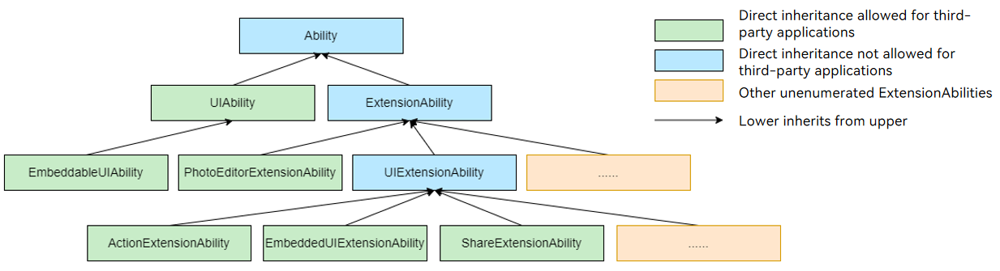

# @ohos.app.ability.Ability (Ability Base Class)

<!--Kit: Ability Kit-->
<!--Subsystem: Ability-->
<!--Owner: @littlejerry1-->
<!--Designer: @ccllee1-->
<!--Tester: @liangchengguang-->
<!--Adviser: @HelloCrease-->
<!-- md-trans-meta sourceCommit=3710d9e6218f1ff30d75ca1e496a60e0f8529dc7 translatedAt=2026-09-03T09:37:05.003Z pushedAt=2026-09-05T10:47:30.193Z -->

The Ability class is the fundamental unit for application lifecycle scheduling. It is the base class of [UIAbility](js-apis-app-ability-uiAbility.md) and [ExtensionAbility](js-apis-app-ability-extensionAbility.md), and provides callbacks for system configuration updates and memory level updates. However, you cannot inherit directly from this base class. You should opt for either [UIAbility](js-apis-app-ability-uiAbility.md) or [ExtensionAbility](js-apis-app-ability-extensionAbility.md) based on your service needs. For details, see [Introduction to Ability Kit](../../application-models/abilitykit-overview.md).

> **NOTE**
> 
> The initial APIs of this module are supported since API version 9. Newly added APIs will be marked with a superscript to indicate their earliest API version.
>
> The APIs of this module can be used only in the stage model.

## Modules to Import

```ts
import { Ability } from '@kit.AbilityKit';
```

## Ability Inheritance Relationship

The following figure shows the inheritance relationship of the Ability base class and its child classes.

> **NOTE**
>
> Some ExtensionAbility components (such as [FormExtensionAbility](../apis-form-kit/js-apis-app-form-formExtensionAbility.md) and [InputMethodExtensionAbility](../apis-ime-kit/js-apis-inputmethod-extension-ability.md)) do not inherit from the ExtensionAbility base class and therefore are not provided in the following figure.



## Ability.onConfigurationUpdate

onConfigurationUpdate(newConfig: Configuration): void

Called when a system environment variable changes. You can override this callback to respond to changes in the system environment variables. For example, when the system language changes, the application can perform customized processing in the callback.

> **NOTE**
>
> This callback is subject to certain restrictions when actually triggered. For example, if you set the application language through [setLanguage](../apis-ability-kit/js-apis-inner-application-applicationContext.md#applicationcontextsetlanguage11), the system no longer triggers the onConfigurationUpdate callback even if the system language changes. For details, see [Usage Scenario](../../application-models/subscribe-system-environment-variable-changes.md#when-to-use).
>
> To monitor the environment variables of the Ability on a page, use [ApplicationContext.on('environment')](./js-apis-inner-application-applicationContext.md#applicationcontextonenvironment).

**Atomic service API**: This API can be used in atomic services since API version 11.

**System capability**: SystemCapability.Ability.AbilityRuntime.AbilityCore

**Parameters**

| Name| Type| Mandatory| Description|
| -------- | -------- | -------- | -------- |
| newConfig | [Configuration](js-apis-app-ability-configuration.md) | Required | Updated configuration, including system configuration items such as language and color mode. |

**Example**

```ts
// You are not allowed to inherit from the top-level base class Ability. Therefore, the derived class UIAbility is used as an example.
import { UIAbility, Configuration } from '@kit.AbilityKit';

class MyUIAbility extends UIAbility {
  onConfigurationUpdate(config: Configuration) {
    console.info(`onConfigurationUpdate, config: ${JSON.stringify(config)}`);
  }
}
```

## Ability.onMemoryLevel

onMemoryLevel(level: AbilityConstant.MemoryLevel): void

Called when the available memory of the entire device changes to a specified level. You can override this callback to respond to changes in the memory level, for example, releasing cached data.

> **NOTE**
>
> The onMemoryLevel callback runs on the main thread of the current process. If you release UI components that take a long time in this callback, the main thread tasks will be blocked. Therefore, releasing UI components in this callback is not recommended.
>
> To monitor the environment variables of the Ability on a page, use [ApplicationContext.on('environment')](./js-apis-inner-application-applicationContext.md#applicationcontextonenvironment).

**Atomic service API**: This API can be used in atomic services since API version 11.

**System capability**: SystemCapability.Ability.AbilityRuntime.AbilityCore

**Parameters**

| Name| Type| Mandatory| Description|
| -------- | -------- | -------- | -------- |
| level | [AbilityConstant.MemoryLevel](js-apis-app-ability-abilityConstant.md#memorylevel) | Required | Memory level of the entire device. For details about the corresponding trigger scenarios, see [AbilityConstant.MemoryLevel](js-apis-app-ability-abilityConstant.md#memorylevel). |

**Example**

```ts
// You are not allowed to inherit from the top-level base class Ability. Therefore, the derived class UIAbility is used as an example.
import { UIAbility, AbilityConstant } from '@kit.AbilityKit';

class MyUIAbility extends UIAbility {
  // Receive the system memory level change callback.
  onMemoryLevel(level: AbilityConstant.MemoryLevel) {
    console.info(`onMemoryLevel, level: ${JSON.stringify(level)}`);
  }
}
```
