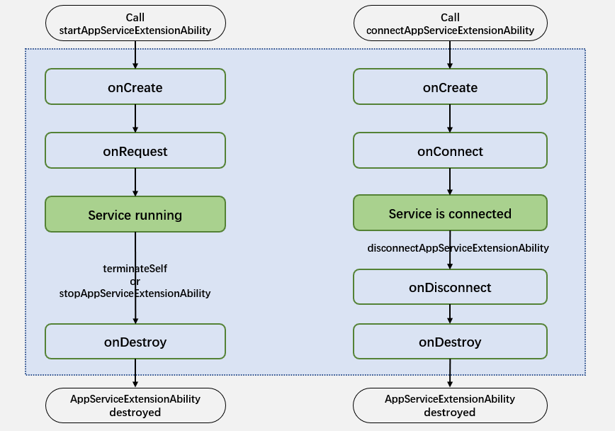

# @ohos.app.ability.AppServiceExtensionAbility (ExtensionAbility for Application Background Services)
<!--Kit: Ability Kit-->
<!--Subsystem: Ability-->
<!--Owner: @zhang_hao_zheng-->
<!--Designer: @jsjzju-->
<!--Tester: @liangchengguang-->
<!--Adviser: @HelloCrease-->
<!-- md-trans-meta sourceCommit=7fe4eacae9c952d492316e40f501d71d3714186d translatedAt=2026-09-03T09:59:08.570Z pushedAt=2026-09-05T10:47:30.231Z -->

The AppServiceExtensionAbility module provides extension capabilities related to background services, including lifecycle callbacks for creating, destroying, connecting, and disconnecting background services. It is suitable for scenarios that require long-running background tasks or maintaining background connections, such as background traffic monitoring, helping applications improve the continuous running capability of background services.

> **NOTE**
>
> The initial APIs of this module are supported since API version 20. Newly added APIs will be marked with a superscript to indicate their earliest API version.
>
> The APIs of this module can be used only in the stage model.

## Constraints

- Currently, only PC/2-in-1 devices are supported.
- To integrate an AppServiceExtensionAbility, applications must request the ACL permission (ohos.permission.SUPPORT_APP_SERVICE_EXTENSION). Currently, the ACL permission is available only to common enterprise applications. For details about how to apply for the permission, see [Declaring Permissions](../../security/AccessToken/declare-permissions.md).
- To ensure system security and stability and prevent AppServiceExtensionAbility from abusing system resources, the system manages its capabilities and does not support referencing the [@ohos.window (Window)](../apis-arkui/arkts-apis-window.md) module.
- Currently, AppServiceExtensionAbility cannot be implemented or used in clone applications.

## Lifecycle

The AppServiceExtensionAbility provides the following lifecycle callbacks: [onCreate()](#oncreate), [onRequest()](#onrequest), [onConnect()](#onconnect), [onDisconnect()](#ondisconnect), and [onDestroy()](#ondestroy). You can override the callback methods as required. The following figure shows the AppServiceExtensionAbility lifecycle.



- **onCreate**

  Called when an AppServiceExtensionAbility instance is created.

- **onDestroy**

  Called when an AppServiceExtensionAbility instance is destroyed.

- **onRequest**

  Called when an AppServiceExtensionAbility instance is started by calling [startAppServiceExtensionAbility()](js-apis-inner-application-uiAbilityContext.md#startappserviceextensionability20).

- **onConnect**

  Called when an AppServiceExtensionAbility instance is connected by calling [connectAppServiceExtensionAbility](js-apis-inner-application-uiAbilityContext.md#connectappserviceextensionability20).

- **onDisconnect**

  Called when all connections to an AppServiceExtensionAbility instance are interrupted.

## Modules to Import

```ts
import { AppServiceExtensionAbility } from '@kit.AbilityKit';
```

## AppServiceExtensionAbility

The AppServiceExtensionAbility module provides extended capabilities for background services, including lifecycle callbacks for creating, destroying, connecting, and disconnecting background services.

### Properties

**System capability**: SystemCapability.Ability.AbilityRuntime.Core

**Device Behavior Differences**: This attribute can be called normally only on PC/2-in-1 devices and does not take effect on other devices.

| Name| Type| Read-Only| Optional| Description|
| -------- | -------- | -------- | -------- | -------- |
| context | [AppServiceExtensionContext](js-apis-inner-application-appServiceExtensionContext.md)  | No| No| Context environment for an AppServiceExtensionAbility. This context inherits from [ExtensionContext](js-apis-inner-application-extensionContext.md).|


### onCreate

onCreate(want: Want): void

When an AppServiceExtensionAbility instance is created, the system triggers this callback. Applications can perform business logic initialization operations in this API, such as registering common event listeners.

> **NOTE**
>
> If an AppServiceExtensionAbility instance has already been created, the **onCreate()** callback is not invoked again when the instance is started or connected.

**System capability**: SystemCapability.Ability.AbilityRuntime.Core

**Device Behavior Differences**: This API executes the callback normally only on PC/2-in-1 devices and does not execute the callback on other devices.

**Parameters**

| Name| Type| Mandatory| Description|
| -------- | -------- | -------- | -------- |
| want |  [Want](js-apis-app-ability-want.md) | Yes| Want information about the target AppServiceExtensionAbility instance, including the ability name and bundle name.|

**Example**

  ```ts
  import { AppServiceExtensionAbility, Want } from '@kit.AbilityKit';
  import { hilog } from '@kit.PerformanceAnalysisKit';

  const TAG: string = '[AppServiceExtAbility]';

  export default class AppServiceExtAbility extends AppServiceExtensionAbility {
    onCreate(want: Want) {
      hilog.info(0x0000, TAG, `onCreate, want: ${want.abilityName}`);
    }
  }
  ```

### onDestroy

onDestroy(): void

When an AppServiceExtensionAbility instance is destroyed, the system triggers this callback. Applications can perform operations such as resource cleanup in this API, for example, unregistering listeners.

**System capability**: SystemCapability.Ability.AbilityRuntime.Core

**Device Behavior Differences**: This API executes the callback normally only on PC/2-in-1 devices and does not execute the callback on other devices.

**Example**

  ```ts
  import { AppServiceExtensionAbility } from '@kit.AbilityKit';
  import { hilog } from '@kit.PerformanceAnalysisKit';

  const TAG: string = '[AppServiceExtAbility]';

  export default class AppServiceExtAbility extends AppServiceExtensionAbility {
    onDestroy() {
      hilog.info(0x0000, TAG, `onDestroy`);
    }
  }
  ```

### onRequest

onRequest(want: Want, startId: number): void

Called each time an AppServiceExtensionAbility instance is started by calling [startAppServiceExtensionAbility()](js-apis-inner-application-uiAbilityContext.md#startappserviceextensionability20).

**System capability**: SystemCapability.Ability.AbilityRuntime.Core

**Device Behavior Differences**: This API executes the callback normally only on PC/2-in-1 devices and does not execute the callback on other devices.

**Parameters**

| Name| Type| Mandatory| Description|
| -------- | -------- | -------- | -------- |
| want |  [Want](js-apis-app-ability-want.md) | Yes| Want information about the target AppServiceExtensionAbility instance, including the ability name and bundle name.|
| startId | number | Yes | Identifier of the number of times the ability is started. The initial value is 1 for the first start and increments automatically for subsequent starts. Developers are advised to determine whether it is the first start based on the startId value to avoid repeated initialization. |

**Example**

  ```ts
  import { AppServiceExtensionAbility, Want } from '@kit.AbilityKit';
  import { hilog } from '@kit.PerformanceAnalysisKit';

  const TAG: string = '[AppServiceExtAbility]';

  export default class AppServiceExtAbility extends AppServiceExtensionAbility {
    onRequest(want: Want, startId: number) {
      hilog.info(0x0000, TAG, `onRequest, want: ${want.abilityName}, startId: ${startId}`);
    }
  }
  ```

### onConnect

onConnect(want: Want): rpc.RemoteObject

Called when an AppServiceExtensionAbility instance is connected by calling [connectAppServiceExtensionAbility](js-apis-inner-application-uiAbilityContext.md#connectappserviceextensionability20).

The application needs to return a RemoteObject object in this API for communication between the client and server. When the AppServiceExtensionAbility instance is in the connected state, if the caller initiates a new connection, the system returns the cached RemoteObject object instead of repeatedly invoking the onConnect() callback.

**System capability**: SystemCapability.Ability.AbilityRuntime.Core

**Device Behavior Differences:** This API executes the callback normally only on PC/2-in-1 devices. On other devices, the callback is not executed.

**Parameters**

| Name| Type| Mandatory| Description|
| -------- | -------- | -------- | -------- |
| want | [Want](js-apis-app-ability-want.md) | Yes | Want type information passed when the caller connects to the current AppServiceExtensionAbility instance, including the Ability name, Bundle name, and so on. |

**Return value**

| Type| Description|
| -------- | -------- |
| [rpc.RemoteObject](../apis-ipc-kit/js-apis-rpc.md#remoteobject) | RemoteObject object, used for communication between the client and the server. |

**Example**

  ```ts
  import { AppServiceExtensionAbility, Want } from '@kit.AbilityKit';
  import { rpc } from '@kit.IPCKit';
  import { hilog } from '@kit.PerformanceAnalysisKit';

  const TAG: string = '[AppServiceExtAbility]';

  class StubTest extends rpc.RemoteObject {
    constructor(des: string) {
      super(des);
    }

    onRemoteMessageRequest(code: number, data: rpc.MessageSequence, reply: rpc.MessageSequence, options: rpc.MessageOption): boolean {
      return true;
    }
  }

  export default class AppServiceExtAbility extends AppServiceExtensionAbility {
    onConnect(want: Want) {
      hilog.info(0x0000, TAG, `onConnect, want: ${want.abilityName}`);
      return new StubTest('test');
    }
  }
  ```

### onDisconnect

onDisconnect(want: Want): void

Called when all connections to an AppServiceExtensionAbility instance are interrupted.

**System capability**: SystemCapability.Ability.AbilityRuntime.Core

**Device Behavior Differences:** This API executes the callback normally only on PC/2-in-1 devices. On other devices, the callback is not executed.

**Parameters**

| Name| Type| Mandatory| Description|
| -------- | -------- | -------- | -------- |
| want |[Want](js-apis-app-ability-want.md)| Yes| Want information passed by the caller when the AppServiceExtensionAbility instance was most recently started or connected. This includes information such as the ability name and bundle name.|

**Example**

  ```ts
  import { AppServiceExtensionAbility, Want } from '@kit.AbilityKit';
  import { hilog } from '@kit.PerformanceAnalysisKit';

  const TAG: string = '[AppServiceExtAbility]';

  export default class AppServiceExtAbility extends AppServiceExtensionAbility {
    onDisconnect(want: Want) {
      hilog.info(0x0000, TAG, `onDisconnect, want: ${want.abilityName}`);
    }
  }
  ```
