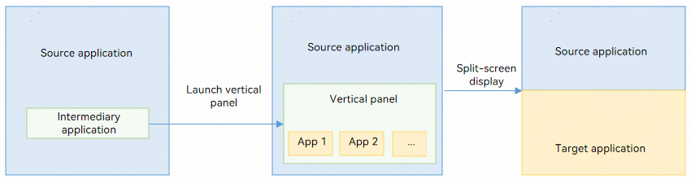

# @ohos.app.ability.verticalPanelManager (Vertical Panel Management) (System API)

<!--Kit: Ability Kit-->
<!--Subsystem: Ability-->
<!--Owner: @yuhong35-->
<!--Designer: @xukeke-->
<!--Tester: @lixueqing513-->
<!--Adviser: @huipeizi-->

The module provides capabilities for vertical panel management. Currently, it only supports launching the vertical panel for application selection.

> **NOTE**
>
> The initial APIs of this module are supported since API version 20. Newly added APIs will be marked with a superscript to indicate their earliest API version.
>
> The APIs of this module can be used only in the stage model.
>
> The APIs provided by this module are system APIs.

## Modules to Import

```ts
import { verticalPanelManager } from '@kit.AbilityKit';
```

## verticalPanelManager.startVerticalPanel

startVerticalPanel(context: common.UIAbilityContext, wantParam: Record\<string, Object>, panelConfig: PanelConfig, panelStartCallback: PanelStartCallback): Promise\<void>

Launches a vertical panel for selecting a target application to start. This API must be called when the caller (source application) is running in the foreground. This API uses a promise to return the result.

As shown in the figure below, the source application ([sourceAppInfo](#panelconfig)), which is currently displayed on the screen, calls **startVerticalPanel** via an intermediary application (the launcher application) to launch the vertical panel. After the user manually selects the target application, the source and target applications automatically enter a split-screen layout.



**System capability**: SystemCapability.Ability.AppExtension.VerticalPanel

**System API**: This is a system API.

**Parameters**

| Name| Type| Mandatory| Description|
| -------- | -------- | -------- |  -------- |
| context | [common.UIAbilityContext](js-apis-inner-application-uiAbilityContext.md) | Yes| Context of the caller.|
| wantParam | Record<string, Object> | Yes| Parameters passed for starting the [UIExtensionAbility](js-apis-app-ability-uiExtensionAbility.md).|
| panelConfig | [PanelConfig](#panelconfig) | Yes| Configuration parameters of the vertical panel.|
| panelStartCallback | [PanelStartCallback](#panelstartcallback) | Yes| Callback for launching the vertical panel.|

**Return value**

| Name| Description|
| -------- |  -------- |
| Promise\<void> | Promise that returns no value.|

**Error codes**

For details about the error codes, see [Universal Error Codes](../errorcode-universal.md) and [Ability Error Codes](errorcode-ability.md).

| ID| Error Message|
| -------- | -------- |
| 202 | The application is not a system application. |
| 16000050 | Failed to connect to the system service or system server handle failed. |
| 16000135 | The main window of this ability of this context does not exits. |

**Example**

```ts
import { common, verticalPanelManager } from '@kit.AbilityKit';
import { BusinessError } from '@kit.BasicServicesKit';

@Entry
@Component
struct Index {
  @State message: string = 'StartVerticalPanel';

  build() {
    RelativeContainer() {
      Text(this.message)
        .id('StartVerticalPanel')
        .fontSize($r('app.float.page_text_font_size'))
        .fontWeight(FontWeight.Bold)
        .alignRules({
          center: { anchor: '__container__', align: VerticalAlign.Center },
          middle: { anchor: '__container__', align: HorizontalAlign.Center }
        })
        .onClick(() => {
          this.callStartVerticalPanelNapi();
        })
    }
    .height('100%')
    .width('100%');
  }

  // Construct parameters and call startVerticalPanel to launch the vertical panel.
  callStartVerticalPanelNapi() {
    // Param[0] UIAbilityContext
    const context = this.getUIContext().getHostContext() as common.UIAbilityContext;

    // Param[1] wantParam: Record<string, Object>
    let wantParam: Record<string, Object> = {
      'sceneType': 3,
      'destinationName': 'Lianqiu Lake R&D Center'
    };

    // Param[2] PanelConfig
    let sourceAppInfo: Record<string, string> = {};
    sourceAppInfo[verticalPanelManager.SOURCE_APP_BUNDLE_NAME] = 'com.huawei.hmos.browser';
    sourceAppInfo[verticalPanelManager.SOURCE_APP_MODULE_NAME] = 'entry';
    sourceAppInfo[verticalPanelManager.SOURCE_APP_ABILITY_NAME] = 'MainAbility';
    sourceAppInfo[verticalPanelManager.SOURCE_APP_WINDOW_ID] = '0';
    sourceAppInfo[verticalPanelManager.SOURCE_APP_SCREEN_MODE] = '1';

    let panelConfig: verticalPanelManager.PanelConfig = {
      type: verticalPanelManager.VerticalType.NAVIGATION,
      sourceAppInfo: sourceAppInfo
    };

    // Param[3] PanelStartCallback
    let callback: verticalPanelManager.PanelStartCallback = {
      onError: (code: number, name: string, message: string): void => {
        console.info(`startVerticalPanel onError code ${code} name: ${name} message: ${message}`);
      },
      onResult: (result: common.AbilityResult): void => {
        console.info(`startVerticalPanel onResult result ${JSON.stringify(result)}`);
      },
    };

    try {
      console.info(`call startVerticalPanel`);
      verticalPanelManager.startVerticalPanel(context, wantParam, panelConfig, callback)
        .then(() => {
          console.info(`call startVerticalPanel end`);
        })
        .catch((error: BusinessError) => {
          console.error(`call startVerticalPanel promise catch error : ${error}`);
        });
    } catch (error) {
      console.error(`call startVerticalPanel catch error : ${error}`);
    }
  }
}
```

## PanelConfig

Describes the configuration parameters of the vertical panel.

**System capability**: SystemCapability.Ability.AppExtension.VerticalPanel

| Name| Type| Read-Only| Optional| Description|
| -------- | -------- | -------- | -------- | -------- |
| type | [VerticalType](#verticaltype) | No| No| Type of the vertical panel.|
| sourceAppInfo | Record<string, string> | No| No| Information about the source application, including its bundle name, module name, ability name, window ID, and screen mode. When a target application is selected and started from the vertical panel, it automatically forms a split-screen layout with the source application.|

## VerticalType 

Enumerates the types of vertical panels that can be launched.

**System capability**: SystemCapability.Ability.AppExtension.VerticalPanel

**System API**: This is a system API.

| Name| Value| Description|
| -------- | -------- | -------- |
| NAVIGATION | 'navigation' | Navigation application. For details about **wantParam**, see the extended panel parameter description in [Using startAbilityByType to Start a Navigation Application](../../application-models/start-navigation-apps.md).|

## PanelStartCallback

Describes the callback for launching the vertical panel.

**System capability**: SystemCapability.Ability.AppExtension.VerticalPanel

**System API**: This is a system API.

| Name| Type| Read-Only| Optional| Description|
| -------- | -------- | -------- | -------- | -------- |
| onError | [OnErrorFn](#onerrorfn) | No| No| Callback invoked when launching the vertical panel fails.|
| onResult |  [OnResultFn](#onresultfn) | No| Yes| Callback invoked when the launched vertical panel is terminated.|

## OnErrorFn

type OnErrorFn = (code: number, name: string, message: string) => void

**System capability**: SystemCapability.Ability.AppExtension.VerticalPanel

**System API**: This is a system API.

**Parameters**

| Name| Type | Mandatory | Description|
| -------- | -------- | -------- | -------- |
| code | number | Yes| Result code returned when the UIExtensionAbility fails to start.|
| name | string | Yes| Name returned when the UIExtensionAbility fails to start.|
| message | string | Yes| Error information returned when the UIExtensionAbility fails to start.|

**Example**

```ts
let callback: verticalPanelManager.PanelStartCallback = {
  onError: (code: number, name: string, message: string): void => {
    console.info(`startVerticalPanel onError code ${code} name: ${name} message: ${message}`);
  },
  onResult: (result: common.AbilityResult):void => {
    console.info(`startVerticalPanel onResult result ${JSON.stringify(result)}`);
  },
}
```

## OnResultFn

type OnResultFn = (parameter: AbilityResult) => void

**System capability**: SystemCapability.Ability.AppExtension.VerticalPanel

**System API**: This is a system API.

**Parameters**

| Name| Type| Mandatory | Description|
| -------- | -------- | -------- | -------- |
| parameter | [AbilityResult](js-apis-inner-ability-abilityResult.md) | Yes| Parameters returned when the UIExtensionAbility calls [terminateSelfWithResult](js-apis-inner-application-uiExtensionContext.md#terminateselfwithresult12).|

**Example**

```ts
let callback: verticalPanelManager.PanelStartCallback = {
  onError: (code: number, name: string, message: string): void => {
    console.info(`startVerticalPanel onError code ${code} name: ${name} message: ${message}`);
  },
  onResult: (result: common.AbilityResult):void => {
    console.info(`startVerticalPanel onResult result ${JSON.stringify(result)}`);
  },
}
```

## Constants

**System capability**: SystemCapability.Ability.AppExtension.VerticalPanel

**System API**: This is a system API.

| Name| Type| Value| Description|
| -------- | -------- | -------- | -------- |
| SOURCE_APP_BUNDLE_NAME | string | 'bundleName' | Constant string **bundleName**, which indicates the bundle name of the source application. It can be used as a key in [sourceAppInfo](#panelconfig).|
| SOURCE_APP_MODULE_NAME | string | 'moduleName' | Constant string **moduleName**, which indicates the module name of the source application. It can be used as a key in [sourceAppInfo](#panelconfig).|
| SOURCE_APP_ABILITY_NAME | string | 'abilityName' | Constant string **abilityName**, which indicates the ability name of the source application. It can be used as a key in [sourceAppInfo](#panelconfig).|
| SOURCE_APP_WINDOW_ID | string | 'windowId' | Constant string **windowId**, which indicates the window ID of the source application. It can be used as a key in [sourceAppInfo](#panelconfig).|
| SOURCE_APP_SCREEN_MODE | string | 'screenMode' | Constant string **screenMode**, which indicates the screen mode of the source application. Currently, the vertical panel can be launched successfully only when the value is **1**. It can be used as a key in [sourceAppInfo](#panelconfig).|
