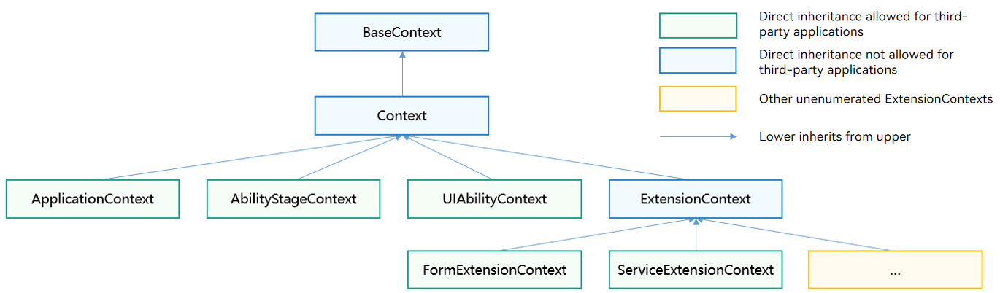

# Context (Context Base Class of the Stage Model)

<!--Kit: Ability Kit-->
<!--Subsystem: Ability-->
<!--Owner: @zexin_c-->
<!--Designer: @li-weifeng2024-->
<!--Tester: @liangchengguang-->
<!--Adviser: @HelloCrease-->
<!-- md-trans-meta sourceCommit=601018e54f34cdc857359aef393bd4ded508397e translatedAt=2026-09-03T11:54:54.660Z pushedAt=2026-09-05T10:47:30.725Z -->

Context is the base class of contexts in the stage model. It is mainly used to access the resources of a specific application and provide callback capabilities for application-level operations.

> **NOTE**
>
>  - The initial APIs of this module are supported since API version 9. Newly added APIs will be marked with a superscript to indicate their earliest API version.
>  - The APIs of this module can be used only in the stage model.

## Inheritance and Holding Relationships of Different Context Types
- Inheritance relationships among different types of context

  

- Holding relationships among different types of context

  

> **NOTE**
>
> [UIContext](../../reference/apis-arkui/arkts-apis-uicontext-uicontext.md) refers to the context of a UI instance, which is used to associate windows with UI pages. It is not directly related to the application context discussed in this topic and does not involve inheritance or holding relationships.

## Modules to Import

```ts
import { common } from '@kit.AbilityKit';
```

## Context

Represents the context for the ability or application. It allows access to application-specific resources.

### Properties

**System capability**: SystemCapability.Ability.AbilityRuntime.Core

| Name                 | Type    | Read-only  | Optional  | Description                                                              |
|---------------------| ------ | ---- | ---- |------------------------------------------------------------------|
| resourceManager     | resmgr.[ResourceManager](../apis-localization-kit/js-apis-resource-manager.md#resourcemanager) | No   | No   | Object for resource management.<br>**Atomic service API**: This API can be used in atomic services since API version 11.|
| applicationInfo     | [ApplicationInfo](js-apis-bundleManager-applicationInfo.md) | No   | No   | Application information.<br>**Atomic service API**: This API can be used in atomic services since API version 11.|
| cacheDir            | string | No   | No   | Cache directory. For details, see [Application Sandbox](../../file-management/app-sandbox-directory.md).<br>**Atomic service API**: This API can be used in atomic services since API version 11.|
| tempDir             | string | No   | No   | Temporary directory. For details, see [Application Sandbox](../../file-management/app-sandbox-directory.md).<br>**Atomic service API**: This API can be used in atomic services since API version 11.|
| resourceDir<sup>11+</sup>         | string | No    | No    | Resource directory.<br>**Note:** The developer needs to manually create the `resfile` directory under the `\<module-name>\resources` path. The created `resfile` directory can only be accessed in read-only mode.<br>**Atomic service API:** Since API version 11, this API is supported in atomic services. |
| filesDir            | string | No   | No   | File directory. For details, see [Application Sandbox](../../file-management/app-sandbox-directory.md).<br>**Atomic service API**: This API can be used in atomic services since API version 11.|
| databaseDir         | string | No   | No   | Database directory. For details, see [Application Sandbox](../../file-management/app-sandbox-directory.md).<br>**Atomic service API**: This API can be used in atomic services since API version 11.|
| preferencesDir      | string | No   | No   | Preferences directory. For details, see [Application Sandbox](../../file-management/app-sandbox-directory.md).<br>**Atomic service API**: This API can be used in atomic services since API version 11.|
| bundleCodeDir       | string | No    | No    | Installation package directory. The path cannot be concatenated to access resource files. Use [Resource Manager](../apis-localization-kit/js-apis-resource-manager.md) to access resources. For details, see [Application Sandbox Directory](../../file-management/app-sandbox-directory.md).<br/>**Atomic service API:** Since API version 11, this API is supported in atomic services. |
| distributedFilesDir | string | No   | No   | Distributed file directory. For details, see [Application Sandbox](../../file-management/app-sandbox-directory.md).<br>**Atomic service API**: This API can be used in atomic services since API version 11.|
| cloudFileDir<sup>12+</sup>        | string | No   | No   | Cloud file directory.<br>**Atomic service API**: This API can be used in atomic services since API version 12.   |
| logFileDir<sup>22+</sup>        | string | No   | No   | Directory for storing log files.<br>**Atomic service API**: This API can be used in atomic services since API version 22.   |
| eventHub            | [EventHub](js-apis-inner-application-eventHub.md) | No    | No    | Event hub, which provides the capabilities of subscribing to, unsubscribing from, and triggering events.<br>**Atomic service API:** Since API version 11, this API is supported in atomic services. |
| area                | contextConstant.[AreaMode](js-apis-app-ability-contextConstant.md#areamode) | No   | No   | Information about file partitions, which are divided according to the encryption level specified by [AreaMode](js-apis-app-ability-contextConstant.md#areamode).<br>**Atomic service API**: This API can be used in atomic services since API version 11.|
| processName<sup>18+</sup> | string | No  | No| Process name of the current application.<br>**Atomic service API**: This API can be used in atomic services since API version 18.|

### createModuleContext<sup>(deprecated)</sup>

createModuleContext(moduleName: string): Context

Creates the context based on the module name.

> **NOTE**
>
> - Only the contexts of other modules in the current application and the contexts of in-application HSPs (shared packages) can be obtained. Contexts of other applications are not supported.
>
> - This API is supported since API version 9 and deprecated since API version 12. You are advised to use [application.createModuleContext](./js-apis-app-ability-application.md#applicationcreatemodulecontext) instead. Otherwise, resource acquisition may be abnormal.
>
> - Since creating a module context involves resource query and initialization, which is relatively time-consuming, do not call createModuleContext frequently or multiple times to create multiple Context instances in scenarios with high requirements on application smoothness, so as to avoid affecting user experience.

**Atomic service API**: This API can be used in atomic services since API version 11.

**System capability**: SystemCapability.Ability.AbilityRuntime.Core

**Parameters**

| Name      | Type                    | Mandatory  | Description           |
| -------- | ---------------------- | ---- | ------------- |
| moduleName | string | Yes   | Module name.|

**Return value**

| Type| Description|
| -------- | -------- |
| Context | Context of a module, which can be used to access module resources, obtain the module path, and perform module-level operations. |

**Error codes**

For details about the error codes, see [Universal Error Codes](../errorcode-universal.md).

| ID| Error Message|
| ------- | -------------------------------- |
| 401 | Parameter error. Possible causes: 1.Mandatory parameters are left unspecified. 2.Incorrect parameter types. |

**Example**

```ts
import { common, UIAbility } from '@kit.AbilityKit';
import { BusinessError } from '@kit.BasicServicesKit';

export default class EntryAbility extends UIAbility {
  onCreate() {
    console.info('MyAbility onCreate');
    let moduleContext: common.Context;
    try {
      // Create a context based on the module name.
      moduleContext = this.context.createModuleContext('entry');
    } catch (error) {
      console.error(`createModuleContext failed, error.code: ${(error as BusinessError).code}, error.message: ${(error as BusinessError).message}`);
    }
  }
}
```

### getApplicationContext

getApplicationContext(): ApplicationContext

Obtains the current application context. It provides capabilities such as application-level event subscription and is shared by all UIAbilities in the application. For details, see [ApplicationContext](js-apis-inner-application-applicationContext.md).

**Atomic service API**: This API can be used in atomic services since API version 11.

**System capability**: SystemCapability.Ability.AbilityRuntime.Core

**Return value**

| Type| Description|
| -------- | -------- |
| [ApplicationContext](js-apis-inner-application-applicationContext.md) | Application context, which provides application-level context capabilities, including application lifecycle management and environment variable configuration. |

**Error codes**

For details about the error codes, see [Universal Error Codes](../errorcode-universal.md).

| ID| Error Message|
| ------- | -------------------------------- |
| 401 | Parameter error. Possible causes: 1.Mandatory parameters are left unspecified. 2.Incorrect parameter types. |

**Example**

```ts
import { common, UIAbility } from '@kit.AbilityKit';
import { BusinessError } from '@kit.BasicServicesKit';

export default class EntryAbility extends UIAbility {
  onCreate() {
    console.info('MyAbility onCreate');
    let applicationContext: common.Context;
    try {
      // Obtain the current application context.
      applicationContext = this.context.getApplicationContext();
    } catch (error) {
      console.error(`Failed to get application context. Code: ${(error as BusinessError).code}, message: ${(error as BusinessError).message}`);
    }
  }
}
```

### getGroupDir<sup>10+</sup>

getGroupDir(dataGroupID: string): Promise\<string>

Obtains the shared directory based on a group ID. This API uses a promise to return the result.

**Atomic service API**: This API can be used in atomic services since API version 11.

**System capability**: SystemCapability.Ability.AbilityRuntime.Core

**Parameters**

| Name      | Type                    | Mandatory  | Description           |
| -------- | ---------------------- | ---- | ------------- |
| [dataGroupID](../apis-arkdata/js-apis-data-preferences.md#options10) | string | Yes   | Group ID, which is assigned by the system when an application of the atomic service type is created.|

**Return value**

| Type| Description|
| -------- | -------- |
| Promise\<string> | Promise used to return the result. If no shared directory exists, null is returned. Only the encryption level EL2 is supported.|

**Error codes**

For details about the error codes, see [Universal Error Codes](../errorcode-universal.md) and [Ability Error Codes](errorcode-ability.md).

| ID| Error Message|
| ------- | -------------------------------- |
| 401 | Parameter error. Possible causes: 1.Mandatory parameters are left unspecified. 2.Incorrect parameter types. |
| 16000011 | The context does not exist. |

**Example**

```ts
import { common, UIAbility } from '@kit.AbilityKit';
import { BusinessError } from '@kit.BasicServicesKit';

export default class EntryAbility extends UIAbility {
  onCreate() {
    console.info('MyAbility onCreate');
    let groupId = '1';
    let getGroupDirContext: common.Context = this.context;
    try {
      // Obtain the shared directory by group ID (Promise mode).
      getGroupDirContext.getGroupDir(groupId).then(data => {
        console.info('getGroupDir result:' + data);
      })
    } catch (error) {
      console.error(`Failed to get group directory. Code: ${(error as BusinessError).code}, message: ${(error as BusinessError).message}`);
    }
  }
}
```

### getGroupDir<sup>10+</sup>

getGroupDir(dataGroupID: string, callback: AsyncCallback\<string>): void

Obtains the shared directory based on a group ID. This API uses an asynchronous callback to return the result.

**Atomic service API**: This API can be used in atomic services since API version 11.

**System capability**: SystemCapability.Ability.AbilityRuntime.Core

**Parameters**

| Name      | Type                    | Mandatory  | Description           |
| -------- | ---------------------- | ---- | ------------- |
| [dataGroupID](../apis-arkdata/js-apis-data-preferences.md#options10) | string | Yes   | Group ID, which is assigned by the system when an application of the atomic service type is created.|
| callback | AsyncCallback\<string> | Yes   | Callback used to return the result. If the API call is successful, **err** is **undefined** and **data** is the shared directory obtained (or empty if or is empty if non-existent). Otherwise, an error object is returned.<br>Note: Only the EL2 encryption level is supported.|

**Error codes**

For details about the error codes, see [Universal Error Codes](../errorcode-universal.md) and [Ability Error Codes](errorcode-ability.md).

| ID| Error Message|
| ------- | -------------------------------- |
| 401 | Parameter error. Possible causes: 1.Mandatory parameters are left unspecified. 2.Incorrect parameter types. |
| 16000011 | The context does not exist. |

**Example**

```ts
import { common, UIAbility } from '@kit.AbilityKit';
import { BusinessError } from '@kit.BasicServicesKit';

export default class EntryAbility extends UIAbility {
  onCreate() {
    console.info('MyAbility onCreate');
    let getGroupDirContext: common.Context = this.context;

    // Obtain the shared directory by group ID (callback mode).
    getGroupDirContext.getGroupDir('1', (err: BusinessError, data) => {
      if (err) {
        console.error(`getGroupDir failed, err: ${JSON.stringify(err)}`);
      } else {
        console.info(`getGroupDir result is: ${JSON.stringify(data)}`);
      }
    });
  }
}
```

### createAreaModeContext<sup>18+</sup>

createAreaModeContext(areaMode: contextConstant.AreaMode): Context

Creates the application context with a specific data encryption level. Developers can call this API to create contexts of different encryption levels to obtain the corresponding sandbox paths.

**Atomic service API**: This API can be used in atomic services since API version 18.

**System capability**: SystemCapability.Ability.AbilityRuntime.Core

**Parameters**

| Name  | Type                                                        | Mandatory| Description                    |
| -------- | ------------------------------------------------------------ | ---- | ------------------------ |
| areaMode | [contextConstant.AreaMode](js-apis-app-ability-contextConstant.md#areamode) | Yes  | Data encryption level.|

**Return value**

| Type   | Description                  |
| ------- | ---------------------- |
| Context | Context with a specified data encryption level, which can be used to obtain the sandbox path of the corresponding encryption level and access files and data of the corresponding encryption level. |

**Example**

```ts
import { common, UIAbility, contextConstant } from '@kit.AbilityKit';
import { hilog } from '@kit.PerformanceAnalysisKit';
import { BusinessError } from '@kit.BasicServicesKit';

export default class EntryAbility extends UIAbility {
  onCreate() {
    hilog.info(0x0000, 'testTag', '%{public}s', 'Ability onCreate');
    let areaMode: contextConstant.AreaMode = contextConstant.AreaMode.EL2;
    let areaModeContext: common.Context;
    try {
      // Create an application context with a specific data encryption level.
      areaModeContext = this.context.createAreaModeContext(areaMode);
    } catch (error) {
      const err: BusinessError = error as BusinessError;
    hilog.error(0x0000, 'testTag', 'Failed to create area mode context. Code: %{public}d, message: %{public}s', err.code, err.message);
    }
  }
}
```

### createDisplayContext<sup>15+</sup>

createDisplayContext(displayId: number): Context

Creates an application context based on the specified display ID with screen information (including [ScreenDensity](../apis-localization-kit/js-apis-resource-manager.md#screendensity) and [Direction](../apis-localization-kit/js-apis-resource-manager.md#direction)).

**Atomic service API**: This API can be used in atomic services since API version 15.

**System capability**: SystemCapability.Ability.AbilityRuntime.Core

**Parameters**

| Name  | Type                                                        | Mandatory| Description                    |
| -------- | ------------------------------------------------------------ | ---- | ------------------------ |
| [displayId](../apis-arkui/arkts-apis-window-i.md#windowproperties) | number | Yes   | Display ID.|

**Return value**

| Type   | Description                  |
| ------- | ---------------------- |
| [Context](#context) | Context with the specified screen information.|

**Error codes**

For details about the error codes, see [Universal Error Codes](../errorcode-universal.md).

| ID| Error Message                                                    |
| -------- | ------------------------------------------------------------ |
| 401      | Parameter error. Possible causes: 1.Mandatory parameters are left unspecified. 2.Incorrect parameter types. |

**Example**

```ts
import { common, UIAbility } from '@kit.AbilityKit';
import { hilog } from '@kit.PerformanceAnalysisKit';
import { BusinessError } from '@kit.BasicServicesKit';

export default class EntryAbility extends UIAbility {
  onCreate() {
    hilog.info(0x0000, 'testTag', '%{public}s', 'Ability onCreate');
    let displayContext: common.Context;
    try {
      // Obtain displayId through APIs such as display.getDefaultDisplay(). For details, see the screen management development guide.
      displayContext = this.context.createDisplayContext(0);
    } catch (error) {
      const err: BusinessError = error as BusinessError;
      hilog.error(0x0000, 'testTag', 'Failed to create display context. Code: %{public}d, message: %{public}s', err.code, err.message);
    }
  }
}
```

### isContextOf

isContextOf(contextType: contextConstant.ContextType): boolean

Checks whether the current context is of the specified ContextType.

**Since**: 26.0.0

**Atomic service API**: This API can be used in atomic services since API version 26.0.0.

**System capability**: SystemCapability.Ability.AbilityRuntime.Core

**Parameters**

| Name   | Type                                                         | Mandatory | Description                     |
| -------- | ------------------------------------------------------------ | ---- | ------------------------ |
| contextType | [contextConstant.ContextType](js-apis-app-ability-contextConstant.md#contexttype) | Yes    | Context type. |

**Return value**

| Type    | Description                   |
| ------- | ---------------------- |
| boolean | Whether the context is of the specified type. The value true indicates that the context is of the specified type, and false indicates the opposite. |

**Example**

```ts
import { UIAbility, contextConstant } from '@kit.AbilityKit';
import { hilog } from '@kit.PerformanceAnalysisKit';

export default class EntryAbility extends UIAbility {
  onCreate() {
    hilog.info(0x0000, 'testTag', `%{public}s`, 'Ability onCreate');
    // Check whether the current Context is of the specified ContextType type.
    let result = this.context.isContextOf(contextConstant.ContextType.UIABILITY_CONTEXT);
    hilog.info(0x0000, 'testTag', `match contextType result is:%{public}s`, JSON.stringify(result));
  }
}
```