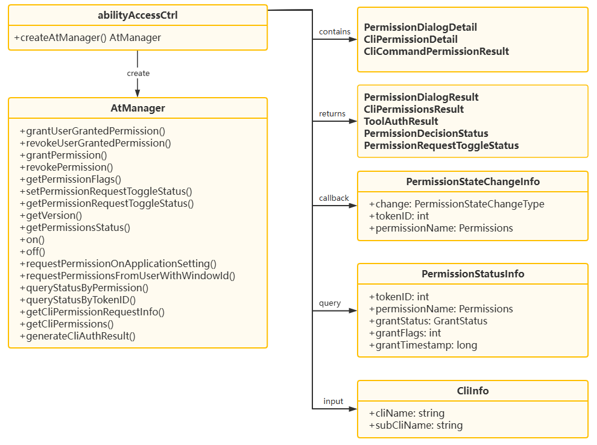

# @ohos.privacyManager (Privacy Management) (System API)

<!--Kit: Ability Kit-->
<!--Subsystem: Security-->
<!--Owner: @xia-bubai-->
<!--Designer: @linshuqing; @hehehe-li-->
<!--Tester: @leiyuqian-->
<!--Adviser: @zengyawen-->
<!-- md-trans-meta sourceCommit=279f58a08395cb7d60f140e1aaa1ae4b3733282e translatedAt=2026-06-11T08:19:38.418Z pushedAt=2026-06-15T12:10:43.297Z -->

## Module Overview

This module primarily provides privacy management APIs such as permission usage records, supporting system applications in recording, querying, listening to, and controlling the usage of sensitive permissions. A permission usage record describes when a sensitive permission was used, how it was used, whether it is currently in use, and whether these usage records are allowed to be recorded or queried.

This module is mainly used in the following scenarios:

- Adding/querying the sensitive permission access records of a specified application.

- Subscribing to permission usage status change events, sensing changes in permission usage from unused to foreground use and background use, and linking with business logic.

- Controlling the permission access record toggle for the current user.

- Querying whether a certain permission is currently being used.

> **NOTE**
>
> - The initial APIs of this module are supported since API version 9. Newly added APIs will be marked with a superscript to indicate their earliest API version.
> - The APIs provided by this module are system APIs.

## Introduction to Key Classes/Interfaces

### Core Enum Types

- **[PermissionUsageFlag](#permissionusageflag):** Enum for querying permission usage records, used to specify querying summary data or detailed data.

- **[PermissionActiveStatus](#permissionactivestatus):** Enum for permission usage status change types, used to indicate unused, foreground use, or background use status.

- **[PermissionUsedType](#permissionusedtype12):** Enum for sensitive permission usage types, used to indicate the use of sensitive permissions through normal authorization, Picker, or security components.

### Core Interface Types

- **[PermissionUsedRequest](#permissionusedrequest):** Permission usage record query request object, used to specify the query application, permission, time range, and query method.

- **[PermissionUsedResponse](#permissionusedresponse):** Permission usage record query response object, used to return the query time range and a collection of application-level records.

- **[BundleUsedRecord](#bundleusedrecord):** Application or device-level permission usage record object, used to return the permission access records of a specific application or remote device.

- **[PermissionUsedRecord](#permissionusedrecord):** Access record object for a single permission, used to return the number of accesses, number of denials, last access time, and detailed records.

- **[UsedRecordDetail](#usedrecorddetail):** Single access record detail object, used to return information such as access status, timestamp, access duration, and usage type.

- **[ActiveChangeResponse](#activechangeresponse):** Permission usage status change event object, used to return details of permission active status changes.

- **[PermissionUsedTypeInfo](#permissionusedtypeinfo12):** Permission usage type information object, used to return the usage type when an application accesses a sensitive permission.

- **[AddPermissionUsedRecordOptions](#addpermissionusedrecordoptions12):** Optional parameter object for adding a permission usage record, used to specify the sensitive permission usage type and extension identity.

- **[PermissionUsingOptions](#permissionusingoptions):** Optional parameter object for permission usage, used to specify the extension identity.

### Core Function Types

- **[addPermissionUsedRecord](#privacymanageraddpermissionusedrecord):** Adds a permission usage record.

- **[getPermissionUsedRecord](#privacymanagergetpermissionusedrecord):** Queries permission usage records.

- **[setPermissionUsedRecordToggleStatus](#privacymanagersetpermissionusedrecordtogglestatus18):** Sets the permission usage record toggle status.

- **[getPermissionUsedRecordToggleStatus](#privacymanagergetpermissionusedrecordtogglestatus18):** Queries the permission usage record toggle status.

- **[startUsingPermission](#privacymanagerstartusingpermission):** Marks the start of using a sensitive permission.

- **[stopUsingPermission](#privacymanagerstopusingpermission):** Marks the stop of using a sensitive permission.

- **[checkPermissionInUse](#privacymanagercheckpermissioninuse):** Checks whether a specified permission is currently being used.

- **[on](#privacymanageron):** Subscribes to permission usage status change events.

- **[off](#privacymanageroff):** Unsubscribes from permission usage status change events.

- **[getPermissionUsedTypeInfos](#privacymanagergetpermissionusedtypeinfos12):** Queries sensitive permission access type information.

### Core Class

- **privacyManager:** Provides the core class for privacy management.



### API Combination Usage Description

Scenario 1: Maintaining permission usage records.

Scenario Description:

- When a system application accesses a sensitive permission, it needs to call [startUsingPermission](#privacymanagerstartusingpermission) at the start of use and [stopUsingPermission](#privacymanagerstopusingpermission) at the end of use, so that the system can sense the corresponding permission usage status change;

- After a system application accesses a sensitive permission, it can call [addPermissionUsedRecord](#privacymanageraddpermissionusedrecord) so that the system records the corresponding sensitive permission access event.

The typical usage flow is as follows:

```ts
import { privacyManager, Permissions } from '@kit.AbilityKit';

let tokenID: number = 0; // For the method to obtain tokenID, refer to the description in the relevant BundleInfo section. refer to the description in the relevant BundleInfo section.
let permissionName: Permissions = 'ohos.permission.CAMERA';
let pid: number = 0; // It can be obtained through rpc.IPCSkeleton.getCallingPid().eton.getCallingPid().
let usedType: privacyManager.PermissionUsedType = privacyManager.PermissionUsedType.NORMAL_TYPE;
let successCount: number = 1;
let failCount: number = 0;
let options: privacyManager.AddPermissionUsedRecordOptions = {
  usedType: privacyManager.PermissionUsedType.NORMAL_TYPE
};

// 1. Mark the application as starting to use a sensitive permission.
await privacyManager.startUsingPermission(tokenID, permissionName, pid, usedType);

// 2. Supplement the access record after the process ends.
await privacyManager.addPermissionUsedRecord(tokenID, permissionName, successCount, failCount, options);

// 3. Mark the application as ending the use of a sensitive permission.
await privacyManager.stopUsingPermission(tokenID, permissionName, pid);
```

Scenario 2: Querying permission usage records.

Scenario Description: When a system application needs to query the historical usage of sensitive permissions, it can construct a [PermissionUsedRequest](#permissionusedrequest) to specify the query scope, and then call [getPermissionUsedRecord](#privacymanagergetpermissionusedrecord) to obtain historical records such as access count, timestamp, and duration. If it needs to query the access method classification of sensitive permissions (normal authorization, Picker, or security component), it can call [getPermissionUsedTypeInfos](#privacymanagergetpermissionusedtypeinfos12).

The typical usage flow is as follows:

```ts
import { privacyManager, Permissions } from '@kit.AbilityKit';

let tokenID: number = 0; // For the method to obtain tokenID, refer to the description in the relevant BundleInfo section.
let permissionName: Permissions = 'ohos.permission.CAMERA';
let request: privacyManager.PermissionUsedRequest = {
  tokenId: tokenID,
  permissionNames: [permissionName],
  beginTime: 0,
  endTime: 0,
  flag: privacyManager.PermissionUsageFlag.FLAG_PERMISSION_USAGE_DETAIL
};

// 1. Query historical permission usage records.
await privacyManager.getPermissionUsedRecord(request);

// 2. Query sensitive permission access type information.
await privacyManager.getPermissionUsedTypeInfos(tokenID, permissionName);
```

Scenario 3: Listening to and checking permission usage status.

Scenario Description: When a system application needs to sense whether a sensitive permission is currently in use, or link business processes when the permission usage status changes—for example, displaying the real-time permission usage status on the permission management interface, triggering a security audit when a permission is used, or issuing an alert when abnormal permission usage is detected—it can use a combination of [checkPermissionInUse](#privacymanagercheckpermissioninuse), [on](#privacymanageron), and [off](#privacymanageroff).

The typical usage flow is as follows:

```ts
import { privacyManager, Permissions } from '@kit.AbilityKit';

let permissionName: Permissions = 'ohos.permission.CAMERA';
let permissionList: Array<Permissions> = [permissionName];
let callback: (data: privacyManager.ActiveChangeResponse) => void =
  (data: privacyManager.ActiveChangeResponse): void => {
    console.info(`receive permission state change, data: ${JSON.stringify(data)}`);
  };

// 1. Query whether the current permission is being used.
privacyManager.checkPermissionInUse(permissionName);

// 2. Subscribe to usage status changes for a specified permission.
privacyManager.on('activeStateChange', permissionList, callback);

// 3. Unsubscribe when no longer needed.
privacyManager.off('activeStateChange', permissionList, callback);
```

## Modules to Import

```ts
import { privacyManager } from '@kit.AbilityKit';
```

## privacyManager.addPermissionUsedRecord

addPermissionUsedRecord(tokenID: number, permissionName: Permissions, successCount: number, failCount: number, options?: AddPermissionUsedRecordOptions): Promise&lt;void&gt;

When an application protected by a permission is called by another service or application, this API can be used to add a permission usage record. It is recommended to call this API after accessing a sensitive permission, so that the system records the corresponding sensitive permission access event. This API uses a promise to return the result.

The permission usage record includes the application identity of the caller, the name of the application permission used, and the number of successful and failed accesses to this application by the caller.

The permission usage record is controlled by the toggle status set by [setPermissionUsedRecordToggleStatus](#privacymanagersetpermissionusedrecordtogglestatus18). When the toggle is off, calling this API will not generate a permission usage record.

**System API**: This is a system API.

**Required permissions**: ohos.permission.PERMISSION_USED_STATS

**System capability**: SystemCapability.Security.AccessToken

**Parameters**

| Name  | Type                | Mandatory| Description                                      |
| -------- | -------------------  | ---- | ------------------------------------------ |
| tokenID   |  number   | Yes   | Caller's application identity identifier. It can be obtained through the accessTokenId field in [ApplicationInfo](js-apis-bundleManager-applicationInfo.md#applicationinfo-1) of the application's [BundleInfo](js-apis-bundleManager-bundleInfo.md). This parameter must be an integer greater than 0. Passing 0 returns error code 12100001.|
| permissionName | [Permissions](../../security/AccessToken/app-permissions.md) | Yes   | Name of the permission to be recorded. The permission name length cannot exceed 256 characters. Passing an invalid value returns error code 12100001. |
| successCount | number | Yes   | Number of successful accesses. The value must be a non-negative integer. Passing an invalid value returns error code 12100001. |
| failCount | number | Yes   | Number of failed accesses. The value must be a non-negative integer. Passing an invalid value returns error code 12100001. |
| options<sup>12+</sup> | [AddPermissionUsedRecordOptions](#addpermissionusedrecordoptions12) | No   | Optional parameter for adding a permission usage record, used to specify the sensitive permission usage type and extension identity. Pass this parameter when you need to distinguish the permission access method (such as access via Picker or security control) or identify the caller's extension identity.<br>usedType: Supported from API version 12.<br>Default value: NORMAL_TYPE.<br>enhancedIdentity: Supported from API version 26.0.0, with a length not exceeding 48 characters.<br>Default value: "". |

**Return value**

| Type         | Description                               |
| :------------ | :---------------------------------- |
| Promise&lt;void&gt; | Promise that returns no value. |

**Error codes**

For details about the error codes, see [Universal Error Codes](../errorcode-universal.md) and [Access Control Error Codes](errorcode-access-token.md).

| ID| Error Message|
| -------- | -------- |
| 201 | Permission denied. Interface caller does not have permission "ohos.permission.PERMISSION_USED_STATS". |
| 202 | Not system app. Interface caller is not a system app. |
| 401 | Parameter error. Possible causes: 1.Mandatory parameters are left unspecified; 2.Incorrect parameter types. |
| 12100001 | Invalid parameter. The tokenID is 0, the permissionName exceeds 256 characters, the count value is invalid, usedType in [AddPermissionUsedRecordOptions](#addpermissionusedrecordoptions12) is invalid, or the enhancedIdentity in [AddPermissionUsedRecordOptions](#addpermissionusedrecordoptions12) exceeds 48 characters. |
| 12100002 | The specified tokenID does not exist or refer to an application process. |
| 12100003 | The specified permission does not exist or is not a user_grant permission. |
| 12100007 | The service is abnormal. |
| 12100008 | Out of memory. |
| 12100009 | Common inner error. A database error occurs. |

**Example**

```ts
import { privacyManager } from '@kit.AbilityKit';
import { BusinessError } from '@kit.BasicServicesKit';

let tokenID: number = 0; // Obtained from the accessTokenId field of ApplicationInfo in the BundleInfo of the application.
// Add permission usage record
privacyManager.addPermissionUsedRecord(tokenID, 'ohos.permission.READ_AUDIO', 1, 0).then(() => {
  console.info('addPermissionUsedRecord success');
}).catch((err: BusinessError): void => {
  console.error(`addPermissionUsedRecord fail, code: ${err.code}, message: ${err.message}`);
});
// with options param
let options: privacyManager.AddPermissionUsedRecordOptions = {
  usedType: privacyManager.PermissionUsedType.PICKER_TYPE,
  enhancedIdentity: 'test'
};
privacyManager.addPermissionUsedRecord(tokenID, 'ohos.permission.READ_AUDIO', 1, 0, options).then(() => {
  console.info('addPermissionUsedRecord success');
}).catch((err: BusinessError): void => {
  console.error(`addPermissionUsedRecord fail, code: ${err.code}, message: ${err.message}`);
});
```

## privacyManager.addPermissionUsedRecord

addPermissionUsedRecord(tokenID: number, permissionName: Permissions, successCount: number, failCount: number, callback: AsyncCallback&lt;void&gt;): void

When an application protected by a permission is called by another service or application, this API can be used to add a permission usage record. It is recommended to call this API after accessing a sensitive permission, so that the system records the corresponding sensitive permission access event. This API uses an asynchronous callback to return the result.

The permission usage record includes the application identity of the caller, the name of the application permission used, and the number of successful and failed accesses to this application by the caller.

The permission usage record is controlled by the toggle status set by [setPermissionUsedRecordToggleStatus](#privacymanagersetpermissionusedrecordtogglestatus18). When the toggle is off, calling this API will not generate a permission usage record.

**System API**: This is a system API.

**Required permissions**: ohos.permission.PERMISSION_USED_STATS

**System capability**: SystemCapability.Security.AccessToken

**Parameters**

| Name  | Type                | Mandatory| Description                                      |
| -------- | -------------------  | ---- | ------------------------------------------ |
| tokenID   |  number   | Yes   | Caller's application identity identifier. It can be obtained through the accessTokenId field of [ApplicationInfo](js-apis-bundleManager-applicationInfo.md#applicationinfo-1) in the application's [BundleInfo](js-apis-bundleManager-bundleInfo.md). This parameter must be an integer greater than 0. Passing 0 returns error code 12100001.|
| permissionName | [Permissions](../../security/AccessToken/app-permissions.md) | Yes   | Name of the permission to be recorded. The permission name length cannot exceed 256 characters. Passing an invalid value returns error code 12100001. |
| successCount | number | Yes   | Number of successful accesses. The value must be a non-negative integer. Passing an invalid value returns error code 12100001. |
| failCount | number | Yes   | Number of failed accesses. The value must be a non-negative integer. Passing an invalid value returns error code 12100001. |
| callback | AsyncCallback&lt;void&gt; | Yes  | Callback used to return the result. If the operation is successful, **err** is **undefined**. Otherwise, **err** is an error object.|

**Error codes**

For details about the error codes, see [Universal Error Codes](../errorcode-universal.md) and [Access Control Error Codes](errorcode-access-token.md).

| ID| Error Message|
| -------- | -------- |
| 201 | Permission denied. Interface caller does not have permission "ohos.permission.PERMISSION_USED_STATS". |
| 202 | Not system app. Interface caller is not a system app. |
| 401 | Parameter error. Possible causes: 1.Mandatory parameters are left unspecified; 2.Incorrect parameter types. |
| 12100001 | Invalid parameter. The tokenID is 0, the permissionName exceeds 256 characters, or the count value is invalid. |
| 12100002 | The specified tokenID does not exist or refer to an application process. |
| 12100003 | The specified permission does not exist or is not a user_grant permission. |
| 12100007 | The service is abnormal. |
| 12100008 | Out of memory. |
| 12100009 | Common inner error. A database error occurs. |

**Example**

```ts
import { privacyManager } from '@kit.AbilityKit';
import { BusinessError } from '@kit.BasicServicesKit';

let tokenID: number = 0; // Obtained from the accessTokenId field of ApplicationInfo in the BundleInfo of the application.
// Add permission usage record
privacyManager.addPermissionUsedRecord(tokenID, 'ohos.permission.READ_AUDIO', 1, 0, (err: BusinessError, data: void) => {
  if (err) {
    console.error(`addPermissionUsedRecord fail, code: ${err.code}, message: ${err.message}`);
  } else {
    console.info('addPermissionUsedRecord success');
  }
});
```

## privacyManager.getPermissionUsedRecord

getPermissionUsedRecord(request: PermissionUsedRequest): Promise&lt;PermissionUsedResponse&gt;

Obtains historical permission usage records, which can be used in permission auditing or security monitoring scenarios, such as checking an application's usage of sensitive permissions within a specified time period. This API uses a promise to return the result.

**System API**: This is a system API.

**Required permissions**: ohos.permission.PERMISSION_USED_STATS

**System capability**: SystemCapability.Security.AccessToken

**Parameters**

| Name  | Type                | Mandatory| Description                                      |
| -------- | -------------------  | ---- | ------------------------------------------ |
| request   |  [PermissionUsedRequest](#permissionusedrequest)   | Yes  | Request for querying permission usage records.             |

**Return value**

| Type         | Description                               |
| :------------ | :---------------------------------- |
| Promise<[PermissionUsedResponse](#permissionusedresponse)> | Promise used to return the queried permission usage record.|

**Error codes**

For details about the error codes, see [Universal Error Codes](../errorcode-universal.md) and [Access Control Error Codes](errorcode-access-token.md).

| ID| Error Message|
| -------- | -------- |
| 201 | Permission denied. Interface caller does not have permission "ohos.permission.PERMISSION_USED_STATS". |
| 202 | Not system app. Interface caller is not a system app. |
| 401 | Parameter error. Possible causes: 1.Mandatory parameters are left unspecified; 2.Incorrect parameter types. |
| 12100001 | Invalid parameter. The value of flag, begin, or end in request is invalid. |
| 12100007 | The service is abnormal. |

**Example**

```ts
import { privacyManager } from '@kit.AbilityKit';
import { BusinessError } from '@kit.BasicServicesKit';

let request: privacyManager.PermissionUsedRequest = {
    'tokenId': 1, // It can be obtained through the accessTokenId field of ApplicationInfo in the application's BundleInfo.
    'isRemote': false,
    'deviceId': 'device',
    'bundleName': 'bundle',
    'permissionNames': [],
    'beginTime': 0,
    'endTime': 1,
    'flag': privacyManager.PermissionUsageFlag.FLAG_PERMISSION_USAGE_DETAIL,
};

// Query historical permission usage records
privacyManager.getPermissionUsedRecord(request).then((data) => {
  console.info(`getPermissionUsedRecord success, result: ${data}`);
}).catch((err: BusinessError): void => {
  console.error(`getPermissionUsedRecord fail, code: ${err.code}, message: ${err.message}`);
});
```

## privacyManager.getPermissionUsedRecord

getPermissionUsedRecord(request: PermissionUsedRequest, callback: AsyncCallback&lt;PermissionUsedResponse&gt;): void

Obtains historical permission usage records, which can be used in permission auditing or security monitoring scenarios, such as checking an application's usage of sensitive permissions within a specified time period. This API uses an asynchronous callback to return the result.

**System API**: This is a system API.

**Required permissions**: ohos.permission.PERMISSION_USED_STATS

**System capability**: SystemCapability.Security.AccessToken

**Parameters**

| Name  | Type                | Mandatory| Description                                      |
| -------- | -------------------  | ---- | ------------------------------------------ |
| request | [PermissionUsedRequest](#permissionusedrequest) | Yes| Request for querying permission usage records.|
| callback | AsyncCallback<[PermissionUsedResponse](#permissionusedresponse)> | Yes | Callback used to return the result. If the record query is successful, **err** is **undefined**, and data is the queried permission usage record; otherwise, **err** is an error object. |

**Error codes**

For details about the error codes, see [Universal Error Codes](../errorcode-universal.md) and [Access Control Error Codes](errorcode-access-token.md).

| ID| Error Message|
| -------- | -------- |
| 201 | Permission denied. Interface caller does not have permission "ohos.permission.PERMISSION_USED_STATS". |
| 202 | Not system app. Interface caller is not a system app. |
| 401 | Parameter error. Possible causes: 1.Mandatory parameters are left unspecified; 2.Incorrect parameter types. |
| 12100001 | Invalid parameter. The value of flag, begin, or end in request is invalid. |
| 12100007 | The service is abnormal. |

**Example**

```ts
import { privacyManager } from '@kit.AbilityKit';
import { BusinessError } from '@kit.BasicServicesKit';

let request: privacyManager.PermissionUsedRequest = {
    'tokenId': 1, // It can be obtained through the accessTokenId field in the ApplicationInfo of the application's BundleInfo.
    'isRemote': false,
    'deviceId': 'device',
    'bundleName': 'bundle',
    'permissionNames': [],
    'beginTime': 0,
    'endTime': 1,
    'flag': privacyManager.PermissionUsageFlag.FLAG_PERMISSION_USAGE_DETAIL,
};

// Query historical permission usage records
privacyManager.getPermissionUsedRecord(request, (err: BusinessError, data: privacyManager.PermissionUsedResponse) => {
  if (err) {
    console.error(`getPermissionUsedRecord fail, code: ${err.code}, message: ${err.message}`);
  } else {
    console.info(`getPermissionUsedRecord success, result: ${data}`);
  }
});
```

## privacyManager.setPermissionUsedRecordToggleStatus<sup>18+</sup>

setPermissionUsedRecordToggleStatus(status: boolean): Promise&lt;void&gt;

Sets whether to record the permission usage of this user. Sets the permission usage record switch for this user. This API uses a promise to return the result.

When **status** is **true**, the [addPermissionUsedRecord](#privacymanageraddpermissionusedrecord) API can add usage records normally; when **status** is **false**, the [addPermissionUsedRecord](#privacymanageraddpermissionusedrecord) API does not generate permission usage records, and deletes the current user's historical records.

**System API**: This is a system API.

**Required permissions**: ohos.permission.PERMISSION_RECORD_TOGGLE

**System capability**: SystemCapability.Security.AccessToken

**Parameters**

| Name         | Type  | Mandatory| Description                                 |
| -------------- | ------ | ---- | ------------------------------------ |
| status        | boolean | Yes  | Setting of the permission usage record switch. The value **true** means the switch is toggled on; the value **false** means the opposite.|

**Return value**

| Type         | Description                                   |
| ------------- | --------------------------------------- |
| Promise&lt;void&gt; | Promise that returns no value.|

**Error codes**

For details about the error codes, see [Universal Error Codes](../errorcode-universal.md) and [Access Control Error Codes](errorcode-access-token.md).

| ID| Error Message|
| -------- | -------- |
| 201 | Permission denied. Interface caller does not have permission "ohos.permission.PERMISSION_RECORD_TOGGLE". |
| 202 | Not system app. Interface caller is not a system app. |
| 401 | Parameter error. Possible causes: 1.Mandatory parameters are left unspecified; 2.Incorrect parameter types. |
| 12100007 | The service is abnormal. |
| 12100009 | Common inner error. Possible causes: 1. A database error occurs; 2. Failed to query applications under the user. |

**Example**

```ts
import { privacyManager } from '@kit.AbilityKit';
import { BusinessError } from '@kit.BasicServicesKit';

// Set permission usage record switch status
privacyManager.setPermissionUsedRecordToggleStatus(true).then(() => {
  console.info('setPermissionUsedRecordToggleStatus success');
}).catch((err: BusinessError): void => {
  console.error(`setPermissionUsedRecordToggleStatus fail, code: ${err.code}, message: ${err.message}`);
});
```

## privacyManager.getPermissionUsedRecordToggleStatus<sup>18+</sup>

getPermissionUsedRecordToggleStatus(): Promise&lt;boolean&gt;

A system application can call this API to obtain the current user's permission usage record toggle status, for example, to display the current toggle setting status on the permission management interface. This API uses a promise to return the result.

**System API**: This is a system API.

**Required permissions**: ohos.permission.PERMISSION_USED_STATS

**System capability**: SystemCapability.Security.AccessToken

**Return value**

| Type         | Description                                   |
| ------------- | --------------------------------------- |
| Promise&lt;boolean&gt; | Promise used to return the result. The value **true** indicates that the switch status value of the current user is on, and **false** indicates that the switch status value of the current user is off.|

**Error codes**

For details about the error codes, see [Universal Error Codes](../errorcode-universal.md) and [Access Control Error Codes](errorcode-access-token.md).

| ID| Error Message|
| -------- | -------- |
| 201 | Permission denied. Interface caller does not have permission "ohos.permission.PERMISSION_USED_STATS". |
| 202 | Not system app. Interface caller is not a system app. |
| 12100007 | The service is abnormal. |

**Example**

```ts
import { privacyManager } from '@kit.AbilityKit';
import { BusinessError } from '@kit.BasicServicesKit';

// Query permission usage record switch status
privacyManager.getPermissionUsedRecordToggleStatus().then((status) => {
  console.info('getPermissionUsedRecordToggleStatus success');
  if (status == true) {
    console.info('get status is TRUE');
  } else {
    console.info('get status is FALSE');
  }
}).catch((err: BusinessError): void => {
  console.error(`getPermissionUsedRecordToggleStatus fail, code: ${err.code}, message: ${err.message}`);
});
```

## privacyManager.startUsingPermission

startUsingPermission(tokenID: number, permissionName: Permissions): Promise&lt;void&gt;

A system application can call this API to report the application's permission usage status in the foreground or background to the system. The privacy service notifies all subscribers of this permission usage status change event (refer to [on](#privacymanageron) for the subscription method). This API uses a promise to return the result.

After starting to use a permission, [stopUsingPermission](#privacymanagerstopusingpermission) must be called to stop using the permission when the usage ends.

**System API**: This is a system API.

**Required permissions**: ohos.permission.PERMISSION_USED_STATS

**System capability**: SystemCapability.Security.AccessToken

**Parameters**

| Name         | Type  | Mandatory| Description                                 |
| -------------- | ------ | ---- | ------------------------------------ |
| tokenID        | number | Yes   | Identity identifier of the target application. It can be obtained through the accessTokenId field of [ApplicationInfo](js-apis-bundleManager-applicationInfo.md#applicationinfo-1) in the application [BundleInfo](js-apis-bundleManager-bundleInfo.md). This parameter must be an integer greater than 0. Passing in 0 returns error code 12100001.|
| permissionName | [Permissions](../../security/AccessToken/app-permissions.md) | Yes   | Name of the permission to be used. The permission name length cannot exceed 256 characters. Passing an invalid value returns error code 12100001.|

**Return value**

| Type         | Description                                   |
| ------------- | --------------------------------------- |
| Promise&lt;void&gt; | Promise that returns no value.|

**Error codes**

For details about the error codes, see [Universal Error Codes](../errorcode-universal.md) and [Access Control Error Codes](errorcode-access-token.md).

| ID| Error Message|
| -------- | -------- |
| 201 | Permission denied. Interface caller does not have permission "ohos.permission.PERMISSION_USED_STATS". |
| 202 | Not system app. Interface caller is not a system app. |
| 401 | Parameter error. Possible causes: 1.Mandatory parameters are left unspecified; 2.Incorrect parameter types. |
| 12100001 | Invalid parameter. The tokenID is 0, the permissionName exceeds 256 characters, or the type of the specified tokenID is not of the application type. |
| 12100002 | (Deprecated in 12) The specified tokenID does not exist or refer to an application process. |
| 12100003 | The specified permission does not exist or is not a user_grant permission. |
| 12100004 | The API is used repeatedly with the same input. It means the application specified by the tokenID has been using the specified permission. |
| 12100007 | The service is abnormal. |
| 12100008 | Out of memory. |

**Example**

```ts
import { privacyManager } from '@kit.AbilityKit';
import { BusinessError } from '@kit.BasicServicesKit';

let tokenID: number = 0; // Obtained from the accessTokenId field of ApplicationInfo in the BundleInfo of the application.
// Start using specified permission
privacyManager.startUsingPermission(tokenID, 'ohos.permission.READ_AUDIO').then(() => {
  console.info('startUsingPermission success');
}).catch((err: BusinessError): void => {
  console.error(`startUsingPermission fail, code: ${err.code}, message: ${err.message}`);
});
```

## privacyManager.startUsingPermission<sup>18+</sup>

startUsingPermission(tokenID: number, permissionName: Permissions, pid?: number, usedType?: PermissionUsedType): Promise&lt;void&gt;

A system application can call this API to report the application's permission usage status in the foreground or background to the system. The privacy service notifies all subscribers of this permission usage status change event (refer to [on](#privacymanageron) for the subscription method). This API uses a promise to return the result.

After starting to use a permission, [stopUsingPermission](#privacymanagerstopusingpermission18) must be called to stop using the permission when the usage ends.

**System API**: This is a system API.

**Required permissions**: ohos.permission.PERMISSION_USED_STATS

**System capability**: SystemCapability.Security.AccessToken

**Parameters**

| Name         | Type  | Mandatory| Description                                 |
| -------------- | ------ | ---- | ------------------------------------ |
| tokenID        | number | Yes   | Identity identifier of the target application. It can be obtained through the accessTokenId field of [ApplicationInfo](js-apis-bundleManager-applicationInfo.md#applicationinfo-1) in the app's [BundleInfo](js-apis-bundleManager-bundleInfo.md). This parameter must be an integer greater than 0. Passing in 0 returns error code 12100001.|
| permissionName | [Permissions](../../security/AccessToken/app-permissions.md) | Yes   | Name of the permission to be used. The permission name cannot exceed 256 characters. Passing an invalid value returns error code 12100001.|
| pid            | number | No   | Process PID of the caller, used to manage the permission usage status based on the process lifecycle. Pass this parameter when you need to precisely control the permission usage status of a specific process (for example, automatically stopping permission usage when the process exits). It must be the same as the pid passed to [stopUsingPermission](#privacymanagerstopusingpermission18).<br>Default value: -1, indicating no response based on the process lifecycle.|
| usedType       | [PermissionUsedType](#permissionusedtype12) | No | Access mode for the sensitive permission.<br>Default value: NORMAL_TYPE. |

**Return value**

| Type         | Description                                   |
| ------------- | --------------------------------------- |
| Promise&lt;void&gt; | Promise that returns no value.|

**Error codes**

For details about the error codes, see [Universal Error Codes](../errorcode-universal.md) and [Access Control Error Codes](errorcode-access-token.md).

| ID| Error Message|
| -------- | -------- |
| 201 | Permission denied. Interface caller does not have permission "ohos.permission.PERMISSION_USED_STATS". |
| 202 | Not system app. Interface caller is not a system app. |
| 401 | Parameter error. Possible causes: 1.Mandatory parameters are left unspecified; 2.Incorrect parameter types. |
| 12100001 | Invalid parameter. The tokenID is 0, the permissionName exceeds 256 characters, the type of the specified tokenID is not of the application type, or usedType is invalid. |
| 12100003 | The specified permission does not exist or is not a user_grant permission. |
| 12100004 | The API is used repeatedly with the same input. It means the application specified by the tokenID has been using the specified permission. |
| 12100007 | The service is abnormal. |
| 12100008 | Out of memory. |

**Example**

```ts
import { privacyManager } from '@kit.AbilityKit';
import { BusinessError } from '@kit.BasicServicesKit';
import { rpc } from '@kit.IPCKit';

let tokenID: number = rpc.IPCSkeleton.getCallingTokenId(); // It can also be obtained from the accessTokenId field of ApplicationInfo in the BundleInfo of the application.
let pid: number = rpc.IPCSkeleton.getCallingPid();
let usedType: privacyManager.PermissionUsedType = privacyManager.PermissionUsedType.PICKER_TYPE;

// Start using a specified permission
privacyManager.startUsingPermission(tokenID, 'ohos.permission.READ_AUDIO').then(() => {
  console.info('startUsingPermission success');
}).catch((err: BusinessError): void => {
  console.error(`startUsingPermission fail, code: ${err.code}, message: ${err.message}`);
});
// with pid
privacyManager.startUsingPermission(tokenID, 'ohos.permission.READ_AUDIO', pid).then(() => {
  console.info('startUsingPermission success');
}).catch((err: BusinessError): void => {
  console.error(`startUsingPermission fail, code: ${err.code}, message: ${err.message}`);
});
// with usedType
privacyManager.startUsingPermission(tokenID, 'ohos.permission.READ_AUDIO', -1, usedType).then(() => {
  console.info('startUsingPermission success');
}).catch((err: BusinessError): void => {
  console.error(`startUsingPermission fail, code: ${err.code}, message: ${err.message}`);
});
// with pid and usedType
privacyManager.startUsingPermission(tokenID, 'ohos.permission.READ_AUDIO', pid, usedType).then(() => {
  console.info('startUsingPermission success');
}).catch((err: BusinessError): void => {
  console.error(`startUsingPermission fail, code: ${err.code}, message: ${err.message}`);
});
```

## privacyManager.startUsingPermission

startUsingPermission(tokenID: number, permissionName: Permissions, pid?: number, usedType?: PermissionUsedType, options?: PermissionUsingOptions): Promise&lt;void&gt;

A system application can call this API to report the application's permission usage status in the foreground or background to the system. The privacy service notifies all subscribers of this permission usage status change event (refer to [on](#privacymanageron) for the subscription method). This API uses a promise to return the result.

After starting to use a permission, [stopUsingPermission](#privacymanagerstopusingpermission-1) must be called to stop using the permission when the usage ends.

When a pid is passed in, the pid must be the same as the pid passed into [stopUsingPermission](#privacymanagerstopusingpermission-1). If the pairing relationship is not satisfied, error code 12100004 is returned.

**Since**: 26.0.0

**System API**: This is a system API.

**Required permissions**: ohos.permission.PERMISSION_USED_STATS

**System capability**: SystemCapability.Security.AccessToken

**Model restriction**: This API can be used only in the stage model.

**Parameters**

| Name         | Type  | Mandatory| Description                                 |
| -------------- | ------ | ---- | ------------------------------------ |
| tokenID        | number | Yes   | Identity identifier of the target application. It can be obtained from the accessTokenId field of [ApplicationInfo](js-apis-bundleManager-applicationInfo.md#applicationinfo-1) in the application's [BundleInfo](js-apis-bundleManager-bundleInfo.md). This parameter must be an integer greater than 0. Passing in 0 returns error code 12100001.|
| permissionName | [Permissions](../../security/AccessToken/app-permissions.md) | Yes   | Name of the permission to be used. The permission name must not exceed 256 characters. Passing in an invalid value returns error code 12100001.|
| pid            | number | No   | Process ID of the caller, used to manage the permission usage status based on the process lifecycle. This parameter is passed in when precise control of the permission usage status for a specific process is required (for example, automatically stopping permission usage when the process exits).<br>Default value: -1, indicating no response based on the process lifecycle.|
| usedType       | [PermissionUsedType](#permissionusedtype12) | No | Access mode for the sensitive permission.<br>Default value: NORMAL_TYPE. |
| options        | [PermissionUsingOptions](#permissionusingoptions)| No | Optional parameter for permission usage, used to specify the extension identity. This parameter is passed in when the caller's extension identity information needs to be identified.<br>Default value: enhancedIdentity is an empty string. |

**Return value**

| Type         | Description                                   |
| ------------- | --------------------------------------- |
| Promise&lt;void&gt; | Promise that returns no value.|

**Error codes**

For details about the error codes, see [Universal Error Codes](../errorcode-universal.md) and [Access Control Error Codes](errorcode-access-token.md).

| ID| Error Message|
| -------- | -------- |
| 201 | Permission denied. Interface caller does not have permission "ohos.permission.PERMISSION_USED_STATS". |
| 202 | Not system app. Interface caller is not a system app. |
| 12100001 | Invalid parameter. The tokenID is 0, the permissionName exceeds 256 characters, the type of the specified tokenID is not of the application type, usedType is invalid, or the enhancedIdentity in PermissionUsingOptions exceeds 48 characters. |
| 12100003 | The specified permission does not exist or is not a user_grant permission. |
| 12100004 | The API is used repeatedly with the same input. It means the application specified by the tokenID has been using the specified permission. |
| 12100007 | The service is abnormal. |
| 12100008 | Out of memory. |

**Example**

```ts
import { privacyManager } from '@kit.AbilityKit';
import { BusinessError } from '@kit.BasicServicesKit';
import { rpc } from '@kit.IPCKit';

let tokenID: number = rpc.IPCSkeleton.getCallingTokenId(); // It can also be obtained from the accessTokenId field of ApplicationInfo in the BundleInfo of the application.
let pid: number = rpc.IPCSkeleton.getCallingPid();
let usedType: privacyManager.PermissionUsedType = privacyManager.PermissionUsedType.PICKER_TYPE;

// Without the pid and usedType parameters
privacyManager.startUsingPermission(tokenID, 'ohos.permission.READ_AUDIO').then(() => {
  console.info('startUsingPermission success.');
}).catch((err: BusinessError): void => {
  console.error(`startUsingPermission fail, code: ${err.code}, message: ${err.message}`);
});
// With the pid parameter
privacyManager.startUsingPermission(tokenID, 'ohos.permission.READ_AUDIO', pid).then(() => {
  console.info('startUsingPermission success.');
}).catch((err: BusinessError): void => {
  console.error(`startUsingPermission fail, code: ${err.code}, message: ${err.message}`);
});
// With the usedType parameter
privacyManager.startUsingPermission(tokenID, 'ohos.permission.READ_AUDIO', -1, usedType).then(() => {
  console.info('startUsingPermission success.');
}).catch((err: BusinessError): void => {
  console.error(`startUsingPermission fail, code: ${err.code}, message: ${err.message}`);
});
// With the pid and usedType parameters
privacyManager.startUsingPermission(tokenID, 'ohos.permission.READ_AUDIO', pid, usedType).then(() => {
  console.info('startUsingPermission success.');
}).catch((err: BusinessError): void => {
  console.error(`startUsingPermission fail, code: ${err.code}, message: ${err.message}`);
});
// With pid, usedType, and enhancedIdentity
privacyManager.startUsingPermission(tokenID, 'ohos.permission.READ_AUDIO', pid, usedType, {enhancedIdentity: 'test'}).then(() => {
  console.info('startUsingPermission success.');
}).catch((err: BusinessError): void => {
  console.error(`startUsingPermission fail, code: ${err.code}, message: ${err.message}`);
});
```

## privacyManager.startUsingPermission

startUsingPermission(tokenID: number, permissionName: Permissions, callback: AsyncCallback&lt;void&gt;): void

A system application can call this API to report the application's permission usage status in the foreground or background to the system. The privacy service notifies all subscribers of this permission usage status change event (refer to [on](#privacymanageron) for the subscription method). This API uses an asynchronous callback to return the result.

After starting to use a permission, [stopUsingPermission](#privacymanagerstopusingpermission-2) must be called to stop using the permission when the usage ends.

**System API**: This is a system API.

**Required permissions**: ohos.permission.PERMISSION_USED_STATS

**System capability**: SystemCapability.Security.AccessToken

**Parameters**

| Name         | Type                 | Mandatory| Description                                 |
| -------------- | --------------------- | ---- | ------------------------------------ |
| tokenID        | number                | Yes   | Identity identifier of the target application. It can be obtained from the accessTokenId field of [ApplicationInfo](js-apis-bundleManager-applicationInfo.md#applicationinfo-1) in the application's [BundleInfo](js-apis-bundleManager-bundleInfo.md). This parameter must be an integer greater than 0. If 0 is passed in, error code 12100001 is returned.|
| permissionName | [Permissions](../../security/AccessToken/app-permissions.md)                | Yes   | Name of the permission to be used. The permission name cannot exceed 256 characters. If an invalid value is passed in, error code 12100001 is returned.|
| callback       | AsyncCallback&lt;void&gt; | Yes  | Callback used to return the result. If the operation is successful, **err** is **undefined**. Otherwise, **err** is an error object.|

**Error codes**

For details about the error codes, see [Universal Error Codes](../errorcode-universal.md) and [Access Control Error Codes](errorcode-access-token.md).

| ID| Error Message|
| -------- | -------- |
| 201 | Permission denied. Interface caller does not have permission "ohos.permission.PERMISSION_USED_STATS". |
| 202 | Not system app. Interface caller is not a system app. |
| 401 | Parameter error. Possible causes: 1.Mandatory parameters are left unspecified; 2.Incorrect parameter types. |
| 12100001 | Invalid parameter. The tokenID is 0, the permissionName exceeds 256 characters, or the type of the specified tokenID is not of the application type. |
| 12100002 | (Deprecated in 12) The specified tokenID does not exist or refer to an application process. |
| 12100003 | The specified permission does not exist or is not a user_grant permission. |
| 12100004 | The API is used repeatedly with the same input. It means the application specified by the tokenID has been using the specified permission. |
| 12100007 | The service is abnormal. |
| 12100008 | Out of memory. |

**Example**

```ts
import { privacyManager } from '@kit.AbilityKit';
import { BusinessError } from '@kit.BasicServicesKit';

let tokenID: number = 0; // Obtained from the accessTokenId field of ApplicationInfo in the BundleInfo of the application.
// Start using the specified permission
privacyManager.startUsingPermission(tokenID, 'ohos.permission.READ_AUDIO', (err: BusinessError, data: void) => {
  if (err) {
    console.error(`startUsingPermission fail, code: ${err.code}, message: ${err.message}`);
  } else {
    console.info('startUsingPermission success');
  }
});
```

## privacyManager.stopUsingPermission

stopUsingPermission(tokenID: number, permissionName: Permissions): Promise&lt;void&gt;

A system application calls this API to mark that the specified permission is no longer in use. After a successful call, the privacy service notifies all subscribers of this permission usage status change event of this status change. It is suitable for notifying the system that permission usage has ended when an application completes a sensitive operation or exits the foreground. This API uses a promise to return the result.

This API must be used in conjunction with [startUsingPermission](#privacymanagerstartusingpermission).

**System API**: This is a system API.

**Required permissions**: ohos.permission.PERMISSION_USED_STATS

**System capability**: SystemCapability.Security.AccessToken

**Parameters**

| Name         | Type  | Mandatory| Description                                 |
| -------------- | ------ | ---- | ------------------------------------ |
| tokenID        | number | Yes   | Identity identifier of the target application. It can be obtained through the accessTokenId field of [ApplicationInfo](js-apis-bundleManager-applicationInfo.md#applicationinfo-1) in the application's [BundleInfo](js-apis-bundleManager-bundleInfo.md). This parameter must be an integer greater than 0. Passing in 0 returns error code 12100001.|
| permissionName | [Permissions](../../security/AccessToken/app-permissions.md) | Yes   | Name of the permission to stop using. The permission name length cannot exceed 256 characters. Passing an invalid value returns error code 12100001.|

**Return value**

| Type         | Description                                   |
| ------------- | --------------------------------------- |
| Promise&lt;void&gt; | Promise that returns no value.|

**Error codes**

For details about the error codes, see [Universal Error Codes](../errorcode-universal.md) and [Access Control Error Codes](errorcode-access-token.md).

| ID| Error Message|
| -------- | -------- |
| 201 | Permission denied. Interface caller does not have permission "ohos.permission.PERMISSION_USED_STATS". |
| 202 | Not system app. Interface caller is not a system app. |
| 401 | Parameter error. Possible causes: 1.Mandatory parameters are left unspecified; 2.Incorrect parameter types. |
| 12100001 | Invalid parameter. The tokenID is 0, the permissionName exceeds 256 characters, or the type of the specified tokenID is not of the application type. |
| 12100003 | The specified permission does not exist or is not a user_grant permission. |
| 12100004 | The API is not used in pair with 'startUsingPermission'. |
| 12100007 | The service is abnormal. |
| 12100008 | Out of memory. |

**Example**

```ts
import { privacyManager } from '@kit.AbilityKit';
import { BusinessError } from '@kit.BasicServicesKit';

let tokenID: number = 0; // Obtained from the accessTokenId field of ApplicationInfo in the BundleInfo of the application.
// Stop using a specified permission
privacyManager.stopUsingPermission(tokenID, 'ohos.permission.READ_AUDIO').then(() => {
  console.info('stopUsingPermission success');
}).catch((err: BusinessError): void => {
  console.error(`stopUsingPermission fail, code: ${err.code}, message: ${err.message}`);
});
```

## privacyManager.stopUsingPermission<sup>18+</sup>

stopUsingPermission(tokenID: number, permissionName: Permissions, pid?: number): Promise&lt;void&gt;

A system application calls this API to mark that the specified permission is no longer in use. After a successful call, the privacy service notifies all subscribers of this permission usage status change event of this status change. It is suitable for notifying the system that permission usage has ended when an application completes a sensitive operation or exits the foreground. This API uses a promise to return the result.

The pid must be the same as the pid passed into [startUsingPermission](#privacymanagerstartusingpermission18).

**System API**: This is a system API.

**Required permissions**: ohos.permission.PERMISSION_USED_STATS

**System capability**: SystemCapability.Security.AccessToken

**Parameters**

| Name         | Type  | Mandatory| Description                                 |
| -------------- | ------ | ---- | ------------------------------------ |
| tokenID        | number | Yes   | Identity identifier of the target application. It can be obtained through the accessTokenId field of [ApplicationInfo](js-apis-bundleManager-applicationInfo.md#applicationinfo-1) in the application's [BundleInfo](js-apis-bundleManager-bundleInfo.md). This parameter must be an integer greater than 0. Passing in 0 returns error code 12100001.|
| permissionName | [Permissions](../../security/AccessToken/app-permissions.md) | Yes   | Name of the permission to stop using. The permission name length cannot exceed 256 characters. Passing an invalid value returns error code 12100001.|
| pid            | number | No   | Must be the same as the pid passed to [startUsingPermission](#privacymanagerstartusingpermission18). A mismatch may cause the API call to fail (error code 12100004).<br>Default value: -1, indicating no response based on process lifecycle.|

**Return value**

| Type         | Description                                   |
| ------------- | --------------------------------------- |
| Promise&lt;void&gt; | Promise that returns no value.|

**Error codes**

For details about the error codes, see [Universal Error Codes](../errorcode-universal.md) and [Access Control Error Codes](errorcode-access-token.md).

| ID| Error Message|
| -------- | -------- |
| 201 | Permission denied. Interface caller does not have permission "ohos.permission.PERMISSION_USED_STATS". |
| 202 | Not system app. Interface caller is not a system app. |
| 401 | Parameter error. Possible causes: 1.Mandatory parameters are left unspecified; 2.Incorrect parameter types. |
| 12100001 | Invalid parameter. The tokenID is 0, the permissionName exceeds 256 characters, or the type of the specified tokenID is not of the application type. |
| 12100003 | The specified permission does not exist or is not a user_grant permission. |
| 12100004 | The API is not used in pair with 'startUsingPermission'. |
| 12100007 | The service is abnormal. |
| 12100008 | Out of memory. |

**Example**

```ts
import { privacyManager } from '@kit.AbilityKit';
import { BusinessError } from '@kit.BasicServicesKit';
import { rpc } from '@kit.IPCKit';

let tokenID: number = rpc.IPCSkeleton.getCallingTokenId(); // It can also be obtained from the accessTokenId field of ApplicationInfo in the BundleInfo of the application.
let pid: number = rpc.IPCSkeleton.getCallingPid();

// without pid
privacyManager.stopUsingPermission(tokenID, 'ohos.permission.READ_AUDIO').then(() => {
  console.info('stopUsingPermission success');
}).catch((err: BusinessError): void => {
  console.error(`stopUsingPermission fail, code: ${err.code}, message: ${err.message}`);
});

// with pid
privacyManager.stopUsingPermission(tokenID, 'ohos.permission.READ_AUDIO', pid).then(() => {
  console.info('stopUsingPermission success');
}).catch((err: BusinessError): void => {
  console.error(`stopUsingPermission fail, code: ${err.code}, message: ${err.message}`);
});
```

## privacyManager.stopUsingPermission

stopUsingPermission(tokenID: number, permissionName: Permissions, pid?: number, options?: PermissionUsingOptions): Promise&lt;void&gt;

A system application calls this API to mark that the specified permission is no longer in use. After a successful call, the privacy service notifies all subscribers of this permission usage status change event of this status change. It is suitable for notifying the system that permission usage has ended when an application completes a sensitive operation or exits the foreground. This API uses a promise to return the result.

The PID must be the same as the PID passed in [startUsingPermission](#privacymanagerstartusingpermission-1).

**Since**: 26.0.0

**System API**: This is a system API.

**Required permissions**: ohos.permission.PERMISSION_USED_STATS

**System capability**: SystemCapability.Security.AccessToken

**Model restriction**: This API can be used only in the stage model.

**Parameters**

| Name         | Type  | Mandatory| Description                                 |
| -------------- | ------ | ---- | ------------------------------------ |
| tokenID        | number | Yes   | Identity identifier of the target application. It can be obtained through the accessTokenId field of [ApplicationInfo](js-apis-bundleManager-applicationInfo.md#applicationinfo-1) in the application's [BundleInfo](js-apis-bundleManager-bundleInfo.md). This parameter must be an integer greater than 0. Passing in 0 returns error code 12100001.|
| permissionName | [Permissions](../../security/AccessToken/app-permissions.md) | Yes   | Name of the permission to stop using. The permission name length cannot exceed 256 characters. Passing an invalid value returns error code 12100001.|
| pid            | number | No   | Process ID of the caller, which must be the same as the pid passed in [startUsingPermission](#privacymanagerstartusingpermission-1). Failure to meet the matching relationship may cause the API call to fail (error code 12100004).<br>Default value: -1, indicating no response based on the process lifecycle. |
| options        | [PermissionUsingOptions](#permissionusingoptions)| No | Optional parameter for permission usage, used to specify the extension identity. Pass this parameter when the caller's extension identity information needs to be identified.<br>Default value: enhancedIdentity is an empty string. |

**Return value**

| Type         | Description                                   |
| ------------- | --------------------------------------- |
| Promise&lt;void&gt; | Promise that returns no value.|

**Error codes**

For details about the error codes, see [Universal Error Codes](../errorcode-universal.md) and [Access Control Error Codes](errorcode-access-token.md).

| ID| Error Message|
| -------- | -------- |
| 201 | Permission denied. Interface caller does not have permission "ohos.permission.PERMISSION_USED_STATS". |
| 202 | Not system app. Interface caller is not a system app. |
| 12100001 | Invalid parameter. The tokenID is 0, the permissionName exceeds 256 characters, the type of the specified tokenID is not of the application type, or the enhancedIdentity in PermissionUsingOptions exceeds 48 characters. |
| 12100003 | The specified permission does not exist or is not a user_grant permission. |
| 12100004 | The API is not used in pair with 'startUsingPermission'. |
| 12100007 | The service is abnormal. |
| 12100008 | Out of memory. |

**Example**

```ts
import { privacyManager } from '@kit.AbilityKit';
import { BusinessError } from '@kit.BasicServicesKit';
import { rpc } from '@kit.IPCKit';

let tokenID: number = rpc.IPCSkeleton.getCallingTokenId(); // It can also be obtained from the accessTokenId field of ApplicationInfo in the BundleInfo of the application.
let pid: number = rpc.IPCSkeleton.getCallingPid();

// Without the pid parameter
privacyManager.stopUsingPermission(tokenID, 'ohos.permission.READ_AUDIO').then(() => {
  console.info('stopUsingPermission success');
}).catch((err: BusinessError): void => {
  console.error(`stopUsingPermission fail, code: ${err.code}, message: ${err.message}`);
});

// With the pid parameter
privacyManager.stopUsingPermission(tokenID, 'ohos.permission.READ_AUDIO', pid).then(() => {
  console.info('stopUsingPermission success');
}).catch((err: BusinessError): void => {
  console.error(`stopUsingPermission fail, code: ${err.code}, message: ${err.message}`);
});

// With the extended identity ID
privacyManager.stopUsingPermission(tokenID, 'ohos.permission.READ_AUDIO', pid, {enhancedIdentity: 'test'}).then(() => {
  console.info('stopUsingPermission success');
}).catch((err: BusinessError): void => {
  console.error(`stopUsingPermission fail, code: ${err.code}, message: ${err.message}`);
});
```

## privacyManager.stopUsingPermission

stopUsingPermission(tokenID: number, permissionName: Permissions, callback: AsyncCallback&lt;void&gt;): void

A system application calls this API to mark that the specified permission is no longer in use. After a successful call, the privacy service notifies all subscribers of this permission usage status change event of this status change. It is suitable for notifying the system that permission usage has ended when an application completes a sensitive operation or exits the foreground. This API uses an asynchronous callback to return the result.

This API must be used in conjunction with [startUsingPermission](#privacymanagerstartusingpermission-2).

**System API**: This is a system API.

**Required permissions**: ohos.permission.PERMISSION_USED_STATS

**System capability**: SystemCapability.Security.AccessToken

**Parameters**

| Name         | Type                 | Mandatory| Description                                 |
| -------------- | --------------------- | ---- | ------------------------------------ |
| tokenID        | number                | Yes   | Identity identifier of the target application. It can be obtained from the accessTokenId field of [ApplicationInfo](js-apis-bundleManager-applicationInfo.md#applicationinfo-1) in the application's [BundleInfo](js-apis-bundleManager-bundleInfo.md). This parameter must be an integer greater than 0. Passing 0 returns error code 12100001.|
| permissionName | [Permissions](../../security/AccessToken/app-permissions.md)                | Yes   | Name of the permission to stop using. The permission name length cannot exceed 256 characters. Passing an invalid value returns error code 12100001.|
| callback       | AsyncCallback&lt;void&gt; | Yes  | Callback used to return the result. If the operation is successful, **err** is **undefined**. Otherwise, **err** is an error object.|

**Error codes**

For details about the error codes, see [Universal Error Codes](../errorcode-universal.md) and [Access Control Error Codes](errorcode-access-token.md).

| ID| Error Message|
| -------- | -------- |
| 201 | Permission denied. Interface caller does not have permission "ohos.permission.PERMISSION_USED_STATS". |
| 202 | Not system app. Interface caller is not a system app. |
| 401 | Parameter error. Possible causes: 1.Mandatory parameters are left unspecified; 2.Incorrect parameter types. |
| 12100001 | Invalid parameter. The tokenID is 0, the permissionName exceeds 256 characters, or the type of the specified tokenID is not of the application type. |
| 12100003 | The specified permission does not exist or is not a user_grant permission. |
| 12100004 | The API is not used in pair with 'startUsingPermission'. |
| 12100007 | The service is abnormal. |
| 12100008 | Out of memory. |

**Example**

```ts
import { privacyManager } from '@kit.AbilityKit';
import { BusinessError } from '@kit.BasicServicesKit';

let tokenID: number = 0; // Obtained from the accessTokenId field of ApplicationInfo in the BundleInfo of the application.
// Stop using a specified permission
privacyManager.stopUsingPermission(tokenID, 'ohos.permission.READ_AUDIO', (err: BusinessError, data: void) => {
  if (err) {
    console.error(`stopUsingPermission fail, code: ${err.code}, message: ${err.message}`);
  } else {
    console.info('stopUsingPermission success');
  }
});
```

## privacyManager.checkPermissionInUse

checkPermissionInUse(permissionName: Permissions): boolean

Queries whether a specified sensitive permission is currently being used. It can be used in scenarios such as displaying the real-time permission usage status on the permission management interface. The judgment is based on whether there is currently an active call that has been marked as started by [startUsingPermission](#privacymanagerstartusingpermission) and has not yet been marked as stopped by [stopUsingPermission](#privacymanagerstopusingpermission).

**Since**: 26.0.0

**System API**: This is a system API.

**Required permissions**: ohos.permission.PERMISSION_USED_STATS

**System capability**: SystemCapability.Security.AccessToken

**Model restriction**: This API can be used only in the stage model.

**Parameters**

| Name         | Type  | Mandatory| Description                                 |
| -------------- | ------ | ---- | ------------------------------------ |
| permissionName | [Permissions](../../security/AccessToken/app-permissions.md)                | Yes   | Name of the permission to query. The permission name cannot be empty and its length cannot exceed 256 characters. An invalid value returns error code 12100001.|

**Return value**

| Type         | Description                                   |
| ------------- | --------------------------------------- |
| boolean | Whether the specified sensitive permission is in use. true: The specified sensitive permission is in use. false: The specified sensitive permission is not in use.|

**Error codes**

For details about the error codes, see [Universal Error Codes](../errorcode-universal.md) and [Access Control Error Codes](errorcode-access-token.md).

| ID| Error Message|
| -------- | -------- |
| 201 | Permission denied. Interface caller does not have permission "ohos.permission.PERMISSION_USED_STATS". |
| 202 | Not system application. Interface caller is not a system application. |
| 12100001 | Invalid parameter. The permissionName is empty or exceeds 256 characters. |
| 12100003 | The specified permission does not exist or is not a user_grant permission. |
| 12100007 | The service is abnormal. |

**Example**

```ts
import { privacyManager } from '@kit.AbilityKit';
import { BusinessError } from '@kit.BasicServicesKit';

try {
  // Query whether a specified permission is being used
  let isPermissionInUse = privacyManager.checkPermissionInUse('ohos.permission.CAMERA');
  console.info('checkPermissionInUse success, result: ' + isPermissionInUse);
} catch (err) {
  let error = err as BusinessError;
  console.error(`checkPermissionInUse fail, code: ${error.code}, message: ${error.message}`);
}
```

## privacyManager.on

on(type: 'activeStateChange', permissionList: Array&lt;Permissions&gt;, callback: Callback&lt;ActiveChangeResponse&gt;): void

Subscribes to permission usage status change events for a specified permission list. Permission usage status changes are triggered by calls to [startUsingPermission](#privacymanagerstartusingpermission) and [stopUsingPermission](#privacymanagerstopusingpermission). After a successful subscription, when the permission usage status changes, the callback function is triggered, returning an [ActiveChangeResponse](#activechangeresponse) object containing details of the permission usage status change. This API uses an asynchronous callback to return the result.

Multiple callback functions are allowed to be subscribed for the same permissionList.

It is not allowed to subscribe the same callback function using two permissionLists that have an intersection. That is, if two permissionLists contain the same permission name, the same callback function cannot be used for subscription.

This API is typically used in conjunction with [off](#privacymanageroff). When listening is no longer needed, off should be called to unsubscribe.

**System API**: This is a system API.

**Required permissions**: ohos.permission.PERMISSION_USED_STATS

**System capability**: SystemCapability.Security.AccessToken

**Parameters**

| Name            | Type                  | Mandatory| Description                                                         |
| ------------------ | --------------------- | ---- | ------------------------------------------------------------ |
| type               | string                | Yes  | Event type. The value is **'activeStateChange'**, which indicates the permission usage change.  |
| permissionList | Array&lt;[Permissions](../../security/AccessToken/app-permissions.md)&gt;   | Yes   | List of subscribed permission names. The array length cannot exceed 1,024. An empty value indicates subscription to the usage status changes of all permissions. If an invalid value is passed, error code 12100001 is returned.|
| callback | Callback&lt;[ActiveChangeResponse](#activechangeresponse)&gt; | Yes| Callback used to return the object of subscribing to state changes of the specified permission.|

**Error codes**

For details about the error codes, see [Universal Error Codes](../errorcode-universal.md) and [Access Control Error Codes](errorcode-access-token.md).

| ID| Error Message|
| -------- | -------- |
| 201 | Permission denied. Interface caller does not have permission "ohos.permission.PERMISSION_USED_STATS". |
| 202 | Not system app. Interface caller is not a system app. |
| 401 | Parameter error. Possible causes: 1.Mandatory parameters are left unspecified; 2.Incorrect parameter types. |
| 12100001 | Invalid parameter. The permissionList exceeds the size limit, or the permissionNames in the list are all invalid. |
| 12100004 | The API is used repeatedly with the same input. |
| 12100005 | The registration time has exceeded the limit. |
| 12100007 | The service is abnormal. |
| 12100008 | Out of memory. |

**Example**

```ts
import { privacyManager, Permissions } from '@kit.AbilityKit';
import { BusinessError } from '@kit.BasicServicesKit';

let permissionList: Array<Permissions> = [];
try {
    // Subscribe to permission usage status change events
    privacyManager.on('activeStateChange', permissionList, (data: privacyManager.ActiveChangeResponse) => {
        console.debug(`receive permission state change, data: ${data}`);
    });
} catch (err) {
    let error = err as BusinessError;
    console.error(`Catch errcode: ${error.code}, message: ${error.message}`);
}
```

## privacyManager.off

off(type: 'activeStateChange', permissionList: Array&lt;Permissions&gt;, callback?: Callback&lt;ActiveChangeResponse&gt;): void

Unsubscribes from permission usage status change events for a specified permission list. After a successful unsubscription, status change notifications for the specified permission list will no longer be received.

When unsubscribing, if no callback function is passed in, all callback functions under the permissionList are deleted in batch.

This API is typically used in conjunction with [on](#privacymanageron) to cancel the listening relationship created by on.

**System API**: This is a system API.

**Required permissions**: ohos.permission.PERMISSION_USED_STATS

**System capability**: SystemCapability.Security.AccessToken

**Parameters**

| Name            | Type                  | Mandatory| Description                                                         |
| ------------------ | --------------------- | ---- | ------------------------------------------------------------ |
| type               | string                | Yes  | Event type. The value is **'activeStateChange'**, which indicates the permission usage change.  |
| permissionList | Array&lt;[Permissions](../../security/AccessToken/app-permissions.md)&gt;   | Yes   | List of permission names to unsubscribe from. If empty, unsubscribes from all permission status changes. Must be consistent with the input of [on](#privacymanageron).|
| callback | Callback&lt;[ActiveChangeResponse](#activechangeresponse)&gt; | No | Callback used to return the object for unsubscribing from the status change event of the specified tokenId and permission names. Must be consistent with the callback passed to [on](#privacymanageron). If this parameter is not provided, all callback functions under permissionList will be deleted in batch.|

**Error codes**

For details about the error codes, see [Universal Error Codes](../errorcode-universal.md) and [Access Control Error Codes](errorcode-access-token.md).

| ID| Error Message|
| -------- | -------- |
| 201 | Permission denied. Interface caller does not have permission "ohos.permission.PERMISSION_USED_STATS". |
| 202 | Not system app. Interface caller is not a system app. |
| 401 | Parameter error. Possible causes: 1.Mandatory parameters are left unspecified; 2.Incorrect parameter types. |
| 12100001 | Invalid parameter. The permissionList is not in the listening list. |
| 12100004 | The API is not used in pair with "on". |
| 12100007 | The service is abnormal. |
| 12100008 | Out of memory. |

**Example**

```ts
import { privacyManager, Permissions } from '@kit.AbilityKit';
import { BusinessError } from '@kit.BasicServicesKit';

let permissionList: Array<Permissions> = [];
try {
    // Unsubscribe from permission usage status change events
    privacyManager.off('activeStateChange', permissionList);
} catch (err) {
    let error = err as BusinessError;
    console.error(`Catch errcode: ${error.code}, message: ${error.message}`);
}
```

## privacyManager.getPermissionUsedTypeInfos<sup>12+</sup>

getPermissionUsedTypeInfos(tokenId?: number | null, permissionName?: Permissions): Promise&lt;Array&lt;PermissionUsedTypeInfo&gt;&gt;

Obtains information about how a sensitive permission is used by an application.

**System API**: This is a system API.

**Required permissions**: ohos.permission.PERMISSION_USED_STATS

**System capability**: SystemCapability.Security.AccessToken

**Parameters**

| Name            | Type                  | Mandatory| Description                                                         |
| ------------------ | --------------------- | ---- | ------------------------------------------------------------ |
| tokenId            | number \| null                | No   | Application identity identifier for accessing sensitive permissions. It can be obtained through the accessTokenId field in [ApplicationInfo](js-apis-bundleManager-applicationInfo.md#applicationinfo-1) of the app's [BundleInfo](js-apis-bundleManager-bundleInfo.md). Pass a specific tokenId when querying the access type information of sensitive permissions for a particular app; 0 or null indicates querying the access type information of sensitive permissions for all apps. Starting from API version 20, the null type is newly supported.<br>Default value: 0.   |
| permissionName     | [Permissions](../../security/AccessToken/app-permissions.md)           | No   | Name of the sensitive permission being accessed. Pass a specific permission name when querying the access type information of a particular sensitive permission; empty indicates querying the access type information of all sensitive permissions. The permission name length cannot exceed 256 characters. Passing an invalid value returns error code 12100001.<br>Default value: empty.   |

**Return value**

| Type         | Description                                   |
| ------------- | --------------------------------------- |
| Promise&lt;Array&lt;[PermissionUsedTypeInfo](#permissionusedtypeinfo12)&gt;&gt; | Promise used to return the list of permission access type information.|

**Error codes**

For details about the error codes, see [Universal Error Codes](../errorcode-universal.md) and [Access Control Error Codes](errorcode-access-token.md).

| ID| Error Message|
| -------- | -------- |
| 201 | Permission denied. Interface caller does not have permission "ohos.permission.PERMISSION_USED_STATS". |
| 202 | Not system app. Interface caller is not a system app. |
| 12100001 | Invalid parameter. PermissionName exceeds 256 characters. |
| 12100002 | The input tokenId does not exist. |
| 12100003 | The input permissionName does not exist. |
| 12100009 | Common inner error. A database error occurs. |

**Example**

```ts
import { privacyManager, Permissions } from '@kit.AbilityKit';
import { BusinessError } from '@kit.BasicServicesKit';

let tokenId: number = 0; // Obtained from the accessTokenId field of ApplicationInfo in the BundleInfo of the application.
let permissionName: Permissions = 'ohos.permission.CAMERA';
// Without any parameter.
privacyManager.getPermissionUsedTypeInfos().then((data: Array<privacyManager.PermissionUsedTypeInfo>) => {
  console.info('getPermissionUsedTypeInfos success, result: ' + JSON.stringify(data));
}).catch((err: BusinessError): void => {
  console.error(`getPermissionUsedTypeInfos fail, code: ${err.code}, message: ${err.message}`);
});
// Pass in tokenId only.
privacyManager.getPermissionUsedTypeInfos(tokenId).then((data: Array<privacyManager.PermissionUsedTypeInfo>) => {
  console.info('getPermissionUsedTypeInfos success, result: ' + JSON.stringify(data));
}).catch((err: BusinessError): void => {
  console.error(`getPermissionUsedTypeInfos fail, code: ${err.code}, message: ${err.message}`);
});
// Pass in permissionName only.
privacyManager.getPermissionUsedTypeInfos(null, permissionName).then((data: Array<privacyManager.PermissionUsedTypeInfo>) => {
  console.info('getPermissionUsedTypeInfos success, result: ' + JSON.stringify(data));
}).catch((err: BusinessError): void => {
  console.error(`getPermissionUsedTypeInfos fail, code: ${err.code}, message: ${err.message}`);
});
// Pass in tokenId and permissionName.
privacyManager.getPermissionUsedTypeInfos(tokenId, permissionName).then((data: Array<privacyManager.PermissionUsedTypeInfo>) => {
  console.info('getPermissionUsedTypeInfos success, result: ' + JSON.stringify(data));
}).catch((err: BusinessError): void => {
  console.error(`getPermissionUsedTypeInfos fail, code: ${err.code}, message: ${err.message}`);
});
```

## PermissionUsageFlag

Enumerates the modes for querying the permission usage records.

**System API**: This is a system API.

**System capability**: SystemCapability.Security.AccessToken

| Name                   | Value| Description                  |
| ----------------------- | ------ | ---------------------- |
| FLAG_PERMISSION_USAGE_SUMMARY             | 0    | Query the permission usage summary.|
| FLAG_PERMISSION_USAGE_DETAIL         | 1    | Query detailed permission usage records.        |

## PermissionUsedRequest

Represents the request for querying permission usage records.

**System API**: This is a system API.

**System capability**: SystemCapability.Security.AccessToken

| Name      | Type            | Read-Only| Optional| Description                                      |
| -------- | -------------- | ---- | ---- | ---------------------------------------- |
| tokenId  | number         | No    | Yes    | Identity identifier of the target application. It can be obtained through the accessTokenId field of [ApplicationInfo](js-apis-bundleManager-applicationInfo.md#applicationinfo-1) in the application's [BundleInfo](js-apis-bundleManager-bundleInfo.md).<br/>Default value: **0**, queries all applications.         |
| isRemote | boolean         | No    | Yes    | Used to specify whether to query remote devices. The value **false** means to query the permission usage records of the local device, and **true** means to query the records of remote devices.<br>Default value: **false**. |
| deviceId  | string         | No    | Yes    | ID of the device where the target application is located.<br>Default value: local device ID. |
| bundleName | string         | No    | Yes    | Bundle name of the target application.<br>Default value: queries all applications. |
| permissionNames  | Array&lt;[Permissions](../../security/AccessToken/app-permissions.md)&gt;         | No    | Yes    | Set of permissions to query.<br>Default value: queries usage records of all permissions. |
| beginTime | number         | No    | Yes    | Start time of the query, in ms. The value range is [0, +∞).<br>Default value: **0**, indicating no limit on the start time. |
| endTime | number         | No    | Yes    | End time of the query, in ms. The value range is [0, +∞). It must not be earlier than beginTime; otherwise, error code 12100001 is returned.<br>Default value: **0**, indicating no limit on the end time. |
| flag | [PermissionUsageFlag](#permissionusageflag)         | No    | No    | Used to specify the query mode. When set to **FLAG_PERMISSION_USAGE_SUMMARY**, summary information is returned; when set to **FLAG_PERMISSION_USAGE_DETAIL**, detailed records are returned. |

## PermissionUsedResponse

Represents the access records of all applications or devices.

**System API**: This is a system API.

**System capability**: SystemCapability.Security.AccessToken

| Name      | Type            | Read-Only| Optional| Description                                      |
| --------- | -------------- | ---- | ---- | ---------------------------------------- |
| beginTime | number         | No   | No   | Start time of the query, in ms.|
| endTime   | number         | No   | No   | End time of the query, in ms.|
| bundleRecords  | Array&lt;[BundleUsedRecord](#bundleusedrecord)&gt;         | No    | No    | Each element represents the permission access record under an application dimension. Developers can further traverse permissionRecords to obtain specific permission usage details.                                 |

## BundleUsedRecord

Represents the access records of an application or device.

**System API**: This is a system API.

**System capability**: SystemCapability.Security.AccessToken

| Name      | Type            | Read-Only| Optional| Description                                      |
| -------- | -------------- | ---- | ---- | ---------------------------------------- |
| tokenId  | number         | No    | No    | Application identity identifier for using the permission. This field is invalid in distributed scenarios; the source device must be identified using deviceId and deviceName.                                 |
| isRemote | boolean         | No    | No    | Whether it is an access record in a distributed scenario. false indicates a local application record, and true indicates a permission usage record on a remote device. |
| deviceId  | string         | No    | No    | ID of the device where the application using the permission is located. Mainly used to identify the source of a remote device in distributed scenarios; this field can usually be ignored in local scenarios.                                 |
| deviceName<sup>24+</sup>  | string         | No    | Yes    | Name of the device where the application using the permission is located, used only in distributed scenarios. It can be used to display a more understandable device identifier in the UI.<br>Default value: empty string.                                 |
| bundleName | string         | No    | No    | Bundle name of the application using the permission. In local scenarios, it can be used to directly locate the target application; this field is invalid in distributed scenarios. |
| permissionRecords  | Array&lt;[PermissionUsedRecord](#permissionusedrecord)&gt;         | No    | No    | Collection of permission usage records under the current application or device. Each element corresponds to a specific permission, allowing further viewing of access count, rejection count, last access time, and detailed records.                                 |

## PermissionUsedRecord

Represents the access records of a permission.

**System API**: This is a system API.

**System capability**: SystemCapability.Security.AccessToken

| Name      | Type            | Read-Only| Optional| Description                                      |
| -------- | -------------- | ---- | ---- | ---------------------------------------- |
| permissionName  | [Permissions](../../security/AccessToken/app-permissions.md)         | No    | No    | Permission name, used to identify the sensitive permission corresponding to the current statistical record.                        |
| accessCount | number         | No    | No    | Total number of accesses for this permission, indicating the cumulative number of successful uses of this permission within the query time window. |
| rejectCount | number         | No    | No    | Total number of rejections for this permission, indicating the cumulative number of failed or denied permission accesses within the query time window. |
| lastAccessTime | number         | No   | No   | Last time when the permission was accessed, accurate to ms.|
| lastRejectTime | number         | No   | No   | Last time when the access to the permission was rejected, accurate to ms.|
| lastAccessDuration | number         | No   | No   | Last access duration, in ms.|
| accessRecords  | Array&lt;[UsedRecordDetail](#usedrecorddetail)&gt;         | No    | No    | Access record collection, effective only when flag is FLAG_PERMISSION_USAGE_DETAIL.<br>Default value: Query the last 10 successful access records.                                 |
| rejectRecords  | Array&lt;[UsedRecordDetail](#usedrecorddetail)&gt;         | No    | No    | Rejection record collection, effective only when flag is FLAG_PERMISSION_USAGE_DETAIL.<br>Default value: Query the last 10 failed or rejected records.                                 |
| enhancedIdentity| string | No | Yes | Extension identity, with a maximum length of 48 characters.<br>**Since:** 26.0.0<br>**Model restriction:** This API can be used only in the stage model. |

## UsedRecordDetail

Represents the details of a single access record.

**System API**: This is a system API.

**System capability**: SystemCapability.Security.AccessToken

| Name      | Type            | Read-Only| Optional| Description                                      |
| -------- | -------------- | ---- | ---- | ---------------------------------------- |
| status  | number         | No    | No    | Access status. 0 indicates stopped usage, 1 indicates foreground usage, and 2 indicates background usage. |
| lockScreenStatus<sup>11+</sup>  | number         | No    | Yes    | Lock screen status at the time of access.<br> - 1: Indicates permission usage in a non-lock-screen scenario.<br> - 2: Indicates permission usage in a lock-screen scenario.<br>Default value: 1. |
| timestamp | number         | No   | No   | Access timestamp, in ms.|
| accessDuration  | number         | No    | No    | Access duration, in ms. The value range is [0, +∞). |
| count<sup>11+</sup> | number | No | Yes    | Number of accesses. In accessRecords, it indicates the number of successful accesses; in rejectRecords, it indicates the number of failures or rejections.<br>Default value: 0. |
| usedType<sup>12+</sup> | [PermissionUsedType](#permissionusedtype12) | No | Yes    | Sensitive permission access method.<br>Default value: NORMAL_TYPE. |

## PermissionActiveStatus

Enumerates the types of permission usage status changes. It is used to describe the change type of permission usage status, returned in the callback of subscribing to permission usage status change events (via [on('activeStateChange')](#privacymanageron)), helping system applications sense the status switch of a permission from unused to foreground use and background use.

**System API**: This is a system API.

**System capability**: SystemCapability.Security.AccessToken

| Name                     | Value    | Description             |
| ------------------------- | ------ | ---------------- |
| PERM_INACTIVE             | 0      | The permission is not used.  |
| PERM_ACTIVE_IN_FOREGROUND | 1      | The permission is being used by an application running in the foreground.|
| PERM_ACTIVE_IN_BACKGROUND | 2      | The permission is being used by an application running in the background.|

## ActiveChangeResponse

Defines the detailed permission usage information.

**System API**: This is a system API.

**System capability**: SystemCapability.Security.AccessToken

| Name          | Type                   | Read-Only| Optional| Description                  |
| -------------- | ---------------------- | ---- | ---- | --------------------- |
| callingTokenId<sup>18+</sup> | number   | No   | Yes   | Application identity identifier of the API caller. This value is invalid when activeStatus is INACTIVE.<br>Default value: 0. |
| tokenId        | number                 | No  | No  | Token ID of the application whose permission usage changes are subscribed to.   |
| permissionName | [Permissions](../../security/AccessToken/app-permissions.md)            | No   | No   | Name of the permission whose usage status has changed. |
| deviceId       | string                 | No   | No   | ID of the device where the permission usage status change occurred.                 |
| activeStatus   | [PermissionActiveStatus](#permissionactivestatus) | No  | No  | Permission usage status.       |
| usedType<sup>18+</sup> | [PermissionUsedType](#permissionusedtype12) | No   | Yes   | Sensitive permission usage type. This value is invalid when activeStatus is INACTIVE.<br>Default value: NORMAL_TYPE. |
| enhancedIdentity | string | No | Yes | Extension identity, used to identify additional identity information of the caller. This field is returned when it is necessary to distinguish permission usage records from different call sources within the same application. The length does not exceed 48 characters.<br>Default value: Empty string.<br>**Since:** 26.0.0<br>**Model restriction:** This API can be used only in the stage model. |

## PermissionUsedType<sup>12+</sup>

Enumerates the means for using a sensitive permission.

**System API**: This is a system API.

**System capability**: SystemCapability.Security.AccessToken

| Name                   | Value| Description             |
| ----------------------- | -- | ---------------- |
| NORMAL_TYPE             | 0  | The sensitive permission is used after authorization through a dialog box or a system settings page.  |
| PICKER_TYPE             | 1  | Indicates that a sensitive permission is used through a PICKER service, but this method does not grant the permission. |
| SECURITY_COMPONENT_TYPE | 2  | Indicates that a sensitive permission is used through security component authorization. A security component is a system-provided authorization component; after the user taps it, the application can temporarily obtain the corresponding permission. |

## PermissionUsedTypeInfo<sup>12+</sup>

Represents detailed information about the use of a permission.

**System API**: This is a system API.

**System capability**: SystemCapability.Security.AccessToken

| Name          | Type                   | Read-Only| Optional| Description                  |
| -------------- | ---------------------- | ---- | ---- | --------------------- |
| tokenId        | number                 | No  | No  | Token ID of the application that accesses the sensitive permission.|
| permissionName | [Permissions](../../security/AccessToken/app-permissions.md)            | No   | No   | Name of the sensitive permission accessed. |
| usedType | [PermissionUsedType](#permissionusedtype12) | No| No   | Usage type of the sensitive permission.|

## AddPermissionUsedRecordOptions<sup>12+</sup>

Represents the options for adding a permission usage record.

**System API**: This is a system API.

**System capability**: SystemCapability.Security.AccessToken

| Name          | Type                   | Read-Only| Optional| Description                  |
| -------------- | ---------------------- | ---- | ---- | --------------------- |
| usedType | [PermissionUsedType](#permissionusedtype12) | No | Yes    | Sensitive permission usage type.<br>Default value: NORMAL_TYPE. |
| enhancedIdentity | string | No | Yes | Extension identity, used to identify additional identity information of the caller. This field is passed in when it is necessary to distinguish permission usage records from different call sources under the same application. The length does not exceed 48 characters. Passing an excessively long value when calling [addPermissionUsedRecord](#privacymanageraddpermissionusedrecord) will return error code 12100001.<br>Default value: empty string.<br>**Since:** 26.0.0<br>**Model restriction:** This API can be used only in the stage model. |

## PermissionUsingOptions

Represents the optional parameter set for using a permission.

**Since:** 26.0.0

**System API**: This is a system API.

**System Capability**: SystemCapability.Security.AccessToken

**Model restriction**: This API can be used only in the stage model.

| Name          | Type                   | Read-Only| Optional| Description                  |
| -------------- | ---------------------- | ---- | ---- | --------------------- |
| enhancedIdentity | string | No | Yes | Extension identity, used to identify additional identity information of the caller. This field is passed in when it is necessary to distinguish permission usage records from different call sources within the same application. The length must not exceed 48 characters. Passing an excessively long value when calling [startUsingPermission](#privacymanagerstartusingpermission) or [stopUsingPermission](#privacymanagerstopusingpermission) will return error code 12100001.<br>Default value: empty string.|