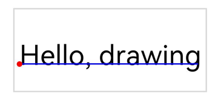

# Class (Canvas)

<!--Kit: ArkGraphics 2D-->
<!--Subsystem: Graphics-->
<!--Owner: @dreamyhhh-->
<!--Designer: @wanyanglan-->
<!--Tester: @nobuggers-->
<!--Adviser: @ge-yafang-->
<!-- md-trans-meta sourceCommit=cfa59f2ade5e74278a5dbd3dbd7bab536925f809 translatedAt=2026-08-24T07:56:46.771Z pushedAt=2026-08-25T03:06:13.667Z -->

A carrier that holds the drawing content and drawing state. Canvas provides the capability of drawing various shapes such as rectangles, circles, ellipses, arcs, paths, text, and images. It supports setting the drawing style through pens and brushes, and supports canvas clipping, matrix transformation, and saving and restoring of the canvas state.

> **NOTE**
>
> - The initial APIs of this module are supported since API version 11. Newly added APIs will be marked with a superscript to indicate their earliest API version.
>
> - This module uses the physical pixel unit, px.
>
> - This module operates under a single-threaded model. The caller needs to manage thread safety and context state transitions.

> **NOTE**
>
> The canvas has a default brush, which is black and has anti-aliasing but no other style effects. When no brush or pen is explicitly set on the canvas, this default brush takes effect.

## Modules to Import

```ts
import { drawing } from '@kit.ArkGraphics2D';
```

## constructor

constructor(pixelmap: image.PixelMap)

Creates a **Canvas** object that uses a **PixelMap** as the drawing target.

**Atomic service API**: This API can be used in atomic services since API version 22.

**System capability**: SystemCapability.Graphics.Drawing

**Parameters**

| Name  | Type                                        | Mandatory| Description          |
| -------- | -------------------------------------------- | ---- | -------------- |
| pixelmap | [image.PixelMap](../apis-image-kit/arkts-apis-image-PixelMap.md) | Yes | **PixelMap** object used as the drawing target of the Canvas. |

**Error codes**

For details about the error codes, see [Universal Error Codes](../errorcode-universal.md).

| ID| Error Message|
| ------- | --------------------------------------------|
| 401 | Parameter error.Possible causes:1.Mandatory parameters are left unspecified;2.Incorrect parameter types. |

**Example**

```ts
import { drawing } from '@kit.ArkGraphics2D';
import { image } from '@kit.ImageKit';

const color = new ArrayBuffer(96);
let opts : image.InitializationOptions = {
  editable: true,
  pixelFormat: 3,
  size: {
    height: 4,
    width: 6
  }
};
image.createPixelMap(color, opts).then((pixelMap) => {
  const canvas = new drawing.Canvas(pixelMap);
});
```

## drawRect

drawRect(rect: common2D.Rect): void

Draws a rectangle. By default, black is used for filling.

**System capability**: SystemCapability.Graphics.Drawing

**Parameters**

| Name| Type                                              | Mandatory| Description          |
| ------ | -------------------------------------------------- | ---- | -------------- |
| rect   | [common2D.Rect](js-apis-graphics-common2D.md#rect) | Yes  | Rectangle to draw.|

**Error codes**

For details about the error codes, see [Universal Error Codes](../errorcode-universal.md).

| ID| Error Message|
| ------- | --------------------------------------------|
| 401 | Parameter error.Possible causes:1.Mandatory parameters are left unspecified;2.Incorrect parameter types. |

**Example**

```ts
import { RenderNode } from '@kit.ArkUI';
import { common2D, drawing } from '@kit.ArkGraphics2D';

class DrawingRenderNode extends RenderNode {
  draw(context : DrawContext) {
    const canvas = context.canvas;
    const pen = new drawing.Pen();
    pen.setStrokeWidth(5);
    pen.setColor({alpha: 255, red: 255, green: 0, blue: 0});
    canvas.attachPen(pen);
    canvas.drawRect({ left : 0, right : 10, top : 0, bottom : 10 });
    canvas.detachPen();
  }
}
```

## drawRect<sup>12+</sup>

drawRect(left: number, top: number, right: number, bottom: number): void

Draws a rectangle. By default, black is used for filling. This API provides better performance than [drawRect](#drawrect) and is recommended.

**System capability**: SystemCapability.Graphics.Drawing

**Parameters**

| Name| Type   | Mandatory| Description          |
| ------ | ------ | ---- | -------------- |
| left   | number | Yes   | X-coordinate of the upper left corner of the rectangle. The value is a floating point number, in physical pixels (px). |
| top    | number | Yes   | Y-coordinate of the upper left corner of the rectangle. The value is a floating point number, in physical pixels (px). |
| right  | number | Yes   | X-coordinate of the lower right corner of the rectangle. The value is a floating point number, in physical pixels (px). |
| bottom | number | Yes   | Y-coordinate of the lower right corner of the rectangle. The value is a floating point number, in physical pixels (px). |

**Error codes**

For details about the error codes, see [Universal Error Codes](../errorcode-universal.md).

| ID| Error Message|
| ------- | --------------------------------------------|
| 401 | Parameter error.Possible causes:1.Mandatory parameters are left unspecified;2.Incorrect parameter types. |

**Example**

```ts
import { RenderNode } from '@kit.ArkUI';
import { drawing } from '@kit.ArkGraphics2D';

class DrawingRenderNode extends RenderNode {

  draw(context : DrawContext) {
    const canvas = context.canvas;
    const pen = new drawing.Pen();
    pen.setStrokeWidth(5);
    pen.setColor({alpha: 255, red: 255, green: 0, blue: 0});
    canvas.attachPen(pen);
    canvas.drawRect(0, 0, 10, 10);
    canvas.detachPen();
  }
}
```

## drawRoundRect<sup>12+</sup>

drawRoundRect(roundRect: RoundRect): void

Draws a rounded rectangle, filled with black by default.

**System capability**: SystemCapability.Graphics.Drawing

**Parameters**

| Name    | Type                   | Mandatory| Description      |
| ---------- | ----------------------- | ---- | ------------ |
| roundRect  | [RoundRect](arkts-apis-graphics-drawing-RoundRect.md) | Yes  | Rounded rectangle.|

**Error codes**

For details about the error codes, see [Universal Error Codes](../errorcode-universal.md).

| ID| Error Message|
| ------- | --------------------------------------------|
| 401 | Parameter error.Possible causes:1.Mandatory parameters are left unspecified;2.Incorrect parameter types. |

**Example**

```ts
import { RenderNode } from '@kit.ArkUI';
import { common2D, drawing } from '@kit.ArkGraphics2D';

class DrawingRenderNode extends RenderNode {
  draw(context : DrawContext) {
    const canvas = context.canvas;
    let rect: common2D.Rect = { left : 100, top : 100, right : 400, bottom : 500 };
    let roundRect = new drawing.RoundRect(rect, 10, 10);
    canvas.drawRoundRect(roundRect);
  }
}
```

## drawNestedRoundRect<sup>12+</sup>

drawNestedRoundRect(outer: RoundRect, inner: RoundRect): void

Draws two nested rounded rectangles. The boundary of the outer rectangle must completely enclose the boundary of the inner rectangle (that is, the inner rectangle must be entirely inside the outer rectangle); otherwise, nothing is drawn.

**System capability**: SystemCapability.Graphics.Drawing

**Parameters**

| Name | Type                   | Mandatory| Description      |
| ------ | ----------------------- | ---- | ------------ |
| outer  | [RoundRect](arkts-apis-graphics-drawing-RoundRect.md) | Yes  | Outer rounded rectangle.|
| inner  | [RoundRect](arkts-apis-graphics-drawing-RoundRect.md) | Yes  | Inner rounded rectangle.|

**Error codes**

For details about the error codes, see [Universal Error Codes](../errorcode-universal.md).

| ID| Error Message|
| ------- | --------------------------------------------|
| 401 | Parameter error.Possible causes:1.Mandatory parameters are left unspecified;2.Incorrect parameter types. |

**Example**

```ts
import { RenderNode } from '@kit.ArkUI';
import { common2D, drawing } from '@kit.ArkGraphics2D';

class DrawingRenderNode extends RenderNode {
  draw(context : DrawContext) {
    const canvas = context.canvas;
    let inRect: common2D.Rect = { left : 200, top : 200, right : 400, bottom : 500 };
    let outRect: common2D.Rect = { left : 100, top : 100, right : 400, bottom : 500 };
    let outRoundRect = new drawing.RoundRect(outRect, 10, 10);
    let inRoundRect = new drawing.RoundRect(inRect, 10, 10);
    canvas.drawNestedRoundRect(outRoundRect, inRoundRect);
    canvas.drawRoundRect(outRoundRect);
  }
}
```

## drawBackground<sup>12+</sup>

drawBackground(brush: Brush): void

Fills the clip area of the canvas with a brush.

**System capability**: SystemCapability.Graphics.Drawing

**Parameters**

| Name| Type           | Mandatory| Description      |
| ------ | --------------- | ---- | ---------- |
| brush  | [Brush](arkts-apis-graphics-drawing-Brush.md) | Yes  | **Brush** object.|

**Error codes**

For details about the error codes, see [Universal Error Codes](../errorcode-universal.md).

| ID| Error Message|
| ------- | --------------------------------------------|
| 401 | Parameter error.Possible causes:1.Mandatory parameters are left unspecified;2.Incorrect parameter types. |

**Example**

```ts
import { RenderNode } from '@kit.ArkUI';
import { common2D, drawing } from '@kit.ArkGraphics2D';

class DrawingRenderNode extends RenderNode {
  draw(context : DrawContext) {
    const canvas = context.canvas;
    const brush = new drawing.Brush();
    const color : common2D.Color = { alpha: 255, red: 255, green: 0, blue: 0 };
    brush.setColor(color);
    canvas.drawBackground(brush);
  }
}
```

## drawShadow<sup>12+</sup>

drawShadow(path: Path, planeParams: common2D.Point3d, devLightPos: common2D.Point3d, lightRadius: number, ambientColor: common2D.Color, spotColor: common2D.Color, flag: ShadowFlag) : void

Draws a spot shadow and uses a given path to outline the ambient shadow.

**System capability**: SystemCapability.Graphics.Drawing

**Parameters**

| Name         | Type                                      | Mandatory  | Description        |
| ------------ | ---------------------------------------- | ---- | ---------- |
| path | [Path](arkts-apis-graphics-drawing-Path.md)                | Yes   | **Path** object, which is used to outline the shadow.|
| planeParams  | [common2D.Point3d](js-apis-graphics-common2D.md#point3d12) | Yes    | A 3D vector used to calculate the offset of the occluder relative to the canvas on the z-axis. The offset value is calculated from the x and y coordinates of this vector. |
| devLightPos  | [common2D.Point3d](js-apis-graphics-common2D.md#point3d12) | Yes   | Position of the light relative to the canvas.|
| lightRadius   | number           | Yes    | Radius of the circular light. The value must be greater than 0 and is a floating-point number, in physical pixels (px).      |
| ambientColor  | [common2D.Color](js-apis-graphics-common2D.md#color) | Yes   | Color of the ambient shadow.|
| spotColor  | [common2D.Color](js-apis-graphics-common2D.md#color) | Yes   | Color of the spot shadow.|
| flag         | [ShadowFlag](arkts-apis-graphics-drawing-e.md#shadowflag12)                  | Yes    | Shadow flag used to control how the shadow is drawn.    |

**Error codes**

For details about the error codes, see [Universal Error Codes](../errorcode-universal.md).

| ID| Error Message|
| ------- | --------------------------------------------|
| 401 | Parameter error.Possible causes:1.Mandatory parameters are left unspecified;2.Incorrect parameter types;3.Parameter verification failed. |

**Example**

```ts
import { RenderNode } from '@kit.ArkUI';
import { common2D, drawing } from '@kit.ArkGraphics2D';

class DrawingRenderNode extends RenderNode {
  draw(context : DrawContext) {
    const canvas = context.canvas;
    const path = new drawing.Path();
    path.addCircle(100, 200, 100, drawing.PathDirection.CLOCKWISE);
    let pen = new drawing.Pen();
    pen.setAntiAlias(true);
    let penColor : common2D.Color = { alpha: 0xFF, red: 0xFF, green: 0x00, blue: 0x00 };
    pen.setColor(penColor);
    pen.setStrokeWidth(10.0);
    canvas.attachPen(pen);
    let brush = new drawing.Brush();
    let brushColor : common2D.Color = { alpha: 0xFF, red: 0x00, green: 0xFF, blue: 0x00 };
    brush.setColor(brushColor);
    canvas.attachBrush(brush);
    let planeParams : common2D.Point3d = {x: 100, y: 80, z: 80};
    let devLightPos : common2D.Point3d = {x: 200, y: 10, z: 40};
    let ambientColor : common2D.Color = {alpha: 0xFF, red: 0, green: 0, blue: 0xFF};
    let spotColor : common2D.Color = {alpha: 0xFF, red: 0xFF, green: 0, blue: 0};
    let shadowFlag : drawing.ShadowFlag = drawing.ShadowFlag.ALL;
    canvas.drawShadow(path, planeParams, devLightPos, 30, ambientColor, spotColor, shadowFlag);
  }
}
```

## drawShadow<sup>18+</sup>

drawShadow(path: Path, planeParams: common2D.Point3d, devLightPos: common2D.Point3d, lightRadius: number, ambientColor: common2D.Color \| number, spotColor: common2D.Color \| number, flag: ShadowFlag) : void

Draws a spot shadow and uses a given path to outline the ambient shadow.

**System capability**: SystemCapability.Graphics.Drawing

**Parameters**

| Name         | Type                                      | Mandatory  | Description        |
| ------------ | ---------------------------------------- | ---- | ---------- |
| path | [Path](arkts-apis-graphics-drawing-Path.md)                | Yes   | **Path** object, which is used to outline the shadow.|
| planeParams  | [common2D.Point3d](js-apis-graphics-common2D.md#point3d12) | Yes    | A 3D vector used to calculate the offset of the occluder relative to the canvas on the z-axis. The offset value is calculated from the x and y coordinates of the vector. |
| devLightPos  | [common2D.Point3d](js-apis-graphics-common2D.md#point3d12) | Yes   | Position of the light relative to the canvas.|
| lightRadius   | number           | Yes    | Radius of the circular light. The value is a floating-point number, in physical pixels (px).      |
| ambientColor  |[common2D.Color](js-apis-graphics-common2D.md#color) \| number | Yes   | Ambient shadow color, represented by a 32-bit unsigned integer in hexadecimal ARGB format.|
| spotColor  |[common2D.Color](js-apis-graphics-common2D.md#color) \| number | Yes   | Spot shadow color, represented by a 32-bit unsigned integer in hexadecimal ARGB format.|
| flag         | [ShadowFlag](arkts-apis-graphics-drawing-e.md#shadowflag12)                  | Yes    | Shadow flag used to control how the shadow is drawn.    |

**Error codes**

For details about the error codes, see [Universal Error Codes](../errorcode-universal.md).

| ID| Error Message|
| ------- | --------------------------------------------|
| 401 | Parameter error.Possible causes:1.Mandatory parameters are left unspecified;2.Incorrect parameter types;3.Parameter verification failed. |

**Example**

```ts
import { RenderNode } from '@kit.ArkUI';
import { common2D, drawing } from '@kit.ArkGraphics2D';

class DrawingRenderNode extends RenderNode {
  draw(context : DrawContext) {
    const canvas = context.canvas;
    const path = new drawing.Path();
    path.addCircle(300, 600, 100, drawing.PathDirection.CLOCKWISE);
    let planeParams : common2D.Point3d = {x: 100, y: 80, z: 80};
    let devLightPos : common2D.Point3d = {x: 200, y: 10, z: 40};
    let shadowFlag : drawing.ShadowFlag = drawing.ShadowFlag.ALL;
    canvas.drawShadow(path, planeParams, devLightPos, 30, 0xFF0000FF, 0xFFFF0000, shadowFlag);
  }
}
```

## getLocalClipBounds<sup>12+</sup>

getLocalClipBounds(): common2D.Rect

Obtains the bounds of the cropping region of the canvas.

**System capability**: SystemCapability.Graphics.Drawing

**Returns**

| Type                                      | Description      |
| ---------------------------------------- | -------- |
| [common2D.Rect](js-apis-graphics-common2D.md#rect) | Bounds of the cropping region.|

**Example**

```ts
import { RenderNode } from '@kit.ArkUI';
import { common2D, drawing } from '@kit.ArkGraphics2D';

class DrawingRenderNode extends RenderNode {
  draw(context : DrawContext) {
    const canvas = context.canvas;
    let clipRect: common2D.Rect = {
      left : 150, top : 150, right : 300, bottom : 400
    };
    canvas.clipRect(clipRect, drawing.ClipOp.DIFFERENCE, true);
    console.info('test rect.left: ' + clipRect.left);
    console.info('test rect.top: ' + clipRect.top);
    console.info('test rect.right: ' + clipRect.right);
    console.info('test rect.bottom: ' + clipRect.bottom);
    let clipBounds = canvas.getLocalClipBounds();
  }
}
```

## getTotalMatrix<sup>12+</sup>

getTotalMatrix(): Matrix

Obtains the canvas matrix.

**System capability**: SystemCapability.Graphics.Drawing

**Returns**

| Type               | Description      |
| ----------------- | -------- |
| [Matrix](arkts-apis-graphics-drawing-Matrix.md) |Returns the transformation matrix of the current canvas, which accumulates the applied translation, scaling, rotation, and skewing effects. |

**Example**

```ts
import { RenderNode } from '@kit.ArkUI';
import { drawing } from '@kit.ArkGraphics2D';

class DrawingRenderNode extends RenderNode {
  draw(context : DrawContext) {
    const canvas = context.canvas;
    let matrix = new drawing.Matrix();
    matrix.setMatrix([5, 0, 0, 0, 1, 1, 0, 0, 1]);
    canvas.setMatrix(matrix);
    let matrixResult = canvas.getTotalMatrix();
  }
}
```

## drawCircle

drawCircle(x: number, y: number, radius: number): void

Draws a circle. If the radius is less than or equal to zero, nothing is drawn. The circle is filled with black by default.

**System capability**: SystemCapability.Graphics.Drawing

**Parameters**

| Name| Type  | Mandatory| Description               |
| ------ | ------ | ---- | ------------------- |
| x      | number | Yes   | X-coordinate of the center of the circle, which is a floating-point number. The unit is physical pixel (px). |
| y      | number | Yes   | Y-coordinate of the center of the circle, which is a floating-point number. The unit is physical pixel (px). |
| radius | number | Yes   | Radius of the circle, which is a floating-point number greater than 0. The unit is physical pixel (px). |

**Error codes**

For details about the error codes, see [Universal Error Codes](../errorcode-universal.md).

| ID| Error Message|
| ------- | --------------------------------------------|
| 401 | Parameter error.Possible causes:1.Mandatory parameters are left unspecified;2.Incorrect parameter types;3.Parameter verification failed. |

**Example**

```ts
import { RenderNode } from '@kit.ArkUI';
import { drawing } from '@kit.ArkGraphics2D';

class DrawingRenderNode extends RenderNode {
  draw(context : DrawContext) {
    const canvas = context.canvas;
    const pen = new drawing.Pen();
    pen.setStrokeWidth(5);
    pen.setColor({alpha: 255, red: 255, green: 0, blue: 0});
    canvas.attachPen(pen);
    canvas.drawCircle(10, 10, 2);
    canvas.detachPen();
  }
}
```

## drawImage

drawImage(pixelmap: image.PixelMap, left: number, top: number, samplingOptions?: SamplingOptions): void

Draws an image, with the upper-left corner of the image at (left, top).

**System capability**: SystemCapability.Graphics.Drawing

**Parameters**

| Name  | Type                                        | Mandatory| Description                           |
| -------- | -------------------------------------------- | ---- | ------------------------------- |
| pixelmap | [image.PixelMap](../apis-image-kit/arkts-apis-image-PixelMap.md) | Yes  | **PixelMap** of an image.                 |
| left     | number                                       | Yes   | X-coordinate of the upper left corner of the image position. The parameter is a floating-point number, in physical pixels (px). |
| top      | number                                       | Yes   | Y-coordinate of the upper left corner of the image position. The parameter is a floating-point number, in physical pixels (px). |
| samplingOptions<sup>12+</sup>  | [SamplingOptions](arkts-apis-graphics-drawing-SamplingOptions.md)  | No | Sampling options. By default, the **SamplingOptions** object created using the no-argument constructor is used.|

**Error codes**

For details about the error codes, see [Universal Error Codes](../errorcode-universal.md).

| ID| Error Message|
| ------- | --------------------------------------------|
| 401 | Parameter error.Possible causes:1.Mandatory parameters are left unspecified;2.Incorrect parameter types. |

**Example**

```ts
import { RenderNode } from '@kit.ArkUI';
import { image } from '@kit.ImageKit';
import { drawing } from '@kit.ArkGraphics2D';

class DrawingRenderNode extends RenderNode {
  draw(context : DrawContext) {
    const width = 1000;
    const height = 1000;
    const bufferSize = width * height * 4;
    const color: ArrayBuffer = new ArrayBuffer(bufferSize);

    const colorData = new Uint8Array(color);
    for (let i = 0; i < colorData.length; i += 4) {
      colorData[i] = 255;
      colorData[i + 1] = 156;
      colorData[i + 2] = 0;
      colorData[i + 3] = 255;
    }

    let opts : image.InitializationOptions = {
      editable: true,
      pixelFormat: 3,
      size: { height, width }
    };

    let pixelMap: image.PixelMap = image.createPixelMapSync(color, opts);
    const canvas = context.canvas;
    let options = new drawing.SamplingOptions(drawing.FilterMode.FILTER_MODE_NEAREST);
    if (pixelMap != null) {
      canvas.drawImage(pixelMap, 0, 0, options);
    }
  }
}
```

## drawImageRect<sup>12+</sup>

drawImageRect(pixelmap: image.PixelMap, dstRect: common2D.Rect, samplingOptions?: SamplingOptions): void

Draws an image onto a specified area of the canvas.

**System capability**: SystemCapability.Graphics.Drawing

**Parameters**

| Name  | Type                                        | Mandatory| Description                           |
| -------- | -------------------------------------------- | ---- | ------------------------------- |
| pixelmap | [image.PixelMap](../apis-image-kit/arkts-apis-image-PixelMap.md) | Yes  | **PixelMap** of an image.                |
| dstRect     | [common2D.Rect](js-apis-graphics-common2D.md#rect)                               | Yes  | **Rectangle** object, which specifies the area of the canvas onto which the image will be drawn.|
| samplingOptions     | [SamplingOptions](arkts-apis-graphics-drawing-SamplingOptions.md)                           | No  | Sampling options. By default, the **SamplingOptions** object created using the no-argument constructor is used.|

**Error codes**

For details about the error codes, see [Universal Error Codes](../errorcode-universal.md).

| ID| Error Message|
| ------- | --------------------------------------------|
| 401 | Parameter error.Possible causes:1.Mandatory parameters are left unspecified;2.Incorrect parameter types. |

**Example**

```ts
import { RenderNode } from '@kit.ArkUI';
import { image } from '@kit.ImageKit';
import { common2D, drawing } from '@kit.ArkGraphics2D';

class DrawingRenderNode extends RenderNode {
  draw(context : DrawContext) {
    const width = 1000;
    const height = 1000;
    const bufferSize = width * height * 4;
    const color: ArrayBuffer = new ArrayBuffer(bufferSize);

    const colorData = new Uint8Array(color);
    for (let i = 0; i < colorData.length; i += 4) {
      colorData[i] = 255;
      colorData[i + 1] = 156;
      colorData[i + 2] = 0;
      colorData[i + 3] = 255;
    }

    let opts : image.InitializationOptions = {
      editable: true,
      pixelFormat: 3,
      size: { height, width }
    };

    let pixelMap: image.PixelMap = image.createPixelMapSync(color, opts);
    const canvas = context.canvas;
    let pen = new drawing.Pen();
    canvas.attachPen(pen);
    let rect: common2D.Rect = { left: 0, top: 0, right: 200, bottom: 200 };
    canvas.drawImageRect(pixelMap, rect);
    canvas.detachPen();
  }
}
```

## drawImageRectWithSrc<sup>12+</sup>

drawImageRectWithSrc(pixelmap: image.PixelMap, srcRect: common2D.Rect, dstRect: common2D.Rect, samplingOptions?: SamplingOptions, constraint?: SrcRectConstraint): void

Draws a portion of an image onto a specified area of the canvas.

**System capability**: SystemCapability.Graphics.Drawing

**Parameters**

| Name  | Type                                        | Mandatory| Description                           |
| -------- | -------------------------------------------- | ---- | ------------------------------- |
| pixelmap | [image.PixelMap](../apis-image-kit/arkts-apis-image-PixelMap.md) | Yes  | **PixelMap** of an image.                |
| srcRect     | [common2D.Rect](js-apis-graphics-common2D.md#rect)                               | Yes  | **Rectangle** object, which specifies the portion of the image to draw.|
| dstRect     | [common2D.Rect](js-apis-graphics-common2D.md#rect)                               | Yes  | **Rectangle** object, which specifies the area of the canvas onto which the image will be drawn.|
| samplingOptions     | [SamplingOptions](arkts-apis-graphics-drawing-SamplingOptions.md)                           | No  | Sampling options. By default, the **SamplingOptions** object created using the no-argument constructor is used.|
| constraint     | [SrcRectConstraint](arkts-apis-graphics-drawing-e.md#srcrectconstraint12)                        | No  | Constraint type of the source rectangle. The default value is **STRICT**.|

**Error codes**

For details about the error codes, see [Universal Error Codes](../errorcode-universal.md).

| ID| Error Message|
| ------- | --------------------------------------------|
| 401 | Parameter error.Possible causes:1.Mandatory parameters are left unspecified;2.Incorrect parameter types. |

**Example**

```ts
import { RenderNode } from '@kit.ArkUI';
import { image } from '@kit.ImageKit';
import { common2D, drawing } from '@kit.ArkGraphics2D';

class DrawingRenderNode extends RenderNode {
  draw(context : DrawContext) {
    const width = 1000;
    const height = 1000;
    const bufferSize = width * height * 4;
    const color: ArrayBuffer = new ArrayBuffer(bufferSize);

    const colorData = new Uint8Array(color);
    for (let i = 0; i < colorData.length; i += 4) {
      colorData[i] = 255;
      colorData[i + 1] = 156;
      colorData[i + 2] = 0;
      colorData[i + 3] = 255;
    }

    let opts : image.InitializationOptions = {
      editable: true,
      pixelFormat: 3,
      size: { height, width }
    };

    let pixelMap: image.PixelMap = image.createPixelMapSync(color, opts);
    const canvas = context.canvas;
    let pen = new drawing.Pen();
    canvas.attachPen(pen);
    let srcRect: common2D.Rect = { left: 0, top: 0, right: 100, bottom: 100 };
    let dstRect: common2D.Rect = { left: 100, top: 100, right: 200, bottom: 200 };
    canvas.drawImageRectWithSrc(pixelMap, srcRect, dstRect);
    canvas.detachPen();
  }
}
```

## drawColor

drawColor(color: common2D.Color, blendMode?: BlendMode): void

Fills the current clip area of the canvas with the specified color according to the specified [BlendMode](arkts-apis-graphics-drawing-e.md#blendmode).

**System capability**: SystemCapability.Graphics.Drawing

**Parameters**

| Name   | Type                                                | Mandatory| Description                            |
| --------- | ---------------------------------------------------- | ---- | -------------------------------- |
| color     | [common2D.Color](js-apis-graphics-common2D.md#color) | Yes   | Color in ARGB format. The value of each color channel is an integer in the range [0, 255].                   |
| blendMode | [BlendMode](arkts-apis-graphics-drawing-e.md#blendmode)                              | No   | Color blend mode, which specifies how the drawn color is blended with the existing content on the canvas. Pass this parameter when a custom color overlay effect is required. If this parameter is not passed, the default mode SRC_OVER is used. |

**Error codes**

For details about the error codes, see [Universal Error Codes](../errorcode-universal.md).

| ID| Error Message|
| ------- | --------------------------------------------|
| 401 | Parameter error.Possible causes:1.Mandatory parameters are left unspecified;2.Incorrect parameter types;3.Parameter verification failed. |

**Example**

```ts
import { RenderNode } from '@kit.ArkUI';
import { common2D, drawing } from '@kit.ArkGraphics2D';

class DrawingRenderNode extends RenderNode {
  draw(context : DrawContext) {
    const canvas = context.canvas;
    let color: common2D.Color = {
      alpha : 255,
      red: 0,
      green: 10,
      blue: 10
    };
    canvas.drawColor(color, drawing.BlendMode.CLEAR);
  }
}
```

## drawColor<sup>12+</sup>

drawColor(alpha: number, red: number, green: number, blue: number, blendMode?: BlendMode): void

Fills the current clip area of the canvas with the specified color according to the specified [BlendMode](arkts-apis-graphics-drawing-e.md#blendmode). This API outperforms [drawColor](#drawcolor) and is recommended.

**System capability**: SystemCapability.Graphics.Drawing

**Parameters**

| Name    | Type                   | Mandatory| Description                                              |
| --------- | ----------------------- | ---- | ------------------------------------------------- |
| alpha     | number                  | Yes   | Alpha channel value of the color in ARGB format. It is an integer in the range [0, 255]. A floating-point number within the range is rounded down. |
| red       | number                  | Yes   | Red channel value of the color in ARGB format. It is an integer in the range [0, 255]. A floating-point number within the range is rounded down.   |
| green     | number                  | Yes   | Green channel value of the color in ARGB format. It is an integer in the range [0, 255]. A floating-point number within the range is rounded down.   |
| blue      | number                  | Yes   | Blue channel value of the color in ARGB format. It is an integer in the range [0, 255]. A floating-point number within the range is rounded down.   |
| blendMode | [BlendMode](arkts-apis-graphics-drawing-e.md#blendmode) | No   | Color blend mode, which specifies how the draw color is blended with the existing content on the canvas. Pass this parameter when a custom color overlay effect is required. If it is not passed, the default mode is SRC_OVER.                   |

**Error codes**

For details about the error codes, see [Universal Error Codes](../errorcode-universal.md).

| ID| Error Message|
| ------- | --------------------------------------------|
| 401 | Parameter error.Possible causes:1.Mandatory parameters are left unspecified;2.Incorrect parameter types;3.Parameter verification failed. |

**Example**

```ts
import { RenderNode } from '@kit.ArkUI';
import { drawing } from '@kit.ArkGraphics2D';

class DrawingRenderNode extends RenderNode {
  draw(context : DrawContext) {
    const canvas = context.canvas;
    canvas.drawColor(255, 0, 10, 10, drawing.BlendMode.CLEAR);
  }
}
```

## drawColor<sup>18+</sup>

drawColor(color: number, blendMode?: BlendMode): void

Fills the current clip area of the canvas with a specified color according to the specified [BlendMode](arkts-apis-graphics-drawing-e.md#blendmode).

**System capability**: SystemCapability.Graphics.Drawing

**Parameters**

| Name   | Type                                                | Mandatory| Description                            |
| --------- | ---------------------------------------------------- | ---- | -------------------------------- |
| color     | number | Yes   | Color in hexadecimal ARGB format, represented by a 32-bit unsigned integer, for example, 0xAARRGGBB.                   |
| blendMode | [BlendMode](arkts-apis-graphics-drawing-e.md#blendmode)                              | No   | Color blend mode, which specifies how the draw color is blended with the existing content on the canvas. Pass this parameter when a custom color overlay effect is required. If it is not passed, the default mode SRC_OVER is used. |

**Error codes**

For details about the error codes, see [Universal Error Codes](../errorcode-universal.md).

| ID| Error Message|
| ------- | --------------------------------------------|
| 401 | Parameter error.Possible causes:1.Mandatory parameters are left unspecified;2.Incorrect parameter types;3.Parameter verification failed. |

**Example**

```ts
import { RenderNode } from '@kit.ArkUI';
import { drawing } from '@kit.ArkGraphics2D';

class DrawingRenderNode extends RenderNode {
  draw(context : DrawContext) {
    const canvas = context.canvas;
    canvas.drawColor(0xff000a0a, drawing.BlendMode.CLEAR);
  }
}
```

## drawVertices<sup>23+</sup>

drawVertices(vertexMode: VertexMode, vertexCount: number, positions: Array\<common2D.Point\>, texs: Array\<common2D.Point\> \| null, colors: Array\<number\> \| null, indexCount: number, indices: Array\<number\> \| null, mode: BlendMode): void

Draws a triangle mesh described by the vertex array.

**System capability**: SystemCapability.Graphics.Drawing

**Parameters**

| Name     | Type           | Mandatory| Description                           |
| ----------- | -------------  | ---- | ------------------------------- |
| vertexMode   | [VertexMode](arkts-apis-graphics-drawing-e.md#vertexmode23) | Yes  | Connection mode of the vertex to be drawn.|
| vertexCount   | number         | Yes   | Number of elements in the vertex array. The value is an integer greater than or equal to 3. If a floating-point number is passed, only the integer part is retained. |
| positions  | Array\<[common2D.Point](js-apis-graphics-common2D.md#point12)>        | Yes   | Array that describes the vertex positions. It cannot be empty, and its length must be equal to vertexCount. |
| texs    | Array\<[common2D.Point](js-apis-graphics-common2D.md#point12)> \| null  | Yes   | Array that describes the texture space coordinates corresponding to the vertices. It can be empty, indicating that the texture space is invalid. If it is not empty, its length must be equal to vertexCount. |
| colors      | Array\<number> \| null | Yes   | Array that describes the colors corresponding to the vertices, used for interpolation within the triangle. Each color value is represented by a 32-bit unsigned integer in hexadecimal ARGB format, for example, 0xAARRGGBB. It can be empty, indicating that vertex color interpolation is not used and the color effect depends on the color set by the brush or pen bound to the current canvas. If it is not empty, its length must be equal to vertexCount. |
| indexCount  | number         | Yes   | Number of indices. The value can be 0, and drawing is possible when the length of the indices array is 0. If it is not 0, the value must be an integer greater than or equal to 3. If a floating-point number is passed, only the integer part is retained. |
| indices  | Array\<number> \| null         | Yes  | Array of vertex indices. The value can be null. In this case, the value of **indexCount** is ignored (an integer greater than or equal to 3 or equal to 0). If not null, the value length must be the same as that of **indexCount**.|
| mode | [BlendMode](arkts-apis-graphics-drawing-e.md#blendmode)                              | Yes  | Color blend mode.|

**Error codes**

For details about the following error code, see [Drawing and Display Error Codes](errorcode-drawing.md).

| ID| Error Message|
| ------- | --------------------------------------------|
| 25900001 | Parameter error. Possible causes: Incorrect parameter range. |

**Example**

```ts
import { RenderNode } from '@kit.ArkUI';
import { common2D, drawing } from '@kit.ArkGraphics2D';

class DrawingRenderNode extends RenderNode {
  draw(context: DrawContext): void {
    const canvas = context.canvas;
    let pointsArray = new Array<common2D.Point>();
    const point1: common2D.Point = { x: 100.0, y: 100.0 };
    const point2: common2D.Point = { x: 200.0, y: 100.0 };
    const point3: common2D.Point = { x: 150.0, y: 200.0 };
    pointsArray.push(point1);
    pointsArray.push(point2);
    pointsArray.push(point3);
    let texsArray = new Array<common2D.Point>();
    const texs1: common2D.Point = { x: 0.0, y: 0.0 };
    const texs2: common2D.Point = { x: 1.0, y: 0.0 };
    const texs3: common2D.Point = { x: 0.5, y: 1.0 };
    texsArray.push(texs1);
    texsArray.push(texs2);
    texsArray.push(texs3);
    const colors = [0xFFFF0000, 0xFF00FF00, 0xFF0000FF];
    const indices = [0, 1, 2];
    canvas.drawVertices(drawing.VertexMode.TRIANGLESSTRIP_VERTEXMODE, 3, pointsArray, texsArray, colors, 3, indices, drawing.BlendMode.SRC);
  }
}
```

## drawPixelMapMesh<sup>12+</sup>

drawPixelMapMesh(pixelmap: image.PixelMap, meshWidth: number, meshHeight: number, vertices: Array\<number>, vertOffset: number, colors: Array\<number> \| null, colorOffset: number): void

Draws a **PixelMap** on a mesh, with the mesh evenly distributed across the **PixelMap**. (This API works with brushes but not pens.)

**System capability**: SystemCapability.Graphics.Drawing

**Parameters**

| Name     | Type           | Mandatory| Description                           |
| ----------- | -------------  | ---- | ------------------------------- |
| pixelmap    | [image.PixelMap](../apis-image-kit/arkts-apis-image-PixelMap.md) | Yes  | **PixelMap** to draw.|
| meshWidth   | number         | Yes  | Number of columns in the mesh. The value is an integer greater than 0.|
| meshHeight  | number         | Yes  | Number of rows in the mesh. The value is an integer greater than 0.|
| vertices    | Array\<number> | Yes   | Vertex array, which specifies the drawing positions of the mesh. This parameter is a floating-point array, in physical pixels (px). Its size must be ((meshWidth+1) * (meshHeight+1) + vertOffset) * 2. |
| vertOffset  | number         | Yes  | Number of vert elements to skip before drawing. The value is an integer greater than or equal to 0.|
| colors      | Array\<number> \| null | Yes   | Color array, which specifies a color at each vertex. Each color value is represented by a 32-bit unsigned integer in hexadecimal ARGB format, for example, 0xAARRGGBB. It can be null. Its size must be (meshWidth+1) * (meshHeight+1) + colorOffset. |
| colorOffset | number         | Yes  | Number of color elements to skip before drawing. The value is an integer greater than or equal to 0.|

**Error codes**

For details about the error codes, see [Universal Error Codes](../errorcode-universal.md).

| ID| Error Message|
| ------- | --------------------------------------------|
| 401 | Parameter error.Possible causes:1.Mandatory parameters are left unspecified;2.Incorrect parameter types. |

**Example**

```ts
import { RenderNode } from '@kit.ArkUI';
import { image } from '@kit.ImageKit';
import { drawing } from '@kit.ArkGraphics2D';

class DrawingRenderNode extends RenderNode {
  draw(context : DrawContext) {
    const width = 1000;
    const height = 1000;
    const bufferSize = width * height * 4;
    const color: ArrayBuffer = new ArrayBuffer(bufferSize);

    const colorData = new Uint8Array(color);
    for (let i = 0; i < colorData.length; i += 4) {
      colorData[i] = 255;
      colorData[i + 1] = 156;
      colorData[i + 2] = 0;
      colorData[i + 3] = 255;
    }

    let opts : image.InitializationOptions = {
      editable: true,
      pixelFormat: 3,
      size: { height, width }
    };

    let pixelMap: image.PixelMap = image.createPixelMapSync(color, opts);
    const canvas = context.canvas;
    if (pixelMap != null) {
      const brush = new drawing.Brush(); // Only brush is supported. Using pen has no drawing effect.
      canvas.attachBrush(brush);
      let verts : Array<number> = [0, 0, 50, 0, 410, 0, 0, 180, 50, 180, 410, 180, 0, 360, 50, 360, 410, 360]; // 18
      canvas.drawPixelMapMesh(pixelMap, 2, 2, verts, 0, null, 0);
      canvas.detachBrush();
    }
  }
}
```

## clear<sup>12+</sup>

clear(color: common2D.Color): void

Clears the canvas with a given color. This API has the same effect as [drawColor](#drawcolor).

**System capability**: SystemCapability.Graphics.Drawing

**Parameters**

| Name   | Type                                                | Mandatory| Description                            |
| --------- | ---------------------------------------------------- | ---- | -------------------------------- |
| color     | [common2D.Color](js-apis-graphics-common2D.md#color) | Yes   | Color in ARGB format. The value of each color channel is an integer in the range [0, 255].      |

**Error codes**

For details about the error codes, see [Universal Error Codes](../errorcode-universal.md).

| ID| Error Message|
| ------- | --------------------------------------------|
| 401 | Parameter error.Possible causes:1.Mandatory parameters are left unspecified;2.Incorrect parameter types. |

**Example**

```ts
import { RenderNode } from '@kit.ArkUI';
import { common2D, drawing } from '@kit.ArkGraphics2D';

class DrawingRenderNode extends RenderNode {
  draw(context : DrawContext) {
    const canvas = context.canvas;
    let color: common2D.Color = {alpha: 255, red: 255, green: 0, blue: 0};
    canvas.clear(color);
  }
}
```

## clear<sup>18+</sup>

clear(color: common2D.Color \| number): void

Fills the clip area on the canvas with a specified color. The effect is the same as that of [drawColor](#drawcolor).

**System capability**: SystemCapability.Graphics.Drawing

**Parameters**

| Name   | Type                                                | Mandatory| Description                            |
| --------- | ---------------------------------------------------- | ---- | -------------------------------- |
| color     | [common2D.Color](js-apis-graphics-common2D.md#color) \| number| Yes   | Color, which can be represented by a 32-bit unsigned integer in hexadecimal ARGB format, for example, 0xAARRGGBB.  |

**Example**

```ts
import { RenderNode } from '@kit.ArkUI';
import { drawing } from '@kit.ArkGraphics2D';

class DrawingRenderNode extends RenderNode {
  draw(context : DrawContext) {
    const canvas = context.canvas;
    let color: number = 0xffff0000;
    canvas.clear(color);
  }
}
```

## getWidth<sup>12+</sup>

getWidth(): number

Obtains the canvas width.

**System capability**: SystemCapability.Graphics.Drawing

**Returns**

| Type  | Description          |
| ------ | -------------- |
| number | Width of the canvas. The value is a floating-point number, in physical pixels (px). |

**Example**

```ts
import { RenderNode } from '@kit.ArkUI';
import { drawing } from '@kit.ArkGraphics2D';

class DrawingRenderNode extends RenderNode {
  draw(context : DrawContext) {
    const canvas = context.canvas;
    let width = canvas.getWidth();
    console.info('get canvas width:' + width);
  }
}
```

## getHeight<sup>12+</sup>

getHeight(): number

Obtains the canvas height.

**System capability**: SystemCapability.Graphics.Drawing

**Returns**

| Type  | Description          |
| ------ | -------------- |
| number | Height of the canvas. This parameter is a floating-point number. The unit is physical pixel px. |

**Example**

```ts
import { RenderNode } from '@kit.ArkUI';
import { drawing } from '@kit.ArkGraphics2D';

class DrawingRenderNode extends RenderNode {
  draw(context : DrawContext) {
    const canvas = context.canvas;
    let height = canvas.getHeight();
    console.info('get canvas height:' + height);
  }
}
```

## drawOval<sup>12+</sup>

drawOval(oval: common2D.Rect): void

Draws an oval on the canvas. The shape and position of the oval are determined by its bounding rectangle. The content is filled in black by default.

**System capability**: SystemCapability.Graphics.Drawing

**Parameters**

| Name| Type                                              | Mandatory| Description          |
| ------ | -------------------------------------------------- | ---- | -------------- |
| oval   | [common2D.Rect](js-apis-graphics-common2D.md#rect) | Yes  | Rectangle. The oval inscribed within the rectangle is the oval to draw.|

**Error codes**

For details about the error codes, see [Universal Error Codes](../errorcode-universal.md).

| ID| Error Message|
| ------- | --------------------------------------------|
| 401 | Parameter error.Possible causes:1.Mandatory parameters are left unspecified;2.Incorrect parameter types. |

**Example**

```ts
import { RenderNode } from '@kit.ArkUI';
import { common2D, drawing } from '@kit.ArkGraphics2D';

class DrawingRenderNode extends RenderNode {
  draw(context : DrawContext) {
    const canvas = context.canvas;
    const pen = new drawing.Pen();
    pen.setStrokeWidth(5);
    const color : common2D.Color = { alpha: 255, red: 255, green: 0, blue: 0 };
    pen.setColor(color);
    canvas.attachPen(pen);
    const rect: common2D.Rect = {left:100, top:50, right:400, bottom:500};
    canvas.drawOval(rect);
    canvas.detachPen();
  }
}
```

## drawArc<sup>12+</sup>

drawArc(arc: common2D.Rect, startAngle: number, sweepAngle: number): void

Draws an arc on the canvas. The content is filled in black by default. This method allows you to specify the start angle and sweep angle. When the absolute value of the sweep angle is greater than 360 degrees, an oval is drawn.

**System capability**: SystemCapability.Graphics.Drawing

**Parameters**

| Name| Type                                              | Mandatory| Description          |
| ------ | -------------------------------------------------- | ---- | -------------- |
| arc   | [common2D.Rect](js-apis-graphics-common2D.md#rect) | Yes  | Rectangular boundary that encapsulates the oval including the arc.|
| startAngle      | number | Yes  | Start angle, in degrees. The value is a floating point number. When the degree is **0**, the start point is located at the right end of the oval. A positive number indicates that the start point is placed clockwise, and a negative number indicates that the start point is placed counterclockwise.|
| sweepAngle      | number | Yes  | Angle to sweep, in degrees. The value is a floating point number. A positive number indicates a clockwise sweep, and a negative value indicates a counterclockwise swipe. The valid range is from -360 degrees to 360 degrees. If the absolute value of the sweep angle exceeds 360 degrees, an ellipse is drawn.|

**Error codes**

For details about the error codes, see [Universal Error Codes](../errorcode-universal.md).

| ID| Error Message|
| ------- | --------------------------------------------|
| 401 | Parameter error.Possible causes:1.Mandatory parameters are left unspecified;2.Incorrect parameter types. |

**Example**

```ts
import { RenderNode } from '@kit.ArkUI';
import { common2D, drawing } from '@kit.ArkGraphics2D';

class DrawingRenderNode extends RenderNode {
  draw(context : DrawContext) {
    const canvas = context.canvas;
    const pen = new drawing.Pen();
    pen.setStrokeWidth(5);
    const color : common2D.Color = { alpha: 255, red: 255, green: 0, blue: 0 };
    pen.setColor(color);
    canvas.attachPen(pen);
    const rect: common2D.Rect = {left:100, top:50, right:400, bottom:200};
    canvas.drawArc(rect, 90, 180);
    canvas.detachPen();
  }
}
```

## drawPoint

drawPoint(x: number, y: number): void

Draws a point.

**System capability**: SystemCapability.Graphics.Drawing

**Parameters**

| Name| Type  | Mandatory| Description               |
| ------ | ------ | ---- | ------------------- |
| x      | number | Yes   | X-coordinate of the point. The value is a floating point number, in physical pixels (px). |
| y      | number | Yes   | Y-coordinate of the point. The value is a floating point number, in physical pixels (px). |

**Error codes**

For details about the error codes, see [Universal Error Codes](../errorcode-universal.md).

| ID| Error Message|
| ------- | --------------------------------------------|
| 401 | Parameter error.Possible causes:1.Mandatory parameters are left unspecified;2.Incorrect parameter types. |

**Example**

```ts
import { RenderNode } from '@kit.ArkUI';
import { drawing } from '@kit.ArkGraphics2D';

class DrawingRenderNode extends RenderNode {
  draw(context : DrawContext) {
    const canvas = context.canvas;
    const pen = new drawing.Pen();
    pen.setStrokeWidth(5);
    pen.setColor({alpha: 255, red: 255, green: 0, blue: 0});
    canvas.attachPen(pen);
    canvas.drawPoint(10, 10);
    canvas.detachPen();
  }
}
```

## drawPoints<sup>12+</sup>

drawPoints(points: Array\<common2D.Point>, mode?: PointMode): void

Draws a group of points, line segments, or polygons on the canvas, with the specified drawing mode. An array is used to hold these points.

**System capability**: SystemCapability.Graphics.Drawing

**Parameters**

| Name | Type                                      | Mandatory  | Description       |
| ---- | ---------------------------------------- | ---- | --------- |
| points  | Array\<[common2D.Point](js-apis-graphics-common2D.md#point12)> | Yes   | Array that holds the points to draw. The length cannot be **0**.  |
| mode | [PointMode](arkts-apis-graphics-drawing-e.md#pointmode12) | No | Method for drawing the points in the array. The default value is drawing.PointMode.POINTS. |

**Error codes**

For details about the error codes, see [Universal Error Codes](../errorcode-universal.md).

| ID| Error Message|
| ------- | --------------------------------------------|
| 401 | Parameter error. Possible causes: 1. Mandatory parameters are left unspecified;2. Incorrect parameter types; 3. Parameter verification failed.|

**Example**

```ts
import { RenderNode } from '@kit.ArkUI';
import { common2D, drawing } from '@kit.ArkGraphics2D';

class DrawingRenderNode extends RenderNode {
  draw(context : DrawContext) {
    const canvas = context.canvas;
    const pen = new drawing.Pen();
    pen.setStrokeWidth(30);
    const color : common2D.Color = { alpha: 255, red: 255, green: 0, blue: 0 };
    pen.setColor(color);
    canvas.attachPen(pen);
    canvas.drawPoints([{x: 100, y: 200}, {x: 150, y: 230}, {x: 200, y: 300}], drawing.PointMode.POINTS);
    canvas.detachPen();
  }
}
```

## drawPath

drawPath(path: Path): void

Draws a custom path. The content is filled in black by default. The path contains a set of contours, each of which can be open or closed.

**System capability**: SystemCapability.Graphics.Drawing

**Parameters**

| Name| Type         | Mandatory| Description              |
| ------ | ------------- | ---- | ------------------ |
| path   | [Path](arkts-apis-graphics-drawing-Path.md) | Yes  | **Path** object to draw.|

**Error codes**

For details about the error codes, see [Universal Error Codes](../errorcode-universal.md).

| ID| Error Message|
| ------- | --------------------------------------------|
| 401 | Parameter error.Possible causes:1.Mandatory parameters are left unspecified;2.Incorrect parameter types. |

**Example**

```ts
import { RenderNode } from '@kit.ArkUI';
import { drawing } from '@kit.ArkGraphics2D';

class DrawingRenderNode extends RenderNode {
  draw(context : DrawContext) {
    const canvas = context.canvas;
    const pen = new drawing.Pen();
    pen.setStrokeWidth(5);
    pen.setColor({alpha: 255, red: 255, green: 0, blue: 0});
    let path = new drawing.Path();
    path.moveTo(10,10);
    path.cubicTo(10, 10, 10, 10, 15, 15);
    path.close();
    canvas.attachPen(pen);
    canvas.drawPath(path);
    canvas.detachPen();
  }
}
```

## drawLine

drawLine(x0: number, y0: number, x1: number, y1: number): void

Draws a straight line segment from the specified start point to the end point. If the start point and end point of the line segment are the same point, the line cannot be drawn.

**System capability**: SystemCapability.Graphics.Drawing

**Parameters**

| Name| Type  | Mandatory| Description                   |
| ------ | ------ | ---- | ----------------------- |
| x0     | number | Yes   | X-axis coordinate of the start point of the line segment. This parameter is a floating-point number, in physical pixels (px). |
| y0     | number | Yes   | Y-axis coordinate of the start point of the line segment. This parameter is a floating-point number, in physical pixels (px). |
| x1     | number | Yes   | X-axis coordinate of the end point of the line segment. This parameter is a floating-point number, in physical pixels (px). |
| y1     | number | Yes   | Y-axis coordinate of the end point of the line segment. This parameter is a floating-point number, in physical pixels (px). |

**Error codes**

For details about the error codes, see [Universal Error Codes](../errorcode-universal.md).

| ID| Error Message|
| ------- | --------------------------------------------|
| 401 | Parameter error.Possible causes:1.Mandatory parameters are left unspecified;2.Incorrect parameter types. |

**Example**

```ts
import { RenderNode } from '@kit.ArkUI';
import { drawing } from '@kit.ArkGraphics2D';

class DrawingRenderNode extends RenderNode {
  draw(context : DrawContext) {
    const canvas = context.canvas;
    const pen = new drawing.Pen();
    pen.setStrokeWidth(5);
    pen.setColor({alpha: 255, red: 255, green: 0, blue: 0});
    canvas.attachPen(pen);
    canvas.drawLine(0, 0, 20, 20);
    canvas.detachPen();
  }
}
```

## drawTextBlob

drawTextBlob(blob: TextBlob, x: number, y: number): void

Draws a text blob. If the typeface used to construct **blob** does not support a character, that character will not be drawn.

**System capability**: SystemCapability.Graphics.Drawing

**Parameters**

| Name| Type                 | Mandatory| Description                                      |
| ------ | --------------------- | ---- | ------------------------------------------ |
| blob   | [TextBlob](arkts-apis-graphics-drawing-TextBlob.md) | Yes  | **TextBlob** object.                            |
| x      | number                | Yes   | X-coordinate of the left endpoint (red dot in the following figure) of the text baseline (blue line in the following figure) to be drawn. The value is a floating-point number, in physical pixels (px). |
| y      | number                | Yes   | Y-coordinate of the left endpoint (red dot in the following figure) of the text baseline (blue line in the following figure) to be drawn. The value is a floating-point number, in physical pixels (px). |



**Error codes**

For details about the error codes, see [Universal Error Codes](../errorcode-universal.md).

| ID| Error Message|
| ------- | --------------------------------------------|
| 401 | Parameter error.Possible causes:1.Mandatory parameters are left unspecified;2.Incorrect parameter types. |

**Example**

```ts
import { RenderNode } from '@kit.ArkUI';
import { drawing } from '@kit.ArkGraphics2D';

class DrawingRenderNode extends RenderNode {
  draw(context : DrawContext) {
    const canvas = context.canvas;
    const brush = new drawing.Brush();
    brush.setColor({alpha: 255, red: 255, green: 0, blue: 0});
    const font = new drawing.Font();
    font.setSize(20);
    const textBlob = drawing.TextBlob.makeFromString('Hello, drawing', font, drawing.TextEncoding.TEXT_ENCODING_UTF8);
    canvas.attachBrush(brush);
    canvas.drawTextBlob(textBlob, 20, 20);
    canvas.detachBrush();
  }
}
```

## drawGlyphs

drawGlyphs(glyphIds: Array\<number\>, glyphIdOffset: number, positions: Array\<common2D.Point\>, positionOffset: number, glyphCount: number, font: Font): void

Draws an array of glyphs with the specified font. If the glyph count is less than or equal to 0, nothing is drawn.

**Since**: 26.0.0

**Model restriction**: This API can be used only in the stage model.

**System capability**: SystemCapability.Graphics.Drawing

**Parameters**

| Name          | Type                                      | Mandatory  | Description                                             |
| ------         | -------------------                      | ---- | -----------                                      |
| glyphIds       | Array\<number\>                             | Yes   | Array of glyph IDs. The array members are limited to integers. If a floating-point number is input, only its integer part is retained.                                     |
| glyphIdOffset  | number                                      | Yes   | Number of elements to skip before drawing the glyph ID array. The value is limited to an integer. If a floating-point number is input, only its integer part is retained.<br>If glyphCount is n and the number of skipped elements is m, the valid range of the glyphIds array is [glyphIds[m], glyphIds[m+n]).<br>If the length of the glyphIds array is less than "glyphIdOffset + glyphCount", error code 25900001 is thrown.<br>If glyphIdOffset is less than 0, error code 25900001 is thrown.|
| positions      | Array\<[common2D.Point](js-apis-graphics-common2D.md#point12)\> | Yes   | Array of drawing position coordinates corresponding to each glyph. If glyphCount is n and the number of skipped elements is m, the valid range of the positions array is [positions[m], positions[m+n]).                  |
| positionOffset | number                                      | Yes   | Number of elements to skip before the drawing position array. The value is limited to an integer. If a floating-point number is input, only its integer part is retained.<br>If glyphCount is n and the number of skipped elements is m, the valid range of the positions array is [positions[m], positions[m+n]).<br>If the length of the positions array is less than "positionOffset + glyphCount", error code 25900001 is thrown.<br>If positionOffset is less than 0, error code 25900001 is thrown.|
| glyphCount     | number                                      | Yes   | Number of glyphs to draw. If the number is less than or equal to 0, nothing is drawn and error code 25900001 is thrown.<br>If the sum of glyphCount and glyphIdOffset, or the sum of glyphCount and positionOffset, is greater than 0x7FFFFFFF, the calculation result is processed as 0x7FFFFFFF.                               |
| font           | [Font](arkts-apis-graphics-drawing-Font.md) | Yes   | Font used for drawing.                                 |

**Error codes**

For details about the following error code, see [Drawing and Display Error Codes](errorcode-drawing.md).

| ID | Error Message |
| ------- | --------------------------------------------|
| 25900001 | Parameter error. Possible causes: Incorrect parameter range. |

**Example**

```ts
import { RenderNode } from '@kit.ArkUI';
import { common2D, drawing } from '@kit.ArkGraphics2D';

class DrawingRenderNode extends RenderNode {
  draw(context : DrawContext) {
    const canvas = context.canvas;
    const brush = new drawing.Brush();
    brush.setColor({alpha: 255, red: 255, green: 0, blue: 0});
    const font = new drawing.Font();
    font.setSize(20);
    canvas.attachBrush(brush);
    let glyphsArray : Array<number> = [100, 200, 300];
    let positionArray = new Array<common2D.Point>();
    const point1: common2D.Point = { x: 100.0, y: 100.0 };
    const point2: common2D.Point = { x: 200.0, y: 100.0 };
    const point3: common2D.Point = { x: 150.0, y: 200.0 };
    positionArray.push(point1);
    positionArray.push(point2);
    positionArray.push(point3);
    canvas.drawGlyphs(glyphsArray, 0, positionArray, 0, 3, font);
    canvas.detachBrush();
  }
}
```

## drawSingleCharacter<sup>12+</sup>

drawSingleCharacter(text: string, font: Font, x: number, y: number): void

Draws a single character. If the current font does not support the character to draw, the system font is used to draw the character.

**System capability**: SystemCapability.Graphics.Drawing

**Parameters**

| Name| Type               | Mandatory| Description       |
| ------ | ------------------- | ---- | ----------- |
| text   | string | Yes   | Single character to draw. The string length must be 1.  |
| font   | [Font](arkts-apis-graphics-drawing-Font.md) | Yes  | **Font** object. |
| x      | number | Yes   | X-coordinate of the left endpoint (red dot in the following figure) of the baseline (blue line in the following figure) of the drawn character. The value is a floating point number, in physical pixels (px). |
| y      | number | Yes   | Y-coordinate of the left endpoint (red dot in the following figure) of the baseline (blue line in the following figure) of the drawn character. The value is a floating point number, in physical pixels (px). |


**Error codes**

For details about the error codes, see [Universal Error Codes](../errorcode-universal.md).

| ID| Error Message|
| ------- | --------------------------------------------|
| 401 | Parameter error.Possible causes:1.Mandatory parameters are left unspecified;2.Incorrect parameter types;3.Parameter verification failed. |

**Example**

```ts
import { RenderNode } from '@kit.ArkUI';
import { drawing } from '@kit.ArkGraphics2D';

class DrawingRenderNode extends RenderNode {
  draw(context : DrawContext) {
    const canvas = context.canvas;
    const brush = new drawing.Brush();
    brush.setColor({alpha: 255, red: 255, green: 0, blue: 0});
    const font = new drawing.Font();
    font.setSize(20);
    canvas.attachBrush(brush);
    canvas.drawSingleCharacter('你', font, 100, 100);
    canvas.drawSingleCharacter('好', font, 120, 100);
    canvas.detachBrush();
  }
}
```

## drawSingleCharacterWithFeatures<sup>20+</sup>

drawSingleCharacterWithFeatures(text: string, font: Font, x: number, y: number, features: Array\<FontFeature\>): void

Draws a single character with font features. If the current font does not support the character to draw, the system font is used to draw the character.

**System capability**: SystemCapability.Graphics.Drawing

**Parameters**

| Name| Type               | Mandatory| Description       |
| ------ | ------------------- | ---- | ----------- |
| text | string | Yes| Single character to draw. The length of the string must be **1**.|
| font   | [Font](arkts-apis-graphics-drawing-Font.md) | Yes  | **Font** object. |
| x | number | Yes | X coordinate of the left endpoint of the baseline of the character to draw. The value is a floating point number, in physical pixels (px). |
| y | number | Yes | Y coordinate of the left endpoint of the baseline of the character to draw. The value is a floating point number, in physical pixels (px). |
| features | Array\<[FontFeature](arkts-apis-graphics-drawing-i.md#fontfeature20)\> | Yes | Array of font feature objects. When this parameter is an empty array, the font features preset in the TTF (TrueType Font) file are used. |

**Error codes**

For details about the following error code, see [Drawing and Display Error Codes](errorcode-drawing.md).

| ID| Error Message|
| ------- | --------------------------------------------|
| 25900001 | Parameter error. Possible causes: Incorrect parameter range. |

**Example**

```ts
import { RenderNode } from '@kit.ArkUI';
import { drawing } from '@kit.ArkGraphics2D';

class DrawingRenderNode extends RenderNode {
  draw(context : DrawContext) {
    const canvas = context.canvas;
    const brush = new drawing.Brush();
    brush.setColor({alpha: 255, red: 255, green: 0, blue: 0});
    const font = new drawing.Font();
    font.setSize(20);
    let fontFeatures : Array<drawing.FontFeature> = [];
    fontFeatures.push({name: 'calt', value: 0});
    canvas.attachBrush(brush);
    canvas.drawSingleCharacterWithFeatures('你', font, 100, 100, fontFeatures);
    canvas.drawSingleCharacterWithFeatures('好', font, 180, 100, fontFeatures);
    canvas.detachBrush();
  }
}
```

## drawRegion<sup>12+</sup>

drawRegion(region: Region): void

Draws a region, which is filled with black by default.

**System capability**: SystemCapability.Graphics.Drawing

**Parameters**

| Name| Type               | Mandatory| Description       |
| ------ | ------------------- | ---- | ----------- |
| region   | [Region](arkts-apis-graphics-drawing-Region.md) | Yes  | Region to draw. |

**Error codes**

For details about the error codes, see [Universal Error Codes](../errorcode-universal.md).

| ID| Error Message|
| ------- | --------------------------------------------|
| 401 | Parameter error.Possible causes:1.Mandatory parameters are left unspecified;2.Incorrect parameter types. |

**Example**

```ts
import { RenderNode } from '@kit.ArkUI';
import { drawing } from '@kit.ArkGraphics2D';

class DrawingRenderNode extends RenderNode {
  draw(context : DrawContext) {
    const canvas = context.canvas;
    const pen = new drawing.Pen();
    let region = new drawing.Region();
    pen.setStrokeWidth(10);
    pen.setColor({ alpha: 255, red: 255, green: 0, blue: 0 });
    canvas.attachPen(pen);
    region.setRect(100, 100, 400, 400);
    canvas.drawRegion(region);
    canvas.detachPen();
  }
}
```

## attachPen

attachPen(pen: Pen): void

Attaches a pen to the canvas. When you draw on the canvas, the pen's style is used to draw the outline of shapes. After this API is called, the pen remains effective for all subsequent drawing operations until [detachPen](#detachpen) is called to detach it.

> **NOTE**
>
> If the pen effect changes after this API is called and you want the change to take effect in subsequent drawing operations, you must call this API again.

**System capability**: SystemCapability.Graphics.Drawing

**Parameters**

| Name| Type       | Mandatory| Description      |
| ------ | ----------- | ---- | ---------- |
| pen    | [Pen](arkts-apis-graphics-drawing-Pen.md) | Yes  | **Pen** object.|

**Error codes**

For details about the error codes, see [Universal Error Codes](../errorcode-universal.md).

| ID| Error Message|
| ------- | --------------------------------------------|
| 401 | Parameter error.Possible causes:1.Mandatory parameters are left unspecified;2.Incorrect parameter types. |

**Example**

```ts
import { RenderNode } from '@kit.ArkUI';
import { drawing } from '@kit.ArkGraphics2D';

class DrawingRenderNode extends RenderNode {
  draw(context : DrawContext) {
    const canvas = context.canvas;
    const pen = new drawing.Pen();
    pen.setStrokeWidth(5);
    pen.setColor({alpha: 255, red: 255, green: 0, blue: 0});
    canvas.attachPen(pen);
    canvas.drawRect({ left : 0, right : 10, top : 0, bottom : 10 });
    canvas.detachPen();
  }
}
```

## attachBrush

attachBrush(brush: Brush): void

Binds a brush to the canvas. When you draw on the canvas, the brush style is used to fill the interior of the drawn shapes. After this API is called, the brush remains effective for all subsequent drawing operations until [detachBrush](#detachbrush) is called to unbind it.

> **NOTE**
>
> If the brush effect changes after this API is called and you want the change to take effect in subsequent drawing operations, you must call this API again.

**System capability**: SystemCapability.Graphics.Drawing

**Parameters**

| Name| Type           | Mandatory| Description      |
| ------ | --------------- | ---- | ---------- |
| brush  | [Brush](arkts-apis-graphics-drawing-Brush.md) | Yes  | **Brush** object.|

**Error codes**

For details about the error codes, see [Universal Error Codes](../errorcode-universal.md).

| ID| Error Message|
| ------- | --------------------------------------------|
| 401 | Parameter error.Possible causes:1.Mandatory parameters are left unspecified;2.Incorrect parameter types. |

**Example**

```ts
import { RenderNode } from '@kit.ArkUI';
import { drawing } from '@kit.ArkGraphics2D';

class DrawingRenderNode extends RenderNode {
  draw(context : DrawContext) {
    const canvas = context.canvas;
    const brush = new drawing.Brush();
    brush.setColor({alpha: 255, red: 255, green: 0, blue: 0});
    canvas.attachBrush(brush);
    canvas.drawRect({ left : 0, right : 10, top : 0, bottom : 10 });
    canvas.detachBrush();
  }
}
```

## detachPen

detachPen(): void

Detaches the pen from the canvas. When you draw on the canvas, the pen is no longer used to outline shapes. This API is used together with [attachPen](#attachpen) to unbind the pen after drawing is complete.

**System capability**: SystemCapability.Graphics.Drawing

**Example**

```ts
import { RenderNode } from '@kit.ArkUI';
import { drawing } from '@kit.ArkGraphics2D';

class DrawingRenderNode extends RenderNode {
  draw(context : DrawContext) {
    const canvas = context.canvas;
    const pen = new drawing.Pen();
    pen.setStrokeWidth(5);
    pen.setColor({alpha: 255, red: 255, green: 0, blue: 0});
    canvas.attachPen(pen);
    canvas.drawRect({ left : 0, right : 10, top : 0, bottom : 10 });
    canvas.detachPen();
  }
}
```

## detachBrush

detachBrush(): void

Detaches the brush from the canvas. When you draw on the canvas, the brush is no longer used to fill the interior of the drawn shapes. This API is used together with [attachBrush](#attachbrush) to unbind the brush after drawing is complete.

**System capability**: SystemCapability.Graphics.Drawing

**Example**

```ts
import { RenderNode } from '@kit.ArkUI';
import { drawing } from '@kit.ArkGraphics2D';

class DrawingRenderNode extends RenderNode {
  draw(context : DrawContext) {
    const canvas = context.canvas;
    const brush = new drawing.Brush();
    brush.setColor({alpha: 255, red: 255, green: 0, blue: 0});
    canvas.attachBrush(brush);
    canvas.drawRect({ left : 0, right : 10, top : 0, bottom : 10 });
    canvas.detachBrush();
  }
}
```

## clipPath<sup>12+</sup>

clipPath(path: Path, clipOp?: ClipOp, doAntiAlias?: boolean): void

Clips the canvas using a custom path.

**System capability**: SystemCapability.Graphics.Drawing

**Parameters**

| Name      | Type              | Mandatory| Description                               |
| ------------ | ----------------- | ---- | ------------------------------------|
| path         | [Path](arkts-apis-graphics-drawing-Path.md)     | Yes  | **Path** object.                                                |
| clipOp       | [ClipOp](arkts-apis-graphics-drawing-e.md#clipop12) | No  | Clip mode. The default value is **INTERSECT**.                                    |
| doAntiAlias  | boolean           | No   | Whether anti-aliasing is used for drawing. The value true means to use anti-aliasing, and false means the opposite. The default value is false. |

**Error codes**

For details about the error codes, see [Universal Error Codes](../errorcode-universal.md).

| ID| Error Message|
| ------- | --------------------------------------------|
| 401 | Parameter error.Possible causes:1.Mandatory parameters are left unspecified;2.Incorrect parameter types. |

**Example**

```ts
import { RenderNode } from '@kit.ArkUI';
import { common2D, drawing } from '@kit.ArkGraphics2D';

class DrawingRenderNode extends RenderNode {
  draw(context : DrawContext) {
    const canvas = context.canvas;
    let path = new drawing.Path();
    path.moveTo(10, 10);
    path.cubicTo(100, 100, 80, 150, 300, 150);
    path.close();
    canvas.clipPath(path, drawing.ClipOp.INTERSECT, true);
    canvas.clear({alpha: 255, red: 255, green: 0, blue: 0});
  }
}
```

## clipRect<sup>12+</sup>

clipRect(rect: common2D.Rect, clipOp?: ClipOp, doAntiAlias?: boolean): void

Clips the canvas using a rectangle.

**System capability**: SystemCapability.Graphics.Drawing

**Parameters**

| Name        | Type                                      | Mandatory  | Description                 |
| ----------- | ---------------------------------------- | ---- | ------------------- |
| rect        | [common2D.Rect](js-apis-graphics-common2D.md#rect) | Yes   | Rectangle.     |
| clipOp      | [ClipOp](arkts-apis-graphics-drawing-e.md#clipop12)                  | No    | Clip mode. The default value is INTERSECT.     |
| doAntiAlias | boolean           | No   | Whether to use anti-aliasing for drawing. The value true means to use it, and false means not to use it. The default value is false. |

**Error codes**

For details about the error codes, see [Universal Error Codes](../errorcode-universal.md).

| ID| Error Message|
| ------- | --------------------------------------------|
| 401 | Parameter error.Possible causes:1.Mandatory parameters are left unspecified;2.Incorrect parameter types. |

**Example**

```ts
import { RenderNode } from '@kit.ArkUI';
import { common2D, drawing } from '@kit.ArkGraphics2D';

class DrawingRenderNode extends RenderNode {
  draw(context : DrawContext) {
    const canvas = context.canvas;
    canvas.clipRect({left : 10, right : 500, top : 300, bottom : 900}, drawing.ClipOp.DIFFERENCE, true);
    canvas.clear({alpha: 255, red: 255, green: 0, blue: 0});
  }
}
```

## save<sup>12+</sup>

save(): number

Saves the current canvas state (canvas matrix and clip area) to the top of the stack. This API must be used together with the restore API [restore](#restore12).

**System capability**: SystemCapability.Graphics.Drawing

**Returns**

| Type  | Description               |
| ------ | ------------------ |
| number | Number of canvas statuses. The value is a positive integer.|

**Example**

```ts
import { RenderNode } from '@kit.ArkUI';
import { common2D, drawing } from '@kit.ArkGraphics2D';

class DrawingRenderNode extends RenderNode {
  draw(context : DrawContext) {
    const canvas = context.canvas;
    let rect: common2D.Rect = {left: 10, right: 200, top: 100, bottom: 300};
    canvas.drawRect(rect);
    canvas.save();
  }
}
```

## saveLayer<sup>12+</sup>

saveLayer(rect?: common2D.Rect \| null, brush?: Brush \| null): number

Saves the current canvas matrix and clip area, and allocates a bitmap for subsequent drawing. This API must be used together with the restore API [restore](#restore12). Calling restore discards the changes made to the matrix and clip area, and draws the bitmap.

**System capability**: SystemCapability.Graphics.Drawing

**Parameters**

| Name | Type    | Mandatory  | Description        |
| ---- | ------ | ---- | ----------------- |
| rect   | [common2D.Rect](js-apis-graphics-common2D.md#rect) \| null | No  | **Rect** object, which is used to limit the size of the graphics layer. The default value is the current canvas size.|
| brush  | [Brush](arkts-apis-graphics-drawing-Brush.md) \| null | No   | Brush object. When drawing a bitmap, the opacity, color filter effect, and blend mode of the brush object are applied. By default, no extra effect is set. |

**Returns**

| Type  | Description               |
| ------ | ------------------ |
| number | Number of canvas statuses that have been saved. The value is a positive integer.|

**Error codes**

For details about the error codes, see [Universal Error Codes](../errorcode-universal.md).

| ID| Error Message|
| ------- | --------------------------------------------|
| 401 | Parameter error. Possible causes: Mandatory parameters are left unspecified. |

**Example**

```ts
import { RenderNode } from '@kit.ArkUI';
import { common2D, drawing } from '@kit.ArkGraphics2D';

class DrawingRenderNode extends RenderNode {
  draw(context : DrawContext) {
    const canvas = context.canvas;
    canvas.saveLayer(null, null);
    const rectBrush = new drawing.Brush();
    const rectColor: common2D.Color = {alpha: 255, red: 255, green: 255, blue: 0};
    rectBrush.setColor(rectColor);
    canvas.attachBrush(rectBrush);
    const rect: common2D.Rect = {left:100, top:100, right:500, bottom:500};
    canvas.drawRect(rect);

    const brush = new drawing.Brush();
    brush.setBlendMode(drawing.BlendMode.DST_OUT);
    canvas.saveLayer(rect, brush);

    const brushCircle = new drawing.Brush();
    const colorCircle: common2D.Color = {alpha: 255, red: 0, green: 0, blue: 255};
    brushCircle.setColor(colorCircle);
    canvas.attachBrush(brushCircle);
    canvas.drawCircle(500, 500, 200);
    canvas.restore();
    canvas.restore();
    canvas.detachBrush();
  }
}
```

## scale<sup>12+</sup>

scale(sx: number, sy: number): void

Applies a scaling matrix on top of the current canvas matrix (identity matrix by default). Subsequent drawing and clipping operations will automatically have a scaling effect applied to the shapes and positions.

**System capability**: SystemCapability.Graphics.Drawing

**Parameters**

| Name | Type    | Mandatory  | Description        |
| ---- | ------ | ---- | ----------------- |
| sx   | number | Yes   | Scale factor along the x-axis. This parameter is a floating-point number. A positive value indicates normal scaling, and a negative value indicates mirror scaling. |
| sy   | number | Yes   | Scale factor along the y-axis. This parameter is a floating-point number. A positive value indicates normal scaling, and a negative value indicates mirror scaling. |

**Error codes**

For details about the error codes, see [Universal Error Codes](../errorcode-universal.md).

| ID| Error Message|
| ------- | --------------------------------------------|
| 401 | Parameter error.Possible causes:1.Mandatory parameters are left unspecified;2.Incorrect parameter types. |

**Example**

```ts
import { RenderNode } from '@kit.ArkUI';
import { common2D, drawing } from '@kit.ArkGraphics2D';

class DrawingRenderNode extends RenderNode {
  draw(context : DrawContext) {
    const canvas = context.canvas;
    const pen = new drawing.Pen();
    pen.setStrokeWidth(5);
    pen.setColor({alpha: 255, red: 255, green: 0, blue: 0});
    canvas.attachPen(pen);
    canvas.scale(2, 0.5);
    canvas.drawRect({left : 10, right : 500, top : 300, bottom : 900});
    canvas.detachPen();
  }
}
```

## skew<sup>12+</sup>

skew(sx: number, sy: number) : void

Applies a skewing matrix on top of the current canvas matrix (identity matrix by default). Subsequent drawing and clipping operations will automatically have a skewing effect applied to the shapes and positions.

**System capability**: SystemCapability.Graphics.Drawing

**Parameters**

| Name | Type    | Mandatory  | Description        |
| ---- | ------ | ---- | ----------------- |
| sx   | number | Yes  | Amount of tilt on the X axis. The value is a floating point number. A positive number tilts the drawing rightwards along the positive direction of the Y axis, and a negative number tilts the drawing leftwards along the positive direction of the Y axis.   |
| sy   | number | Yes  | Amount of tilt on the Y axis. The value is a floating point number. A positive number tilts the drawing downwards along the positive direction of the X axis, and a negative number tilts the drawing upwards along the positive direction of the X axis.   |

**Error codes**

For details about the error codes, see [Universal Error Codes](../errorcode-universal.md).

| ID| Error Message|
| ------- | --------------------------------------------|
| 401 | Parameter error.Possible causes:1.Mandatory parameters are left unspecified;2.Incorrect parameter types. |

**Example**

```ts
import { RenderNode } from '@kit.ArkUI';
import { common2D, drawing } from '@kit.ArkGraphics2D';

class DrawingRenderNode extends RenderNode {
  draw(context : DrawContext) {
    const canvas = context.canvas;
    const pen = new drawing.Pen();
    pen.setStrokeWidth(5);
    pen.setColor({alpha: 255, red: 255, green: 0, blue: 0});
    canvas.attachPen(pen);
    canvas.skew(0.1, 0.1);
    canvas.drawRect({left : 10, right : 500, top : 300, bottom : 900});
    canvas.detachPen();
  }
}
```

## rotate<sup>12+</sup>

rotate(degrees: number, sx: number, sy: number) : void

Applies a rotation matrix on top of the current canvas matrix (identity matrix by default). Subsequent drawing and clipping operations will automatically have a rotation effect applied to their shapes and positions.

**System capability**: SystemCapability.Graphics.Drawing

**Parameters**

| Name | Type    | Mandatory  | Description        |
| ---- | ------ | ------ | ------------------------ |
| degrees       | number | Yes   | Angle to rotate, in degrees. The value is a floating point number. A positive value indicates a clockwise rotation, and a negative value indicates a counterclockwise rotation. |
| sx            | number | Yes    | X-coordinate of the rotation center. The value is a floating-point number, in physical pixels (px). |
| sy            | number | Yes    | Y-coordinate of the rotation center. The value is a floating-point number, in physical pixels (px). |

**Error codes**

For details about the error codes, see [Universal Error Codes](../errorcode-universal.md).

| ID| Error Message|
| ------- | --------------------------------------------|
| 401 | Parameter error.Possible causes:1.Mandatory parameters are left unspecified;2.Incorrect parameter types. |

**Example**

```ts
import { RenderNode } from '@kit.ArkUI';
import { common2D, drawing } from '@kit.ArkGraphics2D';

class DrawingRenderNode extends RenderNode {
  draw(context : DrawContext) {
    const canvas = context.canvas;
    const pen = new drawing.Pen();
    pen.setStrokeWidth(5);
    pen.setColor({alpha: 255, red: 255, green: 0, blue: 0});
    canvas.attachPen(pen);
    canvas.rotate(30, 100, 100);
    canvas.drawRect({left : 10, right : 500, top : 300, bottom : 900});
    canvas.detachPen();
  }
}
```

## translate<sup>12+</sup>

translate(dx: number, dy: number): void

Applies a translation matrix on top of the current canvas matrix (identity matrix by default). Subsequent drawing and clipping operations will automatically have a translation effect applied to the shapes and positions.

**System capability**: SystemCapability.Graphics.Drawing

**Parameters**

| Name| Type  | Mandatory| Description               |
| ----- | ------ | ---- | ------------------- |
| dx    | number | Yes   | Translation distance along the x-axis. This parameter is a floating-point number. The unit is physical pixel (px).   |
| dy    | number | Yes   | Translation distance along the y-axis. This parameter is a floating-point number. The unit is physical pixel (px).   |

**Error codes**

For details about the error codes, see [Universal Error Codes](../errorcode-universal.md).

| ID| Error Message|
| ------- | --------------------------------------------|
| 401 | Parameter error.Possible causes:1.Mandatory parameters are left unspecified;2.Incorrect parameter types. |

**Example**

```ts
import { RenderNode } from '@kit.ArkUI';
import { common2D, drawing } from '@kit.ArkGraphics2D';

class DrawingRenderNode extends RenderNode {
  draw(context : DrawContext) {
    const canvas = context.canvas;
    const pen = new drawing.Pen();
    pen.setStrokeWidth(5);
    pen.setColor({alpha: 255, red: 255, green: 0, blue: 0});
    canvas.attachPen(pen);
    canvas.translate(10, 10);
    canvas.drawRect({left : 10, right : 500, top : 300, bottom : 900});
    canvas.detachPen();
  }
}
```

## getSaveCount<sup>12+</sup>

getSaveCount(): number

Obtains the number of canvas states (canvas matrix and clipping area) saved in the stack.

**System capability**: SystemCapability.Graphics.Drawing

**Returns**

| Type   | Description                                |
| ------ | ------------------------------------ |
| number | Number of canvas statuses that have been saved. The value is a positive integer.|

**Example**

```ts
import { RenderNode } from '@kit.ArkUI';
import { common2D, drawing } from '@kit.ArkGraphics2D';

class DrawingRenderNode extends RenderNode {
  draw(context : DrawContext) {
    const canvas = context.canvas;
    const pen = new drawing.Pen();
    pen.setStrokeWidth(5);
    pen.setColor({alpha: 255, red: 255, green: 0, blue: 0});
    canvas.attachPen(pen);
    canvas.drawRect({left: 10, right: 200, top: 100, bottom: 300});
    canvas.save();
    canvas.drawRect({left : 10, right : 500, top : 300, bottom : 900});
    let saveCount = canvas.getSaveCount();
    canvas.detachPen();
  }
}
```

## restoreToCount<sup>12+</sup>

restoreToCount(count: number): void

Restores the canvas state (canvas matrix and clip area) to the specified depth. You must first call [save](#save12) or [saveLayer](#savelayer12) to save the canvas state before using this API to restore it.

**System capability**: SystemCapability.Graphics.Drawing

**Parameters**

| Name  | Type    | Mandatory  | Description                   |
| ----- | ------ | ---- | ----------------------------- |
| count | number | Yes | Depth of the canvas state to restore to. This parameter is an integer. If the value is less than or equal to 1, the canvas is restored to the initial state. If the value is greater than the number of saved canvas states, no operation is performed. |

**Error codes**

For details about the error codes, see [Universal Error Codes](../errorcode-universal.md).

| ID| Error Message|
| ------- | --------------------------------------------|
| 401 | Parameter error.Possible causes:1.Mandatory parameters are left unspecified;2.Incorrect parameter types. |

**Example**

```ts
import { RenderNode } from '@kit.ArkUI';
import { common2D, drawing } from '@kit.ArkGraphics2D';

class DrawingRenderNode extends RenderNode {
  draw(context : DrawContext) {
    const canvas = context.canvas;
    const pen = new drawing.Pen();
    pen.setStrokeWidth(5);
    pen.setColor({alpha: 255, red: 255, green: 0, blue: 0});
    canvas.attachPen(pen);
    canvas.drawRect({left: 10, right: 200, top: 100, bottom: 300});
    canvas.save();
    canvas.drawRect({left: 10, right: 200, top: 100, bottom: 500});
    canvas.save();
    canvas.drawRect({left: 100, right: 300, top: 100, bottom: 500});
    canvas.save();
    canvas.restoreToCount(2);
    canvas.drawRect({left : 10, right : 500, top : 300, bottom : 900});
    canvas.detachPen();
  }
}
```

## restore<sup>12+</sup>

restore(): void

Restores the canvas state (canvas matrix and clip area) saved at the top of the stack. This API must be used together with the save API [save](#save12) or [saveLayer](#savelayer12). If the state at the top of the stack is saved by saveLayer, the bitmap allocated by saveLayer is also drawn onto the canvas during restoration. If the stack is empty (no saved state), no restoration is performed.

**System capability**: SystemCapability.Graphics.Drawing

**Example**

```ts
import { RenderNode } from '@kit.ArkUI';
import { drawing } from '@kit.ArkGraphics2D';

class DrawingRenderNode extends RenderNode {
  draw(context : DrawContext) {
    const canvas = context.canvas;
    const pen = new drawing.Pen();
    pen.setStrokeWidth(5);
    pen.setColor({alpha: 255, red: 255, green: 0, blue: 0});
    canvas.attachPen(pen);
    canvas.save();
    canvas.restore();
    canvas.detachPen();
  }
}
```

## concatMatrix<sup>12+</sup>

concatMatrix(matrix: Matrix): void

Multiplies the current canvas matrix by the incoming matrix on the left. This API does not affect previous drawing operations, but subsequent drawing and clipping operations will be influenced by this matrix in terms of shape and position.

**System capability**: SystemCapability.Graphics.Drawing

**Parameters**

| Name   | Type               | Mandatory  | Description   |
| ------ | ----------------- | ---- | ----- |
| matrix | [Matrix](arkts-apis-graphics-drawing-Matrix.md) | Yes   | Matrix object.|

**Error codes**

For details about the error codes, see [Universal Error Codes](../errorcode-universal.md).

| ID| Error Message|
| ------- | --------------------------------------------|
| 401 | Parameter error.Possible causes:1.Mandatory parameters are left unspecified;2.Incorrect parameter types. |

**Example**

```ts
import { RenderNode } from '@kit.ArkUI';
import { drawing } from '@kit.ArkGraphics2D';

class DrawingRenderNode extends RenderNode {
  draw(context : DrawContext) {
    const canvas = context.canvas;
    let matrix = new drawing.Matrix();
    matrix.setMatrix([5, 0, 0, 0, 1, 2, 0, 0, 1]);
    canvas.concatMatrix(matrix);
    canvas.drawRect({left: 10, right: 200, top: 100, bottom: 500});
  }
}
```

## setMatrix<sup>12+</sup>

setMatrix(matrix: Matrix): void

Sets a matrix for the canvas. Subsequent drawing and clipping operations will be affected by this matrix in terms of shape and position.

**System capability**: SystemCapability.Graphics.Drawing

**Parameters**

| Name   | Type               | Mandatory  | Description   |
| ------ | ----------------- | ---- | ----- |
| matrix | [Matrix](arkts-apis-graphics-drawing-Matrix.md) | Yes   | Matrix object.|

**Error codes**

For details about the error codes, see [Universal Error Codes](../errorcode-universal.md).

| ID| Error Message|
| ------- | --------------------------------------------|
| 401 | Parameter error.Possible causes:1.Mandatory parameters are left unspecified;2.Incorrect parameter types. |

**Example**

```ts
import { RenderNode } from '@kit.ArkUI';
import { drawing } from '@kit.ArkGraphics2D';

class DrawingRenderNode extends RenderNode {
  draw(context : DrawContext) {
    const canvas = context.canvas;
    let matrix = new drawing.Matrix();
    matrix.setMatrix([5, 0, 0, 0, 1, 1, 0, 0, 1]);
    canvas.setMatrix(matrix);
    canvas.drawRect({left: 10, right: 200, top: 100, bottom: 500});
  }
}
```

## isClipEmpty<sup>12+</sup>

isClipEmpty(): boolean

Checks whether the clip area of the canvas is empty.

**System capability**: SystemCapability.Graphics.Drawing

**Returns**

| Type                 | Description          |
| --------------------- | -------------- |
| boolean | Returns whether the canvas clip area is empty. The value **true** indicates that it is empty, and **false** indicates that it is not empty. |

**Example**

```ts
import { RenderNode } from '@kit.ArkUI';
import { drawing } from '@kit.ArkGraphics2D';

class DrawingRenderNode extends RenderNode {
  draw(context : DrawContext) {
    const canvas = context.canvas;
    if (canvas.isClipEmpty()) {
      console.info('canvas.isClipEmpty() returned true');
    } else {
      console.info('canvas.isClipEmpty() returned false');
    }
  }
}
```

## clipRegion<sup>12+</sup>

clipRegion(region: Region, clipOp?: ClipOp): void

Clips a region on the canvas.

**System capability**: SystemCapability.Graphics.Drawing

**Parameters**

| Name         | Type   | Mandatory| Description                                                       |
| --------------- | ------- | ---- | ----------------------------------------------------------- |
| region | [Region](arkts-apis-graphics-drawing-Region.md) | Yes  | **Region** object, which indicates the range to clip.|
| clipOp | [ClipOp](arkts-apis-graphics-drawing-e.md#clipop12)   | No   | Clip mode. The default value is INTERSECT. |

**Error codes**

For details about the error codes, see [Universal Error Codes](../errorcode-universal.md).

| ID| Error Message|
| ------- | --------------------------------------------|
| 401 | Parameter error.Possible causes:1.Mandatory parameters are left unspecified;2.Incorrect parameter types. |

**Example**

```ts
import { RenderNode } from '@kit.ArkUI';
import { common2D, drawing } from '@kit.ArkGraphics2D';

class DrawingRenderNode extends RenderNode {
  draw(context : DrawContext) {
    const canvas = context.canvas;
    let region : drawing.Region = new drawing.Region();
    region.setRect(0, 0, 500, 500);
    canvas.clipRegion(region);
    let color: common2D.Color = {alpha: 255, red: 255, green: 0, blue: 0};
    canvas.clear(color);
  }
}
```

## clipRoundRect<sup>12+</sup>

clipRoundRect(roundRect: RoundRect, clipOp?: ClipOp, doAntiAlias?: boolean): void

Clips a rounded rectangle on the canvas.

**System capability**: SystemCapability.Graphics.Drawing

**Parameters**

| Name         | Type   | Mandatory| Description                                                       |
| --------------- | ------- | ---- | ----------------------------------------------------------- |
| roundRect | [RoundRect](arkts-apis-graphics-drawing-RoundRect.md) | Yes  | **RoundRect** object, which indicates the range to clip.|
| clipOp | [ClipOp](arkts-apis-graphics-drawing-e.md#clipop12)   | No   | Clip mode. The default value is INTERSECT. |
| doAntiAlias | boolean | No   | Whether to use anti-aliasing. The value true means to use anti-aliasing, and false means the opposite. The default value is false. |

**Error codes**

For details about the error codes, see [Universal Error Codes](../errorcode-universal.md).

| ID| Error Message|
| ------- | --------------------------------------------|
| 401 | Parameter error.Possible causes:1.Mandatory parameters are left unspecified;2.Incorrect parameter types. |

**Example**

```ts
import { RenderNode } from '@kit.ArkUI';
import { common2D, drawing } from '@kit.ArkGraphics2D';

class DrawingRenderNode extends RenderNode {
  draw(context : DrawContext) {
    const canvas = context.canvas;
    let rect: common2D.Rect = { left: 10, top: 100, right: 200, bottom: 300 };
    let roundRect = new drawing.RoundRect(rect, 10, 10);
    canvas.clipRoundRect(roundRect);
    let color: common2D.Color = {alpha: 255, red: 255, green: 0, blue: 0};
    canvas.clear(color);
  }
}
```

## resetClip

resetClip(): void

Resets the clip state of the current canvas to the initial state.

**System capability**: SystemCapability.Graphics.Drawing

**Model restriction**: This API can be used only in the stage model.

**Since**: 26.0.0

**Example**

```ts
import { RenderNode } from '@kit.ArkUI';
import { common2D, drawing } from '@kit.ArkGraphics2D';

class DrawingRenderNode extends RenderNode {
  draw(context : DrawContext) {
    const canvas = context.canvas;
    let rect: common2D.Rect = { left: 10, top: 100, right: 200, bottom: 300 };
    canvas.clipRect(rect);
    canvas.resetClip();
  }
}
```

## resetMatrix<sup>12+</sup>

resetMatrix(): void

Resets the matrix of this canvas to an identity matrix.

**System capability**: SystemCapability.Graphics.Drawing

**Example**

```ts
import { RenderNode } from '@kit.ArkUI';
import { drawing } from '@kit.ArkGraphics2D';

class DrawingRenderNode extends RenderNode {
  draw(context : DrawContext) {
    const canvas = context.canvas;
    canvas.scale(4, 6);
    canvas.resetMatrix();
  }
}
```

## quickRejectPath<sup>18+</sup>

quickRejectPath(path: Path): boolean

Checks whether the path is not intersecting with the canvas area. The canvas area includes its boundaries.

**System capability**: SystemCapability.Graphics.Drawing

**Parameters**

| Name| Type         | Mandatory| Description              |
| ------ | ------------- | ---- | ------------------ |
| path   | [Path](arkts-apis-graphics-drawing-Path.md) | Yes  | **Path** object.|

**Returns**

| Type                 | Description          |
| --------------------- | -------------- |
| boolean | Check result. The value **true** means that the path is not intersecting with the canvas area, and **false** means the opposite.|

**Example**

```ts
import { RenderNode } from '@kit.ArkUI';
import { drawing } from '@kit.ArkGraphics2D';

class DrawingRenderNode extends RenderNode {
  draw(context : DrawContext) {
    const canvas = context.canvas;
    let path = new drawing.Path();
    path.moveTo(10, 10);
    path.cubicTo(10, 10, 10, 10, 15, 15);
    path.close();
    if (canvas.quickRejectPath(path)) {
      console.info('canvas and path do not intersect.');
    } else {
      console.info('canvas and path intersect.');
    }
  }
}
```

## quickRejectRect<sup>18+</sup>

quickRejectRect(rect: common2D.Rect): boolean

Checks whether the rectangle is not intersecting with the canvas area. The canvas area includes its boundaries.

**System capability**: SystemCapability.Graphics.Drawing

**Parameters**

| Name| Type                                              | Mandatory| Description          |
| ------ | -------------------------------------------------- | ---- | -------------- |
| rect   | [common2D.Rect](js-apis-graphics-common2D.md#rect) | Yes  | Describes a rectangle.|

**Returns**

| Type                 | Description          |
| --------------------- | -------------- |
| boolean | Check result. The value **true** means that the rectangle is not intersecting with the canvas area, and **false** means the opposite.|

**Example**

```ts
import { RenderNode } from '@kit.ArkUI';
import { common2D, drawing } from '@kit.ArkGraphics2D';

class DrawingRenderNode extends RenderNode {
  draw(context : DrawContext) {
    const canvas = context.canvas;
    let rect: common2D.Rect = { left : 10, top : 20, right : 50, bottom : 30 };
    if (canvas.quickRejectRect(rect)) {
      console.info('canvas and rect do not intersect.');
    } else {
      console.info('canvas and rect intersect.');
    }
  }
}
```

## drawArcWithCenter<sup>18+</sup>

drawArcWithCenter(arc: common2D.Rect, startAngle: number, sweepAngle: number, useCenter: boolean): void

Draws an arc on the canvas. Compared with [drawArc](#drawarc12), this API adds the useCenter parameter, which controls whether the start point and end point of the arc are connected to the center point of the arc. This method allows you to specify the start angle and sweep angle of the arc.

**System capability**: SystemCapability.Graphics.Drawing

**Parameters**

| Name| Type                                              | Mandatory| Description          |
| ------ | -------------------------------------------------- | ---- | -------------- |
| arc   | [common2D.Rect](js-apis-graphics-common2D.md#rect) | Yes  | Rectangular boundary that encapsulates the oval including the arc.|
| startAngle      | number | Yes  | Start angle, in degrees. The value is a floating point number. When the degree is **0**, the start point is located at the right end of the oval. A positive number indicates that the start point is placed clockwise, and a negative number indicates that the start point is placed counterclockwise.|
| sweepAngle      | number | Yes   | Sweep angle of the arc, in degrees. The value is a floating-point number. A positive value indicates clockwise scanning, and a negative value indicates counterclockwise scanning. The sweep angle can exceed 360 degrees, in which case a complete ellipse is drawn. |
| useCenter       | boolean | Yes  | Whether the start point and end point of the arc are connected to its center. The value **true** means that they are connected to the center; the value **false** means the opposite.|

**Example**

```ts
import { RenderNode } from '@kit.ArkUI';
import { common2D, drawing } from '@kit.ArkGraphics2D';

class DrawingRenderNode extends RenderNode {
  draw(context : DrawContext) {
    const canvas = context.canvas;
    const pen = new drawing.Pen();
    pen.setStrokeWidth(5);
    const color : common2D.Color = { alpha: 255, red: 255, green: 0, blue: 0 };
    pen.setColor(color);
    canvas.attachPen(pen);
    const rect: common2D.Rect = { left: 100, top: 50, right: 400, bottom: 200 };
    canvas.drawArcWithCenter(rect, 90, 180, false);
    canvas.detachPen();
  }
}
```

## drawImageNine<sup>18+</sup>

drawImageNine(pixelmap: image.PixelMap, center: common2D.Rect, dstRect: common2D.Rect, filterMode: FilterMode): void

Divides an image into nine parts by drawing two horizontal lines and two vertical lines: four edges, four corners, and the center. When this API is used, enabling anti-aliasing does not take effect.

If the sizes of the four corner regions do not exceed the target rectangle, they are drawn in the target rectangle without scaling; otherwise, they are scaled proportionally and drawn in the target rectangle. After the corner regions are drawn, if there are still uncovered areas in the target rectangle, the remaining five regions are drawn by stretching or compressing so as to completely cover the target rectangle.

**System capability**: SystemCapability.Graphics.Drawing

**Parameters**

| Name| Type   | Mandatory| Description          |
| ------ | ------ | ---- | -------------- |
| pixelmap   | [image.PixelMap](../apis-image-kit/arkts-apis-image-PixelMap.md) | Yes  | **PixelMap** to draw.|
| center    | [common2D.Rect](js-apis-graphics-common2D.md#rect) | Yes  | Central rectangle that divides the image into nine sections by extending its four edges.|
| dstRect  | [common2D.Rect](js-apis-graphics-common2D.md#rect) | Yes  | Target rectangle drawn on the canvas.|
| filterMode | [FilterMode](arkts-apis-graphics-drawing-e.md#filtermode12) | Yes  | Filter mode.|

**Error codes**

For details about the error codes, see [Universal Error Codes](../errorcode-universal.md).

| ID| Error Message|
| ------- | --------------------------------------------|
| 401 | Parameter error.Possible causes:1.Mandatory parameters are left unspecified;2.Incorrect parameter types;3.Parameter verification failed. |

**Example**

```ts
import { RenderNode } from '@kit.ArkUI';
import { common2D, drawing } from '@kit.ArkGraphics2D';
import { image } from '@kit.ImageKit';

class DrawingRenderNode extends RenderNode {
  draw(context : DrawContext) {
    const canvas = context.canvas;
    const width = 1000;
    const height = 1000;
    const bufferSize = width * height * 4;
    const color: ArrayBuffer = new ArrayBuffer(bufferSize);

    const colorData = new Uint8Array(color);
    const blockSize = 50;
    for (let y = 0; y < height; y++) {
      for (let x = 0; x < width; x++) {
        const index = (y * width + x) * 4; // Calculate the index of the existing pixel.
        const blockX = Math.floor(x / blockSize);
        const blockY = Math.floor(y / blockSize);

        // Determine the color based on the parity of the block coordinates.
        if ((blockX + blockY) % 2 === 0) {
          // Red block (R, G, B, A)
          colorData[index] = 255;     // R
          colorData[index + 1] = 0;   // G
          colorData[index + 2] = 0;   // B
        } else {
          // Blue block
          colorData[index] = 0;       // R
          colorData[index + 1] = 0;   // G
          colorData[index + 2] = 255; // B
        }
        colorData[index + 3] = 255; // Alpha is always 255 (opaque).
      }
    }

    let opts : image.InitializationOptions = {
      editable: true,
      pixelFormat: 3,
      size: { height, width }
    };

    let pixelMap: image.PixelMap = image.createPixelMapSync(color, opts);
    canvas.drawImage(pixelMap, 0, 0); // Original image
    let center: common2D.Rect = { left: 20, top: 10, right: 50, bottom: 40 };
    let dst: common2D.Rect = { left: 70, top: 0, right: 100, bottom: 30 };
    let dstScaled: common2D.Rect = { left: 110, top: 0, right: 200, bottom: 90 };
    canvas.drawImageNine(pixelMap, center, dst, drawing.FilterMode.FILTER_MODE_NEAREST); // Example 1
    canvas.drawImageNine(pixelMap, center, dstScaled, drawing.FilterMode.FILTER_MODE_NEAREST); // Example 2
  }
}
```

## drawImageLattice<sup>18+</sup>

drawImageLattice(pixelmap: image.PixelMap, lattice: Lattice, dstRect: common2D.Rect, filterMode: FilterMode): void

Divides an image into multiple grids according to the settings of a rectangular grid object, and draws each part of the image to the target rectangular area on the canvas according to the settings of the grid object. Unlike [drawImageNine](#drawimagenine18), which fixedly divides the image into nine parts, this API supports custom grid division through the Lattice object. When this API is used, enabling anti-aliasing does not take effect.<br>
The grid area corresponding to each intersection of even-numbered rows and columns (counting starts from 0) keeps its original size without scaling. If the size of a fixed grid area does not exceed the target rectangle, it is drawn in the target rectangle without scaling; otherwise, it is scaled proportionally and drawn in the target rectangle. After the corner regions are drawn, if there are still uncovered areas in the target rectangle, the remaining regions are drawn by stretching or compressing so as to completely cover the target rectangle.

**System capability**: SystemCapability.Graphics.Drawing

**Parameters**

| Name| Type   | Mandatory| Description          |
| ------ | ------ | ---- | -------------- |
| pixelmap   | [image.PixelMap](../apis-image-kit/arkts-apis-image-PixelMap.md) | Yes  | **PixelMap** to draw.|
| lattice  | [Lattice](arkts-apis-graphics-drawing-Lattice.md) | Yes  | Lattice object.|
| dstRect    | [common2D.Rect](js-apis-graphics-common2D.md#rect) | Yes  | Target rectangle.|
| filterMode | [FilterMode](arkts-apis-graphics-drawing-e.md#filtermode12) | Yes  | Filter mode.|

**Error codes**

For details about the error codes, see [Universal Error Codes](../errorcode-universal.md).

| ID| Error Message|
| ------- | --------------------------------------------|
| 401 | Parameter error.Possible causes:1.Mandatory parameters are left unspecified;2.Incorrect parameter types;3.Parameter verification failed. |

**Example**

```ts
import { RenderNode } from '@kit.ArkUI';
import { common2D, drawing } from '@kit.ArkGraphics2D';
import { image } from '@kit.ImageKit';

class DrawingRenderNode extends RenderNode {
  draw(context : DrawContext) {
    const canvas = context.canvas;
    const width = 1000;
    const height = 1000;
    const bufferSize = width * height * 4;
    const color: ArrayBuffer = new ArrayBuffer(bufferSize);

    const colorData = new Uint8Array(color);
    const blockSize = 50;
    for (let y = 0; y < height; y++) {
      for (let x = 0; x < width; x++) {
        const index = (y * width + x) * 4; // Calculate the index of the existing pixel.
        const blockX = Math.floor(x / blockSize);
        const blockY = Math.floor(y / blockSize);

        // Determine the color based on the parity of the block coordinates.
        if ((blockX + blockY) % 2 === 0) {
          // Red block (R, G, B, A)
          colorData[index] = 255;     // R
          colorData[index + 1] = 0;   // G
          colorData[index + 2] = 0;   // B
        } else {
          // Blue block
          colorData[index] = 0;       // R
          colorData[index + 1] = 0;   // G
          colorData[index + 2] = 255; // B
        }
        colorData[index + 3] = 255; // Alpha is always 255 (opaque).
      }
    }

    let opts : image.InitializationOptions = {
      editable: true,
      pixelFormat: 3,
      size: { height, width }
    };

    let pixelMap: image.PixelMap = image.createPixelMapSync(color, opts);
    canvas.drawImage(pixelMap, 0, 0); // Original image
    let xDivs: Array<number> = [28, 36, 44, 52];
    let yDivs: Array<number> = [28, 36, 44, 52];
    let lattice = drawing.Lattice.createImageLattice(xDivs, yDivs, 4, 4);
    let dst: common2D.Rect = { left: 100, top: 0, right: 164, bottom: 64 };
    let dstScaled: common2D.Rect = { left: 200, top: 0, right: 360, bottom: 160 };
    canvas.drawImageLattice(pixelMap, lattice, dst, drawing.FilterMode.FILTER_MODE_NEAREST); // Example 1
    canvas.drawImageLattice(pixelMap, lattice, dstScaled, drawing.FilterMode.FILTER_MODE_NEAREST); // Example 2
  }
}
```

## isOpaque

isOpaque(): boolean

Checks whether the layer of the current Canvas drawing target is opaque.

**Since**: 26.0.0

**Model restriction**: This API can be used only in the stage model.

**System capability**: SystemCapability.Graphics.Drawing

**Return value**

| Type | Description |
| --------------------- | -------------- |
| boolean | Whether the layer of the current Canvas drawing target is opaque. The value true indicates opaque, and false indicates transparent. |

**Example**

```ts
import { RenderNode } from '@kit.ArkUI';
import { drawing } from '@kit.ArkGraphics2D';

class DrawingRenderNode extends RenderNode {
  draw(context : DrawContext) {
    const canvas = context.canvas;
    if (canvas.isOpaque()) {
      console.info('canvas.isOpaque() returned true');
    } else {
      console.info('canvas.isOpaque() returned false');
    }
  }
}
```
<!--no_check-->