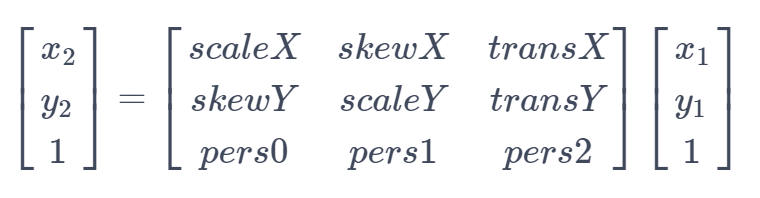
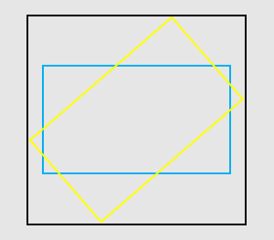

# Class (Matrix)

<!--Kit: ArkGraphics 2D-->
<!--Subsystem: Graphics-->
<!--Owner: @dreamyhhh-->
<!--Designer: @wanyanglan-->
<!--Tester: @nobuggers-->
<!--Adviser: @ge-yafang-->
<!-- md-trans-meta sourceCommit=4fbb151d5d06197ab5bea36827f51c1d37a38ef1 translatedAt=2026-08-24T08:04:52.526Z pushedAt=2026-08-29T03:46:17.003Z -->

A matrix object used for coordinate transformation of graphics, supporting transformation operations such as translation, rotation, scaling, and skewing. Matrix transformation can be used to implement mapping between different coordinate systems.

It is represented as a 3 x 3 matrix, as shown below:


The elements in the matrix from left to right and from top to bottom respectively represent the horizontal scale factor, horizontal skew coefficient, horizontal translation coefficient, vertical skew coefficient, vertical scale factor, vertical translation coefficient, x-axis perspective coefficient, y-axis perspective coefficient, and perspective scale factor.

Let (x<sub>1</sub>, y<sub>1</sub>) be the source coordinate point and (x<sub>2</sub>, y<sub>2</sub>) be the coordinate point obtained after the source coordinate point is transformed by the matrix. The relationship between the two coordinate points is as follows:



> **NOTE**
>
> - The initial APIs of this module are supported since API version 11. Newly added APIs will be marked with a superscript to indicate their earliest API version.
>
> - The initial APIs of this class are supported since API version 12.
>
> - This module uses the physical pixel unit, px.
>
> - The module operates under a single-threaded model. The caller needs to manage thread safety and context state transitions.

## Modules to Import

```ts
import { drawing } from '@kit.ArkGraphics2D';
```

## constructor<sup>12+</sup>

constructor()

Creates a **Matrix** object.

**System capability**: SystemCapability.Graphics.Drawing

**Example**

```ts
import { drawing } from '@kit.ArkGraphics2D';

let matrix = new drawing.Matrix();
```

## constructor<sup>20+</sup>

constructor(matrix: Matrix)

Copies a matrix.

**System capability**: SystemCapability.Graphics.Drawing

**Parameters**

| Name        | Type                                      | Mandatory  | Description                 |
| ----------- | ---------------------------------------- | ---- | ------------------- |
| matrix      | [Matrix](arkts-apis-graphics-drawing-Matrix.md)                  | Yes   | Matrix to be copied.|

**Example**

```ts
import { drawing } from '@kit.ArkGraphics2D';

let matrix = new drawing.Matrix();
let matrix2 = new drawing.Matrix(matrix);
```

## isAffine<sup>20+</sup>

isAffine(): boolean

Checks whether the existing matrix is an affine matrix, which includes transformations such as translation, rotation, and scaling.

**System capability**: SystemCapability.Graphics.Drawing

**Returns**

| Type                       | Description                 |
| --------------------------- | -------------------- |
| boolean | Whether the existing matrix is an affine matrix. **true** means yes; **false** otherwise.|

**Example**

```ts
import { drawing } from '@kit.ArkGraphics2D';

let matrix = new drawing.Matrix();
matrix.setMatrix([1, 0.5, 1, 0.5, 1, 1, 1, 1, 1]);
let isAffine = matrix.isAffine();
console.info('isAffine :', isAffine);
```

## rectStaysRect<sup>20+</sup>

rectStaysRect(): boolean

Checks whether a rectangle stays a rectangle after being mapped by a matrix.

**System capability**: SystemCapability.Graphics.Drawing

**Returns**

| Type                       | Description                 |
| --------------------------- | -------------------- |
| boolean | Whether a rectangle stays a rectangle after being mapped by a matrix. **true** means yes; false otherwise.|

**Example**

```ts
import { drawing } from '@kit.ArkGraphics2D';

let matrix = new drawing.Matrix();
matrix.setMatrix([1, 0.5, 1, 0.5, 1, 1, 1, 1, 1]);
let matrix2 = new drawing.Matrix(matrix);
let isRect = matrix2.rectStaysRect();
console.info('isRect :', isRect);
```

## setSkew<sup>20+</sup>

setSkew(kx: number, ky: number, px: number, py: number): void

Sets the matrix as an identity matrix and performs a skew transformation around the tilt center point (px, py) by (kx, ky). Similar to [setRotation](#setrotation12), [setScale](#setscale12), and [setTranslation](#settranslation12), this method resets the matrix and then applies a single transformation.

**System capability**: SystemCapability.Graphics.Drawing

**Parameters**

| Name        | Type                                      | Mandatory  | Description                      |
| ----------- | ---------------------------------------- | ---- | -------------------             |
| kx          | number                  | Yes   | Amount of tilt on the X axis. The value is a floating point number. A positive number tilts the drawing rightwards along the positive direction of the Y axis, and a negative number tilts the drawing leftwards along the positive direction of the Y axis.       |
| ky          | number                  | Yes   | Amount of tilt on the Y axis. The value is a floating point number. A positive number tilts the drawing downwards along the positive direction of the X axis, and a negative number tilts the drawing upwards along the positive direction of the X axis.       |
| px          | number                  | Yes    | X-axis coordinate of the tilt center point. This parameter is a floating-point number. 0 indicates the coordinate origin, a positive number indicates located at the right of the origin, and a negative number indicates located at the left of the origin. The unit is physical pixel px.     |
| py          | number                  | Yes    | Y-axis coordinate of the tilt center point. This parameter is a floating-point number. 0 indicates the coordinate origin, a positive number indicates located below the origin, and a negative number indicates located above the origin. The unit is physical pixel px.     |

**Example**

```ts
import { drawing } from '@kit.ArkGraphics2D';

let matrix = new drawing.Matrix();
matrix.setMatrix([1, 0.5, 1, 0.5, 1, 1, 1, 1, 1]);
matrix.setSkew(2, 0.5, 0.5, 2);
```

## setSinCos<sup>20+</sup>

setSinCos(sinValue: number, cosValue: number, px: number, py: number): void

Sets the matrix as an identity matrix so that it rotates around the rotation center point (px, py) with the specified sine and cosine values. Similar to [setRotation](#setrotation12), but setRotation directly passes in an angle value, whereas this method passes in sine and cosine values.

**System capability**: SystemCapability.Graphics.Drawing

**Parameters**

| Name        | Type                                      | Mandatory  | Description           |
| ----------- | ---------------------------------------- | ---- | ------------------- |
| sinValue          | number                  | Yes   | Sine value of the rotation angle. Only if the sum of the squares of the sine and cosine values is **1**, the rotation transformation is performed. Otherwise, the matrix may contain other transformations such as translation and scaling.         |
| cosValue          | number                  | Yes   | Cosine value of the rotation angle. Only if the sum of the squares of the sine and cosine values is **1**, the rotation transformation is performed. Otherwise, the matrix may contain other transformations such as translation and scaling.           |
| px          | number                  | Yes    | X-axis coordinate of the rotation center. This parameter is a floating-point number. 0 indicates the coordinate origin. A positive number indicates that it is located to the right of the coordinate origin. A negative number indicates that it is located to the left of the coordinate origin. The unit is physical pixel px.     |
| py          | number                  | Yes    | Y-axis coordinate of the rotation center. This parameter is a floating-point number. 0 indicates the coordinate origin. A positive number indicates that it is located below the coordinate origin. A negative number indicates that it is located above the coordinate origin. The unit is physical pixel px.    |

**Example**

```ts
import { drawing } from '@kit.ArkGraphics2D';

let matrix = new drawing.Matrix();
matrix.setMatrix([1, 0.5, 1, 0.5, 1, 1, 1, 1, 1]);
matrix.setSinCos(0, 1, 1, 0);
```

## setRotation<sup>12+</sup>

setRotation(degree: number, px: number, py: number): void

Sets the matrix as an identity matrix and rotates it around the rotation center point (px, py).

**System capability**: SystemCapability.Graphics.Drawing

**Parameters**

| Name        | Type                                      | Mandatory  | Description                 |
| ----------- | ---------------------------------------- | ---- | ------------------- |
| degree      | number                  | Yes   | Angle to rotate, in degrees. A positive number indicates a clockwise rotation, and a negative number indicates a counterclockwise rotation. The value is a floating point number.|
| px          | number                  | Yes    | x-axis coordinate of the rotation center point. This parameter is a floating-point number. The unit is physical pixel px.     |
| py          | number                  | Yes    | y-axis coordinate of the rotation center point. This parameter is a floating-point number. The unit is physical pixel px.     |

**Error codes**

For details about the error codes, see [Universal Error Codes](../errorcode-universal.md).

| ID| Error Message|
| ------- | --------------------------------------------|
| 401 | Parameter error.Possible causes:1.Mandatory parameters are left unspecified;2.Incorrect parameter types. |

**Example**

```ts
import { drawing } from '@kit.ArkGraphics2D';

let matrix = new drawing.Matrix();
matrix.setRotation(90, 100, 100);
```

## setScale<sup>12+</sup>

setScale(sx: number, sy: number, px: number, py: number): void

Sets the matrix as an identity matrix and scales it by sx and sy around the scale center point (px, py).

**System capability**: SystemCapability.Graphics.Drawing

**Parameters**

| Name        | Type                                      | Mandatory  | Description                 |
| ----------- | ---------------------------------------- | ---- | ------------------- |
| sx          | number                  | Yes    | Scale factor in the x-axis direction. When negative, it can be viewed as a mirror flip about x = px followed by scaling. This parameter is a floating-point number.     |
| sy          | number                  | Yes    | Scale factor in the y-axis direction. When negative, it can be viewed as a mirror flip about y = py followed by scaling. This parameter is a floating-point number.     |
| px          | number                  | Yes    | X-axis coordinate of the scale center. This parameter is a floating-point number. The unit is physical pixel px.      |
| py          | number                  | Yes    | Y-axis coordinate of the scale center. This parameter is a floating-point number. The unit is physical pixel px.      |

**Error codes**

For details about the error codes, see [Universal Error Codes](../errorcode-universal.md).

| ID| Error Message|
| ------- | --------------------------------------------|
| 401 | Parameter error.Possible causes:1.Mandatory parameters are left unspecified;2.Incorrect parameter types. |

**Example**

```ts
import { drawing } from '@kit.ArkGraphics2D';

let matrix = new drawing.Matrix();
matrix.setScale(100, 100, 150, 150);
```

## setTranslation<sup>12+</sup>

setTranslation(dx: number, dy: number): void

Sets the matrix as an identity matrix and translates it by (dx, dy).

**System capability**: SystemCapability.Graphics.Drawing

**Parameters**

| Name        | Type                                      | Mandatory  | Description                 |
| ----------- | ---------------------------------------- | ---- | ------------------- |
| dx          | number                  | Yes    | Translation distance along the x-axis. A positive number indicates translation in the positive x-axis direction, and a negative number indicates translation in the negative x-axis direction. This parameter is a floating-point number. The unit is physical pixel px.     |
| dy          | number                  | Yes    | Translation distance along the y-axis. A positive number indicates translation in the positive y-axis direction, and a negative number indicates translation in the negative y-axis direction. This parameter is a floating-point number. The unit is physical pixel px.     |

**Error codes**

For details about the error codes, see [Universal Error Codes](../errorcode-universal.md).

| ID| Error Message|
| ------- | --------------------------------------------|
| 401 | Parameter error.Possible causes:1.Mandatory parameters are left unspecified;2.Incorrect parameter types. |

**Example**

```ts
import { drawing } from '@kit.ArkGraphics2D';

let matrix = new drawing.Matrix();
matrix.setTranslation(100, 100);
```

## setMatrix<sup>12+</sup>

setMatrix(values: Array\<number>): void

Sets parameters for this matrix.

**System capability**: SystemCapability.Graphics.Drawing

**Parameters**

| Name| Type                                                | Mandatory| Description            |
| ------ | ---------------------------------------------------- | ---- | ---------------- |
| values  | Array\<number> | Yes   | A floating-point array of length 9, representing the parameters of the matrix object. The values in the array, in ascending order of subscript, represent the horizontal scale factor, horizontal skew coefficient, horizontal translation coefficient (in physical pixel px), vertical skew coefficient, vertical scale factor, vertical translation coefficient (in physical pixel px), x-axis perspective coefficient, y-axis perspective coefficient, and perspective scale factor. |

**Error codes**

For details about the error codes, see [Universal Error Codes](../errorcode-universal.md).

| ID| Error Message|
| ------- | --------------------------------------------|
| 401 | Parameter error.Possible causes:1.Mandatory parameters are left unspecified;2.Incorrect parameter types; 3. Parameter verification failed. |

**Example**

```ts
import { drawing } from '@kit.ArkGraphics2D';

let matrix = new drawing.Matrix();
let value : Array<number> = [2, 2, 2, 2, 2, 2, 2, 2, 2];
matrix.setMatrix(value);
```

## preConcat<sup>12+</sup>

preConcat(matrix: Matrix): void

Right-multiplies the existing matrix by the passed-in matrix, that is, the new transformation is applied before the transformation of the existing matrix. To apply the new transformation after the transformation of the existing matrix, use the postConcat method.

**System capability**: SystemCapability.Graphics.Drawing

**Parameters**

| Name| Type                                                | Mandatory| Description            |
| ------ | ---------------------------------------------------- | ---- | ---------------- |
| matrix  | [Matrix](arkts-apis-graphics-drawing-Matrix.md) | Yes   | Indicates the matrix used for the operation, located on the right side of the multiplication expression. |

**Error codes**

For details about the error codes, see [Universal Error Codes](../errorcode-universal.md).

| ID| Error Message|
| ------- | --------------------------------------------|
| 401 | Parameter error.Possible causes:1.Mandatory parameters are left unspecified;2.Incorrect parameter types. |

**Example**

```ts
import { drawing } from '@kit.ArkGraphics2D';

let matrix1 = new drawing.Matrix();
matrix1.setMatrix([2, 1, 3, 1, 2, 1, 3, 1, 2]);
let matrix2 = new drawing.Matrix();
matrix2.setMatrix([-2, 1, 3, 1, 0, -1, 3, -1, 2]);
matrix1.preConcat(matrix2);
```

## setMatrix<sup>20+</sup>

setMatrix(matrix: Array\<number\> \| Matrix): void

Updates the existing matrix with another matrix.

**System capability**: SystemCapability.Graphics.Drawing

**Parameters**

| Name| Type                                                | Mandatory| Description            |
| ------ | ---------------------------------------------------- | ---- | ---------------- |
| matrix | Array\<number\> \| [Matrix](arkts-apis-graphics-drawing-Matrix.md) | Yes | Array or matrix used for the update. When the type is an array, the length is fixed at 9. |

**Example**

```ts
import { drawing } from '@kit.ArkGraphics2D';

let matrix1 = new drawing.Matrix();
matrix1.setMatrix([2, 1, 3, 1, 2, 1, 3, 1, 2]);
let matrix2 = new drawing.Matrix();
matrix1.setMatrix(matrix2);
```

## setConcat<sup>20+</sup>

setConcat(matrixA: Matrix, matrixB: Matrix): void

Updates the existing matrix with the product of two matrices, that is, existing matrix = matrixA × matrixB.

**System capability**: SystemCapability.Graphics.Drawing

**Parameters**

| Name| Type                                                | Mandatory| Description            |
| ------ | ---------------------------------------------------- | ---- | ---------------- |
| matrixA  | [Matrix](arkts-apis-graphics-drawing-Matrix.md) | Yes   | Matrix A used for the operation, located on the left side of the multiplication expression. |
| matrixB  | [Matrix](arkts-apis-graphics-drawing-Matrix.md) | Yes   | Matrix B used for the operation, located on the right side of the multiplication expression. |

**Example**

```ts
import { drawing } from '@kit.ArkGraphics2D';

let matrix1 = new drawing.Matrix();
matrix1.setMatrix([2, 1, 3, 1, 2, 1, 3, 1, 2]);
let matrix2 = new drawing.Matrix();
matrix2.setMatrix([-2, 1, 3, 1, 0, -1, 3, -1, 2]);
matrix1.setConcat(matrix2, matrix1);
```

## postConcat<sup>20+</sup>

postConcat(matrix: Matrix): void

Left-multiplies the existing matrix by another matrix, that is, the new transformation is applied after the transformation of the existing matrix. To apply the new transformation before the transformation of the existing matrix, use the preConcat method.

**System capability**: SystemCapability.Graphics.Drawing

**Parameters**

| Name| Type                                                | Mandatory| Description            |
| ------ | ---------------------------------------------------- | ---- | ---------------- |
| matrix | [Matrix](arkts-apis-graphics-drawing-Matrix.md) | Yes | Indicates the matrix used for the operation, located on the left side of the multiplication expression. |

**Example**

```ts
import { drawing } from '@kit.ArkGraphics2D';

let matrix = new drawing.Matrix();
if (matrix.isIdentity()) {
  console.info("matrix is identity.");
} else {
  console.info("matrix is not identity.");
}

let matrix1 = new drawing.Matrix();
matrix1.setMatrix([2, 1, 3, 1, 2, 1, 3, 1, 2]);
let matrix2 = new drawing.Matrix();
matrix2.setMatrix([-2, 1, 3, 1, 0, -1, 3, -1, 2]);
matrix1.postConcat(matrix2);
```

## isEqual<sup>12+</sup>

isEqual(matrix: Matrix): boolean

Checks whether two **OH_Drawing_Matrix** objects are equal.

**System capability**: SystemCapability.Graphics.Drawing

**Parameters**

| Name| Type                                                | Mandatory| Description            |
| ------ | ---------------------------------------------------- | ---- | ---------------- |
| matrix  | [Matrix](arkts-apis-graphics-drawing-Matrix.md) | Yes   | Another matrix used to compare with the current matrix for equality. |

**Returns**

| Type                       | Description                 |
| --------------------------- | -------------------- |
| boolean | Returns the comparison result of the two matrices. true indicates that the two matrices are equal, and false indicates that they are not equal. |

**Error codes**

For details about the error codes, see [Universal Error Codes](../errorcode-universal.md).

| ID| Error Message|
| ------- | --------------------------------------------|
| 401 | Parameter error.Possible causes:1.Mandatory parameters are left unspecified;2.Incorrect parameter types. |

**Example**

```ts
import { drawing } from '@kit.ArkGraphics2D';

let matrix1 = new drawing.Matrix();
matrix1.setMatrix([2, 1, 3, 1, 2, 1, 3, 1, 2]);
let matrix2 = new drawing.Matrix();
matrix2.setMatrix([-2, 1, 3, 1, 0, -1, 3, -1, 2]);
if (matrix1.isEqual(matrix2)) {
  console.info("matrix1 and matrix2 are equal.");
} else {
  console.info("matrix1 and matrix2 are not equal.");
}
```

## invert<sup>12+</sup>

invert(matrix: Matrix): boolean

Inverts this matrix and returns the result.

**System capability**: SystemCapability.Graphics.Drawing

**Parameters**

| Name| Type                                                | Mandatory| Description            |
| ------ | ---------------------------------------------------- | ---- | ---------------- |
| matrix  | [Matrix](arkts-apis-graphics-drawing-Matrix.md) | Yes  | **Matrix** object used to store the inverted matrix.|

**Returns**

| Type                       | Description                 |
| --------------------------- | -------------------- |
| boolean | Returns whether the matrix is set to the inverse matrix. true indicates that the current matrix is invertible and the matrix is set to the inverse matrix; false indicates that the current matrix is not invertible and the matrix is not set. |

**Error codes**

For details about the error codes, see [Universal Error Codes](../errorcode-universal.md).

| ID| Error Message|
| ------- | --------------------------------------------|
| 401 | Parameter error.Possible causes:1.Mandatory parameters are left unspecified;2.Incorrect parameter types. |

**Example**

```ts
import { drawing } from '@kit.ArkGraphics2D';

let matrix1 = new drawing.Matrix();
matrix1.setMatrix([2, 1, 3, 1, 2, 1, 3, 1, 2]);
let matrix2 = new drawing.Matrix();
matrix2.setMatrix([-2, 1, 3, 1, 0, -1, 3, -1, 2]);
if (matrix1.invert(matrix2)) {
  console.info("matrix1 is invertible and matrix2 is set as an inverse matrix of the matrix1.");
} else {
  console.info("matrix1 is not invertible and matrix2 is not changed.");
}
```

## isIdentity<sup>12+</sup>

isIdentity(): boolean

Checks whether an **OH_Drawing_Matrix** object is an identity matrix:

**System capability**: SystemCapability.Graphics.Drawing

**Returns**

| Type                       | Description                 |
| --------------------------- | -------------------- |
| boolean | Whether the matrix is a unit matrix. true indicates the matrix is a unit matrix, and false indicates the matrix is not a unit matrix. |

**Example**

```ts
import { drawing } from '@kit.ArkGraphics2D';

let matrix = new drawing.Matrix();
if (matrix.isIdentity()) {
  console.info("matrix is identity.");
} else {
  console.info("matrix is not identity.");
}
```

## getValue<sup>12+</sup>

getValue(index: number): number

Obtains a matrix value of a given index, which ranges from 0 to 8.

**System capability**: SystemCapability.Graphics.Drawing

**Parameters**

| Name         | Type   | Mandatory| Description                                                       |
| --------------- | ------- | ---- | ----------------------------------------------------------- |
| index | number | Yes  | Index. The value is an integer ranging from 0 to 8.|

**Returns**

| Type                 | Description          |
| --------------------- | -------------- |
| number | Value obtained, which is an integer.|

**Error codes**

For details about the error codes, see [Universal Error Codes](../errorcode-universal.md).

| ID| Error Message|
| ------- | --------------------------------------------|
| 401 | Parameter error. Possible causes: 1. Mandatory parameters are left unspecified;2. Incorrect parameter types;3. Parameter verification failed.|

**Example**

```ts
import { drawing } from "@kit.ArkGraphics2D";

let matrix = new drawing.Matrix();
for (let i = 0; i < 9; i++) {
    console.info("matrix "+matrix.getValue(i).toString());
}
```

## postRotate<sup>12+</sup>

postRotate(degree: number, px: number, py: number): void

Sets the matrix to the matrix obtained by right-multiplying the existing matrix by an identity matrix that has been rotated by a given degree around the rotation point (px, py), that is, the new rotation transformation is applied after the transformation of the existing matrix. To apply the rotation transformation before the transformation of the existing matrix, use the preRotate method.

**System capability**: SystemCapability.Graphics.Drawing

**Parameters**

| Name         | Type   | Mandatory| Description                                                       |
| --------------- | ------- | ---- | ----------------------------------------------------------- |
| degree | number | Yes  | Angle to rotate, in degrees. A positive number indicates a clockwise rotation, and a negative number indicates a counterclockwise rotation. The value is a floating point number.|
| px | number | Yes | X-axis coordinate of the rotation center point. This parameter is a floating-point number. The unit is physical pixel px. |
| py | number | Yes | Y-axis coordinate of the rotation center point. This parameter is a floating-point number. The unit is physical pixel px. |

**Error codes**

For details about the error codes, see [Universal Error Codes](../errorcode-universal.md).

| ID| Error Message|
| ------- | --------------------------------------------|
| 401 | Parameter error.Possible causes:1.Mandatory parameters are left unspecified;2.Incorrect parameter types. |

**Example**

```ts
import { drawing } from "@kit.ArkGraphics2D";

let matrix = new drawing.Matrix();
let degree: number = 2;
let px: number = 3;
let py: number = 4;
matrix.postRotate(degree, px, py);
console.info("matrix= "+matrix.getAll().toString());
```

## postScale<sup>12+</sup>

postScale(sx: number, sy: number, px: number, py: number): void

Sets the matrix to the matrix obtained by right-multiplying the existing matrix by an identity matrix that has been scaled with the coefficients (sx, sy) at the scale point (px, py), that is, the new scaling transformation is applied after the transformation of the existing matrix. To apply the scaling transformation before the transformation of the existing matrix, use the preScale method.

**System capability**: SystemCapability.Graphics.Drawing

**Parameters**

| Name         | Type   | Mandatory| Description                                                       |
| --------------- | ------- | ---- | ----------------------------------------------------------- |
| sx | number | Yes | Scale factor in the x-axis direction. A negative value indicates mirror flip about x = px before scaling. This parameter is a floating-point number. |
| sy | number | Yes | Scale factor in the y-axis direction. A negative value indicates mirror flip about y = py before scaling. This parameter is a floating-point number. |
| px | number | Yes | X-axis coordinate of the scale center. This parameter is a floating-point number. The unit is physical pixel px. |
| py | number | Yes | Y-axis coordinate of the scale center. This parameter is a floating-point number. The unit is physical pixel px. |

**Error codes**

For details about the error codes, see [Universal Error Codes](../errorcode-universal.md).

| ID| Error Message|
| ------- | --------------------------------------------|
| 401 | Parameter error.Possible causes:1.Mandatory parameters are left unspecified;2.Incorrect parameter types. |

**Example**

```ts
import { drawing } from "@kit.ArkGraphics2D";

let matrix = new drawing.Matrix();
let sx: number = 2;
let sy: number = 0.5;
let px: number = 1;
let py: number = 1;
matrix.postScale(sx, sy, px, py);
console.info("matrix= "+matrix.getAll().toString());
```

## postTranslate<sup>12+</sup>

postTranslate(dx: number, dy: number): void

Sets the matrix to the matrix obtained by right-multiplying the existing matrix by an identity matrix that has been translated by a given distance (dx, dy), that is, the new translation transformation is applied after the transformation of the existing matrix. To apply the translation transformation before the transformation of the existing matrix, use the preTranslate method.

**System capability**: SystemCapability.Graphics.Drawing

**Parameters**

| Name         | Type   | Mandatory| Description                                                       |
| --------------- | ------- | ---- | ----------------------------------------------------------- |
| dx | number | Yes | Translation distance along the x-axis. A positive number indicates translation in the positive x-axis direction, and a negative number indicates translation in the negative x-axis direction. This parameter is a floating-point number. The unit is physical pixel px. |
| dy | number | Yes | Translation distance along the y-axis. A positive number indicates translation in the positive y-axis direction, and a negative number indicates translation in the negative y-axis direction. This parameter is a floating-point number. The unit is physical pixel px. |

**Error codes**

For details about the error codes, see [Universal Error Codes](../errorcode-universal.md).

| ID| Error Message|
| ------- | --------------------------------------------|
| 401 | Parameter error.Possible causes:1.Mandatory parameters are left unspecified;2.Incorrect parameter types. |

**Example**

```ts
import { drawing } from "@kit.ArkGraphics2D";

let matrix = new drawing.Matrix();
let dx: number = 3;
let dy: number = 4;
matrix.postTranslate(dx, dy);
console.info("matrix= "+matrix.getAll().toString());
```

## preRotate<sup>12+</sup>

preRotate(degree: number, px: number, py: number): void

Sets the matrix to the matrix obtained by left-multiplying the existing matrix by an identity matrix that has been rotated by a given degree around the rotation point (px, py), that is, the new rotation transformation is applied before the transformation of the existing matrix. To apply the rotation transformation after the transformation of the existing matrix, use the postRotate method.

**System capability**: SystemCapability.Graphics.Drawing

**Parameters**

| Name         | Type   | Mandatory| Description                                                       |
| --------------- | ------- | ---- | ----------------------------------------------------------- |
| degree | number | Yes  | Angle to rotate, in degrees. A positive number indicates a clockwise rotation, and a negative number indicates a counterclockwise rotation. The value is a floating point number.|
| px | number | Yes | x-axis coordinate of the rotation center point. This parameter is a floating-point number. The unit is physical pixel px. |
| py | number | Yes | y-axis coordinate of the rotation center point. This parameter is a floating-point number. The unit is physical pixel px. |

**Error codes**

For details about the error codes, see [Universal Error Codes](../errorcode-universal.md).

| ID| Error Message|
| ------- | --------------------------------------------|
| 401 | Parameter error.Possible causes:1.Mandatory parameters are left unspecified;2.Incorrect parameter types. |

**Example**

```ts
import { drawing } from "@kit.ArkGraphics2D";

let matrix = new drawing.Matrix();
let degree: number = 2;
let px: number = 3;
let py: number = 4;
matrix.preRotate(degree, px, py);
console.info("matrix= "+matrix.getAll().toString());
```

## postSkew<sup>20+</sup>

postSkew(kx: number, ky: number, px: number, py: number): void

Right-multiply the existing matrix by a skew transformation matrix.

**System capability**: SystemCapability.Graphics.Drawing

**Parameters**

| Name        | Type                                      | Mandatory  | Description            |
| ----------- | ---------------------------------------- | ---- | -------------------   |
| kx          | number                  | Yes   | Amount of tilt on the X axis. The value is a floating point number. A positive number tilts the drawing rightwards along the positive direction of the Y axis, and a negative number tilts the drawing leftwards along the positive direction of the Y axis.          |
| ky          | number                  | Yes   | Amount of tilt on the Y axis. The value is a floating point number. A positive number tilts the drawing downwards along the positive direction of the X axis, and a negative number tilts the drawing upwards along the positive direction of the X axis.          |
| px          | number                  | Yes    | X-axis coordinate of the tilt center point. This parameter is a floating point number. 0 indicates the coordinate origin, a positive number indicates located at the right of the origin, and a negative number indicates located at the left of the origin. The unit is physical pixel px.    |
| py          | number                  | Yes    | Y-axis coordinate of the tilt center point. This parameter is a floating point number. 0 indicates the coordinate origin, a positive number indicates located below the origin, and a negative number indicates located above the origin. The unit is physical pixel px.   |

**Example**

```ts
import { drawing } from "@kit.ArkGraphics2D";

let matrix = new drawing.Matrix();
matrix.postSkew(2.0, 1.0, 2.0, 1.0);
```

## preSkew<sup>20+</sup>

preSkew(kx: number, ky: number, px: number, py: number): void

Left-multiply the existing matrix by a skew transformation matrix.

**System capability**: SystemCapability.Graphics.Drawing

**Parameters**

| Name        | Type                                      | Mandatory  | Description            |
| ----------- | ---------------------------------------- | ---- | -------------------   |
| kx          | number                  | Yes   | Amount of tilt on the X axis. The value is a floating point number. A positive number tilts the drawing rightwards along the positive direction of the Y axis, and a negative number tilts the drawing leftwards along the positive direction of the Y axis.          |
| ky          | number                  | Yes   | Amount of tilt on the Y axis. The value is a floating point number. A positive number tilts the drawing downwards along the positive direction of the X axis, and a negative number tilts the drawing upwards along the positive direction of the X axis.          |
| px          | number                  | Yes    | X-axis coordinate of the tilt center point. This parameter is a floating point number. 0 indicates the coordinate origin, a positive number indicates located at the right of the origin, and a negative number indicates located at the left of the origin. The unit is physical pixel px.        |
| py          | number                  | Yes    | Y-axis coordinate of the tilt center point. This parameter is a floating point number. 0 indicates the coordinate origin, a positive number indicates located below the origin, and a negative number indicates located above the origin. The unit is physical pixel px.        |

**Example**

```ts
import { drawing } from "@kit.ArkGraphics2D";

let matrix = new drawing.Matrix();
matrix.preSkew(2.0, 1.0, 2.0, 1.0);
```

## mapRadius<sup>20+</sup>

mapRadius(radius: number): number

Returns the average radius of the ellipse formed after a circle with the specified **radius** is mapped by the existing matrix. The square of the average radius is the product of the major axis length and minor axis length of the ellipse. If the matrix contains perspective transformation, the result is meaningless.

**System capability**: SystemCapability.Graphics.Drawing

**Parameters**

| Name| Type                                                | Mandatory| Description            |
| ------ | ---------------------------------------------------- | ---- | ---------------- |
| radius  | number | Yes   | Radius of the circle used for calculation, a floating-point number. If it is a negative number, the absolute value is used for calculation. The unit is physical pixel px. |

**Returns**

| Type                       | Description                 |
| --------------------------- | -------------------- |
| number | Returns the average radius after transformation. Unit is physical pixel px. |

**Example**

```ts
import { drawing } from "@kit.ArkGraphics2D";

let matrix = new drawing.Matrix();
matrix.setMatrix([2, 1, 3, 1, 2, 1, 3, 1, 2]);
let radius = matrix.mapRadius(10);
console.info('radius', radius);
```

## preScale<sup>12+</sup>

preScale(sx: number, sy: number, px: number, py: number): void

Sets the matrix to the matrix obtained by premultiplying this matrix by the identity matrix scaled with the coefficients sx and sy around the scale center point, that is, the new scaling transformation is applied before the transformation of the current matrix. If the scaling transformation needs to be applied after the transformation of the current matrix, use the postScale method.

**System capability**: SystemCapability.Graphics.Drawing

**Parameters**

| Name         | Type   | Mandatory| Description                                                       |
| --------------- | ------- | ---- | ----------------------------------------------------------- |
| sx | number | Yes | Scale factor in the x-axis direction. When negative, it can be viewed as a mirror flip about x = px before scaling. This parameter is a floating-point number. |
| sy | number | Yes | Scale factor in the y-axis direction. When negative, it can be viewed as a mirror flip about y = py before scaling. This parameter is a floating-point number. |
| px | number | Yes | X-axis coordinate of the scale center. This parameter is a floating-point number. The unit is physical pixel px. |
| py | number | Yes | Y-axis coordinate of the scale center. This parameter is a floating-point number. The unit is physical pixel px. |

**Error codes**

For details about the error codes, see [Universal Error Codes](../errorcode-universal.md).

| ID| Error Message|
| ------- | --------------------------------------------|
| 401 | Parameter error.Possible causes:1.Mandatory parameters are left unspecified;2.Incorrect parameter types. |

**Example**

```ts
import { drawing } from "@kit.ArkGraphics2D";

let matrix = new drawing.Matrix();
let sx: number = 2;
let sy: number = 0.5;
let px: number = 1;
let py: number = 1;
matrix.preScale(sx, sy, px, py);
console.info("matrix"+matrix.getAll().toString());
```

## preTranslate<sup>12+</sup>

preTranslate(dx: number, dy: number): void

Sets the matrix to the matrix obtained by premultiplying this matrix by the identity matrix translated by dx and dy, that is, the new translation transformation is applied before the transformation of the current matrix. If the translation transformation needs to be applied after the transformation of the current matrix, use the postTranslate method.

**System capability**: SystemCapability.Graphics.Drawing

**Parameters**

| Name         | Type   | Mandatory| Description                                                       |
| --------------- | ------- | ---- | ----------------------------------------------------------- |
| dx | number | Yes | Translation distance along the x-axis. A positive number indicates translation in the positive x-axis direction, and a negative number indicates translation in the negative x-axis direction. This parameter is a floating-point number. The unit is physical pixel px. |
| dy | number | Yes | Translation distance along the y-axis. A positive number indicates translation in the positive y-axis direction, and a negative number indicates translation in the negative y-axis direction. This parameter is a floating-point number. The unit is physical pixel px. |

**Error codes**

For details about the error codes, see [Universal Error Codes](../errorcode-universal.md).

| ID| Error Message|
| ------- | --------------------------------------------|
| 401 | Parameter error.Possible causes:1.Mandatory parameters are left unspecified;2.Incorrect parameter types. |

**Example**

```ts
import { drawing } from "@kit.ArkGraphics2D";

let matrix = new drawing.Matrix();
let dx: number = 3;
let dy: number = 4;
matrix.preTranslate(dx, dy);
console.info("matrix"+matrix.getAll().toString());
```

## reset<sup>12+</sup>

reset(): void

Resets this matrix to an identity matrix.

**System capability**: SystemCapability.Graphics.Drawing

**Example**

```ts
import { drawing } from "@kit.ArkGraphics2D";

let matrix = new drawing.Matrix();
matrix.postScale(2, 3, 4, 5);
matrix.reset();
console.info("matrix= "+matrix.getAll().toString());
```

## mapPoints<sup>12+</sup>

mapPoints(src: Array\<common2D.Point>): Array\<common2D.Point>

Maps a source point array to a destination point array by means of matrix transformation.

**System capability**: SystemCapability.Graphics.Drawing

**Parameters**

| Name         | Type   | Mandatory| Description                                                       |
| --------------- | ------- | ---- | ----------------------------------------------------------- |
| src | Array\<[common2D.Point](js-apis-graphics-common2D.md#point12)> | Yes | Source point array, used as the input points for matrix transformation. |

**Returns**

| Type                 | Description          |
| --------------------- | -------------- |
| Array\<[common2D.Point](js-apis-graphics-common2D.md#point12)> | Array of points obtained.|

**Error codes**

For details about the error codes, see [Universal Error Codes](../errorcode-universal.md).

| ID| Error Message|
| ------- | --------------------------------------------|
| 401 | Parameter error.Possible causes:1.Mandatory parameters are left unspecified;2.Incorrect parameter types. |

**Example**

```ts
import { drawing, common2D } from "@kit.ArkGraphics2D";

let src: Array<common2D.Point> = [];
src.push({x: 15, y: 20});
src.push({x: 20, y: 15});
src.push({x: 30, y: 10});
let matrix = new drawing.Matrix();
let dst: Array<common2D.Point> = matrix.mapPoints(src);
console.info("matrix= src: "+JSON.stringify(src));
console.info("matrix= dst: "+JSON.stringify(dst));
```

## getAll<sup>12+</sup>

getAll(): Array\<number>

Obtains all element values of this matrix.

**System capability**: SystemCapability.Graphics.Drawing

**Returns**

| Type                 | Description          |
| --------------------- | -------------- |
| Array\<number> | Array of matrix values obtained. The length is 9. Each value is a floating point number.|

**Example**

```ts
import { drawing } from "@kit.ArkGraphics2D";

let matrix = new drawing.Matrix();
console.info("matrix "+ matrix.getAll());
```

## mapRect<sup>12+</sup>

mapRect(dst: common2D.Rect, src: common2D.Rect): boolean

Sets the destination rectangle to the bounding rectangle of the shape obtained after transforming the source rectangle with a matrix transformation. As shown in the figure below, the blue rectangle represents the source rectangle, and the yellow rectangle is the shape obtained after a matrix transformation is applied to the source rectangle. Since the edges of the yellow rectangle are not aligned with the coordinate axes, it cannot be represented by a rectangle object. To address this issue, a destination rectangle (black rectangle) is defined as the bounding rectangle.



**System capability**: SystemCapability.Graphics.Drawing

**Parameters**

| Name         | Type   | Mandatory| Description                                                       |
| --------------- | ------- | ---- | ----------------------------------------------------------- |
| dst | [common2D.Rect](js-apis-graphics-common2D.md#rect) | Yes  | **Rectangle** object, which is used to store the bounding rectangle.|
| src |[common2D.Rect](js-apis-graphics-common2D.md#rect) | Yes  | Source rectangle.|

**Returns**

| Type                 | Description          |
| --------------------- | -------------- |
| boolean | Check result. The value **true** means that the shape retains a rectangular form, and **false** means the opposite.|

**Error codes**

For details about the error codes, see [Universal Error Codes](../errorcode-universal.md).

| ID| Error Message|
| ------- | --------------------------------------------|
| 401 | Parameter error.Possible causes:1.Mandatory parameters are left unspecified;2.Incorrect parameter types. |

**Example**

```ts
import { drawing, common2D } from "@kit.ArkGraphics2D";

let dst: common2D.Rect = { left: 100, top: 20, right: 130, bottom: 60 };
let src: common2D.Rect = { left: 100, top: 80, right: 130, bottom: 120 };
let matrix = new drawing.Matrix();
if (matrix.mapRect(dst, src)) {
    console.info("matrix= dst "+JSON.stringify(dst));
}
```

## setRectToRect<sup>12+</sup>

setRectToRect(src: common2D.Rect, dst: common2D.Rect, scaleToFit: ScaleToFit): boolean

Sets this matrix to a transformation matrix that maps a source rectangle to a destination rectangle.

**System capability**: SystemCapability.Graphics.Drawing

**Parameters**

| Name         | Type   | Mandatory| Description                                                       |
| --------------- | ------- | ---- | ----------------------------------------------------------- |
| src | [common2D.Rect](js-apis-graphics-common2D.md#rect) | Yes | Source rectangle, used to specify the source area for mapping. |
| dst | [common2D.Rect](js-apis-graphics-common2D.md#rect) | Yes | Target rectangle, used to specify the target area for mapping. |
| scaleToFit | [ScaleToFit](arkts-apis-graphics-drawing-e.md#scaletofit12) | Yes  | Mapping mode from the source rectangle to the target rectangle.|

**Returns**

| Type                 | Description          |
| --------------------- | -------------- |
| boolean | Whether the matrix can represent the mapping between rectangles. true indicates that it can, and false indicates that it cannot. If either the width or height of the source rectangle is less than or equal to 0, false is returned and the matrix is set to the unit matrix. If either the width or height of the target rectangle is less than or equal to 0, true is returned and the matrix is set to a matrix in which all values are 0 except the perspective scale factor, which is 1. |

**Error codes**

For details about the error codes, see [Universal Error Codes](../errorcode-universal.md).

| ID| Error Message|
| ------- | --------------------------------------------|
| 401 | Parameter error.Possible causes:1.Mandatory parameters are left unspecified;2.Incorrect parameter types;3.Parameter verification failed. |

**Example**

```ts
import { drawing, common2D } from "@kit.ArkGraphics2D";

let src: common2D.Rect = { left: 100, top: 100, right: 300, bottom: 300 };
let dst: common2D.Rect = { left: 200, top: 200, right: 600, bottom: 600 };
let scaleToFit: drawing.ScaleToFit = drawing.ScaleToFit.FILL_SCALE_TO_FIT;
let matrix = new drawing.Matrix();
if (matrix.setRectToRect(src, dst, scaleToFit)) {
    console.info("matrix"+matrix.getAll().toString());
}
```

## setPolyToPoly<sup>12+</sup>

setPolyToPoly(src: Array\<common2D.Point>, dst: Array\<common2D.Point>, count: number): boolean

Sets this matrix to a transformation matrix that maps the source point array to the destination point array. Both the number of source points and that of destination points must be in the range [0, 4].

**System capability**: SystemCapability.Graphics.Drawing

**Parameters**

| Name         | Type   | Mandatory| Description                                                       |
| --------------- | ------- | ---- | ----------------------------------------------------------- |
| src | Array\<[common2D.Point](js-apis-graphics-common2D.md#point12)> | Yes  | Array of source points. The array length must be the same as the value of **count**.|
| dst | Array\<[common2D.Point](js-apis-graphics-common2D.md#point12)> | Yes  | Array of destination points. The array length must be the same as the value of **count**.|
| count | number | Yes | Number of points in src and dst. The value range is [0, 4]. This parameter is an integer. |

**Returns**

| Type                 | Description          |
| --------------------- | -------------- |
| boolean | Check result. The value **true** means that the setting is successful, and **false** means the opposite.|

**Error codes**

For details about the error codes, see [Universal Error Codes](../errorcode-universal.md).

| ID| Error Message|
| ------- | --------------------------------------------|
| 401 | Parameter error.Possible causes:1.Mandatory parameters are left unspecified;2.Incorrect parameter types. |

**Example**

```ts
import { drawing, common2D } from "@kit.ArkGraphics2D";

let srcPoints: Array<common2D.Point> = [ {x: 10, y: 20}, {x: 200, y: 150} ];
let dstPoints: Array<common2D.Point> = [{ x:0, y: 10 }, { x:300, y: 600 }];
let matrix = new drawing.Matrix();
if (matrix.setPolyToPoly(srcPoints, dstPoints, 2)) {
    console.info("matrix"+matrix.getAll().toString());
}
```