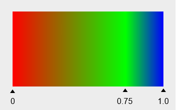
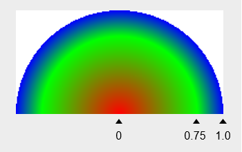
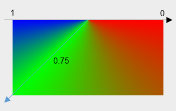
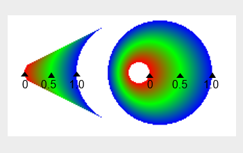

# Class (ShaderEffect)

<!--Kit: ArkGraphics 2D-->
<!--Subsystem: Graphics-->
<!--Owner: @hangmengxin-->
<!--Designer: @wangyanglan-->
<!--Tester: @nobuggers-->
<!--Adviser: @ge-yafang-->
<!-- md-trans-meta sourceCommit=9d24e15ef82b33c8322a412e3fad5e8314ad7c4e translatedAt=2026-08-24T08:15:44.953Z pushedAt=2026-08-31T02:22:55.448Z -->

A shader is used to fill colors and gradient effects in drawing. After a shader is set for a brush or pen, the shader effect is used for drawing instead of the color attribute, but the opacity attribute of the brush or pen still takes effect. A shader supports creating multiple types, including solid color shaders, linear gradients, radial gradients, sweep gradients, conical gradients, image shaders, and compose shaders.

> **NOTE**
>
> - The initial APIs of this module are supported since API version 11. Newly added APIs will be marked with a superscript to indicate their earliest API version.
>
> - The initial APIs of this class are supported since API version 12.
>
> - This module uses the physical pixel unit, px.
>
> - This module operates under a single-threaded model. The caller needs to manage thread safety and context state transitions.

## Modules to Import

```ts
import { drawing } from '@kit.ArkGraphics2D';
```

## createComposeShader<sup>20+</sup>

static createComposeShader(dstShaderEffect: ShaderEffect, srcShaderEffect: ShaderEffect, blendMode: BlendMode): ShaderEffect

Creates a shader by blending two existing shaders in a certain way.

**System capability**: SystemCapability.Graphics.Drawing

**Parameters**

| Name| Type                                              | Mandatory| Description          |
| ------ | -------------------------------------------------- | ---- | -------------- |
| dstShaderEffect  | [ShaderEffect](arkts-apis-graphics-drawing-ShaderEffect.md) | Yes  | Shader that serves as the destination color in blend mode.|
| srcShaderEffect  | [ShaderEffect](arkts-apis-graphics-drawing-ShaderEffect.md) | Yes  | Shader that serves as the source color in blend mode.  |
| blendMode  | [BlendMode](arkts-apis-graphics-drawing-e.md#blendmode) | Yes   | Blend mode, which specifies the color blending algorithm when two shaders are overlaid. |

**Returns**

| Type   | Description                      |
| ------- | ------------------------- |
| [ShaderEffect](arkts-apis-graphics-drawing-ShaderEffect.md) | Returns the blended shader object. |

**Error codes**

For details about the following error code, see [Drawing and Display Error Codes](../apis-arkgraphics2d/errorcode-drawing.md).

| ID| Error Message|
| ------- | --------------------------------------------|
| 25900001 | Parameter error.Possible causes: Incorrect parameter range. |

**Example**

```ts
import { drawing } from '@kit.ArkGraphics2D';

let dstShader = drawing.ShaderEffect.createColorShader(0xFF0000FF);
let srcShader = drawing.ShaderEffect.createColorShader(0xFFFF0000);
let shader = drawing.ShaderEffect.createComposeShader(dstShader, srcShader, drawing.BlendMode.SRC);
```

## createImageShader<sup>20+</sup>

static createImageShader(pixelmap: image.PixelMap, tileX: TileMode, tileY: TileMode, samplingOptions: SamplingOptions, matrix?: Matrix \| null): ShaderEffect

Creates a shader based on an image. You are advised not to use this API for the canvas of the capture type (a Canvas object used to record drawing commands rather than render directly), because it affects the performance.

**System capability**: SystemCapability.Graphics.Drawing

**Parameters**

| Name| Type                                              | Mandatory| Description          |
| ------ | -------------------------------------------------- | ---- | -------------- |
| pixelmap  | [image.PixelMap](../apis-image-kit/arkts-apis-image-PixelMap.md)  | Yes  | Image object to be sampled.|
| tileX   | [TileMode](arkts-apis-graphics-drawing-e.md#tilemode12)  | Yes  | Tile mode in the horizontal direction.|
| tileY   | [TileMode](arkts-apis-graphics-drawing-e.md#tilemode12)  | Yes  | Tile mode in the vertical direction.|
| samplingOptions     | [SamplingOptions](arkts-apis-graphics-drawing-SamplingOptions.md)                           | Yes   | Image sampling options, used to specify the filtering mode for image sampling. |
| matrix | [Matrix](arkts-apis-graphics-drawing-Matrix.md) \| null | No   | Matrix object used to perform matrix transformation on the shader. The default value is null, indicating an identity matrix. |

**Returns**

| Type   | Description                      |
| ------- | ------------------------- |
| [ShaderEffect](arkts-apis-graphics-drawing-ShaderEffect.md) | Returns a shader object based on an image. |

**Error codes**

For details about the following error code, see [Drawing and Display Error Codes](../apis-arkgraphics2d/errorcode-drawing.md).

| ID| Error Message|
| ------- | --------------------------------------------|
| 25900001 | Parameter error.Possible causes: Incorrect parameter range. |

**Example**

```ts
import { RenderNode, DrawContext } from '@kit.ArkUI';
import { image } from '@kit.ImageKit';
import { drawing } from '@kit.ArkGraphics2D';

class DrawingRenderNode extends RenderNode {
  draw(context: DrawContext) {
    const width = 1000;
    const height = 1000;
    const bufferSize = width * height * 4;
    const color: ArrayBuffer = new ArrayBuffer(bufferSize);

    const colorData = new Uint8Array(color);
    for (let i = 0; i < colorData.length; i += 4) {
      colorData[i] = 255;
      colorData[i + 1] = 156;
      colorData[i + 2] = 0;
      colorData[i + 3] = 255;
    }

  let opts: image.InitializationOptions = {
      editable: true,
      pixelFormat: 3,
      size: { height, width }
    };

    let pixelMap: image.PixelMap = image.createPixelMapSync(color, opts);
    let matrix = new drawing.Matrix();
    let options = new drawing.SamplingOptions(drawing.FilterMode.FILTER_MODE_NEAREST);
    if (pixelMap != null) {
      let imageShader =
        drawing.ShaderEffect.createImageShader(pixelMap, drawing.TileMode.REPEAT, drawing.TileMode.MIRROR, options,
          matrix);
    }
    pixelMap.release();
  }
}
```

## createColorShader<sup>12+</sup>

static createColorShader(color: number): ShaderEffect

Creates a **ShaderEffect** object with a single color.

**System capability**: SystemCapability.Graphics.Drawing

**Parameters**

| Name| Type                                              | Mandatory| Description          |
| ------ | -------------------------------------------------- | ---- | -------------- |
| color   | number | Yes  | Color in the ARGB format. The value is a 32-bit unsigned integer.|

**Returns**

| Type   | Description                      |
| ------- | ------------------------- |
| [ShaderEffect](arkts-apis-graphics-drawing-ShaderEffect.md) | **ShaderEffect** object with a single color.|

**Error codes**

For details about the error codes, see [Universal Error Codes](../errorcode-universal.md).

| ID| Error Message|
| ------- | --------------------------------------------|
| 401 | Parameter error. Possible causes: 1. Mandatory parameters are left unspecified; 2. Incorrect parameter types. |

**Example**

```ts
import { drawing } from '@kit.ArkGraphics2D';

let shaderEffect = drawing.ShaderEffect.createColorShader(0xFFFF0000);
```

## createLinearGradient<sup>12+</sup>

static createLinearGradient(startPt: common2D.Point, endPt: common2D.Point, colors: Array\<number>, mode: TileMode, pos?: Array\<number> \| null, matrix?: Matrix \| null): ShaderEffect

Creates a **ShaderEffect** object that generates a linear gradient between two points.

**System capability**: SystemCapability.Graphics.Drawing

**Parameters**

| Name| Type                                              | Mandatory| Description          |
| ------ | -------------------------------------------------- | ---- | -------------- |
| startPt  | [common2D.Point](js-apis-graphics-common2D.md#point12)  | Yes  | Start point.|
| endPt   | [common2D.Point](js-apis-graphics-common2D.md#point12)  | Yes  | End point.|
| colors | Array\<number> | Yes  | Array of colors to distribute between the two points. The values in the array are 32-bit (ARGB) unsigned integers.|
| mode  | [TileMode](arkts-apis-graphics-drawing-e.md#tilemode12) | Yes  | Tile mode of the shader effect.|
| pos | Array\<number> \|null| No  | Relative position of each color in the color array. The array length must be the same as that of **colors**. The first element in the array must be 0.0, the last element must be 1.0, and the middle elements must be between 0.0 and 1.0 and increase by index. The default value is null, indicating that colors are evenly distributed between the two points.|
| matrix | [Matrix](arkts-apis-graphics-drawing-Matrix.md) \| null | No  | **Matrix** object used to perform matrix transformation on the shader effect. The default value is null, indicating the identity matrix.|



As shown in the preceding figure, the display effect is obtained when the color array is set to red, green, and blue, and the position array is set to 0.0, 0.75, and 1.0. The triangle markers indicate the relative positions between the start point and end point of the corresponding colors, and gradients are used to fill between the colors.

**Returns**

| Type   | Description                      |
| ------- | ------------------------- |
| [ShaderEffect](arkts-apis-graphics-drawing-ShaderEffect.md) | Returns a linear gradient shader object. |

**Error codes**

For details about the error codes, see [Universal Error Codes](../errorcode-universal.md).

| ID| Error Message|
| ------- | --------------------------------------------|
| 401 | Parameter error. Possible causes: 1. Mandatory parameters are left unspecified; 2. Incorrect parameter types; 3. Parameter verification failed. |

**Example**

```ts
import { common2D, drawing } from '@kit.ArkGraphics2D';

let startPt: common2D.Point = { x: 100, y: 100 };
let endPt: common2D.Point = { x: 300, y: 300 };
let shaderEffect = drawing.ShaderEffect.createLinearGradient(startPt, endPt, [0xFF00FF00, 0xFFFF0000], drawing.TileMode.REPEAT);
```

## createRadialGradient<sup>12+</sup>

static createRadialGradient(centerPt: common2D.Point, radius: number, colors: Array\<number>, mode: TileMode, pos?: Array\<number> \| null, matrix?: Matrix \| null): ShaderEffect

Creates a **ShaderEffect** object that generates a radial gradient based on the center and radius of a circle. A radial gradient refers to the color transition that spreads out gradually from the center of a circle.

**System capability**: SystemCapability.Graphics.Drawing

**Parameters**

| Name| Type                                              | Mandatory| Description          |
| ------ | -------------------------------------------------- | ---- | -------------- |
| centerPt  | [common2D.Point](js-apis-graphics-common2D.md#point12)  | Yes  | Center of the circle.|
| radius   | number  | Yes  | Radius of the gradient. A negative number is invalid. The value is a floating point number.|
| colors | Array\<number> | Yes  | Array of colors to distribute between the center and ending shape of the circle. The values in the array are 32-bit (ARGB) unsigned integers.|
| mode  | [TileMode](arkts-apis-graphics-drawing-e.md#tilemode12) | Yes  | Tile mode of the shader effect.|
| pos | Array\<number> \| null | No  | Relative position of each color in the color array. The array length must be the same as that of **colors**. The first element in the array must be 0.0, the last element must be 1.0, and the middle elements must be between 0.0 and 1.0 and increase by index. The default value is null, indicating that colors are evenly distributed between the center and ending shape of the circle.|
| matrix | [Matrix](arkts-apis-graphics-drawing-Matrix.md) \| null | No  | **Matrix** object used to perform matrix transformation on the shader effect. The default value is null, indicating the identity matrix.|



As shown in the preceding figure, the display effect is obtained after the color array is set to red, green, and blue, and the position array is set to 0.0, 0.75, and 1.0. The triangular markers indicate the relative positions of the corresponding colors between the center and the boundary of the circle, and the colors are filled with gradients.

**Returns**

| Type   | Description                      |
| ------- | ------------------------- |
| [ShaderEffect](arkts-apis-graphics-drawing-ShaderEffect.md) | Returns a radial gradient shader object. |

**Error codes**

For details about the error codes, see [Universal Error Codes](../errorcode-universal.md).

| ID| Error Message|
| ------- | --------------------------------------------|
| 401 | Parameter error. Possible causes: 1. Mandatory parameters are left unspecified; 2. Incorrect parameter types; 3. Parameter verification failed. |

**Example**

```ts
import { common2D, drawing } from '@kit.ArkGraphics2D';

let centerPt: common2D.Point = { x: 100, y: 100 };
let shaderEffect = drawing.ShaderEffect.createRadialGradient(centerPt, 100, [0xFF00FF00, 0xFFFF0000], drawing.TileMode.REPEAT);
```

## createSweepGradient<sup>12+</sup>

static createSweepGradient(centerPt: common2D.Point, colors: Array\<number>, mode: TileMode, startAngle: number, endAngle: number, pos?: Array\<number> \| null, matrix?: Matrix \| null): ShaderEffect

Creates a shader that generates a color sweep gradient with the given center point as the center of the circle, in a clockwise or counterclockwise direction between the start angle and the end angle.

**System capability**: SystemCapability.Graphics.Drawing

**Parameters**

| Name| Type                                              | Mandatory| Description          |
| ------ | -------------------------------------------------- | ---- | -------------- |
| centerPt  | [common2D.Point](js-apis-graphics-common2D.md#point12)  | Yes  | Center of the gradient circle.|
| colors | Array\<number> | Yes  | Array of colors to distribute between the start angle and end angle. The values in the array are 32-bit (ARGB) unsigned integers.|
| mode  | [TileMode](arkts-apis-graphics-drawing-e.md#tilemode12) | Yes  | Tile mode of the shader effect.|
| startAngle | number | Yes  | Start angle of the sweep gradient, in degrees. The value 0 indicates the positive direction of the X axis. A positive number indicates an offset in the clockwise direction, and a negative number indicates an offset in the counterclockwise direction. The value is a floating point number.|
| endAngle | number | Yes  | End angle of the sweep gradient, in degrees. The value 0 indicates the positive direction of the X axis. A positive number indicates an offset in the clockwise direction, and a negative number indicates an offset in the counterclockwise direction. A value less than the start angle is invalid. The value is a floating point number.|
| pos | Array\<number> \| null | No  | Relative position of each color in the color array. The array length must be the same as that of **colors**. The first element in the array must be 0.0, the last element must be 1.0, and the middle elements must be between 0.0 and 1.0 and increase by index. The default value is null, indicating that the colors are evenly distributed between the start angle and end angle.|
| matrix | [Matrix](arkts-apis-graphics-drawing-Matrix.md) \| null | No  |**Matrix** object used to perform matrix transformation on the shader effect. The default value is null, indicating the identity matrix.|



The preceding figure shows the display effect when the **colors** array is set to red, green, and blue, the **pos** array is set to 0.0, 0.75, and 1.0, **startAngle** is set to 0 degrees, and **endAngle** is set to 180 degrees. In the figure, **0.0** corresponds to the position of 0 degrees, **0.75** corresponds to the position of 135 degrees, and **1.0** corresponds to the position of 180 degrees. Gradient colors are used between them.

**Returns**

| Type   | Description                      |
| ------- | ------------------------- |
| [ShaderEffect](arkts-apis-graphics-drawing-ShaderEffect.md) | Returns a sweep gradient shader object. |

**Error codes**

For details about the error codes, see [Universal Error Codes](../errorcode-universal.md).

| ID| Error Message|
| ------- | --------------------------------------------|
| 401 | Parameter error. Possible causes: 1. Mandatory parameters are left unspecified; 2. Incorrect parameter types; 3. Parameter verification failed. |

**Example**

```ts
import { common2D, drawing } from '@kit.ArkGraphics2D';

let centerPt: common2D.Point = { x: 100, y: 100 };
let shaderEffect = drawing.ShaderEffect.createSweepGradient(centerPt, [0xFF00FF00, 0xFFFF0000], drawing.TileMode.REPEAT, 100, 200);
```

## createConicalGradient<sup>12+</sup>

static createConicalGradient(startPt: common2D.Point, startRadius: number, endPt: common2D.Point, endRadius: number, colors: Array\<number>, mode: TileMode, pos?: Array\<number> \| null, matrix?: Matrix \| null): ShaderEffect

Creates a shader that generates a conical gradient between two given circles. A conical gradient is a gradient effect in which colors are interpolated between the start circle and the end circle at a certain ratio.

**System capability**: SystemCapability.Graphics.Drawing

**Parameters**

| Name| Type                                              | Mandatory| Description          |
| ------ | -------------------------------------------------- | ---- | -------------- |
| startPt  | [common2D.Point](js-apis-graphics-common2D.md#point12)  | Yes  |Center of the start circle of the gradient.|
| startRadius | number | Yes  | Radius of the start circle of the gradient. A negative number is invalid. The value is a floating point number. The unit is the physical pixel (px).|
| endPt  | [common2D.Point](js-apis-graphics-common2D.md#point12)  | Yes  | Center of the end circle of the gradient.|
| endRadius | number | Yes  | Radius of the end circle of the gradient. A negative value is invalid. The value is a floating point number. The unit is the physical pixel (px).|
| colors | Array\<number> | Yes  | Array of colors to distribute between the start circle and end circle. The values in the array are 32-bit (ARGB) unsigned integers.|
| mode  | [TileMode](arkts-apis-graphics-drawing-e.md#tilemode12) | Yes  | Tile mode of the shader effect.|
| pos | Array\<number> \| null | No  | Relative position of each color in the color array. The array length must be the same as that of **colors**. The first element in the array must be 0.0, the last element must be 1.0, and the middle elements must be between 0.0 and 1.0 and increase by index. The default value is null, indicating that colors are evenly distributed between the two circles.|
| matrix | [Matrix](arkts-apis-graphics-drawing-Matrix.md) \| null | No  | **Matrix** object used to perform matrix transformation on the shader effect. The default value is null, indicating the identity matrix.|



As shown in the preceding figure, the display effect is obtained after the color array is set to red, green, and blue, and the position array is set to 0.0, 0.5, and 1.0. The left side shows the display effect when the start circle is not inside the end circle, and the right side shows the display effect when the start circle is inside the end circle.

**Returns**

| Type   | Description                      |
| ------- | ------------------------- |
| [ShaderEffect](arkts-apis-graphics-drawing-ShaderEffect.md) | Returns a conical gradient shader object. |

**Error codes**

For details about the error codes, see [Universal Error Codes](../errorcode-universal.md).

| ID| Error Message|
| ------- | --------------------------------------------|
| 401 | Parameter error. Possible causes: 1. Mandatory parameters are left unspecified; 2. Incorrect parameter types; 3. Parameter verification failed. |

**Example**

```ts
import { common2D, drawing } from '@kit.ArkGraphics2D';

let startPt: common2D.Point = { x: 100, y: 100 };
let endPt: common2D.Point = { x: 200, y: 200 };
let shaderEffect = drawing.ShaderEffect.createConicalGradient(startPt, 100, endPt, 50, [0xFF00FF00, 0xFFFF0000], drawing.TileMode.REPEAT);
```