# Enums

<!--Kit: ArkGraphics 2D-->
<!--Subsystem: Graphics-->
<!--Owner: @dreamyhhh-->
<!--Designer: @wanyanglan-->
<!--Tester: @nobuggers-->
<!--Adviser: @ge-yafang-->
<!-- md-trans-meta sourceCommit=8a9ac7af74f2683ec2b34a282ded5aded5051ea3 translatedAt=2026-08-24T07:53:49.648Z pushedAt=2026-08-25T03:36:21.490Z -->

> **NOTE**
>
> - The initial APIs of this module are supported since API version 11. Newly added APIs will be marked with a superscript to indicate their earliest API version.
>
> - This module uses the physical pixel unit, px.
>
> - The module operates under a single-threaded model. The caller needs to manage thread safety and context state transitions.

## BlendMode

Enumerates the blend modes. A blend mode combines two colors (source color and destination color) in a specific way to create a new color. This is commonly used in graphics operations like overlaying, filtering, and masking. The blending process applies the same logic to the red, green, and blue color channels separately. The alpha channel, however, is handled according to the specific definitions of each blend mode.

For brevity, the following abbreviations are used:

s: source; d: destination; sa: source alpha; da: destination alpha.

The following abbreviations are used in the calculation result:

**r**: used when the calculation method is the same for the four channels (alpha, red, green, and blue channels). **ra**: used when only the alpha channel is manipulated. **rc**: used when the other three color channels are manipulated.

The table below shows the effect of each blend mode, where the yellow rectangle is the source and the blue circle is the destination.

**System capability**: SystemCapability.Graphics.Drawing

| Name       | Value  | Description                                                        | Diagram  |
| ----------- | ---- | ------------------------------------------------------------ | -------- |
| CLEAR       | 0    | Clear mode. r = 0, set to fully transparent.                                | 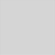 |
| SRC         | 1    | r = s. All four channels of the result are equal to the four channels of the source, that is, the result equals the source. Replaces the target pixel with the source pixel. | 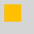 |
| DST         | 2    | r = d. All four channels of the result are equal to the four channels of the destination, that is, the result equals the target. Keeps the target pixel unchanged. |  |
| SRC_OVER    | 3    | r = s + (1 - sa) * d. Draws the source pixel over the target pixel, taking into account the transparency of the source pixel. |  |
| DST_OVER    | 4    | r = d + (1 - da) * s. Draws the target pixel over the source pixel, taking into account the transparency of the target pixel. |  |
| SRC_IN      | 5    | r = s * da. Keeps only the intersection of the source pixel and the opaque part of the target. |  |
| DST_IN      | 6    | r = d * sa. Keeps only the intersection of the target pixel and the opaque part of the source. |  |
| SRC_OUT     | 7    | r = s * (1 - da). Keeps the part of the source pixel that does not overlap the target. |  |
| DST_OUT     | 8    | r = d * (1 - sa). Keeps the part of the target pixel that does not overlap the source. |  |
| SRC_ATOP    | 9    | r = s * da + d * (1 - sa). The source pixel is overlaid on the target pixel, and the source pixel is displayed only in the opaque part of the target. | 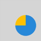 |
| DST_ATOP    | 10   | r = d * sa + s * (1 - da). The target pixel is overlaid on the source pixel, and the target pixel is displayed only in the opaque part of the source. |  |
| XOR         | 11   | r = s * (1 - da) + d * (1 - sa). Displays only the non-overlapping parts of the source pixel and the target pixel. |  |
| PLUS        | 12   | r = min(s + d, 1). Adds the color values of the source and target pixels.                   |  |
| MODULATE    | 13   | r = s * d. Multiplies the color values of the source and target pixels.                           |  |
| SCREEN      | 14   | Screen mode. r = s + d - s * d. Inverts the color values of the source and target pixels, multiplies them, and then inverts the result, which is usually brighter. |  |
| OVERLAY     | 15   | Overlay mode. Selectively applies the MULTIPLY or SCREEN mode based on the brightness of the target pixel to enhance contrast. |  |
| DARKEN      | 16   | Darken mode. rc = s + d - max(s * da, d * sa), ra = s + (1 - sa) * d. Takes the darker color value of the source and target pixels. |  |
| LIGHTEN     | 17   | Lighten mode. rc = s + d - min(s * da, d * sa), ra = s + (1 - sa) * d. Takes the lighter color value of the source and target pixels. | 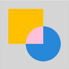 |
| COLOR_DODGE | 18   | Color dodge mode. Brightens the target pixel by reducing contrast to reflect the source pixel.           |  |
| COLOR_BURN  | 19   | Color burn mode. Darkens the target pixel by increasing contrast to reflect the source pixel.           |  |
| HARD_LIGHT  | 20   | Hard light mode. Selectively applies the MULTIPLY or SCREEN mode based on the brightness of the source pixel.    |  |
| SOFT_LIGHT  | 21   | Soft light mode. Softly brightens or darkens the target pixel based on the brightness of the source pixel.             |  |
| DIFFERENCE  | 22   | Difference mode. rc = s + d - 2 * (min(s * da, d * sa)), ra = s + (1 - sa) * d. Calculates the difference between the color values of the source and target pixels. |  |
| EXCLUSION   | 23   | Exclusion mode. rc = s + d - two(s * d), ra = s + (1 - sa) * d. Similar to DIFFERENCE, but with lower contrast. |  |
| MULTIPLY    | 24   | Multiply mode. r = s * (1 - da) + d * (1 - sa) + s * d. Multiplies the color values of the source and target pixels, and the result is usually darker. |  |
| HUE         | 25   | Hue mode. Uses the hue of the source pixel and the saturation and brightness of the target pixel.               |  |
| SATURATION  | 26   | Saturation mode. Uses the saturation of the source pixel and the hue and brightness of the target pixel.             |  |
| COLOR       | 27   | Color mode. Uses the hue and saturation of the source pixel and the brightness of the target pixel.               |  |
| LUMINOSITY  | 28   | Luminosity mode. Uses the brightness of the source pixel and the hue and saturation of the target pixel.               |  |

## PathMeasureMatrixFlags12+

Enumerates the matrix information dimensions in path measurement, commonly used in animation scenarios where an object moves along a path. The position matrix contains the coordinate translation information of a point on the path; the tangent matrix contains the rotation transformation information of the tangent direction at a point on the path; the position and tangent matrix contains both position and tangent information, providing complete path geometry information.

**System capability**: SystemCapability.Graphics.Drawing

| Name       | Value  | Description                                                        |
| ----------- | ---- | ------------------------------------------------------------ |
| GET_POSITION_MATRIX        | 0    | Matrix corresponding to the position information.                                           |
| GET_TANGENT_MATRIX          | 1    | Matrix corresponding to the tangent information.|
| GET_POSITION_AND_TANGENT_MATRIX    | 2     | Matrix corresponding to the position and tangent information.|

## SrcRectConstraint12+

Enumerates the source rectangle constraint types, used to specify whether to restrict the sampling range (the range from which image pixels are read) to the source rectangle area when drawing an image on a canvas.

**System capability**: SystemCapability.Graphics.Drawing

| Name       | Value  | Description                                                        |
| ----------- | ---- | ------------------------------------------------------------ |
| STRICT         | 0    | The sampling range is strictly confined to the source rectangle, resulting in a slow sampling speed.                                           |
| FAST           | 1    | The sampling range is not limited to the source rectangle and can extend beyond it, allowing for a high sampling speed.|

## ShadowFlag12+

Enumerates the shadow drawing behaviors.

**System capability**: SystemCapability.Graphics.Drawing

| Name                        | Value   | Description                |
| -------------------------- | ---- | ------------------ |
| NONE      | 0    | No shadow effect is used.       |
| TRANSPARENT_OCCLUDER | 1    | The occluder is translucent.        |
| GEOMETRIC_ONLY    | 2    | Only the geometric shadow effect is used.       |
| ALL           | 3    | Shadow effects are combined, including the translucent occluder and geometric shadow.|

## PathOp12+

Enumerates the path operation types. It is often used in path combination and clipping scenarios.

**System capability**: SystemCapability.Graphics.Drawing

| Name                  | Value  | Description                          |
| ---------------------- | ---- | ------------------------------ |
| DIFFERENCE     | 0    | Difference operation. Retains the area in the first path that does not overlap the second path. Applicable to scenarios where certain areas need to be subtracted from a path. |
| INTERSECT    | 1    | Intersection operation. Retains the overlapping area of the two paths. Applicable to scenarios where the intersection of paths needs to be obtained. |
| UNION    | 2    | Union operation. Merges all areas of the two paths. Applicable to scenarios where multiple paths need to be merged. |
| XOR     | 3    | Exclusive OR operation. Retains the non-overlapping areas of the two paths. Applicable to scenarios where the non-overlapping parts of paths need to be obtained. |
| REVERSE_DIFFERENCE     | 4    | Reverse difference operation. Retains the area in the second path that does not overlap the first path. Applicable to scenarios where a path needs to be subtracted in reverse. |

## PathIteratorVerb18+

Enumerates the path operation types contained in an iterator, which can be used to read the operation instructions of a path. It is commonly used in scenarios that require parsing the path composition, such as path analysis, path transformation, and path animation.

**System capability**: SystemCapability.Graphics.Drawing

| Name | Value  | Description                          |
| ----- | ---- | ------------------------------ |
| MOVE  | 0    | Sets the start point.|
| LINE  | 1    | Adds a line segment.|
| QUAD  | 2    | Adds a quadratic Bezier curve for smooth transitions.|
| CONIC | 3    | Adds a conic curve.|
| CUBIC | 4    | Adds a cubic Bezier curve for smooth transitions.|
| CLOSE | 5    | Closes a path.|
| DONE  | CLOSE + 1    | The path setting is complete.|

## TextEncoding

Enumerates the text encoding types.

**Atomic service API**: This API can be used in atomic services since API version 22.

**System capability**: SystemCapability.Graphics.Drawing

| Name                  | Value  | Description                          |
| ---------------------- | ---- | ------------------------------ |
| TEXT_ENCODING_UTF8     | 0    | UTF-8 or ASCII encoding. UTF-8 uses 1 to 4 bytes to represent a character, and ASCII uses 1 byte to represent a character. |
| TEXT_ENCODING_UTF16    | 1    | Uses 2 bytes to represent most Unicode characters. |
| TEXT_ENCODING_UTF32    | 2    | Uses 4 bytes to represent all Unicode characters.   |
| TEXT_ENCODING_GLYPH_ID | 3    | Two bytes are used to indicate the glyph index.  |

## ClipOp12+

Enumerates the canvas clipping modes.

**System capability**: SystemCapability.Graphics.Drawing

| Name                | Value   | Description          | Diagram  |
| ------------------ | ---- | ---------------- | -------- |
| DIFFERENCE | 0    | Clips the specified area (difference). | 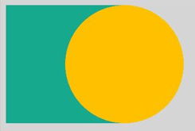 |
| INTERSECT  | 1    | Keeps the specified area (intersection). | 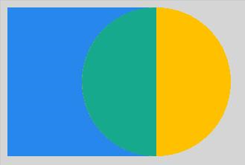 |

> **NOTE**
>
> The diagrams show the result of cropping a circle based on different enumerated values after a rectangle is cropped in INTERSECT mode. The green area is the final area obtained.

## FilterMode12+

Enumerates the filter modes.

**System capability**: SystemCapability.Graphics.Drawing

| Name                 | Value   | Description     |
| ------------------- | ---- | ------- |
| FILTER_MODE_NEAREST | 0    | Nearest filter mode, which samples using the nearest pixel. |
| FILTER_MODE_LINEAR  | 1    | Linear filter mode, which samples using the weighted average of surrounding pixels. |

## PathDirection12+

Enumerates the directions of a closed contour.

**System capability**: SystemCapability.Graphics.Drawing

| Name                 | Value   | Description     |
| ------------------- | ---- | ------- |
| CLOCKWISE   | 0    | Adds a closed contour clockwise.|
| COUNTER_CLOCKWISE  | 1    | Adds a closed contour counterclockwise.|

## PathFillType12+

Enumerates the fill types of a path.

**System capability**: SystemCapability.Graphics.Drawing

| Name                 | Value   | Description     |
| ------------------- | ---- | ------- |
| WINDING   | 0    | Specifies that "inside" is computed by a non-zero sum of signed edge crossings. Specifically, draws a point and emits a ray in any direction. A count is used to record the number of intersection points of the ray and path, and the initial count is 0. When encountering a clockwise intersection point (the path passes from the left to the right of the ray), the count increases by 1. When encountering a counterclockwise intersection point (the path passes from the right to the left of the ray), the count decreases by 1. If the final count is not 0, the point is inside the path and needs to be colored. If the final count is 0, the point is not colored.|
| EVEN_ODD  | 1    | Specifies that "inside" is computed by an odd number of edge crossings. Specifically, draws a point and emits a ray in any direction. If the number of intersection points of the ray and path is an odd number, the point is considered to be inside the path and needs to be colored. If the number is an even number, the point is not colored.|
| INVERSE_WINDING  | 2    | Inverts the WINDING fill rule. If the final count result is not 0, the point is considered inside the path and is not filled; if the count is 0, it is filled. |
| INVERSE_EVEN_ODD  | 3    | Inverts the EVEN_ODD fill rule. If the number of intersections between the ray and the path is odd, the point is considered inside the path and is not filled; if it is even, it is filled. |

> **NOTE** 
> 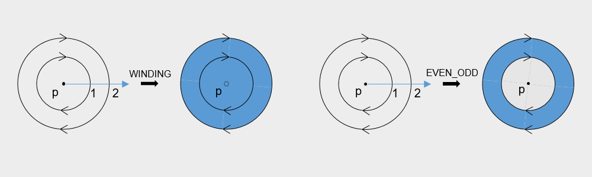 
> As shown in the figure, the ring is the path, the arrow indicates the direction of the path, p is an arbitrary point in the area, the blue line is the ray starting from point p, and the black arrow indicates the result of filling the path with blue under the corresponding fill rule. Under the WINDING fill rule, the number of intersections between the ray and the path is 2, which is not 0, so point p is filled; under the EVEN_ODD fill rule, the number of intersections between the ray and the path is 2, which is an even number, so point p is not filled.

## PointMode12+

Enumerates the ways of drawing an array of points.

**System capability**: SystemCapability.Graphics.Drawing

| Name                | Value   | Description           |
| ------------------ | ---- | ------------- |
| POINTS  | 0    | Draws each point separately.     |
| LINES   | 1    | Draws every two points as a line segment.   |
| POLYGON | 2    | Draws an array of points as an open polygon.|

## FontEdging12+

Enumerates the font edging types.

> **NOTE**
>
> FontEdging does not support bitmap fonts (such as dot-matrix fonts and emoji).

**Atomic service API**: This API can be used in atomic services since API version 22.

**System capability**: SystemCapability.Graphics.Drawing

| Name                 | Value   | Description     |
| ------------------- | ---- | ------- |
| ALIAS | 0    | No anti-aliasing processing is used.|
| ANTI_ALIAS  | 1    | Uses anti-aliasing to smooth the jagged edges.|
| SUBPIXEL_ANTI_ALIAS  | 2    | Uses sub-pixel anti-aliasing to provide a smoother effect for jagged edges.|

## FontHinting12+

Enumerates the font hinting types.

**Atomic service API**: This API can be used in atomic services since API version 22.

**System capability**: SystemCapability.Graphics.Drawing

| Name                 | Value   | Description     |
| ------------------- | ---- | ------- |
| NONE    | 0    | No font hinting is used.|
| SLIGHT  | 1    | Slight font hinting is used to improve contrast.|
| NORMAL  | 2    | Normal font hinting is used to improve contrast.|
| FULL    | 3    | Full font hinting is used to improve contrast.|

## FontMetricsFlags12+

Enumerates the font measurement flags, which indicate whether the data of each field in the font metrics is valid. It is commonly used in scenarios that require obtaining detailed font measurement information, such as precise text layout and custom text rendering.

**Atomic service API**: This API can be used in atomic services since API version 22.

**System capability**: SystemCapability.Graphics.Drawing

| Name                         | Value       | Description                          |
| ----------------------------- | --------- | ------------------------------ |
| UNDERLINE_THICKNESS_VALID     | 1 << 0    | Indicates that the underlineThickness field in the [FontMetrics](arkts-apis-graphics-drawing-i.md#fontmetrics) structure is valid.    |
| UNDERLINE_POSITION_VALID      | 1 << 1    | The **underlinePosition** field is valid. |
| STRIKETHROUGH_THICKNESS_VALID | 1 << 2    | Indicates that the strikethroughThickness field in the [FontMetrics](arkts-apis-graphics-drawing-i.md#fontmetrics) structure is valid.|
| STRIKETHROUGH_POSITION_VALID  | 1 << 3    | Indicates that the strikethroughPosition field in the [FontMetrics](arkts-apis-graphics-drawing-i.md#fontmetrics) structure is valid.  |
| BOUNDS_INVALID                | 1 << 4    | The boundary measurement values (such as **top**, **bottom**, **xMin**, and **xMax**) are invalid. |

## RectType12+

Enumerates the rectangle types used to fill the lattices, used to specify the fill mode of each rectangle area when drawing an image by segmentation. Used only in [Lattice](arkts-apis-graphics-drawing-Lattice.md).

**System capability**: SystemCapability.Graphics.Drawing

| Name        | Value  | Description                                                            |
| ------------ | ---- | --------------------------------------------------------------- |
| DEFAULT      | 0    | Draws an image into the lattice.                                         |
| TRANSPARENT  | 1    | Sets the lattice to transparent.                                         |
| FIXEDCOLOR   | 2    | Draws the colors in the **fColors** array in [Lattice](arkts-apis-graphics-drawing-Lattice.md) into a lattice.      |

## PathDashStyle18+

Enumerates the drawing styles for path effects.

**System capability**: SystemCapability.Graphics.Drawing

| Name  | Value| Description              |
| ------ | - | ------------------ |
| TRANSLATE | 0 | Translates only, not rotating with the path.|
| ROTATE  | 1 | Rotates with the path.|
| MORPH  | 2 | Rotates with the path and stretches or compresses at turns to enhance smoothness.|

## TileMode12+

Enumerates the tile modes of the shader effect.

**System capability**: SystemCapability.Graphics.Drawing

| Name                  | Value  | Description                          |
| ---------------------- | ---- | ------------------------------ |
| CLAMP     | 0    | Replicates the edge color if the shader effect draws outside of its original boundary.|
| REPEAT    | 1    | Repeats the shader effect in both horizontal and vertical directions.|
| MIRROR    | 2    | Repeats the shader effect in both horizontal and vertical directions, alternating mirror images.|
| DECAL     | 3    | Renders the shader effect only within the original boundary.|

## JoinStyle12+

Enumerates the join styles of a pen. The join style defines the shape of the joints of a polyline segment drawn by the pen.

**System capability**: SystemCapability.Graphics.Drawing

| Name       | Value  | Description                                                        | Diagram  |
| ----------- | ---- | ----------------------------------------------------------- | -------- |
| MITER_JOIN | 0    | The corner type is a miter (sharp) corner. If the polyline angle is small, the miter corner will be long and must be limited by the miter limit. | 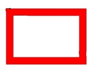 |
| ROUND_JOIN | 1    | The corner type is a round corner. | 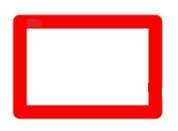 |
| BEVEL_JOIN | 2    | The corner type is a bevel (flat) corner. | 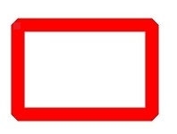 |

## CapStyle12+

Enumerates the cap styles of a pen. The cap style defines the style of both ends of a line segment drawn by the pen.

**System capability**: SystemCapability.Graphics.Drawing

| Name       | Value  | Description                                                        | Diagram  |
| ---------- | ---- | ----------------------------------------------------------- | -------- |
| FLAT_CAP   | 0    | No cap style. The line is cut off at the start and end endpoints. | 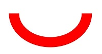 |
| SQUARE_CAP | 1    | A square cap. A square is added at the start and end endpoints, with the same width as the line and a height equal to half the line width. | 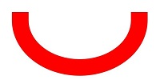 |
| ROUND_CAP  | 2    | A round cap. A semicircle is added at the start and end endpoints, with a diameter equal to the line width. | 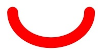 |

## BlurType12+

Enumerates the operation types in mask filter blur. A mask is used to define the drawable area of an image, and a filter is used to apply visual effects such as blur. This enumeration controls how the blur effect is applied to the area defined by the mask.

**System capability**: SystemCapability.Graphics.Drawing

| Name  | Value| Description              | Diagram  |
| ------ | - | ------------------ | -------- |
| NORMAL | 0 | Blurs the entire area, including both the outer edge and the inner solid area. | 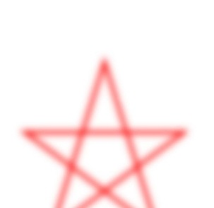 |
| SOLID  | 1 | Keeps the inner solid area unchanged and blurs only the outer edge. | 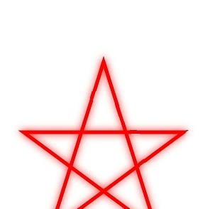 |
| OUTER  | 2 | Blurs only the outer edge, with the inner solid area fully transparent. | 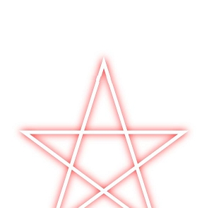 |
| INNER  | 3 | Blurs only the inner solid area, with the outer edge remaining sharp. | 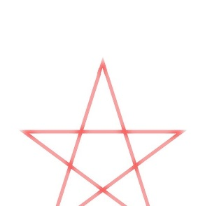 |

## ScaleToFit12+

Enumerates the modes of scaling a source rectangle into a destination rectangle.

**System capability**: SystemCapability.Graphics.Drawing

| Name                  | Value  | Description                          |
| ---------------------- | ---- | ------------------------------ |
| FILL_SCALE_TO_FIT     | 0    | Scales the source rectangle to completely fill the destination rectangle, potentially changing the aspect ratio of the source rectangle. |
| START_SCALE_TO_FIT    | 1    | Scales the source rectangle, preserving its aspect ratio, to align it to the upper left corner of the destination rectangle.|
| CENTER_SCALE_TO_FIT    | 2    | Scales the source rectangle, preserving its aspect ratio, to align it to the center of the destination rectangle.  |
| END_SCALE_TO_FIT | 3    | Scales the source rectangle, preserving its aspect ratio, to align it to the lower right corner of the destination rectangle.  |

## RegionOp12+

Enumerates the operations for combining two regions. It is commonly used in scenarios such as graphics editing and clipping area calculation that require combining multiple areas.

**System capability**: SystemCapability.Graphics.Drawing

| Name                  | Value  | Description                          | Diagram  |
| --------------------- | ---- | ------------------------------ | -------- |
| DIFFERENCE         | 0    | Subtracts the second area from the first area. Applicable to scenarios where a specific area needs to be clipped out.  | 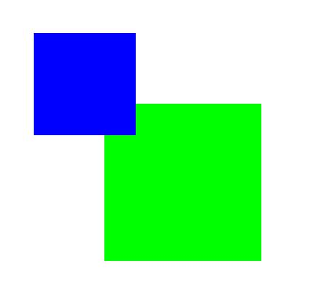 |
| INTERSECT          | 1    | Intersects the two areas and retains the overlapping area. Applicable to scenarios where the common area needs to be obtained. | 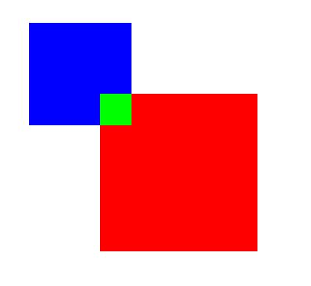 |
| UNION              | 2    | Unions the two areas and merges all parts of the two areas. Applicable to scenarios where areas need to be merged.   | 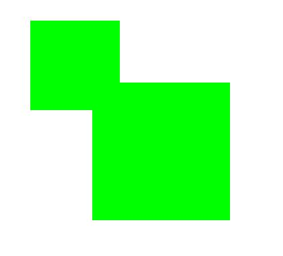 |
| XOR                | 3    | Performs an XOR operation on the two areas and retains the non-overlapping parts. Applicable to scenarios where the non-overlapping area needs to be obtained.   | 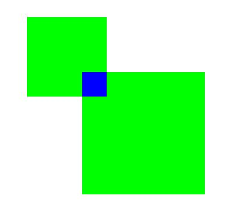 |
| REVERSE_DIFFERENCE | 4    | Subtracts the first area from the second area. Applicable to scenarios where reverse clipping is needed.   | 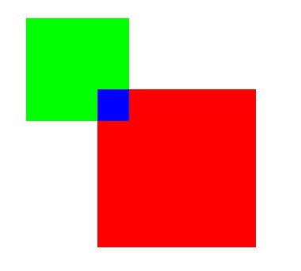 |
| REPLACE            | 5    | Replaces the first area with the second area completely. Applicable to scenarios where complete coverage is needed.   | 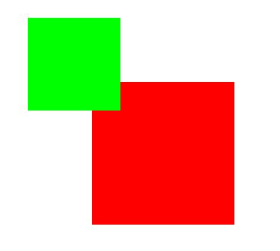 |

> **NOTE**
>
> The schematic diagram shows the result obtained by combining a red region with a blue region at different operation mode. The green region is the region obtained.

## CornerPos12+

Enumerates the corner positions of a rounded rectangle.

**System capability**: SystemCapability.Graphics.Drawing

| Name                  | Value  | Description                          |
| --------------------- | ---- | ------------------------------ | 
| TOP_LEFT_POS          | 0    | Top left corner of the rounded rectangle. |
| TOP_RIGHT_POS         | 1    | Top right corner of the rounded rectangle.|
| BOTTOM_RIGHT_POS      | 2    | Bottom right corner of the rounded rectangle.  |
| BOTTOM_LEFT_POS       | 3    | Bottom left corner of the rounded rectangle.  |

## VertexMode23+

Enumerates the connection modes for vertex drawing.

**System capability**: SystemCapability.Graphics.Drawing

| Name                  | Value  | Description                          | Diagram  |
| --------------------- | ---- | ------------------------------ | -------- |
| TRIANGLES_VERTEXMODE           | 0    | Vertices are grouped into sets of three in order, each forming an independent triangle. |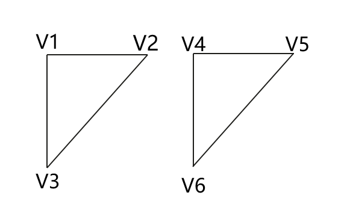 |
| TRIANGLESSTRIP_VERTEXMODE          | 1    | Consecutive triangles share an edge, which is efficient for continuous surfaces. |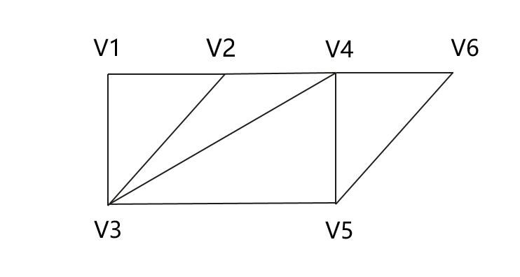 |
| TRIANGLESFAN_VERTEXMODE       | 2    | All triangles share a vertex. This is applicable to the scenario of drawing circles or fans.   |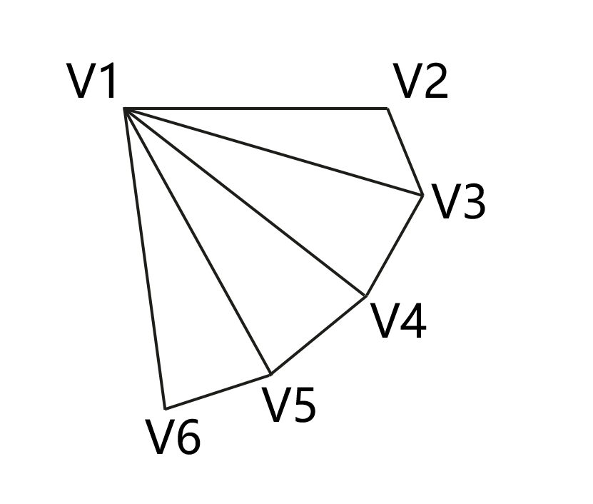 |