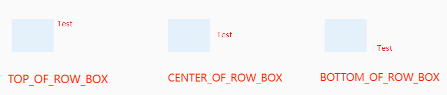
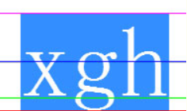

# PlaceholderAlignment

Enumerates the vertical alignment modes of a placeholder relative to the surrounding text.



> **NOTE:** 
> 
> The figure shows the last three alignment modes. The first three alignment modes are similar in text baseline
> alignment, with the comparison reference being the text baseline, indicated by the green line.
> 
> 

**Since:** 12

**System capability:** SystemCapability.Graphics.Drawing

## OFFSET_AT_BASELINE

```TypeScript
OFFSET_AT_BASELINE = 0
```

Aligns the baseline of the placeholder to the baseline of the text.

**Since:** 12

**Atomic service API:** This API can be used in atomic services since API version 22.

**System capability:** SystemCapability.Graphics.Drawing

## ABOVE_BASELINE

```TypeScript
ABOVE_BASELINE = 1
```

Aligns the bottom edge of the placeholder to the baseline of the text.

**Since:** 12

**Atomic service API:** This API can be used in atomic services since API version 22.

**System capability:** SystemCapability.Graphics.Drawing

## BELOW_BASELINE

```TypeScript
BELOW_BASELINE = 2
```

Aligns the top edge of the placeholder to the baseline of the text.

**Since:** 12

**Atomic service API:** This API can be used in atomic services since API version 22.

**System capability:** SystemCapability.Graphics.Drawing

## TOP_OF_ROW_BOX

```TypeScript
TOP_OF_ROW_BOX = 3
```

Aligns the top edge of the placeholder to the top edge of the text.

**Since:** 12

**Atomic service API:** This API can be used in atomic services since API version 22.

**System capability:** SystemCapability.Graphics.Drawing

## BOTTOM_OF_ROW_BOX

```TypeScript
BOTTOM_OF_ROW_BOX = 4
```

Aligns the bottom edge of the placeholder to the bottom edge of the text.

**Since:** 12

**Atomic service API:** This API can be used in atomic services since API version 22.

**System capability:** SystemCapability.Graphics.Drawing

## CENTER_OF_ROW_BOX

```TypeScript
CENTER_OF_ROW_BOX = 5
```

Center-aligned.

**Since:** 12

**Atomic service API:** This API can be used in atomic services since API version 22.

**System capability:** SystemCapability.Graphics.Drawing

## FOLLOW_PARAGRAPH

```TypeScript
FOLLOW_PARAGRAPH = 6
```

Aligns with the text baseline.

**Since:** 20

**Atomic service API:** This API can be used in atomic services since API version 22.

**System capability:** SystemCapability.Graphics.Drawing
