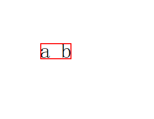
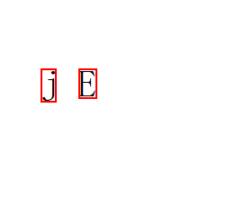
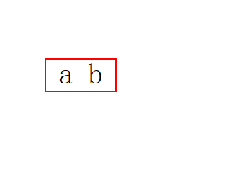

# TextLine

Implements a carrier that describes the basic text line structure of a paragraph.

Before calling any of the following APIs, you must use [getTextLines()](arkts-arkgraphics2d-text-paragraph-c.md#gettextlines) of the [Paragraph](arkts-arkgraphics2d-text-paragraph-c.md) class or [createLine()](arkts-arkgraphics2d-text-linetypeset-c.md#createline) of the [LineTypeset](arkts-arkgraphics2d-text-linetypeset-c.md) class to create a **TextLine** object.

**Since:** 12

**System capability:** SystemCapability.Graphics.Drawing

## Modules to Import

```TypeScript
import { text } from '@kit.ArkGraphics2D';
```

## createTruncatedLine

```TypeScript
createTruncatedLine(width: number, ellipsisMode: EllipsisMode, ellipsis: string): TextLine
```

Creates a truncated text line object.

**Since:** 18

**Atomic service API:** This API can be used in atomic services since API version 22.

**System capability:** SystemCapability.Graphics.Drawing

**Parameters:**

| Name | Type | Mandatory | Description |
| --- | --- | --- | --- |
| width | number | Yes | Line width after truncation, which is a floating-point value in physical pixels (px). |
| ellipsisMode | [EllipsisMode](arkts-arkgraphics2d-text-ellipsismode-e.md) | Yes | Ellipsis mode. Currently, only **START** and **END** are supported. |
| ellipsis | string | Yes | String used to mark truncation. |

**Return value:**

| Type | Description |
| --- | --- |
| [TextLine](arkts-arkgraphics2d-text-textline-c.md) | Truncated text line object. |

**Examples**

```TypeScript
import { drawing, text } from '@kit.ArkGraphics2D'
import { image } from '@kit.ImageKit'

function textFunc(pixelmap: PixelMap) {
  let canvas = new drawing.Canvas(pixelmap);
  let truncatedTextLine = lines[0].createTruncatedLine(100, text.EllipsisMode.START, "...");
  truncatedTextLine.paint(canvas, 0, 100);
}

@Entry
@Component
struct Index {
  @State pixelmap?: PixelMap = undefined;
  fun: Function = textFunc;
  build() {
    Column() {
      Image(this.pixelmap).width(200).height(200);
      Button().onClick(() => {
        if (this.pixelmap == undefined) {
          const color: ArrayBuffer = new ArrayBuffer(160000);
          let opts: image.InitializationOptions = { editable: true, pixelFormat: 3, size: { height: 200, width: 200 } }
          this.pixelmap = image.createPixelMapSync(color, opts);
        }
        this.fun(this.pixelmap);
      })
    }
  }
}
```

## enumerateCaretOffsets

```TypeScript
enumerateCaretOffsets(callback: CaretOffsetsCallback): void
```

Enumerates the offset and index of each character in a text line.

**Since:** 18

**Atomic service API:** This API can be used in atomic services since API version 22.

**System capability:** SystemCapability.Graphics.Drawing

**Parameters:**

| Name | Type | Mandatory | Description |
| --- | --- | --- | --- |
| callback | [CaretOffsetsCallback](arkts-arkgraphics2d-text-caretoffsetscallback-t.md) | Yes | Custom function, which contains the offset and index of each character in the text line. |

**Examples**

```TypeScript
lines[0].enumerateCaretOffsets((offset: number, index: number, leadingEdge: boolean): boolean => {
  console.info('textLine: offset: ' + offset + ', index: ' + index + ', leadingEdge: ' + leadingEdge);
  return index > 50;
});
```

## getAlignmentOffset

```TypeScript
getAlignmentOffset(alignmentFactor: number, alignmentWidth: number): number
```

Obtains the offset of this text line after alignment based on the alignment factor and alignment width.

**Since:** 18

**Atomic service API:** This API can be used in atomic services since API version 22.

**System capability:** SystemCapability.Graphics.Drawing

**Parameters:**

| Name | Type | Mandatory | Description |
| --- | --- | --- | --- |
| alignmentFactor | number | Yes | Alignment factor, which determines how text is aligned. The value is a floating point number. A value less than or equal to 0.0 means that the text is left-aligned; a value between 0.0 and 0.5 means that the text is slightly left-aligned; the value 0.5 means that the text is centered; a value between 0.5 and 1 means that the text is slightly right-aligned; a value greater than or equal to 1.0 means that the text is right-aligned. |
| alignmentWidth | number | Yes | Alignment width, namely the width of the text line, which is a floating-point value, in physical pixels (px). If the width is less than the actual width of the text line, **0** is returned. |

**Return value:**

| Type | Description |
| --- | --- |
| number | Calculated offset required for alignment, which is a floating-point value, in physical pixels (px). |

**Examples**

```TypeScript
let alignmentOffset = lines[0].getAlignmentOffset(0.5, 500);
```

## getGlyphCount

```TypeScript
getGlyphCount(): number
```

Obtains the number of glyphs in this text line.

**Since:** 12

**Atomic service API:** This API can be used in atomic services since API version 22.

**System capability:** SystemCapability.Graphics.Drawing

**Return value:**

| Type | Description |
| --- | --- |
| number | Number of glyphs. The value is an integer. |

**Examples**

```TypeScript
let glyphCount = lines[0].getGlyphCount();
```

## getGlyphRuns

```TypeScript
getGlyphRuns(): Array<Run>
```

Obtains the array of glyph runs in the text line.

**Since:** 12

**Atomic service API:** This API can be used in atomic services since API version 22.

**System capability:** SystemCapability.Graphics.Drawing

**Return value:**

| Type | Description |
| --- | --- |
| Array&lt;[Run](arkts-arkgraphics2d-text-run-c.md)&gt; | Array of the runs obtained. |

**Examples**

```TypeScript
let runs = lines[0].getGlyphRuns();
```

## getImageBounds

```TypeScript
getImageBounds(): common2D.Rect
```

Obtains the image boundaries of this text line. The image boundaries, equivalent to visual boundaries, depend on the font, font size, and characters. For example, for the string " a b " (which has a space before "a" and a space after "b"), only "a b" is visible to users, and therefore the image boundaries do not include these spaces at the beginning and end of the line. For the strings "j" and "E", their image boundaries are different. Specifically, the width of the boundary for "j" is narrower than that for "E", and the height of the boundary for"j" is taller than that for "E".

> **NOTE:** 
> 
> The figure shows the image boundaries for the string " a b ".
> 
> 
> 
> The figure shows the image boundaries for the string "j" or "E".
> 
> 

**Since:** 18

**Atomic service API:** This API can be used in atomic services since API version 22.

**System capability:** SystemCapability.Graphics.Drawing

**Return value:**

| Type | Description |
| --- | --- |
| [common2D.Rect](arkts-arkgraphics2d-common2d-rect-i.md) | Image boundary of a text line, in physical pixels (px). |

**Examples**

```TypeScript
let imageBounds = lines[0].getImageBounds();
```

## getOffsetForStringIndex

```TypeScript
getOffsetForStringIndex(index: number): number
```

Obtains the offset of a character with the specified index in this text line.

**Since:** 18

**Atomic service API:** This API can be used in atomic services since API version 22.

**System capability:** SystemCapability.Graphics.Drawing

**Parameters:**

| Name | Type | Mandatory | Description |
| --- | --- | --- | --- |
| index | number | Yes | Index of the character. The value is an integer. |

**Return value:**

| Type | Description |
| --- | --- |
| number | Offset at the given string index, which is a floating-point value, in physical pixels (px). |

**Examples**

```TypeScript
let offset = lines[0].getOffsetForStringIndex(3);
```

## getStringIndexForPosition

```TypeScript
getStringIndexForPosition(point: common2D.Point): number
```

Obtains the index of a character at the specified position in the original string.

**Since:** 18

**Atomic service API:** This API can be used in atomic services since API version 22.

**System capability:** SystemCapability.Graphics.Drawing

**Parameters:**

| Name | Type | Mandatory | Description |
| --- | --- | --- | --- |
| point | [common2D.Point](arkts-arkgraphics2d-common2d-point-i.md) | Yes | Coordinate position for finding the character index. The coordinates are relative to the top-left origin of the text line, in physical pixels (px). x indicates the horizontal coordinate, and y indicates the vertical coordinate. |

**Return value:**

| Type | Description |
| --- | --- |
| number | Index of the character in the text line. The value is an integer. |

**Examples**

```TypeScript
let point : common2D.Point = { x: 15.0, y: 2.0 };
let index = lines[0].getStringIndexForPosition(point);
```

## getTextRange

```TypeScript
getTextRange(): Range
```

Obtains the range of the text in this text line in the entire paragraph.

**Since:** 12

**Atomic service API:** This API can be used in atomic services since API version 22.

**System capability:** SystemCapability.Graphics.Drawing

**Return value:**

| Type | Description |
| --- | --- |
| [Range](arkts-arkgraphics2d-text-range-i.md) | Range of the text in this text line in the entire paragraph. |

**Examples**

```TypeScript
let textRange = lines[0].getTextRange();
```

## getTrailingSpaceWidth

```TypeScript
getTrailingSpaceWidth(): number
```

Obtains the width of the spaces at the end of this text line.

**Since:** 18

**Atomic service API:** This API can be used in atomic services since API version 22.

**System capability:** SystemCapability.Graphics.Drawing

**Return value:**

| Type | Description |
| --- | --- |
| number | Width of trailing whitespace characters in the text line, which is a floating-point value, in physical pixels (px). |

**Examples**

```TypeScript
let trailingSpaceWidth = lines[0].getTrailingSpaceWidth();
```

## getTypographicBounds

```TypeScript
getTypographicBounds(): TypographicBounds
```

Obtains the typographic boundaries of the text line. These boundaries depend on the typographic font and font size, but not on the characters themselves. For example, for the string " a b " (which has a space before "a" and a space after "b"), the typographic boundaries include the spaces at the beginning and end of the line. Similarly, the strings "j" and "E" have identical typographic boundaries, independent of the characters themselves.

> **NOTE:** 
> 
> The figure shows the typesetting boundaries for the string " a b ".
> 
> 
> 
> The figure shows the typesetting boundaries for the string "j" or "E".
> 
> !
> [TypographicBounds-Character.png](../../../reference/apis-arkgraphics2d/figures/TypographicBounds-Character.png)

**Since:** 18

**Atomic service API:** This API can be used in atomic services since API version 22.

**System capability:** SystemCapability.Graphics.Drawing

**Return value:**

| Type | Description |
| --- | --- |
| [TypographicBounds](arkts-arkgraphics2d-text-typographicbounds-i.md) | Describes the typographic boundaries of a text line. |

**Examples**

```TypeScript
let bounds = lines[0].getTypographicBounds();
console.info('textLine ascent:' + bounds.ascent + ', descent:' + bounds.descent + ', leading:' + bounds.leading + ', width:' + bounds.width);
```

## paint

```TypeScript
paint(canvas: drawing.Canvas, x: number, y: number): void
```

Paints this text line on the canvas with the coordinate point (x, y) as the upper left corner.

**Since:** 12

**Atomic service API:** This API can be used in atomic services since API version 22.

**System capability:** SystemCapability.Graphics.Drawing

**Parameters:**

| Name | Type | Mandatory | Description |
| --- | --- | --- | --- |
| canvas | [drawing.Canvas](arkts-arkgraphics2d-drawing-canvas-c.md) | Yes | Target canvas. |
| x | number | Yes | Horizontal coordinate of the upper left corner, which is a floating-point value, in physical pixels (px). |
| y | number | Yes | Vertical coordinate of the upper left corner, which is a floating-point value, in physical pixels (px). |

**Examples**

```TypeScript
import { drawing } from '@kit.ArkGraphics2D'
import { image } from '@kit.ImageKit'

function textFunc(pixelmap: PixelMap) {
  let canvas = new drawing.Canvas(pixelmap);
  lines[0].paint(canvas, 0, 0);
}

@Entry
@Component
struct Index {
  @State pixelmap?: PixelMap = undefined;
  fun: Function = textFunc;
  build() {
    Column() {
      Image(this.pixelmap).width(200).height(200);
      Button().onClick(() => {
        if (this.pixelmap == undefined) {
          const color: ArrayBuffer = new ArrayBuffer(160000);
          let opts: image.InitializationOptions = { editable: true, pixelFormat: 3, size: { height: 200, width: 200 } }
          this.pixelmap = image.createPixelMapSync(color, opts);
        }
        this.fun(this.pixelmap);
      })
    }
  }
}
```
