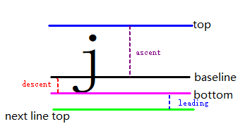

# TypographicBounds

Describes the typographic boundaries of a text line. These boundaries depend on the typographic font and font size, but not on the characters themselves. For example, for the string " a b " (which has a space before "a" and a space after "b"), the typographic boundaries include the spaces at the beginning and end of the line. Similarly, the strings "j" and "E" have identical typographic boundaries, independent of the characters themselves.

> **NOTE:** 
> 
> The figure shows the text line typesetting parameters: width (the width of the text line including left and right
> spaces), ascent (the highest point of the ascent), descent (the lowest point of the descent), leading (line
> spacing), top (the highest point of the current line), baseline (the character baseline), bottom (the lowest
> point of the current line), and next line top (the highest point of the next line).
> 
> 
> 
> The figure shows the typesetting boundaries for the string " a b ".
> 
> 
> 
> The figure shows the typesetting boundaries for the string "j" or "E".
> 
> !
> [TypographicBounds-Character.png](../../../reference/apis-arkgraphics2d/figures/TypographicBounds-Character.png)

**Since:** 18

**System capability:** SystemCapability.Graphics.Drawing

## Modules to Import

```TypeScript
import { text } from '@kit.ArkGraphics2D';
```

## ascent

```TypeScript
ascent: number
```

Ascent height of a text line, which is a floating-point value in physical pixels (px).

**Type:** number

**Since:** 18

**Atomic service API:** This API can be used in atomic services since API version 22.

**System capability:** SystemCapability.Graphics.Drawing

## descent

```TypeScript
descent: number
```

Descent height of a text line, which is a floating-point value in physical pixels (px).

**Type:** number

**Since:** 18

**Atomic service API:** This API can be used in atomic services since API version 22.

**System capability:** SystemCapability.Graphics.Drawing

## leading

```TypeScript
leading: number
```

Leading of a text line, which is a floating-point value in physical pixels (px).

**Type:** number

**Since:** 18

**Atomic service API:** This API can be used in atomic services since API version 22.

**System capability:** SystemCapability.Graphics.Drawing

## width

```TypeScript
width: number
```

Total width of the layout boundary, which is a floating-point value in physical pixels (px).

**Type:** number

**Since:** 18

**Atomic service API:** This API can be used in atomic services since API version 22.

**System capability:** SystemCapability.Graphics.Drawing
