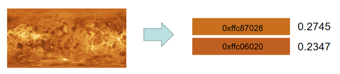

# @ohos.effectKit (Image Effect) (System API)

<!--Kit: ArkGraphics 2D-->
<!--Subsystem: Multimedia-->
<!--Owner: @hanamaru-->
<!--Designer: @gaoweihua-->
<!--Tester: @zhaoxiaoguang2-->
<!--Adviser: @ge-yafang-->

This module provides basic image processing capabilities, including brightness adjustment, blurring, grayscale adjustment, and color picker. The **effectKit** module processes images (such as PixelMap, PNG, and JPEG) offline to obtain visual effects. The **uiEffect** module connects to the rendering service in real time and process the screen frame buffer to obtain dynamic visual effects.

This module provides the following classes:

- [ColorPicker](#colorpicker): a smart color picker.
- [Filter](#filter): Applies a specified effect to the image source.

> **NOTE**
>
> - The initial APIs of this module are supported since API version 9. Newly added APIs will be marked with a superscript to indicate their earliest API version.
> - This topic describes only system APIs provided by the module. For details about its public APIs, see [@ohos.effectKit (Image Effects)](js-apis-effectKit.md).

## Modules to Import

```ts
import { effectKit } from "@kit.ArkGraphics2D";
```

## PictureComplexityDegree<sup>22+</sup>

Enumerates levels of image content complexity.

**System capability**: SystemCapability.Multimedia.Image.Core

**System API**: This is a system API.

| Name                  | Value  | Description                          |
| ---------------------- | ---- | ------------------------------ |
| UNKNOWN_COMPLEXITY_DEGREE_PICTURE | 0 | Default value. The image content complexity is unknown.|
| PURE_PICTURE    | 1    | The image content complexity is pure.|
| MODERATE_COMPLEXITY_PICTURE    | 2    | The image content complexity is moderate.|
| VERY_FLOWERY_PICTURE     | 3    | The image content complexity is complex.|

## PictureShadeDegree<sup>22+</sup>

Enumerates image color shade levels.

**System capability**: SystemCapability.Multimedia.Image.Core

**System API**: This is a system API.

| Name                  | Value  | Description                          |
| ---------------------- | ---- | ------------------------------ |
| UNKNOWN_SHADE_DEGREE_PICTURE     | 0    | Default value. The image color shade level is unknown.|
| EXTREMELY_LIGHT_PICTURE    | 1    | The image color shade level is extremely light.|
| VERY_LIGHT_PICTURE    | 2    | The image color shade level is very light.|
| LIGHT_PICTURE     | 3    | The image color shade level is light.|
| MODERATE_SHADE_PICTURE     | 4    | The image color shade level is moderate.|
| DARK_PICTURE     | 5    | The image color shade level is dark.|
| EXTREMELY_DARK_PICTURE     | 6    | The image color shade level is extremely dark.|

## ColorPicker

A class used to obtain the color from an image. Before calling any method of **ColorPicker**, use [createColorPicker](js-apis-effectKit.md#effectkitcreatecolorpicker) to create a **ColorPicker** instance.

### getTopProportionColorsAndPercentage<sup>22+</sup>

getTopProportionColorsAndPercentage(colorCount: number): Map<Color | null, number | null>

Reads the color values with the top proportions in an image and their corresponding proportions. The number of colors to obtain is specified by **colorCount**, and the results are stored in a dictionary mapping **Color** values to their respective proportions, returned synchronously.

**Widget capability**: This API can be used in ArkTS widgets since API version 22.

**System capability**: SystemCapability.Multimedia.Image.Core

**System API**: This is a system API.

**Parameters**
| Name     | Type  | Mandatory| Description             |
| ---------- | ------ | ---- | ------------------------------------------- |
| colorCount | number | Yes  | Number of colors and their proportions to be obtained. The value is rounded down.<br>Note: For versions earlier than <!--RP1-->OpenHarmony 6.1<!--RP1End-->, the value range is [1, 10]. If the number of colors to be obtained exceeds 10, only the top 10 colors are retained. Starting from <!--RP1-->OpenHarmony 6.1<!--RP1End-->, the value range is [1, 20]. If the number of colors to be obtained exceeds 20, only the top 20 colors are retained.  |

**Return value**

| Type                                    | Description                                           |
| :--------------------------------------- | :---------------------------------------------- |
| Map<Color \| null, number \| null> | Dictionary containing the top-proportion colors in the image and their corresponding proportions, with the number of colors specified by **colorCount**. The proportion value range is [0, 1].<br>- If the number of colors obtained is less than the value of **colorCount**, the size of the dictionary matches the actual number of colors.<br>- If the colors fail to be obtained or the number of colors obtained is less than 1, **Map()** is returned.|

**Error codes**

For details about the error codes, see [Universal Error Codes](../errorcode-universal.md).

| ID| Error Message|
| ------- | -------------------------------- |
| 202  | Permission verification failed. A non-system application calls a system API. |

**Example**

```js
import { image } from "@kit.ImageKit";
import { effectKit } from "@kit.ArkGraphics2D";

const color = new ArrayBuffer(96);
let opts: image.InitializationOptions = {
  editable: true,
  pixelFormat: 3,
  size: {
    height: 4,
    width: 6
  }
}
image.createPixelMap(color, opts).then((pixelMap) => {
  effectKit.createColorPicker(pixelMap, (error, colorPicker) => {
    if (error) {
      console.error('Failed to create color picker.');
    } else {
      console.info('Succeeded in creating color picker.');
      let colors: Map<effectKit.Color | null, number | null> = colorPicker.getTopProportionColorsAndPercentage(2);
      colors.forEach((value: number | null, key: effectKit.Color | null) => {
        console.info('get top proportion colors and percentages: color ' + key + ', percentage ' + value);
      })
    }
  })
})
```


### getShadeDegree<sup>22+</sup>

getShadeDegree(): PictureShadeDegree

Obtains the color shade level of an image.

**Widget capability**: This API can be used in ArkTS widgets since API version 22.

**System capability**: SystemCapability.Multimedia.Image.Core

**System API**: This is a system API.

**Return value**

| Type                                    | Description                                           |
| :--------------------------------------- | :---------------------------------------------- |
| [PictureShadeDegree](#pictureshadedegree22) | Image color shade level.|

**Error codes**

For details about the error codes, see [Universal Error Codes](../errorcode-universal.md).

| ID| Error Message|
| ------- | -------------------------------- |
| 202  | Permission verification failed. A non-system application calls a system API. |

**Example**

```js
import { image } from "@kit.ImageKit";
import { effectKit } from "@kit.ArkGraphics2D";

const color = new ArrayBuffer(96);
let opts: image.InitializationOptions = {
  editable: true,
  pixelFormat: 3,
  size: {
    height: 4,
    width: 6
  }
}
image.createPixelMap(color, opts).then((pixelMap) => {
  effectKit.createColorPicker(pixelMap, (error, colorPicker) => {
    if (error) {
      console.error('Failed to create color picker.');
    } else {
      console.info('Succeeded in creating color picker.');
      let shadeDegree: effectKit.PictureShadeDegree = colorPicker.getShadeDegree();
      console.info('The shade degree of the image is ' + shadeDegree);
    }
  })
})
```

### getComplexityDegree<sup>22+</sup>

getComplexityDegree(): PictureComplexityDegree

Obtains the image content complexity.

**Widget capability**: This API can be used in ArkTS widgets since API version 22.

**System capability**: SystemCapability.Multimedia.Image.Core

**System API**: This is a system API.

**Return value**

| Type                                    | Description                                           |
| :--------------------------------------- | :---------------------------------------------- |
| [PictureComplexityDegree](#picturecomplexitydegree22) | Image content complexity.|

**Error codes**

For details about the error codes, see [Universal Error Codes](../errorcode-universal.md).

| ID| Error Message|
| ------- | -------------------------------- |
| 202  | Permission verification failed. A non-system application calls a system API. |

**Example**

```js
import { image } from "@kit.ImageKit";
import { effectKit } from "@kit.ArkGraphics2D";

const color = new ArrayBuffer(96);
let opts: image.InitializationOptions = {
  editable: true,
  pixelFormat: 3,
  size: {
    height: 4,
    width: 6
  }
}
image.createPixelMap(color, opts).then((pixelMap) => {
  effectKit.createColorPicker(pixelMap, (error, colorPicker) => {
    if (error) {
      console.error('Failed to create color picker.');
    } else {
      console.info('Succeeded in creating color picker.');
      let complexityDegree: effectKit.PictureComplexityDegree = colorPicker.getComplexityDegree();
      console.info('The complexity degree of the image is ' + complexityDegree);
    }
  })
})
```

### getAlphaZeroTransparentProportion<sup>23+</sup>

getAlphaZeroTransparentProportion(): number

Obtains the proportion of completely transparent pixels in an image.

**Widget capability**: This API can be used in ArkTS widgets since API version 23.

**System capability**: SystemCapability.Multimedia.Image.Core

**System API**: This is a system API.

**Return value**

| Type                                    | Description                                           |
| :--------------------------------------- | :---------------------------------------------- |
| number | Proportion of completely transparent pixels in an image. The value range is [0,1].|

**Error codes**

For details about the error codes, see [Universal Error Codes](../errorcode-universal.md).

| ID| Error Message|
| ------- | -------------------------------- |
| 202  | Permission verification failed. A non-system application calls a system API. |

**Example**

```js
import { image } from "@kit.ImageKit";
import { effectKit } from "@kit.ArkGraphics2D";

const color = new ArrayBuffer(96);
let opts: image.InitializationOptions = {
  editable: true,
  pixelFormat: 3,
  size: {
    height: 4,
    width: 6
  }
}
image.createPixelMap(color, opts).then((pixelMap) => {
  effectKit.createColorPicker(pixelMap, (error, colorPicker) => {
    if (error) {
      console.error('Failed to create color picker.');
    } else {
      console.info('Succeeded in creating color picker.');
        let percentage: number = colorPicker.getAlphaZeroTransparentProportion();
      console.info('Get proportion of fully transparent pixels: ' + percentage);
    }
  })
})
```

## Filter

A class used to add a specified effect to an image. Before calling any method of **Filter**, use [createEffect](js-apis-effectKit.md#effectkitcreateeffect) to create a **Filter** instance.


### ellipticalGradientBlur<sup>23+</sup>

ellipticalGradientBlur(blurRadius: number, center: EllipticalMaskCenter, maskRadius: EllipticalMaskRadius, fractionStops: FractionStop[]): Filter

Adds the gradient blur effect with an elliptical mask to the filter linked list, and returns the head node of the linked list.

> **NOTE**
>
> This API is a static image processing interface that provides a gradient blur effect with an elliptical mask for static images.

**System capability**: SystemCapability.Multimedia.Image.Core

**System API**: This is a system API.

**Model restriction**: This API can be used only in the stage model.

**Parameters**

| Name| Type       | Mandatory| Description                                                        |
| ------ | ----------- | ---- | ------------------------------------------------------------ |
|  blurRadius   | number | Yes  | Blur radius. The value is a positive integer value, in pixels. If the value exceeds 60, the blur radius is automatically truncated. The blur effect is proportional to the set blur radius—the larger the value, the more pronounced the effect.|
|  center   | [EllipticalMaskCenter](#ellipticalmaskcenter23) | Yes| Center point of the ellipse. Coordinate [0, 0] indicates the top-left corner of the component, and [1, 1] indicates the bottom-right corner of the component.|
|  maskRadius   | [EllipticalMaskRadius](#ellipticalmaskradius23) | Yes| The first value indicates the x-axis radius of the ellipse, and the second value indicates the y-axis radius of the ellipse. A value of **1** for either axis radius corresponds to the height of the component. Both values must be greater than 0.|
|  fractionStops   | [FractionStop](../apis-arkui/arkui-ts/ts-universal-attributes-image-effect.md#fractionstop12)[] | Yes| Arrays defining the gradient blur positions and intensities. Both position and intensity values range from 0 to 1. The center of the ellipse corresponds to the position value **0**, and the boundary of the ellipse corresponds to the position value **1**. A blur intensity value of **0** indicates no blur, while a value of **1** corresponds to the blur intensity set by the input **blurRadius**. Values greater than 1 are clamped to **1**. Position values must be in strictly ascending order. The number of two-element arrays must be no fewer than 2 and no more than 12.|

**Return value**

| Type          | Description                                           |
| :------------- | :---------------------------------------------- |
| [Filter](#filter) | Final image effect.|

**Example**

``` ts
import { image } from '@kit.ImageKit';	
import { effectKit } from '@kit.ArkGraphics2D';
import { common } from '@kit.AbilityKit';
// Pass the image data to be read.
function ImageEllipticalGradientBlur(Image: ArrayBuffer): Promise<image.PixelMap> {
  return new Promise((resolve, reject) => {
    let imageSource = image.createImageSource(Image);
	  let blurRadius:number = 25;
	  let fractionStops:FractionStop[] = [[0, 0.2], [0.5, 0.7]];
	  let maskRadius:effectKit.EllipticalMaskRadius = [1, 1];
	  let center:effectKit.EllipticalMaskCenter = [0.5, 0.5];
    imageSource.createPixelMap().then(async (pixelMap: image.PixelMap) => {
      let headFilter = effectKit.createEffect(pixelMap);
      if (headFilter != null) {
        // Add an effect flag to the image.
        headFilter.ellipticalGradientBlur(blurRadius, center, maskRadius, fractionStops);
      }
      // Process the image based on the added effect flag and return the processed image data.
      headFilter.getEffectPixelMap(false).then(imageData => {
        resolve(imageData);
      })
    })
  })
}

@Entry
@Component
struct Index {
  @State imagePixelMap: image.PixelMap | null = null;
  private imageBuffer: ArrayBuffer | undefined = undefined;
  // Read the image file in the rawfile folder. You can also change the read mode as required to ensure that the image data in ArrayBuffer format is obtained.
  async getFileBuffer(): Promise<ArrayBuffer | undefined> {
    try{
      const context: Context = this.getUIContext().getHostContext() as common.UIAbilityContext;
      const fileData: Uint8Array = await context.resourceManager.getRawFileContent('image.png');
      const buffer: ArrayBuffer = fileData.buffer.slice(0);
      return buffer;
    }catch (err){
      return undefined
    }
  }

  async aboutToAppear(): Promise<void>{
    this.imageBuffer = await this.getFileBuffer();
    if(this.imageBuffer == undefined){
      return;
    }
    // Image processing is an asynchronous operation. You can perform the next step based on whether the processed image data needs to be obtained. Add await as required for synchronization.
    this.imagePixelMap = await ImageEllipticalGradientBlur(this.imageBuffer);
  }

  build() {
    Column() {
      Image(this.imagePixelMap)
        .width(304)
        .height(305)
    }
    .height('100%')
    .width('100%')
  }
}
```

## EllipticalMaskRadius<sup>23+</sup>

type EllipticalMaskRadius = [ number, number ]

Defines the radius of the elliptical mask.

**System capability**: SystemCapability.Multimedia.Image.Core

**System API**: This is a system API.

**Model restriction**: This API can be used only in the stage model.

| Type          | Description                                           |
| :------------- | :---------------------------------------------- |
| [ number, number ] | Radius of the elliptical mask.|

## EllipticalMaskCenter<sup>23+</sup>
type EllipticalMaskCenter = [ number, number ]

Defines the center point of the elliptical mask.

**System capability**: SystemCapability.Multimedia.Image.Core

**System API**: This is a system API.

**Model restriction**: This API can be used only in the stage model.

| Type          | Description                                           |
| :------------- | :---------------------------------------------- |
| [ number, number ] | Center point of the elliptical mask.|
