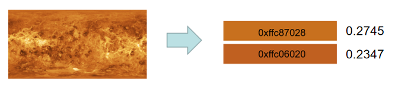

# @ohos.effectKit (Image Effect) (System API)

<!--Kit: ArkGraphics 2D-->
<!--Subsystem: Multimedia-->
<!--Owner: @hanamaru-->
<!--Designer: @chensiyi_CE-->
<!--Tester: @zhaoxiaoguang2-->
<!--Adviser: @ge-yafang-->
<!-- md-trans-meta sourceCommit=244626bd3ee350522bab6ea45e122f80881abd5e translatedAt=2026-07-13T11:25:57.465Z pushedAt=2026-07-15T10:32:06.147Z -->

The Image Effect module provides basic capabilities for processing images, including brightness adjustment, blurring, grayscale adjustment, and intelligent color picking. It is applicable to scenarios such as adding filter effects in image editing apps, blurring the background image of app startup pages, automatically extracting UI theme colors, and analyzing image color schemes.

This module is used for offline processing of [image.PixelMap](../apis-image-kit/arkts-apis-image-PixelMap.md) to obtain visual effects, while uiEffect (UI Effect Service) connects to the rendering service in real time to process screen frame buffers for dynamic visual effects.

This module provides the following common functions related to image effects:

- [ColorPicker](#colorpicker): Intelligent color picker.

- [Filter](#filter): Effect class, used to add specified effects to the image source.

> **NOTE**
>
> - The initial APIs of this module are supported since API version 9. Newly added APIs in subsequent versions are marked with superscripts to indicate their since version.
> - This page only contains the system APIs of this module. For other public APIs, see [ohos.effectKit (Image Effect)](js-apis-effectKit.md).

## Modules to Import

```ts
import { effectKit } from "@kit.ArkGraphics2D";
```

## PictureComplexityDegree<sup>22+</sup>

Enums for image content complexity.

**System capability:** SystemCapability.Multimedia.Image.Core

**System API**: This is a system API.

| Name                   | Value | Description                           |
| ---------------------- | ---- | ------------------------------ |
| UNKNOWN_COMPLEXITY_DEGREE_PICTURE | 0 | Default value. The complexity of the image content is unknown. |
| PURE_PICTURE    | 1    | The complexity of the image content is pure. |
| MODERATE_COMPLEXITY_PICTURE    | 2    | The complexity of the image content is moderate. |
| VERY_FLOWERY_PICTURE     | 3    | The complexity of the image content is complex. |

## PictureShadeDegree<sup>22+</sup>

Enumerates the shade degrees of image colors.

**System capability:** SystemCapability.Multimedia.Image.Core

**System API**: This is a system API.

| Name                   | Value | Description                           |
| ---------------------- | ---- | ------------------------------ |
| UNKNOWN_SHADE_DEGREE_PICTURE     | 0    | Default value. The shade degree of the image color is unknown. |
| EXTREMELY_LIGHT_PICTURE    | 1    | The shade degree of the image color is extremely light. |
| VERY_LIGHT_PICTURE    | 2    | The shade degree of the image color is very light. |
| LIGHT_PICTURE     | 3    | The shade degree of the image color is light.|
| MODERATE_SHADE_PICTURE     | 4    | The shade degree of the image color is moderate.|
| DARK_PICTURE     | 5    | The shade degree of the image color is dark.|
| EXTREMELY_DARK_PICTURE     | 6    | The shade degree of the image color is extremely dark.|

## PictureLightDegree

Enum for the brightness of image colors.

**Since:** 26.0.0

**Model restriction:** This API can be used only in the stage model.

**System API**: This is a system API.

**System capability:** SystemCapability.Multimedia.Image.Core

**Widget capability:** This API can be used in ArkTS widgets since API version 26.0.0.

| Name                   | Value   | Description                           |
| ---------------------- | ---- | ------------------------------ |
| UNKNOWN_LIGHT_COLOR_DEGREE_PICTURE | 0 | Image with unknown brightness. |
| EXTREMELY_LIGHT_COLOR_PICTURE | 1 | Extremely bright image. |
| LIGHT_COLOR_PICTURE | 2 | Bright image. |
| DARK_COLOR_PICTURE | 3 | Dark image. |
| EXTREMELY_DARK_COLOR_PICTURE | 4 | Extremely dark image. |
| FLOWERY_PICTURE | 5 | Colorful image. |
| EXTREMELY_FLOWERY_PICTURE | 6 | Extremely colorful image. |

## ColorPicker

A color picker class used to get the main colors from an image data. Before calling the methods of ColorPicker, you need to create a ColorPicker instance through [createColorPicker](js-apis-effectKit.md#effectkitcreatecolorpicker).

### getTopProportionColorsAndPercentage<sup>22+</sup>

getTopProportionColorsAndPercentage(colorCount: number): Map<Color | null, number | null>

Synchronously returns the colors with the highest proportions in the image and their corresponding percentages. The number of colors is specified by `colorCount`.

**Widget capability:** This API can be used in ArkTS widgets since API version 22.

**System capability:** SystemCapability.Multimedia.Image.Core

**System API**: This is a system API.

**Parameters**

| Name       | Type   | Mandatory | Description                                                                                                                                                                                                                                                                                                                                                             |
| ---------- | ------ | --------- | ----------------------------------------------------------------------------------------------------------------------------------------------------------------------------------------------------------------------------------------------------------------------------------------------------------------------------------------------------------------------- |
| colorCount | number | Yes       | Number of color values and their corresponding percentages, rounded down.<br>**NOTE**<br>Before <!--RP1-->OpenHarmony 6.1<!--RP1End-->, the value range is [1, 10]. If the number of colors to extract is greater than 10, the top 10 are taken. Since <!--RP1-->OpenHarmony 6.1<!--RP1End-->, the value range is [1, 20]. If the number of colors to extract is greater than 20, the top 20 are taken. |

**Return value**

| Type | Description |
| :--------------------------------------- | :---------------------------------------------- |
| Map<Color \| null, number \| null> | A Map of the top `colorCount` color values and their proportions in the image, with the proportion value range being [0, 1].<br>- When the actual number of extracted feature colors is less than `colorCount`, the dictionary size equals the actual number of feature colors.<br>- Returns `Map()` if color extraction fails or the number of extracted colors is less than 1. |

**Error codes**

For detailed introduction of the following error codes, please refer to [Universal Error Codes](../errorcode-universal.md).

| ID | Error Message |
| ------- | -------------------------------- |
| 202 | Permission verification failed. A non-system application calls a system API. |

**Example**

```js
import { image } from "@kit.ImageKit";
import { effectKit } from "@kit.ArkGraphics2D";

const color = new ArrayBuffer(96);
let opts: image.InitializationOptions = {
  editable: true,
  pixelFormat: 3,
  size: {
    height: 4,
    width: 6
  }
};
image.createPixelMap(color, opts).then((pixelMap) => {
  effectKit.createColorPicker(pixelMap, (error, colorPicker) => {
    if (error) {
      console.error('Failed to create color picker.');
    } else {
      console.info('Succeeded in creating color picker.');
      let colors: Map<effectKit.Color | null, number | null> = colorPicker.getTopProportionColorsAndPercentage(2);
      colors.forEach((value: number | null, key: effectKit.Color | null) => {
        console.info('get top proportion colors and percentages: color ' + key + ', percentage ' + value);
      })
    }
  })
});
```



### getShadeDegree<sup>22+</sup>

getShadeDegree(): PictureShadeDegree

Gets the depth of the image color. If the image color depth cannot be determined, the default value UNKNOWN_SHADE_DEGREE_PICTURE is returned.

**Widget capability:** This API can be used in ArkTS widgets since API version 22.

**System capability:** SystemCapability.Multimedia.Image.Core

**System API**: This is a system API.

**Return value**

| Type                                     | Description                                            |
| :--------------------------------------- | :---------------------------------------------- |
| [PictureShadeDegree](#pictureshadedegree22) | Image color shade degree. |

**Error codes**

For detailed introduction of the following error codes, please refer to [Universal Error Codes](../errorcode-universal.md).

| ID | Error Message |
| ------- | -------------------------------- |
| 202  | Permission verification failed. A non-system application calls a system API. |

**Example**

```js
import { image } from "@kit.ImageKit";
import { effectKit } from "@kit.ArkGraphics2D";

const color = new ArrayBuffer(96);
let opts: image.InitializationOptions = {
  editable: true,
  pixelFormat: 3,
  size: {
    height: 4,
    width: 6
  }
};
image.createPixelMap(color, opts).then((pixelMap) => {
  effectKit.createColorPicker(pixelMap, (error, colorPicker) => {
    if (error) {
      console.error('Failed to create color picker.');
    } else {
      console.info('Succeeded in creating color picker.');
      let shadeDegree: effectKit.PictureShadeDegree = colorPicker.getShadeDegree();
      console.info('The shade degree of the image is ' + shadeDegree);
    }
  })
});
```

### getComplexityDegree<sup>22+</sup>

getComplexityDegree(): PictureComplexityDegree

Gets the complexity of the image content. When the image content complexity cannot be determined, the default value UNKNOWN_COMPLEXITY_DEGREE_PICTURE is returned.

**Widget capability:** This API can be used in ArkTS widgets since API version 22.

**System capability:** SystemCapability.Multimedia.Image.Core

**System API**: This is a system API.

**Return value**

| Type                                     | Description                                            |
| :--------------------------------------- | :---------------------------------------------- |
| [PictureComplexityDegree](#picturecomplexitydegree22) | Image content complexity. |

**Error codes**

For detailed introduction of the following error codes, please refer to [Universal Error Codes](../errorcode-universal.md).

| ID | Error Message |
| ------- | -------------------------------- |
| 202  | Permission verification failed. A non-system application calls a system API. |

**Example**

```js
import { image } from "@kit.ImageKit";
import { effectKit } from "@kit.ArkGraphics2D";

const color = new ArrayBuffer(96);
let opts: image.InitializationOptions = {
  editable: true,
  pixelFormat: 3,
  size: {
    height: 4,
    width: 6
  }
};
image.createPixelMap(color, opts).then((pixelMap) => {
  effectKit.createColorPicker(pixelMap, (error, colorPicker) => {
    if (error) {
      console.error('Failed to create color picker.');
    } else {
      console.info('Succeeded in creating color picker.');
      let complexityDegree: effectKit.PictureComplexityDegree = colorPicker.getComplexityDegree();
      console.info('The complexity degree of the image is ' + complexityDegree);
    }
  })
});
```

### getAlphaZeroTransparentProportion<sup>23+</sup>

getAlphaZeroTransparentProportion(): number

Gets the proportion of fully transparent pixels in the image.

**Widget capability:** This API can be used in ArkTS widgets since API version 23.

**System capability:** SystemCapability.Multimedia.Image.Core

**System API**: This is a system API.

**Return value**

| Type                                     | Description                                            |
| :--------------------------------------- | :---------------------------------------------- |
| number | Proportion of fully transparent pixels. The value range is [0, 1]. |

**Error codes**

For detailed introduction of the following error codes, please refer to [Universal Error Codes](../errorcode-universal.md).

| ID | Error Message |
| ------- | -------------------------------- |
| 202  | Permission verification failed. A non-system application calls a system API. |

**Example**

```js
import { image } from "@kit.ImageKit";
import { effectKit } from "@kit.ArkGraphics2D";

const color = new ArrayBuffer(96);
let opts: image.InitializationOptions = {
  editable: true,
  pixelFormat: 3,
  size: {
    height: 4,
    width: 6
  }
};
image.createPixelMap(color, opts).then((pixelMap) => {
  effectKit.createColorPicker(pixelMap, (error, colorPicker) => {
    if (error) {
      console.error('Failed to create color picker.');
    } else {
      console.info('Succeeded in creating color picker.');
        let percentage: number = colorPicker.getAlphaZeroTransparentProportion();
      console.info('Get proportion of fully transparent pixels: ' + percentage);
    }
  })
});
```

### getMorandiShadowColor

getMorandiShadowColor(): Color

Obtains the Morandi shadow color from the dominant color of the image and writes the result to [Color](js-apis-effectKit.md#color). This API converts the dominant color into a shadow tone with a Morandi style through a specific color conversion algorithm.

**Since:** 26.0.0

**Model restriction:** This API can be used only in the stage model.

**System API**: This is a system API.

**System capability:** SystemCapability.Multimedia.Image.Core

**Widget capability:** This API can be used in ArkTS widgets since API version 26.0.0.

**Return value**

| Type     | Description                                  |
| :------- | :----------------------------------- |
| [Color](js-apis-effectKit.md#color)   | Color instance, which is the color value corresponding to the Morandi shadow color of the image. Returns null when image processing fails or the Morandi shadow color cannot be obtained. |

**Example**

```ts
import { image } from "@kit.ImageKit";
import { effectKit } from "@kit.ArkGraphics2D";

const color = new ArrayBuffer(96);
let opts : image.InitializationOptions = {
  editable: true,
  pixelFormat: 3,
  size: {
    height: 4,
    width: 6
  }
}
image.createPixelMap(color, opts).then((pixelMap) => {
  effectKit.createColorPicker(pixelMap, (error, colorPicker) => {
    if (error) {
      console.error('Failed to create color picker.');
    } else {
      console.info('Succeeded in creating color picker.');
      let color = colorPicker.getMorandiShadowColor();
      console.info('get Morandi shadow color =' + color);
    }
  })
});
```

### getDeepenImmersionColor

getDeepenImmersionColor(): Color

Generates a strong immersion color that blends with the background color and is deeper than the background color, and writes the result into [Color](js-apis-effectKit.md#color). This API uses a color blending algorithm to create a color effect that is both harmonious with the background color and has a stronger sense of immersion.

**Since:** 26.0.0

**Model restriction:** This API can be used only in the stage model.

**System API**: This is a system API.

**System capability:** SystemCapability.Multimedia.Image.Core

**Widget capability:** This API can be used in ArkTS widgets since API version 26.0.0.

**Return value**

| Type     | Description                                  |
| :------- | :----------------------------------- |
|[Color](js-apis-effectKit.md#color)    | Color instance, which is the color value corresponding to the immersive color of the image. Returns null if image processing fails or the immersive color cannot be generated. |

**Example**

```ts
import { image } from "@kit.ImageKit";
import { effectKit } from "@kit.ArkGraphics2D";

const color = new ArrayBuffer(96);
let opts : image.InitializationOptions = {
  editable: true,
  pixelFormat: 3,
  size: {
    height: 4,
    width: 6
  }
}
image.createPixelMap(color, opts).then((pixelMap) => {
  effectKit.createColorPicker(pixelMap, (error, colorPicker) => {
    if (error) {
      console.error('Failed to create color picker.');
    } else {
      console.info('Succeeded in creating color picker.');
      let color = colorPicker.getDeepenImmersionColor();
      console.info('get deepen immersion color =' + color);
    }
  })
});
```

### getImmersiveBackgroundColor

getImmersiveBackgroundColor(): Color

Generates an immersive background color that creates an immersive visual effect, and writes the result into [Color](js-apis-effectKit.md#color). This API generates a color value suitable as an immersive background based on the dominant color.

**Since:** 26.0.0

**Model restriction:** This API can be used only in the stage model.

**System API**: This is a system API.

**System capability:** SystemCapability.Multimedia.Image.Core

**Widget capability:** This API can be used in ArkTS widgets since API version 26.0.0.

**Return value**

| Type     | Description                                  |
| :------- | :----------------------------------- |
| [Color](js-apis-effectKit.md#color)    | Color instance, which is the color value corresponding to the immersive background color of the image. Returns null when image processing fails or the immersive background color cannot be generated. |

**Example**

```ts
import { image } from "@kit.ImageKit";
import { effectKit } from "@kit.ArkGraphics2D";

const color = new ArrayBuffer(96);
let opts : image.InitializationOptions = {
  editable: true,
  pixelFormat: 3,
  size: {
    height: 4,
    width: 6
  }
}
image.createPixelMap(color, opts).then((pixelMap) => {
  effectKit.createColorPicker(pixelMap, (error, colorPicker) => {
    if (error) {
      console.error('Failed to create color picker.');
    } else {
      console.info('Succeeded in creating color picker.');
      let color = colorPicker.getImmersiveBackgroundColor();
      console.info('get immersive background color =' + color);
    }
  })
});
```

### getImmersiveForegroundColor

getImmersiveForegroundColor(): Color

Generates an immersive foreground color that can create an immersive visual effect, and writes the result into [Color](js-apis-effectKit.md#color). This API generates a color value suitable as an immersive foreground based on the dominant color.

**Since:** 26.0.0

**Model restriction:** This API can be used only in the stage model.

**System API**: This is a system API.

**System capability:** SystemCapability.Multimedia.Image.Core

**Widget capability:** This API can be used in ArkTS widgets since API version 26.0.0.

**Return value**

| Type     | Description                                  |
| :------- | :----------------------------------- |
| [Color](js-apis-effectKit.md#color)    | Color instance, which is the color value corresponding to the immersive foreground color of the image. Returns null when image processing fails or the immersive foreground color cannot be generated. |

**Example**

```ts
import { image } from "@kit.ImageKit";
import { effectKit } from "@kit.ArkGraphics2D";

const color = new ArrayBuffer(96);
let opts : image.InitializationOptions = {
  editable: true,
  pixelFormat: 3,
  size: {
    height: 4,
    width: 6
  }
}
image.createPixelMap(color, opts).then((pixelMap) => {
  effectKit.createColorPicker(pixelMap, (error, colorPicker) => {
    if (error) {
      console.error('Failed to create color picker.');
    } else {
      console.info('Succeeded in creating color picker.');
      let color = colorPicker.getImmersiveForegroundColor();
      console.info('get immersive foreground color =' + color);
    }
  })
});
```

### discriminatePictureLightDegree()

discriminatePictureLightDegree(): PictureLightDegree

Get the brightness level of the image. When the image brightness level cannot be determined, UNKNOWN_LIGHT_COLOR_DEGREE_PICTURE is returned.

**Since:** 26.0.0

**Model restriction:** This API can be used only in the stage model.

**System API**: This is a system API.

**System capability:** SystemCapability.Multimedia.Image.Core

**Widget capability:** This API can be used in ArkTS widgets since API version 26.0.0.

**Return value**

| Type                                     | Description                                            |
| :--------------------------------------- | :---------------------------------------------- |
| [PictureLightDegree](#picturelightdegree) | Brightness degree of the image color. |

**Error codes**

For detailed introduction of the following error codes, please refer to [Universal Error Codes](../errorcode-universal.md).

| ID | Error Message |
| ------- | -------------------------------- |
| 202  | Permission verification failed. A non-system application calls a system API. |

**Example**

```js
import { image } from "@kit.ImageKit";
import { effectKit } from "@kit.ArkGraphics2D";

const color = new ArrayBuffer(96);
let opts: image.InitializationOptions = {
  editable: true,
  pixelFormat: 3,
  size: {
    height: 4,
    width: 6
  }
};
image.createPixelMap(color, opts).then((pixelMap) => {
  effectKit.createColorPicker(pixelMap, (error, colorPicker) => {
    if (error) {
      console.error('Failed to create color picker.');
    } else {
      console.info('Succeeded in creating color picker.');
      let pictureLightDegree: effectKit.PictureLightDegree = colorPicker.discriminatePictureLightDegree();
      console.info('The color light degree of the image is ' + pictureLightDegree);
    }
  })
});
```

### getReverseColor

getReverseColor(): Color

Generates a reverse color based on the image brightness discrimination result, and writes the result into [Color](js-apis-effectKit.md#color). A reverse color is obtained based on the image brightness type obtained by the [discriminatePictureLightDegree](#discriminatepicturelightdegree) API. Only the extremely bright image (EXTREMELY_LIGHT_COLOR_PICTURE) type returns black, and other types return white. This is used for interface themes or contrast calculation.

**Since:** 26.0.0

**Model restriction:** This API can be used only in the stage model.

**System API**: This is a system API.

**System capability:** SystemCapability.Multimedia.Image.Core

**Widget capability:** This API can be used in ArkTS widgets since API version 26.0.0.

**Return value**

| Type     | Description                                  |
| :------- | :----------------------------------- |
| [Color](js-apis-effectKit.md#color)    | Color instance, which is the color value corresponding to the inverted color of the image. Returns null when image processing fails or the inverted color cannot be generated. |

**Example**

```ts
import { image } from "@kit.ImageKit";
import { effectKit } from "@kit.ArkGraphics2D";

const color = new ArrayBuffer(96);
let opts : image.InitializationOptions = {
  editable: true,
  pixelFormat: 3,
  size: {
    height: 4,
    width: 6
  }
}
image.createPixelMap(color, opts).then((pixelMap) => {
  effectKit.createColorPicker(pixelMap, (error, colorPicker) => {
    if (error) {
      console.error('Failed to create color picker.');
    } else {
      console.info('Succeeded in creating color picker.');
      let color = colorPicker.getReverseColor();
      console.info('get reverse color =' + color);
    }
  })
});
```

## Filter

The image effect class is used to add specified effects to an input image. Before calling the Filter method, you need to create a Filter instance through [createEffect](js-apis-effectKit.md#effectkitcreateeffect).

### ellipticalGradientBlur<sup>23+</sup>

ellipticalGradientBlur(blurRadius: number, center: EllipticalMaskCenter, maskRadius: EllipticalMaskRadius, fractionStops: FractionStop[]): Filter

Adds a gradient blur effect with an elliptical mask to the effect chain and returns the head node of the chain.

> **NOTE**
>
> This API is a static image processing API, providing a gradient blur effect with an elliptical mask for static images.

**System capability:** SystemCapability.Multimedia.Image.Core

**System API**: This is a system API.

**Model restriction:** This API can be used only in the stage model.

**Parameters**

| Name | Type        | Mandatory | Description                                                         |
| ------ | ----------- | ---- | ------------------------------------------------------------ |
|  blurRadius   | number | Yes   | Blur radius, a positive integer in px. If the blur radius is greater than 60 px, it is automatically truncated. The blur effect is proportional to the set blur radius value. A larger value indicates a more obvious effect. |
|  center   | [EllipticalMaskCenter](#ellipticalmaskcenter23) | Yes | Coordinates of the center point of the elliptical mask. |
|  maskRadius   | [EllipticalMaskRadius](#ellipticalmaskradius23) | Yes | Radius of the elliptical mask along the X-axis and Y-axis. |
|  fractionStops   | [FractionStop](../apis-arkui/arkui-ts/ts-universal-attributes-image-effect.md#fractionstop12)[] | Yes | Array of gradient blur positions and degrees. The array elements are binary arrays, where the first element indicates the position and the second element indicates the blur degree. The value range of the position is [0, 1], where 0 corresponds to the center of the ellipse and 1 corresponds to the boundary of the ellipse. The value range of the blur degree is [0, 1], where 0 indicates no blur, and values greater than 1 are automatically converted to 1. The position parameter values must be strictly increasing. The array length cannot be less than 2 and the maximum is 12. |

**Return value**

| Type           | Description                                            |
| :------------- | :---------------------------------------------- |
| [Filter](#filter) | Returns the added image effect. |

**Example**

``` ts
import { image } from '@kit.ImageKit';
import { effectKit } from '@kit.ArkGraphics2D';
import { common } from '@kit.AbilityKit';
// Pass in the read image data
function ImageEllipticalGradientBlur(Image: ArrayBuffer): Promise<image.PixelMap> {
  return new Promise((resolve, reject) => {
    let imageSource = image.createImageSource(Image);
    let blurRadius:number = 25;
    let fractionStops:FractionStop[] = [[0, 0.2], [0.5, 0.7]];
    let maskRadius:effectKit.EllipticalMaskRadius = [1, 1];
    let center:effectKit.EllipticalMaskCenter = [0.5, 0.5];
    imageSource.createPixelMap().then(async (pixelMap: image.PixelMap) => {
      let headFilter = effectKit.createEffect(pixelMap);
      if (headFilter != null) {
        // Add an effect identifier to the image
        headFilter.ellipticalGradientBlur(blurRadius, center, maskRadius, fractionStops);
        // Process the image according to the added effect identifier and return the processed image data
        headFilter.getEffectPixelMap(false).then(imageData => {
          resolve(imageData);
        });
      }
    });
  });
}

@Entry
@Component
struct Index {
  @State imagePixelMap: image.PixelMap | null = null;
  private imageBuffer: ArrayBuffer | undefined = undefined;
  // Read the image file from the rawfile folder. You can also change the reading method as needed, as long as the final image data is in ArrayBuffer format.
  async getFileBuffer(): Promise<ArrayBuffer | undefined> {
    try {
      const context: Context = this.getUIContext().getHostContext() as common.UIAbilityContext;
      const fileData: Uint8Array = await context.resourceManager.getRawFileContent('image.png');
      const buffer: ArrayBuffer = fileData.buffer.slice(0);
      return buffer;
    } catch (err) {
      return undefined;
    }
  }

  async aboutToAppear(): Promise<void> {
    this.imageBuffer = await this.getFileBuffer();
    if (this.imageBuffer == undefined) {
      return;
    }
    // Image processing is an asynchronous operation. You can add await for synchronization as needed, depending on whether you need to obtain the processed image data before proceeding to the next step.
    this.imagePixelMap = await ImageEllipticalGradientBlur(this.imageBuffer);
  }

  build() {
    Column() {
      Image(this.imagePixelMap)
        .width(304)
        .height(305)
    }
    .height('100%')
    .width('100%')
  }
}
```

## EllipticalMaskRadius<sup>23+</sup>

type EllipticalMaskRadius = [ number, number ]

Defines the radius of the elliptical mask, with values as ratios relative to the component's width and height.

**System capability:** SystemCapability.Multimedia.Image.Core

**System API**: This is a system API.

**Model restriction:** This API can be used only in the stage model.

| Type           | Description                                            |
| :------------- | :---------------------------------------------- |
| [ number, number ] | Radius of the elliptical mask in the X-axis and Y-axis directions, in units of ratios relative to the component's width and height, respectively. Both values must be greater than 0.<br>For example: [0.5, 1] indicates that the X-axis radius of the mask is half the component's width, and the Y-axis radius is equal to the component's height.|

## EllipticalMaskCenter<sup>23+</sup>

type EllipticalMaskCenter = [ number, number ]

Defines the center point of the elliptical mask.

**System capability:** SystemCapability.Multimedia.Image.Core

**System API**: This is a system API.

**Model restriction:** This API can be used only in the stage model.

| Type           | Description                                            |
| :------------- | :---------------------------------------------- |
| [ number, number ] | Center point coordinates of the elliptical mask.<br>The first value indicates the X-axis coordinate. A positive value indicates to the right of the origin, and a negative value indicates to the left of the origin.<br>The second value indicates the Y-axis coordinate. A positive value indicates below the origin, and a negative value indicates above the origin.<br>The origin coordinate is [0,0], which corresponds to the upper left corner of the component, and [1, 1] corresponds to the lower right corner of the component.|