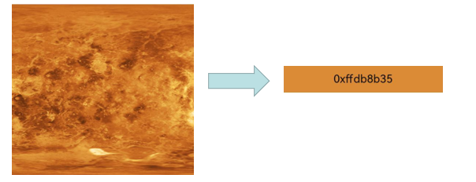
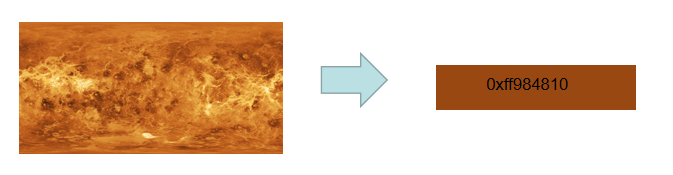
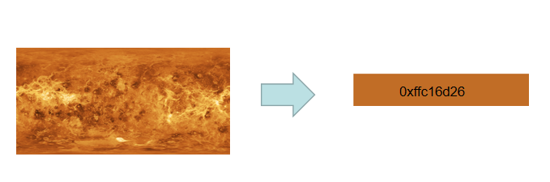
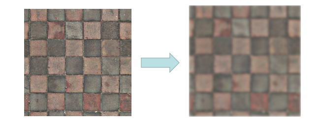
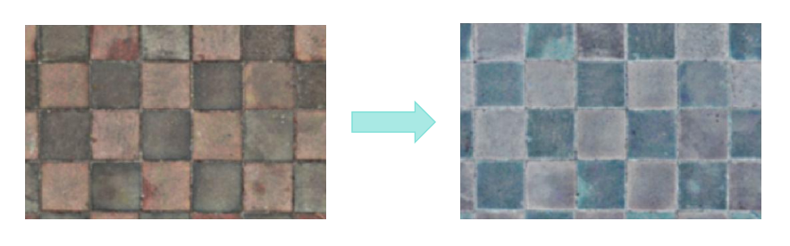
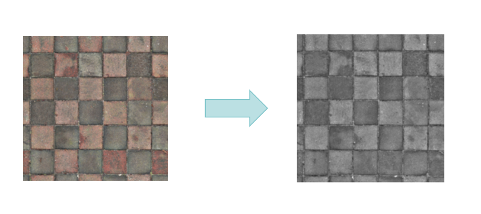
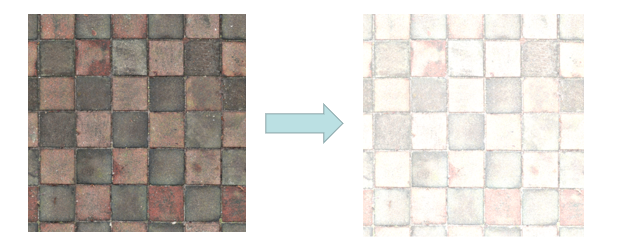
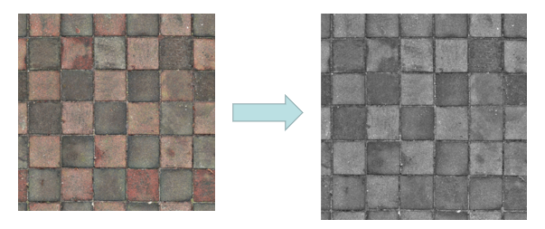

# @ohos.effectKit (Image Effects)

<!--Kit: ArkGraphics 2D-->
<!--Subsystem: Multimedia-->
<!--Owner: @hanamaru-->
<!--Designer: @chensiyi_CE-->
<!--Tester: @zhaoxiaoguang2-->
<!--Adviser: @ge-yafang-->
<!-- md-trans-meta sourceCommit=cb84f8fe2e38bbeba25c5506a75a0804a063c158 translatedAt=2026-07-16T06:41:53.501Z pushedAt=2026-07-16T13:24:40.648Z -->

The Image Effect module provides basic capabilities for processing images, including brightness adjustment, blurring, grayscale adjustment, and intelligent color picking. It is applicable to scenarios such as adding filter effects in image editing apps, blurring the background image of app startup pages, automatically extracting UI theme colors, and analyzing image color schemes.

This module is used for offline processing of [image.PixelMap](../apis-image-kit/arkts-apis-image-PixelMap.md) to obtain visual effects, while uiEffect (UI Effect Service) connects to the rendering service in real time to process screen frame buffers for dynamic visual effects.

This module provides the following classes:

- [Filter](#filter): an effect class used to add a specified effect to the effect chain, enabling combined processing of multiple image effects through chained calls.

- [Color](#color): a class used to store the color picked.

- [ColorPicker](#colorpicker): a smart color picker.

> **NOTE**
>
> The initial APIs of this module are supported since API version 9. Newly added APIs will be marked with a superscript to indicate their earliest API version.

## Modules to Import

```ts
import { effectKit } from '@kit.ArkGraphics2D';
```

## effectKit.createEffect

createEffect(source: image.PixelMap): Filter

Creates a **Filter** instance based on the input PixelMap. You can then add various image effects through chained calls, and finally obtain the processed image via [getEffectPixelMap](#geteffectpixelmap11).

**Widget capability**: This API can be used in ArkTS widgets since API version 12.

**Atomic service API**: This API can be used in atomic services since API version 12.

**System capability**: SystemCapability.Multimedia.Image.Core

**Parameters**

| Name   | Type              | Mandatory| Description    |
| ------- | ----------------- | ---- | -------- |
| source  | [image.PixelMap](../apis-image-kit/arkts-apis-image-PixelMap.md) | Yes  | **PixelMap** instance created by the image module. An instance can be obtained by decoding an image or directly created. For details, see [Introduction to Image Kit](../../media/image/image-overview.md).  |

**Return value**

| Type                            | Description          |
| -------------------------------- | -------------- |
| [Filter](#filter) | Returns a Filter instance with no effects added, or **null** if the operation fails. |

**Example**

```ts
import { image } from '@kit.ImageKit';
import { effectKit } from '@kit.ArkGraphics2D';

// Create a buffer for the image effect.
const colorBuffer = new ArrayBuffer(96);
// Set the image initialization options.
let opts : image.InitializationOptions = {
  editable: true,
  pixelFormat: 3,
  size: {
    height: 4,
    width: 6
  }
};
// Create a PixelMap instance.
image.createPixelMap(colorBuffer, opts).then((pixelMap) => {
  // Create a Filter instance.
  let headFilter = effectKit.createEffect(pixelMap);
});
```

## effectKit.createColorPicker

createColorPicker(source: image.PixelMap): Promise\<ColorPicker>

Creates a **ColorPicker** instance based on a pixel map. This API uses a promise to return the result.

**Widget capability**: This API can be used in ArkTS widgets since API version 12.

**Atomic service API**: This API can be used in atomic services since API version 12.

**System capability**: SystemCapability.Multimedia.Image.Core

**Parameters**

| Name    | Type        | Mandatory| Description                      |
| -------- | ----------- | ---- | -------------------------- |
| source   | [image.PixelMap](../apis-image-kit/arkts-apis-image-PixelMap.md) | Yes  |  **PixelMap** instance created by the image module. An instance can be obtained by decoding an image or directly created. For details, see [Introduction to Image Kit](../../media/image/image-overview.md).|

**Return value**

| Type                  | Description          |
| ---------------------- | -------------- |
| Promise\<[ColorPicker](#colorpicker)>  | Promise used to return the **ColorPicker** instance created.|

**Error codes**

For details about the error codes, see [Universal Error Codes](../errorcode-universal.md).

| ID| Error Message                       |
| -------- | ------------------------------ |
| 401      | Input parameter error.             |

**Example**

```ts
import { image } from '@kit.ImageKit';
import { effectKit } from '@kit.ArkGraphics2D';
import { BusinessError } from '@kit.BasicServicesKit';

// Create a buffer for image effects.
const colorBuffer = new ArrayBuffer(96);
// Set image initialization options.
let opts : image.InitializationOptions = {
  editable: true,
  pixelFormat: 3,
  size: {
    height: 4,
    width: 6
  }
};

// Create a PixelMap instance.
image.createPixelMap(colorBuffer, opts).then((pixelMap) => {
  // Create a ColorPicker instance.
  effectKit.createColorPicker(pixelMap).then(colorPicker => {
    console.info('Succeeded in creating colorPicker.');
  }).catch((err : BusinessError) => {
    console.error(`Failed to create colorPicker. Code: ${err.code}, message: ${err.message}`);
  });
});
```

## effectKit.createColorPicker<sup>10+</sup>

createColorPicker(source: image.PixelMap, region: Array\<number>): Promise\<ColorPicker>

Creates a **ColorPicker** instance for the selected region based on a pixel map. This API uses a promise to return the result.

**Widget capability**: This API can be used in ArkTS widgets since API version 12.

**Atomic service API**: This API can be used in atomic services since API version 12.

**System capability**: SystemCapability.Multimedia.Image.Core

**Parameters**

| Name    | Type        | Mandatory| Description                      |
| -------- | ----------- | ---- | -------------------------- |
| source   | [image.PixelMap](../apis-image-kit/arkts-apis-image-PixelMap.md) | Yes  |  **PixelMap** instance created by the image module. An instance can be obtained by decoding an image or directly created. For details, see [About This Kit](../../media/image/image-overview.md).|
| region   | Array\<number> | Yes  | Color picking region of the image.<br>The array contains four elements, with a value range of [0, 1]. Values outside this range are automatically truncated during implementation. The four elements represent the left, top, right, and bottom positions of the image region, respectively. The leftmost and topmost edges correspond to position 0, and the rightmost and bottommost edges correspond to position 1. The third element must be greater than the first element, and the fourth element must be greater than the second element.|

**Return value**

| Type                  | Description          |
| ---------------------- | -------------- |
| Promise\<[ColorPicker](#colorpicker)>  | Promise used to return the **ColorPicker** instance created.|

**Error codes**

For details about the error codes, see [Universal Error Codes](../errorcode-universal.md).

| ID| Error Message                       |
| -------- | ------------------------------ |
| 401      | Input parameter error.             |

**Example**

```ts
import { image } from '@kit.ImageKit';
import { effectKit } from '@kit.ArkGraphics2D';
import { BusinessError } from '@kit.BasicServicesKit';

// Create a buffer for image effects.
const colorBuffer = new ArrayBuffer(96);
// Set image initialization options.
let opts : image.InitializationOptions = {
  editable: true,
  pixelFormat: 3,
  size: {
    height: 4,
    width: 6
  }
};

// Create a PixelMap instance.
image.createPixelMap(colorBuffer, opts).then((pixelMap) => {
  // Create a ColorPicker instance for the specified color sampling area.
  effectKit.createColorPicker(pixelMap, [0, 0, 1, 1]).then(colorPicker => {
    console.info('Succeeded in creating colorPicker.');
  }).catch((err : BusinessError) => {
    console.error(`Failed to create colorPicker. Code: ${err.code}, message: ${err.message}`);
  });
});
```

## effectKit.createColorPicker

createColorPicker(source: image.PixelMap, callback: AsyncCallback\<ColorPicker>): void

Creates a **ColorPicker** instance based on a pixel map. This API uses an asynchronous callback to return the result.

**Widget capability**: This API can be used in ArkTS widgets since API version 12.

**Atomic service API**: This API can be used in atomic services since API version 12.

**System capability**: SystemCapability.Multimedia.Image.Core

**Parameters**

| Name    | Type               | Mandatory| Description                      |
| -------- | ------------------ | ---- | -------------------------- |
| source   | [image.PixelMap](../apis-image-kit/arkts-apis-image-PixelMap.md) | Yes |**PixelMap** instance created by the image module. An instance can be obtained by decoding an image or directly created. For details, see [Introduction to Image Kit](../../media/image/image-overview.md). |
| callback | AsyncCallback\<[ColorPicker](#colorpicker)> | Yes | Callback used to return the **ColorPicker** instance created.|

**Error codes**

For details about the error codes, see [Universal Error Codes](../errorcode-universal.md).

| ID| Error Message                       |
| -------- | ------------------------------ |
| 401      | Input parameter error.             |

**Example**

```ts
import { image } from '@kit.ImageKit';
import { effectKit } from '@kit.ArkGraphics2D';

// Create a buffer for image effects.
const colorBuffer = new ArrayBuffer(96);
// Set image initialization options.
let opts : image.InitializationOptions = {
  editable: true,
  pixelFormat: 3,
  size: {
    height: 4,
    width: 6
  }
};
// Create a PixelMap instance.
image.createPixelMap(colorBuffer, opts).then((pixelMap) => {
  // Create a ColorPicker instance.
  effectKit.createColorPicker(pixelMap, (error, colorPicker) => {
    if (error) {
      console.error(`Failed to create color picker. Code: ${error.code}, message: ${error.message}`);
    } else {
      console.info('Succeeded in creating color picker.');
    }
  });
});
```

## effectKit.createColorPicker<sup>10+</sup>

createColorPicker(source: image.PixelMap, region:Array\<number>, callback: AsyncCallback\<ColorPicker>): void

Creates a **ColorPicker** instance for the selected region based on a pixel map. This API uses an asynchronous callback to return the result.

**Widget capability**: This API can be used in ArkTS widgets since API version 12.

**Atomic service API**: This API can be used in atomic services since API version 12.

**System capability**: SystemCapability.Multimedia.Image.Core

**Parameters**

| Name    | Type               | Mandatory| Description                      |
| -------- | ------------------ | ---- | -------------------------- |
| source   | [image.PixelMap](../apis-image-kit/arkts-apis-image-PixelMap.md) | Yes |**PixelMap** instance created by the image module. An instance can be obtained by decoding an image or directly created. For details, see [About This Kit](../../media/image/image-overview.md). |
| region   | Array\<number> | Yes  | Color sampling region of the image.<br>The array contains four elements, with a value range of [0, 1]. Values outside the boundary are automatically truncated during implementation. The four elements represent the left, top, right, and bottom positions of the image region, respectively. The leftmost and topmost edges of the image correspond to position 0, and the rightmost and bottommost edges correspond to position 1. The third element must be greater than the first element, and the fourth element must be greater than the second element.|
| callback | AsyncCallback\<[ColorPicker](#colorpicker)> | Yes | Callback used to return the **ColorPicker** instance created.|

**Error codes**

For details about the error codes, see [Universal Error Codes](../errorcode-universal.md).

| ID| Error Message                       |
| -------- | ------------------------------ |
| 401      | Input parameter error.             |

**Example**

```ts
import { image } from '@kit.ImageKit';
import { effectKit } from '@kit.ArkGraphics2D';

// Create a buffer for image effects.
const colorBuffer = new ArrayBuffer(96);
// Set image initialization options.
let opts : image.InitializationOptions = {
  editable: true,
  pixelFormat: 3,
  size: {
    height: 4,
    width: 6
  }
};
// Create a PixelMap instance.
image.createPixelMap(colorBuffer, opts).then((pixelMap) => {
  // Create a ColorPicker instance for the specified color sampling area.
  effectKit.createColorPicker(pixelMap, [0, 0, 1, 1], (error, colorPicker) => {
    if (error) {
      console.error(`Failed to create color picker. Code: ${error.code}, message: ${error.message}`);
    } else {
      console.info('Succeeded in creating color picker.');
    }
  });
});
```

## Color

A color class used to store the color picking result. It is suitable for scenarios such as obtaining the main color, the color with the largest proportion, and the color with the highest saturation from an image in conjunction with ColorPicker, helping developers conveniently obtain and pass image color picking results.

**Widget capability**: This API can be used in ArkTS widgets since API version 12.

**Atomic service API**: This API can be used in atomic services since API version 12.

**System capability**: SystemCapability.Multimedia.Image.Core

| Name  | Type  | Read-Only| Optional| Description             |
| ------ | ----- | ---- | ---- | ---------------- |
| red   | number | No   | No   | Red component value. Value range: [0x0, 0xFF].           |
| green | number | No   | No   | Green component value. Value range: [0x0, 0xFF].           |
| blue  | number | No   | No   | Blue component value. Value range: [0x0, 0xFF].           |
| alpha | number | No   | No   | Alpha component value. Value range: [0x0, 0xFF].       |

## TileMode<sup>14+</sup>

Enumerates the tile modes of the shader effect.

**System capability**: SystemCapability.Multimedia.Image.Core

| Name                  | Value  | Description                          |
| ---------------------- | ---- | ------------------------------ |
| CLAMP     | 0    | Replicates the edge color if the shader effect draws outside of its original boundary.|
| REPEAT    | 1    | Repeats the shader effect in both horizontal and vertical directions.|
| MIRROR    | 2    | Repeats the shader effect in both horizontal and vertical directions, alternating mirror images.|
| DECAL     | 3    | Renders the shader effect only within the original boundary.|

> **NOTE**
>
> Under CPU rendering, the shader tile mode supports only DECAL.
>
> Under GPU rendering, DECAL, CLAMP, REPEAT, and MIRROR modes are all supported.

## ColorPicker

A color picker class used to obtain the main color from image data. It is suitable for scenarios such as UI theme color extraction, image color scheme analysis, and intelligent color scheme recommendation, helping developers dynamically generate harmonious color schemes based on image content. Before calling the methods of ColorPicker, you need to create a ColorPicker instance via [createColorPicker](#effectkitcreatecolorpicker).

### getMainColor

getMainColor(): Promise\<Color>

Reads the color value of the main color from the image and writes the result to a [Color](#color) instance. This API uses a promise to return the result. This API uses the image scaling algorithm to calculate the weighted value of surrounding pixels and reduce the original image to one pixel to obtain the main color. It is commonly used in scenarios such as automatic app theme color extraction, automatic UI color matching based on images, and dynamic background color adjustment of music players based on album covers.

**Widget capability**: This API can be used in ArkTS widgets since API version 12.

**Atomic service API**: This API can be used in atomic services since API version 12.

**System capability**: SystemCapability.Multimedia.Image.Core

**Return value**

| Type          | Description                                           |
| :------------- | :---------------------------------------------- |
| Promise\<[Color](#color)> | Promise used to return the color value of the main color. If the operation fails, an error message is returned.|

**Example**

```ts
import { image } from '@kit.ImageKit';
import { effectKit } from '@kit.ArkGraphics2D';

// Create a buffer for image effects.
const colorBuffer = new ArrayBuffer(96);
// Set image initialization options.
let opts: image.InitializationOptions = {
  editable: true,
  pixelFormat: 3,
  size: {
    height: 4,
    width: 6
  }
};
// Create a PixelMap instance.
image.createPixelMap(colorBuffer, opts).then((pixelMap) => {
  // Create a ColorPicker instance.
  effectKit.createColorPicker(pixelMap, (error, colorPicker) => {
    if (error) {
      console.error(`Failed to create color picker. Code: ${error.code}, message: ${error.message}`);
    } else {
      console.info('Succeeded in creating color picker.');
      // Obtain the dominant color of the image.
      colorPicker.getMainColor().then(mainColor => {
        console.info('Succeeded in getting main color.');
        console.info(`color[ARGB]=${mainColor.alpha},${mainColor.red},${mainColor.green},${mainColor.blue}`);
      });
    }
  });
});
```



### getMainColorSync

getMainColorSync(): Color

Reads the color value of the main color from the image and writes the result to a [Color](#color) instance. This API returns the result synchronously. This API uses the image scaling algorithm to calculate the weighted value of surrounding pixels and reduces the original image to one pixel to obtain the main color. It is commonly used in scenarios such as automatic app theme color extraction, automatic UI color matching based on images, and dynamic background color adjustment of music players based on album covers.

**Widget capability**: This API can be used in ArkTS widgets since API version 12.

**Atomic service API**: This API can be used in atomic services since API version 12.

**System capability**: SystemCapability.Multimedia.Image.Core

**Return value**

| Type    | Description                                 |
| :------- | :----------------------------------- |
| [Color](#color)    | Color value of the main color. If the operation fails, **null** is returned.|

**Example**

```ts
import { image } from '@kit.ImageKit';
import { effectKit } from '@kit.ArkGraphics2D';

// Create a buffer for image effects.
const colorBuffer = new ArrayBuffer(96);
// Set image initialization options.
let opts : image.InitializationOptions = {
  editable: true,
  pixelFormat: 3,
  size: {
    height: 4,
    width: 6
  }
};
// Create a PixelMap instance.
image.createPixelMap(colorBuffer, opts).then((pixelMap) => {
  // Create a ColorPicker instance.
  effectKit.createColorPicker(pixelMap, (error, colorPicker) => {
    if (error) {
      console.error(`Failed to create color picker. Code: ${error.code}, message: ${error.message}`);
    } else {
      console.info('Succeeded in creating color picker.');
      // Obtain the main color of the image synchronously.
      let mainColor = colorPicker.getMainColorSync();
      console.info('get main color =' + mainColor);
    }
  });
});
```


### getLargestProportionColor<sup>10+</sup>

getLargestProportionColor(): Color

Reads the color value with the largest proportion in the image and writes the result to a [Color](#color) instance. This API returns the result synchronously. This API uses the median cut algorithm to partition the color space and obtains the average color of the color space with the largest proportion. It is commonly used in scenarios such as identifying the largest color area in an image, such as icon background color extraction and image content analysis.

**Widget capability**: This API can be used in ArkTS widgets since API version 12.

**Atomic service API**: This API can be used in atomic services since API version 12.

**System capability**: SystemCapability.Multimedia.Image.Core

**Return value**

| Type          | Description                                           |
| :------------- | :---------------------------------------------- |
| [Color](#color)       | Color value of the color with the largest proportion. If the operation fails, **null** is returned.|

**Example**

```ts
import { image } from '@kit.ImageKit';
import { effectKit } from '@kit.ArkGraphics2D';

// Create a buffer for the image effect.
const colorBuffer = new ArrayBuffer(96);
// Set the image initialization options.
let opts : image.InitializationOptions = {
  editable: true,
  pixelFormat: 3,
  size: {
    height: 4,
    width: 6
  }
};
// Create a PixelMap instance.
image.createPixelMap(colorBuffer, opts).then((pixelMap) => {
  // Create a ColorPicker instance.
  effectKit.createColorPicker(pixelMap, (error, colorPicker) => {
    if (error) {
      console.error(`Failed to create color picker. Code: ${error.code}, message: ${error.message}`);
    } else {
      console.info('Succeeded in creating color picker.');
      // Obtain the most dominant color in the image.
      let largestColor = colorPicker.getLargestProportionColor();
      console.info('get largest proportion color =' + largestColor);
    }
  });
});
```


### getTopProportionColors<sup>12+</sup>

getTopProportionColors(colorCount: number): Array\<Color \| null>

Reads the top proportion colors from the image, with the number specified by `colorCount`, and writes the results to an array of [Color](#color) instances. This API returns the result synchronously. It is commonly used in scenarios such as extracting the top multiple colors by proportion in an image, such as multi-tone color scheme generation and image color distribution analysis.

**Widget capability**: This API can be used in ArkTS widgets since API version 12.

**Atomic service API**: This API can be used in atomic services since API version 12.

**System capability**: SystemCapability.Multimedia.Image.Core

**Parameters**

| Name     | Type  | Mandatory| Description             |
| ---------- | ------ | ---- | ------------------------------------------- |
| colorCount | number | Yes | Number of colors to extract, rounded down.<br>**NOTE**<br>Before <!--RP1-->OpenHarmony 6.1<!--RP1End-->, the value range is [1, 10]. If the number of colors to extract is greater than 10, the top 10 are taken. Since <!--RP1-->OpenHarmony 6.1<!--RP1End-->, the value range is [1, 20]. If the number of colors to extract is greater than 20, the top 20 are taken. |

**Return value**

| Type                                    | Description                                           |
| :--------------------------------------- | :---------------------------------------------- |
| Array<[Color](#color) \| null> | Array of colors, i.e., the top `colorCount` color values by proportion in the image, sorted by proportion.<br>- If the number of colors obtained is less than the value of **colorCount**, the array size is the actual number obtained.<br>- If the colors fail to be obtained or the number of colors obtained is less than 1, **[null]** is returned.|

**Example**

```js
import { image } from '@kit.ImageKit';
import { effectKit } from '@kit.ArkGraphics2D';

// Create a buffer for image effects.
const colorBuffer = new ArrayBuffer(96);
// Set image initialization options.
let opts : image.InitializationOptions = {
  editable: true,
  pixelFormat: 3,
  size: {
    height: 4,
    width: 6
  }
};
// Create a PixelMap instance.
image.createPixelMap(colorBuffer, opts).then((pixelMap) => {
  // Create a ColorPicker instance.
  effectKit.createColorPicker(pixelMap, (error, colorPicker) => {
    if (error) {
      console.error(`Failed to create color picker. Code: ${error.code}, message: ${error.message}`);
    } else {
      console.info('Succeeded in creating color picker.');
      // Obtain the top two dominant colors in the image.
      let colors = colorPicker.getTopProportionColors(2);
      for (let index = 0; index < colors.length; index++) {
        if (colors[index]) {
          console.info('get top proportion colors: index ' + index + ', color ' + colors[index]);
        }
      }
    }
  });
});
```


### getHighestSaturationColor<sup>10+</sup>

getHighestSaturationColor(): Color

Reads the color value with the highest saturation from the image and writes the result to a [Color](#color) instance. This API returns the result synchronously. It is commonly used in scenarios such as extracting the most vivid color in an image, such as UI theme accent color extraction and icon highlight color selection.

**Widget capability**: This API can be used in ArkTS widgets since API version 12.

**Atomic service API**: This API can be used in atomic services since API version 12.

**System capability**: SystemCapability.Multimedia.Image.Core

**Return value**

| Type          | Description                                           |
| :------------- | :---------------------------------------------- |
| [Color](#color)       | Color value of the color with the highest saturation. If the operation fails, **null** is returned.|

**Example**

```ts
import { image } from '@kit.ImageKit';
import { effectKit } from '@kit.ArkGraphics2D';

// Create a buffer for image effects.
const colorBuffer = new ArrayBuffer(96);
// Set image initialization options.
let opts: image.InitializationOptions = {
  editable: true,
  pixelFormat: 3,
  size: {
    height: 4,
    width: 6
  }
};
// Create a PixelMap instance.
image.createPixelMap(colorBuffer, opts).then((pixelMap) => {
  // Create a ColorPicker instance.
  effectKit.createColorPicker(pixelMap, (error, colorPicker) => {
    if (error) {
      console.error(`Failed to create color picker. Code: ${error.code}, message: ${error.message}`);
    } else {
      console.info('Succeeded in creating color picker.');
      // Obtain the color with the highest saturation in the image.
      let saturationColor = colorPicker.getHighestSaturationColor();
      console.info('get highest saturation color =' + saturationColor);
    }
  });
});
```



### getAverageColor<sup>10+</sup>

getAverageColor(): Color

Reads the average color value from the image and writes the result to a [Color](#color) instance. This API returns the result synchronously. It is commonly used in scenarios such as obtaining the overall tone of an image, such as image tone statistics and adaptive background color.

**Widget capability**: This API can be used in ArkTS widgets since API version 12.

**Atomic service API**: This API can be used in atomic services since API version 12.

**System capability**: SystemCapability.Multimedia.Image.Core

**Return value**

| Type          | Description                                           |
| :------------- | :---------------------------------------------- |
| [Color](#color)       | Average color value. If the operation fails, **null** is returned.|

**Example**

```ts
import { image } from '@kit.ImageKit';
import { effectKit } from '@kit.ArkGraphics2D';

// Create a buffer for image effects.
const colorBuffer = new ArrayBuffer(96);
// Set image initialization options.
let opts: image.InitializationOptions = {
  editable: true,
  pixelFormat: 3,
  size: {
    height: 4,
    width: 6
  }
};
// Create a PixelMap instance.
image.createPixelMap(colorBuffer, opts).then((pixelMap) => {
  // Create a ColorPicker instance.
  effectKit.createColorPicker(pixelMap, (error, colorPicker) => {
    if (error) {
      console.error(`Failed to create color picker. Code: ${error.code}, message: ${error.message}`);
    } else {
      console.info('Succeeded in creating color picker.');
      // Obtain the average color of the image.
      let averageColor = colorPicker.getAverageColor();
      console.info('get average color =' + averageColor);
    }
  });
});
```



### isBlackOrWhiteOrGrayColor<sup>10+</sup>

isBlackOrWhiteOrGrayColor(color: number): boolean

Determines whether the specified color value is a black, white, or gray color, and returns true or false. It is commonly used in scenarios such as determining whether a color belongs to the achromatic color system, such as intelligent color scheme filtering and image color classification.

**Widget capability**: This API can be used in ArkTS widgets since API version 12.

**Atomic service API**: This API can be used in atomic services since API version 12.

**System capability**: SystemCapability.Multimedia.Image.Core

**Parameters**

| Name    | Type        | Mandatory| Description                      |
| -------- | ----------- | ---- | -------------------------- |
| color | number | Yes  | Color value to determine whether it is black, white, or gray. The format is 0xAARRGGBB, and the value range is [0x0, 0xFFFFFFFF]. |

**Return value**

| Type          | Description                                           |
| :------------- | :---------------------------------------------- |
| boolean              | Whether the color is black, white, or gray. The value **true** means the color is black, white, or gray, and **false** means the opposite. |

**Example**

```ts
import { image } from '@kit.ImageKit';
import { effectKit } from '@kit.ArkGraphics2D';

// Create a buffer for image effects.
const colorBuffer = new ArrayBuffer(96);
// Set image initialization options.
let opts: image.InitializationOptions = {
  editable: true,
  pixelFormat: 3,
  size: {
    height: 4,
    width: 6
  }
};
// Create a PixelMap instance.
image.createPixelMap(colorBuffer, opts).then((pixelMap) => {
  // Create a ColorPicker instance.
  effectKit.createColorPicker(pixelMap, (error, colorPicker) => {
    if (error) {
      console.error(`Failed to create color picker. Code: ${error.code}, message: ${error.message}`);
    } else {
      console.info('Succeeded in creating color picker.');
      // Determine whether the color is black, white, or gray.
      let isBlackOrWhiteOrGray = colorPicker.isBlackOrWhiteOrGrayColor(0xFFFFFFFF);
      console.info('is black or white or gray color[bool](white) =' + isBlackOrWhiteOrGray);
    }
  });
});
```

## Filter

An image effect class used to add a specified effect to the effect chain through chained calls. It is suitable for scenarios such as image filter processing, visual effect enhancement, and image beautification. Before calling the methods of Filter, you need to create a Filter instance via [createEffect](#effectkitcreateeffect). After adding effects, you need to call [getEffectPixelMap](#geteffectpixelmap11) to obtain the processed image.

### blur

blur(radius: number): Filter

Adds the blur effect to the effect chain and returns the instance of the chain. The shader tile mode uses DECAL. To specify the tile mode, use the [blur<sup>14+</sup>](#blur14) API. It is commonly used in scenarios such as background blurring, privacy information masking, frosted glass background effect, and pop-up window background blur.

>  **NOTE**
>
>  This API provides the blur effect for static images. To provide the real-time blur effect for components, use [dynamic blur](../../ui/arkts-blur-effect.md).

**Widget capability**: This API can be used in ArkTS widgets since API version 12.

**Atomic service API**: This API can be used in atomic services since API version 12.

**System capability**: SystemCapability.Multimedia.Image.Core

**Parameters**

| Name| Type       | Mandatory| Description                                                        |
| ------ | ----------- | ---- | ------------------------------------------------------------ |
|  radius   | number | Yes   | Blur radius, in px. Value range: [0, +∞). A larger blur radius produces a more pronounced blur effect. Negative values produce no effect. |

**Return value**

| Type          | Description                                           |
| :------------- | :---------------------------------------------- |
| [Filter](#filter) | Returns the Filter instance with the added effects, for further adding effects or obtaining the processed image. |

**Example**

```ts
import { image } from '@kit.ImageKit';
import { effectKit } from '@kit.ArkGraphics2D';
import { common } from '@kit.AbilityKit';
// Pass the image data to be read.
function imageBlur(imageData: ArrayBuffer): Promise<image.PixelMap> {
  return new Promise(async (resolve) => {
    // Create an image source.
    let imageSource = image.createImageSource(imageData);
    await imageSource.createPixelMap().then(async (pixelMap: image.PixelMap) => {
      // Set the blur radius.
      let radius = 5;
      // Create a Filter instance.
      let headFilter = effectKit.createEffect(pixelMap);
      if (headFilter != null) {
        // Add a blur effect to the image.
        headFilter.blur(radius);
        // Process the image based on the added effect identifiers and return the processed image data.
        headFilter.getEffectPixelMap().then(imageData => {
          resolve(imageData);
        });
      }
    });
  });
}

@Entry
@Component
struct Index {
  @State imagePixelMap: image.PixelMap | null = null;
  private imageBuffer: ArrayBuffer | undefined = undefined;
  // Read the image file in the rawfile folder. You can also change the read mode as required to ensure that the image data in ArrayBuffer format is obtained.
  async getFileBuffer(): Promise<ArrayBuffer | undefined> {
    try {
      const context: Context = this.getUIContext().getHostContext() as common.UIAbilityContext;
      const fileData: Uint8Array = await context.resourceManager.getRawFileContent('image.png');
      const buffer: ArrayBuffer = fileData.buffer.slice(0);
      return buffer;
    } catch (err) {
      return undefined;
    }
  }

  async aboutToAppear(): Promise<void> {
    this.imageBuffer = await this.getFileBuffer();
    if (this.imageBuffer == undefined) {
      return;
    }
    // Image processing is an asynchronous operation. You can perform the next step based on whether the processed image data needs to be obtained. Add await as required for synchronization.
    this.imagePixelMap = await imageBlur(this.imageBuffer);
  }

  build() {
    Column() {
      Image(this.imagePixelMap)
        .width(304)
        .height(305)
    }
    .height('100%')
    .width('100%')
  }
}
```



### blur<sup>14+</sup>

blur(radius: number, tileMode: TileMode): Filter

Adds the blur effect to the effect chain and returns the instance of the chain. It supports selecting the shader effect tile mode. It is commonly used in scenarios such as background blurring, privacy information masking, frosted glass background effect, and pop-up window background blur.

>  **NOTE**
>
>  This API provides the blur effect for static images. To provide the real-time blur effect for components, use [dynamic blur](../../ui/arkts-blur-effect.md).

**System capability**: SystemCapability.Multimedia.Image.Core

**Parameters**

| Name| Type       | Mandatory| Description                                                        |
| ------ | ----------- | ---- | ------------------------------------------------------------ |
|  radius   | number | Yes  | Blur radius, in px. The value range is [0, +∞). A larger blur radius produces a more pronounced blur effect. No effect is applied when a negative value is passed in. |
|  tileMode   | [TileMode](#tilemode14) | Yes  | Shader tile mode, which affects the blur effect at the image edges. |

**Return value**

| Type          | Description                                           |
| :------------- | :---------------------------------------------- |
| [Filter](#filter) | Returns a Filter instance with the added effects, for continuing to add effects or obtaining the processed image. |

**Example**

```ts
import { image } from '@kit.ImageKit';
import { effectKit } from '@kit.ArkGraphics2D';
import { common } from '@kit.AbilityKit';
// Pass the image data to be read.
function imageBlur(Image: ArrayBuffer): Promise<image.PixelMap> {
  return new Promise(async (resolve) => {
    // Create the image source.
    let imageSource = image.createImageSource(Image);
    await imageSource.createPixelMap().then(async (pixelMap: image.PixelMap) => {
      // Set the blur radius.
      let radius = 30;
      // Create a Filter instance.
      let headFilter = effectKit.createEffect(pixelMap);
      if (headFilter != null) {
        // Add a blur effect to the image and set the tile mode.
        headFilter.blur(radius, effectKit.TileMode.DECAL);
        // Process the image based on the added effect identifier and return the processed image data.
        headFilter.getEffectPixelMap().then(imageData => {
          resolve(imageData);
        });
      }
    });
  });
}

@Entry
@Component
struct Index {
  @State imagePixelMap: image.PixelMap | null = null;
  private imageBuffer: ArrayBuffer | undefined = undefined;
  // Read the image file in the rawfile folder. You can also change the read mode as required to ensure that the image data in ArrayBuffer format is obtained.
  async getFileBuffer(): Promise<ArrayBuffer | undefined> {
    try {
      const context: Context = this.getUIContext().getHostContext() as common.UIAbilityContext;
      const fileData: Uint8Array = await context.resourceManager.getRawFileContent('image.png');
      const buffer: ArrayBuffer = fileData.buffer.slice(0);
      return buffer;
    } catch (err) {
      return undefined;
    }
  }

  async aboutToAppear(): Promise<void> {
    this.imageBuffer = await this.getFileBuffer();
    if (this.imageBuffer == undefined) {
      return;
    }
    // Image processing is an asynchronous operation. You can perform the next step based on whether the processed image data needs to be obtained. Add await as required for synchronization.
    this.imagePixelMap = await imageBlur(this.imageBuffer);
  }

  build() {
    Column() {
      Image(this.imagePixelMap)
        .width(304)
        .height(305)
    }
    .height('100%')
    .width('100%')
  }
}
```


### invert<sup>12+</sup>

invert(): Filter

Adds the invert effect to the effect chain and returns the instance of the chain. This method inverts the RGB color values of the image. It is commonly used in scenarios such as negative film effect, image artistic processing, and night mode adaptation.

**System capability**: SystemCapability.Multimedia.Image.Core

**Return value**

| Type          | Description                                           |
| :------------- | :---------------------------------------------- |
| [Filter](#filter) | Returns the Filter instance with the added effects, which can be used to continue adding effects or obtain the processed image. |

**Example**

```ts
import { image } from '@kit.ImageKit';
import { effectKit } from '@kit.ArkGraphics2D';
import { common } from '@kit.AbilityKit';
// Pass the image data to be read.
function imageInvert(imageData: ArrayBuffer): Promise<image.PixelMap> {
  return new Promise(async (resolve) => {
    // Create the image source.
    let imageSource = image.createImageSource(imageData);
    await imageSource.createPixelMap().then(async (pixelMap: image.PixelMap) => {
      // Create a Filter instance.
      let headFilter = effectKit.createEffect(pixelMap);
      if (headFilter != null) {
        // Add an inversion effect to the image.
        headFilter.invert();
        // Process the image based on the added effect identifiers and return the processed image data.
        headFilter.getEffectPixelMap().then(imageData => {
          resolve(imageData);
        });
      }
    });
  });
}

@Entry
@Component
struct Index {
  @State imagePixelMap: image.PixelMap | null = null;
  private imageBuffer: ArrayBuffer | undefined = undefined;
  // Read the image file in the rawfile folder. You can also change the read mode as required to ensure that the image data in ArrayBuffer format is obtained.
  async getFileBuffer(): Promise<ArrayBuffer | undefined> {
    try {
      const context: Context = this.getUIContext().getHostContext() as common.UIAbilityContext;
      const fileData: Uint8Array = await context.resourceManager.getRawFileContent('image.png');
      const buffer: ArrayBuffer = fileData.buffer.slice(0);
      return buffer;
    } catch (err) {
      return undefined;
    }
  }

  async aboutToAppear(): Promise<void> {
    this.imageBuffer = await this.getFileBuffer();
    if (this.imageBuffer == undefined) {
      return;
    }
    // Image processing is an asynchronous operation. You can perform the next step based on whether the processed image data needs to be obtained. Add await as required for synchronization.
    this.imagePixelMap = await imageInvert(this.imageBuffer);
  }

  build() {
    Column() {
      Image(this.imagePixelMap)
        .width(304)
        .height(305)
    }
    .height('100%')
    .width('100%')
  }
}
```



### setColorMatrix<sup>12+</sup>

setColorMatrix(colorMatrix: Array\<number>): Filter

Performs color transformation on the image using a custom color matrix, adds the effect to the effect chain, and returns the instance of the chain. It is commonly used in scenarios such as implementing custom color effects not supported by preset filters, such as vintage tones and warm/cool tone adjustments.

**System capability**: SystemCapability.Multimedia.Image.Core

**Parameters**

| Name| Type       | Mandatory| Description                                                        |
| ------ | ----------- | ---- | ------------------------------------------------------------ |
|  colorMatrix  |   Array\<number> | Yes  | Custom color matrix. <br>A 4x5 matrix used to create an effect filter. The array length must be 20. The first four columns correspond to the transformation coefficients of the R, G, B, and A channels, and the fifth column is the constant offset value. It is recommended that the element values be in the range [-1, 1]. Values outside this range may cause color value overflow or unexpected effects. If the array length is not 20, null is returned. |

**Return value**

| Type          | Description                                           |
| :------------- | :---------------------------------------------- |
| [Filter](#filter) | Filter instance with effects added, which can be used to add more effects or obtain the processed image. |

**Error codes**

For details about the error codes, see [Universal Error Codes](../errorcode-universal.md).

| ID| Error Message                       |
| -------- | ------------------------------ |
| 401      | Input parameter error.             |

**Example**

```ts
import { image } from '@kit.ImageKit';
import { effectKit } from '@kit.ArkGraphics2D';
import { common } from '@kit.AbilityKit';
// Pass the image data to be read.
function imageColorFilter(imageData: ArrayBuffer): Promise<image.PixelMap> {
  return new Promise(async (resolve) => {
    // Create the image source.
    let imageSource = image.createImageSource(imageData);
    await imageSource.createPixelMap().then(async (pixelMap: image.PixelMap) => {
      // Define the color matrix.
      let colorMatrix: Array<number> = [
        0.2126, 0.7152, 0.0722, 0, 0,
        0.2126, 0.7152, 0.0722, 0, 0,
        0.2126, 0.7152, 0.0722, 0, 0,
        0, 0, 0, 1, 0
      ];
      // Create a Filter instance.
      let headFilter = effectKit.createEffect(pixelMap);
      if (headFilter != null) {
        // Apply a custom color matrix effect to the image.
        headFilter.setColorMatrix(colorMatrix);
        // Process the image based on the added effect identifier and return the processed image data.
        headFilter.getEffectPixelMap().then(imageData => {
          resolve(imageData);
        });
      }
    });
  });
}

@Entry
@Component
struct Index {
  @State imagePixelMap: image.PixelMap | null = null;
  private imageBuffer: ArrayBuffer | undefined = undefined;
  // Read the image file in the rawfile folder. You can also change the read mode as required to ensure that the image data in ArrayBuffer format is obtained.
  async getFileBuffer(): Promise<ArrayBuffer | undefined> {
    try {
      const context: Context = this.getUIContext().getHostContext() as common.UIAbilityContext;
      const fileData: Uint8Array = await context.resourceManager.getRawFileContent('image.png');
      const buffer: ArrayBuffer = fileData.buffer.slice(0);
      return buffer;
    } catch (err) {
      return undefined;
    }
  }

  async aboutToAppear(): Promise<void> {
    this.imageBuffer = await this.getFileBuffer();
    if (this.imageBuffer == undefined) {
      return;
    }
    // Image processing is an asynchronous operation. You can perform the next step based on whether the processed image data needs to be obtained. Add await as required for synchronization.
    this.imagePixelMap = await imageColorFilter(this.imageBuffer);
  }

  build() {
    Column() {
      Image(this.imagePixelMap)
        .width(304)
        .height(305)
    }
    .height('100%')
    .width('100%')
  }
}
```



### brightness

brightness(bright: number): Filter

Adds the brightness effect to the effect chain and returns the instance of the chain. This method achieves a brightness effect by adjusting the image brightness. It is commonly used in scenarios such as dark image brightening, image preview brightness enhancement, and night mode image adaptation.

**Widget capability**: This API can be used in ArkTS widgets since API version 12.

**Atomic service API**: This API can be used in atomic services since API version 12.

**System capability**: SystemCapability.Multimedia.Image.Core

**Parameters**

| Name| Type       | Mandatory| Description                                                        |
| ------ | ----------- | ---- | ------------------------------------------------------------ |
|  bright   | number | Yes   | Brightness level. The value range is [0, 1]. The value **0** means the image remains unchanged, and **1** means the image brightness is increased to the maximum. If the value is out of range, it is automatically corrected to **0**. |

**Return value**

| Type          | Description                                           |
| :------------- | :---------------------------------------------- |
| [Filter](#filter) | Returns the Filter instance with the added effects, for further adding effects or obtaining the processed image. |

**Example**

```ts
import { image } from '@kit.ImageKit';
import { effectKit } from '@kit.ArkGraphics2D';
import { common } from '@kit.AbilityKit';
// Pass the image data to be read.
function imageBrightness(imageData: ArrayBuffer): Promise<image.PixelMap> {
  return new Promise(async (resolve) => {
    // Create the image source.
    let imageSource = image.createImageSource(imageData);
    await imageSource.createPixelMap().then(async (pixelMap: image.PixelMap) => {
      // Set the brightness value.
      let bright = 0.5;
      // Create a Filter instance.
      let headFilter = effectKit.createEffect(pixelMap);
      if (headFilter != null) {
        // Add a highlight effect to the image.
        headFilter.brightness(bright);
        // Process the image based on the added effect identifier and return the processed image data.
        headFilter.getEffectPixelMap().then(imageData => {
          resolve(imageData);
        });
      }
    });
  });
}

@Entry
@Component
struct Index {
  @State imagePixelMap: image.PixelMap | null = null;
  private imageBuffer: ArrayBuffer | undefined = undefined;
  // Read the image file in the rawfile folder. You can also change the read mode as required to ensure that the image data in ArrayBuffer format is obtained.
  async getFileBuffer(): Promise<ArrayBuffer | undefined> {
    try {
      const context: Context = this.getUIContext().getHostContext() as common.UIAbilityContext;
      const fileData: Uint8Array = await context.resourceManager.getRawFileContent('image.png');
      const buffer: ArrayBuffer = fileData.buffer.slice(0);
      return buffer;
    } catch (err) {
      return undefined;
    }
  }

  async aboutToAppear(): Promise<void> {
    this.imageBuffer = await this.getFileBuffer();
    if (this.imageBuffer == undefined) {
      return;
    }
    // Image processing is an asynchronous operation. You can perform the next step based on whether the processed image data needs to be obtained. Add await as required for synchronization.
    this.imagePixelMap = await imageBrightness(this.imageBuffer);
  }

  build() {
    Column() {
      Image(this.imagePixelMap)
        .width(304)
        .height(305)
    }
    .height('100%')
    .width('100%')
  }
}
```



### grayscale

grayscale(): Filter

Adds the grayscale effect to the effect chain and returns the instance of the chain. This method converts a color image into a grayscale image by calculating the grayscale value through weighted RGB values. It is commonly used in scenarios such as black-and-white style photo generation, image preprocessing decolorization, and grayscale icon creation.

**Widget capability**: This API can be used in ArkTS widgets since API version 12.

**Atomic service API**: This API can be used in atomic services since API version 12.

**System capability**: SystemCapability.Multimedia.Image.Core

**Return value**

| Type          | Description                                           |
| :------------- | :---------------------------------------------- |
| [Filter](#filter) | Returns the Filter instance with the added effects, which can be used to continue adding effects or obtain the processed image. |

**Example**

```ts
import { image } from '@kit.ImageKit';
import { effectKit } from '@kit.ArkGraphics2D';
import { common } from '@kit.AbilityKit';
// Pass the image data to be read.
function imageGrayscale(imageData: ArrayBuffer): Promise<image.PixelMap> {
  return new Promise(async (resolve) => {
    // Create the image source.
    let imageSource = image.createImageSource(imageData);
    await imageSource.createPixelMap().then(async (pixelMap: image.PixelMap) => {
      // Create a Filter instance.
      let headFilter = effectKit.createEffect(pixelMap);
      if (headFilter != null) {
        // Add a grayscale effect to the image.
        headFilter.grayscale();
        // Process the image based on the added effect identifier and return the processed image data.
        headFilter.getEffectPixelMap().then(imageData => {
          resolve(imageData);
        });
      }
    });
  });
}

@Entry
@Component
struct Index {
  @State imagePixelMap: image.PixelMap | null = null;
  private imageBuffer: ArrayBuffer | undefined = undefined;
  // Read the image file in the rawfile folder. You can also change the read mode as required to ensure that the image data in ArrayBuffer format is obtained.
  async getFileBuffer(): Promise<ArrayBuffer | undefined> {
    try {
      const context: Context = this.getUIContext().getHostContext() as common.UIAbilityContext;
      const fileData: Uint8Array = await context.resourceManager.getRawFileContent('image.png');
      const buffer: ArrayBuffer = fileData.buffer.slice(0);
      return buffer;
    } catch (err) {
      return undefined;
    }
  }

  async aboutToAppear(): Promise<void> {
    this.imageBuffer = await this.getFileBuffer();
    if (this.imageBuffer == undefined) {
      return;
    }
    // Image processing is an asynchronous operation. You can perform the next step based on whether the processed image data needs to be obtained. Add await as required for synchronization.
    this.imagePixelMap = await imageGrayscale(this.imageBuffer);
  }

  build() {
    Column() {
      Image(this.imagePixelMap)
        .width(304)
        .height(305)
    }
    .height('100%')
    .width('100%')
  }
}
```



### getEffectPixelMap<sup>11+</sup>

getEffectPixelMap(): Promise\<image.PixelMap>

Obtains **image.PixelMap** of the source image to which the effect chain has been added. CPU rendering is used by default. This API uses a promise to return the result. To specify the rendering mode, use the [getEffectPixelMap<sup>20+</sup>](#geteffectpixelmap20) API. It is commonly used in scenarios where the processed image needs to be saved or displayed.

> **NOTE**
>
> This method uses CPU rendering by default. The shader tile mode supports only DECAL, and other modes (CLAMP, REPEAT, MIRROR) are not supported. To use GPU rendering or learn about the impact of rendering modes on TileMode, see [TileMode](#tilemode14) and [getEffectPixelMap<sup>20+</sup>](#geteffectpixelmap20).

**Widget capability**: This API can be used in ArkTS widgets since API version 12.

**Atomic service API**: This API can be used in atomic services since API version 12.

**System capability**: SystemCapability.Multimedia.Image.Core

**Return value**

| Type                  | Description          |
| ---------------------- | -------------- |
| Promise\<[image.PixelMap](../apis-image-kit/arkts-apis-image-PixelMap.md)> | Promise used to return the image.PixelMap of the source image with the effect chain applied. |

**Example**

```ts
import { image } from '@kit.ImageKit';
import { effectKit } from '@kit.ArkGraphics2D';

// Create a buffer for image effects.
const colorBuffer = new ArrayBuffer(96);
// Set image initialization options.
let opts : image.InitializationOptions = {
  editable: true,
  pixelFormat: 3,
  size: {
    height: 4,
    width: 6
  }
};
// Create a PixelMap instance.
image.createPixelMap(colorBuffer, opts).then((pixelMap) => {
  // Create a Filter instance.
  let headFilter = effectKit.createEffect(pixelMap);
  if (headFilter != null) {
    // Add a grayscale effect and obtain the processed PixelMap.
    headFilter.grayscale().getEffectPixelMap().then(data => {
      console.info('getPixelBytesNumber = ', data.getPixelBytesNumber());
    });
  }
});
```

### getEffectPixelMap<sup>20+</sup>

getEffectPixelMap(useCpuRender : boolean): Promise\<image.PixelMap>

Obtains the **image.PixelMap** of the source image with the linked list effect. The rendering mode (CPU rendering or GPU rendering) can be specified. This API uses a promise to return the result.

**Widget capability**: This API can be used in ArkTS widgets since API version 20.

**Atomic service API**: This API can be used in atomic services since API version 20.

**System capability**: SystemCapability.Multimedia.Image.Core

**Parameters**

| Name| Type       | Mandatory| Description                                                        |
| ------ | ----------- | ---- | ------------------------------------------------------------ |
|  useCpuRender   | boolean | Yes   | Specifies the rendering mode. The value **true** means CPU rendering, and **false** means GPU rendering. When GPU rendering is used, the support scope of the shader effect tile mode [TileMode](#tilemode14) differs from that of CPU rendering. For details, see TileMode. |

**Return value**

| Type                  | Description          |
| ---------------------- | -------------- |
| Promise\<[image.PixelMap](../apis-image-kit/arkts-apis-image-PixelMap.md)>  | Promise used to return **image.PixelMap** of the source image.|

**Example**

```ts
import { image } from '@kit.ImageKit';
import { effectKit } from '@kit.ArkGraphics2D';

// Create a buffer for the image effect.
const colorBuffer = new ArrayBuffer(96);
// Set the image initialization options.
let opts : image.InitializationOptions = {
  editable: true,
  pixelFormat: 3,
  size: {
    height: 4,
    width: 6
  }
};
// Create a PixelMap instance.
image.createPixelMap(colorBuffer, opts).then((pixelMap) => {
  // Create a Filter instance, add a grayscale effect, and obtain the processed PixelMap.
  effectKit.createEffect(pixelMap).grayscale().getEffectPixelMap(false).then(data => {
    console.info('getPixelBytesNumber = ', data.getPixelBytesNumber());
  });
});
```

### getPixelMap<sup>(deprecated)</sup>

getPixelMap(): image.PixelMap

Obtains **image.PixelMap** of the source image to which the effect chain has been added. It is commonly used in scenarios where the processed image needs to be saved or displayed.

> **NOTE**
>
> This API is supported since API version 9 and deprecated since API version 11. Use [getEffectPixelMap](#geteffectpixelmap11) instead.

**System capability**: SystemCapability.Multimedia.Image.Core

**Return value**

| Type          | Description                                           |
| :------------- | :---------------------------------------------- |
| [image.PixelMap](../apis-image-kit/arkts-apis-image-PixelMap.md) | **image.PixelMap** of the source image.|

**Example**

```ts
import { image } from '@kit.ImageKit';
import { effectKit } from '@kit.ArkGraphics2D';

const colorBuffer = new ArrayBuffer(96);
let opts : image.InitializationOptions = {
  editable: true,
  pixelFormat: 3,
  size: {
    height: 4,
    width: 6
  }
};
image.createPixelMap(colorBuffer, opts).then((pixelMap) => {
  let pixel = effectKit.createEffect(pixelMap).grayscale().getPixelMap();
  console.info('getPixelBytesNumber = ', pixel.getPixelBytesNumber());
});
```