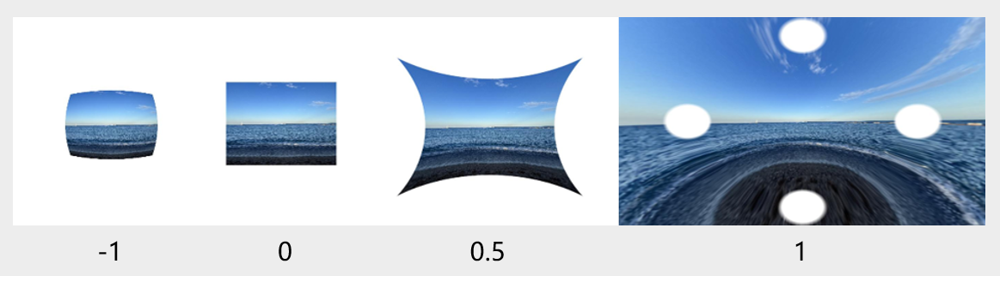

# @ohos.graphics.uiEffect (Cascading Effect) (System API)

<!--Kit: ArkGraphics 2D-->
<!--Subsystem: Graphics-->
<!--Owner: @hanamaru-->
<!--Designer: @chensiyi_CE-->
<!--Tester: @zhaoxiaoguang2-->
<!--Adviser: @ge-yafang-->
<!-- md-trans-meta sourceCommit=cb84f8fe2e38bbeba25c5506a75a0804a063c158 translatedAt=2026-07-16T09:13:32.431Z pushedAt=2026-07-17T13:41:54.757Z -->

This module provides basic capabilities for component effects, including blur, brightening, and more. Effects are categorized into the Filter and VisualEffect classes, and effects of the same class can be cascaded under an instance of that effect class. Using this module, you can quickly implement complex visual effects without needing to master underlying image processing algorithms, reducing development complexity and improving user experience. In actual development, blur can be used for background blurring, and brightening can be used for bright screen display, etc.

- [Filter](#filter): applies a filter to a component.

- [VisualEffect](#visualeffect): applies a visual effect to a component.

**Choosing Between Filter and VisualEffect:** The two classes belong to different effect categories and support different types of visual effects. Select the appropriate effect class based on the effect type required by your actual needs.

> **NOTE**
>
> - The initial APIs of this module are supported since API version 12. Newly added APIs will be marked with a superscript to indicate their earliest API version.
> - This page contains only the system APIs of this module. For other public APIs, see [ohos.graphics.uiEffect (Effect Cascading)](js-apis-uiEffect.md).
> - All APIs in this module rely on the existing content on the canvas for rendering. Unexpected results may occur when used together with APIs that have offscreen capabilities, such as the offscreen mode of [blendMode<sup>11+</sup>](../apis-arkui/arkui-ts/ts-universal-attributes-image-effect.md#blendmode11).

## Modules to Import

```ts
import { uiEffect } from "@kit.ArkGraphics2D";
```

## uiEffect.createBrightnessBlender

createBrightnessBlender(param: BrightnessBlenderParam): BrightnessBlender

Creates a **BrightnessBlender** instance, which can be used to apply the brightness effect to a component.

**Widget capability:** This API can be used in ArkTS widgets since API version 22.

**System capability**: SystemCapability.Graphics.Drawing

**System API**: This is a system API.

**Parameters**

| Name | Type                                             | Mandatory| Description                       |
| ------ | ------------------------------------------------- | ---- | --------------------------- |
| param  | [BrightnessBlenderParam](#brightnessblenderparam) | Yes   | Parameter for implementing the brightening effect, which contains configuration items such as the grayscale adjustment coefficient, saturation, and blend ratio. |

**Return value**

| Type                                    | Description                    |
| ---------------------------------------- | ----------------------- |
| [BrightnessBlender](#brightnessblender) | Returns a BrightnessBlender blender for the brightening effect. |

**Example**

```ts
// Create a BrightnessBlender instance to add a brightening effect to a component.
let blender : uiEffect.BrightnessBlender =
  uiEffect.createBrightnessBlender({cubicRate:1.0, quadraticRate:1.0, linearRate:1.0, degree:1.0, saturation:1.0,
    positiveCoefficient:[2.3, 4.5, 2.0], negativeCoefficient:[0.5, 2.0, 0.5], fraction:0.0})
```

## uiEffect.createHdrBrightnessBlender<sup>20+</sup>

createHdrBrightnessBlender(param: BrightnessBlenderParam): HdrBrightnessBlender

Creates an [HdrBrightnessBlender](#hdrbrightnessblender20) instance to add the HDR brightness effect to a component.

**System capability**: SystemCapability.Graphics.Drawing

**System API**: This is a system API.

**Parameters**

| Name | Type                                             | Mandatory| Description                       |
| ------ | ------------------------------------------------- | ---- | --------------------------- |
| param  | [BrightnessBlenderParam](#brightnessblenderparam) | Yes   | Parameter for implementing the brightening effect, including configuration items such as the grayscale adjustment coefficient, saturation, and blend ratio, used to configure the brightening effect. |

**Return value**

| Type                                    | Description                    |
| ---------------------------------------- | ----------------------- |
| [HdrBrightnessBlender](#hdrbrightnessblender20) | Returns a blender with the brightness effect (HDR supported).|

**Error codes**

For details about the following error codes, see [Universal Error Codes](../errorcode-universal.md).

| ID| Error Message|
| ------- | -------------------------------- |
| 202  | Permission verification failed. A non-system application calls a system API. |

**Example**

```ts
import { uiEffect } from '@kit.ArkGraphics2D'

// Create a BrightnessBlender instance that supports HDR.
let blender : uiEffect.HdrBrightnessBlender =
  uiEffect.createHdrBrightnessBlender({cubicRate:1.0, quadraticRate:1.0, linearRate:1.0, degree:1.0, saturation:1.0,
    positiveCoefficient:[2.3, 4.5, 2.0], negativeCoefficient:[0.5, 2.0, 0.5], fraction:0.0})

@Entry
@Component
struct Example {
  build() {
    RelativeContainer() {
      Image($r("app.media.screenshot"))
        .width("100%")
        .height("100%")
        .advancedBlendMode(blender)
    }
  }
}
```

## uiEffect.createHdrDarkenBlender

createHdrDarkenBlender(hdrBrightnessRatio: number, grayscaleFactor?: [number, number, number]): HdrDarkenBlender

Creates an [HdrDarkenBlender](#hdrdarkenblender) instance for the darkening blend effect on HDR layers.

**Since:** 26.0.0

**Model restriction:** This API can be used only in the stage model.

**System capability:** SystemCapability.Graphics.Drawing

**System API**: This is a system API.

**Parameters**

| Name               | Type                        | Mandatory  | Description                                                              |
| ------------------- | -------------------------- | ----  | ---------------------------------------------------------------- |
| hdrBrightnessRatio           | number                    | Yes   | Brightening factor for HDR.<br>Value range: [1.0, maximum brightening factor currently supported by the device].<br>If the value is set to less than 1.0, it is processed as 1.0.<br>When the value equals 1.0, the component retains its original brightness.<br>If the value is set to greater than the maximum brightening factor currently supported by the device, it is processed as the maximum brightening factor. The supported maximum brightening factor = maximum device brightness / default device brightness.<br>The maximum device brightness can be obtained using the hdc command: hdc shell param get const.display.brightness.max<br>The default device brightness can be obtained using the hdc command: hdc shell param get const.display.brightness.default                       |
| grayscaleFactor       | [number, number, number]                      | No   | Converts RGB colors to grayscale values. The weights in the grayscale conversion formula can be automatically adjusted based on the current color gamut, with different weight calculation methods used for different color gamuts. This is suitable for standard color gamut scenarios such as sRGB. Pass this parameter when you need to customize the grayscale conversion weights based on a specific color gamut or visual effect. The three components have no boundary limits. Default value: standard grayscale weights [0.299, 0.587, 0.114]. |

**Return value**

| Type                                   | Description                       |
| ---------------------------------------- | ------------------------- |
| [HdrDarkenBlender](#hdrdarkenblender) | Returns the HDR darken blender, which is used to apply the darkening effect to a specified component. |

**Error codes**

For details about the following error codes, see [Universal Error Codes](../errorcode-universal.md).

| ID | Error Message |
| ------- | -------------------------------- |
| 401  | CreateHdrDarkenBlender failed, parameter is null or undefined. |

**Example**

```ts
import { uiEffect } from '@kit.ArkGraphics2D'

// Create an HDR darken blender instance.
let blender : uiEffect.HdrDarkenBlender = 
  uiEffect.createHdrDarkenBlender(1.3, [0.299, 0.587, 0.114])

@Entry
@Component
struct Example {
  build() { 
    RelativeContainer() { 
      Stack(){ 
          Text("TextWord") 
          Image($r("app.media.screenshot")) 
            .width("100%") 
            .height("100%") 
            .advancedBlendMode(blender) 
      } 
    } 
  } 
}
```

## Filter

Filter effect class, which is used to apply effects such as blur, edge pixel extension, and water ripple to a component. Before calling any API in **Filter**, you must use [createFilter](js-apis-uiEffect.md#uieffectcreatefilter) to create a **Filter** instance.

### pixelStretch

pixelStretch(stretchSizes: Array\<number\>, tileMode: TileMode): Filter

Applies the pixel stretch effect onto the component.

**System capability**: SystemCapability.Graphics.Drawing

**System API**: This is a system API.

**Parameters**

| Name        | Type                 | Mandatory| Description                      |
| ------------- | --------------------- | ---- | ------------------------- |
| stretchSizes  | Array\<number\>         | Yes   | Percentage ratio for extending edge pixels in the top, bottom, left, and right directions. The value range is [-1, 1].<br>A positive value indicates outward extension, where the four directions are filled with edge pixels at the specified ratio of the original image. A negative value indicates inward contraction, but the final image size remains unchanged.<br>Note that the parameters for the four directions must be all non-positive or all non-negative; otherwise, the effect is invalid.|
| tileMode      | [TileMode](#tilemode) | Yes  | Pixel fill mode for edge pixel extension.|

**Return value**

| Type             | Description                              |
| ----------------- | --------------------------------- |
| [Filter](#filter) | **Filter** instance with the pixel stretch effect.|

**Example**

```ts
// Add the edge pixel extension effect to the component.
let filter = uiEffect.createFilter()
filter.pixelStretch([0.2, 0.2, 0.2, 0.2], uiEffect.TileMode.CLAMP)
```

### waterRipple

waterRipple(progress: number, waveCount: number, x: number, y: number, rippleMode: WaterRippleMode): Filter

Applies the ripple effect onto the component.

**System capability**: SystemCapability.Graphics.Drawing

**System API**: This is a system API.

**Parameters**

| Name        | Type                 | Mandatory| Description                      |
| ------------- | --------------------- | ---- | ------------------------- |
| progress  | number         | Yes  | Progress of the water ripple. Value range: [0, 1].<br>The closer the progress is to 1, the more complete the water ripple is displayed.<br>If the value is out of range, the water ripple does not take effect.|
| waveCount      | number | Yes  | Number of ripples during water ripple fluctuation. Value range: [1, 3].<br>The number of ripples must be an integer. If the value is a floating-point number or out of range, the water ripple does not take effect. |
| x      | number | Yes  | X-axis position where the center of the water ripple first appears on the screen.<br>The screen is normalized for the water ripple. The top-left corner is (0, 0), and the top-right corner is (1, 0).<br>A negative x value indicates that the position is to the left of the screen.|
| y      | number | Yes  | Y-axis position where the center of the water ripple first appears on the screen.<br>The screen is normalized for the water ripple. The top-left corner is (0, 0), and the bottom-left corner is (0, 1).<br>A negative y value indicates that the position is above the screen. |
| rippleMode      | [WaterRippleMode](#waterripplemode) | Yes  | Scene mode of the ripple effect.|

**Return value**

| Type             | Description                              |
| ----------------- | --------------------------------- |
| [Filter](#filter) | **Filter** instance with the ripple effect.|

**Error codes**

For details about the following error codes, see [Universal Error Codes](../errorcode-universal.md).

| ID| Error Message|
| ------- | -------------------------------- |
| 202  | Permission verification failed. A non-system application calls a system API. |

**Example**

```ts
// Add the water ripple effect to the component.
let filter = uiEffect.createFilter()
filter.waterRipple(0.5, 2, 0.5, 0.5, uiEffect.WaterRippleMode.SMALL2SMALL)
```

### flyInFlyOutEffect

flyInFlyOutEffect(degree: number, flyMode: FlyMode): Filter

Applies the fly-in/fly-out distortion effect to a component. Typical application scenarios include page transition animations, window entry/exit animations, dialog box pop-up animations, and list item entry/exit animations.

**System capability**: SystemCapability.Graphics.Drawing

**System API**: This is a system API.

**Parameters**

| Name        | Type                 | Mandatory| Description                      |
| ------------- | --------------------- | ---- | ------------------------- |
| degree  | number         | Yes   | Degree of the fly in/out deformation. Value range: [0, 1].<br>The closer to 1, the more obvious the deformation.<br>If the value is out of range, no deformation effect is applied.|
| flyMode      | [FlyMode](#flymode) | Yes   | Scenario mode of the fly in/out effect.<br>BOTTOM: fly in/out deformation from the bottom of the device.<br>TOP: fly in/out deformation from the top of the device. |

**Return value**

| Type             | Description                              |
| ----------------- | --------------------------------- |
| [Filter](#filter) | Returns a filter with the fly-in and fly-out animations.|

**Error codes**

For details about the following error codes, see [Universal Error Codes](../errorcode-universal.md).

| ID| Error Message|
| ------- | -------------------------------- |
| 202  | Permission verification failed. A non-system application calls a system API. |

**Example**

```ts
// Add the fly in/out transformation effect to the component.
let filter = uiEffect.createFilter()
filter.flyInFlyOutEffect(0.5, uiEffect.FlyMode.TOP)
```

### distort<sup>13+</sup>

distort(distortionK: number): Filter

Applies the lens distortion effect onto the component.

**System capability**: SystemCapability.Graphics.Drawing

**System API**: This is a system API.

**Parameters**

| Name        | Type                 | Mandatory| Description                      |
| ------------- | --------------------- | ---- | ------------------------- |
| distortionK  | number         | Yes  | Distortion coefficient, indicating the degree of lens distortion. The value range is [-1, 1]. A value less than -1 evaluates to the value **-1**. A value greater than 1 evaluates to the value **1**.|



The preceding figure shows the rendering results when different distortion coefficients (-1, 0, 0.5, and 1) are applied onto an **Image** component. A negative distortion value results in a barrel distortion, whereas a positive value results in a pincushion distortion. As the distortion value approaches 0, the intensity of the distortion decreases, and at exactly 0, there is no distortion effect.

**Return value**

| Type             | Description                              |
| ----------------- | --------------------------------- |
| [Filter](#filter) | Returns a filter with the lens distortion effect.|

**Error codes**

For details about the error codes, see [Universal Error Codes](../errorcode-universal.md).

| ID| Error Message|
| ------- | --------------------------------------------|
| 202 | Permission verification failed. A non-system application calls a system API. |

**Example**

```ts
// Add the lens distortion effect to the component.
let filter = uiEffect.createFilter()
filter.distort(-0.5)
```

### radiusGradientBlur<sup>19+</sup>

radiusGradientBlur(value: number, options: LinearGradientBlurOptions): Filter

Applies a radial linear gradient blur effect to the component.

**System capability**: SystemCapability.Graphics.Drawing

**System API**: This is a system API.

**Parameters**

| Name        | Type                 | Mandatory| Description                      |
| ------------- | --------------------- | ---- | ------------------------- |
| value  | number         | Yes   | Blur radius, in px. A larger blur radius indicates a higher blur degree. Value range: [0, 128]. If the blur radius is set to 0, no blur is applied. If the blur radius is set to a value less than 0, the value 0 is used. If the blur radius is set to a value greater than 128, the value 128 is used.|
| options  | [LinearGradientBlurOptions](../apis-arkui/arkui-ts/ts-universal-attributes-image-effect.md#lineargradientbluroptions12)         | Yes   | Linear gradient parameters, including two parts: fractionStops and direction.|

**Return value**

| Type             | Description                              |
| ----------------- | --------------------------------- |
| [Filter](#filter) | Returns a filter with the radial linear gradient blur effect.|

**Error codes**

For details about the error codes, see [Universal Error Codes](../errorcode-universal.md).

| ID| Error Message|
| ------- | --------------------------------------------|
| 202 | Permission verification failed. A non-system application calls a system API. |

**Example**

```ts
import { uiEffect } from '@kit.ArkGraphics2D'

@Entry
@Component
struct RadiusGradientBlurExample {
  @State blurRadiusExample: number = 64
  @State linearGradientBlurOptionsExample: LinearGradientBlurOptions =
    {fractionStops: [[0.0, 0.0], [1.0, 1.0]], direction: GradientDirection.Bottom}

  build() {
    Column() {
      Image($rawfile('test.png'))
        // Add a radius-based linear gradient blur effect to the component content.
        .compositingFilter(uiEffect.createFilter().radiusGradientBlur(this.blurRadiusExample,
          this.linearGradientBlurOptionsExample))
    }
  }
}
```

### bezierWarp<sup>20+</sup>

bezierWarp(controlPoints: Array<common2D.Point>): Filter

Applies the Bezier curve deformation effect to a component. This effect creates closed Bezier curves on the layer boundary to achieve precise distortion and shape adjustment of the image. The Bezier curve consists of four segments connected end to end, with each segment containing one vertex and two tangent points. Typical application scenarios include facial distortion effects and card perspective deformation.

**System capability**: SystemCapability.Graphics.Drawing

**System API**: This is a system API.

**Parameters**

| Name        | Type                 | Mandatory| Description                      |
| ------------- | --------------------- | ---- | ------------------------- |
| controlPoints  | Array<[common2D.Point](js-apis-graphics-common2D.md#point12)>| Yes   | 12 Bezier deformation control points. The array length must be 12. Changing the positions of the control points alters the curve shape of the edge, thereby distorting the image. The control point coordinates use a normalized coordinate system (default value range: [0, 1]), and the coordinate values can be greater than 1 or less than 0. The effect does not take effect when the array length is not 12.|

**Return value**

| Type             | Description                              |
| ----------------- | --------------------------------- |
| [Filter](#filter) | Returns a filter with the Bézier curve deformation effect.|

**Error codes**

For details about the error codes, see [Universal Error Codes](../errorcode-universal.md).

| ID| Error Message|
| ------- | --------------------------------------------|
| 202 | Permission verification failed. A non-system application calls a system API. |

**Example**

```ts
import { common2D, uiEffect } from '@kit.ArkGraphics2D'

@Entry
@Component
struct BezierWarpExample {
  @State valueBezier: Array<common2D.Point> = [
    { x: 0, y: 0 }, { x: 1 / 3, y: 0 }, { x: 2 / 3, y: 0 }, // top edge
    { x: 0.5, y: 0 }, { x: 0.5, y: 1 / 3 }, { x: 1, y: 2 / 3 }, // right edge
    { x: 1, y: 1 }, { x: 2 / 3, y: 1 }, { x: 1 / 3, y: 1 }, // bottom edge
    { x: 0, y: 1 }, { x: 0, y: 2 / 3 }, { x: 0, y: 1 / 3 }] // left edge

  build() {
    Column() {
      Image($rawfile('test.jpg'))
        // Add the Bezier curve deformation effect to the component.
        .foregroundFilter(uiEffect.createFilter().bezierWarp(this.valueBezier))
    }
  }
}
```

### colorGradient<sup>20+</sup>

colorGradient(colors: Array\<Color>, positions: Array\<common2D.Point>, strengths: Array\<number>, alphaMask?: Mask): Filter

Applies a color gradient effect to a component.

**System capability**: SystemCapability.Graphics.Drawing

**System API**: This is a system API.

**Parameters**

| Name        | Type                 | Mandatory| Description                      |
| ------------- | --------------------- | ---- | ------------------------- |
| colors  | Array\<[Color](#color20)>         | Yes   | Color array for multi-color gradient. The array length ranges from 0 to 12, and each color value must be greater than or equal to 0 with no upper limit. No effect is applied when the array length is 0 or greater than 12, or when the array lengths of colors, positions, and strengths are not equal.|
| positions  | Array\<[common2D.Point](js-apis-graphics-common2D.md#point12)>         | Yes   | Position array, indicating the distribution positions corresponding to the colors. The array length ranges from 0 to 12. No effect is applied when the array length is 0 or greater than 12, or when the array lengths of colors, positions, and strengths are not equal.|
| strengths  | Array\<number>         | Yes   | Strength array, indicating the diffusion intensity corresponding to the colors. The array length ranges from 0 to 12, and each strength value must be greater than or equal to 0 with no upper limit. No effect is applied when the array length is 0 or greater than 12, or when the array lengths of colors, positions, and strengths are not equal.|
| alphaMask  | [Mask](#mask20)         | No   | Mask that controls the opacity distribution of the gradient effect. A Mask instance can be created through Mask class creation methods (such as [createRippleMask](#createripplemask20) and [createRadialGradientMask](#createradialgradientmask20)). Pass this parameter when you need to control the opacity distribution of the color gradient effect (for example, partial transparency or dynamic transparency effects). If not set, the opacity of the color gradient effect is fully determined by the colors parameter.|

**Return value**

| Type             | Description                              |
| ----------------- | --------------------------------- |
| [Filter](#filter) | Returns a filter with the color gradient effect.|

**Error codes**

For details about the error codes, see [Universal Error Codes](../errorcode-universal.md).

| ID| Error Message|
| ------- | --------------------------------------------|
| 202 | Permission verification failed. A non-system application calls a system API. |

**Example**

```ts
import { common2D, uiEffect } from '@kit.ArkGraphics2D'

@Entry
@Component
struct ColorGradientExample {
  @State gradientColors: Array<uiEffect.Color> = [
    {red: 1.0, green: 0.8, blue: 0.5, alpha: 0.8},
    {red: 1.0, green: 1.5, blue: 0.5, alpha: 1.0}
  ]

  @State gradientPositions: Array<common2D.Point> = [
    {x: 0.2, y: 0.2},
    {x: 0.8, y: 0.6}]

  @State gradientStrengths: Array<number> = [0.3, 0.3]

  build() {
    Column() {
      Row()
        .width("100%")
        .height("100%")
        // Add a color gradient effect to the component content.
        .backgroundFilter(uiEffect.createFilter().colorGradient(this.gradientColors, this.gradientPositions, this.gradientStrengths))
    }
  }
}
```

### contentLight<sup>20+</sup>

contentLight(lightPosition: common2D.Point3d, lightColor: common2D.Color, lightIntensity: number, displacementMap?: Mask): Filter

Applies a 3D lighting effect to a component.

**System capability**: SystemCapability.Graphics.Drawing

**System API**: This is a system API.

**Parameters**

| Name        | Type                 | Mandatory| Description                      |
| ------------- | --------------------- | ---- | ------------------------- |
| lightPosition | [common2D.Point3d](js-apis-graphics-common2D.md#point3d12) | Yes | Position of the light source in the component space. [-1, -1, 0] represents the upper left corner of the component, and [1, 1, 0] represents the lower right corner. A larger z-axis component means the light source is farther from the component plane, resulting in a larger illuminated area.<br> The x component value range is [-10, 10], the y component value range is [-10, 10], and the z component value range is [0, 10]. Values outside these ranges are automatically truncated. |
| lightColor | [common2D.Color](js-apis-graphics-common2D.md#color) | Yes | Color of the light source. The value range of each RGBA component is [0, 1]. Values outside this range are automatically truncated. |
| lightIntensity | number | Yes | Intensity of the light source. The value range is [0, 1]. A larger value indicates higher brightness. Values outside this range are automatically truncated.|
| displacementMap | [Mask](#mask20) | No | Displacement map parameter. This parameter is not yet effective and is not recommended. No impact on functionality when not set. |

**Return value**

| Type             | Description                              |
| ----------------- | --------------------------------- |
| [Filter](#filter) | Returns a Filter with the content lighting effect. |

**Error codes**

For details about the error codes, see [Universal Error Codes](../errorcode-universal.md).

| ID| Error Message|
| ------- | --------------------------------------------|
| 202 | Permission verification failed. A non-system application calls a system API. |

**Example**

```ts
import { common2D, uiEffect } from '@kit.ArkGraphics2D'

@Entry
@Component
struct Index {
  @State contentLightPosition: common2D.Point3d = {
    x: 0, y: 0, z: 2
  }
  @State contentLightColor: common2D.Color = {
    red: 1,
    green: 1,
    blue: 1,
    alpha: 1
  }
  @State lightIntensity: number = 1

  build() {
    Column() {
      Stack() {
        Image($r('app.media.man'))
          .width('646px')
          .height('900px')
          .borderRadius(10)
          // Add 3D lighting effect to the component content.
          .foregroundFilter(uiEffect.createFilter().contentLight(this.contentLightPosition, this.contentLightColor, this.lightIntensity))
      }
      .width('100%')
      .height('55%')
    }
    .height('100%')
    .width('100%')
    .justifyContent(FlexAlign.Center)
    .backgroundColor('#555')
  }
}
```

### edgeLight<sup>20+</sup>

edgeLight(alpha: number, color?: Color, mask?: Mask, bloom?: boolean): Filter

Detects edges in the component content and applies an edge highlight effect. This effect automatically detects the edge contours of the component content and overlays a highlight stroke.

**System capability**: SystemCapability.Graphics.Drawing

**System API**: This is a system API.

**Parameters**

| Name        | Type                 | Mandatory| Description                      |
| ------------- | --------------------- | ---- | ------------------------- |
| alpha  | number         | Yes  | Specifies the highlight alpha value of the edge. A larger value indicates more obvious edges. The value range is [0,1]. The value **0** disables the edge highlight effect. Negative values default to **0**, while values above **1** cap at **1**.|
| color  | [Color](#color20) | No   | Stroke highlight color. The value range of each RGB component is [0, +∞). Pass this parameter when you need to customize the stroke highlight color (for example, to emphasize a specific color effect). If not set, the original color of the component content is used by default. When the color parameter is set, the alpha in Color does not take effect, and only RGB is used.|
| mask  | [Mask](#mask20) | No   | Stroke highlight intensity mask. A Mask instance can be created through Mask class creation methods (such as [createRippleMask](#createripplemask20), [createRadialGradientMask](#createradialgradientmask20), etc.). Pass this parameter when you need to control the effective area of the stroke highlight effect (for example, local highlight instead of global highlight). If not set, the stroke highlight effect is applied to all component content by default.|
| bloom  | boolean | No   | Whether the stroke glows. Set to true when you need to enhance the visual effect; set to false when a simple stroke effect is desired. If not set, the default value is true (with glow effect). For images smaller than 16×16, only the stroke effect is applied by default without glow, and this parameter has no effect. |

**Return value**

| Type             | Description                              |
| ----------------- | --------------------------------- |
| [Filter](#filter) | Returns a filter with the edge highlight and glow effects.|

**Error codes**

For details about the error codes, see [Universal Error Codes](../errorcode-universal.md).

| ID| Error Message|
| ------- | --------------------------------------------|
| 202 | Permission verification failed. A non-system application calls a system API. |

**Example**

```ts
import { uiEffect } from '@kit.ArkGraphics2D'

@Entry
@Component
struct EdgeLightExample {
  @State edgeLightColor: uiEffect.Color = {red: 0.0, green: 1.0, blue: 0.0, alpha: 1.0}
  
  @State edgeLightMask: uiEffect.Mask = uiEffect.Mask.createRippleMask({x: 0.5, y: 0.5}, 0.2, 0.5, 0.5)
  
  build() {
    Stack() {
      Image($rawfile('test.png'))
      Row()  
        .width("100%")
        .height("100%")
        // Detect edges for the component content and add an edge highlighting effect.
        .backgroundFilter(uiEffect.createFilter().edgeLight(1.0, this.edgeLightColor, this.edgeLightMask, false))
    }
  }
}
```

### displacementDistort<sup>20+</sup>

displacementDistort(displacementMap: Mask, factor?: [number, number]): Filter

Applies a distortion effect to a component.

**System capability**: SystemCapability.Graphics.Drawing

**System API**: This is a system API.

**Parameters**

| Name        | Type                 | Mandatory| Description                      |
| ------------- | --------------------- | ---- | ------------------------- |
| displacementMap | [Mask](#mask20) | Yes  | Displacement map used to control the direction and intensity of distortion. A Mask instance can be created through Mask class creation methods (such as [createRippleMask](#createripplemask20) and [createPixelMapMask](#createpixelmapmask20)). The distortion degree is determined by the product of this parameter and factor. |
| factor  | [number, number] | No  | Distortion coefficient in the horizontal and vertical directions. This parameter is passed when the direction and intensity of distortion need to be controlled (such as unidirectional distortion or differential distortion). A larger absolute value of the coefficient indicates a more obvious distortion effect. The recommended value range is [-10.0, 10.0]. If not set, the default value is [1.0, 1.0], which means the default distortion intensity is applied in both the horizontal and vertical directions. When set to [0.0, 0.0], no distortion effect is applied. The grayscale value of the Mask controls the direction and intensity of distortion. The final distortion degree is determined by the product of factor and the Mask grayscale value, that is, actual distortion value = Mask grayscale value × factor value. |

**Return value**

| Type             | Description                              |
| ----------------- | --------------------------------- |
| [Filter](#filter) | Returns a filter with the distortion effect.|

**Error codes**

For details about the error codes, see [Universal Error Codes](../errorcode-universal.md).

| ID| Error Message|
| ------- | --------------------------------------------|
| 202 | Permission verification failed. A non-system application calls a system API. |

**Example**

```ts
import { uiEffect } from '@kit.ArkGraphics2D'

@Entry
@Component
struct DisplacementDistortExample {
  @State distortMask: uiEffect.Mask = uiEffect.Mask.createRippleMask({x: 0.5, y: 0.5}, 0.2, 0.3, 0.0)
  
  build() {
    Stack() {
      Image($rawfile('test.png'))
      Row()  
        .width("100%")
        .height("100%")
        // Add a distortion effect to the component content.
        .backgroundFilter(uiEffect.createFilter().displacementDistort(this.distortMask, [5.0, 5.0]))
    }
  }
}
```

### maskDispersion<sup>20+</sup>

maskDispersion(dispersionMask: Mask, alpha: number, rFactor?: [number, number], gFactor?: [number, number], bFactor?: [number, number]): Filter

Applies a dispersion effect controlled by a displacement map to the component content, simulating the dispersion phenomenon when light passes through a prism. Typical application scenarios include colorful special effects and prism refraction simulation.

**System capability**: SystemCapability.Graphics.Drawing

**System API**: This is a system API.

**Parameters**

| Name        | Type                 | Mandatory| Description                      |
| ------------- | --------------------- | ---- | ------------------------- |
| dispersionMask  | [Mask](#mask20)         | Yes   | Displacement mask used to control the intensity, direction, and transparency of dispersion. It is recommended to use a PixelMapMask-type displacement mask, which allows fine-grained control over the dispersion area and intensity through a custom image texture. A Mask instance can be created using the [createPixelMapMask](#createpixelmapmask20) method.|
| alpha  | number         | Yes  | Alpha value of dispersion. A smaller value makes the object more transparent. The value range is [0, 1.0]. The value **0** means the dispersion effect does not take effect. Negative values default to **0**, while values above **1.0** cap at **1.0**.|
| rFactor  | [number, number]         | No   | Base dispersion offset of the R channel in the X/Y directions. Pass this parameter to customize the dispersion intensity and direction of the red channel. A larger offset produces a more noticeable red dispersion effect. Default value: [0.0, 0.0], indicating no R channel dispersion offset. Value range: [-1.0, 1.0] for each direction. Values outside this range are automatically clamped.|
| gFactor  | [number, number]         | No   | Base dispersion offset of the G channel in the X/Y directions. Pass this parameter to customize the dispersion intensity and direction of the green channel. Default value: [0.0, 0.0], indicating no G channel dispersion offset. The value range is the same as rFactor, which is [-1.0, 1.0]. Values outside this range are automatically clamped.|
| bFactor  | [number, number]         | No   | Base dispersion offset of the B channel in the X/Y directions. Pass this parameter to customize the dispersion intensity and direction of the blue channel. Default value: [0.0, 0.0], indicating no B channel dispersion offset. The value range is the same as rFactor, which is [-1.0, 1.0]. Values outside this range are automatically clamped.|

**Return value**

| Type             | Description                              |
| ----------------- | --------------------------------- |
| [Filter](#filter) | Returns the filter that mounts the dispersion effect controlled by the displacement map.|

**Error codes**

For details about the error codes, see [Universal Error Codes](../errorcode-universal.md).

| ID| Error Message|
| ------- | --------------------------------------------|
| 202 | Permission verification failed. A non-system application calls a system API. |

**Example**

```ts
import {image} from '@kit.ImageKit'
import {common2D, uiEffect} from '@kit.ArkGraphics2D'
import {common} from '@kit.AbilityKit'

@Entry
@Component
struct MaskDispersion {
  @State pixelMap: PixelMap | null = null
  @State src: common2D.Rect = { left: 0, top: 0, right: 1.0, bottom: 1.0 }
  @State dst: common2D.Rect = { left: 0, top: 0, right: 1.0, bottom: 1.0 }
  @State fillColor: uiEffect.Color = { red: 0, green: 0, blue: 0, alpha: 0 }

  onPageShow(): void {
    let context = this.getUIContext().getHostContext() as common.UIAbilityContext
    context.resourceManager.getMediaByName("mask_alpha").then(val => {
      let buffer = val.buffer.slice(0, val.buffer.byteLength)
      let imageSource = image.createImageSource(buffer);
      imageSource.createPixelMap().then(pixelMap => {
        this.pixelMap = pixelMap
      })
    })
  }
  
  build() {
    if (this.pixelMap) {
      Stack() {
        Image($rawfile('test.png'))
        Row()  
          .width('100%')
          .height('100%')
          // Add a dispersion effect controlled by a displacement map to the component content.
          .backgroundFilter(uiEffect.createFilter().maskDispersion(
            uiEffect.Mask.createPixelMapMask(this.pixelMap!, this.src, this.dst, this.fillColor),
            1.0,
            [0.5, -0.5],
            [0.0, 0.0],
            [-0.5, 0.5]))
      }
    } else {
      Stack() {
        Image($rawfile('test.png'))
      }
    }
  }
}
```

### maskTransition<sup>20+</sup>

maskTransition(alphaMask: Mask, factor?: number, inverse?: boolean): Filter

Provides a transition effect based on [Mask](#mask20) for the component content, which can be used in scenarios such as page transition animations and scene transition effects.

You are not advised to use this effect when the screen size changes, for example, rotating the screen or opening and closing the foldable screen.

**System capability**: SystemCapability.Graphics.Drawing

**System API**: This is a system API.

**Parameters**

| Name        | Type                 | Mandatory| Description                      |
| ------------- | --------------------- | ---- | ------------------------- |
| alphaMask     | [Mask](#mask20)       | Yes  | Specifies the area where the transition effect applies through a mask. A Mask instance can be created using Mask class creation methods (such as [createRippleMask](#createripplemask20), [createRadialGradientMask](#createradialgradientmask20), etc.). The grayscale value of the Mask determines the intensity of the transition effect, with areas of higher grayscale values showing more pronounced transition effects.|
| factor        | number                | No   | Transition coefficient. Pass this parameter when you need to control the transition progress (such as during animation or dynamic adjustment). A larger value makes the image closer to the post-transition page. When not set, the default value is **1.0** (transition complete state). Value range: [0.0, 1.0]. Values outside this range are automatically truncated to [0.0, 1.0]. |
| inverse       | boolean               | No   | Whether to enable reverse transition. Set to **true** when a reverse transition effect is needed (such as transitioning from the post-page to the pre-page); set to **false** when a forward transition effect is needed (transitioning from the pre-page to the post-page). The default value is **false** (forward transition). |

**Return value**

| Type             | Description                              |
| ----------------- | --------------------------------- |
| [Filter](#filter) | Returns a filter with the transition effect.|

**Error codes**

For details about the error codes, see [Universal Error Codes](../errorcode-universal.md).

| ID| Error Message|
| ------- | --------------------------------------------|
| 202 | Permission verification failed. A non-system application calls a system API. |

**Example**

```ts
import { uiEffect, common2D } from "@kit.ArkGraphics2D";

@Entry
@Component
struct Index {
  context = this.getUIContext()
  @State alpha: number = 0
  @State enterNewPage:boolean = false
  @State rippleMaskCenter: common2D.Point = {x:0.5, y:0.5}
  @State rippleMaskRadius: number = 0.1
  build() {
    Stack() {
      // Page before the transition.
      Image($r("app.media.before")).width("100%").height("100%")
        if (this.enterNewPage) {
          // Page after the transition.
          Column().width("100%").height("100%").backgroundImage($r("app.media.after"))
            // Provide a mask-based transition effect for the component content.
            .backgroundFilter(uiEffect.createFilter()
              .maskTransition(
                uiEffect.Mask.createRadialGradientMask(this.rippleMaskCenter, this.rippleMaskRadius,this.rippleMaskRadius, [[1, 0], [1, 1]]),
                this.alpha))
            .onAppear(() => {
              this.context.animateTo({ duration: 1000 }, () => {
                this.rippleMaskRadius = 1.3
              })
              this.context.animateTo({ duration: 800 }, () => {
                this.alpha = 1
              })
            })
        }
    }.borderWidth(2)
    .onClick(()=>{
      this.enterNewPage=!this.enterNewPage;
      if (this.enterNewPage) {
        this.alpha=0;
        this.rippleMaskRadius=0.1;
      }
    })
  }
}
```

### directionLight<sup>20+</sup>

directionLight(direction: common2D.Point3d, color: Color, intensity: number, mask?: Mask, factor?: number): Filter

Provides an illumination effect based on [Mask](#mask20) and parallel light for the component content. The parallel light illuminates the component plane from a uniform direction, with all light rays having the same direction and no attenuation due to distance. The illumination intensity is evenly distributed across the component, making it suitable for simulating distant light sources such as sunlight. Unlike the point light source of contentLight, parallel light does not require specifying the exact position of the light source. The Mask can be used to control illumination details, and the factor can be used in combination with a height map to enhance the embossment effect.

**System capability**: SystemCapability.Graphics.Drawing

**System API**: This is a system API.

**Parameters**

| Name        | Type                 | Mandatory| Description                      |
| ------------- | --------------------- | ---- | ------------------------- |
| direction  | [common2D.Point3d](js-apis-graphics-common2D.md#point3d12)         | Yes   | Direction of the incident light, represented by 3D coordinates.|
| color  | [Color](#color20)         | Yes  | Light color.|
| intensity  | number         | Yes   | Light intensity. The value range is [0, +∞). A larger value indicates greater light source brightness.|
| mask  | [Mask](#mask20)         | No   | Displacement map used to describe 3D details on a 2D image surface. A Mask instance can be created through Mask class creation methods (such as [createRippleMask](#createripplemask20) and [createRadialGradientMask](#createradialgradientmask20)). Pass this parameter when local details and light reflection effects (such as embossing and bump textures) need to be enhanced. It is implemented through normal maps or height maps. If the input is a height map, it must be used together with the factor parameter. When not set, it defaults to empty, resulting in a flat lighting effect without global details.|
| factor  | number         | No   | Sampling scale factor. Pass this parameter when a height map is used as the mask and height scaling needs to be controlled. When not set, the mask is directly used as a normal map for sampling. When a value is set, the mask is used as a height map for sampling, and the actual height value is the product of the mask sampling value and the factor.|

**Return value**

| Type             | Description                              |
| ----------------- | --------------------------------- |
| [Filter](#filter) | Returns the filter that mounts the lighting effect controlled by the displacement map.|

**Error codes**

For details about the error codes, see [Universal Error Codes](../errorcode-universal.md).

| ID| Error Message|
| ------- | --------------------------------------------|
| 202 | Permission verification failed. A non-system application calls a system API. |

**Example**

```ts
import { uiEffect, common2D } from "@kit.ArkGraphics2D";

@Entry
@Component
struct Index {
  @State rippleMaskCenter: common2D.Point = {x:0.5, y:0.5}
  @State rippleMaskRadius: number = 0.0
  @State rippleMaskWidth: number = 0.0
  @State color: Color = Color.Transparent

  build() {
    Column() {
      RelativeContainer() {
        Image($r("app.media.back")).width("100%").height("100%")
        Stack()
          .width("100%")
          .height("100%")
          .backgroundColor(this.color)
          // Provide a lighting effect based on mask and parallel light for the component content.
          .backgroundFilter(uiEffect.createFilter()
            .directionLight(
              {x:0, y:0, z:-1}, {red:2.0, green:2.0, blue:2.0, alpha:1.0}, 0.5,
              uiEffect.Mask.createRippleMask(this.rippleMaskCenter, this.rippleMaskRadius, this.rippleMaskWidth, 0.0)
              ))
          .onClick(() => {
            this.getUIContext().animateTo({duration: 1000}, () => {
              this.rippleMaskWidth = 1.0;
            })
          })
      }
    }.alignItems(HorizontalAlign.Center).borderWidth(2)
  }
}
```

### variableRadiusBlur<sup>20+</sup>

variableRadiusBlur(radius: number, radiusMap: Mask): Filter

Provides a gradient blur effect based on [Mask](#mask20) for the component content.

**System capability**: SystemCapability.Graphics.Drawing

**System API**: This is a system API.

**Parameters**

| Name        | Type                 | Mandatory| Description                      |
| ------------- | --------------------- | ---- | ------------------------- |
| radius  | number         | Yes   | Maximum blur radius, in px. A larger value indicates a greater blur effect. The value range is [0, 128]. If the blur radius is set to 0, no blur is applied. If the blur radius is set to a value less than 0, the value 0 is used. If the blur radius is set to a value greater than 128, the value 128 is used.|
| radiusMap  |  [Mask](#mask20)    | Yes   | Mask object that represents the blur intensity. The grayscale value of the Mask represents the blur intensity at the corresponding position. A larger grayscale value indicates a greater blur effect.|

**Return value**

| Type             | Description                              |
| ----------------- | --------------------------------- |
| [Filter](#filter) | Returns the filter object of the current effect.|

**Error codes**

For details about the error codes, see [Universal Error Codes](../errorcode-universal.md).

| ID| Error Message|
| ------- | --------------------------------------------|
| 202 | Permission verification failed. A non-system application calls a system API. |

**Example**

```ts
import { uiEffect } from '@kit.ArkGraphics2D';

@Entry
@Component
struct VariableRadiusBlurExample {
  @State blurMask: uiEffect.Mask = uiEffect.Mask.createRippleMask({x: 0.5, y: 0.5}, 0.2, 0.1)

  build() {
    Stack() {
      Image($rawfile('test.png'))
      Row()
        .width('100%')
        .height('100%')
        // Provide a mask-based gradient blur effect for the component content.
        .backgroundFilter(uiEffect.createFilter().variableRadiusBlur(64, this.blurMask))
    }
  }
}
```

### heatDistortion

heatDistortion(param: HeatDistortionEffectParam): Filter

Applies the heat distortion effect to an image, simulating the visual distortion caused by hot air flow.

**Since:** 26.0.0

**Model restriction:** This API can be used only in the stage model.

**System API**: This is a system API.

**System capability:** SystemCapability.Graphics.Drawing

**Parameters**

| Name | Type | Mandatory | Description |
| ---- | ---- | ---- | ---- |
| param | [HeatDistortionEffectParam](#heatdistortioneffectparam) | Yes | Parameters of the heat distortion effect. |

**Return value**

| Type | Description |
| ---- | ---- |
| [Filter](#filter) | Returns the filter with the heat distortion effect applied. |

**Example**

```ts
import { uiEffect } from '@kit.ArkGraphics2D';

@Entry
@Component
struct HeatDistortionExample {
  @State intensity: number = 0.8;
  @State noiseScale: number = 2.0;
  @State riseWeight: number = 0.5;
  @State progress: number = 0.3;

  build() {
    Stack() {
      Image($r('app.media.test'))
        .width('100%')
        .height('100%')
        // Apply the heat distortion effect to the image, simulating the visual distortion caused by hot air flow.
        .foregroundFilter(uiEffect.createFilter().heatDistortion({
          intensity: this.intensity,
          noiseScale: this.noiseScale,
          riseWeight: this.riseWeight,
          progress: this.progress
        }))
    }
    .width('100%')
    .height('100%')
  }
}
```

### blurBubblesRise

blurBubblesRise(param: BlurBubblesRiseEffectParam): Filter

Applies the blur bubbles rise effect to an image, simulating the dreamy blur distortion effect of bubbles rising in a liquid.

**Since:** 26.0.0

**Model restriction:** This API can be used only in the stage model.

**System API**: This is a system API.

**System capability:** SystemCapability.Graphics.Drawing

**Parameters**

| Name | Type | Mandatory | Description |
| ---- | ---- | ---- | ---- |
| param | [BlurBubblesRiseEffectParam](#blurbubblesriseeffectparam) | Yes | Parameters of the blur bubbles rise effect. |

**Return value**

| Type | Description |
| ---- | ---- |
| [Filter](#filter) | Returns the filter with the blur bubbles rise effect applied. |

**Example**

```ts
import { uiEffect } from '@kit.ArkGraphics2D';
import { image } from '@kit.ImageKit';

@Entry
@Component
struct BlurBubblesRiseExample {
  private context: Context | undefined = this.getUIContext().getHostContext();
  @State blurIntensity: number = 0.8;
  @State mixStrength: number = 0.6;
  @State progress: number = 0.5;
  @State maskImage: image.PixelMap | null = null;

  aboutToAppear() {
    if (this.context) {
      this.getImagePixelMap(this.context)
    }
  }

  getImagePixelMap(context: Context) {
    let resourceMgr = context.resourceManager;
    resourceMgr?.getMediaContent($r('app.media.drawBlurMask').id)
      .then((val: Uint8Array) => {
        let buffer: ArrayBuffer = val.buffer.slice(0, val.buffer.byteLength)
        let imageSource: image.ImageSource = image.createImageSource(buffer);
        imageSource.createPixelMap().then((pixelmap: image.PixelMap) => {
          this.maskImage = pixelmap as PixelMap;
        })
      })
  }

  build() {
    Stack() {
      Image($r('app.media.test'))
        .width('100%')
        .height('100%')
        // Apply the blur bubbles rise effect to the image, simulating the dreamy blur distortion effect of bubbles rising in liquid.
        .foregroundFilter(uiEffect.createFilter().blurBubblesRise({
          blurIntensity: this.blurIntensity,
          mixStrength: this.mixStrength,
          progress: this.progress,
          maskImage: this.maskImage
        }))
    }
    .width('100%')
    .height('100%')
  }
}
```

## TileMode

Enumerates the pixel tiling modes.

**System capability**: SystemCapability.Graphics.Drawing

**System API**: This is a system API.

| Name  | Value| Description|
| ------ | - | ---- |
| CLAMP  | 0 | Clamp.|
| REPEAT | 1 | Repeat.|
| MIRROR | 2 | Mirror.|
| DECAL  | 3 | Decal.|

## WaterRippleMode

Enumerates the scene modes of the ripple effect.

**System capability**: SystemCapability.Graphics.Drawing

**System API**: This is a system API.

| Name  | Value| Description|
| ------ | - | ---- |
| SMALL2MEDIUM_RECV  | 0 | A phone taps against a 2-in-1 device (receiver).|
| SMALL2MEDIUM_SEND  | 1 | A phone taps against a 2-in-1 device (sender).|
| SMALL2SMALL | 2 | A phone taps against another phone.|
| MINI_RECV<sup>17+</sup> | 3 | A 2-in-1 device shares data (keyboard and mouse) with other devices.|

## FlyMode

Enumerates the scene modes of fly-in and fly-out animations.

**System capability**: SystemCapability.Graphics.Drawing

**System API**: This is a system API.

| Name  | Value| Description|
| ------ | - | ---- |
| BOTTOM  | 0 | Fly-in and fly-out animations occur from the bottom of the screen.|
| TOP  | 1 | Fly-in and fly-out animations occur from the top of the screen.|

## VisualEffect

VisualEffect class, which is used to apply effects such as background color blending, border illumination, and color gradient to a component. Before calling any API in **VisualEffect**, you must use [createEffect](js-apis-uiEffect.md#uieffectcreateeffect) to create a **VisualEffect** instance.

### backgroundColorBlender

backgroundColorBlender(blender: BrightnessBlender): VisualEffect

A blender used to change the background color of a component. Currently, only the brightness blender is supported.

**System capability**: SystemCapability.Graphics.Drawing

**System API**: This is a system API.

**Parameters**

| Name | Type                                     | Mandatory| Description                      |
| ------- | ---------------------------------------- | ---- | ------------------------- |
| blender | [BrightnessBlender](#brightnessblender) | Yes  | Blender used to change the background color.|

**Return value**

| Type                         | Description                                              |
| ----------------------------- | ------------------------------------------------- |
| [VisualEffect](#visualeffect) | Returns a **VisualEffect** object with the background color change effect.|

**Example**

```ts
import { uiEffect } from '@kit.ArkGraphics2D'
let blender : uiEffect.BrightnessBlender =
  uiEffect.createBrightnessBlender({cubicRate:1.0, quadraticRate:1.0, linearRate:1.0, degree:1.0, saturation:1.0,
    positiveCoefficient:[2.3, 4.5, 2.0], negativeCoefficient:[0.5, 2.0, 0.5], fraction:0.0})
let visualEffect = uiEffect.createEffect();
// Add the blender to the component to change the component background color.
visualEffect.backgroundColorBlender(blender)
```

### borderLight<sup>20+</sup>

borderLight(lightPosition: common2D.Point3d, lightColor: common2D.Color, lightIntensity: number, borderWidth: number): VisualEffect

Adds a 3D lighting effect to the border of a rounded rectangle component.

**System capability**: SystemCapability.Graphics.Drawing

**System API**: This is a system API.

**Parameters**

| Name        | Type                 | Mandatory| Description                      |
| ------------- | --------------------- | ---- | ------------------------- |
| lightPosition | [common2D.Point3d](js-apis-graphics-common2D.md#point3d12) | Yes | 3D position of the light source in the component space. [-1, -1, 0] represents the upper left corner of the component, and [1, 1, 0] represents the lower right corner. A larger z-axis component means the light source is farther from the component plane, resulting in a larger illuminated area.<br> Value range of the x-axis component: [-10, 10]; value range of the y-axis component: [-10, 10]; value range of the z-axis component: [0, 10]. Values outside these ranges are automatically truncated. |
| lightColor | [common2D.Color](js-apis-graphics-common2D.md#color) | Yes| Light color. The value range of each element is [0, 1]. If the value is out of the range, it will be automatically truncated.|
| lightIntensity | number | Yes | Light source intensity. Value range: [0, 1]. A larger value indicates higher brightness. Values outside this range are automatically truncated.|
| borderWidth | number | Yes| Lighting width of the component border. The value range is [0.0, 30.0]. If the value is out of the range, it will be automatically truncated. The value **0.0** means that the component border is not lightened. A larger value indicates a wider lightened area.|

**Return value**

| Type             | Description                              |
| ----------------- | --------------------------------- |
| [VisualEffect](#visualeffect) | Returns a **VisualEffect** object with the lighting effect on the border.|

**Error codes**

For details about the error codes, see [Universal Error Codes](../errorcode-universal.md).

| ID| Error Message|
| ------- | --------------------------------------------|
| 202 | Permission verification failed. A non-system application calls a system API. |

**Example**

```ts
import { common2D, uiEffect } from '@kit.ArkGraphics2D'

@Entry
@Component
struct Index {
  @State borderLightPosition: common2D.Point3d = {
    x: 0, y: 0, z: 2
  }
  @State borderLightColor: common2D.Color = {
    red: 1, green: 1, blue: 1, alpha: 1
  }
  @State lightIntensity: number = 1
  @State borderWidth_: number = 20

  build() {
    Column() {
      Stack() {
        Image($r('app.media.man'))
          .width('646px')
          .height('900px')
          .borderRadius(10)
        Column()
          .width('646px')
          .height('900px')
          .borderRadius(10)
          // Add 3D lighting effect to the border of a rounded rectangle component.
          .visualEffect(uiEffect.createEffect().borderLight(this.borderLightPosition, this.borderLightColor, this.lightIntensity,
            this.borderWidth_))
      }
      .width('100%')
      .height('55%')
    }
    .height('100%')
    .width('100%')
    .justifyContent(FlexAlign.Center)
    .backgroundColor('#555')
  }
}
```

### colorGradient<sup>20+</sup>

colorGradient(colors: Array\<Color>, positions: Array\<common2D.Point>, strengths: Array\<number>, alphaMask?: Mask): VisualEffect

Applies a color gradient effect to a component.

**System capability**: SystemCapability.Graphics.Drawing

**System API**: This is a system API.

**Parameters**

| Name        | Type                 | Mandatory| Description                      |
| ------------- | --------------------- | ---- | ------------------------- |
| colors  | Array\<[Color](#color20)>         | Yes   | Color array used to implement multi-color gradients. The array length ranges from 0 to 12. Each color value must be greater than or equal to 0, with no upper limit. If the array length is 0 or greater than 12, or the array lengths of colors, positions, and strengths are inconsistent, no color gradient effect is applied.|
| positions  | Array\<[common2D.Point](js-apis-graphics-common2D.md#point12)>         | Yes  | Position array, which is the positions of colors. The array length ranges from 0 to 12. If the array length is 0 or greater than 12, or the lengths of the **colors**, **positions**, and **strengths** arrays are inconsistent, no color gradient effect is displayed.|
| strengths  | Array\<number>         | Yes   | Strength array that indicates the intensity corresponding to each color. The array length ranges from 0 to 12. Each strength value must be greater than or equal to 0, with no upper limit. If the array length is 0 or greater than 12, or the array lengths of colors, positions, and strengths are inconsistent, no color gradient effect is applied.|
| alphaMask  | [Mask](#mask20)         | No   | Alpha mask, which is the alpha mask corresponding to the color. A Mask instance can be created through Mask class creation methods such as [createRippleMask](#createripplemask20) and [createRadialGradientMask](#createradialgradientmask20). Pass this parameter when you need to control the transparency distribution of the color gradient effect, for example, for local transparency or dynamic transparency effects. If not set, the transparency of the color gradient effect is entirely determined by the colors parameter.|

**Return value**

| Type             | Description                              |
| ----------------- | --------------------------------- |
| [VisualEffect](#visualeffect) | Returns a **VisualEffect** object with the color gradient effect.|

**Error codes**

For details about the error codes, see [Universal Error Codes](../errorcode-universal.md).

| ID| Error Message|
| ------- | --------------------------------------------|
| 202 | Permission verification failed. A non-system application calls a system API. |

**Example**

```ts
import { common2D, uiEffect } from '@kit.ArkGraphics2D'

@Entry
@Component
struct ColorGradientExample {
  build() {
    Stack() {
      Stack() {}
      // Adds a color gradient effect to the component.
      .visualEffect(uiEffect.createEffect()
        .colorGradient(
          [
            {red: 1.0, green: 0.0, blue: 0.0, alpha: 1.0},
            {red: 0.0, green: 1.0, blue: 0.0, alpha: 1.0},
            {red: 0.0, green: 0.0, blue: 1.0, alpha: 1.0},
            {red: 1.0, green: 1.0, blue: 1.0, alpha: 1.0},
          ],
          [
            {x: 0.1, y: 0.1},
            {x: 0.1, y: 0.9},
            {x: 0.9, y: 0.1},
            {x: 0.9, y: 0.9},
          ],
          [12.4, 7.8, 7.8, 10.0],
          uiEffect.Mask.createRippleMask({x: 0.5, y: 0.5}, 0.2, 0.1)
        )
      )
      .width("1024px")
      .height("1024px")
    }
    .width("100%")
    .height("100%")
  }
}
```

### liquidMaterial<sup>22+</sup>

liquidMaterial(param: LiquidMaterialEffectParam, useEffectMask: Mask, distortMask?: Mask, brightnessParam?: BrightnessParam): VisualEffect

This method applies a material effect to a component. The material effect simulates the optical properties (refraction and reflection) and dynamic disturbance effects of physical materials to achieve the visual presentation of materials such as glass and metal. It can be used in scenarios such as simulating glass-textured UI, fluid material animations, and frosted glass effects.

**System capability**: SystemCapability.Graphics.Drawing

**System API**: This is a system API.

**Parameters**

| Name         | Type                                                     | Mandatory| Description                                                        |
| --------------- | --------------------------------------------------------- | ---- | ------------------------------------------------------------ |
| param           | [LiquidMaterialEffectParam](#liquidmaterialeffectparam22) | Yes  | Relevant variables required for the material, which are used to control material display. This parameter includes material toggle, refraction coefficient, reflection coefficient, and distortion coefficient.|
| useEffectMask   | [Mask](#mask20)                                           | Yes  | Whether to use blur cache. A Mask instance created using createUseEffectMask(true) uses blur cache, suitable for scenarios where blur results need to be reused to improve performance; a Mask instance created using createUseEffectMask(false) does not use blur cache, suitable for scenarios where the blur effect changes frequently. |
| distortMask     | [Mask](#mask20)                                           | No   | Distortion texture required for the material distortion effect. The image texture of the Mask instance created from pixelMap determines the pattern and direction of the distortion effect. A Mask instance can be created using the [createPixelMapMask](#createpixelmapmask20) method. When the material distortion factor (distortFactor) is not 0, this parameter must be set; otherwise, no distortion effect is produced. When the material distortion factor is 0 or this parameter is not set, no distortion effect is produced. Not set by default. |
| brightnessParam | [BrightnessParam](#brightnessparam22)                     | No   | Adds a brightening effect to the material. Pass this parameter when you need to enhance the visual brightness of the material (such as highlighting or glow effects). When not set, no brightening effect is added by default, and the material retains its original brightness.                     |

**Return value**

| Type                         | Description                            |
| ----------------------------- | -------------------------------- |
| [VisualEffect](#visualeffect) | Returns a **VisualEffect** object with the material effect.|

**Error codes**

For details about the error codes, see [Universal Error Codes](../errorcode-universal.md).

| ID| Error Message                                                    |
| -------- | ------------------------------------------------------------ |
| 202      | Permission verification failed. A non-system application calls a system API. |

**Example**

```ts
import { uiEffect } from '@kit.ArkGraphics2D';

@Entry
@Component
struct Index {
  @State distortProgress: number = 0.;
  @State rippleProgress: number = 0.;
  @State distortFactor: number = 0.;
  @State materialFactor: number = 1.;
  @State refractionFactor: number = 1.;
  @State reflectionFactor: number = 1.;
  @State tintColorR: number = 1.;
  @State tintColorG: number = 1.;
  @State tintColorB: number = 1.;
  @State tintColorA: number = 1.;

  private getMaterialVisualEffect(): uiEffect.VisualEffect {
    let effect: uiEffect.VisualEffect = uiEffect.createEffect();
    effect.liquidMaterial({
      enable: true,
      distortProgress : this.distortProgress,
      rippleProgress: this.rippleProgress,
      distortFactor: this.distortFactor,
      materialFactor : this.materialFactor,
      refractionFactor : this.refractionFactor,
      reflectionFactor: this.reflectionFactor,
      tintColor : [this.tintColorR, this.tintColorG, this.tintColorB, this.tintColorA],
      ripplePosition: undefined,
    },
      uiEffect.Mask.createUseEffectMask(true),
      );
    return effect;
  }

  build() {
    Stack() {
      EffectComponent() {
        Column()
          .position({ x: 200 + 'px', y: 200 + 'px' })
          .height(553 + 'px')
          .width(553 + 'px')
          .borderRadius(12)
          .visualEffect(this.getMaterialVisualEffect())
      }
      .backgroundEffect({
        radius: 15,
      }, { disableSystemAdaptation: true })
      .width("100%").height("100%").align(Alignment.Center)
    }
    .backgroundImage($r('app.media.bg6'), ImageRepeat.NoRepeat)
    .width("100%").height("100%").align(Alignment.Center)
  }
}
```

### distortionCollapse

distortionCollapse(distortionParam: DistortionParam): VisualEffect

Applies a nonlinear distortion effect to a component. Typical application scenarios include page collapse animations, window close effects, card flip animations, and scene transition effects.

> **NOTE**
>
> - This visual effect supports rendering beyond the component bounds, but it is still affected by the parent component's clipping.
> - Because it includes a foreground filter, when not used together with [EffectComponent](../apis-arkui/arkui-ts/ts-container-effectcomponent-sys.md), it is incompatible with certain visual effects of the component itself and its child components, such as [BrightnessBlender](#brightnessblender) or [systemMaterial](../apis-arkui/arkui-ts/ts-universal-attributes-image-effect-sys.md#systemmaterial23).
> - It supports distortion of system materials, but when used together with [EffectComponent](../apis-arkui/arkui-ts/ts-container-effectcomponent-sys.md), it causes distortion of the system material background.
> - When this API is called, an offscreen canvas of the same size as the distorted area is created, the content of the current component (including child components) is drawn onto the offscreen canvas, and then the component content drawn on the canvas is distorted. With this implementation, if not used together with [EffectComponent](../apis-arkui/arkui-ts/ts-container-effectcomponent-sys.md), APIs that require screen capture, such as [systemMaterial](../apis-arkui/arkui-ts/ts-universal-attributes-image-effect-sys.md#systemmaterial23), [backgroundEffect](../apis-arkui/arkui-ts/ts-universal-attributes-background.md#backgroundeffect19), [brightness](../apis-arkui/arkui-ts/ts-universal-attributes-image-effect.md#brightness), or [blur](../apis-arkui/arkui-ts/ts-universal-attributes-image-effect.md#blur19), will fail to capture the correct image.

**System capability:** SystemCapability.Graphics.Drawing

**System API**: This is a system API.

**Since:** 26.0.0

**Model restriction:** This API can be used only in the stage model.

**Parameters**

| Name          | Type                                | Mandatory | Description                   |
| --------------- | ----------------------------------- | ---- | --------------------- |
| distortionParam | [DistortionParam](../apis-arkui/arkui-ts/ts-container-distortioncomponent-sys.md#distortionparam) | Yes   | Parameters of the nonlinear distortion effect. When set to undefined or null, the effect is restored to no nonlinear distortion. |

**Return value**

| Type                          | Description                                     |
| ----------------------------- | ---------------------------------------- |
| [VisualEffect](#visualeffect) | Returns the VisualEffect with the nonlinear distortion effect applied. |

**Example**

```ts
import { uiEffect } from '@kit.ArkGraphics2D';

@Entry
@Component
struct Index {
  private distortionParam: DistortionParam = {
    topLeft: {x: 0.09, y: 0.007},
    topRight: {x: 0.91, y: 0.007},
    bottomRight: {x: 1.09, y: 0.702},
    bottomLeft: {x: -0.09, y: 0.702},
    barrelDistortion: {x: 0.551, y: 0.551, z: 0.092, w: 0.092},
  }

  build() {
    Column() {
      Image($r('app.media.man')).width('80%').height('80%')
        .visualEffect(uiEffect.createEffect().distortionCollapse(this.distortionParam))
    }
    .justifyContent(FlexAlign.Center)
    .height('100%')
    .width('100%')
  }
}
```

## Blender<sup>13+</sup>

type Blender = BrightnessBlender | HdrBrightnessBlender | HdrDarkenBlender

Defines the blender type, which is used to describe blending effects.

**System capability**: SystemCapability.Graphics.Drawing

**System API**: This is a system API.

| Type                         | Description                                              |
| ----------------------------- | ------------------------------------------------- |
| [BrightnessBlender](#brightnessblender) | Blender with a brightening effect.|
| [HdrBrightnessBlender](#hdrbrightnessblender20)<sup>20+</sup> | Blender with the brightness effect (HDR supported).|
| [HdrDarkenBlender](#hdrdarkenblender) | Blender with a darkening effect (HDR supported).<br> **Since:** 26.0.0 |

## BrightnessBlender

A blender that can apply the brightness effect to a component. Before calling any API in **BrightnessBlender**, you must use [createBrightnessBlender](#uieffectcreatebrightnessblender) to create a **BrightnessBlender** instance.

**System capability**: SystemCapability.Graphics.Drawing

**System API**: This is a system API.

| Name               | Type                       | Read Only| Optional| Description                                                             |
| ------------------- | -------------------------- | ---- | ---- | ---------------------------------------------------------------- |
| cubicRate           | number                     | No   | No   | Cubic coefficient for grayscale adjustment.<br>Value range: [-20, 20]. Values outside this range are automatically truncated during implementation.                        |
| quadraticRate       | number                     | No   | No   | Quadratic coefficient for grayscale adjustment.<br>Value range: [-20, 20]. Values outside this range are automatically truncated during implementation.                        |
| linearRate          | number                     | No   | No   | Linear coefficient for grayscale adjustment.<br>Value range: [-20, 20]. Values outside this range are automatically truncated during implementation.                        |
| degree              | number                     | No   | No   | Ratio of grayscale adjustment.<br>Value range: [-20, 20]. Values outside this range are automatically truncated during implementation.                            |
| saturation          | number                     | No   | No   | Baseline saturation for brightening.<br>Value range: [0, 20]. Values outside this range are automatically truncated during implementation.                            |
| positiveCoefficient | [number, number, number]   | No   | No   | RGB positive adjustment parameters based on the baseline saturation.<br>The value range of each number is [-20, 20]. Values outside this range are automatically truncated during implementation. |
| negativeCoefficient | [number, number, number]   | No   | No   | RGB negative adjustment parameters based on the baseline saturation.<br>The value range of each number is [-20, 20]. Values outside this range are automatically truncated during implementation. |
| fraction            | number                     | No   | No   | Blend ratio of the brightening effect.<br>Value range: [0, 1]. Values outside this range are automatically truncated during implementation.  |

## HdrBrightnessBlender<sup>20+</sup>

HDR brightness blender (inherited from [BrightnessBlender](#brightnessblender)), which is used to add the brightness effect to a specified component. Before calling any API in **HdrBrightnessBlender**, you must use [createHdrBrightnessBlender](#uieffectcreatehdrbrightnessblender20) to create a **HdrBrightnessBlender** instance.

For details about the parameters of this blender, see [BrightnessBlender](#brightnessblender).

**System capability:** SystemCapability.Graphics.Drawing

**System API**: This is a system API.

## HdrDarkenBlender

HDR darken blender, which is used to apply the darkening effect to a specified component. Before calling any API in **HdrDarkenBlender**, you must use [createHdrDarkenBlender](#uieffectcreatehdrdarkenblender) to create an **HdrDarkenBlender** instance.

**Since:** 26.0.0

**Model restriction:** This API can be used only in the stage model.

**System capability**: SystemCapability.Graphics.Drawing

**System API**: This is a system API.

| Name  | Type   | Read-only | Optional | Description                                     |
| ----- | ------ | ---- | ---- | ---------------------------------------- |
| hdrBrightnessRatio   | number | No   | No   | Brightening factor for HDR.<br>Value range: [1.0, maximum brightening factor currently supported by the device].<br>If the value is set to less than 1.0, it is processed as 1.0.<br>When the value equals 1.0, the component retains its original brightness.<br>If the value is set to greater than the maximum brightening factor currently supported by the device, it is processed as the maximum brightening factor. The supported maximum brightening factor = maximum device brightness / default device brightness.<br>The maximum device brightness can be obtained using the hdc command: hdc shell param get const.display.brightness.max<br>The default device brightness can be obtained using the hdc command: hdc shell param get const.display.brightness.default |
| grayscaleFactor | [number, number, number] | No   | Yes   | Converts RGB colors to grayscale values. The weights in the grayscale conversion formula can be automatically adjusted based on the current color gamut, with different weight calculation methods used for different color gamuts. This is suitable for standard color gamut scenarios such as sRGB. Pass this parameter when you need to customize the grayscale conversion weights based on a specific color gamut or visual effect. The three components have no boundary limits. Default value: standard grayscale weights [0.299, 0.587, 0.114]. |

## Color<sup>20+</sup>

Describes a color in RGBA format.

**System capability**: SystemCapability.Graphics.Drawing

| Name | Type  | Read Only| Optional| Description                                    |
| ----- | ------ | ---- | ---- | ---------------------------------------- |
| red   | number | No  | No  | R component (red) of the color. |
| green | number | No  | No  | G component (green) of the color. |
| blue  | number | No  | No  | B component (blue) of the color. |
| alpha | number | No  | No  | A component (alpha) of the color. |

## LiquidMaterialEffectParam<sup>22+</sup>

Material effect parameters, which are used to control the display properties of the material, such as refraction, reflection, disturbance, and overlay color.

**System capability**: SystemCapability.Graphics.Drawing

| Name            | Type                            | Read Only| Optional| Description                                                        |
| ---------------- | -------------------------------- | ---- | ---- | ------------------------------------------------------------ |
| enable           | boolean                          | No   | No   | Whether to enable the material effect. The value **true** means to enable the effect, and **false** means the opposite. |
| distortProgress  | number                           | No   | No   | Progress of the distortion effect. The value range is [0, 1]. Values less than 0 are treated as 0, and values greater than 1 are treated as 1. The value **0** indicates the start of distortion, and **1** indicates the end. |
| distortFactor    | number                           | No  | No  | Distortion effect coefficient. The value is greater than or equal to 0. A value less than 0 indicates no distortion effect.        |
| rippleProgress   | number                           | No  | No  | Ripple effect progress. The value is greater than or equal to 0. A value less than 0 indicates no ripple effect.        |
| ripplePosition   | Array<[number, number]>          | No   | Yes   | Position where the ripple effect takes effect. This parameter is used when the ripple effect needs to be triggered at multiple specified positions simultaneously. If not passed, there is no ripple position by default and the ripple effect does not take effect. Each position in the array contains two dimensions, x and y, in normalized coordinates, where [0, 0] represents the upper left corner and [1, 1] represents the lower right corner. A maximum of 10 position coordinates is supported. If exceeded, the entire parameter is invalid. |
| refractionFactor | number                           | No   | No   | Refraction effect coefficient. The value range is [0, 10]. Values less than 0 are treated as 0, and values greater than 10 are treated as 10. The value **0** means no refraction effect, and a larger value indicates a stronger refraction intensity. |
| reflectionFactor | number                           | No   | No   | Reflection coefficient. The value range is [0, 10]. Values less than 0 are treated as 0, and values greater than 10 are treated as 10. The value **0** means no reflection effect, and a larger value indicates a stronger reflection intensity. |
| materialFactor   | number                           | No   | No   | Material coefficient. The value range is [0, 1]. Values less than 0 are treated as 0, and values greater than 1 are treated as 1. The value **0** means no material effect, and the overlay color is used for filling. A larger value indicates a more obvious material effect. |
| tintColor        | [number, number, number, number] | No   | No   | Color overlaid on the material, with the four variables corresponding to RGBA respectively. The value range is [0, 1]. Values less than 0 are treated as 0, and values greater than 1 are treated as 1. |

## BrightnessParam<sup>22+</sup>

Describes the material brightness parameters.

**System capability**: SystemCapability.Graphics.Drawing

| Name         | Type                    | Read Only| Optional| Description                                                        |
| ------------- | ------------------------ | ---- | ---- | ------------------------------------------------------------ |
| rate          | number                   | No   | No   | Linear coefficient for grayscale adjustment. Value range: [-1, 1]. Values less than -1 are clamped to -1, and values greater than 1 are clamped to 1. A larger value indicates a stronger grayscale adjustment effect. |
| lightUpDegree | number                   | No   | No   | Grayscale adjustment ratio. Value range: [-1, 1]. Values less than -1 are clamped to -1, and values greater than 1 are clamped to 1. A larger value indicates a stronger grayscale adjustment effect. |
| cubicCoeff    | number                   | No   | No   | Cubic coefficient for grayscale adjustment. Value range: [-1, 1]. Values less than -1 are clamped to -1, and values greater than 1 are clamped to 1. A larger value indicates a stronger grayscale adjustment effect. |
| quadCoeff     | number                   | No   | No   | Quadratic coefficient for grayscale adjustment. Value range: [-1, 1]. Values less than -1 are clamped to -1, and values greater than 1 are clamped to 1. A larger value indicates a stronger grayscale adjustment effect. |
| saturation    | number                   | No   | No   | Baseline saturation for brightening. Value range: [0, 1]. Values less than 0 are clamped to 0, and values greater than 1 are clamped to 1. A larger value indicates a higher baseline saturation. |
| posRgb        | [number, number, number] | No   | No   | Positive adjustment coefficient based on the baseline saturation. Value range: [-1, 1]. Values less than -1 are clamped to -1, and values greater than 1 are clamped to 1. A larger value indicates higher saturation. |
| negRgb        | [number, number, number] | No   | No   | Negative adjustment coefficient based on the baseline saturation. Value range: [-1, 1]. Values less than -1 are clamped to -1, and values greater than 1 are clamped to 1. A larger value indicates lower saturation. |
| fraction      | number                   | No   | No   | Blend ratio of the brightening effect. Value range: [0, 1]. Values less than 0 are clamped to 0, and values greater than 1 are clamped to 1. A larger value indicates a weaker brightening effect. |

## Mask<sup>20+</sup>

Mask effect class, which is used as the input of [Filter](#filter) and [VisualEffect](#visualeffect). Different types of masks provide different grayscale distribution patterns, such as ripple masks, radial gradients, and pixel map masks.

### createRippleMask<sup>20+</sup>

static createRippleMask(center: common2D.Point, radius: number, width: number, offset?: number): Mask

Creates a **Mask** instance of the ripple effect by specifying the center position, radius, and width of the ripple.

**System capability**: SystemCapability.Graphics.Drawing

**System API**: This is a system API.

**Parameters**

| Name | Type                                     | Mandatory| Description                      |
| ------- | ---------------------------------------- | ---- | ------------------------- |
| center | [common2D.Point](js-apis-graphics-common2D.md#point12) | Yes | Position of the wave ring center on the component. [0, 0] represents the upper left corner of the component, and [1, 1] represents the lower right corner.<br>Value range: [-10, 10]. Values outside this range are automatically clamped during implementation. |
| radius | number | Yes | Radius of the wave ring, using a normalized value. When the radius is 1, the wave ring radius equals the component height.<br>Value range: [0, 10]. Values outside this range are automatically clamped during implementation. |
| width | number | Yes | Width of the wave ring, using a normalized value. When the width is 1, the wave ring width equals the component height.<br>Value range: [0, 10]. Values outside this range are automatically clamped during implementation. |
| offset | number | No | Offset of the wave peak position.<br>The default value is 0, indicating that the wave peak is at the center of the wave ring.<br>-1.0 indicates that the wave peak is at the innermost side of the wave ring.<br>1.0 indicates that the wave peak is at the outermost side of the wave ring.<br>Value range: [-1, 1]. Values outside this range are automatically clamped during implementation. |

**Return value**

| Type                         | Description                                              |
| ----------------------------- | ------------------------------------------------- |
| [Mask](#mask20) | Returns a mask with the ripple mask effect.|

**Error codes**

For details about the error codes, see [Universal Error Codes](../errorcode-universal.md).

| ID| Error Message|
| ------- | --------------------------------------------|
| 202 | Permission verification failed. A non-system application calls a system API. |

**Example**

```ts
  let mask = uiEffect.Mask.createRippleMask({x: 0.5, y: 1.0}, 0.5, 0.3, 0.0);
```

### createPixelMapMask<sup>20+</sup>

static createPixelMapMask(pixelMap: image.PixelMap, srcRect: common2D.Rect, dstRect: common2D.Rect, fillColor?: Color): Mask

Creates a **Mask** instance with a scaling effect using the input [pixelMap](../apis-image-kit/arkts-apis-image-PixelMap.md), the area of the pixelMap to be drawn, the drawing area of the mounted node, and the fill color outside the drawing area.

**System capability**: SystemCapability.Graphics.Drawing

**System API**: This is a system API.

**Parameters**

| Name | Type                                     | Mandatory| Description                      |
| ------- | ---------------------------------------- | ---- | ------------------------- |
| pixelMap | [image.PixelMap](../apis-image-kit/arkts-apis-image-PixelMap.md) | Yes  | **PixelMap** instance created by the **image** module. It can be obtained through image decoding or direct creation. For details, see [Image Overview](../../media/image/image-overview.md).  |
| srcRect | [common2D.Rect](js-apis-graphics-common2D.md#rect) | Yes | Area of the pixelMap to be drawn. The leftmost and topmost edges of the image correspond to position 0, and the rightmost and bottommost edges correspond to position 1. The value of right must be greater than left, and bottom must be greater than top. The effect does not take effect when the constraint is violated. |
| dstRect | [common2D.Rect](js-apis-graphics-common2D.md#rect) | Yes | Drawing area of the pixelMap on the node where the mask is mounted. The leftmost and topmost edges of the node correspond to position 0, and the rightmost and bottommost edges correspond to position 1. The value of right must be greater than left, and bottom must be greater than top. The effect does not take effect when the constraint is violated. |
| fillColor | [Color](#color20) | No  |  Color of the area outside the **pixelMap** drawing area on the node. The value range of each element is [0, 1]. The default value is transparent. Negative values default to **0** and values above 1 cap at **1**.|

**Return value**

| Type                         | Description                                              |
| ----------------------------- | ------------------------------------------------- |
| [Mask](#mask20) | Returns a Mask instance created based on a pixelMap. |

**Error codes**

For details about the error codes, see [Universal Error Codes](../errorcode-universal.md).

| ID| Error Message|
| ------- | --------------------------------------------|
| 202 | Permission verification failed. A non-system application calls a system API. |

**Example**

```ts
import { image } from '@kit.ImageKit';
import { uiEffect, common2D } from '@kit.ArkGraphics2D';
import { BusinessError } from '@kit.BasicServicesKit'

const colorBuffer = new ArrayBuffer(96);
let opts : image.InitializationOptions = {
  editable: true,
  pixelFormat: 3,
  size: {
    height: 4,
    width: 6
  }
}
image.createPixelMap(colorBuffer, opts).then((pixelMap) => {
  let srcRect : common2D.Rect = {
    left: 0,
    top: 0,
    right: 1,
    bottom: 1
  }
  let dstRect : common2D.Rect = {
    left: 0,
    top: 0,
    right: 1,
    bottom: 1
  }
  let fillColor : uiEffect.Color = {
    red: 0,
    green: 0,
    blue: 0,
    alpha: 1
  }
  let mask = uiEffect.Mask.createPixelMapMask(pixelMap, srcRect, dstRect, fillColor);
}).catch((error: BusinessError)=>{
  console.error(`Failed to create pixelmap. code is ${error.code}, message is ${error.message}`);
})
```

### createPixelMapMask<sup>22+</sup>

static createPixelMapMask(pixelMap: image.PixelMap): Mask

Creates a [Mask](#mask20) instance using the input **pixelMap**. This API does not perform scaling on the passed **pixelMap**.

**System capability**: SystemCapability.Graphics.Drawing

**System API**: This is a system API.

**Parameters**

| Name  | Type                                                        | Mandatory| Description                                                        |
| -------- | ------------------------------------------------------------ | ---- | ------------------------------------------------------------ |
| pixelMap | [image.PixelMap](../apis-image-kit/arkts-apis-image-PixelMap.md) | Yes  | **PixelMap** instance created by the **image** module. It can be obtained through image decoding or direct creation. For details, see [Image Overview](../../media/image/image-overview.md).|

**Return value**

| Type           | Description                    |
| --------------- | ------------------------ |
| [Mask](#mask20) | Returns a mask with **pixelMap**.|

**Error codes**

For details about the error codes, see [Universal Error Codes](../errorcode-universal.md).

| ID| Error Message                                                    |
| -------- | ------------------------------------------------------------ |
| 202      | Permission verification failed. A non-system application calls a system API. |

**Example**

```ts
import { uiEffect } from '@kit.ArkGraphics2D';
import { image } from '@kit.ImageKit';
import { common } from '@kit.AbilityKit';

@Entry
@Component
struct Index {
  @State distortProgress: number = 0.;
  @State rippleProgress: number = 0.;
  @State distortFactor: number = 0.;
  @State materialFactor: number = 1.;
  @State refractionFactor: number = 1.;
  @State reflectionFactor: number = 1.;
  @State tintColorR: number = 1.;
  @State tintColorG: number = 1.;
  @State tintColorB: number = 1.;
  @State tintColorA: number = 1.;
  @State pixelMapDistort: image.PixelMap | undefined = undefined;

  aboutToAppear(): void {
    this.pixelMapDistort = this.getPixelMap();
  }

  private getPixelMap(): image.PixelMap | undefined {
    try {
      let context = this.getUIContext().getHostContext() as common.UIAbilityContext;
      // this path should be created in local
      const path: string = context.resourceDir + "/perlin_worley_noise_3d_64.bmp";
      const imageSource: image.ImageSource = image.createImageSource(path);
      if (!imageSource) {
        return undefined;
      }
      const pixelMap: image.PixelMap | null = imageSource.createPixelMapSync();
      if (!pixelMap) {
        imageSource.release();
        return undefined;
      }
      imageSource.release();
      return pixelMap;
    } catch (err) {
      return undefined;
    }
  }

  private getMaterialVisualEffect(): uiEffect.VisualEffect {
    let effect: uiEffect.VisualEffect = uiEffect.createEffect();
    let distortMask: uiEffect.Mask | undefined = undefined;
    if (this.pixelMapDistort) {
      distortMask = uiEffect.Mask.createPixelMapMask(this.pixelMapDistort);
    }
    effect.liquidMaterial({
      enable: true,
      distortProgress : this.distortProgress,
      rippleProgress: this.rippleProgress,
      distortFactor: this.distortFactor,
      materialFactor : this.materialFactor,
      refractionFactor : this.refractionFactor,
      reflectionFactor: this.reflectionFactor,
      tintColor : [this.tintColorR, this.tintColorG, this.tintColorB, this.tintColorA],
      ripplePosition: undefined,
    },
      uiEffect.Mask.createUseEffectMask(true),
      distortMask
      );
    return effect;
  }

  build() {
    Stack() {
      EffectComponent() {
        Column()
          .position({ x: 200 + 'px', y: 200 + 'px' })
          .height(553 + 'px')
          .width(553 + 'px')
          .borderRadius(12)
          .visualEffect(this.getMaterialVisualEffect())
      }
      .backgroundEffect({
        radius: 15,
      }, { disableSystemAdaptation: true })
      .width("100%").height("100%").align(Alignment.Center)
    }
    .backgroundImage($r('app.media.bg6'), ImageRepeat.NoRepeat) // the image should be created in local
    .width("100%").height("100%").align(Alignment.Center)
  }
}
```

### createRadialGradientMask<sup>20+</sup>

static createRadialGradientMask(center: common2D.Point, radiusX: number, radiusY: number, values: Array<[number, number]>): Mask

Creates an ellipse mask effect [Mask](#mask20) instance by specifying the center position, semi-major and semi-minor axes, and shape parameters of the ellipse.

**System capability**: SystemCapability.Graphics.Drawing

**System API**: This is a system API.

**Parameters**

| Name | Type                                     | Mandatory| Description                      |
| ------- | ---------------------------------------- | ---- | ------------------------- |
| center | [common2D.Point](js-apis-graphics-common2D.md#point12) | Yes | Center point of the ellipse. [0, 0] represents the upper left corner of the component, and [1, 1] represents the lower right corner.<br>Value range: [-10, 10]. Floating-point numbers are allowed. Values outside the range are automatically truncated during implementation. |
| radiusX | number | Yes | Radius of the ellipse in the X direction. A radius of 1 equals the height of the component.<br>Value range: [0, 10]. Floating-point numbers are allowed. Values outside the range are automatically truncated during implementation. |
| radiusY | number | Yes | Radius of the ellipse in the Y direction. A radius of 1 equals the height of the component.<br>Value range: [0, 10]. Floating-point numbers are allowed. Values outside the range are automatically truncated during implementation. |
| values | Array<[number, number]> | Yes | Each two-element array in the array represents a gradient: [RGBA color, position]. All four channels of the RGBA color use the same value, which can be regarded as a grayscale value. The position indicates the distribution position of the RGBA color along the radial direction outward. The value range of both the RGBA color and the position is [0, 1]. Floating-point numbers are allowed. Values less than 0 are converted to 0, and values greater than 1 are converted to 1.<br>The position values must be strictly increasing. The array must contain at least two two-element arrays, and no element in a two-element array can be empty. Otherwise, the ellipse distribution effect does not take effect. |

**Return value**

| Type                         | Description                                              |
| ----------------------------- | ------------------------------------------------- |
| [Mask](#mask20) | Returns the grayscale mask of the radial distribution effect of the ellipse shape.|

**Error codes**

For details about the error codes, see [Universal Error Codes](../errorcode-universal.md).

| ID| Error Message|
| ------- | --------------------------------------------|
| 202 | Permission verification failed. A non-system application calls a system API. |

**Example**

```ts
import { uiEffect } from '@kit.ArkGraphics2D'
// values: [[1.0, 0.5], [1.0, 1.0]] => color0: 1.0; color1: 1.0; position0: 0.5; position1: 1.0
let mask = uiEffect.Mask.createRadialGradientMask({x: 0.0, y: 0.0}, 0.5, 0.5, [[1.0, 0.5], [1.0, 1.0]]);
@Entry
@Component
struct RadialGradientMaskExample {
  build() {
    Stack() {
      Image($rawfile('test.jpg'))
      Column()
        .width('100%')
        .height('100%')
        // Use the mask as the input parameter of the filter to implement the corresponding effect. The mask is a quarter circle ring in the upper left corner of the screen.
        .backgroundFilter(uiEffect.createFilter().edgeLight(1.0, null, mask))
    }
  }
}
```

### createWaveGradientMask<sup>20+</sup>

static createWaveGradientMask(center: common2D.Point, width: number, propagationRadius: number, blurRadius: number, turbulenceStrength?: number): Mask

Creates a [Mask](#mask20) instance of the single-wavelength effect by specifying the center position and single-wavelength parameters.

**System capability**: SystemCapability.Graphics.Drawing

**System API**: This is a system API.

**Parameters**

| Name | Type                                     | Mandatory| Description                      |
| ------- | ---------------------------------------- | ---- | ------------------------- |
| center | [common2D.Point](js-apis-graphics-common2D.md#point12)  | Yes | Center point of the single-wave source. [0, 0] represents the top-left corner of the component, and [1, 1] represents the bottom-right corner.<br>Value range: [-10, 10], which can be a floating-point number. Values beyond the boundary are automatically truncated during implementation. |
| width | number  | Yes | Width of the single-wave ring.<br>Value range: [0, 5], which can be a floating-point number. Values beyond the boundary are automatically truncated during implementation. |
| propagationRadius | number  | Yes | Propagation outer radius of the single-wave ring.<br>Value range: [0, 10], which can be a floating-point number. Values beyond the boundary are automatically truncated during implementation. |
| blurRadius | number  | Yes | Blur outer radius of the single-wave ring. If the blur radius is 0, the ring has a solid edge; otherwise, it has a blurred edge.<br>Value range: [0, 5], which can be a floating-point number. Values beyond the boundary are automatically truncated during implementation. |
| turbulenceStrength | number  | No | Turbulence strength of the single-wave ring. The default value is 0. If the strength is 0, the ring is regular; otherwise, the ring edge is turbulently distorted.<br>Value range: [-1, 1], which can be a floating-point number. Values beyond the boundary are automatically truncated during implementation. |

**Return value**

| Type                         | Description                                              |
| ----------------------------- | ------------------------------------------------- |
| [Mask](#mask20) | Returns the grayscale mask of the single ripple shape.|

**Error codes**

For details about the error codes, see [Universal Error Codes](../errorcode-universal.md).

| ID| Error Message|
| ------- | --------------------------------------------|
| 202 | Permission verification failed. A non-system application calls a system API. |

**Example**

```ts
import { uiEffect } from "@kit.ArkGraphics2D";
// center: [0.5, 0.5]; width: 0.01; propagationRadius: 0.5; blurRadius: 0.1; turbulenceStrength: 0.1
let mask = uiEffect.Mask.createWaveGradientMask({x: 0.5, y: 0.5}, 0.01, 0.5, 0.1, 0.1);
@Entry
@Component
struct WaveGradientMaskExample {
  build() {
    Stack() {
      Image($rawfile('test.jpg'))
      Column()
        .width('100%')
        .height('100%')
        // Use the mask as the filter parameter to implement the ripple effect that spreads from the center of the screen.
        .backgroundFilter(uiEffect.createFilter().edgeLight(1.0, null, mask))
    }
  }
}
```

### createUseEffectMask<sup>22+</sup>

static createUseEffectMask(useEffect: boolean): Mask

Creates and sets whether a [Mask](#mask20) instance uses a blur cache. This **Mask** instance is specifically designed for the **useEffectMask** parameter of the [liquidMaterial](#liquidmaterial22) method, and is used to declare whether the material effect uses a blur cache to improve performance. When this **Mask** instance is used for other **Filter** or **VisualEffect** methods, the **useEffect** property may not take effect.

**System capability**: SystemCapability.Graphics.Drawing

**System API**: This is a system API.

**Parameters**

| Name   | Type   | Mandatory| Description                                                        |
| --------- | ------- | ---- | ------------------------------------------------------------ |
| useEffect | boolean | Yes  | Whether to enable the blur cache. **true** means the blur cache is enabled and the blur effect is displayed normally; **false** means the opposite.|

**Return value**

| Type           | Description                            |
| --------------- | -------------------------------- |
| [Mask](#mask20) | Returns a Mask instance that marks whether to use the blur cache. |

**Error codes**

For details about the error codes, see [Universal Error Codes](../errorcode-universal.md).

| ID| Error Message                                                    |
| -------- | ------------------------------------------------------------ |
| 202      | Permission verification failed. A non-system application calls a system API. |

**Example**

```ts
import { uiEffect } from '@kit.ArkGraphics2D';

@Entry
@Component
struct Index {
  @State distortProgress: number = 0.;
  @State rippleProgress: number = 0.;
  @State distortFactor: number = 0.;
  @State materialFactor: number = 1.;
  @State refractionFactor: number = 1.;
  @State reflectionFactor: number = 1.;
  @State tintColorR: number = 1.;
  @State tintColorG: number = 1.;
  @State tintColorB: number = 1.;
  @State tintColorA: number = 1.;

  private getMaterialVisualEffect(): uiEffect.VisualEffect {
    let effect: uiEffect.VisualEffect = uiEffect.createEffect();
    effect.liquidMaterial({
        enable: true,
        distortProgress : this.distortProgress,
        rippleProgress: this.rippleProgress,
        distortFactor: this.distortFactor,
        materialFactor : this.materialFactor,
        refractionFactor : this.refractionFactor,
        reflectionFactor: this.reflectionFactor,
        tintColor : [this.tintColorR, this.tintColorG, this.tintColorB, this.tintColorA],
        ripplePosition: undefined,
      },
      uiEffect.Mask.createUseEffectMask(true), // Example of using useEffectMask.
    );
    return effect;
  }

  build() {
    Stack() {
      EffectComponent() {
        Column()
          .position({ x: 200 + 'px', y: 200 + 'px' })
          .height(553 + 'px')
          .width(553 + 'px')
          .borderRadius(12)
          .visualEffect(this.getMaterialVisualEffect())
      }
      .backgroundEffect({
        radius: 15,
      }, { disableSystemAdaptation: true })
      .width("100%").height("100%").align(Alignment.Center)
    }
    .backgroundImage($r('app.media.bg6'), ImageRepeat.NoRepeat)
    .width("100%").height("100%").align(Alignment.Center)
  }
}
```

## BrightnessBlenderParam

Parameter list of **BrightnessBlender**, which is used to configure various properties of the brightening effect, including parameters such as the grayscale adjustment coefficient, saturation, and blend ratio.

**System capability**: SystemCapability.Graphics.Drawing

**System API**: This is a system API.

| Name               | Type                       | Read Only| Optional| Description                                                             |
| ------------------- | -------------------------- | ---- | ---- | ---------------------------------------------------------------- |
| cubicRate           | number                     | No   | No   | Cubic coefficient for grayscale adjustment.<br>Value range: [-20, 20]. Values out of range are automatically truncated during implementation.                        |
| quadraticRate       | number                     | No   | No   | Quadratic coefficient for grayscale adjustment.<br>Value range: [-20, 20]. Values out of range are automatically truncated during implementation.                        |
| linearRate          | number                     | No   | No   | Linear coefficient for grayscale adjustment.<br>Value range: [-20, 20]. Values out of range are automatically truncated during implementation.                        |
| degree              | number                     | No   | No   | Degree of grayscale adjustment.<br>Value range: [-20, 20]. Values out of range are automatically truncated during implementation.                            |
| saturation          | number                     | No   | No   | Baseline saturation for brightening.<br>Value range: [0, 20]. Values out of range are automatically truncated during implementation.                            |
| positiveCoefficient | [number, number, number]   | No   | No   | RGB positive adjustment parameter based on the baseline saturation.<br>Value range of each number: [-20, 20]. Values out of range are automatically truncated during implementation. |
| negativeCoefficient | [number, number, number]   | No   | No   | RGB negative adjustment parameter based on the baseline saturation.<br>Value range of each number: [-20, 20]. Values out of range are automatically truncated during implementation. |
| fraction            | number                     | No   | No   | Blend ratio of the brightening effect.<br>Value range: [0, 1]. Values out of range are automatically truncated during implementation.  |

## HeatDistortionEffectParam

Parameters of the heat distortion effect.

**Since:** 26.0.0

**Model restriction:** This API can be used only in the stage model.

**System API**: This is a system API.

**System capability:** SystemCapability.Graphics.Drawing

| Name | Type | Read-only | Optional | Description |
| ---- | ---- | ---- | ---- | ---- |
| intensity | number | No | No | Intensity of the heat distortion.<br>Value range: [0, 1]. Values outside this range are automatically truncated during implementation.<br>0 indicates no distortion, and 1 indicates the maximum distortion. |
| noiseScale | number | No | No | Noise scale of the heat distortion, which controls the fineness of the noise texture.<br>Value range: [0.1, 5.0]. Values outside this range are automatically truncated during implementation.<br>A larger value results in a finer noise texture. |
| riseWeight | number | No | No | Rise weight of the heat distortion, which controls the rising speed of bubbles.<br>Value range: [0, 1]. Values outside this range are automatically truncated during implementation.<br>A larger value results in more noticeable upward motion. |
| progress | number | No | No | Animation progress of the heat distortion.<br>Value range: [0, 1]. Values outside this range are automatically truncated during implementation.<br>0 corresponds to the start of the animation, and 1 corresponds to the end. |

## BlurBubblesRiseEffectParam

Parameters of the blur bubbles rise effect.

**Since:** 26.0.0

**Model restriction:** This API can be used only in the stage model.

**System API**: This is a system API.

**System capability:** SystemCapability.Graphics.Drawing

| Name | Type | Read-only | Optional | Description |
| ---- | ---- | ---- | ---- | ---- |
| blurIntensity | number | No | No | Gaussian blur intensity of the blur bubbles rise effect.<br>Value range: [0, 1]. Values outside this range are automatically truncated during implementation.<br>0 indicates no blur, and 1 indicates the maximum blur. |
| mixStrength | number | No | No | Blend strength between the original image and the blurred image.<br>Value range: [0, 1]. Values outside this range are automatically truncated during implementation.<br>0 corresponds to the original image, and 1 corresponds to the blurred image. |
| progress | number | No | No | Animation progress of the blur bubbles rise effect.<br>Value range: [0, 1]. Values outside this range are automatically truncated during implementation.<br>0 corresponds to the start of the animation, and 1 corresponds to the end. |
| maskImage | [image.PixelMap](../apis-image-kit/arkts-apis-image-PixelMap.md)  | No | No | Mask image of the blur bubbles rise effect, which controls the blur bubble area.<br>The masked area has the blur effect, and the unmasked area has no blur effect. |