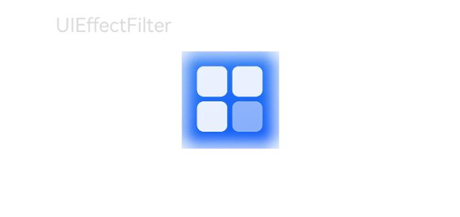

# @ohos.graphics.uiEffect (Effect Cascading)

<!--Kit: ArkGraphics 2D-->
<!--Subsystem: Graphics-->
<!--Owner: @hanamaru-->
<!--Designer: @chensiyi_CE-->
<!--Tester: @zhaoxiaoguang2-->
<!--Adviser: @ge-yafang-->
<!-- md-trans-meta sourceCommit=244626bd3ee350522bab6ea45e122f80881abd5e translatedAt=2026-07-13T11:26:01.353Z pushedAt=2026-07-16T02:15:23.753Z -->

This module provides basic capabilities for component effects, including blur, brightening, and more. Effects are categorized into the Filter and VisualEffect classes, and effects of the same class can be cascaded under an instance of that effect class. Using this module, you can quickly implement complex visual effects without needing to master underlying image processing algorithms, reducing development complexity and improving user experience. In actual development, blur can be used for background blurring, and brightening can be used for bright screen display, etc.

- [Filter](#filter): Used to add specified Filter effects to a component.

- [VisualEffect](#visualeffect): Used to add specified VisualEffect effects to a component.

> **NOTE**
>
> The initial APIs of this module are supported since API version 12. Newly added APIs will be marked with a superscript to indicate their earliest API version.
>
> The APIs of this module all rely on existing content on the canvas for rendering. If used in conjunction with APIs that have offscreen capabilities (such as the offscreen mode of [blendMode<sup>11+</sup>](../apis-arkui/arkui-ts/ts-universal-attributes-image-effect.md#blendmode11)), unexpected effects may occur.

## Modules to Import

```ts
import { uiEffect } from '@kit.ArkGraphics2D';
```

## uiEffect.createFilter

createFilter(): Filter

Creates a Filter instance for adding multiple filter effects to a component.

**System capability:** SystemCapability.Graphics.Drawing

**Return value**

| Type              | Description                 |
| ------------------| ------------------- |
| [Filter](#filter) | Returns a Filter instance, which supports adding multiple filter effects. |

**Example**

```ts
// Create a Filter instance
let filter : uiEffect.Filter = uiEffect.createFilter();
```

## uiEffect.createEffect

createEffect(): VisualEffect

Creates a VisualEffect instance for adding multiple VisualEffect effects to a component.

**Widget capability:** This API can be used in ArkTS widgets since API version 24.

**System capability:** SystemCapability.Graphics.Drawing

**Return value**

| Type                          | Description                       |
| ----------------------------- | ------------------------- |
| [VisualEffect](#visualeffect) | Returns a VisualEffect instance, which supports adding multiple VisualEffect effects. |

**Example**

```ts
// Create a VisualEffect instance
let visualEffect : uiEffect.VisualEffect = uiEffect.createEffect();
```

## Filter

Filter effect class, used to apply corresponding effects to specified components. Before calling Filter methods, you need to first create a Filter instance through [createFilter](#uieffectcreatefilter).

### blur

blur(blurRadius: number): Filter

Adds a blur effect to the component.

**System capability:** SystemCapability.Graphics.Drawing

**Parameters**

| Name | Type | Mandatory | Description |
| ----------- | -------| ---- | --------- |
| blurRadius | number | Yes | Blur radius, in px.<br>The value must be greater than or equal to 0. A larger blur radius results in a stronger blur effect.<br>When the blur radius is 0, there is no blur effect.<br>If a negative number is passed in, it is automatically corrected to 0. |

**Return value**

| Type               | Description                       |
| ----------------- | -------------------------- |
| [Filter](#filter) | Returns the Filter with the blur effect attached, supporting chained calls to add other effects. |

**Example**

```ts
// xxx.ts
import { uiEffect } from '@kit.ArkGraphics2D';

// Create a Filter instance
let filter: uiEffect.Filter = uiEffect.createFilter();
// Set the blur radius to 10px
filter.blur(10);

@Entry
@Component
struct UIEffectFilterExample {
    build() {
        Column({ space: 15 }) {
            Text('UIEffectFilter').fontSize(20).width('75%').fontColor('#DCDCDC')
            Image($r('app.media.foreground'))
                .width(100)
                .height(100)
                .backgroundImage($r('app.media.background'))
                .backgroundImagePosition(Alignment.Center)
                .backgroundImageSize({ width: 90, height: 90 })
                // Apply the Filter effect to the component background
                .backgroundFilter(filter)
        }
        .height('100%')
        .width('100%')
    }
}
```



### hdrBrightnessRatio<sup>24+</sup>

hdrBrightnessRatio(ratio: number): Filter

Adds an HDR (High Dynamic Range) brightening effect to the component content. Nesting is not recommended, as forced nesting may cause overexposure.

The brightening effect requires the HDR rendering pipeline to be enabled to take effect. In some scenarios, HDR cannot be enabled even if an attempt is made to trigger the HDR rendering pipeline, for example, when the device hardware specifications do not support HDR.

The maximum supported brightness boost multiple is calculated as the device's current maximum brightness divided by its SDR reference white luminance.

> **NOTE**
>
> Using the HDR brightening effect incurs certain performance and power consumption overhead. It is recommended to use it in scenarios where HDR images or videos already exist.

**Required permissions:** ohos.permission.HDR_BRIGHTNESS

<!--Del-->System apps do not need to apply for this permission.<!--DelEnd-->

**System capability:** SystemCapability.Graphics.Drawing

**Parameters**

| Name | Type | Mandatory | Description |
| ------------- | --------------------- | ---- | ------------------------- |
| ratio | number | Yes | Brightening ratio. The value range is [1.0, the maximum brightening ratio supported by the current device]. Values less than 1.0 are treated as 1.0; a value equal to 1.0 means no processing; values greater than 1.0 attempt to trigger the HDR rendering pipeline; values exceeding the maximum ratio are treated as the maximum ratio. |

**Return value**

| Type              | Description                               |
| ----------------- | --------------------------------- |
| [Filter](#filter) | Returns the Filter with the HDR brightening effect attached, supporting chained calls to add other effects. |

**Error codes**

For details about the following error codes, see [Universal Error Codes](../errorcode-universal.md).

| ID | Error Message |
| ------- | --------------------------------------------|
| 201 | Permission verification failed. The application does not have the permission required to call the API. |

**Example**

```ts
// Create a Filter instance
let filter: uiEffect.Filter = uiEffect.createFilter();
// Set the HDR brightness ratio to 2.0
filter.hdrBrightnessRatio(2.0);
```

## VisualEffect

The VisualEffect class is used to apply corresponding effects to a specified component. Before calling methods of VisualEffect, you need to create a VisualEffect instance through [createEffect](#uieffectcreateeffect).