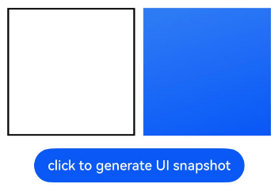

# Class (ComponentSnapshot)
<!--Kit: ArkUI-->
<!--Subsystem: ArkUI-->
<!--Owner: @yihao-lin-->
<!--Designer: @piggyguy-->
<!--Tester: @songyanhong-->
<!--Adviser: @Brilliantry_Rui-->
Provides the capability of obtaining component screenshots, including screenshots of loaded and unloaded components. This is applicable to scenarios where the component rendering result needs to be obtained for display or subsequent processing.

> **NOTE**
>
> - The initial APIs of this module are supported since API version 10. Newly added APIs will be marked with a superscript to indicate their earliest API version.
>
> - The initial APIs of this class are supported since API version 12.
>
> - The APIs of this module can be used only in the stage model.
>
> - In the following API examples, you must first use [getComponentSnapshot()](./arkts-apis-uicontext-uicontext.md#getcomponentsnapshot12) in **UIContext** to obtain a **ComponentSnapshot** instance, and then call the APIs using the obtained instance.
>
> - Transformation properties such as scaling, translation, and rotation only apply to the child components of the target component. Applying these transformation properties directly to the target component itself has no effect; the snapshot will still display the component as it appears before any transformations are applied.

## get<sup>12+</sup>

get(id: string, callback: AsyncCallback\<image.PixelMap>, options?: componentSnapshot.SnapshotOptions): void

Obtains a screenshot of a loaded component by passing the [component ID](arkui-ts/ts-universal-attributes-component-id.md). The corresponding component is captured. This is suitable for scenarios such as generating component previews, saving, or sharing partial UI screenshots. This API uses an asynchronous callback to return the result.

> **NOTE**
>
> The snapshot captures content rendered in the last frame. If this API is called when the component triggers an update, the re-rendered content will not be included in the obtained snapshot.

**Atomic service API**: This API can be used in atomic services since API version 12.

**System capability**: SystemCapability.ArkUI.ArkUI.Full

**Parameters**

| Name  | Type                                                        | Mandatory| Description                                                        |
| -------- | ------------------------------------------------------------ | ---- | ------------------------------------------------------------ |
| id       | string                                                       | Yes  | [ID](arkui-ts/ts-universal-attributes-component-id.md) of the target component.<br>Note: Off-screen or cached components not mounted in the component tree are not supported.|
| callback | [AsyncCallback](../apis-basic-services-kit/js-apis-base.md#asynccallback)&lt;image.[PixelMap](../apis-image-kit/arkts-apis-image-PixelMap.md)&gt; | Yes  | Callback used to return the result. If the snapshot capture is successful, **err** is **undefined**, and **data** contains the resulting [PixelMap](../apis-image-kit/arkts-apis-image-PixelMap.md). Otherwise, **err** provides detailed error information.                                        |
| options       | [componentSnapshot.SnapshotOptions](js-apis-arkui-componentSnapshot.md#snapshotoptions12)            | No   | Custom settings of the snapshot. Pass this parameter when you need to customize screenshot settings such as scaling ratio and wait-for-render strategy. If not passed, the system default screenshot configuration is used.|

**Error codes**

For details about the error codes, see [Universal Error Codes](../errorcode-universal.md), [Snapshot Error Codes](errorcode-snapshot.md), and [API Call Error Codes](errorcode-internal.md).

| ID| Error Message                                                    |
| -------- | ------------------------------------------------------------ |
| 401      | Parameter error. Possible causes: 1. Mandatory parameters are left unspecified; 2.Incorrect parameters types; 3. Parameter verification failed. |
| 100001   | Invalid ID.                                                  |
| 160003   | Unsupported color space or dynamic range mode in snapshot options.<br>Applicable versions: 23+|

**Example**

```ts
import { image } from '@kit.ImageKit';
import { UIContext } from '@kit.ArkUI';

@Entry
@Component
struct SnapshotExample {
  @State pixmap: image.PixelMap | undefined = undefined;
  uiContext: UIContext = this.getUIContext();

  build() {
    Column() {
      Row() {
        Image(this.pixmap).width(150).height(150).border({ color: Color.Black, width: 2 }).margin(5)
        // Replace $r('app.media.img') with the image resource file you use.
        Image($r('app.media.img'))
          .autoResize(true)
          .width(150)
          .height(150)
          .margin(5)
          .id('root')
      }

      Button('click to generate UI snapshot')
        .onClick(() => {
          this.uiContext.getComponentSnapshot().get('root', (error: Error, pixmap: image.PixelMap) => {
            if (error) {
              console.error(`Failed to get component snapshot: ${JSON.stringify(error)}`);
              return;
            }
            this.pixmap = pixmap;
          }, { scale: 2, waitUntilRenderFinished: true });
        }).margin(10)
    }
    .width('100%')
    .height('100%')
    .alignItems(HorizontalAlign.Center)
  }
}
```



## get<sup>12+</sup>

get(id: string, options?: componentSnapshot.SnapshotOptions): Promise\<image.PixelMap>

Obtains a screenshot of a loaded component by passing the [component ID](arkui-ts/ts-universal-attributes-component-id.md). The corresponding component is captured. This is suitable for scenarios such as generating component previews, saving, or sharing partial UI screenshots. This API uses a promise to return the result.

> **NOTE**
>
> The snapshot captures content rendered in the last frame. If this API is called when the component triggers an update, the re-rendered content will not be included in the obtained snapshot.

**Atomic service API**: This API can be used in atomic services since API version 12.

**System capability**: SystemCapability.ArkUI.ArkUI.Full

**Parameters**

| Name| Type  | Mandatory| Description                                                        |
| ------ | ------ | ---- | ------------------------------------------------------------ |
| id     | string | Yes  | [ID](arkui-ts/ts-universal-attributes-component-id.md) of the target component.<br>Note: Off-screen or cached components not mounted in the component tree are not supported.|
| options       | [componentSnapshot.SnapshotOptions](js-apis-arkui-componentSnapshot.md#snapshotoptions12)            | No   | Custom settings of the snapshot. Pass this parameter when you need to customize screenshot settings such as scaling ratio and wait-for-render strategy. If not passed, the system default screenshot configuration is used.|

**Return value**

| Type                                                        | Description            |
| ------------------------------------------------------------ | ---------------- |
| Promise&lt;image.[PixelMap](../apis-image-kit/arkts-apis-image-PixelMap.md)&gt; | Promise used to return the snapshot object.|

**Error codes**

For details about the error codes, see [Universal Error Codes](../errorcode-universal.md), [Snapshot Error Codes](errorcode-snapshot.md), and [API Call Error Codes](errorcode-internal.md).

| ID| Error Message                                                    |
| -------- | ------------------------------------------------------------ |
| 401      | Parameter error. Possible causes: 1. Mandatory parameters are left unspecified; 2.Incorrect parameters types; 3. Parameter verification failed. |
| 100001   | Invalid ID.                                                  |
| 160003   | Unsupported color space or dynamic range mode in snapshot options.<br>Applicable versions: 23+|

**Example**

```ts
import { image } from '@kit.ImageKit';
import { UIContext } from '@kit.ArkUI';

@Entry
@Component
struct SnapshotExample {
  @State pixmap: image.PixelMap | undefined = undefined;
  uiContext: UIContext = this.getUIContext();

  build() {
    Column() {
      Row() {
        Image(this.pixmap).width(150).height(150).border({ color: Color.Black, width: 2 }).margin(5)
        // Replace $r('app.media.icon') with the image resource file you use.
        Image($r('app.media.icon'))
          .autoResize(true)
          .width(150)
          .height(150)
          .margin(5)
          .id('root')
      }

      Button('click to generate UI snapshot')
        .onClick(() => {
          this.uiContext.getComponentSnapshot()
            .get('root', { scale: 2, waitUntilRenderFinished: true })
            .then((pixmap: image.PixelMap) => {
              this.pixmap = pixmap;
            })
            .catch((err: Error) => {
              console.error(`Failed to get component snapshot: ${err}`);
            });
        }).margin(10)
    }
    .width('100%')
    .height('100%')
    .alignItems(HorizontalAlign.Center)
  }
}
```

## createFromBuilder<sup>12+</sup>

createFromBuilder(builder: CustomBuilder, callback: AsyncCallback\<image.PixelMap>, delay?: number, checkImageStatus?: boolean, options?: componentSnapshot.SnapshotOptions): void

Builds a passed [CustomBuilder](arkui-ts/ts-types.md#custombuilder8) custom component off-screen and then captures a screenshot. This is suitable for scenarios such as generating previews of components not yet on-screen, sharing widgets, or exporting images of temporarily built components. This API uses an asynchronous callback to return the result.

> **NOTE**
>
> - Due to the need to wait for the component to be built and rendered, there is a delay of not more than 500 ms in the callback for off-screen snapshot capturing. Therefore, this API is not recommended for performance-sensitive scenarios.
>
> - If a component is on a time-consuming task, for example, an [Image](arkui-ts/ts-basic-components-image.md) or [Web](../apis-arkweb/arkts-basic-components-web.md) component that is loading online images, its loading may be still in progress when this API is called. In this case, the output snapshot does not represent the component in the way it looks when the loading is successfully completed.

**Atomic service API**: This API can be used in atomic services since API version 12.

**System capability**: SystemCapability.ArkUI.ArkUI.Full

**Parameters**

| Name  | Type                                                        | Mandatory| Description                                                        |
| -------- | ------------------------------------------------------------ | ---- | ------------------------------------------------------------ |
| builder  | [CustomBuilder](arkui-ts/ts-types.md#custombuilder8)         | Yes  | Builder of the custom component.<br>Note: The global builder is not supported.<br>If the root component of the builder has a width or height of zero, the snapshot operation will fail with error code 100001.     |
| callback | [AsyncCallback](../apis-basic-services-kit/js-apis-base.md#asynccallback)&lt;image.[PixelMap](../apis-image-kit/arkts-apis-image-PixelMap.md)&gt; | Yes  | Callback used to return the result. If the snapshot capture is successful, **err** is **undefined**, and **data** contains the resulting [PixelMap](../apis-image-kit/arkts-apis-image-PixelMap.md). Otherwise, **err** provides detailed error information. The coordinates and size of the offscreen component's drawing area can be obtained through the callback.|
| delay   | number | No   | Delay time for triggering the screenshot command. When the layout includes an Image component, it is necessary to set a delay time to allow the system to decode the image resources. Larger resources require longer decoding time. It is recommended that PixelMap resources that do not need to be decoded be used preferentially.<br> When PixelMap resources are used or when [syncLoad](arkui-ts/ts-basic-components-image.md#syncload8) is set to **true** for the **Image** component, you can set **delay** to **0** to forcibly capture snapshots without waiting. This delay time does not refer to the time from the API call to the return: As the system needs to temporarily construct the passed-in **builder** offscreen, the return time is usually longer than this delay.<br>**Note:** In **builder** passed to the screenshot API, you should not use state variables to control the construction of child components. If it is required to use state variables for this purpose, ensure that the values of the relevant state variables do not change at the time the screenshot API is called, to avoid unexpected screenshot results.<br> Default value: **300**<br> Unit: ms<br> Value range: [0, +∞). If the value is less than 0, the default value is used.|
| checkImageStatus  | boolean | No   | Whether to verify the image decoding status before taking a snapshot. If it is set to **true**, the screenshot API checks whether all Image components have completed decoding before capturing the screenshot. If any Image component is still decoding, the screenshot is aborted and an exception is returned. If it is set to **false**, the decoding status of Image components is not checked before capturing the screenshot.<br>Default value: **false**.|
| options | [componentSnapshot.SnapshotOptions](js-apis-arkui-componentSnapshot.md#snapshotoptions12) | No| Custom settings of the snapshot. Pass this parameter when you need to customize screenshot settings such as scaling ratio and wait-for-render strategy. If not passed, the system default screenshot configuration is used.|

**Error codes**

For details about the error codes, see [Universal Error Codes](../errorcode-universal.md), [Snapshot Error Codes](errorcode-snapshot.md), and [API Call Error Codes](errorcode-internal.md).

| ID| Error Message                                                    |
| -------- | ------------------------------------------------------------ |
| 401      | Parameter error. Possible causes: 1. Mandatory parameters are left unspecified; 2.Incorrect parameters types; 3. Parameter verification failed. |
| 100001   | The builder is not a valid build function.                   |
| 160001   | An image component in builder is not ready for taking a snapshot. The check for the ready state is required when the checkImageStatus option is enabled. |
| 160003   | Unsupported color space or dynamic range mode in snapshot options.<br>Applicable versions: 23+|
| 160004   | isAuto(true) is not supported for offscreen node snapshots.<br>Applicable versions: 23+|

**Example**

```ts
import { image } from '@kit.ImageKit';
import { UIContext } from '@kit.ArkUI';

@Entry
@Component
struct ComponentSnapshotExample {
  @State pixmap: image.PixelMap | undefined = undefined;
  uiContext: UIContext = this.getUIContext();

  @Builder
  randomBuilder() {
    Flex({ direction: FlexDirection.Column, justifyContent: FlexAlign.Center, alignItems: ItemAlign.Center }) {
      Text('Test menu item 1')
        .fontSize(20)
        .width(100)
        .height(50)
        .textAlign(TextAlign.Center)
      Divider().height(10)
      Text('Test menu item 2')
        .fontSize(20)
        .width(100)
        .height(50)
        .textAlign(TextAlign.Center)
    }
    .width(100)
    .id('builder')
  }

  build() {
    Column() {
      Button('click to generate UI snapshot')
        .onClick(() => {
          this.uiContext.getComponentSnapshot().createFromBuilder(() => {
            this.randomBuilder()
          },
            (error: Error, pixmap: image.PixelMap) => {
              if (error) {
                console.error(`Failed to create component snapshot from builder: ${error}`);
                return;
              }
              this.pixmap = pixmap;
            }, 320, true, { scale: 2, waitUntilRenderFinished: true });
        })
      Image(this.pixmap)
        .margin(10)
        .height(200)
        .width(200)
        .border({ color: Color.Black, width: 2 })
    }.width('100%').margin({ left: 10, top: 5, bottom: 5 }).height(300)
  }
}
```

## createFromBuilder<sup>12+</sup>

createFromBuilder(builder: CustomBuilder, delay?: number, checkImageStatus?: boolean, options?: componentSnapshot.SnapshotOptions): Promise\<image.PixelMap>

Builds a passed [CustomBuilder](arkui-ts/ts-types.md#custombuilder8) custom component off-screen and then captures a screenshot. This is suitable for scenarios such as generating previews of components not yet on-screen, sharing widgets, or exporting images of temporarily built components. This API uses a promise to return the result.

> **NOTE**
>
> - Due to the need to wait for the component to be built and rendered, there is a delay of not more than 500 ms in the callback for off-screen snapshot capturing. Therefore, this API is not recommended for performance-sensitive scenarios.
>
> - If a component is on a time-consuming task, for example, an [Image](arkui-ts/ts-basic-components-image.md) or [Web](../apis-arkweb/arkts-basic-components-web.md) component that is loading online images, its loading may be still in progress when this API is called. In this case, the output snapshot does not represent the component in the way it looks when the loading is successfully completed.

**Atomic service API**: This API can be used in atomic services since API version 12.

**System capability**: SystemCapability.ArkUI.ArkUI.Full

**Parameters**

| Name | Type                                                | Mandatory| Description                                                   |
| ------- | ---------------------------------------------------- | ---- | ------------------------------------------------------- |
| builder | [CustomBuilder](arkui-ts/ts-types.md#custombuilder8) | Yes  | Builder of the custom component.<br>Note: The global builder is not supported.<br>If the root component of the builder has a width or height of zero, the snapshot operation will fail with error code 100001.|
| delay   | number | No   | Delay time for triggering the screenshot command. When the layout includes an image component, it is necessary to set a delay time to allow the system to decode the image resources. Larger resources require longer decoding time. It is recommended that PixelMap resources that do not need to be decoded be used preferentially.<br> When PixelMap resources are used or when [syncLoad](arkui-ts/ts-basic-components-image.md#syncload8) is set to **true** for the **Image** component, you can set **delay** to **0** to forcibly capture snapshots without waiting. This delay time does not refer to the time from the API call to the return: As the system needs to temporarily construct the passed-in **builder** offscreen, the return time is usually longer than this delay.<br>**Note:** In **builder** passed to the screenshot API, you should not use state variables to control the construction of child components. If it is required to use state variables for this purpose, ensure that the values of the relevant state variables do not change at the time the screenshot API is called, to avoid unexpected screenshot results.<br> Default value: **300**<br> Unit: ms<br> Value range: [0, +∞). If the value is less than 0, the default value is used.|
| checkImageStatus  | boolean | No   | Whether to verify the image decoding status before taking a snapshot. If it is set to **true**, whether all Image components have completed decoding is checked before screenshot capturing. If any Image component is still decoding, the screenshot is aborted and an exception is returned.<br>Default value: **false**.|
| options | [componentSnapshot.SnapshotOptions](js-apis-arkui-componentSnapshot.md#snapshotoptions12) | No| Custom settings of the snapshot. Pass this parameter when you need to customize screenshot settings such as scaling ratio and wait-for-render strategy. If not passed, the system default screenshot configuration is used.|

**Return value**

| Type                                                        | Description            |
| ------------------------------------------------------------ | ---------------- |
| Promise&lt;image.[PixelMap](../apis-image-kit/arkts-apis-image-PixelMap.md)&gt; | Promise used to return the snapshot object.|

**Error codes**

For details about the error codes, see [Universal Error Codes](../errorcode-universal.md), [Snapshot Error Codes](errorcode-snapshot.md), and [API Call Error Codes](errorcode-internal.md).

| ID| Error Message                                                    |
| -------- | ------------------------------------------------------------ |
| 401      | Parameter error. Possible causes: 1. Mandatory parameters are left unspecified; 2.Incorrect parameters types; 3. Parameter verification failed. |
| 100001   | The builder is not a valid build function.                   |
| 160001   | An image component in builder is not ready for taking a snapshot. The check for the ready state is required when the checkImageStatus option is enabled. |
| 160003   | Unsupported color space or dynamic range mode in snapshot options.<br>Applicable versions: 23+|
| 160004   | isAuto(true) is not supported for offscreen node snapshots.<br>Applicable versions: 23+|

**Example**

```ts
import { image } from '@kit.ImageKit';
import { UIContext } from '@kit.ArkUI';

@Entry
@Component
struct ComponentSnapshotExample {
  @State pixmap: image.PixelMap | undefined = undefined;
  uiContext: UIContext = this.getUIContext();

  @Builder
  randomBuilder() {
    Flex({ direction: FlexDirection.Column, justifyContent: FlexAlign.Center, alignItems: ItemAlign.Center }) {
      Text('Test menu item 1')
        .fontSize(20)
        .width(100)
        .height(50)
        .textAlign(TextAlign.Center)
      Divider().height(10)
      Text('Test menu item 2')
        .fontSize(20)
        .width(100)
        .height(50)
        .textAlign(TextAlign.Center)
    }
    .width(100)
    .id('builder')
  }

  build() {
    Column() {
      Button('click to generate UI snapshot')
        .onClick(() => {
          this.uiContext.getComponentSnapshot()
            .createFromBuilder(() => {
              this.randomBuilder()
            }, 320, true, { scale: 2, waitUntilRenderFinished: true })
            .then((pixmap: image.PixelMap) => {
              this.pixmap = pixmap;
            })
            .catch((err: Error) => {
              console.error(`Failed to create component snapshot from builder: ${err}`);
            });
        })
      Image(this.pixmap)
        .margin(10)
        .height(200)
        .width(200)
        .border({ color: Color.Black, width: 2 })
    }.width('100%').margin({ left: 10, top: 5, bottom: 5 }).height(300)
  }
}
```

## getSync<sup>12+</sup>

getSync(id: string, options?: componentSnapshot.SnapshotOptions): image.PixelMap

Obtains a screenshot of a loaded component by passing the [component ID](arkui-ts/ts-universal-attributes-component-id.md). The corresponding component is located and captured, and the [PixelMap](../apis-image-kit/arkts-apis-image-PixelMap.md) is returned after completion synchronously. This is suitable for scenarios where you need to obtain the screenshot result promptly and performance requirements are not critical. Note that this API blocks the main thread and has a 3-second timeout. If the operation exceeds this limit, it throws an exception. Use with caution in performance-critical scenarios.

> **NOTE**
>
> The snapshot captures content rendered in the last frame. If this API is called when the component triggers an update, the re-rendered content will not be included in the obtained snapshot.

**Atomic service API**: This API can be used in atomic services since API version 12.

**System capability**: SystemCapability.ArkUI.ArkUI.Full

**Parameters**

| Name | Type    | Mandatory  | Description                                      |
| ---- | ------ | ---- | ---------------------------------------- |
| id   | string | Yes   | [ID](arkui-ts/ts-universal-attributes-component-id.md) of the target component.<br>Note: Off-screen or cached components not mounted in the component tree are not supported.|
| options       | [componentSnapshot.SnapshotOptions](js-apis-arkui-componentSnapshot.md#snapshotoptions12)            | No   | Custom settings of the snapshot.|

**Return value**

| Type                           | Description      |
| ----------------------------- | -------- |
| image.[PixelMap](../apis-image-kit/arkts-apis-image-PixelMap.md) | Promise used to return the result.|

**Error codes**

For details about the error codes, see [Universal Error Codes](../errorcode-universal.md), [Snapshot Error Codes](errorcode-snapshot.md), and [API Call Error Codes](errorcode-internal.md).

| ID | Error Message               |
| ------ | ------------------- |
| 401    | Parameter error. Possible causes: 1. Mandatory parameters are left unspecified; 2.Incorrect parameters types; 3. Parameter verification failed.   |
| 100001 | Invalid ID. |
| 160002 | Timeout. |
| 160003 | Unsupported color space or dynamic range mode in snapshot options.<br>Applicable versions: 23+|

**Example**

```ts
import { image } from '@kit.ImageKit';

@Entry
@Component
struct SnapshotExample {
  @State pixmap: image.PixelMap | undefined = undefined;

  build() {
    Column() {
      Row() {
        Image(this.pixmap).width(150).height(150).border({ color: Color.Black, width: 2 }).margin(5)
        // Replace $r('app.media.img') with the image resource file you use.
        Image($r('app.media.img'))
          .autoResize(true)
          .width(150)
          .height(150)
          .margin(5)
          .id('root')
      }

      Button('click to generate UI snapshot')
        .onClick(() => {
          try {
            let pixelmap =
              this.getUIContext().getComponentSnapshot().getSync('root', { scale: 2, waitUntilRenderFinished: true });
            this.pixmap = pixelmap;
          } catch (error) {
            console.error(`getSync errorCode: ${error.code} message: ${error.message}`);
          }
        }).margin(10)
    }
    .width('100%')
    .height('100%')
    .alignItems(HorizontalAlign.Center)
  }
}
```

## getWithUniqueId<sup>15+</sup>

getWithUniqueId(uniqueId: number, options?: componentSnapshot.SnapshotOptions): Promise\<image.PixelMap>

Obtains a screenshot of a loaded component by passing the component's **uniqueId**. The corresponding component is located and captured. This is suitable for scenarios where components are managed through node objects such as FrameNode and a component screenshot needs to be generated by its unique node ID. This API uses a promise to return the result.

> **NOTE**
>
> The snapshot captures content rendered in the last frame. If this API is called when the component triggers an update, the re-rendered content will not be included in the obtained snapshot.

**Atomic service API**: This API can be used in atomic services since API version 15.

**System capability**: SystemCapability.ArkUI.ArkUI.Full

**Parameters**

| Name | Type    | Mandatory  | Description                                      |
| ---- | ------ | ---- | ---------------------------------------- |
| uniqueId | number | Yes| Unique ID of the target component. The unique ID of the **FrameNode** can be obtained via the [getUniqueId](js-apis-arkui-frameNode.md#getuniqueid12) API.<br>**Note:** Components that are not attached to the tree are not supported. If the passed **uniqueId** corresponds to a node that is off-screen or cached and not attached to the tree, the system will not capture a screenshot of it.|
| options       | [componentSnapshot.SnapshotOptions](js-apis-arkui-componentSnapshot.md#snapshotoptions12)            | No   | Custom settings of the snapshot.|

**Return value**

| Type                                                        | Description            |
| ------------------------------------------------------------ | ---------------- |
| Promise&lt;image.[PixelMap](../apis-image-kit/arkts-apis-image-PixelMap.md)&gt; | Promise used to return the snapshot object.|

**Error codes**

For details about the error codes, see [Universal Error Codes](../errorcode-universal.md), [Snapshot Error Codes](errorcode-snapshot.md), and [API Call Error Codes](errorcode-internal.md).

| ID| Error Message                                                    |
| -------- | ------------------------------------------------------------ |
| 401      | Parameter error. Possible causes: 1. Mandatory parameters are left unspecified; 2.Incorrect parameters types; 3. Parameter verification failed. |
| 100001   | Invalid ID.                                                  |
| 160003   | Unsupported color space or dynamic range mode in snapshot options.<br>Applicable versions: 23+|

**Example**

```ts
import { NodeController, FrameNode, typeNode } from '@kit.ArkUI';
import { image } from '@kit.ImageKit';
import { UIContext } from '@kit.ArkUI';

class MyNodeController extends NodeController {
  public node: FrameNode | null = null;
  public imageNode: FrameNode | null = null;

  makeNode(uiContext: UIContext): FrameNode | null {
    this.node = new FrameNode(uiContext);
    this.node.commonAttribute.width('100%').height('100%');

    let image = typeNode.createNode(uiContext, 'Image');
    // Replace $r('app.media.img') with the image resource file you use.
    image.initialize($r('app.media.img')).width('100%').height('100%').autoResize(true);
    this.imageNode = image;

    this.node.appendChild(image);
    return this.node;
  }
}

@Entry
@Component
struct SnapshotExample {
  private myNodeController: MyNodeController = new MyNodeController();
  @State pixmap: image.PixelMap | undefined = undefined;

  build() {
    Column() {
      Row() {
        Image(this.pixmap).width(200).height(200).border({ color: Color.Black, width: 2 }).margin(5)
        NodeContainer(this.myNodeController).width(200).height(200).margin(5)
      }

      Button('UniqueId get snapshot')
        .onClick(() => {
          try {
            this.getUIContext()
              .getComponentSnapshot()
              .getWithUniqueId(this.myNodeController.imageNode?.getUniqueId(),
                { scale: 2, waitUntilRenderFinished: true })
              .then((pixmap: image.PixelMap) => {
                this.pixmap = pixmap;
              })
              .catch((err: Error) => {
                console.error(`UniqueId get snapshot Error: ${err}`);
              });
          } catch (error) {
            console.error(`UniqueId get snapshot Error. Code: ${error.code}, message: ${error.message}`);
          }
        }).margin(10)
    }
    .width('100%')
    .height('100%')
    .alignItems(HorizontalAlign.Center)
  }
}
```

## getSyncWithUniqueId<sup>15+</sup>

getSyncWithUniqueId(uniqueId: number, options?: componentSnapshot.SnapshotOptions): image.PixelMap

Obtains a screenshot of a loaded component by passing the component's **uniqueId**. The corresponding component is located and captured. This is suitable for scenarios where components are managed through node objects such as FrameNode and synchronous screenshot retrieval is required. This API synchronously waits for the snapshot to complete and returns a [PixelMap](../apis-image-kit/arkts-apis-image-PixelMap.md) object. This method blocks the main thread; use it with caution. If synchronous screenshot retrieval is not strictly necessary, it is recommended to use [getWithUniqueId](#getwithuniqueid15) to obtain the screenshot asynchronously.

> **NOTE**
>
> The snapshot captures content rendered in the last frame. If this API is called when the component triggers an update, the re-rendered content will not be included in the obtained snapshot.

**Atomic service API**: This API can be used in atomic services since API version 15.

**System capability**: SystemCapability.ArkUI.ArkUI.Full

**Parameters**

| Name | Type    | Mandatory  | Description                                      |
| ---- | ------ | ---- | ---------------------------------------- |
| uniqueId   | number | Yes   | Unique ID of the target component. The unique ID of the **FrameNode** can be obtained via the [getUniqueId](js-apis-arkui-frameNode.md#getuniqueid12) API.<br>**Note:** Components that are not attached to the tree are not supported. If the passed **uniqueId** corresponds to a node that is off-screen or cached and not attached to the tree, the system will not capture a screenshot of it.|
| options | [componentSnapshot.SnapshotOptions](js-apis-arkui-componentSnapshot.md#snapshotoptions12) | No| Custom settings of the snapshot. Pass this parameter when you need to customize screenshot settings such as scaling ratio and wait-for-render strategy. If not passed, the system default screenshot configuration is used.|

**Return value**

| Type                           | Description      |
| ----------------------------- | -------- |
| image.[PixelMap](../apis-image-kit/arkts-apis-image-PixelMap.md) | Promise used to return the result.|

**Error codes**

For details about the error codes, see [Universal Error Codes](../errorcode-universal.md), [Snapshot Error Codes](errorcode-snapshot.md), and [API Call Error Codes](errorcode-internal.md).

| ID | Error Message               |
| ------ | ------------------- |
| 401      | Parameter error. Possible causes: 1. Mandatory parameters are left unspecified; 2.Incorrect parameters types; 3. Parameter verification failed.   |
| 100001 | Invalid ID. |
| 160002 | Timeout. |
| 160003 | Unsupported color space or dynamic range mode in snapshot options.<br>Applicable versions: 23+|

**Example**

```ts
import { NodeController, FrameNode, typeNode } from '@kit.ArkUI';
import { image } from '@kit.ImageKit';
import { UIContext } from '@kit.ArkUI';
// Create a FrameNode node that contains an Image component.
class MyNodeController extends NodeController {
  public node: FrameNode | null = null;
  public imageNode: FrameNode | null = null;
  // Build a custom node, create the root node FrameNode, add a child node Image, and configure the Image resource and style.
  makeNode(uiContext: UIContext): FrameNode | null {
    this.node = new FrameNode(uiContext);
    this.node.commonAttribute.width('100%').height('100%');

    let image = typeNode.createNode(uiContext, 'Image');
    // Replace $r('app.media.img') with the image resource file you use.
    image.initialize($r('app.media.img')).width('100%').height('100%').autoResize(true);
    this.imageNode = image;

    this.node.appendChild(image);
    return this.node;
  }
}

@Entry
@Component
struct SnapshotExample {
  private myNodeController: MyNodeController = new MyNodeController();
  @State pixmap: image.PixelMap | undefined = undefined;

  build() {
    Column() {
      Row() {
        Image(this.pixmap).width(200).height(200).border({ color: Color.Black, width: 2 }).margin(5)
        NodeContainer(this.myNodeController).width(200).height(200).margin(5)
      }

      Button('UniqueId getSync snapshot')
        .onClick(() => {
          try {
            // Generate a component snapshot synchronously by node ID, with the zoom ratio of 2. The snapshot is generated after the rendering is complete.
            this.pixmap = this.getUIContext()
              .getComponentSnapshot()
              .getSyncWithUniqueId(this.myNodeController.imageNode?.getUniqueId(),
                { scale: 2, waitUntilRenderFinished: true });
          } catch (error) {
            console.error(`UniqueId getSync snapshot Error. Code: ${error.code}, message: ${error.message}`);
          }
        }).margin(10)
    }
    .width('100%')
    .height('100%')
    .alignItems(HorizontalAlign.Center)
  }
}
```

## createFromComponent<sup>18+</sup>

createFromComponent\<T extends Object>(content: ComponentContent\<T>, delay?: number, checkImageStatus?: boolean, options?: componentSnapshot.SnapshotOptions): Promise\<image.PixelMap>

Captures a snapshot of the provided component content. Unlike **createFromBuilder**, which takes a CustomBuilder and builds the component off-screen, **createFromComponent** takes an already built ComponentContent object. This is suitable for scenarios where component content is already managed through ComponentContent, such as dialogs and node management. This API uses a promise to return the result.

> **NOTE**
>
> - Because the API needs to wait for the component to be built and rendered successfully, there is a certain delay in returning the screenshot. It is therefore not suitable for performance-sensitive scenarios.
>
> - If a component is on a time-consuming task, for example, an [Image](arkui-ts/ts-basic-components-image.md) or [Web](../apis-arkweb/arkts-basic-components-web.md) component that is loading online images, its loading may be still in progress when this API is called. In this case, the output snapshot does not represent the component in the way it looks when the loading is successfully completed.

**Atomic service API**: This API can be used in atomic services since API version 18.

**System capability**: SystemCapability.ArkUI.ArkUI.Full

**Parameters**

| Name  | Type                                                        | Mandatory| Description                                                        |
| -------- | ------------------------------------------------------------ | ---- | ------------------------------------------------------------ |
| content  | [ComponentContent\<T>](./js-apis-arkui-ComponentContent.md)         | Yes  | Component content to be captured. This is the content currently displayed in the **UIContext**.     |
| delay | number | No| Delay time for triggering the screenshot command. When the layout includes an image component, it is necessary to set a delay time to allow the system to decode the image resources. Larger resources require longer decoding time. It is recommended that PixelMap resources that do not need to be decoded be used preferentially.<br> When PixelMap resources are used or when [syncLoad](arkui-ts/ts-basic-components-image.md#syncload8) is set to **true** for the **Image** component, you can set **delay** to **0** to forcibly capture snapshots without waiting. This delay time does not refer to the duration from the API call to its return. Since the system needs to process the screenshot of the passed content object, the actual return time is usually longer than the specified delay.<br>**Note:** In the **content** object passed to the screenshot API, you should not use state variables to control the construction of child components. If it is absolutely necessary to use them, ensure that their values do not change at the time the screenshot API is called, to avoid unexpected screenshot results.<br> Value range: [0, +∞). If the value is less than 0, the default value is used.<br>Default value: **300**<br> Unit: ms|
| checkImageStatus  | boolean | No   | Whether to verify the image decoding status before taking a snapshot. If it is set to **true**, whether all Image components have completed decoding is checked before screenshot capturing. If any Image component is still decoding, the screenshot is aborted and an exception is returned.<br>Default value: **false**.|
| options | [componentSnapshot.SnapshotOptions](js-apis-arkui-componentSnapshot.md#snapshotoptions12) | No| Custom parameters for screenshots. You can specify the scaling ratio for drawing the PixelMap on the graphics side and whether to force the system to wait for all drawing commands to be executed before capturing the screenshot. Pass this parameter when you need to customize the screenshot scaling ratio or the wait-for-render strategy. If not passed, the system default screenshot configuration is used.|

**Return value**

| Type                           | Description      |
| ----------------------------- | -------- |
| Promise&lt;image.[PixelMap](../apis-image-kit/arkts-apis-image-PixelMap.md)&gt;  | Promise used to return the snapshot object.|

**Error codes**

For details about the error codes, see [Universal Error Codes](../errorcode-universal.md), [Snapshot Error Codes](errorcode-snapshot.md), and [API Call Error Codes](errorcode-internal.md).

| ID| Error Message                                                    |
| -------- | ------------------------------------------------------------ |
| 401      | Parameter error. Possible causes: 1. Mandatory parameters are left unspecified; 2.Incorrect parameters types; 3. Parameter verification failed. |
| 100001   | The builder is not a valid build function.                   |
| 160001   | An image component in builder is not ready for taking a snapshot. The check for the ready state is required when the checkImageStatus option is enabled. |
| 160003   | Unsupported color space or dynamic range mode in snapshot options.<br>Applicable versions: 23+|
| 160004   | isAuto(true) is not supported for offscreen node snapshots.<br>Applicable versions: 23+|

**Example**

```ts
import { image } from '@kit.ImageKit';
import { ComponentContent, UIContext } from '@kit.ArkUI';

class Params {
  text: string | undefined | null = '';

  constructor(text: string | undefined | null) {
    this.text = text;
  }
}

@Builder
function buildText(params: Params) {
  ReusableChildComponent({ text: params.text })
}

@Component
struct ReusableChildComponent {
  @Prop text: string | undefined | null = '';

  aboutToReuse(params: Record<string, object>) {
    console.info(`ReusableChildComponent Reusable ${JSON.stringify(params)}`);
  }

  aboutToRecycle(): void {
    console.info(`ReusableChildComponent aboutToRecycle ${this.text}`);
  }

  build() {
    Column() {
      Text(this.text)
        .fontSize(90)
        .fontWeight(FontWeight.Bold)
        .margin({ bottom: 36 })
        .width('100%')
        .height('100%')
    }.backgroundColor('#FFF0F0F0')
  }
}

@Entry
@Component
struct Index {
  @State pixmap: image.PixelMap | undefined = undefined;
  @State message: string | undefined | null = 'hello';
  uiContext: UIContext = this.getUIContext();

  build() {
    Row() {
      Column() {
        Button("Click to Create Component Snapshot")
          .onClick(() => {
            let uiContext = this.getUIContext();
            let contentNode = new ComponentContent(uiContext, wrapBuilder(buildText), new Params(this.message));
            this.uiContext.getComponentSnapshot()
              .createFromComponent(contentNode
                , 320, true, { scale: 2, waitUntilRenderFinished: true })
              .then((pixmap: image.PixelMap) => {
                this.pixmap = pixmap;
              })
              .catch((err: Error) => {
                console.error(`Failed to create component snapshot from component content: ${err}`);
              });
          });
        Image(this.pixmap)
          .margin(10)
          .height(200)
          .width(200)
          .border({ color: Color.Black, width: 2 })
      }.width('100%').margin({ left: 10, top: 5, bottom: 5 }).height(300)
    }
    .width('100%')
    .height('100%')
  }
}
```

## getSizeLimitation

getSizeLimitation(): componentSnapshot.SnapshotSizeLimitation

Queries the maximum size limit for component screenshots. This is suitable for scenarios where you need to verify whether the target component size exceeds the system limit before taking a component screenshot.

**Since:** 26.0.0

**Model restriction:** This API can be used only in the stage model.

**Atomic service API**: This API can be used in atomic services since API version 26.0.0.

**System capability**: SystemCapability.ArkUI.ArkUI.Full

**Return value**

| Type                                                          | Description            |
| ------------------------------------------------------------ | -------------- |
| componentSnapshot.[SnapshotSizeLimitation](js-apis-arkui-componentSnapshot.md#snapshotsizelimitation) | Size limit information for component screenshots.|

**Example**

```ts
import { image } from '@kit.ImageKit';

@Entry
@Component
struct SnapshotColorModeExample {
  @State pixmap: image.PixelMap | undefined = undefined;

  build() {
    Column() {
      Row() {
        Image(this.pixmap).width(200).height(200).border({ color: Color.Black, width: 2 }).margin(5)
        Image($r('app.media.startIcon'))
          .autoResize(true)
          .width(200)
          .height(200)
          .margin(5)
          .id('root')
      }

      Button('click to generate UI snapshot')
        .onClick(() => {
          let componentSnapshot = this.getUIContext().getComponentSnapshot();
          // Check the size limit.
          let limitation = componentSnapshot.getSizeLimitation();
          console.info(`Max width: ${limitation.maxWidth}, Max height: ${limitation.maxHeight}`);
          // Check whether the node size is within the maximum size limit.
          if (limitation.maxWidth >= this.getUIContext().vp2px(200) &&
            limitation.maxHeight >= this.getUIContext().vp2px(200)) {
            this.getUIContext().getComponentSnapshot().get('root', (error: Error, pixmap: image.PixelMap) => {
              if (error) {
                console.error(`Failed to get component snapshot: ${error}`);
                return;
              }
              this.pixmap = pixmap;
            });
          }
        }).margin(10)
    }
    .width('100%')
    .height('100%')
    .alignItems(HorizontalAlign.Center)
  }
}
```
