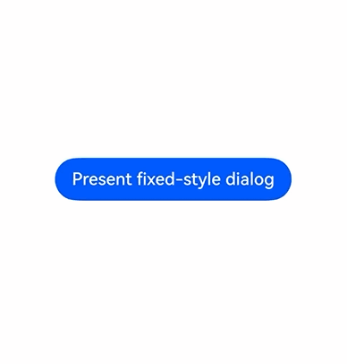
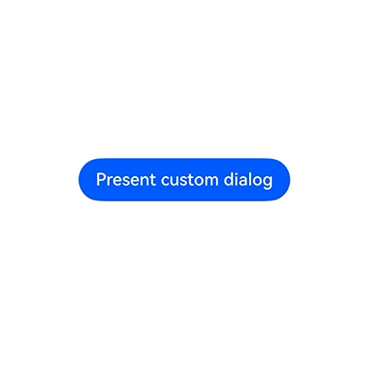

# Class (DialogPresenter)

<!--Kit: ArkUI-->
<!--Subsystem: ArkUI-->
<!--Owner: @houguobiao-->
<!--Designer: @houguobiao-->
<!--Tester: @lxl007-->
<!--Adviser: @Brilliantry_Rui-->
<!-- md-trans-meta sourceCommit=7fc39f347cbf6fb5f978319188a05e74c6344424 translatedAt=2026-09-03T08:54:17.842Z pushedAt=2026-09-04T04:05:46.913Z -->

Provides unified Dialog APIs for creating and displaying fixed-style and custom-style dialog boxes, and updating and closing dialog boxes. It applies to scenarios where pop-up interactions such as prompts, confirmations, and selections are required within an application.

> **NOTE**
>
> To use the following APIs, first obtain a DialogPresenter object by calling [getDialogPresenter()](arkts-apis-uicontext-uicontext.md#getdialogpresenter) in UIContext, and then call the corresponding methods through the object.

**Since:** 26.1.0

## present

present(options?: dialog.DialogStyleOptions): Promise&lt;DialogResult&gt;

Provides a fixed-style dialog box and returns the dialog result. This API uses a promise to return the result. It is applicable to scenarios where the system's unified style is used to display prompts or confirmation information.

**Atomic service API:** This API can be used in atomic services since API version 26.1.0.

**Model restriction:** This API can be used only in the stage model.

**System capability**: SystemCapability.ArkUI.ArkUI.Full

**Parameters**

| Name  | Type                                                         | Mandatory | Description           |
| ------- | ------------------------------------------------------------ | ---- | -------------- |
| options | [dialog.DialogStyleOptions](js-apis-dialog.md#dialogstyleoptions) | No   | Configuration options of the fixed-style dialog box, used to configure the title, subtitle, message, buttons, and sheet items of the dialog box. The dialog box style (background, alignment, mask, avoidance, etc.) inherits from [dialog.DialogBaseOptions](js-apis-dialog.md#dialogbaseoptions).<br/>**Note:** In dialog.DialogBaseOptions, isModal and showInSubWindow cannot be set to true at the same time. |

**Returns**

| Type                                             | Description                                   |
| ------------------------------------------------ | -------------------------------------- |
| Promise&lt;[DialogResult](js-apis-dialog.md#dialogresult)&gt; | Promise used to return the dialog result, including the dialog box ID. |

**Error codes**

For details about the error codes, see [Popup Window Error Codes](errorcode-promptAction.md).

| ID | Error Message                                                     |
| -------- | ------------------------------------------------------------ |
| 103306   | The dialog cannot be opened due to node mount failure.       |
| 103308   | The dialog cannot be opened due to subwindow create failure. |

**Example**

This example shows how to call the present API to display a fixed-style dialog box and obtain the dialog result through a promise.

Since API version 26.1.0, the [present](#present) API is added.

```ts
import { DialogPresenter, DialogResult } from '@kit.ArkUI';
import { BusinessError } from '@kit.BasicServicesKit';

@Entry
@Component
struct Index {
  private ctx: UIContext = this.getUIContext();
  // Obtain the DialogPresenter instance for presenting and managing dialog boxes.
  private dialogPresenter: DialogPresenter = this.ctx.getDialogPresenter();

  build() {
    Column() {
      Button('Present fixed-style dialog')
        .onClick(() => {
          // Present a fixed-style dialog box, and configure the title, message, and buttons.
          this.dialogPresenter.present({
            title: 'Tips',
            message: { content: 'This is a fixed-style dialog' },
            buttons: [
              {
                value: 'Cancel',
                action: () => {
                  console.info('Cancel button clicked');
                }
              },
              {
                value: 'OK',
                action: () => {
                  console.info('OK button clicked');
                }
              }
            ]
          })
            // The dialog box is presented successfully. Obtain the dialog box ID.
            .then((result: DialogResult) => {
              console.info('present success, dialogId: ' + result.dialogId);
            })
            // The dialog box fails to be presented. Output the error message.
            .catch((error: BusinessError) => {
              console.error(`present error code is ${error.code}, message is ${error.message}`);
            })
        })
    }.width('100%').height('100%').justifyContent(FlexAlign.Center)
  }
}
```



## present

present(content: CustomBuilder \| CustomBuilderWithId \| ComponentContent&lt;Object&gt;, options?: dialog.DialogCustomOptions): Promise&lt;DialogResult&gt;

Provides a custom-style dialog box that contains the provided content and returns the dialog result. This API uses a promise to return the result. It is applicable to scenarios where the content, layout, and style of the dialog box need to be customized.

**Atomic service API:** This API can be used in atomic services since API version 26.1.0.

**Model restriction:** This API can be used only in the stage model.

**System capability**: SystemCapability.ArkUI.ArkUI.Full

**Parameters**

| Name  | Type                                                         | Mandatory | Description               |
| ------- | ------------------------------------------------------------ | ---- | ------------------ |
| content | [CustomBuilder](arkui-ts/ts-types.md#custombuilder8) \| [CustomBuilderWithId](arkts-apis-uicontext-t.md#custombuilderwithid18) \| [ComponentContent](./js-apis-arkui-ComponentContent.md)&lt;Object&gt; | Yes   | Content of the custom dialog box. Three types are supported: **CustomBuilder** (a generator function for custom content), **CustomBuilderWithId** (a generator function that supports passing an ID), and **ComponentContent** (component content that supports state-driven updates). |
| options | [dialog.DialogCustomOptions](js-apis-dialog.md#dialogcustomoptions) | No   | Configuration options of the custom dialog box, used to configure the background, alignment, mask, and avoidance styles of the dialog box. It inherits from **dialog.DialogBaseOptions**. |

**Returns**

| Type                                             | Description                                   |
| ------------------------------------------------ | -------------------------------------- |
| Promise&lt;[DialogResult](js-apis-dialog.md#dialogresult)&gt; | Promise used to return the dialog result, which contains the dialog box ID. |

**Error codes**

For details about the error codes, see [Popup Window Error Codes](errorcode-promptAction.md).

| ID | Error Message                                                     |
| -------- | ------------------------------------------------------------ |
| 103301   | Dialog content error. The ComponentContent is incorrect.     |
| 103302   | Dialog content already exist. The ComponentContent has already been opened. |
| 103306   | The dialog cannot be opened due to node mount failure.       |
| 103308   | The dialog cannot be opened due to subwindow create failure. |

**Example**

This example demonstrates how to present, update, and dismiss a custom-style dialog box by calling the present, update, and dismiss APIs.

Since API version 26.1.0, the [present](#present), [update](#update), and [dismiss](#dismiss) APIs are added.

```ts
import { ComponentContent, DialogPresenter, DialogResult, DialogBaseAlignment } from '@kit.ArkUI';
import { BusinessError } from '@kit.BasicServicesKit';

// Define the parameter class for passing data to the custom dialog box content.
class Params {
  text: string = '';
  constructor(text: string) {
    this.text = text;
  }
}

// Builder function for the custom dialog box content.
@Builder
function buildText(params: Params) {
  Column({ space: 20 }) {
    Text(params.text)
      .fontSize(30)
      .fontWeight(FontWeight.Bold)
      .margin({ bottom: 36 })
    // Update the dialog box style button to dynamically modify the mask color, alignment, and offset.
    Button('Update dialog')
      .onClick(() => {
        dialogPresenter?.update(contentNode, {
          maskColor: Color.Pink,
          alignment: DialogBaseAlignment.CENTER_END,
          offset: { dx: 0, dy: 30}
        })
          .then(() => {
            console.info('update success');
          })
          .catch((error: BusinessError) => {
            console.error(`update error code is ${error.code}, message is ${error.message}`);
          })
      })
    // Dismiss the dialog box button to close the dialog box through the ComponentContent reference.
    Button('Dismiss dialog')
      .onClick(() => {
        dialogPresenter?.dismiss(contentNode)
          .then(() => {
            console.info('dismiss success');
          })
          .catch((error: BusinessError) => {
            console.error(`dismiss error code is ${error.code}, message is ${error.message}`);
          })
      })
  }
}

// Global variable that stores the DialogPresenter instance.
let dialogPresenter: DialogPresenter | null = null;
// Global variable that stores the ComponentContent instance of the custom dialog box.
let contentNode: ComponentContent<Object> | null = null;

@Entry
@Component
struct Index {
  @State message: string = 'custom dialog';

  aboutToAppear(): void {
    // Obtain the DialogPresenter instance.
    dialogPresenter = this.getUIContext().getDialogPresenter();
    // Create a ComponentContent instance and bind the custom builder function and parameters.
    contentNode = new ComponentContent(this.getUIContext(), wrapBuilder(buildText), new Params(this.message));
  }

  build() {
    Column({ space: 10 }) {
      Button('Present custom dialog')
        .onClick(() => {
          // Present the custom-style dialog box by passing the ComponentContent instance and configuration options.
          dialogPresenter?.present(contentNode, {
            isModal: true
          })
            // The dialog box is presented successfully. Obtain the dialog box ID.
            .then((result: DialogResult) => {
              console.info('present success, dialogId: ' + result.dialogId);
            })
            .catch((error: BusinessError) => {
              console.error(`present error code is ${error.code}, message is ${error.message}`);
            })
        })
    }.width('100%').height('100%').justifyContent(FlexAlign.Center)
  }
}
```


## update

update(content: ComponentContent&lt;Object&gt;, options?: dialog.DialogBaseOptions): Promise&lt;void&gt;

Updates a displayed custom dialog box, with no return result. This API uses a promise to return the result. It applies to interaction scenarios where the style or position of a dialog box needs to be dynamically updated after it is displayed.

**Atomic service API:** This API can be used in atomic services since API version 26.1.0.

**Model restriction:** This API can be used only in the stage model.

**System capability**: SystemCapability.ArkUI.ArkUI.Full

**Parameters**

| Name  | Type                                                         | Mandatory | Description                          |
| ------- | ------------------------------------------------------------ | ---- | ----------------------------- |
| content | [ComponentContent](./js-apis-arkui-ComponentContent.md)&lt;Object&gt; | Yes   | Component content used to identify the dialog box.     |
| options | [dialog.DialogBaseOptions](js-apis-dialog.md#dialogbaseoptions) | No   | Options of the dialog box to update. Currently, only **alignment**, **offset**, **autoCancel**, and **maskColor** can be updated.  |

**Returns**

| Type | Description |
| ------------------- | ------------------- |
| Promise&lt;void&gt; | Promise that returns no value.|

**Error codes**

For details about the error codes, see [Popup Window Error Codes](errorcode-promptAction.md).

| ID | Error Message |
| -------- | ------------------------------------------------------------ |
| 103301   | Dialog content error. The ComponentContent is incorrect.     |
| 103303   | Dialog content not found. The ComponentContent cannot be found. |

**Example**

See the example in [present](#present-1).

## dismiss

dismiss(target: number \| ComponentContent&lt;Object&gt;): Promise&lt;void&gt;

Closes a dialog box with no return result. This API uses a promise to return the result. It is applicable to scenarios where the dialog box needs to be closed after a user completes the interaction.

This API accepts a dialog box ID (**dialogId** in [DialogResult](js-apis-dialog.md#dialogresult) returned by [present](#present)) or a [ComponentContent](./js-apis-arkui-ComponentContent.md) reference as the target, and closes the corresponding dialog box.

**Atomic service API:** This API can be used in atomic services since API version 26.1.0.

**Model restriction:** This API can be used only in the stage model.

**System capability**: SystemCapability.ArkUI.ArkUI.Full

**Parameters**

| Name | Type                                                         | Mandatory | Description                                   |
| ------ | ------------------------------------------------------------ | ---- | -------------------------------------- |
| target | number \| [ComponentContent](./js-apis-arkui-ComponentContent.md)&lt;Object&gt; | Yes   | Dialog box or component content for closing a dialog box.            |

**Returns**

| Type                | Description                |
| ------------------- | ------------------- |
| Promise&lt;void&gt; | Promise that returns no result. |

**Error codes**

For details about the error codes, see [Popup Window Error Codes](errorcode-promptAction.md).

| ID | Error Message                                                     |
| -------- | ------------------------------------------------------------ |
| 103301   | Dialog content error. The ComponentContent is incorrect.     |
| 103303   | Dialog content not found. The ComponentContent cannot be found. |

**Example**

This example shows how to dismiss a dialog box by its ID via the dismiss API. For details about how to present a dialog box, see the example of [present](#present).

Since API version 26.1.0, the [present](#present) and [dismiss](#dismiss) APIs are added.

```ts
import { DialogPresenter, DialogResult } from '@kit.ArkUI';
import { BusinessError } from '@kit.BasicServicesKit';


@Entry
@Component
struct Index {
  @State message: string = 'custom dialog';
  dialogPresenter: DialogPresenter | null = this.getUIContext().getDialogPresenter();
  // Save the dialog box ID for subsequent closure.
  dialogId: number = 0;

  @Builder
  customDialogComponent() {
    Column() {
      Text('A dialog is open').fontSize(20)
      Row({ space: 10 }) {
        // Close the dialog box by its ID.
        Button('Close dialog').onClick(() => {
          this.getUIContext().getDialogPresenter().dismiss(this.dialogId)
            .then(() => {
              console.info('dismiss success');
            })
            .catch((error: BusinessError) => {
              console.error(`dismiss error code is ${error.code}, message is ${error.message}`);
            })
        })
      }
    }.height(150).padding(20).justifyContent(FlexAlign.SpaceBetween)
  }

  build() {
    Column({ space: 10 }) {
      Button('Present custom dialog')
        .onClick(() => {
          // Present a custom-style dialog box by passing in the builder function and style configuration.
          this.dialogPresenter?.present(() => {this.customDialogComponent();},
            {
              isModal: true,
              backgroundColor: Color.Pink,
              backgroundBlurStyle: BlurStyle.NONE
            })
            // The dialog box is presented successfully. Save the dialog box ID for subsequent closure.
            .then((result: DialogResult) => {
              this.dialogId = result.dialogId;
              console.info('present success, dialogId: ' + result.dialogId);
            })
            .catch((error: BusinessError) => {
              console.error(`present error code is ${error.code}, message is ${error.message}`);
            })
        })
    }.width('100%').height('100%').justifyContent(FlexAlign.Center)
  }
}
```

