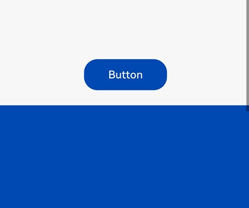

# Class (LuminanceSampler) (System API)
<!--Kit: ArkUI-->
<!--Subsystem: ArkUI-->
<!--Owner: @xuhang363-->
<!--Designer: @CCFFWW-->
<!--Tester: @lxl007-->
<!--Adviser: @Brilliantry_Rui-->

Sets the background luminance color picking parameters, registers the luminance change listening callback, and unregisters the listening callback.

> **NOTE**
>
> - The initial APIs of this module are supported since API version 23. Newly added APIs will be marked with a superscript to indicate their earliest API version.
>
> - The initial APIs of this class are supported since API version 23.
>
> - In the following API examples, you must first use [getLuminanceSampler](js-apis-arkui-UIContext-sys.md#getluminancesampler23) in **UIContext** to obtain a **LuminanceSampler** object, and then call the APIs using the obtained object.

## setBackgroundLuminanceSamplingConfigs<sup>23+</sup>

setBackgroundLuminanceSamplingConfigs(configs: BackgroundLuminanceSamplingConfigs): void

Sets the color picking parameters. If the luminance threshold is not within the specified range or the dark threshold is greater than the luminance threshold, an exception is thrown.

**Atomic service API**: This API can be used in atomic services since API version 23.

**System API**: This is a system API.

**System capability**: SystemCapability.ArkUI.ArkUI.Full

**Parameters**

| **Name**    | **Type**   | **Mandatory**  | **Description**     |
| --- | --- | --- | --- |
| configs | [BackgroundLuminanceSamplingConfigs](arkts-apis-uicontext-i-sys.md#backgroundluminancesamplingconfigs23) | Yes| Color picking parameters.|

**Error codes**

For details about the error codes, see [API Call Error Codes](errorcode-internal.md).

| **ID** | **Error Message**               |
| ------ | ------- |
| 100001 | 1. Incorrect parameter values. <br> 2. Incorrect parameters types.  |

**Example**

For details, see the example of [offBackgroundLuminanceChange](#offbackgroundluminancechange23).

## onBackgroundLuminanceChange<sup>23+</sup>

onBackgroundLuminanceChange(samplingCallback: Callback&lt;number&gt;): void

Registers the callback for listening to color picking.

The background luminance is divided into three ranges based on the luminance threshold and dark threshold set by the [setBackgroundLuminanceSamplingConfigs](./arkts-apis-uicontext-luminancesampler-sys.md#setbackgroundluminancesamplingconfigs23) API: [0, Dark threshold], (Dark threshold, Luminance threshold], and (Luminance threshold, 255]. The callback is triggered when the background luminance range changes (or the listener callback is registered for the first time) and the interval between the current color picking and the last color picking reaches the specified interval, and the current background luminance is returned.

**Atomic service API**: This API can be used in atomic services since API version 23.

**System API**: This is a system API.

**System capability**: SystemCapability.ArkUI.ArkUI.Full

**Parameters**

| **Name**    | **Type**   | **Mandatory**  | **Description**     |
| --- | --- | --- | --- |
| samplingCallback | Callback&lt;number&gt; | Yes| Callback used to return the current background luminance.|

**Example**

For details, see the example of [offBackgroundLuminanceChange](#offbackgroundluminancechange23).

## offBackgroundLuminanceChange<sup>23+</sup>

offBackgroundLuminanceChange(samplingCallback?: Callback&lt;number&gt;): void

Unregisters the callback for listening to color picking. If no callback is specified, all listeners are canceled.

**Atomic service API**: This API can be used in atomic services since API version 23.

**System API**: This is a system API.

**System capability**: SystemCapability.ArkUI.ArkUI.Full

**Parameters**

| **Name**    | **Type**   | **Mandatory**  | **Description**     |
| --- | --- | --- | --- |
| samplingCallback | Callback&lt;number&gt; | No| Callback to unregister.|

**Example**

Since API version 23, the [setBackgroundLuminanceSamplingConfigs](#setbackgroundluminancesamplingconfigs23), [onBackgroundLuminanceChange](#onbackgroundluminancechange23), and [offBackgroundLuminanceChange](#offbackgroundluminancechange23) APIs are added. This example calls these three APIs to obtain the color picker of the corresponding component, set the color picking parameters and color picking callback for the component through the color picker, and implement the custom background-color-based inversion effect through the color picking callback.

```ts
import { LengthMetrics } from '@kit.ArkUI';
import { Edges } from '@ohos.arkui.node';

@Entry
@Component
struct PagePicker {
  @State arr: string[] =
    ['#FFF7F7F7', '#FF004AAF', '#FF4169E1', '#FFA52A2A', '#FF008000', '#FFFFA500', '#FFFFC0CB', '#FF808080'];
  @State myButtonWidthStr: string = '400px';
  @State myButtonWidth: number = 400;
  @State myButtonHeightStr: string = '150px';
  @State myButtonHeight: number = 150;
  @State myColor: string = '#FFF7F7F7';
  @State myButtonFontColor: string = '#FF004AAF';

  build() {
    Row() {
      Stack() {
        Scroll() {
          Column() {
            ForEach(this.arr, (item: Color) => {
              Column()
                .width('100%')
                .height(200)
                .backgroundColor(item)
            })
            ForEach(this.arr, (item: Color) => {
              Column()
                .width('100%')
                .height(200)
                .backgroundColor(item)
            })
          }
          .width('100%')
        }
        .width('100%')
        .height('100%')

        Button('Button')
          .backgroundColor(this.myColor)
          .fontColor(this.myButtonFontColor)
          .margin({ bottom: 300 })
          .width(this.myButtonWidthStr)
          .height(this.myButtonHeightStr)
          .id("myButton")
          .onClick(() => {
            let uiContext = this.getUIContext();
            let uniqueId = this.getUniqueId();
            // Obtain the color picker.
            let luminanceSampler = uiContext.getLuminanceSampler({ id: "myButton", componentId: uniqueId });
            // Set the color picking range of the node.
            let edges: Edges<LengthMetrics> = {
              top: LengthMetrics.px(0),
              bottom: LengthMetrics.px(this.myButtonHeight),
              left: LengthMetrics.px(0),
              right: LengthMetrics.px(this.myButtonWidth)
            };

            luminanceSampler?.setBackgroundLuminanceSamplingConfigs({
              samplingInterval: 300,
              brightThreshold: 200,
              darkThreshold: 100,
              region: edges
            });
            // Trigger the color picking callback.
            let luminanceChangeCallback = (luminance: number) => {
              if (luminance > 200) {
                this.myColor = '#FF004AAF';
                this.myButtonFontColor = '#FFF7F7F7';
              } else if (luminance < 100) {
                this.myColor = '#FFF7F7F7';
                this.myButtonFontColor = '#FF004AAF';
              }
            };
            luminanceSampler?.offBackgroundLuminanceChange();
            luminanceSampler?.onBackgroundLuminanceChange(luminanceChangeCallback);
          })
      }.width('100%')
      .height('100%')
      .alignContent(Alignment.Bottom)
    }
    .height('100%')
  }
}
```


