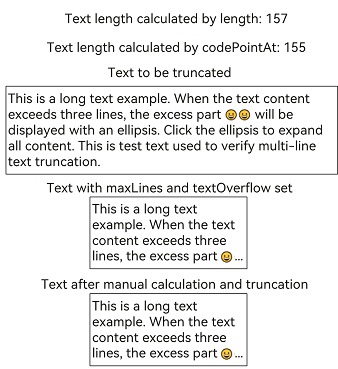
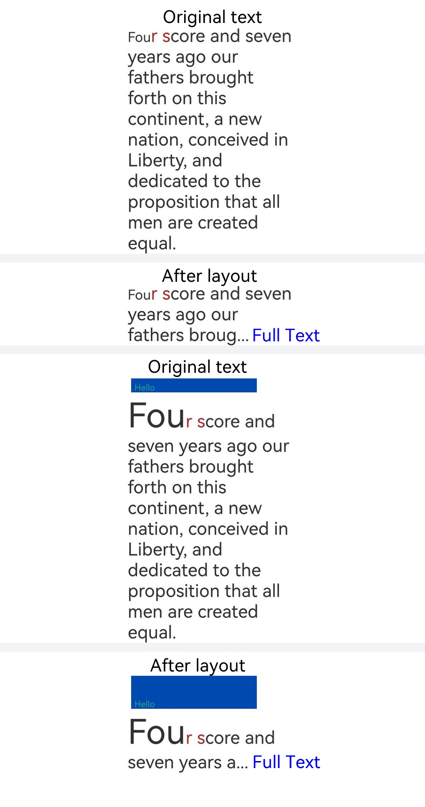

# Class (MeasureUtils)

<!--Kit: ArkUI-->
<!--Subsystem: ArkUI-->
<!--Owner: @hddgzw-->
<!--Designer: @xiangyuan6-->
<!--Tester: @jiaoaozihao-->
<!--Adviser: @Brilliantry_Rui-->
<!-- md-trans-meta sourceCommit=89682c631d1be2b78acdb9477c9eda01133e0baf translatedAt=2026-08-05T03:05:03.598Z pushedAt=2026-08-06T01:28:54.306Z -->

The MeasureUtils class provides text width, height, and other related measurement capabilities, suitable for scenarios such as text-adaptive layout, multi-line text truncation, and dynamic UI adaptation. With this class, you can accurately calculate text dimensions, helping you predict text display effects before layout, and thereby avoiding issues such as text overflow or layout misalignment.

> **NOTE**
>
> - The initial APIs of this module are supported since API version 10. Newly added APIs will be marked with a superscript to indicate their earliest API version.
>
> - The initial APIs of this class are supported since API version 12.
>
> - Before using the following APIs, you must first obtain a MeasureUtils instance using [getMeasureUtils()](arkts-apis-uicontext-uicontext.md#getmeasureutils12) in UIContext, and then call the corresponding methods through this instance.
>
> - If you need more text measurement parameters, such as [includeFontPadding](./arkui-ts/ts-basic-components-text.md#includefontpadding23) and [fallbackLineSpacing](./arkui-ts/ts-basic-components-text.md#fallbacklinespacing23), you are advised to use the corresponding graphics measurement API [Paragraph](../apis-arkgraphics2d/js-apis-graphics-text.md#paragraph).
>
> - When calling text measurement APIs, avoid simultaneously using [ApplicationContext.setFontSizeScale](../apis-ability-kit/js-apis-inner-application-applicationContext.md#applicationcontextsetfontsizescale13) to set the app font size scale. To ensure correct timing, you are advised to listen for font scale changes on your own to guarantee the accuracy of measurement results.
>
> - When measuring truncated text, because the code point length of certain Unicode characters (such as emoji) is greater than 1, directly truncating by string length will lead to inaccurate results. You are advised to iterate based on Unicode code points to avoid incorrect character truncation and ensure accurate measurement results. See example 2 of [measureTextSize](#measuretextsize12).

## measureText<sup>12+</sup>

measureText(options: MeasureOptions): number

Calculates the width of the specified text when displayed as a single-line text. If the text contains multiple lines (separated by the newline character `\n`), the width of the longest line is returned.

> **NOTE**
>
> - When calling this API, avoid simultaneously using [ApplicationContext.setFontSizeScale](../apis-ability-kit/js-apis-inner-application-applicationContext.md#applicationcontextsetfontsizescale13) to set the app font size scale. To ensure correct timing, you are advised to listen for font scale changes on your own to guarantee the accuracy of measurement results.
> - The calculation result of the measureText API is always the width of a single-line text. Layout constraints configured in the input parameter **options** (such as **constraintWidth** and **maxLines**) do not affect the result of **measureText**. If you need to calculate the width under layout constraints, use the [measureTextSize](#measuretextsize12) method.

**Atomic service API**: This API can be used in atomic services since API version 12.

**Model restriction:** This API can be used only in the stage model.

**System capability**: SystemCapability.ArkUI.ArkUI.Full

**Parameters**

| Name    | Type                             | Mandatory  | Description       |
| ------- | ------------------------------- | ---- | --------- |
| options | [MeasureOptions](js-apis-measure.md#measureoptions) | Yes    | Text measurement configuration options, containing properties such as text content (**textContent**) and font size (**fontSize**). Layout constraint properties such as **constraintWidth** and **maxLines** do not affect the calculation result of **measureText**. To calculate the width under layout constraints, use the **measureTextSize** method. |

**Return value**

| Type         | Description      |
| ------------  | --------- |
| number | Text width.<br>**NOTE**<br>Floating-point numbers are rounded up.<br>Unit: px |

**Example**

This example uses the **measureText** API of **MeasureUtils** to obtain the width of the **"Hello World"** text.

```ts
import { MeasureUtils } from '@kit.ArkUI';

@Entry
@Component
struct Index {
  @State uiContext: UIContext = this.getUIContext();
  @State uiContextMeasure: MeasureUtils = this.uiContext.getMeasureUtils();
  @State textWidth: number = this.uiContextMeasure.measureText({
    textContent: 'Hello World',
    fontSize: '50px'
  });

  build() {
    Row() {
      Column() {
        Text(`The width of 'Hello World': ${this.textWidth}`)
      }
      .width('100%')
    }
    .height('100%')
  }
}
```

## measureTextSize<sup>12+</sup>

measureTextSize(options: MeasureOptions): SizeOptions

Calculates the width and height of the specified text.

> **NOTE**
>
> When calling this API, avoid simultaneously using [ApplicationContext.setFontSizeScale](../apis-ability-kit/js-apis-inner-application-applicationContext.md#applicationcontextsetfontsizescale13) to set the app font size scale. To ensure correct timing, you are advised to listen for font scale changes on your own to guarantee the accuracy of measurement results.

**Atomic service API**: This API can be used in atomic services since API version 12.

**Model restriction:** This API can be used only in the stage model.

**System capability**: SystemCapability.ArkUI.ArkUI.Full

**Parameters**

| Name    | Type                             | Mandatory  | Description       |
| ------- | ------------------------------- | ---- | --------- |
| options | [MeasureOptions](js-apis-measure.md#measureoptions) | Yes | Text measurement configuration options, including attributes such as text content (**textContent**), font size (**fontSize**), constraint width (**constraintWidth**), and maximum lines (**maxLines**). This parameter is used to configure the measurement parameters of the text to be calculated. |

**Return value**

| Type         | Description      |
| ------------  | --------- |
| [SizeOptions](arkui-ts/ts-types.md#sizeoptions)   | Layout width and height occupied by the text.<br>**NOTE**<br>When **constraintWidth** is not set, the returned text width is rounded up; when **constraintWidth** is passed, the returned text width is not rounded.<br>Both the text width and height return values are in px. |

**Example 1**

This example uses the **measureTextSize** API of **MeasureUtils** to obtain the width and height of the **"Hello World"** text.

```ts
import { MeasureUtils } from '@kit.ArkUI';

@Entry
@Component
struct Index {
  @State uiContext: UIContext = this.getUIContext();
  @State uiContextMeasure: MeasureUtils = this.uiContext.getMeasureUtils();
  textSize: SizeOptions = this.uiContextMeasure.measureTextSize({
    textContent: 'Hello World',
    fontSize: '50px'
  });
  build() {
    Row() {
      Column() {
        Text(`The width of 'Hello World': ${this.textSize.width}`)
        Text(`The height of 'Hello World': ${this.textSize.height}`)
      }
      .width('100%')
    }
    .height('100%')
  }
}
```

**Example 2**

This example implements custom text truncation using the **measureTextSize** method from **MeasureUtils** combined with Unicode code point calculation. This approach achieves the same effect as setting [maxLines](./arkui-ts/ts-basic-components-text.md#maxlines) and [textOverflow](./arkui-ts/ts-basic-components-text.md#textoverflow).

```ts
@Entry
@Component
struct TextDemo {
  @State displayedText: string = '';
  @State textWidth: number = 150;
  @State numLenghth: number = 0;
  @State numUnocde: number = 0;
  private fullText: string =
    'This is a long text example. When the text content exceeds three lines, the excess part 😀😀 will be displayed with an ellipsis. Click the ellipsis to expand all content. This is test text used to verify multi-line text truncation.'
  private maxLines: number = 3;

  aboutToAppear() {
    const codePoints = this.getCodePoints(this.fullText);
    this.numLenghth = this.fullText.length;
    this.numUnocde = codePoints.length;
    this.calculateText(this.maxLines, this.fullText);
  }

  getCodePoints(text: string): number[] { // Split text using codePointAt.
    const codePoints: number[] = [];
    let index = 0;
    while (index < text.length) {
      const codePoint = text.codePointAt(index);
      if (codePoint === undefined) {
        break;
      }
      codePoints.push(codePoint);
      index += codePoint > 0xFFFF? 2 : 1; // Handle 4-byte characters.
    }
    return codePoints;
  }

  lastUnicodeLength(str: string): number { // Obtain the Unicode length of the last character in the string.
    if (!str || str.length < 1) {
      return 0;
    }
    if (str.length < 2) {
      return 1;
    }
    let lastCodePoint = str.codePointAt(str.length - 2);
    if (lastCodePoint === undefined) {
      return 1;
    }
    let lastStr = String.fromCodePoint(lastCodePoint);
    return lastStr.length;
  }

  calculateText(maxLines: number, fullText: string): void { // Calculate and process text truncation.
    const noMaxLinesSize = this.getUIContext().getMeasureUtils().measureTextSize({
      textContent: fullText,
      constraintWidth: this.textWidth
    });
    const hasMaxLinesSize = this.getUIContext().getMeasureUtils().measureTextSize({
      textContent: fullText,
      constraintWidth: this.textWidth,
      maxLines: this.maxLines
    });

    this.displayedText = this.fullText;
    if (Number(noMaxLinesSize.height) > Number(hasMaxLinesSize.height)) { // Truncation exists.
      while (this.displayedText.length > 0) {
        this.displayedText =
          this.displayedText.slice(0,
            this.displayedText.length - this.lastUnicodeLength(this.displayedText)); // Remove characters.
        let textAfterCut = this.displayedText + '...'; // Append an ellipsis.
        let sizeAfteCut = this.getUIContext().getMeasureUtils().measureTextSize({
          textContent: textAfterCut,
          constraintWidth: this.textWidth
        });
        if (Number(sizeAfteCut.height) <= Number(hasMaxLinesSize.height)) {
          break;
        } else {
          console.info('displayedText: ' + this.displayedText);
        }
      }
      this.displayedText = this.displayedText + '...';
    }
  }

  build() {
    Column({ space: 10 }) {
      Text(`Text length calculated by length: ${this.numLenghth}`)
      Text(`Text length calculated by codePointAt: ${this.numUnocde}`)
      Text('Text to be truncated')
      Text(this.fullText)
        .borderWidth(1)

      Text('Below is the text with maxLines and textOverflow set')
      Text(this.fullText)
        .maxLines(this.maxLines)
        .textOverflow({ overflow: TextOverflow.Ellipsis })
        .width(this.textWidth)
        .borderWidth(1)

      Text('Text after manual calculation and truncation')
      Text(this.displayedText)
        .width(this.textWidth)
        .borderWidth(1)
    }
    .padding(20)
  }
}
```



## getParagraphs<sup>20+</sup>

getParagraphs(styledString: StyledString, options?: TextLayoutOptions): Array\<Paragraph\>

Converts a styled string into an array of corresponding [Paragraph](../apis-arkgraphics2d/js-apis-graphics-text.md#paragraph) objects based on text layout options.

**Model restriction:** This API can be used only in the stage model.

**System capability**: SystemCapability.ArkUI.ArkUI.Full

**Parameters**

| Name| Type  | Mandatory| Description          |
| ----- | ------ | ---- | -------------- |
| styledString | [StyledString](arkui-ts/ts-universal-styled-string.md#styledstring) | Yes  | Styled string to be converted.|
| options | [TextLayoutOptions](arkui-ts/ts-text-common.md#textlayoutoptions20) | No | Text layout options. If omitted, the default layout configuration is used.|

**Return value**

| Type    | Description       |
| ------ | --------- |
| Array\<[Paragraph](../apis-arkgraphics2d/js-apis-graphics-text.md#paragraph)> | Array of [Paragraph](../apis-arkgraphics2d/js-apis-graphics-text.md#paragraph) objects obtained after conversion based on the text layout options, used for subsequent text layout calculation. |

**Example**

The following example demonstrates how to use the **getParagraphs** API from **MeasureUtils** to measure text. When the content exceeds the maximum number of display lines, the text is truncated and displays a "... Full Text" indicator.

``` typescript
import { LengthMetrics } from '@kit.ArkUI';
import { drawing } from '@kit.ArkGraphics2D';

class MyCustomSpan extends CustomSpan {
  constructor(word: string, width: number, height: number, context: UIContext) {
    super();
    this.word = word;
    this.width = width;
    this.height = height;
    this.context = context;
  }

  onMeasure(measureInfo: CustomSpanMeasureInfo): CustomSpanMetrics {
    return { width: this.width, height: this.height };
  }

  onDraw(context: DrawContext, options: CustomSpanDrawInfo) {
    let canvas = context.canvas;
    const brush = new drawing.Brush();
    brush.setColor({
      alpha: 255,
      red: 0,
      green: 74,
      blue: 175
    });
    const font = new drawing.Font();
    font.setSize(25);
    const textBlob = drawing.TextBlob.makeFromString(this.word, font, drawing.TextEncoding.TEXT_ENCODING_UTF8);
    canvas.attachBrush(brush);
    canvas.drawRect({
      left: options.x + 10,
      right: options.x + this.context.vp2px(this.width) - 10,
      top: options.lineTop + 10,
      bottom: options.lineBottom - 10
    });
    brush.setColor({
      alpha: 255,
      red: 23,
      green: 169,
      blue: 141
    });
    canvas.attachBrush(brush);
    canvas.drawTextBlob(textBlob, options.x + 20, options.lineBottom - 15);
    canvas.detachBrush();
  }

  setWord(word: string) {
    this.word = word;
  }

  width: number = 160;
  word: string = 'drawing';
  height: number = 10;
  context: UIContext;
}

@Entry
@Component
struct Index {
  str: string =
    'Four score and seven years ago our fathers brought forth on this continent, a new nation, conceived in Liberty, and dedicated to the proposition that all men are created equal.';
  mutableStr2 = new MutableStyledString(this.str, [
    {
      start: 0,
      length: 3,
      styledKey: StyledStringKey.FONT,
      styledValue: new TextStyle({ fontSize: LengthMetrics.px(20) })
    },
    {
      start: 3,
      length: 3,
      styledKey: StyledStringKey.FONT,
      styledValue: new TextStyle({ fontColor: Color.Brown })
    }
  ]);

  // Measure the number of lines a styled string can display within a specified width.
  getLineNum(styledString: StyledString, width: LengthMetrics) {
    let paragraphArr = this.getUIContext().getMeasureUtils().getParagraphs(styledString, { constraintWidth: width });
    let lineCount = 0;
    for (let i = 0; i < paragraphArr.length; ++i) {
      lineCount += paragraphArr[i].getLineCount();
    }
    return lineCount;
  }

  // Determine the maximum character count that can be displayed in maxLines for a styled string.
  getCorrectIndex(styledString: MutableStyledString, maxLines: number, width: LengthMetrics) {
    let low = 0;
    let high = styledString.length - 1;
    // Use binary search.
    while (low <= high) {
      let mid = (low + high) >> 1;
      console.info('demo: get ' + low + ' ' + high + ' ' + mid);
      let moreStyledString = new MutableStyledString('... full text', [{
        start: 4,
        length: 2,
        styledKey: StyledStringKey.FONT,
        styledValue: new TextStyle({ fontColor: Color.Blue })
      }]);
      moreStyledString.insertStyledString(0, styledString.subStyledString(0, mid));
      let lineNum = this.getLineNum(moreStyledString, width);
      if (lineNum <= maxLines) {
        low = mid + 1;
      } else {
        high = mid - 1;
      }
    }
    return high;
  }

  mutableStrAllContent = new MutableStyledString(this.str, [
    {
      start: 0,
      length: 3,
      styledKey: StyledStringKey.FONT,
      styledValue: new TextStyle({ fontSize: LengthMetrics.px(40) })
    },
    {
      start: 3,
      length: 3,
      styledKey: StyledStringKey.FONT,
      styledValue: new TextStyle({ fontColor: Color.Brown })
    }
  ]);
  customSpan1: MyCustomSpan = new MyCustomSpan('Hello', 120, 10, this.getUIContext());
  mutableStrAllContent2 = new MutableStyledString(this.str, [
    {
      start: 0,
      length: 3,
      styledKey: StyledStringKey.FONT,
      styledValue: new TextStyle({ fontSize: LengthMetrics.px(100) })
    },
    {
      start: 3,
      length: 3,
      styledKey: StyledStringKey.FONT,
      styledValue: new TextStyle({ fontColor: Color.Brown })
    }
  ]);
  controller: TextController = new TextController();
  controller2: TextController = new TextController();
  textController: TextController = new TextController();
  textController2: TextController = new TextController();

  aboutToAppear() {
    this.mutableStrAllContent2.insertStyledString(0, new StyledString(this.customSpan1));
    this.mutableStr2.insertStyledString(0, new StyledString(this.customSpan1));
  }

  build() {
    Scroll() {
      Column() {
        Text('Original text')
        Text(undefined, { controller: this.controller }).width('500px').onAppear(() => {
          this.controller.setStyledString(this.mutableStrAllContent);
        })
        Divider().strokeWidth(8).color('#F1F3F5')
        Text('After layout')
        Text(undefined, { controller: this.textController }).onAppear(() => {
          let correctIndex = this.getCorrectIndex(this.mutableStrAllContent, 3, LengthMetrics.px(500));
          if (correctIndex != this.mutableStrAllContent.length - 1) {
            let moreStyledString = new MutableStyledString('... full text', [{
              start: 4,
              length: 2,
              styledKey: StyledStringKey.FONT,
              styledValue: new TextStyle({ fontColor: Color.Blue })
            }]);
            moreStyledString.insertStyledString(0, this.mutableStrAllContent.subStyledString(0, correctIndex));
            this.textController.setStyledString(moreStyledString);
          } else {
            this.textController.setStyledString(this.mutableStrAllContent);
          }
        })
          .width('500px')
        Divider().strokeWidth(8).color('#F1F3F5')
        Text('Original text')
        Text(undefined, { controller: this.controller2 }).width('500px').onAppear(() => {
          this.controller2.setStyledString(this.mutableStrAllContent2);
        })
        Divider().strokeWidth(8).color('#F1F3F5')
        Text('After layout')
        Text(undefined, { controller: this.textController2 }).onAppear(() => {
          let correctIndex = this.getCorrectIndex(this.mutableStrAllContent2, 3, LengthMetrics.px(500));
          let moreStyledString = new MutableStyledString('... full text', [{
            start: 4,
            length: 2,
            styledKey: StyledStringKey.FONT,
            styledValue: new TextStyle({ fontColor: Color.Blue })
          }]);
          moreStyledString.insertStyledString(0, this.mutableStrAllContent2.subStyledString(0, correctIndex));
          this.textController2.setStyledString(moreStyledString);
        })
          .width('500px')
      }.width('100%')
    }
  }
}
```

