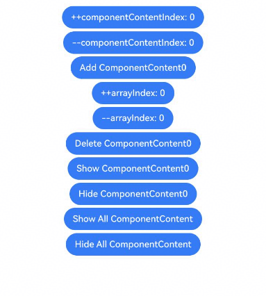

# Class (OverlayManager)
<!--Kit: ArkUI-->
<!--Subsystem: ArkUI-->
<!--Owner: @houguobiao-->
<!--Designer: @houguobiao-->
<!--Tester: @lxl007-->
<!--Adviser: @Brilliantry_Rui-->

Provides the capability to draw overlays. OverlayManager allows you to manage overlay nodes through configuration of layer level, display order, display mode, and more. It is suitable for scenarios where overlays need to be displayed for a long time above pages but below dialogs, popups, and menus. This class provides flexible overlay management capabilities.

> **NOTE**
>
> - The initial APIs of this module are supported since API version 10. Newly added APIs will be marked with a superscript to indicate their earliest API version.
>
> - The initial APIs of this class are supported since API version 12.
>
> - The APIs of this module can be used only in the stage model.
>
> - In the following API examples, you must first use [getOverlayManager()](arkts-apis-uicontext-uicontext.md#getoverlaymanager12) in **UIContext** to obtain an **OverlayManager** instance, and then call the APIs using the obtained instance.
>
> - The nodes on **OverlayManager** are above the page level, but below such components as created through **Dialog**, **Popup**, **Menu**, **BindSheet**, **BindContentCover**, and **Toast**.
>
> - The drawing method inside and outside the safe area of nodes on **OverlayManager** is consistent with that of the page, and the keyboard avoidance method is also the same as that of the page.
>
> - For properties related to **OverlayManager**, you are advised to use AppStorage for global storage across the application to prevent changes in property values when switching pages, which could lead to service errors.

## openOrderOverlay

openOrderOverlay(content: ComponentContent, options?: OrderOverlayOptions): Promise&lt;void&gt;

Opens an overlay that supports level configuration on **OverlayManager**. The content of the overlay is determined by the **content** parameter. This API uses a promise to return the result.

**Since:** 26.0.0

**Model restriction:** This API can be used only in the stage model.

**Atomic service API:** This API can be used in atomic services since API version 26.0.0.

**System capability**: SystemCapability.ArkUI.ArkUI.Full

**Parameters**

| Name    | Type                                      | Mandatory   | Description         |
| ------- | ---------------------------------------- | ------ | ----------- |
| content | [ComponentContent](js-apis-arkui-ComponentContent.md#componentcontent-1) | Yes   | Content to be displayed on the overlay. This content node needs to be added to the OverlayManager.<br>**NOTE**<br> By default, the new node is centered on the page and stacked according to its stacking level.|
| options | [OrderOverlayOptions](#orderoverlayoptions) | No   | Layer level configuration options of the floating layer. If this parameter is not passed, the default configuration is used.|

**Return value**

| Type| Description|
| -------- | -------- |
| Promise&lt;void&gt; | Promise used to return the result. If the operation is successful, no result is returned. If the operation fails, an error is thrown. For details about the error codes, see the error code description.|

**Error codes**

For details about the error codes, see [Popup Window Error Codes](errorcode-promptAction.md).

| ID| Error Message|
| -------- | -------- |
| 103307 | The overlay cannot be opened due to the system pop-up window. |

**Example**

```ts
import { ComponentContent, OverlayManager, LevelOrder, LevelMode } from '@kit.ArkUI';

class Params {
  text: string = '';
  offset: Position;

  constructor(text: string, offset: Position) {
    this.text = text;
    this.offset = offset;
  }
}

@Builder
function builderText(params: Params) {
  Column() {
    Text(params.text)
      .fontSize(30)
      .fontWeight(FontWeight.Bold)
  }.offset(params.offset)
}

@Entry
@Component
struct OverlayExample {
  @State message: string = 'ComponentContent';
  private uiContext: UIContext = this.getUIContext();
  private overlayNode: OverlayManager = this.uiContext.getOverlayManager();

  build() {
    Column({ space: 5 }) {
      Button ('Open Overlay').onClick(() => {
        let componentContent = new ComponentContent(
          this.uiContext, wrapBuilder<[Params]>(builderText),
          new Params(this.message, { x: 0, y: 110 })
        );
        this.overlayNode.openOrderOverlay(componentContent, {
          levelOrder: LevelOrder.clamp(100),
          levelMode: LevelMode.OVERLAY
        });
      })
    }
    .width('100%')
    .height('100%')
  }
}
```

## OrderOverlayOptions

Layer level configuration options of the floating layer.

**Since:** 26.0.0

**Model restriction:** This API can be used only in the stage model.

**Atomic service API:** This API can be used in atomic services since API version 26.0.0.

**System capability**: SystemCapability.ArkUI.ArkUI.Full

| Name| Type| Read-Only| Optional| Description|
| -------- | -------- | -------- |--------| -------- |
| levelOrder | [LevelOrder](js-apis-promptAction.md#levelorder18) | No| Yes| Display order of the overlay.<br>**NOTE**<br>- Default value: **LevelOrder.clamp(0)**|
| levelMode | [LevelMode](js-apis-promptAction.md#levelmode15) | No| Yes| Display mode of the overlay.<br>**NOTE**<br>- Default value: LevelMode.OVERLAY |
| levelUniqueId | number | No| Yes| Unique ID of the target node under the specified overlay, obtained via [getUniqueId](js-apis-arkui-frameNode.md#getuniqueid12). The value must be greater than or equal to 0. This parameter takes effect only when **levelMode** is set to **LevelMode.EMBEDDED**.|

## addComponentContent<sup>12+</sup>

addComponentContent(content: ComponentContent, index?: number): void

Adds a specified node to OverlayManager. You can use the **index** parameter to control the level of the new node.

**Model restriction:** This API can be used only in the stage model.

**Atomic service API**: This API can be used in atomic services since API version 12.

**System capability**: SystemCapability.ArkUI.ArkUI.Full

**Parameters**

| Name    | Type                                      | Mandatory  | Description         |
| ------- | ---------------------------------------- | ---- | ----------- |
| content | [ComponentContent](js-apis-arkui-ComponentContent.md) | Yes   | Adds a specified content node to the OverlayManager.<br>**NOTE**<br> By default, the new node is centered on the page and stacked according to its stacking level.|
| index | number | No   | Stacking level of the new node on the **OverlayManager**.<br>**NOTE**<br> If the value is greater than or equal to 0, a higher value indicates a higher layer level. If multiple ComponentContent entries share the same index, the later-added ones appear above earlier ones.<br> If the value is less than 0, **null**, or **undefined**, the **ComponentContent** node is added at the highest level by default.<br>If the same **ComponentContent** node is added multiple times, only the last added one is retained.|

**Example**

```ts
import { ComponentContent, OverlayManager } from '@kit.ArkUI';

class Params {
  text: string = '';
  offset: Position;

  constructor(text: string, offset: Position) {
    this.text = text;
    this.offset = offset;
  }
}

@Builder
function builderText(params: Params) {
  Column() {
    Text(params.text)
      .fontSize(30)
      .fontWeight(FontWeight.Bold)
  }.offset(params.offset)
}

@Entry
@Component
struct OverlayExample {
  @State message: string = 'ComponentContent';
  private uiContext: UIContext = this.getUIContext();
  private overlayNode: OverlayManager = this.uiContext.getOverlayManager();
  @StorageLink('contentArray') contentArray: ComponentContent<Params>[] = [];
  @StorageLink('componentContentIndex') componentContentIndex: number = 0;
  @StorageLink('arrayIndex') arrayIndex: number = 0;
  @StorageLink('componentOffset') componentOffset: Position = { x: 0, y: 110 };

  build() {
    Column({ space: 5 }) {
      Button('++componentContentIndex: ' + this.componentContentIndex).onClick(() => {
        ++this.componentContentIndex;
      })
      Button('--componentContentIndex: ' + this.componentContentIndex).onClick(() => {
        --this.componentContentIndex;
      })
      Button('Add ComponentContent' + this.contentArray.length).onClick(() => {
        let componentContent = new ComponentContent(
          this.uiContext, wrapBuilder<[Params]>(builderText),
          new Params(this.message + (this.contentArray.length), this.componentOffset)
        );
        this.contentArray.push(componentContent);
        this.overlayNode.addComponentContent(componentContent, this.componentContentIndex);
      })
      Button('++arrayIndex: ' + this.arrayIndex).onClick(() => {
        ++this.arrayIndex;
      })
      Button('--arrayIndex: ' + this.arrayIndex).onClick(() => {
        --this.arrayIndex;
      })
      Button('Delete ComponentContent' + this.arrayIndex).onClick(() => {
        if (this.arrayIndex >= 0 && this.arrayIndex < this.contentArray.length) {
          let componentContent = this.contentArray.splice(this.arrayIndex, 1);
          this.overlayNode.removeComponentContent(componentContent.pop());
        } else {
          console.info("Invalid arrayIndex.");
        }
      })
      Button('Show ComponentContent' + this.arrayIndex).onClick(() => {
        if (this.arrayIndex >= 0 && this.arrayIndex < this.contentArray.length) {
          let componentContent = this.contentArray[this.arrayIndex];
          this.overlayNode.showComponentContent(componentContent);
        } else {
          console.info("Invalid arrayIndex.");
        }
      })
      Button('Hide ComponentContent' + this.arrayIndex).onClick(() => {
        if (this.arrayIndex >= 0 && this.arrayIndex < this.contentArray.length) {
          let componentContent = this.contentArray[this.arrayIndex];
          this.overlayNode.hideComponentContent(componentContent);
        } else {
          console.info("Invalid arrayIndex.");
        }
      })
      Button('Show All ComponentContent').onClick(() => {
        this.overlayNode.showAllComponentContents();
      })
      Button('Hide All ComponentContent').onClick(() => {
        this.overlayNode.hideAllComponentContents();
      })
    }
    .width('100%')
    .height('100%')
  }
}
```



## addComponentContentWithOrder<sup>18+</sup>

addComponentContentWithOrder(content: ComponentContent, levelOrder?: LevelOrder): void

Creates an overlay node with the specified display order. This API allows you to define the stacking order of the nodes when they are created.

**Model restriction:** This API can be used only in the stage model.

**Atomic service API**: This API can be used in atomic services since API version 18.

**System capability**: SystemCapability.ArkUI.ArkUI.Full

**Parameters**

| Name    | Type                                      | Mandatory  | Description         |
| ------- | ---------------------------------------- | ---- | ----------- |
| content | [ComponentContent](js-apis-arkui-ComponentContent.md) | Yes   | Adds a specified content node to the OverlayManager.<br>**NOTE**<br> By default, the new node is centered on the page and stacked according to its stacking level.|
| levelOrder | [LevelOrder](js-apis-promptAction.md#levelorder18) | No   | Display order of the new floating layer node.<br>**NOTE**<br>- Default value: **LevelOrder.clamp(0)**|

**Example**

This example shows how to call the addComponentContentWithOrder API to create a floating layer node and specify the display order.

```ts
import { ComponentContent, PromptAction, LevelOrder, UIContext, OverlayManager } from '@kit.ArkUI';

class Params {
  text: string = '';
  offset: Position;
  constructor(text: string, offset: Position) {
    this.text = text;
    this.offset = offset;
  }
}
@Builder
function builderText(params: Params) {
  Column() {
    Text(params.text)
      .fontSize(30)
      .fontWeight(FontWeight.Bold)
  }.offset(params.offset)
}

@Entry
@Component
struct Index {
  @State message: string = 'Dialog box';
  private ctx: UIContext = this.getUIContext();
  private promptAction: PromptAction = this.ctx.getPromptAction();
  private overlayNode: OverlayManager = this.ctx.getOverlayManager();
  @StorageLink('contentArray') contentArray: ComponentContent<Params>[] = [];
  @StorageLink('componentContentIndex') componentContentIndex: number = 0;
  @StorageLink('arrayIndex') arrayIndex: number = 0;
  @StorageLink('componentOffset') componentOffset: Position = { x: 0, y: 80 };

  build() {
    Row() {
      Column({ space: 10 }) {
        Button('OverlayManager Bottom Overlay')
          .fontSize(20)
          .onClick(() => {
            let componentContent = new ComponentContent(
              this.ctx, wrapBuilder<[Params]>(builderText),
              new Params(this.message + (this.contentArray.length), this.componentOffset)
            );
            this.contentArray.push(componentContent);
            this.overlayNode.addComponentContentWithOrder(componentContent, LevelOrder.clamp(100.1));
            let topOrder: LevelOrder = this.promptAction.getTopOrder();
            if (topOrder !== undefined) {
              console.info('topOrder: ' + topOrder.getOrder());
            }
            let bottomOrder: LevelOrder = this.promptAction.getBottomOrder();
            if (bottomOrder !== undefined) {
              console.info('bottomOrder: ' + bottomOrder.getOrder());
            }
          })
        Button('OverlayManager Top Overlay')
          .fontSize(20)
          .onClick(() => {
            let componentContent = new ComponentContent(
              this.ctx, wrapBuilder<[Params]>(builderText),
              new Params(this.message + (this.contentArray.length), this.componentOffset)
            );
            this.contentArray.push(componentContent);
            this.overlayNode.addComponentContentWithOrder(componentContent, LevelOrder.clamp(100.2));
            let topOrder: LevelOrder = this.promptAction.getTopOrder();
            if (topOrder !== undefined) {
              console.info('topOrder: ' + topOrder.getOrder());
            }
            let bottomOrder: LevelOrder = this.promptAction.getBottomOrder();
            if (bottomOrder !== undefined) {
              console.info('bottomOrder: ' + bottomOrder.getOrder());
            }
          })
      }.width('100%')
    }.height('100%')
  }
}
```


## removeComponentContent<sup>12+</sup>

removeComponentContent(content: ComponentContent): void

Removes a specified node from the OverlayManager

**Model restriction:** This API can be used only in the stage model.

**Atomic service API**: This API can be used in atomic services since API version 12.

**System capability**: SystemCapability.ArkUI.ArkUI.Full

**Parameters**

| Name    | Type                                      | Mandatory  | Description         |
| ------- | ---------------------------------------- | ---- | ----------- |
| content | [ComponentContent](js-apis-arkui-ComponentContent.md) | Yes   | Content to remove from the **OverlayManager**.|

**Example**

For details, see the [addComponentContent](#addcomponentcontent12) example.

## showComponentContent<sup>12+</sup>

showComponentContent(content: ComponentContent): void

Shows a specified **ComponentContent** node on the **OverlayManager**.

**Model restriction:** This API can be used only in the stage model.

**Atomic service API**: This API can be used in atomic services since API version 12.

**System capability**: SystemCapability.ArkUI.ArkUI.Full

**Parameters**

| Name    | Type                                      | Mandatory  | Description         |
| ------- | ---------------------------------------- | ---- | ----------- |
| content | [ComponentContent](js-apis-arkui-ComponentContent.md) | Yes   | Content to show on the **OverlayManager**.|

**Example**

For details, see the [addComponentContent](#addcomponentcontent12) example.

## hideComponentContent<sup>12+</sup>

hideComponentContent(content: ComponentContent): void

Hides a specified **ComponentContent** node on the **OverlayManager**.

**Model restriction:** This API can be used only in the stage model.

**Atomic service API**: This API can be used in atomic services since API version 12.

**System capability**: SystemCapability.ArkUI.ArkUI.Full

**Parameters**

| Name    | Type                                      | Mandatory  | Description         |
| ------- | ---------------------------------------- | ---- | ----------- |
| content | [ComponentContent](js-apis-arkui-ComponentContent.md) | Yes   | Content to hide on the **OverlayManager**.|

**Example**

For details, see the [addComponentContent](#addcomponentcontent12) example.

## showAllComponentContents<sup>12+</sup>

showAllComponentContents(): void

Shows all **ComponentContent** nodes on the **OverlayManager**.

**Model restriction:** This API can be used only in the stage model.

**Atomic service API**: This API can be used in atomic services since API version 12.

**System capability**: SystemCapability.ArkUI.ArkUI.Full

**Example**

For details, see the [addComponentContent](#addcomponentcontent12) example.

## hideAllComponentContents<sup>12+</sup>

hideAllComponentContents(): void

Hides all **ComponentContent** nodes on the **OverlayManager**.

**Model restriction:** This API can be used only in the stage model.

**Atomic service API**: This API can be used in atomic services since API version 12.

**System capability**: SystemCapability.ArkUI.ArkUI.Full

**Example**

For details, see the [addComponentContent](#addcomponentcontent12) example.
