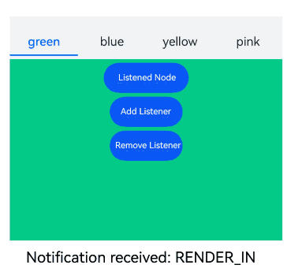
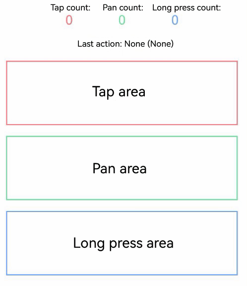

# Class (UIObserver)

<!--Kit: ArkUI-->
<!--Subsystem: ArkUI-->
<!--Owner: @piggyguy; @xiang-shouxing; @yangfan229-->
<!--Designer: @piggyguy; @xiang-shouxing; @yangfan229-->
<!--Tester: @fredyuan912-->
<!--Adviser: @Brilliantry_Rui-->

Provides APIs for listening for UI component behavior changes.

> **NOTE**
>
> - The initial APIs of this module are supported since API version 10. Newly added APIs will be marked with a superscript to indicate their earliest API version.
>
> - The initial APIs of this class are supported since API version 11.
>
> - In the following API examples, you must first use [getUIObserver()](arkts-apis-uicontext-uicontext.md#getuiobserver11) in **UIContext** to obtain a **UIObserver** instance, and then call the APIs using the obtained instance.
>
> - UIObserver can only listen for relevant information within the current process and does not support obtaining information in cross-process scenarios<!--Del--> such as [UIExtensionComponent](../../reference/apis-arkui/arkui-ts/ts-container-ui-extension-component-sys.md)<!--DelEnd-->.

## on('navDestinationUpdate')<sup>11+</sup>

on(type: 'navDestinationUpdate', callback: Callback\<observer.NavDestinationInfo\>): void

Listens for [NavDestination](arkui-ts/ts-basic-components-navdestination.md) component state changes.

**Atomic service API**: This API can be used in atomic services since API version 12.

**System capability**: SystemCapability.ArkUI.ArkUI.Full

**Parameters**

| Name  | Type                                                 | Mandatory| Description                                                        |
| -------- | ----------------------------------------------------- | ---- | ------------------------------------------------------------ |
| type     | string                                                | Yes  | Event type. The value is fixed at **'navDestinationUpdate'**, which indicates [NavDestination](arkui-ts/ts-basic-components-navdestination.md) component state changes.|
| callback | Callback\<observer.[NavDestinationInfo](js-apis-arkui-observer.md#navdestinationinfo)\> | Yes  | Callback used to return the result. Returns the current [NavDestination](arkui-ts/ts-basic-components-navdestination.md) component state.                |

**Example**

<!--code_no_check-->
```ts
// Index.ets
// Example usage of uiObserver.on('navDestinationUpdate', callback)
// uiObserver.off('navDestinationUpdate', callback)

@Component
struct PageOne {
  build() {
    NavDestination() {
      Text("pageOne")
    }.title("pageOne")
  }
}

@Entry
@Component
struct Index {
  private stack: NavPathStack = new NavPathStack();

  @Builder
  PageBuilder(name: string) {
    PageOne()
  }

  aboutToAppear() {
    // Add event listeners.
    this.getUIContext().getUIObserver().on('navDestinationUpdate', (info) => {
      console.info('NavDestination state update', JSON.stringify(info));
    });
  }

  aboutToDisappear() {
    // Unregister the listener. Omitting the callback parameter removes all registered listeners.
    this.getUIContext().getUIObserver().off('navDestinationUpdate');
  }

  build() {
    Column() {
      Navigation(this.stack) {
        Button("push").onClick(() => {
          // Push the PageOne NavDestination onto the navigation stack.
          this.stack.pushPath({ name: "pageOne" });
        })
      }
      .title("Navigation")
      .navDestination(this.PageBuilder)
    }
    .width('100%')
    .height('100%')
  }
}
```

## off('navDestinationUpdate')<sup>11+</sup>

off(type: 'navDestinationUpdate', callback?: Callback\<observer.NavDestinationInfo\>): void

Unregisters the listener for [NavDestination](arkui-ts/ts-basic-components-navdestination.md) component state changes.

**Atomic service API**: This API can be used in atomic services since API version 12.

**System capability**: SystemCapability.ArkUI.ArkUI.Full

**Parameters**

| Name  | Type                                                 | Mandatory| Description                                                        |
| -------- | ----------------------------------------------------- | ---- | ------------------------------------------------------------ |
| type     | string                                                | Yes  | Event type. The value is fixed at **'navDestinationUpdate'**, which indicates [NavDestination](arkui-ts/ts-basic-components-navdestination.md) component state changes.|
| callback | Callback\<observer.[NavDestinationInfo](js-apis-arkui-observer.md#navdestinationinfo)\> | No  | Target listener to unregister. If this parameter is not provided, all [Navigation](arkui-ts/ts-basic-components-navigation.md) listeners are unregistered.                |

**Example**

See the example for [on('navDestinationUpdate')](#onnavdestinationupdate11).

## on('navDestinationUpdate')<sup>11+</sup>

on(type: 'navDestinationUpdate', options: { navigationId: ResourceStr }, callback: Callback\<observer.NavDestinationInfo\>): void

Listens for [NavDestination](arkui-ts/ts-basic-components-navdestination.md) component state changes via the [Navigation](arkui-ts/ts-basic-components-navigation.md) component ID.

**Atomic service API**: This API can be used in atomic services since API version 12.

**System capability**: SystemCapability.ArkUI.ArkUI.Full

**Parameters**

| Name  | Type                                                        | Mandatory| Description                                                        |
| -------- | ------------------------------------------------------------ | ---- | ------------------------------------------------------------ |
| type     | string                                                       | Yes  | Event type. The value is fixed at **'navDestinationUpdate'**, which indicates [NavDestination](arkui-ts/ts-basic-components-navdestination.md) component state changes.|
| options  | { navigationId: [ResourceStr](arkui-ts/ts-types.md#resourcestr) } | Yes  | ID of the target [Navigation](arkui-ts/ts-basic-components-navigation.md) component.                                  |
| callback | Callback\<observer.[NavDestinationInfo](js-apis-arkui-observer.md#navdestinationinfo)\>        | Yes  | Callback used to return the result. Returns the current [NavDestination](arkui-ts/ts-basic-components-navdestination.md) component state.                |

**Example**

<!--code_no_check-->
```ts
// Index.ets
// Example usage of uiObserver.on('navDestinationUpdate', options, callback)
// uiObserver.off('navDestinationUpdate', options, callback)

@Component
struct PageOne {
  build() {
    NavDestination() {
      Text("pageOne")
    }.title("pageOne")
  }
}

@Entry
@Component
struct Index {
  private stack: NavPathStack = new NavPathStack();

  @Builder
  PageBuilder(name: string) {
    PageOne()
  }

  aboutToAppear() {
    // Register a listener with the specified Navigation component ID.
    this.getUIContext().getUIObserver().on('navDestinationUpdate', { navigationId: "testId" }, (info) => {
      console.info('NavDestination state update', JSON.stringify(info));
    });
  }

  aboutToDisappear() {
    // Unregister the listener. Omitting the callback parameter removes all registered listeners.
    this.getUIContext().getUIObserver().off('navDestinationUpdate', { navigationId: "testId" });
  }

  build() {
    Column() {
      Navigation(this.stack) {
        Button("push").onClick(() => {
          // Push the PageOne NavDestination onto the navigation stack.
          this.stack.pushPath({ name: "pageOne" });
        })
      }
      .id("testId")
      .title("Navigation")
      .navDestination(this.PageBuilder)
    }
    .width('100%')
    .height('100%')
  }
}
```

## off('navDestinationUpdate')<sup>11+</sup>

off(type: 'navDestinationUpdate', options: { navigationId: ResourceStr }, callback?: Callback\<observer.NavDestinationInfo\>): void

Unregisters the listener for [NavDestination](arkui-ts/ts-basic-components-navdestination.md) component state changes via the [Navigation](arkui-ts/ts-basic-components-navigation.md) component ID.

**Atomic service API**: This API can be used in atomic services since API version 12.

**System capability**: SystemCapability.ArkUI.ArkUI.Full

**Parameters**

| Name  | Type                                                        | Mandatory| Description                                                        |
| -------- | ------------------------------------------------------------ | ---- | ------------------------------------------------------------ |
| type     | string                                                       | Yes  | Event type. The value is fixed at **'navDestinationUpdate'**, which indicates [NavDestination](arkui-ts/ts-basic-components-navdestination.md) component state changes.|
| options  | { navigationId: [ResourceStr](arkui-ts/ts-types.md#resourcestr) } | Yes  | ID of the target [Navigation](arkui-ts/ts-basic-components-navigation.md) component.                                  |
| callback | Callback\<observer.[NavDestinationInfo](js-apis-arkui-observer.md#navdestinationinfo)\>        | No  |Target listener to unregister. If this parameter is not provided, all listeners for the target [Navigation](arkui-ts/ts-basic-components-navigation.md) are unregistered.                |

**Example**

See the example for [on('navDestinationUpdate')](#onnavdestinationupdate11-1).

## on('navDestinationUpdateByUniqueId')<sup>20+</sup>

on(type: 'navDestinationUpdateByUniqueId', navigationUniqueId: number, callback: Callback\<observer.NavDestinationInfo\>): void

Listens for [NavDestination](arkui-ts/ts-basic-components-navdestination.md) component state changes using the [Navigation](arkui-ts/ts-basic-components-navigation.md) component's uniqueId. Obtain the uniqueId via [queryNavigationInfo](arkui-ts/ts-custom-component-api.md#querynavigationinfo12).

**Atomic service API**: This API can be used in atomic services since API version 20.

**System capability**: SystemCapability.ArkUI.ArkUI.Full

**Parameters**

| Name  | Type                                                                | Mandatory| Description                                                                    |
| -------- | -------------------------------------------------------------------- | ---- | ------------------------------------------------------------------------ |
| type     | string                                                               | Yes  | Event type. The value is fixed at **'navDestinationUpdateByUniqueId'**, which indicates [NavDestination](arkui-ts/ts-basic-components-navdestination.md) component state changes.|
| navigationUniqueId  | number | Yes  | Unique ID of the target [Navigation](arkui-ts/ts-basic-components-navigation.md) component, which can be obtained using [queryNavigationInfo](arkui-ts/ts-custom-component-api.md#querynavigationinfo12).                                              |
| callback | Callback\<observer.[NavDestinationInfo](js-apis-arkui-observer.md#navdestinationinfo)\>                | Yes  | Callback used to return the result. Returns the current [NavDestination](arkui-ts/ts-basic-components-navdestination.md) component state.                            |

**Example**

This example demonstrates how to trigger [NavDestination](arkui-ts/ts-basic-components-navdestination.md) component state changes using the [Navigation](arkui-ts/ts-basic-components-navigation.md) component's uniqueId.

```ts
// Index.ets
// Example usage of on('navDestinationUpdateByUniqueId', navigationUniqueId, callback)
// off('navDestinationUpdateByUniqueId', navigationUniqueId, callback)

@Component
struct PageOne {
  private text = '';
  private uniqueid = -1;
  aboutToAppear() {
    // Obtain the uniqueId of the target Navigation component.
    let navigationUniqueId = this.queryNavigationInfo()?.uniqueId;
    if (navigationUniqueId) {
      this.uniqueid = navigationUniqueId.valueOf();
    }
    this.text = JSON.stringify(this.uniqueid);
    // Register a listener with the specified Navigation component uniqueId.
    this.getUIContext().getUIObserver().on('navDestinationUpdateByUniqueId', this.uniqueid, (info) => {
      console.info('NavDestination state update navigationId', JSON.stringify(info));
    });
  }
  aboutToDisappear() {
    // Unregister the listener. Omitting the callback parameter removes all registered listeners.
    this.getUIContext().getUIObserver().off('navDestinationUpdateByUniqueId', this.uniqueid);
  }
  build() {
    NavDestination() {
      Text("pageOne")
      Text('navigationUniqueId: ' + this.text)
        .width('80%')
        .height(50)
        .margin(50)
        .fontSize(20)
    }.title("pageOne")
  }
}

@Entry
@Component
struct Index {
  private stack: NavPathStack = new NavPathStack();

  @Builder
  PageBuilder(name: string) {
    PageOne()
  }

  build() {
    Column() {
      Navigation(this.stack) {
        Button("push").onClick(() => {
          // Push the PageOne NavDestination onto the navigation stack.
          this.stack.pushPath({ name: "pageOne" });
        })
      }
      .id("testId")
      .title("Navigation")
      .navDestination(this.PageBuilder)
    }
    .width('100%')
    .height('100%')
  }
}
```

## off('navDestinationUpdateByUniqueId')<sup>20+</sup>

off(type: 'navDestinationUpdateByUniqueId', navigationUniqueId: number, callback?: Callback\<observer.NavDestinationInfo\>): void

Unregisters the listener for [NavDestination](arkui-ts/ts-basic-components-navdestination.md) component changes via the [Navigation](arkui-ts/ts-basic-components-navigation.md) component uniqueId.

**Atomic service API**: This API can be used in atomic services since API version 20.

**System capability**: SystemCapability.ArkUI.ArkUI.Full

**Parameters**

| Name  | Type                                                                | Mandatory| Description                                                                    |
| -------- | -------------------------------------------------------------------- | ---- | ------------------------------------------------------------------------ |
| type     | string                                                               | Yes  | Event type. The value is fixed at **'navDestinationUpdateByUniqueId'**, which indicates [NavDestination](arkui-ts/ts-basic-components-navdestination.md) component state changes.|
| navigationUniqueId  | number | Yes  | Unique ID of the target [Navigation](arkui-ts/ts-basic-components-navigation.md) component, which can be obtained using [queryNavigationInfo](arkui-ts/ts-custom-component-api.md#querynavigationinfo12).                                              |
| callback | Callback\<observer.[NavDestinationInfo](js-apis-arkui-observer.md#navdestinationinfo)\>                | No  | Target listener to unregister. If this parameter is not provided, all listeners for the target [Navigation](arkui-ts/ts-basic-components-navigation.md) are unregistered.                            |

**Example**

See the example for [on('navDestinationUpdateByUniqueId')](#onnavdestinationupdatebyuniqueid20).

## on('scrollEvent')<sup>12+</sup>

on(type: 'scrollEvent', callback: Callback\<observer.ScrollEventInfo\>): void

Listens for the start and end of scroll events of all scrollable components. Supported components include [List](./arkui-ts/ts-container-list.md), [Grid](./arkui-ts/ts-container-grid.md), [Scroll](./arkui-ts/ts-container-scroll.md), [WaterFlow](./arkui-ts/ts-container-waterflow.md), and [ArcList](./arkui-ts/ts-container-arclist.md).

**Atomic service API**: This API can be used in atomic services since API version 12.

**System capability**: SystemCapability.ArkUI.ArkUI.Full

**Parameters**

| Name  | Type                                                 | Mandatory| Description                                                        |
| -------- | ----------------------------------------------------- | ---- | ------------------------------------------------------------ |
| type     | string                                                | Yes  | Event type. The value **'scrollEvent'** indicates the start and end of a scroll event.     |
| callback | Callback\<observer.[ScrollEventInfo](js-apis-arkui-observer.md#scrolleventinfo12)\> | Yes  | Callback used to return the result. Callback used to return the information about the scroll event.  |

**Example**

```ts
// Index.ets
// Example usage of uiObserver.on('scrollEvent', callback)
// uiObserver.off('scrollEvent', callback)
// uiObserver.on('scrollEvent', options, callback)
// uiObserver.off('scrollEvent', options, callback)

import { UIObserver } from '@kit.ArkUI';

@Entry
@Component
struct Index {
  scroller: Scroller = new Scroller();
  observer: UIObserver = this.getUIContext().getUIObserver();
  private arr: number[] = [0, 1, 2, 3, 4, 5, 6, 7];

  build() {
    Column() {
      Column() {
        Scroll(this.scroller) {
          Column() {
            ForEach(this.arr, (item: number) => {
              Text(item.toString())
                .width('90%')
                .height(150)
                .backgroundColor(0xFFFFFF)
                .borderRadius(15)
                .fontSize(16)
                .textAlign(TextAlign.Center)
                .margin({ top: 10 })
            }, (item: string) => item)
          }.width('100%')
        }
        .id('testId')
        .height('80%')
      }
      .width('100%')

      Row() {
        Button('UIObserver on')
          .onClick(() => {
            // Add event listeners.
            this.observer.on('scrollEvent', (info) => {
              console.info('scrollEventInfo', JSON.stringify(info));
            });
          })
        Button('UIObserver off')
          .onClick(() => {
            // Unregister the listener. Omitting the callback parameter removes all registered listeners.
            this.observer.off('scrollEvent');
          })
      }

      Row() {
        Button('UIObserverWithId on')
          .onClick(() => {
            // Register a listener with the specified scrollable component ID.
            this.observer.on('scrollEvent', { id: 'testId' }, (info) => {
              console.info('scrollEventInfo', JSON.stringify(info));
            });
          })
        Button('UIObserverWithId off')
          .onClick(() => {
            // Unregister the listener. Omitting the callback parameter removes all registered listeners.
            this.observer.off('scrollEvent', { id: 'testId' });
          })
      }
    }
    .height('100%')
  }
}
```

## off('scrollEvent')<sup>12+</sup>

off(type: 'scrollEvent', callback?: Callback\<observer.ScrollEventInfo\>): void

Unregisters the listener for the start and end of scroll events of all scrollable components. Supported components include [List](./arkui-ts/ts-container-list.md), [Grid](./arkui-ts/ts-container-grid.md), [Scroll](./arkui-ts/ts-container-scroll.md), [WaterFlow](./arkui-ts/ts-container-waterflow.md), and [ArcList](./arkui-ts/ts-container-arclist.md).

**Atomic service API**: This API can be used in atomic services since API version 12.

**System capability**: SystemCapability.ArkUI.ArkUI.Full

**Parameters**

| Name  | Type                                                 | Mandatory| Description                                                        |
| -------- | ----------------------------------------------------- | ---- | ------------------------------------------------------------ |
| type     | string                                                | Yes  | Event type. The value **'scrollEvent'** indicates the start and end of a scroll event.     |
| callback | Callback\<observer.[ScrollEventInfo](js-apis-arkui-observer.md#scrolleventinfo12)\> | No  | Callback used to return the result. It returns the information about the scroll event. If no parameter is provided, all scroll event listeners are unregistered.  |

**Example**

See the example for [on('scrollEvent')](#onscrollevent12).

## on('scrollEvent')<sup>12+</sup>

on(type: 'scrollEvent', options: observer.ObserverOptions, callback: Callback\<observer.ScrollEventInfo\>): void

Listens for the start and end of scroll events of a specific scrollable component identified by its ID. Supported components include [List](./arkui-ts/ts-container-list.md), [Grid](./arkui-ts/ts-container-grid.md), [Scroll](./arkui-ts/ts-container-scroll.md), [WaterFlow](./arkui-ts/ts-container-waterflow.md), and [ArcList](./arkui-ts/ts-container-arclist.md).

**Atomic service API**: This API can be used in atomic services since API version 12.

**System capability**: SystemCapability.ArkUI.ArkUI.Full

**Parameters**

| Name  | Type                                                        | Mandatory| Description                                                        |
| -------- | ------------------------------------------------------------ | ---- | ------------------------------------------------------------ |
| type     | string                                                       | Yes  | Event type. The value **'scrollEvent'** indicates the start and end of a scroll event.|
| options  | [observer.ObserverOptions](js-apis-arkui-observer.md#observeroptions12) | Yes  | Observer options, including the ID of the target scrollable component.                   |
| callback | Callback\<observer.[ScrollEventInfo](js-apis-arkui-observer.md#scrolleventinfo12)\>        | Yes  | Callback used to return the result. Callback used to return the information about the scroll event.                |

**Example**

See the example for [on('scrollEvent')](#onscrollevent12).

## off('scrollEvent')<sup>12+</sup>

off(type: 'scrollEvent', options: observer.ObserverOptions, callback?: Callback\<observer.ScrollEventInfo\>): void

Unregisters the listener for the start and end of scroll events of a specific scrollable component identified by its ID. Supported components include [List](./arkui-ts/ts-container-list.md), [Grid](./arkui-ts/ts-container-grid.md), [Scroll](./arkui-ts/ts-container-scroll.md), [WaterFlow](./arkui-ts/ts-container-waterflow.md), and [ArcList](./arkui-ts/ts-container-arclist.md).

**Atomic service API**: This API can be used in atomic services since API version 12.

**System capability**: SystemCapability.ArkUI.ArkUI.Full

**Parameters**

| Name  | Type                                                        | Mandatory| Description                                                        |
| -------- | ------------------------------------------------------------ | ---- | ------------------------------------------------------------ |
| type     | string                                                       | Yes  | Event type. The value **'scrollEvent'** indicates the start and end of a scroll event.|
| options  | [observer.ObserverOptions](js-apis-arkui-observer.md#observeroptions12) | Yes  | Observer options, including the ID of the target scrollable component.                   |
| callback | Callback\<observer.[ScrollEventInfo](js-apis-arkui-observer.md#scrolleventinfo12)\>        | No  | Callback used to return the result. It returns the information about the scroll event. If no parameter is provided, all scroll event listeners are unregistered.                |

**Example**

See the example for [on('scrollEvent')](#onscrollevent12).

## on('routerPageUpdate')<sup>11+</sup>

on(type: 'routerPageUpdate', callback: Callback\<observer.RouterPageInfo\>): void

Listens for page state changes in the [Router](arkts-apis-uicontext-router.md).

**Atomic service API**: This API can be used in atomic services since API version 12.

**System capability**: SystemCapability.ArkUI.ArkUI.Full

**Parameters**

| Name  | Type                                                        | Mandatory| Description                                                        |
| -------- | ------------------------------------------------------------ | ---- | ------------------------------------------------------------ |
| type     | string                                                       | Yes  | Event type. The value is fixed at **'routerPageUpdate'**, which indicates page state changes in the [Router](arkts-apis-uicontext-router.md).|
| callback | Callback\<observer.[RouterPageInfo](js-apis-arkui-observer.md#routerpageinfo)\>        | Yes  | Callback used to return the result. It returns the current page state using a [RouterPageInfo](js-apis-arkui-observer.md#routerpageinfo) object.                |

**Example**

<!--code_no_check-->
```ts
// PageOne.ets

@Entry
@Component
struct PageOne {
  build() {
    Column() {
      Text("pageOne")
    }
  }
}
```

<!--code_no_check-->
```ts
// Index.ets
// Example usage of uiObserver.on('routerPageUpdate', callback)
// uiObserver.off('routerPageUpdate', callback)

@Entry
@Component
struct Index {
  aboutToAppear() {
    // Add event listeners.
    this.getUIContext().getUIObserver().on('routerPageUpdate', (info) => {
      console.info('router page update', JSON.stringify(info));
    });
  }

  aboutToDisappear() {
    // Unregister the listener. Omitting the callback parameter removes all registered listeners.
    this.getUIContext().getUIObserver().off('routerPageUpdate');
  }

  build() {
    Column() {
      Button("pushUrl").onClick(() => {
        // Navigate to PageOne.ets using router.
        this.getUIContext().getRouter().pushUrl({ url: 'pages/PageOne' })
      })
    }
    .width('100%')
    .height('100%')
  }
}
```

## off('routerPageUpdate')<sup>11+</sup>

off(type: 'routerPageUpdate', callback?: Callback\<observer.RouterPageInfo\>): void

Unregisters the listener for page state changes in the [Router](arkts-apis-uicontext-router.md).

**Atomic service API**: This API can be used in atomic services since API version 12.

**System capability**: SystemCapability.ArkUI.ArkUI.Full

**Parameters**

| Name  | Type                                                        | Mandatory| Description                                                        |
| -------- | ------------------------------------------------------------ | ---- | ------------------------------------------------------------ |
| type     | string                                                       | Yes  | Event type. The value is fixed at **'routerPageUpdate'**, which indicates page state changes in the [Router](arkts-apis-uicontext-router.md).|
| callback | Callback\<observer.[RouterPageInfo](js-apis-arkui-observer.md#routerpageinfo)\>        | No  | Target listener to unregister. If this parameter is omitted, all page state change listeners for the [Router](arkts-apis-uicontext-router.md) are removed.                |

**Example**

See the example for [on('routerPageUpdate')](#onrouterpageupdate11).

## on('densityUpdate')<sup>12+</sup>

on(type: 'densityUpdate', callback: Callback\<observer.DensityInfo\>): void

Listens for screen pixel density changes.

**Atomic service API**: This API can be used in atomic services since API version 12.

**System capability**: SystemCapability.ArkUI.ArkUI.Full

**Parameters**

| Name  | Type                                                        | Mandatory| Description                                                        |
| -------- | ------------------------------------------------------------ | ---- | ------------------------------------------------------------ |
| type     | string                                                       | Yes  | Event type. The value **'densityUpdate'** indicates the pixel density changes of the screen.|
| callback | Callback\<observer.[DensityInfo](./js-apis-arkui-observer.md#densityinfo12)\>        | Yes  | Callback used to return the result. It returns the updated screen pixel density using a [DensityInfo](./js-apis-arkui-observer.md#densityinfo12) object.                |

**Example**

```ts
// Index.ets
// Example usage of uiObserver.on('densityUpdate', callback)
// uiObserver.off('densityUpdate', callback)

import { uiObserver } from '@kit.ArkUI';

@Entry
@Component
struct Index {
  @State density: number = 0;
  @State message: string = 'Listener not registered';

  // Define callbacks for event listeners.
  densityUpdateCallback = (info: uiObserver.DensityInfo) => {
    this.density = info.density;
    this.message = 'DPI after change:' + this.density.toString();
  }

  build() {
    Column() {
      Text(this.message)
        .fontSize(24)
        .fontWeight(FontWeight.Bold)
      Button ('Subscribe to Screen Pixel Density Changes')
        .margin({ bottom: 10 })
        .onClick(() => {
          this.message = 'Listener registered';
          // Add event listeners.
          this.getUIContext().getUIObserver().on('densityUpdate', this.densityUpdateCallback);
        })
      Button ('Unsubscribe from Screen Pixel Density Changes')
        .onClick(() => {
          this.message = 'Listener not registered';
          // Remove event listeners.
          this.getUIContext().getUIObserver().off('densityUpdate', this.densityUpdateCallback);
        })
    }
  }
}
```

## off('densityUpdate')<sup>12+</sup>

off(type: 'densityUpdate', callback?: Callback\<observer.DensityInfo\>): void

Unregisters the listener for screen pixel density changes.

**Atomic service API**: This API can be used in atomic services since API version 12.

**System capability**: SystemCapability.ArkUI.ArkUI.Full

**Parameters**

| Name  | Type                                                                | Mandatory| Description                                                                                        |
| -------- | -------------------------------------------------------------------- | ---- | -------------------------------------------------------------------------------------------- |
| type     | string                                                               | Yes  | Event type. The value **'densityUpdate'** indicates the pixel density changes of the screen.                                       |
| callback | Callback\<observer.[DensityInfo](./js-apis-arkui-observer.md#densityinfo12)\> | No  | Target listener to unregister. If no parameter is provided, all screen pixel density change listeners for the current [UIContext](arkts-apis-uicontext-uicontext.md) are removed.|

**Example**

See the example for [on('densityUpdate')](#ondensityupdate12).

## on('willDraw')<sup>12+</sup>

on(type: 'willDraw', callback: Callback\<void\>): void

Listens for drawing instruction dispatch in each frame.

**Atomic service API**: This API can be used in atomic services since API version 12.

**System capability**: SystemCapability.ArkUI.ArkUI.Full

**Parameters**

| Name  | Type                                                        | Mandatory| Description                                                        |
| -------- | ------------------------------------------------------------ | ---- | ------------------------------------------------------------ |
| type     | string                                                       | Yes  | Event event. The value **'willDraw'** indicates whether drawing is about to occur.|
| callback | Callback\<void\>        | Yes  | Callback used to return the result.                |

**Example**

```ts
// Index.ets
// Example usage of uiObserver.on('willDraw', callback)
// uiObserver.off('willDraw', callback)

@Entry
@Component
struct Index {
  // Define callbacks for event listeners.
  willDrawCallback = () => {
    console.info("willDraw instruction dispatched.");
  }

  build() {
    Column() {
      Button('Listen for Drawing Instruction Dispatch')
        .margin({ bottom: 10 })
        .onClick(() => {
          // Add event listeners.
          this.getUIContext().getUIObserver().on('willDraw', this.willDrawCallback);
        })
      Button('Unregister Drawing Instruction Dispatch Listener')
        .onClick(() => {
          // Remove event listeners.
          this.getUIContext().getUIObserver().off('willDraw', this.willDrawCallback);
        })
    }
  }
}
```

## off('willDraw')<sup>12+</sup>

off(type: 'willDraw', callback?: Callback\<void\>): void

Unregisters the listener for drawing instruction dispatch in each frame.

**Atomic service API**: This API can be used in atomic services since API version 12.

**System capability**: SystemCapability.ArkUI.ArkUI.Full

**Parameters**

| Name  | Type                                                        | Mandatory| Description                                                        |
| -------- | ------------------------------------------------------------ | ---- | ------------------------------------------------------------ |
| type     | string                                                       | Yes  | Event event. The value **'willDraw'** indicates whether drawing is about to occur.|
| callback | Callback\<void\>        | No  | Target listener to unregister. If no parameter is provided, all drawing instruction dispatch listeners are unregistered.                 |

**Example**

See the example for [on('willDraw')](#onwilldraw12).

## on('didLayout')<sup>12+</sup>

on(type: 'didLayout', callback: Callback\<void\>): void

Listens for layout completion status in each frame.

**Atomic service API**: This API can be used in atomic services since API version 12.

**System capability**: SystemCapability.ArkUI.ArkUI.Full

**Parameters**

| Name  | Type                                                        | Mandatory| Description                                                        |
| -------- | ------------------------------------------------------------ | ---- | ------------------------------------------------------------ |
| type     | string                                                       | Yes  | Event type. The value **'didLayout'** indicates whether the layout has been completed.|
| callback | Callback\<void\>        | Yes  | Callback used to return the result.                |

**Example**

```ts
// Index.ets
// Example usage of uiObserver.on('didLayout', callback)
// uiObserver.off('didLayout', callback)

@Entry
@Component
struct Index {
  // Define callbacks for event listeners.
  didLayoutCallback = () => {
    console.info("Layout completed.");
  }

  build() {
    Column() {
      Button('Listen for Layout Completion')
        .margin({ bottom: 10 })
        .onClick(() => {
          // Add event listeners.
          this.getUIContext().getUIObserver().on('didLayout', this.didLayoutCallback);
        })
      Button('Unregister Layout Completion Listener')
        .onClick(() => {
          // Remove event listeners.
          this.getUIContext().getUIObserver().off('didLayout', this.didLayoutCallback);
        })
    }
  }
}
```

## off('didLayout')<sup>12+</sup>

off(type: 'didLayout', callback?: Callback\<void\>): void

Unregisters the listener for layout completion status in each frame.

**Atomic service API**: This API can be used in atomic services since API version 12.

**System capability**: SystemCapability.ArkUI.ArkUI.Full

**Parameters**

| Name  | Type                                                        | Mandatory| Description                                                        |
| -------- | ------------------------------------------------------------ | ---- | ------------------------------------------------------------ |
| type     | string                                                       | Yes  | Event type. The value **'didLayout'** indicates whether the layout has been completed.|
| callback | Callback\<void\>        | No  | Target listener to unregister. If no parameter is provided, all layout completion listeners are unregistered.                 |


**Example**

See the example for [on('didLayout')](#ondidlayout12).

## on('navDestinationSwitch')<sup>12+</sup>

on(type: 'navDestinationSwitch', callback: Callback\<observer.NavDestinationSwitchInfo\>): void

Listens for [Navigation](arkui-ts/ts-basic-components-navigation.md) page switch events.

**Atomic service API**: This API can be used in atomic services since API version 12.

**System capability**: SystemCapability.ArkUI.ArkUI.Full

**Parameters**

| Name  | Type                                                        | Mandatory| Description                                                        |
| -------- | ------------------------------------------------------------ | ---- | ------------------------------------------------------------ |
| type     | string                                                       | Yes  | Event type. The value is fixed at **'navDestinationSwitch'**, which indicates [Navigation](arkui-ts/ts-basic-components-navigation.md) page switch events.|
| callback | Callback\<observer.[NavDestinationSwitchInfo](js-apis-arkui-observer.md#navdestinationswitchinfo12)\>        | Yes  | Callback used to return the result. It returns the page switch event information using the [NavDestinationSwitchInfo](js-apis-arkui-observer.md#navdestinationswitchinfo12) object.                |

**Example**

```ts
// Index.ets
// Example usage of UIObserver.on('navDestinationSwitch', callback)
// UIObserver.off('navDestinationSwitch', callback)

import { uiObserver } from '@kit.ArkUI';

@Component
struct PageOne {
  build() {
    NavDestination() {
      Text("pageOne")
    }.title("pageOne")
  }
}

// Define callbacks for event listeners.
function callbackFunc(info: uiObserver.NavDestinationSwitchInfo) {
  console.info(`testTag navDestinationSwitch from: ${JSON.stringify(info.from)} to: ${JSON.stringify(info.to)}`);
}

@Entry
@Component
struct Index {
  private stack: NavPathStack = new NavPathStack();

  @Builder
  PageBuilder(name: string) {
    PageOne()
  }

  aboutToAppear() {
    let obs = this.getUIContext().getUIObserver();
    // Add event listeners.
    obs.on('navDestinationSwitch', callbackFunc);
  }

  aboutToDisappear() {
    let obs = this.getUIContext().getUIObserver();
    // Remove event listeners.
    obs.off('navDestinationSwitch', callbackFunc);
  }

  build() {
    Column() {
      Navigation(this.stack) {
        Button("push").onClick(() => {
          // Push the PageOne NavDestination onto the navigation stack.
          this.stack.pushPath({ name: "pageOne" });
        })
      }
      .title("Navigation")
      .navDestination(this.PageBuilder)
    }
    .width('100%')
    .height('100%')
  }
}
```

## off('navDestinationSwitch')<sup>12+</sup>

off(type: 'navDestinationSwitch', callback?: Callback\<observer.NavDestinationSwitchInfo\>): void

Removes the listener for [Navigation](arkui-ts/ts-basic-components-navigation.md) page switch events.

**Atomic service API**: This API can be used in atomic services since API version 12.

**System capability**: SystemCapability.ArkUI.ArkUI.Full

**Parameters**

| Name  | Type                                                        | Mandatory| Description                                                        |
| -------- | ------------------------------------------------------------ | ---- | ------------------------------------------------------------ |
| type     | string                                                       | Yes  | Event type. The value is fixed at **'navDestinationSwitch'**, which indicates [Navigation](arkui-ts/ts-basic-components-navigation.md) page switch events.|
| callback | Callback\<observer.[NavDestinationSwitchInfo](js-apis-arkui-observer.md#navdestinationswitchinfo12)\>        | No  | Target listener to unregister. If no parameter is provided, all [Navigation](arkui-ts/ts-basic-components-navigation.md) listeners are unregistered.                |

**Example**

See the example for [on('navDestinationSwitch')](#onnavdestinationswitch12).

## on('navDestinationSwitch')<sup>12+</sup>

on(type: 'navDestinationSwitch', observerOptions: observer.NavDestinationSwitchObserverOptions, callback: Callback\<observer.NavDestinationSwitchInfo\>): void

Listens for [Navigation](arkui-ts/ts-basic-components-navigation.md) page switch events with configurable observer options.

**Atomic service API**: This API can be used in atomic services since API version 12.

**System capability**: SystemCapability.ArkUI.ArkUI.Full

**Parameters**

| Name  | Type                                                        | Mandatory| Description                                                        |
| -------- | ------------------------------------------------------------ | ---- | ------------------------------------------------------------ |
| type     | string                                                       | Yes  | Event type. The value is fixed at **'navDestinationSwitch'**, which indicates [Navigation](arkui-ts/ts-basic-components-navigation.md) page switch events.|
| observerOptions | observer.[NavDestinationSwitchObserverOptions](js-apis-arkui-observer.md#navdestinationswitchobserveroptions12)        | Yes  | Observer configuration options.  |
| callback | Callback\<observer.[NavDestinationSwitchInfo](js-apis-arkui-observer.md#navdestinationswitchinfo12)\>        | Yes  | Callback used to return the result. It returns the page switch event information using the [NavDestinationSwitchInfo](js-apis-arkui-observer.md#navdestinationswitchinfo12) object.                |

**Example**

```ts
// Index.ets
// Example usage of UIObserver.on('navDestinationSwitch', observerOptions, callback)
// UIObserver.off('navDestinationSwitch', observerOptions, callback)

import { uiObserver } from '@kit.ArkUI';

@Component
struct PageOne {
  build() {
    NavDestination() {
      Text("pageOne")
    }.title("pageOne")
  }
}

// Define callbacks for event listeners.
function callbackFunc(info: uiObserver.NavDestinationSwitchInfo) {
  console.info(`testTag navDestinationSwitch from: ${JSON.stringify(info.from)} to: ${JSON.stringify(info.to)}`);
}

@Entry
@Component
struct Index {
  private stack: NavPathStack = new NavPathStack();

  @Builder
  PageBuilder(name: string) {
    PageOne()
  }

  aboutToAppear() {
    let obs = this.getUIContext().getUIObserver();
    // Register a listener with the specified Navigation component ID.
    obs.on('navDestinationSwitch', { navigationId: "myNavId" }, callbackFunc);
  }

  aboutToDisappear() {
    let obs = this.getUIContext().getUIObserver();
    // Remove event listeners.
    obs.off('navDestinationSwitch', { navigationId: "myNavId" }, callbackFunc);
  }

  build() {
    Column() {
      Navigation(this.stack) {
        Button("push").onClick(() => {
          // Push the PageOne NavDestination onto the navigation stack.
          this.stack.pushPath({ name: "pageOne" });
        })
      }
      .id("myNavId")
      .title("Navigation")
      .navDestination(this.PageBuilder)
    }
    .width('100%')
    .height('100%')
  }
}
```

## off('navDestinationSwitch')<sup>12+</sup>

off(type: 'navDestinationSwitch', observerOptions: observer.NavDestinationSwitchObserverOptions, callback?: Callback\<observer.NavDestinationSwitchInfo\>): void

Unregisters the listener for [Navigation](arkui-ts/ts-basic-components-navigation.md) page switch events with configurable observer options.

**Atomic service API**: This API can be used in atomic services since API version 12.

**System capability**: SystemCapability.ArkUI.ArkUI.Full

**Parameters**

| Name  | Type                                                        | Mandatory| Description                                                        |
| -------- | ------------------------------------------------------------ | ---- | ------------------------------------------------------------ |
| type     | string                                                       | Yes  | Event type. The value is fixed at **'navDestinationSwitch'**, which indicates [Navigation](arkui-ts/ts-basic-components-navigation.md) page switch events.|
| observerOptions | observer.[NavDestinationSwitchObserverOptions](js-apis-arkui-observer.md#navdestinationswitchobserveroptions12)        | Yes  | Observer configuration options.  |
| callback | Callback\<observer.[NavDestinationSwitchInfo](js-apis-arkui-observer.md#navdestinationswitchinfo12)\>        | No  | Target listener to unregister. If no parameter is provided, all [Navigation](arkui-ts/ts-basic-components-navigation.md) listeners are unregistered.                |

**Example**

See the example for [on('navDestinationSwitch')](#onnavdestinationswitch12-1).

## on('willClick')<sup>12+</sup>

on(type: 'willClick', callback: GestureEventListenerCallback): void

Listens for click event instruction dispatch. The registered callback function is triggered before the event is triggered. The callback type is [GestureEventListenerCallback](arkts-apis-uicontext-t.md#gestureeventlistenercallback12). The screen reader touch exploration mode is supported since API version 20.

**Atomic service API**: This API can be used in atomic services since API version 12.

**System capability**: SystemCapability.ArkUI.ArkUI.Full

**Parameters**

| Name  | Type                                                        | Mandatory| Description                                                        |
| -------- | ------------------------------------------------------------ | ---- | ------------------------------------------------------------ |
| type     | string                                                       | Yes  | Event type. The value **'willClick'** indicates the dispatch of click event instructions. The registered callback is triggered when the click event is about to occur.|
| callback | [GestureEventListenerCallback](arkts-apis-uicontext-t.md#gestureeventlistenercallback12) | Yes  | Callback used to return the result. It provides [GestureEvent](arkui-ts/ts-gesture-common.md#gestureevent) and the target component's [FrameNode](js-apis-arkui-frameNode.md) information. |

**Example**

```ts
// Index.ets
// Example usage of uiObserver.on('willClick', callback)
// uiObserver.off('willClick', callback)
// uiObserver.off('didClick', callback)
// uiObserver.off('didClick', callback)

// Define callbacks for event listeners.
function willClickGestureCallback(event: GestureEvent, node?: FrameNode) {
  console.info('Example willClickCallback GestureEvent is called');
}

function willClickCallback(event: ClickEvent, node?: FrameNode) {
  console.info('Example willClickCallback ClickEvent is called');
}

function didClickGestureCallback(event: GestureEvent, node?: FrameNode) {
  console.info('Example didClickCallback GestureEvent is called');
}

function didClickCallback(event: ClickEvent, node?: FrameNode) {
  console.info('Example didClickCallback ClickEvent is called');
}

@Entry
@Component
struct ClickExample {
  @State clickCount: number = 0;
  @State tapGestureCount: number = 0;

  aboutToAppear(): void {
    // Add event listeners.
    let observer = this.getUIContext().getUIObserver();
    observer.on('willClick', willClickGestureCallback);
    observer.on('willClick', willClickCallback);
    observer.on('didClick', didClickGestureCallback);
    observer.on('didClick', didClickCallback);
  }

  aboutToDisappear(): void {
    // Remove event listeners.
    let observer = this.getUIContext().getUIObserver();
    observer.off('willClick', willClickGestureCallback);
    observer.off('willClick', willClickCallback);
    // If no callback is specified, all callbacks for this event will be removed.
    observer.off('didClick');
  }

  build() {
    Column() {
      /**
       * onClick and TapGesture are handled in the same way in the backend.
       * Therefore, whether onClick or TapGesture is triggered,
       * both callback types (GestureEvent and ClickEvent) registered with on('willClick') will be triggered.
       * Similarly, both callback types registered with on('didClick') will be triggered.
       */
      Column() {
        Text('Click Count: ' + this.clickCount)
      }
      .height(200)
      .width(300)
      .padding(20)
      .border({ width: 3 })
      .margin(50)
      .onClick((event: ClickEvent) => {
        this.clickCount++;
        console.info('Example Click event is called');
      })

      Column() {
        Text('TapGesture Count: ' + this.tapGestureCount)
      }
      .height(200)
      .width(300)
      .padding(20)
      .border({ width: 3 })
      .margin(50)
      .gesture(TapGesture({ count: 2 }).onAction((event: TapGestureEvent) => {
        this.tapGestureCount++;
        console.info('Example Click event is called');
      }))
    }
  }
}
```

## off('willClick')<sup>12+</sup>

off(type: 'willClick', callback?: GestureEventListenerCallback): void

Unregisters the click event command dispatch listener previously registered using [on('willClick')](#onwillclick12). The screen reader touch exploration mode is supported since API version 20.

**Atomic service API**: This API can be used in atomic services since API version 12.

**System capability**: SystemCapability.ArkUI.ArkUI.Full

**Parameters**

| Name  | Type                                                        | Mandatory| Description                                                 |
| -------- | ------------------------------------------------------------ | ---- | ----------------------------------------------------- |
| type     | string                                                       | Yes  | Event type. The value **'willClick'** indicates click event instruction dispatch.|
| callback | [GestureEventListenerCallback](arkts-apis-uicontext-t.md#gestureeventlistenercallback12) | No  | Target listener to unregister. If no parameter is provided, all click event instruction dispatch listeners are unregistered.                               |

**Example**

See the example for [on('willClick')](#onwillclick12).

## on('didClick')<sup>12+</sup>

on(type: 'didClick', callback: GestureEventListenerCallback): void

Listens for click event instruction dispatch. The registered callback function is triggered after the event is triggered. The callback type is [GestureEventListenerCallback](arkts-apis-uicontext-t.md#gestureeventlistenercallback12). The screen reader touch exploration mode is supported since API version 20.

**Atomic service API**: This API can be used in atomic services since API version 12.

**System capability**: SystemCapability.ArkUI.ArkUI.Full

**Parameters**

| Name  | Type                                                        | Mandatory| Description                                                        |
| -------- | ------------------------------------------------------------ | ---- | ------------------------------------------------------------ |
| type     | string                                                       | Yes  | Event type. The value **'didClick'** indicates click event instruction dispatch. The registered callback is triggered after the click event occurs.|
| callback | [GestureEventListenerCallback](arkts-apis-uicontext-t.md#gestureeventlistenercallback12) | Yes  | Callback used to return the result. It provides [GestureEvent](arkui-ts/ts-gesture-common.md#gestureevent) and the target component's [FrameNode](js-apis-arkui-frameNode.md) information. |

**Example**

See the example for [on('willClick')](#onwillclick12).

## off('didClick')<sup>12+</sup>

off(type: 'didClick', callback?: GestureEventListenerCallback): void

Unregisters the click event command dispatch listener previously registered using [on('didClick')](#ondidclick12). The screen reader touch exploration mode is supported since API version 20.

**Atomic service API**: This API can be used in atomic services since API version 12.

**System capability**: SystemCapability.ArkUI.ArkUI.Full

**Parameters**

| Name  | Type                                                        | Mandatory| Description                                                |
| -------- | ------------------------------------------------------------ | ---- | ---------------------------------------------------- |
| type     | string                                                       | Yes  | Event type. The value **'didClick'** indicates click event instruction dispatch.|
| callback | [GestureEventListenerCallback](arkts-apis-uicontext-t.md#gestureeventlistenercallback12) | No  | Target listener to unregister. If no parameter is provided, all click event instruction dispatch listeners are unregistered.                              |

**Example**

See the example for [on('willClick')](#onwillclick12).

## on('willClick')<sup>12+</sup>

on(type: 'willClick', callback: ClickEventListenerCallback): void

Listens for click event instruction dispatch. The registered callback function is triggered before the event is triggered. The callback type is [ClickEventListenerCallback](arkts-apis-uicontext-t.md#clickeventlistenercallback12). The screen reader touch exploration mode is supported since API version 20.

**Atomic service API**: This API can be used in atomic services since API version 12.

**System capability**: SystemCapability.ArkUI.ArkUI.Full

**Parameters**

| Name  | Type                                                       | Mandatory| Description                                                        |
| -------- | ----------------------------------------------------------- | ---- | ------------------------------------------------------------ |
| type     | string                                                      | Yes  | Event type. The value **'willClick'** indicates the dispatch of click event instructions. The registered callback is triggered when the click event is about to occur.|
| callback | [ClickEventListenerCallback](arkts-apis-uicontext-t.md#clickeventlistenercallback12) | Yes  | Callback used to return the result. It provides [ClickEvent](arkui-ts/ts-universal-events-click.md#clickevent) and the target component's [FrameNode](js-apis-arkui-frameNode.md) information.   |

**Example**

See the example for [on('willClick')](#onwillclick12).

## off('willClick')<sup>12+</sup>

off(type: 'willClick', callback?: ClickEventListenerCallback): void

Unregisters the click event command dispatch listener previously registered using [on('willClick')](#onwillclick12-1). The screen reader touch exploration mode is supported since API version 20.

**Atomic service API**: This API can be used in atomic services since API version 12.

**System capability**: SystemCapability.ArkUI.ArkUI.Full

**Parameters**

| Name  | Type                                                       | Mandatory| Description                                                 |
| -------- | ----------------------------------------------------------- | ---- | ----------------------------------------------------- |
| type     | string                                                      | Yes  | Event type. The value **'willClick'** indicates click event instruction dispatch.|
| callback | [ClickEventListenerCallback](arkts-apis-uicontext-t.md#clickeventlistenercallback12) | No  | Target listener to unregister. If no parameter is provided, all click event instruction dispatch listeners are unregistered.                               |

**Example**

See the example for [on('willClick')](#onwillclick12).

## on('didClick')<sup>12+</sup>

on(type: 'didClick', callback: ClickEventListenerCallback): void

Listens for click event instruction dispatch. The registered callback function is triggered after the event is triggered. The callback type is [ClickEventListenerCallback](arkts-apis-uicontext-t.md#clickeventlistenercallback12). The screen reader touch exploration mode is supported since API version 20.

**Atomic service API**: This API can be used in atomic services since API version 12.

**System capability**: SystemCapability.ArkUI.ArkUI.Full

**Parameters**

| Name  | Type                                                       | Mandatory| Description                                                        |
| -------- | ----------------------------------------------------------- | ---- | ------------------------------------------------------------ |
| type     | string                                                      | Yes  | Event type. The value **'didClick'** indicates click event instruction dispatch. The registered callback is triggered after the click event occurs.|
| callback | [ClickEventListenerCallback](arkts-apis-uicontext-t.md#clickeventlistenercallback12) | Yes  | Callback used to return the result. It provides [ClickEvent](arkui-ts/ts-universal-events-click.md#clickevent) and the target component's [FrameNode](js-apis-arkui-frameNode.md) information.   |

**Example**

See the example for [on('willClick')](#onwillclick12).

## off('didClick')<sup>12+</sup>

off(type: 'didClick', callback?: ClickEventListenerCallback): void

Unregisters the click event command dispatch listener previously registered using [on('didClick')](#ondidclick12-1). The screen reader touch exploration mode is supported since API version 20.

**Atomic service API**: This API can be used in atomic services since API version 12.

**System capability**: SystemCapability.ArkUI.ArkUI.Full

**Parameters**

| Name  | Type                                                       | Mandatory| Description                                                |
| -------- | ----------------------------------------------------------- | ---- | ---------------------------------------------------- |
| type     | string                                                      | Yes  | Event type. The value **'didClick'** indicates click event instruction dispatch.|
| callback | [ClickEventListenerCallback](arkts-apis-uicontext-t.md#clickeventlistenercallback12) | No  | Target listener to unregister. If no parameter is provided, all click event instruction dispatch listeners are unregistered.                              |

**Example**

See the example for [on('willClick')](#onwillclick12).

## on('tabContentUpdate')<sup>12+</sup>

on(type: 'tabContentUpdate', callback: Callback\<observer.TabContentInfo\>): void

Listens for [TabContent](arkui-ts/ts-container-tabcontent.md) page switch events. Unlike [on('tabChange')](#ontabchange22), this API does not support listening for the initial tab display event when the **Tabs** component is initialized.

**Atomic service API**: This API can be used in atomic services since API version 12.

**System capability**: SystemCapability.ArkUI.ArkUI.Full

**Parameters**

| Name  | Type                                                        | Mandatory| Description                                                        |
| -------- | ------------------------------------------------------------ | ---- | ------------------------------------------------------------ |
| type     | string                                                       | Yes  | Event type. The value is fixed at **'tabContentUpdate'**, indicating [TabContent](arkui-ts/ts-container-tabcontent.md) page switch events.|
| callback | Callback\<observer.[TabContentInfo](js-apis-arkui-observer.md#tabcontentinfo12)\> | Yes  | Callback used to return the result. It provides the [TabContent](arkui-ts/ts-container-tabcontent.md) page switch event information using the [TabContentInfo](js-apis-arkui-observer.md#tabcontentinfo12) object.|

**Example**

```ts
// Index.ets
// Example usage of uiObserver.on('tabContentUpdate', callback)
// uiObserver.off('tabContentUpdate', callback)

import { uiObserver } from '@kit.ArkUI';

// Define callbacks for event listeners.
function callbackFunc(info: uiObserver.TabContentInfo) {
  console.info('tabContentUpdate', JSON.stringify(info));
}

@Entry
@Component
struct TabsExample {

  aboutToAppear(): void {
    let observer = this.getUIContext().getUIObserver();
    // Add event listeners.
    observer.on('tabContentUpdate', callbackFunc);
  }

  aboutToDisappear(): void {
    let observer = this.getUIContext().getUIObserver();
    // Remove event listeners.
    observer.off('tabContentUpdate', callbackFunc);
  }

  build() {
    Column() {
      Tabs() {
        TabContent() {
          Column().width('100%').height('100%').backgroundColor('#00CB87')
        }.tabBar('green').id('tabContentId0')

        TabContent() {
          Column().width('100%').height('100%').backgroundColor('#007DFF')
        }.tabBar('blue').id('tabContentId1')

        TabContent() {
          Column().width('100%').height('100%').backgroundColor('#FFBF00')
        }.tabBar('yellow').id('tabContentId2')

        TabContent() {
          Column().width('100%').height('100%').backgroundColor('#E67C92')
        }.tabBar('pink').id('tabContentId3')
      }
      .width(360)
      .height(296)
      .backgroundColor('#F1F3F5')
      .id('tabsId')
    }.width('100%')
  }
}
```

## off('tabContentUpdate')<sup>12+</sup>

off(type: 'tabContentUpdate', callback?: Callback\<observer.TabContentInfo\>): void

Unregisters the listener for [TabContent](arkui-ts/ts-container-tabcontent.md) page switch events.

**Atomic service API**: This API can be used in atomic services since API version 12.

**System capability**: SystemCapability.ArkUI.ArkUI.Full

**Parameters**

| Name  | Type                                                        | Mandatory| Description                                                        |
| -------- | ------------------------------------------------------------ | ---- | ------------------------------------------------------------ |
| type     | string                                                       | Yes  | Event type. The value is fixed at **'tabContentUpdate'**, indicating [TabContent](arkui-ts/ts-container-tabcontent.md) page switch events.|
| callback | Callback\<observer.[TabContentInfo](js-apis-arkui-observer.md#tabcontentinfo12)\> | No  | Target listener to unregister. If no parameter is provided, all [Tabs](arkui-ts/ts-container-tabs.md) listeners are unregistered.|

**Example**

See the example for [on('tabContentUpdate')](#ontabcontentupdate12).

## on('tabContentUpdate')<sup>12+</sup>

on(type: 'tabContentUpdate', options: observer.ObserverOptions, callback: Callback\<observer.TabContentInfo\>): void

Listens for [TabContent](arkui-ts/ts-container-tabcontent.md) page switch events using the [Tabs](arkui-ts/ts-container-tabs.md) component ID. Unlike [on('tabChange')](#ontabchange22-1), this API does not support listening for the initial tab display event when the **Tabs** component is initialized.

**Atomic service API**: This API can be used in atomic services since API version 12.

**System capability**: SystemCapability.ArkUI.ArkUI.Full

**Parameters**

| Name  | Type                                                        | Mandatory| Description                                                        |
| -------- | ------------------------------------------------------------ | ---- | ------------------------------------------------------------ |
| type     | string                                                       | Yes  | Event type. The value is fixed at **'tabContentUpdate'**, indicating [TabContent](arkui-ts/ts-container-tabcontent.md) page switch events.|
| options  | observer.[ObserverOptions](js-apis-arkui-observer.md#observeroptions12) | Yes  | ID of the target [Tabs](arkui-ts/ts-container-tabs.md) component.|
| callback | Callback\<observer.[TabContentInfo](js-apis-arkui-observer.md#tabcontentinfo12)\> | Yes  | Callback used to return the result. It provides the [TabContent](arkui-ts/ts-container-tabcontent.md) page switch event information using a **TabContentInfo** object.|

**Example**

```ts
// Index.ets
// Example usage of uiObserver.on('tabContentUpdate', options, callback)
// uiObserver.off('tabContentUpdate', options, callback)

import { uiObserver } from '@kit.ArkUI';

// Define callbacks for event listeners.
function callbackFunc(info: uiObserver.TabContentInfo) {
  console.info('tabContentUpdate', JSON.stringify(info));
}

@Entry
@Component
struct TabsExample {

  aboutToAppear(): void {
    let observer = this.getUIContext().getUIObserver();
    // Register a listener with the specified Tabs component ID.
    observer.on('tabContentUpdate', { id: 'tabsId' }, callbackFunc);
  }

  aboutToDisappear(): void {
    let observer = this.getUIContext().getUIObserver();
    // Remove event listeners.
    observer.off('tabContentUpdate', { id: 'tabsId' }, callbackFunc);
  }

  build() {
    Column() {
      Tabs() {
        TabContent() {
          Column().width('100%').height('100%').backgroundColor('#00CB87')
        }.tabBar('green').id('tabContentId0')

        TabContent() {
          Column().width('100%').height('100%').backgroundColor('#007DFF')
        }.tabBar('blue').id('tabContentId1')

        TabContent() {
          Column().width('100%').height('100%').backgroundColor('#FFBF00')
        }.tabBar('yellow').id('tabContentId2')

        TabContent() {
          Column().width('100%').height('100%').backgroundColor('#E67C92')
        }.tabBar('pink').id('tabContentId3')
      }
      .width(360)
      .height(296)
      .backgroundColor('#F1F3F5')
      .id('tabsId')
    }.width('100%')
  }
}
```

## off('tabContentUpdate')<sup>12+</sup>

off(type: 'tabContentUpdate', options: observer.ObserverOptions, callback?: Callback\<observer.TabContentInfo\>): void

Unregisters the listener for [TabContent](arkui-ts/ts-container-tabcontent.md) page switch events using the [Tabs](arkui-ts/ts-container-tabs.md) component ID.

**Atomic service API**: This API can be used in atomic services since API version 12.

**System capability**: SystemCapability.ArkUI.ArkUI.Full

**Parameters**

| Name  | Type                                                        | Mandatory| Description                                                        |
| -------- | ------------------------------------------------------------ | ---- | ------------------------------------------------------------ |
| type     | string                                                       | Yes  | Event type. The value is fixed at **'tabContentUpdate'**, indicating [TabContent](arkui-ts/ts-container-tabcontent.md) page switch events.|
| options  | observer.[ObserverOptions](js-apis-arkui-observer.md#observeroptions12) | Yes  | ID of the target [Tabs](arkui-ts/ts-container-tabs.md) component.|
| callback | Callback\<observer.[TabContentInfo](js-apis-arkui-observer.md#tabcontentinfo12)\> | No  | Target listener to unregister. If no parameter is provided, all [Tabs](arkui-ts/ts-container-tabs.md) listeners are unregistered.|

**Example**

See the example for [on('tabContentUpdate')](#ontabcontentupdate12-1).

## on('tabChange')<sup>22+</sup>

on(type: 'tabChange', callback: Callback\<observer.TabContentInfo\>): void

Listens for tab switching events of the [Tabs](arkui-ts/ts-container-tabs.md) component. Multiple **Tabs** components are supported. Unlike [on('tabContentUpdate')](#ontabcontentupdate12), this API supports listening for the initial tab display event when the **Tabs** component is initialized.

**Atomic service API**: This API can be used in atomic services since API version 22.

**System capability**: SystemCapability.ArkUI.ArkUI.Full

**Parameters**

| Name  | Type                                                        | Mandatory| Description                                                        |
| -------- | ------------------------------------------------------------ | ---- | ------------------------------------------------------------ |
| type     | string                                                       | Yes  | Event type. The value is fixed at **'tabChange'**, indicating tab switch events of the [Tabs](arkui-ts/ts-container-tabs.md) component.|
| callback | Callback\<observer.[TabContentInfo](js-apis-arkui-observer.md#tabcontentinfo12)\>              | Yes  | Callback used to return the result. It provides the [Tabs](arkui-ts/ts-container-tabs.md) component tab switching event information using the [TabContentInfo](js-apis-arkui-observer.md#tabcontentinfo12) object.|

**Example**

```ts
// Index.ets
// This example demonstrates how to subscribe to tab switching events of Tabs components.
// It simultaneously subscribes to two Tabs components with IDs 'tabsId1' and 'tabsId2'.
// During initialization of both Tabs components, the display events for tab page 0 are listened for, with corresponding tab IDs 'tabContentId0' and 'tabContentId5'.
// After users swipe on the Tabs component with ID 'tabsId1', the system detects the hiding of tab page 0 and the display of tab page 1 with ID 'tabContentId1'.
import { uiObserver } from '@kit.ArkUI';

// Define callbacks for event listeners.
function callbackFunc(info: uiObserver.TabContentInfo) {
  console.info('tabChange', JSON.stringify(info));
}

@Entry
@Component
struct TabsExample {

  aboutToAppear(): void {
    let observer = this.getUIContext().getUIObserver();
    // Add event listeners.
    observer.on('tabChange', callbackFunc);
  }

  aboutToDisappear(): void {
    let observer = this.getUIContext().getUIObserver();
    // Remove event listeners.
    observer.off('tabChange', callbackFunc);
  }

  build() {
    Column() {
      Tabs() {
        TabContent() {
          Column().width('100%').height('100%').backgroundColor('#00CB87')
        }.tabBar('green').id('tabContentId0')

        TabContent() {
          Column().width('100%').height('100%').backgroundColor('#007DFF')
        }.tabBar('blue').id('tabContentId1')

        TabContent() {
          Column().width('100%').height('100%').backgroundColor('#FFBF00')
        }.tabBar('yellow').id('tabContentId2')

        TabContent() {
          Column().width('100%').height('100%').backgroundColor('#E67C92')
        }.tabBar('pink').id('tabContentId3')
      }
      .width(360)
      .height(296)
      .backgroundColor('#F1F3F5')
      .id('tabsId1')

      Tabs() {
        TabContent() {
          Column().width('100%').height('100%').backgroundColor('#00CB87')
        }.tabBar('green').id('tabContentId5')

        TabContent() {
          Column().width('100%').height('100%').backgroundColor('#007DFF')
        }.tabBar('blue').id('tabContentId6')

        TabContent() {
          Column().width('100%').height('100%').backgroundColor('#FFBF00')
        }.tabBar('yellow').id('tabContentId7')

        TabContent() {
          Column().width('100%').height('100%').backgroundColor('#E67C92')
        }.tabBar('pink').id('tabContentId8')
      }
      .width(360)
      .height(296)
      .backgroundColor('#F1F3F5')
      .id('tabsId2')
    }.width('100%')
  }
}
```

## off('tabChange')<sup>22+</sup>

off(type: 'tabChange', callback?: Callback\<observer.TabContentInfo\>): void

Unregisters the listener for tab switching events of all [Tabs](arkui-ts/ts-container-tabs.md) components.

**Atomic service API**: This API can be used in atomic services since API version 22.

**System capability**: SystemCapability.ArkUI.ArkUI.Full

**Parameters**

| Name  | Type                                                        | Mandatory| Description                                                        |
| -------- | ------------------------------------------------------------ | ---- | ------------------------------------------------------------ |
| type     | string                                                       | Yes  | Event type. The value is fixed at **'tabChange'**, indicating tab switch events of the [Tabs](arkui-ts/ts-container-tabs.md) component.|
| callback | Callback\<observer.[TabContentInfo](js-apis-arkui-observer.md#tabcontentinfo12)\>              | No  | Target listener to unregister. If no parameter is provided, all listeners registered using the [on('tabChange')](#ontabchange22) API are unregistered.<br>Default value: **undefined**.|

**Example**

See the example for [on('tabChange')](#ontabchange22).

## on('tabChange')<sup>22+</sup>

on(type: 'tabChange', config: observer.ObserverOptions, callback: Callback\<observer.TabContentInfo\>): void

Listens for tab switching events of the specified [Tabs](arkui-ts/ts-container-tabs.md) component. Unlike [on('tabContentUpdate')](#ontabcontentupdate12-1), this API supports listening for the initial tab display event when the **Tabs** component is initialized.

**Atomic service API**: This API can be used in atomic services since API version 22.

**System capability**: SystemCapability.ArkUI.ArkUI.Full

**Parameters**

| Name  | Type                                                        | Mandatory| Description                                                        |
| -------- | ------------------------------------------------------------ | ---- | ------------------------------------------------------------ |
| type     | string                                                       | Yes  | Event type. The value is fixed at **'tabChange'**, indicating tab switch events of the [Tabs](arkui-ts/ts-container-tabs.md) component.|
| config  | observer.[ObserverOptions](js-apis-arkui-observer.md#observeroptions12)   | Yes  | ID of the target [Tabs](arkui-ts/ts-container-tabs.md) component.|
| callback | Callback\<observer.[TabContentInfo](js-apis-arkui-observer.md#tabcontentinfo12)\>    | Yes  | Callback used to return the result. It provides the [Tabs](arkui-ts/ts-container-tabs.md) component tab switching event information using the [TabContentInfo](js-apis-arkui-observer.md#tabcontentinfo12) object.|

**Example**

```ts
// Index.ets
// This example demonstrates how to subscribe to tab change events of the Tabs component with ID 'tabsId'.
// During initialization of the Tabs component, the display events for tab page 0 are listened for, with the corresponding tab ID 'tabContentId0'. After users swipe on the Tabs component, the system detects the hiding of tab page 0 and the display of tab page 1 with ID 'tabContentId1'.
import { uiObserver } from '@kit.ArkUI';

// Define callbacks for event listeners.
function callbackFunc(info: uiObserver.TabContentInfo) {
  console.info('tabChange', JSON.stringify(info));
}

@Entry
@Component
struct TabsExample {

  aboutToAppear(): void {
    let observer = this.getUIContext().getUIObserver();
    // Register a listener with the specified Tabs component ID.
    observer.on('tabChange', { id: 'tabsId' }, callbackFunc);
  }

  aboutToDisappear(): void {
    let observer = this.getUIContext().getUIObserver();
    // Remove event listeners.
    observer.off('tabChange', { id: 'tabsId' }, callbackFunc);
  }

  build() {
    Column() {
      Tabs() {
        TabContent() {
          Column().width('100%').height('100%').backgroundColor('#00CB87')
        }.tabBar('green').id('tabContentId0')

        TabContent() {
          Column().width('100%').height('100%').backgroundColor('#007DFF')
        }.tabBar('blue').id('tabContentId1')

        TabContent() {
          Column().width('100%').height('100%').backgroundColor('#FFBF00')
        }.tabBar('yellow').id('tabContentId2')

        TabContent() {
          Column().width('100%').height('100%').backgroundColor('#E67C92')
        }.tabBar('pink').id('tabContentId3')
      }
      .width(360)
      .height(296)
      .backgroundColor('#F1F3F5')
      .id('tabsId')

      Tabs() {
        TabContent() {
          Column().width('100%').height('100%').backgroundColor('#00CB87')
        }.tabBar('green').id('tabContentId5')

        TabContent() {
          Column().width('100%').height('100%').backgroundColor('#007DFF')
        }.tabBar('blue').id('tabContentId6')

        TabContent() {
          Column().width('100%').height('100%').backgroundColor('#FFBF00')
        }.tabBar('yellow').id('tabContentId7')

        TabContent() {
          Column().width('100%').height('100%').backgroundColor('#E67C92')
        }.tabBar('pink').id('tabContentId8')
      }
      .width(360)
      .height(296)
      .backgroundColor('#F1F3F5')
    }.width('100%')
  }
}
```

## off('tabChange')<sup>22+</sup>

off(type: 'tabChange', config: observer.ObserverOptions, callback?: Callback\<observer.TabContentInfo\>): void

Unregisters the listener for tab switching events of the specified [Tabs](arkui-ts/ts-container-tabs.md) component.

**Atomic service API**: This API can be used in atomic services since API version 22.

**System capability**: SystemCapability.ArkUI.ArkUI.Full

**Parameters**

| Name  | Type                                                        | Mandatory| Description                                                        |
| -------- | ------------------------------------------------------------ | ---- | ------------------------------------------------------------ |
| type     | string                                                       | Yes  | Event type. The value is fixed at **'tabChange'**, indicating tab switch events of the [Tabs](arkui-ts/ts-container-tabs.md) component.|
| config  | observer.[ObserverOptions](js-apis-arkui-observer.md#observeroptions12)        | Yes  | ID of the target [Tabs](arkui-ts/ts-container-tabs.md) component.|
| callback | Callback\<observer.[TabContentInfo](js-apis-arkui-observer.md#tabcontentinfo12)\>              | No  | Target listener to unregister. If no parameter is provided, all listeners registered for the [Tabs](arkui-ts/ts-container-tabs.md) component specified by config are unregistered.<br>Default value: **undefined**.|

**Example**

See the example for [on('tabChange')](#ontabchange22-1).

## on('beforePanStart')<sup>19+</sup>

on(type: 'beforePanStart', callback: PanListenerCallback): void

Listens for pan gesture [onActionStart](arkui-ts/ts-basic-gestures-pangesture.md#onactionstart) pre-execution events, executing the callback before the actual [onActionStart](arkui-ts/ts-basic-gestures-pangesture.md#onactionstart) event. It works for finger swiping, mouse dragging, mouse wheel scrolling, and touchpad movements, but not for screen reader touch mode.

**Atomic service API**: This API can be used in atomic services since API version 19.

**System capability**: SystemCapability.ArkUI.ArkUI.Full

**Parameters**

| Name  | Type                                                       | Mandatory| Description                                                        |
| -------- | ----------------------------------------------------------- | ---- | ------------------------------------------------------------ |
| type     | string                                                      | Yes  | Event type. The value is fixed at **'beforePanStart'**, indicating command dispatch before the execution of the pan gesture [onActionStart](arkui-ts/ts-basic-gestures-pangesture.md#onactionstart) event. The registered callback is triggered before **onActionStart** is executed.|
| callback | [PanListenerCallback](arkts-apis-uicontext-t.md#panlistenercallback19) | Yes  | Callback used to return the result. It provides [GestureEvent](arkui-ts/ts-gesture-common.md#gestureevent), [GestureRecognizer](arkui-ts/ts-gesture-common.md#gesturerecognizer12), and the target component's [FrameNode](js-apis-arkui-frameNode.md) information.  |

**Example**

```ts
// Index.ets
// Example usage of uiObserver.on('beforePanStart', callback)
// uiObserver.off('beforePanStart', callback)
// uiObserver.on('afterPanStart', callback)
// uiObserver.off('afterPanStart', callback)
// uiObserver.on('beforePanEnd', callback)
// uiObserver.off('beforePanEnd', callback)
// uiObserver.on('afterPanEnd', callback)
// uiObserver.off('afterPanEnd', callback)

// Used in page components.
let TEST_TAG: string = 'node';

// Define callbacks for event listeners.
function callbackFunc() {
  console.info('on == beforePanStart');
}

function afterPanCallBack() {
  console.info('on == afterPanStart');
}

function beforeEndCallBack() {
  console.info('on == beforeEnd');
}

function afterEndCallBack() {
  console.info('on == afterEnd');
}

function beforeStartCallBack() {
  console.info('on == beforeStartCallBack');
}

function panGestureCallBack(event: GestureEvent, current: GestureRecognizer, node?: FrameNode) {
  TEST_TAG = 'panGestureEvent';
  console.info('===' + TEST_TAG + '=== event.repeat is ' + event.repeat);
  console.info('===' + TEST_TAG + '=== event target is ' + event.target.id);
  TEST_TAG = 'panGestureCurrent';
  console.info('===' + TEST_TAG + '=== current.getTag() is ' + current.getTag());
  TEST_TAG = 'panGestureNode';
  console.info('===' + TEST_TAG + '=== node?.getId() is ' + node?.getId());
}


@Entry
@Component
struct PanExample {
  @State offsetX: number = 0;
  @State offsetY: number = 0;
  @State positionX: number = 0;
  @State positionY: number = 0;
  private panOption: PanGestureOptions = new PanGestureOptions({direction: PanDirection.All });

  aboutToAppear(): void {
    let observer = this.getUIContext().getUIObserver();
    // Add event listeners.
    observer.on('beforePanStart', callbackFunc);
    observer.on('beforePanStart', panGestureCallBack);
    observer.on('beforePanStart', beforeStartCallBack);
    observer.on('afterPanStart', afterPanCallBack);
    observer.on('beforePanEnd', beforeEndCallBack);
    observer.on('afterPanEnd', afterEndCallBack);
  }

  aboutToDisappear(): void {
    let observer = this.getUIContext().getUIObserver();
    // Remove event listeners.
    observer.off('beforePanStart', callbackFunc);
    observer.off('beforePanStart');
    observer.off('afterPanStart', afterPanCallBack);
    observer.off('beforePanEnd');
    observer.off('afterPanEnd');
  }

  build() {
    Column(){
      Column(){
        Text('PanGesture :\nX: ' + this.offsetX + '\n' + 'Y: ' + this.offsetY)
      }
      .height(200)
      .width(300)
      .padding(20)
      .border({ width: 3 })
      .margin(50)
      .translate({ x: this.offsetX, y: this.offsetY, z: 0 })
      .id('columnOuter')
      .gesture(
        PanGesture(this.panOption)
          .onActionStart((event: GestureEvent) => {
            console.info('Pan start');
          })
          .onActionUpdate((event: GestureEvent) => {
            if (event) {
              this.offsetX = this.positionX + event.offsetX;
              this.offsetY = this.positionY + event.offsetY;
            }
          })
          .onActionEnd((event: GestureEvent) => {
            this.positionX = this.offsetX;
            this.positionY = this.offsetY;
            console.info('Pan end');
            }))
          }
  }
}
```

## off('beforePanStart')<sup>19+</sup>

off(type: 'beforePanStart', callback?: PanListenerCallback): void

Unregisters the listener for pan gesture [onActionStart](arkui-ts/ts-basic-gestures-pangesture.md#onactionstart) pre-execution events, canceling callbacks registered via [on('beforePanStart')](#onbeforepanstart19).

**Atomic service API**: This API can be used in atomic services since API version 19.

**System capability**: SystemCapability.ArkUI.ArkUI.Full

**Parameters**

| Name  | Type                                                       | Mandatory| Description                                                |
| -------- | ----------------------------------------------------------- | ---- | ---------------------------------------------------- |
| type     | string                                                      | Yes  | Event type. The value is fixed at **'beforePanStart'**, indicating command dispatch before the execution of the pan gesture [onActionStart](arkui-ts/ts-basic-gestures-pangesture.md#onactionstart) event.|
| callback | [PanListenerCallback](arkts-apis-uicontext-t.md#panlistenercallback19) | No  | Target listener to unregister. If no parameter is provided, all callback listeners for command dispatch before the execution of the pan gesture [onActionStart](arkui-ts/ts-basic-gestures-pangesture.md#onactionstart) event will be removed.                              |

**Example**

See the example for [on('beforePanStart')](#onbeforepanstart19).

## on('afterPanStart')<sup>19+</sup>

on(type: 'afterPanStart', callback: PanListenerCallback): void

Listens for pan gesture [onActionStart](arkui-ts/ts-basic-gestures-pangesture.md#onactionstart) post-execution events, executing the callback after the actual [onActionStart](arkui-ts/ts-basic-gestures-pangesture.md#onactionstart) event. It works for finger swiping, mouse dragging, mouse wheel scrolling, and touchpad movements, but not for screen reader touch mode.

**Atomic service API**: This API can be used in atomic services since API version 19.

**System capability**: SystemCapability.ArkUI.ArkUI.Full

**Parameters**

| Name  | Type                                                       | Mandatory| Description                                                        |
| -------- | ----------------------------------------------------------- | ---- | ------------------------------------------------------------ |
| type     | string                                                      | Yes  | Event type. The value is fixed at **'afterPanStart'**, indicating command dispatch after the execution of the pan gesture [onActionStart](arkui-ts/ts-basic-gestures-pangesture.md#onactionstart) event. The registered callback is triggered after **onActionStart** is executed.|
| callback | [PanListenerCallback](arkts-apis-uicontext-t.md#panlistenercallback19) | Yes  | Callback used to return the result. It provides [GestureEvent](arkui-ts/ts-gesture-common.md#gestureevent), [GestureRecognizer](arkui-ts/ts-gesture-common.md#gesturerecognizer12), and the target component's [FrameNode](js-apis-arkui-frameNode.md) information.  |

**Example**

See the example for [on('beforePanStart')](#onbeforepanstart19).

## off('afterPanStart')<sup>19+</sup>

off(type: 'afterPanStart', callback?: PanListenerCallback): void

Unregisters the listener for pan gesture [onActionStart](arkui-ts/ts-basic-gestures-pangesture.md#onactionstart) post-execution events, canceling callbacks registered via [on('afterPanStart')](#onafterpanstart19).

**Atomic service API**: This API can be used in atomic services since API version 19.

**System capability**: SystemCapability.ArkUI.ArkUI.Full

**Parameters**

| Name  | Type                                                       | Mandatory| Description                                                |
| -------- | ----------------------------------------------------------- | ---- | ---------------------------------------------------- |
| type     | string                                                      | Yes  | Event type. The value is fixed at **'afterPanStart'**, indicating command dispatch after the execution of the pan gesture [onActionStart](arkui-ts/ts-basic-gestures-pangesture.md#onactionstart) event.|
| callback | [PanListenerCallback](arkts-apis-uicontext-t.md#panlistenercallback19) | No  | Target listener to unregister. If no parameter is provided, all callback listeners for command dispatch after the execution of the pan gesture [onActionStart](arkui-ts/ts-basic-gestures-pangesture.md#onactionstart) event will be removed.                              |

**Example**

See the example for [on('beforePanStart')](#onbeforepanstart19).

## on('beforePanEnd')<sup>19+</sup>

on(type: 'beforePanEnd', callback: PanListenerCallback): void

Listens for pan gesture [onActionEnd](arkui-ts/ts-basic-gestures-pangesture.md#onactionend) pre-execution events, executing the callback before the actual [onActionEnd](arkui-ts/ts-basic-gestures-pangesture.md#onactionend) event. It works for finger swiping, mouse dragging, mouse wheel scrolling, and touchpad movements, but not for screen reader touch mode.

**Atomic service API**: This API can be used in atomic services since API version 19.

**System capability**: SystemCapability.ArkUI.ArkUI.Full

**Parameters**

| Name  | Type                                                       | Mandatory| Description                                                        |
| -------- | ----------------------------------------------------------- | ---- | ------------------------------------------------------------ |
| type     | string                                                      | Yes  | Event type. The value is fixed at **'beforePanEnd'**, indicating command dispatch before the execution of the pan gesture [onActionEnd](arkui-ts/ts-basic-gestures-pangesture.md#onactionend) event. The registered callback is triggered before **onActionEnd** is executed.|
| callback | [PanListenerCallback](arkts-apis-uicontext-t.md#panlistenercallback19) | Yes  | Callback used to return the result. It provides [GestureEvent](arkui-ts/ts-gesture-common.md#gestureevent), [GestureRecognizer](arkui-ts/ts-gesture-common.md#gesturerecognizer12), and the target component's [FrameNode](js-apis-arkui-frameNode.md) information.  |

**Example**

See the example for [on('beforePanStart')](#onbeforepanstart19).

## off('beforePanEnd')<sup>19+</sup>

off(type: 'beforePanEnd', callback?: PanListenerCallback): void

Unregisters the listener for pan gesture [onActionEnd](arkui-ts/ts-basic-gestures-pangesture.md#onactionend) pre-execution events, canceling callbacks registered via [on('beforePanEnd')](#onbeforepanend19).

**Atomic service API**: This API can be used in atomic services since API version 19.

**System capability**: SystemCapability.ArkUI.ArkUI.Full

**Parameters**

| Name  | Type                                                       | Mandatory| Description                                                |
| -------- | ----------------------------------------------------------- | ---- | ---------------------------------------------------- |
| type     | string                                                      | Yes  | Event type. The value is fixed at **'beforePanEnd'**, indicating command dispatch before the execution of the pan gesture [onActionEnd](arkui-ts/ts-basic-gestures-pangesture.md#onactionend) event.|
| callback | [PanListenerCallback](arkts-apis-uicontext-t.md#panlistenercallback19) | No  | Target listener to unregister. If no parameter is provided, all callback listeners for command dispatch before the execution of the pan gesture [onActionEnd](arkui-ts/ts-basic-gestures-pangesture.md#onactionend) event will be removed.                              |

**Example**

See the example for [on('beforePanStart')](#onbeforepanstart19).

## on('afterPanEnd')<sup>19+</sup>

on(type: 'afterPanEnd', callback: PanListenerCallback): void

Listens for pan gesture [onActionEnd](arkui-ts/ts-basic-gestures-pangesture.md#onactionend) post-execution events, executing the callback after the actual [onActionEnd](arkui-ts/ts-basic-gestures-pangesture.md#onactionend) event. It works for finger swiping, mouse dragging, mouse wheel scrolling, and touchpad movements, but not for screen reader touch mode.

**Atomic service API**: This API can be used in atomic services since API version 19.

**System capability**: SystemCapability.ArkUI.ArkUI.Full

**Parameters**

| Name  | Type                                                       | Mandatory| Description                                                        |
| -------- | ----------------------------------------------------------- | ---- | ------------------------------------------------------------ |
| type     | string                                                      | Yes  | Event type. The value is fixed at **'beforePanEnd'**, indicating command dispatch after the execution of the pan gesture [onActionEnd](arkui-ts/ts-basic-gestures-pangesture.md#onactionend) event. The registered callback is triggered after **onActionEnd** is executed.|
| callback | [PanListenerCallback](arkts-apis-uicontext-t.md#panlistenercallback19) | Yes  | Callback used to return the result. It provides [GestureEvent](arkui-ts/ts-gesture-common.md#gestureevent), [GestureRecognizer](arkui-ts/ts-gesture-common.md#gesturerecognizer12), and the target component's [FrameNode](js-apis-arkui-frameNode.md) information.  |

**Example**

See the example for [on('beforePanStart')](#onbeforepanstart19).

## off('afterPanEnd')<sup>19+</sup>

off(type: 'afterPanEnd', callback?: PanListenerCallback): void

Unregisters the listener for pan gesture [onActionEnd](arkui-ts/ts-basic-gestures-pangesture.md#onactionend) post-execution events, canceling callbacks registered via [on('afterPanEnd')](#onafterpanend19).

**Atomic service API**: This API can be used in atomic services since API version 19.

**System capability**: SystemCapability.ArkUI.ArkUI.Full

**Parameters**

| Name  | Type                                                       | Mandatory| Description                                                |
| -------- | ----------------------------------------------------------- | ---- | ---------------------------------------------------- |
| type     | string                                                      | Yes  | Event type. The value is fixed at **'afterPanEnd'**, indicating command dispatch after the execution of the pan gesture [onActionEnd](arkui-ts/ts-basic-gestures-pangesture.md#onactionend) event.|
| callback | [PanListenerCallback](arkts-apis-uicontext-t.md#panlistenercallback19) | No  | Target listener to unregister. If no parameter is provided, all callback listeners for command dispatch after the execution of the pan gesture [onActionEnd](arkui-ts/ts-basic-gestures-pangesture.md#onactionend) event will be removed.                              |

**Example**

See the example for [on('beforePanStart')](#onbeforepanstart19).

## on('nodeRenderState')<sup>20+</sup>

on(type: 'nodeRenderState', nodeIdentity: NodeIdentity, callback: NodeRenderStateChangeCallback): void

Registers a callback to be invoked when the rendering state of a specific node changes. This callback is executed immediately once upon successful registration.

Be mindful of node quantity limitations. For performance reasons, registering too many nodes within a single UI instance will throw an exception.

Typically, a **RENDER_OUT** notification is received when a component moves off-screen. However, in certain scenarios, a **RENDER_OUT** notification might not be triggered even if a component has moved off-screen. For example, components with caching capabilities like [Swiper](./arkui-ts/ts-container-swiper.md) will not trigger **RENDER_OUT** notifications even when the **isShown** parameter in the [cachedCount](./arkui-ts/ts-container-swiper.md#cachedcount15) attribute is set to **true**.

**Atomic service API**: This API can be used in atomic services since API version 20.

**System capability**: SystemCapability.ArkUI.ArkUI.Full

**Parameters**

| Name  | Type                                                       | Mandatory| Description                                                        |
| -------- | ----------------------------------------------------------- | ---- | ------------------------------------------------------------ |
| type     | string                                                      | Yes  | Event type. The value is fixed at **'nodeRenderState'**, indicating rendering state changes.|
| nodeIdentity | [NodeIdentity](arkts-apis-uicontext-t.md#nodeidentity20) | Yes  | Node ID.  |
| callback | [NodeRenderStateChangeCallback](arkts-apis-uicontext-t.md#noderenderstatechangecallback20) | Yes  | Callback used to return the result. It provides the [NodeRenderState](arkts-apis-uicontext-e.md#noderenderstate20) of the node rendering state change event and the component's [FrameNode](js-apis-arkui-frameNode.md).  |

**Error codes**

For details about the error codes, see [Render State Listening Error Codes](errorcode-node-render-monitor.md).

| ID  | Error Message|
| --------- | ------- |
| 161001    | The count of nodes monitoring render state is over the limitation. |

**Example**

This example demonstrates how to add and remove listeners for a target component. When the user swipes left, the target component disappears from the screen, triggering a **RENDER_OUT** notification. When the user swipes right, the component reappears on the screen, triggering a **RENDER_IN** notification.

```ts
// Index.ets
// Example usage of uiObserver.on('nodeRenderState', nodeIdentity, callback)
// uiObserver.off('nodeRenderState', nodeIdentity, callback)

// Used in page components.
import { NodeRenderState } from '@kit.ArkUI';

@Entry
@Component
struct Index {
  @State fontColor: string = '#182431';
  @State selectedFontColor: string = '#007DFF';
  @State currentIndex: number = 0;
  @State selectedIndex: number = 0;
  @State notice: string = "";
  private controller: TabsController = new TabsController();

  @Builder
  tabBuilder(index: number, name: string) {
    Column() {
      Text(name)
        .fontColor(this.selectedIndex === index ? this.selectedFontColor : this.fontColor)
        .fontSize(16)
        .fontWeight(this.selectedIndex === index ? 500 : 400)
        .lineHeight(22)
        .margin({ top: 17, bottom: 7 })
      Divider()
        .strokeWidth(2)
        .color('#007DFF')
        .opacity(this.selectedIndex === index ? 1 : 0)
    }.width('100%')
  }

  build() {
    Column() {
      Tabs({ barPosition: BarPosition.Start, index: this.currentIndex, controller: this.controller }) {
        TabContent() {
          Column() {
            Column() {
              Button("Listened Node").margin({ top: 5 }).id("button_1")
              Button("Add Listener").margin({ top: 5 }).onClick(() => {
                let node: FrameNode | null = this.getUIContext().getFrameNodeById("button_1");
                if (node) {
                  let observer = this.getUIContext().getUIObserver();
                  // Add event listeners.
                  observer.on("nodeRenderState", node?.getUniqueId(), (state: NodeRenderState, node?: FrameNode) => {
                    // Update notification content based on node state changes.
                    if (state === 0) {
                      this.notice = "RENDER_IN";
                    } else {
                      this.notice = "RENDER_OUT";
                    }
                    console.info("Node state changed. Current state: ", state);
                  })
                }
              })
              Button("Remove Listener").margin({ top: 5 }).onClick(() => {
                let node: FrameNode | null = this.getUIContext().getFrameNodeById("button_1");
                if (node) {
                  let observer = this.getUIContext().getUIObserver();
                  // Unregister the listener. Omitting the callback parameter removes all registered listeners.
                  observer.off("nodeRenderState", node?.getUniqueId());
                }
                this.notice = "";
              })
            }
          }.width('100%').height('100%').backgroundColor('#00CB87')
        }.tabBar(this.tabBuilder(0, 'green'))

        TabContent() {
          Column().width('100%').height('100%').backgroundColor('#007DFF')
        }.tabBar(this.tabBuilder(1, 'blue'))

        TabContent() {
          Column().width('100%').height('100%').backgroundColor('#FFBF00')
        }.tabBar(this.tabBuilder(2, 'yellow'))

        TabContent() {
          Column().width('100%').height('100%').backgroundColor('#E67C92')
        }.tabBar(this.tabBuilder(3, 'pink'))
      }
      .vertical(false)
      .barMode(BarMode.Fixed)
      .barWidth(360)
      .barHeight(56)
      .animationDuration(400)
      .onChange((index: number) => {
        this.currentIndex = index;
        this.selectedIndex = index;
      })
      .onAnimationStart((index: number, targetIndex: number, event: TabsAnimationEvent) => {
        if (index === targetIndex) {
          return;
        }
        this.selectedIndex = targetIndex;
      })
      .width(360)
      .height(296)
      .margin({ top: 52 })
      .backgroundColor('#F1F3F5')

      Text(`Notification received: ${this.notice}`)
        .fontSize(20)
        .margin(10)
    }.width('100%')
  }
}
```


## off('nodeRenderState')<sup>20+</sup>

off(type: 'nodeRenderState', nodeIdentity: NodeIdentity, callback?: NodeRenderStateChangeCallback): void

Unregisters the callback for listening for node rendering state changes.

**Atomic service API**: This API can be used in atomic services since API version 20.

**System capability**: SystemCapability.ArkUI.ArkUI.Full

**Parameters**

| Name  | Type                                                       | Mandatory| Description                                                |
| -------- | ----------------------------------------------------------- | ---- | ---------------------------------------------------- |
| type     | string                                                      | Yes  | Event type. The value is fixed at **'nodeRenderState'**.|
| nodeIdentity | [NodeIdentity](arkts-apis-uicontext-t.md#nodeidentity20) | Yes  | Node ID.  |
| callback | [NodeRenderStateChangeCallback](arkts-apis-uicontext-t.md#noderenderstatechangecallback20) | No  | Target listener to unregister. If no parameter is provided, all node rendering state change listeners are unregistered.  |

**Example**

See the example for [on('nodeRenderState')](#onnoderenderstate20).

## addGlobalGestureListener<sup>20+</sup>

addGlobalGestureListener(type: GestureListenerType, option: GestureObserverConfigs, callback: GestureListenerCallback): void

Registers a callback to listen for gesture triggering information.

**Atomic service API**: This API can be used in atomic services since API version 20.

**System capability**: SystemCapability.ArkUI.ArkUI.Full

**Parameters**

| Name  | Type        | Mandatory| Description         |
| -------- | ----------- | ---- | ----------- |
| type     | [GestureListenerType](arkts-apis-uicontext-e.md#gesturelistenertype20)     | Yes  |Type of gesture to listen for. |
| option | [GestureObserverConfigs](arkts-apis-uicontext-i.md#gestureobserverconfigs20) | Yes  |  Configuration options for binding the global listener. |
| callback | [GestureListenerCallback](arkts-apis-uicontext-t.md#gesturelistenercallback20) | Yes  |  Callback triggered when the gesture state updates. |  

**Example**

This example uses global gesture listeners to monitor the trigger status of three independent areas (**Tap**, **Pan**, and **LongPress**) in real time, records the trigger count and last operation information for each gesture, and automatically manages the registration and unregistration of listeners during the component's lifecycle.

```ts
// Index.ets
// Example usage of uiObserver.addGlobalGestureListener(type, option, callback)
// uiObserver.removeGlobalGestureListener(type, callback)

import { GestureListenerType, GestureActionPhase, GestureTriggerInfo, GestureListenerCallback } from '@kit.ArkUI';

@Entry
@Component
struct Index {
  @State message: string = 'Global Gesture Listening';
  @State tapCount: number = 0;
  @State panCount: number = 0;
  @State longPressCount: number = 0;
  @State lastAction: string = 'None';
  @State lastArea: string = 'None';

  // Store listener callback references.
  private tapCallback?: GestureListenerCallback;
  private panCallback?: GestureListenerCallback;
  private longPressCallback?: GestureListenerCallback;

  // Enable global listeners.
  aboutToAppear() {
    this.addGlobalListeners();
  }
  // Disable global listeners.
  aboutToDisappear() {
    this.removeGlobalListeners();
  }

  private addGlobalListeners() {
    const observer = this.getUIContext().getUIObserver();

    // Tap listener.
    this.tapCallback = (info: GestureTriggerInfo) => {
      if (info.event?.target?.id === 'tap-area') {
        this.tapCount++;
        this.lastAction = 'Tap';
        this.lastArea = 'Tap area';
      }
    };
    observer.addGlobalGestureListener(
      GestureListenerType.TAP,
      { actionPhases: [GestureActionPhase.WILL_START, GestureActionPhase.WILL_END] },
      this.tapCallback
    );

    // Pan listener.
    this.panCallback = (info: GestureTriggerInfo) => {
      if (info.event?.target?.id === 'pan-area') {
        this.panCount++;
        this.lastAction = 'Pan';
        this.lastArea = 'Pan area';
      }
    };
    observer.addGlobalGestureListener(
      GestureListenerType.PAN,
      {
        actionPhases: [GestureActionPhase.WILL_START, GestureActionPhase.WILL_END]
      },
      this.panCallback
    );

    // LongPress listener.
    this.longPressCallback = (info: GestureTriggerInfo) => {
      if (info.event?.target?.id === 'longpress-area') {
        this.longPressCount++;
        this.lastAction = 'Long press';
        this.lastArea = 'Long press area';
      }
    };
    observer.addGlobalGestureListener(
      GestureListenerType.LONG_PRESS,
      {
        actionPhases: [GestureActionPhase.WILL_START, GestureActionPhase.WILL_END]
      },
      this.longPressCallback
    );
  }

  private removeGlobalListeners() {
    const observer = this.getUIContext().getUIObserver();
    if (this.tapCallback) {
      observer.removeGlobalGestureListener(0, this.tapCallback);
    }
    if (this.panCallback) {
      observer.removeGlobalGestureListener(2, this.panCallback);
    }
    if (this.longPressCallback) {
      observer.removeGlobalGestureListener(1, this.longPressCallback);
    }
  }

  build() {
    Column() {
      // Gesture data statistics panel.
      Row({ space: 30 }) {
        Column() {
          Text('Tap count:').fontSize(16)
          Text(`${this.tapCount}`).fontSize(24).fontColor('#FF6B81')
        }
        Column() {
          Text('Pan count:').fontSize(16)
          Text(`${this.panCount}`).fontSize(24).fontColor('#7BED9F')
        }
        Column() {
          Text('Long press count:').fontSize(16)
          Text(`${this.longPressCount}`).fontSize(24).fontColor('#70A1FF')
        }
      }
      .margin(10)

      Text(`Last action: ${this.lastAction} (${this.lastArea})`)
        .fontSize(18)
        .margin(10)

      // Gesture areas.
      Row() {
        Text('Tap area').fontSize(18)
      }
      .id('tap-area')
      .width('90%')
      .height(120)
      .margin(10)
      .border({ width: 2, color: '#FF6B81' })
      .justifyContent(FlexAlign.Center)
      .gesture(TapGesture().onAction((event: GestureEvent)=>{
        // Implementation details.
      }))

      Row() {
        Text('Pan area').fontSize(18)
      }
      .id('pan-area')
      .width('90%')
      .height(120)
      .margin(10)
      .border({ width: 2, color: '#7BED9F' })
      .justifyContent(FlexAlign.Center)
      .gesture(
        PanGesture()
          .onActionStart((event: GestureEvent) => {
            // Implementation details.
          })
          .onActionEnd((event: GestureEvent) => {
            // Implementation details.
          })
      )

      Row() {
        Text('LongPress area').fontSize(18)
      }
      .id('longpress-area')
      .width('90%')
      .height(120)
      .margin(10)
      .border({ width: 2, color: '#70A1FF' })
      .justifyContent(FlexAlign.Center)
      .gesture(
        LongPressGesture()
          .onAction((event: GestureEvent)=>{
            // Implementation details.
          })
          .onActionEnd((event: GestureEvent) => {
            // Implementation details.
          })
      )
    }
    .width('100%')
    .height('100%')
  }
}
```


## removeGlobalGestureListener<sup>20+</sup>

removeGlobalGestureListener(type: GestureListenerType, callback?: GestureListenerCallback): void

Unregisters the specified global gesture listener.

**Atomic service API**: This API can be used in atomic services since API version 20.

**System capability**: SystemCapability.ArkUI.ArkUI.Full

**Parameters**

| Name  | Type    | Mandatory| Description      |
| -------- | ---------- | ---- | --------- |
| type     | [GestureListenerType](arkts-apis-uicontext-e.md#gesturelistenertype20)    | Yes  | Event type.|
| callback | [GestureListenerCallback](arkts-apis-uicontext-t.md#gesturelistenercallback20) | No  | Callback to unregister. If this parameter is not specified, this API unregisters all callbacks for this gesture type.  |  

**Example**

See the example for the [addGlobalGestureListener](#addglobalgesturelistener20) API .

## on('windowSizeLayoutBreakpointChange')<sup>22+</sup>

on(type: 'windowSizeLayoutBreakpointChange', callback: Callback<observer.WindowSizeLayoutBreakpointInfo\>): void

Registers a callback for window size layout breakpoint changes. This enables adaptive UI layout adjustments based on window size variations. This API uses an asynchronous callback to return the result.

**Atomic service API**: This API can be used in atomic services since API version 22.

**System capability**: SystemCapability.ArkUI.ArkUI.Full

**Parameters**

| Name      | Type                                                        | Mandatory| Description                                                        |
| ------------ | ------------------------------------------------------------ | ---- | ------------------------------------------------------------ |
| type         | string                                                       | Yes  | Event type. The value is fixed at **'windowSizeLayoutBreakpointChange'**, indicating window size layout breakpoint changes.|
| callback     | Callback\<observer.[WindowSizeLayoutBreakpointInfo](js-apis-arkui-observer.md#windowsizelayoutbreakpointinfo22)> | Yes  | Callback used to return the result. It provides window width and height layout breakpoint enumerations using a **WindowSizeLayoutBreakpointinfo** object.|

**Example**

This example demonstrates how to register and unregister window size layout breakpoint change listeners.

```ts
import { uiObserver, window } from '@kit.ArkUI';
import { common } from '@kit.AbilityKit';

@Entry
@Component
struct Index {
  private changeOrientation(isLandscape: boolean) {
    let context = this.getUIContext().getHostContext() as common.UIAbilityContext;
    window.getLastWindow(context).then((lastWindow) => {
      lastWindow.setPreferredOrientation(isLandscape ? window.Orientation.LANDSCAPE : window.Orientation.PORTRAIT)
    });
  }

  @State message: string = '';
  @State widthBreakpoint: WidthBreakpoint = WidthBreakpoint.WIDTH_SM;
  @State heightBreakpoint: HeightBreakpoint = HeightBreakpoint.HEIGHT_SM;
  winSizeLayoutBreakpointCallback = (info: uiObserver.WindowSizeLayoutBreakpointInfo) => {
    this.widthBreakpoint = info.widthBreakpoint;
    this.heightBreakpoint = info.heightBreakpoint;
    this.message = 'widthBpt:' + this.widthBreakpoint.toString() + 'heightBpt:' + this.heightBreakpoint.toString();
  }

  build() {
    Column() {
      Text(this.message)
      Button('Register Window Size Breakpoint Change Listener')
        .onClick(() => {
          this.getUIContext()
            .getUIObserver()
            .on('windowSizeLayoutBreakpointChange', this.winSizeLayoutBreakpointCallback);
        })
      Button('Unregister Window Size Breakpoint Change Listener')
        .onClick(() => {
          this.getUIContext()
            .getUIObserver()
            .off('windowSizeLayoutBreakpointChange', this.winSizeLayoutBreakpointCallback);
        })
      Button("Portrait").onClick(() => {
        this.changeOrientation(false)
      })
      Button("Landscape").onClick(() => {
        this.changeOrientation(true)
      })
    }
  }
}
```

## off('windowSizeLayoutBreakpointChange')<sup>22+</sup>

off(type: 'windowSizeLayoutBreakpointChange', callback?: Callback\<observer.WindowSizeLayoutBreakpointInfo>): void

Unregisters previously registered window size layout breakpoint change listeners. If no callback is specified, all listeners for the current UI context are removed. This API uses an asynchronous callback to return the result.

**Atomic service API**: This API can be used in atomic services since API version 22.

**System capability**: SystemCapability.ArkUI.ArkUI.Full

**Parameters**

| Name      | Type                                          | Mandatory| Description                                                        |
| ------------ | ---------------------------------------------- | ---- | ------------------------------------------------------------ |
| type         | string                                         | Yes  | Event type. The value is fixed at **'windowSizeLayoutBreakpointChange'**, indicating window size layout breakpoint changes.|
| callback     | Callback\<observer.[WindowSizeLayoutBreakpointInfo](js-apis-arkui-observer.md#windowsizelayoutbreakpointinfo22)>    | No  | Target listener to unregister. If no parameter is provided, all window size layout breakpoint change listeners for the current [UIContext](arkts-apis-uicontext-uicontext.md) are removed.|

**Example**

See the example for [on('windowSizeLayoutBreakpointChange')](#onwindowsizelayoutbreakpointchange22).

## onSwiperContentUpdate<sup>23+</sup>

onSwiperContentUpdate(callback: Callback\<SwiperContentInfo\>): void

Listens for content switching events of the **Swiper** component. This API uses an asynchronous callback to return the result.

**Atomic service API**: This API can be used in atomic services since API version 23.

**System capability**: SystemCapability.ArkUI.ArkUI.Full

**Parameters**

| Name  | Type                         | Mandatory| Description                                                        |
| -------- | ----------------------------- | ---- | ------------------------------------------------------------ |
| callback | Callback\<[SwiperContentInfo](./arkts-apis-uicontext-i.md#swipercontentinfo23)\> | Yes  | Callback used to return the result. It provides the **Swiper** content switching information using a **SwiperContentInfo** object. |

**Example**

```ts
// Index.ets
import { SwiperContentInfo } from '@kit.ArkUI';

// Define callbacks for event listeners.
function callbackFunc(info: SwiperContentInfo) {
  console.info('swiperContentUpdate', JSON.stringify(info));
}

@Entry
@Component
struct SwiperExample {
  private swiperController: SwiperController = new SwiperController();

  aboutToAppear(): void {
    // Listen for 'swiperContentUpdate' events.
    this.getUIContext().getUIObserver().onSwiperContentUpdate(callbackFunc);
  }

  aboutToDisappear(): void {
    // Unregister the listener for 'swiperContentUpdate' events.
    this.getUIContext().getUIObserver().offSwiperContentUpdate(callbackFunc);
  }

  build() {
    Column({ space: 5 }) {
      Swiper(this.swiperController) {
        Column() {
          Text("SwiperItem1")
        }.width('100%').height('100%').backgroundColor('#00CB87')

        Column() {
          Text("SwiperItem2")
        }.width('100%').height('100%').backgroundColor('#007DFF')

        Column() {
          Text("SwiperItem3")
        }.width('100%').height('100%').backgroundColor('#FFBF00')

        Column() {
          Text("SwiperItem4")
        }.width('100%').height('100%').backgroundColor('#E67C92')
      }
      .width(360)
      .height(300)
    }.width('100%')
  }
}
```

## offSwiperContentUpdate<sup>23+</sup>

offSwiperContentUpdate(callback?: Callback\<SwiperContentInfo\>): void

Unregister the listener for content switching events of the **Swiper** component.

**Atomic service API**: This API can be used in atomic services since API version 23.

**System capability**: SystemCapability.ArkUI.ArkUI.Full

**Parameters**

| Name  | Type                        | Mandatory| Description                                                        |
| -------- | ---------------------------- | ---- | ------------------------------------------------------------ |
| callback | Callback\<[SwiperContentInfo](./arkts-apis-uicontext-i.md#swipercontentinfo23)> | No  | Target listener to unregister. If no parameter is provided, all listeners for the **Swiper** component are unregistered.|

**Example**

See the example for the [onSwiperContentUpdate](#onswipercontentupdate23) API.

## onSwiperContentUpdate<sup>23+</sup>

onSwiperContentUpdate(config: observer.ObserverOptions, callback: Callback\<SwiperContentInfo\>): void

Listens for content switching events of a specific **Swiper** component identified by its ID. This API uses an asynchronous callback to return the result.

**Atomic service API**: This API can be used in atomic services since API version 23.

**System capability**: SystemCapability.ArkUI.ArkUI.Full

**Parameters**

| Name  | Type                                                        | Mandatory| Description                                                        |
| -------- | ------------------------------------------------------------ | ---- | ------------------------------------------------------------ |
| config  | observer.[ObserverOptions](js-apis-arkui-observer.md#observeroptions12) | Yes  | Information about the target **Swiper** component.                                  |
| callback | Callback\<[SwiperContentInfo](./arkts-apis-uicontext-i.md#swipercontentinfo23)\>  | Yes  | Callback used to return the result. It provides the **Swiper** content switching information using a **SwiperContentInfo** object. |

**Example**

```ts
// Index.ets
import { SwiperContentInfo } from '@kit.ArkUI';

// Define callbacks for event listeners.
function callbackFunc(info: SwiperContentInfo) {
  console.info('swiperContentUpdate', JSON.stringify(info));
}

@Entry
@Component
struct SwiperExample {
  private swiperController: SwiperController = new SwiperController();

  aboutToAppear(): void {
    // Listen for 'swiperContentUpdate' events for the component with the specified ID.
    this.getUIContext().getUIObserver().onSwiperContentUpdate({ id: 'swiperId' }, callbackFunc);
  }

  aboutToDisappear(): void {
    // Unregister the listener for 'swiperContentUpdate' events for the component with the specified ID.
    this.getUIContext().getUIObserver().offSwiperContentUpdate({ id: 'swiperId' }, callbackFunc);
  }

  build() {
    Column({ space: 5 }) {
      Swiper(this.swiperController) {
        Column() {
          Text("SwiperItem1")
        }.width('100%').height('100%').backgroundColor('#00CB87')

        Column() {
          Text("SwiperItem2")
        }.width('100%').height('100%').backgroundColor('#007DFF')

        Column() {
          Text("SwiperItem3")
        }.width('100%').height('100%').backgroundColor('#FFBF00')

        Column() {
          Text("SwiperItem4")
        }.width('100%').height('100%').backgroundColor('#E67C92')
      }
      .id("swiperId")
      .width(360)
      .height(300)
    }.width('100%')
  }
}
```

## offSwiperContentUpdate<sup>23+</sup>

offSwiperContentUpdate(config: observer.ObserverOptions, callback?: Callback\<SwiperContentInfo\>): void

Unregister the listener for content switching events of a specific **Swiper** component identified by its ID.

**Atomic service API**: This API can be used in atomic services since API version 23.

**System capability**: SystemCapability.ArkUI.ArkUI.Full

**Parameters**

| Name  | Type                                                        | Mandatory| Description                                                        |
| -------- | ------------------------------------------------------------ | ---- | ------------------------------------------------------------ |
| config  | observer.[ObserverOptions](js-apis-arkui-observer.md#observeroptions12) | Yes  | Information about the target **Swiper** component.                                  |
| callback | Callback\<[SwiperContentInfo](./arkts-apis-uicontext-i.md#swipercontentinfo23)\> | No  | Target listener to unregister. If no parameter is provided, all listeners for the **Swiper** component are unregistered.|

**Example**

See the example for the [onSwiperContentUpdate](#onswipercontentupdate23-1) API.
