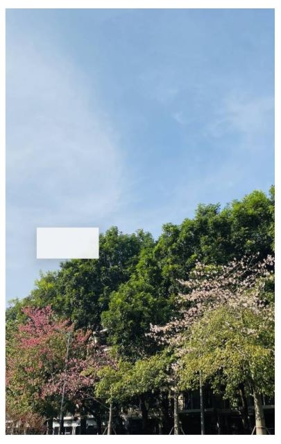

# @ohos.arkui.uiMaterial (System Material) (System API)

<!--Kit: ArkUI-->
<!--Subsystem: ArkUI-->
<!--Owner: @hehongyang3-->
<!--Designer: @zhanghaibo0-->
<!--Tester: @lxl007-->
<!--Adviser: @Brilliantry_Rui-->
<!-- md-trans-meta sourceCommit=d09068c013deef462b1019892f5d3232cec8f4e1 translatedAt=2026-08-05T03:08:17.152Z pushedAt=2026-08-06T02:17:35.286Z -->

This module provides APIs for system materials. Different system materials correspond to different UI effects, including the background color ([backgroundColor](arkui-ts/ts-universal-attributes-background.md#backgroundcolor)), border color ([borderColor](arkui-ts/ts-universal-attributes-border.md#bordercolor)), border width ([borderWidth](arkui-ts/ts-universal-attributes-border.md#borderwidth)), and shadow ([shadow](arkui-ts/ts-universal-attributes-image-effect.md#shadow)).

> **NOTE**
>
> - The initial APIs of this module are supported since API version 23. Newly added APIs will be marked with a superscript to indicate their earliest API version.
>
> - This topic describes only system APIs provided by the module. For details about other public APIs, see [System Material](arkts-apis-uimaterial.md).

## Modules to Import

``` ts
import { uiMaterial } from '@kit.ArkUI';
```

## MaterialType

Enumerates the system material types. This section contains only the system APIs of this module. For other public types, see [MaterialType](arkts-apis-uimaterial.md#materialtype).

**Model restriction**: This API can be used only in the stage model.

**System capability**: SystemCapability.ArkUI.ArkUI.Full

| Name     | Value | Description              |
| ------ | --- | --------------- |
| NONE | 0 | No system material effect. The corresponding effects are: [backgroundColor](arkui-ts/ts-universal-attributes-background.md#backgroundcolor) is transparent, [borderColor](arkui-ts/ts-universal-attributes-border.md#bordercolor) is transparent, [borderWidth](arkui-ts/ts-universal-attributes-border.md#borderwidth) is 0, and no [shadow](arkui-ts/ts-universal-attributes-image-effect.md#shadow).<br>**Widget capability:** This API can be used in ArkTS widgets since API version 23.<br>**System API:** This is a system API.|
| SEMI_TRANSPARENT | 1 | Semi-transparent system material effect. The corresponding effects are:<br>[backgroundColor](arkui-ts/ts-universal-attributes-background.md#backgroundcolor): "#f2f1f3f5" in light mode and "#f2303131" in dark mode.<br>[borderColor](arkui-ts/ts-universal-attributes-border.md#bordercolor): [token](../../ui/theme_skinning.md#system-default-token-color-values) value of theme.colors.compForegroundPrimary blended with 10% transparency (alpha value).<br>[borderWidth](arkui-ts/ts-universal-attributes-border.md#borderwidth): 1 vp.<br>[shadow](arkui-ts/ts-universal-attributes-image-effect.md#shadow): ShadowStyle.OUTER_DEFAULT_SM.<br>**Widget capability:** This API can be used in ArkTS widgets since API version 23.<br>**System API:** This is a system API.|

## ImmersiveStyle

Enumerates the material styles. The enum values suffixed with EC are set on [EffectComponent](arkui-ts/ts-container-effectcomponent-sys.md), and those suffixed with EC_SUB are set on the child components of EffectComponent. The two work together to achieve merged optimization of material effect rendering. The material blur set on EffectComponent will ultimately take effect on its child components. Different material styles correspond to different material parameters, mainly including the blur level and highlight effect of the material. For details, see [ImmersiveStyle](arkts-apis-uimaterial.md#immersivestyle).

**Since:** 26.0.0

**Model restriction:** This API can be used only in the stage model.

**Atomic service API:** This API can be used in atomic services since API version 26.0.0.

**System capability:** SystemCapability.ArkUI.ArkUI.Full

**System API**: This is a system API.

| Name    | Value| Description             |
| ------ | --- | --------------- |
| ULTRA_THIN_EC | 5 | Ultra-thin style. The material layer is ultra-thin, providing a strong transparency effect.<br/>Applicable to [EffectComponent](arkui-ts/ts-container-effectcomponent-sys.md). It must be used together with the corresponding EC_SUB suffix enum to achieve merged optimization of material effect rendering. |
| THIN_EC | 6 | Thin style. The material layer is thin, providing a relatively strong transparency effect.<br/>Applicable to EffectComponent. |
| REGULAR_EC | 7 | Regular style. The material layer has a moderate thickness, providing moderate transparency and blur effects.<br/>Applicable to EffectComponent. |
| THICK_EC | 8 | Thick style, providing a strong blur effect.<br/>Applicable to EffectComponent. |
| ULTRA_THICK_EC | 9 | Ultra-thick style, providing a very strong blur effect.<br/>Applicable to EffectComponent. |
| ULTRA_THIN_EC_SUB | 10 | Ultra-thin style. The material layer is ultra-thin, providing a strong transparency effect.<br/>Applicable to the child components of EffectComponent. |
| THIN_EC_SUB | 11 | Thin style. The material layer is thin, providing a relatively strong transparency effect.<br/>Applicable to the child components of EffectComponent. |
| REGULAR_EC_SUB | 12 | Regular style. The material layer has a moderate thickness, providing moderate transparency and blur effects.<br/>Applicable to the child components of EffectComponent. |
| THICK_EC_SUB | 13 | Thick style, providing a strong blur effect.<br/>Applicable to the child components of EffectComponent. |
| ULTRA_THICK_EC_SUB | 14 | Ultra-thick style, providing a very strong blur effect.<br/>Applicable to the child components of EffectComponent. |

## uiMaterial.convertToECMaterial

convertToECMaterial(material: uiMaterial.ImmersiveMaterial): uiMaterial.ImmersiveMaterial

Converts an [ImmersiveMaterial](arkts-apis-uimaterial.md#immersivematerial) material into an ImmersiveMaterial material applicable to [EffectComponent](arkui-ts/ts-container-effectcomponent-sys.md).

The [materialColor](arkts-apis-uimaterial.md#immersiveoptions), [applyShadow](arkts-apis-uimaterial.md#immersiveoptions), [interactive](arkts-apis-uimaterial.md#immersiveoptions), and [lightEffect](arkts-apis-uimaterial.md#immersiveoptions) properties in the material do not take effect on the EffectComponent. If a material converted through this API has these properties configured, they will also not take effect.

**Since:** 26.0.0

**Model restriction:** This API can be used only in the stage model.

**Atomic service API:** This API can be used in atomic services since API version 26.0.0.

**System capability:** SystemCapability.ArkUI.ArkUI.Full

**System API:** This is a system API.

**Parameters**

| Name       | Type                                                       | Mandatory | Description                                                         |
| ---------- | ----------------------------------------------------------- | ---- | ------------------------------------------------------------ |
|  material      | [uiMaterial.ImmersiveMaterial](arkts-apis-uimaterial.md#immersivematerial)                      | Yes   | Immersive material to convert.    |

**Return value**

| Type   | Description                     |
| ------ | ------------------------ |
| [uiMaterial.ImmersiveMaterial](arkts-apis-uimaterial.md#immersivematerial) | Immersive material applicable to [EffectComponent](arkui-ts/ts-container-effectcomponent-sys.md) after conversion. |

## uiMaterial.convertToECSubMaterial

convertToECSubMaterial(material: uiMaterial.ImmersiveMaterial): uiMaterial.ImmersiveMaterial

Converts an [ImmersiveMaterial](arkts-apis-uimaterial.md#immersivematerial) material into an ImmersiveMaterial material applicable to the child components of [EffectComponent](arkui-ts/ts-container-effectcomponent-sys.md).

**Since:** 26.0.0

**Model restriction:** This API can be used only in the stage model.

**Atomic service API:** This API can be used in atomic services since API version 26.0.0.

**System capability:** SystemCapability.ArkUI.ArkUI.Full

**System API:** This is a system API.

**Parameters**

| Name       | Type                                                       | Mandatory | Description                                                         |
| ---------- | ----------------------------------------------------------- | ---- | ------------------------------------------------------------ |
|  material      | [uiMaterial.ImmersiveMaterial](arkts-apis-uimaterial.md#immersivematerial)                      | Yes   | Immersive material to convert.    |

**Return value**

| Type   | Description                     |
| ------ | ------------------------ |
| [uiMaterial.ImmersiveMaterial](arkts-apis-uimaterial.md#immersivematerial) | Immersive material applicable to the child components of [EffectComponent](arkui-ts/ts-container-effectcomponent-sys.md) after conversion. |

## MaterialOptions

System material options.

**Model restriction**: This API can be used only in the stage model.

**System capability**: SystemCapability.ArkUI.ArkUI.Full

**System API**: This is a system API.

| Name      | Type                                                       | Read-Only| Optional| Description                                                    |
| ---------- | ----------------------------------------------------------- | ---- | ------- | ----------------------------------------------------- |
| type   | [MaterialType](#materialtype)                                   | No | Yes   | Material type. Select MaterialType.NONE when no material effect is needed, and MaterialType.SEMI_TRANSPARENT when a semi-transparent background effect is needed.<br/>Default value: MaterialType.NONE <br>**Widget capability:** This API can be used in ArkTS widgets since API version 23.|

## Material

Base class for system material objects.

### constructor

constructor(options?: MaterialOptions)

A constructor used to create a **Material** object.

**Model restriction**: This API can be used only in the stage model.

**Widget capability:** This API can be used in ArkTS widgets since API version 23.

**System capability**: SystemCapability.ArkUI.ArkUI.Full

**System API**: This is a system API.

**Parameters**

| Name      | Type                                                      | Mandatory| Description                                                        |
| ---------- | ----------------------------------------------------------- | ---- | ------------------------------------------------------------ |
|  options      | [MaterialOptions](#materialoptions)                      | No   | System material configuration option, including the material type. Pass this parameter when a material type (such as translucency effect) needs to be specified. If not passed, the default material configuration `{type:MaterialType.NONE}` is used, that is, no system material effect.    |

## Example

### Example 1: Setting the System Material

This example shows how to apply the **Material** object of a semi-transparent material to a component using the [systemMaterial](arkui-ts/ts-universal-attributes-image-effect-sys.md#systemmaterial23) attribute.

``` ts
import { uiMaterial } from '@kit.ArkUI';

@Entry
@Component
struct SystemMaterialPage {
  build() {
    Column() {
      Stack() {
        Image($r('app.media.bg1')) // Replace $r('app.media.bg1') with the image resource file you use.
          .width('100%')
          .height('100%')

        Column()
          .width(100)
          .height(50)
          .position({ x: 50, y: 350 })
          .systemMaterial(new uiMaterial.Material({ type: uiMaterial.MaterialType.SEMI_TRANSPARENT })) // Use the semi-transparent system material effect.
      }
      .height('90%')
      .width('90%')
    }
    .height('100%')
    .width('100%')
    .alignItems(HorizontalAlign.Center)
    .justifyContent(FlexAlign.Center)
  }
}
```



### Example 2 (Setting the System Material Using EffectComponent)

This example shows how to set [uiMaterial.ImmersiveMaterial](arkts-apis-uimaterial.md#immersivematerial) on [EffectComponent](arkui-ts/ts-container-effectcomponent-sys.md) and its child components, including directly using EC-style materials and applying the materials after conversion through [uiMaterial.convertToECMaterial](#uimaterialconverttoecmaterial) and [uiMaterial.convertToECSubMaterial](#uimaterialconverttoecsubmaterial).

Since API version 26.0.0, the **uiMaterial.convertToECMaterial** and **uiMaterial.convertToECSubMaterial** APIs are added.

```ts
import { uiMaterial } from '@kit.ArkUI';

@Entry
@Component
struct Index {
  @State myMaterialBase: uiMaterial.ImmersiveMaterial | undefined = new uiMaterial.ImmersiveMaterial({
    style: uiMaterial.ImmersiveStyle.ULTRA_THIN,
  });
  @State myMaterialEC: uiMaterial.ImmersiveMaterial | undefined = new uiMaterial.ImmersiveMaterial({
    style: uiMaterial.ImmersiveStyle.ULTRA_THIN_EC,
  });
  @State myMaterialECSub: uiMaterial.ImmersiveMaterial | undefined = new uiMaterial.ImmersiveMaterial({
    style: uiMaterial.ImmersiveStyle.ULTRA_THIN_EC_SUB,
  });

  build() {
    Stack() {
      // Replace $r('app.media.startIcon') with the actual resource file.
      Image($r('app.media.startIcon'))
      Row() {
        // It is recommended to use different styles to set materials for EffectComponent and its child components.
        EffectComponent() {
          Row() {
            Column()
              .width(100)
              .height(100)
              .systemMaterial(this.myMaterialECSub)
              .margin(5)
          }
        }
        .systemMaterial(this.myMaterialEC)

        EffectComponent() {
          Row() {
            Column()
              .width(100)
              .height(100)
              .systemMaterial(uiMaterial.convertToECSubMaterial(this.myMaterialBase))
              .margin(5)

            Column()
              .width(100)
              .height(100)
              .systemMaterial(uiMaterial.convertToECSubMaterial(this.myMaterialBase))
              .margin(5)
          }
        }
        .systemMaterial(uiMaterial.convertToECMaterial(this.myMaterialBase))
      }.height('100%').width('100%').justifyContent(FlexAlign.Center)
    }
  }
}
```