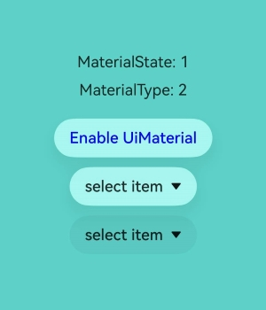
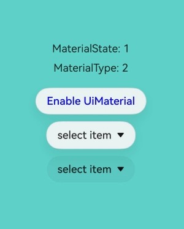
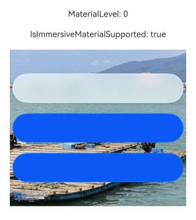
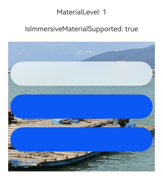
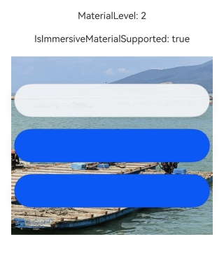
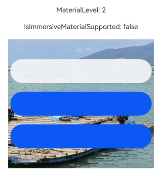

# @ohos.arkui.uiMaterial (System Material)
<!--Kit: ArkUI-->
<!--Subsystem: ArkUI-->
<!--Owner: @hehongyang3-->
<!--Designer: @hehongyang3-->
<!--Tester: @lxl007-->
<!--Adviser: @Brilliantry_Rui-->

This module provides APIs for system materials. Different system materials correspond to different UI effects, including the [background color](arkui-ts/ts-universal-attributes-background.md#backgroundcolor), [border color](arkui-ts/ts-universal-attributes-border.md#bordercolor), [border width](arkui-ts/ts-universal-attributes-border.md#borderwidth), [shadow](arkui-ts/ts-universal-attributes-image-effect.md#shadow), and [material filter](arkui-ts/ts-universal-attributes-filter-effect.md#materialfilter23). The system materials currently provided is of the [ImmersiveMaterial](#immersivematerial) type. Immersive material objects have different performance on different devices. The immersive material objects take effect only on devices that support immersive materials, and can be configured but do not take effect on devices that do not support immersive materials. You can use [isImmersiveMaterialSupported](#uimaterialisimmersivematerialsupported) to check whether the device supports immersive materials. On devices that support immersive materials, the material effect varies depending on the device's computing power. You can use [getGlobalMaterialLevel](#uimaterialgetglobalmateriallevel) to obtain the material level of the device. For details, see the description of [ImmersiveMaterial](#immersivematerial).

For details about the development guideline, see [Immersive Light Sense](../../ui/arkts-immersive-light-sense.md).

**Since**: 26.0.0

## Modules to Import

``` ts
import { uiMaterial } from '@kit.ArkUI';
```

## ImmersiveMaterial

Immersive material class, which inherits from [Material](#material).

The performance of immersive materials varies depending on whether the device supports immersive materials and on the device's computing power. You can use [isImmersiveMaterialSupported](#uimaterialisimmersivematerialsupported) to check whether the device supports immersive materials and use [getGlobalMaterialLevel](#uimaterialgetglobalmateriallevel) to obtain the material level of the device. You can set immersive materials on devices that do not support immersive materials, but the settings will have no effect. For high- and medium-computing devices that support immersive materials, material effects are implemented using [materialFilter](arkui-ts/ts-universal-attributes-filter-effect.md#materialfilter23) and [shadow](arkui-ts/ts-universal-attributes-image-effect.md#shadow). After the **systemMaterial** attribute takes effect, the set [backgroundColor](arkui-ts/ts-universal-attributes-background.md#backgroundcolor) attribute is restored to transparent, and the set [borderWidth](arkui-ts/ts-universal-attributes-border.md#borderwidth) attribute is restored to no border. For low-computing devices that support immersive materials, backgroundColor](arkui-ts/ts-universal-attributes-background.md#backgroundcolor), [borderColor](arkui-ts/ts-universal-attributes-border.md#bordercolor), [borderWidth](arkui-ts/ts-universal-attributes-border.md#borderwidth), and [shadow](arkui-ts/ts-universal-attributes-image-effect.md#shadow) are used to achieve material effects. In addition, the effect of the same material is affected by the immersive light configuration in the system settings application. The material parameters and effects vary depending on the immersive light configuration.

### constructor

constructor(options?: ImmersiveOptions)

Constructs **ImmersiveMaterial**.

**Since**: 26.0.0

**Model restriction**: This API can be used only in the stage model.

**Atomic service API**: This API can be used in atomic services since API version 26.0.0.

**System capability**: SystemCapability.ArkUI.ArkUI.Full

**Parameters**

| Name      | Type                                                      | Mandatory| Description                                                        |
| ---------- | ----------------------------------------------------------- | ---- | ------------------------------------------------------------ |
|  options      | [ImmersiveOptions](#immersiveoptions)                    | No  | System material configuration options, including the material style and material layer coloring.<br>For details about the default values, see the default values of the parameters in the **ImmersiveOptions** API, that is, **{style:uiMaterial.ImmersiveStyle.REGULAR, materialColor:undefined, colorInvert:false, applyShadow:true, interactive:false, lightEffect:undefined}**.   |

## Material

A base class of a system material object.

**Since**: 26.0.0

**Model restriction**: This API can be used only in the stage model.

**Atomic service API**: This API can be used in atomic services since API version 26.0.0.

**Widget capability**: This API can be used in ArkTS widgets since API version 26.0.0.

**System capability**: SystemCapability.ArkUI.ArkUI.Full

### empty

static get empty(): Material

Returns an empty material object, which is used to disable the immersive system material effect for a component. The usage method is **uiMaterial.Material.empty**.

In enabled state, you can disable the immersive system material effect for a component by setting **systemMaterial(uiMaterial.Material.empty)**. If the component does not support the component-level immersive system material API, the material effect cannot be disabled using this API.

**Since**: 26.0.0

**Model restriction**: This API can be used only in the stage model.

**Atomic service API**: This API can be used in atomic services since API version 26.0.0.

**System capability**: SystemCapability.ArkUI.ArkUI.Full

**Return value**

| Type  | Description                    |
| ------ | ------------------------ |
| [Material](#material) | Empty material object, indicating that there is no material effect.|

## MaterialType

Enumerates system material types.

**Since**: 26.0.0

**Model restriction**: This API can be used only in the stage model.

**Atomic service API**: This API can be used in atomic services since API version 26.0.0.

**Widget capability**: This API can be used in ArkTS widgets since API version 26.0.0.

**System capability**: SystemCapability.ArkUI.ArkUI.Full

| Name    | Value| Description             |
| ------ | --- | --------------- |
| IMMERSIVE | 2 | Immersive material type. It is used only by the **type** attribute of the [MaterialInfo](#materialinfo) API to identify the current material type and does not map to underlying features. The actual material effect is implemented by the [ImmersiveMaterial](#immersivematerial) class.|

## MaterialState

Enumerates the material enabling states, indicating the states of the application-level immersive system material configuration.

**Since**: 26.0.0

**Model restriction**: This API can be used only in the stage model.

**Atomic service API**: This API can be used in atomic services since API version 26.0.0.

**System capability**: SystemCapability.ArkUI.ArkUI.Full

| Name    | Value| Description             |
| ------ | --- | --------------- |
| DEFAULT | 0 | Default state. The immersive system material is enabled by default for the [Dialog](../../ui/arkts-base-dialog-overview.md), [Toast](../../ui/arkts-create-toast.md), and [AlphabetIndexer](arkui-ts/ts-container-alphabet-indexer.md) components if the background color, blur, and shadow are not set for the components. The immersive system material is enabled by default for the text menu triggered by long-pressing or double-clicking after [copyOption](arkui-ts/ts-basic-components-text.md#copyoption9) is set in the [Text](arkui-ts/ts-basic-components-text.md) component. For other components, whether the immersive system material is enabled is set by the application.|
| ENABLE | 1 | Enabled state. The immersive system material is enabled by default for the [Dialog](../../ui/arkts-base-dialog-overview.md), [Toast](../../ui/arkts-create-toast.md), [AlphabetIndexer](arkui-ts/ts-container-alphabet-indexer.md), [ChipGroup](arkui-ts/ohos-arkui-advanced-ChipGroup.md), [Chip](arkui-ts/ohos-arkui-advanced-Chip.md), [Select](arkui-ts/ts-basic-components-select.md), [Menu Control](arkui-ts/ts-universal-attributes-menu.md), [Toggle](arkui-ts/ts-basic-components-toggle.md), [SegmentButton](arkui-ts/ohos-arkui-advanced-SegmentButton.md), [SegmentButtonV2](arkui-ts/ohos-arkui-advanced-SegmentButtonV2.md), [Slider](arkui-ts/ts-basic-components-slider.md), and [SelectionMenu](arkui-ts/ohos-arkui-advanced-SelectionMenu.md) components. After [copyOption](arkui-ts/ts-basic-components-text.md#copyoption9) is set for the [Text](arkui-ts/ts-basic-components-text.md) component, the immersive system material is enabled by default for the text menu triggered by long-pressing or double-clicking. In this state, the immersive system material style takes precedence over the background color, blur, shadow, and border style set for the components. You need to set whether to enable the immersive system material for other components.|
| DISABLE | 2 | Disabled state. The immersive system material cannot be enabled for any component. Even if you set the immersive system material parameters for a component, the settings will not take effect.|

## MaterialInfo

Provides material configuration information, including the material enabling state and material type.

**Since**: 26.0.0

**Model restriction**: This API can be used only in the stage model.

**Atomic service API**: This API can be used in atomic services since API version 26.0.0.

**System capability**: SystemCapability.ArkUI.ArkUI.Full

| Name      | Type                                                       | Read-Only| Optional| Description                                                    |
| ---------- | ----------------------------------------------------------- | ---- | ------- | ----------------------------------------------------- |
| state   | [MaterialState](#materialstate)                                   | No| No  | Material enabling state.|
| type   | [MaterialType](#materialtype)                                   | No| No  | System material type ID, indicating the material type corresponding to the current configuration. The value is used only for type identification and does not map to underlying features.|

## uiMaterial.getMaterialInfo

getMaterialInfo(): MaterialInfo

Obtains the material configuration information of this application. The returned configuration information comes from the metadata configured in the [module.json5](../../quick-start/module-configuration-file.md) file of the application.

**Since**: 26.0.0

**Model restriction**: This API can be used only in the stage model.

**Atomic service API**: This API can be used in atomic services since API version 26.0.0.

**System capability**: SystemCapability.ArkUI.ArkUI.Full

**Return value**

| Type  | Description                    |
| ------ | ------------------------ |
| [MaterialInfo](#materialinfo) | Material configuration information of this application, including the material enabling state and material type.|

## ImmersiveStyle

Enumerates immersive material styles. Different material styles correspond to different material parameters, including the blur degree and brightness.

**Since**: 26.0.0

**Model restriction**: This API can be used only in the stage model.

**Atomic service API**: This API can be used in atomic services since API version 26.0.0.

**System capability**: SystemCapability.ArkUI.ArkUI.Full

| Name    | Value| Description             |
| ------ | --- | --------------- |
| ULTRA_THIN | 0 | Ultra-thin style, which provides a very strong transparent effect.|
| THIN | 1 | Thin style, which provides a strong transparent effect.|
| REGULAR | 2 | Regular style, which means the material layer is of regular thickness.|
| THICK | 3 | Thick style, which provides a strong blur effect.|
| ULTRA_THICK | 4 | Ultra-thick style, which provides a very strong blur effect.|

## MaterialLevel

Enumerates material levels, which indicate the computing power levels of devices. You can use [getGlobalMaterialLevel](#uimaterialgetglobalmateriallevel) to obtain the material level of the current device.

**Since**: 26.0.0

**Model restriction**: This API can be used only in the stage model.

**Atomic service API**: This API can be used in atomic services since API version 26.0.0.

**System capability**: SystemCapability.ArkUI.ArkUI.Full

| Name    | Value| Description             |
| ------ | --- | --------------- |
| EXQUISITE | 0 | Material level of devices with high-level computing power.|
| GENTLE | 1 | Material level of devices with medium-level computing power.|
| SMOOTH | 2 | Material level of devices with low-level computing power.|

## uiMaterial.getGlobalMaterialLevel

getGlobalMaterialLevel(): MaterialLevel

Obtains the global material level, which is related to the device computing power. This configuration item is defined by the device and cannot be modified.

**Since**: 26.0.0

**Model restriction**: This API can be used only in the stage model.

**Atomic service API**: This API can be used in atomic services since API version 26.0.0.

**System capability**: SystemCapability.ArkUI.ArkUI.Full

**Return value**

| Type  | Description                    |
| ------ | ------------------------ |
| [MaterialLevel](#materiallevel) | Material level of the device.|

## uiMaterial.isImmersiveMaterialSupported

isImmersiveMaterialSupported(): boolean

Checks whether the current device supports immersive system materials ([ImmersiveMaterial](#immersivematerial)). This configuration item is defined by the device and cannot be modified.

**Since**: 26.0.0

**Model restriction**: This API can be used only in the stage model.

**Atomic service API**: This API can be used in atomic services since API version 26.0.0.

**System capability**: SystemCapability.ArkUI.ArkUI.Full

**Return value**

| Type  | Description                    |
| ------ | ------------------------ |
| boolean | Whether the current device supports immersive materials. The value **true** indicates that the current device supports immersive materials, and **false** indicates the opposite.|

## LightEffectOptions

Provides the light sensing interaction feedback configuration for immersive materials. Light sensing interaction feedback refers to the visual effect of dynamic light changes on the surface of a material when a user interacts with a component through touch. The configuration is used to customize the color of the light sensing feedback.

**Since**: 26.0.0

**Model restriction**: This API can be used only in the stage model.

**Atomic service API**: This API can be used in atomic services since API version 26.0.0.

**System capability**: SystemCapability.ArkUI.ArkUI.Full

| Name                          | Type                                    | Read-Only| Optional| Description                                    |
| ----------------------------- | ---------------------------------------- | ---- | ---------------------------------------- | ---------------------------------------- |
| color       | [ResourceColor](arkui-ts/ts-types.md#resourcecolor) | No   | Yes  | Custom color of the light sensing feedback.<br>Default value: **Color.White**|

## ImmersiveOptions

Immersive material parameters.

**Since**: 26.0.0

**Model restriction**: This API can be used only in the stage model.

**Atomic service API**: This API can be used in atomic services since API version 26.0.0.

**System capability**: SystemCapability.ArkUI.ArkUI.Full

| Name      | Type                                                       | Read-Only| Optional| Description                                                    |
| ---------- | ----------------------------------------------------------- | ---- | ------- | ----------------------------------------------------- |
| style   | [ImmersiveStyle](#immersivestyle)                                   | No| Yes  | Material style. Different styles correspond to different material parameters, which affect the material thickness.<br>Note: This parameter takes effect only for high- and medium-computing devices that support immersive materials.<br>Default value: **uiMaterial.ImmersiveStyle.REGULAR**|
| materialColor   | [ResourceColor](arkui-ts/ts-types.md#resourcecolor)                                   | No| Yes  | Coloring of the material layer. For high- and medium-computing devices that support immersive materials, if this parameter is not specified or is set to **undefined**, no additional pure color effect is mixed. If this parameter is set to a valid color value, this parameter will mix a pure color effect for the material filter. If the color is completely opaque, the material filter effect will be blocked. For low-computing devices that support immersive materials, if this parameter is not specified or is set to **undefined**, the background color effect of the material on the devices takes effect. If this parameter is set to a valid color value, this parameter value is used as the value of the [backgroundColor](arkui-ts/ts-universal-attributes-background.md#backgroundcolor) attribute.<br>Note: This parameter takes effect on the display effect of all computing power devices that support immersive materials.<br>Default value: **undefined**|
| colorInvert   | boolean                                   | No| Yes  | Whether the subtree of the node of the material object automatically adapts the material to the complementary color of the background color.<br>**false** indicates the material is not automatically adapted to the complementary color of the background color.<br>**true** indicates that the material is automatically adapted to the complementary color of the background color only when the material layer is thin enough. The materials that can be adapted to the complementary color are defined by the system. Such materials must have at least the **THIN** or **ULTRA_THIN** style, and are related to the strength configuration of the immersive light effect of the application. The thinner the material and the stronger the immersive light effect, the more likely the material meets the requirements for adapting to the complementary color.<br>The automatic complementary color adaptation capability takes effect only when special resource values (listed in Table 1) are set for some attribute APIs. Such attribute APIs include:<br>[fontColor](arkui-ts/ts-basic-components-text.md#fontcolor) of the **Text** component;<br>[fontColor](arkui-ts/ts-basic-components-button.md#fontcolor) of the **Button** component;<br>[fontColor](arkui-ts/ts-basic-components-symbolGlyph.md#fontcolor) of the **SymbolGlyph** component;<br>[fillColor](arkui-ts/ts-basic-components-image.md#fillcolor) of the **Image** component;<br>[placeholderColor](arkui-ts/ts-basic-components-search.md#placeholdercolor), [fontColor](arkui-ts/ts-basic-components-search.md#fontcolor10), icon color in [searchIcon](arkui-ts/ts-basic-components-search.md#searchicon10), icon color in [cancelButton](arkui-ts/ts-basic-components-search.md#cancelbutton10), caret color in (arkui-ts/ts-basic-components-search.md#caretstyle10), and button color in [searchButton](arkui-ts/ts-basic-components-search.md#searchbutton) under the **Search** component;<br>[BottomTabBarStyle](arkui-ts/ts-container-tabcontent.md#bottomtabbarstyle9) used by [tabBar](arkui-ts/ts-container-tabcontent.md#tabbar) of the **TabContent** component;<br>[prefixIcon](arkui-ts/ohos-arkui-advanced-Chip.md#prefixiconoptions), [fillColor](arkui-ts/ohos-arkui-advanced-Chip.md#iconcommonoptions) of the **suffixIcon** attribute, and [fontColor](arkui-ts/ohos-arkui-advanced-Chip.md#labeloptions) of the [label](arkui-ts/ohos-arkui-advanced-Chip.md#labeloptions) attribute under the **Chip** component;<br>[fontColor](arkui-ts/ohos-arkui-advanced-ChipGroup.md#chipitemstyle) of [itemStyle](arkui-ts/ohos-arkui-advanced-ChipGroup.md#chipgroup-1) of the **ChipGroup** component;<br>[fontColor](arkui-ts/ts-basic-components-textarea.md#fontcolor) and [placeholderColor](arkui-ts/ts-basic-components-textarea.md#placeholdercolor) of the **TextArea** component;<br>[fontColor](arkui-ts/ts-basic-components-textinput.md#fontcolor) and [placeholderColor](arkui-ts/ts-basic-components-textinput.md#placeholdercolor) of the **TextInput** component;<br>[fontColor](arkui-ts/ohos-arkui-advanced-SegmentButton.md#properties) of the **SegmentButton** component;<br>[fontColor](arkui-ts/ts-container-swiper.md#fontcolor) of the **Swiper** component.<br>When the preceding APIs are used, the text and icon colors are automatically inverted.<br>Note: This parameter takes effect only for high- and medium-computing devices that support immersive materials.<br>Default value: **false**|
| applyShadow   | boolean                                   | No| Yes  | Whether to add a shadow effect for a material.<br>If this parameter is set to **true**, the added shadow effect in the material always takes effect, which takes precedence over the general [shadow](arkui-ts/ts-universal-attributes-image-effect.md#shadow) attribute. If this parameter is set to **false**, only the general shadow attribute takes effect.<br>Note: This parameter takes effect on the display effect of all computing power devices that support immersive materials.<br>Default value: **true**|
| interactive   | boolean                                   | No| Yes  | Whether to enable the interactive deformation effect.<br>The value **true** indicates to enable the interactive deformation effect, and **false** indicates the opposite.<br>Note: This parameter takes effect on the display effect of all computing power devices that support immersive materials.<br>Default value: **false**|
| lightEffect   | [LightEffectOptions](#lighteffectoptions) \| null                                   | No| Yes  | Parameters for the light sensing interaction feedback effect parameter. If this parameter is set to null, the light sensing interaction feedback effect is disabled.<br>Note: This parameter takes effect only for high- and medium-computing devices that support immersive materials.<br>Default value: **undefined**, indicating that the light sensing interaction feedback effect is not set.|

**Table 1** Deep and light color values corresponding to special resource value pairs

| Special Resource Value| Light| Dark|
| --------- | ----------- | ------ |
| $r('sys.color.brand') | #FF0A59F7 | #FF317AF7 |
| $r('sys.color.brand_font') | #FF0A59F7 | #FF5291FF |
| $r('sys.color.warning') | #FFE84026 | #FFD94838 |
| $r('sys.color.font_on_primary') | #FFFFFFFF | #FFFFFFFF |
| $r('sys.color.font_primary') | #E5000000 | #E5FFFFFF |
| $r('sys.color.font_secondary') | #99000000 | #99FFFFFF |
| $r('sys.color.font_tertiary') | #66000000 | #66FFFFFF |
| $r('sys.color.font_fourth') | #33000000 | #33FFFFFF |
| $r('sys.color.font_emphasize') | #FF0A59F7 | #FF5291FF |
| $r('sys.color.icon_primary') | #E5000000 | #E5FFFFFF |
| $r('sys.color.icon_secondary') | #99000000 | #99FFFFFF |
| $r('sys.color.icon_tertiary') | #66000000 | #66FFFFFF |
| $r('sys.color.icon_fourth') | #33000000 | #33FFFFFF |
| $r('sys.color.icon_emphasize') | #FF0A59F7 | #FF5291FF |
| $r('sys.color.icon_sub_emphasize') | #660A59F7 | #665291FF |
| $r('sys.color.comp_background_primary_contrary') | #FFFFFFFF | #FFE5E5E5 |
| $r('sys.color.comp_background_primary_contrary_secondary') | #FFFFFFFF | #FF666666 |
| $r('sys.color.comp_background_secondary') | #19000000 | #19FFFFFF |
| $r('sys.color.comp_background_tertiary') | #0C000000 | #19FFFFFF |
| $r('sys.color.comp_background_emphasize') | #FF0A59F7 | #FF317AF7 |
| $r('sys.color.comp_emphasize_secondary') | #330A59F7 | #33317AF7 |
| $r('sys.color.comp_emphasize_tertiary') | #190A59F7 | #19317AF7 |
| $r('sys.color.comp_divider') | #33000000 | #33FFFFFF |
| $r('sys.color.interactive_hover') | #0C000000 | #19FFFFFF |
| $r('sys.color.interactive_focus') | #FF0A59F7 | #FF317AF7 |
| $r('sys.color.interactive_pressed') | #19000000 | #26FFFFFF |

## Example

### Example 1: Configuring the Immersive System Material

This example shows how to set the [ImmersiveMaterial](#immersivematerial) object to a component through [systemMaterial](arkui-ts/ts-universal-attributes-image-effect.md#systemmaterial).

Since API version 26.0.0, the **ImmersiveMaterial** object and **systemMaterial** attribute are added.

``` ts
import { uiMaterial } from '@kit.ArkUI';

@Entry
@Component
struct SystemMaterialPage {

  build() {
    Column() {
      Stack() {
        Image($r('app.media.bg1')) // Replace $r('app.media.bg1') with the image resource file you use.
          .width('100%')
          .height('100%')

        Column({ space: 30 }) {
          Column() {
            Text('ULTRA_THIN')
          }
          .width(328)
          .height(56)
          .borderRadius(28)
          .justifyContent(FlexAlign.Center)
          .alignItems(HorizontalAlign.Center)
          .systemMaterial(new uiMaterial.ImmersiveMaterial({
            style: uiMaterial.ImmersiveStyle.ULTRA_THIN,
          }))

          Column() {
            Text('THIN')
          }
          .width(328)
          .height(56)
          .borderRadius(28)
          .justifyContent(FlexAlign.Center)
          .alignItems(HorizontalAlign.Center)
          .systemMaterial(new uiMaterial.ImmersiveMaterial({
            style: uiMaterial.ImmersiveStyle.THIN,
          }))

          Column() {
            Text('REGULAR')
          }
          .width(328)
          .height(56)
          .borderRadius(28)
          .justifyContent(FlexAlign.Center)
          .alignItems(HorizontalAlign.Center)
          .systemMaterial(new uiMaterial.ImmersiveMaterial({
            style: uiMaterial.ImmersiveStyle.REGULAR,
          }))

          Column() {
            Text('THICK')
          }
          .width(328)
          .height(56)
          .borderRadius(28)
          .justifyContent(FlexAlign.Center)
          .alignItems(HorizontalAlign.Center)
          .systemMaterial(new uiMaterial.ImmersiveMaterial({
            style: uiMaterial.ImmersiveStyle.THICK,
          }))

          Column() {
            Text('ULTRA_THICK')
          }
          .width(328)
          .height(56)
          .borderRadius(28)
          .justifyContent(FlexAlign.Center)
          .alignItems(HorizontalAlign.Center)
          .systemMaterial(new uiMaterial.ImmersiveMaterial({
            style: uiMaterial.ImmersiveStyle.ULTRA_THICK,
          }))
        }
      }
      .height('90%')
      .width('90%')
    }
    .height('100%')
    .width('100%')
    .alignItems(HorizontalAlign.Center)
    .justifyContent(FlexAlign.Center)
  }
}
```

Performance on devices with low-level computing power that support immersive materials


Performance on devices with medium-level computing power that support immersive materials


Performance on devices with high-level computing power that support immersive materials


### Example 2: Obtaining Material Configuration Information and Using an Empty Material to Disable the Immersive System Material

This example shows how to use [uiMaterial.getMaterialInfo](#uimaterialgetmaterialinfo) to obtain the material configuration information of this application and use [empty](#empty) to disable the immersive system material effect for a specific component based on the set state.

Since API version 26.0.0, the **uiMaterial.getMaterialInfo** and **empty** APIs are added.

Configure the toggle information in the [module.json5](../../quick-start/module-configuration-file.md) file. Note that the configuration takes effect only in the module of the entry type.
``` json5
{
  "module": {
    // ···
    "type": "entry", // Note that the configuration takes effect only in the module of the entry type.
    // ···
    "metadata": [{
      "name": "ohos.arkui.UIMaterial.state",
      "value": "enable"
    }],
    // ···
  }
}
```
Write the sample code as follows:
``` ts
import { uiMaterial } from '@kit.ArkUI';

@Entry
@Component
struct MaterialInfoPage {
  // Obtain the material configuration.
  private info: uiMaterial.MaterialInfo = uiMaterial.getMaterialInfo();
  build() {
    Column() {
      Text(`MaterialState: ${this.info.state}`)
        .fontSize(16)
        .margin({ bottom: 10 })
      Text(`MaterialType: ${this.info.type}`)
        .fontSize(16)
        .margin({ bottom: 20 })

      // Determine the component behavior based on the state.
      if (this.info.state === uiMaterial.MaterialState.ENABLE) {
        // Proactively use the immersive material.
        Button('Enable UiMaterial')
          .backgroundColor(Color.Transparent)
          .systemMaterial(new uiMaterial.ImmersiveMaterial({
            style: uiMaterial.ImmersiveStyle.ULTRA_THIN
          }))
          .fontColor(Color.Blue)
          .margin({ bottom: 10 })
        // The immersive system material is enabled by default for the Select component.
        Select([
          {value: 'select item'}
        ]).value('select item')
        .margin({ bottom: 10 })
        // Disable the immersive system material for the Select component.
        Select([
          {value: 'select item'}
        ]).value('select item')
        .systemMaterial(uiMaterial.Material.empty)
      }
    }
    .width('100%')
    .height('100%')
    .justifyContent(FlexAlign.Center)
    // Replace $r('app.media.img') with the image resource file you use.
    .backgroundImage($r('app.media.img'))
    .backgroundImageSize(ImageSize.FILL)
  }
}
```

Performance on devices with high-level computing power that support immersive materials


Performance on devices with medium-level computing power that support immersive materials



Performance on devices with low-level computing power that support immersive materials



### Example 3: Setting an Interactive Deformation Effect for the Component Material

This example shows how to use the **interactive** API in [ImmersiveOptions](#immersiveoptions) to implement an interactive deformation effect for a component.

Since API version 26.0.0, the **interactive** API is added.

``` ts
import { uiMaterial } from '@kit.ArkUI'

@Entry
@Component
struct Index {
  build() {
    Stack() {
      // Replace $r('app.media.startIcon') with the image resource file you use.
      Image($r('app.media.startIcon'))
      Column() {
        Column() {
          Text("Context")
        }
        .margin({ bottom: 100 })
        .width(248)
        .height(56)
        .borderRadius(28)
        .justifyContent(FlexAlign.Center)
        .alignItems(HorizontalAlign.Center)
        .systemMaterial(new uiMaterial.ImmersiveMaterial({
          style: uiMaterial.ImmersiveStyle.ULTRA_THIN,
          interactive: true,
        }))
      }.height('100%').width('100%').justifyContent(FlexAlign.Center)
    }
  }
}
```


### Example 4: Setting a Light Sensing Interaction Feedback Effect for the Component Material

This example shows how to use the **lightEffect** API in [ImmersiveOptions](#immersiveoptions) to implement a light sensing interaction feedback effect for a component.

Since API version 26.0.0, the **lightEffect** API is added.

``` ts
import { uiMaterial } from '@kit.ArkUI';

@Entry
@Component
struct LightEffect {
  @State itemsKey: number[] = [0, 1, 2];
  @State circleRadius: number = 40;
  @State spaceValue: number = 10;
  @State myMaterial: uiMaterial.Material = new uiMaterial.ImmersiveMaterial({
    style: uiMaterial.ImmersiveStyle.ULTRA_THIN,
    interactive: true,
    lightEffect: { color: undefined },
  });

  build() {
    Column() {
      Row() {
        Row({ space: this.spaceValue }) {
          ForEach(this.itemsKey, (_: number, __: number) => {
            Row()
              .width(this.circleRadius * 2)
              .height(this.circleRadius * 2)
              .borderRadius(this.circleRadius)
              .systemMaterial(this.myMaterial)
          })
        }
      }
      .justifyContent(FlexAlign.End)
      .backgroundColor(Color.Black)
      .width('100%')
      .padding(20)
    }
    .height('100%')
    .width('100%')
  }
}
```


### Example 5: Querying the Material Level and Whether Immersive Materials Are Supported

This example describes how to use [getGlobalMaterialLevel](#uimaterialgetglobalmateriallevel) to obtain the material level of a device and use [isImmersiveMaterialSupported](#uimaterialisimmersivematerialsupported) to check whether the device supports immersive materials. Based on the result, you can determine whether to set immersive materials for components. With this adaptation method, the application can reuse the same set of code on devices that support immersive materials and those that do not. On devices that do not support immersive materials, the application falls back to the common style, eliminating the need to write different code for different devices.

**getGlobalMaterialLevel** and **isImmersiveMaterialSupported** are added since API version 26.0.0.

``` ts
import { uiMaterial } from '@kit.ArkUI';

@Entry
@Component
struct MaterialLevelPage {
  private materialLevel: uiMaterial.MaterialLevel = uiMaterial.getGlobalMaterialLevel(); // The material level is determined by the device and does not change after the application is running.
  private isSupported: boolean = uiMaterial.isImmersiveMaterialSupported(); // Whether immersive materials are supported is determined by the device and does not change after the application is running.

  build() {
    Column({ space: 20 }) {
      Text(`MaterialLevel: ${this.materialLevel}`)
        .fontSize(16)

      Text(`IsImmersiveMaterialSupported: ${this.isSupported}`)
        .fontSize(16)

      Column({ space: 20 }) {
        // Adaptation mode 1: Check whether the device supports materials and set different attributes based on the support status. This method is more intuitive and applicable to a wider range of attributes.
        Column()
          .width(328)
          .height(56)
          .borderRadius(28)
          .backgroundColor(this.isSupported ? Color.Transparent :
            '#f2f1f3f5') // If the background color is set before systemMaterial, the background color effect contained in the immersive material takes effect on low-computing devices that support immersive materials.
          // On devices that support immersive materials, set a transparent background color and an immersive material. The immersive material takes effect if it is set later. On devices that do not support immersive materials, set the background color to '#f2f1f3f5' and the material effect to undefined. The background color '#f2f1f3f5' takes effect.
          .systemMaterial(this.isSupported ? new uiMaterial.ImmersiveMaterial({
            style: uiMaterial.ImmersiveStyle.REGULAR,
          }) : undefined)

        Column()
          .width(328)
          .height(56)
          .borderRadius(28)
          .backgroundColor(this.isSupported ? Color.Transparent :
            $r('sys.color.comp_background_emphasize')) // If the background color is set before systemMaterial, the background color effect contained in the immersive material takes effect on low-computing devices that support immersive materials.
          // On devices that support immersive materials, set a transparent background color and an immersive material with color filling. The immersive material with color filling takes effect if it is set later. On devices that do not support immersive materials, set the background color to a resource value and the material effect to undefined. The background color specified by the resource value takes effect.
          .systemMaterial(this.isSupported ? new uiMaterial.ImmersiveMaterial({
            style: uiMaterial.ImmersiveStyle.REGULAR,
            materialColor: $r('sys.color.comp_background_emphasize'),
          }) : undefined)

        // Adaptation mode 2: Set the systemMaterial attribute later and use the feature that systemMaterial can overwrite the attributes that conflict with the material.
        Column()
          .width(328)
          .height(56)
          .borderRadius(28)
          .backgroundColor($r('sys.color.comp_background_emphasize')) // If the background color is set before systemMaterial, the background color effect contained in the immersive material takes effect on low-computing devices that support immersive materials.
          // On high- or medium-computing devices that support immersive materials, the immersive material set later will clear the background color and make it transparent. On low-computing devices that support immersive materials, the background color effect contained in the immersive material set later will overwrite the **backgroundColor** attribute, and the material color will be used.
          // On devices that do not support immersive materials, setting systemMaterial has no effect, and the background color attribute with the resource value takes effect.
          .systemMaterial(new uiMaterial.ImmersiveMaterial({
            style: uiMaterial.ImmersiveStyle.REGULAR,
            materialColor: $r('sys.color.comp_background_emphasize')
          }))
      }
      .backgroundImage($r('app.media.bg1')) // Replace $r("app.media.bg1") with the image resource file you use.
      .backgroundImageSize({ width: '100%', height: '100%' })
      .width('90%')
      .height(300)
      .justifyContent(FlexAlign.Center)
    }
    .width('100%')
    .height('100%')
    .justifyContent(FlexAlign.Center)
  }
}
```

Performance on devices with high-level computing power that support immersive materials



Performance on devices with medium-level computing power that support immersive materials



Performance on devices with low-level computing power that support immersive materials



Performance on devices that do not support immersive materials


