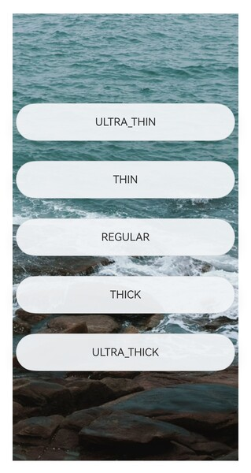
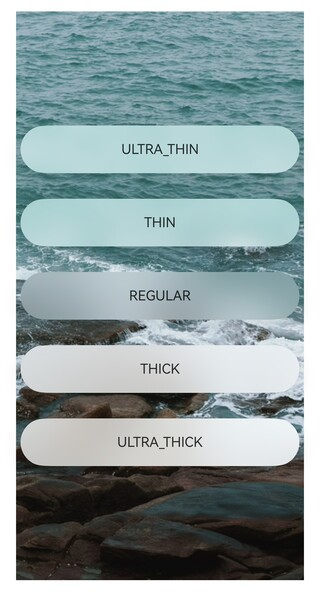
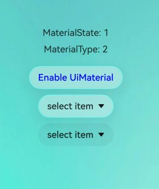
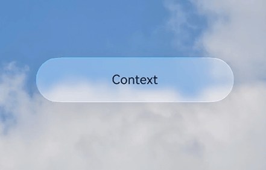

# @ohos.arkui.uiMaterial (System Material)
<!--Kit: ArkUI-->
<!--Subsystem: ArkUI-->
<!--Owner: @CCFFWW-->
<!--Designer: @CCFFWW-->
<!--Tester: @lxl007-->
<!--Adviser: @Brilliantry_Rui-->

This module provides APIs for system materials. Different system materials correspond to different UI effects, including the [background color](arkui-ts/ts-universal-attributes-background.md#backgroundcolor), [border color](arkui-ts/ts-universal-attributes-border.md#bordercolor), [border width](arkui-ts/ts-universal-attributes-border.md#borderwidth), [shadow](arkui-ts/ts-universal-attributes-image-effect.md#shadow), and material layer filter. The performance of a material object varies on devices with different computing power. The high, medium, and low levels of device computing power are determined by device vendors. For details about the level-based effect, see the description of [ImmersiveMaterial](#immersivematerial).

**Since**: 26.0.0

## Modules to Import

``` ts
import { uiMaterial } from '@kit.ArkUI';
```

## MaterialType

Enumerates system material types.

**Since**: 26.0.0

**Model restriction**: This API can be used only in the stage model.

**Atomic service API**: This API can be used in atomic services since API version 26.0.0.

**System capability**: SystemCapability.ArkUI.ArkUI.Full

| Name    | Value| Description             |
| ------ | --- | --------------- |
| IMMERSIVE | 2 | Immersive material type. It is used only by the **type** attribute of the [MaterialInfo](#materialinfo) API to identify the current material type and does not map to underlying features. The actual material effect is implemented by the [ImmersiveMaterial](#immersivematerial) class.|

## MaterialState

Enumerates the material enabling states, indicating the states of the application-level immersive system material configuration.

**Since**: 26.0.0

**Model restriction**: This API can be used only in the stage model.

**Atomic service API**: This API can be used in atomic services since API version 26.0.0.

**System capability**: SystemCapability.ArkUI.ArkUI.Full

| Name    | Value| Description             |
| ------ | --- | --------------- |
| DEFAULT | 0 | Default state. The immersive system material is enabled by default for the [Dialog](../../ui/arkts-base-dialog-overview.md), [Toast](../../ui/arkts-create-toast.md), and [AlphabetIndexer](arkui-ts/ts-container-alphabet-indexer.md) components if the background color, blur, and shadow are not set for the components. The immersive system material is enabled by default for the text menu triggered by long-pressing or double-clicking after [copyOption](arkui-ts/ts-basic-components-text.md#copyoption9) is set in the [Text](arkui-ts/ts-basic-components-text.md) component. For other components, whether the immersive system material is enabled is set by the application.|
| ENABLE | 1 | Enabled state. In addition to the components for which the immersive system material is enabled in **DEFAULT** state, the immersive system material is enabled by default for the [ChipGroup](arkui-ts/ohos-arkui-advanced-ChipGroup.md), [Chip](arkui-ts/ohos-arkui-advanced-Chip.md), [Select](arkui-ts/ts-basic-components-select.md), [Menu Control](arkui-ts/ts-universal-attributes-menu.md), [Toggle](arkui-ts/ts-basic-components-toggle.md), [SegmentButton](arkui-ts/ohos-arkui-advanced-SegmentButton.md), [SegmentButtonV2](arkui-ts/ohos-arkui-advanced-SegmentButtonV2.md), and [bindSheet](arkui-ts/ts-universal-attributes-sheet-transition.md) components. In this state, the immersive system material style takes precedence over the background color, blur, shadow, and border style set for the components. The immersive system material can be disabled by setting [uiMaterial.Material.empty](#empty) in [systemMaterial](arkui-ts/ts-universal-attributes-image-effect.md#systemmaterial) for a component. For other components, whether the immersive system material is enabled is set by yourself.|
| DISABLE | 2 | Disabled state. The immersive system material cannot be enabled for any component. Even if you set the immersive system material parameters for a component, the settings will not take effect.|

## MaterialInfo

Provides material configuration information, including the material enabling state and material type.

**Since**: 26.0.0

**Model restriction**: This API can be used only in the stage model.

**Atomic service API**: This API can be used in atomic services since API version 26.0.0.

**System capability**: SystemCapability.ArkUI.ArkUI.Full

| Name      | Type                                                       | Read-Only| Optional| Description                                                    |
| ---------- | ----------------------------------------------------------- | ---- | ------- | ----------------------------------------------------- |
| state   | [MaterialState](#materialstate)                                   | No| No  | Material enabling state.|
| type   | [MaterialType](#materialtype)                                   | No| No  | Material type ID, indicating the material type corresponding to the current configuration. The value is used only for type identification and does not map to underlying features.|

## getMaterialInfo

getMaterialInfo(): MaterialInfo

Obtains the material configuration information of this application. The returned configuration information comes from the metadata configured in the [module.json5](../../quick-start/module-configuration-file.md) file of the application.

**Since**: 26.0.0

**Model restriction**: This API can be used only in the stage model.

**Atomic service API**: This API can be used in atomic services since API version 26.0.0.

**System capability**: SystemCapability.ArkUI.ArkUI.Full

**Return value**

| Type  | Description                    |
| ------ | ------------------------ |
| [MaterialInfo](#materialinfo) | Material configuration information of this application, including the material enabling state and material type.|

## empty

static get empty(): Material

Returns an empty material object, which is used to disable the immersive system material effect for a component. The usage method is **uiMaterial.Material.empty**.

In enabled state, you can disable the immersive system material effect for a component by setting **systemMaterial(uiMaterial.Material.empty)**.

**Since**: 26.0.0

**Model restriction**: This API can be used only in the stage model.

**Atomic service API**: This API can be used in atomic services since API version 26.0.0.

**System capability**: SystemCapability.ArkUI.ArkUI.Full

**Return value**

| Type  | Description                    |
| ------ | ------------------------ |
| [Material](#material) | Empty material object, indicating that there is no material effect.|

## ImmersiveStyle

Enumerates immersive material styles. Different material styles correspond to different material parameters, including the blur degree and brightness.

**Since**: 26.0.0

**Model restriction**: This API can be used only in the stage model.

**Atomic service API**: This API can be used in atomic services since API version 26.0.0.

**System capability**: SystemCapability.ArkUI.ArkUI.Full

| Name    | Value| Description             |
| ------ | --- | --------------- |
| ULTRA_THIN | 0 | Ultra-thin style, which provides a very strong transparent effect.|
| THIN | 1 | Thin style, which provides a strong transparent effect.|
| REGULAR | 2 | Regular style, which means the material layer is of regular thickness.|
| THICK | 3 | Thick style, which provides a strong blur effect.|
| ULTRA_THICK | 4 | Ultra-thick style, which provides a very strong blur effect.|

## LightEffectOptions

Provides the light sensing interaction feedback configuration for immersive materials. The configuration is used to customize the color of the light sensing feedback.

**Since**: 26.0.0

**Model restriction**: This API can be used only in the stage model.

**Atomic service API**: This API can be used in atomic services since API version 26.0.0.

**System capability**: SystemCapability.ArkUI.ArkUI.Full

| Name                          | Type                                    | Read-Only| Optional| Description                                    |
| ----------------------------- | ---------------------------------------- | ---- | ---------------------------------------- | ---------------------------------------- |
| color       | [ResourceColor](./arkui-ts/ts-types.md#resourcecolor) | No   | Yes  | Custom color of the light sensing feedback.<br>Default value: **Color.White**|

## ImmersiveOptions

Immersive material parameters.

**Since**: 26.0.0

**Model restriction**: This API can be used only in the stage model.

**Atomic service API**: This API can be used in atomic services since API version 26.0.0.

**System capability**: SystemCapability.ArkUI.ArkUI.Full

| Name      | Type                                                       | Read-Only| Optional| Description                                                    |
| ---------- | ----------------------------------------------------------- | ---- | ------- | ----------------------------------------------------- |
| style   | [ImmersiveStyle](#immersivestyle)                                   | No| Yes  | Material style. Different styles correspond to different material parameters, which affect the material thickness.<br>Note: This parameter takes effect only for the display effect of devices with high- and mid-level computing power.<br>Default value: **ImmersiveStyle.REGULAR**|
| materialColor   | [ResourceColor](arkui-ts/ts-types.md#resourcecolor)                                   | No| Yes  | Coloring of the material layer. This parameter is used to add a pure color effect for the material filter. The pure color must have a certain transparency value and cannot be completely opaque. Otherwise, the material filter effect will be completely blocked.<br>Note: This parameter takes effect only for the display effect of devices with high- and mid-level computing power.<br>Default value: **Color.Transparent**|
| colorInvert   | boolean                                   | No| Yes  | Whether the subtree of the node of the material object automatically adapts the material to the complementary color of the background color.<br>**false** indicates the material is not automatically adapted to the complementary color of the background color.<br>**true** indicates that the material is automatically adapted to the complementary color of the background color only when the material layer is thin enough. The materials that can be adapted to the complementary color are defined by the system. Such materials must have at least the **THIN** or **ULTRA_THIN** style, and are related to the strength configuration of the immersive light effect of the application. The thinner the material and the stronger the immersive light effect, the more likely the material meets the requirements for adapting to the complementary color.<br>The capability of automatically adapting the material to the complementary color takes effect only when special resource values are set for some attribute APIs. The attribute APIs include [fontColor](arkui-ts/ts-basic-components-text.md#fontcolor) of the **Text** component, [fontColor](arkui-ts/ts-basic-components-button.md#fontcolor) of the **Button** component, [fontColor](arkui-ts/ts-basic-components-symbolGlyph.md#fontcolor) of the **SymbolGlyph** component, [fillColor](arkui-ts/ts-basic-components-image.md#fillcolor) of the **Image** component, icon colors in [placeholderColor](arkui-ts/ts-basic-components-search.md#placeholdercolor), [fontColor](arkui-ts/ts-basic-components-search.md#fontcolor10), and [searchIcon](arkui-ts/ts-basic-components-search.md#searchicon10) of the **Search** component, icon colors in [cancelButton](arkui-ts/ts-basic-components-search.md#cancelbutton10), caret colors in [caretStyle](arkui-ts/ts-basic-components-search.md#caretstyle10), and text and icon colors in [tabBar](arkui-ts/ts-container-tabcontent.md#tabbar) of the **TabContent** component when the [BottomTabBarStyle](arkui-ts/ts-container-tabcontent.md#bottomtabbarstyle9) style is used.<br>Note: This parameter takes effect only for the display effect of devices with high- and mid-level computing power.<br>Default value: **false**|
| applyShadow   | boolean                                   | No| Yes  | Whether to add a shadow effect for a material.<br>If this parameter is set to **true**, the added shadow effect in the material always takes effect, which takes precedence over the general [shadow](arkui-ts/ts-universal-attributes-image-effect.md#shadow) attribute. If this parameter is set to **false**, only the general shadow attribute takes effect.<br>Note: This parameter takes effect only for the display effect of devices with all levels of computing power.<br>Default value: **true**|
| interactive   | boolean                                   | No| Yes  | Whether to set an interactive deformation effect for the component with a material set.<br>Note: This parameter takes effect for the display effect of devices with all levels of computing power.<br>Default value: **false**|
| lightEffect   | [LightEffectOptions](#lighteffectoptions) \| null                                   | No| Yes  | Whether to set a light sensing interaction feedback effect for the component with a material set. If this parameter is set to null, the light sensing interaction feedback effect is disabled.<br>Note: This parameter takes effect for the display effect of devices with all levels of computing power.<br>Default value: **undefined**, indicating that the light sensing interaction feedback effect is not set.|

## Material

Base class of the system material object on the UI.

**Since**: 26.0.0

**Model restriction**: This API can be used only in the stage model.

**Atomic service API**: This API can be used in atomic services since API version 26.0.0.

**Widget capability**: This API can be used in ArkTS widgets since API version 26.0.0.

**System capability**: SystemCapability.ArkUI.ArkUI.Full

## ImmersiveMaterial

Immersive material class, which inherits from [Material](#material).

The performance of an immersive material varies based on device computing power. The high, medium, and low levels of device computing power are determined by device vendors and defined in the system configuration files. On devices with high- and mid-level computing power, the filter and [shadow](arkui-ts/ts-universal-attributes-image-effect.md#shadow) effects of the material layer are affected. On devices with low-level computing power, the [background color](arkui-ts/ts-universal-attributes-background.md#backgroundcolor), [border color](arkui-ts/ts-universal-attributes-border.md#bordercolor), [border width](arkui-ts/ts-universal-attributes-border.md#borderwidth), and [shadow](arkui-ts/ts-universal-attributes-image-effect.md#shadow) effects are affected. In addition, the effect of the same material is affected by the immersive light configuration in the application. The material parameters and effects vary depending on the immersive light configuration.

### constructor

constructor(options?: ImmersiveOptions)

Constructs **ImmersiveMaterial**.

**Since**: 26.0.0

**Model restriction**: This API can be used only in the stage model.

**Atomic service API**: This API can be used in atomic services since API version 26.0.0.

**System capability**: SystemCapability.ArkUI.ArkUI.Full

**Parameters**

| Name      | Type                                                      | Mandatory| Description                                                        |
| ---------- | ----------------------------------------------------------- | ---- | ------------------------------------------------------------ |
|  options      | [ImmersiveOptions](#immersiveoptions)                      | No  | System material configuration options, including the material style and material layer coloring.<br>For details about the default values, see the default values of the parameters in the **ImmersiveOptions** API, that is, **{style:ImmersiveStyle.REGULAR, materialColor:Color.Transparent, colorInvert:false, applyShadow:true, interactive:false, lightEffect:undefined}**.   |

## Example

### Example 1: Configuring the Immersive System Material

This example shows how to set the [ImmersiveMaterial](#immersivematerial) object to a component through [systemMaterial](arkui-ts/ts-universal-attributes-image-effect.md#systemmaterial).

Since API version 26.0.0, the **ImmersiveMaterial** object and **systemMaterial** attribute are added.

``` ts
import { uiMaterial } from '@kit.ArkUI';

@Entry
@Component
struct SystemMaterialPage {

  build() {
    Column() {
      Stack() {
        Image($r('app.media.bg1')) // Replace $r('app.media.bg1') with the image resource file you use.
          .width('100%')
          .height('100%')

        Column({ space: 30 }) {
          Column() {
            Text("ULTRA_THIN")
          }
          .width(328)
          .height(56)
          .borderRadius(28)
          .justifyContent(FlexAlign.Center)
          .alignItems(HorizontalAlign.Center)
          .systemMaterial(new uiMaterial.ImmersiveMaterial({
            style: uiMaterial.ImmersiveStyle.ULTRA_THIN,
          }))

          Column() {
            Text("THIN")
          }
          .width(328)
          .height(56)
          .borderRadius(28)
          .justifyContent(FlexAlign.Center)
          .alignItems(HorizontalAlign.Center)
          .systemMaterial(new uiMaterial.ImmersiveMaterial({
            style: uiMaterial.ImmersiveStyle.THIN,
          }))

          Column() {
            Text("REGULAR")
          }
          .width(328)
          .height(56)
          .borderRadius(28)
          .justifyContent(FlexAlign.Center)
          .alignItems(HorizontalAlign.Center)
          .systemMaterial(new uiMaterial.ImmersiveMaterial({
            style: uiMaterial.ImmersiveStyle.REGULAR,
          }))

          Column() {
            Text("THICK")
          }
          .width(328)
          .height(56)
          .borderRadius(28)
          .justifyContent(FlexAlign.Center)
          .alignItems(HorizontalAlign.Center)
          .systemMaterial(new uiMaterial.ImmersiveMaterial({
            style: uiMaterial.ImmersiveStyle.THICK,
          }))

          Column() {
            Text("ULTRA_THICK")
          }
          .width(328)
          .height(56)
          .borderRadius(28)
          .justifyContent(FlexAlign.Center)
          .alignItems(HorizontalAlign.Center)
          .systemMaterial(new uiMaterial.ImmersiveMaterial({
            style: uiMaterial.ImmersiveStyle.ULTRA_THICK,
          }))
        }
      }
      .height('90%')
      .width('90%')
    }
    .height('100%')
    .width('100%')
    .alignItems(HorizontalAlign.Center)
    .justifyContent(FlexAlign.Center)
  }
}
```

Performance on devices with low-level computing power



Performance on devices with mid-level computing power



Performance on devices with high-level computing power


### Example 2: Obtaining Material Configuration Information and Using an Empty Material to Disable the Immersive System Material

This example shows how to use [getMaterialInfo](#getmaterialinfo) to obtain the material configuration information of this application and use [empty](#empty) to disable the immersive system material effect for a specific component based on the set state.

Since API version 26.0.0, the **getMaterialInfo** and **empty** methods are added.

Configure the toggle information in the [module.json5](../../quick-start/module-configuration-file.md) file. Note that the configuration takes effect only in the module of the entry type.
``` ts
{
  "module": {
    // ···
    "type": "entry", // Note that the configuration takes effect only in the module of the entry type.
    // ···
    "metadata": [{
      "name": "ohos.arkui.UIMaterial.state",
      "value": "enable"
    }],
    // ···
  }
}
```
Write the test code as follows:
``` ts
import { uiMaterial } from '@kit.ArkUI';

@Entry
@Component
struct MaterialInfoPage {
  // Obtain the material configuration.
  private info: uiMaterial.MaterialInfo = uiMaterial.getMaterialInfo();
  build() {
    Column() {
      Text(`MaterialState: ${this.info.state}`)
        .fontSize(16)
        .margin({ bottom: 10 })
      Text(`MaterialType: ${this.info.type}`)
        .fontSize(16)
        .margin({ bottom: 20 })

      // Determine the component behavior based on the state.
      if (this.info.state === uiMaterial.MaterialState.ENABLE) {
        // Proactively use the immersive material.
        Button('Enable UiMaterial')
          .backgroundColor(Color.Transparent)
          .systemMaterial(new uiMaterial.ImmersiveMaterial({
            style: uiMaterial.ImmersiveStyle.ULTRA_THIN
          }))
          .fontColor(Color.Blue)
          .margin({ bottom: 10 })
        // The immersive system material is enabled by default for the Select component.
        Select([
          {value: 'select item'}
        ]).value('select item')
        .margin({ bottom: 10 })
        // Disable the immersive system material for the Select component.
        Select([
          {value: 'select item'}
        ]).value('select item')
        .systemMaterial(uiMaterial.Material.empty)
      }
    }
    .width('100%')
    .height('100%')
    .justifyContent(FlexAlign.Center)
    // Replace $r('app.media.img') with the image resource file you use.
    .backgroundImage($r('app.media.img')).backgroundImageSize(ImageSize.FILL)
  }
}
```

Performance on devices with high-level computing power



### Example 3: Setting an Interactive Deformation Effect for the Component Material

This example shows how to use the **interactive** API in [ImmersiveOptions](#immersiveoptions) to implement an interactive deformation effect for a component.

Since API version 26.0.0, the **interactive** API is added.

``` ts
import { uiMaterial } from '@kit.ArkUI'

@Entry
@Component
struct Index {
  build() {
    Stack() {
      Image($r('app.media.startIcon'))
      Column() {
        Column() {
          Text("Context")
        }
        .margin({ bottom: 100 })
        .width(248)
        .height(56)
        .borderRadius(28)
        .justifyContent(FlexAlign.Center)
        .alignItems(HorizontalAlign.Center)
        .systemMaterial(new uiMaterial.ImmersiveMaterial({
          style: uiMaterial.ImmersiveStyle.ULTRA_THIN,
          interactive: true,
        }))
      }.height('100%').width('100%').justifyContent(FlexAlign.Center)
    }
  }
}
```



### Example 4: Setting a Light Sensing Interaction Feedback Effect for the Component Material

This example shows how to use the **lightEffect** API in [ImmersiveOptions](#immersiveoptions) to implement a light sensing interaction feedback effect for a component.

Since API version 26.0.0, the **lightEffect** API is added.

``` ts
import { uiMaterial } from '@kit.ArkUI';

@Entry
@Component
struct LightEffect {
  @State itemsKey: number[] = [0, 1, 2];
  @State circleRadius: number = 40;
  @State spaceValue: number = 10;
  @State myMaterial: uiMaterial.Material = new uiMaterial.ImmersiveMaterial({
    style: uiMaterial.ImmersiveStyle.ULTRA_THIN,
    interactive: true,
    lightEffect: { color: undefined },
  });

  build() {
    Column() {
      Row() {
        Text ("Title")
          .flexGrow(2)
          .fontColor(Color.White)
        Row({ space: this.spaceValue }) {
          ForEach(this.itemsKey, (item: number, index: number) => {
            Row()
              .width(this.circleRadius * 2)
              .height(this.circleRadius * 2)
              .borderRadius(this.circleRadius)
              .systemMaterial(this.myMaterial)
          })
        }
      }
      .justifyContent(FlexAlign.End)
      .backgroundColor(Color.Black)
      .width('100%')
      .padding(20)
    }
    .height('100%')
    .width('100%')
  }
}
```


