# @ohos.arkui.uiMaterial (System Material)
<!--Kit: ArkUI-->
<!--Subsystem: ArkUI-->
<!--Owner: @hehongyang3-->
<!--Designer: @hehongyang3-->
<!--Tester: @lxl007-->
<!--Adviser: @Brilliantry_Rui-->
<!-- md-trans-meta sourceCommit=9c1a2ab0d6aeae2f036697dfd1c4c43826ee8c8d translatedAt=2026-09-09T01:14:21.894Z pushedAt=2026-09-09T02:56:19.120Z -->

This module provides APIs for system materials. Different system materials correspond to different UI effects, including the [background color](arkui-ts/ts-universal-attributes-background.md#backgroundcolor), [border color](arkui-ts/ts-universal-attributes-border.md#bordercolor), [border width](arkui-ts/ts-universal-attributes-border.md#borderwidth), [shadow](arkui-ts/ts-universal-attributes-image-effect.md#shadow), and [material filter](arkui-ts/ts-universal-attributes-filter-effect.md#materialfilter23) effects. The system material currently provided is the immersive material type [ImmersiveMaterial](#immersivematerial). The immersive material object behaves differently on different devices. It takes effect only on devices that support immersive materials; on devices that do not support immersive materials, it can be set but has no effect. You can use [isImmersiveMaterialSupported](#uimaterialisimmersivematerialsupported) to determine whether a device supports immersive materials. On devices that support immersive materials, the material effect is graded based on the computing power of the device. You can use [getGlobalMaterialLevel](#uimaterialgetglobalmateriallevel) to obtain the material level of the device. For details about the graded effects, see the description of [ImmersiveMaterial](#immersivematerial).

For the development guide, see [Immersive Light Sense](../../ui/arkts-immersive-light-sense-overview.md).

**Since**: 26.0.0

## Modules to Import

``` ts
import { uiMaterial } from '@kit.ArkUI';
```

## ImmersiveMaterial

Immersive material class, which inherits from [Material](#material).

When ImmersiveMaterial is set on a component, the immersive material takes effect if any of the following conditions is met:
   - The component is located in the title bar of Navigation or NavDestination, or in the bottom TabBar of horizontal Tabs where barPosition is set to BarPosition.End.
   - The component is [PromptAction](./arkts-apis-uicontext-promptaction.md), [AlertDialog](./arkui-ts/ts-methods-alert-dialog-box.md), [ActionSheet](./arkui-ts/ts-methods-action-sheet.md), [CustomDialog](./arkui-ts/ts-methods-custom-dialog-box.md), [CalendarPickerDialog](./arkui-ts/ts-methods-calendarpicker-dialog.md), [DatePickerDialog](./arkui-ts/ts-methods-datepicker-dialog.md), [TimePickerDialog](./arkui-ts/ts-methods-timepicker-dialog.md), [TextPickerDialog](./arkui-ts/ts-methods-textpicker-dialog.md), [SelectionMenu](./arkui-ts/ohos-arkui-advanced-SelectionMenu.md), [@ohos.promptAction (dialog box)](./js-apis-promptAction.md), [Popup control](./arkui-ts/ts-universal-attributes-popup.md), [Tips control](./arkui-ts/ts-universal-attributes-tips.md), [Menu control](./arkui-ts/ts-universal-attributes-menu.md), [semi-modal transition](./arkui-ts/ts-universal-attributes-sheet-transition.md), the [AlphabetIndexer](./arkui-ts/ts-container-alphabet-indexer.md) bubble popup, the [menuSystemMaterial](./arkui-ts/ts-basic-components-select.md#menusystemmaterial) of the Select drop-down menu, or the text menu triggered by a long press or double-tap after [copyOption](./arkui-ts/ts-basic-components-text.md#copyoption9) is set for [Text](./arkui-ts/ts-basic-components-text.md).

The immersive material has tiered performance depending on whether the device supports the immersive material and the computing power of the device. You can use [isImmersiveMaterialSupported](#uimaterialisimmersivematerialsupported) to determine whether the device supports the immersive material, and use [getGlobalMaterialLevel](#uimaterialgetglobalmateriallevel) to get the material level of the device. On devices that do not support the immersive material, you can set the immersive material but it has no effect. On high- and medium-computing-power devices that support the immersive material, the material effect is implemented through the material layer filter attribute [materialFilter](arkui-ts/ts-universal-attributes-filter-effect.md#materialfilter23) and the shadow attribute [shadow](arkui-ts/ts-universal-attributes-image-effect.md#shadow). After the [systemMaterial](arkui-ts/ts-universal-attributes-image-effect.md#systemmaterial) attribute takes effect, the already set background color attribute [backgroundColor](arkui-ts/ts-universal-attributes-background.md#backgroundcolor) is restored to transparent, and the already set border width attribute [borderWidth](arkui-ts/ts-universal-attributes-border.md#borderwidth) is restored to no border effect. On low-computing-power devices that support the immersive material, the material effect is implemented through the background color attribute [backgroundColor](arkui-ts/ts-universal-attributes-background.md#backgroundcolor), the border color attribute [borderColor](arkui-ts/ts-universal-attributes-border.md#bordercolor), the border width attribute [borderWidth](arkui-ts/ts-universal-attributes-border.md#borderwidth), and the shadow attribute [shadow](arkui-ts/ts-universal-attributes-image-effect.md#shadow). The effect of the same material is affected by the immersive light-sensing configuration items in the system settings application. Under different strengths of the immersive light-sensing configuration, the parameters and effects of the material differ.

### constructor

constructor(options?: ImmersiveOptions)

Constructor of ImmersiveMaterial.

**Since**: 26.0.0

**Model restriction:** This API can be used only in the stage model.

**Atomic service API**: This API can be used in atomic services since API version 26.0.0.

**System capability**: SystemCapability.ArkUI.ArkUI.Full

**Parameters** 

| Name       | Type                                                       | Required | Description                                                         |
| ---------- | ----------------------------------------------------------- | ---- | ------------------------------------------------------------ |
|  options      | [ImmersiveOptions](#immersiveoptions)                    | No   | System material configuration options, including the material style, material layer coloring, and so on.<br>The default values are the default values of the parameters in the ImmersiveOptions API, that is, `{style:uiMaterial.ImmersiveStyle.REGULAR, materialColor:undefined, colorInvert:false, applyShadow:true, interactive:false, lightEffect:undefined}`.    |

## Material

Base class of the system material object.

**Since**: 26.0.0

**Model restriction:** This API can be used only in the stage model.

**Atomic service API**: This API can be used in atomic services since API version 26.0.0.

**Widget capability:** Since API version 26.0.0, this API can be used in ArkTS widgets.

**System capability**: SystemCapability.ArkUI.ArkUI.Full

### empty

static get empty(): Material

Returns an empty material object, which is used to individually disable the immersive system material effect of a component. It is used as `uiMaterial.Material.empty`.

In ENABLE mode, you can set `systemMaterial(uiMaterial.Material.empty)` to individually disable the immersive system material effect of a component. If the component does not support the component-level immersive system material API, the material effect cannot be disabled in this way.

**Since**: 26.0.0

**Model restriction:** This API can be used only in the stage model.

**Atomic service API**: This API can be used in atomic services since API version 26.0.0.

**System capability**: SystemCapability.ArkUI.ArkUI.Full

**Returns**

| [Material](#material) | Returns an empty material object, indicating no material effect. |

## MaterialType

Enumerates system material types.

**Since**: 26.0.0

**Model restriction**: This API can be used only in the stage model.

**Atomic service API**: This API can be used in atomic services since API version 26.0.0.

**System capability**: SystemCapability.ArkUI.ArkUI.Full

| Name    | Value| Description             |
| ------ | --- | --------------- |
| IMMERSIVE | 2 | Immersive material type. It is used only by the **type** attribute of the [MaterialInfo](#materialinfo) API to identify the current material type and does not map to underlying features. The actual material effect is implemented by the [ImmersiveMaterial](#immersivematerial) class.|

## MaterialState

Enumerates the material enabling states, indicating the states of the application-level immersive system material configuration.

**Since**: 26.0.0

**Model restriction**: This API can be used only in the stage model.

**Atomic service API**: This API can be used in atomic services since API version 26.0.0.

**System capability**: SystemCapability.ArkUI.ArkUI.Full

| Name    | Value| Description             |
| ------ | --- | --------------- |
| DEFAULT | 0 | Default state. The immersive system material is enabled by default for the [Dialog](../../ui/arkts-base-dialog-overview.md), [Toast](../../ui/arkts-create-toast.md), and [AlphabetIndexer](arkui-ts/ts-container-alphabet-indexer.md) components if the background color, blur, and shadow are not set for the components. The immersive system material is enabled by default for the text menu triggered by long-pressing or double-tapping after [copyOption](arkui-ts/ts-basic-components-text.md#copyoption9) is set in the [Text](arkui-ts/ts-basic-components-text.md) component. For other components, whether the immersive system material is enabled is set by the application.|
| ENABLE | 1 | Enable mode. The [dialog box (Dialog)](../../ui/arkts-base-dialog-overview.md), [instant feedback (Toast)](../../ui/arkts-create-toast.md), [AlphabetIndexer](arkui-ts/ts-container-alphabet-indexer.md), [ChipGroup](arkui-ts/ohos-arkui-advanced-ChipGroup.md), [Chip](arkui-ts/ohos-arkui-advanced-Chip.md), [Select](arkui-ts/ts-basic-components-select.md), [menu control](arkui-ts/ts-universal-attributes-menu.md), [Toggle](arkui-ts/ts-basic-components-toggle.md), [SegmentButton](arkui-ts/ohos-arkui-advanced-SegmentButton.md), [SegmentButtonV2](arkui-ts/ohos-arkui-advanced-SegmentButtonV2.md), [Slider](arkui-ts/ts-basic-components-slider.md), [SelectionMenu](arkui-ts/ohos-arkui-advanced-SelectionMenu.md), [Navigation](arkui-ts/ts-basic-components-navigation.md), and [NavDestination](arkui-ts/ts-basic-components-navdestination.md) components enable the immersive system material by default. After [copyOption](arkui-ts/ts-basic-components-text.md#copyoption9) is set for [Text](arkui-ts/ts-basic-components-text.md), the text menu triggered by a long press or double-tap enables the immersive system material by default. When barFloatingStyle is set for [Tabs](arkui-ts/ts-container-tabs.md) and the floating style takes effect, the tab bar enables the immersive system material by default. In this mode, the immersive system material style takes precedence over the background color, blur, shadow, and border styles set on the component itself. For other components, you need to set it proactively. |
| DISABLE | 2 | Disable state. The immersive system material cannot be enabled for any component. Even if you set the immersive system material parameters for a component, the settings will not take effect.|

## MaterialInfo

Provides material configuration information, including the material enabling state and material type.

**Since**: 26.0.0

**Model restriction**: This API can be used only in the stage model.

**Atomic service API**: This API can be used in atomic services since API version 26.0.0.

**System capability**: SystemCapability.ArkUI.ArkUI.Full

| Name      | Type                                                       | Read-Only| Optional| Description                                                    |
| ---------- | ----------------------------------------------------------- | ---- | ------- | ----------------------------------------------------- |
| state   | [MaterialState](#materialstate)                                   | No | No   | Material enable state configuration, which determines the enabling state of the immersive system material for the current application. Different states affect whether the immersive system material effect is enabled by default for components. For details, see the [MaterialState](#materialstate) enum description. |
| type   | [MaterialType](#materialtype)                                   | No | No   | System material type identifier, which indicates the material type corresponding to the current configuration. This value is used only for type identification and is not mapped to any underlying function. |

## uiMaterial.getMaterialInfo

getMaterialInfo(): MaterialInfo

Obtains the material configuration information of the current application. When you need to determine whether to enable or disable the immersive system material effect of a component based on the material enabling state, you can call this method to obtain the configuration information. The returned configuration information comes from the metadata configured in [module.json5](../../quick-start/module-configuration-file.md). Only the metadata configured in a module of the entry type takes effect.

**Since**: 26.0.0

**Model restriction**: This API can be used only in the stage model.

**Atomic service API**: This API can be used in atomic services since API version 26.0.0.

**System capability**: SystemCapability.ArkUI.ArkUI.Full

**Return value**

| Type  | Description                    |
| ------ | ------------------------ |
| [MaterialInfo](#materialinfo) | Material configuration information of this application, including the material enabling state and material type.|

## ImmersiveStyle

Enumerates immersive material styles. Different material styles correspond to different material parameters, mainly including the blur degree and highlight effect of the material. You can select an appropriate material style based on the UI scenario: `ULTRA_THIN` or `THIN` is recommended for floating buttons and lightweight prompts, `REGULAR` is recommended for regular content areas and cards, and `THICK` or `ULTRA_THICK` is recommended for scenarios that require emphasizing hierarchy or occluding the background.

**Since**: 26.0.0

**Model restriction**: This API can be used only in the stage model.

**Atomic service API**: This API can be used in atomic services since API version 26.0.0.

**System capability**: SystemCapability.ArkUI.ArkUI.Full

| Name    | Value| Description             |
| ------ | --- | --------------- |
| ULTRA_THIN | 0 | Ultra-thin style, which provides a very strong transparent effect.|
| THIN | 1 | Thin style, which provides a strong transparent effect.|
| REGULAR | 2 | Regular style. The material layer has a regular thickness with moderate transparency and blur effects. |
| THICK | 3 | Thick style. The material layer is thick with a stronger blur effect. |
| ULTRA_THICK | 4 | Ultra-thick style. The material layer is ultra-thick with a very strong blur effect. |

## MaterialLevel

Enumerates the material levels, which indicate the computing power level of a device. You can call [uiMaterial.getGlobalMaterialLevel](#uimaterialgetglobalmateriallevel) to obtain the material level of the current device.

**Since**: 26.0.0

**Model restriction**: This API can be used only in the stage model.

**Atomic service API**: This API can be used in atomic services since API version 26.0.0.

**System capability**: SystemCapability.ArkUI.ArkUI.Full

| Name     | Value | Description              |
| ------ | --- | --------------- |
| EXQUISITE | 0 | Material level of a high computing power device. |
| GENTLE | 1 | Material level of a medium computing power device. |
| SMOOTH | 2 | Material level of a low computing power device. |

## uiMaterial.getGlobalMaterialLevel

getGlobalMaterialLevel(): MaterialLevel

Obtains the global material level, which is related to the computing power of the device. This configuration item is defined by the device and cannot be modified.

**Since**: 26.0.0

**Model restriction**: This API can be used only in the stage model.

**Atomic service API**: This API can be used in atomic services since API version 26.0.0.

**System capability**: SystemCapability.ArkUI.ArkUI.Full

**Returns**

| Type   | Description                     |
| ------ | ------------------------ |
| [MaterialLevel](#materiallevel) | Material level of the device. |

## uiMaterial.isImmersiveMaterialSupported

isImmersiveMaterialSupported(): boolean

Determines whether the current device supports the immersive system material [ImmersiveMaterial](#immersivematerial). This configuration item is defined by the device and cannot be modified.

**Since**: 26.0.0

**Model restriction**: This API can be used only in the stage model.

**Atomic service API**: This API can be used in atomic services since API version 26.0.0.

**System capability**: SystemCapability.ArkUI.ArkUI.Full

**Returns**

| Type   | Description                     |
| ------ | ------------------------ |
| boolean | Whether the current device supports ImmersiveMaterial. The value **true** indicates that the current device supports ImmersiveMaterial, and **false** indicates the opposite. |

## LightEffectOptions

Configuration of the light-sensing interaction feedback of the immersive material. The light-sensing interaction feedback refers to the visual effect in which the material surface presents dynamic light changes when a component is touched by the user. It is used to customize the color of the response light.

**Since**: 26.0.0

**Model restriction**: This API can be used only in the stage model.

**Atomic service API**: This API can be used in atomic services since API version 26.0.0.

**System capability**: SystemCapability.ArkUI.ArkUI.Full

| Name                           | Type                                     | Read-only | Optional | Description                                     |
| ----------------------------- | ---------------------------------------- | ---- | ---------------------------------------- | ---------------------------------------- |
| color       | [ResourceColor](arkui-ts/ts-types.md#resourcecolor) | No    | Yes   | Custom color of the interaction response light. After this parameter is set, the interaction response light uses this color as the display color, replacing the default white light effect.<br>Default value: **Color.White** |

## ImmersiveOptions

Immersive material parameters.

**Since**: 26.0.0

**Model restriction**: This API can be used only in the stage model.

**Atomic service API**: This API can be used in atomic services since API version 26.0.0.

**System capability**: SystemCapability.ArkUI.ArkUI.Full

| Name       | Type                                                        | Read-only | Optional | Description                                                     |
| ---------- | ----------------------------------------------------------- | ---- | ------- | ----------------------------------------------------- |
| style   | [ImmersiveStyle](#immersivestyle)                                   | No | Yes   | Material style. Different styles correspond to different material parameters and affect the thickness of the material.<br>**Note:** This parameter takes effect on the display effect only on high- and medium-computing-power devices that support immersive material.<br>Default value: uiMaterial.ImmersiveStyle.REGULAR |
| materialColor   | [ResourceColor](arkui-ts/ts-types.md#resourcecolor)                                   | No | Yes   | Color assigned to the material layer. For high- and medium-computing-power devices that support immersive material, if this parameter is not set or is undefined, no additional solid color effect is blended; if this parameter is set to a valid color value, it blends an additional solid color effect into the material layer filter. If the color is fully opaque, it blocks the material layer filter effect. For low-computing-power devices that support immersive material, if this parameter is not set or is undefined, the background color effect that comes with the material on low-computing-power devices takes effect; if this parameter is set to a valid color value, it is used as the value of the [backgroundColor](arkui-ts/ts-universal-attributes-background.md#backgroundcolor) attribute.<br>**Note:** This parameter takes effect on the display effect on computing power devices of all levels that support immersive material.<br>Default value: undefined |
| colorInvert   | boolean                                   | No | Yes   | Whether the subtree of the node on which the material object is set automatically adapts colors to the inverse color of the material background color.<br>If the value is false, auto color inversion is not performed.<br>If the value is true, auto color inversion is performed only when the material style meets the color inversion conditions defined by the system. The specific usage restrictions are as follows:<br>- Auto color inversion takes effect only on high- and medium-computing-power devices. Setting colorInvert on low-computing-power devices does not produce any visual difference.<br>- Auto color inversion is related to the strength configuration of the system immersive light sensing. The thinner the immersive system material and the stronger the immersive light sensing, the more likely the color inversion requirement is met.<br>- The auto color inversion capability does not trigger auto color inversion when hard-coded color values (such as Color.White and '#FFFFFFFF') are used. It takes effect only when special resources (see Table 1 below) are set for the following attribute APIs:<br>The [fontColor](arkui-ts/ts-basic-components-text.md#fontcolor) of the Text component, the [fontColor](arkui-ts/ts-basic-components-button.md#fontcolor) of the Button component, the [fontColor](arkui-ts/ts-basic-components-symbolGlyph.md#fontcolor) of the SymbolGlyph component, the [fillColor](arkui-ts/ts-basic-components-image.md#fillcolor) of the Image component, the [placeholderColor](arkui-ts/ts-basic-components-search.md#placeholdercolor) and [fontColor](arkui-ts/ts-basic-components-search.md#fontcolor10) of the Search component, the icon color in [searchIcon](arkui-ts/ts-basic-components-search.md#searchicon10), the icon color in [cancelButton](arkui-ts/ts-basic-components-search.md#cancelbutton10), the cursor color in [caretStyle](arkui-ts/ts-basic-components-search.md#caretstyle10), the button color in [searchButton](arkui-ts/ts-basic-components-search.md#searchbutton), the [tabBar](arkui-ts/ts-container-tabcontent.md#tabbar) attribute of the TabContent component using [BottomTabBarStyle](arkui-ts/ts-container-tabcontent.md#bottomtabbarstyle9), the [fillColor](arkui-ts/ohos-arkui-advanced-Chip.md#iconcommonoptions) of the [prefixIcon](arkui-ts/ohos-arkui-advanced-Chip.md#prefixiconoptions) and suffixIcon attributes of the Chip component, the [fontColor](arkui-ts/ohos-arkui-advanced-Chip.md#labeloptions) of the [label](arkui-ts/ohos-arkui-advanced-Chip.md#labeloptions) attribute, the [fontColor](arkui-ts/ohos-arkui-advanced-ChipGroup.md#chipitemstyle) of the [itemStyle](arkui-ts/ohos-arkui-advanced-ChipGroup.md#chipitemstyle) of the ChipGroup component, the [fontColor](arkui-ts/ts-basic-components-textarea.md#fontcolor) and [placeholderColor](arkui-ts/ts-basic-components-textarea.md#placeholdercolor) of the TextArea component, the [fontColor](arkui-ts/ts-basic-components-textinput.md#fontcolor) and [placeholderColor](arkui-ts/ts-basic-components-textinput.md#placeholdercolor) of the TextInput component, the [fontColor](arkui-ts/ohos-arkui-advanced-SegmentButton.md#properties-1) of the SegmentButton component, and the [fontColor](arkui-ts/ts-container-swiper.md#fontcolor) of the Swiper component.<br>Default value: false |
| applyShadow   | boolean                                   | No | Yes   | Whether to add a shadow effect to the material.<br>When this parameter is true, the shadow effect in the material takes effect fixedly and takes precedence over the [shadow](arkui-ts/ts-universal-attributes-image-effect.md#shadow) universal attribute. When this parameter is false, the shadow universal attribute takes effect and the shadow effect of the material does not take effect.<br>**Note:** This parameter takes effect on the display effect on computing power devices of all levels that support immersive material.<br>Default value: true |
| interactive   | boolean                                   | No | Yes   | Whether to enable the interactive deformation effect. The interactive deformation effect refers to the visual feedback effect in which a component deforms during user interaction.<br>When this parameter is true, the interactive deformation effect is enabled. When this parameter is false, the interactive deformation effect is disabled.<br>**Note:** This parameter takes effect on the display effect on computing power devices of all levels that support immersive material.<br>Default value: false |
| lightEffect   | [LightEffectOptions](#lighteffectoptions) \| null                                   | No | Yes   | Parameters of the light-sensing interaction feedback effect. When a LightEffectOptions object is passed in, the light-sensing interaction feedback is enabled; when null is passed in, the light-sensing interaction feedback effect is explicitly disabled; when nothing is passed in, the default value is undefined, which depends on whether the component has an interactive light-sensing effect by default.<br>**Note:** This parameter takes effect on the display effect only on high- and medium-computing-power devices that support immersive material.<br>Default value: undefined, which means the light-sensing interaction feedback effect is not set. |

**Table 1** Light and dark color values corresponding to special resource values

| Special resource value | Light | Dark |
| --------- | ----------- | ------ |
| $r('sys.color.brand') | #FF0A59F7 | #FF317AF7 |
| $r('sys.color.brand_font') | #FF0A59F7 | #FF5291FF |
| $r('sys.color.warning') | #FFE84026 | #FFD94838 |
| $r('sys.color.font_on_primary') | #FFFFFFFF | #FFFFFFFF |
| $r('sys.color.font_primary') | #E5000000 | #E5FFFFFF |
| $r('sys.color.font_secondary') | #99000000 | #99FFFFFF |
| $r('sys.color.font_tertiary') | #66000000 | #66FFFFFF |
| $r('sys.color.font_fourth') | #33000000 | #33FFFFFF |
| $r('sys.color.font_emphasize') | #FF0A59F7 | #FF5291FF |
| $r('sys.color.icon_primary') | #E5000000 | #E5FFFFFF |
| $r('sys.color.icon_secondary') | #99000000 | #99FFFFFF |
| $r('sys.color.icon_tertiary') | #66000000 | #66FFFFFF |
| $r('sys.color.icon_fourth') | #33000000 | #33FFFFFF |
| $r('sys.color.icon_emphasize') | #FF0A59F7 | #FF5291FF |
| $r('sys.color.icon_sub_emphasize') | #660A59F7 | #665291FF |
| $r('sys.color.comp_background_primary_contrary') | #FFFFFFFF | #FFE5E5E5 |
| $r('sys.color.comp_background_primary_contrary_secondary') | #FFFFFFFF | #FF666666 |
| $r('sys.color.comp_background_secondary') | #19000000 | #19FFFFFF |
| $r('sys.color.comp_background_tertiary') | #0C000000 | #19FFFFFF |
| $r('sys.color.comp_background_emphasize') | #FF0A59F7 | #FF317AF7 |
| $r('sys.color.comp_emphasize_secondary') | #330A59F7 | #33317AF7 |
| $r('sys.color.comp_emphasize_tertiary') | #190A59F7 | #19317AF7 |
| $r('sys.color.comp_divider') | #33000000 | #33FFFFFF |
| $r('sys.color.interactive_hover') | #0C000000 | #19FFFFFF |
| $r('sys.color.interactive_focus') | #FF0A59F7 | #FF317AF7 |
| $r('sys.color.interactive_pressed') | #19000000 | #26FFFFFF |

## Example

### Example 1: Configuring the Immersive System Material

This example shows how to set the [ImmersiveMaterial](#immersivematerial) object to a component through [systemMaterial](arkui-ts/ts-universal-attributes-image-effect.md#systemmaterial).

Since API version 26.0.0, the **ImmersiveMaterial** object and **systemMaterial** attribute are added.

``` ts
import { uiMaterial } from '@kit.ArkUI';

@Entry
@Component
struct SystemMaterialPage {
  @State currentStyle: uiMaterial.ImmersiveStyle = uiMaterial.ImmersiveStyle.ULTRA_THIN;
  private styles: uiMaterial.ImmersiveStyle[] = [
    uiMaterial.ImmersiveStyle.ULTRA_THIN,
    uiMaterial.ImmersiveStyle.THIN,
    uiMaterial.ImmersiveStyle.REGULAR,
    uiMaterial.ImmersiveStyle.THICK,
    uiMaterial.ImmersiveStyle.ULTRA_THICK,
  ];

  build() {
    Column() {
      Tabs({ barPosition: BarPosition.End }) {
        TabContent() {
          // Replace $r('app.media.invert') with the image resource file required.
          Image($r('app.media.invert'))
            .width('100%')
            .height('100%')
            .objectFit(ImageFit.Cover)
        }.tabBar(new BottomTabBarStyle($r('sys.media.ohos_icon_mask_svg'), 'ULTRA_THIN')
          .labelStyle({ selectedColor: $r('sys.color.brand'), unselectedColor: $r('sys.color.font_primary') })
          .iconStyle({ selectedColor: $r('sys.color.brand'), unselectedColor: $r('sys.color.font_primary') })
        )

        TabContent() {
          Image($r('app.media.invert'))
            .width('100%')
            .height('100%')
            .objectFit(ImageFit.Cover)
        }.tabBar(new BottomTabBarStyle($r('sys.media.ohos_icon_mask_svg'), 'THIN')
          .labelStyle({ selectedColor: $r('sys.color.brand'), unselectedColor: $r('sys.color.font_primary') })
          .iconStyle({ selectedColor: $r('sys.color.brand'), unselectedColor: $r('sys.color.font_primary') })
        )

        TabContent() {
          Image($r('app.media.invert'))
            .width('100%')
            .height('100%')
            .objectFit(ImageFit.Cover)
        }.tabBar(new BottomTabBarStyle($r('sys.media.ohos_icon_mask_svg'), 'REGULAR')
          .labelStyle({ selectedColor: $r('sys.color.brand'), unselectedColor: $r('sys.color.font_primary') })
          .iconStyle({ selectedColor: $r('sys.color.brand'), unselectedColor: $r('sys.color.font_primary') })
        )

        TabContent() {
          Image($r('app.media.invert'))
            .width('100%')
            .height('100%')
            .objectFit(ImageFit.Cover)
        }.tabBar(new BottomTabBarStyle($r('sys.media.ohos_icon_mask_svg'), 'THICK')
          .labelStyle({ selectedColor: $r('sys.color.brand'), unselectedColor: $r('sys.color.font_primary') })
          .iconStyle({ selectedColor: $r('sys.color.brand'), unselectedColor: $r('sys.color.font_primary') })
        )

        TabContent() {
          Image($r('app.media.invert'))
            .width('100%')
            .height('100%')
            .objectFit(ImageFit.Cover)
        }.tabBar(new BottomTabBarStyle($r('sys.media.ohos_icon_mask_svg'), 'ULTRA_THICK')
          .labelStyle({ selectedColor: $r('sys.color.brand'), unselectedColor: $r('sys.color.font_primary') })
          .iconStyle({ selectedColor: $r('sys.color.brand'), unselectedColor: $r('sys.color.font_primary') })
        )
      }
      .barFloatingStyle({
        systemMaterial: new uiMaterial.ImmersiveMaterial({
          style: this.currentStyle,
        }),
        maskColor: Color.Transparent,
      })
      .barOverlap(true)
      .onChange((index: number) => {
        this.currentStyle = this.styles[index];
      })
      .barWidth(500)
      .height('100%')
    }
    .width('100%')
    .height('100%')
  }
}
```

On low-computing-power devices that support immersive material:

ULTRA_THIN style:


THIN style:


REGULAR style:


THICK style:


ULTRA_THICK style:


On a medium computing power device that supports immersive material:

ULTRA_THIN style:


THIN style:


REGULAR style:


THICK style:

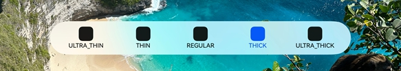

ULTRA_THICK style:


On high computing power devices that support immersive material:

ULTRA_THIN style:


THIN style:


REGULAR style:

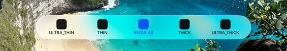

THICK style:


ULTRA_THICK style:


### Example 2: Obtaining Material Configuration Information and Using an Empty Material to Disable the Immersive System Material

This example shows how to use [uiMaterial.getMaterialInfo](#uimaterialgetmaterialinfo) to obtain the material configuration information of this application and use [empty](#empty) to disable the immersive system material effect for a specific component based on the set state.

Since API version 26.0.0, the **uiMaterial.getMaterialInfo** and **empty** APIs are added.

Configure the toggle information in the [module.json5](../../quick-start/module-configuration-file.md) file. Note that the configuration takes effect only in the module of the entry type.
``` json5
{
  "module": {
    // ···
    "type": "entry", // Note that the configuration takes effect only in the module of the entry type.
    // ···
    "metadata": [{
      "name": "ohos.arkui.UIMaterial.state",
      "value": "enable"
    }],
    // ···
  }
}
```
Then write the sample code as follows.
``` ts
import { uiMaterial } from '@kit.ArkUI';

@Entry
@Component
struct MaterialInfoPage {
  // Obtain the material configuration.
  private info: uiMaterial.MaterialInfo = uiMaterial.getMaterialInfo();

  build() {
    Column() {
      Column({ space: 20 }) {
        Column() {
          Text(`MaterialState: ${this.info.state}`)
            .fontSize(16)
          Text(`MaterialType: ${this.info.type}`)
            .fontSize(16)
        }
        .backgroundColor(Color.White)
        .padding(15)

        // Determine the component behavior based on the state.
        if (this.info.state === uiMaterial.MaterialState.ENABLE) {
          // The Toggle component enables the immersive system material by default.
          Toggle({ type: ToggleType.Switch })
            .width(100)
            .height(50)
          // Separately disable the immersive system material of the Toggle component.
          Toggle({ type: ToggleType.Switch })
            .width(100)
            .height(50)
            .systemMaterial(uiMaterial.Material.empty)
        }
      }
      .width('100%')
      .height('100%')
      .justifyContent(FlexAlign.Center)
      // $r('app.media.img') needs to be replaced with the image resource file required by the developer.
      .backgroundImage($r('app.media.img'))

    }.width('100%').height('100%')
  }
}
```

The following shows the effect on a high computing power device that supports immersive material:

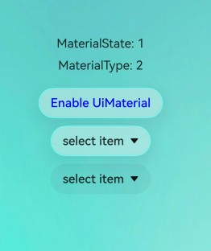

On a medium computing power device that supports immersive material:

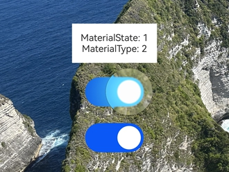

On a low computing power device that supports immersive material:

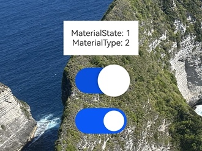

### Example 3: Setting an Interactive Deformation Effect for the Component Material

This example shows how to use the **interactive** API in [ImmersiveOptions](#immersiveoptions) to implement an interactive deformation effect for a component.

Since API version 26.0.0, the **interactive** API is added.

``` ts
import { uiMaterial } from '@kit.ArkUI';

@Entry
@Component
struct Index {
  build() {
    Column() {
      Tabs({ barPosition: BarPosition.End }) {
        TabContent() {
          // Replace $r('app.media.invert') with the image resource file required.
          Image($r('app.media.invert'))
            .width('100%')
            .height('100%')
        }.tabBar(new BottomTabBarStyle($r('sys.media.ohos_icon_mask_svg'), 'tab1')
          .labelStyle({ selectedColor: $r('sys.color.brand'), unselectedColor: $r('sys.color.font_primary') })
          .iconStyle({ selectedColor: $r('sys.color.brand'), unselectedColor: $r('sys.color.font_primary') })
        )
      }
      .barFloatingStyle({
        systemMaterial: new uiMaterial.ImmersiveMaterial({
          style: uiMaterial.ImmersiveStyle.ULTRA_THIN,
          // Enable the interactive deformation effect.
          interactive: true,
        }),
        maskColor: Color.Transparent,
      })
      .barOverlap(true)
      .height('100%')
    }
    .width('100%')
    .height('100%')
  }
}
```

On a high computing power device that supports immersive material:


On a medium computing power device that supports immersive material:

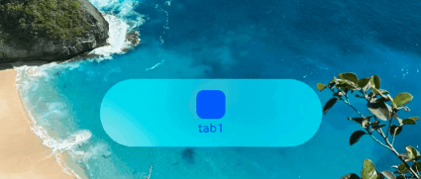

On a low computing power device that supports immersive material:

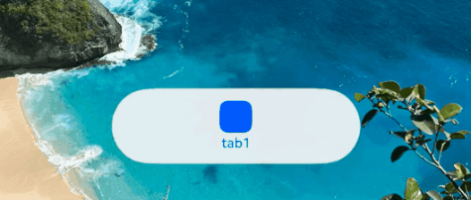

### Example 4: Setting a Light Sensing Interaction Feedback Effect for the Component Material

This example shows how to use the **lightEffect** API in [ImmersiveOptions](#immersiveoptions) to implement a light sensing interaction feedback effect for a component.

Since API version 26.0.0, the **lightEffect** API is added.

``` ts
// xxx.ets
import { uiMaterial } from '@kit.ArkUI';

@Styles
function systemMaterialStyle() {
  .margin(5)
  .width(70)
  .height(70)
  .borderRadius(50)
}

@Entry
@Component
struct NavigationTitleMaterialDemo {
  @State myMaterial: uiMaterial.ImmersiveMaterial = new uiMaterial.ImmersiveMaterial({
    style: uiMaterial.ImmersiveStyle.ULTRA_THIN,
    interactive: true,
    lightEffect: {},
  });

  @Builder
  CustomMenuBuilder() {
    Stack() {
      Row() {
        Text('Title')
          .fontSize(30)
          .fontColor(Color.White)
          .margin({ right: 50 })

        Column() {
        }
        .systemMaterialStyle()
        .systemMaterial(this.myMaterial)

        Column() {
        }
        .systemMaterialStyle()
        .systemMaterial(this.myMaterial)

        Column() {
        }
        .systemMaterialStyle()
        .systemMaterial(this.myMaterial)
      }
      .justifyContent(FlexAlign.End)
    }
    .width('100%')
    .height(100)
  }

  build() {
    Stack() {
      // Replace $r('app.media.invert') with the image resource file required by the developer.
      Image($r('app.media.invert'))
      Navigation() {
        // Page content.
      }
      .title(this.CustomMenuBuilder())
    }
    .width('100%')
    .height('100%')
  }
}
```

On a high computing power device that supports immersive material:

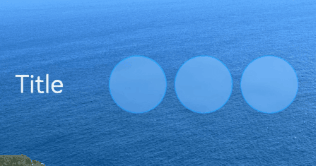

On a medium computing power device that supports immersive material:

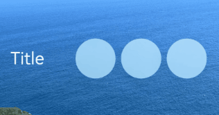

On a low computing power device that supports immersive material:

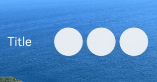

### Example 5 (Querying the Material Level and Whether Immersive Material Is Supported)

This example describes how to obtain the material level of the device through [getGlobalMaterialLevel](#uimaterialgetglobalmateriallevel) and determine whether the device supports immersive material through [isImmersiveMaterialSupported](#uimaterialisimmersivematerialsupported), and then decide whether to set immersive material for a component. With this adaptation approach, an application can reuse the same code on different devices that support and do not support immersive material. On devices that do not support immersive material, the application automatically degrades to the normal style, eliminating the need to write different code for different devices.

Since API version 26.0.0, the getGlobalMaterialLevel and isImmersiveMaterialSupported methods are added.

``` ts
// xxx.ets
import { uiMaterial } from '@kit.ArkUI';

@Styles
function systemMaterialStyle() {
  .margin(5)
  .width(70)
  .height(70)
  .borderRadius(50)
}

@Entry
@Component
struct NavigationTitleMaterialDemo {
  private materialLevel: uiMaterial.MaterialLevel = uiMaterial.getGlobalMaterialLevel(); // The material level is determined by the device and does not change after the application runs.
  private isSupported: boolean = uiMaterial.isImmersiveMaterialSupported(); // Whether immersive material is supported is determined by the device and does not change after the application runs.

  @Builder
  CustomMenuBuilder() {
    Stack() {
      Row() {
        Text('Title')
          .fontSize(30)
          .fontColor(Color.White)
          .margin({ right: 50 })

        Column() {
        }
        .systemMaterialStyle()
        .backgroundColor(this.isSupported ? Color.Transparent :
          '#f2f1f3f5') // Write the background color before systemMaterial. On low-computing-power devices that support immersive material, the background color effect contained in the immersive material takes effect eventually.
        // On devices that support immersive material, set a transparent background color and immersive material, and the immersive material set later takes effect. On devices that do not support immersive material, set the background color '#f2f1f3f5' and undefined with no material effect, and the background color attribute '#f2f1f3f5' takes effect.
        .systemMaterial(this.isSupported ? new uiMaterial.ImmersiveMaterial({
          style: uiMaterial.ImmersiveStyle.REGULAR,
        }) : undefined)

        Column() {
        }
        .systemMaterialStyle()
        .backgroundColor(this.isSupported ? Color.Transparent :
          $r('sys.color.comp_background_emphasize')) // Write the background color before systemMaterial. On low-computing-power devices that support immersive material, the background color effect contained in the immersive material takes effect eventually.
        // On devices that support immersive material, set a transparent background color and immersive material with tinting, and the immersive material with tinting set later takes effect. On devices that do not support immersive material, set the background color of the resource value and undefined with no material effect, and the background color attribute of the resource value takes effect.
        .systemMaterial(this.isSupported ? new uiMaterial.ImmersiveMaterial({
          style: uiMaterial.ImmersiveStyle.REGULAR,
          materialColor: $r('sys.color.comp_background_emphasize'),
        }) : undefined)

        Column() {
        }
        .systemMaterialStyle()
        .backgroundColor($r('sys.color.comp_background_emphasize')) // Write the background color before systemMaterial. On low-computing-power devices that support immersive material, the background color effect contained in the immersive material takes effect eventually.
        // On devices that support immersive material, if the device has high or medium computing power, the immersive material set later clears the background color effect to a transparent color and uses the material effect. If the device has low computing power, the background color effect contained in the immersive material set later overrides the effect of the backgroundColor attribute, and the material color is used.
        // On devices that do not support immersive material, setting systemMaterial has no effect, and the background color attribute of the resource value takes effect.
        .systemMaterial(new uiMaterial.ImmersiveMaterial({
          style: uiMaterial.ImmersiveStyle.REGULAR,
          materialColor: $r('sys.color.comp_background_emphasize')
        }))
      }
      .justifyContent(FlexAlign.End)
    }
    .backgroundColor('#99000000')
    .width('100%')
    .height(100)
  }

  build() {
    Stack() {
      // Replace $r('app.media.invert') with the image resource file required.
      Image($r('app.media.invert'))

      Navigation() {
        Column() {
          Text(`MaterialLevel: ${this.materialLevel}`)
            .fontSize(16)

          Text(`IsImmersiveMaterialSupported: ${this.isSupported}`)
            .fontSize(16)
        }
        .backgroundColor(Color.White)
        .margin({ top: 100 })
        .padding(15)
      }
      .title(this.CustomMenuBuilder())
    }
    .width('100%')
    .height('100%')
  }
}
```

On a high computing power device that supports immersive material:

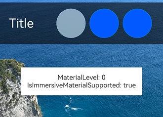

On a medium computing power device that supports immersive material:

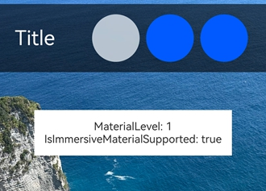

On a low computing power device that supports immersive material:

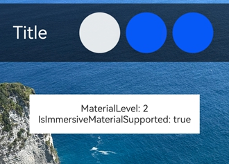

On a device that does not support immersive material:

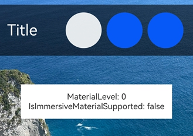
