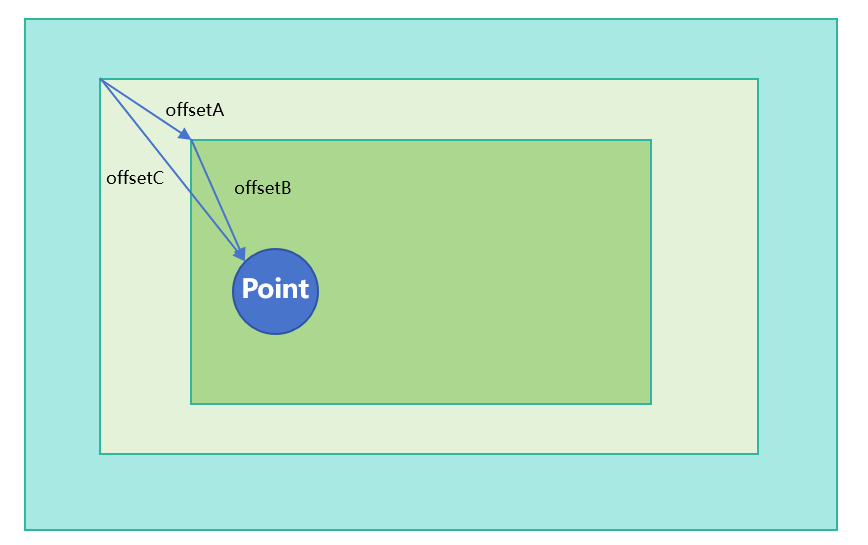

# BuilderNode

The **BuilderNode** module provides APIs for a BuilderNode – a custom node that can be used to mount built-in components. A BuilderNode can be used only as a leaf node. For details, see [BuilderNode Development](../../../ui/arkts-user-defined-arktsNode-builderNode.md). For best practices, see [Dynamic Component Creation: Dynamically Adding, Updating, and Deleting Components](https://developer.huawei.com/consumer/en/doc/best-practices/bpta-ui-dynamic-operations#section153921947151012).

Compared with **BuilderNode**, **ReactiveBuilderNode** can generate a component tree through the stateless UI method @Builder with multiple parameters.

> **NOTE:** 
> 
> - If the root node of the provided Builder is a syntax node ([if/else](../../../ui/rendering-control/arkts-rendering-control-ifelse.md)/[ForEach](../../../ui/rendering-control/arkts-rendering-control-foreach.md)/[LazyForEach](../../../ui/rendering-control/arkts-rendering-control-lazyforeach.md)/[ContentSlot](../../../ui/rendering-control/arkts-rendering-control-contentslot.md)...),Span, ContainerSpan,SymbolSpan, or a custom component, an additional FrameNode is generated and displayed as BuilderProxyNode in the node tree. This structural change affects the propagation of certain events. For details, see [BuilderProxyNode in BuilderNode Causes Tree Structure Changes](../../../ui/arkts-user-defined-arktsNode-builderNode.md#builderproxynode-in-buildernode-causes-tree-structure-changes).
> 
> - If you encounter display issues when reusing a BuilderNode across pages, see [Cross-Page Reuse Considerations](../../../ui/arkts-user-defined-arktsNode-builderNode.md#cross-page-reuse-considerations)for guidance.
> 
> - **BuilderNode** is not available in DevEco Studio Previewer.
> 
> - Custom components under **BuilderNode** can use the [@Prop](../../../ui/state-management/arkts-prop.md)decorator. The [@Link](../../../ui/state-management/arkts-link.md) decorator cannot be used to synchronize external data and status across **BuilderNode** boundaries.
> 
> - If a BuilderNode contains custom components as child nodes, these custom components cannot use the [@Reusable](../../../ui/state-management/arkts-reusable.md) decorator. For details, see [Using the @Reusable Decorator with BuilderNode Child Components](../../../ui/arkts-user-defined-arktsNode-builderNode.md#using-the-reusable-decorator-with-buildernode-child-components).
> 
> - Since API version 12, custom components can receive [LocalStorage](../../../ui/state-management/arkts-localstorage.md) instances. You can use LocalStorage related decorators such as [@LocalStorageProp](../../../ui/state-management/arkts-localstorage.md#localstorageprop) and [@LocalStorageLink](../../../ui/state-management/arkts-localstorage.md#localstoragelink) by [passing LocalStorage instances](../../../ui/state-management/arkts-localstorage.md#providing-a-custom-component-with-access-to-a-localstorage-instance).
> 
> - Since API version 20, when configured with [BuildOptions](arkts-arkui-buildernode-buildoptions-i.md), custom components within a BuilderNode can access the host page's [@Provide](../../../ui/state-management/arkts-provide-and-consume.md) data through their [@Consume](../../../ui/state-management/arkts-provide-and-consume.md) decorated attributes.
> 
> - The behavior of other decorators is undefined. Avoid using those decorators.
> 
> - [Repeat](../../../ui/rendering-control/arkts-new-rendering-control-repeat.md) can be used only in custom components.
> 
> - BuilderNode objects do not support JSON serialization.

**Since:** 11

**System capability:** SystemCapability.ArkUI.ArkUI.Full

## build

```TypeScript
build(builder: WrappedBuilder<Args>, arg?: Object): void
```

Creates a component tree based on the passed object and holds the root node of the component tree. The stateless UI method [@Builder](../../../ui/state-management/arkts-builder.md) has at most one root node.

Custom components are allowed.

> **NOTE:** 

> - When nesting @Builder, ensure that the input objects for the inner and outer @Builder methods are consistent.
> 
> - The outermost @Builder supports only one input parameter.
> 
> - The build parameter uses the pass-by-value semantics. To implement state updates, you must explicitly use the [update](#update) API.
> 
> - To operate objects in a BuilderNode, ensure that the reference to the BuilderNode is not garbage collected.When a BuilderNode object is garbage collected by the virtual machine, the associated FrameNode and [RenderNode](arkts-arkui-rendernode-c.md) objects are also dereferenced from the backend node tree. This means that any FrameNode objects obtained from a BuilderNode will no longer correspond to any actual node if the BuilderNode is garbage collected.
> 
> - The BuilderNode object maintains references to its underlying entity nodes. When the BuilderNode frontend object is no longer required for managing backend nodes, call the [dispose](#dispose) API to release node references and unbind frontend and backend nodes.

**Since:** 11

**Model restriction:** This API can be used only in the stage model.

**Atomic service API:** This API can be used in atomic services since API version 12.

**System capability:** SystemCapability.ArkUI.ArkUI.Full

**Parameters:**

| Name | Type | Mandatory | Description |
| --- | --- | --- | --- |
| builder | [WrappedBuilder](../arkts-components/arkts-arkui-wrappedbuilder-c.md)&lt;Args&gt; | Yes | Stateless UI method [@Builder](../../../ui/state-management/arkts-builder.md) required for creating a component tree. |
| arg | Object | No | Argument of the builder. Only one input parameter is supported, and the type of the input parameter must be consistent with the type defined by @Builder.<br>Default value: **undefined**. |

**Examples**

```TypeScript
import { BuilderNode, NodeContent } from '@kit.ArkUI';

// Define the API for passing parameters.
interface ParamsInterface {
  text: string;
  func: Function;
}

@Builder
function buildTextWithFunc(func: Function) {
  Text(func())
    .fontSize(50)
    .fontWeight(FontWeight.Bold)
    .margin({ bottom: 36 })
}

@Builder
function buildText(params: ParamsInterface) {
  Column() {
    Text(params.text)
      .fontSize(50)
      .fontWeight(FontWeight.Bold)
      .margin({ bottom: 36 })
    buildTextWithFunc(params.func)
  }
}


@Entry
@Component
struct Index {
  @State message: string = 'HELLO';
  private content: NodeContent = new NodeContent();

  build() {
    Row() {
      Column() {
        Button('addBuilderNode')
          .onClick(() => {
            let buildNode = new BuilderNode<[ParamsInterface]>(this.getUIContext());
            // Create a node tree.
            buildNode.build(wrapBuilder<[ParamsInterface]>(buildText), {
              text: this.message, func: () => {
                return 'FUNCTION';
              }
            }, { nestingBuilderSupported: true });
            this.content.addFrameNode(buildNode.getFrameNode());
            buildNode.dispose();
          })
        ContentSlot(this.content)
      }
      .id('column')
      .width('100%')
      .height('100%')
    }
    .height('100%')
  }
}
```

## build

```TypeScript
build(builder: WrappedBuilder<Args>, arg: Object, options: BuildOptions): void
```

Creates a component tree based on the passed object and holds the root node of the component tree. The stateless UI method [@Builder](../../../ui/state-management/arkts-builder.md) has at most one root node.

Custom components are allowed. Compared with the [build(builder: WrappedBuilder\&lt;Args&gt;, arg?: Object)](#build) API, this API can use the builder configuration parameters to determine whether @Builder can be nested with @ Builder.

> **NOTE:** 

> - For details about the creation and update using @Builder, see [@Builder](../../../ui/state-management/arkts-builder.md).
> 
> - The outermost @Builder supports only one input parameter.

**Since:** 12

**Model restriction:** This API can be used only in the stage model.

**Atomic service API:** This API can be used in atomic services since API version 12.

**System capability:** SystemCapability.ArkUI.ArkUI.Full

**Parameters:**

| Name | Type | Mandatory | Description |
| --- | --- | --- | --- |
| builder | [WrappedBuilder](../arkts-components/arkts-arkui-wrappedbuilder-c.md)&lt;Args&gt; | Yes | Stateless UI method [@Builder](../../../ui/state-management/arkts-builder.md) required for creating a component tree. |
| arg | Object | Yes | Argument of the builder. Only one input parameter is supported, and the type of the input parameter must be consistent with the type defined by @Builder. |
| options | [BuildOptions](arkts-arkui-buildernode-buildoptions-i.md) | Yes | Build options, which determine whether to support nesting @Builder within @ Builder. |

**Examples**

```TypeScript
import { BuilderNode, NodeContent } from '@kit.ArkUI';

// Define the API for passing parameters.
interface ParamsInterface {
  text: string;
  func: Function;
}

@Builder
function buildTextWithFunc(func: Function) {
  Text(func())
    .fontSize(50)
    .fontWeight(FontWeight.Bold)
    .margin({ bottom: 36 })
}

@Builder
function buildText(params: ParamsInterface) {
  Column() {
    Text(params.text)
      .fontSize(50)
      .fontWeight(FontWeight.Bold)
      .margin({ bottom: 36 })
    buildTextWithFunc(params.func)
  }
}


@Entry
@Component
struct Index {
  @State message: string = 'HELLO';
  private content: NodeContent = new NodeContent();

  build() {
    Row() {
      Column() {
        Button('addBuilderNode')
          .onClick(() => {
            let buildNode = new BuilderNode<[ParamsInterface]>(this.getUIContext());
            // Create a node tree.
            buildNode.build(wrapBuilder<[ParamsInterface]>(buildText), {
              text: this.message, func: () => {
                return 'FUNCTION';
              }
            }, { nestingBuilderSupported: true });
            this.content.addFrameNode(buildNode.getFrameNode());
            buildNode.dispose();
          })
        ContentSlot(this.content)
      }
      .id('column')
      .width('100%')
      .height('100%')
    }
    .height('100%')
  }
}
```

## constructor

```TypeScript
constructor(uiContext: UIContext, options?: RenderOptions)
```

When content generated by BuilderNode is embedded within another RenderNode for display, the **selfIdealSize** parameter in **RenderOptions** must be explicitly specified. Otherwise, the layout constraints for the parent component in Builder default to [0, 0]. In this case, if **selfIdealSize** is not set, the root node of the subtree in BuilderNode will have a size of [0, 0].

**Since:** 11

**Model restriction:** This API can be used only in the stage model.

**Atomic service API:** This API can be used in atomic services since API version 12.

**System capability:** SystemCapability.ArkUI.ArkUI.Full

**Parameters:**

| Name | Type | Mandatory | Description |
| --- | --- | --- | --- |
| uiContext | [UIContext](arkts-arkui-arkui-uicontext-uicontext-c.md) | Yes | UI context. For details about how to obtain it, see [Obtaining UI Context](../../../reference/apis-arkui/js-apis-arkui-node.md#obtaining-ui-context). |
| options | [RenderOptions](arkts-arkui-buildernode-renderoptions-i.md) | No | Parameters for creating a BuilderNode.<br>Default value: **undefined**. |

## dispose

```TypeScript
dispose(): void
```

Immediately releases the reference relationship between this BuilderNode object and its [entity node](../../../ui/arkts-user-defined-node.md#basic-concepts). For details about the scenarios involving BuilderNode unbinding, see [Canceling the Reference to the Entity Node](../../../ui/arkts-user-defined-arktsNode-builderNode.md#canceling-the-reference-to-the-entity-node).

> **NOTE:** 
> 
> After calling **dispose()**, the BuilderNode object cancels its reference to the backend entity node. If the
> frontend object BuilderNode cannot be released, memory leaks may occur. To avoid this, be sure to call
> **dispose()** on the BuilderNode when you no longer need it. This reduces the complexity of reference
> relationships and lowers the risk of memory leaks. For details, see
> [Memory Leak Caused by Circular Reference Between BuilderNode Frontend and Backend](../../../ui/arkts-user-defined-node-faq.md#memory-leak-caused-by-circular-reference-between-buildernode-frontend-and-backend).

**Since:** 12

**Model restriction:** This API can be used only in the stage model.

**Atomic service API:** This API can be used in atomic services since API version 12.

**System capability:** SystemCapability.ArkUI.ArkUI.Full

## getFrameNode

```TypeScript
getFrameNode(): FrameNode | null
```

Obtains the FrameNode from the BuilderNode. The FrameNode is generated only after the BuilderNode executes the build operation.

**Since:** 11

**Model restriction:** This API can be used only in the stage model.

**Atomic service API:** This API can be used in atomic services since API version 12.

**System capability:** SystemCapability.ArkUI.ArkUI.Full

**Return value:**

| Type | Description |
| --- | --- |
| [FrameNode](arkts-arkui-framenode-c.md) &#124; null | **FrameNode** object. If no such object is held by the **BuilderNode** instance, null is returned. |

## inheritFreezeOptions

```TypeScript
inheritFreezeOptions(enabled: boolean): void
```

Sets whether the current **BuilderNode** object inherits the freeze policy from its parent component's custom components. When inheritance is disabled (set to **false**), the object's freeze policy is set to **false**, which means its associated node remains unfrozen even in an inactive state.

> **NOTE:** 
> 
> When **inheritFreezeOptions** is set to **true** for **BuilderNode** and the parent component is a custom
> component, BuilderNode, ComponentContent, ReactiveBuilderNode, or ReactiveComponentContent, the freeze policy of
> the parent component is inherited. If the child component is a custom component, its freeze policy is not
> transferred to the child component.

**Since:** 20

**Model restriction:** This API can be used only in the stage model.

**Atomic service API:** This API can be used in atomic services since API version 20.

**System capability:** SystemCapability.ArkUI.ArkUI.Full

**Parameters:**

| Name | Type | Mandatory | Description |
| --- | --- | --- | --- |
| enabled | boolean | Yes | Whether the current **BuilderNode** object inherits the freeze policy from its parent component's custom components. The value **true** means to inherit the freeze policy from parent component's custom components, and **false** means the opposite. |

**Examples**

```TypeScript
The following example illustrates how to configure the BuilderNode to inherit the freeze policy from its parent component's custom components (that is, set enabled to true), resulting in the following behavior: It automatically freezes when in inactive state and thaws and updates cached data when in active state.
```

## isDisposed

```TypeScript
isDisposed(): boolean
```

Checks whether this BuilderNode object has released its reference to its backend entity node. Frontend nodes maintain references to corresponding backend entity nodes. After a node calls the **dispose** API to release this reference, subsequent API calls may cause crashes or return default values. This API facilitates validation of node validity prior to operations, thereby mitigating risks in scenarios where calls after disposal are required.

**Since:** 20

**Model restriction:** This API can be used only in the stage model.

**Atomic service API:** This API can be used in atomic services since API version 20.

**System capability:** SystemCapability.ArkUI.ArkUI.Full

**Return value:**

| Type | Description |
| --- | --- |
| boolean | Whether the reference to the backend node is released. The value **true** means that the reference to backend node is released, and **false** means the opposite. |

**Examples**

```TypeScript
The following example shows how to verify a BuilderNode's state using the [isDisposed](#isdisposed) API before and after node release. This API returns false before node release and true after node release.
```

## postInputEvent

```TypeScript
postInputEvent(event: InputEventType): boolean
```

Dispatches the specified input event to the target node.

**offsetA** indicates the BuilderNode's offset relative to its parent component, **offsetB** the hit position's offset relative to the BuilderNode, **offsetC** the composite offset (offsetA + offsetB) passed to the window in **postInputEvent**.



> **NOTE:** 
> 
> - The passed coordinates must be converted to the unit of px. The sample code below demonstrates how to perform such coordinate conversion.
> 
> - Mouse left-click events are automatically converted to touch events. Avoid binding both touch and mouse events at the outer layer, as this may cause coordinate offsets. This is because the **SourceType** remains unchanged during event conversion. For details, see onTouch.
> 
> - When an [axis event](../arkts-components/arkts-arkui-axisevent-i.md) event is injected, it cannot trigger rotation gestures, because the axis event does not include rotation axis information.
> 
> - A forwarded event undergoes touch testing in the target component's subtree and triggers corresponding gestures. The original event also triggers gestures in the source component tree. There is no guaranteed outcome for gesture competition between these two types of gestures.
> 
> - For developer-constructed events, mandatory fields must be assigned values, such as the **touches** field for touch events and the **scrollStep** field for axis events Ensure the completeness of the event, for example, both
> **DOWN** and **UP** [TouchType](arkts-arkui-touchtype-e.md) states must be included for a touch event to prevent undefined
> behavior.
> 
> - [webview](../../apis-arkweb/arkts-apis/arkts-arkweb-web-webview.md) has already handled coordinate system transformation, so events can be dispatched.
> 
> - The **postTouchEvent** API needs to provide the gesture coordinates relative to the local coordinates of the target component, and the **postInputEvent** API needs to provide the gesture coordinates relative to the window coordinates of the target component.
> 
> - Avoid forwarding a single event multiple times.

**Since:** 20

**Model restriction:** This API can be used only in the stage model.

**Atomic service API:** This API can be used in atomic services since API version 20.

**System capability:** SystemCapability.ArkUI.ArkUI.Full

**Parameters:**

| Name | Type | Mandatory | Description |
| --- | --- | --- | --- |
| event | [InputEventType](arkts-arkui-inputeventtype-t.md) | Yes | Input event to dispatch. |

**Return value:**

| Type | Description |
| --- | --- |
| boolean | Whether the event is successfully dispatched. Returns **true** if the event is successfully dispatched; returns **false** otherwise. |

**Examples**

```TypeScript
See Example 1: Handling Mouse Events in BuilderNode, Example 2: Handling Touch Events in BuilderNode, and Example 3: Handling Axis Events in BuilderNode.
```

## postInputEventWithStrategy

```TypeScript
postInputEventWithStrategy(event: InputEventType, competitionStrategy?: CompetitionStrategy): boolean
```

Posts an event containing a competition strategy to the target UI component node.

Before calling this API, you need to convert the value of **event** to the corresponding event and convert the coordinates in the **window** parameter in **event**. **offsetA** indicates the offset of the builderNode relative to the parent component, **offsetB** indicates the offset of the hit position relative to the builderNode, and **offsetC** is the sum of **offsetA** and **offsetB**. The value of **offsetC** is used as the value of the **window** parameter in **event** and passed to the **postInputEventWithStrategy** method. For details, see the following sample code.


> **NOTE:** 
> 
> - The passed coordinates must be converted to the unit of px. The sample code below demonstrates how to perform such coordinate conversion.
> 
> - When processing a mouse left-click event, the system converts the event to a touch event. When forwarding the event, do not bind the touch event and mouse event at the outer layer at the same time, as this may cause coordinate offsets. This is because [TouchType](arkts-arkui-touchtype-e.md) does not change during the event conversion. For details about the specifications, see onTouch.
> 
> - When an [axis event](../arkts-components/arkts-arkui-axisevent-i.md) event is injected, it cannot trigger rotation gestures, because the axis event does not include rotation axis information.
> 
> - The forwarded event is posted to the target component and its child components for processing, and triggers the corresponding gesture. You can use input parameters to control whether the gestures of the current component and the target component are in a competitive relationship.
> 
> - If the event is converted to a developer-constructed event, mandatory fields must be assigned values, for example, the **touches** field of a touch event and the **scrollStep** field of an axis event. Ensure the completeness of the event. For example, [TouchType](arkts-arkui-touchtype-e.md) of a touch event must contain both the
> **DOWN** and **UP** fields to prevent program exceptions or unexpected crashes.
> 
> - The same event can be forwarded multiple times.

**Since:** 24

**Model restriction:** This API can be used only in the stage model.

**Atomic service API:** This API can be used in atomic services since API version 24.

**System capability:** SystemCapability.ArkUI.ArkUI.Full

**Parameters:**

| Name | Type | Mandatory | Description |
| --- | --- | --- | --- |
| event | [InputEventType](arkts-arkui-inputeventtype-t.md) | Yes | Input event used for event posting. |
| competitionStrategy | [CompetitionStrategy](arkts-arkui-competitionstrategy-e.md) | No | Whether the gesture for posting the event is in a competition scenario. By default, the gesture is not in a competition scenario. |

**Return value:**

| Type | Description |
| --- | --- |
| boolean | Whether the event is successfully dispatched. Returns **true** if the operation is successful; returns **false** otherwise. |

**Examples**

```TypeScript
For details, see Example 16: Handling Mouse Events with Competition Strategies in BuilderNode, Example 17: Handling Touch Events with Competition Strategies in BuilderNode, and Example 18: Handling Axis Events with Competition Strategies in BuilderNode.
```

## postTouchEvent

```TypeScript
postTouchEvent(event: TouchEvent): boolean
```

Posts a raw touch event to the FrameNode created by this BuilderNode.

**postTouchEvent** dispatches the event from a middle node in the component tree downwards. To ensure the event is dispatched correctly, it needs to be transformed into the coordinate system of the parent component, as shown in the figure below.

**OffsetA** indicates the offset of the BuilderNode relative to the parent component. You can obtain this offset by calling [getPositionToParent](arkts-arkui-framenode-c.md#getpositiontoparent) in the FrameNode. **OffsetB** indicates the offset of the touch point relative to the BuilderNode. You can obtain this offset from the TouchEvent object. **OffsetC** is the sum of **OffsetA** and **OffsetB**. It represents the final offset that you need to pass to **postTouchEvent**.


> **NOTE:** 
> 
> - The coordinates you pass in need to be converted to pixel values (px). If the BuilderNode has any affine transformations applied to it, they must be taken into account and combined with the touch event coordinates.
> 
> - In [Webview](../../apis-arkweb/arkts-apis/arkts-arkweb-web-webview.md), coordinate system transformations are already handled internally, so you can directly dispatch the touch event without additional adjustments.
> 
> - The **postTouchEvent** API can be called only once for the same timestamp.

**Since:** 11

**Model restriction:** This API can be used only in the stage model.

**Atomic service API:** This API can be used in atomic services since API version 12.

**System capability:** SystemCapability.ArkUI.ArkUI.Full

**Parameters:**

| Name | Type | Mandatory | Description |
| --- | --- | --- | --- |
| event | [TouchEvent](../arkts-components/arkts-arkui-touchevent-i.md) | Yes | Touch event. |

**Return value:**

| Type | Description |
| --- | --- |
| boolean | Whether the event is successfully dispatched. The value **true** means the event is consumed by a component that responds to the event, and **false** means that no component responds to the event.<br>**NOTE:** <br>If the event does not hit the expected component, ensure the following: <br>1. The coordinate system has been correctly transformed <br>2. The component is in an interactive state. <br>3. The event has been bound to the component. |

**Examples**

```TypeScript
import { NodeController, BuilderNode, FrameNode, UIContext } from '@kit.ArkUI';

// Define the class for passing parameters.
class Params {
  text: string = 'this is a text';
}

@Builder
function ButtonBuilder(params: Params) {
  Column() {
    Button(`button ` + params.text)
      .borderWidth(2)
      .backgroundColor(Color.Orange)
      .width('100%')
      .height('100%')
      .gesture(
        TapGesture()
          .onAction((event: GestureEvent) => {
            console.info('TapGesture');
          })
      )
  }
  .width(500)
  .height(300)
  .backgroundColor(Color.Gray)
}

// Implement a custom UI controller by extending NodeController.
class MyNodeController extends NodeController {
  private rootNode: BuilderNode<[Params]> | null = null;
  private wrapBuilder: WrappedBuilder<[Params]> = wrapBuilder(ButtonBuilder);

  makeNode(uiContext: UIContext): FrameNode | null {
    this.rootNode = new BuilderNode(uiContext);
    this.rootNode.build(this.wrapBuilder, { text: 'this is a string' });
    return this.rootNode.getFrameNode();
  }

  // Coordinate system transformation
  postTouchEvent(event: TouchEvent, uiContext: UIContext): boolean {
    if (this.rootNode == null) {
      return false;
    }
    let node: FrameNode | null = this.rootNode.getFrameNode();
    let offsetX: number | null | undefined = node?.getPositionToParent().x;
    let offsetY: number | null | undefined = node?.getPositionToParent().y;
    
    let changedTouchLen = event.changedTouches.length;
    for (let i = 0; i < changedTouchLen; i++) {
      if (offsetX != null && offsetY != null && offsetX != undefined && offsetY != undefined) {
        event.changedTouches[i].x = uiContext.vp2px(offsetX + event.changedTouches[i].x);
        event.changedTouches[i].y = uiContext.vp2px(offsetY + event.changedTouches[i].y);
      }
    }
    // Post the event to the FrameNode created by BuilderNode. result indicates whether the post is successful.
    let result = this.rootNode.postTouchEvent(event);
    console.info(`result ${result}`);
    return result;
  }

  aboutToDisappear() {
    this.rootNode?.dispose();
  }
}

@Entry
@Component
struct MyComponent {
  private nodeController: MyNodeController = new MyNodeController();

  build() {
    Column() {
      NodeContainer(this.nodeController)
        .height(300)
        .width(500)

      Column()
        .width(500)
        .height(300)
        .backgroundColor(Color.Pink)
        .onTouch((event) => {
          if (event != undefined) {
            this.nodeController.postTouchEvent(event, this.getUIContext());
          }
        })
    }
  }
}
```

## recycle

```TypeScript
recycle(): void
```

Triggers recycling of custom components under this BuilderNode. Component recycling is part of the component reuse mechanism. For details, see [@Reusable Decorator: Reusing V1 Components](../../../ui/state-management/arkts-reusable.md). Since API version 26.0.0, custom components in **BuilderNode** support V2 component reuse. For details, see [@ReusableV2 Decorator: Reusing Components](../../../ui/state-management/arkts-new-reusableV2.md).

> **NOTE:** 
> 
> The BuilderNode completes the reuse event transfer between internal and external custom components through
> **reuse** and **recycle**. For specific usage scenarios, see
> [Implementing Node Reuse with the BuilderNode reuse and recycle APIs](../../../ui/arkts-user-defined-arktsNode-builderNode.md#implementing-node-reuse-with-the-buildernode-reuse-and-recycle-apis).

**Since:** 12

**Model restriction:** This API can be used only in the stage model.

**Atomic service API:** This API can be used in atomic services since API version 12.

**System capability:** SystemCapability.ArkUI.ArkUI.Full

## reuse

```TypeScript
reuse(param?: Object): void
```

Triggers component reuse for custom components under this BuilderNode. For details about component reuse, see [@Reusable Decorator: Reusing V1 Components](../../../ui/state-management/arkts-reusable.md). For details about the scenarios involving BuilderNode unbinding, see [Canceling the Reference to the Entity Node](../../../ui/arkts-user-defined-arktsNode-builderNode.md#canceling-the-reference-to-the-entity-node). Since API version 26.0.0, custom components in **BuilderNode** support V2 component reuse. For details, see [@ReusableV2 Decorator: Reusing Components](../../../ui/state-management/arkts-new-reusableV2.md).

**Since:** 12

**Model restriction:** This API can be used only in the stage model.

**Atomic service API:** This API can be used in atomic services since API version 12.

**System capability:** SystemCapability.ArkUI.ArkUI.Full

**Parameters:**

| Name | Type | Mandatory | Description |
| --- | --- | --- | --- |
| param | Object | No | Parameter used to reuse the BuilderNode. This parameter is passed to all top-level custom components within the BuilderNode during reuse and must include all required constructor parameters for each component; otherwise, undefined behavior may occur. Calling this method synchronously triggers the [aboutToReuse](../../../reference/apis-arkui/arkui-ts/ts-custom-component-lifecycle.md#abouttoreuse10) lifecycle callback of internal custom components, with this parameter as the callback input. Default value: **undefined**, in which case the custom components in the BuilderNode will use their original construction data source. |

## update

```TypeScript
update(arg: Object): void
```

Updates this BuilderNode using the provided parameter, which must be of the same type as the input parameter passed to the [build](#build) API. When updating a custom component, define the variables used in the component as [@Prop](../../../ui/state-management/arkts-prop.md) decorated properties.

**Since:** 11

**Model restriction:** This API can be used only in the stage model.

**Atomic service API:** This API can be used in atomic services since API version 12.

**System capability:** SystemCapability.ArkUI.ArkUI.Full

**Parameters:**

| Name | Type | Mandatory | Description |
| --- | --- | --- | --- |
| arg | Object | Yes | Parameter used to update the BuilderNode. It is of the same type as the parameter passed to the [build](#build) API. |

**Examples**

```TypeScript
import { NodeController, BuilderNode, FrameNode, UIContext } from '@kit.ArkUI';

// Define the class for passing parameters.
class Params {
  text: string = '';
  constructor(text: string) {
    this.text = text;
  }
}

// Custom component
@Component
struct TextBuilder {
  @Prop message: string = 'TextBuilder';

  build() {
    Row() {
      Column() {
        Text(this.message)
          .fontSize(50)
          .fontWeight(FontWeight.Bold)
          .margin({bottom: 36})
          .backgroundColor(Color.Gray)
      }
    }
  }
}

@Builder
function buildText(params: Params) {
  Column() {
    Text(params.text)
      .fontSize(50)
      .fontWeight(FontWeight.Bold)
      .margin({ bottom: 36 })
    TextBuilder({message: params.text}) // Custom component
  }
}

// Implement a custom textNode controller by extending NodeController.
class TextNodeController extends NodeController {
  private textNode: BuilderNode<[Params]> | null = null;
  private message: string = '';

  constructor(message: string) {
    super();
    this.message = message;
  }

  makeNode(context: UIContext): FrameNode | null {
    this.textNode = new BuilderNode(context);
    this.textNode.build(wrapBuilder<[Params]>(buildText), new Params(this.message));
    return this.textNode.getFrameNode();
  }

  // Update the BuilderNode based on the input parameters.
  update(message: string) {
    if (this.textNode !== null) {
      this.textNode.update(new Params(message));
    }
  }
  aboutToDisappear() {
    this.textNode?.dispose();
  }
}

@Entry
@Component
struct Index {
  @State message: string = 'hello';
  private textNodeController: TextNodeController = new TextNodeController(this.message);
  private count = 0;

  build() {
    Row() {
      Column() {
        NodeContainer(this.textNodeController)
          .width('100%')
          .height(200)
          .backgroundColor('#FFF0F0F0')
        Button('Update')
          .onClick(() => {
            this.count += 1;
            const message = 'Update ' + this.count.toString();
            this.textNodeController.update(message);
          })
      }
      .width('100%')
      .height('100%')
    }
    .height('100%')
  }
}
```

## updateConfiguration

```TypeScript
updateConfiguration(): void
```

Transfers a system environment change event and triggers full update of a node. For details about system environment changes, see [@ohos.app.ability.Configuration (Environment Variables)](../../apis-ability-kit/arkts-apis/arkts-ability-app-ability-configuration-configuration-i.md).

> **NOTE:** 
> 
> The **updateConfiguration** API is used to instruct an object to update, with the system environment used for
> the update being determined by the changes in the application's current system environment.

**Since:** 12

**Model restriction:** This API can be used only in the stage model.

**Atomic service API:** This API can be used in atomic services since API version 12.

**System capability:** SystemCapability.ArkUI.ArkUI.Full

**Examples**

```TypeScript
import { NodeController, BuilderNode, FrameNode, UIContext, FrameCallback } from '@kit.ArkUI';
import { AbilityConstant, Configuration, ConfigurationConstant, EnvironmentCallback } from '@kit.AbilityKit';

class Params {
  text: string = '';

  constructor(text: string) {
    this.text = text;
  }
}

// Custom component
@Component
struct TextBuilder {
  // The @Prop decorated attribute is the attribute to be updated in the custom component. It is a basic attribute.
  @Prop message: string = 'TextBuilder';

  build() {
    Row() {
      Column() {
        Text(this.message)
          .fontSize(50)
          .fontWeight(FontWeight.Bold)
          .margin({ bottom: 36 })
      }
    }
  }
}

@Builder
function buildText(params: Params) {
  Column() {
    Text(params.text)
      .fontSize(50)
      .fontWeight(FontWeight.Bold)
      .margin({ bottom: 36 })
    TextBuilder({ message: params.text }) // Custom component
  }.backgroundColor($r('sys.color.ohos_id_color_background'))
}

// Implement a custom textNode controller by extending NodeController.
class TextNodeController extends NodeController {
  private textNode: BuilderNode<[Params]> | null = null;
  private message: string = '';

  constructor(message: string) {
    super();
    this.message = message;
  }

  makeNode(context: UIContext): FrameNode | null {
    return this.textNode?.getFrameNode() ? this.textNode?.getFrameNode() : null;
  }

  createNode(context: UIContext) {
    this.textNode = new BuilderNode(context);
    this.textNode.build(wrapBuilder<[Params]>(buildText), new Params(this.message));
    builderNodeMap.push(this.textNode);
  }

  deleteNode() {
    let node = builderNodeMap.pop();
    node?.dispose();
  }

  update(message: string) {
    if (this.textNode !== null) {
      // Call update to perform an update.
      this.textNode.update(new Params(message));
    }
  }
}

// Record the created custom node object.
const builderNodeMap: Array<BuilderNode<[Params]>> = new Array();

class MyFrameCallback extends FrameCallback {
  onFrame() {
    updateColorMode();
  }
}

function updateColorMode() {
  builderNodeMap.forEach((value, index) => {
    // Notify the BuilderNode of the environment changes to trigger switching between light and dark modes.
    value.updateConfiguration();
  })
}

@Entry
@Component
struct Index {
  @State message: string = 'hello';
  private textNodeController: TextNodeController = new TextNodeController(this.message);
  private count = 0;

  aboutToAppear(): void {
    let environmentCallback: EnvironmentCallback = {
      onMemoryLevel: (level: AbilityConstant.MemoryLevel): void => {
        console.info('onMemoryLevel');
      },
      onConfigurationUpdated: (config: Configuration): void => {
        console.info(`onConfigurationUpdated ${JSON.stringify(config)}`);
        this.getUIContext()?.postFrameCallback(new MyFrameCallback());
      }
    };
    // Register a callback.
    this.getUIContext().getHostContext()?.getApplicationContext().on('environment', environmentCallback);
    // Set the application color mode to follow the system settings.
    this.getUIContext()
      .getHostContext()?.getApplicationContext().setColorMode(ConfigurationConstant.ColorMode.COLOR_MODE_NOT_SET);
    // Create a custom node and add it to builderNodeMap.
    this.textNodeController.createNode(this.getUIContext());
  }

  aboutToDisappear(): void {
    // Remove the reference to the custom node from the map and release the node.
    this.textNodeController.deleteNode();
  }

  build() {
    Row() {
      Column() {
        NodeContainer(this.textNodeController)
          .width('100%')
          .height(200)
          .backgroundColor('#FFF0F0F0')
        Button('Update')
          .onClick(() => {
            this.count += 1;
            const message = 'Update ' + this.count.toString();
            this.textNodeController.update(message);
          })
        Button('Switch to Dark Mode')
          .onClick(() => {
            this.getUIContext()
              .getHostContext()?.getApplicationContext().setColorMode(ConfigurationConstant.ColorMode.COLOR_MODE_DARK);
          })
        Button('Switch to Light Mode')
          .onClick(() => {
            this.getUIContext()
              .getHostContext()?.getApplicationContext().setColorMode(ConfigurationConstant.ColorMode.COLOR_MODE_LIGHT);
          })
      }
      .width('100%')
      .height('100%')
    }
    .height('100%')
  }
}
```
