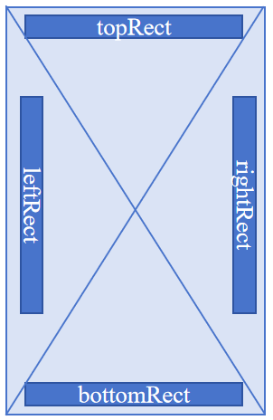

# AvoidArea

Describes the area to avoid for window content.

When adapting window content for an [immersive layout](../../../windowmanager/window-terminology.md#immersive-layout), you should adjust the content based on the corresponding **AvoidArea** specified by [AvoidAreaType](arkts-arkui-window-avoidareatype-e.md).

In the avoid area, the application window content is obscured and does not respond to user click events.

> **NOTE:** 
> 
> The figure below shows the meanings of **leftRect**, **topRect**, **rightRect**, and **bottomRect**.
> 
> 

**Since:** 7

**System capability:** SystemCapability.WindowManager.WindowManager.Core

## Modules to Import

```TypeScript
import { window } from '@kit.ArkUI';
```

## bottomRect

```TypeScript
bottomRect: Rect
```

Rectangle centered at the bottom of the window's two diagonals.

**Type:** [Rect](arkts-arkui-window-rect-i.md)

**Since:** 7

**Atomic service API:** This API can be used in atomic services since API version 11.

**System capability:** SystemCapability.WindowManager.WindowManager.Core

## leftRect

```TypeScript
leftRect: Rect
```

Rectangle centered to the left of the window's two diagonals.

**Type:** [Rect](arkts-arkui-window-rect-i.md)

**Since:** 7

**Atomic service API:** This API can be used in atomic services since API version 11.

**System capability:** SystemCapability.WindowManager.WindowManager.Core

## rightRect

```TypeScript
rightRect: Rect
```

Rectangle centered to the right of the window's two diagonals.

**Type:** [Rect](arkts-arkui-window-rect-i.md)

**Since:** 7

**Atomic service API:** This API can be used in atomic services since API version 11.

**System capability:** SystemCapability.WindowManager.WindowManager.Core

## topRect

```TypeScript
topRect: Rect
```

Rectangle centered at the top of the window's two diagonals.

**Type:** [Rect](arkts-arkui-window-rect-i.md)

**Since:** 7

**Atomic service API:** This API can be used in atomic services since API version 11.

**System capability:** SystemCapability.WindowManager.WindowManager.Core

## visible

```TypeScript
visible: boolean
```

Whether the avoid area is visible. **true** if visible, **false** otherwise.

**Type:** boolean

**Since:** 9

**Atomic service API:** This API can be used in atomic services since API version 11.

**System capability:** SystemCapability.WindowManager.WindowManager.Core
