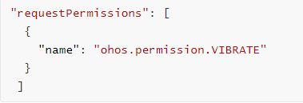

# ContextMenuOptions

```TypeScript
declare interface ContextMenuOptions
```

Configures menu item information.

**Table 1: Menu offset when both offset and placement are set**

| Value of placement | Menu Offset |  
| ------------------------------------------------------------ | ------------------------------------------------------------ |  
| Placement.TopLeft, Placement.Top, or Placement.TopRight | If the value of **x** is a positive number for **offset**, the menu shifts to the right relative to the component. If the value of **y** is a positive number, the menu shifts upward relative to the component.|
| Placement.BottomLeft, Placement.Bottom, or Placement.BottomRight| If the value of **x** is a positive number for **offset**, the menu shifts to the left relative to the component. If the value of **y** is a positive number, the menu shifts downward relative to the component.|
| Placement.RightTop, Placement.Right, or Placement.RightBottom | If the value of **x** is a positive number for **offset**, the menu shifts to the right relative to the component. If the value of **y** is a positive number, the menu shifts downward relative to the component.|

**Table 2: Default position of the menu arrow when both arrowOffset and placement are set**

| Value of placement | Menu Arrow Position |  
| ------------------------------------------- | ------------------------------------------------------------ |  
| Placement.Top or Placement.Bottom | The arrow is displayed horizontally and centered by default, with a distance from the left edge of the menu equal to the arrow's safe distance.|
| Placement.Left or Placement.Right | The arrow is displayed vertically and centered by default, with a distance from the top edge of the menu equal to the arrow's safe distance.|
| Placement.TopLeft or Placement.BottomLeft | The arrow is displayed horizontally by default, with a distance from the left edge of the menu equal to the arrow's safe distance.|
| Placement.TopRight or Placement.BottomRight | The arrow is displayed horizontally by default, with a distance from the right edge of the menu equal to the arrow's safe distance. |
| Placement.LeftTop or Placement.RightTop | The arrow is displayed vertically by default, with a distance from the top edge of the menu equal to the arrow's safe distance. |
| Placement.LeftBottom or Placement.RightBottom| The arrow is displayed vertically by default, with a distance from the bottom edge of the menu equal to the arrow's safe distance. |

**Table 3 Default menu position when enableArrow is set to true and placement is not set or set to an invalid value**

| API| Default Menu Position|  
|------|-------------|  
| [bindMenu](arkts-arkui-common-comp-commonmethod-c.md#bindmenu) | [Placement.BottomLeft](../arkts-apis/arkts-arkui-placement-e.md) |
| [bindMenu&lt;sup&gt;11+&lt;/sup&gt;](arkts-arkui-common-comp-commonmethod-c.md#bindmenu-1) | [Placement.BottomLeft](../arkts-apis/arkts-arkui-placement-e.md) |
| [bindContextMenu&lt;sup&gt;8+&lt;/sup&gt;](arkts-arkui-common-comp-commonmethod-c.md#bindcontextmenu) | Placement.Top |
| [bindContextMenu&lt;sup&gt;12+&lt;/sup&gt;](arkts-arkui-common-comp-commonmethod-c.md#bindcontextmenu-1) | [Placement.BottomLeft](../arkts-apis/arkts-arkui-placement-e.md) |
| [bindContextMenuWithResponse&lt;sup&gt;23+&lt;/sup&gt;](arkts-arkui-common-comp-commonmethod-c.md#bindcontextmenuwithresponse) | Placement.Top |

**Since:** 10

**System capability:** SystemCapability.ArkUI.ArkUI.Full

## aboutToAppear

```TypeScript
aboutToAppear?: () => void
```

Callback triggered when the menu is about to appear.

**Since:** 11

**Model restriction:** This API can be used only in the stage model.

**Atomic service API:** This API can be used in atomic services since API version 12.

**System capability:** SystemCapability.ArkUI.ArkUI.Full

## aboutToDisappear

```TypeScript
aboutToDisappear?: () => void
```

Callback triggered when the menu is about to disappear.

**Since:** 11

**Model restriction:** This API can be used only in the stage model.

**Atomic service API:** This API can be used in atomic services since API version 12.

**System capability:** SystemCapability.ArkUI.ArkUI.Full

## onAppear

```TypeScript
onAppear?: () => void
```

Callback invoked after the menu appears.

**Since:** 10

**Model restriction:** This API can be used only in the stage model.

**Atomic service API:** This API can be used in atomic services since API version 11.

**System capability:** SystemCapability.ArkUI.ArkUI.Full

## onDisappear

```TypeScript
onDisappear?: () => void
```

Callback invoked after the menu disappears.

**Since:** 10

**Model restriction:** This API can be used only in the stage model.

**Atomic service API:** This API can be used in atomic services since API version 11.

**System capability:** SystemCapability.ArkUI.ArkUI.Full

## anchorPosition

```TypeScript
anchorPosition?: Position
```

Display position of the menu relative to the upper left corner of the bound component by setting the horizontal and vertical offsets. Unlike using the **offset** API alone, this allows the menu to overlay the bound component.

Default value: **{ x: undefined, y: undefined }**. Percentage values are not supported.

**NOTE:** 

1. Offsets do not apply during menu preview state.
2. The preset value of **placement** does not take effect.
3. The **offset** parameter is added to determine the exact display position of the menu.
4. When both horizontal and vertical offsets are set to negative values, the menu is reset to **Placement.BottomLeft** for display.
5. If the horizontal or vertical offset is **undefined** or **null**, the effect is the same as that of not setting **anchorPosition**. In this case, the preset value of **placement** can take effect.

**Type:** Position

**Default:** { x: 0, y: 0 }

**Since:** 20

**Model restriction:** This API can be used only in the stage model.

**Atomic service API:** This API can be used in atomic services since API version 20.

**System capability:** SystemCapability.ArkUI.ArkUI.Full

## arrowOffset

```TypeScript
arrowOffset?: Length
```

Offset of the arrow relative to the context menu. The offset settings take effect only when the value is valid, can be converted to a number greater than 0, and does not cause the arrow to extend beyond the safe area of the context menu.

Default value: **0**

Unit: vp

**NOTE:** 

The safe distance of the arrow from the four sides of the menu is the sum of the menu's corner radius and half the width of the arrow.

The value of **placement** determines whether the offset is horizontal or vertical.

When the arrow is in the horizontal direction of the menu, the offset is the distance from the arrow to the leftmost arrow's safe distance. When the arrow is in the vertical direction of the menu, the offset is the distance from the arrow to the topmost arrow's safe distance.

The default position where the arrow is displayed varies with the value of **placement**:

Table 2 describes the relationship between the final position of the arrow and the value of **placement** in cases where the menu does not trigger repositioning.

This API is supported in **bindContextMenu** since API version 10 and **bindMenu** since API version 12.

**Type:** [Length](../arkts-apis/arkts-arkui-length-t.md)

**Default:** 0vp

**Since:** 10

**Model restriction:** This API can be used only in the stage model.

**Atomic service API:** This API can be used in atomic services since API version 11.

**System capability:** SystemCapability.ArkUI.ArkUI.Full

## availableLayoutArea

```TypeScript
availableLayoutArea?: AvailableLayoutArea
```

Available layout area of the preview image. The percentage of the preview image is calculated based on this setting. The preview image may be compressed or cropped due to the safe area restriction.

**NOTE:** 

If this parameter is not set or is set to **undefined**, the percentage is calculated based on the window size. If this parameter is set to **AvailableLayoutArea.SAFE_AREA**, the available layout area of the preview image is the window size minus the safe margins on all sides.

**Type:** [AvailableLayoutArea](arkts-arkui-common-comp-availablelayoutarea-e.md)

**Since:** 20

**Model restriction:** This API can be used only in the stage model.

**Atomic service API:** This API can be used in atomic services since API version 20.

**System capability:** SystemCapability.ArkUI.ArkUI.Full

## backgroundBlurStyle

```TypeScript
backgroundBlurStyle?: BlurStyle
```

Background blur style of the menu.

Default value: **BlurStyle.COMPONENT_ULTRA_THICK**

**Type:** [BlurStyle](arkts-arkui-common-comp-blurstyle-e.md)

**Default:** BlurStyle.COMPONENT_ULTRA_THICK

**Since:** 11

**Model restriction:** This API can be used only in the stage model.

**Atomic service API:** This API can be used in atomic services since API version 12.

**System capability:** SystemCapability.ArkUI.ArkUI.Full

## backgroundBlurStyleOptions

```TypeScript
backgroundBlurStyleOptions?: BackgroundBlurStyleOptions
```

Background blur style.

**Type:** [BackgroundBlurStyleOptions](arkts-arkui-common-comp-backgroundblurstyleoptions-i.md)

**Since:** 18

**Model restriction:** This API can be used only in the stage model.

**Atomic service API:** This API can be used in atomic services since API version 18.

**System capability:** SystemCapability.ArkUI.ArkUI.Full

## backgroundColor

```TypeScript
backgroundColor?: ResourceColor
```

Background color of the menu.

Default value: **Color.Transparent**

**Type:** [ResourceColor](../arkts-apis/arkts-arkui-resourcecolor-t.md)

**Default:** Color.Transparent

**Since:** 11

**Model restriction:** This API can be used only in the stage model.

**Atomic service API:** This API can be used in atomic services since API version 12.

**System capability:** SystemCapability.ArkUI.ArkUI.Full

## backgroundEffect

```TypeScript
backgroundEffect?: BackgroundEffectOptions
```

Background effect.

**Type:** [BackgroundEffectOptions](arkts-arkui-common-comp-backgroundeffectoptions-i.md)

**Since:** 18

**Model restriction:** This API can be used only in the stage model.

**Atomic service API:** This API can be used in atomic services since API version 18.

**System capability:** SystemCapability.ArkUI.ArkUI.Full

## borderRadius

```TypeScript
borderRadius?: Length | BorderRadiuses | LocalizedBorderRadiuses
```

Default value: **8vp** for 2-in-1 devices and **20vp** for other devices

**NOTE:** 

The value can be in percentage.

If the sum of the two maximum corner radii in the horizontal direction exceeds the menu's width, or if the sum of the two maximum corner radii in the vertical direction exceeds the menu's height, the default corner radius of the menu will be used.

When the Length type is used: Invalid input values will trigger a fallback to the default corner radius.

When the BorderRadiuses or LocalizedBorderRadiuses type is used: Invalid input values will result in the menu having no rounded corners by default.

**Type:** [Length](../arkts-apis/arkts-arkui-length-t.md) &#124; [BorderRadiuses](../arkts-apis/arkts-arkui-borderradiuses-t.md) &#124; [LocalizedBorderRadiuses](../arkts-apis/arkts-arkui-localizedborderradiuses-i.md)

**Default:** 8vp for 2-in-1 devices and 20vp for other devices

**Since:** 12

**Model restriction:** This API can be used only in the stage model.

**Atomic service API:** This API can be used in atomic services since API version 12.

**System capability:** SystemCapability.ArkUI.ArkUI.Full

## colorMode

```TypeScript
colorMode?: AnchoredColorMode
```

Define the menu theme color mode.

**Type:** [AnchoredColorMode](arkts-arkui-common-comp-anchoredcolormode-e.md)

**Default:** AnchoredColorMode.FOLLOW_TARGET

**Since:** 26.0.0

**Model restriction:** This API can be used only in the stage model.

**Atomic service API:** This API can be used in atomic services since API version 26.0.0.

**System capability:** SystemCapability.ArkUI.ArkUI.Full

## enableArrow

```TypeScript
enableArrow?: boolean
```

Whether to display an arrow. If the size and position of the context menu are insufficient for holding an arrow, no arrow is displayed.

Default value: **false**, indicating that no arrow is displayed.

**NOTE:** 

When **enableArrow** is set to **true** and **placement** is not set or set to an invalid value, the arrow is displayed above the target object by default. (For details about the relationship between the default menu position and the API, see Table 3.) Otherwise, the arrow is displayed based on the position specified by **placement**. If the position is insufficient for holding the arrow, it is automatically adjusted. When **enableArrow** is **undefined**, no arrow is displayed. This API is supported in **bindContextMenu** since API version 10 and **bindMenu** since API version 12.

**Type:** boolean

**Default:** false

**Since:** 10

**Model restriction:** This API can be used only in the stage model.

**Atomic service API:** This API can be used in atomic services since API version 11.

**System capability:** SystemCapability.ArkUI.ArkUI.Full

## enableHoverMode

```TypeScript
enableHoverMode?: boolean
```

Whether to respond when the device is in hover mode (semi-folded state), that is, whether it triggers avoidance of the crease area in hover mode.

Default value: **false** (**true** for 2-in-1 devices by default) If this parameter is not set or set to an invalid value, the default value is used.

**NOTE:** 

1. If the menu display position is within the crease area in hover mode, it will not respond in hover mode.
2. This parameter is supported on 2-in-1 devices since API version 20.
3. This parameter only takes effect in window waterfall mode for 2-in-1 devices.

**Type:** boolean

**Default:** true for 2-in-1 devices and false for other devices

**Since:** 18

**Model restriction:** This API can be used only in the stage model.

**Atomic service API:** This API can be used in atomic services since API version 18.

**System capability:** SystemCapability.ArkUI.ArkUI.Full

## gridStyle

```TypeScript
gridStyle?: MenuGridStyleOptions
```

Define the grid style of menu. Only fixed-style menus are effective. For example, using MenuElement in bindMenu/bindContextMenu or using MenuItemOptions in MenuItem.

**Type:** [MenuGridStyleOptions](arkts-arkui-common-comp-menugridstyleoptions-i.md)

**Since:** 26.0.0

**Model restriction:** This API can be used only in the stage model.

**Atomic service API:** This API can be used in atomic services since API version 26.0.0.

**System capability:** SystemCapability.ArkUI.ArkUI.Full

## hapticFeedbackMode

```TypeScript
hapticFeedbackMode?: HapticFeedbackMode
```

Haptic feedback mode when the menu is displayed.

Default value: **HapticFeedbackMode.DISABLED**, indicating no vibration when the menu is displayed.

**NOTE:** 

The haptic feedback mode is only configurable for level-1 menus.

This parameter takes effect only when the user enables the haptic feedback function and the **ohos.permission.VIBRATE** permission is added to the **requestPermissions** field in the [module.json5](../../../quick-start/module-configuration-file.md) file. The configuration is as follows:



**Type:** [HapticFeedbackMode](arkts-arkui-common-comp-hapticfeedbackmode-e.md)

**Default:** HapticFeedbackMode.DISABLED

**Since:** 18

**Model restriction:** This API can be used only in the stage model.

**Atomic service API:** This API can be used in atomic services since API version 18.

**System capability:** SystemCapability.ArkUI.ArkUI.Full

## keyboardAvoidMode

```TypeScript
keyboardAvoidMode?: MenuKeyboardAvoidMode
```

Whether the menu avoids the soft keyboard.

**NOTE:** 

If this parameter is not set or is set to **undefined**, the value **MenuKeyboardAvoidMode.NONE** will be used.

**Type:** [MenuKeyboardAvoidMode](arkts-arkui-common-comp-menukeyboardavoidmode-e.md)

**Default:** MenuKeyboardAvoidMode.NONE

**Since:** 23

**Model restriction:** This API can be used only in the stage model.

**Atomic service API:** This API can be used in atomic services since API version 23.

**System capability:** SystemCapability.ArkUI.ArkUI.Full

## layoutRegionMargin

```TypeScript
layoutRegionMargin?: Margin
```

Minimum margin between the preview and menu layout for top, bottom, left, and right edges.

**NOTE:** 

Only vp, px, fp, lpx, and percentage units are supported.

Any abnormal or negative values will be treated as the default values.

If **preview** is set to **CustomBuilder**, setting **margin.left** or **margin.right** will remove the maximum grid width restriction for the preview.

Be cautious not to set excessively large margins that are too large, which could reduce the layout area and affect the proper layout of the preview and menu.

If the sum of horizontal margins exceeds the maximum layout width, **margin.left** and **margin.right** will be ignored and default values will be applied.

If the sum of vertical margins exceeds the maximum layout width, **margin.top** and **margin.bottom** will be ignored and default values will be applied.

The default margin values are 16 vp for the left and right, 16 vp for top, and 4 vp for bottom.

**Type:** [Margin](../arkts-apis/arkts-arkui-margin-t.md)

**Default:** 12vp for left and right, 16vp for top and bottom

**Since:** 13

**Model restriction:** This API can be used only in the stage model.

**Atomic service API:** This API can be used in atomic services since API version 13.

**System capability:** SystemCapability.ArkUI.ArkUI.Full

## mask

```TypeScript
mask?: boolean | MenuMaskType
```

Sets whether a menu has a mask and the mask style.

**true**: yes; **false**: no; **MenuMaskType**: custom mask style

Default value: If a preview image is displayed for a menu, a mask is displayed by default. Otherwise, no mask is displayed.

**NOTE:** 

This API does not take effect when the device is configured not to display the menu mask. For example, this API does not take effect on 2-in-1 devices.

**Type:** boolean &#124; [MenuMaskType](arkts-arkui-common-comp-menumasktype-i.md)

**Default:** true when preview is enabled, or is false

**Since:** 20

**Model restriction:** This API can be used only in the stage model.

**Atomic service API:** This API can be used in atomic services since API version 20.

**System capability:** SystemCapability.ArkUI.ArkUI.Full

## maxHeight

```TypeScript
maxHeight?: LengthMetrics
```

Defines the max height of menu.

**Type:** LengthMetrics

**Since:** 26.0.0

**Model restriction:** This API can be used only in the stage model.

**Atomic service API:** This API can be used in atomic services since API version 26.0.0.

**System capability:** SystemCapability.ArkUI.ArkUI.Full

## minKeyboardAvoidDistance

```TypeScript
minKeyboardAvoidDistance?: LengthMetrics
```

Minimum distance for the menu to avoid the soft keyboard.

**NOTE:** 

If this parameter is not set, or set to a negative value or **undefined**, the value will be treated as 8 vp. This API is valid only when **keyboardAvoidMode** is set to avoid the soft keyboard.

**Type:** LengthMetrics

**Since:** 23

**Model restriction:** This API can be used only in the stage model.

**Atomic service API:** This API can be used in atomic services since API version 23.

**System capability:** SystemCapability.ArkUI.ArkUI.Full

## modalMode

```TypeScript
modalMode?: ModalMode
```

Modal mode of a menu.

**NOTE:** 

Default value: **ModalMode.AUTO**

**Type:** [ModalMode](arkts-arkui-common-comp-modalmode-e.md)

**Default:** ModalMode.AUTO

**Since:** 20

**Model restriction:** This API can be used only in the stage model.

**Atomic service API:** This API can be used in atomic services since API version 20.

**System capability:** SystemCapability.ArkUI.ArkUI.Full

## offset

```TypeScript
offset?: Position
```

Offset for showing the context menu, which should not cause the menu to extend beyond the screen.

Default value: **{ x: 0, y: 0 }**. Percentage values are not supported.

**NOTE:** 

When the menu is displayed relative to the parent component area, the width or height of the area is automatically counted into the offset based on the **placement** attribute of the menu.

Table 1 describes the relationship between the final **offset** value and the **placement** value.

If this parameter is not set, or set to an abnormal value or **undefined**, the default value **{ x: 0, y: 0 }** is used. If the offset exceeds the screen range, it will be constrained to the nearest point within the screen range.

If the display position of the menu is adjusted (different from the main direction of the initial **placement** value), the offset value is invalid.

**Type:** Position

**Default:** 
- API version 10: -
- API version 11+: {x:0,y:0} - Percentage values are not supported.

**Since:** 10

**Model restriction:** This API can be used only in the stage model.

**Atomic service API:** This API can be used in atomic services since API version 11.

**System capability:** SystemCapability.ArkUI.ArkUI.Full

## onDidAppear

```TypeScript
onDidAppear?: Callback<void>
```

Callback invoked after the menu appears.

**NOTE:** 

1. The normal sequence is **aboutToAppear**  
> **onWillAppear**
> **onAppear**
> **onDidAppear**
> **aboutToDisappear**
> **onWillDisappear**
> **onDisappear**
> **onDidDisappear**.
2. If rapid clicks are triggered to display and then dismiss the menu, there may be cases where **onWillDisappear** is invoked before **onDidAppear**.
3. If the menu is closed before the menu entrance animation is complete, this callback is not triggered.
4. **onAppear** and **onDidAppear** are invoked at the same time, but **onDidAppear** takes effect after **onAppear**.

**Type:** [Callback](arkts-arkui-common-comp-callback-i.md)&lt;void&gt;

**Since:** 20

**Model restriction:** This API can be used only in the stage model.

**Atomic service API:** This API can be used in atomic services since API version 20.

**System capability:** SystemCapability.ArkUI.ArkUI.Full

## onDidDisappear

```TypeScript
onDidDisappear?: Callback<void>
```

Callback invoked after the menu disappears.

**NOTE:** 

1. The normal sequence is **aboutToAppear**  
> **onWillAppear**
> **onAppear**
> **onDidAppear**
> **aboutToDisappear**
> **onWillDisappear**
> **onDisappear**
> **onDidDisappear**.
2. **onDisappear** and **onDidDisappear** are triggered at the same time, but **onDidDisappear** takes effect after **onDisappear**.

**Type:** [Callback](arkts-arkui-common-comp-callback-i.md)&lt;void&gt;

**Since:** 20

**Model restriction:** This API can be used only in the stage model.

**Atomic service API:** This API can be used in atomic services since API version 20.

**System capability:** SystemCapability.ArkUI.ArkUI.Full

## onWillAppear

```TypeScript
onWillAppear?: Callback<void>
```

Callback triggered when the menu is about to appear.

**NOTE:** 

1. The normal sequence is **aboutToAppear**  
> **onWillAppear**
> **onAppear**
> **onDidAppear**
> **aboutToDisappear**
> **onWillDisappear**
> **onDisappear**
> **onDidDisappear**.
2. **aboutToAppear** is invoked during initialization; **onWillAppear** is invoked before the animation starts but after **aboutToAppear**.

**Type:** [Callback](arkts-arkui-common-comp-callback-i.md)&lt;void&gt;

**Since:** 20

**Model restriction:** This API can be used only in the stage model.

**Atomic service API:** This API can be used in atomic services since API version 20.

**System capability:** SystemCapability.ArkUI.ArkUI.Full

## onWillDisappear

```TypeScript
onWillDisappear?: Callback<void>
```

Callback triggered when the menu is about to disappear.

**NOTE:** 

1. The normal sequence is **aboutToAppear**  
> **onWillAppear**
> **onAppear**
> **onDidAppear**
> **aboutToDisappear**
> **onWillDisappear**
> **onDisappear**
> **onDidDisappear**.
2. If rapid clicks are triggered to display and then dismiss the menu, there may be cases where **onWillDisappear** is invoked before **onDidAppear**.
3. **aboutToDisappear** and **onWillDisappear** are invoked at the same time, but **onWillDisappear** takes effect after **aboutToDisappear**.

**Type:** [Callback](arkts-arkui-common-comp-callback-i.md)&lt;void&gt;

**Since:** 20

**Model restriction:** This API can be used only in the stage model.

**Atomic service API:** This API can be used in atomic services since API version 20.

**System capability:** SystemCapability.ArkUI.ArkUI.Full

## outlineColor

```TypeScript
outlineColor?: ResourceColor | EdgeColors
```

Outline color of the menu border.

**NOTE:** 

Default value: **'#19ffffff'**

**Type:** [ResourceColor](../arkts-apis/arkts-arkui-resourcecolor-t.md) &#124; EdgeColors

**Default:** '#19ffffff'

**Since:** 20

**Model restriction:** This API can be used only in the stage model.

**Atomic service API:** This API can be used in atomic services since API version 20.

**System capability:** SystemCapability.ArkUI.ArkUI.Full

## outlineWidth

```TypeScript
outlineWidth?: Dimension | EdgeOutlineWidths
```

Outline width of the menu border.

Default value: **0vp**

**NOTE:** 

Percentage values are not supported. **outlineWidth** is mandatory for customizing an outline effect.

**Type:** [Dimension](../arkts-apis/arkts-arkui-dimension-t.md) &#124; EdgeOutlineWidths

**Default:** 0vp - Percentage values are not supported.

**Since:** 20

**Model restriction:** This API can be used only in the stage model.

**Atomic service API:** This API can be used in atomic services since API version 20.

**System capability:** SystemCapability.ArkUI.ArkUI.Full

## placement

```TypeScript
placement?: Placement
```

Preferred position of the context menu. If the set position is insufficient for holding the component, it will be automatically adjusted.

**NOTE:** 

1. When this parameter is used as the input parameter of [bindMenu](arkts-arkui-common-comp-commonmethod-c.md#bindmenu-1), its default value is **Placement.BottomLeft**.
2. When this parameter is used as the input parameter of [bindContextMenu&lt;sup&gt;8+&lt;/sup&gt;](arkts-arkui-common-comp-commonmethod-c.md#bindcontextmenu) or [bindContextMenuWithResponse&lt;sup&gt;23+&lt;/sup&gt;](arkts-arkui-common-comp-commonmethod-c.md#bindcontextmenuwithresponse), the menu is displayed at the click position.
3. When this parameter is used as the input parameter of [bindContextMenu&lt;sup&gt;12+&lt;/sup&gt;](arkts-arkui-common-comp-commonmethod-c.md#bindcontextmenu-1), its default value is **Placement.BottomLeft**.
4. If the value of **placement** is **undefined**, **null**, or empty, the default value is used.

**Type:** [Placement](../arkts-apis/arkts-arkui-placement-e.md)

**Default:** 
- API version 10: -
- API version 11+: Placement.BottomLeft

**Since:** 10

**Model restriction:** This API can be used only in the stage model.

**Atomic service API:** This API can be used in atomic services since API version 11.

**System capability:** SystemCapability.ArkUI.ArkUI.Full

## preview

```TypeScript
preview?: MenuPreviewMode | CustomBuilder
```

Preview displayed when the context menu is triggered by a long-press or by calling [bindContextMenu&lt;sup&gt;12+&lt;/sup&gt;](arkts-arkui-common-comp-commonmethod-c.md#bindcontextmenu-1). It can be a screenshot of the target component or custom content.

Default value: **MenuPreviewMode.NONE**, indicating no preview.

**NOTE:** 

- This parameter has no effect when **responseType** is set to **ResponseType.RightClick**.  
- If **preview** is set to **MenuPreviewMode.NONE** or is not set, the **enableArrow** parameter is effective.  
- If **preview** is set to **MenuPreviewMode.IMAGE** or **CustomBuilder**, no arrow will be displayed even when  
**enableArrow** is **true**.

**Type:** [MenuPreviewMode](arkts-arkui-common-comp-menupreviewmode-e.md) &#124; [CustomBuilder](arkts-arkui-common-comp-custombuilder-t.md)

**Default:** MenuPreviewMode.NONE

**Since:** 11

**Model restriction:** This API can be used only in the stage model.

**Atomic service API:** This API can be used in atomic services since API version 12.

**System capability:** SystemCapability.ArkUI.ArkUI.Full

## previewAnimationOptions

```TypeScript
previewAnimationOptions?: ContextMenuAnimationOptions
```

Display effect of the long-press preview.

Default value: **{ scale: [0.95, 1.1], transition: undefined, hoverScale: undefined }**

**NOTE:** 

If the value is less than or equal to **0**, this parameter does not take effect.

**Type:** [ContextMenuAnimationOptions](arkts-arkui-common-comp-contextmenuanimationoptions-i.md)

**Default:** 
- API version 12+: { scale: [0.95, 1.1], transition: undefined, hoverScale: undefined }

**Since:** 11

**Model restriction:** This API can be used only in the stage model.

**Atomic service API:** This API can be used in atomic services since API version 12.

**System capability:** SystemCapability.ArkUI.ArkUI.Full

## previewBorderRadius

```TypeScript
previewBorderRadius?: BorderRadiusType
```

Border corner radius for the preview image.

Default value: **16vp**

**NOTE:** 

If the sum of the two corner radii in the horizontal direction exceeds the width of the preview image, or the sum of the two corner radii in the vertical direction exceeds the height of the preview image, the maximum allowable radius should be used.

A larger corner radius results in a faster animation change for the corners.

**Type:** [BorderRadiusType](arkts-arkui-common-comp-borderradiustype-t.md)

**Default:** 16vp

**Since:** 19

**Model restriction:** This API can be used only in the stage model.

**Atomic service API:** This API can be used in atomic services since API version 19.

**System capability:** SystemCapability.ArkUI.ArkUI.Full

## previewScaleMode

```TypeScript
previewScaleMode?: PreviewScaleMode
```

Preview image scaling mode.

Default value: **PreviewScaleMode.AUTO**

**NOTE:** 

This parameter applies to the scenarios where the layout space is insufficient. If this parameter is not set or is set to **undefined**, the value **PreviewScaleMode.AUTO** will be used. When this parameter is set to **PreviewScaleMode.CONSTANT**, if the preview image is too large and the remaining space is insufficient for placing the menu, the menu is displayed under the preview image.

The maximum width and height of the preview image do not exceed the maximum available layout area of the preview image (the window size minus the safe margins on all sides).

**Type:** [PreviewScaleMode](arkts-arkui-common-comp-previewscalemode-e.md)

**Default:** PreviewScaleMode.AUTO

**Since:** 20

**Model restriction:** This API can be used only in the stage model.

**Atomic service API:** This API can be used in atomic services since API version 20.

**System capability:** SystemCapability.ArkUI.ArkUI.Full

## scrollBar

```TypeScript
scrollBar?: BarState
```

Defines the scroll bar state of menu.

**Type:** [BarState](../arkts-apis/arkts-arkui-barstate-e.md)

**Default:** BarState.Auto

**Since:** 26.0.0

**Model restriction:** This API can be used only in the stage model.

**Atomic service API:** This API can be used in atomic services since API version 26.0.0.

**System capability:** SystemCapability.ArkUI.ArkUI.Full

## systemMaterial

```TypeScript
systemMaterial?: SystemUiMaterial
```

Set system-styled materials for menu. The material effect behaves differently on devices with different level of computing powers. On devices with lower computing power, it affects attributes such as the backgroundColor, borderWidth, borderColor, shadow. On devices with higher computing power, it adds a filter effect at the system material layer, which can produce an effect similar to glass.

**Type:** [SystemUiMaterial](arkts-arkui-common-comp-systemuimaterial-t.md)

**Since:** 26.0.0

**Model restriction:** This API can be used only in the stage model.

**Atomic service API:** This API can be used in atomic services since API version 23.

**System capability:** SystemCapability.ArkUI.ArkUI.Full

## targetSpace

```TypeScript
targetSpace?: LengthMetrics
```

Sets the space between the menu and target. When both targetSpace and offset are set, they take effect additively. It is recommended to use targetSpace to set the space between the menu and target, and use offset for additional offset.

**Type:** LengthMetrics

**Since:** 26.0.0

**Model restriction:** This API can be used only in the stage model.

**Atomic service API:** This API can be used in atomic services since API version 26.0.0.

**System capability:** SystemCapability.ArkUI.ArkUI.Full

## transition

```TypeScript
transition?: TransitionEffect
```

Transition effect for the entrance and exit of the menu.

**NOTE:** 

During the exit animation of the menu, if there is a switch between landscape and portrait modes, the menu will make way. Level-2 menus do not inherit custom animations. The level-2 menu can be clicked during the pop-up process, but not during the execution of the exit animation.

For details, see [TransitionEffect](arkts-arkui-common-comp-transitioneffect-c.md).

The menu animation uses a spring curve. Due to the rebound and oscillation of the spring curve during the exit of the animation, there is a prolonged tail effect, which prevents the menu from responding to other events after it disappears.

**Type:** [TransitionEffect](arkts-arkui-common-comp-transitioneffect-c.md)

**Since:** 12

**Model restriction:** This API can be used only in the stage model.

**Atomic service API:** This API can be used in atomic services since API version 12.

**System capability:** SystemCapability.ArkUI.ArkUI.Full
