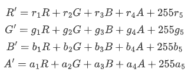

# ImageSpan properties/events

```TypeScript
declare class ImageSpanAttribute extends BaseSpan<ImageSpanAttribute>
```

The attributes inherit from [BaseSpan](arkts-arkui-span-comp-basespan-c.md). Among the universal attributes, [size](arkts-arkui-common-comp.md), [background](arkts-arkui-common-comp.md), and [border](arkts-arkui-common-comp.md) are supported.

@extends CommonMethod&lt;ImageSpanAttribute&gt; [since 10 - 10] @extends BaseSpan&lt;ImageSpanAttribute&gt; [since 11]

**Inheritance/Implementation:** ImageSpanAttribute extends BaseSpan<ImageSpanAttribute>

**Since:** 10

<!--Device-unnamed-declare class ImageSpanAttribute extends BaseSpan<ImageSpanAttribute>--><!--Device-unnamed-declare class ImageSpanAttribute extends BaseSpan<ImageSpanAttribute>-End-->

**System capability:** SystemCapability.ArkUI.ArkUI.Full

## alt

```TypeScript
alt(value: PixelMap)
```

Sets the placeholder image displayed during image loading. If this API is not used, the default value is **null**, and no placeholder image is displayed.

**Since:** 12

**Model restriction:** This API can be used only in the stage model.

**Atomic service API:** This API can be used in atomic services since API version 12.

<!--Device-ImageSpanAttribute-alt(value: PixelMap): ImageSpanAttribute--><!--Device-ImageSpanAttribute-alt(value: PixelMap): ImageSpanAttribute-End-->

**System capability:** SystemCapability.ArkUI.ArkUI.Full

**Parameters:**

| Name | Type | Mandatory | Description |
| --- | --- | --- | --- |
| value | [PixelMap](arkts-arkui-common-comp-pixelmap-t.md) | Yes | Placeholder image displayed during image loading, which supports the [PixelMap](../../apis-image-kit/arkts-apis/arkts-image-image-pixelmap-i.md) type. |

## colorFilter

```TypeScript
colorFilter(filter: ColorFilter | DrawingColorFilter)
```

Sets the color filter for the image.

**Since:** 14

**Model restriction:** This API can be used only in the stage model.

**Atomic service API:** This API can be used in atomic services since API version 14.

<!--Device-ImageSpanAttribute-colorFilter(filter: ColorFilter | DrawingColorFilter): ImageSpanAttribute--><!--Device-ImageSpanAttribute-colorFilter(filter: ColorFilter | DrawingColorFilter): ImageSpanAttribute-End-->

**System capability:** SystemCapability.ArkUI.ArkUI.Full

**Parameters:**

| Name | Type | Mandatory | Description |
| --- | --- | --- | --- |
| filter | [ColorFilter](../arkts-apis/arkts-arkui-colorfilter-c.md) &#124; [DrawingColorFilter](arkts-arkui-image-comp-drawingcolorfilter-t.md) | Yes | 1. Sets a color filter effect for the image. The input parameter is a 4x5 RGBA conversion matrix. <br>The first row of the matrix is used to calculate R' (the new red component), the second row to calculate G'(the new green component), the third row to calculate B' (the new blue component), and the fourth row to calculate A' (the new alpha component). The four rows represent different RGBA components.<br>When the diagonal values of the matrix are 1 and the other values are 0, the original colors of the image are retained. <br> **Calculation rule:** <br>If the input filter matrix is: <br> <br>and the pixel is [R, G, B, A] with color values in the range [0, 255], <br>then the filtered color is [R', G', B', A'] <br> <br>2. Supports the ColorFilter type of @ohos.graphics.drawing as the input parameter. <br>**NOTE:** <br>The DrawingColorFilter type in this API can be used in atomic services. For SVG image sources, the filter takes effect only on the stroke attribute. |

## objectFit

```TypeScript
objectFit(value: ImageFit)
```

Sets the scale type of the image. It is suitable for controlling how the image is displayed in the container. If this API is not used, the default scale type is **ImageFit.Cover**.

**Since:** 10

**Model restriction:** This API can be used only in the stage model.

**Atomic service API:** This API can be used in atomic services since API version 11.

<!--Device-ImageSpanAttribute-objectFit(value: ImageFit): ImageSpanAttribute--><!--Device-ImageSpanAttribute-objectFit(value: ImageFit): ImageSpanAttribute-End-->

**System capability:** SystemCapability.ArkUI.ArkUI.Full

**Parameters:**

| Name | Type | Mandatory | Description |
| --- | --- | --- | --- |
| value | [ImageFit](../arkts-apis/arkts-arkui-imagefit-e.md) | Yes | Scale type of the image. |

## onComplete

```TypeScript
onComplete(callback: ImageCompleteCallback)
```

Triggered when the image is successfully loaded or decoded. The size of the loaded image is returned.

**Since:** 12

**Model restriction:** This API can be used only in the stage model.

**Atomic service API:** This API can be used in atomic services since API version 12.

<!--Device-ImageSpanAttribute-onComplete(callback: ImageCompleteCallback): ImageSpanAttribute--><!--Device-ImageSpanAttribute-onComplete(callback: ImageCompleteCallback): ImageSpanAttribute-End-->

**System capability:** SystemCapability.ArkUI.ArkUI.Full

**Parameters:**

| Name | Type | Mandatory | Description |
| --- | --- | --- | --- |
| callback | [ImageCompleteCallback](arkts-arkui-imagespan-comp-imagecompletecallback-t.md) | Yes | Callback triggered when the image is successfully loaded or decoded. |

## onError

```TypeScript
onError(callback: ImageErrorCallback)
```

Triggered when an error occurs during image loading.

**Since:** 12

**Model restriction:** This API can be used only in the stage model.

**Atomic service API:** This API can be used in atomic services since API version 12.

<!--Device-ImageSpanAttribute-onError(callback: ImageErrorCallback): ImageSpanAttribute--><!--Device-ImageSpanAttribute-onError(callback: ImageErrorCallback): ImageSpanAttribute-End-->

**System capability:** SystemCapability.ArkUI.ArkUI.Full

**Parameters:**

| Name | Type | Mandatory | Description |
| --- | --- | --- | --- |
| callback | [ImageErrorCallback](arkts-arkui-image-comp-imageerrorcallback-t.md) | Yes | Callback triggered when an error occurs during image loading. |

## resizable

```TypeScript
resizable(value: ResizableOptions)
```

Sets the resizing options when the image is stretched. Stretching takes effect on the drag thumbnail and placeholder image.

When `top + bottom` is greater than the height of the original image or `left + right` is greater than the width of the original image, the [ResizableOptions](arkts-arkui-image-comp-resizableoptions-i.md) attribute does not take effect.

When the parameter type of the component is an animated image, [AnimatedDrawableDescriptor](../arkts-apis/arkts-arkui-arkui-drawabledescriptor-animateddrawabledescriptor-c.md), or SVG, this attribute does not take effect.

**Since:** 26.0.1

**Model restriction:** This API can be used only in the stage model.

**Atomic service API:** This API can be used in atomic services since API version 26.0.1.

<!--Device-ImageSpanAttribute-resizable(value: ResizableOptions): ImageSpanAttribute--><!--Device-ImageSpanAttribute-resizable(value: ResizableOptions): ImageSpanAttribute-End-->

**System capability:** SystemCapability.ArkUI.ArkUI.Full

**Parameters:**

| Name | Type | Mandatory | Description |
| --- | --- | --- | --- |
| value | [ResizableOptions](arkts-arkui-image-comp-resizableoptions-i.md) | Yes | Resizable image options when the image is stretched. |

## supportSvg2

```TypeScript
supportSvg2(enable: Optional<boolean>)
```

Enables or disables the [Enhanced SVG Tag Parsing](../../../reference/apis-arkui/arkui-ts/ts-image-svg2-capabilities.md). When enabled, new SVG parsing capabilities are supported, which is suitable for scenarios that require new SVG features. When disabled, the original SVG parsing capability is retained, which is suitable for scenarios that require compatibility with the display of SVG images in earlier versions. If this API is not used, the original SVG parsing capability is retained by default.

After the **ImageSpan** component is created, the value of this attribute cannot be dynamically changed.

**Since:** 22

**Model restriction:** This API can be used only in the stage model.

**Atomic service API:** This API can be used in atomic services since API version 22.

<!--Device-ImageSpanAttribute-supportSvg2(enable: Optional<boolean>): ImageSpanAttribute--><!--Device-ImageSpanAttribute-supportSvg2(enable: Optional<boolean>): ImageSpanAttribute-End-->

**System capability:** SystemCapability.ArkUI.ArkUI.Full

**Parameters:**

| Name | Type | Mandatory | Description |
| --- | --- | --- | --- |
| enable | [Optional](arkts-arkui-common-comp-optional-t.md)&lt;boolean&gt; | Yes | Whether to enable the [Enhanced SVG Tag Parsing](../../../reference/apis-arkui/arkui-ts/ts-image-svg2-capabilities.md). <br>true: supports the new SVG parsing capability; false: retains the original SVG parsing capability. |

## verticalAlign

```TypeScript
verticalAlign(value: ImageSpanAlignment)
```

Sets the alignment of the image based on the line height. It is suitable for adjusting the vertical alignment between the image and text in image-text layout scenarios. If this API is not used, the default alignment is **ImageSpanAlignment.BOTTOM**.

**Since:** 10

**Model restriction:** This API can be used only in the stage model.

**Atomic service API:** This API can be used in atomic services since API version 11.

<!--Device-ImageSpanAttribute-verticalAlign(value: ImageSpanAlignment): ImageSpanAttribute--><!--Device-ImageSpanAttribute-verticalAlign(value: ImageSpanAlignment): ImageSpanAttribute-End-->

**System capability:** SystemCapability.ArkUI.ArkUI.Full

**Parameters:**

| Name | Type | Mandatory | Description |
| --- | --- | --- | --- |
| value | [ImageSpanAlignment](../arkts-apis/arkts-arkui-imagespanalignment-e.md) | Yes | Alignment mode of the image based on the line height. |
