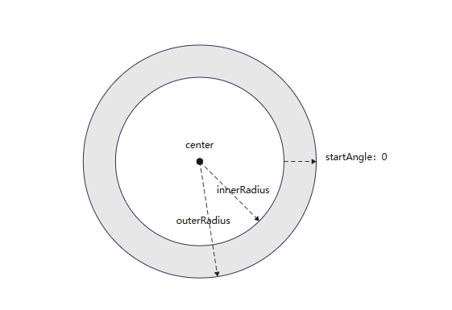

# ParticleAnnulusRegion

```TypeScript
declare interface ParticleAnnulusRegion
```

Configures the annulus emitter area.

> **NOTE:** 
> 
> - If **outerRadius** or **innerRadius** is less than 0 or uses the percentage unit, the value 0 is used.
> 
> - If **outerRadius** is less than **innerRadius** (that is, the outer circle radius is less than the inner circle radius), the smaller value is used as the new inner circle radius, and the larger value is used as the new outer circle radius.
> 
> - If **endAngle** is less than **startAngle** (that is, the end angle is less than the start angle), the smaller value is used as the new start angle, and the larger value is used as the new end angle.
> 
> 

**Since:** 20

<!--Device-unnamed-declare interface ParticleAnnulusRegion--><!--Device-unnamed-declare interface ParticleAnnulusRegion-End-->

**System capability:** SystemCapability.ArkUI.ArkUI.Full

## center

```TypeScript
center?: PositionT<LengthMetrics>
```

The coordinates of the center of the annulus

**Type:** [PositionT](arkts-arkui-particle-comp-positiont-t.md)&lt;LengthMetrics&gt;

**Default:** {x:LengthMetrics.percent(0.5),y:LengthMetrics.percent(0.5)}

**Since:** 20

**Model restriction:** This API can be used only in the stage model.

**Atomic service API:** This API can be used in atomic services since API version 20.

<!--Device-ParticleAnnulusRegion-center?: PositionT<LengthMetrics>--><!--Device-ParticleAnnulusRegion-center?: PositionT<LengthMetrics>-End-->

**System capability:** SystemCapability.ArkUI.ArkUI.Full

## endAngle

```TypeScript
endAngle?: number
```

The end angle of the annulus, in degree

**Type:** number

**Default:** 360

**Since:** 20

**Model restriction:** This API can be used only in the stage model.

**Atomic service API:** This API can be used in atomic services since API version 20.

<!--Device-ParticleAnnulusRegion-endAngle?: number--><!--Device-ParticleAnnulusRegion-endAngle?: number-End-->

**System capability:** SystemCapability.ArkUI.ArkUI.Full

## innerRadius

```TypeScript
innerRadius: LengthMetrics
```

The inner radius of the annulus

**Type:** LengthMetrics

**Since:** 20

**Model restriction:** This API can be used only in the stage model.

**Atomic service API:** This API can be used in atomic services since API version 20.

<!--Device-ParticleAnnulusRegion-innerRadius: LengthMetrics--><!--Device-ParticleAnnulusRegion-innerRadius: LengthMetrics-End-->

**System capability:** SystemCapability.ArkUI.ArkUI.Full

## outerRadius

```TypeScript
outerRadius: LengthMetrics
```

The outer radius of the annulus

**Type:** LengthMetrics

**Since:** 20

**Model restriction:** This API can be used only in the stage model.

**Atomic service API:** This API can be used in atomic services since API version 20.

<!--Device-ParticleAnnulusRegion-outerRadius: LengthMetrics--><!--Device-ParticleAnnulusRegion-outerRadius: LengthMetrics-End-->

**System capability:** SystemCapability.ArkUI.ArkUI.Full

## startAngle

```TypeScript
startAngle?: number
```

The start angle of the annulus, in degree

**Type:** number

**Default:** 0

**Since:** 20

**Model restriction:** This API can be used only in the stage model.

**Atomic service API:** This API can be used in atomic services since API version 20.

<!--Device-ParticleAnnulusRegion-startAngle?: number--><!--Device-ParticleAnnulusRegion-startAngle?: number-End-->

**System capability:** SystemCapability.ArkUI.ArkUI.Full
