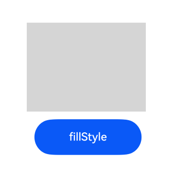

# canvas
<!--Kit: ArkUI-->
<!--Subsystem: ArkUI-->
<!--Owner: @camlostshi-->
<!--Designer: @fenglinbailu-->
<!--Tester: @liuli0427-->
<!--Adviser: @Brilliantry_Rui-->
<!-- md-trans-meta sourceCommit=236b1482bf31e926fd91d5f29276a56a58780a2f translatedAt=2026-06-22T07:51:46.625Z pushedAt=2026-06-23T01:55:36.822Z -->

>  **NOTE**
>  This component is supported since API version 4. Updates will be marked with a superscript to indicate their earliest API version.

The **\<canvas>** component is used for customizing drawings.

## Required Permissions

None


## Child Components

Not supported


## Attributes

The [universal attributes](js-components-common-attributes.md) are supported.


## Styles

The [universal styles](js-components-common-styles.md) are supported.


## Events

The [universal events](js-components-common-events.md) are supported.


## Method

In addition to the [universal methods](js-components-common-methods.md), the following methods are supported.


### getContext

getContext(type: '2d', options?:  ContextAttrOptions): CanvasRenderingContext2D

Obtains the canvas drawing context. This API cannot be called in **onInit** or **onReady**.

**Parameters**

| Name                 | Type              | Mandatory  | Description                                      |
| -------------------- | ------------------ | ---- | ---------------------------------------- |
| type                 | string             | Yes   | The value is set to **'2d'**, indicating that a 2D drawing object is returned. This object can be used to draw rectangles, texts, and images on the canvas component.|
| options<sup>6+</sup> | ContextAttrOptions | No   | Whether to enable anti-aliasing. By default, anti-aliasing is disabled.                 |

**Return value**

| Type                                      | Description                  |
| ---------------------------------------- | -------------------- |
| [CanvasRenderingContext2D](js-components-canvas-canvasrenderingcontext2d.md) | 2D drawing object, which can be used to draw rectangles, images, and texts on a canvas component.|

### toDataURL<sup>6+</sup>

toDataURL(type?: string, quality?: number): string

Generates a URL containing image display information.

**Parameters**

| Name    | Type  | Mandatory  | Description                                      |
| ------- | ------ | ---- | ---------------------------------------- |
| type    | string | No   | Image format. The default value is **image/png**.           |
| quality | number | No   | Image quality, which ranges from 0 to 1, when the image format is **image/jpeg** or **image/webp**. If the set value is beyond the value range, the default value **0.92** is used.|

**Return value**

| Type    | Description       |
| ------ | --------- |
| string | Image URL.|

## ContextAttrOptions<sup>6+</sup>

Option object used to configure the Canvas rendering context attribute.

**System capability**: SystemCapability.ArkUI.ArkUI.Full

| Name     | Type    | Read-Only  | Optional  | Description |
| -------- | -------- | ------- | ---- | ---------------------------------------- |
| antialias | boolean | No  |  Yes  | Whether to enable anti-aliasing.<br>The value true indicates that the anti-aliasing feature is enabled, and the value false indicates the opposite.<br>Default value: **false**.|

## Example

```html
<!-- xxx.hml -->
<div style="margin: 100; flex-direction: column">
  <canvas ref="canvas1" style="width: 200px; height: 150px; background-color: rgb(213, 213, 213);"></canvas>
  <input type="button" style="width: 180px; height: 60px; margin: 13;" value="fillStyle" onclick="handleClick" />
</div>
```

```js
// xxx.js
export default {
  handleClick() {
    const el = this.$refs.canvas1;
    var dataURL = el.toDataURL();
    console.info(dataURL);
    // "data:image/png;base64,xxxxxxxx..."
  }
}
```

