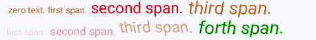
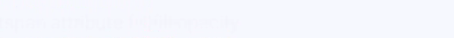
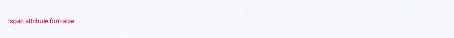
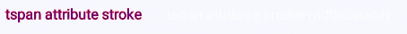

# tspan

<!--Kit: ArkUI-->
<!--Subsystem: ArkUI-->
<!--Owner: @liyujie43-->
<!--Designer: @weixin_52725220-->
<!--Tester: @xiong0104-->
<!--Adviser: @Brilliantry_Rui-->
<!-- md-trans-meta sourceCommit=93458ca6cb2d2618da5fc6bdfa2819210775aa38 translatedAt=2026-06-23T07:35:47.511Z pushedAt=2026-06-24T03:08:11.659Z -->

The **\<tspan>** component is used to add a text style.

>  **NOTE**
>  - This component is supported since API version 7. Updates will be marked with a superscript to indicate their earliest API version.
>
>  - The text content to be displayed must be written within element labels. The **\<tspan>** child element label can be nested to segment the text content.
>
>  - Text segmentation is only supported within the parent element label **\<text>**.

## Required Permissions

None

## Child Components

The **[\<tspan>](js-components-svg-tspan.md)** child component is supported.

The attributes in the following table are supported.

| Name            | Type                                | Default Value  | Mandatory  | Description                                      |
| -------------- | ---------------------------------- | ----- | ---- | ---------------------------------------- |
| id             | string                             | -     | No   | Unique ID of the component.                                |
| x              | &lt;length&gt;\|&lt;percentage&gt; | 0     | No   | X-coordinate of the upper left corner of the component.                            |
| y              | &lt;length&gt;\|&lt;percentage&gt; | 0     | No   | Y-coordinate of the upper left corner of the component. This attribute is invalid when the component is a child component of the **\<textpath>**.           |
| dx             | &lt;length&gt;\|&lt;percentage&gt; | 0     | No   | Offset of the text on the x-axis.                               |
| dy             | &lt;length&gt;\|&lt;percentage&gt; | 0     | No   | Offset of the text on the y-axis. This attribute is invalid when the component is a child component of the **\<textpath>**.              |
| rotate         | number                             | 0     | No   | Rotation of the text around its lower left corner. A positive number indicates clockwise rotation, and a negative number indicates counterclockwise rotation.              |
| font-size      | &lt;length&gt;                     | 30px  | No   | Font size.                                |
| fill           | &lt;color&gt;                      | black | No   | Fill color of the text.                                 |
| opacity        | number                             | 1     | No   | Opacity of an element. The value ranges from **0** to **1**. The value **1** means opaque, and **0** means completely transparent. Attribute animations are supported.|
| fill-opacity   | number                             | 1.0   | No   | Fill opacity of the text.                                |
| stroke         | &lt;color&gt;                      | black | No   | Stroke color.                            |
| stroke-width   | number                             | 1px   | No   | Stroke width.                                 |
| stroke-opacity | number                             | 1.0   | No   | Stroke opacity.                                |

## Example

```html
<!-- xxx.hml -->
<div class="container">
  <svg >
    <text x="20" y="500" fill="#D2691E" font-size="20">
      zero text.
      <tspan>first span.</tspan>
      <tspan fill="red" font-size="35">second span.</tspan>
      <tspan fill="#D2691E" font-size="40" rotate="10">third span.</tspan>
    </text>
    <text x="20" y="550" fill="#D2691E" font-size="20">
      <tspan dx="-5" fill-opacity="0.2">first span.</tspan>
      <tspan dx="5" fill="red" font-size="25" fill-opacity="0.4">second span.</tspan>
      <tspan dy="-5" fill="#D2691E" font-size="35" rotate="-10" fill-opacity="0.6">third span.</tspan>
      <tspan fill="#blue" font-size="40" rotate="10" fill-opacity="0.8" stroke="#00FF00" stroke-width="1px">forth span.</tspan>
    </text>
  </svg>
</div>
```

```css
/* xxx.css */
.container {    
    flex-direction: row;
    justify-content: flex-start;
    align-items: flex-start;
    height: 1000px;
    width: 1080px;
}
```



Attribute animation example

```html
<!-- xxx.hml -->
<div class="container">
  <svg>
    <text y="300" font-size="30" fill="blue">
      <tspan>
        tspan attribute x|opacity|rotate
        <animate attributeName="x" from="-100" to="400" dur="3s" repeatCount="indefinite"></animate>
        <animate attributeName="opacity" from="0.01" to="0.99" dur="3s" repeatCount="indefinite"></animate>
        <animate attributeName="rotate" from="0" to="360" dur="3s" repeatCount="indefinite"></animate>
      </tspan>
    </text>

    <text y="350" font-size="30" fill="blue">
      <tspan>
        tspan attribute dx
        <animate attributeName="dx" from="-100" to="400" dur="3s" repeatCount="indefinite"></animate>
      </tspan>
    </text>
  </svg>
</div>
```

```css
/* xxx.css */
.container {
    flex-direction: row;
    justify-content: flex-start;
    align-items: flex-start;
    height: 3000px;
    width: 1080px;
}
```


```html
<!-- xxx.hml -->
<div class="container">
  <svg>
    <text>
      <tspan x="0" y="550" font-size="30">
        tspan attribute fill|fill-opacity
        <animate attributeName="fill" from="blue" to="red" dur="3s" repeatCount="indefinite"></animate>
        <animate attributeName="fill-opacity" from="0.01" to="0.99" dur="3s" repeatCount="indefinite"></animate>
      </tspan>
    </text>
  </svg>
</div>
```



```html
<!-- xxx.hml -->
<div class="container">
  <svg>
     <text>
       <tspan x="20" y="600" fill="red">
         tspan attribute font-size
         <animate attributeName="font-size" from="10" to="50" dur="3s" repeatCount="indefinite"></animate>
       </tspan>
    </text>
  </svg>
</div>
```



```html
<!-- xxx.hml -->
<div class="container">
  <svg>
    <text>
      <tspan x="20" y="650" font-size="25" fill="blue" stroke="red">
        tspan attribute stroke
        <animate attributeName="stroke" from="red" to="#00FF00" dur="3s" repeatCount="indefinite"></animate>
      </tspan>
    </text>
    <text>
      <tspan x="300" y="650" font-size="25" fill="white" stroke="red">
        tspan attribute stroke-width-opacity
        <animate attributeName="stroke-width" from="1" to="5" dur="3s" repeatCount="indefinite"></animate>
        <animate attributeName="stroke-opacity" from="0.01" to="0.99" dur="3s" repeatCount="indefinite"></animate>
      </tspan>
    </text>
  </svg>
</div>
```

