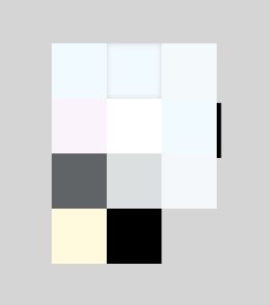
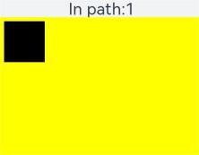
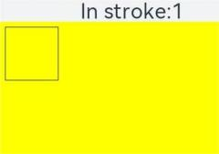
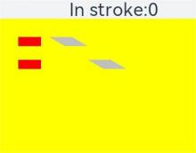

# OffscreenCanvasRenderingContext2D

<!--Kit: ArkUI-->
<!--Subsystem: ArkUI-->
<!--Owner: @camlostshi-->
<!--Designer: @fenglinbailu-->
<!--Tester: @liuli0427-->
<!--Adviser: @Brilliantry_Rui-->
<!-- md-trans-meta sourceCommit=93458ca6cb2d2618da5fc6bdfa2819210775aa38 translatedAt=2026-06-23T07:35:51.516Z pushedAt=2026-06-24T03:19:20.241Z -->

>  **NOTE**
>  Supported since API version 7. Updates will be marked with a superscript to indicate their earliest API version.

Use **OffscreenCanvasRenderingContext2D** to draw rectangles, images, and text on an [OffscreenCanvas](js-components-canvas-offscreencanvas.md) object.

## Attributes

In addition to the attributes that are supported by [CanvasRenderingContext2D](js-components-canvas-canvasrenderingcontext2d.md), the following attributes are supported.

| Attribute | Type   | Description                                      |
| ------ | ------ | ---------------------------------------- |
| filter | string | Image filter.<br/>Available options are as follows:<br/>-&nbsp;**blur**: applies the Gaussian blur for the image.<br/>-&nbsp;**brightness**: applies a linear multiplication to the image to make it look brighter or darker.<br/>-&nbsp;**contrast**: adjusts the image contrast.<br/>-&nbsp;**drop-shadow**: sets a shadow effect for the image.<br/>-&nbsp;**grayscale**: converts the image to a grayscale image.<br/>-&nbsp;**hue-rotate**: applies hue rotation to the image.<br/>-&nbsp;**invert**: inverts the image.<br/>-&nbsp;**opacity**: sets the image opacity.<br/>-&nbsp;**saturate**: sets the image saturation.<br/>-&nbsp;**sepia**: converts the image to sepia. |

**Example:** 

```html
<!-- xxx.hml -->
<div style="width: 500px; height: 500px;">
  <canvas ref="canvasId" style="width: 500px; height: 500px; padding: 80px; background-color: rgb(213, 213, 213);"></canvas>
</div>
```

```js
// xxx.js
export default {
  onShow(){
    var ctx = this.$refs.canvasId.getContext('2d');
    var offscreen = new OffscreenCanvas(360, 500);
    var offCanvas2 = offscreen.getContext("2d");
    var img = new Image();
    // Replace 'common/images/flower.jpg' with the resource file you use.
    img.src = 'common/images/flower.jpg';
    offCanvas2.drawImage(img, 0, 0, 100, 100);
    offCanvas2.filter = 'blur(5px)';
    offCanvas2.drawImage(img, 100, 0, 100, 100);

    offCanvas2.filter = 'grayscale(50%)';
    offCanvas2.drawImage(img, 200, 0, 100, 100);

    offCanvas2.filter = 'hue-rotate(90deg)';
    offCanvas2.drawImage(img, 0, 100, 100, 100);

    offCanvas2.filter = 'invert(100%)';
    offCanvas2.drawImage(img, 100, 100, 100, 100);

    offCanvas2.filter = 'drop-shadow(8px 8px 10px green)';
    offCanvas2.drawImage(img, 200, 100, 100, 100);

    offCanvas2.filter = 'brightness(0.4)';
    offCanvas2.drawImage(img, 0, 200, 100, 100);

    offCanvas2.filter = 'opacity(25%)';
    offCanvas2.drawImage(img, 100, 200, 100, 100);

    offCanvas2.filter = 'saturate(30%)';
    offCanvas2.drawImage(img, 200, 200, 100, 100);

    offCanvas2.filter = 'sepia(60%)';
    offCanvas2.drawImage(img, 0, 300, 100, 100);

    offCanvas2.filter = 'contrast(200%)';
    offCanvas2.drawImage(img, 100, 300, 100, 100);
    var bitmap = offscreen.transferToImageBitmap();
    ctx.transferFromImageBitmap(bitmap);
  }
}
```



## Methods

In addition to the methods that are supported by **CanvasRenderingContext2D**, the following methods are supported.

### isPointInPath

isPointInPath(path?: Path2D, x: number, y: number): boolean

Checks whether a specified point is in the path area.

**Parameters**

| Name | Type   | Mandatory | Description                            |
| ---- | ------ | ---- | ----------------------------- |
| path | Path2D | No    | Path used for checking. If this parameter is not set, the current path is used. |
| x    | number | Yes   | X-coordinate of the point used for checking.                    |
| y    | number | Yes   | Y-coordinate of the point used for checking.                    |

**Return value**

| Type      | Description            |
| ------- | ------------- |
| boolean | Whether a specified point is in the path area. Returns **true** if the point is inside the path area; returns **false** otherwise. |

**Example**

```html
<!-- xxx.hml -->
<div class="container" style="width: 500px; height: 500px;">
    <text class="textsize">In path:{{textValue}}</text>
    <canvas ref="canvas" style="width: 500px; height: 500px; background-color: #ffff00;"></canvas>
</div>
```

```css
/* xxx.css */
.container {
    display: flex;
    flex-direction: column;
    background-color: #F1F3F5;
    align-items: center;
    justify-content: center;
    width: 100%;
    height: 100%;
}

canvas {
    width: 600px;
    height: 600px;
    background-color: #fdfdfd;
    border: none;
}

.textsize {
    font-size: 40px;
}
```

```js
// xxx.js
export default {
  data: {
    textValue: false
  },
  onShow(){
    var canvas = this.$refs.canvas.getContext('2d');
    var offscreen = new OffscreenCanvas(500,500);
    var offscreenCanvasCtx = offscreen.getContext("2d");

    offscreenCanvasCtx.rect(10, 10, 100, 100);
    offscreenCanvasCtx.fill();
    this.textValue = offscreenCanvasCtx.isPointInPath(30, 70);

    var bitmap = offscreen.transferToImageBitmap();
    canvas.transferFromImageBitmap(bitmap);
  }
}
```



### isPointInStroke

isPointInStroke(path?: Path2D, x: number, y: number): boolean

Checks whether a specified point is in the stroke area of a path.

**Parameters**

| Name | Type   | Mandatory | Description                            |
| ---- | ------ | --------- | ----------------------------- |
| path | Path2D | No    | Path used for checking. If this parameter is not set, the current path is used. |
| x    | number | Yes    | X-coordinate of the point used for checking.                    |
| y    | number | Yes    | Y-coordinate of the point used for checking.                    |

**Return value**

| Type    | Description            |
| ------- | ------------- |
| boolean | Whether a specified point is in the stroke area of a path. Returns **true** if the point is in the stroke area of the path; returns **false** otherwise. |

**Example**

```html
<!-- xxx.hml -->
<div class="container" style="width: 500px; height: 500px;">
    <text class="textsize">In stroke:{{textValue}}</text>
    <canvas ref="canvas" style="width: 500px; height: 500px; background-color: #ffff00;"></canvas>
</div>
```

```css
/* xxx.css */
.container {
    display: flex;
    flex-direction: column;
    background-color: #F1F3F5;
    align-items: center;
    justify-content: center;
    width: 100%;
    height: 100%;
}

canvas {
    width: 600px;
    height: 600px;
    background-color: #fdfdfd;
    border: none;
}

.textsize {
    font-size: 40px;
}
```

```js
// xxx.js
export default {
  data: {
    textValue: false
  },
  onShow(){
    var canvas = this.$refs.canvas.getContext('2d');
    var offscreen = new OffscreenCanvas(500,500);
    var offscreenCanvasCtx = offscreen.getContext("2d");

    offscreenCanvasCtx.rect(10, 10, 100, 100);
    offscreenCanvasCtx.stroke();
    this.textValue = offscreenCanvasCtx.isPointInStroke(50, 10);

    var bitmap = offscreen.transferToImageBitmap();
    canvas.transferFromImageBitmap(bitmap);
  }
}
```



### resetTransform

resetTransform(): void

Resets this transformation matrix to an identity matrix.

**Example**

```html
<!-- xxx.hml -->
<div class="container" style="width: 500px; height: 500px;">
    <text class="textsize">In path:{{textValue}}</text>
    <canvas ref="canvas" style="width: 500px; height: 500px; background-color: #ffff00;"></canvas>
</div>
```

```css
/* xxx.css */
.container {
    display: flex;
    flex-direction: column;
    background-color: #F1F3F5;
    align-items: center;
    justify-content: center;
    width: 100%;
    height: 100%;
}

canvas {
    width: 600px;
    height: 600px;
    background-color: #fdfdfd;
    border: none;
}

.textsize {
    font-size: 40px;
}
```

```js
// xxx.js
export default {
  data:{
   textValue:0
  },
  onShow(){
   var canvas = this.$refs.canvas.getContext('2d');
   var offscreen = new OffscreenCanvas(500,500);
   var offscreenCanvasCtx = offscreen.getContext("2d");

   offscreenCanvasCtx.transform(1, 0, 1.7, 1, 0, 0);
   offscreenCanvasCtx.fillStyle = '#a9a9a9';
   offscreenCanvasCtx.fillRect(40, 40, 50, 20);
   offscreenCanvasCtx.fillRect(40, 90, 50, 20);

   // Non-skewed rectangles
   offscreenCanvasCtx.resetTransform();
   offscreenCanvasCtx.fillStyle = '#ff0000';
   offscreenCanvasCtx.fillRect(40, 40, 50, 20);
   offscreenCanvasCtx.fillRect(40, 90, 50, 20);

   var bitmap = offscreen.transferToImageBitmap();
   canvas.transferFromImageBitmap(bitmap);
  } 
}
```

