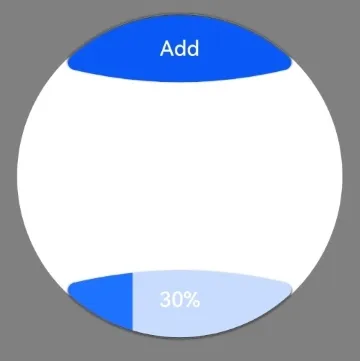

#  ArcButton
<!--Kit: ArkUI-->
<!--Subsystem: ArkUI-->
<!--Owner: @liyi0309-->
<!--Designer: @liyi0309-->
<!--Tester: @lxl007-->
<!--Adviser: @Brilliantry_Rui-->

The **ArcButton** component offers various button styles, such as emphasized, normal, and warning. It is recommended for devices with circular screens.

> **NOTE**
>
> - This component is supported since API version 18. Updates will be marked with a superscript to indicate their earliest API version.
> - This component can be used on phones, PCs, 2-in-1 devices, tablets, TVs, and wearables. In API version 22 and earlier versions, a compilation warning will be reported when this component is used on phones, PCs, 2-in-1 devices, tablets, and TVs, but the component can still run properly.

## Modules to Import

```ts
import {
  ArcButton,
  ArcButtonOptions,
  ArcButtonStatus,
  ArcButtonStyleMode,
  ArcButtonPosition,
}  from '@kit.ArkUI';
```

## Child Components

Not supported

## Attributes
The [universal attributes](ts-component-general-attributes.md) are not supported.

## Events
Among the universal events, the [click event](ts-universal-events-click.md) and [touch event](ts-universal-events-touch.md) are supported.

## ArcButton

ArcButton({ options: ArcButtonOptions })

Creates an instance of **ArcButton** with configuration parameters.

**Decorator**: @Component

**Atomic service API**: This API can be used in atomic services since API version 18.

**System capability**: SystemCapability.ArkUI.ArkUI.Circle

**Parameters**

| Name   | Type            | Mandatory| Decorator | Description                     |
| ------- | ---------------- | ---- | ----------- | ------------------------- |
| options | [ArcButtonOptions](#arcbuttonoptions) | Yes  | @Require | Text, background color, shadow, and other parameters of the **ArcButton** component.|

## ArcButtonOptions

Defines the default or custom style parameters for the **ArcButton** component.

**System capability**: SystemCapability.ArkUI.ArkUI.Circle

### Properties

| Name            | Type                                                        | Read-Only| Optional| Description                                                        |
| ---------------- | ------------------------------------------------------------ | ---- | ------------------------------------------------------------ | ------------------------------------------------------------ |
| position         | [ArcButtonPosition](#arcbuttonposition)                      | No  | No| Type of the arc button.<br>Default value: **ArcButtonPosition.BOTTOM_EDGE**<br>**Atomic service API**: This API can be used in atomic services since API version 18.|
| styleMode        | [ArcButtonStyleMode](#arcbuttonstylemode)                    | No  | No | Style mode for the arc button. This style cannot be used together with the [ArcButtonProgressConfig](#arcbuttonprogressconfig23) style.<br>Default value: **ArcButtonStyleMode.EMPHASIZED_LIGHT**<br>**Atomic service API**: This API can be used in atomic services since API version 18.|
| status           | [ArcButtonStatus](#arcbuttonstatus)                          | No | No | Status of the arc button.<br>Default value: **ArcButtonStatus.NORMAL**<br>**Atomic service API**: This API can be used in atomic services since API version 18.|
| label     | [ResourceStr](ts-types.md#resourcestr)                       | No  | No | Text displayed on the arc button.<br>**Atomic service API**: This API can be used in atomic services since API version 18.|
| backgroundBlurStyle | [BlurStyle](ts-universal-attributes-background.md#blurstyle9) | No  | No | Background blur style of the arc button.<br>Default value: **BlurStyle.NONE**<br>**Atomic service API**: This API can be used in atomic services since API version 18.|
| backgroundColor  | [ColorMetrics](../js-apis-arkui-graphics.md#colormetrics12)  | No | No | Background color of the arc button.<br>This property takes effect only when **ArcButtonStyleMode** is set to **CUSTOM**.<br>Default value: **Color.Black**<br>**Atomic service API**: This API can be used in atomic services since API version 18.|
| shadowColor      | [ColorMetrics](../js-apis-arkui-graphics.md#colormetrics12)  | No | No | Shadow color of the arc button.<br>Default value: **Color.Black**<br>**Atomic service API**: This API can be used in atomic services since API version 18.|
| shadowEnabled    | boolean                                                      | No | No | Whether to enable the shadow for the arc button.<br>Default value: **false**<br>The value **true** means to enable the shadow, and **false** means the opposite.<br>**Atomic service API**: This API can be used in atomic services since API version 18.|
| fontSize | [LengthMetrics](../js-apis-arkui-graphics.md#lengthmetrics12) | No | No | Font size of the arc button.<br>Default value: **19fp**<br>**Atomic service API**: This API can be used in atomic services since API version 18.|
| fontColor | [ColorMetrics](../js-apis-arkui-graphics.md#colormetrics12)  | No  | No | Font color of the arc button.<br>This property takes effect only when **ArcButtonStyleMode** is set to **CUSTOM**.<br>Default value: **Color.White**<br>**Atomic service API**: This API can be used in atomic services since API version 18.|
| pressedFontColor | [ColorMetrics](../js-apis-arkui-graphics.md#colormetrics12)  | No | No | Font color of the arc button when pressed.<br>This property takes effect only when **ArcButtonStyleMode** is set to **CUSTOM**.<br>Default value: **Color.White**<br>**Atomic service API**: This API can be used in atomic services since API version 18.|
| fontStyle | [FontStyle](ts-appendix-enums.md#fontstyle)                  | No | No | Font style of the arc button.<br>Default value: **FontStyle.Normal**<br>**Atomic service API**: This API can be used in atomic services since API version 18.|
| fontFamily | string \| [Resource](ts-types.md#resource)                   | No | No | Font family of the arc button.<br>**Atomic service API**: This API can be used in atomic services since API version 18.|
| fontMargin | [LocalizedMargin](ts-types.md#localizedmargin12)             | No | No | Margin of the arc button text.<br>Default value: **{start:24vp, top: 10vp,end: 24vp, bottom:16vp }**<br>**Atomic service API**: This API can be used in atomic services since API version 18.|
| progressConfig<sup>23+</sup>       | [ArcButtonProgressConfig](#arcbuttonprogressconfig23)          | No | Yes| Parameters for the progress indicator of the **ArcButton** component. If this property is not set, the **ArcButton** component is displayed as a button (see [Example 1](#example-1-setting-an-arc-button)). If this property is set, the component is displayed as a progress indicator (see [Example 2](#example-2-setting-a-device-progress-indicator-button)). The progress indicator style is not affected by the settings of the [ArcButtonStyleMode](#arcbuttonstylemode) attribute.<br>Default value: default values of all properties of [ArcButtonProgressConfig](#arcbuttonprogressconfig23)<br>**Atomic service API**: This API can be used in atomic services since API version 23.<br>**Model restriction**: This API can be used only in the stage model.|
|onTouch | [Callback](ts-types.md#voidcallback12)&lt; [TouchEvent](ts-universal-events-touch.md#touchevent)&gt; | No  | Yes | Callback triggered by touch actions on the arc button.<br>**Atomic service API**: This API can be used in atomic services since API version 18.|
|onClick | [Callback](ts-types.md#voidcallback12)&lt;[ClickEvent](ts-universal-events-click.md#clickevent) &gt; | No  | Yes | Callback triggered by click actions on the arc button.<br>**Atomic service API**: This API can be used in atomic services since API version 18.|

### constructor

constructor(options: CommonArcButtonOptions)

A constructor used to create an **ArcButton** component.

**Atomic service API**: This API can be used in atomic services since API version 18.

**System capability**: SystemCapability.ArkUI.ArkUI.Circle

**Parameters**

| Name| Type                                             | Mandatory| Description                                         |
| ------- | ------------------------------------------------- | ---- | --------------------------------------------- |
| options | [CommonArcButtonOptions](#commonarcbuttonoptions) | Yes  | Text, background color, shadow, and other parameters of the **ArcButton** component.|

## CommonArcButtonOptions

Defines the default or custom style parameters for the **ArcButton** component.

**System capability**: SystemCapability.ArkUI.ArkUI.Circle

| Name               | Type                                                        | Read-Only| Optional| Description                                                        |
| ------------------- | ------------------------------------------------------------ | ---- | ------------------------------------------------------------ | ------------------------------------------------------------ |
| position            | [ArcButtonPosition](#arcbuttonposition)                      |No |Yes | Type of the arc button.<br>Default value: **ArcButtonPosition.BOTTOM_EDGE**<br>**Atomic service API**: This API can be used in atomic services since API version 18.|
| styleMode           | [ArcButtonStyleMode](#arcbuttonstylemode)                    | No | Yes| Style mode for the arc button. This style cannot be used together with the [ArcButtonProgressConfig](#arcbuttonprogressconfig23) style.<br>Default value: **ArcButtonStyleMode.EMPHASIZED_LIGHT**<br>**Atomic service API**: This API can be used in atomic services since API version 18.|
| status              | [ArcButtonStatus](#arcbuttonstatus)                          |No  |Yes  | Status of the arc button.<br>Default value: **ArcButtonStatus.NORMAL**<br>**Atomic service API**: This API can be used in atomic services since API version 18.|
| label               | [ResourceStr](ts-types.md#resourcestr)                       |No|Yes| Text displayed on the arc button.<br>**Atomic service API**: This API can be used in atomic services since API version 18.|
| backgroundBlurStyle | [BlurStyle](ts-universal-attributes-background.md#blurstyle9) | No | Yes| Background blur style of the arc button.<br>Default value: **BlurStyle.NONE**<br>**Atomic service API**: This API can be used in atomic services since API version 18.|
| backgroundColor     | [ColorMetrics](../js-apis-arkui-graphics.md#colormetrics12)  | No| Yes| Background color of the arc button.<br>This property takes effect only when **ArcButtonStyleMode** is set to **CUSTOM**.<br>Default value: **Color.Black**<br>**Atomic service API**: This API can be used in atomic services since API version 18.|
| shadowColor         | [ColorMetrics](../js-apis-arkui-graphics.md#colormetrics12)  | No | Yes| Shadow color of the arc button.<br>Default value: **Color.Black**<br>**Atomic service API**: This API can be used in atomic services since API version 18.|
| shadowEnabled       | boolean                                                      | No| Yes| Whether to enable the shadow for the arc button.<br>Default value: **false**<br>The value **true** means to enable the shadow, and **false** means the opposite.<br>**Atomic service API**: This API can be used in atomic services since API version 18.|
| fontSize            | [LengthMetrics](../js-apis-arkui-graphics.md#lengthmetrics12) | No | Yes| Font size of the arc button.<br>Default value: **19fp**<br>**Atomic service API**: This API can be used in atomic services since API version 18.|
| fontColor           | [ColorMetrics](../js-apis-arkui-graphics.md#colormetrics12)  |No |Yes | Font color of the arc button.<br>This property takes effect only when **ArcButtonStyleMode** is set to **CUSTOM**.<br>Default value: **Color.White**<br>**Atomic service API**: This API can be used in atomic services since API version 18.|
| pressedFontColor    | [ColorMetrics](../js-apis-arkui-graphics.md#colormetrics12)  | No | Yes| Font color of the arc button when pressed.<br>This property takes effect only when **ArcButtonStyleMode** is set to **CUSTOM**.<br>Default value: **Color.White**<br>**Atomic service API**: This API can be used in atomic services since API version 18.|
| fontStyle           | [FontStyle](ts-appendix-enums.md#fontstyle)                  | No | Yes| Font style of the arc button.<br>Default value: **FontStyle.Normal**<br>**Atomic service API**: This API can be used in atomic services since API version 18.|
| fontFamily          | string \| [Resource](ts-types.md#resource)                   |No |Yes | Font family of the arc button.<br>**Atomic service API**: This API can be used in atomic services since API version 18.|
| fontMargin          | [LocalizedMargin](ts-types.md#localizedmargin12)             | No | Yes| Margin of the arc button text.<br>Default value: **{start:24vp, top: 10vp,end: 24vp, bottom:16vp }**<br>**Atomic service API**: This API can be used in atomic services since API version 18.|
| progressConfig<sup>23+</sup>       | [ArcButtonProgressConfig](#arcbuttonprogressconfig23)          | No | Yes| Parameters for the progress indicator of the **ArcButton** component. If this property is not set, the **ArcButton** component is displayed as a button (see [Example 1](#example-1-setting-an-arc-button)). If this property is set, the component is displayed as a progress indicator (see [Example 2](#example-2-setting-a-device-progress-indicator-button)). The progress indicator style is not affected by the settings of the [ArcButtonStyleMode](#arcbuttonstylemode) attribute.<br>Default value: default values of all properties of [ArcButtonProgressConfig](#arcbuttonprogressconfig23)<br>**Atomic service API**: This API can be used in atomic services since API version 23.<br>**Model restriction**: This API can be used only in the stage model.|
| onTouch             | [Callback](ts-types.md#voidcallback12)&lt; [TouchEvent](ts-universal-events-touch.md#touchevent)&gt; | No  | Yes | Callback triggered by touch actions on the arc button.<br>**Atomic service API**: This API can be used in atomic services since API version 18.|
| onClick             | [Callback](ts-types.md#voidcallback12)&lt;[ClickEvent](ts-universal-events-click.md#clickevent) &gt; | No  | Yes | Callback triggered by click actions on the arc button.<br>**Atomic service API**: This API can be used in atomic services since API version 18.|

## ArcButtonProgressConfig<sup>23+</sup>   

Defines the progress indicator configuration options of the **ArcButton** component.

**Atomic service API**: This API can be used in atomic services since API version 23.

**System capability**: SystemCapability.ArkUI.ArkUI.Circle

**Model restriction**: This API can be used only in the stage model.

| Name               | Type                                                        | Read-Only| Optional| Description                                                        |
| ------------------- | ------------------------------------------------------------ | ---- | ------------------------------------------------------------ | ------------------------------------------------------------ |
| value               | number                                                       |No |No | Current progress value. Values less than 0 are adjusted to **0**, and values greater than the **total** value are capped at the **total** value.<br>Default value: **0**.<br>Value range: [0, total]|
| total               | number                                                       |No |Yes | Maximum progress value.<br>Default value: **100**<br>Value range: [0, 2147483647]. If the value is 0 or out of the range, the default value 100 is used.|
| color               | [ResourceColor](ts-types.md#resourcecolor)                   |No |Yes | Foreground color of the progress indicator. If the component's background color ([backgroundColor](#arcbuttonoptions)) is set, it is used as the default foreground color of the progress indicator. The foreground color of the progress indicator is not affected by the button style ([ArcButtonStyleMode](#arcbuttonstylemode)). The progress indicator's background color is derived solely from its foreground color, with an opacity value of 25%.<br> Default value: **"#1F71FF"**, which is blue.|

## ArcButtonPosition

Enumerates the types of arc buttons that can be set for **ArcButton**.

**Atomic service API**: This API can be used in atomic services since API version 18.

**System capability**: SystemCapability.ArkUI.ArkUI.Circle

| Name       | Value  | Description                          |
| ----------- | ---- | -------------------------------- |
| TOP_EDGE    | 0    | Upper arc button located at the top of the circular screen.    |
| BOTTOM_EDGE | 1    | Lower arc button located at the bottom of the circular screen.|


## ArcButtonStyleMode

Enumerates the style modes that can be set for **ArcButton**.

**Atomic service API**: This API can be used in atomic services since API version 18.

**System capability**: SystemCapability.ArkUI.ArkUI.Circle

| Name            | Value  | Description            |
| ---------------- | ---- | ---------------- |
| EMPHASIZED_LIGHT | 0    | Emphasized style in light color mode. Displayed as a blue background with white text.|
| EMPHASIZED_DARK  | 1    | Warning style in dark color mode. Displayed as a red background with white text.|
| NORMAL_LIGHT     | 2    | Normal style in light color mode. Displayed as a dark blue background with blue text.|
| NORMAL_DARK      | 3    | Normal style in dark color mode. Displayed as a dark gray background with blue text.|
| CUSTOM           | 4    | Custom button color and font color.|


## ArcButtonStatus

Enumerates the states that can be set for **ArcButton**.

**Atomic service API**: This API can be used in atomic services since API version 18.

**System capability**: SystemCapability.ArkUI.ArkUI.Circle

| Name    | Value  | Description      |
| -------- | ---- | ---------- |
| NORMAL   | 0    | Normal state.|
| PRESSED  | 1    | Pressed state.|
| DISABLED | 2    | Disabled state.|


## Example
### Example 1: Setting an Arc Button

This example demonstrates the basic usage of **ArcButton**. **ArcButton** is added since API version 18. The following is an example configuration:

1. **topOptions** defines an upper arc button with the button text "ButtonTop," a font size of 15 fp, and shadow enabled, in the normal state with a light-color emphasized style.

2. **bottomOptions** defines a bottom arc button with the button text "ButtonBottom," a font size of 15 fp, shadow enabled, in a light-color emphasized style, with a click event set for the button.

This example is recommended to run on a wearable device for optimal display effects and is also supported on other devices. To run the example on a wearable device, configure **wearable** in the [deviceTypes](../../../quick-start/module-configuration-file.md#devicetypes) tag of the [module.json5] configuration file (../../../quick-start/module-configuration-file.md) in the **src/main** directory.

```json5
// module.json5
{
  "module": {
    // ...
    "deviceTypes": [
      "wearable",
      "phone"
    ]
    // ...
  }
}
```

```ts
// xxx.ets
import {
  LengthMetrics,
  LengthUnit,
  ArcButton,
  ArcButtonOptions,
  ArcButtonStatus,
  ArcButtonStyleMode,
  ArcButtonPosition,
}  from '@kit.ArkUI';

@Entry
@ComponentV2
struct Index {
  @Local topOptions: ArcButtonOptions = new ArcButtonOptions({});
  @Local bottomOptions: ArcButtonOptions = new ArcButtonOptions({});

  aboutToAppear() {
    this.topOptions = new ArcButtonOptions({
      label: 'ButtonTop',
      status: ArcButtonStatus.NORMAL,
      position: ArcButtonPosition.TOP_EDGE,
      styleMode: ArcButtonStyleMode.EMPHASIZED_LIGHT,
      fontSize: new LengthMetrics(15, LengthUnit.FP),
      shadowEnabled: true
    })

    this.bottomOptions = new ArcButtonOptions({
      label: 'ButtonBottom',
      styleMode: ArcButtonStyleMode.EMPHASIZED_LIGHT,
      fontSize: new LengthMetrics(15, LengthUnit.FP),
      shadowEnabled: true,
      onClick: () => {
        console.info('click from ArcButton.');
      }
    })
  }

  build() {
    Stack() {
      Stack() {
        Circle({ width: 233, height: 233 })
          .strokeWidth(0.1)
          .fill(Color.White)

        Column() {
          ArcButton({ options: this.topOptions })
          Blank()
          ArcButton({ options: this.bottomOptions })

        }.width('100%')
        .height('100%')
      }.width(233)
      .height(233)
    }.width('100%')
    .height('100%')
    .alignContent(Alignment.Center)
    .backgroundColor(Color.Gray)
  }
}

```


### Example 2: Setting a Device Progress Indicator Button

This example demonstrates the basic usage of the **ArcButton** component in progress indicator style. The [progressConfig](#arcbuttonoptions) API is supported since API version 23. The following is an example configuration:

1. **topOptions** defines an upper arc button with the "Add" button text, a font size of 15 fp, and shadow enabled, in the normal state with a light-color emphasized style. A click event is set for the button. When the button is clicked, the progress indicator's progress increases.

2. **bottomOptions** defines a bottom arc button with the button text showing the progress percentage, a font size of 15 fp, state set in progress indicator mode, default style, and shadow enabled.

This example is recommended to run on a wearable device for optimal display effects and is also supported on other devices. To run the example on a wearable device, configure **wearable** in the [deviceTypes](../../../quick-start/module-configuration-file.md#devicetypes) tag of the [module.json5] configuration file (../../../quick-start/module-configuration-file.md) in the **src/main** directory.

```json5
// module.json5
{
  "module": {
    // ...
    "deviceTypes": [
      "wearable",
      "phone"
    ]
    // ...
  }
}
```
```ts
// xxx.ets
import {
  LengthMetrics,
  LengthUnit,
  ArcButton,
  ArcButtonOptions,
  ArcButtonStatus,
  ArcButtonStyleMode,
  ArcButtonPosition,
}  from '@kit.ArkUI';

@Entry
@ComponentV2
struct Index {
  @Local topOptions: ArcButtonOptions = new ArcButtonOptions({});
  @Local bottomOptions: ArcButtonOptions = new ArcButtonOptions({});

  aboutToAppear() {
    this.topOptions = new ArcButtonOptions({
      label: 'Add',
      styleMode: ArcButtonStyleMode.EMPHASIZED_LIGHT,
      position: ArcButtonPosition.TOP_EDGE,
      fontSize: new LengthMetrics(15, LengthUnit.FP),
      shadowEnabled: true,
      onClick: () => {
        if(this.bottomOptions.progressConfig && this.bottomOptions.progressConfig.value < 100) {
          this.bottomOptions.progressConfig.value = this.bottomOptions.progressConfig.value + 5
          this.bottomOptions.label = this.bottomOptions.progressConfig.value + "%"
        }
      }
    })

    this.bottomOptions = new ArcButtonOptions({
      label: '0%',
      status: ArcButtonStatus.NORMAL,
      fontSize: new LengthMetrics(15, LengthUnit.FP),
      shadowEnabled: true,
      progressConfig: {value:0, total:100},
    })
  }

  build() {
    Stack() {
      Stack() {
        Circle({ width: 233, height: 233 })
          .strokeWidth(0.1)
          .fill(Color.White)

        Column() {
          ArcButton({ options: this.topOptions })
          Blank()
          ArcButton({ options: this.bottomOptions })

        }.width('100%')
        .height('100%')
      }.width(233)
      .height(233)
    }.width('100%')
    .height('100%')
    .alignContent(Alignment.Center)
    .backgroundColor(Color.Gray)
  }
}
```


