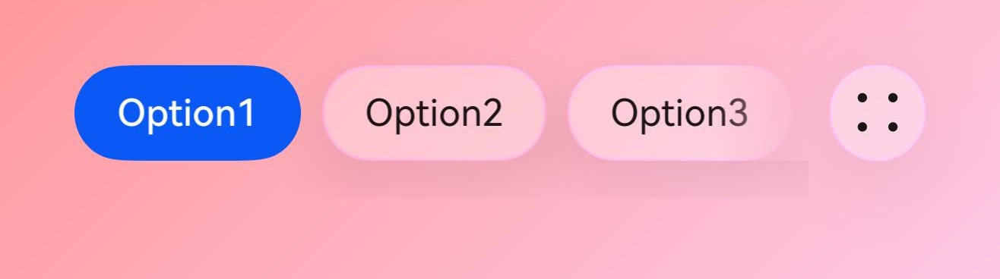

# ChipGroup

<!--Kit: ArkUI-->
<!--Subsystem: ArkUI-->
<!--Owner: @song-song-song-->
<!--Designer: @fenglinbailu-->
<!--Tester: @weixin_45530366-->
<!--Adviser: @Brilliantry_Rui-->
<!-- md-trans-meta sourceCommit=cb07c88a12c08531483c587b9f716e1ef72fa986 translatedAt=2026-08-24T06:51:52.238Z pushedAt=2026-08-25T07:34:32.961Z -->

The **ChipGroup** component provides chip group capabilities, supporting single-selection or multi-selection modes, customizable styles, icons, and spacing, as well as selected state management and event callbacks. It is suitable for various scenarios such as file categorization, resource filtering, tag selection, and content grouping, helping developers quickly implement selection functionality while delivering a consistent visual and interactive experience.

> **NOTE**
>
> - This component is supported since API version 12. Updates will be marked with a superscript to indicate their earliest API version.
>
> - The APIs of this module can be used only in the stage model.

## Modules to Import

```typescript
import { ChipSize, ChipGroup } from '@kit.ArkUI';
```

## Child Components

Not supported

## ChipGroup

ChipGroup({ <br> 
  items: ChipGroupItemOptions[], <br> 
  itemStyle?: ChipItemStyle, <br> 
  selectedIndexes?: Array<number\>, <br> 
  multiple?: boolean, <br> 
  chipGroupSpace?: ChipGroupSpaceOptions, <br> 
  chipGroupPadding?: ChipGroupPaddingOptions, <br> 
  backgroundSystemMaterial?: uiMaterial.Material, <br> 
  selectedBackgroundSystemMaterial?: uiMaterial.Material, <br> 
  onChange?: Callback<Array<number\>\>, <br> 
  suffix?: Callback<void\> <br> 
})

**Decorator**: @Component

**System capability**: SystemCapability.ArkUI.ArkUI.Full

**Device behavior differences**: On wearables, calling this API results in a runtime exception indicating that the API is undefined. On other devices, the API works correctly.

| Name           | Type                                           | Mandatory| Decorator| Description                                                                                    |
| --------------- | ----------------------------------------------- | ---- | ------------------------------------------------------------                             | ------------------------------------------------------------                             |
| items           | [ChipGroupItemOptions[]](#chipgroupitemoptions) | Yes   | @Require &nbsp;@Prop | Specific properties of each chip. For details, see [ChipGroupItemOptions[]](#chipgroupitemoptions).<br>If **undefined**, ChipGroup is empty by default.<br>**Atomic service API:** This API can be used in atomic services since API version 12. |
| itemStyle       | [ChipItemStyle](#chipitemstyle)                 | No   | @Prop | Style of the chip, such as color and size. For details, see [ChipItemStyle](#chipitemstyle). Pass this parameter when you need to customize the appearance of the chip, such as changing the background color, font color, and size.<br>Default value:<br>**{  size: ChipSize.NORMAL, backgroundColor: $r('sys.color.ohos_id_color_button_normal'), fontColor: $r('sys.color.ohos_id_color_text_primary'), selectedFontColor: $r('sys.color.ohos_id_color_text_primary_contrary'), selectedBackgroundColor: $r('sys.color.ohos_id_color_emphasize') }**<br>If **undefined**, the default value is used.<br>**Atomic service API:** This API can be used in atomic services since API version 12. |
| selectedIndexes | Array&lt;number&gt;                             | No   | @Prop | Indexes of the selected chips, counted from 0.<br>Value range: The index value is a non-negative integer and cannot exceed the length of the **items** array minus 1.<br>If a negative number, an index value beyond the array range, or a non-integer is passed, the index value does not take effect.<br>Default value: **[0]**<br>If **multiple** is **false** and **selectedIndexes** is an empty array, the first chip is selected by default. If **selectedIndexes** contains multiple elements, only the first index takes effect.<br>If **undefined**, the default value is used.<br>**Atomic service API:** This API can be used in atomic services since API version 12.  |
| multiple        | boolean                                         | No   | @Prop | Whether to select multiple chips.<br>**true**: Multiple chips can be selected, which applies to scenarios where multiple options need to be selected at the same time, such as multi-tag selection and multi-condition filtering. **false**: Only a single chip can be selected, which applies to single-selection scenarios, such as single-item selection.<br>Default value: **false**<br>If **undefined**, the default value is used.<br>**Atomic service API:** This API can be used in atomic services since API version 12. |
| chipGroupSpace  | [ChipGroupSpaceOptions](#chipgroupspaceoptions) | No   | @Prop | Left and right padding and spacing between chips. For details, see [ChipGroupSpaceOptions](#chipgroupspaceoptions). Pass this parameter when the default spacing cannot meet the layout requirements or when the spacing between chips needs to be adjusted according to the UI design.<br>Default value: **{ itemSpace: 8, startSpace: 16, endSpace: 16 }**<br>Unit: vp<br>If **undefined**, the default value is used.<br>**Atomic service API:** This API can be used in atomic services since API version 12. |
| chipGroupPadding  | [ChipGroupPaddingOptions](#chipgrouppaddingoptions) | No   | @Prop | Top and bottom padding of the **ChipGroup**, used to control the overall height. The type is [ChipGroupPaddingOptions](#chipgrouppaddingoptions). Pass this parameter when you need to adjust the vertical space occupied by the **ChipGroup** component or match specific UI design requirements.<br>Default value: **{ top: 14, bottom: 14 }**<br>Unit: vp<br>If **undefined**, the default value is used.<br>**Atomic service API:** This API can be used in atomic services since API version 12. |
| backgroundSystemMaterial | [uiMaterial.Material](../arkts-apis-uimaterial.md#material) | No | @Prop | System material style of the component. Different materials have different effects and can affect the [backgroundColor](ts-universal-attributes-background.md#backgroundcolor), [border](ts-universal-attributes-border.md#border), and [shadow](ts-universal-attributes-image-effect.md#shadow) visual properties of the component. When a system material with auto-invert is set, if **fontColor** uses a system-predefined invertible color resource (such as `$r('sys.color.font_primary')`), the color automatically adapts to the inverted color of the material background color. When **backgroundSystemMaterial** is set, **backgroundColor** should be set to **Color.Transparent**, otherwise it will conflict with the system material.<br>Default value: **undefined**<br>If **undefined**, no material style is applied.<br>**Since:** 26.0.0<br>**Model restriction:** This API can be used only in the stage model.<br>**Atomic service API:** This API can be used in atomic services since API version 26.0.0. |
| selectedBackgroundSystemMaterial | [uiMaterial.Material](../arkts-apis-uimaterial.md#material) | No | @Prop | System material style for the selected state of the component. Different materials have different effects and can affect the [backgroundColor](ts-universal-attributes-background.md#backgroundcolor), [border](ts-universal-attributes-border.md#border), and [shadow](ts-universal-attributes-image-effect.md#shadow) visual properties of the component when selected. When a system material with auto-invert is set, if **selectedFontColor** uses a system-predefined invertible color resource (such as `$r('sys.color.font_primary')`), the color automatically adapts to the inverted color of the material background color. When **selectedBackgroundSystemMaterial** is set, **selectedBackgroundColor** should be set to **Color.Transparent**, otherwise it will conflict with the system material.<br>Default value: **undefined**<br>If **undefined**, no material style is applied to the selected state.<br>**Since:** 26.0.0<br>**Model restriction:** This API can be used only in the stage model.<br>**Atomic service API:** This API can be used in atomic services since API version 26.0.0. |
| onChange        | [Callback](ts-types.md#callback12)\<Array\<number>>  | No   | -  | Callback invoked when the chip state changes, used to listen for changes in the chip selected state. This callback is triggered after the **selectedIndexes** attribute is updated. Developers can obtain the latest selected state in the callback and perform corresponding operations, such as updating the UI, saving selected data, and triggering business logic. Pass this parameter when you need to listen for the user's chip selection operation and execute the corresponding business logic. If not passed, notifications of chip state changes cannot be received.<br>If **undefined**, this callback is not triggered.<br>**Atomic service API:** This API can be used in atomic services since API version 12.                                                              |
| suffix          | [Callback](ts-types.md#callback12)\<void\>                                        | No   | @BuilderParam | Used to customize a builder. To display custom content on the rightmost side of the component, configure the **suffix** attribute. When using the **suffix** attribute, reference the [IconGroupSuffix](#icongroupsuffix) API.<br>When not passed by default, there is no suffix.<br>If **undefined**, there is no suffix.<br>**Atomic service API:** This API can be used in atomic services since API version 12. |

> **NOTE**
>
> 1. For the **selectedIndexes** and **multiple** APIs, when **multiple** is set to **false**, if **selectedIndexes** is not passed in, the first chip is selected by default. If the provided **selectedIndexes** contains more than one element, the chip at the first index is selected by default.
>
> 2. When using the **suffix** API, the **IconGroupSuffix** API must be imported. If it is not passed in, **suffix** will be empty.
>
> 3. The icon fill colors (**fillColor** and **activatedFillColor**) should be consistent with the font color (**fontColor**). If different colors are needed, use **prefixSymbol** when passing in [ChipGroupItemOptions](#chipgroupitemoptions).

## ChipGroupItemOptions

Defines the specific attributes of individual chips.

**System capability**: SystemCapability.ArkUI.ArkUI.Full

**Device behavior differences**: On wearables, calling this API results in a runtime exception indicating that the API is undefined. On other devices, the API works correctly.

| Name        | Type                          | Read-Only| Optional| Description                             |
| ----------   | ----------------------------- | ---- | ----------------------------------- | ----------------------------------- |
| prefixIcon   | [IconOptions](#iconoptions)   | No  | Yes  | Prefix image icon property. Set this parameter when an icon needs to be displayed before the chip to enhance visual recognition or provide a functional hint.<br>Default value: no prefix image icon.<br>If the value is **undefined**, the default value is used.<br>**Atomic service API:** This API can be used in atomic services since API version 12. |
| prefixSymbol | [ChipSymbolGlyphOptions](ohos-arkui-advanced-Chip.md#chipsymbolglyphoptions12) | No  | Yes  | Prefix SymbolGlyph icon property. Set this parameter when a SymbolGlyph icon needs to be displayed before the chip to enhance visual recognition or provide a functional hint.<br>Default value: no prefix SymbolGlyph icon.<br>If the value is **undefined**, the default value is used.<br> **Atomic service API:** This API can be used in atomic services since API version 12. |
| label        | [LabelOptions](#labeloptions) | No  | No  | Text content and style displayed on the chip.<br> **Atomic service API:** This API can be used in atomic services since API version 12.                            |
| suffixIcon<sup>(deprecated)</sup>   | [IconOptions](#iconoptions) | No  | Yes | Suffix image icon property. Set this parameter when an image icon needs to be displayed after the chip to provide an additional action or status hint.<br>Default value: no suffix image icon displayed.<br>If the value is **undefined**, the default value is used.<br>**Note:** When a value is passed to **suffixIcon**, **allowClose** does not take effect.<br>**Atomic service API:** This API can be used in atomic services since API version 12.<br>**Note:** This API is supported since API version 12 and deprecated since API version 14. You are advised to use [suffixImageIcon](#suffiximageiconoptions14) instead. |
| suffixSymbol | [ChipSymbolGlyphOptions](ohos-arkui-advanced-Chip.md#chipsymbolglyphoptions12) | No  | Yes  | Suffix SymbolGlyph icon property. Set this parameter when a SymbolGlyph icon needs to be displayed after the chip to provide an additional action or status hint.<br>**Note:** When a value is passed to **suffixSymbol**, **allowClose** does not take effect. **suffixSymbol** and **suffixImageIcon** are mutually exclusive. Only one of them can be configured for the same chip. If both are configured, only the one with the higher priority takes effect (priority: **suffixSymbol** > **suffixImageIcon**).<br>Default value: no suffix SymbolGlyph icon displayed.<br>If the value is **undefined**, the default value is used.<br> **Atomic service API:** This API can be used in atomic services since API version 12. |
| allowClose   | boolean                       | No  | Yes  | Whether to display the close icon.<br>The value **false** means the close icon is not displayed, and **true** means the close icon is displayed.<br>Set this parameter to **true** when users need to be allowed to delete or remove a chip, which applies to scenarios such as edit mode and configurable tag lists.<br>Default value: **false**<br>If the value is **undefined**, the default value is used.<br>**Note:** When a value is passed to **suffixSymbol**, **allowClose** does not take effect. When no value is passed to **suffixSymbol** but a value is passed to **suffixIcon** or **suffixImageIcon**, **allowClose** does not take effect. When no value is passed to **suffixSymbol**, **suffixIcon**, or **suffixImageIcon**, **allowClose** determines whether to display the close icon.<br>**Atomic service API:** This API can be used in atomic services since API version 12. |
| suffixImageIcon<sup>14+</sup> | [SuffixImageIconOptions](#suffiximageiconoptions14) | No | Yes | Suffix image icon property. Set this parameter when an icon needs to be displayed after the chip to provide an additional action or status hint.<br>**Note:** When a value is passed to **suffixImageIcon**, **allowClose** does not take effect. When both **suffixSymbol** and **suffixImageIcon** are configured, only **suffixSymbol** takes effect and **suffixImageIcon** does not.<br>Default value: no suffix image icon displayed.<br>If the value is **undefined**, the default value is used.<br> **Atomic service API:** This API can be used in atomic services since API version 14. |
| suffixSymbolOptions<sup>14+</sup> | [ChipSuffixSymbolGlyphOptions](ohos-arkui-advanced-Chip.md#chipsuffixsymbolglyphoptions14) | No | Yes | Suffix symbol icon property, which configures the interaction function and accessibility attributes of the suffix symbol icon. Set this parameter when a click event or accessibility support needs to be added to the suffix symbol icon.<br>Default value: the default value of [ChipSuffixSymbolGlyphOptions](ohos-arkui-advanced-Chip.md#chipsuffixsymbolglyphoptions14) is used.<br>If the value is **undefined**, the default value is used.<br>**Atomic service API:** This API can be used in atomic services since API version 14. |
| closeOptions<sup>14+</sup> | [CloseOptions](ohos-arkui-advanced-Chip.md#closeoptions14) | No | Yes | Accessibility reading and font size properties of the default close icon. Set this parameter when custom accessibility reading content and font size need to be provided for the close icon.<br>Default value: the default configuration in [CloseOptions](ohos-arkui-advanced-Chip.md#closeoptions14) is used. <br>If the value is **undefined**, the default value is used.<br> **Atomic service API:** This API can be used in atomic services since API version 14. |
| accessibilityDescription<sup>14+</sup> | [ResourceStr](ts-types.md#resourcestr) | No | Yes | Accessibility description of the chip in the **ChipGroup**. This description is used to explain the chip in the **ChipGroup** to users in detail. Developers should provide a relatively detailed text description for this attribute of the chip to help users understand the operation to be performed and its possible results, especially when these results cannot be directly learned from the chip's attributes and accessibility text alone. If the chip has both a label text attribute and an accessibility description attribute, when it is selected, the system first announces the chip's label text attribute, and then announces the content of the accessibility description attribute.<br>Default value: empty string.<br>If the value is **undefined**, the default value is used.<br> **Atomic service API:** This API can be used in atomic services since API version 14. |
| accessibilityLevel<sup>14+</sup> | string | No | Yes | Accessibility level of the chip in the **ChipGroup**. Controls whether the chip in the **ChipGroup** can be recognized by accessibility services.<br>The supported values are:<br>**"auto"**: The chip in the **ChipGroup** is converted to "yes", which applies to most scenarios.<br>**"yes"**: The chip in the **ChipGroup** can be recognized by accessibility services, which applies to scenarios where accessibility needs to be explicitly enabled.<br>**"no"**: The chip in the **ChipGroup** cannot be recognized by accessibility services, which applies to purely decorative icon scenarios.<br>**"no-hide-descendants"**: The chip in the **ChipGroup** and all its child components cannot be recognized by accessibility services, which applies to scenarios where the entire area needs to be hidden.<br>Default value: **"auto"**<br>If the value is **undefined**, the default value is used.<br> **Atomic service API:** This API can be used in atomic services since API version 14. |

> **NOTE**
>
> When the **suffixSymbol** parameter is passed in, **allowClose** does not take effect. When the **suffixImageIcon** parameter is passed in but **suffixSymbol** is not, **allowClose** does not take effect. When neither **suffixSymbol** nor **suffixImageIcon** is passed in, **allowClose** determines whether the close icon is displayed. **suffixIcon** is deprecated. Use **suffixImageIcon** instead.
>
> **suffixSymbol** and **suffixImageIcon** are both suffix icons, and only one of them can be configured for the same chip item. If both are configured, only the one with the higher priority takes effect (priority: **suffixSymbol** > **suffixImageIcon**). **suffixIcon** is deprecated. Use **suffixImageIcon** instead.

## ChipItemStyle

Defines the common attributes of chips.

**Atomic service API**: This API can be used in atomic services since API version 12.

**System capability**: SystemCapability.ArkUI.ArkUI.Full

**Device behavior differences**: On wearables, calling this API results in a runtime exception indicating that the API is undefined. On other devices, the API works correctly.

| Name                   | Type                                                        | Read-Only| Optional| Description                                                        |
| ----------------------- | ------------------------------------------------------------ | ---- | ---- | ------------------------------------------------------------ |
| size                    | [ChipSize](ohos-arkui-advanced-Chip.md#chipsize) \| [SizeOptions](ts-types.md#sizeoptions) | No   | Yes   | Chip size. To use it, import the **ChipSize** type from the **Chip** component. **ChipSize.NORMAL** applies to most standard scenarios; **ChipSize.SMALL** applies to compact layouts or space-constrained scenarios; **SizeOptions** applies to special scenarios where a custom precise size is required.<br>Default value: **ChipSize.NORMAL** or **{ height: 0, width: 0 }**<br>When the value is **undefined**, the default value is used. |
| backgroundColor         | [ResourceColor](ts-types.md#resourcecolor)                   | No   | Yes   | Chip background color.<br>Default value: **$r('sys.color.ohos_id_color_button_normal')**<br>**Note:** Since API version 26.0.0, when **backgroundSystemMaterial** is set, **backgroundColor** must be set to **Color.Transparent**; otherwise, it conflicts with the system material. When **backgroundSystemMaterial** is undefined, the **backgroundColor** attribute takes effect.<br>When the value is **undefined**, the default value of **backgroundColor** is used. |
| fontColor               | [ResourceColor](ts-types.md#resourcecolor)                   | No   | Yes   | Chip text color.<br>Default value: **$r('sys.color.ohos_id_color_text_primary')**<br>**Note:** Since API version 26.0.0, when **backgroundSystemMaterial** is set to a system material with auto-invert, **fontColor** uses a system-predefined invertible color resource, and the text color automatically adapts to the inverted color of the material background color.<br>When the value is **undefined**, the default value of **fontColor** is used. |
| selectedFontColor       | [ResourceColor](ts-types.md#resourcecolor)                   | No   | Yes   | Chip text color when selected.<br>Default value: **$r('sys.color.ohos_id_color_text_primary_contrary')**<br>**Note:** Since API version 26.0.0, when **selectedBackgroundSystemMaterial** is set to a system material with auto-invert, **selectedFontColor** uses a system-predefined invertible color resource (for example, `$r('sys.color.font_primary')`), and the color automatically adapts to the inverted color of the material background color.<br>When the value is **undefined**, the default value of **selectedFontColor** is used. |
| selectedBackgroundColor | [ResourceColor](ts-types.md#resourcecolor)                   | No   | Yes   | Chip background color when selected.<br>Default value: **$r('sys.color.ohos_id_color_emphasize')**<br>**Note:** Since API version 26.0.0, when **selectedBackgroundSystemMaterial** is set, **selectedBackgroundColor** must be set to **Color.Transparent**; otherwise, it conflicts with the system material. When **selectedBackgroundSystemMaterial** is **undefined**, the **selectedBackgroundColor** attribute takes effect.<br>When the value is **undefined**, the default value of **selectedBackgroundColor** is used. |

> **NOTE**
>
> 1. The size settings for chips can be of two types: (1) **ChipSize**, which offers two size options, **NORMAL** and **SMALL**; (2) **SizeOptions**.
>
> 2. When **backgroundColor** and **selectedBackgroundColor** are set to **undefined**, the default background color is displayed. When an invalid value is passed in, the background color is transparent.
>
> 3. Starting from API version 26.0.0, when **backgroundSystemMaterial** is set to a system material with auto-invert, **fontColor** uses a system-predefined invertible color resource (such as `$r('sys.color.font_primary')`), and the color automatically adapts to the inverted color of the material background color.

## ChipGroupSpaceOptions

Defines the left and right padding of the chip group, and the spacing between chips.

**Atomic service API**: This API can be used in atomic services since API version 12.

**System capability**: SystemCapability.ArkUI.ArkUI.Full

**Device behavior differences:** On wearables, calling this API results in a runtime exception indicating that the API is undefined. On other devices, the API works correctly.

| Name      | Type           | Read-Only| Optional| Description                                            |
| ---------- | -------------- | ---- | ------------------------------------------------ | ------------------------------------------------ |
| itemSpace | string \| number  | No  | Yes  | Spacing between chips (percentages are not supported).<br>Value range:<br>number type: a value greater than or equal to 0 (for example, 0, 8, 16, 24.5).<br>string type: a string in fp \| vp \| px \| lpx with the numeric part greater than or equal to 0 (for example, "8vp", "16fp", "12px", "10lpx").<br>**Note:** When a negative number, percentage, or invalid string format is passed, the default value is used.<br>Default value: **8**<br>Unit: vp<br>When the value is **undefined**, the default value is used. |
| startSpace | [Length](ts-types.md#length)         | No  | Yes  | Left padding (percentages are not supported).<br>When a negative number, percentage, or invalid string format is passed, the default value is used.<br>Default value: **16**<br>Unit: vp<br>When the value is **undefined**, the default value is used.           |
| endSpace   | [Length](ts-types.md#length)         | No  | Yes  | Right padding (percentages are not supported).<br>When a negative number, percentage, or invalid string format is passed, the default value is used.<br>Default value: **16**<br>Unit: vp<br>When the value is **undefined**, the default value is used. |

## ChipGroupPaddingOptions

Defines the top and bottom padding of a **ChipGroup** component, which is used to control the overall height of the **ChipGroup**.

**Atomic service API**: This API can be used in atomic services since API version 12.

**System capability**: SystemCapability.ArkUI.ArkUI.Full

**Device behavior differences**: On wearables, calling this API results in a runtime exception indicating that the API is undefined. On other devices, the API works correctly.

| Name  | Type           | Read-Only| Optional| Description                                                     |
| ------ | -------------- | ---- | ------------------------------------------------            | ------------------------------------------------            |
| top    | [Length](ts-types.md#length)         | No  | No  | Top padding of the **ChipGroup** (percentage not supported).<br>If a negative number, percentage, or invalid string format is passed, the default value is used.<br>Default value: **14**<br>Unit: vp<br>If the value is **undefined**, the default value is used.     |
| bottom | [Length](ts-types.md#length)         | No  | No  | Bottom padding of the **ChipGroup** (percentage not supported).<br>If a negative number, percentage, or invalid string format is passed, the default value is used.<br>Default value: **14**<br>Unit: vp<br>If the value is **undefined**, the default value is used.     |

## SuffixImageIconOptions<sup>14+</sup>

Defines the configuration options for suffix icons.

Inherits from [IconOptions](#iconoptions).

**Atomic service API**: This API can be used in atomic services since API version 14.

**System capability**: SystemCapability.ArkUI.ArkUI.Full

**Device behavior differences**: On wearables, calling this API results in a runtime exception indicating that the API is undefined. On other devices, the API works correctly.

| Name| Type| Read-Only| Optional| Description|
| ---- | ---- | --- | ---- | ---- |
| action | [VoidCallback](ts-types.md#voidcallback12) | No | Yes | Response event of the suffix icon. The callback is triggered when the user taps the suffix icon. Set this parameter when you need to add custom interaction to the suffix icon, such as performing a search, opening a menu, or deleting an item.<br>If the value is **undefined**, there is no suffix icon response event. |
| accessibilityText | [ResourceStr](ts-types.md#resourcestr) | No | Yes | Accessibility text attribute of the suffix icon. This attribute is used to further explain the suffix icon to users. You can set a relatively detailed description for this attribute of the suffix icon to help users understand the operation to be performed, especially the possible consequences that cannot be inferred from the suffix icon's own attributes and accessibility text. When the suffix icon has both a text attribute and an accessibility description attribute, the system first reads the text attribute of the suffix icon, followed by the content of the accessibility description attribute.<br>Default value: empty string.<br>If the value is **undefined**, the default value is used. |
| accessibilityDescription | [ResourceStr](ts-types.md#resourcestr) | No | Yes | Accessibility description of the suffix icon. This description is used to explain the suffix icon to users in detail. You should provide a thorough text description for this attribute of the suffix icon to help users understand the operation to be performed and its possible consequences, especially when such consequences cannot be directly inferred from the suffix icon's attributes and accessibility text. When the suffix icon has both a text attribute and an accessibility description attribute, the system first reads the text attribute of the suffix icon, followed by the content of the accessibility description attribute.<br>Default value: empty string.<br>If the value is **undefined**, the default value is used. |
| accessibilityLevel | string | No | Yes | Accessibility level of the suffix icon. This attribute controls whether the suffix icon can be recognized by accessibility services. Set this parameter when you need to provide access support for users of accessibility services, or when you need to exclude decorative icons from the accessibility tree.<br>Supported values:<br>**"auto"**: The suffix icon is converted to **"yes"** if an action exists, and to **"no"** if no action exists. This applies to most scenarios.<br>**"yes"**: The suffix icon can be recognized by accessibility services. This applies to functional icons.<br>**"no"**: The suffix icon cannot be recognized by accessibility services. This applies to purely decorative icons.<br>**"no-hide-descendants"**: The suffix icon and all its child components cannot be recognized by accessibility services. This applies to scenarios where an entire area needs to be hidden.<br>Default value: **"auto"**<br>If the value is **undefined**, the default value is used. |

## SymbolItemOptions<sup>14+</sup>

Defines the suffix icon option type for **ChipGroup**.

**Atomic service API**: This API can be used in atomic services since API version 14.

**System capability**: SystemCapability.ArkUI.ArkUI.Full

**Device behavior differences**: On wearables, calling this API results in a runtime exception indicating that the API is undefined. On other devices, the API works correctly.

| Name| Type| Read-Only| Optional| Description|
| ---- | ---- | --- | ---- | ---- |
| symbol | [SymbolGlyphModifier](ts-universal-attributes-attribute-symbolglyphmodifier.md#symbolglyphmodifier) | No | No | **SymbolGlyphModifier** configuration object for the trailing icon, used to set the icon's display style, rendering mode, etc.|
| action | [VoidCallback](ts-types.md#voidcallback12) | No | No | Response event of the trailing icon. The callback is triggered when the user taps the tail icon. Set this parameter when you need to add custom interaction to the tail icon, such as performing a specific operation or opening an interface.<br>If the value is **undefined**, there is no tail icon response event.|
| accessibilityText | [ResourceStr](ts-types.md#resourcestr) | No| Yes| Accessibility text attribute of the trailing icon. This attribute is used to further explain the trailing icon to users. You can set a relatively detailed description for this attribute of the trailing icon to help users understand the operation to be performed, especially the possible consequences that cannot be inferred from the trailing icon's own attributes and accessibility text. When the trailing icon has both a text attribute and an accessibility description attribute, the system first reads the text attribute of the trailing icon, followed by the content of the accessibility description attribute.<br>The default value is an empty string.<br>If the value is **undefined**, the default value is used.|
| accessibilityDescription | [ResourceStr](ts-types.md#resourcestr) | No | Yes | Accessibility description of the trailing icon. This description is used to explain the trailing icon to users in detail. You should provide a thorough text description for this attribute to help users understand the operation to be performed and its possible results, especially when such results cannot be directly inferred from the trailing icon's attributes and accessibility text. When a trailing icon that is selected has both a text attribute and an accessibility description attribute, the system first reads the text attribute, followed by the content of the accessibility description attribute.<br>Default value: empty string.<br>If the value is **undefined**, the default value is used.|
| accessibilityLevel | string | No | Yes | Accessibility level of the trailing icon. Used to control whether the trailing icon can be recognized by accessibility services. Set this parameter when you need to provide access support for users of accessibility services, or when you need to exclude decorative icons from the accessibility tree.<br>Supported values:<br>**"auto"**: The trailing icon is converted to **"yes"**, applicable to most scenarios.<br>**"yes"**: The trailing icon can be recognized by accessibility services, applicable to scenarios where accessibility access needs to be explicitly enabled.<br>**"no"**: The trailing icon cannot be recognized by accessibility services, applicable to purely decorative icon scenarios.<br>**"no-hide-descendants"**: The trailing icon and all its child components cannot be recognized by accessibility services, applicable to scenarios where the entire area needs to be hidden.<br>Default value: **"auto"**.<br>If the value is **undefined**, the default value is used. |

## IconGroupSuffix

```typescript
IconGroupSuffix({
  items: Array<IconItemOptions | SymbolGlyphModifier | SymbolItemOptions>,
  iconBackgroundSystemMaterial?: uiMaterial.Material
})
```

**Decorator**: @Component

**System capability**: SystemCapability.ArkUI.ArkUI.Full

**Device behavior differences**: On wearables, calling this API results in a runtime exception indicating that the API is undefined. On other devices, the API works correctly.

| Name    | Type                   | Mandatory| Decorator| Description                                                             |
| -------- | ---------------------- | ---- | ----------------------------------------------| ----------------------------------------------|
| items                       | Array<[IconItemOptions](#iconitemoptions) \| [SymbolGlyphModifier](ts-universal-attributes-attribute-symbolglyphmodifier.md#symbolglyphmodifier) \| [SymbolItemOptions](#symbolitemoptions14)> | Yes   | @Require &nbsp;@Prop | Array of custom items displayed in the trailing area. The array supports **IconItemOptions** (image icon), **SymbolGlyphModifier** (symbol icon), or **SymbolItemOptions** (symbol icon configuration) types.<br>**Atomic service API:** This API can be used in atomic services since API version 12.|
| iconBackgroundSystemMaterial | [uiMaterial.Material](../arkts-apis-uimaterial.md#material) | No | @Prop | System material style of the component. Different materials have different effects and can affect the [backgroundColor](ts-universal-attributes-background.md#backgroundcolor), [border](ts-universal-attributes-border.md#border), and [shadow](ts-universal-attributes-image-effect.md#shadow) visual properties of the component. When a system material with auto-invert is set, if **fontColor** uses a system-predefined invertible color resource (such as `$r('sys.color.font_primary')`), the color automatically adapts to the inverted color of the material background color.<br>Default value: **undefined**<br>When the **value** is **undefined**, no material style is applied.<br>**Since:** 26.0.0<br>**Model restriction:** This API can be used only in the stage model.<br>**Atomic service API:** This API can be used in atomic services since API version 26.0.0. |

> **NOTE**
>
> With **SymbolGlyphModifier**, neither modifying the animation type with **symbolEffect** nor setting the effect strategy with [effectStrategy](./ts-basic-components-symbolGlyph.md#effectstrategy) is supported.
>

## IconItemOptions

Defines the trailing builder API, which is used to configure the display properties of the trailing icon and its background area.

**System capability**: SystemCapability.ArkUI.ArkUI.Full

**Device behavior differences**: On wearables, calling this API results in a runtime exception indicating that the API is undefined. On other devices, the API works correctly.

| Name    | Type                           | Read-Only| Optional| Description                                   |
| -------- | --------------                 | ---- | ------------------------------           | ------------------------------           |
| icon     | [IconOptions](#iconoptions)    | No  | No  | Custom Builder icon.<br>When the chip size is **ChipSize.SMALL**, the default icon size is **{width: '16vp', height: '16vp'}**.<br>When the chip size is **ChipSize.NORMAL**, the default icon size is **{width: '24vp', height: '24vp'}**.<br>To dynamically change the size, the [SymbolGlyphModifier](ts-universal-attributes-attribute-symbolglyphmodifier.md#symbolglyphmodifier) type must be used when [IconGroupSuffix](#icongroupsuffix) is introduced.<br>When the value is **undefined**, the default value is used.<br>**Atomic service API:** This API can be used in atomic services since API version 12. |
| action   | [Callback](ts-types.md#callback12)\<void>        | No  | No  | Callback for the tap event on the trailing icon. It is triggered when the user taps the trailing icon. Set this parameter to add custom interaction to the trailing icon, such as performing a specific operation or opening a page.<br>When it is **undefined**, this callback is not triggered.<br>**Atomic service API:** This API can be used in atomic services since API version 12.            |
| accessibilityText<sup>14+</sup> | [ResourceStr](ts-types.md#resourcestr) | No| Yes| Accessibility text attribute of the trailing icon. It is used to further explain the trailing icon to users. Developers can set a relatively detailed explanatory text for this attribute of the trailing icon to help users understand the operation to be performed. For example, help users understand the possible consequences of the operation to be performed, especially when these consequences cannot be learned from the trailing icon's own attributes and accessibility text. If the trailing icon has both a text attribute and an accessibility description attribute, when the trailing icon is selected, the text attribute of the trailing icon is announced first, followed by the content of the accessibility description attribute.<br>Default value: empty string.<br>When the value is **undefined**, the default value is used.<br>**Atomic service API:** This API can be used in atomic services since API version 14.|
| accessibilityDescription<sup>14+</sup> | [ResourceStr](ts-types.md#resourcestr) | No | Yes | Accessibility description of the trailing icon. This description is used to explain the trailing icon to users in detail. Developers should provide a relatively detailed text description for this attribute of the trailing icon to help users understand the operation to be performed and its possible consequences, especially when these consequences cannot be directly learned from the trailing icon's attributes and accessibility text alone. If the trailing icon has both a text attribute and an accessibility description attribute, when the trailing icon is selected, the system will first announce the text attribute of the trailing icon, and then announce the content of the accessibility description attribute.<br>Default value: empty string<br>When the value is **undefined**, the default value is used.<br>**Atomic service API:** This API can be used in atomic services since API version 14. |
| accessibilityLevel<sup>14+</sup> | string | No | Yes | Accessibility level of the trailing icon. Used to control whether the trailing icon can be recognized by accessibility services. Set this parameter when you need to provide access support for accessibility service users, or when you need to exclude decorative icons from the accessibility tree.<br>Supported values:<br>**"auto"**: The trailing icon is converted to **"yes"**, applicable to most scenarios.<br>**"yes"**: The trailing icon can be recognized by accessibility services, applicable to functional icons.<br>**"no"**: The trailing icon cannot be recognized by accessibility services, applicable to purely decorative icons.<br>**"no-hide-descendants"**: The trailing icon and all its child components cannot be recognized by accessibility services, applicable to scenarios where the entire area needs to be hidden.<br>Default value: **"auto"**<br>When the value is **undefined**, the default value is used.<br>**Atomic service API:** This API can be used in atomic services since API version 14. |

## IconOptions

Defines the common attributes of icons.

**Atomic service API**: This API can be used in atomic services since API version 12.

**System capability**: SystemCapability.ArkUI.ArkUI.Full

**Device behavior differences**: On wearables, calling this API results in a runtime exception indicating that the API is undefined. On other devices, the API works correctly.

| Name| Type                                  | Read-Only| Optional| Description                                                        |
| ---- | -------------------------------------- | ---- | ---- | ------------------------------------------------------------ |
| src  | [ResourceStr](ts-types.md#resourcestr) | No  | No  | Icon source, which can be a specific image resource or an image address reference. For details, see [Image](ts-basic-components-image.md#image-1).|
| size | [SizeOptions](ts-types.md#sizeoptions) | No | Yes | Icon size. Percentages are not supported. Set this parameter when you need to customize the icon size.<br>Default value:<br>- When **ChipItemStyle.size** is **ChipSize.SMALL**, the default value is: **{width: $r('sys.float.chip_small_icon_size'), height: $r('sys.float.chip_small_icon_size')}**<br>- In other cases, the default value is: **{width: $r('sys.float.chip_normal_icon_size'), height: $r('sys.float.chip_normal_icon_size')}**   <br>If the value is **undefined**, the default value is used.   |

## LabelOptions

Defines the text attributes.

**Atomic service API**: This API can be used in atomic services since API version 12.

**System capability**: SystemCapability.ArkUI.ArkUI.Full

**Device behavior differences**: On wearables, calling this API results in a runtime exception indicating that the API is undefined. On other devices, the API works correctly.

| Name| Type  | Read-Only| Optional| Description    |
| ---- | ------ | ---- | -------- | -------- |
| text | string | No | No | Text content displayed on the chip item. Used to set the text information shown on the chip. |

## Example

### Example 1: Implementing a Chip Group Without a Builder-defined Suffix

This example shows how to implement a chip group without a builder-defined suffix.

```typescript
import { ChipSize, ChipGroup } from '@kit.ArkUI';

@Entry
@Component
struct Index {
  @State selectedIndex: Array<number> = [0, 1, 2, 3, 4, 5, 6];

  build() {
    Column() {
      ChipGroup({
        // Set the properties for each chip in the items.
        items: [
          {
            // Replace $r('app.media.icon') with the image resource file you use.
            prefixIcon: { src: $r('app.media.icon') },
            label: { text: 'Chip 1' },
            suffixIcon: { src: $r('sys.media.ohos_ic_public_cut') },
            allowClose: false
          },
          {
            prefixIcon: { src: $r('sys.media.ohos_ic_public_copy') },
            label: { text: 'Chip 2' },
            allowClose: true
          },
          {
            prefixIcon: { src: $r('sys.media.ohos_ic_public_clock') },
            label: { text: 'Chip 3' },
            allowClose: true
          },
          {
            prefixIcon: { src: $r('sys.media.ohos_ic_public_cast_stream') },
            label: { text: 'Chip 4' },
            allowClose: true
          },
          {
            prefixIcon: { src: $r('sys.media.ohos_ic_public_cast_mirror') },
            label: { text: 'Chip 5' },
            allowClose: true
          },
          {
            prefixIcon: { src: $r('sys.media.ohos_ic_public_cast_stream') },
            label: { text: 'Chip 6' },
            allowClose: true
          },
        ],
        // Set the style of the chip.
        itemStyle: {
          size: ChipSize.SMALL,
          backgroundColor: $r('sys.color.ohos_id_color_button_normal'),
          fontColor: $r('sys.color.ohos_id_color_text_primary'),
          selectedBackgroundColor: $r('sys.color.ohos_id_color_emphasize'),
          selectedFontColor: $r('sys.color.ohos_id_color_text_primary_contrary'),
        },
        selectedIndexes: this.selectedIndex,
        multiple: false,
        chipGroupSpace: { itemSpace: 8, endSpace: 0 },
        chipGroupPadding: { top: 10, bottom: 10 },
        onChange: (activatedChipsIndex: Array<number>) => {
          console.info('chips on clicked, activated index ' + activatedChipsIndex);
        },
      })
    }
  }
}
```


### Example 2: Implementing a Chip Group with a Builder-defined Suffix

This example shows how to implement a chip group with a builder-defined suffix.

```typescript
import { ChipSize, ChipGroup, IconGroupSuffix } from '@kit.ArkUI';

@Entry
@Component
struct Index {
  @State selectedIndex: Array<number> = [0, 1, 2, 3, 4, 5, 6];
  @State selectedState: boolean = true;

  @LocalBuilder
  ChipGroupSuffix(): void {
    // Reference IconGroupSuffix to implement the custom effect on the rightmost side of the component.
    IconGroupSuffix({
      items: [{
        icon: { src: $r('sys.media.ohos_ic_public_search_filled'), size: { width: 36, height: 36 } },
        action: () => {
          if (this.selectedState == false) {
            this.selectedIndex = [0, 1, 2, 3, 4, 5, 6];
            this.selectedState = true;
          } else {
            this.selectedIndex = [];
            this.selectedState = false;
          }
        }
      }
      ]
    })
  }

  build() {
    Column() {
      ChipGroup({
        // Set the properties for each chip in the items.
        items: [
          {
            // Replace $r('app.media.icon') with the image resource file you use.
            prefixIcon: { src: $r('app.media.icon') },
            label: { text: 'Chip 1' },
            suffixIcon: { src: $r('sys.media.ohos_ic_public_cut') },
            allowClose: false
          },
          {
            prefixIcon: { src: $r('sys.media.ohos_ic_public_copy') },
            label: { text: 'Chip 2' },
            allowClose: true
          },
          {
            prefixIcon: { src: $r('sys.media.ohos_ic_public_clock') },
            label: { text: 'Chip 3' },
            allowClose: true
          },
          {
            prefixIcon: { src: $r('sys.media.ohos_ic_public_cast_stream') },
            label: { text: 'Chip 4' },
            allowClose: true
          },
          {
            prefixIcon: { src: $r('sys.media.ohos_ic_public_cast_mirror') },
            label: { text: 'Chip 5' },
            allowClose: true
          },
          {
            prefixIcon: { src: $r('sys.media.ohos_ic_public_cast_stream') },
            label: { text: 'Chip 6' },
            allowClose: true
          },
        ],
        // Set the style of the chip.
        itemStyle: {
          size: ChipSize.NORMAL,
          backgroundColor: $r('sys.color.ohos_id_color_button_normal'),
          fontColor: $r('sys.color.ohos_id_color_text_primary'),
          selectedBackgroundColor: $r('sys.color.ohos_id_color_emphasize'),
          selectedFontColor: $r('sys.color.ohos_id_color_text_primary_contrary'),
        },
        selectedIndexes: this.selectedIndex,
        multiple: true,
        chipGroupSpace: { itemSpace: 8, endSpace: 0 },
        chipGroupPadding: { top: 10, bottom: 10 },
        onChange: (activatedChipsIndex: Array<number>) => {
          console.info('chips on clicked, activated index ' + activatedChipsIndex);
        },
        // Customize the builder to display custom content on the rightmost side of the component.
        suffix: this.ChipGroupSuffix
      })
    }
  }
}
```


### Example 3: Setting the Symbol Icon

This example implements **IconGroupSuffix** and **ChipGroup** with **SymbolGlyph** resources.

```typescript
import { ChipSize, ChipGroup, IconGroupSuffix, SymbolGlyphModifier } from '@kit.ArkUI';

@Entry
@Component
struct Index {
  @State selectedIndex: Array<number> = [0, 1, 2, 3, 4, 5, 6];
  @State selectedState: boolean = true;
  @State prefixModifierNormal: SymbolGlyphModifier = new SymbolGlyphModifier($r('sys.symbol.ohos_star'));
  @State prefixModifierActivated: SymbolGlyphModifier =
    new SymbolGlyphModifier($r('sys.symbol.ohos_star')).fontColor([Color.Red]);
  @State suffixModifierNormal: SymbolGlyphModifier = new SymbolGlyphModifier($r('sys.symbol.ohos_wifi'));
  @State suffixModifierActivated: SymbolGlyphModifier =
    new SymbolGlyphModifier($r('sys.symbol.ohos_wifi')).fontColor([Color.Red]);

  @LocalBuilder
  ChipGroupSuffix(): void {
    // Reference IconGroupSuffix to implement the custom effect on the rightmost side of the component.
    IconGroupSuffix({
      items: [
        new SymbolGlyphModifier($r('sys.symbol.magnifyingglass'))
          .onClick(() => {
            if (this.selectedState == false) {
              this.selectedIndex = [0, 1, 2, 3, 4, 5, 6];
              this.selectedState = true;
            } else {
              this.selectedIndex = [];
              this.selectedState = false;
            }
          })
      ]
    })
  }

  build() {
    Column() {
      ChipGroup({
        // Set the properties for each chip in the items.
        items: [
          {
            prefixSymbol: { normal: this.prefixModifierNormal, activated: this.prefixModifierActivated },
            label: { text: 'Chip 1' },
            suffixSymbol: { normal: this.suffixModifierNormal, activated: this.suffixModifierActivated },
            allowClose: false,
          },
          {
            prefixSymbol: { normal: this.prefixModifierNormal, activated: this.prefixModifierActivated },
            label: { text: 'Chip 2' },
            allowClose: true,
          },
          {
            prefixIcon: { src: $r('sys.media.ohos_ic_public_clock') },
            label: { text: 'Chip 3' },
            allowClose: true,
          },
          {
            prefixIcon: { src: $r('sys.media.ohos_ic_public_cast_stream') },
            label: { text: 'Chip 4' },
            allowClose: true,
          },
          {
            prefixIcon: { src: $r('sys.media.ohos_ic_public_cast_mirror') },
            label: { text: 'Chip 5' },
            allowClose: true,
          },
          {
            prefixIcon: { src: $r('sys.media.ohos_ic_public_cast_stream') },
            label: { text: 'Chip 6' },
            allowClose: true,
          },
        ],
        // Set the style of the chip.
        itemStyle: {
          size: ChipSize.NORMAL,
          backgroundColor: $r('sys.color.ohos_id_color_button_normal'),
          fontColor: $r('sys.color.ohos_id_color_text_primary'),
          selectedBackgroundColor: $r('sys.color.ohos_id_color_emphasize'),
          selectedFontColor: $r('sys.color.ohos_id_color_text_primary_contrary'),
        },
        selectedIndexes: this.selectedIndex,
        multiple: true,
        chipGroupSpace: { itemSpace: 8, endSpace: 0 },
        chipGroupPadding: { top: 10, bottom: 10 },
        onChange: (activatedChipsIndex: Array<number>) => {
          console.info('chips on clicked, activated index ' + activatedChipsIndex);
        },
        // Customize the builder to display custom content on the rightmost side of the component.
        suffix: this.ChipGroupSuffix
      })
    }
  }
}
```


### Example 4: Implementing the Screen Reader Feature for the Single-Selection Scenario

This example demonstrates how to implement the screen reader feature for a chip group with and without a suffix area in single-selection mode. The content to be read is the value of the **accessibilityText** attribute.

```typescript
import { ChipGroup, IconGroupSuffix, SymbolGlyphModifier } from '@kit.ArkUI';

@Builder
function defaultFunction(): void {
}

@Component
struct SectionGroup {
  @Prop
  @Require
  title: ResourceStr;
  @BuilderParam
  @Require
  content: () => void = defaultFunction;

  build() {
    Column({ space: 4 }) {
      Text(this.title)
        .fontColor('#FF666666')
        .fontSize(12)
      Column({ space: 8 }) {
        this.content()
      }
    }
    .alignItems(HorizontalAlign.Start)
    .width('100%')
  }
}

@Component
struct SectionItem {
  @Prop
  @Require
  title: ResourceStr;
  @BuilderParam
  @Require
  content: () => void = defaultFunction;

  build() {
    Column({ space: 12 }) {
      Text(this.title)
      this.content()
    }
    .backgroundColor('#FFFFFFFF')
    .borderRadius(12)
    .padding(12)
    .width('100%')
  }
}

@Entry
@Component
export struct ChipGroupExample2 {
  @LocalBuilder
  suffixBuilder() {
    IconGroupSuffix({
      items: [
        {
          icon: { src: $r('sys.media.ohos_ic_public_more'), },
          accessibilityText: 'More', // Read "More, button, usage hints."
          accessibilityDescription: 'Usage hints',
          action: () => {
            this.getUIContext().getPromptAction().showToast({
              message: 'More icon touched.'
            });
          }
        },
        {
          symbol: new SymbolGlyphModifier($r('sys.symbol.more')),
          accessibilityText: 'More', // Read "More, button, usage hints."
          accessibilityDescription: 'Usage hints',
          action: () => {
            this.getUIContext().getPromptAction().showToast({
              message: 'More icon touched.'
            });
          }
        },
        {
          icon: { src: $r('sys.media.ohos_ic_public_more'), },
          accessibilityText: 'More', // If accessibilityLevel is set to no, accessibilityText and accessibilityDescription do not take effect.
          accessibilityDescription: 'Usage hints',
          accessibilityLevel: 'no',
          action: () => {
            this.getUIContext().getPromptAction().showToast({
              message: 'More icon touched.'
            });
          }
        }
      ]
    })
  }

  build() {
    NavDestination() {
      Scroll() {
        Column({ space: 12 }) {
          SectionGroup({ title: 'Available' }) {
            SectionItem({ title: 'Single selection without suffix area' }) {
              ChipGroup({
                items: [
                  {
                    prefixIcon: {
                      src: $r('app.media.startIcon')
                    },
                    label: { text: 'Option 1' },
                    suffixImageIcon: {
                      src: $r('sys.media.save_button_picture'),
                      accessibilityText: 'Save', // Read "Save, button."
                      action: () => {
                        this.getUIContext().getPromptAction().showToast({
                          message: 'Suffix icon touched.'
                        });
                      },
                    }
                  },
                  {
                    label: { text: 'Option 2' },
                    suffixSymbol: {
                      normal: new SymbolGlyphModifier($r('sys.symbol.save')),
                      activated: new SymbolGlyphModifier($r('sys.symbol.save'))
                    },
                    suffixSymbolOptions: {
                      normalAccessibility: {
                        accessibilityText: 'Save' // Read "Save, button."
                      },
                      action: () => {
                        this.getUIContext().getPromptAction().showToast({
                          message: 'Suffix icon touched.'
                        });
                      }
                    }
                  },
                  {
                    label: { text: 'Option 3' },
                    suffixIcon: { src: $r('sys.media.save_button_picture'), }
                  },
                  { label: { text: 'Option 4' } },
                  { label: { text: 'Option 5' } },
                  { label: { text: 'Option 6' } },
                  { label: { text: 'Option 7' } },
                  { label: { text: 'Option 8' } },
                  { label: { text: 'Option 9' } },
                ]
              })
            }

            SectionItem({ title: 'Single selection with suffix area' }) {
              ChipGroup({
                items: [
                  { label: { text: 'Option 1' } },
                  { label: { text: 'Option 2' } },
                  { label: { text: 'Option 3' } },
                  { label: { text: 'Option 4' } },
                  { label: { text: 'Option 5' } },
                  { label: { text: 'Option 6' } },
                  { label: { text: 'Option 7' } },
                  { label: { text: 'Option 8' } },
                  { label: { text: 'Option 9' } },
                ],
                suffix: this.suffixBuilder,
              })
            }
          }
        }
      }
      .padding({
        top: 8,
        bottom: 8,
        left: 16,
        right: 16,
      })
    }
    .title('Basic usage')
    .backgroundColor('#F1F3F5')
  }
}
```

### Example 5: Implementing the Screen Reader Feature for the Multi-selection Scenario

This example demonstrates how to implement the screen reader feature for a chip group with and without a suffix area in multi-selection mode. The content to be read is the value of the **accessibilityText** attribute.

```typescript
import { ChipGroup, IconGroupSuffix, SymbolGlyphModifier } from '@kit.ArkUI';

@Builder
function defaultFunction(): void {
}

@Component
struct SectionGroup {
  @Prop
  @Require
  title: ResourceStr;
  @BuilderParam
  @Require
  content: () => void = defaultFunction;

  build() {
    Column({ space: 4 }) {
      Text(this.title)
        .fontColor('#FF666666')
        .fontSize(12)
      Column({ space: 8 }) {
        this.content()
      }
    }
    .alignItems(HorizontalAlign.Start)
    .width('100%')
  }
}

@Component
struct SectionItem {
  @Prop
  @Require
  title: ResourceStr;
  @BuilderParam
  @Require
  content: () => void = defaultFunction;

  build() {
    Column({ space: 12 }) {
      Text(this.title)
      this.content()
    }
    .backgroundColor('#FFFFFFFF')
    .borderRadius(12)
    .padding(12)
    .width('100%')
  }
}

@Entry
@Component
export struct ChipGroupExample2 {
  @LocalBuilder
  suffixBuilder() {
    IconGroupSuffix({
      items: [
        {
          icon: { src: $r('sys.media.ohos_ic_public_more'), },
          accessibilityText: 'More', // Read "More, button, usage hints."
          accessibilityDescription: 'Usage hints',
          action: () => {
            this.getUIContext().getPromptAction().showToast({
              message: 'More icon touched.'
            });
          }
        },
        {
          symbol: new SymbolGlyphModifier($r('sys.symbol.more')),
          accessibilityText: 'More', // Read "More, button, usage hints."
          accessibilityDescription: 'Usage hints',
          action: () => {
            this.getUIContext().getPromptAction().showToast({
              message: 'More icon touched.'
            });
          }
        },
        {
          icon: { src: $r('sys.media.ohos_ic_public_more'), },
          accessibilityText: 'More', // If accessibilityLevel is set to no, accessibilityText and accessibilityDescription do not take effect.
          accessibilityDescription: 'Usage hints',
          accessibilityLevel: 'no',
          action: () => {
            this.getUIContext().getPromptAction().showToast({
              message: 'More icon touched.'
            });
          }
        }
      ]
    })
  }

  build() {
    NavDestination() {
      Scroll() {
        Column({ space: 12 }) {
          SectionGroup({ title: 'Available' }) {
            SectionItem({ title: 'Multi-selection without suffix area' }) {
              ChipGroup({
                items: [
                  { label: { text: 'Option 1' } },
                  { label: { text: 'Option 2' } },
                  { label: { text: 'Option 3' } },
                  { label: { text: 'Option 4' } },
                  { label: { text: 'Option 5' } },
                  { label: { text: 'Option 6' } },
                  { label: { text: 'Option 7' } },
                  { label: { text: 'Option 8' } },
                  { label: { text: 'Option 9' } },
                ],
                multiple: true
              })
            }

            SectionItem({ title: 'Multi-selection with suffix area' }) {
              ChipGroup({
                items: [
                  { label: { text: 'Option 1' } },
                  { label: { text: 'Option 2' } },
                  { label: { text: 'Option 3' } },
                  { label: { text: 'Option 4' } },
                  { label: { text: 'Option 5' } },
                  { label: { text: 'Option 6' } },
                  { label: { text: 'Option 7' } },
                  { label: { text: 'Option 8' } },
                  { label: { text: 'Option 9' } },
                ],
                suffix: this.suffixBuilder,
                multiple: true,
              })
            }
          }
        }
      }
      .padding({
        top: 8,
        bottom: 8,
        left: 16,
        right: 16,
      })
    }
    .title('Basic usage')
    .backgroundColor('#F1F3F5')
  }
}
```

### Example 6: Setting System Material Style

This example implements the system material style by configuring **backgroundSystemMaterial** and **iconBackgroundSystemMaterial**, and enables the auto-invert feature so that the text color adapts to the background color.

Starting from API version 26.0.0, the **backgroundSystemMaterial** attribute is added to [ChipGroup](#chipgroup-1), and the **iconBackgroundSystemMaterial** attribute is added to [IconGroupSuffix](#icongroupsuffix).

```typescript
import { ChipGroup, IconGroupSuffix, SymbolGlyphModifier, uiMaterial } from '@kit.ArkUI';

@Entry
@Component
struct ChipGroupMaterialExample {
  @State selectedIndexes: Array<number> = [0];

  @LocalBuilder
  suffixBuilder() {
    IconGroupSuffix({
      items: [new SymbolGlyphModifier($r('sys.symbol.magnifyingglass'))
      // Set fontColor to a special system resource value and enable auto-invert.
        .fontColor([$r('sys.color.font_primary')])],
      // Set the system material style of the suffix icon to ULTRA_THIN and enable auto-invert.
      iconBackgroundSystemMaterial: new uiMaterial.ImmersiveMaterial({
        style: uiMaterial.ImmersiveStyle.ULTRA_THIN,
        colorInvert: true
      })
    })
  }

  build() {
    Column({ space: 10 }) {
      ChipGroup({
        items: [
          { label: { text: 'Option 1' } },
          { label: { text: 'Option 2' } },
          { label: { text: 'Option 3' } },
          { label: { text: 'Option 4' } },
          { label: { text: 'Option 5' } },
          { label: { text: 'Option 6' } },
        ],
        selectedIndexes: this.selectedIndexes,
        itemStyle: {
          // Set a transparent background color; otherwise, it will conflict with the system material.
          backgroundColor: Color.Transparent,
          // Set fontColor to a special system resource value to enable auto-invert.
          fontColor: $r('sys.color.font_primary'),
          selectedFontColor: $r('sys.color.font_primary')
        },
        // Set the system material style of ChipGroup to ULTRA_THIN and enable auto-invert.
        backgroundSystemMaterial: new uiMaterial.ImmersiveMaterial({
          style: uiMaterial.ImmersiveStyle.ULTRA_THIN,
          colorInvert: true
        }),
        onChange: (activatedChipsIndex: Array<number>) => {
          this.selectedIndexes = activatedChipsIndex;
        },
        suffix: () => {
          this.suffixBuilder()
        }
      })
    }
    .linearGradient({
      angle: 90, // Gradient angle. 90 degrees means from left to right.
      colors: [
        ['#FF9A9E', 0.0], // Start color and position (0.0 indicates the start).
        ['#FECFEF', 0.5], // Middle color and position.
        ['#3B324C', 1.0] // End color and position (1.0 indicates the end).
      ]
    })
    .padding(12)
    .width('100%')
    .height('100%')
  }
}
```



### Example 7: Setting the System Material Style for the Selected State of a Component

This example configures **selectedBackgroundSystemMaterial** to implement the system material style for the selected state of the component, and enables auto invert color so that the text color adapts to the background color.

Since API version 26.0.0, [ChipGroup](#chipgroup-1) adds the **selectedBackgroundSystemMaterial** attribute.

```typescript
import { ChipGroup, IconGroupSuffix, SymbolGlyphModifier, uiMaterial } from '@kit.ArkUI';

@Entry
@Component
struct ChipGroupMaterialExample {
  @State selectedIndexes: Array<number> = [0];

  @LocalBuilder
  suffixBuilder() {
    IconGroupSuffix({
      items: [new SymbolGlyphModifier($r('sys.symbol.magnifyingglass'))
      // Set the fontColor to a special system resource value to enable auto invert color.
        .fontColor([$r('sys.color.font_primary')])],
      // Set the system material style of the suffix icon to ULTRA_THIN and enable auto invert color.
      iconBackgroundSystemMaterial: new uiMaterial.ImmersiveMaterial({
        style: uiMaterial.ImmersiveStyle.ULTRA_THIN,
        colorInvert: true
      })
    })
  }

  build() {
    Column({ space: 10 }) {
      ChipGroup({
        items: [
          { label: { text: 'Option 1' } },
          { label: { text: 'Option 2' } },
          { label: { text: 'Option 3' } },
          { label: { text: 'Option 4' } },
          { label: { text: 'Option 5' } },
          { label: { text: 'Option 6' } },
        ],
        selectedIndexes: this.selectedIndexes,
        itemStyle: {
          // Set a transparent background color; otherwise, it conflicts with the system material.
          backgroundColor: Color.Transparent,
          // Set the fontColor to a special system resource value to enable auto invert color.
          fontColor: $r('sys.color.ohos_id_color_text_primary'),
          selectedFontColor: $r('sys.color.ohos_id_color_text_primary_contrary')
        },
        // Set the system material style of the selected item in ChipGroup to ULTRA_THIN and enable auto invert color.
        selectedBackgroundSystemMaterial: new uiMaterial.ImmersiveMaterial({
          style: uiMaterial.ImmersiveStyle.ULTRA_THIN,
          materialColor: $r('sys.color.ohos_id_color_emphasize'),
          colorInvert: true
        }),
        // Set the system material style of ChipGroup to ULTRA_THIN and enable auto invert color.
        backgroundSystemMaterial: new uiMaterial.ImmersiveMaterial({
          style: uiMaterial.ImmersiveStyle.ULTRA_THIN,
          colorInvert: true
        }),
        onChange: (activatedChipsIndex: Array<number>) => {
          this.selectedIndexes = activatedChipsIndex;
        },
        suffix: () => {
          this.suffixBuilder()
        }
      })
    }
    .linearGradient({
      angle: 90, // Gradient angle. 90 degrees means from left to right.
      colors: [
        ['#FF9A9E', 0.0], // Start color and position (0.0 indicates the start point).
        ['#FECFEF', 0.5], // Middle color and position.
        ['#3B324C', 1.0] // End color and position (1.0 indicates the end point).
      ]
    })
    .padding(12)
    .width('100%')
    .height('100%')
  }
}

```

<!--Del--> <!--DelEnd-->