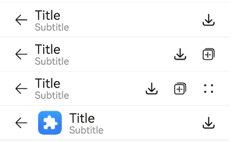
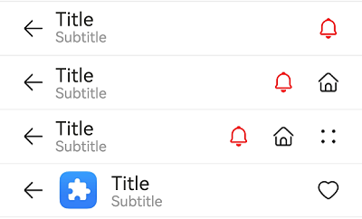

# ComposeTitleBar

<!--Kit: ArkUI-->
<!--Subsystem: ArkUI-->
<!--Owner: @wangrunsen-->
<!--Designer: @YanSanzo-->
<!--Tester: @ybhou1993-->
<!--Adviser: @Brilliantry_Rui-->
<!-- md-trans-meta sourceCommit=4c495f520711bb7a7c0f878dd925391606600e97 translatedAt=2026-07-29T02:55:01.639Z pushedAt=2026-08-04T02:46:46.370Z -->

**ComposeTitleBar** is a standard title bar component that supports setting a title, avatar (optional), and subtitle (optional). It can be used on first-level pages, as well as second-level and higher pages to display a back button. It helps quickly build a unified-style title bar, simplifies page development, supports flexible menu item configuration and icon customization, and helps developers quickly implement navigation and operation entry points.

> **NOTE**
>
> - This component is supported since API version 10. Updates will be marked with a superscript to indicate their earliest API version.
>
> - This component can be used only in the stage model.
>
> - If the **ComposeTitleBar** component has [universal attributes](ts-component-general-attributes.md) and [universal events](ts-component-general-events.md) configured, the compiler toolchain automatically generates an additional \_\_Common\_\_ node and mounts the universal attributes and universal events on this node rather than the **ComposeTitleBar** component itself. As a result, the configured universal attributes and universal events may fail to take effect or behave as intended. For this reason, avoid using universal attributes and events with the **ComposeTitleBar** component.

## Modules to Import

```ts
import { ComposeTitleBar } from '@kit.ArkUI';
```

## Child Components

Not supported

## ComposeTitleBar

ComposeTitleBar({item?: ComposeTitleBarMenuItem, title: ResourceStr, subtitle?: ResourceStr, menuItems?: Array&lt;ComposeTitleBarMenuItem&gt;})

**Decorator**: @Component

**Atomic service API**: This API can be used in atomic services since API version 11.

**System capability**: SystemCapability.ArkUI.ArkUI.Full

**Device behavior differences**: On wearables, calling this API results in a runtime exception indicating that the API is undefined. On other devices, the API works correctly.

| Name| Type| Mandatory| Description|
| -------- | -------- | -------- | -------- |
| item | [ComposeTitleBarMenuItem](#composetitlebarmenuitem) | No | Single menu item for the left avatar. When not set, no avatar is displayed on the left side of the title bar. |
| title | [ResourceStr](ts-types.md#resourcestr) | Yes | Title text of the title bar. |
| subtitle | [ResourceStr](ts-types.md#resourcestr) | No | Subtitle. When not set, no subtitle is displayed. |
| menuItems | Array&lt;[ComposeTitleBarMenuItem](#composetitlebarmenuitem)&gt; | No | List of menu items on the right side. When not set, no menu items are displayed on the right side of the title bar. |

> **NOTE**
> 
> The input parameter cannot be **undefined**, that is, calling **ComposeTitleBar(undefined)** is not allowed.

## ComposeTitleBarMenuItem

**System capability**: SystemCapability.ArkUI.ArkUI.Full

**Device behavior differences**: On wearables, calling this API results in a runtime exception indicating that the API is undefined. On other devices, the API works correctly.

<!--Table: 20%; 20%; 8%; 8%; 44%-->

| Name| Type| Read-Only| Optional| Description|
| -------- | -------- |---|---| -------- |
| value | [ResourceStr](ts-types.md#resourcestr) | No | No | Icon resource. If the **symbolStyle** attribute is also set, **symbolStyle** takes precedence.<br/>**Atomic service API:** This API can be used in atomic services since API version 11. |
| symbolStyle<sup>18+</sup> | [SymbolGlyphModifier](ts-universal-attributes-attribute-symbolglyphmodifier.md#symbolglyphmodifier) | No | Yes | Symbol icon resource, which takes precedence over **value**. This attribute is not supported for the avatar on the left of the item. If not set, the icon resource specified by the **value** attribute is used.<br/>**Atomic service API:** This API can be used in atomic services since API version 18. |
| label<sup>13+</sup> | [ResourceStr](ts-types.md#resourcestr) | No | Yes | Icon label description, used to set auxiliary text information for the icon. When **accessibilityText** is not set, **label** can serve as the default value for the accessibility text.<br/>**Atomic service API:** This API can be used in atomic services since API version 13. |
| isEnabled | boolean | No | Yes | Whether to enable. Default value: **false**.<br/>The value **true** indicates enabled, and **false** indicates disabled.<br/>The **item** parameter does not support triggering the **isEnabled** attribute.<br/>**Atomic service API:** This API can be used in atomic services since API version 11. |
| action | ()&nbsp;=&gt;&nbsp;void | No | Yes | Callback invoked when a menu item is tapped. The **item** parameter does not support triggering the action event.<br/>**Atomic service API:** This API can be used in atomic services since API version 11. |
| accessibilityLevel<sup>18+</sup>       | string  | No | Yes | Accessibility level of the custom button on the right of the title bar, which controls whether the current item can be recognized by accessibility services. This applies only to **items** in **menuItems**, not to the item parameter.<br/>Supported values:<br/>**"auto"**: equivalent to **"yes"**.<br/>**"yes"**: can be recognized by accessibility services.<br/>**"no"**: cannot be recognized by accessibility services.<br/>**"no-hide-descendants"**: neither the current item nor its child components can be recognized.<br/>Default value: **"auto"**. The item parameter does not support setting this attribute.<br/>**Atomic service API:** This API can be used in atomic services since API version 18. |
| accessibilityText<sup>18+</sup>        | [ResourceStr](ts-types.md#resourcestr) | No | Yes | Accessibility text of the custom button on the right of the title bar. When a component has no text attribute, the screen reader does not announce it. After this attribute is set, the screen reader can announce the content, helping users understand the selected component. The **item** attribute does not support setting this attribute.<br/>Default value: when **label** is set, the default value is the content of the **label** attribute of the current item; when **label** is not set, the default value is an empty string.<br/>**Atomic service API:** This API can be used in atomic services since API version 18.                                     |
| accessibilityDescription<sup>18+</sup> | [ResourceStr](ts-types.md#resourcestr) | No | Yes | Accessibility description of the custom button on the right of the title bar, used to explain the component function and operation consequences to users in detail. When the component is selected, the system announces the text attribute first, and then the accessibility description. The item attribute does not support setting this attribute.<br/>Default value: "Double-tap with one finger to execute".<br/>**Atomic service API:** This API can be used in atomic services since API version 18.           |

## Events

The [universal events](ts-component-general-events.md) are not supported.

## Example

### Example 1: Implementing a Simple Title Bar

This example showcases how to implement a simple title bar, a title bar with a back arrow, and a title bar with a list of menu items on the right side.

```ts
import { ComposeTitleBar, Prompt, ComposeTitleBarMenuItem } from '@kit.ArkUI';

@Entry
@Component
struct Index {
  // Define an array of menu items for the right side of the title bar.
  private menuItems: Array<ComposeTitleBarMenuItem> = [
    {
      // Resource for the menu icon.
      value: $r('sys.media.ohos_save_button_filled'),
      // Enable the icon.
      isEnabled: true,
      // Action triggered when the menu item is clicked.
      action: () => Prompt.showToast({ message: 'icon 1' }),
    },
    {
      value: $r('sys.media.ohos_ic_public_copy'),
      isEnabled: true,
      action: () => Prompt.showToast({ message: 'icon 2' }),
    },
    {
      value: $r('sys.media.ohos_ic_public_edit'),
      isEnabled: true,
      action: () => Prompt.showToast({ message: 'icon 3' }),
    },
    {
      value: $r('sys.media.ohos_ic_public_remove'),
      isEnabled: true,
      action: () => Prompt.showToast({ message: 'icon 4' }),
    },
  ]

  build() {
    Row() {
      Column() {
        // Divider.
        Divider().height(2).color(0xCCCCCC)
        ComposeTitleBar({
          title: 'Title',
          subtitle: 'Subtitle',
          menuItems: this.menuItems.slice(0, 1),
        })
        Divider().height(2).color(0xCCCCCC)
        ComposeTitleBar({
          title: 'Title',
          subtitle: 'Subtitle',
          menuItems: this.menuItems.slice(0, 2),
        })
        Divider().height(2).color(0xCCCCCC)
        ComposeTitleBar({
          title: 'Title',
          subtitle: 'Subtitle',
          menuItems: this.menuItems,
        })
        Divider().height(2).color(0xCCCCCC)
        // Define the title bar with a profile picture.
        ComposeTitleBar({
          menuItems: [{
            isEnabled: true, value: $r('sys.media.ohos_save_button_filled'),
            action: () => Prompt.showToast({ message: 'icon' }),
          }],
          title: 'Title',
          subtitle: 'Subtitle',
          item: { isEnabled: true, value: $r('sys.media.ohos_app_icon') }
        })
        Divider().height(2).color(0xCCCCCC)
      }
    }.height('100%')
  }
}
```


### Example 2: Implementing Screen Reader Announcement for the Custom Button on the Right Side

This example customizes the screen reader announcement text by setting the **accessibilityText**, **accessibilityDescription**, and **accessibilityLevel** properties of the custom button on the right side of the title bar. This functionality is supported since API version 18.

```ts
import { ComposeTitleBar, Prompt, ComposeTitleBarMenuItem } from '@kit.ArkUI';

@Entry
@Component
struct Index {
  // Define an array of menu items for the right side of the title bar.
  private menuItems: Array<ComposeTitleBarMenuItem> = [
    {
      // Resource for the menu icon.
      value: $r('sys.media.ohos_save_button_filled'),
      // Enable the icon.
      isEnabled: true,
      // Action triggered when the menu item is clicked.
      action: () => Prompt.showToast({ message: 'icon 1' }),
      // The screen reader will prioritize this text over the label.
      accessibilityText: 'Save',
      // The screen reader can focus on this item.
      accessibilityLevel: 'yes',
      // The screen reader will ultimately announce this text.
      accessibilityDescription: 'Tap to save the current content',
    },
    {
      value: $r('sys.media.ohos_ic_public_copy'),
      isEnabled: true,
      action: () => Prompt.showToast({ message: 'icon 2' }),
      accessibilityText: 'Copy',
      // The screen reader will not focus on this item.
      accessibilityLevel: 'no',
      accessibilityDescription: 'Tap to copy the current content',
    },
    {
      value: $r('sys.media.ohos_ic_public_edit'),
      isEnabled: true,
      action: () => Prompt.showToast({ message: 'icon 3' }),
      accessibilityText: 'Edit',
      accessibilityLevel: 'yes',
      accessibilityDescription: 'Tap to edit the current content',
    },
    {
      value: $r('sys.media.ohos_ic_public_remove'),
      isEnabled: true,
      action: () => Prompt.showToast({ message: 'icon 4' }),
      accessibilityText: 'Remove',
      accessibilityLevel: 'yes',
      accessibilityDescription: 'Tap to remove the current content',
    },
  ]

  build() {
    Row() {
      Column() {
        // Divider.
        Divider().height(2).color(0xCCCCCC)
        ComposeTitleBar({
          title: 'Title',
          subtitle: 'Subtitle',
          menuItems: this.menuItems.slice(0, 1),
        })
        Divider().height(2).color(0xCCCCCC)
        ComposeTitleBar({
          title: 'Title',
          subtitle: 'Subtitle',
          menuItems: this.menuItems.slice(0, 2),
        })
        Divider().height(2).color(0xCCCCCC)
        ComposeTitleBar({
          title: 'Title',
          subtitle: 'Subtitle',
          menuItems: this.menuItems,
        })
        Divider().height(2).color(0xCCCCCC)
        // Define the title bar with a profile picture.
        ComposeTitleBar({
          menuItems: [{
            isEnabled: true, value: $r('sys.media.ohos_save_button_filled'),
            action: () => Prompt.showToast({ message: 'icon' }),
          }],
          title: 'Title',
          subtitle: 'Subtitle',
          item: { isEnabled: true, value: $r('sys.media.ohos_app_icon') },
        })
        Divider().height(2).color(0xCCCCCC)
      }
    }.height('100%')
  }
}
```



### Example 3: Setting the Symbol Icon

This example demonstrates how to use **symbolStyle** in **ComposeTitleBarMenuItem** to set custom symbol icons. This functionality is supported since API version 18.

```ts
import { ComposeTitleBar, Prompt, ComposeTitleBarMenuItem, SymbolGlyphModifier } from '@kit.ArkUI';

@Entry
@Component
struct Index {
  // Define an array of menu items for the right side of the title bar.
  private menuItems: Array<ComposeTitleBarMenuItem> = [
    {
      // Resource for the menu icon.
      value: $r('sys.symbol.house'),
      // Menu symbol icon
      symbolStyle: new SymbolGlyphModifier($r('sys.symbol.bell')).fontColor([Color.Red]),
      // Enable the icon.
      isEnabled: true,
      // Action triggered when the menu item is clicked.
      action: () => Prompt.showToast({ message: 'symbol icon 1' }),
    },
    {
      value: $r('sys.symbol.house'),
      isEnabled: true,
      action: () => Prompt.showToast({ message: 'symbol icon 2' }),
    },
    {
      value: $r('sys.symbol.car'),
      symbolStyle: new SymbolGlyphModifier($r('sys.symbol.heart')).fontColor([Color.Pink]),
      isEnabled: true,
      action: () => Prompt.showToast({ message: 'symbol icon 3' }),
    },
    {
      value: $r('sys.symbol.car'),
      isEnabled: true,
      action: () => Prompt.showToast({ message: 'symbol icon 4' }),
    },
  ]

  build() {
    Row() {
      Column() {
        // Divider.
        Divider().height(2).color(0xCCCCCC)
        ComposeTitleBar({
          title: 'Title',
          subtitle: 'Subtitle',
          menuItems: this.menuItems.slice(0, 1),
        })
        Divider().height(2).color(0xCCCCCC)
        ComposeTitleBar({
          title: 'Title',
          subtitle: 'Subtitle',
          menuItems: this.menuItems.slice(0, 2),
        })
        Divider().height(2).color(0xCCCCCC)
        ComposeTitleBar({
          title: 'Title',
          subtitle: 'Subtitle',
          menuItems: this.menuItems,
        })
        Divider().height(2).color(0xCCCCCC)
        // Define the title bar with a profile picture.
        ComposeTitleBar({
          menuItems: [{
            isEnabled: true, value: $r('sys.symbol.heart'),
            action: () => Prompt.showToast({ message: 'symbol icon 1' }),
          }],
          title: 'Title',
          subtitle: 'Subtitle',
          item: { isEnabled: true, value: $r('sys.media.ohos_app_icon') },
        })
        Divider().height(2).color(0xCCCCCC)
      }
    }.height('100%')
  }
}
```

