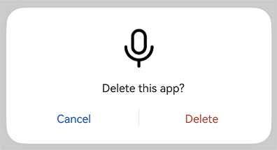
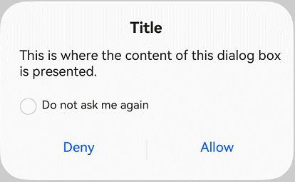
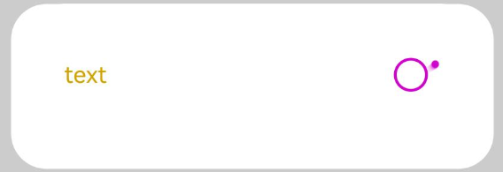
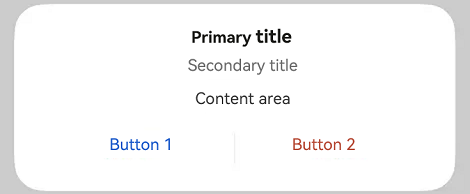
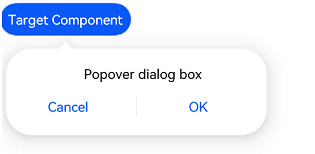

#  Dialog Box (Dialog)

<!--Kit: ArkUI-->
<!--Subsystem: ArkUI-->
<!--Owner: @wangrunsen-->
<!--Designer: @YanSanzo-->
<!--Tester: @ybhou1993-->
<!--Adviser: @Brilliantry_Rui-->
<!-- md-trans-meta sourceCommit=8e22c68cdd7ecb0668db21c4312cda839c2cdaa0 translatedAt=2026-07-29T02:58:30.874Z pushedAt=2026-08-04T02:46:49.772Z -->

A dialog is a modal window that temporarily displays information that requires user attention or actions that need to be performed, while preserving the current context. Users must complete the interaction before exiting this modal state.

> **NOTE**
>
> - This component is supported since API version 10. Updates will be marked with a superscript to indicate their earliest API version.
>
> - This component can be used only in the stage model.
>
> - If the **Dialog** component has [universal attributes](ts-component-general-attributes.md) and [universal events](ts-component-general-events.md) configured, the compiler toolchain automatically generates an additional \_\_Common\_\_ node and mounts the universal attributes and universal events on this node rather than the **Dialog** component itself. As a result, the configured universal attributes and universal events may fail to take effect or behave as intended. For this reason, avoid using universal attributes and events with the **Dialog** component.

## Modules to Import

```ts
import { TipsDialog, SelectDialog, ConfirmDialog, AlertDialog, LoadingDialog, CustomContentDialog } from '@kit.ArkUI';
```

## Child Components

Not supported

## TipsDialog

TipsDialog({controller: CustomDialogController, imageRes: ResourceStr | PixelMap, imageSize?: SizeOptions, title?: ResourceStr, content?: ResourceStr, checkTips?: ResourceStr, isChecked?: boolean, checkAction?: (isChecked: boolean) => void, onCheckedChange?: Callback\<boolean>, primaryButton?: ButtonOptions, secondaryButton?: ButtonOptions, theme?: Theme | CustomTheme, themeColorMode?: ThemeColorMode})

Defines a tip dialog box used to remind users to pay attention to specific matters or perform confirmation operations.

**Decorator type**: @CustomDialog

**System capability**: SystemCapability.ArkUI.ArkUI.Full

| Name                         | Type                                                                                                                                 | Mandatory| Decorator| Description                                                                                                                                                                 |
| ----------------------------- |-------------------------------------------------------------------------------------------------------------------------------------| ---- | ---------- |---------------------------------------------------------------------------------------------------------------------------------------------------------------------|
| controller                    | [CustomDialogController](ts-methods-custom-dialog-box.md#customdialogcontroller)                                                    | Yes | -          | Tip pop-up dialog box controller, used to control the show and hide of the dialog box.<br/>**Note:** The **@Require** decorator is not used, and parameters are not mandatorily validated during construction.<br/>**Atomic service API:** This API can be used in atomic services since API version 11.                                                                 |
| imageRes                      | [ResourceStr](ts-types.md#resourcestr) \| [PixelMap](../../apis-image-kit/arkts-apis-image-PixelMap.md) | Yes   | -          | Image displayed.<br/>**Atomic service API:** This API can be used in atomic services since API version 11.                                                                                                          |
| imageSize                     | [SizeOptions](ts-types.md#sizeoptions)                                                                                              | No  | -          | Image size.<br>Default value: **64*64vp**<br>**Atomic service API**: This API can be used in atomic services since API version 11.                                                                                       |
| title                         | [ResourceStr](ts-types.md#resourcestr)                                                                                              | No  | -          | Title of the dialog box.<br>If this parameter is not set or is set to **undefined**, the title is not displayed.<br>  **NOTE**<br>If the title exceeds two lines, it will be truncated with an ellipsis (...).<br>**Atomic service API**: This API can be used in atomic services since API version 11.                                       |
| content                       | [ResourceStr](ts-types.md#resourcestr)                                                                                              | No  | -          | Content of the dialog box.<br>If this parameter is not set or is set to **undefined**, the content is not displayed.<br>**Atomic service API**: This API can be used in atomic services since API version 11.                                                                      |
| checkTips                     | [ResourceStr](ts-types.md#resourcestr)                                                                                              | No  | -          | Content of the check box.<br>If this parameter is not set or is set to **undefined**, the check box content is not displayed.<br>**Atomic service API**: This API can be used in atomic services since API version 11.                                                                 |
| isChecked                     | boolean                                                                                                                             | No   | \@Prop     | When **isChecked** is **true**, the checkbox is selected; when **isChecked** is **false**, the checkbox is unselected.<br/>Default value: **false**<br/>**Atomic service API:** This API can be used in atomic services since API version 11.                                                     |
| checkAction<sup>12+</sup>     | (isChecked: boolean) => void                                                                                                        | No   | -          | State change event of the checkbox. When **isChecked** is **true**, the checkbox is selected; when **isChecked** is **false**, the checkbox is unselected.<br/>**Note:** It is recommended to use onCheckedChange<sup>12+</sup>.<br/>**Atomic service API:** This API can be used in atomic services since API version 12. |
| onCheckedChange<sup>12+</sup> | [Callback](ts-types.md#callback12)\<boolean>                                                                                        | No  | -          | Callback invoked when the checked state of the checkbox changes. The callback parameter is of the boolean type. The value **true** indicates that the checkbox is checked, and **false** indicates that the checkbox is not checked.<br>**Atomic service API**: This API can be used in atomic services since API version 12.              |
| primaryButton                 | [ButtonOptions](#buttonoptions)                                                                                                     | No  | -          | Left button of the dialog box.<br>If this parameter is not set or is set to **undefined**, the left button is not displayed.<br>**Atomic service API**: This API can be used in atomic services since API version 11.                                                                             |
| secondaryButton               | [ButtonOptions](#buttonoptions)                                                                                                     | No  | -          | Right button of the dialog box.<br>If this parameter is not set or is set to **undefined**, the right button is not displayed.<br>**Atomic service API**: This API can be used in atomic services since API version 11.                                                                                  |
| theme<sup>12+</sup>           | [Theme](../js-apis-arkui-theme.md#theme) \| [CustomTheme](../js-apis-arkui-theme.md#customtheme)                                    | No  | -          | Theme information, which can be a custom theme or a **Theme** instance obtained from **onWillApplyTheme**.<br>**Atomic service API**: This API can be used in atomic services since API version 12.                                                              |
| themeColorMode<sup>12+</sup>  | [ThemeColorMode](ts-universal-attributes-foreground-blur-style.md#themecolormode)                                                                   | No| -     | Theme color mode of the dialog box.<br>Default value: **ThemeColorMode.SYSTEM**<br>**Atomic service API**: This API can be used in atomic services since API version 12.                                                                      |

## SelectDialog

SelectDialog({controller: CustomDialogController, title: ResourceStr, content?: ResourceStr, selectedIndex?: number, confirm?: ButtonOptions, radioContent: Array&lt;SheetInfo&gt;, theme?: Theme | CustomTheme, themeColorMode?: ThemeColorMode})

Displays a dialog box from which the user can select options presented in a list or grid.

**Decorator type**: @CustomDialog

**System capability**: SystemCapability.ArkUI.ArkUI.Full

| Name               | Type                                                        | Mandatory| Description                                                                                                                     |
| ------------------- | ------------------------------------------------------------ | ---- |-------------------------------------------------------------------------------------------------------------------------|
| controller | [CustomDialogController](ts-methods-custom-dialog-box.md#customdialogcontroller) | Yes | Controller of the selection dialog box, used to control the show and hide of the dialog box.<br/>**Note:** The **@Require** decorator is not used, and mandatory validation is not performed on the parameter during construction.<br/>**Atomic service API:** This API can be used in atomic services since API version 11. |
| title               | [ResourceStr](ts-types.md#resourcestr)                       | Yes  | Title of the dialog box.<br> **NOTE**<br>If the title exceeds two lines, it will be truncated with an ellipsis (...).<br>**Atomic service API**: This API can be used in atomic services since API version 11.                                                           |
| content             | [ResourceStr](ts-types.md#resourcestr)                       | No  | Content of the dialog box.<br>If this parameter is not set or is set to **undefined**, the content is not displayed.<br>**Atomic service API**: This API can be used in atomic services since API version 11.                                                           |
| selectedIndex       | number                                                       | No  | Index of the selected option in the dialog box.<br>Value range: an integer no less than -1<br>The default value is **-1**, indicating that there is no selected option. Values less than -1 are treated as no selected option.<br>**Atomic service API**: This API can be used in atomic services since API version 11.|
| confirm | [ButtonOptions](#buttonoptions) | No | Bottom button of the selection dialog box.<br/>When not set by default or set to **undefined**, the bottom button is not displayed.<br/>**Atomic service API:** This API can be used in atomic services since API version 11. |
| radioContent        | Array&lt;[SheetInfo](ts-methods-action-sheet.md#sheetinfo)&gt; | Yes  | List of subitems in the dialog box. You can set text and a select callback for each subitem.<br>**Atomic service API**: This API can be used in atomic services since API version 11.                                  |
| theme<sup>12+</sup> | [Theme](../js-apis-arkui-theme.md#theme) \| [CustomTheme](../js-apis-arkui-theme.md#customtheme) | No  | Theme information, which can be a custom theme or a **Theme** instance obtained from **onWillApplyTheme**.<br>**Atomic service API**: This API can be used in atomic services since API version 12.                  |
| themeColorMode<sup>12+</sup> | [ThemeColorMode](ts-universal-attributes-foreground-blur-style.md#themecolormode) | No| Theme color mode of the dialog box.<br>Default value: **ThemeColorMode.SYSTEM**<br>**Atomic service API**: This API can be used in atomic services since API version 12.                                                        |

## ConfirmDialog

ConfirmDialog({controller: CustomDialogController, title: ResourceStr, content?: ResourceStr, checkTips?: ResourceStr, isChecked?: boolean, onCheckedChange?: Callback\<boolean>, primaryButton?: ButtonOptions, secondaryButton?: ButtonOptions, theme?: Theme | CustomTheme, themeColorMode?: ThemeColorMode})

Defines a confirmation dialog box used to provide error feedback or prompt information when an operation is not correctly executed (for example, a network error or low battery level) or when an incorrect operation is performed (for example, fingerprint enrollment).

**Decorator type**: @CustomDialog

**System capability**: SystemCapability.ArkUI.ArkUI.Full

| Name                         | Type                                                                                              | Mandatory| Decorator| Description                                                                                                                                                  |
| ----------------------------- |--------------------------------------------------------------------------------------------------| ---- | ---------- |------------------------------------------------------------------------------------------------------------------------------------------------------|
| controller                    | [CustomDialogController](ts-methods-custom-dialog-box.md#customdialogcontroller)                 | Yes | -          | Confirmation dialog box controller, used to control the show and hide of the dialog box.<br/>**Note:** When **@Require** is not used, mandatory validation is not performed on the parameter during construction.<br/>**Atomic service API:** This API can be used in atomic services since API version 11.                                                  |
| title                         | [ResourceStr](ts-types.md#resourcestr)                                                           | Yes  | -          | Title of the dialog box.<br>**NOTE**<br>If the title exceeds two lines, it will be truncated with an ellipsis (...).<br> **Atomic service API**: This API can be used in atomic services since API version 11.                                                           |
| content                       | [ResourceStr](ts-types.md#resourcestr)                                                           | No  | -          | Content of the dialog box.<br>If this parameter is not set or is set to **undefined**, the content is not displayed.<br>**Atomic service API**: This API can be used in atomic services since API version 11.                                                                 |
| checkTips                     | [ResourceStr](ts-types.md#resourcestr)                                                           | No   | -          | Tip content of the checkbox.<br/>When not set by default or set to **undefined**, the tip content of the checkbox is not displayed.<br/>**Note:** When the tip content is not set, the checkbox is also displayed.<br/>**Atomic service API:** This API can be used in atomic services since API version 11.                                                                                   |
| isChecked                     | boolean                                                                                          | No   | \@Prop     | Whether the checkbox is selected. The value **true** means selected, and **false** means unselected.<br/>Default value: **false**<br/>**Atomic service API:** This API can be used in atomic services since API version 11.                                      |
| onCheckedChange<sup>12+</sup> | [Callback](ts-types.md#callback12)\<boolean>                                                     | No  | -          | Callback invoked when the checked state of the checkbox changes. The callback parameter is of the boolean type. The value **true** indicates that the checkbox is checked, and **false** indicates that the checkbox is not checked.<br>**Atomic service API**: This API can be used in atomic services since API version 12.|
| primaryButton                 | [ButtonOptions](#buttonoptions)                                                                  | No  | -          | Left button of the dialog box.<br>If this parameter is not set or is set to **undefined**, the left button is not displayed.<br>**Atomic service API**: This API can be used in atomic services since API version 11.                                                                                        |
| secondaryButton               | [ButtonOptions](#buttonoptions)                                                                  | No  | -          | Right button of the dialog box.<br>If this parameter is not set or is set to **undefined**, the right button is not displayed.<br>**Atomic service API**: This API can be used in atomic services since API version 11.                                                                                        |
| theme<sup>12+</sup>           | [Theme](../js-apis-arkui-theme.md#theme) \| [CustomTheme](../js-apis-arkui-theme.md#customtheme) | No  | -          | Theme information, which can be a custom theme or a **Theme** instance obtained from **onWillApplyTheme**.<br>**Atomic service API**: This API can be used in atomic services since API version 12.                                               |
| themeColorMode<sup>12+</sup>  | [ThemeColorMode](ts-universal-attributes-foreground-blur-style.md#themecolormode)                                | No| -     | Theme color mode of the dialog box.<br>Default value: **ThemeColorMode.SYSTEM**<br>**Atomic service API**: This API can be used in atomic services since API version 12.                                                       |

## AlertDialog

AlertDialog({controller: CustomDialogController, primaryTitle?: ResourceStr, secondaryTitle?: ResourceStr, content: ResourceStr, primaryButton?: ButtonOptions, secondaryButton?: ButtonOptions, theme?: Theme | CustomTheme, themeColorMode?: ThemeColorMode})

Defines an alert dialog box used to warn the user when triggering an irreversible operation that will have serious consequences (such as deletion, reset, cancel editing, stop, etc.).

**Decorator type**: @CustomDialog

**System capability**: SystemCapability.ArkUI.ArkUI.Full

| Name                        | Type                                                        | Mandatory| Description                                                                                                              |
| ---------------------------- | ------------------------------------------------------------ | ---- |------------------------------------------------------------------------------------------------------------------|
| controller                   | [CustomDialogController](ts-methods-custom-dialog-box.md#customdialogcontroller) | Yes | Alert dialog box controller, used to control the show and hide of the dialog box.<br/>**Note:** The **@Require** decorator is not used, and mandatory validation is not performed during construction.<br/>**Atomic service API:** This API can be used in atomic services since API version 11.              |
| primaryTitle<sup>12+</sup>   | [ResourceStr](ts-types.md#resourcestr)                       | No   | Primary title of the alert dialog box.<br/>This parameter is not set or set to **undefined** by default, indicating the primary title of the alert dialog box is not displayed.<br/>**Note:** If the title exceeds two lines, "..." is displayed.<br/>**Atomic service API:** This API can be used in atomic services since API version 12. |
| secondaryTitle<sup>12+</sup> | [ResourceStr](ts-types.md#resourcestr)                       | No   | Secondary title of the alert dialog box.<br/>This parameter is not set or set to **undefined** by default, indicating the secondary title of the alert dialog box is not displayed.<br/>**Note:** If the title exceeds two lines, "..." is displayed.<br/>**Atomic service API:** This API can be used in atomic services since API version 12. |
| content                      | [ResourceStr](ts-types.md#resourcestr)                       | Yes   | Content of the alert dialog box.<br/>**Atomic service API:** This API can be used in atomic services since API version 11.                             |
| primaryButton                | [ButtonOptions](#buttonoptions)                              | No   | Left button of the alert dialog box.<br/>This parameter is not set or set to **undefined** by default, indicating the left button of the alert dialog box is not displayed.<br/>**Atomic service API:** This API can be used in atomic services since API version 11.                                                     |
| secondaryButton              | [ButtonOptions](#buttonoptions)                              | No   | Right button of the alert dialog box.<br/>This parameter is not set or set to **undefined** by default, indicating the right button of the alert dialog box is not displayed.<br/>**Atomic service API:** This API can be used in atomic services since API version 11.                                                     |
| theme<sup>12+</sup>          | [Theme](../js-apis-arkui-theme.md#theme) \| [CustomTheme](../js-apis-arkui-theme.md#customtheme) | No  | Theme information, which can be a custom theme or a **Theme** instance obtained from **onWillApplyTheme**.<br>**Atomic service API**: This API can be used in atomic services since API version 12.           |
| themeColorMode<sup>12+</sup> | [ThemeColorMode](ts-universal-attributes-foreground-blur-style.md#themecolormode) | No| Theme color mode of the dialog box.<br>Default value: **ThemeColorMode.SYSTEM**<br>**Atomic service API**: This API can be used in atomic services since API version 12.                                                 |

## LoadingDialog

LoadingDialog({Controller: CustomDialogController, content?: ResourceStr, theme?: Theme | CustomTheme, themeColorMode?: ThemeColorMode})

Displays a loading dialog box to inform the user of the operation progress.

**Decorator type**: @CustomDialog

**System capability**: SystemCapability.ArkUI.ArkUI.Full

| Name               | Type                                                                                              | Mandatory| Description                                                                                                   |
| ------------------- |--------------------------------------------------------------------------------------------------| ---- |-------------------------------------------------------------------------------------------------------|
| Controller         | [CustomDialogController](ts-methods-custom-dialog-box.md#customdialogcontroller)                 | Yes | Controller of the loading dialog box, used to control the show and hide of the dialog box.<br/>**Note:** The **@Require** decorator is not used, and mandatory validation is not performed during construction.<br/>**Atomic service API:** This API can be used in atomic services since API version 11.   |
| content             | [ResourceStr](ts-types.md#resourcestr)                                                           | No  | Content of the loading dialog box.<br> If this parameter is not set or is set to **undefined**, the content is not displayed.<br> **Atomic service API**: This API can be used in atomic services since API version 11.                |
| theme<sup>12+</sup> | [Theme](../js-apis-arkui-theme.md#theme) \| [CustomTheme](../js-apis-arkui-theme.md#customtheme) | No  | Theme information, which can be a custom theme or a **Theme** instance obtained from **onWillApplyTheme**.<br>**Atomic service API**: This API can be used in atomic services since API version 12.|
| themeColorMode<sup>12+</sup> | [ThemeColorMode](ts-universal-attributes-foreground-blur-style.md#themecolormode)                                | No| Theme color mode of the dialog box.<br>Default value: **ThemeColorMode.SYSTEM**<br>**Atomic service API**: This API can be used in atomic services since API version 12.       |

## CustomContentDialog<sup>12+</sup>

CustomContentDialog({controller: CustomDialogController, contentBuilder: () => void, primaryTitle?: ResourceStr, secondaryTitle?: ResourceStr, localizedContentAreaPadding?: LocalizedPadding, contentAreaPadding?: Padding, buttons?: ButtonOptions[], theme?: Theme | CustomTheme, themeColorMode?: ThemeColorMode})

Displays a dialog box that contains custom content and operation area.

**Decorator type**: @CustomDialog

**Atomic service API**: This API can be used in atomic services since API version 12.

**System capability**: SystemCapability.ArkUI.ArkUI.Full

| Name               | Type                                                                                              | Mandatory| Decorator| Description                                                        |
| ------------------- |--------------------------------------------------------------------------------------------------| ---- | ------------------------------------------------------------ | ------------------------------------------------------------ |
| controller          | [CustomDialogController](ts-methods-custom-dialog-box.md#customdialogcontroller)                 | Yes | -  | Dialog controller used to control the show and hide of the dialog box.<br/>**Note:** Not decorated by **@Require**, and the parameter is not subject to mandatory validation during construction.                                             |
| contentBuilder      | () => void                                                                                       | Yes   | @BuilderParam | Component builder function used to construct the content area of the dialog box.                                                 |
| primaryTitle        | [ResourceStr](ts-types.md#resourcestr)                                                           | No  | -  | Primary title of the dialog box.<br> If this parameter is not set or is set to **undefined**, the primary title is not displayed.<br> **NOTE**<br>If the title exceeds two lines, it will be truncated with an ellipsis (...).                                                |
| secondaryTitle      | [ResourceStr](ts-types.md#resourcestr)                                                           | No  | -  | Secondary title of the dialog box.<br> If this parameter is not set or is set to **undefined**, the secondary title is not displayed.<br> **NOTE**<br>If the title exceeds two lines, it will be truncated with an ellipsis (...).                                            |
| localizedContentAreaPadding | [LocalizedPadding](ts-types.md#localizedpadding12)                                               | No   | -  | Padding of the content area of the dialog box, which supports adaptation based on language direction. When this attribute is set, **contentAreaPadding** does not take effect.                                         |
| contentAreaPadding  | [Padding](ts-types.md#padding)                                                                   | No  | -  | Padding of the content area of the dialog box. This attribute does not take effect when **localizedContentAreaPadding** is set.|
| buttons             | [ButtonOptions](#buttonoptions)[]                                                                | No  | -  | Buttons in the operation area of the dialog box. A maximum of four buttons are allowed.                         |
| theme | [Theme](../js-apis-arkui-theme.md#theme) \| [CustomTheme](../js-apis-arkui-theme.md#customtheme) | No  | -  | Theme information, which can be a custom theme or a **Theme** instance obtained from **onWillApplyTheme**.|
| themeColorMode | [ThemeColorMode](ts-universal-attributes-foreground-blur-style.md#themecolormode)                                | No | - | Light/dark mode of the custom dialog box.<br/>Default value: **ThemeColorMode.SYSTEM**. |

>  **NOTE**
>
> When the height of the dialog box is insufficient, the area defined by **contentBuilder** will be compressed. Global scrolling will be enabled if the compressed area's height falls below 100 vp.
>
> You must define scrolling of the content area in **CustomContentDialog**. In addition, the custom scrolling of the content area must be used in conjunction with the **nestedScroll** property, as in the **nestedScroll({ scrollForward: NestedScrollMode.PARALLEL, scrollBackward: NestedScrollMode.PARALLEL })** example.

## PopoverDialog<sup>14+</sup>

PopoverDialog({visible: boolean, popover: PopoverOptions, targetBuilder: Callback\<void>})

Defines a follow-hand dialog box that pops up based on the position of the target component. The aforementioned **TipsDialog**, **SelectDialog**, **ConfirmDialog**, **AlertDialog**, **LoadingDialog**, and **CustomContentDialog** can all serve as the content of the dialog box.

**Decorator**: \@Component

**Atomic service API**: This API can be used in atomic services since API version 14.

**System capability**: SystemCapability.ArkUI.ArkUI.Full

| Name| Type| Mandatory| Decorator| Description|
| -------- | -------- | -------- | -------- | -------- |
| visible | boolean | Yes | @Link | Whether to show the follow-hand dialog box. The value **true** means to show the dialog box, and **false** means to hide it.<br/>The default value is **false**. |
| popover | [PopoverOptions](#popoveroptions14) | Yes | @Prop<br/>@Require | Parameters of the follow-hand dialog box, including the dialog box content, position, and other attributes. For details, see **PopoverOptions** type description. |
| targetBuilder | [Callback](ts-types.md#callback12)\<void> | Yes | @Require<br/>@BuilderParam | Builder function of the target component on which the follow-hand dialog box is based, used to define the reference position component for displaying the dialog box. |

## ButtonOptions

**System capability**: SystemCapability.ArkUI.ArkUI.Full

| Name                     | Type                                                        | Read-Only| Optional| Description                                                                                                                            |
| ------------------------- | ------------------------------------------------------------ |---|---|--------------------------------------------------------------------------------------------------------------------------------|
| value                     | [ResourceStr](ts-types.md#resourcestr)                       | No| No| Content of the button.<br>**Atomic service API**: This API can be used in atomic services since API version 11.                                                                    |
| action                    | ()&nbsp;=&gt;&nbsp;void                                      | No| Yes| Click event of the button.<br>**Atomic service API**: This API can be used in atomic services since API version 11.                                                                  |
| background                | [ResourceColor](ts-types.md#resourcecolor)                   | No| Yes| Background color of the button.<br>The setting follows **buttonStyle** by default.<br>**Atomic service API**: This API can be used in atomic services since API version 11.                                               |
| fontColor                 | [ResourceColor](ts-types.md#resourcecolor)                   | No| Yes| Font color of the button.<br>The setting follows **buttonStyle** by default.<br>**Atomic service API**: This API can be used in atomic services since API version 11.                                              |
| buttonStyle<sup>12+</sup> | [ButtonStyleMode](ts-basic-components-button.md#buttonstylemode11) | No| Yes| Style of the button.<br>Default value: **ButtonStyleMode.NORMAL** for 2-in-1 devices and **ButtonStyleMode.TEXTUAL** for other devices<br>**Atomic service API**: This API can be used in atomic services since API version 12.|
| role<sup>12+</sup>        | [ButtonRole](ts-basic-components-button.md#buttonrole12) | No| Yes| Role of the button.<br>Default value: **ButtonRole.NORMAL**<br>**Atomic service API**: This API can be used in atomic services since API version 12.                                         |
| defaultFocus<sup>18+</sup> | boolean | No| Yes| Whether the button is the default focus.<br>**true**: The button is the default focus.<br>**false**: The button is not the default focus.<br>Default value: **false**.<br>**Atomic service API**: This API can be used in atomic services since API version 18.         |
| textAlign<sup>24+</sup> | [TextAlign](ts-appendix-enums.md#textalign) | No| Yes| Alignment method of the button text.<br>Default value: **TextAlign.Start**<br>**Atomic service API**: This API can be used in atomic services since API version 24.         |

>  **NOTE**
>
>  The priority of **buttonStyle** and **role** is higher than that of **fontColor** and **background**. If **buttonStyle** and **role** are at the default values, the settings of **fontColor** and **background** take effect.
> If **defaultFocus** is set for multiple buttons, the default focus is the first button in the display order that has **defaultFocus** set to **true**.

## PopoverOptions<sup>14+</sup>

Defines a set of options used to configure the popover dialog box, including its content and position.

Inherits [CustomPopupOptions](../arkui-ts/ts-universal-attributes-popup.md#custompopupoptions8).

> **NOTE**
>
> The default value of **radius** is **32vp**.

**Atomic service API**: This API can be used in atomic services since API version 14.

**System capability**: SystemCapability.ArkUI.ArkUI.Full

## Events

The [universal events](ts-component-general-events.md) are not supported.

## Example

### Example 1: Dialog Box with an Image Above Text

This example implements a dialog box with an image above the text content, through the use of **imageRes**, **content**, and other properties.

```ts
import { TipsDialog } from '@kit.ArkUI';

@Entry
@Component
struct Index {
  dialogControllerImage: CustomDialogController = new CustomDialogController({
    builder: TipsDialog({
      imageRes: $r('sys.media.ohos_ic_public_voice'),
      content: 'Delete this app?',
      primaryButton: {
        value: 'Cancel',
        action: () => {
          console.info('Callback when the first button is clicked');
        },
      },
      secondaryButton: {
        value: 'Delete',
        role: ButtonRole.ERROR,
        action: () => {
          console.info('Callback when the second button is clicked');
        }
      },
      onCheckedChange: () => {
        console.info('Callback when the checkbox is clicked');
      }
    }),
  })

  build() {
    Row() {
      Stack() {
        Column(){
          Button("Text Below Image")
            .width(96)
            .height(40)
            .onClick(() => {
              this.dialogControllerImage.open();
            })
        }.margin({bottom: 300})
      }.align(Alignment.Bottom)
      .width('100%').height('100%')
    }
    .backgroundImageSize({ width: '100%', height: '100%' })
    .height('100%')
  }
}
```



### Example 2: List-only Dialog Box

This example presents a dialog box consisting solely of a list defined with **selectedIndex** and **radioContent**.

```ts
import { SelectDialog } from '@kit.ArkUI';

@Entry
@Component
struct Index {
  // Set the index of the default selected option.
  radioIndex: number = 0;
  dialogControllerList: CustomDialogController = new CustomDialogController({
    builder: SelectDialog({
      title:'Title',
      selectedIndex: this.radioIndex,
      confirm: {
        value: 'Cancel',
        action: () => {},
      },
      radioContent: [
        {
          title: 'List item',
          action: () => {
            this.radioIndex = 0;
          }
        },
        {
          title: 'List item',
          action: () => {
            this.radioIndex = 1;
          }
        },
        {
          title: 'List item',
          action: () => {
            this.radioIndex = 2;
          }
        },
      ]
    }),
  })

  build() {
    Row() {
      Stack() {
        Column() {
          Button("List Dialog Box")
            .width(96)
            .height(40)
            .onClick(() => {
              this.dialogControllerList.open();
            })
        }.margin({ bottom: 300 })
      }
      .align(Alignment.Bottom)
      .width('100%')
      .height('100%')
    }
    .backgroundImageSize({ width: '100%', height: '100%' })
    .height('100%')
  }
}
```


### Example 3: Dialog Box with Text and Check Boxes

This example illustrates a dialog box that combines text content with check boxes defined with **content** and **checkTips**.

```ts
import { ConfirmDialog } from '@kit.ArkUI';

@Entry
@Component
struct Index {
  isChecked: boolean = false;
  dialogControllerCheckBox: CustomDialogController = new CustomDialogController({
    builder: ConfirmDialog({
      title:'Title',
      content: 'This is where the content of this dialog box is presented.',
      // Selected state of the check box
      isChecked: this.isChecked,
      // Content of the check box
      checkTips: 'Do not ask me again',
      primaryButton: {
        value: 'Deny',
        action: () => {},
      },
      secondaryButton: {
        value: 'Allow',
        action: () => {
          this.isChecked = false;
          console.info('Callback when the second button is clicked');
        }
      },
      onCheckedChange: () => {
        console.info('Callback when the checkbox is clicked');
      },
    }),
    autoCancel: true,
    alignment: DialogAlignment.Bottom
  })

  build() {
    Row() {
      Stack() {
        Column(){
          Button("Text + Check Box Dialog Box")
            .width(96)
            .height(40)
            .onClick(() => {
              this.dialogControllerCheckBox.open();
            })
        }
        .margin({bottom: 300})
      }
      .align(Alignment.Bottom)
      .width('100%')
      .height('100%')
    }
    .backgroundImageSize({ width: '100%', height: '100%' })
    .height('100%')
  }
}
```



### Example 4: Text-only Dialog Box

This example demonstrates a simple text-only dialog box defined with **primaryTitle**, **secondaryTitle**, and **content**.

```ts
import { AlertDialog } from '@kit.ArkUI';

@Entry
@Component
struct Index {
  dialogControllerConfirm: CustomDialogController = new CustomDialogController({
    builder: AlertDialog({
      primaryTitle: 'Primary title',
      secondaryTitle: 'Secondary title',
      content: 'This is where content is displayed.',
      primaryButton: {
        value: 'Cancel',
        action: () => {
        },
      },
      secondaryButton: {
        value: 'OK',
        role: ButtonRole.ERROR,
        action: () => {
          console.info('Callback when the second button is clicked');
        }
      },
    }),
  })

  build() {
    Row() {
      Stack() {
        Column() {
          Button("Text Dialog Box")
            .width(96)
            .height(40)
            .onClick(() => {
              this.dialogControllerConfirm.open();
            })
        }
        .margin({ bottom: 300 })
      }
      .align(Alignment.Bottom)
      .width('100%')
      .height('100%')
    }
    .backgroundImageSize({ width: '100%', height: '100%' })
    .height('100%')
  }
}
```


### Example 5: Loading Dialog Box

This example implements a loading dialog box that contains a progress indicator.

```ts
import { LoadingDialog } from '@kit.ArkUI';

@Entry
@Component
struct Index {
  dialogControllerProgress: CustomDialogController = new CustomDialogController({
    builder: LoadingDialog({
      content: 'This is where content is displayed.',
    }),
  })

  build() {
    Row() {
      Stack() {
        Column() {
          Button("Loading Dialog Box")
            .width(96)
            .height(40)
            .onClick(() => {
              this.dialogControllerProgress.open();
            })
        }
        .margin({ bottom: 300 })
      }
      .align(Alignment.Bottom)
      .width('100%')
      .height('100%')
    }
    .backgroundImageSize({ width: '100%', height: '100%' })
    .height('100%')
  }
}
```


### Example 6: Dialog Box with a Custom Theme

This example presents a dialog box with a custom theme, through the use of **content**, **theme**, and other properties.

```ts
import { CustomColors, CustomTheme, LoadingDialog } from '@kit.ArkUI';

class CustomThemeImpl implements CustomTheme {
  colors?: CustomColors;

  constructor(colors: CustomColors) {
    this.colors = colors;
  }
}

// Custom text content and colors for the dialog box theme
class CustomThemeColors implements CustomColors {
  fontPrimary = '#ffd0a300';
  iconSecondary = '#ffd000cd';
}

@Entry
@Component
struct Index {
  @State customTheme: CustomTheme = new CustomThemeImpl(new CustomThemeColors());
  dialogController: CustomDialogController = new CustomDialogController({
    builder: LoadingDialog({
      content: 'text',
      theme: this.customTheme,
    })
  });

  build() {
    Row() {
      Stack() {
        Column() {
          Button("dialog")
            .width(96)
            .height(40)
            .onClick(() => {
              this.dialogController.open();
            })
        }
        .margin({ bottom: 300 })
      }
      .align(Alignment.Bottom)
      .width('100%')
      .height('100%')
    }
    .backgroundImageSize({ width: '100%', height: '100%' })
    .height('100%')
  }
}
```



### Example 7: Dialog Box in Custom Color Mode

This example presents a dialog box in the specified light or dark mode, through the use of **content**, **themeColorMode**, and other properties.

```ts
import { LoadingDialog } from '@kit.ArkUI';

@Entry
@Component
struct Index {
  dialogController: CustomDialogController = new CustomDialogController({
    builder: LoadingDialog({
      content: 'Text',
      themeColorMode: ThemeColorMode.DARK, // Set the color mode to dark mode.
    })
  });

  build() {
    Row() {
      Stack() {
        Column() {
          Button("Dialog")
            .width(96)
            .height(40)
            .onClick(() => {
              this.dialogController.open();
            })
        }
        .margin({ bottom: 300 })
      }
      .align(Alignment.Bottom)
      .width('100%')
      .height('100%')
    }
    .backgroundImageSize({ width: '100%', height: '100%' })
    .height('100%')
  }
}
```


### Example 8: Dialog Box with Custom Content

This example implements a dialog box with custom content defined with **contentBuilder** and **buttons**.

```ts
import { CustomContentDialog } from '@kit.ArkUI';

@Entry
@Component
struct Index {
  dialogController: CustomDialogController = new CustomDialogController({
    builder: CustomContentDialog({
      primaryTitle: 'Primary title',
      secondaryTitle: 'Secondary title',
      contentBuilder: () => {
        this.buildContent();
      },
      buttons: [
        { 
          value: 'Button 1',
          buttonStyle: ButtonStyleMode.TEXTUAL, 
          action: () => {
            console.info('Callback when the button is clicked');
          }
        },
        {
          value: 'Button 2',
          buttonStyle: ButtonStyleMode.TEXTUAL,
          role: ButtonRole.ERROR
        }
      ],
    }),
  });

  build() {
    Column() {
      Button("Dialog Box with Custom Content")
        .onClick(() => {
          this.dialogController.open();
        })
    }
    .width('100%')
    .height('100%')
    .justifyContent(FlexAlign.Center)
  }
  
  // Custom content area of the dialog box
  @Builder
  buildContent(): void {
    Column() {
      Text('Content area')
    }
    .width('100%')
  }
}
```



### Example 9: Popover Dialog Box

This example demonstrates a popover dialog box for alert purposes, through the use of **visible**, **popover**, **targetBuilder**, and other properties. This functionality is supported since API version 14.

```ts
import { AlertDialog, PopoverDialog, PopoverOptions } from '@kit.ArkUI';

@Entry
@Component
struct Index {
  @State isShow: boolean = false;
  @State popoverOptions: PopoverOptions = {
    builder: () => {
      this.dialogBuilder();
    },
    width: 320,
  }
  
  // Popover dialog box content
  @Builder dialogBuilder() {
    AlertDialog({
      content: 'Popover dialog box',
      primaryButton: {
        value: 'Cancel',
        action: () => {
          this.isShow = false;
        },
      },
      secondaryButton: {
        value: 'OK',
        action: () => {
          this.isShow = false;
        },
      },
    });
  }
  
  // Builder for the button that triggers the popover dialog box
  @Builder buttonBuilder() {
    Button('Target Component')
    .onClick(() => {
      this.isShow = true;
    });
  }

  build() {
    Column() {
      PopoverDialog({
        visible: this.isShow,
        popover: this.popoverOptions,
        targetBuilder: () => {
          this.buttonBuilder();
        },
      })
    }
  }
}
```



### Example 10: Setting the Default Focus Button for a Dialog Box

This example demonstrates how to set the button that receives focus by default in a dialog box using **AlertDialog**, including the **defaultFocus** property. This functionality is supported since API version 18.

```ts
import { AlertDialog } from '@kit.ArkUI';

@Entry
@Component
struct Index {
  dialogController: CustomDialogController = new CustomDialogController({
    builder: AlertDialog({
      primaryTitle: 'AlertDialog',
      secondaryTitle: 'Subtitle',
      content: 'The second button gains focus by default.',
      primaryButton: {
        value: 'DEFAULT',
        action: () => {}
      },
      secondaryButton: {
        value: 'TRUE',
        defaultFocus: true, // Set the button as the default focus button.
        action: () => {}
      },
    })
  });

  build() {
    Row() {
      Stack() {
        Column() {
          Button("AlertDialog")
            .width(96)
            .height(40)
            .onClick(() => {
              this.dialogController.open();
            })
        }
        .margin({ bottom: 300 })
      }
      .align(Alignment.Bottom)
      .width('100%')
      .height('100%')
    }
    .backgroundImageSize({ width: '100%', height: '100%' })
    .height('100%')
  }
}
```

