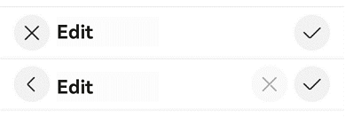
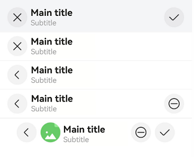
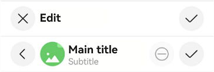
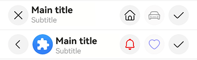

# EditableTitleBar

<!--Kit: ArkUI-->
<!--Subsystem: ArkUI-->
<!--Owner: @wangrunsen-->
<!--Designer: @YanSanzo-->
<!--Tester: @ybhou1993-->
<!--Adviser: @Brilliantry_Rui-->
<!-- md-trans-meta sourceCommit=4c495f520711bb7a7c0f878dd925391606600e97 translatedAt=2026-07-29T03:01:05.376Z pushedAt=2026-08-04T02:46:51.771Z -->

An editable title bar component that provides a standard title bar implementation for editing scenarios. It supports custom left button types (back/cancel), profile picture display, right-side menu items, background blur styles, and other features. It is suitable for scenarios requiring content editing and multi-selection operations, such as album multi-select editing, text editors, and form editing pages. This component encapsulates common UI interaction patterns for editing scenarios (left close, right confirm), so developers do not need to implement the title bar layout and interaction logic themselves. It enables rapid construction of editing pages that comply with design specifications, improving development efficiency and ensuring UI consistency. It also supports accessibility property configuration to meet accessibility requirements.

> **NOTE**
>
> - This component is supported since API version 10. Updates will be marked with a superscript to indicate their earliest API version.
>
> - This component can be used only in the stage model.
>
> - If the **EditableTitleBar** component has [universal attributes](ts-component-general-attributes.md) and [universal events](ts-component-general-events.md) configured, the compiler toolchain automatically generates an additional \_\_Common\_\_ node and mounts the universal attributes and universal events on this node rather than the **EditableTitleBar** component itself. As a result, the configured universal attributes and universal events may fail to take effect or behave as intended. For this reason, avoid using universal attributes and events with the **EditableTitleBar** component.

## Modules to Import

```ts
import { EditableTitleBar } from '@kit.ArkUI';
```

## Child Components

Not supported

## EditableTitleBar

EditableTitleBar({leftIconStyle: EditableLeftIconType, imageItem?: EditableTitleBarItem, title: ResourceStr, subtitle?: ResourceStr, menuItems?: Array&lt;EditableTitleBarMenuItem&gt;, isSaveIconRequired: boolean, onSave?: () =&gt; void, onCancel?: () =&gt;void, options: EditableTitleBarOptions, contentMargin?: LocalizedMargin, leftIconDefaultFocus?: boolean, saveIconDefaultFocus?: boolean})

**Decorator**: @Component

**System capability**: SystemCapability.ArkUI.ArkUI.Full

**Device behavior differences**: On wearables, calling this API results in a runtime exception indicating that the API is undefined. On other devices, the API works correctly.

| Name| Type| Mandatory| Decorator| Description                                                                                                                                                                                                                                            |
| -------- | -------- | -------- | -------- |------------------------------------------------------------------------------------------------------------------------------------------------------------------------------------------------------------------------------------------------|
| leftIconStyle | [EditableLeftIconType](#editablelefticontype) | Yes| - | Type of the icon on the left.<br>Default value: **EditableLeftIconType.Back**<br>**Atomic service API**: This API can be used in atomic services since API version 11.                                                                                                                                          |
| imageItem<sup>12+</sup> | [EditableTitleBarItem](#editabletitlebaritem12) | No| - | A single menu item for the profile picture on the left. This parameter is required to display a profile picture on the left side of the title bar. If this parameter is not passed, the default value is used and no profile picture is displayed.<br>Default value: **undefined**<br>Note: Accessibility properties are not supported.<br>**Atomic service API**: This API can be used in atomic services since API version 12.                                                                                                                            |
| title | [ResourceStr](ts-types.md#resourcestr) | Yes| - | Title.<br>Default value: **''**, indicating that the title is empty.<br>**Atomic service API**: This API can be used in atomic services since API version 11.                                                                                                                                                                 |
| subtitle<sup>12+</sup> | [ResourceStr](ts-types.md#resourcestr) | No | - | Subtitle. Pass this parameter when supplementary information needs to be displayed below the title. If not passed, no subtitle is displayed.<br />Default value: **''**, indicating that the subtitle content is empty.<br/>**Atomic service API:** This API can be used in atomic services since API version 12.                                                                                                                                                                |
| menuItems | Array&lt;[EditableTitleBarMenuItem](#editabletitlebarmenuitem)&gt; | No| - | List of menu items on the right. This parameter is required to display custom buttons on the right of the title bar. If this parameter is not passed, the default value is used, and no menu item list is displayed on the right.<br>Default value: **undefined**<br>**Atomic service API**: This API can be used in atomic services since API version 11.                                                                                                                                                             |
| isSaveIconRequired<sup>12+</sup> | boolean | Yes | - | Whether to show the save button on the right. The value **true** indicates that the save button on the right is required, and **false** indicates the opposite.<br/>Default value: **true**<br/>**Note:** This parameter is not decorated with **@Require**, so it is not mandatory during construction. When **isSaveIconRequired** is set to **false**, the save button is not displayed and the **onSave** callback is not triggered.<br/>**Atomic service API:** This API can be used in atomic services since API version 12.                                                                                                              |
| onSave | ()&nbsp;=&gt;&nbsp;void | No| - | Save button click event. This parameter is required to customize the save operation logic. If this parameter is not specified, clicking the button does not respond.<br>Default value: **() => void**<br>**Atomic service API**: This API can be used in atomic services since API version 11.                                                                                                                                                            |
| onCancel | ()&nbsp;=&gt;&nbsp;void | No| - | Cancel action event, which is triggered when the left button is of the Cancel type. This parameter is required to customize the return or cancel operation logic. If this parameter is not specified, clicking the button on the left does not respond.<br>Default value: **() => void**<br>Back action event, which is triggered when the button on the left side is of the Back type, since API version 12.<br>**Atomic service API**: This API can be used in atomic services since API version 11.                                                                               |
| options<sup>12+</sup> | [EditableTitleBarOptions](#editabletitlebaroptions12) | Yes| - | Title style.<br>Default value:<br>{<br>safeAreaTypes: [SafeAreaType.SYSTEM],<br>safeAreaEdges: [SafeAreaEdge.TOP], <br>backgroundColor: '#00000000'<br>}<br>**NOTE**<br>If not decorated by @Require, this parameter is not subject to mandatory validation during construction.<br>**Atomic service API**: This API can be used in atomic services since API version 12.|
| contentMargin<sup>12+</sup> | [LocalizedMargin](ts-types.md#localizedmargin12) | No| @Prop | Content margin. Negative numbers are not supported.<br>Default value:<br> {start: LengthMetrics.resource(*$r('sys.float.margin_left')*), end: LengthMetrics.resource(*$r('sys.float.margin_right')*)}<br>**Atomic service API**: This API can be used in atomic services since API version 12.                              |
| leftIconDefaultFocus<sup>18+</sup> | boolean  | No | - | Whether the left icon is the default focus. The value **true** indicates that it is the default focus, and **false** indicates the opposite.<br/>Default value: **false**<br/>**Note:** If multiple operable areas are set as the default focus simultaneously, the first one in display order among them is the default focus. <br/>**Atomic service API:** This API can be used in atomic services since API version 18.                                                                                                                                                     |
| saveIconDefaultFocus<sup>18+</sup> | boolean  | No | - | Whether the save icon is the default focus. The value **true** indicates that it is the default focus, and **false** indicates the opposite.<br/>Default value: **false**<br/>**Note:** This attribute takes effect only when the save button on the right is required (**isSaveIconRequired** is **true**). If multiple operable areas are set as the default focus simultaneously, the first one in display order among them is the default focus. <br/>**Atomic service API:** This API can be used in atomic services since API version 18.                                                                                                                                                               |

> **NOTE**
>
> The input parameter object cannot be **undefined**, that is, **EditableTitleBar(undefined)** is not allowed.
> If multiple operable areas are set as the default focus, the first one in display order among those areas will be the default focus.

## EditableLeftIconType

**Atomic service API**: This API can be used in atomic services since API version 11.

**System capability**: SystemCapability.ArkUI.ArkUI.Full

**Device behavior differences**: On wearables, calling this API results in a runtime exception indicating that the API is undefined. On other devices, the API works correctly.

| Name| Value| Description|
| -------- | -------- | -------- |
| Back | 0 | Back.|
| Cancel | 1 | Cancel.|

## EditableTitleBarMenuItem

**System capability**: SystemCapability.ArkUI.ArkUI.Full

**Device behavior differences**: On wearables, calling this API results in a runtime exception indicating that the API is undefined. On other devices, the API works correctly.

<!--Table: 20%; 20%; 8%; 8%; 44%-->

| Name| Type| Read-Only| Optional| Description                                                                                                                                                                                                                                                         |
| -------- | -------- |---|---|-------------------------------------------------------------------------------------------------------------------------------------------------------------------------------------------------------------------------------------------------------------|
| value | [ResourceStr](ts-types.md#resourcestr) | No| No| Icon resource.<br>**Atomic service API**: This API can be used in atomic services since API version 11.                                                                                                                                                                                                  |
| symbolStyle<sup>18+</sup> | [SymbolGlyphModifier](ts-universal-attributes-attribute-symbolglyphmodifier.md#symbolglyphmodifier) | No | Yes | Symbol icon resource, which takes precedence over value. When this parameter is not set, the value parameter is used to display the icon.<br/>**Atomic service API:** This API can be used in atomic services since API version 18. |
| label<sup>12+</sup> | [ResourceStr](ts-types.md#resourcestr) | No | Yes | Icon label description. When this parameter is not set, no icon label is displayed.<br/>**Atomic service API:** This API can be used in atomic services since API version 12. |
| isEnabled | boolean | No | Yes | Whether to enable.<br>Default value: **true**, meaning enabled by default.<br>When **isEnabled** is **true**, the item is enabled.<br>When **isEnabled** is **false**, the item is disabled.<br/>**Atomic service API:** This API can be used in atomic services since API version 11. |
| action | ()&nbsp;=&gt;&nbsp;void | No | Yes | Tap event for the custom button on the right side of the title bar. When this parameter is not set, tapping the button has no response.<br/>**Atomic service API:** This API can be used in atomic services since API version 11. |
| accessibilityLevel<sup>18+</sup>       | string  | No| Yes| Accessibility level. It determines whether the component can be recognized by accessibility services.<br>The options are as follows:<br>**"auto"**: This option is treated as "yes" by the system for this component.<br>**"yes"**: The component can be recognized by accessibility services.<br>**"no"**: The component cannot be recognized by accessibility services.<br>**"no-hide-descendants"**: Neither the component nor its child components can be recognized by accessibility services.<br>Default value: **"auto"**<br>**Atomic service API**: This API can be used in atomic services since API version 18.|
| accessibilityText<sup>18+</sup>        | [ResourceStr](ts-types.md#resourcestr) | No | Yes | Accessibility text attribute for the custom button on the right side of the title bar. When a component does not contain a text attribute, the screen reader does not announce anything when this component is selected, and the user cannot clearly know which component is currently selected. To address this scenario, developers can set accessibility text for components that do not contain text information. When the screen reader selects this component, it announces the accessibility text, helping screen reader users clearly know which component they have selected.<br/>Default value: **" "** when the label attribute is not set; the content of the label attribute when the label attribute is set.<br/>**Atomic service API:** This API can be used in atomic services since API version 18. |
| accessibilityDescription<sup>18+</sup> | [ResourceStr](ts-types.md#resourcestr) | No| Yes| Accessible description. You can provide comprehensive text explanations to help users understand the operation they are about to perform and its potential consequences, especially when these cannot be inferred from the component's attributes and accessibility text alone. If a component contains both text information and the accessible description, the text is announced first and then the accessible description, when the component is selected.<br>Default value: **"Double-tap to activate"**<br>**Atomic service API**: This API can be used in atomic services since API version 18.          |
| defaultFocus<sup>18+</sup> | boolean | No | Yes | Whether to set as the default focus.<br/>**true**: The item gains focus.<br/>**false**: The item does not gain focus.<br/>Default value: **false**<br/>When using the **defaultFocus** attribute, set the **isEnabled** attribute to **true** beforehand; otherwise, the **defaultFocus** setting does not take effect.<br/>**Note:** If multiple operable areas are set as the default focus at the same time, the first operable area in the display order among those set as the default focus becomes the default focus.<br/>**Atomic service API:** This API can be used in atomic services since API version 18. |

## EditableTitleBarItem<sup>12+</sup>

type EditableTitleBarItem = EditableTitleBarMenuItem

**Atomic service API**: This API can be used in atomic services since API version 12.

**System capability**: SystemCapability.ArkUI.ArkUI.Full

**Device behavior differences**: On wearables, calling this API results in a runtime exception indicating that the API is undefined. On other devices, the API works correctly.

| Type| Description|
| -------- | -------- |
| [EditableTitleBarMenuItem](#editabletitlebarmenuitem) | A single menu item for the profile picture on the left.|

## EditableTitleBarOptions<sup>12+</sup>

**Atomic service API**: This API can be used in atomic services since API version 12.

**System capability**: SystemCapability.ArkUI.ArkUI.Full

**Device behavior differences**: On wearables, calling this API results in a runtime exception indicating that the API is undefined. On other devices, the API works correctly.

| Name| Type| Read-Only| Optional| Description|
| -------- | -------- |---|---| -------- |
| backgroundColor | [ResourceColor](ts-types.md#resourcecolor) | No | Yes | Background color of the title bar.<br />Default value: **'#00000000'**|
| backgroundBlurStyle | [BlurStyle](ts-universal-attributes-background.md#blurstyle9) | No | Yes | Background blur style of the title bar.<br />Default value: **BlurStyle.NONE**|
| safeAreaTypes | Array <[SafeAreaType](ts-universal-attributes-expand-safe-area.md#safeareatype)> | No | Yes | Types of the expanded safe area.<br />Default value: **[SafeAreaType.SYSTEM]** |
| safeAreaEdges  | Array <[SafeAreaEdge](ts-universal-attributes-expand-safe-area.md#safeareaedge)> | No | Yes | Edges of the expanded safe area.<br />Default value: **[SafeAreaEdge.TOP]** |

## Events

The [universal events](ts-component-general-events.md) are not supported.

## Example

### Example 1: Implementing an Editable Title Bar with a Custom Right Icon

 This example demonstrates how to implement an editable title bar with a left icon, main title, and custom right icon area.

```ts
import { EditableLeftIconType, EditableTitleBar, Prompt } from '@kit.ArkUI';

@Entry
@Component
struct Index {
  build() {
    Row() {
      Column() {
        Divider().height(2).color(0xCCCCCC)
        // Cancel button on the left and save button on the right.
        EditableTitleBar({
          leftIconStyle: EditableLeftIconType.Cancel,
          title: 'Edit',
          menuItems: [],
          onCancel: () => {
            Prompt.showToast({ message: 'on cancel' });
          },
          onSave: () => {
            Prompt.showToast({ message: 'on save' });
          }
        })
        Divider().height(2).color(0xCCCCCC)
        // Back button on the left, and custom cancel (disabled) and save buttons on the right.
        EditableTitleBar({
          leftIconStyle: EditableLeftIconType.Back,
          title: 'Edit',
          menuItems: [
            {
              value: $r('sys.media.ohos_ic_public_cancel'),
              isEnabled: false,
              action: () => {
                Prompt.showToast({ message: 'show toast index 2' });
              }
            }
          ],
          onSave: () => {
            Prompt.showToast({ message: 'on save' });
          }
        })
        Divider().height(2).color(0xCCCCCC)
      }.width('100%')
    }.height('100%')
  }
}
```



### Example 2: Implementing an Editable Title Bar with Background Blur and a Profile Picture

This example demonstrates the effects of setting background blur, a profile picture, removing the right save icon, and customizing the title bar margins in **EditableTitleBar**.

```ts
import { EditableLeftIconType, EditableTitleBar, LengthMetrics, Prompt } from '@kit.ArkUI';

@Entry
@Component
struct Index {
  @State titleBarMargin: LocalizedMargin = {
    start: LengthMetrics.vp(35),
    end: LengthMetrics.vp(35),
  };

  build() {
    Row() {
      Column() {
        EditableTitleBar({
          leftIconStyle: EditableLeftIconType.Cancel,
          title: 'Main title',
          subtitle: 'Subtitle',
          // Set the background blur effect.
          options: {
            backgroundBlurStyle: BlurStyle.COMPONENT_THICK,
          },
          onSave: () => {
            Prompt.showToast({ message: 'on save' });
          },
        })
        Divider().height(2).color(0xCCCCCC);
        EditableTitleBar({
          leftIconStyle: EditableLeftIconType.Cancel,
          title: 'Main title',
          subtitle: 'Subtitle',
          // Remove the save button on the right.
          isSaveIconRequired: false,
        })
        Divider().height(2).color(0xCCCCCC);
        EditableTitleBar({
          leftIconStyle: EditableLeftIconType.Back,
          title: 'Main title',
          subtitle: 'Subtitle',
          isSaveIconRequired: false,
          onCancel: () => {
            this.getUIContext()?.getRouter()?.back();
          },
        })
        Divider().height(2).color(0xCCCCCC);
        EditableTitleBar({
          leftIconStyle: EditableLeftIconType.Back,
          title: 'Main title',
          subtitle: 'Subtitle',
          menuItems: [
            {
              value: $r('sys.media.ohos_ic_public_remove'),
              isEnabled: true,
              action: () => {
                Prompt.showToast({ message: 'show toast index 1' });
              }
            }
          ],
          isSaveIconRequired: false,
          // Action triggered when the Back icon on the left is clicked.
          onCancel: () => {
            this.getUIContext()?.getRouter()?.back();
          },
        })
        Divider().height(2).color(0xCCCCCC);
        EditableTitleBar({
          leftIconStyle: EditableLeftIconType.Back,
          title: 'Main title',
          subtitle: 'Subtitle',
          // Set a clickable profile picture.
          imageItem: {
            value: $r('sys.media.ohos_ic_normal_white_grid_image'),
            isEnabled: true,
            action: () => {
              Prompt.showToast({ message: 'show toast index 2' });
            }
          },
          // Set the content margin of the title bar.
          contentMargin: this.titleBarMargin,
          // Configure the icon on the right.
          menuItems: [
            {
              value: $r('sys.media.ohos_ic_public_remove'),
              isEnabled: true,
              action: () => {
                Prompt.showToast({ message: 'show toast index 3' });
              }
            }
          ],
          onCancel: () => {
            this.getUIContext()?.getRouter()?.back();
          },
        })
      }
    }
  }
}
```



### Example 3: Implementing Screen Reader Announcement for the Custom Button on the Right Side

This example customizes the screen reader announcement text by setting the **accessibilityText**, **accessibilityDescription**, and **accessibilityLevel** properties of the custom button on the right side of the title bar. This functionality is supported since API version 18.

```ts

import { Prompt, EditableLeftIconType, EditableTitleBar } from '@kit.ArkUI';

@Entry
@Component
struct Index1 {
  build() {
    Row() {
      Column() {
        Divider().height(2).color(0xCCCCCC)
        EditableTitleBar({
          leftIconStyle: EditableLeftIconType.Cancel,
          title: 'Edit',
          menuItems: [],
          onCancel: () => {
            Prompt.showToast({ message: 'on cancel' });
          },
          onSave: () => {
            Prompt.showToast({ message: 'on save' });
          }
        })
        Divider().height(2).color(0xCCCCCC)
        EditableTitleBar({
          // The profile picture and custom buttons are unavailable.
          leftIconStyle: EditableLeftIconType.Back,
          title: 'Main title',
          subtitle: 'Subtitle',
          imageItem: {
            value: $r('sys.media.ohos_ic_normal_white_grid_image'),
            isEnabled: true,
            action: () => {
              Prompt.showToast({ message: 'show toast index 1' });
            }
          },
          menuItems: [
            {
              value: $r('sys.media.ohos_ic_public_remove'),
              label: 'Cancel',
              isEnabled: false,
              accessibilityText: 'Delete',
              accessibilityDescription: 'Tap to delete',
              action: () => {
                Prompt.showToast({ message: 'show toast index 2' });
              }
            }
          ],
          onCancel: () => {
            this.getUIContext()?.getRouter()?.back();
          },
        })
        Divider().height(2).color(0xCCCCCC)
      }
    }
  }
}
```



### Example 4: Setting the Left Icon as the Default Focus

This example demonstrates how to set the **leftIconDefaultFocus** attribute in **EditableTitleBar** to ensure the left icon obtains focus by default in the focused state.

The **leftIconDefaultFocus** API is added to [EditableTitleBar](#editabletitlebar-1) since API version 18.

```ts

import { Prompt, EditableLeftIconType, EditableTitleBar } from '@kit.ArkUI';

@Entry
@Component
struct Index {
  build() {
    Column() {
      EditableTitleBar({
        leftIconStyle: EditableLeftIconType.Back,
        leftIconDefaultFocus: true, // Set the left icon as the default focus.
        title: 'Edit',
        menuItems: [],
        onSave: () => {
          Prompt.showToast({ message: 'on save' });
        }
      })
    }
    .height('100%')
    .width('100%')
  }
}
```


### Example 5: Setting a Custom Right Icon as the Default Focus

This example demonstrates how to set the **defaultFocus** attribute in **EditableTitleBar** to ensure the right icon obtains focus by default in the focused state.

The **defaultFocus** API is added to [EditableTitleBarMenuItem](#editabletitlebarmenuitem) since API version 18.

```ts

import { Prompt, EditableLeftIconType, EditableTitleBar } from '@kit.ArkUI';

@Entry
@Component
struct Index {
  build() {
    Column() {
      EditableTitleBar({
        leftIconStyle: EditableLeftIconType.Back,
        title: 'Main title',
        subtitle: 'Subtitle',
        // Configure the icon on the right.
        menuItems: [
          {
            value: $r('sys.media.ohos_ic_public_remove'),
            isEnabled: true,
            action: () => {
              Prompt.showToast({ message: 'show toast index 1' });
            }
          },
          {
            value: $r('sys.media.ohos_ic_public_remove'),
            isEnabled: true,
            defaultFocus: true,
            action: () => {
              Prompt.showToast({ message: 'show toast index 2' });
            }
          }
        ],
        onCancel: () => {
          this.getUIContext()?.getRouter()?.back();
        },
      })
    }
    .height('100%')
    .width('100%')
  }
}
```


### Example 6: Setting the Symbol Icon

This example demonstrates how to use **symbolStyle** in **EditableTitleBarMenuItem** to set custom symbol icons. This functionality is supported since API version 18.

```ts
import { EditableLeftIconType, EditableTitleBar, Prompt, SymbolGlyphModifier } from '@kit.ArkUI';

@Entry
@Component
struct Index {
  build() {
    Row() {
      Column() {
        Divider().height(2).color(0xCCCCCC)
        EditableTitleBar({
          leftIconStyle: EditableLeftIconType.Cancel,
          title: 'Main title',
          subtitle: 'Subtitle',
          menuItems: [
            {
              value: $r('sys.symbol.house'),
              isEnabled: true,
              action: () => {
                Prompt.showToast({ message: 'show toast index 2' });
              }
            },
            {
              value: $r('sys.symbol.car'),
              isEnabled: false,
            }
          ],
        })
        Divider().height(2).color(0xCCCCCC)
        EditableTitleBar({
          leftIconStyle: EditableLeftIconType.Back,
          title: 'Main title',
          subtitle: 'Subtitle',
          imageItem: {
            value: $r('sys.media.ohos_app_icon'),
            isEnabled: true,
            action: () => {
              Prompt.showToast({ message: 'show toast index 1' });
            }
          },
          menuItems: [
            {
              value: $r('sys.symbol.house'),
              symbolStyle: new SymbolGlyphModifier($r('sys.symbol.bell')).fontColor([Color.Red]),
              isEnabled: true,
              action: () => {
                Prompt.showToast({ message: 'show toast index 2' });
              }
            },
            {
              value: $r('sys.symbol.car'),
              symbolStyle: new SymbolGlyphModifier($r('sys.symbol.heart')).fontColor([Color.Blue]),
              isEnabled: false,
            }
          ],
        })
        Divider().height(2).color(0xCCCCCC)
      }.width('100%')
    }.height('100%')
  }
}
```

