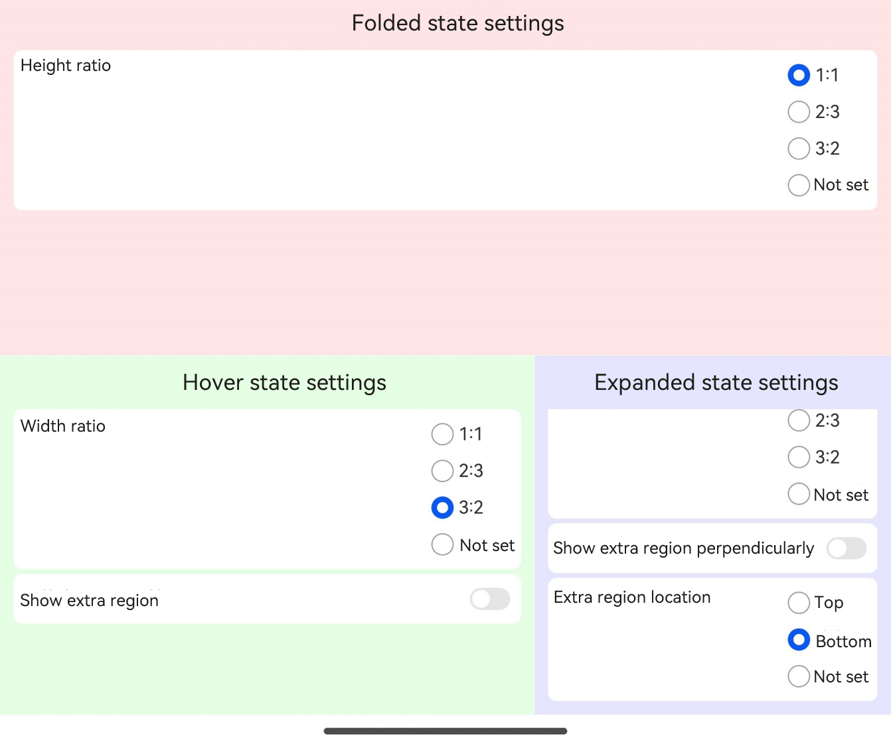

# FoldSplitContainer
<!--Kit: ArkUI-->
<!--Subsystem: ArkUI-->
<!--Owner: @fenglinbailu-->
<!--Designer: @lanshouren-->
<!--Tester: @liuli0427-->
<!--Adviser: @Brilliantry_Rui-->


**FoldSplitContainer** is a layout container designed to manage two-panel and three-panel layout regions on foldable devices, covering expanded, hover, and folded states.


> **NOTE**
>
> - This component is supported since API version 12. Updates will be marked with a superscript to indicate their earliest API version.
>
> - By default, a two-panel layout is used when the window width is less than or equal to 600 vp. When the window width exceeds 600 vp, an extended area is supported alongside the top-bottom split layout. A hover state layout can be triggered when the window width is greater than 600 vp and the device is in a horizontal, half-folded posture. In the hover layout, visual avoidance for the screen crease area is applied, and the extended area cannot span across the crease. The extended area can also be configured not to display in the hover state. For details, see [Examples](#examples).

## Modules to Import

```ts
import { FoldSplitContainer } from '@kit.ArkUI';
```

## Child Components

Not supported

## FoldSplitContainer

FoldSplitContainer({primary: Callback&lt;void&gt;, secondary: Callback&lt;void&gt;, extra?: Callback&lt;void&gt;, expandedLayoutOptions: ExpandedRegionLayoutOptions, hoverModeLayoutOptions: HoverModeRegionLayoutOptions, foldedLayoutOptions: FoldedRegionLayoutOptions, animationOptions?: AnimateParam | null, onHoverStatusChange?: OnHoverStatusChangeHandler})

Creates a **FoldSplitContainer** component to manage two-panel and three-panel layout regions on foldable devices, covering expanded, hover, and folded states.

**Decorator**: [\@Component](../../../ui/state-management/arkts-create-custom-components.md#component)

**Atomic service API**: This API can be used in atomic services since API version 12.

**System capability**: SystemCapability.ArkUI.ArkUI.Full

| Name| Type| Mandatory| Decorator| Description|
| -------- | -------- | -------- | -------- | -------- |
| primary | Callback\<void> | Yes| [\@BuilderParam](../../../ui/state-management/arkts-builderparam.md) | Callback function for the primary region.|
| secondary | Callback\<void> | Yes| [\@BuilderParam](../../../ui/state-management/arkts-builderparam.md) | Callback function for the extra region.|
| extra | Callback\<void> | No| [\@BuilderParam](../../../ui/state-management/arkts-builderparam.md) | Callback function for the extra region. If this parameter is not provided, there is no corresponding region.|
| expandedLayoutOptions | [ExpandedRegionLayoutOptions](#expandedregionlayoutoptions) | Yes| [\@Prop](../../../ui/state-management/arkts-prop.md) | Layout information for the expanded state.|
| hoverModeLayoutOptions | [HoverModeRegionLayoutOptions](#hovermoderegionlayoutoptions) | Yes| [\@Prop](../../../ui/state-management/arkts-prop.md) | Layout information for the hover state.|
| foldedLayoutOptions | [FoldedRegionLayoutOptions](#foldedregionlayoutoptions) | Yes| [\@Prop](../../../ui/state-management/arkts-prop.md) | Layout information for the folded state.|
| animationOptions | [AnimateParam](ts-explicit-animation.md#animateparam) \| null | No| [\@Prop](../../../ui/state-management/arkts-prop.md) | Animation settings. The value **null** indicates that the animation is disabled.|
| onHoverStatusChange | [OnHoverStatusChangeHandler](#onhoverstatuschangehandler) | No| - | Callback invoked when the foldable device enters or exits the hover state.|

## ExpandedRegionLayoutOptions

Defines layout information for the expanded state.

**Atomic service API**: This API can be used in atomic services since API version 12.

**System capability**: SystemCapability.ArkUI.ArkUI.Full

| Name| Type| Read-Only| Optional| Description|
| -------- | -------- | -------- | -------- | -------- |
| isExtraRegionPerpendicular | boolean | No| Yes| Whether the extra region extends perpendicularly through the entire component from top to bottom. The value **true** means that the extra region extends perpendicularly through the entire component from top to bottom, and **false** means the opposite. This setting takes effect only when **extra** is effective.<br>Default value: **true**.|
| verticalSplitRatio | number | No| Yes| Height ratio between the primary and extra regions.<br>Default value: [PresetSplitRatio](#presetsplitratio).LAYOUT_1V1|
| horizontalSplitRatio | number | No| Yes| Width ratio between the primary and extra regions. This setting takes effect only when **extra** is effective.<br>Default value: [PresetSplitRatio](#presetsplitratio).LAYOUT_3V2|
| extraRegionPosition | [ExtraRegionPosition](#extraregionposition) | No| Yes| Position information of the extra region. This setting takes effect only when **isExtraRegionPerpendicular** is set to **false**.<br>Default value: **ExtraRegionPosition.TOP**|

## HoverModeRegionLayoutOptions

Defines layout information for the hover state.

**Atomic service API**: This API can be used in atomic services since API version 12.

**System capability**: SystemCapability.ArkUI.ArkUI.Full

| Name| Type| Read-Only| Optional| Description|
| -------- | -------- | -------- | -------- | -------- |
| showExtraRegion | boolean | No| Yes| Whether to display the extra region in the half-folded state. The value **true** means to display the extra region in the half-folded state, and **false** means the opposite.<br>Default value: **false**.|
| horizontalSplitRatio | number | No| Yes| Width ratio between the primary and extra regions. This setting takes effect only when **extra** is effective.<br>Default value: [PresetSplitRatio](#presetsplitratio).LAYOUT_3V2|
| extraRegionPosition | [ExtraRegionPosition](#extraregionposition) | No| Yes| Position information of the extra region. This setting takes effect only when **showExtraRegion** is set to **true**.<br>Default value: **ExtraRegionPosition.TOP**|

> **NOTE**
>
> 1. In the hover state, the device contains an avoidance area, and layout calculations must account for the impact of this avoidance area on the overall layout.
> 2. In the hover state, the upper screen is dedicated to content display, and the lower screen is reserved for interaction.

## FoldedRegionLayoutOptions

Defines the layout information for the folded state.

**Atomic service API**: This API can be used in atomic services since API version 12.

**System capability**: SystemCapability.ArkUI.ArkUI.Full

| Name| Type| Read-Only| Optional| Description|
| -------- | -------- | -------- | -------- | -------- |
| verticalSplitRatio | number | No| Yes| Height ratio between the primary and extra regions. Default value: [PresetSplitRatio](#presetsplitratio).LAYOUT_1V1|

## OnHoverStatusChangeHandler

type OnHoverStatusChangeHandler = (status: HoverModeStatus) => void

Implements a handler for the **onHoverStatusChange** event.

**Atomic service API**: This API can be used in atomic services since API version 12.

**System capability**: SystemCapability.ArkUI.ArkUI.Full

**Parameters**

| Name| Type| Mandatory| Description|
| -------- | -------- | -------- | -------- |
| status | [HoverModeStatus](#hovermodestatus) | Yes| Hover mode status of the foldable device.|

## HoverModeStatus

Provides device or application information covering fold status, hover mode, application rotation, and window status type.

**Atomic service API**: This API can be used in atomic services since API version 12.

**System capability**: SystemCapability.ArkUI.ArkUI.Full

| Name| Type| Read-Only| Optional| Description|
| -------- | -------- | -------- | -------- | -------- |
| foldStatus | [display.FoldStatus](../js-apis-display.md#foldstatus10) | No| No| Fold status of the device.|
| isHoverMode | boolean | No| No| Whether the application is in the hover state. The value **true** means that the application is in the hover state, and **false** means the opposite.|
| appRotation | number | No| No| Rotation angle of the application.|
| windowStatusType | [window.WindowStatusType](../arkts-apis-window-e.md#windowstatustype11) | No| No| Windowed mode.|

## ExtraRegionPosition

Provides the position information of the extra region.

**Atomic service API**: This API can be used in atomic services since API version 12.

**System capability**: SystemCapability.ArkUI.ArkUI.Full

| Name| Value| Description|
| -------- | -------- | -------- |
| TOP | 1 | The extra region is in the upper half of the component.|
| BOTTOM | 2 | The extra region is in the lower half of the component.|

## PresetSplitRatio

Enumerates the split ratios.

**Atomic service API**: This API can be used in atomic services since API version 12.

**System capability**: SystemCapability.ArkUI.ArkUI.Full

| Name| Value| Description|
| -------- | -------- | -------- |
| LAYOUT_1V1 | 1 | 1:1.|
| LAYOUT_3V2 | 1.5 | 3:2.|
| LAYOUT_2V3 | 0.6666666666666666 | 2:3.|

## Examples

### Example 1: Setting Up a Two-Panel Layout

This example demonstrates how to control the region for a two-panel layout on a foldable screen across different states: folded, expanded, and hover.

```ts
import { FoldSplitContainer } from '@kit.ArkUI';

@Entry
@Component
struct TwoColumns {
  @Builder
  privateRegion() {
    Text("Primary")
      .backgroundColor('rgba(255, 0, 0, 0.1)')
      .fontSize(28)
      .textAlign(TextAlign.Center)
      .height('100%')
      .width('100%')
  }

  @Builder
  secondaryRegion() {
    Text("Secondary")
      .backgroundColor('rgba(0, 255, 0, 0.1)')
      .fontSize(28)
      .textAlign(TextAlign.Center)
      .height('100%')
      .width('100%')
  }

  build() {
    RelativeContainer() {
      FoldSplitContainer({
        // Callback function for the primary region.
        primary: () => {
          this.privateRegion()
        },
        // Callback function for the secondary region.
        secondary: () => {
          this.secondaryRegion()
        }
      })
    }
    .height('100%')
    .width('100%')
  }
}
```

| Folded| Expanded| Hover|
| ----- | ------ | ------ |
|  |  |  |

### Example 2: Setting Up a Three-Panel Layout

This example demonstrates how to control the region for a three-panel layout on a foldable screen across different states: folded, expanded, and hover.

```ts
import { FoldSplitContainer } from '@kit.ArkUI';

@Entry
@Component
struct ThreeColumns {
  @Builder
  privateRegion() {
    Text("Primary")
      .backgroundColor('rgba(255, 0, 0, 0.1)')
      .fontSize(28)
      .textAlign(TextAlign.Center)
      .height('100%')
      .width('100%')
  }

  @Builder
  secondaryRegion() {
    Text("Secondary")
      .backgroundColor('rgba(0, 255, 0, 0.1)')
      .fontSize(28)
      .textAlign(TextAlign.Center)
      .height('100%')
      .width('100%')
  }

  @Builder
  extraRegion() {
    Text("Extra")
      .backgroundColor('rgba(0, 0, 255, 0.1)')
      .fontSize(28)
      .textAlign(TextAlign.Center)
      .height('100%')
      .width('100%')
  }

  build() {
    RelativeContainer() {
      FoldSplitContainer({
        // Callback function for the primary region.
        primary: () => {
          this.privateRegion()
        },
        // Callback function for the secondary region.
        secondary: () => {
          this.secondaryRegion()
        },
        // Callback function for the extra region.
        extra: () => {
          this.extraRegion()
        }
      })
    }
    .height('100%')
    .width('100%')
  }
}
```

| Folded| Expanded| Hover|
| ----- | ------ | ------ |
|  |  |  |

### Example 3: Configuring the Folded, Hover, and Expanded States of FoldSplitContainer

This example demonstrates how to use [ExpandedRegionLayoutOptions](#expandedregionlayoutoptions), [HoverModeRegionLayoutOptions](#hovermoderegionlayoutoptions), and [FoldedRegionLayoutOptions](#foldedregionlayoutoptions) to configure the layout information of the expanded, hover, and folded states of the foldable device. **MajorRegion**, **MinorRegion**, and **ExtraRegion** represent the primary, secondary, and extra regions divided by the component. These regions are implemented with the encapsulated **Region** component. **RadioOptions** stands for the encapsulated radio switch component, while **SwitchOption** refers to the encapsulated toggle switch component.

```ts
import { FoldSplitContainer, PresetSplitRatio, ExtraRegionPosition, ExpandedRegionLayoutOptions, HoverModeRegionLayoutOptions, FoldedRegionLayoutOptions } from '@kit.ArkUI';

@Component
struct Region {
  @Prop title: string;
  @BuilderParam content: () => void;
  @Prop compBackgroundColor: string;

  build() {
    Column({ space: 8 }) {
      Text(this.title)
        .fontSize("24fp")
        .fontWeight(600)

      Scroll() {
        this.content()
      }
      .layoutWeight(1)
      .width("100%")
    }
    .backgroundColor(this.compBackgroundColor)
    .width("100%")
    .height("100%")
    .padding(12)
  }
}

const noop = () => {
};

@Component
struct SwitchOption {
  @Prop label: string = ""
  @Prop value: boolean = false
  public onChange: (checked: boolean) => void = noop;

  build() {
    Row() {
      Text(this.label)
      Blank()
      Toggle({ type: ToggleType.Switch, isOn: this.value })
        .onChange((isOn) => {
          this.onChange(isOn);
        })
    }
    .backgroundColor(Color.White)
    .borderRadius(8)
    .padding(8)
    .width("100%")
  }
}

interface RadioOptions {
  label: string;
  value: Object | undefined | null;
  onChecked: () => void;
}

@Component
struct RadioOption {
  @Prop label: string;
  @Prop value: Object | undefined | null;
  @Prop options: Array<RadioOptions>;

  build() {
    Row() {
      Text(this.label)
      Blank()
      Column({ space: 4 }) {
        ForEach(this.options, (option: RadioOptions) => {
          Row() {
            Radio({
              group: this.label,
              value: JSON.stringify(option.value),
            })
              .checked(this.value === option.value)
              .onChange((checked) => {
                if (checked) {
                  option.onChecked();
                }
              })
            Text(option.label)
          }
        })
      }
      .alignItems(HorizontalAlign.Start)
    }
    .alignItems(VerticalAlign.Top)
    .backgroundColor(Color.White)
    .borderRadius(8)
    .padding(8)
    .width("100%")
  }
}

@Entry
@Component
struct Index {
  // Layout configuration in the expanded state.
  @State expandedRegionLayoutOptions: ExpandedRegionLayoutOptions = {
    horizontalSplitRatio: PresetSplitRatio.LAYOUT_3V2,
    verticalSplitRatio: PresetSplitRatio.LAYOUT_1V1,
    isExtraRegionPerpendicular: true,
    extraRegionPosition: ExtraRegionPosition.TOP
  };
  // Layout configuration in the hover state.
  @State foldingRegionLayoutOptions: HoverModeRegionLayoutOptions = {
    horizontalSplitRatio: PresetSplitRatio.LAYOUT_3V2,
    showExtraRegion: false,
    extraRegionPosition: ExtraRegionPosition.TOP
  };
  // Layout configuration in the folded state.
  @State foldedRegionLayoutOptions: FoldedRegionLayoutOptions = {
    verticalSplitRatio: PresetSplitRatio.LAYOUT_1V1
  };

  @Builder
  // Custom component in the primary region.
  MajorRegion() {
    Region({
      title: "Folded state settings",
      compBackgroundColor: "rgba(255, 0, 0, 0.1)",
    }) {
      Column({ space: 4 }) {
        RadioOption({
          label: "Height ratio",
          value: this.foldedRegionLayoutOptions.verticalSplitRatio,
          options: [
            {
              label: "1:1",
              value: PresetSplitRatio.LAYOUT_1V1,
              onChecked: () => {
                this.foldedRegionLayoutOptions.verticalSplitRatio = PresetSplitRatio.LAYOUT_1V1
              }
            },
            {
              label: "2:3",
              value: PresetSplitRatio.LAYOUT_2V3,
              onChecked: () => {
                this.foldedRegionLayoutOptions.verticalSplitRatio = PresetSplitRatio.LAYOUT_2V3
              }
            },
            {
              label: "3:2",
              value: PresetSplitRatio.LAYOUT_3V2,
              onChecked: () => {
                this.foldedRegionLayoutOptions.verticalSplitRatio = PresetSplitRatio.LAYOUT_3V2
              }
            },
            {
              label: "Not set",
              value: undefined,
              onChecked: () => {
                this.foldedRegionLayoutOptions.verticalSplitRatio = undefined
              }
            }
          ]
        })
      }
      .constraintSize({ minHeight: "100%" })
    }
  }

  @Builder
  // Custom component in the secondary region.
  MinorRegion() {
    Region({
      title: "Hover state settings",
      compBackgroundColor: "rgba(0, 255, 0, 0.1)"
    }) {
      Column({ space: 4 }) {
        RadioOption({
          label: "Width ratio",
          value: this.foldingRegionLayoutOptions.horizontalSplitRatio,
          options: [
            {
              label: "1:1",
              value: PresetSplitRatio.LAYOUT_1V1,
              onChecked: () => {
                this.foldingRegionLayoutOptions.horizontalSplitRatio = PresetSplitRatio.LAYOUT_1V1
              }
            },
            {
              label: "2:3",
              value: PresetSplitRatio.LAYOUT_2V3,
              onChecked: () => {
                this.foldingRegionLayoutOptions.horizontalSplitRatio = PresetSplitRatio.LAYOUT_2V3
              }
            },
            {
              label: "3:2",
              value: PresetSplitRatio.LAYOUT_3V2,
              onChecked: () => {
                this.foldingRegionLayoutOptions.horizontalSplitRatio = PresetSplitRatio.LAYOUT_3V2
              }
            },
            {
              label: "Not set",
              value: undefined,
              onChecked: () => {
                this.foldingRegionLayoutOptions.horizontalSplitRatio = undefined
              }
            },
          ]
        })

        SwitchOption({
          label: "Show extra region",
          value: this.foldingRegionLayoutOptions.showExtraRegion,
          onChange: (checked) => {
            this.foldingRegionLayoutOptions.showExtraRegion = checked;
          }
        })

        if (this.foldingRegionLayoutOptions.showExtraRegion) {
          RadioOption({
            label: "Extra region location",
            value: this.foldingRegionLayoutOptions.extraRegionPosition,
            options: [
              {
                label: "Top",
                value: ExtraRegionPosition.TOP,
                onChecked: () => {
                  this.foldingRegionLayoutOptions.extraRegionPosition = ExtraRegionPosition.TOP
                }
              },
              {
                label: "Bottom",
                value: ExtraRegionPosition.BOTTOM,
                onChecked: () => {
                  this.foldingRegionLayoutOptions.extraRegionPosition = ExtraRegionPosition.BOTTOM
                }
              },
              {
                label: "Not set",
                value: undefined,
                onChecked: () => {
                  this.foldingRegionLayoutOptions.extraRegionPosition = undefined
                }
              },
            ]
          })
        }
      }
      .constraintSize({ minHeight: "100%" })
    }
  }

  @Builder
  // Custom component in the expanded region.
  ExtraRegion() {
    Region({
      title: "Expanded state settings",
      compBackgroundColor: "rgba(0, 0, 255, 0.1)"
    }) {
      Column({ space: 4 }) {
        RadioOption({
          label: "Width ratio",
          value: this.expandedRegionLayoutOptions.horizontalSplitRatio,
          options: [
            {
              label: "1:1",
              value: PresetSplitRatio.LAYOUT_1V1,
              onChecked: () => {
                this.expandedRegionLayoutOptions.horizontalSplitRatio = PresetSplitRatio.LAYOUT_1V1
              }
            },
            {
              label: "2:3",
              value: PresetSplitRatio.LAYOUT_2V3,
              onChecked: () => {
                this.expandedRegionLayoutOptions.horizontalSplitRatio = PresetSplitRatio.LAYOUT_2V3
              }
            },
            {
              label: "3:2",
              value: PresetSplitRatio.LAYOUT_3V2,
              onChecked: () => {
                this.expandedRegionLayoutOptions.horizontalSplitRatio = PresetSplitRatio.LAYOUT_3V2
              }
            },
            {
              label: "Not set",
              value: undefined,
              onChecked: () => {
                this.expandedRegionLayoutOptions.horizontalSplitRatio = undefined
              }
            },
          ]
        })

        RadioOption({
          label: "Height ratio",
          value: this.expandedRegionLayoutOptions.verticalSplitRatio,
          options: [
            {
              label: "1:1",
              value: PresetSplitRatio.LAYOUT_1V1,
              onChecked: () => {
                this.expandedRegionLayoutOptions.verticalSplitRatio = PresetSplitRatio.LAYOUT_1V1
              }
            },
            {
              label: "2:3",
              value: PresetSplitRatio.LAYOUT_2V3,
              onChecked: () => {
                this.expandedRegionLayoutOptions.verticalSplitRatio = PresetSplitRatio.LAYOUT_2V3
              }
            },
            {
              label: "3:2",
              value: PresetSplitRatio.LAYOUT_3V2,
              onChecked: () => {
                this.expandedRegionLayoutOptions.verticalSplitRatio = PresetSplitRatio.LAYOUT_3V2
              }
            },
            {
              label: "Not set",
              value: undefined,
              onChecked: () => {
                this.expandedRegionLayoutOptions.verticalSplitRatio = undefined
              }
            }
          ]
        })

        SwitchOption({
          label: "Show extra region perpendicularly",
          value: this.expandedRegionLayoutOptions.isExtraRegionPerpendicular,
          onChange: (checked) => {
            this.expandedRegionLayoutOptions.isExtraRegionPerpendicular = checked;
          }
        })

        if (!this.expandedRegionLayoutOptions.isExtraRegionPerpendicular) {
          RadioOption({
            label: "Extra region location",
            value: this.expandedRegionLayoutOptions.extraRegionPosition,
            options: [
              {
                label: "Top",
                value: ExtraRegionPosition.TOP,
                onChecked: () => {
                  this.expandedRegionLayoutOptions.extraRegionPosition = ExtraRegionPosition.TOP
                }
              },
              {
                label: "Bottom",
                value: ExtraRegionPosition.BOTTOM,
                onChecked: () => {
                  this.expandedRegionLayoutOptions.extraRegionPosition = ExtraRegionPosition.BOTTOM
                }
              },
              {
                label: "Not set",
                value: undefined,
                onChecked: () => {
                  this.expandedRegionLayoutOptions.extraRegionPosition = undefined
                }
              },
            ]
          })
        }
      }
      .constraintSize({ minHeight: "100%" })
    }
  }

  build() {
    Column() {
      FoldSplitContainer({
        // Callback function for the primary region.
        primary: () => {
          this.MajorRegion()
        },
        // Callback function for the secondary region.
        secondary: () => {
          this.MinorRegion()
        },
        // Callback function for the extra region.
        extra: () => {
          this.ExtraRegion()
        },
        expandedLayoutOptions: this.expandedRegionLayoutOptions,
        hoverModeLayoutOptions: this.foldingRegionLayoutOptions,
        foldedLayoutOptions: this.foldedRegionLayoutOptions,
      })
    }
    .width("100%")
    .height("100%")
  }
}
```

| Folded| Expanded| Hover|
| ----- | ------ | ------ |
|  |  |  |
|               -                        |  |  |
|               -                        |  |  |
