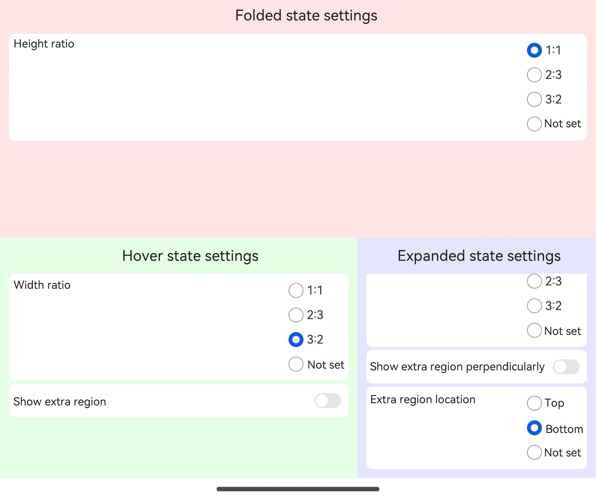

# FoldSplitContainer

<!--Kit: ArkUI-->
<!--Subsystem: ArkUI-->
<!--Owner: @fenglinbailu; @song-song-song-->
<!--Designer: @fenglinbailu-->
<!--Tester: @liuli0427-->
<!--Adviser: @Brilliantry_Rui-->
<!-- md-trans-meta sourceCommit=75a7d62c0702c21a06ca0119552a942305a023cc translatedAt=2026-08-28T01:32:22.106Z pushedAt=2026-08-28T06:01:38.723Z -->

The **FoldSplitContainer** component implements split-screen layout, providing region control for two-panel and three-panel layouts on foldable screens in the expanded state (device fully unfolded), hover state (device half-folded), and folded state (device fully folded). It is suitable for responsive layout adaptation scenarios in foldable screen apps, helping developers implement intelligent split-panel layouts across multiple screen states and improving user experience. For details about fold status, see [display.FoldStatus](../js-apis-display.md#foldstatus10).

> **NOTE**
>
> - This component is supported since API version 12. Updates will be marked with a superscript to indicate their earliest API version.
>
> - The APIs of this module can be used only in the stage model.
>
> - When the window width is less than or equal to 600 vp, the split-screen layout is used by default. When the window width is greater than 600 vp, an expanded area can be supported in addition to the top-bottom split. When the window width is greater than 600 vp and the device is in landscape half-folded state, the hover state layout can be triggered. In the hover state layout, the crease area is avoided and the expanded area cannot cross the crease area. In the hover state, you can set not to display the expanded area. For details, see [Examples](#examples).

## Modules to Import

```ts
import { FoldSplitContainer } from '@kit.ArkUI';
```

## Child Components

Not supported

## FoldSplitContainer

FoldSplitContainer({primary: Callback&lt;void&gt;, secondary: Callback&lt;void&gt;, extra?: Callback&lt;void&gt;, expandedLayoutOptions: ExpandedRegionLayoutOptions, hoverModeLayoutOptions: HoverModeRegionLayoutOptions, foldedLayoutOptions: FoldedRegionLayoutOptions, animationOptions?: AnimateParam | null, onHoverStatusChange?: OnHoverStatusChangeHandler})

Implements region control for the two-panel split-screen layout (primary area + secondary area) and three-panel layout (primary area + secondary area + expanded area) on foldable screens in the expanded, hover, and folded states.

**Decorator**: [\@Component](../../../ui/state-management/arkts-create-custom-components.md#component)

**Atomic service API**: This API can be used in atomic services since API version 12.

**System capability**: SystemCapability.ArkUI.ArkUI.Full

| Name| Type| Mandatory| Decorator| Description|
| -------- | -------- | -------- | -------- | -------- |
| primary | Callback\<void> | Yes | [\@BuilderParam](../../../ui/state-management/arkts-builderparam.md) | Callback function for building the UI content of the primary area. This callback function has no parameters and no return value, and is invoked during component layout. |
| secondary | Callback\<void> | Yes | [\@BuilderParam](../../../ui/state-management/arkts-builderparam.md) | Callback function for building the UI content of the secondary area. This callback function has no parameters and no return value, and is invoked during component layout. |
| extra | Callback\<void> | No | [\@BuilderParam](../../../ui/state-management/arkts-builderparam.md) | Callback function for building the UI content of the expanded area. Pass this parameter when a three-column layout or an additional content area is needed. This parameter can be omitted when no expanded area is required. This callback function has no parameters and no return value. When not passed, no corresponding area is displayed. |
| expandedLayoutOptions | [ExpandedRegionLayoutOptions](#expandedregionlayoutoptions) | Yes | [\@Prop](../../../ui/state-management/arkts-prop.md) | Expanded state layout information, used to control whether the expanded area spans through, the area ratio, and the position in the expanded state of a foldable screen. The expanded area is supported when the window width is greater than 600 vp. |
| hoverModeLayoutOptions | [HoverModeRegionLayoutOptions](#hovermoderegionlayoutoptions) | Yes | [\@Prop](../../../ui/state-management/arkts-prop.md) | Hover state layout information, used to control whether the expanded area is displayed, the area ratio, and the position in the semi-folded hover state of a foldable screen. The hover state layout is triggered when the window width is greater than 600 vp and the device is in landscape semi-folded state. |
| foldedLayoutOptions | [FoldedRegionLayoutOptions](#foldedregionlayoutoptions) | Yes | [\@Prop](../../../ui/state-management/arkts-prop.md) | Folded state layout information, used to control the height ratio between the primary area and the secondary area in the folded state of a foldable screen. This takes effect when the device is in the folded state. A split-screen layout is used by default when the window width is less than or equal to 600 vp. |
| animationOptions | [AnimateParam](ts-explicit-animation.md#animateparam) \| null | No | [\@Prop](../../../ui/state-management/arkts-prop.md) | Parameters for setting animation effects. The value **null** indicates that animation is disabled.<br>Default value: **null** |
| onHoverStatusChange | [OnHoverStatusChangeHandler](#onhoverstatuschangehandler) | No | - | Callback function triggered when the foldable screen enters or exits hover mode. When not passed, no callback is made for hover state changes. |

## ExpandedRegionLayoutOptions

Defines layout information for the expanded state.

**Atomic service API**: This API can be used in atomic services since API version 12.

**System capability**: SystemCapability.ArkUI.ArkUI.Full

| Name| Type| Read-Only| Optional| Description|
| -------- | -------- | -------- | -------- | -------- |
| isExtraRegionPerpendicular | boolean | No | Yes | Whether the expanded area runs through the entire component from top to bottom. The value **true** means the expanded area runs through the entire component, and **false** means the opposite. This field takes effect only when **extra** is valid.<br>Default value: **true** |
| verticalSplitRatio | number | No | Yes | Ratio of the primary area height to the secondary area height. The value can be a preset value of **PresetSplitRatio** or a custom value. The value range is (0, +∞). If a value less than or equal to 0 is passed, the default value is used. For example, when the value is 1.5, the primary area height is 1.5 times the secondary area height (that is, a 3:2 ratio).<br>Default value: [PresetSplitRatio](#presetsplitratio).LAYOUT_1V1 |
| horizontalSplitRatio | number | No | Yes | Ratio of the primary area width to the expanded area width. The value can be a preset value of **PresetSplitRatio** or a custom value. The value range is (0, +∞). If a value less than or equal to 0 is passed, the default value is used. This field takes effect only when **extra** is valid.<br>Default value: [PresetSplitRatio](#presetsplitratio).LAYOUT_3V2 |
| extraRegionPosition | [ExtraRegionPosition](#extraregionposition) | No | Yes | Position of the expanded area. The options are **TOP** (upper half) and **BOTTOM** (lower half). This field takes effect when **isExtraRegionPerpendicular** is set to **false** and **extra** is valid.<br>Default value: `ExtraRegionPosition.TOP` |

## HoverModeRegionLayoutOptions

Defines layout information for the hover state.

**Atomic service API**: This API can be used in atomic services since API version 12.

**System capability**: SystemCapability.ArkUI.ArkUI.Full

| Name| Type| Read-Only| Optional| Description|
| -------- | -------- | -------- | -------- | -------- |
| showExtraRegion | boolean | No | Yes | Whether to display the expanded area when the foldable screen is in the hover state. The value **true** means to display the expanded area, and **false** means not to display it.<br>Default value: **false** |
| horizontalSplitRatio | number | No | Yes | Ratio of the primary area width to the expanded area width. The value can be a preset value from **PresetSplitRatio** or a custom value, with a value range of (0, +∞). If a value less than or equal to 0 is passed, the default value is used. This field takes effect when **extra** is valid and **showExtraRegion** is set to **true**. "extra is valid" means that the **extra** parameter is passed to the **FoldSplitContainer** component.<br>Default value: [PresetSplitRatio](#presetsplitratio).LAYOUT_3V2 |
| extraRegionPosition | [ExtraRegionPosition](#extraregionposition) | No | Yes | Position information of the expanded area. The value can be **TOP** (upper area) or **BOTTOM** (lower area). This field takes effect when **extra** is valid and **showExtraRegion** is set to **true**. "extra is valid" means that the **extra** parameter is passed to the **FoldSplitContainer** component.<br>Default value: `ExtraRegionPosition.TOP` |

> **NOTE**
>
> 1. In the hover state, the device has an avoidance area (the area near the crease where content may be invisible or restricted), and the impact of this area must be considered during layout calculation.
> 2. In hover mode, the upper half of the screen is the display area, and the lower half is the operation area.

## FoldedRegionLayoutOptions

Defines the layout information for the folded state.

**Atomic service API**: This API can be used in atomic services since API version 12.

**System capability**: SystemCapability.ArkUI.ArkUI.Full

| Name| Type| Read-Only| Optional| Description|
| -------- | -------- | -------- | -------- | -------- |
| verticalSplitRatio | number | No | Yes | Ratio of the primary area height to the secondary area height. The value can be a **PresetSplitRatio** preset value or a custom value. The value range is (0, +∞). If a value less than or equal to 0 is passed, the default value is used. This field takes effect only in the folded state layout. For example, when the value is 1.5, it indicates that the primary area height is 1.5 times the secondary area height (i.e., a 3:2 ratio).<br>Default value: [PresetSplitRatio](#presetsplitratio).LAYOUT_1V1 |

## OnHoverStatusChangeHandler

type OnHoverStatusChangeHandler = (status: HoverModeStatus) => void

Defines an event handler for hover state changes.

**Atomic service API**: This API can be used in atomic services since API version 12.

**System capability**: SystemCapability.ArkUI.ArkUI.Full

**Parameters**

| Name| Type| Mandatory| Description|
| -------- | -------- | -------- | -------- |
| status | [HoverModeStatus](#hovermodestatus) | Yes | Status information when the foldable screen enters or exits hover mode. |

## HoverModeStatus

Provides device or application information covering fold status, hover mode, application rotation, and window status type.

**Atomic service API**: This API can be used in atomic services since API version 12.

**System capability**: SystemCapability.ArkUI.ArkUI.Full

| Name| Type| Read-Only| Optional| Description|
| -------- | -------- | -------- | -------- | -------- |
| foldStatus | [display.FoldStatus](../js-apis-display.md#foldstatus10) | No | No | Fold status of the device, including expanded, half-folded, and fully folded states. |
| isHoverMode | boolean | No | No | Whether the app is currently in hover state. The value **true** indicates hover state, and **false** indicates non-hover state. |
| appRotation | number | No | No | App rotation angle, in degrees. |
| windowStatusType | [window.WindowStatusType](../arkts-apis-window-e.md#windowstatustype11) | No | No | Window mode, including full-screen, split-screen, and freeform window modes. |

## ExtraRegionPosition

Provides the position information of the extra region.

**Atomic service API**: This API can be used in atomic services since API version 12.

**System capability**: SystemCapability.ArkUI.ArkUI.Full

| Name| Value| Description|
| -------- | -------- | -------- |
| TOP | 1 | The extra region is in the upper half of the component.|
| BOTTOM | 2 | The extra region is in the lower half of the component.|

## PresetSplitRatio

Enumerates the split ratios.

**Atomic service API**: This API can be used in atomic services since API version 12.

**System capability**: SystemCapability.ArkUI.ArkUI.Full

| Name| Value| Description|
| -------- | -------- | -------- |
| LAYOUT_1V1 | 1 | 1:1 ratio, indicating that the primary area and secondary area are equal in size. When used for **verticalSplitRatio**, the height ratio of the upper and lower areas is 1:1. When used for **horizontalSplitRatio**, the width ratio of the left and right areas is 1:1. |
| LAYOUT_3V2 | 1.5 | 3:2 ratio, indicating that the primary area is 1.5 times the size of the secondary area, that is, the primary area occupies 3/5 and the secondary area occupies 2/5. When used for **verticalSplitRatio**, the height ratio of the upper and lower areas is 3:2. When used for **horizontalSplitRatio**, the width ratio of the left and right areas is 3:2. |
| LAYOUT_2V3 | 0.6666666666666666 | 2:3 ratio, indicating that the primary area is approximately 0.667 times (2/3) the size of the secondary area, that is, the primary area occupies 2/5 and the secondary area occupies 3/5. When used for **verticalSplitRatio**, the height ratio of the upper and lower areas is 2:3. When used for **horizontalSplitRatio**, the width ratio of the left and right areas is 2:3. |

## Examples

### Example 1: Setting Up a Two-Panel Layout

This example demonstrates how to control the region for a two-panel layout on a foldable screen across different states: folded, expanded, and hover.

```ts
import { FoldSplitContainer } from '@kit.ArkUI';

@Entry
@Component
struct TwoColumns {
  @Builder
  privateRegion() {
    Text("Primary")
      .backgroundColor('rgba(255, 0, 0, 0.1)')
      .fontSize(28)
      .textAlign(TextAlign.Center)
      .height('100%')
      .width('100%')
  }

  @Builder
  secondaryRegion() {
    Text("Secondary")
      .backgroundColor('rgba(0, 255, 0, 0.1)')
      .fontSize(28)
      .textAlign(TextAlign.Center)
      .height('100%')
      .width('100%')
  }

  build() {
    RelativeContainer() {
      FoldSplitContainer({
        // Callback function for the primary region.
        primary: () => {
          this.privateRegion()
        },
        // Callback function for the secondary region.
        secondary: () => {
          this.secondaryRegion()
        }
      })
    }
    .height('100%')
    .width('100%')
  }
}
```

| Folded| Expanded| Hover|
| ----- | ------ | ------ |
|  |  |  |

### Example 2: Setting Up a Three-Panel Layout

This example demonstrates how to control the region for a three-panel layout on a foldable screen across different states: folded, expanded, and hover.

```ts
import { FoldSplitContainer } from '@kit.ArkUI';

@Entry
@Component
struct ThreeColumns {
  @Builder
  privateRegion() {
    Text("Primary")
      .backgroundColor('rgba(255, 0, 0, 0.1)')
      .fontSize(28)
      .textAlign(TextAlign.Center)
      .height('100%')
      .width('100%')
  }

  @Builder
  secondaryRegion() {
    Text("Secondary")
      .backgroundColor('rgba(0, 255, 0, 0.1)')
      .fontSize(28)
      .textAlign(TextAlign.Center)
      .height('100%')
      .width('100%')
  }

  @Builder
  extraRegion() {
    Text("Extra")
      .backgroundColor('rgba(0, 0, 255, 0.1)')
      .fontSize(28)
      .textAlign(TextAlign.Center)
      .height('100%')
      .width('100%')
  }

  build() {
    RelativeContainer() {
      FoldSplitContainer({
        // Callback function for the primary region.
        primary: () => {
          this.privateRegion()
        },
        // Callback function for the secondary region.
        secondary: () => {
          this.secondaryRegion()
        },
        // Callback function for the extra region.
        extra: () => {
          this.extraRegion()
        }
      })
    }
    .height('100%')
    .width('100%')
  }
}
```

| Folded| Expanded| Hover|
| ----- | ------ | ------ |
|  |  |  |

### Example 3: Configuring the Folded, Hover, and Expanded States of FoldSplitContainer

This example configures the folded, hover, and expanded state layout information of the foldable screen through [ExpandedRegionLayoutOptions](#expandedregionlayoutoptions), [HoverModeRegionLayoutOptions](#hovermoderegionlayoutoptions), and [FoldedRegionLayoutOptions](#foldedregionlayoutoptions), respectively. The example provides an interactive configuration page, allowing users to adjust layout parameters in real time in each region: the primary area (**MajorRegion**) is used to configure folded state parameters, the secondary area (**MinorRegion**) is used to configure hover state parameters, and the expanded area (**ExtraRegion**) is used to configure expanded state parameters. These regions are implemented using the encapsulated region component **Region**, where **RadioOptions** is an encapsulated radio button switch component and **SwitchOption** is an encapsulated toggle switch component. The schematic diagram shows various layout effects under different parameter configurations.

```ts
import { FoldSplitContainer, PresetSplitRatio, ExtraRegionPosition, ExpandedRegionLayoutOptions, HoverModeRegionLayoutOptions, FoldedRegionLayoutOptions } from '@kit.ArkUI';

@Component
struct Region {
  @Prop title: string;
  @BuilderParam content: () => void;
  @Prop compBackgroundColor: string;

  build() {
    Column({ space: 8 }) {
      Text(this.title)
        .fontSize("24fp")
        .fontWeight(600)

      Scroll() {
        this.content()
      }
      .layoutWeight(1)
      .width("100%")
    }
    .backgroundColor(this.compBackgroundColor)
    .width("100%")
    .height("100%")
    .padding(12)
  }
}

const noop = () => {
};

@Component
struct SwitchOption {
  @Prop label: string = ""
  @Prop value: boolean = false
  public onChange: (checked: boolean) => void = noop;

  build() {
    Row() {
      Text(this.label)
      Blank()
      Toggle({ type: ToggleType.Switch, isOn: this.value })
        .onChange((isOn) => {
          this.onChange(isOn);
        })
    }
    .backgroundColor(Color.White)
    .borderRadius(8)
    .padding(8)
    .width("100%")
  }
}

interface RadioOptions {
  label: string;
  value: Object | undefined | null;
  onChecked: () => void;
}

@Component
struct RadioOption {
  @Prop label: string;
  @Prop value: Object | undefined | null;
  @Prop options: Array<RadioOptions>;

  build() {
    Row() {
      Text(this.label)
      Blank()
      Column({ space: 4 }) {
        ForEach(this.options, (option: RadioOptions) => {
          Row() {
            Radio({
              group: this.label,
              value: JSON.stringify(option.value),
            })
              .checked(this.value === option.value)
              .onChange((checked) => {
                if (checked) {
                  option.onChecked();
                }
              })
            Text(option.label)
          }
        })
      }
      .alignItems(HorizontalAlign.Start)
    }
    .alignItems(VerticalAlign.Top)
    .backgroundColor(Color.White)
    .borderRadius(8)
    .padding(8)
    .width("100%")
  }
}

@Entry
@Component
struct Index {
  // Layout configuration in the expanded state.
  @State expandedRegionLayoutOptions: ExpandedRegionLayoutOptions = {
    horizontalSplitRatio: PresetSplitRatio.LAYOUT_3V2,
    verticalSplitRatio: PresetSplitRatio.LAYOUT_1V1,
    isExtraRegionPerpendicular: true,
    extraRegionPosition: ExtraRegionPosition.TOP
  };
  // Layout configuration in the hover state.
  @State hoverModeRegionLayoutOptions: HoverModeRegionLayoutOptions = {
    horizontalSplitRatio: PresetSplitRatio.LAYOUT_3V2,
    showExtraRegion: false,
    extraRegionPosition: ExtraRegionPosition.TOP
  };
  // Layout configuration in the folded state.
  @State foldedRegionLayoutOptions: FoldedRegionLayoutOptions = {
    verticalSplitRatio: PresetSplitRatio.LAYOUT_1V1
  };

  @Builder
  // Custom component in the primary region.
  MajorRegion() {
    Region({
      title: "Folded state settings",
      compBackgroundColor: "rgba(255, 0, 0, 0.1)",
    }) {
      Column({ space: 4 }) {
        RadioOption({
          label: "Height ratio",
          value: this.foldedRegionLayoutOptions.verticalSplitRatio,
          options: [
            {
              label: "1:1",
              value: PresetSplitRatio.LAYOUT_1V1,
              onChecked: () => {
                this.foldedRegionLayoutOptions.verticalSplitRatio = PresetSplitRatio.LAYOUT_1V1
              }
            },
            {
              label: "2:3",
              value: PresetSplitRatio.LAYOUT_2V3,
              onChecked: () => {
                this.foldedRegionLayoutOptions.verticalSplitRatio = PresetSplitRatio.LAYOUT_2V3
              }
            },
            {
              label: "3:2",
              value: PresetSplitRatio.LAYOUT_3V2,
              onChecked: () => {
                this.foldedRegionLayoutOptions.verticalSplitRatio = PresetSplitRatio.LAYOUT_3V2
              }
            },
            {
              label: "Not set",
              value: undefined,
              onChecked: () => {
                this.foldedRegionLayoutOptions.verticalSplitRatio = undefined
              }
            }
          ]
        })
      }
      .constraintSize({ minHeight: "100%" })
    }
  }

  @Builder
  // Custom component in the secondary region.
  MinorRegion() {
    Region({
      title: "Hover state settings",
      compBackgroundColor: "rgba(0, 255, 0, 0.1)"
    }) {
      Column({ space: 4 }) {
        RadioOption({
          label: "Width ratio",
          value: this.hoverModeRegionLayoutOptions.horizontalSplitRatio,
          options: [
            {
              label: "1:1",
              value: PresetSplitRatio.LAYOUT_1V1,
              onChecked: () => {
                this.hoverModeRegionLayoutOptions.horizontalSplitRatio = PresetSplitRatio.LAYOUT_1V1
              }
            },
            {
              label: "2:3",
              value: PresetSplitRatio.LAYOUT_2V3,
              onChecked: () => {
                this.hoverModeRegionLayoutOptions.horizontalSplitRatio = PresetSplitRatio.LAYOUT_2V3
              }
            },
            {
              label: "3:2",
              value: PresetSplitRatio.LAYOUT_3V2,
              onChecked: () => {
                this.hoverModeRegionLayoutOptions.horizontalSplitRatio = PresetSplitRatio.LAYOUT_3V2
              }
            },
            {
              label: "Not set",
              value: undefined,
              onChecked: () => {
                this.hoverModeRegionLayoutOptions.horizontalSplitRatio = undefined
              }
            },
          ]
        })

        SwitchOption({
          label: "Show extra region",
          value: this.hoverModeRegionLayoutOptions.showExtraRegion,
          onChange: (checked) => {
            this.hoverModeRegionLayoutOptions.showExtraRegion = checked;
          }
        })

        if (this.hoverModeRegionLayoutOptions.showExtraRegion) {
          RadioOption({
            label: "Extra region location",
            value: this.hoverModeRegionLayoutOptions.extraRegionPosition,
            options: [
              {
                label: "Top",
                value: ExtraRegionPosition.TOP,
                onChecked: () => {
                  this.hoverModeRegionLayoutOptions.extraRegionPosition = ExtraRegionPosition.TOP
                }
              },
              {
                label: "Bottom",
                value: ExtraRegionPosition.BOTTOM,
                onChecked: () => {
                  this.hoverModeRegionLayoutOptions.extraRegionPosition = ExtraRegionPosition.BOTTOM
                }
              },
              {
                label: "Not set",
                value: undefined,
                onChecked: () => {
                  this.hoverModeRegionLayoutOptions.extraRegionPosition = undefined
                }
              },
            ]
          })
        }
      }
      .constraintSize({ minHeight: "100%" })
    }
  }

  @Builder
  // Custom component in the expanded region.
  ExtraRegion() {
    Region({
      title: "Expanded state settings",
      compBackgroundColor: "rgba(0, 0, 255, 0.1)"
    }) {
      Column({ space: 4 }) {
        RadioOption({
          label: "Width ratio",
          value: this.expandedRegionLayoutOptions.horizontalSplitRatio,
          options: [
            {
              label: "1:1",
              value: PresetSplitRatio.LAYOUT_1V1,
              onChecked: () => {
                this.expandedRegionLayoutOptions.horizontalSplitRatio = PresetSplitRatio.LAYOUT_1V1
              }
            },
            {
              label: "2:3",
              value: PresetSplitRatio.LAYOUT_2V3,
              onChecked: () => {
                this.expandedRegionLayoutOptions.horizontalSplitRatio = PresetSplitRatio.LAYOUT_2V3
              }
            },
            {
              label: "3:2",
              value: PresetSplitRatio.LAYOUT_3V2,
              onChecked: () => {
                this.expandedRegionLayoutOptions.horizontalSplitRatio = PresetSplitRatio.LAYOUT_3V2
              }
            },
            {
              label: "Not set",
              value: undefined,
              onChecked: () => {
                this.expandedRegionLayoutOptions.horizontalSplitRatio = undefined
              }
            },
          ]
        })

        RadioOption({
          label: "Height ratio",
          value: this.expandedRegionLayoutOptions.verticalSplitRatio,
          options: [
            {
              label: "1:1",
              value: PresetSplitRatio.LAYOUT_1V1,
              onChecked: () => {
                this.expandedRegionLayoutOptions.verticalSplitRatio = PresetSplitRatio.LAYOUT_1V1
              }
            },
            {
              label: "2:3",
              value: PresetSplitRatio.LAYOUT_2V3,
              onChecked: () => {
                this.expandedRegionLayoutOptions.verticalSplitRatio = PresetSplitRatio.LAYOUT_2V3
              }
            },
            {
              label: "3:2",
              value: PresetSplitRatio.LAYOUT_3V2,
              onChecked: () => {
                this.expandedRegionLayoutOptions.verticalSplitRatio = PresetSplitRatio.LAYOUT_3V2
              }
            },
            {
              label: "Not set",
              value: undefined,
              onChecked: () => {
                this.expandedRegionLayoutOptions.verticalSplitRatio = undefined
              }
            }
          ]
        })

        SwitchOption({
          label: "Show extra region perpendicularly",
          value: this.expandedRegionLayoutOptions.isExtraRegionPerpendicular,
          onChange: (checked) => {
            this.expandedRegionLayoutOptions.isExtraRegionPerpendicular = checked;
          }
        })

        if (!this.expandedRegionLayoutOptions.isExtraRegionPerpendicular) {
          RadioOption({
            label: "Extra region location",
            value: this.expandedRegionLayoutOptions.extraRegionPosition,
            options: [
              {
                label: "Top",
                value: ExtraRegionPosition.TOP,
                onChecked: () => {
                  this.expandedRegionLayoutOptions.extraRegionPosition = ExtraRegionPosition.TOP
                }
              },
              {
                label: "Bottom",
                value: ExtraRegionPosition.BOTTOM,
                onChecked: () => {
                  this.expandedRegionLayoutOptions.extraRegionPosition = ExtraRegionPosition.BOTTOM
                }
              },
              {
                label: "Not set",
                value: undefined,
                onChecked: () => {
                  this.expandedRegionLayoutOptions.extraRegionPosition = undefined
                }
              },
            ]
          })
        }
      }
      .constraintSize({ minHeight: "100%" })
    }
  }

  build() {
    Column() {
      FoldSplitContainer({
        // Callback function for the primary region.
        primary: () => {
          this.MajorRegion()
        },
        // Callback function for the secondary region.
        secondary: () => {
          this.MinorRegion()
        },
        // Callback function for the extra region.
        extra: () => {
          this.ExtraRegion()
        },
        expandedLayoutOptions: this.expandedRegionLayoutOptions,
        hoverModeLayoutOptions: this.hoverModeRegionLayoutOptions,
        foldedLayoutOptions: this.foldedRegionLayoutOptions,
      })
    }
    .width("100%")
    .height("100%")
  }
}
```

| Folded| Expanded| Hover|
| ----- | ------ | ------ |
|  |  |  |
|               -                        |  |  |
|               -                        |  |  |