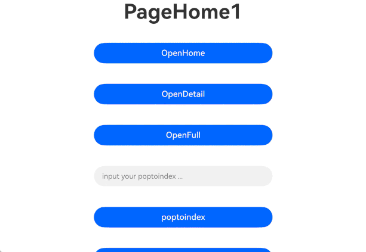
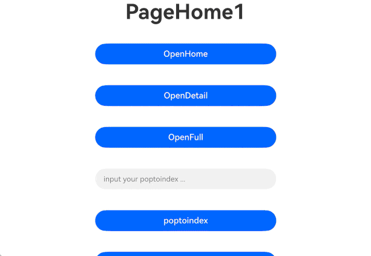

# MultiNavigation

<!--Kit: ArkUI-->
<!--Subsystem: ArkUI-->
<!--Owner: @tsj_20201-->
<!--Designer: @fangzhiyuan1-->
<!--Tester: @gouyuanyuan-->
<!--Adviser: @Brilliantry_Rui-->
<!-- md-trans-meta sourceCommit=08b13ea7d8013cfd7ac8947a97f27df1de5d6b09 translatedAt=2026-07-29T03:05:08.887Z pushedAt=2026-08-04T02:46:56.304Z -->

The **MultiNavigation** component is a component that supports multi-column navigation, providing multi-layer page stack management capabilities. It uses **MultiNavPathStack** to uniformly manage the navigation stacks of different page types such as the home page, detail page, and full-screen page. It supports intelligent routing strategies such as left-to-right stack clearing, making it suitable for complex navigation scenarios on large-screen devices such as tablets and foldables, optimizing the page transition experience and improving user operation efficiency.

> **NOTE**
>
> - This component is supported since API version 14. Updates will be marked with a superscript to indicate their earliest API version.
>
> - The APIs of this module can be used only in the stage model.
>
> - Due to the multi-level page stack structure of **MultiNavigation** (the home page, detail page, and full-screen page each maintain their own sub-stacks, which are managed by **MultiNavPathStack**), calling APIs that are explicitly stated as unsupported in this document or APIs not listed in the supported API list (such as [getParent](ts-basic-components-navigation.md#getparent11), [setInterception](ts-basic-components-navigation.md#setinterception12), [pushDestination](ts-basic-components-navigation.md#pushdestination11), etc.) may cause unexpected issues.
>
> - In deep nesting scenarios, **MultiNavigation** may experience abnormal routing animation effects.

## Modules to Import

```ts
import { MultiNavigation, MultiNavPathStack, SplitPolicy } from '@kit.ArkUI';
```

## Child Components

Not supported

## MultiNavigation

MultiNavigation({navDestination: NavDestinationBuildFunction, multiStack: MultiNavPathStack, onNavigationModeChange?: OnNavigationModeChangeCallback, onHomeShowOnTop?: OnHomeShowOnTopCallback})

Creates and initializes a **MultiNavigation** component.

The **MultiNavigation** component follows the default left-to-right stack clearing rule: when a detail page is loaded from the home page, all existing detail pages in the stack are cleared to ensure that only the latest loaded detail page is displayed. However, if a detail page loading operation is performed again on the detail page on the right, the system will not clear the stack. For the effect, see [Example](#example).

> **NOTE**
>
> - When a detail page is loaded by tapping from the home page (**HOME_PAGE**): all existing detail pages on the right are popped from the stack, and the new detail page is pushed onto the stack, ensuring that only the latest loaded detail page is displayed on the right.
>
> - When a detail page is loaded again by tapping from a detail page (**DETAIL_PAGE**): the stack is not cleared, and the new detail page is pushed directly onto the stack, with the existing detail pages retained.
>
> - When a detail page is loaded from a full-screen page (**FULL_PAGE**): the existing detail page stack is not affected, and the new detail page is pushed onto the stack.

**Decorator:** [@Component](../../../ui/state-management/arkts-create-custom-components.md#component)

**Atomic service API**: This API can be used in atomic services since API version 14.

**System capability**: SystemCapability.ArkUI.ArkUI.Full

|   Name  |          Type         | Mandatory| Decorator Type| Description|
|---------|----------------------|------ |------|-----------|
| multiStack | [MultiNavPathStack](#multinavpathstack) |  Yes | [@State](../../../ui/state-management/arkts-state.md) | Route stack. |
| navDestination | [NavDestinationBuildFunction](#navdestinationbuildfunction) | Yes | [@BuilderParam](../../../ui/state-management/arkts-builderparam.md) | Routing rule for loading the target page. |
| onNavigationModeChange | [OnNavigationModeChangeCallback](#onnavigationmodechangecallback) | No | - | Callback invoked when the **MultiNavigation** mode changes. Pass in this callback when specific business logic (such as adjusting the page layout or updating the UI state) needs to be executed upon a navigation mode change. If not passed in, the navigation mode change event is not listened for, and no callback is triggered upon a navigation mode change. |
| onHomeShowOnTop | [OnHomeShowOnTopCallback](#onhomeshowontopcallback) | No | - | Callback invoked when the home page is at the top of the stack. If not passed in, the home page top-of-stack state change is not listened for. |

## MultiNavPathStack

The route stack of **MultiNavigation** can only be created by the user and cannot be obtained through callbacks. Do not use events or APIs such as [onReady](ts-basic-components-navdestination.md#onready11) of [NavDestination](ts-basic-components-navdestination.md) to obtain **NavPathStack** and perform stack operations, as this may cause unpredictable issues.

### constructor

constructor()

Creates a **MultiNavPathStack** route stack instance.

**Atomic service API**: This API can be used in atomic services since API version 14.

**System capability**: SystemCapability.ArkUI.ArkUI.Full

### pushPath

pushPath(info: NavPathInfo, animated?: boolean, policy?: SplitPolicy): void

Pushes the specified navigation destination page to the navigation stack.

**Atomic service API**: This API can be used in atomic services since API version 14.

**System capability**: SystemCapability.ArkUI.ArkUI.Full

**Parameters**

|  Name  |                             Type                            | Mandatory| Description                                      |
| :------: | :----------------------------------------------------------: | :--: | ----------------------------------------- |
|   info   | [NavPathInfo](./ts-basic-components-navigation.md#navpathinfo10) |  Yes | Information about the navigation destination page.               |
| animated |                           boolean                            |  No | Whether to support the transition animation.<br>Default value: **true**.<br>**true**: The transition animation is supported.<br>**false**: The transition animation is not supported.         |
|  policy  |               [SplitPolicy](#splitpolicy)                |  No  | Policy for the current page pushed to the stack.<br/>Default value: **DETAIL_PAGE** |

### pushPath

pushPath(info: NavPathInfo, options?: NavigationOptions, policy?: SplitPolicy): void

Pushes the specified navigation destination page to the navigation stack, with stack operation settings through **NavigationOptions**.

**Atomic service API**: This API can be used in atomic services since API version 14.

**System capability**: SystemCapability.ArkUI.ArkUI.Full

**Parameters**

|  Name  |                             Type                            | Mandatory| Description                                      |
| :-----: | :----------------------------------------------------------: | :--: | ------------------------------------------ |
|  info   | [NavPathInfo](./ts-basic-components-navigation.md#navpathinfo10) |  Yes | Information about the navigation destination page.                |
| options | [NavigationOptions](./ts-basic-components-navigation.md#navigationoptions12) | No | Page stack operation options. Only the **animated** field is supported; other fields are ignored. The default animation configuration is used when this parameter is omitted. |
| policy | [SplitPolicy](#splitpolicy) | No | Policy for the current page pushed to the stack.<br/>Default value: **DETAIL_PAGE** |

### pushPathByName

pushPathByName(name: string, param: Object, animated?: boolean, policy?: SplitPolicy): void

Pushes the navigation destination page specified by **name** to the navigation stack, passing the data specified by **param**.

**Atomic service API**: This API can be used in atomic services since API version 14.

**System capability**: SystemCapability.ArkUI.ArkUI.Full

**Parameters**

|  Name  |             Type             | Mandatory| Description          |
|:---------------------:|:------------:|:------:| --------------------- |
|         name          |    string    |   Yes    | **NavDestination** page name, which must be consistent with the page name registered in **NavDestinationBuildFunction**.   |
|         param         |   Object    |   Yes    | Detailed parameters of the **NavDestination** page, used to pass custom data to the target page. For details about the field specifications, see the **NavDestination** documentation. |
|       animated        |   boolean    |   No   | Whether to support the transition animation.<br>Default value: **true**.<br>**true**: The transition animation is supported.<br>**false**: The transition animation is not supported.|
|        policy         | [SplitPolicy](#splitpolicy)  |   No    | Policy for the current page pushed to the stack.<br/>Default value: **DETAIL_PAGE**       |

### pushPathByName

pushPathByName(name: string, param: Object, onPop?: base.Callback\<PopInfo>, animated?: boolean, policy?: SplitPolicy): void

Pushes the navigation destination page specified by **name** to the navigation stack, passing the data specified by **param**. This API uses the **onPop** callback to handle the result returned when the page is popped out of the stack.

**Atomic service API**: This API can be used in atomic services since API version 14.

**System capability**: SystemCapability.ArkUI.ArkUI.Full

**Parameters**

|  Name  |             Type               | Mandatory| Description          |
|:---------:|:-------------------------------------------------------------:|:------:|------|
|   name    |                            string                             |   Yes    | Name of the **NavDestination** page. It must be consistent with the page name registered in **NavDestinationBuildFunction**.   |
|   param   |                            Object                             |   Yes    | Detailed parameters of the **NavDestination** page, used to pass custom data to the target page. For details about the field specifications, see the **NavDestination** documentation. |
|   onPop   | base.[Callback](../../apis-basic-services-kit/js-apis-base.md#callback)\<[PopInfo](ts-basic-components-navigation.md#popinfo11)>  |   No    | Callback invoked when the page is popped from the stack to process the return result. If this parameter is omitted, the callback is not triggered. Data can be passed to this callback through the result parameter of the **pop**, **popToName**, and **popToIndex** methods. |
| animated  |                            boolean                            |   No   | Whether to support the transition animation.<br>Default value: **true**.<br>**true**: The transition animation is supported.<br>**false**: The transition animation is not supported.|
|  policy   |                          [SplitPolicy](#splitpolicy)                          |   No    | Policy for the current page pushed to the stack.<br/>Default value: **DETAIL_PAGE**       |

### replacePath

replacePath(info: NavPathInfo, animated?: boolean): void

Replaces the current top page on the stack with the specified navigation destination page. The new page inherits the split policy of the original top page.

**Atomic service API**: This API can be used in atomic services since API version 14.

**System capability**: SystemCapability.ArkUI.ArkUI.Full

**Parameters**

|  Name  |             Type               | Mandatory| Description          |
| :------: | :----------------------------------------------------------: | :--: | -------------------------------- |
|   info   | [NavPathInfo](./ts-basic-components-navigation.md#navpathinfo10) |  Yes | Information about the navigation destination page.      |
| animated |                           boolean                            |  No | Whether to support the transition animation.<br>Default value: **true**.<br>**true**: The transition animation is supported.<br>**false**: The transition animation is not supported.|

### replacePath

replacePath(info: NavPathInfo, options?: NavigationOptions): void

Replaces the current top page on the stack with the specified navigation destination page, with stack operation settings through **NavigationOptions**. The new page inherits the split policy of the original top page.

**Atomic service API**: This API can be used in atomic services since API version 14.

**System capability**: SystemCapability.ArkUI.ArkUI.Full

**Parameters**

|  Name  |             Type               | Mandatory| Description          |
| :-----: | :----------------------------------------------------------: | :--: | ------------------------------------------ |
|  info   | [NavPathInfo](./ts-basic-components-navigation.md#navpathinfo10) |  Yes | Information about the navigation destination page.                |
| options | [NavigationOptions](./ts-basic-components-navigation.md#navigationoptions12) | No | Page stack operation options. Only the **animated** field is supported. Other fields are ignored. If this parameter is omitted, the default animation configuration is used. |

### replacePathByName

replacePathByName(name: string, param: Object, animated?: boolean): void

Replaces the current top page on the stack with the navigation destination page specified by **name**. The new page inherits the split policy of the original top page.

**Atomic service API**: This API can be used in atomic services since API version 14.

**System capability**: SystemCapability.ArkUI.ArkUI.Full

**Parameters**

|  Name  |             Type               | Mandatory| Description          |
|:--------:|:---------:|:------:|----------------------|
|   name   |  string   |   Yes   | Name of the navigation destination page. |
|  param   |  Object   |   Yes    | **NavDestination** page detailed parameters, used to pass custom data to the target page. For specific field specifications, see the **NavDestination** documentation. |
| animated |  boolean  |   No   | Whether to support the transition animation.<br>Default value: **true**.<br>**true**: The transition animation is supported.<br>**false**: The transition animation is not supported.  |

### removeByIndexes

removeByIndexes(indexes: Array<number\>): number

Removes the navigation destination pages specified by **indexes** from the navigation stack.

**Atomic service API**: This API can be used in atomic services since API version 14.

**System capability**: SystemCapability.ArkUI.ArkUI.Full

**Parameters**

|  Name  |             Type               | Mandatory| Description          |
|:--------:|:---------------:|:------:| --------------------- |
| indexes  | Array<number\>  | Yes    | Array of index values of the **NavDestination** pages to be deleted.<br/>Value range of the number type: [0, +∞). The operation does not take effect if the value is out of range. |

**Return value**

|      Type      | Description                      |
|:-------------:| ------------------------ |
|    number     | Number of the navigation destination pages removed.|

### removeByName

removeByName(name: string): number

Removes the navigation destination page specified by **name** from the navigation stack.

**Atomic service API**: This API can be used in atomic services since API version 14.

**System capability**: SystemCapability.ArkUI.ArkUI.Full

**Parameters**

|  Name  |             Type               | Mandatory| Description          |
|:-------:| ------- | ---- | --------------------- |
|  name   | string  | Yes    | Name of the **NavDestination** page to be deleted. |

**Return value**

|      Type      | Description                      |
|:-------------:| ------------------------ |
|    number     | Number of the navigation destination pages removed.|

### pop

pop(animated?: boolean): NavPathInfo | undefined

Pops the top element out of the navigation stack.

> **NOTE**
>
> If [keepBottomPage](#keepbottompage) is called with **true**, the bottom page of the navigation stack is retained.

**Atomic service API**: This API can be used in atomic services since API version 14.

**System capability**: SystemCapability.ArkUI.ArkUI.Full

**Parameters**

|  Name  |             Type               | Mandatory| Description          |
|:-----------:|:--------:|:------:| -------------------- |
|  animated   | boolean  |   No   | Whether to support the transition animation.<br>Default value: **true**.<br>**true**: The transition animation is supported.<br>**false**: The transition animation is not supported.|

**Return value**

| Type         | Description                      |
| ----------- | ------------------------ |
| [NavPathInfo](./ts-basic-components-navigation.md#navpathinfo10) \| undefined | Information about the **NavDestination** page at the top of the stack. If the stack is empty, **undefined** is returned. |

### pop

pop(result?: Object, animated?: boolean): NavPathInfo | undefined

Pops the top element out of the navigation stack and invokes the **onPop** callback to pass the page processing result.

> **NOTE**
>
> If [keepBottomPage](#keepbottompage) is called with **true**, the bottom page of the navigation stack is retained.

**Atomic service API**: This API can be used in atomic services since API version 14.

**System capability**: SystemCapability.ArkUI.ArkUI.Full

**Parameters**

|  Name  |             Type               | Mandatory| Description          |
|:---------:|:-------------------------------:|:------:| -------------------- |
|  result   |             Object              |   No    | Custom page processing result. The specific content is defined by the developer. It is recommended to include a clear business identifier and processing result data. This result will be passed to the **onPop** callback function set when pushing to the stack. If omitted, no result data is passed. |
| animated  |             boolean             |   No   | Whether to support the transition animation.<br>Default value: **true**.<br>**true**: The transition animation is supported.<br>**false**: The transition animation is not supported.|

**Return value**

| Type         | Description                      |
| ----------- | ------------------------ |
| [NavPathInfo](./ts-basic-components-navigation.md#navpathinfo10) \| undefined | Information about the **NavDestination** page at the top of the stack. If the stack is empty, **undefined** is returned. |

### popToName

popToName(name: string, animated?: boolean): number

Pops pages until the first navigation destination page that matches **name** from the bottom of the navigation stack is at the top of the stack.

**Atomic service API**: This API can be used in atomic services since API version 14.

**System capability**: SystemCapability.ArkUI.ArkUI.Full

**Parameters**

|  Name  |             Type               | Mandatory| Description          |
|:----------:|:--------:|:------:| ------------------- |
|    name    |  string  |   Yes   | Name of the navigation destination page.|
|  animated  | boolean  |   No   | Whether to support the transition animation.<br>Default value: **true**.<br>**true**: The transition animation is supported.<br>**false**: The transition animation is not supported.|

**Return value**

| Type    | Description                                      |
| ------ | ---------------------------------------- |
| number | Returns the index of the first navigation destination page that matches **name** from the bottom of the navigation stack; returns **-1** if no such a page is found.<br>Value range: [-1, +∞).|

### popToName

popToName(name: string, result: Object, animated?: boolean): number

Pops pages until the first navigation destination page that matches **name** from the bottom of the navigation stack is at the top of the stack. This API uses the **onPop** callback to pass in the page processing result.

**Atomic service API**: This API can be used in atomic services since API version 14.

**System capability**: SystemCapability.ArkUI.ArkUI.Full

**Parameters**

|  Name  |             Type               | Mandatory| Description          |
|:---------:|:--------:|:------:| ------------------- |
|   name    |  string  |   Yes   | Name of the navigation destination page.|
|  result   |  Object  |   Yes    |  Custom page processing result. The specific content is defined by the developer. It is recommended to include a clear business identifier and processing result data. This result will be passed to the **onPop** callback function set when the page is pushed onto the stack. |
| animated  | boolean  |   No   | Whether to support the transition animation.<br>Default value: **true**.<br>**true**: The transition animation is supported.<br>**false**: The transition animation is not supported.|

**Return value**

| Type    | Description                                      |
| ------ | ---------------------------------------- |
| number | Returns the index of the first navigation destination page that matches **name** from the bottom of the navigation stack; returns **-1** if no such a page is found.<br>Value range: [-1, +∞).|

### popToIndex

popToIndex(index: number, animated?: boolean): void

Pops the route stack back to the **NavDestination** page specified by **index**. If **index** is invalid (out of range), no pop operation is performed.

**Atomic service API**: This API can be used in atomic services since API version 14.

**System capability**: SystemCapability.ArkUI.ArkUI.Full

**Parameters**

|  Name  |             Type               | Mandatory| Description          |
|:------------:|:--------:|:------:| ---------------------- |
|    index     |  number  |   Yes    | Position index of the **NavDestination** page.<br/>Value range: [0, +∞). The operation does not take effect when the value is out of range. |
|   animated   | boolean  |   No   | Whether to support the transition animation.<br>Default value: **true**.<br>**true**: The transition animation is supported.<br>**false**: The transition animation is not supported.|

### popToIndex

popToIndex(index: number, result: Object, animated?: boolean): void

Pops the route stack back to the **NavDestination** page specified by **index**, and triggers the **onPop** callback to return the page processing result. If **index** is invalid (out of range), no pop operation is performed.

**Atomic service API**: This API can be used in atomic services since API version 14.

**System capability**: SystemCapability.ArkUI.ArkUI.Full

**Parameters**

|  Name  |             Type               | Mandatory| Description          |
| ----- | ------ | ---- | ---------------------- |
| index | number | Yes   | Index of the navigation destination page.<br>Value range: [0, +∞). |
| result | Object | Yes | Custom page processing result. The specific content is defined by the developer. It is recommended to include an explicit business identifier and processing result data. |
| animated | boolean | No   | Whether to support the transition animation.<br>Default value: **true**.<br>**true**: The transition animation is supported.<br>**false**: The transition animation is not supported.|

### moveToTop

moveToTop(name: string, animated?: boolean): number

Moves the first navigation destination page that matches **name** from the bottom of the navigation stack to the top of the stack.

> **NOTE**
>
> Depending on the first page found with the specified name, **MultiNavigation** performs different processing:
> 
> 1) If the found page is the topmost home page or full-screen page, no processing is performed.
> 
> 2) If the found page is a detail page corresponding to the topmost home page, the corresponding detail page is moved to the top of the stack.
> 
> 3) If the found page is a non-topmost home page, the home page and all its corresponding detail pages are moved to the top of the stack, with the relative stack relationship of the detail pages unchanged.
> 
> 4) If the found page is a non-topmost detail page, the home page and all its corresponding detail pages are moved to the top of the stack, and the target detail page is moved to the top of all its corresponding detail pages.
> 
> 5) If the found page is a non-topmost full-screen page, the full-screen page is moved to the top of the stack.
>
> **Scenario summary:** When the page is already at the top of the stack, no operation is performed. When a detail page is at the top of the stack, only that detail page is moved. When a non-topmost home page or detail page is moved, its associated detail page group is also moved. When a non-topmost full-screen page is moved, only itself is moved.

**Atomic service API**: This API can be used in atomic services since API version 14.

**System capability**: SystemCapability.ArkUI.ArkUI.Full

**Parameters**

|  Name  |             Type               | Mandatory| Description          |
|:---------:|:--------:|:------:| ------------------- |
|   name    |  string  |   Yes   | Name of the navigation destination page.|
| animated  | boolean  |   No   | Whether to support the transition animation.<br>Default value: **true**.<br>**true**: The transition animation is supported.<br>**false**: The transition animation is not supported.|

**Return value**

|    Type   |                                      Description                                     |
|:--------:|:----------------------------------------------------------------------------:|
|  number  | Returns the index of the first navigation destination page that matches **name** from the bottom of the navigation stack; returns **-1** if no such a page is found. |

### moveIndexToTop

moveIndexToTop(index: number, animated?: boolean): void

Moves the navigation destination page specified by **index** to the top of the navigation stack.

> **NOTE**
>
> Depending on the page found at the specified index, **MultiNavigation** performs different processing:
> 
> 1) If the specified index points to the topmost home page or full-screen page, no processing is performed.
> 
> 2) If the specified index points to a detail page corresponding to the topmost home page, the corresponding detail page is moved to the top of the stack.
> 
> 3) If the specified index points to a non-topmost home page, the home page and all its corresponding detail pages are moved to the top of the stack, with the relative stack relationship of the detail pages unchanged.
> 
> 4) If the specified index points to a non-topmost detail page, the home page and all its corresponding detail pages are moved to the top of the stack, and the target detail page is moved to the top of all its corresponding detail pages.
> 
> 5) If the specified index points to a non-topmost full-screen page, the full-screen page is moved to the top of the stack.

**Atomic service API**: This API can be used in atomic services since API version 14.

**System capability**: SystemCapability.ArkUI.ArkUI.Full

**Parameters**

|  Name  |             Type               | Mandatory| Description          |
|:---------:|:-------:|:------:| ------------------- |
|   index    | number  |   Yes    | Position index of the **NavDestination** page.<br/>Value range: [0, +∞). The operation does not take effect if the value is out of range. |
| animated  | boolean |   No   | Whether to support the transition animation.<br>Default value: **true**.<br>**true**: The transition animation is supported.<br>**false**: The transition animation is not supported.|

### clear

clear(animated?: boolean): void

Clears the navigation stack.

> **NOTE**
> 
> If [keepBottomPage](#keepbottompage) is called with **true**, the bottom page of the navigation stack is retained.

**Atomic service API**: This API can be used in atomic services since API version 14.

**System capability**: SystemCapability.ArkUI.ArkUI.Full

**Parameters**

|  Name  |             Type               | Mandatory| Description          |
|:---------:|:--------:|:------:| ---------------------- |
| animated  | boolean  |   No   | Whether to support the transition animation.<br>Default value: **true**.<br>**true**: The transition animation is supported.<br>**false**: The transition animation is not supported.|

### getAllPathName

getAllPathName(): Array<string\>

Obtains the names of all navigation destination pages in the navigation stack.

**Atomic service API**: This API can be used in atomic services since API version 14.

**System capability**: SystemCapability.ArkUI.ArkUI.Full

**Return value**

|        Type       | Description                        |
|:----------------:| -------------------------- |
|  Array<string\>  | Returns the names of all **NavDestination** pages in the stack. The array elements are arranged from the bottom to the top of the stack. |

### getParamByIndex

getParamByIndex(index: number): Object | undefined

Obtains the parameter information of the navigation destination page specified by **index**.

**Atomic service API**: This API can be used in atomic services since API version 14.

**System capability**: SystemCapability.ArkUI.ArkUI.Full

**Parameters**

|  Name  |             Type               | Mandatory| Description          |
|:-------:|:--------:|:------:| ---------------------- |
|  index  |  number  |   Yes   | Index of the navigation destination page.<br>Value range: [0, +∞).|

**Return value**

| Type       | Description                        |
| --------- | -------------------------- |
| Object&nbsp;\|&nbsp;undefined | **Object**: Returns the parameter information of the corresponding **NavDestination** page. The specific fields are determined by the **param** passed in **pushPath** or **pushPathByName**.<br/>**undefined**: Returns **undefined** when the passed **index** is invalid.  |

### getParamByName

getParamByName(name: string): Array<Object\>

Obtains the parameter information of all the navigation destination pages that match **name**.

**Atomic service API**: This API can be used in atomic services since API version 14.

**System capability**: SystemCapability.ArkUI.ArkUI.Full

**Parameters**

|  Name  |             Type               | Mandatory| Description          |
|:------:|:--------:|:------:| ------------------- |
|  name  |  string  |   Yes   | Name of the navigation destination page.|

**Return value**

| Type             | Description                               |
| --------------- | --------------------------------- |
| Array<Object\> | Parameter information of all the matching navigation destination pages.|

### getIndexByName

getIndexByName(name: string): Array<number\>

Obtains the indexes of all the navigation destination pages that match **name**.

**Atomic service API**: This API can be used in atomic services since API version 14.

**System capability**: SystemCapability.ArkUI.ArkUI.Full

**Parameters**

|  Name  |             Type               | Mandatory| Description          |
|:------:|:--------:|:------:| ------------------- |
|  name  |  string  |   Yes   | Name of the navigation destination page.|

**Return value**

| Type            | Description                               |
| -------------- | --------------------------------- |
| Array<number\> | Indexes of all the matching navigation destination pages.<br>Value range of the number type: [0, +∞).|

### size

size(): number

Obtains the stack size.

**Atomic service API**: This API can be used in atomic services since API version 14.

**System capability**: SystemCapability.ArkUI.ArkUI.Full

**Return value**

| Type    | Description    |
| ------ | ------ |
| number | Stack size.<br>Value range: [0, +∞).|

### disableAnimation

disableAnimation(disable: boolean): void

Disables (**true**) or enables (**false**) all transition animations in the current **MultiNavigation**. This is suitable for scenarios where page switching performance needs to be improved or custom transition effects need to be implemented.

> **NOTE**
>
> This configuration affects the animation effects of the following stack operation methods: **pushPath**, **pushPathByName**, **replacePath**, **replacePathByName**, **pop**, **popToName**, **popToIndex**, **moveToTop**, **moveIndexToTop**, and **clear**. The configuration takes effect immediately and remains effective throughout the lifecycle of **MultiNavigation**. It is recommended to call **disableAnimation(true)** to disable animations before batch stack operations to improve performance, and call **disableAnimation(false)** to restore animations after the operations are complete.

**Atomic service API**: This API can be used in atomic services since API version 14.

**System capability**: SystemCapability.ArkUI.ArkUI.Full

**Parameters**

|  Name  |             Type               | Mandatory| Description          |
| ----- | ------ | ---- | ---------------------- |
| disable | boolean | Yes   | Whether to disable the transition animation.<br>Default value: **false**.<br>**true**:The transition animation is disabled.<br>**false**: The transition animation is not disabled.|

### switchFullScreenState

switchFullScreenState(isFullScreen?: boolean): boolean

Switches the display mode of the detail page at the top of the current stack. This is suitable for scenarios such as video playback and image browsing that require full-screen display.

**Atomic service API**: This API can be used in atomic services since API version 14.

**System capability**: SystemCapability.ArkUI.ArkUI.Full

**Parameters**

|  Name  |             Type               | Mandatory| Description          |
| :----------: | :-----: | :--: | ----------------------------------------------------- |
| isFullScreen | boolean | No | Whether to switch to full-screen mode.<br/>Default value: false<br/>**true**: full-screen mode; **false**: split-screen mode. |

**Return value**

|    Type   |     Description    |
|:--------:|:----------:|
| boolean  |  Whether the switching is successful.<br>**true**: The switching is successful.<br>**false**: The switching failed. |

### setHomeWidthRange

setHomeWidthRange(minPercent: number, maxPercent: number): void

Sets the draggable range for the home page width. If not set, the width defaults to 50% and is not draggable.

**Atomic service API**: This API can be used in atomic services since API version 14.

**System capability**: SystemCapability.ArkUI.ArkUI.Full

**Parameters**

|  Name  |             Type               | Mandatory| Description          |
|:-------------:|:--------:|:-----:|-------------------|
| minPercent  | number  |   Yes   | Minimum main page width percentage.<br/>Value range: [0, 100], and must be less than or equal to **maxPercent**. |
| maxPercent  | number  |   Yes   | Maximum main page width percentage.<br/>Value range: [0, 100], and must be greater than or equal to **minPercent**. |

### keepBottomPage

keepBottomPage(keepBottom: boolean): void

Sets whether to retain the bottom page when the **pop** or **clear** APIs is called.

> **NOTE**
>
> **MultiNavigation** also pushes the home page onto the stack as a **NavDestination** page, so calling the **pop** or **clear** API will also pop the bottom page of the stack.
> When an app calls this API and sets it to **true**, **MultiNavigation** retains the bottom page of the stack when the **pop** and **clear** APIs are called.

**Atomic service API**: This API can be used in atomic services since API version 14.

**System capability**: SystemCapability.ArkUI.ArkUI.Full

**Parameters**

|  Name  |             Type               | Mandatory| Description          |
|:-------------:|:--------:|:-----:|--------------------|
| keepBottom  | boolean  |   Yes  | Whether to retain the bottom page.<br>Default value: **false**.<br>**true**: The bottom page is retained.<br>**false**: The bottom page is not retained.|

### setPlaceholderPage

setPlaceholderPage(info: NavPathInfo): void

Sets a placeholder page.

> **NOTE**
>
> The placeholder page is a special page type. After being set by the app, it forms a left-right multi-column layout with the home page by default on large-screen devices that support multi-column display, that is, the home page on the left and the placeholder page on the right.
> 
> When the app drawable area is less than 600 vp, a foldable switches from the expanded state to the folded state, or a tablet switches from landscape to portrait orientation, the placeholder page is automatically popped from the stack, and only the home page is displayed.
> 
> When the app drawable area is greater than or equal to 600 vp, a foldable switches from the folded state to the expanded state, or a tablet switches from portrait to landscape orientation, the placeholder page is automatically added to form a multi-column layout.

**Atomic service API**: This API can be used in atomic services since API version 14.

**System capability**: SystemCapability.ArkUI.ArkUI.Full

**Parameters**

|  Name  |        Type       | Mandatory| Description        |
|:-------------:|:--------:|:-----:|----------|
| info  | [NavPathInfo](./ts-basic-components-navigation.md#navpathinfo10)  |   Yes   | Page information of the placeholder page, used to set the placeholder page. On a large-screen device, the placeholder page and the main page form a left-right column layout. |

## SplitPolicy

Enumerates the types of pages in **MultiNavigation**.

**Atomic service API**: This API can be used in atomic services since API version 14.

**System capability**: SystemCapability.ArkUI.ArkUI.Full

|       Name       |  Value|  Description          |
| :---------------: | :-: | :-------------: |
|     HOME_PAGE     |  0  | Home page type. Displayed in full-screen mode. Used as the navigation start page of an app.  |
|    DETAIL_PAGE    |  1  | Detail page type. Displayed in split-screen mode. Used for detail pages, forming a left-right split-screen layout with the home page on large-screen devices. |
|     FULL_PAGE     |  2  | Full-screen page type. Displayed in full-screen mode. Used for pages that require full-screen display, such as video playback and image browsing. |

## NavDestinationBuildFunction

type NavDestinationBuildFunction = (name: string, param?: object) => void

Represents the function used by the **MultiNavigation** component to load navigation destination pages.

**Atomic service API**: This API can be used in atomic services since API version 14.

**System capability**: SystemCapability.ArkUI.ArkUI.Full

**Parameters**

| Name| Type| Mandatory| Description|
| --------------- | ------ |------ |------ |
|name | string |Yes| ID of the navigation destination page.|
| param | object | No | Parameter passed when creating a page through route navigation. Default: no parameter is passed when not provided. |

## OnNavigationModeChangeCallback

type OnNavigationModeChangeCallback = (mode: NavigationMode) => void

Represents the callback invoked when the mode of the **MultiNavigation** component changes.

**Atomic service API**: This API can be used in atomic services since API version 14.

**System capability**: SystemCapability.ArkUI.ArkUI.Full

**Parameters**

| Name| Type                                                        | Mandatory| Description                          |
| ---- | ------------------------------------------------------------ | ---- | ------------------------------ |
| mode | [NavigationMode](./ts-basic-components-navigation.md#navigationmode9) | Yes  | Navigation mode when the callback is invoked.|

## OnHomeShowOnTopCallback

type OnHomeShowOnTopCallback = (name: string) => void

Represents the callback invoked when the home page is displayed at the top of the stack.

**Atomic service API**: This API can be used in atomic services since API version 14.

**System capability**: SystemCapability.ArkUI.ArkUI.Full

**Parameters**

| Name| Type  | Mandatory| Description                      |
| ---- | ------ | ---- | -------------------------- |
| name | string | Yes  | ID of the page displayed at the top of the stack.|

## Attributes

The [universal attributes](ts-component-general-attributes.md) are not supported.

## Events

The [universal events](ts-component-general-events.md) are not supported.

## Example

This example demonstrates the basic usage of **MultiNavigation**.

<!--code_no_check-->

```typescript
// pages/Index.ets
import { MultiNavigation, MultiNavPathStack, SplitPolicy } from '@kit.ArkUI';
import { PageDetail1 } from './PageDetail1';
import { PageDetail2 } from './PageDetail2';
import { PageFull1 } from './PageFull1';
import { PageHome1 } from './PageHome1';
import { PagePlaceholder } from './PagePlaceholder';

@Entry
@Component
struct Index {
  @Provide('pageStack') pageStack: MultiNavPathStack = new MultiNavPathStack();

  @Builder
  PageMap(name: string, param?: object) {
    if (name === 'PageHome1') {
      PageHome1({ param: param });
    } else if (name === 'PageDetail1') {
      PageDetail1({ param: param });
    } else if (name === 'PageDetail2') {
      PageDetail2({ param: param });
    } else if (name === 'PageFull1') {
      PageFull1();
    } else if (name === 'PagePlaceholder') {
      PagePlaceholder();
    }
  }

  aboutToAppear(): void {
    this.pageStack.pushPathByName('PageHome1', 'paramTest', false, SplitPolicy.HOME_PAGE);
  }

  build() {
    Column() {
      Row() {
        MultiNavigation({ navDestination: this.PageMap, multiStack: this.pageStack })
      }
      .width('100%')
    }
  }
}
```

<!--code_no_check-->

```typescript
// pages/PageHome1.ets, corresponding to the home page
import { MultiNavPathStack, SplitPolicy } from '@kit.ArkUI';
import { hilog } from '@kit.PerformanceAnalysisKit';

@Component
export struct PageHome1 {
  @State message: string = 'PageHome1';
  @Consume('pageStack') pageStack: MultiNavPathStack;
  controller: TextInputController = new TextInputController();
  text: string = '';
  param: Object = new Object();

  build() {
    if (this.log()) {
      NavDestination() {
        Column() {
          Column() {
            Text(this.message)
              .fontSize(40)
              .fontWeight(FontWeight.Bold)
          }
          .width('100%')
          .height('8%')
          Scroll(){
            Column() {
              Button('OpenHome', { stateEffect: true, type: ButtonType.Capsule})
                .width('50%')
                .height(40)
                .margin(20)
                .onClick(() => {
                  if (this.pageStack !== undefined && this.pageStack !== null) {
                    // Navigate to the PageHome1 page.
                    this.pageStack.pushPathByName('PageHome1', 'testParam', true, SplitPolicy.HOME_PAGE);
                  }
                })
              Button('OpenDetail', { stateEffect: true, type: ButtonType.Capsule})
                .width('50%')
                .height(40)
                .margin(20)
                .onClick(() => {
                  if (this.pageStack !== undefined && this.pageStack !== null) {
                    // Navigate to the PageDetail1 page.
                    this.pageStack.pushPathByName('PageDetail1', 'testParam');
                  }
                })
              Button('OpenFull', { stateEffect: true, type: ButtonType.Capsule})
                .width('50%')
                .height(40)
                .margin(20)
                .onClick(() => {
                  if (this.pageStack !== undefined && this.pageStack !== null) {
                    // Navigate to the PageFull1 page.
                    this.pageStack.pushPathByName('PageFull1', 'testParam', true, SplitPolicy.FULL_PAGE);
                  }
                })
              TextInput({placeholder: 'input your popToIndex ...', controller: this.controller })
                .placeholderColor(Color.Grey)
                .placeholderFont({ size: 14, weight: 400 })
                .caretColor(Color.Blue)
                .width('50%')
                .height(40)
                .margin(20)
                .type(InputType.Number)
                .fontSize(14)
                .fontColor(Color.Black)
                .onChange((value: string) => {
                  this.text = value;
                })
              Button('popToIndex', { stateEffect: true, type: ButtonType.Capsule})
                .width('50%')
                .height(40)
                .margin(20)
                .onClick(() => {
                  if (this.pageStack !== undefined && this.pageStack !== null) {
                    // Return to the page with the specified index and remove all pages with a higher index.
                    this.pageStack.popToIndex(Number(this.text));
                    this.controller.caretPosition(1);
                  }
                })
              Button('OpenDetailWithName', { stateEffect: true, type: ButtonType.Capsule})
                .width('50%')
                .height(40)
                .margin(20)
                .onClick(() => {
                  if (this.pageStack !== undefined && this.pageStack !== null) {
                    // Navigate to the PageDetail1 page.
                    this.pageStack.pushPathByName('PageDetail1', 'testParam', undefined, true);
                  }
                })
              Button('pop', { stateEffect: true, type: ButtonType.Capsule})
                .width('50%')
                .height(40)
                .margin(20)
                .onClick(() => {
                  if (this.pageStack !== undefined && this.pageStack !== null) {
                    // Pop the top element of the route stack.
                    this.pageStack.pop();
                  }
                })
              Button('moveToTopByName: PageDetail1', { stateEffect: true, type: ButtonType.Capsule})
                .width('50%')
                .height(40)
                .margin(10)
                .onClick(() => {
                  if (this.pageStack !== undefined && this.pageStack !== null) {
                    // Move the PageDetail1 page to the top of the stack.
                    let indexFound = this.pageStack.moveToTop('PageDetail1');
                    hilog.info(0x0000, 'demoTest', 'moveToTopByName,indexFound:' + indexFound);
                  }
                })
              Button('removeByName HOME', { stateEffect: true, type: ButtonType.Capsule})
                .width('50%')
                .height(40)
                .margin(20)
                .onClick(() => {
                  if (this.pageStack !== undefined && this.pageStack !== null) {
                    // Remove the page named PageHome1.
                    this.pageStack.removeByName('PageHome1');
                  }
                })
              Button('removeByIndexes 0135', { stateEffect: true, type: ButtonType.Capsule})
                .width('50%')
                .height(40)
                .margin(20)
                .onClick(() => {
                  if (this.pageStack !== undefined && this.pageStack !== null) {
                    // Delete pages with indexes 0, 1, 3, and 5 in the stack.
                    this.pageStack.removeByIndexes([0,1,3,5]);
                  }
                })
              Button('getAllPathName', { stateEffect: true, type: ButtonType.Capsule})
                .width('50%')
                .height(40)
                .margin(20)
                .onClick(() => {
                  if (this.pageStack !== undefined && this.pageStack !== null) {
                    let result = this.pageStack.getAllPathName();
                    hilog.info(0x0000, 'demoTest', 'getAllPathName: ' + result.toString());
                  }
                })
              Button('getParamByIndex0', { stateEffect: true, type: ButtonType.Capsule})
                .width('50%')
                .height(40)
                .margin(20)
                .onClick(() => {
                  if (this.pageStack !== undefined && this.pageStack !== null) {
                    // Obtain the parameters of the page with index 0.
                    let result = this.pageStack.getParamByIndex(0);
                    hilog.info(0x0000, 'demoTest', 'getParamByIndex: ' + result);
                  }
                })
              Button('getParamByNameHomePage', { stateEffect: true, type: ButtonType.Capsule})
                .width('50%')
                .height(40)
                .margin(20)
                .onClick(() => {
                  if (this.pageStack !== undefined && this.pageStack !== null) {
                    // Obtain the parameters of the page named PageHome1.
                    let result = this.pageStack.getParamByName('PageHome1');
                    hilog.info(0x0000, 'demoTest', 'getParamByName: ' + result.toString());
                  }
                })
              Button('getIndexByNameHomePage', { stateEffect: true, type: ButtonType.Capsule})
                .width('50%')
                .height(40)
                .margin(20)
                .onClick(() => {
                  if (this.pageStack !== undefined && this.pageStack !== null) {
                    // Obtain the index of the page named PageHome1.
                    let result = this.pageStack.getIndexByName('PageHome1');
                    hilog.info(0x0000, 'demoTest', 'getIndexByName: ' + result);
                  }
                })
              Button('keepBottomPage True', { stateEffect: true, type: ButtonType.Capsule})
                .width('50%')
                .height(40)
                .margin(10)
                .onClick(() => {
                  if (this.pageStack !== undefined && this.pageStack !== null) {
                    // Set the bottom page of the stack to be unremovable.
                    this.pageStack.keepBottomPage(true);
                  }
                })
              Button('keepBottomPage False', { stateEffect: true, type: ButtonType.Capsule})
                .width('50%')
                .height(40)
                .margin(10)
                .onClick(() => {
                  if (this.pageStack !== undefined && this.pageStack !== null) {
                    // Set the bottom page of the stack to be removable.
                    this.pageStack.keepBottomPage(false);
                  }
                })
              Button('setPlaceholderPage', { stateEffect: true, type: ButtonType.Capsule})
                .width('50%')
                .height(40)
                .margin(10)
                .onClick(() => {
                  if (this.pageStack !== undefined && this.pageStack !== null) {
                    this.pageStack.setPlaceholderPage({ name: 'PagePlaceholder' });
                  }
                })
            }.backgroundColor(0xFFFFFF).width('100%').padding(10).borderRadius(15)
            }
            .width('100%')
          }
          .width('100%')
          .height('92%')
        }.hideTitleBar(true)
      }
    }

  log(): boolean {
    hilog.info(0x0000, 'demoTest', 'PageHome1 build called');
    return true;
  }
}
```

<!--code_no_check-->

```typescript
// pages/PageDetail1.ets: detail page
import { MultiNavPathStack, SplitPolicy } from '@kit.ArkUI';
import { hilog } from '@kit.PerformanceAnalysisKit';

@Component
export struct PageDetail1 {
  @State message: string = 'PageDetail1';
  @Consume('pageStack') pageStack: MultiNavPathStack;
  controller: TextInputController = new TextInputController();
  text: string = '';
  param: Object = new Object();

  build() {
    if (this.log()) {
      NavDestination() {
        Column() {
          Column() {
            Text(this.message)
              .fontSize(40)
              .fontWeight(FontWeight.Bold)
          }
          .height('8%')
          .width('100%')
          Scroll(){
            Column(){
              Button('OpenHome', { stateEffect: true, type: ButtonType.Capsule})
                .width('50%')
                .height(40)
                .margin(20)
                .onClick(() => {
                  if (this.pageStack !== undefined && this.pageStack !== null) {
                    // Navigate to the PageHome1 page.
                    this.pageStack.pushPathByName('PageHome1', 'testParam', true, SplitPolicy.HOME_PAGE);
                  }
                })
              Button('OpenDetail', { stateEffect: true, type: ButtonType.Capsule})
                .width('50%')
                .height(40)
                .margin(20)
                .onClick(() => {
                  if (this.pageStack !== undefined && this.pageStack !== null) {
                    // Navigate to the PageDetail1 page.
                    this.pageStack.pushPathByName('PageDetail1', 'testParam');
                  }
                })
              Button('OpenFull', { stateEffect: true, type: ButtonType.Capsule})
                .width('50%')
                .height(40)
                .margin(20)
                .onClick(() => {
                  if (this.pageStack !== undefined && this.pageStack !== null) {
                    // Navigate to the PageFull1 page.
                    this.pageStack.pushPathByName('PageFull1', 'testParam', true, SplitPolicy.FULL_PAGE);
                  }
                })
              Button('ReplaceDetail', { stateEffect: true, type: ButtonType.Capsule})
                .width('50%')
                .height(40)
                .margin(20)
                .onClick(() => {
                  if (this.pageStack !== undefined && this.pageStack !== null) {
                    // Replace the current page with PageDetail2.
                    this.pageStack.replacePathByName('PageDetail2', 'testParam');
                  }
                })
              Button('removeByName PageDetail1', { stateEffect: true, type: ButtonType.Capsule})
                .width('50%')
                .height(40)
                .margin(20)
                .onClick(() => {
                  if (this.pageStack !== undefined && this.pageStack !== null) {
                    // Remove the page named PageDetail1 from the stack.
                    this.pageStack.removeByName('PageDetail1');
                  }
                })
              Button('removeByIndexes 0135', { stateEffect: true, type: ButtonType.Capsule})
                .width('50%')
                .height(40)
                .margin(20)
                .onClick(() => {
                  if (this.pageStack !== undefined && this.pageStack !== null) {
                    // Delete the pages at indexes 0, 1, 3, and 5 from the stack.
                    this.pageStack.removeByIndexes([0,1,3,5]);
                  }
                })
              Button('switchFullScreenState true', { stateEffect: true, type: ButtonType.Capsule})
                .width('50%')
                .height(40)
                .margin(20)
                .onClick(() => {
                  if (this.pageStack !== undefined && this.pageStack !== null) {
                    // Set the page to full-screen mode.
                    this.pageStack.switchFullScreenState(true);
                  }
                })
              Button('switchFullScreenState false', { stateEffect: true, type: ButtonType.Capsule})
                .width('50%')
                .height(40)
                .margin(20)
                .onClick(() => {
                  if (this.pageStack !== undefined && this.pageStack !== null) {
                    // Set the page to non-full-screen mode.
                    this.pageStack.switchFullScreenState(false);
                  }
                })
              Button('pop', { stateEffect: true, type: ButtonType.Capsule})
                .width('50%')
                .height(40)
                .margin(20)
                .onClick(() => {
                  if (this.pageStack !== undefined && this.pageStack !== null) {
                    this.pageStack.pop('123');
                  }
                })
              Button('popToHome1', { stateEffect: true, type: ButtonType.Capsule})
                .width('50%')
                .height(40)
                .margin(20)
                .onClick(() => {
                  if (this.pageStack !== undefined && this.pageStack !== null) {
                    // Return to the page with the specified name and remove all other pages with a higher index.
                    this.pageStack.popToName('PageHome1');
                  }
                })
              TextInput({placeholder: 'input your popToIndex ...', controller: this.controller })
                .placeholderColor(Color.Grey)
                .placeholderFont({ size: 14, weight: 400 })
                .caretColor(Color.Blue)
                .type(InputType.Number)
                .width('50%')
                .height(40)
                .margin(20)
                .fontSize(14)
                .fontColor(Color.Black)
                .onChange((value: string) => {
                  this.text = value;
                })
              Button('popToIndex', { stateEffect: true, type: ButtonType.Capsule})
                .width('50%')
                .height(40)
                .margin(20)
                .onClick(() => {
                  if (this.pageStack !== undefined && this.pageStack !== null) {
                    // Return to the page with the specified index and remove all pages with a higher index.
                    this.pageStack.popToIndex(Number(this.text));
                    this.controller.caretPosition(1);
                  }
                })
              Button('moveIndexToTop', { stateEffect: true, type: ButtonType.Capsule})
                .width('50%')
                .height(40)
                .margin(20)
                .onClick(() => {
                  if (this.pageStack !== undefined && this.pageStack !== null) {
                    // Move the page with the specified index to the top of the stack.
                    this.pageStack.moveIndexToTop(Number(this.text));
                    this.controller.caretPosition(1);
                  }
                })
              Button('clear', { stateEffect: true, type: ButtonType.Capsule})
                .width('50%')
                .height(40)
                .margin(20)
                .onClick(() => {
                  if (this.pageStack !== undefined && this.pageStack !== null) {
                    // Clear the current route stack.
                    this.pageStack.clear();
                  }
                })
              Button('disableAnimation', { stateEffect: true, type: ButtonType.Capsule})
                .width('50%')
                .height(40)
                .margin(20)
                .onClick(() => {
                  if (this.pageStack !== undefined && this.pageStack !== null) {
                    // Disable animations for stack operations corresponding to the current stack.
                    this.pageStack.disableAnimation(true);
                  }
                })
              Button('enableAnimation', { stateEffect: true, type: ButtonType.Capsule})
                .width('50%')
                .height(40)
                .margin(20)
                .onClick(() => {
                  if (this.pageStack !== undefined && this.pageStack !== null) {
                    // Enable animations for stack operations corresponding to the current stack.
                    this.pageStack.disableAnimation(false);
                  }
                })
              Button('setHomeWidthRange(20, 80)', { stateEffect: true, type: ButtonType.Capsule})
                .width('50%')
                .height(40)
                .margin(20)
                .onClick(() => {
                  if (this.pageStack !== undefined && this.pageStack !== null) {
                    this.pageStack.setHomeWidthRange(20, 80);
                  }
                })
              Button('setHomeWidthRange(-1, 20)', { stateEffect: true, type: ButtonType.Capsule})
                .width('50%')
                .height(40)
                .margin(20)
                .onClick(() => {
                  if (this.pageStack !== undefined && this.pageStack !== null) {
                    this.pageStack.setHomeWidthRange(-1, 20);
                  }
                })
              Button('setHomeWidthRange(20, 120)', { stateEffect: true, type: ButtonType.Capsule})
                .width('50%')
                .height(40)
                .margin(20)
                .onClick(() => {
                  if (this.pageStack !== undefined && this.pageStack !== null) {
                    this.pageStack.setHomeWidthRange(20, 120);
                  }
                })
            }
            .width('100%')
          }
          .width('100%')
          .height('92%')
        }
      }.hideTitleBar(true)
    }
  }

  log(): boolean {
    hilog.info(0x0000, 'demoTest', 'PageDetail1 build called');
    return true;
  }
}
```

<!--code_no_check-->

```typescript
// pages/PageDetail2.ets: detail page
import { MultiNavPathStack, SplitPolicy } from '@kit.ArkUI';
import { hilog } from '@kit.PerformanceAnalysisKit';

@Component
export struct PageDetail2 {
  @State message: string = 'PageDetail2';
  @Consume('pageStack') pageStack: MultiNavPathStack;
  controller: TextInputController = new TextInputController();
  text: string = '';
  param: Object = new Object();

  build() {
    if (this.log()) {
      NavDestination() {
        Column() {
          Column() {
            Text(this.message)
              .fontSize(40)
              .fontWeight(FontWeight.Bold)
          }
          .width('100%')
          .height('8%')
          Scroll(){
            Column() {
              Button('OpenHome', { stateEffect: true, type: ButtonType.Capsule})
                .width('50%')
                .height(40)
                .margin(20)
                .onClick(() => {
                  if (this.pageStack !== undefined && this.pageStack !== null) {
                    // Navigate to the PageHome1 page.
                    this.pageStack.pushPathByName('PageHome1', 'testParam', true, SplitPolicy.HOME_PAGE);
                  }
                })
              Button('OpenDetail', { stateEffect: true, type: ButtonType.Capsule})
                .width('50%')
                .height(40)
                .margin(20)
                .onClick(() => {
                  if (this.pageStack !== undefined && this.pageStack !== null) {
                    // Navigate to the PageDetail1 page.
                    this.pageStack.pushPathByName('PageDetail1', 'testParam');
                  }
                })
              Button('OpenFull', { stateEffect: true, type: ButtonType.Capsule})
                .width('50%')
                .height(40)
                .margin(20)
                .onClick(() => {
                  if (this.pageStack !== undefined && this.pageStack !== null) {
                    // Navigate to the PageFull1 page.
                    this.pageStack.pushPathByName('PageFull1', 'testParam', true, SplitPolicy.FULL_PAGE);
                  }
                })
              Button('ReplaceDetail', { stateEffect: true, type: ButtonType.Capsule})
                .width('50%')
                .height(40)
                .margin(20)
                .onClick(() => {
                  if (this.pageStack !== undefined && this.pageStack !== null) {
                    // Replace the current page with PageDetail2.
                    this.pageStack.replacePathByName('PageDetail2', 'testParam');
                  }
                })
              TextInput({placeholder: 'input your popToIndex ...', controller: this.controller })
                .placeholderColor(Color.Grey)
                .placeholderFont({ size: 14, weight: 400 })
                .caretColor(Color.Blue)
                .type(InputType.Number)
                .width('50%')
                .height(40)
                .margin(20)
                .fontSize(14)
                .fontColor(Color.Black)
                .onChange((value: string) => {
                  this.text = value;
                })
              Button('moveIndexToTop', { stateEffect: true, type: ButtonType.Capsule})
                .width('50%')
                .height(40)
                .margin(20)
                .onClick(() => {
                  if (this.pageStack !== undefined && this.pageStack !== null) {
                    // Move the page with the specified index to the top of the stack.
                    this.pageStack.moveIndexToTop(Number(this.text));
                    this.controller.caretPosition(1);
                  }
                })
              Button('pop', { stateEffect: true, type: ButtonType.Capsule})
                .width('50%')
                .height(40)
                .margin(20)
                .onClick(() => {
                  if (this.pageStack !== undefined && this.pageStack !== null) {
                    this.pageStack.pop();
                  }
                })
              TextInput({placeholder: 'input your popToIndex ...', controller: this.controller })
                .placeholderColor(Color.Grey)
                .placeholderFont({ size: 14, weight: 400 })
                .caretColor(Color.Blue)
                .type(InputType.Number)
                .width('50%')
                .height(40)
                .margin(20)
                .fontSize(14)
                .fontColor(Color.Black)
                .onChange((value: string) => {
                  this.text = value;
                })
              Button('popToIndex', { stateEffect: true, type: ButtonType.Capsule})
                .width('50%')
                .height(40)
                .margin(20)
                .onClick(() => {
                  if (this.pageStack !== undefined && this.pageStack !== null) {
                    // Return to the page with the specified index and remove all pages with a higher index.
                    this.pageStack.popToIndex(Number(this.text));
                    this.controller.caretPosition(1);
                  }
                })
              Button('clear', { stateEffect: true, type: ButtonType.Capsule})
                .width('50%')
                .height(40)
                .margin(20)
                .onClick(() => {
                  if (this.pageStack !== undefined && this.pageStack !== null) {
                    // Clear the current route stack.
                    this.pageStack.clear();
                  }
                })
              Button('disableAnimation', { stateEffect: true, type: ButtonType.Capsule})
                .width('50%')
                .height(40)
                .margin(20)
                .onClick(() => {
                  if (this.pageStack !== undefined && this.pageStack !== null) {
                    // Disable animations for stack operations corresponding to the current stack.
                    this.pageStack.disableAnimation(true);
                  }
                })
              Button('enableAnimation', { stateEffect: true, type: ButtonType.Capsule})
                .width('50%')
                .height(40)
                .margin(20)
                .onClick(() => {
                  if (this.pageStack !== undefined && this.pageStack !== null) {
                    // Enable animations for stack operations corresponding to the current stack.
                    this.pageStack.disableAnimation(false);
                  }
                })
            }
            .width('100%')
          }
          .width('100%')
          .height('92%')
        }
      }
      .hideTitleBar(true)
    }
  }

  log(): boolean {
    hilog.info(0x0000, 'demoTest', 'PageDetail2 build called');
    return true;
  }
}
```

<!--code_no_check-->

```typescript
// pages/PageFull1.ets: page that does not participate in split-screen display and is displayed in full-screen mode by default
import { MultiNavPathStack, SplitPolicy } from '@kit.ArkUI';
import { hilog } from '@kit.PerformanceAnalysisKit';

@Component
export struct PageFull1 {
  @State message: string = 'PageFull1';
  @Consume('pageStack') pageStack: MultiNavPathStack;
  controller: TextInputController = new TextInputController();
  text: string = '';

  build() {
    if (this.log()) {
      NavDestination() {
        Column() {
          Column() {
            Text(this.message)
              .fontSize(40)
              .fontWeight(FontWeight.Bold)
          }
          .width('100%')
          .height('8%')

          Scroll() {
            Column() {
              Button('OpenHome', { stateEffect: true, type: ButtonType.Capsule })
                .width('50%')
                .height(40)
                .margin(20)
                .onClick(() => {
                  if (this.pageStack !== undefined && this.pageStack !== null) {
                    // Navigate to the PageHome1 page.
                    this.pageStack.pushPathByName('PageHome1', 'testParam', true, SplitPolicy.HOME_PAGE);
                  }
                })
              Button('OpenDetail', { stateEffect: true, type: ButtonType.Capsule })
                .width('50%')
                .height(40)
                .margin(20)
                .onClick(() => {
                  if (this.pageStack !== undefined && this.pageStack !== null) {
                    // Navigate to the PageDetail1 page.
                    this.pageStack.pushPathByName('PageDetail1', 'testParam');
                  }
                })
              Button('OpenFull', { stateEffect: true, type: ButtonType.Capsule })
                .width('50%')
                .height(40)
                .margin(20)
                .onClick(() => {
                  if (this.pageStack !== undefined && this.pageStack !== null) {
                    // Navigate to the PageFull1 page.
                    this.pageStack.pushPathByName('PageFull1', 'testParam', true, SplitPolicy.FULL_PAGE);
                  }
                })
              Button('ReplaceFULL', { stateEffect: true, type: ButtonType.Capsule })
                .width('50%')
                .height(40)
                .margin(20)
                .onClick(() => {
                  if (this.pageStack !== undefined && this.pageStack !== null) {
                    // Replace the current page with the PageFull1 page.
                    this.pageStack.replacePathByName('PageFull1', 'testParam', true);
                  }
                })
              Button('removeByName PageFull1', { stateEffect: true, type: ButtonType.Capsule })
                .width('50%')
                .height(40)
                .margin(20)
                .onClick(() => {
                  if (this.pageStack !== undefined && this.pageStack !== null) {
                    // Remove the page named PageFull1 from the stack.
                    this.pageStack.removeByName('PageFull1');
                  }
                })
              Button('removeByIndexes 0135', { stateEffect: true, type: ButtonType.Capsule })
                .width('50%')
                .height(40)
                .margin(20)
                .onClick(() => {
                  if (this.pageStack !== undefined && this.pageStack !== null) {
                    // Delete the pages at indexes 0, 1, 3, and 5 in the stack.
                    this.pageStack.removeByIndexes([0, 1, 3, 5]);
                  }
                })
              Button('pop', { stateEffect: true, type: ButtonType.Capsule })
                .width('50%')
                .height(40)
                .margin(20)
                .onClick(() => {
                  if (this.pageStack !== undefined && this.pageStack !== null) {
                    this.pageStack.pop();
                  }
                })
              TextInput({ placeholder: 'input your popToIndex ...', controller: this.controller })
                .placeholderColor(Color.Grey)
                .placeholderFont({ size: 14, weight: 400 })
                .caretColor(Color.Blue)
                .width('50%')
                .height(40)
                .margin(20)
                .type(InputType.Number)
                .fontSize(14)
                .fontColor(Color.Black)
                .onChange((value: string) => {
                  this.text = value;
                })
              Button('popToIndex', { stateEffect: true, type: ButtonType.Capsule })
                .width('50%')
                .height(40)
                .margin(20)
                .onClick(() => {
                  if (this.pageStack !== undefined && this.pageStack !== null) {
                    this.pageStack.popToIndex(Number(this.text));
                    this.controller.caretPosition(1);
                  }
                })
            }
            .width('100%')
          }
          .width('100%')
          .height('92%')
        }
      }
      .hideTitleBar(true)
      .onBackPressed(() => {
        hilog.info(0x0000, 'demoTest', 'PageFull1 onBackPressed: ');
        return false;
      })
    }
  }

  log(): boolean {
    hilog.info(0x0000, 'demoTest', 'PageFull1 build called');
    return true;
  }
}
```

<!--code_no_check-->

```typescript
// pages/PagePlaceholder.ets: placeholder page
import { MultiNavPathStack } from '@kit.ArkUI';
import { hilog } from '@kit.PerformanceAnalysisKit';

@Component
export struct PagePlaceholder {
  @State message: string = 'PagePlaceholder';
  @Consume('pageStack') pageStack: MultiNavPathStack;
  controller: TextInputController = new TextInputController();
  text: string = '';

  build() {
    if (this.log()) {
      NavDestination() {
        Column() {
          Column() {
            Text(this.message)
              .fontSize(50)
              .fontWeight(FontWeight.Bold)
          }
          .width('100%')
          .height('8%')

          Stack({alignContent: Alignment.Center}) {
            Text('Placeholder sample page')
              .fontSize(80)
              .fontWeight(FontWeight.Bold)
              .fontColor(Color.Red)
          }
          .width('100%')
          .height('92%')
        }
      }.hideTitleBar(true)
    }
  }

  log(): boolean {
    hilog.info(0x0000, 'demoTest', 'PagePlaceholder build called');
    return true;
  }
}
```

Demo of the split-screen effect


Demo of navigation from the home page to the detail page



Demo of a full-screen page

