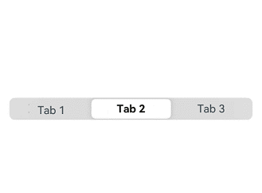

# SegmentButton
<!--Kit: ArkUI-->
<!--Subsystem: ArkUI-->
<!--Owner: @xieziang-->
<!--Designer: @youzhi92-->
<!--Tester: @TerryTsao-->
<!--Adviser: @Brilliantry_Rui-->

**SegmentButton** is a versatile component that organizes related options into visually grouped buttons. It supports three variants: tab-style, capsule-style single-select, and capsule-style multi-select.

>**NOTE**
>
>This component is supported since API version 11. Updates will be marked with a superscript to indicate their earliest API version.
>

## Modules to Import

```
import { SegmentButton, SegmentButtonOptions, SegmentButtonItemOptionsArray } from '@kit.ArkUI';
```

## Child Components

Not supported

## Properties

The [universal attributes](ts-component-general-attributes.md) are not supported.

## Events

The [universal events](ts-component-general-events.md) are not supported.

## SegmentButton

SegmentButton({ options: SegmentButtonOptions, selectedIndexes: number[], onItemClicked: Callback\<number\>, maxFontScale: number \| Resource })

**Decorator**: @Component

**System capability**: SystemCapability.ArkUI.ArkUI.Full

**Device behavior differences**: On wearables, calling this API results in a runtime exception indicating that the API is undefined. On other devices, the API works correctly.

| Name           | Type                                     | Mandatory| Decorator | Description                                                        |
| --------------- | --------------------------------------------- | ---- | ----------- | ------------------------------------------------------------ |
| options         | [SegmentButtonOptions](#segmentbuttonoptions) | Yes  | @ObjectLink | Options of the **SegmentButton** component.<br>**Atomic service API**: This API can be used in atomic services since API version 12.|
| selectedIndexes | number[]                                      | Yes  | @Link       | Indexes of selected items of the **SegmentButton**. The index is zero-based and increments by 1.<br>**NOTE**<br>**selectedIndexes** is decorated with [@Link](../../../ui/state-management/arkts-link.md) to implement parent-child two-way synchronization. If no items are selected, an empty array **[]** can be passed in. <br>**Atomic service API**: This API can be used in atomic services since API version 12.|
| onItemClicked<sup>13+</sup> | Callback\<number\> | No| - | Callback function triggered when a segment button option is tapped. The subscript of the tapped option is passed as a parameter.<br>**Atomic service API**: This API can be used in atomic services since API version 13.|
| maxFontScale<sup>14+</sup> | number \| [Resource](ts-types.md#resource) | Yes| @Prop | Maximum font scale for the text in the **SegmentButton**.<br>Value range: [1, 2]<br>Values less than 1 are treated as 1, and values greater than 2 are treated as 2.<br>**Atomic service API**: This API can be used in atomic services since API version 14.|

>**NOTE**
>
>The **SegmentButton** component does not support [universal attributes](ts-component-general-attributes.md). The component occupies the maximum available width within its content area and distributes this width evenly among its items. It adapts its height automatically to the content (text and images), the minimum height being 28 vp.

## SegmentButtonOptions

>**NOTE**
> 
> The component does not support custom font type settings.

Provides initial data and custom properties for the **SegmentButton** component.

**Decorator Type**: @Observed

### Properties

**System capability**: SystemCapability.ArkUI.ArkUI.Full

**Device behavior differences**: On wearables, calling this API results in a runtime exception indicating that the API is undefined. On other devices, the API works correctly.

| Name                 | Type                                                        | Read-Only                                                    | Optional                                                    | Description                                                      |
| ----------------------- | ------------------------------------------------------------ | ------------------------------------------------------------ | ------------------------------------------------------------ | ------------------------------------------------------------ |
| type                    | "tab" \|"capsule"                                 | No                                      | No                                      | Type of the **SegmentButton** component.<br>**NOTE**<br>**'tab'**: tab-style segmented buttons, designed for page or content section switching.<br>**'capsule'**: capsule-style segmented buttons, suitable for single or multiple selection scenarios.<br>**Atomic service API**: This API can be used in atomic services since API version 12.|
| multiply                | boolean                                                      | No                                                 | No                                              | Whether multiple items can be selected.<br>**true**: Multiple items can be selected.<br>**false**: Multiple items cannot be selected. For the **SegmentButton** component consisting of tab-style buttons, only one item can be selected. In this case, setting **multiply** to **true** does not take effect.<br>If the value is **undefined**, the component does not support selection of multiple items.<br>**Atomic service API**: This API can be used in atomic services since API version 12.|
| buttons                 | [SegmentButtonItemOptionsArray](#segmentbuttonitemoptionsarray) | No| No| Button information of the component, including the icon and text.<br>**Atomic service API**: This API can be used in atomic services since API version 12.|
| fontColor               | [ResourceColor](ts-types.md#resourcecolor)                   | No                | No             | Text color of the unselected button.<br>If the value is **undefined**, the color is $r('sys.color.ohos_id_color_text_secondary').<br>**Atomic service API**: This API can be used in atomic services since API version 12.|
| selectedFontColor       | [ResourceColor](ts-types.md#resourcecolor)                   | No                | No              | Text color of the selected button.<br>If the value is **undefined**, the color is $r('sys.color.ohos_id_color_text_primary') when type is set to "tab".<br>When type is set to "capsule", the color is $r('sys.color.ohos_id_color_foreground_contrary').<br>**Atomic service API**: This API can be used in atomic services since API version 12.|
| fontSize                | [DimensionNoPercentage](#dimensionnopercentage)              | No           | No          | Font size of the unselected button. The value cannot be set in percentage.<br>If the value is **undefined**, the font size is $r('sys.float.ohos_id_text_size_body2').<br>**Atomic service API**: This API can be used in atomic services since API version 12.|
| selectedFontSize        | [DimensionNoPercentage](#dimensionnopercentage)              | No           | No          | Font size of the selected button. The value cannot be set in percentage.<br>If the value is **undefined**, the font size is $r('sys.float.ohos_id_text_size_body2').<br>**Atomic service API**: This API can be used in atomic services since API version 12.|
| fontWeight              | [FontWeight](ts-appendix-enums.md#fontweight)                | No             | No            | Font weight of the unselected button.<br>If the value is **undefined**, the font weight is **FontWeight.Regular**.<br>**Atomic service API**: This API can be used in atomic services since API version 12.|
| selectedFontWeight      | [FontWeight](ts-appendix-enums.md#fontweight)                | No             | No            | Font weight of the selected button.<br>If the value is **undefined**, the font weight is **FontWeight.Medium**.<br>**Atomic service API**: This API can be used in atomic services since API version 12.|
| backgroundColor         | [ResourceColor](ts-types.md#resourcecolor)                   | No                | No               | Background color of the component.<br>If the value is **undefined**, the background color is $r('sys.color.ohos_id_color_button_normal').<br>**Atomic service API**: This API can be used in atomic services since API version 12.|
| selectedBackgroundColor | [ResourceColor](ts-types.md#resourcecolor)                   | No                | No               | Background color of the selected button.<br>When the value is **undefined** and **type** is **"tab"**, the background color is $r('sys.color.ohos_id_color_foreground_contrary').<br>When **type** is **"capsule"**, the background color is $r('sys.color.ohos_id_color_emphasize').<br>**Atomic service API**: This API can be used in atomic services since API version 12.|
| imageSize               | [SizeOptions](ts-types.md#sizeoptions)                       | No                    | No                   | Image size of the component.<br>When the value is **undefined**, the image size is { width: 24, height: 24 }.<br>**NOTE**<br>This attribute is effective only for buttons that contain icons.<br>**Atomic service API**: This API can be used in atomic services since API version 12.|
| buttonPadding           | [Padding](ts-types.md#padding) \| [Dimension](ts-types.md#dimension10) | No| No| Button padding of the component.<br>When the value is **undefined**, the button padding settings are as follows:<br>Icon button and text button: **{ top: 4, right: 8, bottom: 4, left: 8 }**.<br>Icon + text button: **{ top: 6, right: 8, bottom: 6, left: 8 }**.<br>**Atomic service API**: This API can be used in atomic services since API version 12.|
| textPadding             | [Padding](ts-types.md#padding) \| [Dimension](ts-types.md#dimension10) | No| No| Text padding of the component.<br>When the value is **undefined**, the text padding is 0.<br>**Atomic service API**: This API can be used in atomic services since API version 12.|
| localizedButtonPadding<sup>12+</sup> | [LocalizedPadding](ts-types.md#localizedpadding12)                 | No              | Yes            | Button padding of the component.<br>Default value:<br>Icon button and text button: **{ top: LengthMetrics.vp(4), end: LengthMetrics.vp(8), bottom: LengthMetrics.vp(4), start: LengthMetrics.vp(8) }**.<br>Icon + text button: **{ top: LengthMetrics.vp(6), end: LengthMetrics.vp(8), bottom: LengthMetrics.vp(6), start: LengthMetrics.vp(8) **}.<br>If the value is **undefined**, the default value is used.<br>**Atomic service API**: This API can be used in atomic services since API version 12.|
| localizedTextPadding<sup>12+</sup>   | [LocalizedPadding](ts-types.md#localizedpadding12)                 | No              | Yes              | Text padding.<br>Default value: **0**<br>If the value is **undefined**, the default value is used.<br>**Atomic service API**: This API can be used in atomic services since API version 12.|
| direction<sup>12+</sup> | [Direction](ts-appendix-enums.md#direction)                                             | No                                          | Yes                                          | Layout direction of the component.<br>Default value: **Direction.Auto**<br>If the value is **undefined**, the default value is used.<br>**Atomic service API**: This API can be used in atomic services since API version 12.|
| backgroundBlurStyle     | [BlurStyle](ts-universal-attributes-background.md#blurstyle9)                 | No              | No             | Background blur style of the component.<br>If the value is **undefined**, it defaults to **BlurStyle.NONE**.<br>**Atomic service API**: This API can be used in atomic services since API version 12.|
| borderRadiusMode<sup>20+</sup> | [BorderRadiusMode](#borderradiusmode20) | No| Yes| Border radius mode, used to control the border radius calculation method.<br>Default value: **BorderRadiusMode.DEFAULT**.<br>If the value is **undefined**, the default value is used.<br>**Atomic service API**: This API can be used in atomic services since API version 20.|
| backgroundBorderRadius<sup>20+</sup> | [LengthMetrics](../js-apis-arkui-graphics.md#lengthmetrics12)   | No| Yes| Container border radius.<br>**NOTE**<br>This attribute takes effect only when **borderRadiusMode** is set to **BorderRadiusMode.CUSTOM**.<br>For capsule-style multi-select segmented buttons (with **type** being **'capsule'** and **multiply** being **true**), this attribute does not take effect and **itemBorderRadius** must be used to set the border radius.<br>The maximum value for the border radius is half of the component's width or height, and percentage values are not supported.<br>Default value: **$r('sys.float.segmentbutton_container_shape')**.<br>If the value is **undefined**, the default value is used.<br>**Atomic service API**: This API can be used in atomic services since API version 20.|
| itemBorderRadius<sup>20+</sup> | [LengthMetrics](../js-apis-arkui-graphics.md#lengthmetrics12)   | No| Yes| Individual button border radius.<br>**NOTE**<br>This attribute takes effect only when **borderRadiusMode** is set to **BorderRadiusMode.CUSTOM**.<br>For capsule-style multi-select segmented buttons (with **type** being **'capsule'** and **multiply** being **true**), this attribute only affects end items.<br>The maximum value for the border radius is half of the component's width or height, and percentage values are not supported.<br>Default value: **$r('sys.float.segmentbutton_selected_background_shape')**.<br>If the value is **undefined**, the default value is used.<br>**Atomic service API**: This API can be used in atomic services since API version 20.|

### constructor

constructor(options: TabSegmentButtonOptions | CapsuleSegmentButtonOptions)

A constructor used to create a **SegmentButton** instance with specified configuration options.

**Atomic service API**: This API can be used in atomic services since API version 12.

**System capability**: SystemCapability.ArkUI.ArkUI.Full

**Device behavior differences**: On wearables, calling this API results in a runtime exception indicating that the API is undefined. On other devices, the API works correctly.

**Parameters**

| Name| Type                                                    | Mandatory| Description                |
| ------- | ------------------------------------------------------------ | ---- | -------------------- |
| options | [TabSegmentButtonOptions](#tabsegmentbuttonoptions) \|   [CapsuleSegmentButtonOptions](#capsulesegmentbuttonoptions) | Yes| Configuration options for tab-style or capsule-style segmented buttons.|

### tab

static tab(options: TabSegmentButtonConstructionOptions): SegmentButtonOptions

Creates a SegmentButtonOptions class to define tabs.

**Atomic service API**: This API can be used in atomic services since API version 12.

**System capability**: SystemCapability.ArkUI.ArkUI.Full

**Device behavior differences**: On wearables, calling this API results in a runtime exception indicating that the API is undefined. On other devices, the API works correctly.

**Parameters**

| Name | Type                                                        | Mandatory| Description                |
| ------- | ------------------------------------------------------------ | ---- | -------------------- |
| options | [TabSegmentButtonConstructionOptions](#tabsegmentbuttonconstructionoptions) | Yes  | Configuration options for tab-style segmented buttons.|

**Return value**

| Type  | Description                    |
| ------ | ------------------------ |
| [SegmentButtonOptions](#segmentbuttonoptions) | **SegmentButtonOptions** object.|

### capsule

static capsule(options: CapsuleSegmentButtonConstructionOptions): SegmentButtonOptions

Creates a **SegmentButtonOptions** object specifically for capsule-style segmented buttons.

**Atomic service API**: This API can be used in atomic services since API version 12.

**System capability**: SystemCapability.ArkUI.ArkUI.Full

**Device behavior differences**: On wearables, calling this API results in a runtime exception indicating that the API is undefined. On other devices, the API works correctly.

**Parameters**

| Name| Type                                                        | Mandatory| Description                       |
| ------- | ------------------------------------------------------------ | ---- | --------------------------- |
| options | [CapsuleSegmentButtonConstructionOptions](#capsulesegmentbuttonconstructionoptions) | Yes  | Configuration options for capsule-style segmented buttons.|

**Return value**

| Type  | Description                    |
| ------ | ------------------------ |
| [SegmentButtonOptions](#segmentbuttonoptions) | **SegmentButtonOptions** object.|

## DimensionNoPercentage

type DimensionNoPercentage = PX | VP | FP | LPX | Resource

The percentage length union type is not supported.

**Atomic service API**: This API can be used in atomic services since API version 12.

**System capability**: SystemCapability.ArkUI.ArkUI.Full

**Device behavior differences**: On wearables, calling this API results in a runtime exception indicating that the API is undefined. On other devices, the API works correctly.

| Type                            | Description                                         |
| -------------------------------- | --------------------------------------------- |
| [PX](ts-types.md#px10)           | Length in px. |
| [VP](ts-types.md#vp10)           | Length in vp. |
| [FP](ts-types.md#fp10)           | Length in fp. |
| [LPX](ts-types.md#lpx10)         | Length in lpx.|
| [Resource](ts-types.md#resource) | Resource reference type, which is used to set the value of a component attribute.         |

## CommonSegmentButtonOptions

Defines the customizable attributes of a segment button component.

**System capability**: SystemCapability.ArkUI.ArkUI.Full

**Device behavior differences**: On wearables, calling this API results in a runtime exception indicating that the API is undefined. On other devices, the API works correctly.

| Name                 | Type                                                        | Read-Only                                                    | Optional                                                    | Description                                                      |
| ----------------------- | ------------------------------------------------------------ | ------------------------------------------------------------ | ------------------------------------------------------------ | ------------------------------------------------------------ |
| fontColor               | [ResourceColor](ts-types.md#resourcecolor)                   | No                | Yes                | Font color of the unselected item.<br>Default value: **$r('sys.color.ohos_id_color_text_secondary')**<br>If the value is **undefined**, the default value is used.<br>**Atomic service API**: This API can be used in atomic services since API version 12.|
| selectedFontColor       | [ResourceColor](ts-types.md#resourcecolor)                   | No                | Yes                | Font color of the selected item.<br>Default value:<br>Default value: **$r('sys.color.ohos_id_color_text_primary')** when **type** is **"tab"**<br>and **$r('sys.color.ohos_id_color_foreground_contrary')** when **type** is **"capsule"**<br>If the value is **undefined**, the default value is used.<br>**Atomic service API**: This API can be used in atomic services since API version 12.|
| fontSize                | [DimensionNoPercentage](#dimensionnopercentage)              | No           | Yes           | Font size of the unselected item. It cannot be set in percentage.<br>Default value: **$r('sys.float.ohos_id_text_size_body2')**<br>If the value is **undefined**, the default value is used.<br>**Atomic service API**: This API can be used in atomic services since API version 12.|
| selectedFontSize        | [DimensionNoPercentage](#dimensionnopercentage)              | No           | Yes           | Font size of the selected item. It cannot be set in percentage.<br>Default value: **$r('sys.float.ohos_id_text_size_body2')**<br>If the value is **undefined**, the default value is used.<br>**Atomic service API**: This API can be used in atomic services since API version 12.|
| fontWeight              | [FontWeight](ts-appendix-enums.md#fontweight)                | No             | Yes             | Font weight of the unselected item.<br>Default value: **FontWeight.Regular**<br>If the value is **undefined**, the default value is used.<br>**Atomic service API**: This API can be used in atomic services since API version 12.|
| selectedFontWeight      | [FontWeight](ts-appendix-enums.md#fontweight)                | No             | Yes             | Font weight of the selected item.<br>Default value: FontWeight.Medium<br>If the value is **undefined**, the default value is used.<br>**Atomic service API**: This API can be used in atomic services since API version 12.|
| backgroundColor         | [ResourceColor](ts-types.md#resourcecolor)                   | No                | Yes                | Background color of the unselected item.<br>Default value: **$r('sys.color.ohos_id_color_button_normal')**<br>If the value is **undefined**, the default value is used.<br>**Atomic service API**: This API can be used in atomic services since API version 12.|
| selectedBackgroundColor | [ResourceColor](ts-types.md#resourcecolor)                   | No                | Yes                | Background color of the button in the selected state.<br>Default value:<br>Default value: **$r('sys.color.ohos_id_color_foreground_contrary')** when **type** is **"tab"**<br>and **$r('sys.color.ohos_id_color_emphasize')** when **type** is **"capsule"**.<br>If the value is **undefined**, the default value is used.<br>**Atomic service API**: This API can be used in atomic services since API version 12.|
| imageSize               | [SizeOptions](ts-types.md#sizeoptions)                       | No                    | Yes                    | Defines the image size.<br>Default value: { width: 24, height: 24 }<br>If the value is **undefined**, the default value is used.<br>**NOTE**<br>The imageSize attribute takes effect only for icon buttons and icon+text buttons.<br>**Atomic service API**: This API can be used in atomic services since API version 12.|
| buttonPadding           | [Padding](ts-types.md#padding) \| [Dimension](ts-types.md#dimension10) | No| Yes| Button padding.<br>Default value:<br>For icon buttons and text buttons: { top: 4, right: 8, bottom: 4, left: 8 }<br>For icon+text buttons: { top: 6, right: 8, bottom: 6, left: 8 }<br>If the value is **undefined**, the default value is used.<br>**Atomic service API**: This API can be used in atomic services since API version 12.|
| textPadding             | [Padding](ts-types.md#padding) \| [Dimension](ts-types.md#dimension10) | No| Yes| Text padding.<br>Default value: **0**<br>If the value is **undefined**, the default value is used.<br>**Atomic service API**: This API can be used in atomic services since API version 12.|
| localizedButtonPadding<sup>12+</sup> | [LocalizedPadding](ts-types.md#localizedpadding12)                 | No              | Yes              | Button padding.<br>Default value:<br>For icon buttons and text buttons: { top: LengthMetrics.vp(4), end: LengthMetrics.vp(8), bottom: LengthMetrics.vp(4), start: LengthMetrics.vp(8) }<br>For icon+text buttons: { top: LengthMetrics.vp(6), end: LengthMetrics.vp(8), bottom: LengthMetrics.vp(6), start: LengthMetrics.vp(8) }<br>If the value is **undefined**, the default value is used.<br>**Atomic service API**: This API can be used in atomic services since API version 12.|
| localizedTextPadding<sup>12+</sup>   | [LocalizedPadding](ts-types.md#localizedpadding12)                 | No              | Yes              | Text padding.<br>Default value: **0**<br>If the value is **undefined**, the default value is used.<br>**Atomic service API**: This API can be used in atomic services since API version 12.|
| direction<sup>12+</sup> | [Direction](ts-appendix-enums.md#direction)                                             | No                                          | Yes                                          | Layout direction.<br>Default value: **Direction.Auto**<br>If the value is **undefined**, the default value is used.<br>**Atomic service API**: This API can be used in atomic services since API version 12.|
| backgroundBlurStyle     | [BlurStyle](ts-universal-attributes-background.md#blurstyle9)                 | No              | Yes              | Background blur style applied between the content and the background.<br>Default value: **BlurStyle.NONE**<br>If the value is **undefined**, the default value is used.<br>**Atomic service API**: This API can be used in atomic services since API version 12.|
| borderRadiusMode<sup>20+</sup> | [BorderRadiusMode](#borderradiusmode20) | No| Yes| Border radius mode, used to control the border radius calculation method.<br>Default value: **BorderRadiusMode.DEFAULT**.<br>If the value is **undefined**, the default value is used.<br>**Atomic service API**: This API can be used in atomic services since API version 20.|
| backgroundBorderRadius<sup>20+</sup> | [LengthMetrics](../js-apis-arkui-graphics.md#lengthmetrics12)   | No| Yes| Container border radius.<br>**NOTE**<br>This attribute takes effect only when **borderRadiusMode** is set to **BorderRadiusMode.CUSTOM**.<br>For capsule-style multi-select segmented buttons (with **type** being **'capsule'** and **multiply** being **true**), this attribute does not take effect and **itemBorderRadius** must be used to set the border radius.<br>The maximum value for the border radius is half of the component's width or height, and percentage values are not supported.<br>Default value: **$r('sys.float.segmentbutton_container_shape')**.<br>If the value is **undefined**, the default value is used.<br>**Atomic service API**: This API can be used in atomic services since API version 20.|
| itemBorderRadius<sup>20+</sup> | [LengthMetrics](../js-apis-arkui-graphics.md#lengthmetrics12)   | No| Yes| Individual button border radius.<br>**NOTE**<br>This attribute takes effect only when **borderRadiusMode** is set to **BorderRadiusMode.CUSTOM**.<br>For capsule-style multi-select segmented buttons (with **type** being **'capsule'** and **multiply** being **true**), this attribute only affects end items.<br>The maximum value for the border radius is half of the component's width or height, and percentage values are not supported.<br>Default value: **$r('sys.float.segmentbutton_selected_background_shape')**.<br>If the value is **undefined**, the default value is used.<br>**Atomic service API**: This API can be used in atomic services since API version 20.|

## BorderRadiusMode<sup>20+</sup>

Enumerates the border radius modes for the **SegmentButton** component, which are used to control the border radius calculation method.

**Atomic service API**: This API can be used in atomic services since API version 20.

**System capability**: SystemCapability.ArkUI.ArkUI.Full

**Device behavior differences**: On wearables, calling this API results in a runtime exception indicating that the API is undefined. On other devices, the API works correctly.

| Name   |Value| Description                            |
| ------- | - |-------------------------------- |
| DEFAULT | 0 |Default mode, where the framework automatically calculates the border radius.|
| CUSTOM  | 1 |Custom mode, where the border radius is set by the developer.|

## TabSegmentButtonConstructionOptions

Creates a SegmentButtonOptions object of the tab type.

Inherits from [CommonSegmentButtonOptions](#commonsegmentbuttonoptions).

**Atomic service API**: This API can be used in atomic services since API version 12.

**System capability**: SystemCapability.ArkUI.ArkUI.Full

**Device behavior differences**: On wearables, calling this API results in a runtime exception indicating that the API is undefined. On other devices, the API works correctly.

| Name   | Type                                                        | Read-Only| Optional| Description      |
| ------- | ------------------------------------------------------------ | ---- | ---- | ---------- |
| buttons | [ItemRestriction](#itemrestriction)\<[SegmentButtonTextItem](#segmentbuttontextitem)> | No  | No  | Button information.|

## CapsuleSegmentButtonConstructionOptions

Represents configuration options for creating a **SegmentButton** component consisting of capsule-style segmented buttons.

Inherits from [CommonSegmentButtonOptions](#commonsegmentbuttonoptions).

**Atomic service API**: This API can be used in atomic services since API version 12.

**System capability**: SystemCapability.ArkUI.ArkUI.Full

**Device behavior differences**: On wearables, calling this API results in a runtime exception indicating that the API is undefined. On other devices, the API works correctly.

| Name     | Type                                             | Read-Only| Optional| Description                       |
| -------- | ------------------------------------------------- | ---- | ----------------------------- | ----------------------------- |
| buttons  | [SegmentButtonItemTuple](#segmentbuttonitemtuple) | No| No | Button information.                   |
| multiply | boolean                                           | No | Yes | Whether multiple items can be selected.<br>Default value: **false**.<br>If the value is **undefined**, the default value is used.<br><br>**true**: Multi-selection is allowed.<br>**false**: Multi-selection is not allowed.|

## ItemRestriction

type ItemRestriction\<T> = [T, T, T?, T?, T?]

Tuple type that stores button information.

**Atomic service API**: This API can be used in atomic services since API version 12.

**System capability**: SystemCapability.ArkUI.ArkUI.Full

**Device behavior differences**: On wearables, calling this API results in a runtime exception indicating that the API is undefined. On other devices, the API works correctly.

| Type                                     | Description                             |
| ----------------------------------------- | --------------------------------- |
|[T, T, T?, T?, T?] | A tuple that contains two to five elements of the same type.|

>**NOTE**
>
>A **SegmentButton** component supports two to five buttons.

## SegmentButtonItemTuple

type SegmentButtonItemTuple = ItemRestriction\<SegmentButtonTextItem> | ItemRestriction\<SegmentButtonIconItem> | ItemRestriction\<SegmentButtonIconTextItem>

Represents the tuple union type used to store button information.

**Atomic service API**: This API can be used in atomic services since API version 12.

**System capability**: SystemCapability.ArkUI.ArkUI.Full

**Device behavior differences**: On wearables, calling this API results in a runtime exception indicating that the API is undefined. On other devices, the API works correctly.

| Type                                                        | Description                     |
| ------------------------------------------------------------ | ------------------------- |
| [ItemRestriction](#itemrestriction)\<[SegmentButtonTextItem](#segmentbuttontextitem)\> | A tuple of text-only button information.   |
| [ItemRestriction](#itemrestriction)\<[SegmentButtonIconItem](#segmentbuttoniconitem)\> | A tuple of icon-only button information.   |
| [ItemRestriction](#itemrestriction)\<[SegmentButtonIconTextItem](#segmentbuttonicontextitem)\> | A tuple of icon and text button information.|

## SegmentButtonItemArray

type SegmentButtonItemArray = Array\<SegmentButtonTextItem> | Array\<SegmentButtonIconItem> | Array\<SegmentButtonIconTextItem>

Represents the array union type used to store button information.

**Atomic service API**: This API can be used in atomic services since API version 12.

**System capability**: SystemCapability.ArkUI.ArkUI.Full

**Device behavior differences**: On wearables, calling this API results in a runtime exception indicating that the API is undefined. On other devices, the API works correctly.

| Type                                                        | Description                     |
| ------------------------------------------------------------ | ------------------------- |
| Array\<[SegmentButtonTextItem](#segmentbuttontextitem)\>     | An array of text-only button information.   |
| Array\<[SegmentButtonIconItem](#segmentbuttoniconitem)\>     | An array of icon-only button information.   |
| Array\<[SegmentButtonIconTextItem](#segmentbuttonicontextitem)\> | An array of icon and text button information.|

## SegmentButtonItemOptionsArray

Represents an array for storing button information.

**Decorator Type**: @Observed

>**NOTE**
>
> The SegmentButtonItemOptionsArray can save only two to five button information elements.

### constructor

constructor(elements: SegmentButtonItemTuple)

A constructor used to create a **SegmentButtonItemOptionsArray** instance.

**Atomic service API**: This API can be used in atomic services since API version 12.

**System capability**: SystemCapability.ArkUI.ArkUI.Full

**Device behavior differences**: On wearables, calling this API results in a runtime exception indicating that the API is undefined. On other devices, the API works correctly.

**Parameters**


| Name  | Type                                             | Mandatory| Description      |
| -------- | ------------------------------------------------- | ---- | ---------- |
| elements | [SegmentButtonItemTuple](#segmentbuttonitemtuple) | Yes  | Button information.|

### push

push(...items: SegmentButtonItemArray): number

Adds the specified elements to the end of this array and returns the new length of the array.

**Atomic service API**: This API can be used in atomic services since API version 12.

**System capability**: SystemCapability.ArkUI.ArkUI.Full

**Device behavior differences**: On wearables, calling this API results in a runtime exception indicating that the API is undefined. On other devices, the API works correctly.

**Parameters**


| Name| Type                                             | Mandatory| Description                                                       |
| ------ | ------------------------------------------------- | ---- | ----------------------------------------------------------- |
| items  | [SegmentButtonItemArray](#segmentbuttonitemarray) | No  | Elements to add to the end of the array.<br>Default value: 0 added button information array.|

**Return value**

| Type  | Description                    |
| ------ | ------------------------ |
| number | Length of the array after the elements are added.|

>**NOTE**
>
>A **SegmentButton** component array supports 2 to 5 buttons. If this limit is exceeded, the add operation will fail.

### pop

pop(): SegmentButtonItemOptions | undefined

Removes the last element from this array and returns that element.

**Atomic service API**: This API can be used in atomic services since API version 12.

**System capability**: SystemCapability.ArkUI.ArkUI.Full

**Device behavior differences**: On wearables, calling this API results in a runtime exception indicating that the API is undefined. On other devices, the API works correctly.

**Return value**

| Type                                                        | Description          |
| ------------------------------------------------------------ | -------------- |
| [SegmentButtonItemOptions](#segmentbuttonitemoptions) \| undefined | Element removed from the array.|

>**NOTE**
>
>A **SegmentButton** component array supports 2 to 5 buttons. If this limit is exceeded, this API will not take effect. If the number of buttons after removal falls outside this valid range, the removal operation will fail.

### shift

shift(): SegmentButtonItemOptions | undefined

Removes the first element from this array and returns that element.

**Atomic service API**: This API can be used in atomic services since API version 12.

**System capability**: SystemCapability.ArkUI.ArkUI.Full

**Device behavior differences**: On wearables, calling this API results in a runtime exception indicating that the API is undefined. On other devices, the API works correctly.

**Return value**

| Type                                                        | Description          |
| ------------------------------------------------------------ | -------------- |
| [SegmentButtonItemOptions](#segmentbuttonitemoptions) \| undefined | Element removed from the array.|

>**NOTE**
>
>A **SegmentButton** component array supports 2 to 5 buttons. If this limit is exceeded, this API will not take effect. If the number of buttons after removal falls outside this valid range, the removal operation will fail.

### unshift

unshift(...items: SegmentButtonItemArray): number

Adds an element to the beginning of this array and returns the new length of the array.

**Atomic service API**: This API can be used in atomic services since API version 12.

**System capability**: SystemCapability.ArkUI.ArkUI.Full

**Device behavior differences**: On wearables, calling this API results in a runtime exception indicating that the API is undefined. On other devices, the API works correctly.

**Parameters**


| Name | Type                                             | Mandatory| Description                |
| ----- | ------------------------------------------------- | ---- | -------------------- |
| items | [SegmentButtonItemArray](#segmentbuttonitemarray) | No| Elements to add to the beginning of the array.<br>Default value: array with 0 new button information items.|

**Return value**

| Type  | Description                  |
| ------ | ---------------------- |
| number | Length of the array after the elements are added.|

>**NOTE**
>
>A maximum of two to five buttons can be saved in the segment button component array. If the number of segment button components exceeds the upper limit, the button information element fails to be added.

### splice

splice(start: number, deleteCount: number, ...items: SegmentButtonItemOptions[]): SegmentButtonItemOptions[]

Changes the contents of this array by removing the specified number of elements from the specified position and adding new elements in place. This API returns an array containing the removed elements.

**Atomic service API**: This API can be used in atomic services since API version 12.

**System capability**: SystemCapability.ArkUI.ArkUI.Full

**Device behavior differences**: On wearables, calling this API results in a runtime exception indicating that the API is undefined. On other devices, the API works correctly.

**Parameters**


| Name     | Type                                                   | Mandatory| Description                                                        |
| ----------- | ------------------------------------------------------- | ---- | ------------------------------------------------------------ |
| start       | number                                                  | Yes  | Index of the position starting from which elements are to be removed.                                        |
| deleteCount | number                                                  | Yes  | Number of elements to remove.                                            |
| items       | [SegmentButtonItemOptions](#segmentbuttonitemoptions)[] | No  | Element to be added to the array from start.<br>Default value: If no element is specified, the element is deleted from the array.|

**Return value**

| Type                                                   | Description                          |
| ------------------------------------------------------- | ------------------------------ |
| [SegmentButtonItemOptions](#segmentbuttonitemoptions)[] | An array containing the removed elements.|

>**NOTE**
>
>The segment button component array saves information about only two to five buttons. If the number of segment button components exceeds the upper limit, the button information elements are not deleted or replaced.

### create

static create(elements: SegmentButtonItemTuple): SegmentButtonItemOptionsArray

Creates a **SegmentButtonItemOptionsArray** object.

**Atomic service API**: This API can be used in atomic services since API version 12.

**System capability**: SystemCapability.ArkUI.ArkUI.Full

**Device behavior differences**: On wearables, calling this API results in a runtime exception indicating that the API is undefined. On other devices, the API works correctly.

**Parameters**


| Name  | Type                                             | Mandatory| Description      |
| -------- | ------------------------------------------------- | ---- | ---------- |
| elements | [SegmentButtonItemTuple](#segmentbuttonitemtuple) | Yes  | Button information.|

**Return value**

| Type                                                        | Description                                         |
| ------------------------------------------------------------ | --------------------------------------------- |
| [SegmentButtonItemOptionsArray](#segmentbuttonitemoptionsarray) | Created SegmentButtonItemOptionsArray object.|

## TabSegmentButtonOptions

Provides configuration options for tab-style segmented buttons. Inherits from [TabSegmentButtonConstructionOptions](#tabsegmentbuttonconstructionoptions).

**Atomic service API**: This API can be used in atomic services since API version 12.

**System capability**: SystemCapability.ArkUI.ArkUI.Full

**Device behavior differences**: On wearables, calling this API results in a runtime exception indicating that the API is undefined. On other devices, the API works correctly.

| Name| Type | Read-Only| Optional| Description                  |
| ---- | ----- | ---- | ---- | ---------------------- |
| type | "tab" | No  | No  | Type of the segmented buttons, which is **'tab'** in this case.|

## CapsuleSegmentButtonOptions

Provides configuration options for capsule-style segmented buttons. Inherits from [CapsuleSegmentButtonConstructionOptions](#capsulesegmentbuttonconstructionoptions).

**Atomic service API**: This API can be used in atomic services since API version 12.

**System capability**: SystemCapability.ArkUI.ArkUI.Full

**Device behavior differences**: On wearables, calling this API results in a runtime exception indicating that the API is undefined. On other devices, the API works correctly.

| Name| Type     | Read-Only| Optional| Description                       |
| ---- | --------- | ---- | ----------------------------- | ----------------------------- |
| type | "capsule" | No | No| Type of the segmented buttons, which is **'capsule'** in this case.|

## SegmentButtonTextItem

Text button information.

**System capability**: SystemCapability.ArkUI.ArkUI.Full

**Device behavior differences**: On wearables, calling this API results in a runtime exception indicating that the API is undefined. On other devices, the API works correctly.

| Name| Type                                  | Read-Only| Optional| Description     |
| ---- | -------------------------------------- | ---- | ---------- | ---------- |
| text | [ResourceStr](ts-types.md#resourcestr) | No | No | Button text.<br>**Atomic service API**: This API can be used in atomic services since API version 12.|
| accessibilityLevel<sup>13+</sup> | string | No | Yes | Accessibility level, which is used to set whether the current component can be recognized by accessibility services.<br>The options are as follows:<br>**"auto"**: The component can be recognized by accessibility services.<br>**"yes"**: The component can be recognized by accessibility services.<br>**"no"**: The component cannot be recognized by accessibility services.<br>**"no-hide-descendants"**: Neither the component nor its child components can be recognized by accessibility services.<br>Default value: **"auto"**.<br>If the value is **undefined**, the default value is used.<br>**Atomic service API**: This API can be used in atomic services since API version 13.|
| accessibilityDescription<sup>13+</sup> | [ResourceStr](ts-types.md#resourcestr) | No | Yes | Accessibility description, which is used to explain component operations to users. You can set detailed description text to help users understand the operation consequences. If a component has both text and accessibility description, the text is read first, and then the accessibility description is read.<br>The default value is an empty string.<br>If the value is **undefined**, the default value is used.<br>**Atomic service API**: This API can be used in atomic services since API version 13.|

## SegmentButtonIconItem

Icon button information.

**System capability**: SystemCapability.ArkUI.ArkUI.Full

**Device behavior differences**: On wearables, calling this API results in a runtime exception indicating that the API is undefined. On other devices, the API works correctly.

|Name     | Type                                  | Read-Only| Optional| Description              |
| ------------ | -------------------------------------- | ---- | -------------------- | -------------------- |
| icon         | [ResourceStr](ts-types.md#resourcestr) | No | No | Icon of the unselected item.<br>If the value is undefined, no icon is displayed.<br>**Atomic service API**: This API can be used in atomic services since API version 12.|
| iconAccessibilityText<sup>13+</sup>         | [ResourceStr](ts-types.md#resourcestr) | No | Yes | Accessibility text of the unselected item.<br>The default value is an empty string.<br>If the value is **undefined**, the default value is used.<br>**Atomic service API**: This API can be used in atomic services since API version 13.|
| selectedIcon | [ResourceStr](ts-types.md#resourcestr) | No | No | Icon of the selected item.<br>If the value is undefined, no icon is displayed.<br>**Atomic service API**: This API can be used in atomic services since API version 12.|
| selectedIconAccessibilityText<sup>13+</sup> | [ResourceStr](ts-types.md#resourcestr) | No | Yes | Accessibility text of the selected item.<br>The default value is an empty string.<br>If the value is **undefined**, the default value is used.<br>**Atomic service API**: This API can be used in atomic services since API version 13.|
| accessibilityLevel<sup>13+</sup> | string | No | Yes | Accessibility level, which is used to set whether the current component can be recognized by accessibility services.<br>The options are as follows:<br>**"auto"**: The component can be recognized by accessibility services.<br>**"yes"**: The component can be recognized by accessibility services.<br>**"no"**: The component cannot be recognized by accessibility services.<br>**"no-hide-descendants"**: Neither the component nor its child components can be recognized by accessibility services.<br>Default value: **"auto"**.<br>If the value is **undefined**, the default value is used.<br>**Atomic service API**: This API can be used in atomic services since API version 13.|
| accessibilityDescription<sup>13+</sup> | [ResourceStr](ts-types.md#resourcestr) | No | Yes | Accessibility description. You can specify further explanation of the current component, for example, possible operation consequences, especially those that cannot be learned from component attributes and accessibility text. If a component contains both text information and the accessibility description, the text is read first and then the accessibility description, when the component is selected.<br>The default value is an empty string.<br>If the value is **undefined**, the default value is used.<br>**Atomic service API**: This API can be used in atomic services since API version 13.|

>**NOTE**
>
>Both the icon and selectedIcon attributes must be set. Setting only one of them is invalid.

## SegmentButtonIconTextItem

Icon and text button information.

**System capability**: SystemCapability.ArkUI.ArkUI.Full

**Device behavior differences**: On wearables, calling this API results in a runtime exception indicating that the API is undefined. On other devices, the API works correctly.

| Name        | Type                                  | Read-Only| Optional| Description                |
| ------------ | -------------------------------------- | ---- | -------------------- | -------------------- |
| icon         | [ResourceStr](ts-types.md#resourcestr) | No | No | Icon of the unselected item.<br>If the value is undefined, no icon is displayed.<br>**Atomic service API**: This API can be used in atomic services since API version 12.|
| iconAccessibilityText<sup>13+</sup>         | [ResourceStr](ts-types.md#resourcestr) | No | Yes | Accessibility text of the unselected item.<br>The default value is an empty string.<br>If the value is **undefined**, the default value is used.<br>**Atomic service API**: This API can be used in atomic services since API version 13.|
| selectedIcon | [ResourceStr](ts-types.md#resourcestr) | No | No | Icon of the selected item.<br>If the value is undefined, no icon is displayed.<br>**Atomic service API**: This API can be used in atomic services since API version 12.|
| selectedIconAccessibilityText<sup>13+</sup> | [ResourceStr](ts-types.md#resourcestr) | No | Yes | Accessibility text of the selected item.<br>The default value is an empty string.<br>If the value is **undefined**, the default value is used.<br>**Atomic service API**: This API can be used in atomic services since API version 13.|
| text         | [ResourceStr](ts-types.md#resourcestr) | No | No | Button text.<br>If the value is undefined, no text is displayed.<br>**Atomic service API**: This API can be used in atomic services since API version 12.|
| accessibilityLevel<sup>13+</sup> | string | No | Yes | Accessibility level, which is used to set whether the current component can be recognized by accessibility services.<br>The options are as follows:<br>**"auto"**: The component can be recognized by accessibility services.<br>**"yes"**: The component can be recognized by accessibility services.<br>**"no"**: The component cannot be recognized by accessibility services.<br>**"no-hide-descendants"**: Neither the component nor its child components can be recognized by accessibility services.<br>Default value: **"auto"**.<br>If the value is **undefined**, the default value is used.<br>**Atomic service API**: This API can be used in atomic services since API version 13.|
| accessibilityDescription<sup>13+</sup> | [ResourceStr](ts-types.md#resourcestr) | No | Yes | Accessibility description. You can specify further explanation of the current component, for example, possible operation consequences, especially those that cannot be learned from component attributes and accessibility text. If a component contains both text information and the accessibility description, the text is read first and then the accessibility description, when the component is selected.<br>The default value is an empty string.<br>If the value is **undefined**, the default value is used.<br>**Atomic service API**: This API can be used in atomic services since API version 13.|

>**NOTE**
>
>Both the icon in the unselected state and the icon in the selected state must be set. If only one of them is set, the setting is invalid.

## SegmentButtonItemOptions

Button options in a segmented button.

**Decorator Type**: @Observed

### Properties

**System capability**: SystemCapability.ArkUI.ArkUI.Full

**Device behavior differences**: On wearables, calling this API results in a runtime exception indicating that the API is undefined. On other devices, the API works correctly.

| Name        | Type                                  | Read-Only| Optional| Description                |
| ------------ | -------------------------------------- | ---- | -------------------- | -------------------- |
| icon         | [ResourceStr](ts-types.md#resourcestr) | No | Yes | Icon of the unselected item.<br>Default value: The icon of the button in the unselected state is not displayed.<br>If the value is **undefined**, the default value is used.<br>**Atomic service API**: This API can be used in atomic services since API version 12.|
| iconAccessibilityText<sup>13+</sup>         | [ResourceStr](ts-types.md#resourcestr) | No | Yes | Accessibility text of the unselected item.<br>The default value is an empty string.<br>If the value is **undefined**, the default value is used.<br>**Atomic service API**: This API can be used in atomic services since API version 13.|
| selectedIcon | [ResourceStr](ts-types.md#resourcestr) | No | Yes | Icon of the selected item.<br>Default value: no button icon in the selected state<br>If the value is **undefined**, the default value is used.<br>**Atomic service API**: This API can be used in atomic services since API version 12.|
| selectedIconAccessibilityText<sup>13+</sup> | [ResourceStr](ts-types.md#resourcestr) | No | Yes | Accessibility text of the selected item.<br>The default value is an empty string.<br>If the value is **undefined**, the default value is used.<br>**Atomic service API**: This API can be used in atomic services since API version 13.|
| text         | [ResourceStr](ts-types.md#resourcestr) | No | Yes | Button text.<br>The default value is an empty string.<br>If the value is **undefined**, the default value is used.<br>**Atomic service API**: This API can be used in atomic services since API version 12.|
| accessibilityLevel<sup>13+</sup> | string | No | Yes | Accessibility level, which is used to set whether the current component can be recognized by accessibility services.<br>The options are as follows:<br>**"auto"**: The component can be recognized by accessibility services.<br>**"yes"**: The component can be recognized by accessibility services.<br>**"no"**: The component cannot be recognized by accessibility services.<br>**"no-hide-descendants"**: Neither the component nor its child components can be recognized by accessibility services.<br>Default value: **"auto"**.<br>If the value is **undefined**, the default value is used.<br>**Atomic service API**: This API can be used in atomic services since API version 13.|
| accessibilityDescription<sup>13+</sup> | [ResourceStr](ts-types.md#resourcestr) | No | Yes | Accessibility description. You can specify further explanation of the current component, for example, possible operation consequences, especially those that cannot be learned from component attributes and accessibility text. If a component contains both text information and the accessibility description, the text is read first and then the accessibility description, when the component is selected.<br>The default value is an empty string.<br>If the value is **undefined**, the default value is used.<br>**Atomic service API**: This API can be used in atomic services since API version 13.|

### constructor

constructor(options: SegmentButtonItemOptionsConstructorOptions)

A constructor used to create a **SegmentButtonItemOptions** instance.

**Atomic service API**: This API can be used in atomic services since API version 12.

**System capability**: SystemCapability.ArkUI.ArkUI.Full

**Device behavior differences**: On wearables, calling this API results in a runtime exception indicating that the API is undefined. On other devices, the API works correctly.

**Parameters**


| Name | Type                                                        | Mandatory| Description              |
| ------- | ------------------------------------------------------------ | ---- | ------------------ |
| options | [SegmentButtonItemOptionsConstructorOptions](#segmentbuttonitemoptionsconstructoroptions) | Yes  | Configuration options for a single segmented button, including the icon, text, and accessibility attributes.|

## SegmentButtonItemOptionsConstructorOptions

Construct parameters for SegmentButtonItemOptions.

**System capability**: SystemCapability.ArkUI.ArkUI.Full

**Device behavior differences**: On wearables, calling this API results in a runtime exception indicating that the API is undefined. On other devices, the API works correctly.

| Name        | Type                                  | Read-Only| Optional| Description             |
| ------------ | -------------------------------------- | ---- | -------------------- | -------------------- |
| icon         | [ResourceStr](ts-types.md#resourcestr) | No | Yes | Icon of the unselected item.<br>Default value: The unselected button icons are not displayed.<br>If the value is **undefined**, the default value is used.<br>**Atomic service API**: This API can be used in atomic services since API version 12.|
| iconAccessibilityText<sup>13+</sup>         | [ResourceStr](ts-types.md#resourcestr) | No | Yes | Accessibility text of the unselected item.<br>The default value is an empty string.<br>If the value is **undefined**, the default value is used.<br>**Atomic service API**: This API can be used in atomic services since API version 13.|
| selectedIcon | [ResourceStr](ts-types.md#resourcestr) | No | Yes | Icon of the selected item.<br>Default value: no button icon in the selected state<br>If the value is **undefined**, the default value is used.<br>**Atomic service API**: This API can be used in atomic services since API version 12.|
| selectedIconAccessibilityText<sup>13+</sup> | [ResourceStr](ts-types.md#resourcestr) | No | Yes | Accessibility text of the selected item.<br>The default value is an empty string.<br>If the value is **undefined**, the default value is used.<br>**Atomic service API**: This API can be used in atomic services since API version 13.|
| text         | [ResourceStr](ts-types.md#resourcestr) | No | Yes | Button text.<br>The default value is an empty string.<br>If the value is **undefined**, the default value is used.<br>**Atomic service API**: This API can be used in atomic services since API version 12.|
| accessibilityLevel<sup>13+</sup> | string | No| Yes | Accessibility level, which is used to set whether the current component can be recognized by accessibility services.<br>The options are as follows:<br>**"auto"**: The component can be recognized by accessibility services.<br>**"yes"**: The component can be recognized by accessibility services.<br>**"no"**: The component cannot be recognized by accessibility services.<br>**"no-hide-descendants"**: Neither the component nor its child components can be recognized by accessibility services.<br>Default value: **"auto"**.<br>If the value is **undefined**, the default value is used.<br>**Atomic service API**: This API can be used in atomic services since API version 13.|
| accessibilityDescription<sup>13+</sup> | [ResourceStr](ts-types.md#resourcestr) | No | Yes | Accessibility description. You can specify further explanation of the current component, for example, possible operation consequences, especially those that cannot be learned from component attributes and accessibility text. If a component contains both text information and the accessibility description, the text is read first and then the accessibility description, when the component is selected.<br>The default value is an empty string.<br>If the value is **undefined**, the default value is used.<br>**Atomic service API**: This API can be used in atomic services since API version 13.|

## Example

### Example 1: Setting the Type of the SegmentButton component

This example demonstrates how to create two different types of **SegmentButton** components by configuring **SegmentButtonOptions** with **tab** and **capsule** types.

```ts
import {
  ItemRestriction,
  SegmentButton,
  SegmentButtonItemTuple,
  SegmentButtonOptions,
  SegmentButtonTextItem
} from '@kit.ArkUI';

@Entry
@Component
struct Index {
  @State tabOptions: SegmentButtonOptions = SegmentButtonOptions.tab({
    buttons: [{ text: 'Tab 1' }, { text: 'Tab 2' }, {
      text: 'Tab 3'
    }] as ItemRestriction<SegmentButtonTextItem>,
    backgroundBlurStyle: BlurStyle.BACKGROUND_THICK
  });
  @State singleSelectCapsuleOptions: SegmentButtonOptions = SegmentButtonOptions.capsule({
    buttons: [{ text: 'Single-select 1' }, { text: 'Single-select 2' }, { text: 'Single-select 3' }] as SegmentButtonItemTuple,
    multiply: false,
    backgroundBlurStyle: BlurStyle.BACKGROUND_THICK
  });
  @State multiplySelectCapsuleOptions: SegmentButtonOptions = SegmentButtonOptions.capsule({
    buttons: [{ text: 'Multi-select 1' }, { text: 'Multi-select 2' }, { text: 'Multi-select 3' }] as SegmentButtonItemTuple,
    multiply: true
  });
  @State iconCapsuleOptions: SegmentButtonOptions = SegmentButtonOptions.capsule({
    buttons: [
      { icon: $r('sys.media.ohos_ic_public_email'), selectedIcon: $r('sys.media.ohos_ic_public_clock') },
      { icon: $r('sys.media.ohos_ic_public_email'), selectedIcon: $r('sys.media.ohos_ic_public_clock') },
      { icon: $r('sys.media.ohos_ic_public_email'), selectedIcon: $r('sys.media.ohos_ic_public_clock') },
      { icon: $r('sys.media.ohos_ic_public_email'), selectedIcon: $r('sys.media.ohos_ic_public_clock') }
    ] as SegmentButtonItemTuple,
    multiply: false,
    backgroundBlurStyle: BlurStyle.BACKGROUND_THICK
  });
  @State iconTextCapsuleOptions: SegmentButtonOptions = SegmentButtonOptions.capsule({
    buttons: [
      { text: 'Icon 1', icon: $r('sys.media.ohos_ic_public_email'), selectedIcon: $r('sys.media.ohos_ic_public_clock') },
      { text: 'Icon 2', icon: $r('sys.media.ohos_ic_public_email'), selectedIcon: $r('sys.media.ohos_ic_public_clock') },
      { text: 'Icon 3', icon: $r('sys.media.ohos_ic_public_email'), selectedIcon: $r('sys.media.ohos_ic_public_clock') },
      { text: 'Icon 4', icon: $r('sys.media.ohos_ic_public_email'), selectedIcon: $r('sys.media.ohos_ic_public_clock') },
      { text: 'Icon 5', icon: $r('sys.media.ohos_ic_public_email'), selectedIcon: $r('sys.media.ohos_ic_public_clock') }
    ] as SegmentButtonItemTuple,
    multiply: true
  });
  @State tabSelectedIndexes: number[] = [1];
  @State singleSelectCapsuleSelectedIndexes: number[] = [0];
  @State multiplySelectCapsuleSelectedIndexes: number[] = [0, 1];
  @State singleSelectIconCapsuleSelectedIndexes: number[] = [3];
  @State multiplySelectIconTextCapsuleSelectedIndexes: number[] = [1, 2];

  build() {
    Row() {
      Column() {
        Column({ space: 25 }) {
          SegmentButton({
            options: this.tabOptions,
            selectedIndexes: $tabSelectedIndexes
          })
          SegmentButton({
            options: this.singleSelectCapsuleOptions,
            selectedIndexes: $singleSelectCapsuleSelectedIndexes
          })
          SegmentButton({
            options: this.multiplySelectCapsuleOptions,
            selectedIndexes: $multiplySelectCapsuleSelectedIndexes
          })
          SegmentButton({
            options: this.iconCapsuleOptions,
            selectedIndexes: $singleSelectIconCapsuleSelectedIndexes
          })
          SegmentButton({
            options: this.iconTextCapsuleOptions,
            selectedIndexes: $multiplySelectIconTextCapsuleSelectedIndexes
          })
        }.width('90%')
      }.width('100%')
    }.height('100%')
  }
}
```


### Example 2: Setting the Style of the SegmentButton component

This example demonstrates how to use **CommonSegmentButtonOptions** to customize the text and background style of the **SegmentButton** component.

```ts
import {
  ItemRestriction,
  SegmentButton,
  SegmentButtonItemTuple,
  SegmentButtonOptions,
  SegmentButtonTextItem
} from '@kit.ArkUI';

@Entry
@Component
struct Index {
  @State tabOptions: SegmentButtonOptions = SegmentButtonOptions.tab({
    buttons: [{ text: 'Tab 1' }, { text: 'Tab 2' }, {
      text: 'Tab 3'
    }] as ItemRestriction<SegmentButtonTextItem>,
    backgroundColor: 'rgb(213,213,213)',
    selectedBackgroundColor: 'rgb(112,112,112)',
    textPadding: {
      top: 10,
      right: 10,
      bottom: 10,
      left: 10
    },
  });
  @State singleSelectCapsuleOptions: SegmentButtonOptions = SegmentButtonOptions.capsule({
    buttons: [{ text: 'Single-select 1' }, { text: 'Single-select 2' }, { text: 'Single-select 3' }] as SegmentButtonItemTuple,
    multiply: false,
    fontColor: 'rgb(0,74,175)',
    selectedFontColor: 'rgb(247,247,247)',
    backgroundBlurStyle: BlurStyle.BACKGROUND_THICK
  });
  @State multiplySelectCapsuleOptions: SegmentButtonOptions = SegmentButtonOptions.capsule({
    buttons: [{ text: 'Multi-select 1' }, { text: 'Multi-select 2' }, { text: 'Multi-select 3' }] as SegmentButtonItemTuple,
    multiply: true,
    fontSize: 18,
    selectedFontSize: 18,
    fontWeight: FontWeight.Bolder,
    selectedFontWeight: FontWeight.Lighter,
  });
  @State iconCapsuleOptions: SegmentButtonOptions = SegmentButtonOptions.capsule({
    buttons: [
      { icon: $r('sys.media.ohos_ic_public_email'), selectedIcon: $r('sys.media.ohos_ic_public_clock') },
      { icon: $r('sys.media.ohos_ic_public_email'), selectedIcon: $r('sys.media.ohos_ic_public_clock') },
      { icon: $r('sys.media.ohos_ic_public_email'), selectedIcon: $r('sys.media.ohos_ic_public_clock') },
      { icon: $r('sys.media.ohos_ic_public_email'), selectedIcon: $r('sys.media.ohos_ic_public_clock') }
    ] as SegmentButtonItemTuple,
    multiply: false,
    imageSize: { width: 40, height: 40 },
    buttonPadding: {
      top: 6,
      right: 10,
      bottom: 6,
      left: 10
    },
    backgroundBlurStyle: BlurStyle.BACKGROUND_THICK
  });
  @State iconTextCapsuleOptions: SegmentButtonOptions = SegmentButtonOptions.capsule({
    buttons: [
      { text: 'Icon 1', icon: $r('sys.media.ohos_ic_public_email'), selectedIcon: $r('sys.media.ohos_ic_public_clock') },
      { text: 'Icon 2', icon: $r('sys.media.ohos_ic_public_email'), selectedIcon: $r('sys.media.ohos_ic_public_clock') },
      { text: 'Icon 3', icon: $r('sys.media.ohos_ic_public_email'), selectedIcon: $r('sys.media.ohos_ic_public_clock') },
      { text: 'Icon 4', icon: $r('sys.media.ohos_ic_public_email'), selectedIcon: $r('sys.media.ohos_ic_public_clock') },
      { text: 'Icon 5', icon: $r('sys.media.ohos_ic_public_email'), selectedIcon: $r('sys.media.ohos_ic_public_clock') }
    ] as SegmentButtonItemTuple,
    multiply: true,
    imageSize: { width: 10, height: 10 },
  });
  @State tabSelectedIndexes: number[] = [0];
  @State singleSelectCapsuleSelectedIndexes: number[] = [0];
  @State multiplySelectCapsuleSelectedIndexes: number[] = [0, 1];
  @State singleSelectIconCapsuleSelectedIndexes: number[] = [3];
  @State multiplySelectIconTextCapsuleSelectedIndexes: number[] = [1, 2];

  build() {
    Row() {
      Column() {
        Column({ space: 20 }) {
          SegmentButton({ options: this.tabOptions, selectedIndexes: $tabSelectedIndexes })
          SegmentButton({
            options: this.singleSelectCapsuleOptions,
            selectedIndexes: $singleSelectCapsuleSelectedIndexes
          })
          SegmentButton({
            options: this.multiplySelectCapsuleOptions,
            selectedIndexes: $multiplySelectCapsuleSelectedIndexes
          })
          SegmentButton({
            options: this.iconCapsuleOptions,
            selectedIndexes: $singleSelectIconCapsuleSelectedIndexes
          })
          SegmentButton({
            options: this.iconTextCapsuleOptions,
            selectedIndexes: $multiplySelectIconTextCapsuleSelectedIndexes
          })
        }.width('90%')
      }.width('100%')
    }.height('100%')
  }
}
```


### Example 3: Performing Array Operations on the SegmentButton Component

This example shows how to perform operations such as adding and removing segmented buttons using array functions like **pop**, **shift**, and **unshift**.

```ts
import {
  SegmentButton,
  SegmentButtonOptions,
  SegmentButtonItemOptionsArray,
  SegmentButtonItemTuple,
  SegmentButtonItemOptions
} from '@kit.ArkUI';

@Entry
@Component
struct Index {
  @State singleSelectCapsuleOptions: SegmentButtonOptions = SegmentButtonOptions.capsule({
    buttons: [{ text: '1' }, { text: '2' }, { text: '3' },
      { text: '4' }, { text: '5' }] as SegmentButtonItemTuple,
    multiply: false,
    backgroundBlurStyle: BlurStyle.BACKGROUND_THICK
  });
  @State capsuleSelectedIndexes: number[] = [0];

  build() {
    Row() {
      Column() {
        Column({ space: 10 }) {
          SegmentButton({
            options: this.singleSelectCapsuleOptions,
            selectedIndexes: $capsuleSelectedIndexes
          })
          Button('Delete First Item')
            .onClick(() => {
              this.singleSelectCapsuleOptions.buttons.shift()
            })
          Button('Delete Last Item')
            .onClick(() => {
              this.singleSelectCapsuleOptions.buttons.pop()
            })
          Button('Add to End')
            .onClick(() => {
              this.singleSelectCapsuleOptions.buttons.push({ text: 'push' })
            })
          Button('Add to Beginning')
            .onClick(() => {
              this.singleSelectCapsuleOptions.buttons.unshift(({ text: 'unshift' }))
            })
          Button('Replace Items 2 and 3 with splice1 and splice2')
            .onClick(() => {
              this.singleSelectCapsuleOptions.buttons.splice(1, 2, new SegmentButtonItemOptions({
                text: 'splice1'
              }), new SegmentButtonItemOptions({ text: 'splice2' }))
            })
          Button('Change All Button Text')
            .onClick(() => {
              this.singleSelectCapsuleOptions.buttons =
                SegmentButtonItemOptionsArray.create([{ text: 'a' }, { text: 'b' },
                  { text: 'c' }, { text: 'd' }, { text: 'e' }])
            })
        }.width('90%')
      }.width('100%')
    }.height('100%')
  }
}
```


### Example 4: Implementing a Mirrored Layout
This example shows how to implement a mirrored layout for a **SegmentButton** component by configuring **direction**.

```ts
import { LengthMetrics, SegmentButton, SegmentButtonOptions } from '@kit.ArkUI';

@Entry
@Component
struct Index {
  @State tabOptions: SegmentButtonOptions = SegmentButtonOptions.tab({
    buttons: [{ text: 'Tab 1' }, { text: 'Tab 2' }, {
      text: 'Tab 3'
    }],
    direction: Direction.Rtl,
    backgroundColor: Color.Green,
    selectedBackgroundColor: Color.Orange,
    localizedTextPadding: {
      end: LengthMetrics.vp(10),
      start: LengthMetrics.vp(10)
    },
  });
  @State singleSelectCapsuleOptions: SegmentButtonOptions = SegmentButtonOptions.capsule({
    buttons: [{ text: 'Single-select 1' }, { text: 'Single-select 2' }, { text: 'Single-select 3' }],
    multiply: false,
    direction: Direction.Rtl,
    fontColor: Color.Black,
    selectedFontColor: Color.Yellow,
    backgroundBlurStyle: BlurStyle.BACKGROUND_THICK
  });
  @State multiplySelectCapsuleOptions: SegmentButtonOptions = SegmentButtonOptions.capsule({
    buttons: [{ text: 'Multi-select 1' }, { text: 'Multi-select 2' }, { text: 'Multi-select 3' }],
    multiply: true,
    direction: Direction.Rtl,
    fontSize: 18,
    selectedFontSize: 18,
    fontWeight: FontWeight.Bolder,
    selectedFontWeight: FontWeight.Lighter,
  });
  @State iconCapsuleOptions: SegmentButtonOptions = SegmentButtonOptions.capsule({
    buttons: [
      { icon: $r('sys.media.ohos_ic_public_email'), selectedIcon: $r('sys.media.ohos_ic_public_clock') },
      { icon: $r('sys.media.ohos_ic_public_email'), selectedIcon: $r('sys.media.ohos_ic_public_clock') },
      { icon: $r('sys.media.ohos_ic_public_email'), selectedIcon: $r('sys.media.ohos_ic_public_clock') },
      { icon: $r('sys.media.ohos_ic_public_email'), selectedIcon: $r('sys.media.ohos_ic_public_clock') },
      { icon: $r('sys.media.ohos_ic_public_email'), selectedIcon: $r('sys.media.ohos_ic_public_clock') }
    ],
    multiply: false,
    direction: Direction.Rtl,
    imageSize: { width: 40, height: 40 },
    localizedButtonPadding: {
      end: LengthMetrics.vp(10),
      start: LengthMetrics.vp(10)
    },
    backgroundBlurStyle: BlurStyle.BACKGROUND_THICK
  });
  @State iconTextCapsuleOptions: SegmentButtonOptions = SegmentButtonOptions.capsule({
    buttons: [
      { text: 'Icon 1', icon: $r('sys.media.ohos_ic_public_email'), selectedIcon: $r('sys.media.ohos_ic_public_clock') },
      { text: 'Icon 2', icon: $r('sys.media.ohos_ic_public_email'), selectedIcon: $r('sys.media.ohos_ic_public_clock') },
      { text: 'Icon 3', icon: $r('sys.media.ohos_ic_public_email'), selectedIcon: $r('sys.media.ohos_ic_public_clock') },
      { text: 'Icon 4', icon: $r('sys.media.ohos_ic_public_email'), selectedIcon: $r('sys.media.ohos_ic_public_clock') },
      { text: 'Icon 5', icon: $r('sys.media.ohos_ic_public_email'), selectedIcon: $r('sys.media.ohos_ic_public_clock') }
    ],
    multiply: true,
    direction: Direction.Rtl,
    imageSize: { width: 10, height: 10 },
  });
  @State tabSelectedIndexes: number[] = [0];
  @State singleSelectCapsuleSelectedIndexes: number[] = [0];
  @State multiplySelectCapsuleSelectedIndexes: number[] = [0, 1];
  @State singleSelectIconCapsuleSelectedIndexes: number[] = [3];
  @State multiplySelectIconTextCapsuleSelectedIndexes: number[] = [1, 2];

  build() {
    Row() {
      Column() {
        Column({ space: 20 }) {
          SegmentButton({ options: this.tabOptions, selectedIndexes: $tabSelectedIndexes })
          SegmentButton({
            options: this.singleSelectCapsuleOptions,
            selectedIndexes: $singleSelectCapsuleSelectedIndexes
          })
          SegmentButton({
            options: this.multiplySelectCapsuleOptions,
            selectedIndexes: $multiplySelectCapsuleSelectedIndexes
          })
          SegmentButton({
            options: this.iconCapsuleOptions,
            selectedIndexes: $singleSelectIconCapsuleSelectedIndexes
          })
          SegmentButton({
            options: this.iconTextCapsuleOptions,
            selectedIndexes: $multiplySelectIconTextCapsuleSelectedIndexes
          })
        }.width('90%')
      }.width('100%')
    }.height('100%')
  }
}
```


### Example 5: Setting Accessibility
This example showcases how to implement accessibility features for the **SegmentButton** component by configuring attributes such as **accessibilityLevel** and **selectedIconAccessibilityText**.

```ts
import {
  ItemRestriction,
  SegmentButton,
  SegmentButtonItemTuple,
  SegmentButtonOptions,
  SegmentButtonTextItem,
  SegmentButtonItemOptions
} from '@kit.ArkUI';

@Entry
@Component
struct Index {
  @State tabOptions: SegmentButtonOptions = SegmentButtonOptions.tab({
    buttons: [{ text: 'Tab 1', accessibilityLevel: 'yes', accessibilityDescription: 'Tab 1 usage hints' },
      { text: 'Tab 2', accessibilityLevel: 'yes', accessibilityDescription: 'Tab 2 usage hints' },
      {
        text: 'Tab 3 ', accessibilityLevel: 'yes', accessibilityDescription: 'Tab 3 usage hints'
      }] as ItemRestriction<SegmentButtonTextItem>,
    backgroundBlurStyle: BlurStyle.BACKGROUND_THICK
  });
  @State iconCapsuleOptions: SegmentButtonOptions = SegmentButtonOptions.capsule({
    buttons: [
      {
        icon: $r('sys.media.ohos_ic_public_email'),
        iconAccessibilityText: 'Unselected icon accessibility text',
        selectedIcon: $r('sys.media.ohos_ic_public_clock'),
        selectedIconAccessibilityText: 'Selected icon accessibility text',
        accessibilityLevel: 'yes',
        accessibilityDescription: 'SegmentButtonIconItem usage hints'
      },
      {
        icon: $r('sys.media.ohos_ic_public_email'),
        iconAccessibilityText: 'Unselected icon accessibility text',
        selectedIcon: $r('sys.media.ohos_ic_public_clock'),
        selectedIconAccessibilityText: 'Selected icon accessibility text',
        accessibilityLevel: 'yes',
        accessibilityDescription: 'SegmentButtonIconItem usage hints'
      },
      {
        icon: $r('sys.media.ohos_ic_public_email'),
        iconAccessibilityText: 'Unselected icon accessibility text',
        selectedIcon: $r('sys.media.ohos_ic_public_clock'),
        selectedIconAccessibilityText: 'Selected icon accessibility text',
        accessibilityLevel: 'yes',
        accessibilityDescription: 'SegmentButtonIconItem usage hints'
      },
      {
        icon: $r('sys.media.ohos_ic_public_email'),
        iconAccessibilityText: 'Unselected icon accessibility text',
        selectedIcon: $r('sys.media.ohos_ic_public_clock'),
        selectedIconAccessibilityText: 'Selected icon accessibility text',
        accessibilityLevel: 'yes',
        accessibilityDescription: 'SegmentButtonIconItem usage hints'
      }
    ] as SegmentButtonItemTuple,
    multiply: false,
    backgroundBlurStyle: BlurStyle.BACKGROUND_THICK
  });
  @State iconTextCapsuleOptions: SegmentButtonOptions = SegmentButtonOptions.capsule({
    buttons: [
      {
        text: 'Icon 1',
        icon: $r('sys.media.ohos_ic_public_email'),
        iconAccessibilityText: 'Unselected icon accessibility text',
        selectedIcon: $r('sys.media.ohos_ic_public_clock'),
        selectedIconAccessibilityText: 'Selected icon accessibility text',
        accessibilityLevel: 'yes',
        accessibilityDescription: 'SegmentButtonIconTextItem usage hints'
      },
      {
        text: 'Icon 1',
        icon: $r('sys.media.ohos_ic_public_email'),
        iconAccessibilityText: 'Unselected icon accessibility text',
        selectedIcon: $r('sys.media.ohos_ic_public_clock'),
        selectedIconAccessibilityText: 'Selected icon accessibility text',
        accessibilityLevel: 'yes',
        accessibilityDescription: 'SegmentButtonIconTextItem usage hints'
      },
      {
        text: 'Icon 1',
        icon: $r('sys.media.ohos_ic_public_email'),
        iconAccessibilityText: 'Unselected icon accessibility text',
        selectedIcon: $r('sys.media.ohos_ic_public_clock'),
        selectedIconAccessibilityText: 'Selected icon accessibility text',
        accessibilityLevel: 'yes',
        accessibilityDescription: 'SegmentButtonIconTextItem usage hints'
      },
      {
        text: 'Icon 1',
        icon: $r('sys.media.ohos_ic_public_email'),
        iconAccessibilityText: 'Unselected icon accessibility text',
        selectedIcon: $r('sys.media.ohos_ic_public_clock'),
        selectedIconAccessibilityText: 'Selected icon accessibility text',
        accessibilityLevel: 'yes',
        accessibilityDescription: 'SegmentButtonIconTextItem usage hints'
      }
    ] as SegmentButtonItemTuple,
    multiply: true
  });
  @State tabSelectedIndexes: number[] = [1];
  @State singleSelectIconCapsuleSelectedIndexes: number[] = [3];
  @State multiplySelectIconTextCapsuleSelectedIndexes: number[] = [1, 2];

  build() {
    Row() {
      Column() {
        Column({ space: 25 }) {
          SegmentButton({
            options: this.tabOptions,
            selectedIndexes: $tabSelectedIndexes
          })
          SegmentButton({
            options: this.iconCapsuleOptions,
            selectedIndexes: $singleSelectIconCapsuleSelectedIndexes
          })
          SegmentButton({
            options: this.iconTextCapsuleOptions,
            selectedIndexes: $multiplySelectIconTextCapsuleSelectedIndexes
          })
          Button('Replace Items 2 and 3 with splice1 and splice2')
            .onClick(() => {
              this.iconTextCapsuleOptions.buttons.splice(1, 2, new SegmentButtonItemOptions({
                text: 'splice1', accessibilityLevel: 'yes', accessibilityDescription: 'SegmentButtonItemOptions usage hints'
              }), new SegmentButtonItemOptions({
                text: 'splice2',
                icon: $r('sys.media.ohos_ic_public_email'),
                iconAccessibilityText: 'Unselected icon accessibility text',
                selectedIcon: $r('sys.media.ohos_ic_public_clock'),
                selectedIconAccessibilityText: 'Selected icon accessibility text',
                accessibilityLevel: 'yes',
                accessibilityDescription: 'SegmentButtonIconTextItem usage hints'
              }))
            })
        }.width('90%')
      }.width('100%')
    }.height('100%')
  }
}
```

### Example 6: Setting Custom Border Radius

This example demonstrates how to set a custom border radius for the **SegmentButton** component.

```ts
import {
  BorderRadiusMode,
  ItemRestriction,
  LengthMetrics,
  SegmentButton,
  SegmentButtonOptions,
  SegmentButtonTextItem
} from '@kit.ArkUI';

@Entry
@Component
struct Index {
  @State tabOptions: SegmentButtonOptions = SegmentButtonOptions.tab({
    buttons: [{ text: 'Tab 1' }, { text: 'Tab 2' }, {
      text: 'Tab 3'
    }] as ItemRestriction<SegmentButtonTextItem>,
    backgroundBlurStyle: BlurStyle.BACKGROUND_THICK,
    borderRadiusMode: BorderRadiusMode.CUSTOM,
    backgroundBorderRadius: LengthMetrics.vp(8),
    itemBorderRadius: LengthMetrics.vp(6)
  });
  @State tabSelectedIndexes: number[] = [1];

  build() {
    Row() {
      Column() {
        Column({ space: 25 }) {
          SegmentButton({
            options: this.tabOptions,
            selectedIndexes: $tabSelectedIndexes,
          })
        }.width('90%')
      }.width('100%')
    }.height('100%')
  }
}
```


