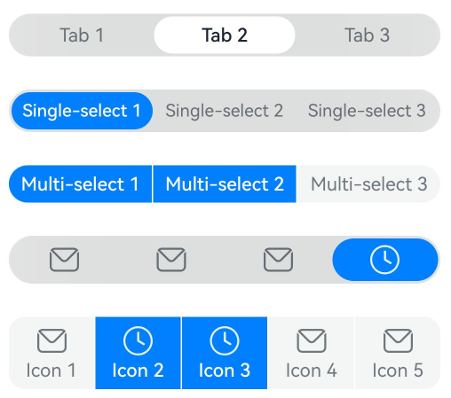
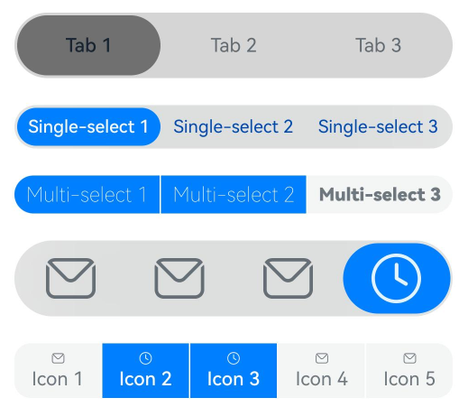
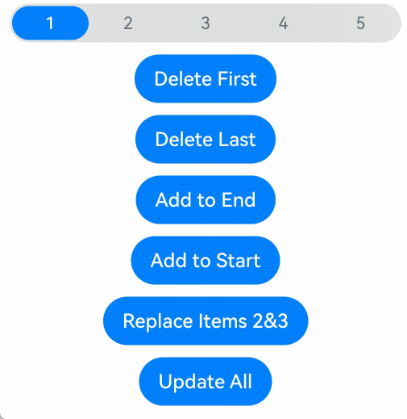
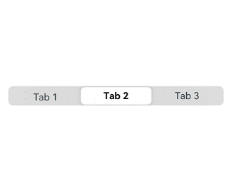
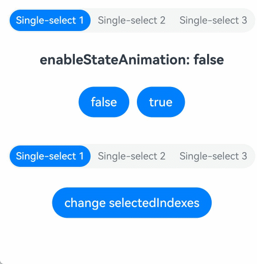

# SegmentButton

<!--Kit: ArkUI-->
<!--Subsystem: ArkUI-->
<!--Owner: @song-song-song-->
<!--Designer: @fenglinbailu-->
<!--Tester: @weixin_45530366-->
<!--Adviser: @Brilliantry_Rui-->
<!-- md-trans-meta sourceCommit=91dd63b1005715af7367fe6e4ce97d615a44a8bf translatedAt=2026-07-29T03:10:28.757Z pushedAt=2026-08-04T07:22:47.312Z -->

The segment button component includes tab-style segment buttons and capsule-style segment buttons. Tab-style segment buttons are suitable for switching between pages or content areas. Capsule-style segment buttons are suitable for single-select or multi-select scenarios, including capsule-style single-select segment buttons and capsule-style multi-select segment buttons. This component supports custom appearance attributes such as text color, font size, font weight, background color, image size, padding, and background blur material. It supports three button styles: text-only, icon-only, and icon + text. It also provides capabilities such as accessibility reading, layout direction mirroring, custom rounded corners, and property animation, making it suitable for scenarios where you need to quickly build a segmented selection interface that complies with design specifications.

> **NOTE**
>
> - This component is supported since API version 11. Updates will be marked with a superscript to indicate their earliest API version.
>
> - The APIs of this module can be used only in the stage model.

## Modules to Import

```ts
import { SegmentButton, SegmentButtonOptions, SegmentButtonItemOptionsArray } from '@kit.ArkUI';
```

## Child Components

Not supported

## Attributes

The [universal attributes](ts-component-general-attributes.md) are not supported.

## Events

The [universal events](ts-component-general-events.md) are not supported.

## SegmentButton

SegmentButton({ options: SegmentButtonOptions, selectedIndexes: number[], onItemClicked?: Callback\<number\>, maxFontScale: number \| Resource, enableStateAnimation: boolean })

**Decorator**: @Component

**System capability**: SystemCapability.ArkUI.ArkUI.Full

**Device behavior differences**: On wearables, calling this API results in a runtime exception indicating that the API is undefined. On other devices, the API works correctly.

> **NOTE**
>
> - The segment button does not support [universal attributes](ts-component-general-attributes.md). The segment button uses the maximum available width in the current area as the component width, and evenly distributes the width among the buttons based on the number of buttons. The segment button height automatically adapts to the button content (text and images), with a minimum height of 28 vp.
>
> - Attributes decorated by **@Prop** are optional parameters. They must be passed during construction only when used together with the **@Require** decorator.

| Name           | Type                                     | Mandatory| Decorator | Description                                                        |
| --------------- | --------------------------------------------- | ---- | ----------- | ------------------------------------------------------------ |
| options         | [SegmentButtonOptions](#segmentbuttonoptions) | Yes   | @ObjectLink | Configuration options of the segment button, used to set the button type (tab type or capsule type), appearance style (color, font, size, etc.), button content, selected state, and other attributes.<br>**Atomic service API:** This API can be used in atomic services since API version 12. |
| selectedIndexes | number[]                                      | Yes   | @Link       | Index of the selected item in the segment button. The index of the first item is 0, and subsequent items are numbered sequentially.<br>**NOTE**<br>`selectedIndexes` uses the [@Link decorator: two-way synchronization between parent and child](../../../ui/state-management/arkts-link.md). Only valid button indexes are supported (the first button index is 0, and subsequent indexes increase sequentially, with the maximum index being the number of buttons minus 1). If an invalid index is passed in, it does not take effect. If no item is selected, an empty array `[]` can be passed in.<br>**Atomic service API:** This API can be used in atomic services since API version 12. |
| onItemClicked<sup>13+</sup> | Callback\<number\> | No | - | Callback invoked when a segment button option is clicked. It receives the index of the clicked option as a parameter. If this parameter is not passed in, no callback is triggered upon clicking.<br>**Atomic service API:** This API can be used in atomic services since API version 13. |
| maxFontScale<sup>14+</sup> | number&nbsp;\|&nbsp;[Resource](ts-types.md#resource) | No | @Prop | Maximum font scale factor for the segment button option text, used to limit the upper bound of font scaling. Pass in this parameter when you need to control the font scale factor to fit a specific UI layout or avoid excessively large text.<br>Value range: [1, 2]<br>If the set value is less than 1, the value **1** is used. If the set value is greater than 2, the value **2** is used.<br>Default value: **1**<br>**Atomic service API:** This API can be used in atomic services since API version 14. |
| enableStateAnimation<sup>24+</sup>       | boolean   | No | @Prop | Whether to enable the attribute animation of the segment button when the **selectedIndexes** value is modified through a variable.<br>The value **true** means to enable the attribute animation of the segment button, and **false** means the opposite.<br>Default value: **false**<br>**Atomic service API:** This API can be used in atomic services since API version 24.<br>**Model restriction:** This API can be used only in the stage model. |

## SegmentButtonOptions

>**NOTE**
> 
> The component does not support custom font type settings.

Provides initial data and custom properties for the **SegmentButton** component.

**Decorator Type**: @Observed

### Properties

**System capability**: SystemCapability.ArkUI.ArkUI.Full

**Device behavior differences**: On wearables, calling this API results in a runtime exception indicating that the API is undefined. On other devices, the API works correctly.

<!--Table: 20%; 20%; 8%; 8%; 44%-->

| Name                 | Type                                                        | Read-Only                                                    | Optional                                                    | Description                                                      |
| ----------------------- | ------------------------------------------------------------ | ------------------------------------------------------------ | ------------------------------------------------------------ | ------------------------------------------------------------ |
| type                    | "tab" \| "capsule"                                  | No                                       | No                                       | Type of the segment button component.<br>**Note:**<br>**"tab"**: tab-type segment button, suitable for switching between pages or content areas.<br>**"capsule"**: capsule-type segment button, suitable for single-selection or multi-selection scenarios.<br>**Atomic service API:** This API can be used in atomic services since API version 12. |
| multiply                | boolean                                                      | No                                                  | No                                               | Whether the segment button component supports multi-selection.<br>**true**: multi-selection is supported; **false**: multi-selection is not supported.<br>For tab-type segment buttons (type is **"tab"**), **multiply** is forcibly set to **false**, and setting it to **true** does not take effect.<br>Default value: **false**<br>When the value is **undefined**, the default value is used.<br>**Atomic service API:** This API can be used in atomic services since API version 12. |
| buttons                 | [SegmentButtonItemOptionsArray](#segmentbuttonitemoptionsarray) | No | No | Button information of the segment button component, including icon and text information.<br>**Atomic service API:** This API can be used in atomic services since API version 12. |
| fontColor               | [ResourceColor](ts-types.md#resourcecolor)                   | No                 | No              | Text color of the segment button component in the unselected state.<br>When the value is **undefined**, the color is **$r('sys.color.ohos_id_color_text_secondary')**.<br>**Atomic service API:** This API can be used in atomic services since API version 12. |
| selectedFontColor       | [ResourceColor](ts-types.md#resourcecolor)                   | No                 | No               | Text color of the segment button component in the selected state.<br>When the value is **undefined** and **type** is **"tab"**, the color is `$r('sys.color.ohos_id_color_text_primary')`.<br>When **type** is **"capsule"**, the color is `$r('sys.color.ohos_id_color_foreground_contrary')`.<br>**Atomic service API:** This API can be used in atomic services since API version 12. |
| fontSize                | [DimensionNoPercentage](#dimensionnopercentage)              | No            | No           | Font size of the segment button component in the unselected state. Percentage setting is not supported.<br>Unit: fp<br>When the value is **undefined**, the font size is **$r('sys.float.ohos_id_text_size_body2')**.<br>**Atomic service API:** This API can be used in atomic services since API version 12. |
| selectedFontSize        | [DimensionNoPercentage](#dimensionnopercentage)              | No            | No           | Font size of the segment button component in the selected state. Percentage setting is not supported.<br>Unit: fp<br>When the value is **undefined**, the font size is **$r('sys.float.ohos_id_text_size_body2')**.<br>**Atomic service API:** This API can be used in atomic services since API version 12. |
| fontWeight              | [FontWeight](ts-appendix-enums.md#fontweight)                | No              | No             | Font weight of the segment button component in the unselected state.<br>When the value is **undefined**, the font weight is **FontWeight.Regular**.<br>**Atomic service API:** This API can be used in atomic services since API version 12. |
| selectedFontWeight      | [FontWeight](ts-appendix-enums.md#fontweight)                | No              | No             | Font weight of the segment button component in the selected state.<br>When the value is **undefined**, the font weight is **FontWeight.Medium**.<br>**Atomic service API:** This API can be used in atomic services since API version 12. |
| backgroundColor         | [ResourceColor](ts-types.md#resourcecolor)                   | No                 | No                | Background color of the segment button component.<br>When the value is **undefined**, the background color is **$r('sys.color.ohos_id_color_button_normal')**.<br>**Atomic service API:** This API can be used in atomic services since API version 12. |
| selectedBackgroundColor | [ResourceColor](ts-types.md#resourcecolor)                   | No                 | No                | Background color of the segment button component in the selected state.<br>When the value is **undefined** and type is **"tab"**, the background color is `$r('sys.color.segment_button_checked_foreground_color')`.<br>When type is **"capsule"**, the background color is `$r('sys.color.ohos_id_color_emphasize')`.<br>**Atomic service API:** This API can be used in atomic services since API version 12. |
| imageSize               | [SizeOptions](ts-types.md#sizeoptions)                       | No                     | No                    | Image size of the segment button component.<br>When the value is **undefined**, the image size is **{ width: 24, height: 24 }**.<br>Unit: vp <br>**NOTE**<br>The `imageSize` attribute takes effect only for icon-only buttons and icon + text buttons, and has no effect on text-only buttons.<br>**Atomic service API:** This API can be used in atomic services since API version 12. |
| buttonPadding           | [Padding](ts-types.md#padding)&nbsp;\|&nbsp;[Dimension](ts-types.md#dimension10) | No | No | Button padding of the segment button component.<br>When the value is **undefined**, the padding for icon-only buttons and text-only buttons is: `{ top: 4, right: 8, bottom: 4, left: 8 }`<br>The padding for icon + text buttons is: `{ top: 6, right: 8, bottom: 6, left: 8 }` <br>Unit: vp <br>**Atomic service API:** This API can be used in atomic services since API version 12. |
| textPadding             | [Padding](ts-types.md#padding)&nbsp;\|&nbsp;[Dimension](ts-types.md#dimension10) | No | No | Text padding of the segment button component.<br>When the value is **undefined**, the text padding is **0**.<br>Unit: vp<br>**Atomic service API:** This API can be used in atomic services since API version 12. |
| localizedButtonPadding<sup>12+</sup> | [LocalizedPadding](ts-types.md#localizedpadding12)                 | No               | Yes             | Button padding of the segment button component, which supports adaptation to the layout direction (LTR/RTL).<br>Default value:<br>For icon-only buttons and text-only buttons: `{ top: LengthMetrics.vp(4), end: LengthMetrics.vp(8), bottom: LengthMetrics.vp(4), start: LengthMetrics.vp(8) }`<br>For icon + text buttons: `{ top: LengthMetrics.vp(6), end: LengthMetrics.vp(8), bottom: LengthMetrics.vp(6), start: LengthMetrics.vp(8) }`<br>When the value is **undefined**, the default value is used.<br>**Atomic service API:** This API can be used in atomic services since API version 12. |
| localizedTextPadding<sup>12+</sup>   | [LocalizedPadding](ts-types.md#localizedpadding12)                 | No               | Yes               | Text padding, which supports adaptation to the layout direction (LTR/RTL).<br>Default value: **0**<br>Unit: vp<br>When the value is **undefined**, the default value is used.<br>**Atomic service API:** This API can be used in atomic services since API version 12. |
| direction<sup>12+</sup> | [Direction](ts-appendix-enums.md#direction)                                             | No                                           | Yes                                           | Layout direction of the segment button component.<br>Default value: **Direction.Auto**<br>When the value is **undefined**, the default value is used.<br>**Atomic service API:** This API can be used in atomic services since API version 12. |
| backgroundBlurStyle     | [BlurStyle](ts-universal-attributes-background.md#blurstyle9)                 | No               | No              | Background blur material of the segment button component.<br>Default value: **BlurStyle.NONE**<br>When the value is **undefined**, the default value is used.<br>**Atomic service API:** This API can be used in atomic services since API version 12. |
| borderRadiusMode<sup>20+</sup> | [BorderRadiusMode](#borderradiusmode20) | No | Yes | Border radius mode, which controls how the corner radius is calculated.<br>Default value: **BorderRadiusMode.DEFAULT**<br>When the value is **undefined**, the default value is used.<br>**Atomic service API:** This API can be used in atomic services since API version 20. |
| backgroundBorderRadius<sup>20+</sup> | [LengthMetrics](../js-apis-arkui-graphics.md#lengthmetrics12)   | No | Yes | Border radius of the overall container of the segment button.<br>**NOTE**<br>This attribute takes effect only when **borderRadiusMode** is **BorderRadiusMode.CUSTOM**.<br>For capsule-type multi-selection segment buttons (**type** is **"capsule"** and **multiply** is **true**), this attribute does not take effect. Use **itemBorderRadius** to configure the corner radius instead.<br>The corner radius is limited by the component size. The maximum value is half of the component width or height. Percentage setting is not supported. When the value exceeds the maximum, it is automatically corrected to the maximum. When a percentage is used, the default value is used.<br>Default value: `$r('sys.float.segmentbutton_container_shape')`<br>When the value is **undefined**, the default value is used.<br>**Atomic service API:** This API can be used in atomic services since API version 20. |
| itemBorderRadius<sup>20+</sup> | [LengthMetrics](../js-apis-arkui-graphics.md#lengthmetrics12)   | No | Yes | Border radius of the button items in the segment button.<br>**NOTE**<br>This attribute takes effect only when **borderRadiusMode** is **BorderRadiusMode.CUSTOM**.<br>For capsule-type multi-selection segment buttons (**type** is **"capsule"** and **multiply** is **true**), only the corner radius of the items at both ends can be controlled.<br>The corner radius is limited by the component size. The maximum value is half of the component width or height. Percentage setting is not supported. When the value exceeds the maximum, it is automatically corrected to the maximum. When a percentage is used, the default value is used.<br>Default value: `$r('sys.float.segmentbutton_selected_background_shape')`<br>When the value is **undefined**, the default value is used.<br>**Atomic service API:** This API can be used in atomic services since API version 20. |
| backgroundSystemMaterial | [uiMaterial.Material](../arkts-apis-uimaterial.md#material)    | No | Yes | System material of the background of the segment button component. Different system materials have different properties and produce different effects. After a material is passed in, the animation effect of **SegmentButton** changes.<br>For capsule-type multi-selection segment buttons (**type** is **"capsule"** and **multiply** is **true**), this attribute does not take effect.<br>Default value: no material effect.<br>**Since:** 26.0.0 <br>**Atomic service API:** This API can be used in atomic services since API version 26.0.0. <br>**Model restriction:** This API can be used only in the stage model. |

> **NOTE**
>
> Starting from API version 26.0.0, except for capsule-style multi-select buttons (where type is **"capsule"** and **multiply** is **true**), when **backgroundSystemMaterial** is set to a system material with automatic color inversion, **fontColor** and **selectedFontColor** use special system resources that support color inversion, and the colors automatically adapt to the inverted material background color.

### constructor

constructor(options: TabSegmentButtonOptions \| CapsuleSegmentButtonOptions)

Constructor.

**Atomic service API**: This API can be used in atomic services since API version 12.

**System capability**: SystemCapability.ArkUI.ArkUI.Full

**Device behavior differences**: On wearables, calling this API results in a runtime exception indicating that the API is undefined. On other devices, the API works correctly.

**Parameters**

| Name| Type                                                    | Mandatory| Description                |
| ------- | ------------------------------------------------------------ | ---- | -------------------- |
| options | [TabSegmentButtonOptions](#tabsegmentbuttonoptions) \|   [CapsuleSegmentButtonOptions](#capsulesegmentbuttonoptions) | Yes| Configuration options for tab-style or capsule-style segment buttons.|

### tab

static tab(options: TabSegmentButtonConstructionOptions): SegmentButtonOptions

Creates a SegmentButtonOptions class to define tabs.

**Atomic service API**: This API can be used in atomic services since API version 12.

**System capability**: SystemCapability.ArkUI.ArkUI.Full

**Device behavior differences**: On wearables, calling this API results in a runtime exception indicating that the API is undefined. On other devices, the API works correctly.

**Parameters**

| Name | Type                                                        | Mandatory| Description                |
| ------- | ------------------------------------------------------------ | ---- | -------------------- |
| options | [TabSegmentButtonConstructionOptions](#tabsegmentbuttonconstructionoptions) | Yes  | Configuration options for tab-style segment buttons.|

**Return value**

| Type  | Description                    |
| ------ | ------------------------ |
| [SegmentButtonOptions](#segmentbuttonoptions) | Options of the segment button, used to define a tab-type segment button. |

### capsule

static capsule(options: CapsuleSegmentButtonConstructionOptions): SegmentButtonOptions

Creates a capsule-style **SegmentButtonOptions** instance, which is used to define capsule-style segment buttons.

**Atomic service API**: This API can be used in atomic services since API version 12.

**System capability**: SystemCapability.ArkUI.ArkUI.Full

**Device behavior differences**: On wearables, calling this API results in a runtime exception indicating that the API is undefined. On other devices, the API works correctly.

**Parameters**

| Name| Type                                                        | Mandatory| Description                       |
| ------- | ------------------------------------------------------------ | ---- | --------------------------- |
| options | [CapsuleSegmentButtonConstructionOptions](#capsulesegmentbuttonconstructionoptions) | Yes  | Configuration options for capsule-style segment buttons.|

**Return value**

| Type  | Description                    |
| ------ | ------------------------ |
| [SegmentButtonOptions](#segmentbuttonoptions) | Segment button options for the capsule type. |

## DimensionNoPercentage

type DimensionNoPercentage = PX \| VP \| FP \| LPX \| Resource

The percentage length union type is not supported.

**Atomic service API**: This API can be used in atomic services since API version 12.

**System capability**: SystemCapability.ArkUI.ArkUI.Full

**Device behavior differences**: On wearables, calling this API results in a runtime exception indicating that the API is undefined. On other devices, the API works correctly.

| Type                            | Description                                         |
| -------------------------------- | --------------------------------------------- |
| [PX](ts-types.md#px10)           | Length in px. |
| [VP](ts-types.md#vp10)           | Length in vp. |
| [FP](ts-types.md#fp10)           | Length in fp. |
| [LPX](ts-types.md#lpx10)         | Length in lpx.|
| [Resource](ts-types.md#resource) | Resource reference type, which is used to set the value of a component attribute.         |

## CommonSegmentButtonOptions

Defines the customizable attributes of a segment button component.

**System capability**: SystemCapability.ArkUI.ArkUI.Full

**Device behavior differences**: On wearables, calling this API results in a runtime exception indicating that the API is undefined. On other devices, the API works correctly.

| Name                 | Type                                                        | Read-Only                                                    | Optional                                                    | Description                                                      |
| ----------------------- | ------------------------------------------------------------ | ------------------------------------------------------------ | ------------------------------------------------------------ | ------------------------------------------------------------ |
| fontColor               | [ResourceColor](ts-types.md#resourcecolor)                   | No                 | Yes                 | Text color of the button in unselected state.<br>Default value: **$r('sys.color.ohos_id_color_text_secondary')**<br>If the value is **undefined**, the default value is used.<br>**Atomic service API:** This API can be used in atomic services since API version 12. |
| selectedFontColor       | [ResourceColor](ts-types.md#resourcecolor)                   | No                 | Yes                 | Text color of the button in selected state.<br>Default value:<br>When type is **"tab"**, the default value is `$r('sys.color.ohos_id_color_text_primary')`.<br>When type is **"capsule"**, the default value is `$r('sys.color.ohos_id_color_foreground_contrary')`.<br>If the value is **undefined**, the default value is used.<br>**Atomic service API:** This API can be used in atomic services since API version 12. |
| fontSize                | [DimensionNoPercentage](#dimensionnopercentage)              | No            | Yes            | Font size of the button in unselected state (percentage setting is not supported).<br>Default value: **$r('sys.float.ohos_id_text_size_body2')**<br>Unit: fp<br>If the value is **undefined**, the default value is used.<br>**Atomic service API:** This API can be used in atomic services since API version 12. |
| selectedFontSize        | [DimensionNoPercentage](#dimensionnopercentage)              | No            | Yes            | Font size of the button in selected state (percentage setting is not supported).<br>Default value: **$r('sys.float.ohos_id_text_size_body2')**<br>Unit: fp<br>If the value is **undefined**, the default value is used.<br>**Atomic service API:** This API can be used in atomic services since API version 12. |
| fontWeight              | [FontWeight](ts-appendix-enums.md#fontweight)                | No              | Yes              | Font weight of the button in unselected state.<br>Default value: **FontWeight.Regular**<br>If the value is **undefined**, the default value is used.<br>**Atomic service API:** This API can be used in atomic services since API version 12. |
| selectedFontWeight      | [FontWeight](ts-appendix-enums.md#fontweight)                | No              | Yes              | Font weight of the button in selected state.<br>Default value: **FontWeight.Medium**<br>If the value is **undefined**, the default value is used.<br>**Atomic service API:** This API can be used in atomic services since API version 12. |
| backgroundColor         | [ResourceColor](ts-types.md#resourcecolor)                   | No                 | Yes                 | Color of the background.<br>Default value: **$r('sys.color.ohos_id_color_button_normal')**<br>If the value is **undefined**, the default value is used.<br>**Atomic service API:** This API can be used in atomic services since API version 12. |
| selectedBackgroundColor | [ResourceColor](ts-types.md#resourcecolor)                   | No                 | Yes                 | Color of the background for the button in selected state.<br>Default value:<br>When **type** is **"tab"**, the default value is `$r('sys.color.segment_button_checked_foreground_color')`.<br>When **type** is **"capsule"**, the default value is `$r('sys.color.ohos_id_color_emphasize')`.<br>If the value is **undefined**, the default value is used.<br>**Atomic service API:** This API can be used in atomic services since API version 12. |
| imageSize               | [SizeOptions](ts-types.md#sizeoptions)                       | No                     | Yes                     | Image size.<br>Default value: **{ width: 24, height: 24 }**<br>Unit: vp<br>If the value is **undefined**, the default value is used.<br>**NOTE**<br>The `imageSize` attribute takes effect only for icon buttons and icon + text buttons, and does not respond on text-only buttons.<br>**Atomic service API:** This API can be used in atomic services since API version 12. |
| buttonPadding           | [Padding](ts-types.md#padding)&nbsp;\|&nbsp;[Dimension](ts-types.md#dimension10) | No | Yes | Button padding.<br>Default value:<br>For icon-only buttons and text-only buttons: `{ top: 4, right: 8, bottom: 4, left: 8 }`<br>For icon+text buttons: `{ top: 6, right: 8, bottom: 6, left: 8 }`<br>Unit: vp<br>If the value is **undefined**, the default value is used.<br>**Atomic service API:** This API can be used in atomic services since API version 12. |
| textPadding             | [Padding](ts-types.md#padding)&nbsp;\|&nbsp;[Dimension](ts-types.md#dimension10) | No | Yes | Text padding.<br>Default value: **0**<br>Unit: vp<br>If the value is **undefined**, the default value is used.<br>**Atomic service API:** This API can be used in atomic services since API version 12. |
| localizedButtonPadding<sup>12+</sup> | [LocalizedPadding](ts-types.md#localizedpadding12)                 | No               | Yes               | Button padding, which supports adaptive adjustment based on the layout direction (LTR/RTL).<br>Default value:<br>For icon-only buttons and text-only buttons: `{ top: LengthMetrics.vp(4), end: LengthMetrics.vp(8), bottom: LengthMetrics.vp(4), start: LengthMetrics.vp(8) }`<br>For icon + text buttons: `{ top: LengthMetrics.vp(6), end: LengthMetrics.vp(8), bottom: LengthMetrics.vp(6), start: LengthMetrics.vp(8) }`<br>If the value is **undefined**, the default value is used.<br>**Atomic service API:** This API can be used in atomic services since API version 12. |
| localizedTextPadding<sup>12+</sup>   | [LocalizedPadding](ts-types.md#localizedpadding12)                 | No               | Yes               | Text padding, which supports adaptive adjustment based on the layout direction (LTR/RTL).<br>Default value: **0**<br>Unit: vp<br>If the value is **undefined**, the default value is used.<br>**Atomic service API:** This API can be used in atomic services since API version 12. |
| direction<sup>12+</sup> | [Direction](ts-appendix-enums.md#direction)                                             | No                                           | Yes                                           | Layout direction.<br>Default value: **Direction.Auto**<br>If the value is **undefined**, the default value is used.<br>**Atomic service API:** This API can be used in atomic services since API version 12. |
| backgroundBlurStyle     | [BlurStyle](ts-universal-attributes-background.md#blurstyle9)                 | No               | Yes               | Background blur material.<br>Default value: **BlurStyle.NONE**<br>If the value is **undefined**, the default value is used.<br>**Atomic service API:** This API can be used in atomic services since API version 12. |
| borderRadiusMode<sup>20+</sup> | [BorderRadiusMode](#borderradiusmode20) | No | Yes | Border radius mode, which controls the radius calculation method.<br>Default value: **BorderRadiusMode.DEFAULT**<br>If the value is **undefined**, the default value is used.<br>**Atomic service API:** This API can be used in atomic services since API version 20. |
| backgroundBorderRadius<sup>20+</sup> | [LengthMetrics](../js-apis-arkui-graphics.md#lengthmetrics12)   | No | Yes | Border radius of the overall container of the segment button.<br>**NOTE**<br>This attribute takes effect only when **borderRadiusMode** is set to **BorderRadiusMode.CUSTOM**.<br>For capsule-type multi-select segment buttons (**type** is **"capsule"** and **multiply** is **true**), this attribute does not take effect. Use **itemBorderRadius** to configure the radius instead.<br>The radius size is limited by the component size. The maximum value is half of the component width or height. Percentage setting is not supported. If the value exceeds the maximum, it is automatically corrected to the maximum. If a percentage is used, the default value is used.<br>Default value: `$r('sys.float.segmentbutton_container_shape')`<br>If the value is **undefined**, the default value is used.<br>**Atomic service API:** This API can be used in atomic services since API version 20. |
| itemBorderRadius<sup>20+</sup> | [LengthMetrics](../js-apis-arkui-graphics.md#lengthmetrics12)   | No | Yes | Border radius of the button items in the segment button.<br>**NOTE**<br>This attribute takes effect only when **borderRadiusMode** is set to **BorderRadiusMode.CUSTOM**.<br>For capsule-type multi-select segment buttons (**type** is **"capsule"** and **multiply** is **true**), only the radius of the options at both ends can be controlled.<br>The radius size is limited by the component size. The maximum value is half of the component width or height. Percentage setting is not supported. If the value exceeds the maximum, it is automatically corrected to the maximum. If a percentage is used, the default value is used.<br>Default value: `$r('sys.float.segmentbutton_selected_background_shape')`<br>If the value is **undefined**, the default value is used.<br>**Atomic service API:** This API can be used in atomic services since API version 20. |
| backgroundSystemMaterial | [uiMaterial.Material](../arkts-apis-uimaterial.md#material)   | No | Yes | System material of the background of the segment button component. Different system materials have different properties and produce different effects. After a material is passed in, the animation effects of the **SegmentButton** change.<br>For capsule-type multi-select segment buttons (type is **"capsule"** and **multiply** is **true**), this attribute does not take effect.<br>Default value: no material effect.<br>Since API version 26.0.0, except for capsule-type multi-select segment buttons (**type** is **"capsule"** and **multiply** is **true**), when **backgroundSystemMaterial** is set to a system material with automatic inverted color, **fontColor** and **selectedFontColor** use special system resources that support inverted color, and the colors automatically adapt to the inverted color of the material background color.<br>**Since:** 26.0.0<br>**Atomic service API:** This API can be used in atomic services since API version 26.0.0.<br>**Model restriction:** This API can be used only in the stage model. |

## BorderRadiusMode<sup>20+</sup>

Enumerates the border radius modes for the **SegmentButton** component, which are used to control the border radius calculation method.

**Atomic service API**: This API can be used in atomic services since API version 20.

**System capability**: SystemCapability.ArkUI.ArkUI.Full

**Device behavior differences**: On wearables, calling this API results in a runtime exception indicating that the API is undefined. On other devices, the API works correctly.

| Name   |Value| Description                            |
| ------- | - |-------------------------------- |
| DEFAULT | 0 |Default mode, where the framework automatically calculates the border radius.|
| CUSTOM  | 1 |Custom mode, where the border radius is set by the developer.|

## TabSegmentButtonConstructionOptions

Creates a SegmentButtonOptions object of the tab type.

Inherits from [CommonSegmentButtonOptions](#commonsegmentbuttonoptions).

**Atomic service API**: This API can be used in atomic services since API version 12.

**System capability**: SystemCapability.ArkUI.ArkUI.Full

**Device behavior differences**: On wearables, calling this API results in a runtime exception indicating that the API is undefined. On other devices, the API works correctly.

| Name   | Type                                                        | Read-Only| Optional| Description      |
| ------- | ------------------------------------------------------------ | ---- | ---- | ---------- |
| buttons | [ItemRestriction](#itemrestriction)\<[SegmentButtonTextItem](#segmentbuttontextitem)> | No  | No  | Button information.|

## CapsuleSegmentButtonConstructionOptions

Represents configuration options for creating a **SegmentButton** component consisting of capsule-style segment buttons.

Inherits from [CommonSegmentButtonOptions](#commonsegmentbuttonoptions).

**Atomic service API**: This API can be used in atomic services since API version 12.

**System capability**: SystemCapability.ArkUI.ArkUI.Full

**Device behavior differences**: On wearables, calling this API results in a runtime exception indicating that the API is undefined. On other devices, the API works correctly.

| Name     | Type                                             | Read-Only| Optional| Description                       |
| -------- | ------------------------------------------------- | ---- | ----------------------------- | ----------------------------- |
| buttons  | [SegmentButtonItemTuple](#segmentbuttonitemtuple) | No| No | Button information.                   |
| multiply | boolean                                           | No | Yes | Whether multiple items can be selected.<br>Default value: **false**.<br>If the value is **undefined**, the default value is used.<br><br>**true**: Multi-selection is allowed.<br>**false**: Multi-selection is not allowed.|

## ItemRestriction

type ItemRestriction\<T> = [T, T, T?, T?, T?]

Tuple type that stores button information.

**Atomic service API**: This API can be used in atomic services since API version 12.

**System capability**: SystemCapability.ArkUI.ArkUI.Full

**Device behavior differences**: On wearables, calling this API results in a runtime exception indicating that the API is undefined. On other devices, the API works correctly.

| Type                                     | Description                             |
| ----------------------------------------- | --------------------------------- |
|[T, T, T?, T?, T?] | A tuple that contains two to five elements of the same type.|

>**NOTE**
>
>A **SegmentButton** component supports two to five buttons.

## SegmentButtonItemTuple

type SegmentButtonItemTuple = ItemRestriction\<SegmentButtonTextItem> \| ItemRestriction\<SegmentButtonIconItem> \| ItemRestriction\<SegmentButtonIconTextItem>

Represents the tuple union type used to store button information.

**Atomic service API**: This API can be used in atomic services since API version 12.

**System capability**: SystemCapability.ArkUI.ArkUI.Full

**Device behavior differences**: On wearables, calling this API results in a runtime exception indicating that the API is undefined. On other devices, the API works correctly.

| Type                                                        | Description                     |
| ------------------------------------------------------------ | ------------------------- |
| [ItemRestriction](#itemrestriction)\<[SegmentButtonTextItem](#segmentbuttontextitem)\> | A tuple of text-only button information.   |
| [ItemRestriction](#itemrestriction)\<[SegmentButtonIconItem](#segmentbuttoniconitem)\> | A tuple of icon-only button information.   |
| [ItemRestriction](#itemrestriction)\<[SegmentButtonIconTextItem](#segmentbuttonicontextitem)\> | A tuple of icon and text button information.|

## SegmentButtonItemArray

type SegmentButtonItemArray = Array\<SegmentButtonTextItem> \| Array\<SegmentButtonIconItem> \| Array\<SegmentButtonIconTextItem>

Represents the array union type used to store button information.

**Atomic service API**: This API can be used in atomic services since API version 12.

**System capability**: SystemCapability.ArkUI.ArkUI.Full

**Device behavior differences**: On wearables, calling this API results in a runtime exception indicating that the API is undefined. On other devices, the API works correctly.

| Type                                                        | Description                     |
| ------------------------------------------------------------ | ------------------------- |
| Array\<[SegmentButtonTextItem](#segmentbuttontextitem)\>     | An array of text-only button information.   |
| Array\<[SegmentButtonIconItem](#segmentbuttoniconitem)\>     | An array of icon-only button information.   |
| Array\<[SegmentButtonIconTextItem](#segmentbuttonicontextitem)\> | An array of icon and text button information.|

## SegmentButtonItemOptionsArray

Represents an array for storing button information.

**Decorator Type**: @Observed

>**NOTE**
>
> The SegmentButtonItemOptionsArray can save only two to five button information elements.

### constructor

constructor(elements: SegmentButtonItemTuple)

Constructor.

**Atomic service API**: This API can be used in atomic services since API version 12.

**System capability**: SystemCapability.ArkUI.ArkUI.Full

**Device behavior differences**: On wearables, calling this API results in a runtime exception indicating that the API is undefined. On other devices, the API works correctly.

**Parameters**

| Name  | Type                                             | Mandatory| Description      |
| -------- | ------------------------------------------------- | ---- | ---------- |
| elements | [SegmentButtonItemTuple](#segmentbuttonitemtuple) | Yes | Button information tuple used to initialize the array, containing 2 to 5 button option elements, each defining attributes such as the icon and text of a button. |

> **NOTE**
>
> **SegmentButtonItemOptionsArray** supports storing only 2 to 5 button information elements.

### push

push(...items: SegmentButtonItemArray): number

Adds the specified elements to the end of this array and returns the new length of the array.

**Atomic service API**: This API can be used in atomic services since API version 12.

**System capability**: SystemCapability.ArkUI.ArkUI.Full

**Device behavior differences**: On wearables, calling this API results in a runtime exception indicating that the API is undefined. On other devices, the API works correctly.

**Parameters**

| Name| Type                                             | Mandatory| Description                                                       |
| ------ | ------------------------------------------------- | ---- | ----------------------------------------------------------- |
| items  | [SegmentButtonItemArray](#segmentbuttonitemarray) | No   | Array of button information to be added.<br>Default value: no button information elements are passed in. |

**Return value**

| Type  | Description                    |
| ------ | ------------------------ |
| number | Length of the array after the elements are added.|

> **NOTE**
>
> The segment button component array supports storing only 2 to 5 button information elements. When the number of elements to be added causes the array to exceed 5, the operation is not performed and the current array length is returned.

### pop

pop(): SegmentButtonItemOptions \| undefined

Removes the last element from this array and returns that element.

**Atomic service API**: This API can be used in atomic services since API version 12.

**System capability**: SystemCapability.ArkUI.ArkUI.Full

**Device behavior differences**: On wearables, calling this API results in a runtime exception indicating that the API is undefined. On other devices, the API works correctly.

**Return value**

| Type                                                        | Description          |
| ------------------------------------------------------------ | -------------- |
| [SegmentButtonItemOptions](#segmentbuttonitemoptions)&nbsp;\|&nbsp;undefined | Element removed from the array.|

> **NOTE**
>
> The segment button component array supports storing only 2 to 5 button information elements. If the number of buttons after removal is fewer than 2, the operation is not performed, **undefined** is returned, and the array remains unchanged.

### shift

shift(): SegmentButtonItemOptions \| undefined

Removes the first element from this array and returns that element.

**Atomic service API**: This API can be used in atomic services since API version 12.

**System capability**: SystemCapability.ArkUI.ArkUI.Full

**Device behavior differences**: On wearables, calling this API results in a runtime exception indicating that the API is undefined. On other devices, the API works correctly.

**Return value**

| Type                                                        | Description          |
| ------------------------------------------------------------ | -------------- |
| [SegmentButtonItemOptions](#segmentbuttonitemoptions)&nbsp;\|&nbsp;undefined | Element removed from the array.|

> **NOTE**
>
> The segment button component array supports storing only 2 to 5 button information elements. If the number of buttons after removal is fewer than 2, the operation is not performed, **undefined** is returned, and the array remains unchanged.

### unshift

unshift(...items: SegmentButtonItemArray): number

Adds new elements to the beginning of the array and returns the length of the array after the addition.

**Atomic service API**: This API can be used in atomic services since API version 12.

**System capability**: SystemCapability.ArkUI.ArkUI.Full

**Device behavior differences**: On wearables, calling this API results in a runtime exception indicating that the API is undefined. On other devices, the API works correctly.

**Parameters**

| Name | Type                                             | Mandatory| Description                |
| ----- | ------------------------------------------------- | ---- | -------------------- |
| items | [SegmentButtonItemArray](#segmentbuttonitemarray) | No | Array of button information to add.<br>Default value: no button information elements are passed in. |

**Return value**

| Type  | Description                  |
| ------ | ---------------------- |
| number | Length of the array after the elements are added.|

> **NOTE**
>
> The segment button component array supports storing only 2 to 5 button information elements. When the number of elements to be added causes the array to exceed 5, the operation is not performed and the current array length is returned.

### splice

splice(start: number, deleteCount: number, ...items: SegmentButtonItemOptions[]): SegmentButtonItemOptions[]

Changes the contents of this array by removing the specified number of elements from the specified position and adding new elements in place. This API returns an array containing the removed elements.

**Atomic service API**: This API can be used in atomic services since API version 12.

**System capability**: SystemCapability.ArkUI.ArkUI.Full

**Device behavior differences**: On wearables, calling this API results in a runtime exception indicating that the API is undefined. On other devices, the API works correctly.

**Parameters**

| Name     | Type                                                   | Mandatory| Description                                                        |
| ----------- | ------------------------------------------------------- | ---- | ------------------------------------------------------------ |
| start       | number                                                  | Yes   | Start position of the element to delete, counting from 0.                                         |
| deleteCount | number                                                  | Yes   | Number of elements to delete. The value range is greater than or equal to 0. If **deleteCount** exceeds the remaining length of the array, all remaining elements starting from the start position are deleted.      |
| items       | [SegmentButtonItemOptions](#segmentbuttonitemoptions)[] | No  | Element to be added to the array from start.<br>Default value: If no element is specified, the element is deleted from the array.|

**Return value**

| Type                                                   | Description                          |
| ------------------------------------------------------- | ------------------------------ |
| [SegmentButtonItemOptions](#segmentbuttonitemoptions)[] | An array containing the removed elements.|

> **NOTE**
>
> The segment button component array stores only 2 to 5 button information elements. If the operation result would cause the number of buttons to be fewer than 2 or more than 5, the operation is not performed and an empty array is returned. If a deletion operation causes the number to be fewer than 2, or an addition operation causes the number to exceed 5, the entire splice operation does not take effect and the array remains in its original state.

### create

static create(elements: SegmentButtonItemTuple): SegmentButtonItemOptionsArray

Creates a **SegmentButtonItemOptionsArray** object. It accepts the same parameters as the constructor and has the same functionality. You can choose either as required.

**Atomic service API**: This API can be used in atomic services since API version 12.

**System capability**: SystemCapability.ArkUI.ArkUI.Full

**Device behavior differences**: On wearables, calling this API results in a runtime exception indicating that the API is undefined. On other devices, the API works correctly.

**Parameters**

| Name  | Type                                             | Mandatory| Description      |
| -------- | ------------------------------------------------- | ---- | ---------- |
| elements | [SegmentButtonItemTuple](#segmentbuttonitemtuple) | Yes | Button information tuple used to initialize the array. It contains 2 to 5 button option elements, each defining attributes such as the icon and text of a button. |

**Return value**

| Type                                                        | Description                                         |
| ------------------------------------------------------------ | --------------------------------------------- |
| [SegmentButtonItemOptionsArray](#segmentbuttonitemoptionsarray) | **SegmentButtonItemOptionsArray** object created, which is an array for storing button information. |

> **NOTE**
>
> **SegmentButtonItemOptionsArray** supports storing only 2 to 5 button information elements.

## TabSegmentButtonOptions

Provides configuration options for tab-style segment buttons. Inherits from [TabSegmentButtonConstructionOptions](#tabsegmentbuttonconstructionoptions).

**Atomic service API**: This API can be used in atomic services since API version 12.

**System capability**: SystemCapability.ArkUI.ArkUI.Full

**Device behavior differences**: On wearables, calling this API results in a runtime exception indicating that the API is undefined. On other devices, the API works correctly.

| Name| Type | Read-Only| Optional| Description                  |
| ---- | ----- | ---- | ---- | ---------------------- |
| type | "tab" | No  | No  | Type of the segment buttons, which is **"tab"** in this case.|

## CapsuleSegmentButtonOptions

Provides configuration options for capsule-style segment buttons. Inherits from [CapsuleSegmentButtonConstructionOptions](#capsulesegmentbuttonconstructionoptions).

**Atomic service API**: This API can be used in atomic services since API version 12.

**System capability**: SystemCapability.ArkUI.ArkUI.Full

**Device behavior differences**: On wearables, calling this API results in a runtime exception indicating that the API is undefined. On other devices, the API works correctly.

| Name| Type     | Read-Only| Optional| Description                       |
| ---- | --------- | ---- | ----------------------------- | ----------------------------- |
| type | "capsule" | No | No| Type of the segment buttons, which is **"capsule"** in this case.|

## SegmentButtonTextItem

Text button information.

**System capability**: SystemCapability.ArkUI.ArkUI.Full

**Device behavior differences**: On wearables, calling this API results in a runtime exception indicating that the API is undefined. On other devices, the API works correctly.

| Name| Type                                  | Read-Only| Optional| Description     |
| ---- | -------------------------------------- | ---- | ---------- | ---------- |
| text | [ResourceStr](ts-types.md#resourcestr) | No  | No  | Button text.<br>**Atomic service API:** This API can be used in atomic services since API version 12. |
| accessibilityLevel<sup>13+</sup> | string | No  | Yes  | Accessibility level, which controls whether the current component can be recognized by accessibility services.<br>Supported values:<br>**"auto"**: The current component can be recognized by accessibility services.<br>**"yes"**: The current component can be recognized by accessibility services.<br>**"no"**: The current component cannot be recognized by accessibility services.<br>**"no-hide-descendants"**: The current component and all its child components cannot be recognized by accessibility services.<br>Default value: **"auto"**<br>If the value is **undefined**, the default value is used.<br>**Atomic service API:** This API can be used in atomic services since API version 13. |
| accessibilityDescription<sup>13+</sup> | [ResourceStr](ts-types.md#resourcestr) | No  | Yes  | Accessibility description, which provides further explanation of the current component for users. Developers can set a relatively detailed explanatory text for this attribute to help users understand the operation to be performed, such as the possible consequences of the operation, especially when these consequences cannot be learned from the component's own attributes and accessibility text. If a component has both a text attribute and an accessibility description attribute, when the component is selected, the text attribute is announced first, followed by the content of the accessibility description attribute.<br>Default value: empty string.<br>If the value is **undefined**, the default value is used.<br>**Atomic service API:** This API can be used in atomic services since API version 13. |

## SegmentButtonIconItem

Icon button information.

**System capability**: SystemCapability.ArkUI.ArkUI.Full

**Device behavior differences**: On wearables, calling this API results in a runtime exception indicating that the API is undefined. On other devices, the API works correctly.

|Name     | Type                                  | Read-Only| Optional| Description              |
| ------------ | -------------------------------------- | ---- | -------------------- | -------------------- |
| icon         | [ResourceStr](ts-types.md#resourcestr) | No  | No  | Icon of the button in unselected state.<br>If the value is **undefined**, no icon is displayed.<br>**Note:** **icon** and **selectedIcon** must be set together. Setting either alone is ineffective.<br>**Atomic service API:** This API can be used in atomic services since API version 12. |
| iconAccessibilityText<sup>13+</sup>         | [ResourceStr](ts-types.md#resourcestr) | No  | Yes  | Accessibility text for the icon of the button in unselected state.<br>Default value: empty string.<br>If the value is **undefined**, the default value is used.<br>**Atomic service API:** This API can be used in atomic services since API version 13. |
| selectedIcon | [ResourceStr](ts-types.md#resourcestr) | No  | No  | Icon of the button in selected state.<br>If the value is **undefined**, no icon is displayed.<br>**Note:** **icon** and **selectedIcon** must be set together. Setting either alone is ineffective.<br>**Atomic service API:** This API can be used in atomic services since API version 12. |
| selectedIconAccessibilityText<sup>13+</sup> | [ResourceStr](ts-types.md#resourcestr) | No  | Yes  | Accessibility text for the icon of the button in selected state.<br>Default value: empty string.<br>If the value is **undefined**, the default value is used.<br>**Atomic service API:** This API can be used in atomic services since API version 13. |
| accessibilityLevel<sup>13+</sup> | string | No  | Yes  | Accessibility level, which controls whether the current component can be recognized by accessibility services.<br>Supported values:<br>**"auto"**: The current component can be recognized by accessibility services.<br>**"yes"**: The current component can be recognized by accessibility services.<br>**"no"**: The current component cannot be recognized by accessibility services.<br>**"no-hide-descendants"**: The current component and all its child components cannot be recognized by accessibility services.<br>Default value: **"auto"**<br>If the value is **undefined**, the default value is used.<br>**Atomic service API:** This API can be used in atomic services since API version 13. |
| accessibilityDescription<sup>13+</sup> | [ResourceStr](ts-types.md#resourcestr) | No  | Yes  | Accessibility description, which provides additional explanation about the current component for users. Developers can set a relatively detailed explanatory text for this attribute to help users understand the operation to be performed, such as the potential consequences of the operation, especially when these consequences cannot be learned from the component's own attributes and accessibility text. If a component has both a text attribute and an accessibility description attribute, the text attribute is announced first when the component is selected, followed by the content of the accessibility description attribute.<br>Default value: empty string.<br>If the value is **undefined**, the default value is used.<br>**Atomic service API:** This API can be used in atomic services since API version 13. |

>**NOTE**
>
>Both the **icon** and **selectedIcon** attributes must be set. Setting only one of them is invalid.

## SegmentButtonIconTextItem

Icon and text button information.

**System capability**: SystemCapability.ArkUI.ArkUI.Full

**Device behavior differences**: On wearables, calling this API results in a runtime exception indicating that the API is undefined. On other devices, the API works correctly.

| Name        | Type                                  | Read-Only| Optional| Description                |
| ------------ | -------------------------------------- | ---- | -------------------- | -------------------- |
| icon         | [ResourceStr](ts-types.md#resourcestr) | No  | No  | Icon of the button in unselected state.<br>When the value is **undefined**, no icon is displayed.<br>**Note:** **icon** and **selectedIcon** must be set together. Setting either alone is ineffective.<br>**Atomic service API:** This API can be used in atomic services since API version 12. |
| iconAccessibilityText<sup>13+</sup>         | [ResourceStr](ts-types.md#resourcestr) | No  | Yes  | Accessibility text of the button icon in unselected state.<br>Default value: empty string.<br>When the value is **undefined**, the default value is used.<br>**Atomic service API:** This API can be used in atomic services since API version 13. |
| selectedIcon | [ResourceStr](ts-types.md#resourcestr) | No  | No  | Icon of the button in selected state.<br>When the value is **undefined**, no icon is displayed.<br>**Note:** **icon** and **selectedIcon** must be set together. Setting either alone is ineffective.<br>**Atomic service API:** This API can be used in atomic services since API version 12. |
| selectedIconAccessibilityText<sup>13+</sup> | [ResourceStr](ts-types.md#resourcestr) | No  | Yes  | Accessibility text of the button icon in selected state.<br>Default value: empty string.<br>When the value is **undefined**, the default value is used.<br>**Atomic service API:** This API can be used in atomic services since API version 13. |
| text         | [ResourceStr](ts-types.md#resourcestr) | No  | No  | Button text.<br>When the value is **undefined**, no text content is displayed.<br>**Atomic service API:** This API can be used in atomic services since API version 12. |
| accessibilityLevel<sup>13+</sup> | string | No  | Yes  | Accessibility level, which determines whether the current component can be recognized by accessibility services.<br>Supported values:<br>**"auto"**: The current component can be recognized by accessibility services.<br>**"yes"**: The current component can be recognized by accessibility services.<br>**"no"**: The current component cannot be recognized by accessibility services.<br>**"no-hide-descendants"**: The current component and all its child components cannot be recognized by accessibility services.<br>Default value: **"auto"**<br>When the value is **undefined**, the default value is used.<br>**Atomic service API:** This API can be used in atomic services since API version 13. |
| accessibilityDescription<sup>13+</sup> | [ResourceStr](ts-types.md#resourcestr) | No  | Yes  | Accessibility description, which provides additional explanation about the current component for users. Developers can set a relatively detailed explanatory text for this attribute to help users understand the operation to be performed, such as the possible consequences of the operation, especially when such consequences cannot be learned from the component's own attributes and accessibility text. If a component has both a text attribute and an accessibility description attribute, the text attribute is announced first when the component is selected, followed by the accessibility description.<br>Default value: empty string.<br>When the value is **undefined**, the default value is used.<br>**Atomic service API:** This API can be used in atomic services since API version 13. |

>**NOTE**
>
>Both the **icon** and **selectedIcon** attributes must be set. Setting only one of them is invalid.

## SegmentButtonItemOptions

Button options in a segment button.

**Decorator Type**: @Observed

### Properties

**System capability**: SystemCapability.ArkUI.ArkUI.Full

**Device behavior differences**: On wearables, calling this API results in a runtime exception indicating that the API is undefined. On other devices, the API works correctly.

| Name        | Type                                  | Read-Only| Optional| Description                |
| ------------ | -------------------------------------- | ---- | -------------------- | -------------------- |
| icon         | [ResourceStr](ts-types.md#resourcestr) | No  | Yes  | Icon of the button in the unselected state.<br>Default value: no icon is displayed for the button in the unselected state.<br>If the value is **undefined**, the default value is used.<br>**Note:** **icon** and **selectedIcon** must be set together. Setting only one of them does not take effect.<br>**Atomic service API:** This API can be used in atomic services since API version 12. |
| iconAccessibilityText<sup>13+</sup>         | [ResourceStr](ts-types.md#resourcestr) | No  | Yes  | Accessibility text for the icon of the button in the unselected state.<br>Default value: empty string.<br>If the value is **undefined**, the default value is used.<br>**Atomic service API:** This API can be used in atomic services since API version 13. |
| selectedIcon | [ResourceStr](ts-types.md#resourcestr) | No  | Yes  | Icon of the button in the selected state.<br>Default value: no icon is displayed for the button in the selected state.<br>If the value is **undefined**, the default value is used.<br>**Note:** **icon** and **selectedIcon** must be set together. Setting only one of them does not take effect.<br>**Atomic service API:** This API can be used in atomic services since API version 12. |
| selectedIconAccessibilityText<sup>13+</sup> | [ResourceStr](ts-types.md#resourcestr) | No  | Yes  | Accessibility text for the icon of the button in the selected state.<br>Default value: empty string.<br>If the value is **undefined**, the default value is used.<br>**Atomic service API:** This API can be used in atomic services since API version 13. |
| text         | [ResourceStr](ts-types.md#resourcestr) | No  | Yes  | Button text.<br>Default value: empty string.<br>If the value is **undefined**, the default value is used.<br>**Atomic service API:** This API can be used in atomic services since API version 12. |
| accessibilityLevel<sup>13+</sup> | string | No  | Yes  | Accessibility level, which controls whether the current component can be recognized by accessibility services.<br>Supported values are as follows:<br>**"auto"**: The current component can be recognized by accessibility services.<br>**"yes"**: The current component can be recognized by accessibility services.<br>**"no"**: The current component cannot be recognized by accessibility services.<br>**"no-hide-descendants"**: The current component and all its child components cannot be recognized by accessibility services.<br>Default value: **"auto"**<br>If the value is **undefined**, the default value is used.<br>**Atomic service API:** This API can be used in atomic services since API version 13. |
| accessibilityDescription<sup>13+</sup> | [ResourceStr](ts-types.md#resourcestr) | No  | Yes  | Accessibility description, which provides further explanation of the current component for users. Developers can set a relatively detailed explanatory text for this attribute to help users understand the operation to be performed, such as the possible consequences of the operation, especially when such consequences cannot be learned from the component's own attributes and accessibility text. If a component has both a text attribute and an accessibility description attribute, the text attribute is announced first when the component is selected, followed by the content of the accessibility description attribute.<br>Default value: empty string.<br>If the value is **undefined**, the default value is used.<br>**Atomic service API:** This API can be used in atomic services since API version 13. |

> **NOTE**
>
> Both the unselected icon `icon` and the selected icon `selectedIcon` must be set. Setting only one of them is invalid.

### constructor

constructor(options: SegmentButtonItemOptionsConstructorOptions)

Constructor.

**Atomic service API**: This API can be used in atomic services since API version 12.

**System capability**: SystemCapability.ArkUI.ArkUI.Full

**Device behavior differences**: On wearables, calling this API results in a runtime exception indicating that the API is undefined. On other devices, the API works correctly.

**Parameters**

| Name | Type                                                        | Mandatory| Description              |
| ------- | ------------------------------------------------------------ | ---- | ------------------ |
| options | [SegmentButtonItemOptionsConstructorOptions](#segmentbuttonitemoptionsconstructoroptions) | Yes  | Configuration options for a single segment button, including the icon, text, and accessibility attributes.|

## SegmentButtonItemOptionsConstructorOptions

Construct parameters for SegmentButtonItemOptions.

**System capability**: SystemCapability.ArkUI.ArkUI.Full

**Device behavior differences**: On wearables, calling this API results in a runtime exception indicating that the API is undefined. On other devices, the API works correctly.

| Name        | Type                                  | Read-Only| Optional| Description             |
| ------------ | -------------------------------------- | ---- | -------------------- | -------------------- |
| icon         | [ResourceStr](ts-types.md#resourcestr) | No  | Yes  | Icon for the unselected state.<br>Default value: the icon for the unselected state is not displayed.<br>If the value is **undefined**, the default value is used.<br>**Note:** **icon** and **selectedIcon** must be set together. Setting either one alone does not take effect.<br>**Atomic service API:** This API can be used in atomic services since API version 12. |
| iconAccessibilityText<sup>13+</sup>         | [ResourceStr](ts-types.md#resourcestr) | No  | Yes  | Accessibility text for the icon in the unselected state.<br>Default value: empty string.<br>If the value is **undefined**, the default value is used.<br>**Atomic service API:** This API can be used in atomic services since API version 13. |
| selectedIcon | [ResourceStr](ts-types.md#resourcestr) | No  | Yes  | Icon for the selected state.<br>Default value: the icon for the selected state is not displayed.<br>If the value is **undefined**, the default value is used.<br>**Note:** **icon** and **selectedIcon** must be set together. Setting either one alone does not take effect.<br>**Atomic service API:** This API can be used in atomic services since API version 12. |
| selectedIconAccessibilityText<sup>13+</sup> | [ResourceStr](ts-types.md#resourcestr) | No  | Yes  | Accessibility text for the icon in the selected state.<br>Default value: empty string.<br>If the value is **undefined**, the default value is used.<br>**Atomic service API:** This API can be used in atomic services since API version 13. |
| text         | [ResourceStr](ts-types.md#resourcestr) | No  | Yes  | Button text.<br>Default value: empty string.<br>If the value is **undefined**, the default value is used.<br>**Atomic service API:** This API can be used in atomic services since API version 12. |
| accessibilityLevel<sup>13+</sup> | string | No | Yes  | Accessibility level, which controls whether the current component can be recognized by accessibility services.<br>Supported values:<br>"auto": the current component can be recognized by accessibility services.<br>"yes": the current component can be recognized by accessibility services.<br>"no": the current component cannot be recognized by accessibility services.<br>"no-hide-descendants": the current component and all its child components cannot be recognized by accessibility services.<br>Default value: "auto"<br>If the value is **undefined**, the default value is used.<br>**Atomic service API:** This API can be used in atomic services since API version 13. |
| accessibilityDescription<sup>13+</sup> | [ResourceStr](ts-types.md#resourcestr) | No  | Yes  | Accessibility description, which provides additional explanation about the current component for users. Developers can set a relatively detailed explanatory text for this attribute to help users understand the operation to be performed, such as the possible consequences of the operation, especially when these consequences cannot be learned from the component's own attributes and accessibility text. If a component has both a text attribute and an accessibility description attribute, the text attribute is announced first when the component is selected, followed by the content of the accessibility description attribute.<br>Default value: empty string.<br>If the value is **undefined**, the default value is used.<br>**Atomic service API:** This API can be used in atomic services since API version 13. |

> **NOTE**
>
> Both the unselected icon `icon` and the selected icon `selectedIcon` must be set. Setting only one of them is invalid.

## Example

### Example 1: Setting the Type of the SegmentButton component

This example demonstrates how to create two different types of **SegmentButton** components by configuring **SegmentButtonOptions** with **tab** and **capsule** types.

```ts
import {
  ItemRestriction,
  SegmentButton,
  SegmentButtonItemTuple,
  SegmentButtonOptions,
  SegmentButtonTextItem
} from '@kit.ArkUI';

@Entry
@Component
struct Index {
  // Tab type segment button array.
  @State tabOptions: SegmentButtonOptions = SegmentButtonOptions.tab({
    buttons: [{ text: 'Tab 1' }, { text: 'Tab 2' }, {
      text: 'Tab 3'
    }] as ItemRestriction<SegmentButtonTextItem>,
    // Configure CommonSegmentButtonOptions to implement the background blur style.
    backgroundBlurStyle: BlurStyle.BACKGROUND_THICK
  });
  // Capsule type segment button array.
  @State singleSelectCapsuleOptions: SegmentButtonOptions = SegmentButtonOptions.capsule({
    buttons: [{ text: 'Single-selection 1' }, { text: 'Single-selection 2' }, { text: 'Single-selection 3' }] as SegmentButtonItemTuple,
    multiply: false,
    // Configure CommonSegmentButtonOptions to implement the background blur style.
    backgroundBlurStyle: BlurStyle.BACKGROUND_THICK
  });
  // Multi-select capsule type segment button array.
  @State multiplySelectCapsuleOptions: SegmentButtonOptions = SegmentButtonOptions.capsule({
    buttons: [{ text: 'Multi-selection 1' }, { text: 'Multi-selection 2' }, { text: 'Multi-selection 3' }] as SegmentButtonItemTuple,
    multiply: true
  });
  // Capsule type segment button array with selected and unselected icons.
  @State iconCapsuleOptions: SegmentButtonOptions = SegmentButtonOptions.capsule({
    buttons: [
      { icon: $r('sys.media.ohos_ic_public_email'), selectedIcon: $r('sys.media.ohos_ic_public_clock') },
      { icon: $r('sys.media.ohos_ic_public_email'), selectedIcon: $r('sys.media.ohos_ic_public_clock') },
      { icon: $r('sys.media.ohos_ic_public_email'), selectedIcon: $r('sys.media.ohos_ic_public_clock') },
      { icon: $r('sys.media.ohos_ic_public_email'), selectedIcon: $r('sys.media.ohos_ic_public_clock') }
    ] as SegmentButtonItemTuple,
    multiply: false,
    // Configure CommonSegmentButtonOptions to implement the background blur style.
    backgroundBlurStyle: BlurStyle.BACKGROUND_THICK
  });
  // Multi-select capsule type segment button array with selected and unselected icons.
  @State iconTextCapsuleOptions: SegmentButtonOptions = SegmentButtonOptions.capsule({
    buttons: [
      { text: 'Icon 1', icon: $r('sys.media.ohos_ic_public_email'), selectedIcon: $r('sys.media.ohos_ic_public_clock') },
      { text: 'Icon 2', icon: $r('sys.media.ohos_ic_public_email'), selectedIcon: $r('sys.media.ohos_ic_public_clock') },
      { text: 'Icon 3', icon: $r('sys.media.ohos_ic_public_email'), selectedIcon: $r('sys.media.ohos_ic_public_clock') },
      { text: 'Icon 4', icon: $r('sys.media.ohos_ic_public_email'), selectedIcon: $r('sys.media.ohos_ic_public_clock') },
      { text: 'Icon 5', icon: $r('sys.media.ohos_ic_public_email'), selectedIcon: $r('sys.media.ohos_ic_public_clock') }
    ] as SegmentButtonItemTuple,
    multiply: true
  });
  @State tabSelectedIndexes: number[] = [1];
  @State singleSelectCapsuleSelectedIndexes: number[] = [0];
  @State multiplySelectCapsuleSelectedIndexes: number[] = [0, 1];
  @State singleSelectIconCapsuleSelectedIndexes: number[] = [3];
  @State multiplySelectIconTextCapsuleSelectedIndexes: number[] = [1, 2];

  build() {
    Row() {
      Column() {
        Column({ space: 25 }) {
          SegmentButton({
            options: this.tabOptions,
            selectedIndexes: $tabSelectedIndexes
          })
          SegmentButton({
            options: this.singleSelectCapsuleOptions,
            selectedIndexes: $singleSelectCapsuleSelectedIndexes
          })
          SegmentButton({
            options: this.multiplySelectCapsuleOptions,
            selectedIndexes: $multiplySelectCapsuleSelectedIndexes
          })
          SegmentButton({
            options: this.iconCapsuleOptions,
            selectedIndexes: $singleSelectIconCapsuleSelectedIndexes
          })
          SegmentButton({
            options: this.iconTextCapsuleOptions,
            selectedIndexes: $multiplySelectIconTextCapsuleSelectedIndexes
          })
        }.width('90%')
      }.width('100%')
    }.height('100%')
  }
}
```



### Example 2: Setting the Style of the SegmentButton component

Customize the text and background style of the segment button by configuring **CommonSegmentButtonOptions**.

```ts
import {
  ItemRestriction,
  SegmentButton,
  SegmentButtonItemTuple,
  SegmentButtonOptions,
  SegmentButtonTextItem
} from '@kit.ArkUI';

@Entry
@Component
struct Index {
  @State tabOptions: SegmentButtonOptions = SegmentButtonOptions.tab({
    buttons: [{ text: 'Tab 1' }, { text: 'Tab 2' }, {
      text: 'Tab 3'
    }] as ItemRestriction<SegmentButtonTextItem>,
    backgroundColor: 'rgb(213,213,213)',
    selectedBackgroundColor: 'rgb(112,112,112)', // Configure CommonSegmentButtonOptions to implement the selected background color.
    textPadding: {
      top: 10,
      right: 10,
      bottom: 10,
      left: 10
    }, // Configure CommonSegmentButtonOptions to implement the text padding.
  });
  @State singleSelectCapsuleOptions: SegmentButtonOptions = SegmentButtonOptions.capsule({
    buttons: [{ text: 'Single-selection 1' }, { text: 'Single-selection 2' }, { text: 'Single-selection 3' }] as SegmentButtonItemTuple,
    multiply: false,
    fontColor: 'rgb(0,74,175)', // Configure CommonSegmentButtonOptions to implement the text color.
    selectedFontColor: 'rgb(247,247,247)', // Configure CommonSegmentButtonOptions to implement the selected text color.
    backgroundBlurStyle: BlurStyle.BACKGROUND_THICK // Configure CommonSegmentButtonOptions to implement the background blur style.
  });
  @State multiplySelectCapsuleOptions: SegmentButtonOptions = SegmentButtonOptions.capsule({
    buttons: [{ text: 'Multi-selection 1' }, { text: 'Multi-selection 2' }, { text: 'Multi-selection 3' }] as SegmentButtonItemTuple,
    multiply: true,
    fontSize: 18,
    selectedFontSize: 18,
    fontWeight: FontWeight.Bolder, // Configure CommonSegmentButtonOptions to implement the text weight.
    selectedFontWeight: FontWeight.Lighter, // Configure CommonSegmentButtonOptions to implement the weight of the selected text.
  });
  @State iconCapsuleOptions: SegmentButtonOptions = SegmentButtonOptions.capsule({
    buttons: [
      { icon: $r('sys.media.ohos_ic_public_email'), selectedIcon: $r('sys.media.ohos_ic_public_clock') },
      { icon: $r('sys.media.ohos_ic_public_email'), selectedIcon: $r('sys.media.ohos_ic_public_clock') },
      { icon: $r('sys.media.ohos_ic_public_email'), selectedIcon: $r('sys.media.ohos_ic_public_clock') },
      { icon: $r('sys.media.ohos_ic_public_email'), selectedIcon: $r('sys.media.ohos_ic_public_clock') }
    ] as SegmentButtonItemTuple,
    multiply: false,
    imageSize: { width: 40, height: 40 },
    buttonPadding: {
      top: 6,
      right: 10,
      bottom: 6,
      left: 10
    },
    backgroundBlurStyle: BlurStyle.BACKGROUND_THICK
  });
  @State iconTextCapsuleOptions: SegmentButtonOptions = SegmentButtonOptions.capsule({
    buttons: [
      { text: 'Icon 1', icon: $r('sys.media.ohos_ic_public_email'), selectedIcon: $r('sys.media.ohos_ic_public_clock') },
      { text: 'Icon 2', icon: $r('sys.media.ohos_ic_public_email'), selectedIcon: $r('sys.media.ohos_ic_public_clock') },
      { text: 'Icon 3', icon: $r('sys.media.ohos_ic_public_email'), selectedIcon: $r('sys.media.ohos_ic_public_clock') },
      { text: 'Icon 4', icon: $r('sys.media.ohos_ic_public_email'), selectedIcon: $r('sys.media.ohos_ic_public_clock') },
      { text: 'Icon 5', icon: $r('sys.media.ohos_ic_public_email'), selectedIcon: $r('sys.media.ohos_ic_public_clock') }
    ] as SegmentButtonItemTuple,
    multiply: true,
    imageSize: { width: 10, height: 10 },
  });
  @State tabSelectedIndexes: number[] = [0];
  @State singleSelectCapsuleSelectedIndexes: number[] = [0];
  @State multiplySelectCapsuleSelectedIndexes: number[] = [0, 1];
  @State singleSelectIconCapsuleSelectedIndexes: number[] = [3];
  @State multiplySelectIconTextCapsuleSelectedIndexes: number[] = [1, 2];

  build() {
    Row() {
      Column() {
        Column({ space: 20 }) {
          SegmentButton({ options: this.tabOptions, selectedIndexes: $tabSelectedIndexes })
          SegmentButton({
            options: this.singleSelectCapsuleOptions,
            selectedIndexes: $singleSelectCapsuleSelectedIndexes
          })
          SegmentButton({
            options: this.multiplySelectCapsuleOptions,
            selectedIndexes: $multiplySelectCapsuleSelectedIndexes
          })
          SegmentButton({
            options: this.iconCapsuleOptions,
            selectedIndexes: $singleSelectIconCapsuleSelectedIndexes
          })
          SegmentButton({
            options: this.iconTextCapsuleOptions,
            selectedIndexes: $multiplySelectIconTextCapsuleSelectedIndexes
          })
        }.width('90%')
      }.width('100%')
    }.height('100%')
  }
}
```



### Example 3: Performing Array Operations on the SegmentButton Component

This example shows how to perform operations such as adding and removing segment buttons using array functions like **pop**, **shift**, and **unshift**.

```ts
import {
  SegmentButton,
  SegmentButtonOptions,
  SegmentButtonItemOptionsArray,
  SegmentButtonItemTuple,
  SegmentButtonItemOptions
} from '@kit.ArkUI';

@Entry
@Component
struct Index {
  // Array of capsule-type segment buttons.
  @State singleSelectCapsuleOptions: SegmentButtonOptions = SegmentButtonOptions.capsule({
    buttons: [{ text: '1' }, { text: '2' }, { text: '3' },
      { text: '4' }, { text: '5' }] as SegmentButtonItemTuple,
    multiply: false,
    // Configure CommonSegmentButtonOptions to implement the background blur style.
    backgroundBlurStyle: BlurStyle.BACKGROUND_THICK
  });
  @State capsuleSelectedIndexes: number[] = [0];

  build() {
    Row() {
      Column() {
        Column({ space: 10 }) {
          SegmentButton({
            options: this.singleSelectCapsuleOptions,
            selectedIndexes: $capsuleSelectedIndexes
          })
          // Tap "Delete First Item" to delete the first button.
          Button('Delete First Item')
            .onClick(() => {
              this.singleSelectCapsuleOptions.buttons.shift()
            })
          // Tap "Delete Last Item" to delete the last button.
          Button('Delete Last Item')
            .onClick(() => {
              this.singleSelectCapsuleOptions.buttons.pop()
            })
          // Tap "Add to End" to add a button at the end.
          Button('Add to End')
            .onClick(() => {
              this.singleSelectCapsuleOptions.buttons.push({ text: 'push' })
            })
          // Tap "Add to Beginning" to add a button at the beginning.
          Button('Add to Beginning')
            .onClick(() => {
              this.singleSelectCapsuleOptions.buttons.unshift(({ text: 'unshift' }))
            })
          // Tap "Replace Items 2 and 3 with splice1 and splice2" to replace buttons 2 and 3 with splice1 and splice2.
          Button('Replace Items 2 and 3 with splice1 and splice2')
            .onClick(() => {
              this.singleSelectCapsuleOptions.buttons.splice(1, 2, new SegmentButtonItemOptions({
                text: 'splice1'
              }), new SegmentButtonItemOptions({ text: 'splice2' }))
            })
          // Tap "Change All Button Text" to replace the button texts 1, 2, 3, 4, and 5 with a, b, c, d, and e.
          Button('Change All Button Text')
            .onClick(() => {
              this.singleSelectCapsuleOptions.buttons =
                SegmentButtonItemOptionsArray.create([{ text: 'a' }, { text: 'b' },
                  { text: 'c' }, { text: 'd' }, { text: 'e' }])
            })
        }.width('90%')
      }.width('100%')
    }.height('100%')
  }
}
```



### Example 4: Implementing a Mirrored Layout

This example shows how to implement a mirrored layout for a **SegmentButton** component by configuring **direction**.

```ts
import { LengthMetrics, SegmentButton, SegmentButtonOptions } from '@kit.ArkUI';

@Entry
@Component
struct Index {
  // Tab-type segment button array.
  @State tabOptions: SegmentButtonOptions = SegmentButtonOptions.tab({
    buttons: [{ text: 'Tab 1' }, { text: 'Tab 2' }, {
      text: 'Tab 3'
    }],
    direction: Direction.Rtl, // Set the layout direction of the segment button.
    backgroundColor: Color.Green, // Set the background color of the segment button.
    selectedBackgroundColor: Color.Orange, // Set the background color of the segment button component in selected state.
    // Set the text padding.
    localizedTextPadding: {
      end: LengthMetrics.vp(10),
      start: LengthMetrics.vp(10)
    },
  });
  // Capsule-type segment button array.
  @State singleSelectCapsuleOptions: SegmentButtonOptions = SegmentButtonOptions.capsule({
    buttons: [{ text: 'Single-selection 1' }, { text: 'Single-selection 2' }, { text: 'Single-selection 3' }],
    multiply: false, // Set whether the segment button component supports multiple selection.
    direction: Direction.Rtl, // Set the layout direction of the segment button.
    fontColor: Color.Black, // Set the text color of the segment button component in unselected state.
    selectedFontColor: Color.Yellow, // Set the text color of the segment button component in selected state.
    backgroundBlurStyle: BlurStyle.BACKGROUND_THICK // Set the background blur material of the segment button component.
  });
  // Capsule-type segment button array.
  @State multiplySelectCapsuleOptions: SegmentButtonOptions = SegmentButtonOptions.capsule({
    buttons: [{ text: 'Multi-selection 1' }, { text: 'Multi-selection 2' }, { text: 'Multi-selection 3' }],
    multiply: true, // Set whether the segment button component supports multiple selection.
    direction: Direction.Rtl, // Set the layout direction of the segment button.
    fontSize: 18, // Set the font size of the segment button component in unselected state.
    selectedFontSize: 18, // Set the font size of the segment button component in selected state.
    fontWeight: FontWeight.Bolder, // Set the font weight of the segment button component in unselected state.
    selectedFontWeight: FontWeight.Lighter, // Set the font weight of the segment button component in selected state.
  });
  // Capsule-type segment button array.
  @State iconCapsuleOptions: SegmentButtonOptions = SegmentButtonOptions.capsule({
    buttons: [
      { icon: $r('sys.media.ohos_ic_public_email'), selectedIcon: $r('sys.media.ohos_ic_public_clock') },
      { icon: $r('sys.media.ohos_ic_public_email'), selectedIcon: $r('sys.media.ohos_ic_public_clock') },
      { icon: $r('sys.media.ohos_ic_public_email'), selectedIcon: $r('sys.media.ohos_ic_public_clock') },
      { icon: $r('sys.media.ohos_ic_public_email'), selectedIcon: $r('sys.media.ohos_ic_public_clock') },
      { icon: $r('sys.media.ohos_ic_public_email'), selectedIcon: $r('sys.media.ohos_ic_public_clock') }
    ],
    multiply: false, // Set whether the segment button component supports multiple selection.
    direction: Direction.Rtl, // Set the layout direction of the segment button.
    imageSize: { width: 40, height: 40 }, // Set the image size of the segment button component.
    // Set the button padding of the segment button component, which adapts to the layout direction (LTR/RTL).
    localizedButtonPadding: {
      end: LengthMetrics.vp(10),
      start: LengthMetrics.vp(10)
    },
    backgroundBlurStyle: BlurStyle.BACKGROUND_THICK // Set the background blur material of the segment button component.
  });
  @State iconTextCapsuleOptions: SegmentButtonOptions = SegmentButtonOptions.capsule({
    buttons: [
      { text: 'Icon 1', icon: $r('sys.media.ohos_ic_public_email'), selectedIcon: $r('sys.media.ohos_ic_public_clock') },
      { text: 'Icon 2', icon: $r('sys.media.ohos_ic_public_email'), selectedIcon: $r('sys.media.ohos_ic_public_clock') },
      { text: 'Icon 3', icon: $r('sys.media.ohos_ic_public_email'), selectedIcon: $r('sys.media.ohos_ic_public_clock') },
      { text: 'Icon 4', icon: $r('sys.media.ohos_ic_public_email'), selectedIcon: $r('sys.media.ohos_ic_public_clock') },
      { text: 'Icon 5', icon: $r('sys.media.ohos_ic_public_email'), selectedIcon: $r('sys.media.ohos_ic_public_clock') }
    ],
    multiply: true, // Set whether the segment button component supports multiple selection.
    direction: Direction.Rtl, // Set the layout direction of the segment button.
    imageSize: { width: 10, height: 10 }, // Set the image size of the segment button component.
  });
  @State tabSelectedIndexes: number[] = [0];
  @State singleSelectCapsuleSelectedIndexes: number[] = [0];
  @State multiplySelectCapsuleSelectedIndexes: number[] = [0, 1];
  @State singleSelectIconCapsuleSelectedIndexes: number[] = [3];
  @State multiplySelectIconTextCapsuleSelectedIndexes: number[] = [1, 2];

  build() {
    Row() {
      Column() {
        Column({ space: 20 }) {
          SegmentButton({ options: this.tabOptions, selectedIndexes: $tabSelectedIndexes })
          SegmentButton({
            options: this.singleSelectCapsuleOptions,
            selectedIndexes: $singleSelectCapsuleSelectedIndexes
          })
          SegmentButton({
            options: this.multiplySelectCapsuleOptions,
            selectedIndexes: $multiplySelectCapsuleSelectedIndexes
          })
          SegmentButton({
            options: this.iconCapsuleOptions,
            selectedIndexes: $singleSelectIconCapsuleSelectedIndexes
          })
          SegmentButton({
            options: this.iconTextCapsuleOptions,
            selectedIndexes: $multiplySelectIconTextCapsuleSelectedIndexes
          })
        }.width('90%')
      }.width('100%')
    }.height('100%')
  }
}
```


### Example 5: Setting Accessibility

This example showcases how to implement accessibility features for the **SegmentButton** component by configuring attributes such as **accessibilityLevel** and **selectedIconAccessibilityText**.

```ts
import {
  ItemRestriction,
  SegmentButton,
  SegmentButtonItemTuple,
  SegmentButtonOptions,
  SegmentButtonTextItem,
  SegmentButtonItemOptions
} from '@kit.ArkUI';

@Entry
@Component
struct Index {
  @State tabOptions: SegmentButtonOptions = SegmentButtonOptions.tab({
    buttons: [{ text: 'Tab 1', accessibilityLevel: 'yes', accessibilityDescription: 'Tab 1 usage hints' },
      { text: 'Tab 2', accessibilityLevel: 'yes', accessibilityDescription: 'Tab 2 usage hints' },
      {
        text: 'Tab 3 ', accessibilityLevel: 'yes', accessibilityDescription: 'Tab 3 usage hints'
      }] as ItemRestriction<SegmentButtonTextItem>,
    backgroundBlurStyle: BlurStyle.BACKGROUND_THICK
  });
  @State iconCapsuleOptions: SegmentButtonOptions = SegmentButtonOptions.capsule({
    buttons: [
      {
        icon: $r('sys.media.ohos_ic_public_email'),
        iconAccessibilityText: 'Accessibility text for unselected icon', // Accessibility text for the icon of the unselected button.
        selectedIcon: $r('sys.media.ohos_ic_public_clock'),
        selectedIconAccessibilityText: 'Accessibility text for selected icon', // Accessibility text for the icon of the selected button.
        accessibilityLevel: 'yes', // Accessibility level. Controls whether the current component can be recognized by accessibility services.
        accessibilityDescription: 'SegmentButtonIconItem newbie reminder' // Accessibility description.
      },
      {
        icon: $r('sys.media.ohos_ic_public_email'),
        iconAccessibilityText: 'Accessibility text for unselected icon', // Accessibility text for the icon of the unselected button.
        selectedIcon: $r('sys.media.ohos_ic_public_clock'),
        selectedIconAccessibilityText: 'Accessibility text for selected icon', // Accessibility text for the icon of the selected button.
        accessibilityLevel: 'yes', // Accessibility level. Controls whether the current component can be recognized by accessibility services.
        accessibilityDescription: 'SegmentButtonIconItem newbie reminder' // Accessibility description.
      },
      {
        icon: $r('sys.media.ohos_ic_public_email'),
        iconAccessibilityText: 'Accessibility text for unselected icon', // Accessibility text for the icon of the unselected button.
        selectedIcon: $r('sys.media.ohos_ic_public_clock'),
        selectedIconAccessibilityText: 'Accessibility text for selected icon', // Accessibility text for the icon of the selected button.
        accessibilityLevel: 'yes', // Accessibility level. Controls whether the current component can be recognized by accessibility services.
        accessibilityDescription: 'SegmentButtonIconItem newbie reminder' // Accessibility description.
      },
      {
        icon: $r('sys.media.ohos_ic_public_email'),
        iconAccessibilityText: 'Accessibility text for unselected icon', // Accessibility text for the icon of the unselected button.
        selectedIcon: $r('sys.media.ohos_ic_public_clock'),
        selectedIconAccessibilityText: 'Accessibility text for selected icon', // Accessibility text for the icon of the selected button.
        accessibilityLevel: 'yes', // Accessibility importance. Controls whether the current component can be recognized by accessibility services.
        accessibilityDescription: 'SegmentButtonIconItem newbie reminder' // Accessibility description.
      }
    ] as SegmentButtonItemTuple,
    multiply: false,
    backgroundBlurStyle: BlurStyle.BACKGROUND_THICK
  });
  @State iconTextCapsuleOptions: SegmentButtonOptions = SegmentButtonOptions.capsule({
    buttons: [
      {
        text: 'Icon 1',
        icon: $r('sys.media.ohos_ic_public_email'),
        iconAccessibilityText: 'Accessibility text for unselected icon', // Accessibility text for the icon of the unselected button.
        selectedIcon: $r('sys.media.ohos_ic_public_clock'),
        selectedIconAccessibilityText: 'Accessibility text for selected icon', // Accessibility text for the icon of the selected button.
        accessibilityLevel: 'yes', // Accessibility level. Controls whether the current component can be recognized by accessibility services.
        accessibilityDescription: 'SegmentButtonIconTextItem newbie reminder' // Accessibility description.
      },
      {
        text: 'Icon 2',
        icon: $r('sys.media.ohos_ic_public_email'),
        iconAccessibilityText: 'Accessibility text for unselected icon', // Accessibility text for the icon of the unselected button.
        selectedIcon: $r('sys.media.ohos_ic_public_clock'),
        selectedIconAccessibilityText: 'Accessibility text for selected icon', // Accessibility text for the icon of the selected button.
        accessibilityLevel: 'yes', // Accessibility level. Controls whether the current component can be recognized by accessibility services.
        accessibilityDescription: 'SegmentButtonIconTextItem newbie reminder' // Accessibility description.
      },
      {
        text: 'Icon 3',
        icon: $r('sys.media.ohos_ic_public_email'),
        iconAccessibilityText: 'Accessibility text for unselected icon', // Accessibility text for the icon of the unselected button.
        selectedIcon: $r('sys.media.ohos_ic_public_clock'),
        selectedIconAccessibilityText: 'Accessibility text for selected icon', // Accessibility text for the icon of the selected button.
        accessibilityLevel: 'yes', // Accessibility level. Controls whether the current component can be recognized by accessibility services.
        accessibilityDescription: 'SegmentButtonIconTextItem newbie reminder' // Accessibility description.
      },
      {
        text: 'Icon 4',
        icon: $r('sys.media.ohos_ic_public_email'),
        iconAccessibilityText: 'Accessibility text for unselected icon', // Accessibility text for the icon of the unselected button.
        selectedIcon: $r('sys.media.ohos_ic_public_clock'),
        selectedIconAccessibilityText: 'Accessibility text for selected icon', // Accessibility text for the icon of the selected button.
        accessibilityLevel: 'yes', // Accessibility level. Controls whether the current component can be recognized by accessibility services.
        accessibilityDescription: 'SegmentButtonIconTextItem newbie reminder' // Accessibility description.
      }
    ] as SegmentButtonItemTuple,
    multiply: true
  });
  @State tabSelectedIndexes: number[] = [1];
  @State singleSelectIconCapsuleSelectedIndexes: number[] = [3];
  @State multiplySelectIconTextCapsuleSelectedIndexes: number[] = [1, 2];

  build() {
    Row() {
      Column() {
        Column({ space: 25 }) {
          SegmentButton({
            options: this.tabOptions,
            selectedIndexes: $tabSelectedIndexes
          })
          SegmentButton({
            options: this.iconCapsuleOptions,
            selectedIndexes: $singleSelectIconCapsuleSelectedIndexes
          })
          SegmentButton({
            options: this.iconTextCapsuleOptions,
            selectedIndexes: $multiplySelectIconTextCapsuleSelectedIndexes
          })
          Button('Replace Items 2 and 3 with splice1 and splice2')
            .onClick(() => {
              this.iconTextCapsuleOptions.buttons.splice(1, 2, new SegmentButtonItemOptions({
                text: 'splice1', accessibilityLevel: 'yes', accessibilityDescription: 'SegmentButtonItemOptions usage hints'
              }), new SegmentButtonItemOptions({
                text: 'splice2',
                icon: $r('sys.media.ohos_ic_public_email'),
                iconAccessibilityText: 'Accessibility text for unselected icon', // Accessibility text for the icon of the unselected button.
                selectedIcon: $r('sys.media.ohos_ic_public_clock'),
                selectedIconAccessibilityText: 'Accessibility text for selected icon', // Accessibility text for the icon of the selected button.
                accessibilityLevel: 'yes', // Accessibility level. Controls whether the current component can be recognized by accessibility services.
                accessibilityDescription: 'SegmentButtonIconTextItem newbie reminder' // Accessibility description.
              }))
            })
        }.width('90%')
      }.width('100%')
    }.height('100%')
  }
}
```

### Example 6: Setting Custom Border Radius

This example demonstrates how to set a custom border radius for the **SegmentButton** component.

```ts
import {
  BorderRadiusMode,
  ItemRestriction,
  LengthMetrics,
  SegmentButton,
  SegmentButtonOptions,
  SegmentButtonTextItem
} from '@kit.ArkUI';

@Entry
@Component
struct Index {
  @State tabOptions: SegmentButtonOptions = SegmentButtonOptions.tab({
    buttons: [{ text: 'Tab 1' }, { text: 'Tab 2' }, {
      text: 'Tab 3'
    }] as ItemRestriction<SegmentButtonTextItem>,
    backgroundBlurStyle: BlurStyle.BACKGROUND_THICK,
    borderRadiusMode: BorderRadiusMode.CUSTOM, // Customize the corner radius of the border.
    backgroundBorderRadius: LengthMetrics.vp(8),
    itemBorderRadius: LengthMetrics.vp(6)
  });
  @State tabSelectedIndexes: number[] = [1];

  build() {
    Row() {
      Column() {
        Column({ space: 25 }) {
          SegmentButton({
            options: this.tabOptions,
            selectedIndexes: $tabSelectedIndexes,
          })
        }.width('90%')
      }.width('100%')
    }.height('100%')
  }
}
```



### Example 7: Enabling Property Animation for SegmentButton

This example demonstrates how to enable property animation for **SegmentButton**. That is, after **enableStateAnimation** is set to **true**, modifying the **selectedIndexes** value triggers a button switching animation. In addition, two **SegmentButton** components with the same **selectedIndexes** value present different switching animations depending on whether property animation is enabled.

Since API version 24, [SegmentButton](#segmentbutton-1) has added the **enableStateAnimation** attribute.

```ts
import { SegmentButton, SegmentButtonItemTuple, SegmentButtonOptions } from '@kit.ArkUI';

@Entry
@Component
struct Index {
  @State singleSelectTextCapsuleOptions: SegmentButtonOptions = SegmentButtonOptions.capsule({
    buttons: [
      { text: 'Single-select 1' }, { text: 'Single-select 2' }, { text: 'Single-select 3' }
    ] as SegmentButtonItemTuple,
    multiply: false
  });

  @State textCapsuleSingleSelected: number[] = [0]; // Index of the selected single-select. The first button is selected by default.

  enableStateAnimation: boolean[] = [false, true];
  @State enableStateAnimationIndex: number = 0;
  @State currentSelectedIndex: number = 0; // Index counter for switching the selected item.

  build() {
    Row() {
      Column() {
        Column({ space: 25 }) {
          // The animation takes effect only when the selected item is switched by manual tap. Switching the selected item through non-tap operations does not trigger the animation.
          SegmentButton({
            options: this.singleSelectTextCapsuleOptions,
            selectedIndexes: this.textCapsuleSingleSelected // Property animation is not enabled.
          })

          Text('enableStateAnimation: ' + this.enableStateAnimation[this.enableStateAnimationIndex])
            .fontSize(18)
            .fontWeight(FontWeight.Bold)

          Row({ space: 10 }) {
            Button('false')
              .onClick(() => {
                this.enableStateAnimationIndex = 0;
              })

            Button('true')
              .onClick(() => {
                this.enableStateAnimationIndex = 1;
              })
          }
          .width('100%')
          .justifyContent(FlexAlign.Center)
          .margin({ bottom: 10 })

          // When enableStateAnimation is true, switching the selected item triggers the button switching animation. When enableStateAnimation is false, the animation takes effect only when the selected item is switched by manual tap. Switching the selected item through non-tap operations does not trigger the animation.
          SegmentButton({
            options: this.singleSelectTextCapsuleOptions,
            selectedIndexes: this.textCapsuleSingleSelected,
            enableStateAnimation: this.enableStateAnimation[this.enableStateAnimationIndex] // Property animation is enabled.
          })

          Button('change selectedIndexes')
            .onClick(() => {
              // Increment the index of the selected item. If the index exceeds the maximum, reset it to 0.
              this.currentSelectedIndex = this.currentSelectedIndex < 2 ? this.currentSelectedIndex + 1 : 0;
              this.textCapsuleSingleSelected = [this.currentSelectedIndex];
            })
        }.width('90%')
      }.width('100%')
    }.height('100%')
  }
}
```



### Example 8: Setting the Background Material

The following example uses the **backgroundSystemMaterial** attribute to set a transparent background material for the segment button, enable automatic color inversion and interactive deformation effects, and customize the color of the feedback light effect.

Starting from API version 26.0.0, the **backgroundSystemMaterial** attribute has been added to [SegmentButtonOptions](#segmentbuttonoptions) and [CommonSegmentButtonOptions](#commonsegmentbuttonoptions).

```ts
import {
  ItemRestriction,
  SegmentButton,
  SegmentButtonOptions,
  SegmentButtonTextItem,
  uiMaterial
} from '@kit.ArkUI';


@Entry
@Component
struct Index {
  @State tabOptions: SegmentButtonOptions = SegmentButtonOptions.tab({
    buttons: [{ text: 'Tab button 1' }, { text: 'Tab button 2' }, {
      text: 'Tab button 3'
    }] as ItemRestriction<SegmentButtonTextItem>,
    backgroundColor: Color.Transparent,
    // Set fontColor to a special system resource value to enable automatic color inversion.
    fontColor: $r('sys.color.font_primary'),
    // Set the system material style to ULTRA_THIN, and enable automatic color inversion, interactive deformation effect, and custom feedback light color.
    backgroundSystemMaterial: new uiMaterial.ImmersiveMaterial({
      style: uiMaterial.ImmersiveStyle.ULTRA_THIN,
      colorInvert: true,
      interactive: true,
      lightEffect: { color: undefined }
    })
  });
  @State tabSelectedIndexes: number[] = [0];

  build() {
    Column({ space: 20 }) {
      SegmentButton({
        options: this.tabOptions,
        selectedIndexes: $tabSelectedIndexes
      })
    }
    .width('100%')
    .height('20%')
    .padding(20)
    .linearGradient({
      angle: 90, // Gradient angle. 90 degrees means from left to right.
      colors: [
        ['#FF9A9E', 0.0], // Start color and position (0.0 indicates the start point).
        ['#FECFEF', 0.1], // Intermediate color and position.
        ['#3B324C', 1.0] // End color and position (1.0 indicates the end point).
      ]
    })
  }
}
```


### Example 9: Listening for Changes to Properties in SegmentButtonOptions

[SegmentButtonOptions](#segmentbuttonoptions) uses the **@Observed** decorator, and the **SegmentButton** component receives this object through **@ObjectLink**. For first-level basic type properties of **SegmentButtonOptions** (such as **fontColor** and **backgroundColor**), the linkage mechanism of **@Observed** and **@ObjectLink** can already observe property changes and trigger UI refresh without additional processing. However, for internal properties of object-type properties in **SegmentButtonOptions** (such as **width** and **height** of **imageSize**, or properties of **buttonPadding**), which are deeper nested properties, **@State** can only observe first-level assignment changes and cannot detect modifications to such deep properties. As a result, the UI does not automatically refresh when internal properties of object-type properties are modified. Using the [makeObserved](../js-apis-stateManagement.md#makeobserved) API to wrap object-type properties (such as **imageSize**) can add deep observation capability to the internal properties of the object, so that when internal properties (such as **width** and **height**) are modified, the framework can detect the changes and trigger UI refresh. For details about the **makeObserved** API, see [makeObserved API: Changing Unobservable Data to Observable Data](../../../ui/state-management/arkts-new-makeObserved.md).

The following example compares two scenarios: tapping the "Change fontColor" button changes the **fontColor** property of **iconTextCapsuleOptions** (a first-level basic type property, already supported for observation through **@Observed** and **@ObjectLink**), and the UI automatically refreshes. Tapping the "Change icon size" button changes the **width** and **height** properties of **iconTextCapsuleOptions.imageSize** (internal properties of the **imageSize** object, which require **UIUtils.makeObserved** to wrap **imageSize** for observation), and the UI also automatically refreshes.

```ts
import {
  SegmentButton,
  SegmentButtonOptions,
  SegmentButtonItemTuple,
  UIUtils
} from '@kit.ArkUI';

@Entry
@Component
struct Index {
  @State iconTextCapsuleOptions: SegmentButtonOptions = SegmentButtonOptions.capsule({
    buttons: [
      { text: 'Icon 1', icon: $r('sys.media.ohos_ic_public_email'), selectedIcon: $r('sys.media.ohos_ic_public_clock') },
      { text: 'Icon 2', icon: $r('sys.media.ohos_ic_public_email'), selectedIcon: $r('sys.media.ohos_ic_public_clock') },
      { text: 'Icon 3', icon: $r('sys.media.ohos_ic_public_email'), selectedIcon: $r('sys.media.ohos_ic_public_clock') },
      { text: 'Icon 4', icon: $r('sys.media.ohos_ic_public_email'), selectedIcon: $r('sys.media.ohos_ic_public_clock') },
      { text: 'Icon 5', icon: $r('sys.media.ohos_ic_public_email'), selectedIcon: $r('sys.media.ohos_ic_public_clock') }
    ] as SegmentButtonItemTuple,
    multiply: false,
    // Wrap imageSize with UIUtils.makeObserved so that its internal properties width and height can be observed.
    imageSize: UIUtils.makeObserved({ width: 30, height: 30 })
  });
  @State selectedIndexes: number[] = [0];
  @State currentFontColor: ResourceColor = Color.Blue;

  build() {
    Column({ space: 20 }) {
      SegmentButton({
        options: this.iconTextCapsuleOptions,
        selectedIndexes: $selectedIndexes
      })
      // The first-level primitive property, this.iconTextCapsuleOptions.fontColor, is already observable through @Observed and @ObjectLink, so the UI refreshes automatically.
      Button('Change fontColor')
        .onClick(() => {
          if (this.currentFontColor === Color.Blue) {
            this.currentFontColor = Color.Red;
          } else {
            this.currentFontColor = Color.Blue;
          }
          this.iconTextCapsuleOptions.fontColor = this.currentFontColor;
        })
      // Change the internal properties of imageSize. The UI refreshes automatically because of the makeObserved wrapper.
      Button('Change icon size')
        .onClick(() => {
          this.iconTextCapsuleOptions.imageSize.width = 10;
          this.iconTextCapsuleOptions.imageSize.height = 10;
        })
    }
    .width('100%')
    .height('50%')
    .padding({ top: 20 })
  }
}
```


<!--no_check-->