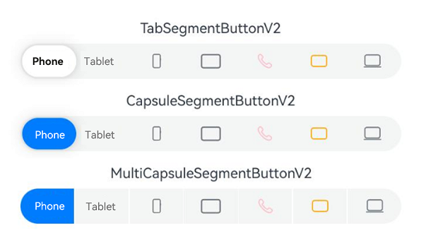

# SegmentButtonV2
<!--Kit: ArkUI-->
<!--Subsystem: ArkUI-->
<!--Owner: @xieziang-->
<!--Designer: @youzhi92-->
<!--Tester: @TerryTsao-->
<!--Adviser: @Brilliantry_Rui-->

**SegmentButtonV2** is a versatile component that organizes related options into visually grouped buttons. It supports three variants: tab-style, capsule-style single-select, and capsule-style multi-select.

> **NOTE**
>
> This component is supported since API version 18. Updates will be marked with a superscript to indicate their earliest API version.

## Modules to Import

```
import { TabSegmentButtonV2, CapsuleSegmentButtonV2, MultiCapsuleSegmentButtonV2, SegmentButtonV2Items } from '@kit.ArkUI';
```

## Child Components

Not supported

## Attributes

The [universal attributes](ts-component-general-attributes.md) are not supported.

## Events

The [universal events](ts-component-general-events.md) are not supported.

## TabSegmentButtonV2

```ts
TabSegmentButtonV2({
  items: SegmentButtonV2Items,
  selectedIndex: number,
  $selectedIndex?: OnSelectedIndexChange,
  onItemClicked?: Callback<number>,
  itemMinFontScale?: number | Resource,
  itemMaxFontScale?: number | Resource,
  itemSpace?: LengthMetrics,
  itemFontSize?: LengthMetrics,
  itemSelectedFontSize?: LengthMetrics,
  itemFontColor?: ColorMetrics,
  itemSelectedFontColor?: ColorMetrics,
  itemFontWeight?: FontWeight,
  itemSelectedFontWeight?: FontWeight,
  itemBorderRadius?: LengthMetrics,
  itemSelectedBackgroundColor?: ColorMetrics,
  itemIconSize?: SizeT<LengthMetrics>,
  itemIconFillColor?: ColorMetrics,
  itemSelectedIconFillColor?: ColorMetrics,
  itemSymbolFontSize?: LengthMetrics,
  itemSymbolFontColor?: ColorMetrics,
  itemSelectedSymbolFontColor?: ColorMetrics,
  itemMinHeight?: LengthMetrics,
  itemPadding?: LocalizedPadding,
  itemShadow?: ShadowOptions | ShadowStyle,
  buttonBackgroundColor?: ColorMetrics,
  buttonBackgroundBlurStyle?: BlurStyle,
  buttonBackgroundBlurStyleOptions?: BackgroundBlurStyleOptions,
  buttonBackgroundEffect?: BackgroundEffectOptions,
  buttonBorderRadius?: LengthMetrics, 
  buttonMinHeight?: LengthMetrics, 
  buttonPadding?: LengthMetrics, 
  languageDirection?: Direction 
})
```

**Decorator**: @ComponentV2

**Atomic service API**: This API can be used in atomic services since API version 18.

**System capability**: SystemCapability.ArkUI.ArkUI.Full

**Device behavior differences**: On wearables, calling this API results in a runtime exception indicating that the API is undefined. On other devices, the API works correctly.

| Name                            | Type                                                        | Mandatory| Decorator        | Description                                                        |
| -------------------------------- | ------------------------------------------------------------ | ---- | ------------------ | ------------------------------------------------------------ |
| items                            | [SegmentButtonV2Items](#segmentbuttonv2items)                | Yes  | @Require<br>@Param | Items of the segmented button.<br>If the value is **undefined**, the option information is not displayed.<br>This property is read-only.|
| selectedIndex                    | number                                                       | Yes  | @Require<br>@Param | Index of the selected segmented button item. The index is zero-based and increments by 1.<br>If the value is undefined, no item is selected. If the value is a non-positive value, the default value **0** is used.<br>This property is read-only.|
| $selectedIndex                   | [OnSelectedIndexChange](#onselectedindexchange)              | No  | @Event             | Callback invoked when the selected item changes.                    |
| onItemClicked                    | Callback\<number>                                            | No  | @Event             | Callback invoked when a segmented button item is clicked.                    |
| buttonBackgroundColor            | [ColorMetrics](../js-apis-arkui-graphics.md#colormetrics12)  | No  | @Param             | Background color of the segmented button.<br>Default value: **$r('sys.color.segment_button_v2_tab_button_background')**<br>If the value is **undefined**, the default value is used.<br>This property is read-only.|
| buttonBackgroundBlurStyle        | [BlurStyle](ts-universal-attributes-background.md#blurstyle9) | No  | @Param             | Background blur style of the segmented button.<br>Default value: **undefined**.<br>This property is read-only.|
| buttonBackgroundBlurStyleOptions | [BackgroundBlurStyleOptions](ts-universal-attributes-background.md#backgroundblurstyleoptions10)| No  | @Param             | Background blur style options of the segmented button.<br>Default value: **undefined**.<br>This property is read-only.|
| buttonBackgroundEffect           | [BackgroundEffectOptions](ts-universal-attributes-background.md#backgroundeffectoptions11) | No  | @Param             | Background blur effect options of the segmented button.<br>Default value: **undefined**.<br>This property is read-only.|
| buttonBorderRadius               | [LengthMetrics](../js-apis-arkui-graphics.md#lengthmetrics12) | No  | @Param             | Background border radius of the segmented button.<br>Value range: [0, +∞).<br>Default value: **$r('sys.float.segment_button_v2_background_corner_radius')**<br>If the value is **undefined**, the default value is used.<br>This property is read-only.|
| buttonMinHeight                  | [LengthMetrics](../js-apis-arkui-graphics.md#lengthmetrics12) | No  | @Param             | Minimum height of the segmented button.<br>Value range: [0, +∞).<br>Default value: **$r('sys.float.segment_button_v2_singleline_background_height')** for text-only buttons and icon-only buttons, and **$r('sys.float.segment_button_v2_doubleline_background_height')** for buttons with both an icon and text.<br>If the value is **undefined**, the default value is used.<br>This property is read-only.|
| buttonPadding                    | [LengthMetrics](../js-apis-arkui-graphics.md#lengthmetrics12) | No  | @Param             | Padding of the segmented button.<br>Value range: [0, +∞).<br>Default value: **$r('sys.float.padding_level1')**<br>If the value is **undefined**, the default value is used.<br>This property is read-only.|
| itemSelectedBackgroundColor      | [ColorMetrics](../js-apis-arkui-graphics.md#colormetrics12)  | No  | @Param             | Background color of the selected segmented button item.<br>Default value: **$r('sys.color.segment_button_v2_tab_selected_item_background')**<br>If the value is **undefined**, the default value is used.<br>This property is read-only.|
| itemMinHeight                    | [LengthMetrics](../js-apis-arkui-graphics.md#lengthmetrics12) | No  | @Param             | Minimum height of the segmented button item.<br>Value range: [0, +∞).<br>Default value:<br>**$r('sys.float.segment_button_v2_singleline_selected_height')** for text-only buttons and icon-only buttons, and **$r('sys.float.segment_button_v2_doubleline_selected_height')** for buttons with both an icon and text.<br>If the value is **undefined**, the default value is used.<br>This property is read-only.|
| itemPadding                      | [LocalizedPadding](ts-types.md#localizedpadding12)           | No  | @Param             | Padding of the segmented button item.<br> Default value: **{top: LengthMetrics.resource ($r('sys.float.padding_level2')), bottom: LengthMetrics.resource ($r('sys.float.padding_level2')), start: LengthMetrics.resource($r('sys.float.padding_level4')), end: LengthMetrics.resource($r('sys.float.padding_level4'))}**<br>If the value is **undefined**, the default value is used.<br>This property is read-only.|
| itemShadow                       | [ShadowOptions](ts-universal-attributes-image-effect.md#shadowoptions) \| [ShadowStyle](ts-universal-attributes-image-effect.md#shadowstyle10)| No  | @Param             | Shadow of the segmented button item.<br>Default value: **ShadowStyle.OUTER_DEFAULT_XS**<br>If the value is **undefined**, the default value is used.<br>This property is read-only.|
| itemSpace                        | [LengthMetrics](../js-apis-arkui-graphics.md#lengthmetrics12) | No  | @Param             | Space between segmented button items.<br>Value range: [0, +∞).<br>Default value: **LengthMetrics.vp(0)**<br>**NOTE**<br>Percentage values are not supported. If an invalid value is set, the default value is used.<br>This property is read-only.|
| itemMinFontScale                 | number \| [Resource](ts-types.md#resource)                   | No  | @Param             | Minimum font scale factor of the segmented button item text.<br>Value range: [0, 1]<br>Default value: **0**.<br>**NOTE**<br>A value less than 0 is treated as **0**. A value greater than 1 is treated as **1**. Abnormal values are ineffective by default.<br>This property is read-only.|
| itemMaxFontScale                 | number \| [Resource](ts-types.md#resource)                   | No  | @Param             | Maximum font scale factor of the segmented button item text.<br>Value range: [1, 2]<br>Default value: **1**<br>**NOTE**<br>A value less than 1 is treated as **1**. A value greater than 2 is treated as **2**. Abnormal values are ineffective by default.<br>This property is read-only.|
| itemFontSize                     | [LengthMetrics](../js-apis-arkui-graphics.md#lengthmetrics12) | No  | @Param             | Font size of unselected segmented button items.<br>Value range: [0, +∞).<br>Default value: **14fp**.<br>**NOTE**<br>Percentage values are not supported. If an invalid value is set, the default value is used.<br>When **fontSize** of **textModifier** is set for **items**, **itemFontSize** has no effect.<br>This property is read-only.|
| itemSelectedFontSize             | [LengthMetrics](../js-apis-arkui-graphics.md#lengthmetrics12) | No  | @Param             | Font size of the selected segmented button item.<br>Value range: [0, +∞).<br>Default value: **14fp**.<br>**NOTE**<br>Percentage values are not supported. If an invalid value is set, the default value is used.<br>When **fontSize** of **textModifier** is set for **items**, **itemSelectedFontSize** has no effect.<br>This property is read-only.|
| itemFontColor                    | [ColorMetrics](../js-apis-arkui-graphics.md#colormetrics12)  | No  | @Param             | Font color of unselected segmented button items.<br>Default value: **$r('sys.color.font_secondary')**.<br>If the value is **undefined**, the default value is used.<br>**NOTE**<br>When **fontColor** of **textModifier** is set for **items**, **itemFontColor** has no effect.<br>This property is read-only.|
| itemSelectedFontColor            | [ColorMetrics](../js-apis-arkui-graphics.md#colormetrics12)  | No  | @Param             | Font color of the selected segmented button item.<br>Default value: **$r('sys.color.font_primary')**.<br>If the value is **undefined**, the default value is used.<br>**NOTE**<br>When **fontColor** of **textModifier** is set for **items**, **itemSelectedFontColor** has no effect.<br>This property is read-only.|
| itemFontWeight                   | [FontWeight](ts-appendix-enums.md#fontweight)                | No  | @Param             | Font weight of unselected segmented button items.<br>Default value: **FontWeight.Medium**<br>If the value is **undefined**, the default value is used.<br>**NOTE**<br>When **fontWeight** of **textModifier** is set for **items**, **itemFontWeight** has no effect.<br>This property is read-only.|
| itemSelectedFontWeight           | [FontWeight](ts-appendix-enums.md#fontweight)                | No  | @Param             | Font weight of the selected segmented button item.<br>Default value: **FontWeight.Medium**<br>If the value is **undefined**, the default value is used.<br>**NOTE**<br>When **fontWeight** of **textModifier** is set for **items**, **itemSelectedFontWeight** has no effect.<br>This property is read-only.|
| itemBorderRadius                 | [LengthMetrics](../js-apis-arkui-graphics.md#lengthmetrics12) | No  | @Param             | Border radius of segmented button items.<br>Value range: [0, +∞).<br>Default value: **$r('sys.float.segment_button_v2_selected_corner_radius')**.<br>If the value is **undefined**, the default value is used.<br>This property is read-only.|
| itemIconSize                     | [SizeT](../js-apis-arkui-graphics.md#sizett12)\<[LengthMetrics](../js-apis-arkui-graphics.md#lengthmetrics12)> | No  | @Param             | Image-type icon size of segmented button items.<br>Value range: [0, +∞).<br>Default value: **{ width: LengthMetrics.vp(24), height: LengthMetrics.vp(24) }**.<br>If the value is **undefined**, the default value is used.<br>**NOTE**<br>When **width** and **height** of **iconModifier** are set for **items**, **itemIconSize** has no effect.<br>This property is read-only.|
| itemIconFillColor                | [ColorMetrics](../js-apis-arkui-graphics.md#colormetrics12)  | No  | @Param             | Icon color of unselected segmented button items.<br>Default value: **$r('sys.color.font_secondary')**.<br>If the value is **undefined**, the default value is used.<br>**NOTE**<br>When **fillColor** of **iconModifier** is set for **items**, **itemIconFillColor** has no effect.<br>This property is read-only.|
| itemSelectedIconFillColor        | [ColorMetrics](../js-apis-arkui-graphics.md#colormetrics12)  | No  | @Param             | Icon color of the selected segmented button item.<br>Default value: **$r('sys.color.font_primary')**.<br>If the value is **undefined**, the default value is used.<br>**NOTE**<br>When **fillColor** of **iconModifier** is set for **items**, **itemSelectedIconFillColor** has no effect.<br>This property is read-only.|
| itemSymbolFontSize               | [LengthMetrics](../js-apis-arkui-graphics.md#lengthmetrics12) | No  | @Param             | HM Symbol icon size of segmented button items.<br>Value range: [0, +∞).<br>Default value: **20fp**<br>**NOTE**<br>Percentage values are not supported. If an invalid value is set, the default value is used.<br>When **fontSize** of **symbolModifier** is set for **items**, **itemSymbolFontSize** has no effect.<br>This property is read-only.|
| itemSymbolFontColor              | [ColorMetrics](../js-apis-arkui-graphics.md#colormetrics12)  | No  | @Param             | HM Symbol icon color of unselected segmented button items.<br>Default value: **$r('sys.color.font_secondary')**.<br>If the value is **undefined**, the default value is used.<br>**NOTE**<br>When **fontColor** of **symbolModifier** is set for **items**, **itemSymbolFontColor** has no effect.<br>This property is read-only.|
| itemSelectedSymbolFontColor      | [ColorMetrics](../js-apis-arkui-graphics.md#colormetrics12)  | No  | @Param             | HM Symbol icon color of the selected segmented button item.<br>Default value: **$r('sys.color.font_primary')**.<br>If the value is **undefined**, the default value is used.<br>**NOTE**<br>When **fontColor** of **symbolModifier** is set for **items**, **itemSelectedSymbolFontColor** has no effect.<br>This property is read-only.|
| languageDirection                | [Direction](ts-appendix-enums.md#direction)                  | No  | @Param             | Language direction of the segmented button.<br>Default value: **Direction.Auto**.<br>If the value is **undefined**, the default value is used.<br>This property is read-only.|

## CapsuleSegmentButtonV2

```ts
CapsuleSegmentButtonV2({
  items: SegmentButtonV2Items,
  selectedIndex: number,
  $selectedIndex?: OnSelectedIndexChange,
  onItemClicked?: Callback<number>,
  itemMinFontScale?: number | Resource,
  itemMaxFontScale?: number | Resource,
  itemSpace?: LengthMetrics,
  itemFontSize?: LengthMetrics,
  itemSelectedFontSize?: LengthMetrics,
  itemFontColor?: ColorMetrics,
  itemSelectedFontColor?: ColorMetrics,
  itemFontWeight?: FontWeight,
  itemSelectedFontWeight?: FontWeight,
  itemBorderRadius?: LengthMetrics,
  itemSelectedBackgroundColor?: ColorMetrics,
  itemIconSize?: SizeT<LengthMetrics>,
  itemIconFillColor?: ColorMetrics,
  itemSelectedIconFillColor?: ColorMetrics,
  itemSymbolFontSize?: LengthMetrics,
  itemSymbolFontColor?: ColorMetrics,
  itemSelectedSymbolFontColor?: ColorMetrics,
  itemMinHeight?: LengthMetrics,
  itemPadding?: LocalizedPadding,
  itemShadow?: ShadowOptions | ShadowStyle,
  buttonBackgroundColor?: ColorMetrics,
  buttonBackgroundBlurStyle?: BlurStyle,
  buttonBackgroundBlurStyleOptions?: BackgroundBlurStyleOptions,
  buttonBackgroundEffect?: BackgroundEffectOptions,
  buttonBorderRadius?: LengthMetrics,
  buttonMinHeight?: LengthMetrics,
  buttonPadding?: LengthMetrics,
  languageDirection?: Direction 
})
```

**Decorator**: @ComponentV2

**Atomic service API**: This API can be used in atomic services since API version 18.

**System capability**: SystemCapability.ArkUI.ArkUI.Full

**Device behavior differences**: On wearables, calling this API results in a runtime exception indicating that the API is undefined. On other devices, the API works correctly.

| Name                            | Type                                                        | Mandatory| Decorator        | Description                                                        |
| -------------------------------- | ------------------------------------------------------------ | ---- | ------------------ | ------------------------------------------------------------ |
| items                            | [SegmentButtonV2Items](#segmentbuttonv2items)                | Yes  | @Require<br>@Param | Items of the segmented button.<br>If the value is **undefined**, the option information is not displayed.<br>This property is read-only.|
| selectedIndex                    | number                                                       | Yes  | @Require<br>@Param | Index of the selected segmented button item. The index is zero-based and increments by 1.<br>If the value is undefined, no item is selected. If the value is a non-positive value, the default value **0** is used.<br>This property is read-only.|
| $selectedIndex                   | [OnSelectedIndexChange](#onselectedindexchange)              | No  | @Event             | Callback invoked when the selected item changes.                        |
| onItemClicked                    | Callback\<number>                                            | No  | @Event             | Callback invoked when a segmented button item is clicked.                    |
| buttonBackgroundColor            | [ColorMetrics](../js-apis-arkui-graphics.md#colormetrics12)  | No  | @Param             | Background color of the segmented button.<br>Default value: **$r('sys.color.segment_button_v2_tab_button_background')**<br>If the value is **undefined**, the default value is used.<br>This property is read-only.|
| buttonBackgroundBlurStyle        | [BlurStyle](ts-universal-attributes-background.md#blurstyle9) | No  | @Param             | Background blur style of the segmented button.<br>Default value: **undefined**.<br>This property is read-only.|
| buttonBackgroundBlurStyleOptions | [BackgroundBlurStyleOptions](ts-universal-attributes-background.md#backgroundblurstyleoptions10)| No  | @Param             | Background blur style options of the segmented button.<br>Default value: **undefined**.<br>This property is read-only.|
| buttonBackgroundEffect           | [BackgroundEffectOptions](ts-universal-attributes-background.md#backgroundeffectoptions11) | No  | @Param             | Background blur effect options of the segmented button.<br>Default value: **undefined**.<br>This property is read-only.|
| buttonBorderRadius               | [LengthMetrics](../js-apis-arkui-graphics.md#lengthmetrics12) | No  | @Param             | Background border radius of the segmented button.<br>Value range: [0, +∞).<br>Default value: **$r('sys.float.segment_button_v2_background_corner_radius')**<br>If the value is **undefined**, the default value is used.<br>This property is read-only.|
| buttonMinHeight                  | [LengthMetrics](../js-apis-arkui-graphics.md#lengthmetrics12) | No  | @Param             | Minimum height of the segmented button.<br>Value range: [0, +∞).<br>Default value: **$r('sys.float.segment_button_v2_singleline_background_height')** for text-only buttons and icon-only buttons, and **$r('sys.float.segment_button_v2_doubleline_background_height')** for buttons with both an icon and text.<br>If the value is **undefined**, the default value is used.<br>This property is read-only.|
| buttonPadding                    | [LengthMetrics](../js-apis-arkui-graphics.md#lengthmetrics12) | No  | @Param             | Padding of the segmented button.<br>Value range: [0, +∞).<br>Default value: **$r('sys.float.padding_level1')**<br>If the value is **undefined**, the default value is used.<br>This property is read-only.|
| itemSelectedBackgroundColor      | [ColorMetrics](../js-apis-arkui-graphics.md#colormetrics12)  | No  | @Param             | Background color of the selected segmented button item.<br>Default value: **$r('sys.color.comp_background_emphasize')**<br>If the value is **undefined**, the default value is used.<br>This property is read-only.|
| itemMinHeight                    | [LengthMetrics](../js-apis-arkui-graphics.md#lengthmetrics12) | No  | @Param             | Minimum height of the segmented button item.<br>Value range: [0, +∞).<br>Default value:<br>**$r('sys.float.segment_button_v2_singleline_selected_height')** for text-only buttons and icon-only buttons, and **$r('sys.float.segment_button_v2_doubleline_selected_height')** for buttons with both an icon and text.<br>If the value is **undefined**, the default value is used.<br>This property is read-only.|
| itemPadding                      | [LocalizedPadding](ts-types.md#localizedpadding12)           | No  | @Param             | Padding of the segmented button item.<br>Default value: **{top: LengthMetrics.resource ($r('sys.float.padding_level2')), bottom: LengthMetrics.resource ($r('sys.float.padding_level2')), start: LengthMetrics.resource($r('sys.float.padding_level4')), end: LengthMetrics.resource($r('sys.float.padding_level4'))}**<br>If the value is **undefined**, the default value is used.<br>This property is read-only.|
| itemShadow                       | [ShadowOptions](ts-universal-attributes-image-effect.md#shadowoptions) \| [ShadowStyle](ts-universal-attributes-image-effect.md#shadowstyle10)| No  | @Param             | Shadow of the segmented button item.<br>Default value: **ShadowStyle.OUTER_DEFAULT_XS**<br>If the value is **undefined**, the default value is used.<br>This property is read-only.|
| itemSpace                        | [LengthMetrics](../js-apis-arkui-graphics.md#lengthmetrics12) | No  | @Param             | Space between segmented button items.<br>Value range: [0, +∞).<br>Default value: **LengthMetrics.vp(0)**<br>**NOTE**<br>Percentage values are not supported. If an invalid value is set, the default value is used.<br>This property is read-only.|
| itemMinFontScale                 | number \| [Resource](ts-types.md#resource)                   | No  | @Param             | Minimum font scale factor of the segmented button item text.<br>Value range: [0, 1]<br>Default value: **0**.<br>**NOTE**<br>A value less than 0 is treated as **0**. A value greater than 1 is treated as **1**. Abnormal values are ineffective by default.<br>This property is read-only.|
| itemMaxFontScale                 | number \| [Resource](ts-types.md#resource)                   | No  | @Param             | Maximum font scale factor of the segmented button item text.<br>Value range: [1, 2]<br>Default value: **1**<br>**NOTE**<br>A value less than 1 is treated as **1**. A value greater than 2 is treated as **2**. Abnormal values are ineffective by default.<br>This property is read-only.|
| itemFontSize                     | [LengthMetrics](../js-apis-arkui-graphics.md#lengthmetrics12) | No  | @Param             | Font size of unselected segmented button items.<br>Value range: [0, +∞).<br>Default value: **14fp**.<br>**NOTE**<br>Percentage values are not supported. If an invalid value is set, the default value is used.<br>When **fontSize** of **textModifier** is set for **items**, **itemFontSize** has no effect.<br>This property is read-only.|
| itemSelectedFontSize             | [LengthMetrics](../js-apis-arkui-graphics.md#lengthmetrics12) | No  | @Param             | Font size of the selected segmented button item.<br>Value range: [0, +∞).<br>Default value: **14fp**.<br>**NOTE**<br>Percentage values are not supported. If an invalid value is set, the default value is used.<br>When **fontSize** of **textModifier** is set for **items**, **itemSelectedFontSize** has no effect.<br>This property is read-only.|
| itemFontColor                    | [ColorMetrics](../js-apis-arkui-graphics.md#colormetrics12)  | No  | @Param             | Font color of unselected segmented button items.<br>Default value: **$r('sys.color.font_secondary')**.<br>If the value is **undefined**, the default value is used.<br>**NOTE**<br>When **fontColor** of **textModifier** is set for **items**, **itemFontColor** has no effect.<br>This property is read-only.|
| itemSelectedFontColor            | [ColorMetrics](../js-apis-arkui-graphics.md#colormetrics12)  | No  | @Param             | Font color of the selected segmented button item.<br>Default value: **$r('sys.color.font_on_primary')**.<br>If the value is **undefined**, the default value is used.<br>**NOTE**<br>When **fontColor** of **textModifier** is set for **items**, **itemSelectedFontColor** has no effect.<br>This property is read-only.|
| itemFontWeight                   | [FontWeight](ts-appendix-enums.md#fontweight)                | No  | @Param             | Font weight of unselected segmented button items.<br>Default value: **FontWeight.Medium**<br>If the value is **undefined**, the default value is used.<br>**NOTE**<br>When **fontWeight** of **textModifier** is set for **items**, **itemFontWeight** has no effect.<br>This property is read-only.|
| itemSelectedFontWeight           | [FontWeight](ts-appendix-enums.md#fontweight)                | No  | @Param             | Font weight of the selected segmented button item.<br>Default value: **FontWeight.Medium**<br>If the value is **undefined**, the default value is used.<br>**NOTE**<br>When **fontWeight** of **textModifier** is set for **items**, **itemSelectedFontWeight** has no effect.<br>This property is read-only.|
| itemBorderRadius                 | [LengthMetrics](../js-apis-arkui-graphics.md#lengthmetrics12) | No  | @Param             | Border radius of segmented button items.<br>Value range: [0, +∞).<br>Default value: **$r('sys.float.segment_button_v2_selected_corner_radius')**.<br>If the value is **undefined**, the default value is used.<br>This property is read-only.|
| itemIconSize                     | [SizeT](../js-apis-arkui-graphics.md#sizett12)\<[LengthMetrics](../js-apis-arkui-graphics.md#lengthmetrics12)> | No  | @Param             | Image-type icon size of segmented button items.<br>Value range: [0, +∞).<br>Default value: **{ width: LengthMetrics.vp(24), height: LengthMetrics.vp(24) }**.<br>If the value is **undefined**, the default value is used.<br>**NOTE**<br>When **width** and **height** of **iconModifier** are set for **items**, **itemIconSize** has no effect.<br>This property is read-only.|
| itemIconFillColor                | [ColorMetrics](../js-apis-arkui-graphics.md#colormetrics12)  | No  | @Param             | Icon color of unselected segmented button items.<br>Default value: **$r('sys.color.font_secondary')**.<br>If the value is **undefined**, the default value is used.<br>**NOTE**<br>When **fillColor** of **iconModifier** is set for **items**, **itemIconFillColor** has no effect.<br>This property is read-only.|
| itemSelectedIconFillColor        | [ColorMetrics](../js-apis-arkui-graphics.md#colormetrics12)  | No  | @Param             | Icon color of the selected segmented button item.<br>Default value: **$r('sys.color.font_on_primary')**.<br>If the value is **undefined**, the default value is used.<br>**NOTE**<br>When **fillColor** of **iconModifier** is set for **items**, **itemSelectedIconFillColor** has no effect.<br>This property is read-only.|
| itemSymbolFontSize               | [LengthMetrics](../js-apis-arkui-graphics.md#lengthmetrics12) | No  | @Param             | HM Symbol icon size of segmented button items.<br>Value range: [0, +∞).<br>Default value: **20fp**<br>**NOTE**<br>Percentage values are not supported. If an invalid value is set, the default value is used.<br>When **fontSize** of **symbolModifier** is set for **items**, **itemSymbolFontSize** has no effect.<br>This property is read-only.|
| itemSymbolFontColor              | [ColorMetrics](../js-apis-arkui-graphics.md#colormetrics12)  | No  | @Param             | HM Symbol icon color of unselected segmented button items.<br>Default value: **$r('sys.color.font_secondary')**.<br>If the value is **undefined**, the default value is used.<br>**NOTE**<br>When **fontColor** of **symbolModifier** is set for **items**, **itemSymbolFontColor** has no effect.<br>This property is read-only.|
| itemSelectedSymbolFontColor      | [ColorMetrics](../js-apis-arkui-graphics.md#colormetrics12)  | No  | @Param             | HM Symbol icon color of the selected segmented button item.<br>Default value: **$r('sys.color.font_on_primary')**.<br>If the value is **undefined**, the default value is used.<br>**NOTE**<br>When **fontColor** of **symbolModifier** is set for **items**, **itemSelectedSymbolFontColor** has no effect.<br>This property is read-only.|
| languageDirection                | [Direction](ts-appendix-enums.md#direction)                  | No  | @Param             | Language direction of the segmented button.<br>Default value: **Direction.Auto**.<br>If the value is **undefined**, the default value is used.<br>This property is read-only.|

## MultiCapsuleSegmentButtonV2

```ts
MultiCapsuleSegmentButtonV2({
  items: SegmentButtonV2Items,
  selectedIndexes: number[],
  $selectedIndexes: OnSelectedIndexesChange,
  onItemClicked?: Callback<number>,
  itemMinFontScale?: number | Resource,
  itemMaxFontScale?: number | Resource,
  itemSpace?: LengthMetrics,
  itemFontColor?: ColorMetrics,
  itemSelectedFontColor?: ColorMetrics,
  itemFontSize?: LengthMetrics,
  itemSelectedFontSize?: LengthMetrics,
  itemFontWeight?: FontWeight,
  itemSelectedFontWeight?: FontWeight,
  itemBorderRadius?: LengthMetrics,
  itemBackgroundColor?: ColorMetrics,
  itemBackgroundEffect?: BackgroundEffectOptions,
  itemBackgroundBlurStyle?: BlurStyle,
  itemBackgroundBlurStyleOptions?: BackgroundBlurStyleOptions,
  itemSelectedBackgroundColor?: ColorMetrics,
  itemIconSize?: SizeT<LengthMetrics>,
  itemIconFillColor?: ColorMetrics,
  itemSelectedIconFillColor?: ColorMetrics,
  itemSymbolFontSize?: LengthMetrics,
  itemSymbolFontColor?: ColorMetrics,
  itemSelectedSymbolFontColor?: ColorMetrics,
  itemMinHeight?: LengthMetrics,
  itemPadding?: LocalizedPadding,
  languageDirection?: Direction
})
```

**Decorator**: @ComponentV2

**Atomic service API**: This API can be used in atomic services since API version 18.

**System capability**: SystemCapability.ArkUI.ArkUI.Full

**Device behavior differences**: On wearables, calling this API results in a runtime exception indicating that the API is undefined. On other devices, the API works correctly.

| Name                          | Type                                                        | Mandatory| Decorator        | Description                                                        |
| ------------------------------ | ------------------------------------------------------------ | ---- | ------------------ | ------------------------------------------------------------ |
| items                          | [SegmentButtonV2Items](#segmentbuttonv2items)                | Yes  | @Require<br>@Param | Items of the segmented button.<br>If the value is **undefined**, the option information is not displayed.<br>This property is read-only.|
| selectedIndexes                | number[]                                                     | Yes  | @Require<br>@Param | Array of indexes of the selected segmented button items. The index is zero-based and increments by 1.<br>If the value is **undefined**, no item is selected.<br>**NOTE**<br>Only valid button indexes are supported. An empty array [] indicates no selection.<br>This property is read-only.|
| $selectedIndexes               | [OnSelectedIndexesChange](#onselectedindexeschange)          | Yes  | @Event             | Callback invoked when the selected item changes.                        |
| onItemClicked                  | Callback\<number>                                            | No  | @Event             | Callback invoked when a segmented button item is clicked.                    |
| itemBackgroundColor            | [ColorMetrics](../js-apis-arkui-graphics.md#colormetrics12)  | No  | @Param             | Background color of unselected segmented button items.<br>Default value: **$r('sys.color.segment_button_v2_multi_capsule_button_background')**<br>If the value is **undefined**, the default value is used.<br>This property is read-only.|
| itemBackgroundEffect           | [BackgroundEffectOptions](ts-universal-attributes-background.md#backgroundeffectoptions11) | No  | @Param             | Background effect of unselected segmented button items.<br>Default value: **undefined**.<br>This property is read-only.|
| itemBackgroundBlurStyle        | [BlurStyle](ts-universal-attributes-background.md#blurstyle9) | No  | @Param             | Background blur style of unselected segmented button items.<br>Default value: **undefined**.<br>This property is read-only.|
| itemBackgroundBlurStyleOptions | [BackgroundBlurStyleOptions](ts-universal-attributes-background.md#backgroundblurstyleoptions10)| No  | @Param             | Background blur style options of unselected segmented button items.<br>Default value: **undefined**.<br>This property is read-only.|
| itemSelectedBackgroundColor    | [ColorMetrics](../js-apis-arkui-graphics.md#colormetrics12)  | No  | @Param             | Background color of the selected segmented button item.<br>Default value: **$r('sys.color.comp_background_emphasize')**<br>If the value is **undefined**, the default value is used.<br>This property is read-only.|
| itemMinHeight                  | [LengthMetrics](../js-apis-arkui-graphics.md#lengthmetrics12) | No  | @Param             | Minimum height of the segmented button item.<br>Value range: [0, +∞).<br>Default value:<br>**$r('sys.float.segment_button_v2_singleline_selected_height')** for text-only buttons and icon-only buttons, and **$r('sys.float.segment_button_v2_doubleline_selected_height')** for buttons with both an icon and text.<br>If the value is **undefined**, the default value is used.<br>This property is read-only.|
| itemPadding                    | [LocalizedPadding](ts-types.md#localizedpadding12)           | No  | @Param             | Padding of the segmented button item.<br>Default value: **{top: LengthMetrics.resource ($r('sys.float.padding_level2')), bottom: LengthMetrics.resource ($r('sys.float.padding_level2')), start: LengthMetrics.resource($r('sys.float.padding_level4')), end: LengthMetrics.resource($r('sys.float.padding_level4'))}**<br>If the value is **undefined**, the default value is used.<br>This property is read-only.|
| itemSpace                      | [LengthMetrics](../js-apis-arkui-graphics.md#lengthmetrics12) | No  | @Param             | Space between segmented button items.<br>Value range: [0, +∞).<br>Default value: **LengthMetrics.vp(1)**<br>**NOTE**<br>Percentage values are not supported. If an invalid value is set, the default value is used.<br>This property is read-only.|
| itemMinFontScale               | number \| [Resource](ts-types.md#resource)                   | No  | @Param             | Minimum font scale factor of the segmented button item text.<br>Value range: [0, 1]<br>Default value: **0**.<br>**NOTE**<br>A value less than 0 is treated as **0**. A value greater than 1 is treated as **1**. Abnormal values are ineffective by default.<br>This property is read-only.|
| itemMaxFontScale               | number \| [Resource](ts-types.md#resource)                   | No  | @Param             | Maximum font scale factor of the segmented button item text.<br>Value range: [1, 2]<br>Default value: **1**<br>**NOTE**<br>A value less than 1 is treated as **1**. A value greater than 2 is treated as **2**. Abnormal values are ineffective by default.<br>This property is read-only.|
| itemSelectedFontSize           | [LengthMetrics](../js-apis-arkui-graphics.md#lengthmetrics12) | No  | @Param             | Font size of the selected segmented button item.<br>Value range: [0, +∞).<br>Default value: **14fp**.<br>**NOTE**<br>Percentage values are not supported. If an invalid value is set, the default value is used.<br>When **fontSize** of **textModifier** is set for **items**, **itemSelectedFontSize** has no effect.<br>This property is read-only.|
| itemFontColor                  | [ColorMetrics](../js-apis-arkui-graphics.md#colormetrics12)  | No  | @Param             | Font color of unselected segmented button items.<br>Default value: **$r('sys.color.font_secondary')**.<br>If the value is **undefined**, the default value is used.<br>**NOTE**<br>When **fontColor** of **textModifier** is set for **items**, **itemFontColor** has no effect.<br>This property is read-only.|
| itemFontSize                   | [LengthMetrics](../js-apis-arkui-graphics.md#lengthmetrics12) | No  | @Param             | Font size of unselected segmented button items.<br>Value range: [0, +∞).<br>Default value: **14fp**.<br>**NOTE**<br>Percentage values are not supported. If an invalid value is set, the default value is used.<br>When **fontSize** of **textModifier** is set for **items**, **itemFontSize** has no effect.<br>This property is read-only.|
| itemSelectedFontColor          | [ColorMetrics](../js-apis-arkui-graphics.md#colormetrics12)  | No  | @Param             | Font color of the selected segmented button item.<br>Default value: **$r('sys.color.font_on_primary')**.<br>If the value is **undefined**, the default value is used.<br>**NOTE**<br>When **fontColor** of **textModifier** is set for **items**, **itemSelectedFontColor** has no effect.<br>This property is read-only.|
| itemFontWeight                 | [FontWeight](ts-appendix-enums.md#fontweight)                | No  | @Param             | Font weight of unselected segmented button items.<br>Default value: **FontWeight.Medium**<br>If the value is **undefined**, the default value is used.<br>**NOTE**<br>When **fontWeight** of **textModifier** is set for **items**, **itemFontWeight** has no effect.<br>This property is read-only.|
| itemSelectedFontWeight         | [FontWeight](ts-appendix-enums.md#fontweight)                | No  | @Param             | Font weight of the selected segmented button item.<br>Default value: **FontWeight.Medium**<br>If the value is **undefined**, the default value is used.<br>**NOTE**<br>When **fontWeight** of **textModifier** is set for **items**, **itemSelectedFontWeight** has no effect.<br>This property is read-only.|
| itemBorderRadius               | [LengthMetrics](../js-apis-arkui-graphics.md#lengthmetrics12) | No  | @Param             | Border radius of segmented button items.<br>Value range: [0, +∞).<br>Default value: **$r('sys.float.segment_button_v2_multi_corner_radius')**<br>If the value is **undefined**, the default value is used.<br>This property is read-only.|
| itemIconSize                   | [SizeT](../js-apis-arkui-graphics.md#sizett12)\<[LengthMetrics](../js-apis-arkui-graphics.md#lengthmetrics12)> | No  | @Param             | Image-type icon size of segmented button items.<br>Value range: [0, +∞).<br>Default value: **{ width: LengthMetrics.vp(24), height: LengthMetrics.vp(24) }**.<br>If the value is **undefined**, the default value is used.<br>**NOTE**<br>When **width** and **height** of **iconModifier** are set for **items**, **itemIconSize** has no effect.<br>This property is read-only.|
| itemIconFillColor              | [ColorMetrics](../js-apis-arkui-graphics.md#colormetrics12)  | No  | @Param             | Icon color of unselected segmented button items.<br>Default value: **$r('sys.color.font_secondary')**.<br>If the value is **undefined**, the default value is used.<br>**NOTE**<br>When **fillColor** of **iconModifier** is set for **items**, **itemIconFillColor** has no effect.<br>This property is read-only.|
| itemSelectedIconFillColor      | [ColorMetrics](../js-apis-arkui-graphics.md#colormetrics12)  | No  | @Param             | Icon color of the selected segmented button item.<br>Default value: **$r('sys.color.font_on_primary')**.<br>If the value is **undefined**, the default value is used.<br>**NOTE**<br>When **fillColor** of **iconModifier** is set for **items**, **itemSelectedIconFillColor** has no effect.<br>This property is read-only.|
| itemSymbolFontSize             | [LengthMetrics](../js-apis-arkui-graphics.md#lengthmetrics12) | No  | @Param             | HM Symbol icon size of segmented button items.<br>Value range: [0, +∞).<br>Default value: **20fp**<br>**NOTE**<br>Percentage values are not supported. If an invalid value is set, the default value is used.<br>When **fontSize** of **symbolModifier** is set for **items**, **itemSymbolFontSize** has no effect.<br>This property is read-only.|
| itemSymbolFontColor            | [ColorMetrics](../js-apis-arkui-graphics.md#colormetrics12)  | No  | @Param             | HM Symbol icon color of unselected segmented button items.<br>Default value: **$r('sys.color.font_secondary')**.<br>If the value is **undefined**, the default value is used.<br>**NOTE**<br>When **fontColor** of **symbolModifier** is set for **items**, **itemSymbolFontColor** has no effect.<br>This property is read-only.|
| itemSelectedSymbolFontColor    | [ColorMetrics](../js-apis-arkui-graphics.md#colormetrics12)  | No  | @Param             | HM Symbol icon color of the selected segmented button item.<br>Default value: **$r('sys.color.font_on_primary')**.<br>If the value is **undefined**, the default value is used.<br>**NOTE**<br>When **fontColor** of **symbolModifier** is set for **items**, **itemSelectedSymbolFontColor** has no effect.<br>This property is read-only.|
| languageDirection              | [Direction](ts-appendix-enums.md#direction)                  | No  | @Param             | Language direction of the segmented button.<br>Default value: **Direction.Auto**.<br>If the value is **undefined**, the default value is used.<br>This property is read-only.|

## SegmentButtonV2Items

Represents items of the **SegmentButtonV2** component.

This parameter is inherited from Array\<[SegmentButtonV2Item](#segmentbuttonv2item)>.

**Decorator type**: @ObservedV2

### constructor

constructor(items: SegmentButtonV2ItemOptions[])

Constructs a **SegmentButtonV2ItemOptions** instance.

**Atomic service API**: This API can be used in atomic services since API version 18.

**System capability**: SystemCapability.ArkUI.ArkUI.Full

**Device behavior differences**: On wearables, calling this API results in a runtime exception indicating that the API is undefined. On other devices, the API works correctly.

**Parameters**

| Name | Type                                                             | Mandatory| Description                      |
| ----- | ----------------------------------------------------------------- | ---- | -------------------------- |
| items | [SegmentButtonV2ItemOptions](#segmentbuttonv2itemoptions)[] | Yes  | Options of the item of the **SegmentButtonV2** component.|

### hasHybrid

get hasHybrid():boolean

Checks whether the component supports mixed icon and text items.

**Atomic service API**: This API can be used in atomic services since API version 18.

**System capability**: SystemCapability.ArkUI.ArkUI.Full

**Device behavior differences**: On wearables, calling this API results in a runtime exception indicating that the API is undefined. On other devices, the API works correctly.

**Return value**

| Type   | Description                                                        |
| ------- | ------------------------------------------------------------ |
| boolean | Whether the component supports mixed icon and text items.<br>The value **true** indicates that there is an item with both an icon and text; the value **false** indicates the opposite.|

## SegmentButtonV2Item

**Decorator type**: @ObservedV2

### Properties

**Atomic service API**: This API can be used in atomic services since API version 18.

**System capability**: SystemCapability.ArkUI.ArkUI.Full

**Device behavior differences**: On wearables, calling this API results in a runtime exception indicating that the API is undefined. On other devices, the API works correctly.

| Name                    | Type                                                                | Read-Only| Optional| Description                                           |
| ------------------------ | -------------------------------------------------------------------- | ------ | ---- | ---- |
| text                     | [ResourceStr](ts-types.md#resourcestr)                               | No| Yes| Text of the segmented button item.<br>Default value: **undefined**.<br>Decorator type: @Trace        |
| icon                     | [ResourceStr](ts-types.md#resourcestr)                               | No| Yes| Image icon of the segmented button item.<br>Default value: **undefined**.<br>Decorator type: @Trace     |
| symbol                   | [Resource](ts-types.md#resource)                                     | No| Yes| HM Symbol icon of the segmented button item.<br>Default value: **undefined**.<br>Decorator type: @Trace|
| enabled                  | boolean                                                              | No| No| Whether the segmented button item is enabled.<br>Default value: **true**.<br>**true**: enabled. **false**: disabled.<br>If the value is **undefined**, the default value is used.<br>Decorator type: @Trace|
| textModifier             | [TextModifier](ts-universal-attributes-attribute-modifier.md)        | No| Yes| Text modifier for the segmented button item.<br>Default value: **undefined**.<br>Decorator type: @Trace|
| iconModifier             | [ImageModifier](ts-universal-attributes-attribute-modifier.md)       | No| Yes| Image icon modifier for the segmented button item.<br>Default value: **undefined**.<br>Decorator type: @Trace|
| symbolModifier           | [SymbolGlyphModifier](ts-universal-attributes-attribute-modifier.md) | No| Yes| HM Symbol icon modifier for the segmented button item.<br>Default value: **undefined**.<br>Decorator type: @Trace|
| accessibilityText        | [ResourceStr](ts-types.md#resourcestr)                               | No| Yes| Accessibility text of the segmented button item.<br>Default value: **""**.<br>If the value is **undefined**, the default value is used.<br>Decorator type: @Trace|
| accessibilityDescription | [ResourceStr](ts-types.md#resourcestr)                               | No| Yes| Accessibility description of the segmented button item.<br>Default value: **""**.<br>If the value is **undefined**, the default value is used.<br>Decorator type: @Trace|
| accessibilityLevel       | string                                                               | No| Yes| [Accessibility level](ts-universal-attributes-accessibility.md#accessibilitylevel) of the segmented button item.<br>Default value: **"auto"**.<br>If the value is **undefined**, the default value is used.<br>Decorator type: @Trace|

> **Description**
>
> 1. If both **symbol** and **icon** are configured, **symbol** takes precedence.
> 2. If both **symbol** and **symbolModifier** are configured with HM Symbol resources, the resources specified by **symbolModifier** take precedence.

### constructor

constructor(options: SegmentButtonV2ItemOptions)

Constructs a **SegmentButtonV2ItemOptions** instance.

**Atomic service API**: This API can be used in atomic services since API version 18.

**System capability**: SystemCapability.ArkUI.ArkUI.Full

**Device behavior differences**: On wearables, calling this API results in a runtime exception indicating that the API is undefined. On other devices, the API works correctly.

**Parameters**

| Name   | Type                                                     | Mandatory| Description                  |
| ------- | --------------------------------------------------------- | ---- | ---------------------- |
| options | [SegmentButtonV2ItemOptions](#segmentbuttonv2itemoptions) | Yes  | Options of the item of the **SegmentButtonV2** component.|

### isHybrid

get isHybrid():boolean

Checks whether the segmented button item contains both text and icon configurations.

**Atomic service API**: This API can be used in atomic services since API version 18.

**System capability**: SystemCapability.ArkUI.ArkUI.Full

**Device behavior differences**: On wearables, calling this API results in a runtime exception indicating that the API is undefined. On other devices, the API works correctly.

**Return value**

| Type   | Description                                                        |
| ------- | ------------------------------------------------------------ |
| boolean | Whether the item contains both text and icon configurations.<br>**true**: The item has both text and icon configurations. **false**: The item does not have both text and icon configured.|

## SegmentButtonV2ItemOptions

Defines segmented button item options.

**Atomic service API**: This API can be used in atomic services since API version 18.

**System capability**: SystemCapability.ArkUI.ArkUI.Full

**Device behavior differences**: On wearables, calling this API results in a runtime exception indicating that the API is undefined. On other devices, the API works correctly.

| Name                    | Type                                                        | Read-Only| Optional| Description                                                        |
| ------------------------ | ------------------------------------------------------------ | ---- | ---- | ------------------------------------------------------------ |
| text                     | [ResourceStr](ts-types.md#resourcestr)                       | No  | Yes  | Text of the segmented button item.<br>Default value: **undefined**.                     |
| icon                     | [ResourceStr](ts-types.md#resourcestr)                       | No  | Yes  | Icon of the segmented button item.<br>Default value: **undefined**.                     |
| symbol                   | [Resource](ts-types.md#resource)                             | No  | Yes  | HM Symbol icon of the segmented button item.<br>Default value: **undefined**.     |
| enabled                  | boolean                                                      | No  | Yes  | Whether the segmented button item is enabled.<br>Default value: **true**.<br>The value **true** means that the item is enabled, and **false** means the opposite.<br>If the value is **undefined**, the default value is used.|
| textModifier             | [TextModifier](ts-universal-attributes-attribute-modifier.md) | No  | Yes  | Text modifier for the segmented button item.<br>Default value: **undefined**.       |
| iconModifier             | [ImageModifier](ts-universal-attributes-attribute-modifier.md) | No  | Yes  | Icon modifier for the segmented button item.<br>Default value: **undefined**.|
| symbolModifier           | [SymbolGlyphModifier](ts-universal-attributes-attribute-modifier.md) | No  | Yes  | HM Symbol icon modifier for the segmented button item.<br>Default value: **undefined**.|
| accessibilityText        | [ResourceStr](ts-types.md#resourcestr)                       | No  | Yes  | Accessibility text of the segmented button item.<br>Default value: **""**.<br>If the value is **undefined**, the default value is used.|
| accessibilityDescription | [ResourceStr](ts-types.md#resourcestr)                       | No  | Yes  | Accessibility description of the segmented button item.<br>Default value: **""**.<br>If the value is **undefined**, the default value is used.|
| accessibilityLevel       | string                                                       | No  | Yes  | [Accessibility level](ts-universal-attributes-accessibility.md#accessibilitylevel) of the segmented button item.<br>Default value: **"auto"**.<br>If the value is **undefined**, the default value is used.|

> **Description**
>
> 1. If both **symbol** and **icon** are configured, **symbol** takes precedence.
> 2. If both **symbol** and **symbolModifier** are configured with HM Symbol resources, the resources specified by **symbolModifier** take precedence.

## OnSelectedIndexChange

type OnSelectedIndexChange = (selectedIndex: number) => void

Defines a callback invoked when the selected segmented button item changes.

**Atomic service API**: This API can be used in atomic services since API version 18.

**System capability**: SystemCapability.ArkUI.ArkUI.Full

**Device behavior differences**: On wearables, calling this API results in a runtime exception indicating that the API is undefined. On other devices, the API works correctly.

**Parameters**

| Name       | Type  | Mandatory| Description              |
| ------------- | ------ | ---- | ------------------ |
| selectedIndex | number | Yes  | Index of the selected segmented button item.|

## OnSelectedIndexesChange

type OnSelectedIndexesChange = (selectedIndexes: number[]) => void

Defines a callback invoked when the selected segmented button items change.

**Atomic service API**: This API can be used in atomic services since API version 18.

**System capability**: SystemCapability.ArkUI.ArkUI.Full

**Device behavior differences**: On wearables, calling this API results in a runtime exception indicating that the API is undefined. On other devices, the API works correctly.

**Parameters**

| Name         | Type    | Mandatory| Description                  |
| --------------- | -------- | ---- | ---------------------- |
| selectedIndexes | number[] | Yes  | Indexes of selected segmented button items.|

## Example

### Example 1: Using the TabSegmentButtonV2

This example describes how to use the **TabSegmentButtonV2** component.

```ts
import { SegmentButtonV2Items, TabSegmentButtonV2 } from '@kit.ArkUI';

@Entry
@ComponentV2
struct TabSegmentButtonV2Example {
  @Local textItems: SegmentButtonV2Items = new SegmentButtonV2Items([
    { text: 'Phone'},
    { text: 'Tablet' },
    { text: '2-in-1' }, 
    { text: 'Wearable' },
  ]);
  @Local textSelectedIndex: number = 0;
  @Local imageItems: SegmentButtonV2Items = new SegmentButtonV2Items([
    { icon: $r('sys.media.ohos_ic_public_device_phone') },
    { icon: $r('sys.media.ohos_ic_public_device_pad') },
    { icon: $r('sys.media.ohos_ic_public_device_matebook') },
    { icon: $r('sys.media.ohos_ic_public_device_watch') },
  ]);
  @Local imageSelectedIndex: number = 0;
  @Local symbolItems: SegmentButtonV2Items = new SegmentButtonV2Items([
    { symbol: $r('sys.symbol.phone') },
    { symbol: $r('sys.symbol.pad') },
    { symbol: $r('sys.symbol.matebook') },
    { symbol: $r('sys.symbol.watch') },
  ]);
  @Local symbolSelectedIndex: number = 0;
  @Local hybridItems: SegmentButtonV2Items = new SegmentButtonV2Items([
    { text: 'Phone', symbol: $r('sys.symbol.phone') },
    { text: 'Tablet', symbol: $r('sys.symbol.pad') },
    { text: '2-in-1', symbol: $r('sys.symbol.matebook') },
    { text: 'Wearable', symbol: $r('sys.symbol.watch') },
  ]);
  @Local hybridSelectedIndex: number = 0;
  @Local freeItems: SegmentButtonV2Items = new SegmentButtonV2Items([
    { text: 'Year' },
    { text: 'Month' },
    { text: 'Week' },
    { text: 'Day' },
    { icon: $r('sys.media.ohos_ic_public_search_filled') },
  ]);
  @Local freeSelectedIndex: number = 0;

  build() {
    Scroll() {
      Column({ space: 12 }) {
        VCard({ title: 'Text Button' }) {
          TabSegmentButtonV2({
            items: this.textItems,
            selectedIndex: this.textSelectedIndex!!,
          })
        }

        VCard({ title: 'Image Button' }) {
          TabSegmentButtonV2({
            items: this.imageItems,
            selectedIndex: this.imageSelectedIndex!!,
          })
        }

        VCard({ title: 'Symbol Button' }) {
          TabSegmentButtonV2({
            items: this.symbolItems,
            selectedIndex: this.symbolSelectedIndex!!,
          })
        }

        VCard({ title: 'Text and Icon Button' }) {
          TabSegmentButtonV2({
            items: this.hybridItems,
            selectedIndex: this.hybridSelectedIndex!!,
          })
        }

        VCard({ title: 'Custom Button' }) {
          TabSegmentButtonV2({
            items: this.freeItems,
            selectedIndex: this.freeSelectedIndex!!,
          })
        }
      }
      .constraintSize({ minHeight: '100%' })
      .justifyContent(FlexAlign.Start)
      .padding(16)
    }
    .backgroundColor('#f1f3f5')
    .width('100%')
    .height('100%')
  }
}

@Builder
function Noop() {
}

@Component
export struct VCard {
  @Prop
  title: ResourceStr;
  @BuilderParam
  content: () => void = Noop;

  build() {
    Column({ space: 8 }) {
      if (this.title) {
        Text(this.title)
          .maxLines(1)
          .textOverflow({ overflow: TextOverflow.Ellipsis })
          .constraintSize({ maxWidth: '80%' })
      }
      this.content()
    }
    .backgroundColor(Color.White)
    .borderRadius(8)
    .padding(8)
    .width('100%')
  }
}
```


### Example 2: Using the CapsuleSegmentButtonV2

This example describes how to use the **CapsuleSegmentButtonV2** component.

```ts
import { CapsuleSegmentButtonV2, SegmentButtonV2Items } from '@kit.ArkUI';

@Entry
@ComponentV2
struct CapsuleSegmentButtonV2Example {
  @Local textItems: SegmentButtonV2Items = new SegmentButtonV2Items([
    { text: 'Phone'},
    { text: 'Tablet' },
    { text: '2-in-1' }, 
    { text: 'Wearable' },
  ]);
  @Local textSelectedIndex: number = 0;
  @Local imageItems: SegmentButtonV2Items = new SegmentButtonV2Items([
    { icon: $r('sys.media.ohos_ic_public_device_phone') },
    { icon: $r('sys.media.ohos_ic_public_device_pad') },
    { icon: $r('sys.media.ohos_ic_public_device_matebook') },
    { icon: $r('sys.media.ohos_ic_public_device_watch') },
  ]);
  @Local imageSelectedIndex: number = 0;
  @Local symbolItems: SegmentButtonV2Items = new SegmentButtonV2Items([
    { symbol: $r('sys.symbol.phone') },
    { symbol: $r('sys.symbol.pad') },
    { symbol: $r('sys.symbol.matebook') },
    { symbol: $r('sys.symbol.watch') },
  ]);
  @Local symbolSelectedIndex: number = 0;
  @Local hybridItems: SegmentButtonV2Items = new SegmentButtonV2Items([
    { text: 'Phone', symbol: $r('sys.symbol.phone') },
    { text: 'Tablet', symbol: $r('sys.symbol.pad') },
    { text: '2-in-1', symbol: $r('sys.symbol.matebook') },
    { text: 'Wearable', symbol: $r('sys.symbol.watch') },
  ]);
  @Local hybridSelectedIndex: number = 0;
  @Local freeItems: SegmentButtonV2Items = new SegmentButtonV2Items([
    { text: 'Year' },
    { text: 'Month' },
    { text: 'Week' },
    { text: 'Day' },
    { icon: $r('sys.media.ohos_ic_public_search_filled') },
  ]);
  @Local freeSelectedIndex: number = 0;

  build() {
    Scroll() {
      Column({ space: 12 }) {
        VCard({ title: 'Text Button' }) {
          CapsuleSegmentButtonV2({
            items: this.textItems,
            selectedIndex: this.textSelectedIndex!!,
          })
        }

        VCard({ title: 'Image Button' }) {
          CapsuleSegmentButtonV2({
            items: this.imageItems,
            selectedIndex: this.imageSelectedIndex!!,
          })
        }

        VCard({ title: 'Symbol Button' }) {
          CapsuleSegmentButtonV2({
            items: this.symbolItems,
            selectedIndex: this.symbolSelectedIndex!!,
          })
        }

        VCard({ title: 'Text and Icon Button' }) {
          CapsuleSegmentButtonV2({
            items: this.hybridItems,
            selectedIndex: this.hybridSelectedIndex!!,
          })
        }

        VCard({ title: 'Custom Button' }) {
          CapsuleSegmentButtonV2({
            items: this.freeItems,
            selectedIndex: this.freeSelectedIndex!!,
          })
        }
      }
      .constraintSize({ minHeight: '100%' })
      .justifyContent(FlexAlign.Start)
      .padding(16)
    }
    .backgroundColor('#f1f3f5')
    .width('100%')
    .height('100%')
  }
}

@Builder
function Noop() {
}

@Component
export struct VCard {
  @Prop
  title: ResourceStr;
  @BuilderParam
  content: () => void = Noop;

  build() {
    Column({ space: 8 }) {
      if (this.title) {
        Text(this.title)
          .maxLines(1)
          .textOverflow({ overflow: TextOverflow.Ellipsis })
          .constraintSize({ maxWidth: '80%' })
      }
      this.content()
    }
    .backgroundColor(Color.White)
    .borderRadius(8)
    .padding(8)
    .width('100%')
  }
}
```


### Example 3: Using the MultiCapsuleSegmentButtonV2

This example describes how to use the **MultiCapsuleSegmentButtonV2** component.

```ts
import { MultiCapsuleSegmentButtonV2, SegmentButtonV2Items } from '@kit.ArkUI';

@Entry
@ComponentV2
struct MultiCapsuleSegmentButtonV2Example {
  @Local textItems: SegmentButtonV2Items = new SegmentButtonV2Items([
    { text: 'Phone'},
    { text: 'Tablet' },
    { text: '2-in-1' }, 
    { text: 'Wearable' },
  ]);
  @Local textSelectedIndexes: number[] = [0];
  @Local imageItems: SegmentButtonV2Items = new SegmentButtonV2Items([
    { icon: $r('sys.media.ohos_ic_public_device_phone') },
    { icon: $r('sys.media.ohos_ic_public_device_pad') },
    { icon: $r('sys.media.ohos_ic_public_device_matebook') },
    { icon: $r('sys.media.ohos_ic_public_device_watch') },
  ]);
  @Local imageSelectedIndexes: number[] = [0];
  @Local symbolItems: SegmentButtonV2Items = new SegmentButtonV2Items([
    { symbol: $r('sys.symbol.phone') },
    { symbol: $r('sys.symbol.pad') },
    { symbol: $r('sys.symbol.matebook') },
    { symbol: $r('sys.symbol.watch') },
  ]);
  @Local symbolSelectedIndexes: number[] = [0];
  @Local hybridItems: SegmentButtonV2Items = new SegmentButtonV2Items([
    { text: 'Phone', symbol: $r('sys.symbol.phone') },
    { text: 'Tablet', symbol: $r('sys.symbol.pad') },
    { text: '2-in-1', symbol: $r('sys.symbol.matebook') },
    { text: 'Wearable', symbol: $r('sys.symbol.watch') },
  ]);
  @Local hybridSelectedIndexes: number[] = [0];
  @Local freeItems: SegmentButtonV2Items = new SegmentButtonV2Items([
    { text: 'Year' },
    { text: 'Month' },
    { text: 'Week' },
    { text: 'Day' },
    { icon: $r('sys.media.ohos_ic_public_search_filled') },
  ]);
  @Local freeSelectedIndexes: number[] = [0];

  build() {
    Scroll() {
      Column({ space: 12 }) {
        VCard({ title: 'Text Button' }) {
          MultiCapsuleSegmentButtonV2({
            items: this.textItems,
            selectedIndexes: this.textSelectedIndexes!!,
          })
        }

        VCard({ title: 'Image Button' }) {
          MultiCapsuleSegmentButtonV2({
            items: this.imageItems,
            selectedIndexes: this.imageSelectedIndexes!!,
          })
        }

        VCard({ title: 'Symbol Button' }) {
          MultiCapsuleSegmentButtonV2({
            items: this.symbolItems,
            selectedIndexes: this.symbolSelectedIndexes!!,
          })
        }

        VCard({ title: 'Text and Icon Button' }) {
          MultiCapsuleSegmentButtonV2({
            items: this.hybridItems,
            selectedIndexes: this.hybridSelectedIndexes!!,
          })
        }

        VCard({ title: 'Custom Button' }) {
          MultiCapsuleSegmentButtonV2({
            items: this.freeItems,
            selectedIndexes: this.freeSelectedIndexes!!,
          })
        }
      }
      .constraintSize({ minHeight: '100%' })
      .justifyContent(FlexAlign.Start)
      .padding(16)
    }
    .backgroundColor('#f1f3f5')
    .width('100%')
    .height('100%')
  }
}

@Builder
function Noop() {
}

@Component
export struct VCard {
  @Prop
  title: ResourceStr;
  @BuilderParam
  content: () => void = Noop;

  build() {
    Column({ space: 8 }) {
      if (this.title) {
        Text(this.title)
          .maxLines(1)
          .textOverflow({ overflow: TextOverflow.Ellipsis })
          .constraintSize({ maxWidth: '80%' })
      }
      this.content()
    }
    .backgroundColor(Color.White)
    .borderRadius(8)
    .padding(8)
    .width('100%')
  }
}
```


### Example 4: Implementing Basic Usage of the Segmented Button Modifier

This example shows the basic usage of the modifiers for **TabSegmentButtonV2**, **CapsuleSegmentButtonV2**, and **MultiCapsuleSegmentButtonV2** components.

```ts
import {
  SegmentButtonV2Items,
  TabSegmentButtonV2,
  CapsuleSegmentButtonV2,
  MultiCapsuleSegmentButtonV2,
  TextModifier,
  ImageModifier,
  SymbolGlyphModifier
} from '@kit.ArkUI';

@Entry
@ComponentV2
struct SegmentButtonV2Example {
  @Local textItems: SegmentButtonV2Items = new SegmentButtonV2Items([
    { text: 'Phone', textModifier: new TextModifier().fontSize(20) },
    { text: 'Tablet' },
    { icon: $r('sys.media.ohos_ic_public_device_phone'), iconModifier: new ImageModifier().height(17).width(17) },
    { icon: $r('sys.media.ohos_ic_public_device_pad') },
    { symbol: $r('sys.symbol.phone'), symbolModifier: new SymbolGlyphModifier().fontColor([Color.Pink]) },
    { symbolModifier: new SymbolGlyphModifier($r('sys.symbol.pad')).fontColor([Color.Orange]) },
    { symbol: $r('sys.symbol.matebook') },
  ]);
  @Local textSelectedIndex: number = 0;
  @Local freeSelectedIndex: number[] = [0];

  build() {
    Column() {
      VCard({ title: 'TabSegmentButtonV2' }) {
        TabSegmentButtonV2({
          items: this.textItems,
          selectedIndex: this.textSelectedIndex!!,
        })
      }

      VCard({ title: 'CapsuleSegmentButtonV2' }) {
        CapsuleSegmentButtonV2({
          items: this.textItems,
          selectedIndex: this.textSelectedIndex!!,
        })
      }

      VCard({ title: 'MultiCapsuleSegmentButtonV2' }) {
        MultiCapsuleSegmentButtonV2({
          items: this.textItems,
          selectedIndexes: this.freeSelectedIndex!!,
        })
      }

    }
    .constraintSize({ minHeight: '100%' })
    .justifyContent(FlexAlign.Start)
    .padding(16)

  }
}

@Builder
function Noop() {
}

@Component
export struct VCard {
  @Prop
  title: ResourceStr;
  @BuilderParam
  content: () => void = Noop;

  build() {
    Column({ space: 8 }) {
      if (this.title) {
        Text(this.title)
          .maxLines(1)
          .textOverflow({ overflow: TextOverflow.Ellipsis })
          .constraintSize({ maxWidth: '80%' })
      }
      this.content()
    }
    .backgroundColor(Color.White)
    .borderRadius(8)
    .padding(8)
    .width('100%')
  }
}
```


