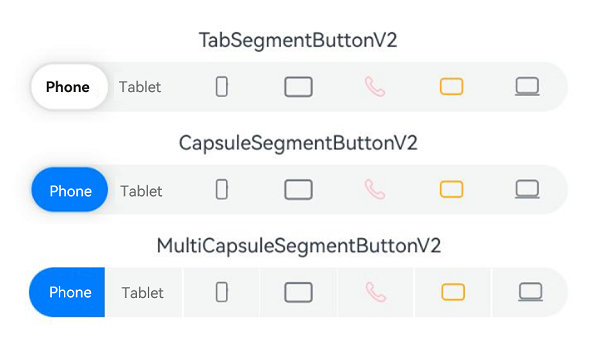

# SegmentButtonV2

<!--Kit: ArkUI-->
<!--Subsystem: ArkUI-->
<!--Owner: @song-song-song-->
<!--Designer: @fenglinbailu-->
<!--Tester: @weixin_45530366-->
<!--Adviser: @Brilliantry_Rui-->
<!-- md-trans-meta sourceCommit=f61ce95179b4c1b9fc3671fde09ef06c73b5f91d translatedAt=2026-08-24T06:51:17.953Z pushedAt=2026-08-25T07:34:36.023Z -->

The segmented button component is used to create tab-type, single-selection, or multi-selection capsule segmented buttons. It supports multiple option types such as text, icons, and symbols, as well as graphic-text hybrid configurations, and allows customization of fonts, colors, corner radii, and other styles. The tab segmented button is suitable for tab switching scenarios, the single-selection capsule segmented button is suitable for single-selection switching scenarios, and the multi-selection capsule segmented button is suitable for multi-selection filtering scenarios.

> **NOTE**
>
> - This component is supported since API version 18. Updates will be marked with a superscript to indicate their earliest API version.
>
> - The APIs of this module can be used only in the stage model.

## Modules to Import

```ts
import { TabSegmentButtonV2, CapsuleSegmentButtonV2, MultiCapsuleSegmentButtonV2, SegmentButtonV2Items } from '@kit.ArkUI';
```

## Child Components

Not supported

## Attributes

The [universal attributes](ts-component-general-attributes.md) are not supported.

## Events

The [universal events](ts-component-general-events.md) are not supported.

## TabSegmentButtonV2

```ts
TabSegmentButtonV2({
  items: SegmentButtonV2Items,
  selectedIndex: number,
  $selectedIndex?: OnSelectedIndexChange,
  onItemClicked?: Callback<number>,
  itemMinFontScale?: number | Resource,
  itemMaxFontScale?: number | Resource,
  itemSpace?: LengthMetrics,
  itemFontSize?: LengthMetrics,
  itemSelectedFontSize?: LengthMetrics,
  itemFontColor?: ColorMetrics,
  itemSelectedFontColor?: ColorMetrics,
  itemFontWeight?: FontWeight,
  itemSelectedFontWeight?: FontWeight,
  itemBorderRadius?: LengthMetrics,
  itemSelectedBackgroundColor?: ColorMetrics,
  itemIconSize?: SizeT<LengthMetrics>,
  itemIconFillColor?: ColorMetrics,
  itemSelectedIconFillColor?: ColorMetrics,
  itemSymbolFontSize?: LengthMetrics,
  itemSymbolFontColor?: ColorMetrics,
  itemSelectedSymbolFontColor?: ColorMetrics,
  itemMinHeight?: LengthMetrics,
  itemPadding?: LocalizedPadding,
  itemShadow?: ShadowOptions | ShadowStyle,
  buttonBackgroundColor?: ColorMetrics,
  buttonBackgroundBlurStyle?: BlurStyle,
  buttonBackgroundBlurStyleOptions?: BackgroundBlurStyleOptions,
  buttonBackgroundEffect?: BackgroundEffectOptions,
  buttonBorderRadius?: LengthMetrics, 
  buttonMinHeight?: LengthMetrics, 
  buttonPadding?: LengthMetrics, 
  languageDirection?: Direction,
  enableStateAnimation?: boolean,
  backgroundSystemMaterial?: uiMaterial.Material
})
```

**Decorator**: @ComponentV2

**System capability**: SystemCapability.ArkUI.ArkUI.Full

**Device behavior differences**: On wearables, calling this API results in a runtime exception indicating that the API is undefined. On other devices, the API works correctly.

| Name                            | Type                                                        | Mandatory| Decorator        | Description                                                        |
| -------------------------------- | ------------------------------------------------------------ | ---- | ------------------ | ------------------------------------------------------------ |
| items                            | [SegmentButtonV2Items](#segmentbuttonv2items)                | Yes   | @Require<br>@Param | Items of the segmented button.<br>When the value is **undefined**, no option information is displayed.<br>This member is read-only and cannot be changed.<br>**Atomic service API:** This API can be used in atomic services since API version 18. |
| selectedIndex                   | number                                                       | Yes   | @Require<br>@Param | Index of the selected option in the segmented button. The first item is numbered 0, and subsequent items increase sequentially.<br>Value range: [0, items length - 1]<br>When the value is **undefined**, no option is selected. When a valid value (including **0**) is passed, the option at the corresponding index is selected. When the value is greater than items length - 1, the item at index items length - 1 is selected. When the value is less than 0, the item at index 0 is selected.<br>This member is read-only and cannot be changed.<br>**Atomic service API:** This API can be used in atomic services since API version 18. |
| $selectedIndex                   | [OnSelectedIndexChange](#onselectedindexchange)              | No   | @Event             | Callback invoked when the selected item of the segmented button changes.<br>Default value: **undefined**, meaning the callback is not triggered when not set.<br>**Atomic service API:** This API can be used in atomic services since API version 18.                     |
| onItemClicked                    | Callback\<number>                                            | No   | @Event             | Callback invoked when a segmented button item is clicked. The callback parameter is of the number type, indicating the index of the clicked option. The first item is numbered 0, and subsequent items increase sequentially.<br>Default value: **undefined**, meaning the callback is not triggered when not set.<br>**Atomic service API:** This API can be used in atomic services since API version 18.                     |
| buttonBackgroundColor            | [ColorMetrics](../js-apis-arkui-graphics.md#colormetrics12)  | No   | @Param             | Background color of the segmented button.<br>Default value: `$r('sys.color.segment_button_v2_tab_button_background')`<br>When the value is **undefined**, the default value is used.<br>This member is read-only and cannot be changed.<br>**Atomic service API:** This API can be used in atomic services since API version 18. |
| buttonBackgroundBlurStyle        | [BlurStyle](ts-universal-attributes-background.md#blurstyle9) | No   | @Param             | Blur material of the segmented button background.<br>Default value: **undefined**<br>This member is read-only and cannot be changed.<br>**Atomic service API:** This API can be used in atomic services since API version 18. |
| buttonBackgroundBlurStyleOptions | [BackgroundBlurStyleOptions](ts-universal-attributes-background.md#backgroundblurstyleoptions10) | No   | @Param             | Blur material parameters of the segmented button background.<br>Default value: **undefined**<br>This member is read-only and cannot be changed.<br>**Atomic service API:** This API can be used in atomic services since API version 18. |
| buttonBackgroundEffect           | [BackgroundEffectOptions](ts-universal-attributes-background.md#backgroundeffectoptions11) | No   | @Param             | Background effect parameters of the segmented button.<br>Default value: **undefined**<br>This member is read-only and cannot be changed.<br>**Atomic service API:** This API can be used in atomic services since API version 18. |
| buttonBorderRadius               | [LengthMetrics](../js-apis-arkui-graphics.md#lengthmetrics12) | No   | @Param             | Corner radius of the segmented button background.<br>Value range: [0, +∞) <br>Default value: `$r('sys.float.segment_button_v2_background_corner_radius')`<br>If the value is out of range, the default value is used.<br>This member is read-only and cannot be changed.<br>**Atomic service API:** This API can be used in atomic services since API version 18. |
| buttonMinHeight                  | [LengthMetrics](../js-apis-arkui-graphics.md#lengthmetrics12) | No   | @Param             | Minimum height of the segmented button.<br>Value range: [0, +∞) <br>Default value: when there are only text-only or icon-only options: `$r('sys.float.segment_button_v2_singleline_background_height')`; when there are mixed icon and text items: `$r('sys.float.segment_button_v2_doubleline_background_height')`<br>If the value is out of range, the default value is used.<br>This member is read-only and cannot be changed.<br>**Atomic service API:** This API can be used in atomic services since API version 18. |
| buttonPadding                    | [LengthMetrics](../js-apis-arkui-graphics.md#lengthmetrics12) | No   | @Param             | Padding of the segmented button.<br>Value range: [0, +∞)<br>Default value: `$r('sys.float.padding_level1')`<br>If the value is out of range, the default value is used.<br>This member is read-only and cannot be changed.<br>**Atomic service API:** This API can be used in atomic services since API version 18. |
| itemSelectedBackgroundColor      | [ColorMetrics](../js-apis-arkui-graphics.md#colormetrics12)  | No   | @Param             | Background color of the selected option in the segmented button.<br>Default value: `$r('sys.color.segment_button_v2_tab_selected_item_background')`<br>When the value is **undefined**, the default value is used.<br>This member is read-only and cannot be changed.<br>**Atomic service API:** This API can be used in atomic services since API version 18. |
| itemMinHeight                    | [LengthMetrics](../js-apis-arkui-graphics.md#lengthmetrics12) | No   | @Param             | Minimum height of the segmented button item.<br>Value range: [0, +∞)<br>Default value:<br>When there are only text-only or icon-only options: `$r('sys.float.segment_button_v2_singleline_selected_height')`; when there are mixed icon and text items: `$r('sys.float.segment_button_v2_doubleline_selected_height')`<br>If the value is out of range, the default value is used.<br>This member is read-only and cannot be changed.<br>**Atomic service API:** This API can be used in atomic services since API version 18. |
| itemPadding                      | [LocalizedPadding](ts-types.md#localizedpadding12)           | No   | @Param             | Padding of the segmented button item.<br> Default value: `{ top: LengthMetrics.resource($r('sys.float.padding_level2')), bottom: LengthMetrics.resource($r('sys.float.padding_level2')), start: LengthMetrics.resource($r('sys.float.padding_level4')), end: LengthMetrics.resource($r('sys.float.padding_level4')) }`<br>When the value is **undefined**, the default value is used.<br>This member is read-only and cannot be changed.<br>**Atomic service API:** This API can be used in atomic services since API version 18. |
| itemShadow                       | [ShadowOptions](ts-universal-attributes-image-effect.md#shadowoptions) \| [ShadowStyle](ts-universal-attributes-image-effect.md#shadowstyle10) | No   | @Param             | Shadow of the segmented button item.<br>Default value: **ShadowStyle.OUTER_DEFAULT_XS**<br>If the value is out of range, the default value is used.<br>This member is read-only and cannot be changed.<br>**Atomic service API:** This API can be used in atomic services since API version 18. |
| itemSpace                        | [LengthMetrics](../js-apis-arkui-graphics.md#lengthmetrics12) | No   | @Param             | Spacing between segmented button items.<br>Value range: [0, +∞)<br>Default value: `LengthMetrics.vp(0)`<br>**NOTE**<br>Percentage types are not supported. Abnormal values are processed as the default value.<br>This member is read-only and cannot be changed.<br>**Atomic service API:** This API can be used in atomic services since API version 18. |
| itemMinFontScale                 | number \| [Resource](ts-types.md#resource)                   | No   | @Param             | Minimum font scale multiplier for the text size of the segmented button item.<br>Value range: [0, 1]<br>Default value: **0**<br>**NOTE**<br>If the set minimum font scale value is less than 0, the value **0** is used. If the set minimum font scale value is greater than 1, the value **1** is used. Abnormal values do not take effect by default.<br>This member is read-only and cannot be changed.<br>**Atomic service API:** This API can be used in atomic services since API version 18. |
| itemMaxFontScale                 | number \| [Resource](ts-types.md#resource)                   | No   | @Param             | Maximum font scale multiplier for the text size of the segmented button item.<br>Value range: [1, 2]<br>Default value: **1**<br>**NOTE**<br>If the set value is less than 1, the value **1** is used. If the set value is greater than 2, the value **2** is used. Abnormal values do not take effect by default.<br>This member is read-only and cannot be changed.<br>**Atomic service API:** This API can be used in atomic services since API version 18. |
| itemFontSize                     | [LengthMetrics](../js-apis-arkui-graphics.md#lengthmetrics12) | No   | @Param             | Font size of the unselected option in the segmented button.<br>Value range: [0, +∞)<br>Default value: `14fp`<br>**NOTE**<br>Percentage types are not supported. Abnormal values are processed as the default value.<br>When **items** sets the **textModifier**/**fontSize** attribute, **itemFontSize** does not take effect.<br>This member is read-only and cannot be changed.<br>**Atomic service API:** This API can be used in atomic services since API version 18. |
| itemSelectedFontSize             | [LengthMetrics](../js-apis-arkui-graphics.md#lengthmetrics12) | No   | @Param             | Font size of the selected option in the segmented button.<br>Value range: [0, +∞)<br>Default value: `14fp`<br>**NOTE**<br>Percentage types are not supported. Abnormal values are processed as the default value.<br>When **items** sets the **textModifier**/**fontSize** attribute, **itemSelectedFontSize** does not take effect.<br>This member is read-only and cannot be changed.<br>**Atomic service API:** This API can be used in atomic services since API version 18. |
| itemFontColor                    | [ColorMetrics](../js-apis-arkui-graphics.md#colormetrics12)  | No   | @Param             | Font color of the unselected option in the segmented button.<br>Default value: `$r('sys.color.font_secondary')`<br>When the value is **undefined**, the default value is used.<br>**NOTE**<br>When **items** sets the **textModifier**/**fontColor** attribute, **itemFontColor** does not take effect.<br>When **backgroundSystemMaterial** is set to a system material with automatic color inversion, this attribute uses a special system resource that supports color inversion, and the color automatically adapts to the inverted color of the material background.<br>This member is read-only and cannot be changed.<br>**Atomic service API:** This API can be used in atomic services since API version 18. |
| itemSelectedFontColor            | [ColorMetrics](../js-apis-arkui-graphics.md#colormetrics12)  | No   | @Param             | Font color of the selected option in the segmented button.<br>Default value: `$r('sys.color.font_primary')`<br>When the value is **undefined**, the default value is used.<br>**NOTE**<br>When **items** sets the **textModifier**/**fontColor** attribute, **itemSelectedFontColor** does not take effect.<br>When **backgroundSystemMaterial** is set to a system material with automatic color inversion, this attribute uses a special system resource that supports color inversion, and the color automatically adapts to the inverted color of the material background.<br>This member is read-only and cannot be changed.<br>**Atomic service API:** This API can be used in atomic services since API version 18. |
| itemFontWeight                   | [FontWeight](ts-appendix-enums.md#fontweight)                | No   | @Param             | Font weight of the unselected option in the segmented button.<br>Default value: **FontWeight.Medium**<br>If the value is out of range, the default value is used.<br>**NOTE**<br>When **items** sets the **textModifier**/**fontWeight** attribute, **itemFontWeight** does not take effect.<br>This member is read-only and cannot be changed.<br>**Atomic service API:** This API can be used in atomic services since API version 18. |
| itemSelectedFontWeight           | [FontWeight](ts-appendix-enums.md#fontweight)                | No   | @Param             | Font weight of the selected option in the segmented button.<br>Default value: **FontWeight.Medium**<br>If the value is out of range, the default value is used.<br>**NOTE**<br>When **items** sets the **textModifier**/**fontWeight** attribute, **itemSelectedFontWeight** does not take effect.<br>This member is read-only and cannot be changed.<br>**Atomic service API:** This API can be used in atomic services since API version 18. |
| itemBorderRadius                 | [LengthMetrics](../js-apis-arkui-graphics.md#lengthmetrics12) | No   | @Param             | Corner radius of the segmented button item.<br>Value range: [0, +∞)<br>Default value: `$r('sys.float.segment_button_v2_selected_corner_radius')`<br>If the value is out of range, the default value is used.<br>This member is read-only and cannot be changed.<br>**Atomic service API:** This API can be used in atomic services since API version 18. |
| itemIconSize                     | [SizeT](../js-apis-arkui-graphics.md#sizett12)\<[LengthMetrics](../js-apis-arkui-graphics.md#lengthmetrics12)> | No   | @Param             | Size of the image icon in the segmented button item.<br>Value range: [0, +∞)<br>Default value: `{ width: LengthMetrics.vp(24), height: LengthMetrics.vp(24) }`<br>If the value is out of range, the default value is used.<br>**NOTE**<br>When **items** sets the **iconModifier**/**width** or **height** attribute, **itemIconSize** does not take effect.<br>This member is read-only and cannot be changed.<br>**Atomic service API:** This API can be used in atomic services since API version 18. |
| itemIconFillColor                | [ColorMetrics](../js-apis-arkui-graphics.md#colormetrics12)  | No   | @Param             | Icon color of the unselected option in the segmented button.<br>Default value: `$r('sys.color.font_secondary')`<br>When the value is **undefined**, the default value is used.<br>**NOTE**<br>When **items** sets the **iconModifier**/**fillColor** attribute, **itemIconFillColor** does not take effect.<br>When **backgroundSystemMaterial** is set to a system material with automatic color inversion, this attribute uses a special system resource that supports color inversion, and the color automatically adapts to the inverted color of the material background.<br>This member is read-only and cannot be changed.<br>**Atomic service API:** This API can be used in atomic services since API version 18. |
| itemSelectedIconFillColor        | [ColorMetrics](../js-apis-arkui-graphics.md#colormetrics12)  | No   | @Param             | Icon color of the selected option in the segmented button.<br>Default value: `$r('sys.color.font_primary')`<br>When the value is **undefined**, the default value is used.<br>**NOTE**<br>When **items** sets the **iconModifier**/**fillColor** attribute, **itemSelectedIconFillColor** does not take effect.<br>When **backgroundSystemMaterial** is set to a system material with automatic color inversion, this attribute uses a special system resource that supports color inversion, and the color automatically adapts to the inverted color of the material background.<br>This member is read-only and cannot be changed.<br>**Atomic service API:** This API can be used in atomic services since API version 18. |
| itemSymbolFontSize               | [LengthMetrics](../js-apis-arkui-graphics.md#lengthmetrics12) | No   | @Param             | Size of the HM Symbol type icon in the segmented button item.<br>Value range: [0, +∞)<br>Default value: `20fp`<br>**NOTE**<br>Percentage types are not supported. Abnormal values are processed as the default value.<br>When **items** sets the **symbolModifier**/**fontSize** attribute, **itemSymbolFontSize** does not take effect.<br>This member is read-only and cannot be changed.<br>**Atomic service API:** This API can be used in atomic services since API version 18. |
| itemSymbolFontColor              | [ColorMetrics](../js-apis-arkui-graphics.md#colormetrics12)  | No   | @Param             | Color of the HM Symbol type icon for the unselected option in the segmented button.<br>Default value: `$r('sys.color.font_secondary')`<br>When the value is **undefined**, the default value is used.<br>**NOTE**<br>When **items** sets the **symbolModifier**/**fontColor** attribute, **itemSymbolFontColor** does not take effect.<br>When **backgroundSystemMaterial** is set to a system material with automatic color inversion, this attribute uses a special system resource that supports color inversion, and the color automatically adapts to the inverted color of the material background.<br>This member is read-only and cannot be changed.<br>**Atomic service API:** This API can be used in atomic services since API version 18. |
| itemSelectedSymbolFontColor      | [ColorMetrics](../js-apis-arkui-graphics.md#colormetrics12)  | No   | @Param             | Color of the HM Symbol type icon for the selected option in the segmented button.<br>Default value: `$r('sys.color.font_primary')`<br>When the value is **undefined**, the default value is used.<br>**NOTE**<br>When **items** sets the **symbolModifier**/**fontColor** attribute, **itemSelectedSymbolFontColor** does not take effect.<br>When **backgroundSystemMaterial** is set to a system material with automatic color inversion, this attribute uses a special system resource that supports color inversion, and the color automatically adapts to the inverted color of the material background.<br>This member is read-only and cannot be changed.<br>**Atomic service API:** This API can be used in atomic services since API version 18. |
| languageDirection                | [Direction](ts-appendix-enums.md#direction)                  | No   | @Param             | Layout direction of the segmented button.<br>Default value: **Direction.Auto**<br>If the value is out of range, the default value is used.<br>This member is read-only and cannot be changed.<br>**Atomic service API:** This API can be used in atomic services since API version 18. |
| enableStateAnimation<sup>24+</sup>             | boolean                                                      | No   | @Param             | Whether to enable the attribute animation of the segmented button when the **selectedIndex** value is modified through a variable.<br>The value **true** enables the attribute animation of the segmented button. When this attribute is not configured or the value is **false**, the attribute animation of the segmented button is disabled and the default switching animation effect of the component is used.<br>Default value: **false**<br>This member is read-only and cannot be changed.<br>**Atomic service API:** This API can be used in atomic services since API version 24.<br>**Model restriction:** This API can be used only in the stage model. |
| backgroundSystemMaterial | [uiMaterial.Material](../arkts-apis-uimaterial.md#material)    | No | @Param | System material of the background of the segmented button component. Different system materials have different attribute effects. After a material is passed in, the animation effect of **SegmentButtonV2** changes.<br>Default value: no material effect. <br>This member is read-only and cannot be changed.<br>**Since:** 26.0.0 <br>**Atomic service API:** This API can be used in atomic services since API version 26.0.0. <br>**Model restriction:** This API can be used only in the stage model.|

> **NOTE**
>
> Since API version 26.0.0, when **backgroundSystemMaterial** is set to a system material with automatic color inversion, **itemFontColor**, **itemSelectedFontColor**, **itemIconFillColor**, **itemSelectedIconFillColor**, **itemSymbolFontColor**, and **itemSelectedSymbolFontColor** use special system resources that support color inversion, and the colors automatically adapt to the inverted color of the material background.

## CapsuleSegmentButtonV2

```ts
CapsuleSegmentButtonV2({
  items: SegmentButtonV2Items,
  selectedIndex: number,
  $selectedIndex?: OnSelectedIndexChange,
  onItemClicked?: Callback<number>,
  itemMinFontScale?: number | Resource,
  itemMaxFontScale?: number | Resource,
  itemSpace?: LengthMetrics,
  itemFontSize?: LengthMetrics,
  itemSelectedFontSize?: LengthMetrics,
  itemFontColor?: ColorMetrics,
  itemSelectedFontColor?: ColorMetrics,
  itemFontWeight?: FontWeight,
  itemSelectedFontWeight?: FontWeight,
  itemBorderRadius?: LengthMetrics,
  itemSelectedBackgroundColor?: ColorMetrics,
  itemIconSize?: SizeT<LengthMetrics>,
  itemIconFillColor?: ColorMetrics,
  itemSelectedIconFillColor?: ColorMetrics,
  itemSymbolFontSize?: LengthMetrics,
  itemSymbolFontColor?: ColorMetrics,
  itemSelectedSymbolFontColor?: ColorMetrics,
  itemMinHeight?: LengthMetrics,
  itemPadding?: LocalizedPadding,
  itemShadow?: ShadowOptions | ShadowStyle,
  buttonBackgroundColor?: ColorMetrics,
  buttonBackgroundBlurStyle?: BlurStyle,
  buttonBackgroundBlurStyleOptions?: BackgroundBlurStyleOptions,
  buttonBackgroundEffect?: BackgroundEffectOptions,
  buttonBorderRadius?: LengthMetrics,
  buttonMinHeight?: LengthMetrics,
  buttonPadding?: LengthMetrics,
  languageDirection?: Direction,
  enableStateAnimation?: boolean,
  backgroundSystemMaterial?: uiMaterial.Material
})
```

**Decorator**: @ComponentV2

**System capability**: SystemCapability.ArkUI.ArkUI.Full

**Device behavior differences**: On wearables, calling this API results in a runtime exception indicating that the API is undefined. On other devices, the API works correctly.

| Name                            | Type                                                        | Mandatory| Decorator        | Description                                                        |
| -------------------------------- | ------------------------------------------------------------ | ---- | ------------------ | ------------------------------------------------------------ |
| items                            | [SegmentButtonV2Items](#segmentbuttonv2items)                | Yes   | @Require<br>@Param | Items of the segmented button.<br>When the value is **undefined**, no item information is displayed.<br>This member is read-only and cannot be changed.<br>**Atomic service API:** This API can be used in atomic services since API version 18. |
| selectedIndex                    | number                                                       | Yes   | @Require<br>@Param | Index of the selected option in the segmented button. The first item is numbered 0, and subsequent items are numbered sequentially.<br>Value range: [0, items length - 1]<br>When the value is **undefined**, no option is selected. When a valid value (including **0**) is passed, the option at the corresponding index is selected. When the value is greater than items length - 1, the item at index items length - 1 is selected. When the value is less than 0, the item at index 0 is selected.<br>This member is read-only and cannot be changed.<br>**Atomic service API:** This API can be used in atomic services since API version 18. |
| $selectedIndex                   | [OnSelectedIndexChange](#onselectedindexchange)              | No   | @Event             | Callback invoked when the selected item of the segmented button changes.<br>Default value: **undefined**, meaning the callback is not triggered when not set.<br>**Atomic service API:** This API can be used in atomic services since API version 18.                         |
| onItemClicked                    | Callback\<number>                                            | No   | @Event             | Callback invoked when a segmented button item is clicked. The callback parameter is of the number type, indicating the index of the clicked option. The first item is numbered 0, and subsequent items are numbered sequentially.<br>Default value: **undefined**, meaning the callback is not triggered when not set.<br>**Atomic service API:** This API can be used in atomic services since API version 18.                     |
| buttonBackgroundColor            | [ColorMetrics](../js-apis-arkui-graphics.md#colormetrics12)  | No   | @Param             | Background color of the segmented button.<br>Default value: `$r('sys.color.segment_button_v2_tab_button_background')`<br>When the value is **undefined**, the default value is used.<br>This member is read-only and cannot be changed.<br>**Atomic service API:** This API can be used in atomic services since API version 18. |
| buttonBackgroundBlurStyle        | [BlurStyle](ts-universal-attributes-background.md#blurstyle9) | No   | @Param             | Blur material of the segmented button background.<br>Default value: **undefined**<br>This member is read-only and cannot be changed.<br>**Atomic service API:** This API can be used in atomic services since API version 18. |
| buttonBackgroundBlurStyleOptions | [BackgroundBlurStyleOptions](ts-universal-attributes-background.md#backgroundblurstyleoptions10) | No   | @Param             | Blur material parameters of the segmented button background.<br>Default value: **undefined**<br>This member is read-only and cannot be changed.<br>**Atomic service API:** This API can be used in atomic services since API version 18. |
| buttonBackgroundEffect           | [BackgroundEffectOptions](ts-universal-attributes-background.md#backgroundeffectoptions11) | No   | @Param             | Background effect parameters of the segmented button.<br>Default value: **undefined**<br>This member is read-only and cannot be changed.<br>**Atomic service API:** This API can be used in atomic services since API version 18. |
| buttonBorderRadius               | [LengthMetrics](../js-apis-arkui-graphics.md#lengthmetrics12) | No   | @Param             | Corner radius of the segmented button background.<br>Value range: [0, +∞) <br>Default value: `$r('sys.float.segment_button_v2_background_corner_radius')`<br>If the value is out of range, the default value is used.<br>This member is read-only and cannot be changed.<br>**Atomic service API:** This API can be used in atomic services since API version 18. |
| buttonMinHeight                  | [LengthMetrics](../js-apis-arkui-graphics.md#lengthmetrics12) | No   | @Param             | Minimum height of the segmented button.<br>Value range: [0, +∞) <br>Default value: when there are only text-only or icon-only options: `$r('sys.float.segment_button_v2_singleline_background_height')`; when there are mixed icon and text items: `$r('sys.float.segment_button_v2_doubleline_background_height')`<br>If the value is out of range, the default value is used.<br>This member is read-only and cannot be changed.<br>**Atomic service API:** This API can be used in atomic services since API version 18. |
| buttonPadding                    | [LengthMetrics](../js-apis-arkui-graphics.md#lengthmetrics12) | No   | @Param             | Padding of the segmented button.<br>Value range: [0, +∞)<br>Default value: `$r('sys.float.padding_level1')`<br>If the value is out of range, the default value is used.<br>This member is read-only and cannot be changed.<br>**Atomic service API:** This API can be used in atomic services since API version 18. |
| itemSelectedBackgroundColor      | [ColorMetrics](../js-apis-arkui-graphics.md#colormetrics12)  | No   | @Param             | Background color of the selected option in the segmented button.<br>Default value: `$r('sys.color.comp_background_emphasize')`<br>When the value is **undefined**, the default value is used.<br>This member is read-only and cannot be changed.<br>**Atomic service API:** This API can be used in atomic services since API version 18. |
| itemMinHeight                    | [LengthMetrics](../js-apis-arkui-graphics.md#lengthmetrics12) | No   | @Param             | Minimum height of the segmented button item.<br>Value range: [0, +∞)<br>Default value:<br>When there are only text-only or icon-only options: `$r('sys.float.segment_button_v2_singleline_selected_height')`; when there are mixed icon and text items: `$r('sys.float.segment_button_v2_doubleline_selected_height')`<br>If the value is out of range, the default value is used.<br>This member is read-only and cannot be changed.<br>**Atomic service API:** This API can be used in atomic services since API version 18. |
| itemPadding                      | [LocalizedPadding](ts-types.md#localizedpadding12)           | No   | @Param             | Padding of the segmented button item.<br>Default value: `{ top: LengthMetrics.resource($r('sys.float.padding_level2')), bottom: LengthMetrics.resource($r('sys.float.padding_level2')), start: LengthMetrics.resource($r('sys.float.padding_level4')), end: LengthMetrics.resource($r('sys.float.padding_level4')) }`<br>When the value is **undefined**, the default value is used.<br>This member is read-only and cannot be changed.<br>**Atomic service API:** This API can be used in atomic services since API version 18. |
| itemShadow                       | [ShadowOptions](ts-universal-attributes-image-effect.md#shadowoptions) \| [ShadowStyle](ts-universal-attributes-image-effect.md#shadowstyle10) | No   | @Param             | Shadow of the segmented button item.<br>Default value: **ShadowStyle.OUTER_DEFAULT_XS**<br>If the value is out of range, the default value is used.<br>This member is read-only and cannot be changed.<br>**Atomic service API:** This API can be used in atomic services since API version 18. |
| itemSpace                        | [LengthMetrics](../js-apis-arkui-graphics.md#lengthmetrics12) | No   | @Param             | Spacing between segmented button items.<br>Value range: [0, +∞)<br>Default value: `LengthMetrics.vp(0)`<br>**Note:**<br>Percentage types are not supported. Abnormal values are handled as the default value.<br>This member is read-only and cannot be changed.<br>**Atomic service API:** This API can be used in atomic services since API version 18. |
| itemMinFontScale                 | number \| [Resource](ts-types.md#resource)                   | No   | @Param             | Minimum font scale multiplier for the text size of the segmented button item.<br>Value range: [0, 1]<br>Default value: **0**<br>**NOTE**<br>If the set minimum font scale value is less than 0, the value **0** is used. If the set minimum font scale value is greater than 1, the value **1** is used. Abnormal values do not take effect by default.<br>This member is read-only and cannot be changed.<br>**Atomic service API:** This API can be used in atomic services since API version 18. |
| itemMaxFontScale                 | number \| [Resource](ts-types.md#resource)                   | No   | @Param             | Maximum font scale multiplier for the text size of the segmented button item.<br>Value range: [1, 2]<br>Default value: **1**<br>**NOTE**<br>If the set value is less than 1, the value **1** is used. If the set value is greater than 2, the value **2** is used. Abnormal values do not take effect by default.<br>This member is read-only and cannot be changed.<br>**Atomic service API:** This API can be used in atomic services since API version 18. |
| itemFontSize                     | [LengthMetrics](../js-apis-arkui-graphics.md#lengthmetrics12) | No   | @Param             | Font size of the unselected option in the segmented button.<br>Value range: [0, +∞)<br>Default value: `14fp`<br>**Note:**<br>Percentage types are not supported. Abnormal values are handled as the default value.<br>When **items** sets the **textModifier**/**fontSize** attribute, **itemFontSize** does not take effect.<br>This member is read-only and cannot be changed.<br>**Atomic service API:** This API can be used in atomic services since API version 18. |
| itemSelectedFontSize             | [LengthMetrics](../js-apis-arkui-graphics.md#lengthmetrics12) | No   | @Param             | Font size of the selected option in the segmented button.<br>Value range: [0, +∞)<br>Default value: `14fp`<br>**Note:**<br>Percentage types are not supported. Abnormal values are handled as the default value.<br>When **items** sets the **textModifier**/**fontSize** attribute, **itemSelectedFontSize** does not take effect.<br>This member is read-only and cannot be changed.<br>**Atomic service API:** This API can be used in atomic services since API version 18. |
| itemFontColor                    | [ColorMetrics](../js-apis-arkui-graphics.md#colormetrics12)  | No   | @Param             | Font color of the unselected option in the segmented button.<br>Default value: `$r('sys.color.font_secondary')`<br>When the value is **undefined**, the default value is used.<br>**Note:**<br>When **items** sets the **textModifier**/**fontColor** attribute, **itemFontColor** does not take effect.<br>When **backgroundSystemMaterial** is set to a system material with automatic color inversion, this attribute uses a special system resource that supports color inversion, and the color automatically adapts to the inverted color of the material background.<br>This member is read-only and cannot be changed.<br>**Atomic service API:** This API can be used in atomic services since API version 18. |
| itemSelectedFontColor            | [ColorMetrics](../js-apis-arkui-graphics.md#colormetrics12)  | No   | @Param             | Font color of the selected option in the segmented button.<br>Default value: `$r('sys.color.font_on_primary')`<br>When the value is **undefined**, the default value is used.<br>**Note:**<br>When **items** sets the **textModifier**/**fontColor** attribute, **itemSelectedFontColor** does not take effect.<br>When **backgroundSystemMaterial** is set to a system material with automatic color inversion, this attribute uses a special system resource that supports color inversion, and the color automatically adapts to the inverted color of the material background.<br>This member is read-only and cannot be changed.<br>**Atomic service API:** This API can be used in atomic services since API version 18. |
| itemFontWeight                   | [FontWeight](ts-appendix-enums.md#fontweight)                | No   | @Param             | Font weight of the unselected option in the segmented button.<br>Default value: **FontWeight.Medium**<br>If the value is out of range, the default value is used.<br>**Note:**<br>When **items** sets the **textModifier**/**fontWeight** attribute, **itemFontWeight** does not take effect.<br>This member is read-only and cannot be changed.<br>**Atomic service API:** This API can be used in atomic services since API version 18. |
| itemSelectedFontWeight           | [FontWeight](ts-appendix-enums.md#fontweight)                | No   | @Param             | Font weight of the selected option in the segmented button.<br>Default value: **FontWeight.Medium**<br>If the value is out of range, the default value is used.<br>**Note:**<br>When **items** sets the **textModifier**/**fontWeight** attribute, **itemSelectedFontWeight** does not take effect.<br>This member is read-only and cannot be changed.<br>**Atomic service API:** This API can be used in atomic services since API version 18. |
| itemBorderRadius                 | [LengthMetrics](../js-apis-arkui-graphics.md#lengthmetrics12) | No   | @Param             | Corner radius of the segmented button item.<br>Value range: [0, +∞)<br>Default value: `$r('sys.float.segment_button_v2_selected_corner_radius')`<br>If the value is out of range, the default value is used.<br>This member is read-only and cannot be changed.<br>**Atomic service API:** This API can be used in atomic services since API version 18. |
| itemIconSize                     | [SizeT](../js-apis-arkui-graphics.md#sizett12)\<[LengthMetrics](../js-apis-arkui-graphics.md#lengthmetrics12)> | No   | @Param             | Size of the image icon in the segmented button item.<br>Value range: [0, +∞)<br>Default value: `{ width: LengthMetrics.vp(24), height: LengthMetrics.vp(24) }`<br>If the value is out of range, the default value is used.<br>**Note:**<br>When **items** sets the **iconModifier**/**width** or **height** attribute, **itemIconSize** does not take effect.<br>This member is read-only and cannot be changed.<br>**Atomic service API:** This API can be used in atomic services since API version 18. |
| itemIconFillColor                | [ColorMetrics](../js-apis-arkui-graphics.md#colormetrics12)  | No   | @Param             | Icon color of the unselected option in the segmented button.<br>Default value: `$r('sys.color.font_secondary')`<br>When the value is **undefined**, the default value is used.<br>**Note:**<br>When **items** sets the **iconModifier**/**fillColor** attribute, **itemIconFillColor** does not take effect.<br>When **backgroundSystemMaterial** is set to a system material with automatic color inversion, this attribute uses a special system resource that supports color inversion, and the color automatically adapts to the inverted color of the material background.<br>This member is read-only and cannot be changed.<br>**Atomic service API:** This API can be used in atomic services since API version 18. |
| itemSelectedIconFillColor        | [ColorMetrics](../js-apis-arkui-graphics.md#colormetrics12)  | No   | @Param             | Icon color of the selected option in the segmented button.<br>Default value: `$r('sys.color.font_on_primary')`<br>When the value is **undefined**, the default value is used.<br>**Note:**<br>When **items** sets the **iconModifier**/**fillColor** attribute, **itemSelectedIconFillColor** does not take effect.<br>When **backgroundSystemMaterial** is set to a system material with automatic color inversion, this attribute uses a special system resource that supports color inversion, and the color automatically adapts to the inverted color of the material background.<br>This member is read-only and cannot be changed.<br>**Atomic service API:** This API can be used in atomic services since API version 18. |
| itemSymbolFontSize               | [LengthMetrics](../js-apis-arkui-graphics.md#lengthmetrics12) | No   | @Param             | Size of the HM Symbol-type icon in the segmented button item.<br>Value range: [0, +∞)<br>Default value: `20fp`<br>**Note:**<br>Percentage types are not supported. Abnormal values are handled as the default value.<br>When **items** sets the **symbolModifier**/**fontSize** attribute, **itemSymbolFontSize** does not take effect.<br>This member is read-only and cannot be changed.<br>**Atomic service API:** This API can be used in atomic services since API version 18. |
| itemSymbolFontColor              | [ColorMetrics](../js-apis-arkui-graphics.md#colormetrics12)  | No   | @Param             | HM Symbol-type icon color of the unselected option in the segmented button.<br>Default value: `$r('sys.color.font_secondary')`<br>When the value is **undefined**, the default value is used.<br>**Note:**<br>When **items** sets the **symbolModifier**/**fontColor** attribute, **itemSymbolFontColor** does not take effect.<br>When **backgroundSystemMaterial** is set to a system material with automatic color inversion, this attribute uses a special system resource that supports color inversion, and the color automatically adapts to the inverted color of the material background.<br>This member is read-only and cannot be changed.<br>**Atomic service API:** This API can be used in atomic services since API version 18. |
| itemSelectedSymbolFontColor      | [ColorMetrics](../js-apis-arkui-graphics.md#colormetrics12)  | No   | @Param             | HM Symbol-type icon color of the selected option in the segmented button.<br>Default value: `$r('sys.color.font_on_primary')`<br>When the value is **undefined**, the default value is used.<br>**Note:**<br>When **items** sets the **symbolModifier**/**fontColor** attribute, **itemSelectedSymbolFontColor** does not take effect.<br>When **backgroundSystemMaterial** is set to a system material with automatic color inversion, this attribute uses a special system resource that supports color inversion, and the color automatically adapts to the inverted color of the material background.<br>This member is read-only and cannot be changed.<br>**Atomic service API:** This API can be used in atomic services since API version 18. |
| languageDirection                | [Direction](ts-appendix-enums.md#direction)                  | No   | @Param             | Layout direction of the segmented button.<br>Default value: **Direction.Auto**<br>If the value is out of range, the default value is used.<br>This member is read-only and cannot be changed.<br>**Atomic service API:** This API can be used in atomic services since API version 18. |
| enableStateAnimation<sup>24+</sup>             | boolean                                                      | No   | @Param             | Whether to enable the attribute animation of the segmented button when the **selectedIndex** value is modified through a variable.<br>The value **true** means to enable the attribute animation of the segmented button; when this attribute is not configured or the value is **false**, the attribute animation of the segmented button is not enabled, and the default transition animation effect of the component is used.<br>Default value: **false**<br>This member is read-only and cannot be changed.<br>**Atomic service API:** This API can be used in atomic services since API version 24.<br>**Model restriction:** This API can be used only in the stage model. |
| backgroundSystemMaterial | [uiMaterial.Material](../arkts-apis-uimaterial.md#material)    | No | @Param | System material of the background of the segmented button component. Different system materials have different attribute effects. After a material is passed in, the animation effect of **SegmentButtonV2** changes.<br>Default value: no material effect. <br>This member is read-only and cannot be changed.<br>**Since:** 26.0.0 <br>**Atomic service API:** This API can be used in atomic services since API version 26.0.0.  <br>**Model restriction:** This API can be used only in the stage model.|

> **NOTE**
>
> Since API version 26.0.0, when **backgroundSystemMaterial** is set to a system material with automatic color inversion, **itemFontColor**, **itemSelectedFontColor**, **itemIconFillColor**, **itemSelectedIconFillColor**, **itemSymbolFontColor**, and **itemSelectedSymbolFontColor** use special system resources that support color inversion, and the colors automatically adapt to the inverted color of the material background.

## MultiCapsuleSegmentButtonV2

```ts
MultiCapsuleSegmentButtonV2({
  items: SegmentButtonV2Items,
  selectedIndexes: number[],
  $selectedIndexes: OnSelectedIndexesChange,
  onItemClicked?: Callback<number>,
  itemMinFontScale?: number | Resource,
  itemMaxFontScale?: number | Resource,
  itemSpace?: LengthMetrics,
  itemFontColor?: ColorMetrics,
  itemSelectedFontColor?: ColorMetrics,
  itemFontSize?: LengthMetrics,
  itemSelectedFontSize?: LengthMetrics,
  itemFontWeight?: FontWeight,
  itemSelectedFontWeight?: FontWeight,
  itemBorderRadius?: LengthMetrics,
  itemBackgroundColor?: ColorMetrics,
  itemBackgroundEffect?: BackgroundEffectOptions,
  itemBackgroundBlurStyle?: BlurStyle,
  itemBackgroundBlurStyleOptions?: BackgroundBlurStyleOptions,
  itemSelectedBackgroundColor?: ColorMetrics,
  itemIconSize?: SizeT<LengthMetrics>,
  itemIconFillColor?: ColorMetrics,
  itemSelectedIconFillColor?: ColorMetrics,
  itemSymbolFontSize?: LengthMetrics,
  itemSymbolFontColor?: ColorMetrics,
  itemSelectedSymbolFontColor?: ColorMetrics,
  itemMinHeight?: LengthMetrics,
  itemPadding?: LocalizedPadding,
  languageDirection?: Direction
})
```

**Decorator**: @ComponentV2

**Atomic service API**: This API can be used in atomic services since API version 18.

**System capability**: SystemCapability.ArkUI.ArkUI.Full

**Device behavior differences**: On wearables, calling this API results in a runtime exception indicating that the API is undefined. On other devices, the API works correctly.

| Name                          | Type                                                        | Mandatory| Decorator        | Description                                                        |
| ------------------------------ | ------------------------------------------------------------ | ---- | ------------------ | ------------------------------------------------------------ |
| items                          | [SegmentButtonV2Items](#segmentbuttonv2items)                | Yes   | @Require<br>@Param | Items of the segmented button.<br>When the value is **undefined**, no option information is displayed.<br>This member is read-only and cannot be modified.<br>**Atomic service API:** This API can be used in atomic services since API version 18. |
| selectedIndexes                | number[]                                                     | Yes   | @Require<br>@Param | Indexes for the selected items of the segmented button. The first item is numbered 0, and subsequent items are numbered sequentially.<br>When the value is **undefined**, no option is selected.<br>NOTE<br>Only valid button numbers are supported (the first button is numbered 0, and subsequent buttons are numbered sequentially. Value range: [0, items length - 1]). If no item is selected, an empty array `[]` can be passed. When an invalid number (less than 0 or greater than items length - 1) is passed, the corresponding option is not selected.<br>This member is read-only and cannot be modified. |
| $selectedIndexes               | [OnSelectedIndexesChange](#onselectedindexeschange)          | Yes   | @Event             | Callback triggered when the selected item of the segmented button changes.                         |
| onItemClicked                  | Callback\<number>                                            | No   | @Event             | Callback triggered when a segmented button item is clicked. The callback parameter is of the number type, indicating the index of the clicked option. The first item is numbered 0, and subsequent items are numbered sequentially.<br>Default value: **undefined**. When not set, the callback is not triggered.                     |
| itemBackgroundColor            | [ColorMetrics](../js-apis-arkui-graphics.md#colormetrics12)  | No  | @Param             | Background color of unselected segmented button items.<br>Default value: **$r('sys.color.segment_button_v2_multi_capsule_button_background')**<br>If the value is **undefined**, the default value is used.<br>This property is read-only.|
| itemBackgroundEffect           | [BackgroundEffectOptions](ts-universal-attributes-background.md#backgroundeffectoptions11) | No  | @Param             | Background effect of segmented button items.<br>Default value: **undefined**<br>This property is read-only.|
| itemBackgroundBlurStyle        | [BlurStyle](ts-universal-attributes-background.md#blurstyle9) | No  | @Param             | Background blur style of segmented button items.<br>Default value: **undefined**<br>This property is read-only.|
| itemBackgroundBlurStyleOptions | [BackgroundBlurStyleOptions](ts-universal-attributes-background.md#backgroundblurstyleoptions10)| No  | @Param             | Background blur style options of segmented button items.<br>Default value: **undefined**<br>This property is read-only.|
| itemSelectedBackgroundColor    | [ColorMetrics](../js-apis-arkui-graphics.md#colormetrics12)  | No  | @Param             | Background color of the selected segmented button item.<br>Default value: **$r('sys.color.comp_background_emphasize')**<br>If the value is **undefined**, the default value is used.<br>This property is read-only.|
| itemMinHeight                  | [LengthMetrics](../js-apis-arkui-graphics.md#lengthmetrics12) | No  | @Param             | Minimum height of the segmented button item.<br>Value range: [0, +∞)<br>Default value:<br>**$r('sys.float.segment_button_v2_singleline_selected_height')** for text-only buttons and icon-only buttons, and **$r('sys.float.segment_button_v2_doubleline_selected_height')** for text+icon buttons.<br>If the value is out of the range, the default value is used.<br>This property is read-only.|
| itemPadding                    | [LocalizedPadding](ts-types.md#localizedpadding12)           | No  | @Param             | Padding of the segmented button item.<br>Default value: **{top: LengthMetrics.resource ($r('sys.float.padding_level2')), bottom: LengthMetrics.resource ($r('sys.float.padding_level2')), start: LengthMetrics.resource($r('sys.float.padding_level4')), end: LengthMetrics.resource($r('sys.float.padding_level4'))}**<br>If the value is **undefined**, the default value is used.<br>This property is read-only.|
| itemSpace                      | [LengthMetrics](../js-apis-arkui-graphics.md#lengthmetrics12) | No  | @Param             | Space between segmented button items.<br>Value range: [0, +∞)<br>Default value: **LengthMetrics.vp(1)**<br>**NOTE**<br>Percentage values are not supported. If an invalid value is set, the default value is used.<br>This property is read-only.|
| itemMinFontScale               | number \| [Resource](ts-types.md#resource)                   | No   | @Param             | Minimum font scale factor for the text size of segmented button items.<br>Value range: [0, 1]<br>Default value: **0**<br>NOTE<br>When the set minimum font scale value is less than 0, the value **0** is used. When the set minimum font scale value is greater than 1, the value **1** is used. Abnormal values do not take effect by default.<br>This member is read-only and cannot be modified. |
| itemMaxFontScale                 | number \| [Resource](ts-types.md#resource)                   | No   | @Param             | Maximum font scale factor for the text size of segmented button items.<br>Value range: [1, 2]<br>Default value: **1**<br>NOTE<br>When the set value is less than 1, the value **1** is used. When the set value is greater than 2, the value **2** is used. Abnormal values do not take effect by default.<br>This member is read-only and cannot be modified. |
| itemSelectedFontSize           | [LengthMetrics](../js-apis-arkui-graphics.md#lengthmetrics12) | No   | @Param             | Font size of the selected option in the segmented button.<br>Value range: [0, +∞)<br>Default value: `14fp`<br>NOTE<br>Percentage type is not supported. Abnormal values are processed as the default value.<br>When **items** sets the **textModifier**/**fontSize** attribute, **itemSelectedFontSize** does not take effect.<br>This member is read-only and cannot be modified. |
| itemFontColor                  | [ColorMetrics](../js-apis-arkui-graphics.md#colormetrics12)  | No   | @Param             | Font color of unselected options in the segmented button.<br>Default value: `$r('sys.color.font_secondary')`<br>When the value is **undefined**, the default value is used.<br>NOTE<br>When **items** sets the **textModifier**/**fontColor** attribute, **itemFontColor** does not take effect.<br>This member is read-only and cannot be modified. |
| itemFontSize                   | [LengthMetrics](../js-apis-arkui-graphics.md#lengthmetrics12) | No   | @Param             | Font size of unselected options in the segmented button.<br>Value range: [0, +∞)<br>Default value: `14fp`<br>NOTE<br>Percentage type is not supported. Abnormal values are processed as the default value.<br>When **items** sets the **textModifier**/**fontSize** attribute, **itemFontSize** does not take effect.<br>This member is read-only and cannot be modified. |
| itemSelectedFontColor          | [ColorMetrics](../js-apis-arkui-graphics.md#colormetrics12)  | No   | @Param             | Font color of the selected option in the segmented button.<br>Default value: `$r('sys.color.font_on_primary')`<br>When the value is **undefined**, the default value is used.<br>NOTE<br>When **items** sets the **textModifier**/**fontColor** attribute, **itemSelectedFontColor** does not take effect.<br>This member is read-only and cannot be modified. |
| itemFontWeight                 | [FontWeight](ts-appendix-enums.md#fontweight)                | No   | @Param             | Font weight of unselected options in the segmented button.<br>Default value: **FontWeight.Medium**<br>Values outside the value range are processed as the default value.<br>NOTE<br>When **items** sets the **textModifier**/**fontWeight** attribute, **itemFontWeight** does not take effect.<br>This member is read-only and cannot be modified. |
| itemSelectedFontWeight         | [FontWeight](ts-appendix-enums.md#fontweight)                | No   | @Param             | Font weight of the selected option in the segmented button.<br>Default value: **FontWeight.Medium**<br>Values outside the value range are processed as the default value.<br>NOTE<br>When **items** sets the **textModifier**/**fontWeight** attribute, **itemSelectedFontWeight** does not take effect.<br>This member is read-only and cannot be modified. |
| itemBorderRadius               | [LengthMetrics](../js-apis-arkui-graphics.md#lengthmetrics12) | No  | @Param             | Border radius of segmented button items.<br>Value range: [0, +∞)<br>Default value: **$r('sys.float.segment_button_v2_multi_corner_radius')**<br>If the value is out of the range, the default value is used.<br>This property is read-only.|
| itemIconSize                   | [SizeT](../js-apis-arkui-graphics.md#sizett12)\<[LengthMetrics](../js-apis-arkui-graphics.md#lengthmetrics12)> | No   | @Param             | Size of image icons in segmented button items.<br>Value range: [0, +∞)<br>Default value: `{ width: LengthMetrics.vp(24), height: LengthMetrics.vp(24) }`<br>Values outside the value range are processed as the default value.<br>NOTE<br>When **items** sets the **iconModifier**/**width** or height attribute, **itemIconSize** does not take effect.<br>This member is read-only and cannot be modified. |
| itemIconFillColor              | [ColorMetrics](../js-apis-arkui-graphics.md#colormetrics12)  | No   | @Param             | Icon color of unselected options in the segmented button.<br>Default value: `$r('sys.color.font_secondary')`<br>When the value is **undefined**, the default value is used.<br>NOTE<br>When **items** sets the **iconModifier**/**fillColor** attribute, **itemIconFillColor** does not take effect.<br>This member is read-only and cannot be modified. |
| itemSelectedIconFillColor      | [ColorMetrics](../js-apis-arkui-graphics.md#colormetrics12)  | No   | @Param             | Icon color of the selected option in the segmented button.<br>Default value: `$r('sys.color.font_on_primary')`<br>When the value is **undefined**, the default value is used.<br>NOTE<br>When **items** sets the **iconModifier**/**fillColor** attribute, **itemSelectedIconFillColor** does not take effect.<br>This member is read-only and cannot be modified. |
| itemSymbolFontSize             | [LengthMetrics](../js-apis-arkui-graphics.md#lengthmetrics12) | No   | @Param             | Size of HM Symbol-type icons in segmented button items.<br>Value range: [0, +∞)<br>Default value: `20fp`<br>NOTE<br>Percentage type is not supported. Abnormal values are processed as the default value.<br>When **items** sets the **symbolModifier**/**fontSize** attribute, **itemSymbolFontSize** does not take effect.<br>This member is read-only and cannot be modified. |
| itemSymbolFontColor            | [ColorMetrics](../js-apis-arkui-graphics.md#colormetrics12)  | No   | @Param             | Color of HM Symbol-type icons in unselected options of the segmented button.<br>Default value: `$r('sys.color.font_secondary')`<br>When the value is **undefined**, the default value is used.<br>NOTE<br>When **items** sets the **symbolModifier**/**fontColor** attribute, **itemSymbolFontColor** does not take effect.<br>This member is read-only and cannot be modified. |
| itemSelectedSymbolFontColor    | [ColorMetrics](../js-apis-arkui-graphics.md#colormetrics12)  | No   | @Param             | Color of HM Symbol-type icons in the selected option of the segmented button.<br>Default value: `$r('sys.color.font_on_primary')`<br>When the value is **undefined**, the default value is used.<br>NOTE<br>When **items** sets the **symbolModifier**/**fontColor** attribute, **itemSelectedSymbolFontColor** does not take effect.<br>This member is read-only and cannot be modified. |
| languageDirection              | [Direction](ts-appendix-enums.md#direction)                  | No  | @Param             | Language direction of the segmented button.<br>Default value: **Direction.Auto**<br>If the value is out of the range, the default value is used.<br>This property is read-only.|

## SegmentButtonV2Items

Represents items of the **SegmentButtonV2** component.

This parameter is inherited from Array\<[SegmentButtonV2Item](#segmentbuttonv2item)>.

**Decorator type**: @ObservedV2

### constructor

constructor(items: SegmentButtonV2ItemOptions[])

Constructs a **SegmentButtonV2ItemOptions** instance.

**Atomic service API**: This API can be used in atomic services since API version 18.

**System capability**: SystemCapability.ArkUI.ArkUI.Full

**Device behavior differences**: On wearables, calling this API results in a runtime exception indicating that the API is undefined. On other devices, the API works correctly.

**Parameters**

| Name | Type                                                             | Mandatory| Description                      |
| ----- | ----------------------------------------------------------------- | ---- | -------------------------- |
| items | [SegmentButtonV2ItemOptions](#segmentbuttonv2itemoptions)[] | Yes  | Options of the item of the **SegmentButtonV2** component.|

### hasHybrid

get hasHybrid():boolean

Checks whether the component contains mixed icon and text items.

**Atomic service API**: This API can be used in atomic services since API version 18.

**System capability**: SystemCapability.ArkUI.ArkUI.Full

**Device behavior differences**: On wearables, calling this API results in a runtime exception indicating that the API is undefined. On other devices, the API works correctly.

**Return value**

| Type   | Description                                                        |
| ------- | ------------------------------------------------------------ |
| boolean | Whether the component contains mixed icon and text items.<br>The value **true** indicates that there is an item with both an icon and text, and **false** indicates the opposite. |

## SegmentButtonV2Item

**Decorator type**: @ObservedV2

### Properties

**Atomic service API**: This API can be used in atomic services since API version 18.

**System capability**: SystemCapability.ArkUI.ArkUI.Full

**Device behavior differences**: On wearables, calling this API results in a runtime exception indicating that the API is undefined. On other devices, the API works correctly.

| Name                    | Type                                                                | Read-Only| Optional| Description                                           |
| ------------------------ | -------------------------------------------------------------------- | ------ | ---- | ---- |
| text                     | [ResourceStr](ts-types.md#resourcestr)                               | No| Yes| Text of the segmented button item.<br>Default value: **undefined**<br>Decorator type: @Trace        |
| icon                     | [ResourceStr](ts-types.md#resourcestr)                               | No| Yes| Image icon of the segmented button item.<br>Default value: **undefined**<br>Decorator type: @Trace     |
| symbol                   | [Resource](ts-types.md#resource)                                     | No| Yes| HM Symbol icon of the segmented button item.<br>Default value: **undefined**<br>Decorator type: @Trace|
| enabled                  | boolean                                                              | No| No| Whether the segmented button item is enabled.<br>Default value: **true**<br>**true**: enabled. **false**: disabled.<br>If the value is **undefined**, the default value is used.<br>Decorator type: @Trace|
| textModifier             | [TextModifier](ts-universal-attributes-attribute-modifier.md#custom-modifier)        | No| Yes| Text modifier for the segmented button item.<br>Default value: **undefined**<br>Decorator type: @Trace|
| iconModifier             | [ImageModifier](ts-universal-attributes-attribute-modifier.md#custom-modifier)       | No| Yes| Image icon modifier for the segmented button item.<br>Default value: **undefined**<br>Decorator type: @Trace|
| symbolModifier           | [SymbolGlyphModifier](ts-universal-attributes-attribute-symbolglyphmodifier.md#symbolglyphmodifier) | No| Yes| HM Symbol icon modifier for the segmented button item.<br>Default value: **undefined**<br>Decorator type: @Trace|
| accessibilityText        | [ResourceStr](ts-types.md#resourcestr)                               | No| Yes| [Accessibility text](ts-universal-attributes-accessibility.md#accessibilitytext) of the segmented button item.<br>Default value: **""**<br>If the value is **undefined**, the default value is used.<br>Decorator type: @Trace|
| accessibilityDescription | [ResourceStr](ts-types.md#resourcestr)                               | No| Yes| [Accessibility description](ts-universal-attributes-accessibility.md#accessibilitydescription) of the segmented button item.<br>Default value: **""**<br>If the value is **undefined**, the default value is used.<br>Decorator type: @Trace|
| accessibilityLevel | string | No | Yes | Accessibility level of the segmented button item [accessibilityLevel](ts-universal-attributes-accessibility.md#accessibilitylevel).<br>Default value: **"auto"**<br>If the value is **undefined**, the default value is used.<br>**Decorator:** @Trace |

> **Description**
>
> 1. If both **symbol** and **icon** are configured, **symbol** takes precedence.
> 2. If both **symbol** and **symbolModifier** are configured with HM Symbol resources, the resources specified by **symbolModifier** take precedence.

### constructor

constructor(options: SegmentButtonV2ItemOptions)

Constructs a **SegmentButtonV2ItemOptions** instance.

**Atomic service API**: This API can be used in atomic services since API version 18.

**System capability**: SystemCapability.ArkUI.ArkUI.Full

**Device behavior differences**: On wearables, calling this API results in a runtime exception indicating that the API is undefined. On other devices, the API works correctly.

**Parameters**

| Name   | Type                                                     | Mandatory| Description                  |
| ------- | --------------------------------------------------------- | ---- | ---------------------- |
| options | [SegmentButtonV2ItemOptions](#segmentbuttonv2itemoptions) | Yes  | Configuration parameters for the segmented button item.|

### isHybrid

get isHybrid():boolean

Checks whether the segmented button item has text and icon configured. Difference from [hasHybrid](#hashybrid): **hasHybrid** checks whether the component contains mixed icon and text items, while this API checks whether a single item has text and icon configured.

**Atomic service API**: This API can be used in atomic services since API version 18.

**System capability**: SystemCapability.ArkUI.ArkUI.Full

**Device behavior differences**: On wearables, calling this API results in a runtime exception indicating that the API is undefined. On other devices, the API works correctly.

**Return value**

| Type   | Description                                                        |
| ------- | ------------------------------------------------------------ |
| boolean | Whether the item contains both text and icon configurations.<br>**true**: The item has both text and icon configurations. **false**: The item does not have both text and icon configured.|

## SegmentButtonV2ItemOptions

Defines segmented button item options.

**Atomic service API**: This API can be used in atomic services since API version 18.

**System capability**: SystemCapability.ArkUI.ArkUI.Full

**Device behavior differences**: On wearables, calling this API results in a runtime exception indicating that the API is undefined. On other devices, the API works correctly.

| Name                    | Type                                                        | Read-Only| Optional| Description                                                        |
| ------------------------ | ------------------------------------------------------------ | ---- | ---- | ------------------------------------------------------------ |
| text                     | [ResourceStr](ts-types.md#resourcestr)                       | No  | Yes  | Text of the segmented button item.<br>Default value: **undefined**                     |
| icon                     | [ResourceStr](ts-types.md#resourcestr)                       | No   | Yes   | Image icon of the segmented button item.<br>Default value: **undefined**                      |
| symbol                   | [Resource](ts-types.md#resource)                             | No   | Yes   | HM Symbol icon of the segmented button item.<br>Default value: **undefined** |
| enabled                  | boolean                                                      | No   | Yes   | Whether the segmented button item is available.<br>Default value: **true**<br>**true**: available; **false**: unavailable.<br>If the value is **undefined**, the default value is used. |
| textModifier             | [TextModifier](ts-universal-attributes-attribute-modifier.md#custom-modifier) | No  | Yes  | Text modifier for the segmented button item.<br>Default value: **undefined**       |
| iconModifier             | [ImageModifier](ts-universal-attributes-attribute-modifier.md#custom-modifier) | No   | Yes   | Style modifier for the image icon of the segmented button item.<br>Default value: **undefined** |
| symbolModifier           | [SymbolGlyphModifier](ts-universal-attributes-attribute-symbolglyphmodifier.md#symbolglyphmodifier) | No   | Yes   | Style modifier for the HM Symbol icon of the segmented button item.<br>Default value: **undefined** |
| accessibilityText        | [ResourceStr](ts-types.md#resourcestr)                       | No   | Yes   | Accessibility text of the segmented button item. For details, see [accessibilityText](ts-universal-attributes-accessibility.md#accessibilitytext).<br>Default value: **""**<br>If the value is **undefined**, the default value is used. |
| accessibilityDescription | [ResourceStr](ts-types.md#resourcestr)                       | No  | Yes  | [Accessibility description](ts-universal-attributes-accessibility.md#accessibilitydescription) of the segmented button item.<br>Default value: **""**<br>If the value is **undefined**, the default value is used.|
| accessibilityLevel       | string                                                       | No   | Yes   | Accessibility level of the segmented button item. For details, see [accessibilityLevel](ts-universal-attributes-accessibility.md#accessibilitylevel).<br>Default value: **"auto"**<br>If the value is **undefined**, the default value is used. |

> **Description**
>
> 1. If both **symbol** and **icon** are configured, **symbol** takes precedence.
> 2. If both **symbol** and **symbolModifier** are configured with HM Symbol resources, the resources specified by **symbolModifier** take precedence.

## OnSelectedIndexChange

type OnSelectedIndexChange = (selectedIndex: number) => void

Defines a callback invoked when the selected segmented button item changes.

**Atomic service API**: This API can be used in atomic services since API version 18.

**System capability**: SystemCapability.ArkUI.ArkUI.Full

**Device behavior differences**: On wearables, calling this API results in a runtime exception indicating that the API is undefined. On other devices, the API works correctly.

**Parameters**

| Name       | Type  | Mandatory| Description              |
| ------------- | ------ | ---- | ------------------ |
| selectedIndex | number | Yes | Index of the segmented button item. The first item is numbered 0, and subsequent items are numbered in ascending order. |

## OnSelectedIndexesChange

type OnSelectedIndexesChange = (selectedIndexes: number[]) => void

Defines a callback invoked when the selected segmented button items change.

**Atomic service API**: This API can be used in atomic services since API version 18.

**System capability**: SystemCapability.ArkUI.ArkUI.Full

**Device behavior differences**: On wearables, calling this API results in a runtime exception indicating that the API is undefined. On other devices, the API works correctly.

**Parameters**

| Name         | Type    | Mandatory| Description                  |
| --------------- | -------- | ---- | ---------------------- |
| selectedIndexes | number[] | Yes | Indexes of the selected items in the segmented button. The first item is numbered 0, and subsequent items are numbered in ascending order. |

## Example

### Example 1: Using the TabSegmentButtonV2

This example describes how to use the **TabSegmentButtonV2** component.

```ts
import { SegmentButtonV2Items, TabSegmentButtonV2 } from '@kit.ArkUI';

@Entry
@ComponentV2
struct TabSegmentButtonV2Example {
  @Local textItems: SegmentButtonV2Items = new SegmentButtonV2Items([
    { text: 'Phone' },
    { text: 'Tablet' },
    { text: '2-in-1' },
    { text: 'Wearable' },
  ]);
  @Local textSelectedIndex: number = 0;
  @Local imageItems: SegmentButtonV2Items = new SegmentButtonV2Items([
    { icon: $r('sys.media.ohos_ic_public_device_phone') },
    { icon: $r('sys.media.ohos_ic_public_device_pad') },
    { icon: $r('sys.media.ohos_ic_public_device_matebook') },
    { icon: $r('sys.media.ohos_ic_public_device_watch') },
  ]);
  @Local imageSelectedIndex: number = 0;
  @Local symbolItems: SegmentButtonV2Items = new SegmentButtonV2Items([
    { symbol: $r('sys.symbol.phone') },
    { symbol: $r('sys.symbol.pad') },
    { symbol: $r('sys.symbol.matebook') },
    { symbol: $r('sys.symbol.watch') },
  ]);
  @Local symbolSelectedIndex: number = 0;
  @Local hybridItems: SegmentButtonV2Items = new SegmentButtonV2Items([
    { text: 'Phone', symbol: $r('sys.symbol.phone') },
    { text: 'Tablet', symbol: $r('sys.symbol.pad') },
    { text: '2-in-1', symbol: $r('sys.symbol.matebook') },
    { text: 'Wearable', symbol: $r('sys.symbol.watch') },
  ]);
  @Local hybridSelectedIndex: number = 0;
  @Local freeItems: SegmentButtonV2Items = new SegmentButtonV2Items([
    { text: 'Year' },
    { text: 'Month' },
    { text: 'Week' },
    { text: 'Day' },
    { icon: $r('sys.media.ohos_ic_public_search_filled') },
  ]);
  @Local freeSelectedIndex: number = 0;

  build() {
    Scroll() {
      Column({ space: 12 }) {
        VCard({ title: 'Text Button' }) {
          TabSegmentButtonV2({
            items: this.textItems,
            selectedIndex: this.textSelectedIndex!!,
          })
        }

        VCard({ title: 'Image Button' }) {
          TabSegmentButtonV2({
            items: this.imageItems,
            selectedIndex: this.imageSelectedIndex!!,
          })
        }

        VCard({ title: 'Symbol Button' }) {
          TabSegmentButtonV2({
            items: this.symbolItems,
            selectedIndex: this.symbolSelectedIndex!!,
          })
        }

        VCard({ title: 'Text and Icon Button' }) {
          TabSegmentButtonV2({
            items: this.hybridItems,
            selectedIndex: this.hybridSelectedIndex!!,
          })
        }

        VCard({ title: 'Custom Button' }) {
          TabSegmentButtonV2({
            items: this.freeItems,
            selectedIndex: this.freeSelectedIndex!!,
          })
        }

        Button(`Usage instructions for the isHybrid API, ${this.textItems[0].isHybrid}`) // false is displayed for text-only items.
          .width('70%')

        Button(`Usage instructions for the isHybrid API, ${this.hybridItems[0].isHybrid}`) // true is displayed for items with both text and an icon.
          .width('70%')

        Button('Usage instructions for the hasHybrid API, ${this.textItems.hasHybrid}`) // false is displayed when a segmented button does not support items with both text and an icon.
          .width('70%')

        Button('Usage instructions for the hasHybrid API, ${this.hybridItems.hasHybrid}`) // true is displayed when a segmented button supports items with both text and an icon.
          .width('70%')
      }
      .constraintSize({ minHeight: '100%' })
      .justifyContent(FlexAlign.Start)
      .padding(16)
    }
    .backgroundColor('#f1f3f5')
    .width('100%')
    .height('100%')
  }
}

@Builder
function Noop() {
}

@Component
export struct VCard {
  @Prop
  title: ResourceStr;
  @BuilderParam
  content: () => void = Noop;

  build() {
    Column({ space: 8 }) {
      if (this.title) {
        Text(this.title)
          .maxLines(1)
          .textOverflow({ overflow: TextOverflow.Ellipsis })
          .constraintSize({ maxWidth: '80%' })
      }
      this.content()
    }
    .backgroundColor(Color.White)
    .borderRadius(8)
    .padding(8)
    .width('100%')
  }
}
```


### Example 2: Using the CapsuleSegmentButtonV2

This example describes how to use the **CapsuleSegmentButtonV2** component.

```ts
import { CapsuleSegmentButtonV2, SegmentButtonV2Items } from '@kit.ArkUI';

@Entry
@ComponentV2
struct CapsuleSegmentButtonV2Example {
  @Local textItems: SegmentButtonV2Items = new SegmentButtonV2Items([
    // Sets the item text for the segmented button.
    { text: 'Phone' },
    { text: 'Tablet' },
    { text: '2-in-1' }, 
    { text: 'Wearable' },
  ]);
  @Local textSelectedIndex: number = 0;
  @Local imageItems: SegmentButtonV2Items = new SegmentButtonV2Items([
    // Set the item icon for the segmented button.
    { icon: $r('sys.media.ohos_ic_public_device_phone') },
    { icon: $r('sys.media.ohos_ic_public_device_pad') },
    { icon: $r('sys.media.ohos_ic_public_device_matebook') },
    { icon: $r('sys.media.ohos_ic_public_device_watch') },
  ]);
  @Local imageSelectedIndex: number = 0;
  @Local symbolItems: SegmentButtonV2Items = new SegmentButtonV2Items([
    // Segmented button item icon of the symbol type.
    { symbol: $r('sys.symbol.phone') },
    { symbol: $r('sys.symbol.pad') },
    { symbol: $r('sys.symbol.matebook') },
    { symbol: $r('sys.symbol.watch') },
  ]);
  @Local symbolSelectedIndex: number = 0;
  @Local hybridItems: SegmentButtonV2Items = new SegmentButtonV2Items([
    { text: 'Phone', symbol: $r('sys.symbol.phone') },
    { text: 'Tablet', symbol: $r('sys.symbol.pad') },
    { text: '2-in-1', symbol: $r('sys.symbol.matebook') },
    { text: 'Wearable', symbol: $r('sys.symbol.watch') },
  ]);
  @Local hybridSelectedIndex: number = 0;
  @Local freeItems: SegmentButtonV2Items = new SegmentButtonV2Items([
    { text: 'Year' },
    { text: 'Month' },
    { text: 'Week' },
    { text: 'Day' },
    { icon: $r('sys.media.ohos_ic_public_search_filled') },
  ]);
  @Local freeSelectedIndex: number = 0;

  build() {
    Scroll() {
      Column({ space: 12 }) {
        VCard({ title: 'Text Button' }) {
          CapsuleSegmentButtonV2({
            items: this.textItems,
            selectedIndex: this.textSelectedIndex!!,
          })
        }

        VCard({ title: 'Image Button' }) {
          CapsuleSegmentButtonV2({
            items: this.imageItems,
            selectedIndex: this.imageSelectedIndex!!,
          })
        }

        VCard({ title: 'Symbol Button' }) {
          CapsuleSegmentButtonV2({
            items: this.symbolItems,
            selectedIndex: this.symbolSelectedIndex!!,
          })
        }

        VCard({ title: 'Text and Icon Button' }) {
          CapsuleSegmentButtonV2({
            items: this.hybridItems,
            selectedIndex: this.hybridSelectedIndex!!,
          })
        }

        VCard({ title: 'Custom Button' }) {
          CapsuleSegmentButtonV2({
            items: this.freeItems,
            selectedIndex: this.freeSelectedIndex!!,
          })
        }
      }
      .constraintSize({ minHeight: '100%' })
      .justifyContent(FlexAlign.Start)
      .padding(16)
    }
    .backgroundColor('#f1f3f5')
    .width('100%')
    .height('100%')
  }
}

@Builder
function Noop() {
}

@Component
export struct VCard {
  @Prop
  title: ResourceStr;
  @BuilderParam
  content: () => void = Noop;

  build() {
    Column({ space: 8 }) {
      // Check whether the title exists. If not, the title is not displayed.
      if (this.title) {
        Text(this.title)
          .maxLines(1)
          .textOverflow({ overflow: TextOverflow.Ellipsis })
          .constraintSize({ maxWidth: '80%' })
      }
      this.content()
    }
    .backgroundColor(Color.White)
    .borderRadius(8)
    .padding(8)
    .width('100%')
  }
}
```


### Example 3: Using the MultiCapsuleSegmentButtonV2

This example describes how to use the **MultiCapsuleSegmentButtonV2** component.

```ts
import { MultiCapsuleSegmentButtonV2, SegmentButtonV2Items } from '@kit.ArkUI';

@Entry
@ComponentV2
struct MultiCapsuleSegmentButtonV2Example {
  @Local textItems: SegmentButtonV2Items = new SegmentButtonV2Items([
    // Sets the item text for the segmented button.
    { text: 'Phone' },
    { text: 'Tablet' },
    { text: '2-in-1' }, 
    { text: 'Wearable' },
  ]);
  @Local textSelectedIndexes: number[] = [0];
  @Local imageItems: SegmentButtonV2Items = new SegmentButtonV2Items([
    // Set the item icon for the segmented button.
    { icon: $r('sys.media.ohos_ic_public_device_phone') },
    { icon: $r('sys.media.ohos_ic_public_device_pad') },
    { icon: $r('sys.media.ohos_ic_public_device_matebook') },
    { icon: $r('sys.media.ohos_ic_public_device_watch') },
  ]);
  @Local imageSelectedIndexes: number[] = [0];
  @Local symbolItems: SegmentButtonV2Items = new SegmentButtonV2Items([
    // Segmented button item icon of the symbol type.
    { symbol: $r('sys.symbol.phone') },
    { symbol: $r('sys.symbol.pad') },
    { symbol: $r('sys.symbol.matebook') },
    { symbol: $r('sys.symbol.watch') },
  ]);
  @Local symbolSelectedIndexes: number[] = [0];
  @Local hybridItems: SegmentButtonV2Items = new SegmentButtonV2Items([
    { text: 'Phone', symbol: $r('sys.symbol.phone') },
    { text: 'Tablet', symbol: $r('sys.symbol.pad') },
    { text: '2-in-1', symbol: $r('sys.symbol.matebook') },
    { text: 'Wearable', symbol: $r('sys.symbol.watch') },
  ]);
  @Local hybridSelectedIndexes: number[] = [0];
  @Local freeItems: SegmentButtonV2Items = new SegmentButtonV2Items([
    { text: 'Year' },
    { text: 'Month' },
    { text: 'Week' },
    { text: 'Day' },
    { icon: $r('sys.media.ohos_ic_public_search_filled') },
  ]);
  @Local freeSelectedIndexes: number[] = [0];

  build() {
    Scroll() {
      Column({ space: 12 }) {
        VCard({ title: 'Text Button' }) {
          MultiCapsuleSegmentButtonV2({
            items: this.textItems,
            selectedIndexes: this.textSelectedIndexes!!,
          })
        }

        VCard({ title: 'Image Button' }) {
          MultiCapsuleSegmentButtonV2({
            items: this.imageItems,
            selectedIndexes: this.imageSelectedIndexes!!,
          })
        }

        VCard({ title: 'Symbol Button' }) {
          MultiCapsuleSegmentButtonV2({
            items: this.symbolItems,
            selectedIndexes: this.symbolSelectedIndexes!!,
          })
        }

        VCard({ title: 'Text and Icon Button' }) {
          MultiCapsuleSegmentButtonV2({
            items: this.hybridItems,
            selectedIndexes: this.hybridSelectedIndexes!!,
          })
        }

        VCard({ title: 'Custom Button' }) {
          MultiCapsuleSegmentButtonV2({
            items: this.freeItems,
            selectedIndexes: this.freeSelectedIndexes!!,
          })
        }
      }
      .constraintSize({ minHeight: '100%' })
      .justifyContent(FlexAlign.Start)
      .padding(16)
    }
    .backgroundColor('#f1f3f5')
    .width('100%')
    .height('100%')
  }
}

@Builder
function Noop() {
}

@Component
export struct VCard {
  @Prop
  title: ResourceStr;
  @BuilderParam
  content: () => void = Noop;

  build() {
    Column({ space: 8 }) {
      // Check whether the title exists. If not, the title is not displayed.
      if (this.title) {
        Text(this.title)
          .maxLines(1)
          .textOverflow({ overflow: TextOverflow.Ellipsis })
          .constraintSize({ maxWidth: '80%' })
      }
      this.content()
    }
    .backgroundColor(Color.White)
    .borderRadius(8)
    .padding(8)
    .width('100%')
  }
}
```


### Example 4: Implementing Basic Usage of the Segmented Button Modifier

This example describes the basic usage of the Modifier for the tab segmented button, single-selection capsule segmented button, and multi-selection capsule segmented button.

```ts
import {
  SegmentButtonV2Items,
  TabSegmentButtonV2,
  CapsuleSegmentButtonV2,
  MultiCapsuleSegmentButtonV2,
  TextModifier,
  ImageModifier,
  SymbolGlyphModifier
} from '@kit.ArkUI';

@Entry
@ComponentV2
struct SegmentButtonV2Example {
  @Local textItems: SegmentButtonV2Items = new SegmentButtonV2Items([
    { text: 'Phone', textModifier: new TextModifier().fontSize(20) }, // textModifier: Text modifier for the segmented button item.
    { text: 'Tablet' },
    // iconModifier: Icon modifier for the segmented button item.
    { icon: $r('sys.media.ohos_ic_public_device_phone'), iconModifier: new ImageModifier().height(17).width(17) },
    { icon: $r('sys.media.ohos_ic_public_device_pad') },
    // symbolModifier: Symbol modifier for the segmented button item.
    { symbol: $r('sys.symbol.phone'), symbolModifier: new SymbolGlyphModifier().fontColor([Color.Pink]) },
    { symbolModifier: new SymbolGlyphModifier($r('sys.symbol.pad')).fontColor([Color.Orange]) },
    { symbol: $r('sys.symbol.matebook') },
  ]);
  @Local textSelectedIndex: number = 0;
  @Local freeSelectedIndexes: number[] = [0];

  build() {
    Column() {
      VCard({ title: 'TabSegmentButtonV2' }) {
        TabSegmentButtonV2({
          items: this.textItems,
          selectedIndex: this.textSelectedIndex!!,
        })
      }

      VCard({ title: 'CapsuleSegmentButtonV2' }) {
        CapsuleSegmentButtonV2({
          items: this.textItems,
          selectedIndex: this.textSelectedIndex!!,
        })
      }

      VCard({ title: 'MultiCapsuleSegmentButtonV2' }) {
        MultiCapsuleSegmentButtonV2({
          items: this.textItems,
          selectedIndexes: this.freeSelectedIndexes!!,
        })
      }

    }
    .constraintSize({ minHeight: '100%' })
    .justifyContent(FlexAlign.Start)
    .padding(16)

  }
}

@Builder
function Noop() {
}

@Component
export struct VCard {
  @Prop
  title: ResourceStr;
  @BuilderParam
  content: () => void = Noop;

  build() {
    Column({ space: 8 }) {
      // Check whether the title exists. If not, the title is not displayed.
      if (this.title) {
        Text(this.title)
          .maxLines(1)
          .textOverflow({ overflow: TextOverflow.Ellipsis })
          .constraintSize({ maxWidth: '80%' })
      }
      this.content()
    }
    .backgroundColor(Color.White)
    .borderRadius(8)
    .padding(8)
    .width('100%')
  }
}
```



### Example 5: Enabling Property Animation for SegmentButtonV2

This example shows that after **enableStateAnimation** is enabled for **SegmentButtonV2**, the button switching also has an animation effect when the value of **selectedIndex** is modified through a state variable.

Since API version 24, the **enableStateAnimation** attribute is added to [TabSegmentButtonV2](#tabsegmentbuttonv2) and [CapsuleSegmentButtonV2](#capsulesegmentbuttonv2).

```ts
import { TabSegmentButtonV2, CapsuleSegmentButtonV2, SegmentButtonV2Items } from '@kit.ArkUI';

@Entry
@ComponentV2
struct SegmentButtonV2Example {
  @Local textItems: SegmentButtonV2Items = new SegmentButtonV2Items([
    { text: 'Phone' },
    { text: 'Tablet' },
    { text: '2-in-1' },
    { text: 'Wearable' },
  ]);
  @Local imageItems: SegmentButtonV2Items = new SegmentButtonV2Items([
    { icon: $r('sys.media.ohos_ic_public_device_phone') },
    { icon: $r('sys.media.ohos_ic_public_device_pad') },
    { icon: $r('sys.media.ohos_ic_public_device_matebook') },
    { icon: $r('sys.media.ohos_ic_public_device_watch') },
  ]);
  @Local textSelectedIndex: number = 0;
  @Local imageSelectedIndex: number = 0;
  @Local currentSelectedIndex: number = 0; // Index counter for switching selected items.

  build() {
    Scroll() {
      Column({ space: 12 }) {
        VCard({ title: 'TabSegmentButtonV2' }) {
          TabSegmentButtonV2({
            items: this.textItems,
            selectedIndex: this.textSelectedIndex!!,
            enableStateAnimation: true // Enable property animation for TabSegmentButtonV2
          })
        }

        VCard({ title: 'CapsuleSegmentButtonV2' }) {
          CapsuleSegmentButtonV2({
            items: this.imageItems,
            selectedIndex: this.imageSelectedIndex!!,
            enableStateAnimation: true // Enable property animation for CapsuleSegmentButtonV2.
          })
        }

        Button('ChangeSelectedIndex').onClick((event: ClickEvent) => {
          // Increment the selected index via a state variable. Reset the index to 0 if it exceeds the maximum value.
          this.currentSelectedIndex = this.currentSelectedIndex < 3 ? this.currentSelectedIndex + 1 : 0;
          this.textSelectedIndex = this.currentSelectedIndex;
          this.imageSelectedIndex = this.currentSelectedIndex;
        })
      }
      .constraintSize({ minHeight: '100%' })
      .justifyContent(FlexAlign.Start)
      .padding(16)
    }
    .backgroundColor('#f1f3f5')
    .width('100%')
    .height('100%')
  }
}

@Builder
function Noop() {
}

@Component
export struct VCard {
  @Prop
  title: ResourceStr;
  @BuilderParam
  content: () => void = Noop;

  build() {
    Column({ space: 8 }) {
      if (this.title) {
        Text(this.title)
          .maxLines(1)
          .textOverflow({ overflow: TextOverflow.Ellipsis })
          .constraintSize({ maxWidth: '80%' })
      }
      this.content()
    }
    .backgroundColor(Color.White)
    .borderRadius(8)
    .padding(8)
    .width('100%')
  }
}
```

<!--Del--> <!--DelEnd-->

### Example 6: Setting the Background Material

The following example uses the **backgroundSystemMaterial** attribute to set a transparent background material for the segment button, enable automatic color inversion and interactive deformation effects, and customize the color of the feedback light effect.

Since API version 26.0.0, the **backgroundSystemMaterial** attribute is added to [TabSegmentButtonV2](#tabsegmentbuttonv2) and [CapsuleSegmentButtonV2](#capsulesegmentbuttonv2).

```ts
import { SegmentButtonV2Items, TabSegmentButtonV2, CapsuleSegmentButtonV2, uiMaterial, ColorMetrics } from '@kit.ArkUI';

@Entry
@ComponentV2
struct SegmentButtonV2Example {
  @Local textItems: SegmentButtonV2Items = new SegmentButtonV2Items([
    { text: 'Phone' },
    { text: 'Tablet' },
    { text: 'PC/2-in-1' },
    { text: 'Wearable' },
  ]);
  @Local textSelectedIndex: number = 0;
  @Local imageItems: SegmentButtonV2Items = new SegmentButtonV2Items([
    { icon: $r('sys.media.ohos_ic_public_device_phone') },
    { icon: $r('sys.media.ohos_ic_public_device_pad') },
    { icon: $r('sys.media.ohos_ic_public_device_matebook') },
    { icon: $r('sys.media.ohos_ic_public_device_watch') },
  ]);
  @Local imageSelectedIndex: number = 0;

  build() {
    Column({ space: 12 }) {
      VCard({ title: 'Text Button' }) {
        TabSegmentButtonV2({
          items: this.textItems,
          selectedIndex: this.textSelectedIndex!!,
          // Set itemFontColor to a special system resource value to enable automatic color inversion.
          itemFontColor: ColorMetrics.resourceColor($r('sys.color.font_primary')),
          itemSelectedFontColor: ColorMetrics.resourceColor(Color.Black),
          // Set the system material style to ULTRA_THIN, enable automatic color inversion and interactive deformation, and customize the feedback light effect color.
          backgroundSystemMaterial: new uiMaterial.ImmersiveMaterial({
            style: uiMaterial.ImmersiveStyle.ULTRA_THIN,
            colorInvert: true,
            interactive: true,
            lightEffect: { color: $r('sys.color.interactive_click') }
          })
        })
      }

      VCard({ title: 'Image Button' }) {
        CapsuleSegmentButtonV2({
          items: this.imageItems,
          selectedIndex: this.imageSelectedIndex!!,
          // Set itemFontColor to a special system resource value to enable automatic color inversion.
          itemFontColor: ColorMetrics.resourceColor($r('sys.color.font_primary')),
          itemSelectedFontColor: ColorMetrics.resourceColor(Color.Black),
          // Set the system material style to ULTRA_THIN, enable automatic color inversion and interactive deformation, and customize the feedback light effect color.
          backgroundSystemMaterial: new uiMaterial.ImmersiveMaterial({
            style: uiMaterial.ImmersiveStyle.ULTRA_THIN,
            colorInvert: true,
            interactive: true,
            lightEffect: { color: undefined }
          })
        })
      }

    }
    .linearGradient({
      angle: 180, // Gradient angle. 180 degrees means from top to bottom.
      colors: [
        ['#FF9A9E', 0.0], // Start color and position (0.0 indicates the start point).
        ['#FECFEF', 0.5], // Middle color and position.
        ['#3B324C', 1.0] // End color and position (1.0 indicates the end point).
      ]
    })
    .height(225)
    .justifyContent(FlexAlign.Start)
    .padding(16)
  }
}

@Builder
function Noop() {
}

@Component
export struct VCard {
  @Prop
  title: ResourceStr;
  @BuilderParam
  content: () => void = Noop;

  build() {
    Column({ space: 8 }) {
      if (this.title) {
        Text(this.title)
          .maxLines(1)
          .textOverflow({ overflow: TextOverflow.Ellipsis })
          .constraintSize({ maxWidth: '80%' })
      }
      this.content()
    }
    .backgroundColor(Color.Transparent)
    .borderRadius(8)
    .padding(8)
    .width('100%')
  }
}
```

<!--Del--> <!--DelEnd-->

### Example 7: Listening to Changes in Inner Properties of Object-Type Properties

[SegmentButtonV2Item](#segmentbuttonv2item) uses the **@ObservedV2** decorator, and the **SegmentButtonV2** component receives each attribute parameter through **@Param**. For basic type properties decorated by **@Trace**, **@Param** can already observe property changes and trigger UI refresh. However, for internal properties of object type properties (such as **itemIconSize** and **itemPadding**) — for example, **width** and **height** of **itemIconSize**, or **top**, **bottom**, **start**, and **end** of **itemPadding** — these object types themselves are not decorated by **@ObservedV2**, so their internal property changes cannot be detected by **@Param**. Therefore, the UI does not automatically refresh when internal properties are modified. Using the [makeObserved](../js-apis-stateManagement.md#makeobserved) API to wrap object type properties (such as **itemIconSize**) can add deep observation capability to the internal properties of the object, so that when internal properties (such as **width** and **height**) are modified, the framework can detect the changes and trigger UI refresh. For details about the **makeObserved** API, see [makeObserved API: Changing Unobservable Data to Observable Data](../../../ui/state-management/arkts-new-makeObserved.md).

The following example uses **UIUtils.makeObserved** to wrap **itemIconSize**, and modifies the **width** and **height** properties of **itemIconSize** through a **Button**, to verify that changes to internal properties of object type properties can trigger UI refresh of **SegmentButtonV2**.

```ts
import { CapsuleSegmentButtonV2, SegmentButtonV2Items, LengthMetrics, UIUtils } from '@kit.ArkUI';

@Entry
@ComponentV2
struct Index {
  @Local items: SegmentButtonV2Items = new SegmentButtonV2Items([
    { text: 'Phone', icon: $r('sys.media.ohos_ic_public_device_phone') },
    { text: 'Tablet', icon: $r('sys.media.ohos_ic_public_device_pad') },
    { text: 'PC/2-in-1', icon: $r('sys.media.ohos_ic_public_device_matebook') },
  ]);
  @Local selectedIndex: number = 0;
  // Wrap itemIconSize with UIUtils.makeObserved to make the internal width and height properties observable.
  @Local itemIconSize: SizeT<LengthMetrics> = UIUtils.makeObserved({ width: LengthMetrics.vp(30), height: LengthMetrics.vp(30) });
  @Local currentIconSize: number = 30;

  build() {
    Column({ space: 20 }) {
      CapsuleSegmentButtonV2({
        items: this.items,
        selectedIndex: this.selectedIndex!!,
        // Pass the itemIconSize wrapped by makeObserved to the component.
        itemIconSize: this.itemIconSize,
      })
      Button('Change icon size')
        .onClick(() => {
          this.currentIconSize = this.currentIconSize === 30 ? 10 : 30;
          // Modify the internal properties of itemIconSize. The UI is automatically refreshed because of the makeObserved wrapping.
          this.itemIconSize.width = LengthMetrics.vp(this.currentIconSize);
          this.itemIconSize.height = LengthMetrics.vp(this.currentIconSize);
        })
    }
    .width('100%')
    .height('30%')
    .padding(10)
  }
}
```

<!--Del--> <!--DelEnd-->