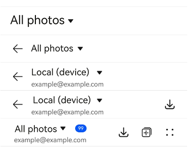
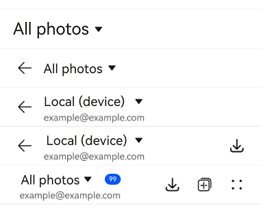
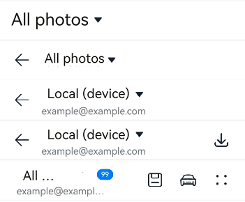

# SelectTitleBar

<!--Kit: ArkUI-->
<!--Subsystem: ArkUI-->
<!--Owner: @wangrunsen-->
<!--Designer: @YanSanzo-->
<!--Tester: @ybhou1993-->
<!--Adviser: @Brilliantry_Rui-->
<!-- md-trans-meta sourceCommit=4c495f520711bb7a7c0f878dd925391606600e97 translatedAt=2026-07-29T03:05:19.347Z pushedAt=2026-08-04T02:47:21.244Z -->

The dropdown menu title bar is a title bar component that includes a dropdown menu, supports quick switching between pages, and can be configured with a back button and right-side menu items. This component is suitable for scenarios where navigation and switching between different views or pages are required, and it supports first-level pages as well as second-level and higher-level interfaces. Using this component facilitates quick access to and switching between different content views, improving the convenience of page navigation and user experience.

> **NOTE**
>
> - This component is supported since API version 10. Updates will be marked with a superscript to indicate their earliest API version.
>
> - This component can be used only in the stage model.
>
> - If the **SelectTitleBar** component has [universal attributes](ts-component-general-attributes.md) and [universal events](ts-component-general-events.md) configured, the compiler toolchain automatically generates an additional \_\_Common\_\_ node and mounts the universal attributes and universal events on this node rather than the **SelectTitleBar** component itself. As a result, the configured universal attributes and universal events may fail to take effect or behave as intended. For this reason, avoid using universal attributes and events with the **SelectTitleBar** component.

## Modules to Import

```ts
import { SelectTitleBar } from '@kit.ArkUI';
```

## Child Components

Not supported

## SelectTitleBar

SelectTitleBar({selected: number, options: Array&lt;SelectOption&gt;, menuItems?: Array&lt;SelectTitleBarMenuItem&gt;, subtitle?: ResourceStr, badgeValue?: number, hidesBackButton?: boolean, onSelected?: ((index: number) =&gt; void)})

**Decorator**: \@Component

**Atomic service API**: This API can be used in atomic services since API version 11.

**System capability**: SystemCapability.ArkUI.ArkUI.Full

**Device behavior differences**: On wearables, calling this API results in a runtime exception indicating that the API is undefined. On other devices, the API works correctly.

| Name| Type| Mandatory| Decorator| Description|
| -------- | -------- | -------- | -------- | -------- |
| selected | number | Yes | \@Prop | Index of the currently selected item.<br>The index of the first item is 0, and the default value is **0**. |
| options | Array&lt;[SelectOption](ts-basic-components-select.md#selectoption)&gt; | Yes | - | Items in the dropdown menu. |
| menuItems | Array&lt;[SelectTitleBarMenuItem](#selecttitlebarmenuitem)&gt;              | No | - | List of menu items on the right side, which defines the menu items on the right side of the title bar. This parameter is passed when menu items need to be added on the right side. If not specified, the right-side menu area is not displayed. |
| subtitle | [ResourceStr](ts-types.md#resourcestr)                                      | No| - | Subtitle, used to display supplementary information. This parameter is passed to show the subtitle. If this parameter is not specified, the subtitle area is not displayed.|
| badgeValue | number                                                                      | No | - | New event badge, which displays a count on the menu icon on the right side of the title bar.<br>Value range: [-2147483648, 2147483647]. If the value exceeds the range, 4294967296 is added to or subtracted from it to bring it within the range. If the value is not an integer, the decimal part is truncated, for example, 5.5 becomes 5.<br>**NOTE**<br>If this parameter is not passed or is less than or equal to 0, the event badge is not displayed.<br>The maximum number of messages is 99. If the number exceeds the maximum, only 99+ is displayed. An excessively large value is considered abnormal, and the event badge is not displayed. |
| hidesBackButton | boolean                                                                     | No| - | Whether to hide the back arrow on the left.<br>Default value: **false**. **true** to hide, **false** to show.|
| onSelected | ((index:&nbsp;number)&nbsp;=&gt;&nbsp;void)                                   | No | - | Callback triggered when a dropdown menu item is selected. It passes the index of the selected item. This parameter is passed when specific business logic needs to be processed after a dropdown menu item is selected. If there is no specific business logic, this parameter can be omitted. |

> **NOTE**
> 
> The input parameter cannot be **undefined**, that is, calling **SelectTitleBar(undefined)** is not allowed.

## SelectTitleBarMenuItem

**System capability**: SystemCapability.ArkUI.ArkUI.Full

**Device behavior differences**: On wearables, calling this API results in a runtime exception indicating that the API is undefined. On other devices, the API works correctly.

| Name| Type| Read-Only| Optional| Description|
| -------- | -------- |---|---| -------- |
| value | [ResourceStr](ts-types.md#resourcestr) | No | No | Icon resource used to set the icon of the menu item on the right side of the title bar. It can be referenced through $r. When **symbolStyle** is also set, **symbolStyle** takes precedence.<br/>**Atomic service API:** This API can be used in atomic services since API version 11. |
| symbolStyle<sup>18+</sup> | [SymbolGlyphModifier](ts-universal-attributes-attribute-symbolglyphmodifier.md#symbolglyphmodifier) | No| Yes| Symbol icon resource, which has higher priority than **value**.<br>**Atomic service API**: This API can be used in atomic services since API version 18.|
| label<sup>13+</sup> | [ResourceStr](ts-types.md#resourcestr) | No | Yes | Icon label description, which can serve as the default value of **accessibilityText**. When both **label** and **accessibilityText** are set, **accessibilityText** takes precedence. When not set, there is no label by default.<br/>**Atomic service API:** This API can be used in atomic services since API version 13. |
| isEnabled | boolean | No | Yes | Whether to enable.<br>Default value: **false**. The value **true** enables the menu item, and **false** disables it (grayed out and not tappable).<br/>**Atomic service API:** This API can be used in atomic services since API version 11. |
| action | ()&nbsp;=&gt;&nbsp;void | No | Yes | Callback invoked when the custom button on the right is tapped. Developers can define custom operations to be executed after the button is tapped.<br/>**Atomic service API:** This API can be used in atomic services since API version 11. |
| accessibilityLevel<sup>18+</sup>       | string  | No | Yes | Accessibility level of the custom button on the right side of the title bar. It controls whether the current item can be recognized by accessibility services.<br/>Supported values:<br/>**"auto"**: The component is automatically converted to **"yes"** or **"no"** based on the specific situation.<br/>**"yes"**: The component can be recognized by accessibility services.<br/>**"no"**: The component cannot be recognized by accessibility services.<br/>**"no-hide-descendants"**: The component and all its child components cannot be recognized by accessibility services.<br/>Default value: **"auto"**.<br/>**Atomic service API:** This API can be used in atomic services since API version 18. |
| accessibilityText<sup>18+</sup>        | [ResourceStr](ts-types.md#resourcestr) | No | Yes | Accessibility text attribute of the custom button on the right side of the title bar. When a component does not contain a text attribute, the screen reader does not announce anything when this component is selected, and the user cannot clearly know which component is currently selected. To address this scenario, developers can set accessibility text for components that do not contain text information. When the screen reader selects this component, it announces the content of the accessibility text, helping screen reader users clearly know which component they have selected.<br/>Default value: when **label** is set, the default value is the content of the **label** attribute of the current item; when **label** is not set, the default value is a space character.<br/>**Atomic service API:** This API can be used in atomic services since API version 18.                                     |
| accessibilityDescription<sup>18+</sup> | [ResourceStr](ts-types.md#resourcestr) | No| Yes| Accessible description. You can provide comprehensive text explanations to help users understand the operation they are about to perform and its potential consequences, especially when these cannot be inferred from the component's attributes and accessibility text alone. If a component contains both text information and the accessible description, the text is announced first and then the accessible description, when the component is selected.<br>Default value: **"Double-tap to activate"**<br>**Atomic service API**: This API can be used in atomic services since API version 18.          |

## Events

The [universal events](ts-component-general-events.md) are not supported.

## Example

### Example 1: Implementing a Simple Drop-down Menu Title Bar

This example demonstrates how to implement a simple drop-down menu title bar with various configurations, including one with a back arrow and one with a right-side menu item list.

```ts
import { SelectTitleBar, Prompt, SelectTitleBarMenuItem } from '@kit.ArkUI';

@Entry
@Component
struct Index {
  // Define an array of menu items for the right side of the title bar.
  private menuItems: Array<SelectTitleBarMenuItem> =
    [
      {
        // Resource for the menu icon.
        value: $r('sys.media.ohos_save_button_filled'),
        // Enable the image.
        isEnabled: true,
        // Action triggered when the menu item is clicked.
        action: () => Prompt.showToast({ message: 'show toast index 1' }),
      },
      {
        value: $r('sys.media.ohos_ic_public_copy'),
        isEnabled: true,
        action: () => Prompt.showToast({ message: 'show toast index 2' }),
      },
      {
        value: $r('sys.media.ohos_ic_public_edit'),
        isEnabled: true,
        action: () => Prompt.showToast({ message: 'show toast index 3' }),
      },
      {
        value: $r('sys.media.ohos_ic_public_remove'),
        isEnabled: true,
        action: () => Prompt.showToast({ message: 'show toast index 4' }),
      },
    ]

  build() {
    Row() {
      Column() {
        Divider().height(2).color(0xCCCCCC)
        SelectTitleBar({
          // Define items in the drop-down list.
          options: [
            { value: 'All photos' },
            { value: 'Local (device)' },
            { value: 'Local (memory card)'}
          ],
          // Initially select the first item in the drop-down list.
          selected: 0,
          // Function triggered when the item is selected.
          onSelected: (index) => Prompt.showToast({ message: 'page index ' + index }),
          // Hide the back arrow on the left.
          hidesBackButton: true,
        })
        Divider().height(2).color(0xCCCCCC)
        SelectTitleBar({
          options: [
            { value: 'All photos' },
            { value: 'Local (device)' },
            { value: 'Local (memory card)' },
          ],
          selected: 0,
          onSelected: (index) => Prompt.showToast({ message: 'page index ' + index }),
          hidesBackButton: false,
        })
        Divider().height(2).color(0xCCCCCC)
        SelectTitleBar({
          options: [
            { value: 'All photos' },
            { value: 'Local (device)' },
            { value: 'Local (memory card)' },
          ],
          selected: 1,
          onSelected: (index) => Prompt.showToast({ message: 'page index ' + index }),
          subtitle: 'example@example.com',
        })
        Divider().height(2).color(0xCCCCCC)
        SelectTitleBar({
          options: [
            { value: 'All photos' },
            { value: 'Local (device)' },
            { value: 'Local (memory card)' },
          ],
          selected: 1,
          onSelected: (index) => Prompt.showToast({ message: 'page index ' + index }),
          subtitle: 'example@example.com',
          menuItems: [{ isEnabled: true, value: $r('sys.media.ohos_save_button_filled'),
            action: () => Prompt.showToast({ message: 'show toast index 1' }),
          }],
        })
        Divider().height(2).color(0xCCCCCC)
        SelectTitleBar({
          options: [
            { value: 'All photos' },
            { value: 'Local (device)' },
            { value: 'Local (memory card)' },
          ],
          selected: 0,
          onSelected: (index) => Prompt.showToast({ message: 'page index ' + index }),
          subtitle: 'example@example.com',
          menuItems: this.menuItems,
          badgeValue: 99,
          hidesBackButton: true,
        })
        Divider().height(2).color(0xCCCCCC)
      }.width('100%')
    }.height('100%')
  }
}
```



### Example 2: Implementing Screen Reader Announcement for the Custom Button on the Right Side

This example customizes the screen reader announcement text by setting the **accessibilityText**, **accessibilityDescription**, and **accessibilityLevel** properties of the custom button on the right side of the title bar. This functionality is supported since API version 18.

```ts
import { SelectTitleBar, Prompt, SelectTitleBarMenuItem } from '@kit.ArkUI';

@Entry
@Component
struct Index {
  // Define an array of menu items for the right side of the title bar.
  private menuItems: Array<SelectTitleBarMenuItem> =
    [
      {
        // Resource for the menu icon.
        value: $r('sys.media.ohos_save_button_filled'),
        // Enable the image.
        isEnabled: true,
        // Action triggered when the menu item is clicked.
        action: () => Prompt.showToast({ message: 'show toast index 1' }),
        // The screen reader will prioritize this text over the label.
        accessibilityText: 'Save',
        // The screen reader can focus on this item.
        accessibilityLevel: 'yes',
        // The screen reader will ultimately announce this text.
        accessibilityDescription: 'Tap to save the current content',
      },
      {
        value: $r('sys.media.ohos_ic_public_copy'),
        isEnabled: true,
        action: () => Prompt.showToast({ message: 'show toast index 2' }),
        accessibilityText: 'Copy',
        // The screen reader will not focus on this item.
        accessibilityLevel: 'no',
        accessibilityDescription: 'Tap to copy the current content',
      },
      {
        value: $r('sys.media.ohos_ic_public_edit'),
        isEnabled: true,
        action: () => Prompt.showToast({ message: 'show toast index 3' }),
        accessibilityText: 'Edit',
        accessibilityLevel: 'yes',
        accessibilityDescription: 'Tap to edit the current content',
      },
      {
        value: $r('sys.media.ohos_ic_public_remove'),
        isEnabled: true,
        action: () => Prompt.showToast({ message: 'show toast index 4' }),
        accessibilityText: 'Remove',
        accessibilityLevel: 'yes',
        accessibilityDescription: 'Tap to remove the current content',
      }
    ]

  build() {
    Row() {
      Column() {
        Divider().height(2).color(0xCCCCCC)
        SelectTitleBar({
          // Define items in the drop-down list.
          options: [
            { value: 'All photos' },
            { value: 'Local (device)' },
            { value: 'Local (memory card)' },
          ],
          // Initially select the first item in the drop-down list.
          selected: 0,
          // Function triggered when the item is selected.
          onSelected: (index) => Prompt.showToast({ message: 'page index ' + index }),
          // Hide the back arrow on the left.
          hidesBackButton: true,
        })
        Divider().height(2).color(0xCCCCCC)
        SelectTitleBar({
          options: [
            { value: 'All photos' },
            { value: 'Local (device)' },
            { value: 'Local (memory card)' },
          ],
          selected: 0,
          onSelected: (index) => Prompt.showToast({ message: 'page index ' + index }),
          hidesBackButton: false,
        })
        Divider().height(2).color(0xCCCCCC)
        SelectTitleBar({
          options: [
            { value: 'All photos' },
            { value: 'Local (device)' },
            { value: 'Local (memory card)' },
          ],
          selected: 1,
          onSelected: (index) => Prompt.showToast({ message: 'page index ' + index }),
          subtitle: 'example@example.com',
        })
        Divider().height(2).color(0xCCCCCC)
        SelectTitleBar({
          options: [
            { value: 'All photos' },
            { value: 'Local (device)' },
            { value: 'Local (memory card)' },
          ],
          selected: 1,
          onSelected: (index) => Prompt.showToast({ message: 'page index ' + index }),
          subtitle: 'example@example.com',
          menuItems: [{ isEnabled: true, value: $r('sys.media.ohos_save_button_filled'),
            action: () => Prompt.showToast({ message: 'show toast index 1' }),
          }],
        })
        Divider().height(2).color(0xCCCCCC)
        SelectTitleBar({
          options: [
            { value: 'All photos' },
            { value: 'Local (device)' },
            { value: 'Local (memory card)' },
          ],
          selected: 0,
          onSelected: (index) => Prompt.showToast({ message: 'page index ' + index }),
          subtitle: 'example@example.com',
          menuItems: this.menuItems,
          badgeValue: 99,
          hidesBackButton: true,
        })
        Divider().height(2).color(0xCCCCCC)
      }.width('100%')
    }.height('100%')
  }
}
```



### Example 3: Setting the Symbol Icon

This example demonstrates how to use **symbolStyle** in **SelectTitleBarMenuItem** to set custom symbol icons. This functionality is supported since API version 18.

```ts
import { SelectTitleBar, Prompt, SelectTitleBarMenuItem, SymbolGlyphModifier } from '@kit.ArkUI';

@Entry
@Component
struct Index {
  // Define an array of menu items for the right side of the title bar.
  private menuItems: Array<SelectTitleBarMenuItem> =
    [
      {
        // Image resource. (When both value and symbolStyle are set, symbolStyle takes precedence.)
        value: $r('sys.media.ohos_save_button_filled'),
        // Symbol icon resource. (Takes precedence over value.)
        symbolStyle: new SymbolGlyphModifier($r('sys.symbol.save')),
        // Enable the image.
        isEnabled: true,
        // Action triggered when the menu item is clicked.
        action: () => Prompt.showToast({ message: 'show toast index 1' }),
        // The screen reader will prioritize this text over the label.
        accessibilityText: 'Save',
        // The screen reader can focus on this item.
        accessibilityLevel: 'yes',
        // The screen reader will ultimately announce this text.
        accessibilityDescription: 'Tap to save the current content',
      },
      {
        value: $r('sys.media.ohos_ic_public_copy'),
        symbolStyle: new SymbolGlyphModifier($r('sys.symbol.car')),
        isEnabled: true,
        action: () => Prompt.showToast({ message: 'show toast index 2' }),
        accessibilityText: 'Copy',
        // The screen reader will not focus on this item.
        accessibilityLevel: 'no',
        accessibilityDescription: 'Tap to copy the current content',
      },
      {
        value: $r('sys.media.ohos_ic_public_edit'),
        symbolStyle: new SymbolGlyphModifier($r('sys.symbol.ai_edit')),
        isEnabled: true,
        action: () => Prompt.showToast({ message: 'show toast index 3' }),
        accessibilityText: 'Edit',
        accessibilityLevel: 'yes',
        accessibilityDescription: 'Tap to edit the current content',
      },
      {
        value: $r('sys.media.ohos_ic_public_remove'),
        symbolStyle: new SymbolGlyphModifier($r('sys.symbol.remove_songlist')),
        isEnabled: true,
        action: () => Prompt.showToast({ message: 'show toast index 4' }),
        accessibilityText: 'Remove',
        accessibilityLevel: 'yes',
        accessibilityDescription: 'Tap to remove the current content',
      }
    ]

  build() {
    Row() {
      Column() {
        Divider().height(2).color(0xCCCCCC)
        SelectTitleBar({
          // Define items in the drop-down list.
          options: [
            { value: 'All photos' },
            { value: 'Local (device)' },
            { value: 'Local (memory card)' },
          ],
          // Initially select the first item in the drop-down list.
          selected: 0,
          // Function triggered when the item is selected.
          onSelected: (index) => Prompt.showToast({ message: 'page index ' + index }),
          // Hide the back arrow on the left.
          hidesBackButton: true,
        })
        Divider().height(2).color(0xCCCCCC)
        SelectTitleBar({
          options: [
            { value: 'All photos' },
            { value: 'Local (device)' },
            { value: 'Local (memory card)' },
          ],
          selected: 0,
          onSelected: (index) => Prompt.showToast({ message: 'page index ' + index }),
          hidesBackButton: false,
        })
        Divider().height(2).color(0xCCCCCC)
        SelectTitleBar({
          options: [
            { value: 'All photos' },
            { value: 'Local (device)' },
            { value: 'Local (memory card)' },
          ],
          selected: 1,
          onSelected: (index) => Prompt.showToast({ message: 'page index ' + index }),
          subtitle: 'example@example.com',
        })
        Divider().height(2).color(0xCCCCCC)
        SelectTitleBar({
          options: [
            { value: 'All photos' },
            { value: 'Local (device)' },
            { value: 'Local (memory card)' },
          ],
          selected: 1,
          onSelected: (index) => Prompt.showToast({ message: 'page index ' + index }),
          subtitle: 'example@example.com',
          menuItems: [{
            isEnabled: true, value: $r('sys.media.ohos_save_button_filled'),
            action: () => Prompt.showToast({ message: 'show toast index 1' }),
          }],
        })
        Divider().height(2).color(0xCCCCCC)
        SelectTitleBar({
          options: [
            { value: 'All photos' },
            { value: 'Local (device)' },
            { value: 'Local (memory card)' },
          ],
          selected: 0,
          onSelected: (index) => Prompt.showToast({ message: 'page index ' + index }),
          subtitle: 'example@example.com',
          menuItems: this.menuItems,
          badgeValue: 99,
          hidesBackButton: true,
        })
        Divider().height(2).color(0xCCCCCC)
      }.width('100%')
    }.height('100%')
  }
}
```

